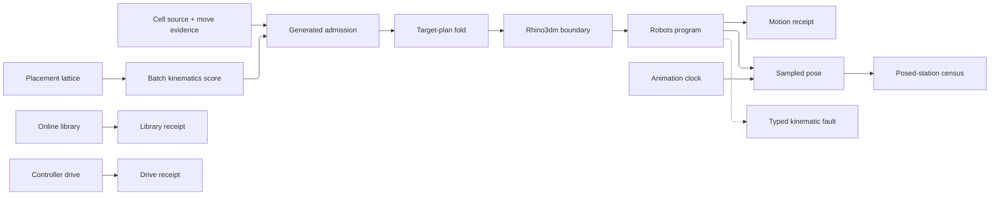

# [RASM_FABRICATION_ROBOT_CELL]

`RobotCell` owns serial-chain robot motion from admitted cell identity and canonical `Move` evidence through `Robots.Program` planning to the frozen `FabricationResult.Motion` wire. `CellTargetPlan` generates the waypoint space from one policy case or admits exact per-waypoint rows, so Cartesian and joint goals, posture, process interpolation, work frames, tools, commands, external mechanisms, custom external values, initialization groups, file partitions, and post overrides remain data under one `RobotProgram.Run` seam. Generated rows read their tool axis from the same `ToolAxisDemand` the machine inverse consumes, so a cell and a machine tool resolve one orientation law rather than two.

`RobotBoundary` is the only crossing between kernel RhinoCommon geometry and the Rhino3dm geometry `Robots` consumes, and the only projection of provider evidence onto the atoms floor: `RobotBoundary.Ingress` turns a loaded cell's mechanical groups into the provider-free `MachineIngress.Robot` rows `Process/family` admits. `CellPlacementAxis` generates a six-axis base-pose lattice over one loaded `RobotSystem`, and `CellPlacementMetric` scores each batch solve on feasibility, excursion, and continuity evidence. `CellClock` samples the planned duration, so the animation lane resolves the pose between waypoints and hands `Verify/simulate.md` a provider-free census. `CellLibrary.Run` and `CellDrive.Run` bracket their effects, and no provider type reaches `FabricationInput` or `FabricationResult`.

## [01]-[INDEX]

- [02]-[ROBOT_CELL]: owns generated cell admission, target-plan, placement-space, and animation-clock generation, the Rhino3dm boundary, `Robots` batch kinematics and compilation, the sampled pose census, typed diagnostics, online-library custody, controller drive, and the modality-polymorphic `RobotProgram.Run`.

## [02]-[ROBOT_CELL]

- Owner: `CellSource` closes library and embedded XML ingress; `RobotCell` admits source, base frame, and default TCP; `CellGoal` closes Cartesian and joint targets; generated `CellWaypoint` admits every per-occurrence target property; `CellTargetPlan` closes generated and explicit target series and derives both through one waypoint fold; `CellPolicy` admits compilation, dynamics, and inverse policy; `CellPlacementAxis` and `CellSampling` generate the search lattice; `CellTimebase` and `CellClock` generate the animation lattice off that same sampler; `CellPlacementMetric` and `CellPlacementPolicy` own scoring, `CellPlacementPolicy.Burden` the one normalized weighted fold; `CellProgramRequest` and `CellProgramReceipt` collapse solve, placement, and animation modalities under one entry; `CellStation` and `CellMotion` retain per-waypoint provider evidence through frozen projection, `CellPosedStation` and `CellAnimation` retain the between-waypoint pose census; `CellLibrary` and `CellDrive` own their effectful boundaries.
- Cases: `CellTargetPlan.Generated` derives one waypoint per admitted `Move` from a `CellInterpolation` row, a combinable `CellPosture` set, and a `ToolAxisDemand` resolved per waypoint index. `CellTargetPlan.Explicit` admits one `CellWaypoint` per move, and each waypoint selects `CellGoal.Cartesian` or `CellGoal.Joint` while carrying optional `Frame`, `Tool`, `Speed`, `Zone`, and `Command` values with coordinated external axes. Both cases converge on one waypoint series, so target projection, cardinality proof, and per-index fault detail are stated once. `CellTimebase.Normalized` and `CellTimebase.Elapsed` carry the provider's own `isNormalized` argument beside the span each derives from the planned duration, so the sample horizon is read, never asserted, and a bare boolean never selects between two sampling bodies.
- Entry: `RobotProgram.Run(RobotCell, Seq<Move>, CellProgramRequest)` dispatches `CellProgramRequest.Motion`, `CellProgramRequest.Placement`, and `CellProgramRequest.Animation` over one cell and move admission. `CellLibrary.Run` closes refresh, download, and removal through one bracketed `IO<CellLibraryReceipt>`, while `CellDrive.Run(RobotSystem)` closes upload, play, and pause through one `IO<CellDriveReceipt>` over the system's own `Remote` channel.
- Auto: aggregate admission accumulates independent `Move.Admit` failures, validates exact waypoint cardinality, enforces joint-vector and external-axis finiteness, and validates program partition indices before any provider constructor runs. One `Plan` fold loads, resolves, and compiles for every modality that needs a program, so the motion and animation lanes share one compilation and the placement lane keeps its own lattice load because it rebases `RobotSystem.BasePlane` per candidate rather than compiling per candidate. `Program` owns look-ahead timing and manufacturer emission; the animation lane gates on `Program.HasSimulation` before reading `CurrentSimulationPose`, which throws where the planner produced no simulation. Unclassified `KinematicSolution.Errors` remain provider diagnostics and never fabricate a `JointFault` witness, and an absent controller channel fails typed rather than dereferencing a null remote.
- Receipt: `CellProgramReceipt.Motion` carries the frozen `FabricationResult.Motion` move, joint, duration, and cell-code wire beside the `CellMotion` evidence that produced it, so per-station flange poses, realized configurations per `MechanicalGroup`, segment durations, and warnings reach the consumer instead of dying at the projection. `CellProgramReceipt.Placement` retains the selected cell with every ranked candidate and its keyed metrics, ranked by the same normalized lower-is-better burden `Score` polarity `MachineMatch` carries. `CellProgramReceipt.Animation` retains `Program.Duration` as the cycle and one `CellPosedStation` per sampled instant carrying the provider's clock reading, the per-group flange planes, the elapsed and travel measured against the prior posed station, the posed-mesh occupancy box, and that station's solver diagnostics. `CellLibraryReceipt` and `CellDriveReceipt` retain boundary facts without widening the motion wire; the upload arm preserves the posting-owned artifact key beside the exact `Robots.Program` handed to the controller, so `Posting/dialect` binds post-to-machine custody by digest equality with no second identity mint.
- Packages: `Robots` owns cell loading, Cartesian and joint targets, `RobotSystem.Kinematics`, `RobotSystem.BasePlane`, `PlaneToNumbers`/`NumbersToPlane`, `IndustrialSystem.MechanicalGroups` with its per-link `Joint.Range`/`MaxSpeed` travel, program planning, posts, remotes, and online libraries; `Rhino3dm` stays behind `extern alias R3`; `MathNet.Numerics` owns lattice spacing and placement excursion; NodaTime owns `Duration`; RhinoCommon owns frames, intervals, and transforms; UnitsNet owns feed and angular-rate conversion at the provider boundary; `Thinktecture.Runtime.Extensions` owns generated admission and dispatch; `LanguageExt.Core` owns traversal, typed faults, immutable rows, `IO`, and bracketed lifetime; `Process/owner.md`, `Process/faults.md`, and `Kinematics/machine.md` supply frozen atoms.
- Growth: a robot motion posture is one `CellInterpolation` row, a target modality is one `CellGoal` case, a target-series policy is one `CellTargetPlan` case, an orientation modality is one `ToolAxisDemand` case on the machine owner, a base-search dimension is one `CellPlacementAxis` row, a placement objective is one `CellPlacementMetric` row with its `CellPlacementPolicy` weight and normalization reference, a sampling clock is one `CellTimebase` row, a solve modality is one `CellProgramRequest` case with its `CellProgramReceipt` twin, a controller verb is one `CellDrive` case, and an online-library verb is one `CellLibrary` case. Multi-mechanism programs remain one aligned target stream per `MechanicalGroup`, and external-axis values stay on each waypoint.
- Boundary: `RobotProgram` owns robot-cell kinematics, provider compilation, and the animated pose census `Verify/simulate.md` consumes, so no sibling page imports `Robots`; `MachineTool` owns non-robot topology and motion dynamics; swept cutter and holder collision stay on `Toolpath/guard.md`; CNC AST lowering stays on `Posting/program.md`. `CellWaypoint.Project`, `RobotProgram.PlaceCell`, `RobotProgram.Rebase`, and `RobotProgram.Pose` are provider-boundary statement exemptions because provider target construction, RhinoCommon plane mutation, the `ref`-returning `BasePlane` assignment, and the animate-then-read simulation cursor are imperative seams. Provider strings never select a typed fault, provider geometry never crosses the alias boundary — posed meshes leave as one kernel occupancy box and a mesh count — and no verb family grows beside `RobotProgram.Run`. `RobotBoundary.Ingress` is the one provider-to-atoms projection: `MechanicalGroup`, `Joint`, and `Manufacturers` stay inside it and `MachineIngress.Robot` rows leave, so the vendor correspondence and the joint-travel units are settled once, here.

```csharp signature
extern alias R3;

using LanguageExt;
using LanguageExt.Common;
using Rasm.Domain;
using MathNet.Numerics;
using NodaTime;
using Rasm.Fabrication.Process;
using Rhino.Geometry;
using Robots;
using Robots.Commands;
using Thinktecture;
using static LanguageExt.Prelude;

namespace Rasm.Fabrication.Kinematics;

// --- [TYPES] --------------------------------------------------------------------------------------------------------------------------------------
[SmartEnum<string>]
public sealed partial class CellMesh {
    public static readonly CellMesh Headless = new("headless", load: false);
    public static readonly CellMesh Visual = new("visual", load: true);

    public bool Load { get; }
}

[SmartEnum<string>]
public sealed partial class CellInterpolation {
    public static readonly CellInterpolation Joint = new("joint", Motions.Joint);
    public static readonly CellInterpolation Linear = new("linear", Motions.Linear);
    public static readonly CellInterpolation Process = new("process", Motions.Process);

    internal Motions Native { get; }
}

[SmartEnum<string>]
public sealed partial class CellPosture {
    public static readonly CellPosture Shoulder = new("shoulder", RobotConfigurations.Shoulder);
    public static readonly CellPosture Elbow = new("elbow", RobotConfigurations.Elbow);
    public static readonly CellPosture Wrist = new("wrist", RobotConfigurations.Wrist);

    internal RobotConfigurations Native { get; }

    internal static Option<RobotConfigurations> Project(Set<CellPosture> posture) =>
        posture.IsEmpty
            ? None
            : Some(posture.Fold(RobotConfigurations.None, static (combined, row) => combined | row.Native));
}

[SmartEnum<string>]
public sealed partial class CellTimebase {
    public static readonly CellTimebase Normalized = new(
        "normalized", native: true, span: static _ => new Rhino.Geometry.Interval(0.0, 1.0));
    public static readonly CellTimebase Elapsed = new(
        "elapsed", native: false, span: static seconds => new Rhino.Geometry.Interval(0.0, seconds));

    internal bool Native { get; }
    internal Func<double, Rhino.Geometry.Interval> Span { get; }
}

[SmartEnum<string>]
public sealed partial class CellDriveKind {
    public static readonly CellDriveKind Uploaded = new("uploaded");
    public static readonly CellDriveKind Playing = new("playing");
    public static readonly CellDriveKind Paused = new("paused");
}

[SmartEnum<string>]
public sealed partial class CellPlacementAxis {
    public static readonly CellPlacementAxis X = new(
        "x", order: 0, project: static (frame, value) => Transform.Translation(value * frame.XAxis));
    public static readonly CellPlacementAxis Y = new(
        "y", order: 1, project: static (frame, value) => Transform.Translation(value * frame.YAxis));
    public static readonly CellPlacementAxis Z = new(
        "z", order: 2, project: static (frame, value) => Transform.Translation(value * frame.ZAxis));
    public static readonly CellPlacementAxis Roll = new(
        "roll", order: 3, project: static (frame, value) => Transform.Rotation(value, frame.XAxis, frame.Origin));
    public static readonly CellPlacementAxis Pitch = new(
        "pitch", order: 4, project: static (frame, value) => Transform.Rotation(value, frame.YAxis, frame.Origin));
    public static readonly CellPlacementAxis Yaw = new(
        "yaw", order: 5, project: static (frame, value) => Transform.Rotation(value, frame.ZAxis, frame.Origin));

    public int Order { get; }
    internal Func<Plane, double, Transform> Project { get; }
}

[SmartEnum<string>]
public sealed partial class CellPlacementMetric {
    public static readonly CellPlacementMetric Feasibility = new(
        "feasibility",
        measure: static solutions => solutions.Sum(static solution => solution.Errors.Count));
    public static readonly CellPlacementMetric Travel = new(
        "travel",
        measure: static solutions => Steps(solutions).Sum());
    public static readonly CellPlacementMetric Posture = new(
        "posture",
        measure: static solutions => solutions.Zip(solutions.Skip(1))
            .Count(static pair => pair.Item1.Configuration != pair.Item2.Configuration));
    public static readonly CellPlacementMetric PeakStep = new(
        "peak-step",
        measure: static solutions => Steps(solutions).Fold(0.0, static (peak, step) => Math.Max(peak, step)));
    public static readonly CellPlacementMetric PeakJoint = new(
        "peak-joint",
        measure: static solutions => solutions
            .Bind(static solution => toSeq(solution.Joints))
            .Fold(0.0, static (peak, joint) => Math.Max(peak, Math.Abs(joint))));

    internal Func<Seq<KinematicSolution>, double> Measure { get; }

    private static Seq<double> Steps(Seq<KinematicSolution> solutions) =>
        solutions.Map(static solution => solution.Joints)
            .Zip(solutions.Skip(1).Map(static solution => solution.Joints))
            .Map(static pair => Distance.Manhattan(pair.Item1, pair.Item2));
}

[Union(ConversionFromValue = ConversionOperatorsGeneration.None)]
public abstract partial record CellSource {
    private CellSource() { }

    public sealed record Library(string Name, CellMesh Meshes) : CellSource;
    public sealed record Embedded(string Xml) : CellSource;
}

[Union(ConversionFromValue = ConversionOperatorsGeneration.None)]
public abstract partial record CellGoal {
    private CellGoal() { }

    public sealed record Cartesian(Option<Plane> Pose, Set<CellPosture> Posture, CellInterpolation Interpolation) : CellGoal;
    public sealed record Joint(Arr<double> Joints) : CellGoal;
}

[Union(ConversionFromValue = ConversionOperatorsGeneration.None)]
public abstract partial record CellTargetPlan {
    private CellTargetPlan() { }

    public sealed record Generated(CellInterpolation Feed, Set<CellPosture> Posture, ToolAxisDemand Orientation) : CellTargetPlan;
    public sealed record Explicit(Seq<CellWaypoint> Rows) : CellTargetPlan;

    internal bool IsValid => Switch(
        generated: static row => row.Feed is not null
            && row.Orientation is not null
            && row.Orientation.IsValid
            && row.Posture.ForAll(static posture => posture is not null),
        explicit: static row => !row.Rows.IsEmpty && row.Rows.ForAll(static waypoint => waypoint is not null));

    internal Fin<Seq<Target>> Resolve(RobotCell cell, Seq<Move> moves, MotionDynamics dynamics, InversePolicy inverse) =>
        Rows(cell, moves, inverse).Bind(rows => rows
            .Map((row, index) => (Row: row, Move: moves[index]))
            .TraverseM(pair => Capture(pair.Row, cell, pair.Move, dynamics))
            .As());

    private Fin<Seq<CellWaypoint>> Rows(RobotCell cell, Seq<Move> moves, InversePolicy inverse) => Switch(
        state: (Cell: cell, Moves: moves, Inverse: inverse),
        generated: static (state, plan) => state.Moves
            .Map((move, index) => (Move: move, Index: index))
            .Traverse(row => CellWaypoint.Generated(row.Move, row.Index, plan, state.Cell, state.Inverse).ToValidation())
            .As()
            .ToFin(),
        explicit: static (state, plan) => plan.Rows.Count == state.Moves.Count
            ? Fin.Succ(plan.Rows)
            : Fin.Fail<Seq<CellWaypoint>>(new FabricationFault.PolicyInadmissible(FabConcern.Kinematics, "robot-cell:target-census")));

    private static Fin<Target> Capture(CellWaypoint waypoint, RobotCell cell, Move move, MotionDynamics dynamics) =>
        Try.lift(() => waypoint.Project(cell, move, dynamics)).Run()
            .MapFail(static error => new FabricationFault.PolicyInadmissible(FabConcern.Kinematics, $"robot-cell:target:{error.Message}"));
}

[Union(ConversionFromValue = ConversionOperatorsGeneration.None)]
public abstract partial record CellProgramRequest {
    private CellProgramRequest() { }

    public sealed record Motion(CellPolicy Policy) : CellProgramRequest;
    public sealed record Placement(CellPolicy Policy, CellPlacementPolicy Search) : CellProgramRequest;
    public sealed record Animation(CellPolicy Policy, CellClock Clock) : CellProgramRequest;
}

[Union(ConversionFromValue = ConversionOperatorsGeneration.None)]
public abstract partial record CellProgramReceipt {
    private CellProgramReceipt() { }

    public sealed record Motion(FabricationResult.Motion Result, CellMotion Evidence) : CellProgramReceipt;
    public sealed record Placement(CellPlacementReceipt Result) : CellProgramReceipt;
    public sealed record Animation(CellAnimation Result) : CellProgramReceipt;
}

[Union(ConversionFromValue = ConversionOperatorsGeneration.None)]
public abstract partial record CellLibrary {
    private CellLibrary() { }

    public sealed record Refresh : CellLibrary;
    public sealed record Download(LibraryItem Item) : CellLibrary;
    public sealed record Remove(LibraryItem Item) : CellLibrary;

    public IO<CellLibraryReceipt> Run() =>
        IO.lift(static () => new OnlineLibrary()).Bracket(
            Use: library => Switch(
                state: library,
                refresh: static (source, _) => IO.liftAsync(async () => {
                    await source.UpdateLibraryAsync().ConfigureAwait(false);
                    return new CellLibraryReceipt(toSeq(source.Libraries.Keys));
                }),
                download: static (source, action) => IO.liftAsync(async () => {
                    await source.DownloadLibraryAsync(action.Item).ConfigureAwait(false);
                    return new CellLibraryReceipt(toSeq(source.Libraries.Keys));
                }),
                remove: static (source, action) => IO.lift(() => {
                    source.RemoveDownloadedLibrary(action.Item);
                    return new CellLibraryReceipt(toSeq(source.Libraries.Keys));
                })),
            Fin: static library => IO.lift(library.Dispose));
}

[Union(ConversionFromValue = ConversionOperatorsGeneration.None)]
public abstract partial record CellDrive {
    private CellDrive() { }

    public sealed record Upload(
        Program Program,
        ContentKey Artifact,
        Func<Program, ReadOnlyMemory<byte>> Canonicalize) : CellDrive;
    public sealed record Play : CellDrive;
    public sealed record Pause : CellDrive;

    // Delivery custody preserves the posting-owned artifact key at the controller channel.
    public IO<CellDriveReceipt> Run(RobotSystem system) =>
        IO.lift(() => Optional(system).Bind(static host => Optional(host.Remote)))
            .Bind(channel => channel.Match(
                Some: remote => Switch(
                    state: remote,
                    upload: static (drive, action) => action.Program is not null
                        && action.Artifact is { Kind: var kind } && kind == EgressKind.CutProgram
                        && action.Canonicalize is not null
                            ? IO.lift(() => action.Canonicalize(action.Program))
                                .Bind(bytes => ContentKey.Of(EgressKind.CutProgram, bytes.Span) is var transferred
                                    && transferred.Digest == action.Artifact.Digest
                                        ? IO.lift(() => {
                                            drive.Upload(action.Program);
                                            return new CellDriveReceipt(
                                                CellDriveKind.Uploaded,
                                                toSeq(drive.Log),
                                                Some(transferred),
                                                Optional(drive.IP));
                                        })
                                        : IO.fail<CellDriveReceipt>(
                                            new FabricationFault.PolicyInadmissible(
                                                FabConcern.Kinematics,
                                                "robot-cell:upload-digest")))
                            : IO.fail<CellDriveReceipt>(
                                new FabricationFault.PolicyInadmissible(FabConcern.Kinematics, "robot-cell:upload-artifact")),
                    play: static (drive, _) => IO.lift(() => {
                        drive.Play();
                        return new CellDriveReceipt(CellDriveKind.Playing, toSeq(drive.Log), None, Optional(drive.IP));
                    }),
                    pause: static (drive, _) => IO.lift(() => {
                        drive.Pause();
                        return new CellDriveReceipt(CellDriveKind.Paused, toSeq(drive.Log), None, Optional(drive.IP));
                    })),
                None: () => IO.fail<CellDriveReceipt>(
                    new FabricationFault.PolicyInadmissible(FabConcern.Kinematics, "robot-cell:remote-absent"))));
}

// --- [MODELS] -------------------------------------------------------------------------------------------------------------------------------------
[ComplexValueObject]
public sealed partial class RobotCell {
    public CellSource Source { get; }
    public Plane BaseFrame { get; }
    public Plane ToolFrame { get; }

    [BoundaryAdapter]
    static partial void ValidateFactoryArguments(
        ref ValidationError? validationError,
        ref CellSource source,
        ref Plane baseFrame,
        ref Plane toolFrame) {
        bool sourceValid = source is not null && source.Switch(
            library: static row => row.Meshes is not null && !string.IsNullOrWhiteSpace(row.Name),
            embedded: static row => !string.IsNullOrWhiteSpace(row.Xml));
        if (!sourceValid || !baseFrame.IsValid || !toolFrame.IsValid)
            validationError = new ValidationError("robot cell source and frames must be valid");
    }

    internal Fin<RobotSystem> Load(Option<IPostProcessor> post) => Source.Switch(
        state: (Base: RobotBoundary.ToR3(BaseFrame), Post: post.IfNoneUnsafe((IPostProcessor?)null)),
        library: static (state, row) => Capture(() => FileIO.LoadRobotSystem(row.Name, state.Base, row.Meshes.Load, state.Post)),
        embedded: static (state, row) => Capture(() => FileIO.ParseRobotSystem(row.Xml, state.Base, state.Post)));

    private static Fin<RobotSystem> Capture(Func<RobotSystem> load) =>
        Try.lift(load).Run().MapFail(static error => new FabricationFault.PolicyInadmissible(FabConcern.Kinematics, $"robot-cell:load:{error.Message}"));
}

[ComplexValueObject]
public sealed partial class CellWaypoint {
    public CellGoal Goal { get; }
    public Option<Frame> Frame { get; }
    public Option<Tool> Tool { get; }
    public Option<Speed> Speed { get; }
    public Option<Zone> Zone { get; }
    public Option<Command> Command { get; }
    public Arr<double> External { get; }
    public Arr<string> ExternalCustom { get; }

    internal static Fin<CellWaypoint> Generated(Move move, int index, CellTargetPlan.Generated plan, RobotCell cell, InversePolicy inverse) =>
        plan.Orientation
            .AxisAt(index, cell.ToolFrame, inverse.ConeSamples)
            .Map(axis => new Plane(move.Target, axis))
            .Map(pose => Create(
                goal: new CellGoal.Cartesian(
                    Some(pose),
                    plan.Posture,
                    move is Move.Rapid ? CellInterpolation.Joint : plan.Feed),
                frame: None,
                tool: None,
                speed: None,
                zone: None,
                command: None,
                external: [],
                externalCustom: []));

    [BoundaryAdapter]
    static partial void ValidateFactoryArguments(
        ref ValidationError? validationError,
        ref CellGoal goal,
        ref Option<Frame> frame,
        ref Option<Tool> tool,
        ref Option<Speed> speed,
        ref Option<Zone> zone,
        ref Option<Command> command,
        ref Arr<double> external,
        ref Arr<string> externalCustom) {
        bool goalValid = goal is not null && goal.Switch(
            cartesian: static row => row.Interpolation is not null
                && row.Pose.ForAll(static pose => pose.IsValid)
                && row.Posture.ForAll(static posture => posture is not null),
            joint: static row => !row.Joints.IsEmpty && row.Joints.ForAll(double.IsFinite));
        bool optionPayloads = frame.ForAll(static value => value is not null)
            && tool.ForAll(static value => value is not null)
            && speed.ForAll(static value => value is not null)
            && zone.ForAll(static value => value is not null)
            && command.ForAll(static value => value is not null);
        if (!goalValid || !optionPayloads || external.Exists(static value => !double.IsFinite(value))
            || externalCustom.Exists(string.IsNullOrWhiteSpace))
            validationError = new ValidationError("robot cell waypoint must carry a valid goal, provider properties, and external axes");
    }

    internal Target Project(RobotCell cell, Move move, MotionDynamics dynamics) {
        Robots.Tool tool = Tool.IfNone(Robots.Tool.Default with { Tcp = RobotBoundary.ToR3(cell.ToolFrame) });
        Robots.Speed speed = Speed.IfNone(RobotBoundary.SpeedOf(dynamics, move));
        Robots.Zone zone = Zone.IfNone(RobotBoundary.ZoneOf(dynamics));
        Robots.Frame frame = Frame.IfNone(Robots.Frame.Default);
        Robots.Command command = Command.IfNone(Robots.Command.Default);
        double[]? external = External.IsEmpty ? null : External.ToArray();
        string[]? externalCustom = ExternalCustom.IsEmpty ? null : ExternalCustom.ToArray();
        return Goal.Switch(
            state: (Cell: cell, Move: move, Tool: tool, Speed: speed, Zone: zone, Frame: frame, Command: command, External: external, Custom: externalCustom),
            cartesian: static (state, goal) => new CartesianTarget(
                plane: RobotBoundary.ToR3(goal.Pose.IfNone(new Plane(state.Move.Target, state.Cell.ToolFrame.XAxis, state.Cell.ToolFrame.YAxis))),
                configuration: CellPosture.Project(goal.Posture).Map(static value => (RobotConfigurations?)value).IfNone((RobotConfigurations?)null),
                motion: goal.Interpolation.Native,
                tool: state.Tool,
                speed: state.Speed,
                zone: state.Zone,
                command: state.Command,
                frame: state.Frame,
                external: state.External,
                externalCustom: state.Custom),
            joint: static (state, goal) => new JointTarget(
                joints: goal.Joints.ToArray(),
                tool: state.Tool,
                speed: state.Speed,
                zone: state.Zone,
                command: state.Command,
                frame: state.Frame,
                external: state.External,
                externalCustom: state.Custom));
    }

}

[ComplexValueObject]
public sealed partial class CellPolicy {
    public MotionDynamics Dynamics { get; }
    public InversePolicy Inverse { get; }
    public CellTargetPlan Targets { get; }
    public string ProgramName { get; }
    public Option<Group> Init { get; }
    public Arr<int> MultiFileIndices { get; }
    public Option<IPostProcessor> Post { get; }

    public static CellPolicy Canonical { get; } = Create(
        dynamics: MotionDynamics.Canonical,
        inverse: InversePolicy.Canonical,
        targets: new CellTargetPlan.Generated(
            CellInterpolation.Linear,
            Set<CellPosture>(),
            new ToolAxisDemand.Fixed(-Vector3d.ZAxis)),
        programName: nameof(RobotProgram),
        init: None,
        multiFileIndices: [],
        post: None);

    [BoundaryAdapter]
    static partial void ValidateFactoryArguments(
        ref ValidationError? validationError,
        ref MotionDynamics dynamics,
        ref InversePolicy inverse,
        ref CellTargetPlan targets,
        ref string programName,
        ref Option<Group> init,
        ref Arr<int> multiFileIndices,
        ref Option<IPostProcessor> post) {
        programName = programName?.Trim() ?? string.Empty;
        bool partitions = multiFileIndices.IsEmpty || multiFileIndices[0] == 0
            && multiFileIndices.ForAll(static index => index >= 0)
            && multiFileIndices.Zip(multiFileIndices.Skip(1)).ForAll(static pair => pair.Item1 < pair.Item2);
        bool optionPayloads = init.ForAll(static group => group is not null) && post.ForAll(static processor => processor is not null);
        if (dynamics is null || inverse is null || targets is null || !targets.IsValid
            || !Program.IsValidIdentifier(programName, out _) || !partitions || !optionPayloads)
            validationError = new ValidationError("robot cell policy must carry valid dynamics, targets, program identity, and partitions");
    }
}

[ComplexValueObject]
public sealed partial class CellSampling {
    public Rhino.Geometry.Interval Domain { get; }
    public int Count { get; }

    internal Seq<double> Values => Count == 1
        ? Seq(0.5 * (Domain.Min + Domain.Max))
        : toSeq(Generate.LinearSpaced(Count, Domain.Min, Domain.Max));

    [BoundaryAdapter]
    static partial void ValidateFactoryArguments(
        ref ValidationError? validationError,
        ref Rhino.Geometry.Interval domain,
        ref int count) {
        if (!domain.IsValid || count <= 0)
            validationError = new ValidationError("cell sampling requires a valid domain and a positive count");
    }
}

[ComplexValueObject]
public sealed partial class CellClock {
    public CellTimebase Timebase { get; }
    public int Stations { get; }

    // `CellClock` derives its span from the planned duration the compiled program already holds, so one lattice
    // owner serves placement search and animation alike and no caller asserts a horizon the provider measured.
    internal Fin<Seq<double>> Sample(double durationSeconds) =>
        double.IsFinite(durationSeconds) && durationSeconds > 0.0
        && CellSampling.Validate(Timebase.Span(durationSeconds), Stations, out CellSampling? lattice) is null
        && lattice is not null
            ? Fin.Succ(lattice.Values)
            : Fin.Fail<Seq<double>>(new FabricationFault.PolicyInadmissible(
                FabConcern.Kinematics, $"robot-cell:clock:{Timebase.Key}:{durationSeconds}"));

    [BoundaryAdapter]
    static partial void ValidateFactoryArguments(
        ref ValidationError? validationError,
        ref CellTimebase timebase,
        ref int stations) {
        if (timebase is null || stations <= 0)
            validationError = new ValidationError("cell clock requires one timebase and a positive station count");
    }
}

[ComplexValueObject]
public sealed partial class CellPlacementPolicy {
    public HashMap<CellPlacementAxis, CellSampling> Space { get; }
    public Option<Arr<double>> SeedJoints { get; }
    public HashMap<CellPlacementMetric, double> Weights { get; }
    public HashMap<CellPlacementMetric, double> References { get; }
    public int MaximumCandidates { get; }

    // The metrics measure solver-error counts, radian joint travel, posture flips, and peak joint excursion: a bare
    // weighted sum over them adds radians to counts. `References` carries each metric's own scale, so every column
    // reaches the fold dimensionless and one weight means the same thing on every axis — the one ranking law
    // `MachineMatch.Score` and `RouteScore.Total` also answer to, lower always better.
    internal double Burden(Seq<KinematicSolution> solutions) => CellPlacementMetric.Items.Sum(metric =>
        Weights.Find(metric).IfNone(0.0)
            * metric.Measure(solutions)
            / References.Find(metric).IfNone(1.0));

    [BoundaryAdapter]
    static partial void ValidateFactoryArguments(
        ref ValidationError? validationError,
        ref HashMap<CellPlacementAxis, CellSampling> space,
        ref Option<Arr<double>> seedJoints,
        ref HashMap<CellPlacementMetric, double> weights,
        ref HashMap<CellPlacementMetric, double> references,
        ref int maximumCandidates) {
        bool axes = CellPlacementAxis.Items.All(axis => space.Find(axis).Exists(static sample => sample is not null));
        bool metrics = CellPlacementMetric.Items.All(metric => weights.Find(metric)
            .Exists(static weight => double.IsFinite(weight) && weight >= 0.0));
        bool scaled = CellPlacementMetric.Items.All(metric => references.Find(metric)
            .Exists(static reference => double.IsFinite(reference) && reference > 0.0));
        bool seed = seedJoints.ForAll(static joints => !joints.IsEmpty && joints.ForAll(double.IsFinite));
        bool bounded = maximumCandidates > 0 && toSeq(CellPlacementAxis.Items)
            .Fold(Some(1), (count, axis) =>
                from total in count
                from sample in space.Find(axis)
                where sample is not null && total <= maximumCandidates / sample.Count
                select total * sample.Count)
            .IsSome;
        if (!axes || !metrics || !scaled || !seed || !bounded
            || CellPlacementMetric.Items.Sum(metric => weights.Find(metric).IfNone(0.0)) <= 0.0)
            validationError = new ValidationError("cell placement requires every pose axis, every metric weight and positive normalization reference, an optional finite continuity seed, and a bounded candidate lattice");
    }
}

public sealed record CellLibraryReceipt(Seq<string> Names);

public sealed record CellDriveReceipt(CellDriveKind Kind, Seq<string> Log, Option<ContentKey> Uploaded, Option<string> Controller);

public sealed record CellStation(
    int Index,
    Arr<double> Joints,
    Seq<Plane> FlangePoses,
    Seq<RobotConfigurations> Configurations,
    Duration Duration);

public sealed record CellMotion(
    Seq<Move> Moves,
    Seq<CellStation> Stations,
    Duration Cycle,
    Seq<string> CellCode,
    Seq<string> Warnings) {
    public Fin<FabricationResult.Motion> ToResult() => MotionEvidence
        .Admit(
            Stations.Map(static station => station.Joints),
            Stations.Map(static station => station.Duration),
            Cycle,
            CellCode,
            Warnings)
        .Map(evidence => new FabricationResult.Motion(Moves, Seq<MotionDirective>(), evidence, Seq<ContentKey>()));
}

// `CellPosedStation` reports the cell resolved BETWEEN waypoints: flange plane per mechanical group, occupancy swept
// by the posed display meshes, and the provider's own clock reading, so every column measures the animated pose rather
// than re-deriving it from the waypoint trajectory the placement lane already reports.
public sealed record CellPosedStation(
    int Station,
    int TargetIndex,
    Duration At,
    Duration Elapsed,
    Seq<Plane> Poses,
    double TravelMm,
    BoundingBox Occupied,
    int PosedMeshes,
    Seq<string> Errors);

public sealed record CellAnimation(Duration Cycle, Seq<CellPosedStation> Stations, Seq<string> Warnings);

// `Score` is the normalized weighted burden `CellPlacementPolicy.Burden` folds: lower is better, the one polarity
// `MachineMatch.Score` and `RouteScore.Total` carry.
public sealed record CellPlacementCandidate(
    RobotCell Cell,
    Plane NormalizedBaseFrame,
    Seq<Arr<double>> Joints,
    HashMap<CellPlacementMetric, double> Metrics,
    double Score);

public sealed record CellPlacementReceipt(CellPlacementCandidate Selected, Seq<CellPlacementCandidate> Ranked);

// --- [OPERATIONS] ---------------------------------------------------------------------------------------------------------------------------------
public static class RobotProgram {
    public static Fin<CellProgramReceipt> Run(RobotCell cell, Seq<Move> moves, CellProgramRequest request) =>
        from admitted in Admit(cell, moves)
        from job in Optional(request).ToFin(new FabricationFault.PolicyInadmissible(FabConcern.Kinematics, "robot-cell:request"))
        from receipt in job.Switch(
            state: admitted,
            motion: static (state, row) => Optional(row.Policy)
                .ToFin(new FabricationFault.PolicyInadmissible(FabConcern.Kinematics, "robot-cell:motion-policy"))
                .Bind(policy => Solve(state, policy)),
            placement: static (state, row) => (
                    Optional(row.Policy).ToValidation((Error)new FabricationFault.PolicyInadmissible(FabConcern.Kinematics, "robot-cell:motion-policy")),
                    Optional(row.Search).ToValidation((Error)new FabricationFault.PolicyInadmissible(FabConcern.Kinematics, "robot-cell:placement-policy")))
                .Apply(static (policy, search) => (Policy: policy, Search: search))
                .ToFin()
                .Bind(admittedPolicy => Place(state, admittedPolicy.Policy, admittedPolicy.Search)),
            animation: static (state, row) => (
                    Optional(row.Policy).ToValidation((Error)new FabricationFault.PolicyInadmissible(FabConcern.Kinematics, "robot-cell:motion-policy")),
                    Optional(row.Clock).ToValidation((Error)new FabricationFault.PolicyInadmissible(FabConcern.Kinematics, "robot-cell:animation-clock")))
                .Apply(static (policy, clock) => (Policy: policy, Clock: clock))
                .ToFin()
                .Bind(admittedPolicy => Animate(state, admittedPolicy.Policy, admittedPolicy.Clock)))
        select receipt;

    private static Fin<(RobotCell Cell, Seq<Move> Moves)> Admit(RobotCell cell, Seq<Move> moves) =>
        from admittedCell in Optional(cell).ToFin(new FabricationFault.PolicyInadmissible(FabConcern.Kinematics, "robot-cell:cell"))
        from admittedMoves in moves.Traverse(static move => Move.Admit(move).ToValidation()).As().ToFin()
        from _ in admittedMoves.IsEmpty
            ? Fin.Fail<Unit>(new FabricationFault.PolicyInadmissible(FabConcern.Kinematics, "robot-cell:moves"))
            : Fin.Succ(unit)
        select (Cell: admittedCell, Moves: admittedMoves);

    // One load-resolve-compile fold serves every non-placement modality; the placement lane keeps its own because it
    // loads once for the whole lattice and rebases per candidate rather than compiling one program.
    private static Fin<(RobotSystem System, Seq<Target> Targets, Program Program)> Plan(
        (RobotCell Cell, Seq<Move> Moves) admitted,
        CellPolicy policy) =>
        from system in admitted.Cell.Load(policy.Post)
        from targets in policy.Targets.Resolve(admitted.Cell, admitted.Moves, policy.Dynamics, policy.Inverse)
        from program in Compile(system, targets, policy)
        select (System: system, Targets: targets, Program: program);

    private static Fin<CellProgramReceipt> Solve((RobotCell Cell, Seq<Move> Moves) admitted, CellPolicy policy) =>
        from planned in Plan(admitted, policy)
        from motion in Project(admitted.Moves, planned.Program)
        from result in motion.ToResult()
        select new CellProgramReceipt.Motion(result, motion);

    private static Fin<CellProgramReceipt> Animate(
        (RobotCell Cell, Seq<Move> Moves) admitted,
        CellPolicy policy,
        CellClock clock) =>
        from planned in Plan(admitted, policy)
        from _ in planned.Program.HasSimulation
            ? Fin.Succ(unit)
            : Fin.Fail<Unit>(new FabricationFault.PolicyInadmissible(FabConcern.Kinematics, "robot-cell:animation-unavailable"))
        from instants in clock.Sample(planned.Program.Duration)
        from folded in instants
            .Map((instant, station) => (Instant: instant, Station: station))
            .FoldM<Fin, (Seq<CellPosedStation> Rows, Option<CellPosedStation> Prior)>(
                (Rows: Seq<CellPosedStation>(), Prior: Option<CellPosedStation>.None),
                (state, row) => Pose(planned.System, planned.Program, planned.Targets, clock, row.Station, row.Instant, state.Prior)
                    .Map(posed => (Rows: state.Rows.Add(posed), Prior: Some(posed))))
            .As()
        select (CellProgramReceipt)new CellProgramReceipt.Animation(new CellAnimation(
            Cycle: Duration.FromSeconds(planned.Program.Duration),
            Stations: folded.Rows,
            Warnings: toSeq(planned.Program.Warnings)));

    // Elapsed and travel read the PRIOR posed station rather than the requested instant, so both columns measure the
    // pose the provider resolved; a station whose groups report solver errors carries them as diagnostics, never as a
    // fabricated joint witness. `CurrentSimulationPose` hands back the LIVE cursor the next `Animate` mutates in
    // place, so every column copies at the read and the census retains values rather than one aliased instance.
    private static Fin<CellPosedStation> Pose(
        RobotSystem system,
        Program program,
        Seq<Target> targets,
        CellClock clock,
        int station,
        double instant,
        Option<CellPosedStation> prior) =>
        Try.lift(() => {
                program.Animate(instant, clock.Timebase.Native);
                SimulationPose pose = program.CurrentSimulationPose;
                Seq<Plane> poses = Range(0, pose.Kinematics.Count).ToSeq()
                    .Map(group => RobotBoundary.FromR3(pose.GetLastPlane(group))).ToSeq();
                Seq<Target> tools = Range(0, pose.Kinematics.Count).ToSeq()
                    .Map(_ => targets[Math.Clamp(pose.TargetIndex, 0, targets.Count - 1)]).ToSeq();
                R3::Rhino.Geometry.Mesh[] posed = RhinoMeshPoser.Pose(system, pose.Kinematics, tools.ToArray());
                Duration at = Duration.FromSeconds(pose.CurrentTime);
                return new CellPosedStation(
                    Station: station,
                    TargetIndex: pose.TargetIndex,
                    At: at,
                    Elapsed: at - prior.Map(static row => row.At).IfNone(at),
                    Poses: poses,
                    TravelMm: (from head in poses.Head from previous in prior.Bind(static row => row.Poses.Head)
                               select head.Origin.DistanceTo(previous.Origin)).IfNone(0.0),
                    Occupied: RobotBoundary.Occupied(toSeq(posed)),
                    PosedMeshes: posed.Length,
                    Errors: toSeq(pose.Kinematics).Bind(static solution => toSeq(solution.Errors)));
            })
            .Run()
            .MapFail(error => new GeometryFault.DegenerateInput(
                Kind.Curve, station, $"robot-cell:animate:{error.Message}").ToError());

    private static Fin<CellProgramReceipt> Place(
        (RobotCell Cell, Seq<Move> Moves) admitted,
        CellPolicy policy,
        CellPlacementPolicy placement) =>
        from system in admitted.Cell.Load(policy.Post)
        from cells in Samples(admitted.Cell, placement)
        from candidates in cells.TraverseM(candidate => Evaluate(system, candidate, admitted.Moves, policy, placement)).As()
        let ranked = toSeq(candidates.OrderBy(static candidate => candidate.Score))
        from selected in SelectPlacement(ranked)
        select new CellProgramReceipt.Placement(new CellPlacementReceipt(selected, ranked));

    private static Fin<Program> Compile(RobotSystem system, Seq<Target> targets, CellPolicy policy) =>
        from _ in policy.MultiFileIndices.ForAll(index => index < targets.Count)
            ? Fin.Succ(unit)
            : Fin.Fail<Unit>(new FabricationFault.PolicyInadmissible(FabConcern.Kinematics, "robot-cell:partition-range"))
        from program in Try.lift(() => new Program(
                name: policy.ProgramName,
                robotSystem: system,
                toolpaths: targets.Map(static target => (IToolpath)target).ToArray(),
                initCommands: policy.Init.IfNoneUnsafe((Group?)null),
                multiFileIndices: policy.MultiFileIndices.IsEmpty ? null : policy.MultiFileIndices.ToArray(),
                stepSize: policy.Dynamics.ChordTolerance))
            .Run()
            .MapFail(static error => new FabricationFault.PolicyInadmissible(FabConcern.Kinematics, $"robot-cell:program:{error.Message}"))
        select program;

    private static Fin<Seq<RobotCell>> Samples(RobotCell cell, CellPlacementPolicy policy) =>
        from poses in toSeq(CellPlacementAxis.Items).OrderBy(static axis => axis.Order).Fold(
            Fin.Succ(Seq(HashMap<CellPlacementAxis, double>.Empty)),
            (generated, axis) =>
                from rows in generated
                from sampling in policy.Space.Find(axis)
                    .ToFin(new FabricationFault.PolicyInadmissible(FabConcern.Kinematics, $"robot-cell:placement-axis:{axis.Key}"))
                select rows.Bind(row => sampling.Values.Map(value => row.Add(axis, value))).ToSeq())
        from cells in poses.TraverseM(pose => PlaceCell(cell, pose)).As()
        select cells;

    private static Fin<RobotCell> PlaceCell(RobotCell cell, HashMap<CellPlacementAxis, double> pose) =>
        from transforms in toSeq(CellPlacementAxis.Items)
            .OrderBy(static axis => axis.Order)
            .TraverseM(axis => pose.Find(axis)
                .ToFin(new FabricationFault.PolicyInadmissible(FabConcern.Kinematics, $"robot-cell:placement-axis:{axis.Key}"))
                .Map(value => axis.Project(cell.BaseFrame, value)))
            .As()
        from placed in Try.lift(() => {
                Plane frame = cell.BaseFrame;
                frame.Transform(transforms.Fold(Transform.Identity, static (combined, transform) => combined * transform));
                return RobotCell.Create(cell.Source, frame, cell.ToolFrame);
            })
            .Run()
            .MapFail(static error => new FabricationFault.PolicyInadmissible(FabConcern.Kinematics, $"robot-cell:placement-pose:{error.Message}"))
        select placed;

    private static Fin<CellPlacementCandidate> Evaluate(
        RobotSystem system,
        RobotCell candidate,
        Seq<Move> moves,
        CellPolicy policy,
        CellPlacementPolicy placement) =>
        from targets in policy.Targets.Resolve(candidate, moves, policy.Dynamics, policy.Inverse)
        from normalized in Rebase(system, candidate.BaseFrame)
        from solutions in Try.lift(() => system.Kinematics(
                targets.ToArray(),
                placement.SeedJoints.Map(static seed => (IReadOnlyList<double[]?>)new double[]?[] { seed.ToArray() }).IfNoneUnsafe(null)))
            .Run()
            .Map(static rows => toSeq(rows))
            .MapFail(static error => new FabricationFault.PolicyInadmissible(FabConcern.Kinematics, $"robot-cell:placement:{error.Message}"))
        let joints = solutions.Map(static solution => solution.Joints.ToArr())
        let metrics = toSeq(CellPlacementMetric.Items).Fold(
            HashMap<CellPlacementMetric, double>.Empty,
            (measured, metric) => measured.Add(metric, metric.Measure(solutions)))
        select new CellPlacementCandidate(candidate, normalized, joints, metrics, placement.Burden(solutions));

    private static Fin<Plane> Rebase(RobotSystem system, Plane frame) =>
        Try.lift(() => {
                system.BasePlane = RobotBoundary.ToR3(frame);
                return RobotBoundary.FromR3(system.NumbersToPlane(system.PlaneToNumbers(system.BasePlane)));
            })
            .Run()
            .MapFail(static error => new FabricationFault.PolicyInadmissible(FabConcern.Kinematics, $"robot-cell:placement-frame:{error.Message}"));

    private static Fin<CellPlacementCandidate> SelectPlacement(Seq<CellPlacementCandidate> ranked) =>
        from first in ranked.Head.ToFin(new FabricationFault.PolicyInadmissible(FabConcern.Kinematics, "robot-cell:placement-empty"))
        from selected in ranked
            .Filter(static candidate => candidate.Metrics.Find(CellPlacementMetric.Feasibility).Exists(static value => value == 0.0))
            .Head
            .ToFin(new FabricationFault.PolicyInadmissible(FabConcern.Kinematics,
                $"robot-cell:placement-infeasible:{first.Metrics.Find(CellPlacementMetric.Feasibility).IfNone(0.0)}"))
        select selected;

    private static Fin<CellMotion> Project(Seq<Move> moves, Program program) {
        Seq<string> errors = toSeq(program.Errors);
        return errors.IsEmpty
            ? Fin.Succ(new CellMotion(
                Moves: moves,
                Stations: toSeq(program.Targets).Map(static target => new CellStation(
                    Index: target.Index,
                    Joints: target.Joints.ToArr(),
                    FlangePoses: toSeq(target.ProgramTargets).Choose(static row => row.Kinematics.Planes.Length < 2
                        ? Option<Plane>.None
                        : Some(RobotBoundary.FromR3(row.Kinematics.Planes[^2]))),
                    Configurations: toSeq(target.ProgramTargets).Map(static row => row.Kinematics.Configuration),
                    Duration: Duration.FromSeconds(target.DeltaTime))),
                Cycle: Duration.FromSeconds(program.Duration),
                CellCode: program.Code is null
                    ? Seq<string>()
                    : toSeq(program.Code).Bind(static group => toSeq(group).Bind(static file => toSeq(file))),
                Warnings: toSeq(program.Warnings)))
            : Diagnose(program, errors);
    }

    private static Fin<CellMotion> Diagnose(Program program, Seq<string> programErrors) =>
        Fin.Fail<CellMotion>(toSeq(program.Targets)
            .Bind(static target => toSeq(target.ProgramTargets).Map(row => (Target: target.Index, Solution: row.Kinematics)))
            .Find(static row => row.Solution.Errors.Count > 0)
            .Match(
                Some: row => new FabricationFault.PolicyInadmissible(FabConcern.Kinematics,
                    $"robot-cell:kinematics:{row.Target}:{string.Join('|', row.Solution.Errors)}"),
                None: () => new FabricationFault.PolicyInadmissible(FabConcern.Kinematics,
                    $"robot-cell:program:{programErrors.Head.IfNone("unknown")}")));
}

internal static class RobotBoundary {
    public static R3::Rhino.Geometry.Plane ToR3(Plane plane) =>
        new(
            new R3::Rhino.Geometry.Point3d(plane.Origin.X, plane.Origin.Y, plane.Origin.Z),
            new R3::Rhino.Geometry.Vector3d(plane.XAxis.X, plane.XAxis.Y, plane.XAxis.Z),
            new R3::Rhino.Geometry.Vector3d(plane.YAxis.X, plane.YAxis.Y, plane.YAxis.Z));

    public static Plane FromR3(R3::Rhino.Geometry.Plane plane) =>
        new(
            new Point3d(plane.Origin.X, plane.Origin.Y, plane.Origin.Z),
            new Vector3d(plane.XAxis.X, plane.XAxis.Y, plane.XAxis.Z),
            new Vector3d(plane.YAxis.X, plane.YAxis.Y, plane.YAxis.Z));

    public static Point3d FromR3(R3::Rhino.Geometry.Point3d point) => new(point.X, point.Y, point.Z);

    // Posed display meshes never cross the alias boundary; their vertex copy folds to one kernel occupancy box, so the
    // animation census carries swept extent without handing a provider mesh to a RhinoCommon-typed consumer.
    public static BoundingBox Occupied(Seq<R3::Rhino.Geometry.Mesh> meshes) =>
        new(meshes.Bind(static mesh => toSeq(mesh.Vertices.ToPoint3dArray())).Map(FromR3));

    public static Speed SpeedOf(MotionDynamics dynamics, Move move) =>
        Speed.Default with {
            TranslationSpeed = UnitsNet.Speed.FromMillimetersPerMinutes(dynamics.FeedFor(move)).MillimetersPerSecond,
            RotationSpeed = new UnitsNet.RotationalSpeed(
                dynamics.RotaryFeed,
                UnitsNet.Units.RotationalSpeedUnit.DegreePerMinute).RadiansPerSecond,
            TranslationAccel = dynamics.Acceleration,
            AxisAccel = dynamics.RotaryAcceleration,
        };

    public static Zone ZoneOf(MotionDynamics dynamics) =>
        Zone.Default with {
            Distance = dynamics.CornerTolerance,
            Rotation = dynamics.OrientationToleranceRad,
            RotationExternal = dynamics.OrientationToleranceRad,
        };

    // The one sanctioned crossing also projects PROVIDER EVIDENCE into the atoms floor: a loaded cell becomes the
    // provider-free `MachineIngress.Robot` rows `Process/family` admits, so no `Robots` type reaches that floor and
    // the fleet resolves a real arm by key. `MechanicalGroups` lives on `IndustrialSystem`, so a cell without a
    // group roster refuses typed rather than asserting one arm. One row per group keys off the cell key and the
    // group ordinal, because a multi-arm cell registers as several machines.
    public static Fin<Seq<MachineIngress.Robot>> Ingress(
        RobotSystem system,
        string key,
        Set<ProcessKind> processes,
        HoldingClass holding,
        UnitsNet.Length reach,
        Set<CoolantDelivery> coolant,
        Seq<MachineCapacity> capacities) => system is IndustrialSystem industrial
        ? Fin.Succ(toSeq(industrial.MechanicalGroups).Map((group, ordinal) => new MachineIngress.Robot(
            industrial.MechanicalGroups.Count == 1 ? key : $"{key}:{ordinal}",
            ManufacturerOf(group.Robot.Manufacturer),
            UnitsNet.Mass.FromKilograms(group.Robot.Payload),
            reach,
            // `MechanicalGroup.Joints` flattens the arm and every external mechanism while `Joint.Index` is
            // per-mechanism — an arm's J1 and a track's first axis both read 0 — so the arm chain seats the leading
            // block and every external mechanism (track, positioner) seats on the trailing rows at the published
            // `Machine.RobotArmSeats` offset, so a cell carrying a track registers its full axis roster.
            toSeq(group.Robot.Joints).Map(static (joint, seat) => (Ordinal: seat, Travel: TravelOf(joint)))
                .Concat(toSeq(group.Externals).Bind(static mechanism => toSeq(mechanism.Joints))
                    .Map(static (joint, ordinal) => (Ordinal: Machine.RobotArmSeats + ordinal, Travel: TravelOf(joint))))
                .ToArr(),
            processes,
            holding,
            coolant,
            capacities)))
        : Fin.Fail<Seq<MachineIngress.Robot>>(
            new FabricationFault.PolicyInadmissible(FabConcern.Kinematics, "robot-cell:mechanical-groups"));

    // `Mechanism.InitJoints` converts a revolute link's range and speed to radians and radians per second off the
    // cell XML while a prismatic link keeps millimetres, so each joint kind reads its own already-admitted unit.
    private static AxisTravel TravelOf(Joint joint) => joint is RevoluteJoint
        ? new AxisTravel.Rotary(
            UnitsNet.Angle.FromRadians(joint.Range.T0),
            UnitsNet.Angle.FromRadians(joint.Range.T1),
            UnitsNet.RotationalSpeed.FromRadiansPerSecond(joint.MaxSpeed))
        : new AxisTravel.Linear(
            UnitsNet.Length.FromMillimeters(joint.Range.T0),
            UnitsNet.Length.FromMillimeters(joint.Range.T1),
            UnitsNet.Speed.FromMillimetersPerSecond(joint.MaxSpeed));

    // The vendor correspondence lives at the crossing, never on the atoms floor: `Manufacturers` stays inside this
    // page, and the provider's `All` wildcard is a filter token rather than a vendor, so it lands unspecified.
    private static RobotManufacturer ManufacturerOf(Manufacturers manufacturer) => manufacturer switch {
        Manufacturers.ABB => RobotManufacturer.Abb,
        Manufacturers.KUKA => RobotManufacturer.Kuka,
        Manufacturers.UR => RobotManufacturer.Ur,
        Manufacturers.Staubli => RobotManufacturer.Staubli,
        Manufacturers.FrankaEmika => RobotManufacturer.FrankaEmika,
        Manufacturers.Doosan => RobotManufacturer.Doosan,
        Manufacturers.Fanuc => RobotManufacturer.Fanuc,
        Manufacturers.Igus => RobotManufacturer.Igus,
        Manufacturers.Jaka => RobotManufacturer.Jaka,
        _ => RobotManufacturer.Unspecified,
    };
}
```


```mermaid
---
config:
  layout: elk
  flowchart:
    curve: linear
    padding: 25
---
flowchart LR
    accTitle: Robot-cell lifecycle
    accDescr: Admitted cell identity and move evidence generate Cartesian or joint targets, cross the Rhino3dm boundary once, compile through the Robots program owner, fold provider diagnostics into typed faults, and project the frozen motion receipt or the sampled pose census while library and controller effects remain separate boundary modalities.
    Raw["Cell source + move evidence"] --> Admit["Generated admission"]
    Search["Placement lattice"] --> Batch["Batch kinematics score"]
    Batch --> Admit
    Admit --> Plan["Target-plan fold"]
    Plan --> Alias["Rhino3dm boundary"]
    Alias --> Program["Robots program"]
    Program --> Motion["Motion receipt"]
    Clock["Animation clock"] --> Sample["Sampled pose"]
    Program --> Sample
    Sample --> Census["Posed-station census"]
    Program -.-> Fault["Typed kinematic fault"]
    Library["Online library"] --> Catalog["Library receipt"]
    Drive["Controller drive"] --> DriveFact["Drive receipt"]
```

## [03]-[RESEARCH]

<!-- source-only: research row template:
[TOKEN]-[OPEN|BLOCKED]: <exact question>; <verification route>.
[SPLIT_MEMBER]-[OPEN]: does `shape-core` expose `split_all`; verify against the member rail.
-->

(none)
