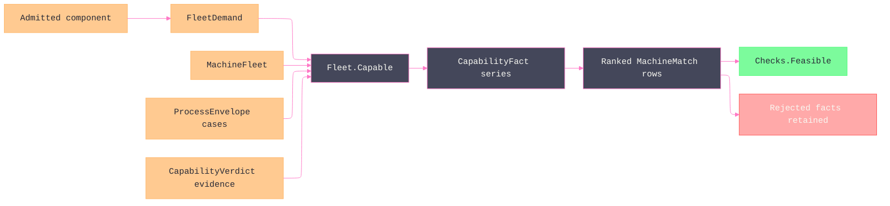

# [RASM_FABRICATION_MACHINE_FLEET]

`Fleet` owns the one shop-capability join from an admitted component and an admitted `MachineFleet` to ranked `MachineMatch` evidence. `FleetDemand` reads the component quantity bag once through typed `DemandKey` rows, each `CapabilityCriterion` generates its fact, and each `FleetObjective` generates its weighted penalty; rejected pairs remain visible with demanded, available, unit, and locus evidence. `FleetPolicy.PerformanceHorizon` admits telemetry freshness at composition time, so stale observations fall back to declared capability instead of silently steering routing.

Availability is a generated calendar, never a window roster. `ShiftCalendar` expands weekly `ShiftBlock` patterns over any `DateInterval`, applies `CalendarException` rows, punches maintenance holes, and computes working duration or effort completion. `AvailabilityPlan.Schedulable` derates windows by committed load, so `Finish` returns the machine's actual completion instant for `Process/derivation.md` to convert into a promise date.

`ProcessEnvelope` is the one station family. Its generated dispatch distinguishes rotating cutting, grinding, sawing, thermal sheet cutting, waterjet, ultrasonic abrasion, wire EDM, additive build, press brake, linear-stroke forming, roll forming, tube bending, and robot-cell capability without repeating product rosters across validation, matching, and scoring. `MachineInstance` is shop data over runtime `Machine`, while `MachineFleet` owns availability, controller, certification, capability-history, and ranking policy.

## [01]-[INDEX]

- [01]-[MACHINE_FLEET]: owns typed component demand, process-station capability, shop-instance admission, generated shift calendars, criterion evidence, capability-history composition, parsimony ranking, and `Fleet.Capable`.

## [02]-[MACHINE_FLEET]

- Owner: `DemandKey` owns quantity ingress and scalar admission; `FleetDemand` owns the once-derived component demand; `ProcessEnvelope` closes process-station capability; `MachineAvailability` closes dispatch posture; `ShiftCalendar` generates working windows from a weekly `ShiftBlock` pattern and dated `CalendarException` rows, and `AvailabilityPlan` derates them by committed load into the shop's one time model; `MachineInstance` admits installed process, controller, certification, tooling, material, grade, rate, energy, reliability, modal response, and cell evidence; `CapabilityCriterion` owns generated assessment and margin orientation; `ProcessEnvelope.PowerKw` owns the one station-power projection every assessment arm reads; `CapabilityFact` and `CapabilityCheck` own verdict evidence; `FleetObjective` and `FleetPolicy` own generated ranking; `MachineFleet` owns the registry; `Fleet` owns the join.
- Cases: `ProcessEnvelope` covers rotating milling, turning, grinding, sawing, thermal sheet cutting, waterjet, ultrasonic abrasion, wire tank, additive build, press brake, linear stroke, roll forming, tube bender, and robot cell. `CapabilityCriterion` covers material physics, envelope, topology, station, spindle, tooling, material, grade, controller, certification, availability, reliability, payload, cell reach, and external-axis capacity. `FleetObjective` covers headroom, grade, parsimony, reliability, effectiveness, energy, load, cost, and utilization. `CalendarExceptionKind` covers holiday, shutdown, reduced, overtime, and unattended dates, each row declaring through `Grants` whether its blocks replace the weekly pattern or extend it.
- Entry: `Fleet.Capable(AdmittedComponent, MachineFleet)` returns every installed `(instance, process)` assessment, feasible rows first and then lowest excess-capability cost. `Fleet.AdmitInstance(MachineRegistration)` is the one textual registry boundary.
- Auto: component geometry, material, and every `DemandKey` scalar accumulate through one applicative admission. `ProcessKind.Physics` selects the material law through the `CapabilityCriterion.Physics` fact, and `ConstitutiveLaw.At(ConstitutiveState)` derives spindle demand from temperature, hardness, and strain rate. `CapabilityCriterion.Items` generates exactly one fact per dimension, `CapabilityCriterion.Sense` orients each margin so an over-capable value reads positive whichever direction the dimension improves, `FleetObjective.Items` generates the weighted score, enrolled `CapabilityVerdict` defeats declared grade, controller and certification gates read installed sets, `ShiftCalendar.Covers` evaluates the generated windows and punched maintenance at `MachineFleet.RoutingAt`, and unavailable or reliability-deficient machines remain rejected evidence.
- Receipt: `MachineMatch` carries the instance, process, typed facts, envelope and grade margins, score, assessment instant, and freshness-qualified rate, power, reliability, and utilization evidence. `Checks.Feasible` remains the frozen derivation and estimation read; every `(instance, process)` pair the registry declares reaches a receipt, so a material whose physics omits the process is rejected evidence rather than a silent absence.
- Packages: `Process/family.md` supplies `Machine`, `ProcessKind`, `PostDialect`, and topology; `Process/physics.md` supplies `Material` and surface-speed evidence; `Tooling/magazine.md` supplies `SlotMap`, `SlotState`, and MTConnect-backed `ToolSnapshot` life/feed/spindle truth; `Spec/capability.md` supplies `ItGrade` and `CapabilityVerdict`; `Kinematics/cell.md` supplies `RobotCell`; `Rasm.Analysis` supplies the mesh-bound query; NodaTime owns `Instant`, `Interval`, `DateInterval`, explicit `LocalDateTime.InZone`, and `Resolvers.CreateMappingResolver`; Thinktecture and LanguageExt own generated rows and typed rails.
- Growth: a new station modality is one `ProcessEnvelope` case and assessment arm; a new assessment dimension is one behavior-bearing `CapabilityCriterion` row carrying its own `Sense`; a new ranking concern is one `FleetObjective` row and one `FleetPolicy.Weights` value; a new component scalar is one `DemandKey` row projected into `FleetDemand`; a new calendar posture is one `CalendarExceptionKind` row carrying its own `Grants`; a new product is registry data, never a solver branch.
- Boundary: `Process/derivation.md` alone converts an empty feasible selection to `RoutingInfeasible` and alone turns `AvailabilityPlan.Finish` into a lot promise; fleet owns the calendar and returns verdicts. `Forming/brake.md` consumes the frozen `ProcessEnvelope.Brake` case, `Verify/estimation.md` consumes the effective metrics retained by `MachineMatch`, and `RobotProgram` owns path-level robot reach; fleet admits only declared reach-envelope, payload, and external-axis evidence available at component-routing altitude. Statement bodies beneath `Fleet` are measured capability, ranking, or admission kernels.

```csharp signature
using LanguageExt;
using LanguageExt.Common;
using Rasm.Domain;
using NodaTime;
using NodaTime.TimeZones;
using Rasm.Analysis;
using Rasm.Fabrication.Process;
using Rasm.Fabrication.Spec;
using Rasm.Fabrication.Tooling;
using Rasm.Meshing;
using Rasm.Numerics;
using Rhino.Geometry;
using Thinktecture;
using static LanguageExt.Prelude;

namespace Rasm.Fabrication.Kinematics;

// --- [TYPES] --------------------------------------------------------------------------------------------------------------------------------------
[SmartEnum<string>]
public sealed partial class DemandUnit {
    public static readonly DemandUnit Count = new("count");
    public static readonly DemandUnit Millimeter = new("mm");
    public static readonly DemandUnit Degree = new("deg");
    public static readonly DemandUnit Kilowatt = new("kw");
    public static readonly DemandUnit Kilonewton = new("kn");
    public static readonly DemandUnit Kilogram = new("kg");
    public static readonly DemandUnit KilogramPerMinute = new("kg/min");
    public static readonly DemandUnit NewtonMeter = new("n-m");
    public static readonly DemandUnit Bar = new("bar");
    public static readonly DemandUnit Kilohertz = new("khz");
    public static readonly DemandUnit PerMinute = new("1/min");
    public static readonly DemandUnit PerSecond = new("1/s");
    public static readonly DemandUnit DegreeCelsius = new("deg-c");
    public static readonly DemandUnit Ratio = new("ratio");
}

[SmartEnum<string>]
public sealed partial class ComponentProperty {
    public static readonly ComponentProperty Material = new("material");
}

[SmartEnum<string>]
public sealed partial class DemandKey {
    public static readonly DemandKey MinAxes = new("demand:min-axes", DemandUnit.Count, 3.0, true, 1.0, double.PositiveInfinity);
    public static readonly DemandKey DistinctTools = new("demand:distinct-tools", DemandUnit.Count, 0.0, true, 0.0, double.PositiveInfinity);
    public static readonly DemandKey SpindleKw = new("demand:spindle-kw", DemandUnit.Kilowatt, 0.0, false, 0.0, double.PositiveInfinity);
    public static readonly DemandKey ItGrade = new("demand:it-grade", DemandUnit.Count, 12.0, true, 1.0, 18.0);
    public static readonly DemandKey WorkpieceDiameter = new("demand:workpiece-diameter-mm", DemandUnit.Millimeter, 0.0, false, 0.0, double.PositiveInfinity);
    public static readonly DemandKey WorkpieceLength = new("demand:workpiece-length-mm", DemandUnit.Millimeter, 0.0, false, 0.0, double.PositiveInfinity);
    public static readonly DemandKey Taper = new("demand:taper-deg", DemandUnit.Degree, 0.0, false, 0.0, double.PositiveInfinity);
    public static readonly DemandKey BuildHeads = new("demand:build-heads", DemandUnit.Count, 1.0, true, 1.0, double.PositiveInfinity);
    public static readonly DemandKey BrakeForce = new("demand:brake-force-kn", DemandUnit.Kilonewton, 0.0, false, 0.0, double.PositiveInfinity);
    public static readonly DemandKey GaugeTravel = new("demand:gauge-travel-mm", DemandUnit.Millimeter, 0.0, false, 0.0, double.PositiveInfinity);
    public static readonly DemandKey OpenHeight = new("demand:open-height-mm", DemandUnit.Millimeter, 0.0, false, 0.0, double.PositiveInfinity);
    public static readonly DemandKey BedLength = new("demand:bed-length-mm", DemandUnit.Millimeter, 0.0, false, 0.0, double.PositiveInfinity);
    public static readonly DemandKey Miter = new("demand:miter-deg", DemandUnit.Degree, 0.0, false, 0.0, double.PositiveInfinity);
    public static readonly DemandKey Payload = new("demand:payload-kg", DemandUnit.Kilogram, 0.0, false, 0.0, double.PositiveInfinity);
    public static readonly DemandKey MinReliability = new("demand:min-reliability", DemandUnit.Ratio, 0.0, false, 0.0, 1.0);
    public static readonly DemandKey ToolDiameter = new("demand:tool-diameter-mm", DemandUnit.Millimeter, 0.0, false, 0.0, double.PositiveInfinity);
    public static readonly DemandKey SpindleTorque = new("demand:spindle-torque-nm", DemandUnit.NewtonMeter, 0.0, false, 0.0, double.PositiveInfinity);
    public static readonly DemandKey PartMass = new("demand:part-mass-kg", DemandUnit.Kilogram, 0.0, false, 0.0, double.PositiveInfinity);
    public static readonly DemandKey LayerHeight = new("demand:layer-height-mm", DemandUnit.Millimeter, 0.0, false, 0.0, double.PositiveInfinity);
    public static readonly DemandKey Pressure = new("demand:pressure-bar", DemandUnit.Bar, 0.0, false, 0.0, double.PositiveInfinity);
    public static readonly DemandKey AbrasiveFlow = new("demand:abrasive-kg-min", DemandUnit.KilogramPerMinute, 0.0, false, 0.0, double.PositiveInfinity);
    public static readonly DemandKey WireDiameter = new("demand:wire-diameter-mm", DemandUnit.Millimeter, 0.0, false, 0.0, double.PositiveInfinity);
    public static readonly DemandKey ExternalAxes = new("demand:external-axes", DemandUnit.Count, 0.0, true, 0.0, double.PositiveInfinity);
    public static readonly DemandKey CertificationRequired = new("demand:certification-required", DemandUnit.Count, 0.0, true, 0.0, 1.0);
    public static readonly DemandKey Frequency = new("demand:frequency-khz", DemandUnit.Kilohertz, 0.0, false, 0.0, double.PositiveInfinity);
    public static readonly DemandKey Stroke = new("demand:stroke-mm", DemandUnit.Millimeter, 0.0, false, 0.0, double.PositiveInfinity);
    public static readonly DemandKey LineStations = new("demand:line-stations", DemandUnit.Count, 1.0, true, 1.0, double.PositiveInfinity);
    public static readonly DemandKey CyclesPerMinute = new("demand:cycles-per-minute", DemandUnit.PerMinute, 0.0, false, 0.0, double.PositiveInfinity);
    public static readonly DemandKey Temperature = new("demand:temperature-c", DemandUnit.DegreeCelsius, 20.0, false, 0.0, double.PositiveInfinity);
    public static readonly DemandKey Hardness = new("demand:hardness", DemandUnit.Count, 0.0, false, 0.0, double.PositiveInfinity);
    public static readonly DemandKey StrainRate = new("demand:strain-rate", DemandUnit.PerSecond, 0.0, false, 0.0, double.PositiveInfinity);
    public static readonly DemandKey BarFeedRequired = new("demand:bar-feed-required", DemandUnit.Count, 0.0, true, 0.0, 1.0);
    public static readonly DemandKey BendRadius = new("demand:bend-radius-mm", DemandUnit.Millimeter, 0.0, false, 0.0, double.PositiveInfinity);

    public DemandUnit Unit { get; }
    public double Fallback { get; }
    public bool Integral { get; }
    public double Minimum { get; }
    public double Maximum { get; }

    internal Fin<double> Read(Map<string, double> quantities) {
        double value = quantities.Find(Key).IfNone(Fallback);
        return double.IsFinite(value) && value >= Minimum && value <= Maximum
            && (!Integral || value == Math.Truncate(value))
            ? Fin.Succ(value)
            : Fin.Fail<double>(new GeometryFault.DegenerateInput(Kind.Curve, -1, $"fleet:demand:{Key}").ToError());
    }
}

[SmartEnum<string>]
public sealed partial class CapabilityCriterion {
    public static readonly CapabilityCriterion Physics = new("physics", sense: 1, assess: static (criterion, context) => CapabilityFact.Create(
        criterion, context.PhysicsFit, 1.0, context.PhysicsFit ? 1.0 : 0.0, DemandUnit.Count, context.Process.Physics.Key));
    public static readonly CapabilityCriterion Envelope = new("envelope", sense: 1, assess: static (criterion, context) => CapabilityFact.Create(
        criterion, context.Headroom >= 0.0, 0.0, context.Headroom, DemandUnit.Millimeter, context.Instance.Id));
    public static readonly CapabilityCriterion Topology = new("topology", sense: 1, assess: static (criterion, context) => CapabilityFact.Create(
        criterion,
        context.Instance.Kind.AxisCount >= context.DemandedAxes
            && (context.DemandedAxes < 5 || context.Instance.Kind.Topology.OrientationDof > 0 || context.IsCell),
        context.DemandedAxes,
        context.Instance.Kind.AxisCount,
        DemandUnit.Count,
        context.Instance.Kind.Topology.Key));
    public static readonly CapabilityCriterion Station = new("station", sense: 1, assess: static (criterion, context) => CapabilityFact.Create(
        criterion,
        context.Station.Present && context.Station.Fits,
        1.0,
        context.Station.Present && context.Station.Fits ? 1.0 : 0.0,
        DemandUnit.Count,
        context.Station.Locus));
    public static readonly CapabilityCriterion Spindle = new("spindle", sense: 1, assess: static (criterion, context) => CapabilityFact.Create(
        criterion,
        context.Station.Spindle && context.Station.PowerKw >= context.SurfacePower,
        context.SurfacePower,
        context.Station.PowerKw,
        DemandUnit.Kilowatt,
        context.Station.Locus));
    public static readonly CapabilityCriterion Tooling = new("tooling", sense: 1, assess: static (criterion, context) => CapabilityFact.Create(
        criterion,
        context.Instance.PocketCount >= context.Demand[DemandKey.DistinctTools]
            && context.Instance.ReadyToolCount >= context.Demand[DemandKey.DistinctTools],
        context.Demand[DemandKey.DistinctTools],
        Math.Min(context.Instance.PocketCount, context.Instance.ReadyToolCount),
        DemandUnit.Count,
        context.Instance.Id));
    public static readonly CapabilityCriterion Material = new("material", sense: 1, assess: static (criterion, context) => CapabilityFact.Create(
        criterion, context.MaterialFit, 1.0, context.MaterialFit ? 1.0 : 0.0, DemandUnit.Count, context.Demand.Material.Key));
    public static readonly CapabilityCriterion Grade = new("grade", sense: -1, assess: static (criterion, context) => CapabilityFact.Create(
        criterion,
        context.GradeFit,
        context.DemandedGrade,
        context.AchievedGrade,
        DemandUnit.Count,
        context.Process.Key));
    public static readonly CapabilityCriterion Controller = new("controller", sense: 1, assess: static (criterion, context) => CapabilityFact.Create(
        criterion,
        context.Instance.Controllers.Contains(context.Process.Dialect),
        1.0,
        context.Instance.Controllers.Contains(context.Process.Dialect) ? 1.0 : 0.0,
        DemandUnit.Count,
        context.Process.Dialect.Key));
    public static readonly CapabilityCriterion Certification = new("certification", sense: 1, assess: static (criterion, context) => CapabilityFact.Create(
        criterion,
        context.CertificationFit,
        context.Demand[DemandKey.CertificationRequired],
        context.Instance.Certifications.Contains(context.Process) ? 1.0 : 0.0,
        DemandUnit.Count,
        context.Process.Key));
    public static readonly CapabilityCriterion Availability = new("availability", sense: 1, assess: static (criterion, context) => CapabilityFact.Create(
        criterion,
        context.Instance.Availability.IsRoutable(context.Fleet.RoutingAt) && context.Instance.Availability.LoadFactor < 1.0,
        0.0,
        context.Instance.Availability.IsRoutable(context.Fleet.RoutingAt) ? 1.0 - context.Instance.Availability.LoadFactor : 0.0,
        DemandUnit.Ratio,
        context.Instance.Availability.State.Key));
    public static readonly CapabilityCriterion Reliability = new("reliability", sense: 1, assess: static (criterion, context) => CapabilityFact.Create(
        criterion,
        context.Reliability >= context.Demand[DemandKey.MinReliability],
        context.Demand[DemandKey.MinReliability],
        context.Reliability,
        DemandUnit.Ratio,
        context.Instance.Id));
    public static readonly CapabilityCriterion Payload = new("payload", sense: 1, assess: static (criterion, context) => CapabilityFact.Create(
        criterion,
        !context.IsCell || context.Station.Capacity >= context.Payload,
        context.Payload,
        context.Station.Capacity,
        DemandUnit.Kilogram,
        context.Station.Locus));
    public static readonly CapabilityCriterion CellReach = new("cell-reach", sense: 1, assess: static (criterion, context) => CapabilityFact.Create(
        criterion, !context.IsCell || context.CellReach, 1.0, context.CellReach ? 1.0 : 0.0, DemandUnit.Count, context.Station.Locus));
    public static readonly CapabilityCriterion ExternalAxes = new("external-axes", sense: 1, assess: static (criterion, context) => CapabilityFact.Create(
        criterion,
        context.Demand[DemandKey.ExternalAxes] == 0.0
            || context.IsCell && context.ExternalAxesCapacity >= context.Demand[DemandKey.ExternalAxes],
        context.Demand[DemandKey.ExternalAxes],
        context.ExternalAxesCapacity,
        DemandUnit.Count,
        context.Station.Locus));

    public int Sense { get; }
    internal Func<CapabilityCriterion, CapabilityContext, CapabilityFact> Assess { get; }
}

[SmartEnum<string>]
public sealed partial class FleetObjective {
    public static readonly FleetObjective Headroom = new(
        "headroom",
        penalty: static context => Math.Max(context.Headroom, 0.0));
    public static readonly FleetObjective Grade = new(
        "grade",
        penalty: static context => Math.Max(context.GradeMargin, 0.0));
    public static readonly FleetObjective Parsimony = new(
        "parsimony",
        penalty: static context => Math.Max(context.Instance.Kind.AxisCount - context.DemandedAxes, 0));
    public static readonly FleetObjective Reliability = new(
        "reliability",
        penalty: static context => 1.0 - context.Reliability);
    public static readonly FleetObjective Effectiveness = new(
        "effectiveness",
        penalty: static context => 1.0 - context.Effectiveness);
    public static readonly FleetObjective Energy = new(
        "energy",
        penalty: static context => context.Instance.IdlePowerKw + context.PowerKw);
    public static readonly FleetObjective Load = new(
        "load",
        penalty: static context => context.Instance.Availability.LoadFactor);
    public static readonly FleetObjective Cost = new(
        "cost",
        penalty: static context => context.HourlyRate);
    public static readonly FleetObjective Utilization = new(
        "utilization",
        penalty: static context => context.Utilization);

    internal Func<CapabilityContext, double> Penalty { get; }
}

[SmartEnum<string>]
public sealed partial class MachineAvailability {
    public static readonly MachineAvailability Ready = new("ready", routable: true);
    public static readonly MachineAvailability Reserved = new("reserved", routable: false);
    public static readonly MachineAvailability Service = new("service", routable: false);
    public static readonly MachineAvailability Offline = new("offline", routable: false);

    public bool Routable { get; }
}

[SmartEnum<string>]
public sealed partial class CalendarExceptionKind {
    public static readonly CalendarExceptionKind Holiday = new("holiday", grants: false);
    public static readonly CalendarExceptionKind Shutdown = new("shutdown", grants: false);
    public static readonly CalendarExceptionKind Reduced = new("reduced", grants: false);
    public static readonly CalendarExceptionKind Overtime = new("overtime", grants: true);
    public static readonly CalendarExceptionKind Unattended = new("unattended", grants: true);

    public bool Grants { get; }
}

[ComplexValueObject]
public sealed partial class ShiftBlock {
    public IsoDayOfWeek Day { get; }
    public LocalTime Start { get; }
    public LocalTime End { get; }
    public double Staffing { get; }

    [BoundaryAdapter]
    static partial void ValidateFactoryArguments(
        ref ValidationError? validationError,
        ref IsoDayOfWeek day,
        ref LocalTime start,
        ref LocalTime end,
        ref double staffing) =>
        validationError = day is not IsoDayOfWeek.None && end > start
            && double.IsFinite(staffing) && staffing is > 0.0 and <= 1.0
                ? null
                : new ValidationError("shift block requires an ISO weekday, an ordered local span, and bounded staffing");
}

[ComplexValueObject]
public sealed partial class CalendarException {
    public CalendarExceptionKind Kind { get; }
    public DateInterval Dates { get; }
    public Seq<ShiftBlock> Blocks { get; }

    [BoundaryAdapter]
    static partial void ValidateFactoryArguments(
        ref ValidationError? validationError,
        ref CalendarExceptionKind kind,
        ref DateInterval dates,
        ref Seq<ShiftBlock> blocks) =>
        validationError = kind is not null && dates is not null && (kind.Grants ? !blocks.IsEmpty : true)
            ? null
            : new ValidationError("calendar exception requires a kind, a dated span, and blocks whenever it grants time");
}

[ComplexValueObject]
public sealed partial class ShiftCalendar {
    private static readonly ZoneLocalMappingResolver StartResolver = Resolvers.CreateMappingResolver(
        Resolvers.ReturnEarlier,
        Resolvers.ReturnStartOfIntervalAfter);
    private static readonly ZoneLocalMappingResolver EndResolver = Resolvers.CreateMappingResolver(
        Resolvers.ReturnLater,
        Resolvers.ReturnStartOfIntervalAfter);

    public DateTimeZone Zone { get; }
    public Seq<ShiftBlock> Pattern { get; }
    public Seq<CalendarException> Exceptions { get; }
    public Duration Horizon { get; }

    [BoundaryAdapter]
    static partial void ValidateFactoryArguments(
        ref ValidationError? validationError,
        ref DateTimeZone zone,
        ref Seq<ShiftBlock> pattern,
        ref Seq<CalendarException> exceptions,
        ref Duration horizon) =>
        validationError = zone is not null && !pattern.IsEmpty && horizon > Duration.Zero
            ? null
            : new ValidationError("shift calendar requires a zone, a non-empty weekly pattern, and a positive search horizon");

    public Seq<(NodaTime.Interval Span, double Staffing)> Windows(DateInterval dates, Seq<NodaTime.Interval> excluded) =>
        Range(0, dates.Length)
            .Map(offset => dates.Start.PlusDays(offset))
            .Bind(date => Blocks(date).Bind(block => Punch(
                    new NodaTime.Interval(
                        date.At(block.Start).InZone(Zone, StartResolver).ToInstant(),
                        date.At(block.End).InZone(Zone, EndResolver).ToInstant()),
                    excluded)
                .Map(span => (Span: span, block.Staffing))))
            .OrderBy(static window => window.Span.Start)
            .ToSeq()
            .Apply(Canonical);

    private static Seq<(NodaTime.Interval Span, double Staffing)> Canonical(
        Seq<(NodaTime.Interval Span, double Staffing)> windows) =>
        windows.Bind(static window => Seq(window.Span.Start, window.Span.End))
            .Distinct()
            .Order()
            .ToSeq()
            .Apply(edges => edges.Zip(edges.Skip(1))
                .Choose(edge => windows
                    .Filter(window => window.Span.Start < edge.Item2 && window.Span.End > edge.Item1)
                    .Map(static window => window.Staffing)
                    .OrderByDescending(identity)
                    .Head
                    .Map(staffing => (Span: new NodaTime.Interval(edge.Item1, edge.Item2), Staffing: staffing)))
                .ToSeq());

    public bool Covers(Instant at, Seq<NodaTime.Interval> excluded) =>
        Windows(Around(at, at), excluded).Exists(window => window.Span.Contains(at));

    public Duration Working(NodaTime.Interval span, Seq<NodaTime.Interval> excluded) =>
        Duration.FromSeconds(Windows(Around(span.Start, span.End), excluded)
            .Fold(0.0, (total, window) => total + (Overlap(window.Span, span).TotalSeconds * window.Staffing)));

    // Effort is consumed across successive staffed windows: an eight-hour job on a one-shift calendar lands
    // on the next working morning, never eight hours after release. An effort exceeding Horizon returns None.
    public Option<Instant> Advance(Instant from, Duration effort, Seq<NodaTime.Interval> excluded) =>
        effort == Duration.Zero
            ? Some(from)
            : Windows(Around(from, from + Horizon), excluded)
            .Map(window => (Span: new NodaTime.Interval(
                window.Span.Start > from ? window.Span.Start : from, window.Span.End), window.Staffing))
            .Filter(static window => window.Span.End > window.Span.Start)
            .Fold((Remaining: effort, At: Option<Instant>.None),
                static (state, window) => state.At.IsSome ? state : Consume(state.Remaining, window))
            .At;

    // A non-granting exception replaces the weekly pattern for the dates it covers; a granting one adds to
    // whatever survives, so an overtime Saturday and a shutdown week compose without an ordering rule.
    private Seq<ShiftBlock> Blocks(LocalDate date) =>
        (Exceptions.Filter(row => row.Dates.Contains(date) && !row.Kind.Grants) is { IsEmpty: false } replacing
            ? replacing.Bind(static row => row.Blocks)
            : Pattern.Filter(block => block.Day == date.DayOfWeek))
        + Exceptions.Filter(row => row.Dates.Contains(date) && row.Kind.Grants).Bind(static row => row.Blocks);

    private DateInterval Around(Instant start, Instant end) =>
        new(start.InZone(Zone).Date, end.InZone(Zone).Date);

    private static (Duration Remaining, Option<Instant> At) Consume(
        Duration remaining,
        (NodaTime.Interval Span, double Staffing) window) =>
        Duration.FromSeconds((window.Span.End - window.Span.Start).TotalSeconds * window.Staffing) switch {
            Duration capacity when capacity >= remaining => (Duration.Zero,
                Some(window.Span.Start + Duration.FromSeconds(remaining.TotalSeconds / window.Staffing))),
            Duration capacity => (remaining - capacity, Option<Instant>.None),
        };

    private static Seq<NodaTime.Interval> Punch(NodaTime.Interval span, Seq<NodaTime.Interval> excluded) =>
        excluded.Fold(Seq(span), static (open, hole) => open.Bind(part => Split(part, hole)));

    private static Seq<NodaTime.Interval> Split(NodaTime.Interval part, NodaTime.Interval hole) =>
        hole.End <= part.Start || hole.Start >= part.End
            ? Seq(part)
            : (hole.Start > part.Start ? Seq(new NodaTime.Interval(part.Start, hole.Start)) : Seq<NodaTime.Interval>())
            + (hole.End < part.End ? Seq(new NodaTime.Interval(hole.End, part.End)) : Seq<NodaTime.Interval>());

    private static Duration Overlap(NodaTime.Interval window, NodaTime.Interval span) =>
        (window.Start > span.Start ? window.Start : span.Start,
         window.End < span.End ? window.End : span.End) switch {
            var (start, end) when end > start => end - start,
            _ => Duration.Zero,
        };
}

[ComplexValueObject]
public sealed partial class AvailabilityPlan {
    public MachineAvailability State { get; }
    public ShiftCalendar Calendar { get; }
    public Seq<NodaTime.Interval> Maintenance { get; }
    public double LoadFactor { get; }

    // Committed load is finite capacity, not a ranking scalar: it derates every staffed window this plan offers.
    public double Schedulable => 1.0 - LoadFactor;

    [BoundaryAdapter]
    static partial void ValidateFactoryArguments(
        ref ValidationError? validationError,
        ref MachineAvailability state,
        ref ShiftCalendar calendar,
        ref Seq<NodaTime.Interval> maintenance,
        ref double loadFactor) {
        if (state is null || calendar is null || !double.IsFinite(loadFactor) || loadFactor is < 0.0 or >= 1.0)
            validationError = new ValidationError(
                "availability plan requires a dispatch state, a shift calendar, and a load factor below saturation");
    }

    public bool IsRoutable(Instant at) => State.Routable && Calendar.Covers(at, Maintenance);

    public Duration Working(NodaTime.Interval span) =>
        State.Routable
            ? Duration.FromSeconds(Calendar.Working(span, Maintenance).TotalSeconds * Schedulable)
            : Duration.Zero;

    // Zero effort consumes no window, so it lands where it started rather than snapping to the next shift.
    public Option<Instant> Finish(Instant from, Duration effort) =>
        (effort <= Duration.Zero, State.Routable) switch {
            (true, _) => Some(from),
            (false, true) => Calendar.Advance(from, Duration.FromSeconds(effort.TotalSeconds / Schedulable), Maintenance),
            (false, false) => Option<Instant>.None,
        };
}

[ComplexValueObject]
public sealed partial class MachinePerformance {
    public Instant ObservedAt { get; }
    public double AvailabilityRatio { get; }
    public double PerformanceRatio { get; }
    public double QualityRatio { get; }
    public double Utilization { get; }
    public double ReliabilityRatio { get; }
    public double SpindleHours { get; }
    public Duration MeanTimeBetweenFailures { get; }
    public Duration MeanTimeToRepair { get; }
    public Option<double> ObservedHourlyRate { get; }
    public Option<double> ObservedSpindlePowerKw { get; }

    public double Oee => AvailabilityRatio * PerformanceRatio * QualityRatio;
    public double ServiceAvailability => MeanTimeBetweenFailures.TotalSeconds
        / (MeanTimeBetweenFailures + MeanTimeToRepair).TotalSeconds;
    public double DispatchReliability => Math.Min(ReliabilityRatio, ServiceAvailability);

    [BoundaryAdapter]
    static partial void ValidateFactoryArguments(
        ref ValidationError? validationError,
        ref Instant observedAt,
        ref double availabilityRatio,
        ref double performanceRatio,
        ref double qualityRatio,
        ref double utilization,
        ref double reliabilityRatio,
        ref double spindleHours,
        ref Duration meanTimeBetweenFailures,
        ref Duration meanTimeToRepair,
        ref Option<double> observedHourlyRate,
        ref Option<double> observedSpindlePowerKw) {
        bool ratios = new[] { availabilityRatio, performanceRatio, qualityRatio, utilization, reliabilityRatio }
            .ForAll(static value => double.IsFinite(value) && value is >= 0.0 and <= 1.0);
        bool optionals = observedHourlyRate.ToSeq().Concat(observedSpindlePowerKw)
            .ForAll(static value => double.IsFinite(value) && value >= 0.0);
        if (!ratios || !double.IsFinite(spindleHours) || spindleHours < 0.0
            || meanTimeBetweenFailures <= Duration.Zero || meanTimeToRepair < Duration.Zero || !optionals)
            validationError = new ValidationError("machine performance requires bounded OEE and reliability ratios, positive failure spacing, nonnegative repair time, and measured rates");
    }
}

[ComplexValueObject]
public sealed partial class CapabilityFact {
    public CapabilityCriterion Criterion { get; }
    public bool Pass { get; }
    public double Demand { get; }
    public double Available { get; }
    public DemandUnit Unit { get; }
    public string Locus { get; }

    public double Margin => Criterion.Sense * (Available - Demand);

    [BoundaryAdapter]
    static partial void ValidateFactoryArguments(
        ref ValidationError? validationError,
        ref CapabilityCriterion criterion,
        ref bool pass,
        ref double demand,
        ref double available,
        ref DemandUnit unit,
        ref string locus) {
        locus = locus?.Trim() ?? string.Empty;
        double margin = criterion is null ? double.NaN : criterion.Sense * (available - demand);
        if (criterion is null || !double.IsFinite(demand) || !double.IsFinite(available)
            || pass && margin < 0.0 || unit is null || string.IsNullOrWhiteSpace(locus))
            validationError = new ValidationError("capability fact requires coherent verdict evidence, finite demand and availability, unit, and locus");
    }
}

[Union(ConversionFromValue = ConversionOperatorsGeneration.None)]
public abstract partial record ProcessEnvelope {
    private ProcessEnvelope() { }

    public sealed record Milling(double SpindlePowerKw, double SpindleMinRpm, double SpindleMaxRpm, double MinToolDiameterMm,
        double MaxToolDiameterMm, double TorqueNm, double TableLoadKg) : ProcessEnvelope;
    public sealed record Turning(double SwingMm, double BetweenCentersMm, double BarCapacityMm, double ChuckDiameterMm,
        double SpindlePowerKw, double SpindleMinRpm, double SpindleMaxRpm, Set<ProcessKind> SecondaryProcesses) : ProcessEnvelope;
    public sealed record Grinding(double WheelDiameterMm, double WheelWidthMm, double SpindlePowerKw, double SpindleMinRpm, double SpindleMaxRpm) : ProcessEnvelope;
    public sealed record Saw(double BladeDiameterMm, double MaxSectionMm, double MaxMiterDeg,
        double SpindlePowerKw, double SpindleMinRpm, double SpindleMaxRpm) : ProcessEnvelope;
    public sealed record Sheet(double BedXMm, double BedYMm, double MaxThicknessMm, double SourcePowerKw) : ProcessEnvelope;
    public sealed record Waterjet(double BedXMm, double BedYMm, double MaxThicknessMm, double PressureBar, double AbrasiveKgPerMin) : ProcessEnvelope;
    public sealed record Abrasive(BoundingBox Volume, double FrequencyKhz, double PowerKw, double MaxToolDiameterMm) : ProcessEnvelope;
    public sealed record WireTank(double UTravelMm, double VTravelMm, double MaxTaperDeg, double SubmergedHeightMm, double WireMinMm, double WireMaxMm) : ProcessEnvelope;
    public sealed record Build(BoundingBox Volume, int Heads, double MinLayerMm, double MaxLayerMm, Set<Material> Materials) : ProcessEnvelope;
    public sealed record Brake(double CapacityKn, double GaugeTravelMm, double OpenHeightMm, double BedLengthMm) : ProcessEnvelope;
    public sealed record Stroke(Set<ProcessKind> Processes, BoundingBox Volume, double StrokeMm, double ForceKn, double TableLoadKg, double CyclesPerMinute) : ProcessEnvelope;
    public sealed record Roll(double MaxWidthMm, double MinThicknessMm, double MaxThicknessMm, int Stations, double TorqueNm) : ProcessEnvelope;
    public sealed record Bender(double MinClrMm, double MaxClrMm, int DieCount) : ProcessEnvelope;
    public sealed record Cell(RobotCell Robot, BoundingBox Reach, double PayloadKg, int ExternalAxes) : ProcessEnvelope;

    public Option<double> PowerKw => Switch(
        milling: static row => Some(row.SpindlePowerKw),
        turning: static row => Some(row.SpindlePowerKw),
        grinding: static row => Some(row.SpindlePowerKw),
        saw: static row => Some(row.SpindlePowerKw),
        sheet: static row => Some(row.SourcePowerKw),
        waterjet: static _ => None,
        abrasive: static row => Some(row.PowerKw),
        wireTank: static _ => None,
        build: static _ => None,
        brake: static _ => None,
        stroke: static _ => None,
        roll: static _ => None,
        bender: static _ => None,
        cell: static _ => None);

    internal bool Admits(ProcessKind process) => Switch(
        state: process,
        milling: static (kind, _) => kind == ProcessKind.Mill || kind == ProcessKind.Route || kind == ProcessKind.Drill
            || kind == ProcessKind.Bore || kind == ProcessKind.Ream || kind == ProcessKind.GearCut,
        turning: static (kind, row) => kind == ProcessKind.Turn || row.SecondaryProcesses.Contains(kind),
        grinding: static (kind, _) => kind == ProcessKind.Grind || kind == ProcessKind.Hone || kind == ProcessKind.Lap,
        saw: static (kind, _) => kind == ProcessKind.Saw,
        sheet: static (kind, _) => kind == ProcessKind.Laser || kind == ProcessKind.Plasma || kind == ProcessKind.Oxyfuel || kind == ProcessKind.ElectronBeam,
        waterjet: static (kind, _) => kind == ProcessKind.Waterjet,
        abrasive: static (kind, _) => kind == ProcessKind.Ultrasonic,
        wireTank: static (kind, _) => kind == ProcessKind.EdmWire,
        build: static (kind, _) => kind == ProcessKind.Additive || kind == ProcessKind.VatPolymer || kind == ProcessKind.PowderBed
            || kind == ProcessKind.BinderJet || kind == ProcessKind.MaterialJet || kind == ProcessKind.SheetLamination,
        brake: static (kind, _) => kind == ProcessKind.PressBrake,
        stroke: static (kind, row) => row.Processes.Contains(kind),
        roll: static (kind, _) => kind == ProcessKind.RollForm,
        bender: static (kind, _) => kind == ProcessKind.TubeBend,
        cell: static (kind, _) => kind == ProcessKind.Weld || kind == ProcessKind.Deposition || kind == ProcessKind.DirectedEnergy
            || kind == ProcessKind.FrictionStir || kind == ProcessKind.Braze || kind == ProcessKind.Adhesive);

    internal bool IsValid => Switch(
        milling: static row => Positive(row.SpindlePowerKw) && Nonnegative(row.SpindleMinRpm) && row.SpindleMaxRpm > row.SpindleMinRpm
            && Positive(row.MinToolDiameterMm) && row.MaxToolDiameterMm >= row.MinToolDiameterMm && Positive(row.TorqueNm) && Positive(row.TableLoadKg),
        turning: static row => Positive(row.SwingMm) && Positive(row.BetweenCentersMm) && Positive(row.BarCapacityMm) && Positive(row.ChuckDiameterMm)
            && Positive(row.SpindlePowerKw) && Nonnegative(row.SpindleMinRpm) && row.SpindleMaxRpm > row.SpindleMinRpm
            && row.SecondaryProcesses.ForAll(static process => process.Modality == ProcessModality.Subtractive && process != ProcessKind.Turn),
        grinding: static row => Positive(row.WheelDiameterMm) && Positive(row.WheelWidthMm) && Positive(row.SpindlePowerKw)
            && Nonnegative(row.SpindleMinRpm) && row.SpindleMaxRpm > row.SpindleMinRpm,
        saw: static row => Positive(row.BladeDiameterMm) && Positive(row.MaxSectionMm) && row.MaxMiterDeg is >= 0.0 and <= 90.0
            && Positive(row.SpindlePowerKw) && Nonnegative(row.SpindleMinRpm) && row.SpindleMaxRpm > row.SpindleMinRpm,
        sheet: static row => Positive(row.BedXMm) && Positive(row.BedYMm) && Positive(row.MaxThicknessMm) && Positive(row.SourcePowerKw),
        waterjet: static row => Positive(row.BedXMm) && Positive(row.BedYMm) && Positive(row.MaxThicknessMm) && Positive(row.PressureBar) && Nonnegative(row.AbrasiveKgPerMin),
        abrasive: static row => row.Volume.IsValid && Positive(row.FrequencyKhz) && Positive(row.PowerKw) && Positive(row.MaxToolDiameterMm),
        wireTank: static row => Positive(row.UTravelMm) && Positive(row.VTravelMm) && Nonnegative(row.MaxTaperDeg) && Positive(row.SubmergedHeightMm)
            && Positive(row.WireMinMm) && row.WireMaxMm >= row.WireMinMm,
        build: static row => row.Volume.IsValid && row.Heads > 0 && Positive(row.MinLayerMm) && row.MaxLayerMm >= row.MinLayerMm && !row.Materials.IsEmpty,
        brake: static row => Positive(row.CapacityKn) && Positive(row.GaugeTravelMm) && Positive(row.OpenHeightMm) && Positive(row.BedLengthMm),
        stroke: static row => !row.Processes.IsEmpty && row.Processes.ForAll(static process => process == ProcessKind.Broach || process == ProcessKind.Stamp || process == ProcessKind.Forge)
            && row.Volume.IsValid && Positive(row.StrokeMm) && Positive(row.ForceKn) && Positive(row.TableLoadKg) && Positive(row.CyclesPerMinute),
        roll: static row => Positive(row.MaxWidthMm) && Positive(row.MinThicknessMm) && row.MaxThicknessMm >= row.MinThicknessMm
            && row.Stations > 0 && Positive(row.TorqueNm),
        bender: static row => Positive(row.MinClrMm) && row.MaxClrMm >= row.MinClrMm && row.DieCount > 0,
        cell: static row => row.Robot is not null && row.Reach.IsValid && Positive(row.PayloadKg) && row.ExternalAxes >= 0);

    private static bool Positive(double value) => double.IsFinite(value) && value > 0.0;
    private static bool Nonnegative(double value) => double.IsFinite(value) && value >= 0.0;
}

// --- [MODELS] -------------------------------------------------------------------------------------------------------------------------------------
internal sealed record FleetDemand(BoundingBox Part, Material Material, ConstitutiveState State, Map<DemandKey, double> Scalars) {
    public double this[DemandKey key] => Scalars.Find(key).IfNone(key.Fallback);
}

[ComplexValueObject]
public sealed partial class FleetPolicy {
    public HashMap<FleetObjective, double> Weights { get; }
    public Duration PerformanceHorizon { get; }

    public static FleetPolicy Canonical { get; } = Create(
        HashMap<FleetObjective, double>.Empty
            .Add(FleetObjective.Headroom, 1.0)
            .Add(FleetObjective.Grade, 1.0)
            .Add(FleetObjective.Parsimony, 0.5)
            .Add(FleetObjective.Reliability, 0.5)
            .Add(FleetObjective.Effectiveness, 0.5)
            .Add(FleetObjective.Energy, 0.1)
            .Add(FleetObjective.Load, 1.0)
            .Add(FleetObjective.Cost, 0.1)
            .Add(FleetObjective.Utilization, 0.5),
        Duration.FromHours(24));

    [BoundaryAdapter]
    static partial void ValidateFactoryArguments(
        ref ValidationError? validationError,
        ref HashMap<FleetObjective, double> weights,
        ref Duration performanceHorizon) {
        bool complete = FleetObjective.Items.All(objective => weights.Find(objective)
            .Exists(static weight => double.IsFinite(weight) && weight >= 0.0));
        if (!complete || FleetObjective.Items.Sum(objective => weights.Find(objective).IfNone(0.0)) <= 0.0
            || performanceHorizon <= Duration.Zero)
            validationError = new ValidationError("fleet policy requires every objective with finite nonnegative weight, positive total weight, and a positive performance horizon");
    }
}

[ComplexValueObject]
public sealed partial class MachineInstance {
    public string Id { get; }
    public Machine Kind { get; }
    public Set<ProcessKind> EnabledProcesses { get; }
    public Set<ProcessKind> Certifications { get; }
    public Set<PostDialect> Controllers { get; }
    public BoundingBox Envelope { get; }
    public Arr<ProcessEnvelope> Stations { get; }
    public Option<SlotMap> Tooling { get; }
    public Option<int> PocketOverride { get; }
    public Set<Material> Materials { get; }
    public ItGrade DeclaredGrade { get; }
    public double RatedHourlyRate { get; }
    public double IdlePowerKw { get; }
    public double DeclaredReliability { get; }
    public AvailabilityPlan Availability { get; }
    public Option<ModalResponse> Modal { get; }
    public Option<MachinePerformance> Performance { get; }

    public int PocketCount => PocketOverride.IfNone(Tooling.Map(static tooling => tooling.Layout.Slots.Count).IfNone(0));
    public int ReadyToolCount => Tooling.Map(static tooling => tooling.Slots.AsIterable()
        .Count(static row => row.Value is SlotState.Loaded { Assembly.Spent: false } or SlotState.Manual { Assembly.Spent: false })).IfNone(0);
    public Seq<T> Station<T>() where T : ProcessEnvelope => Stations.Choose(static row => row is T station ? Some(station) : None).ToSeq();

    internal Option<MachinePerformance> PerformanceAt(MachineFleet fleet) => Performance
        .Filter(value => value.ObservedAt <= fleet.RoutingAt
            && fleet.RoutingAt - value.ObservedAt <= fleet.Policy.PerformanceHorizon);

    [BoundaryAdapter]
    static partial void ValidateFactoryArguments(
        ref ValidationError? validationError,
        ref string id,
        ref Machine kind,
        ref Set<ProcessKind> enabledProcesses,
        ref Set<ProcessKind> certifications,
        ref Set<PostDialect> controllers,
        ref BoundingBox envelope,
        ref Arr<ProcessEnvelope> stations,
        ref Option<SlotMap> tooling,
        ref Option<int> pocketOverride,
        ref Set<Material> materials,
        ref ItGrade declaredGrade,
        ref double ratedHourlyRate,
        ref double idlePowerKw,
        ref double declaredReliability,
        ref AvailabilityPlan availability,
        ref Option<ModalResponse> modal,
        ref Option<MachinePerformance> performance) {
        id = id?.Trim() ?? string.Empty;
        bool processSet = kind is not null && !enabledProcesses.IsEmpty && enabledProcesses.ForAll(kind.Processes.Contains)
            && enabledProcesses.ForAll(process => stations.Exists(station => station.Admits(process)));
        bool evidence = certifications.ForAll(enabledProcesses.Contains) && controllers.ForAll(static dialect => dialect is not null)
            && stations.ForAll(static station => station is not null && station.IsValid) && materials.ForAll(static material => material is not null);
        bool scalars = double.IsFinite(ratedHourlyRate) && ratedHourlyRate >= 0.0 && double.IsFinite(idlePowerKw) && idlePowerKw >= 0.0
            && double.IsFinite(declaredReliability) && declaredReliability is >= 0.0 and <= 1.0;
        if (string.IsNullOrWhiteSpace(id) || !processSet || !evidence || !envelope.IsValid || tooling.Exists(static value => value is null || value.Layout is null)
            || modal.Exists(static value => value is null)
            || performance.Exists(static value => value is null)
            || pocketOverride.Exists(static value => value < 0) || declaredGrade is null || availability is null || !scalars)
            validationError = new ValidationError("machine instance requires coherent installed process, station, controller, certification, material, grade, availability, and rate evidence");
    }
}

[ComplexValueObject]
public sealed partial class MachineFleet {
    public Seq<MachineInstance> Instances { get; }
    public FleetPolicy Policy { get; }
    public Map<(string Instance, string Process), CapabilityVerdict> CapabilityEvidence { get; }
    public Instant RoutingAt { get; }

    [BoundaryAdapter]
    static partial void ValidateFactoryArguments(
        ref ValidationError? validationError,
        ref Seq<MachineInstance> instances,
        ref FleetPolicy policy,
        ref Map<(string Instance, string Process), CapabilityVerdict> capabilityEvidence,
        ref Instant routingAt) {
        bool unique = instances.Map(static instance => instance.Id).Distinct().Count == instances.Count;
        bool evidence = capabilityEvidence.ToSeq().ForAll(row => instances.Exists(instance => instance.Id == row.Key.Instance
            && instance.EnabledProcesses.Exists(process => process.Key == row.Key.Process)));
        if (policy is null || instances.Exists(static instance => instance is null) || !unique || !evidence)
            validationError = new ValidationError("machine fleet requires unique admitted instances and resolvable capability evidence");
    }
}

public sealed record MachineRegistration(
    string MachineKey,
    Option<SlotMap> Tooling,
    string Id,
    Set<ProcessKind> EnabledProcesses,
    Set<ProcessKind> Certifications,
    Set<PostDialect> Controllers,
    BoundingBox Envelope,
    Arr<ProcessEnvelope> Stations,
    Option<int> PocketOverride,
    Seq<string> MaterialKeys,
    ItGrade DeclaredGrade,
    double RatedHourlyRate,
    double IdlePowerKw,
    double DeclaredReliability,
    AvailabilityPlan Availability,
    Option<ModalResponse> Modal,
    Option<MachinePerformance> Performance);

[ComplexValueObject]
public sealed partial class CapabilityCheck {
    public Seq<CapabilityFact> Facts { get; }

    public bool Feasible => !Facts.IsEmpty && Facts.ForAll(static fact => fact.Pass);
    public Seq<CapabilityFact> Rejections => Facts.Filter(static fact => !fact.Pass);

    [BoundaryAdapter]
    static partial void ValidateFactoryArguments(ref ValidationError? validationError, ref Seq<CapabilityFact> facts) {
        bool complete = toSeq(CapabilityCriterion.Items).ForAll(criterion => facts.Exists(fact => fact.Criterion == criterion));
        bool unique = facts.Map(static fact => fact.Criterion).Distinct().Count == facts.Count;
        if (!complete || !unique)
            validationError = new ValidationError("capability check requires one fact per criterion");
    }
}

public sealed record MachineMatch(
    MachineInstance Instance,
    ProcessKind Process,
    CapabilityCheck Checks,
    double EnvelopeHeadroom,
    double GradeMargin,
    double Score,
    Instant AssessedAt,
    double HourlyRate,
    double PowerKw,
    double Reliability,
    double Utilization,
    double Effectiveness);

internal sealed record StationAssessment(bool Present, bool Fits, bool Spindle, double Capacity, double PowerKw, string Locus);

internal sealed record CapabilityContext(
    FleetDemand Demand,
    MachineInstance Instance,
    ProcessKind Process,
    MachineFleet Fleet,
    StationAssessment Station,
    double Headroom,
    int DemandedAxes,
    int DemandedGrade,
    int AchievedGrade,
    double GradeMargin,
    double SurfacePower,
    double Payload,
    bool IsCell,
    bool PhysicsFit,
    bool MaterialFit,
    bool CertificationFit,
    bool GradeFit,
    bool CellReach,
    int ExternalAxesCapacity,
    double Reliability,
    double HourlyRate,
    double PowerKw,
    double Utilization,
    double Effectiveness);

// --- [OPERATIONS] ---------------------------------------------------------------------------------------------------------------------------------
public static class Fleet {
    public static Fin<Seq<MachineMatch>> Capable(AdmittedComponent component, MachineFleet fleet) =>
        from registry in Optional(fleet).ToFin(new GeometryFault.DegenerateInput(Kind.Curve, -1, "fleet:registry").ToError())
        from demand in Demand(component)
        select registry.Instances
            .Bind(instance => toSeq(instance.EnabledProcesses)
            .Map(process => Match(demand, instance, process, registry)))
            .OrderByDescending(static match => match.Checks.Feasible)
            .ThenByDescending(static match => match.Score)
            .ThenBy(static match => match.Instance.Id, StringComparer.Ordinal)
            .ThenBy(static match => match.Process.Key, StringComparer.Ordinal)
            .ToSeq();

    public static Fin<MachineInstance> AdmitInstance(MachineRegistration registration) =>
        from row in Optional(registration).ToFin(new GeometryFault.DegenerateInput(Kind.Curve, -1, "fleet:registration").ToError())
        from admitted in (
                ProcessFamily.Admit<Machine>(row.MachineKey).ToValidation(),
                row.MaterialKeys
                    .Traverse(static key => MaterialOf(key).ToValidation())
                    .As()
                    .Map(toSet))
            .Apply(static (kind, materials) => (Kind: kind, Materials: materials))
            .ToFin()
        from instance in Try.lift(() => MachineInstance.Create(
                row.Id,
                admitted.Kind,
                row.EnabledProcesses,
                row.Certifications,
                row.Controllers,
                row.Envelope,
                row.Stations,
                row.Tooling,
                row.PocketOverride,
                admitted.Materials,
                row.DeclaredGrade,
                row.RatedHourlyRate,
                row.IdlePowerKw,
                row.DeclaredReliability,
                row.Availability,
                row.Modal,
                row.Performance))
            .Run()
            .MapFail(static error => new GeometryFault.DegenerateInput(Kind.Curve, -1, $"fleet:instance:{error.Message}").ToError())
        select instance;

    private static Fin<FleetDemand> Demand(AdmittedComponent component) =>
        from admitted in Optional(component).ToFin(new GeometryFault.DegenerateInput(Kind.Curve, -1, "fleet:component").ToError())
        from derived in (
                DemandMaterial(admitted).ToValidation(),
                Bound(admitted).ToValidation(),
                toSeq(DemandKey.Items)
                    .Traverse(key => key.Read(admitted.Quantities)
                        .Map(value => (Key: key, Value: value))
                        .ToValidation())
                    .As())
            .Apply(static (material, part, rows) => (Material: material, Part: part, Rows: rows))
            .ToFin()
        let scalars = derived.Rows.ToMap(static row => row.Key, static row => row.Value)
        let state = ConstitutiveState.Create(
            scalars.Find(DemandKey.Temperature).IfNone(DemandKey.Temperature.Fallback),
            scalars.Find(DemandKey.Hardness).IfNone(DemandKey.Hardness.Fallback),
            scalars.Find(DemandKey.StrainRate).IfNone(DemandKey.StrainRate.Fallback))
        select new FleetDemand(derived.Part, derived.Material, state, scalars);

    private static MachineMatch Match(FleetDemand demand, MachineInstance instance, ProcessKind process, MachineFleet fleet) {
        StationAssessment station = Station(instance, process, demand);
        double headroom = Headroom(demand.Part, instance.Envelope);
        int demandedAxes = (int)demand[DemandKey.MinAxes];
        int demandedGrade = (int)demand[DemandKey.ItGrade];
        int achievedGrade = fleet.CapabilityEvidence.Find((instance.Id, process.Key))
            .Map(static verdict => verdict.DemandedItGrade)
            .IfNone(instance.DeclaredGrade.Number);
        double gradeMargin = demandedGrade - achievedGrade;
        double surfacePower = demand[DemandKey.SpindleKw];
        double payload = demand[DemandKey.Payload];
        Seq<ProcessEnvelope.Cell> cells = instance.Station<ProcessEnvelope.Cell>().Filter(cell => cell.Admits(process));
        bool isCell = !cells.IsEmpty;
        bool cellReach = !isCell || cells.Exists(cell => Headroom(demand.Part, cell.Reach) >= 0.0);
        int externalAxesCapacity = cells.Map(static cell => cell.ExternalAxes).Fold(0, Math.Max);
        bool physicsFit = demand.Material.Physics.Find(process.Physics).IsSome;
        bool materialFit = (instance.Materials.IsEmpty || instance.Materials.Contains(demand.Material))
            && StationMaterial(instance, process, demand.Material);
        bool certificationFit = demand[DemandKey.CertificationRequired] == 0.0 || instance.Certifications.Contains(process);
        Option<MachinePerformance> performance = instance.PerformanceAt(fleet);
        CapabilityContext context = new(
            demand,
            instance,
            process,
            fleet,
            station,
            headroom,
            demandedAxes,
            demandedGrade,
            achievedGrade,
            gradeMargin,
            surfacePower,
            payload,
            isCell,
            physicsFit,
            materialFit,
            certificationFit,
            GradeFit(fleet, instance, process, demandedGrade),
            cellReach,
            externalAxesCapacity,
            performance.Map(static value => value.DispatchReliability).IfNone(instance.DeclaredReliability),
            performance.Bind(static value => value.ObservedHourlyRate).IfNone(instance.RatedHourlyRate),
            performance.Bind(static value => value.ObservedSpindlePowerKw).IfNone(station.PowerKw),
            performance.Map(static value => value.Utilization).IfNone(instance.Availability.LoadFactor),
            performance.Map(static value => value.Oee).IfNone(1.0));
        Seq<CapabilityFact> facts = toSeq(CapabilityCriterion.Items).Map(criterion => criterion.Assess(criterion, context));
        CapabilityCheck checks = CapabilityCheck.Create(facts);
        double score = -toSeq(FleetObjective.Items).Sum(objective =>
            fleet.Policy.Weights.Find(objective).IfNone(0.0) * objective.Penalty(context));
        return new MachineMatch(
            instance,
            process,
            checks,
            headroom,
            gradeMargin,
            score,
            fleet.RoutingAt,
            context.HourlyRate,
            context.PowerKw,
            context.Reliability,
            context.Utilization,
            context.Effectiveness);
    }

    private static StationAssessment Station(MachineInstance instance, ProcessKind process, FleetDemand demand) {
        Option<ModalityPhysics.Subtractive> cutting = demand.Material.Physics.Find(PhysicsKind.Subtractive)
            .Choose(static physics => physics is ModalityPhysics.Subtractive row ? Some(row) : None);
        return instance.Stations
            .Filter(station => station.Admits(process))
            .Map(station => Assess(station, process, demand, cutting))
            .OrderByDescending(static row => row.Fits)
            .ThenByDescending(static row => row.Capacity)
            .Head
            .IfNone(new StationAssessment(false, false, process.Modality != ProcessModality.Subtractive, 0.0, 0.0, process.Key));
    }

    private static StationAssessment Assess(ProcessEnvelope station, ProcessKind process, FleetDemand demand, Option<ModalityPhysics.Subtractive> cutting) =>
        station.Switch(
            state: (Process: process, Demand: demand, Cutting: cutting, Power: station.PowerKw.IfNone(0.0)),
            milling: static (state, row) => Rotating(state.Power, row.SpindleMinRpm, row.SpindleMaxRpm,
                Math.Max(row.MinToolDiameterMm, state.Demand[DemandKey.ToolDiameter]), state.Cutting,
                state.Demand, state.Process.Key,
                state.Demand[DemandKey.ToolDiameter] <= row.MaxToolDiameterMm
                    && state.Demand[DemandKey.SpindleTorque] <= row.TorqueNm
                    && state.Demand[DemandKey.PartMass] <= row.TableLoadKg),
            turning: static (state, row) => {
                (double Max, double Min) planar = Planar(state.Demand.Part);
                double diameter = Math.Max(state.Demand[DemandKey.WorkpieceDiameter], planar.Min);
                double length = Math.Max(state.Demand[DemandKey.WorkpieceLength], planar.Max);
                return Rotating(state.Power, row.SpindleMinRpm, row.SpindleMaxRpm, Math.Max(diameter, double.Epsilon), state.Cutting,
                    state.Demand, state.Process.Key, diameter <= row.SwingMm && diameter <= row.ChuckDiameterMm
                        && (state.Demand[DemandKey.BarFeedRequired] == 0.0 || diameter <= row.BarCapacityMm)
                        && length <= row.BetweenCentersMm && (state.Process == ProcessKind.Turn || row.SecondaryProcesses.Contains(state.Process)));
            },
            grinding: static (state, row) => Rotating(state.Power, row.SpindleMinRpm, row.SpindleMaxRpm, row.WheelDiameterMm, state.Cutting,
                state.Demand, state.Process.Key, state.Demand[DemandKey.ToolDiameter] <= row.WheelWidthMm),
            saw: static (state, row) => Rotating(state.Power, row.SpindleMinRpm, row.SpindleMaxRpm, row.BladeDiameterMm, state.Cutting,
                state.Demand, state.Process.Key, Planar(state.Demand.Part).Max <= row.MaxSectionMm && state.Demand[DemandKey.Miter] <= row.MaxMiterDeg),
            sheet: static (state, row) => new(true, TableFits(state.Demand.Part, row.BedXMm, row.BedYMm, row.MaxThicknessMm),
                true, row.MaxThicknessMm, state.Power, state.Process.Key),
            waterjet: static (state, row) => new(true,
                TableFits(state.Demand.Part, row.BedXMm, row.BedYMm, row.MaxThicknessMm)
                    && state.Demand[DemandKey.Pressure] <= row.PressureBar
                    && state.Demand[DemandKey.AbrasiveFlow] <= row.AbrasiveKgPerMin,
                true, row.MaxThicknessMm, state.Power, state.Process.Key),
            abrasive: static (state, row) => new(true,
                Headroom(state.Demand.Part, row.Volume) >= 0.0
                    && state.Demand[DemandKey.Frequency] <= row.FrequencyKhz
                    && state.Demand[DemandKey.ToolDiameter] <= row.MaxToolDiameterMm,
                true, row.MaxToolDiameterMm, state.Power, state.Process.Key),
            wireTank: static (state, row) => new(true,
                TableFits(state.Demand.Part, row.UTravelMm, row.VTravelMm, row.SubmergedHeightMm)
                    && state.Demand[DemandKey.Taper] <= row.MaxTaperDeg
                    && (state.Demand[DemandKey.WireDiameter] == 0.0
                        || state.Demand[DemandKey.WireDiameter] >= row.WireMinMm && state.Demand[DemandKey.WireDiameter] <= row.WireMaxMm),
                true, row.SubmergedHeightMm, state.Power, state.Process.Key),
            build: static (state, row) => new(true,
                Headroom(state.Demand.Part, row.Volume) >= 0.0
                    && state.Demand[DemandKey.BuildHeads] <= row.Heads
                    && (state.Demand[DemandKey.LayerHeight] == 0.0
                        || state.Demand[DemandKey.LayerHeight] >= row.MinLayerMm && state.Demand[DemandKey.LayerHeight] <= row.MaxLayerMm),
                true, row.Heads, state.Power, state.Process.Key),
            brake: static (state, row) => new(true,
                Math.Max(Planar(state.Demand.Part).Max, state.Demand[DemandKey.BedLength]) <= row.BedLengthMm
                    && state.Demand[DemandKey.BrakeForce] <= row.CapacityKn && state.Demand[DemandKey.GaugeTravel] <= row.GaugeTravelMm
                    && state.Demand[DemandKey.OpenHeight] <= row.OpenHeightMm,
                true, row.CapacityKn, state.Power, state.Process.Key),
            stroke: static (state, row) => new(true,
                row.Processes.Contains(state.Process) && Headroom(state.Demand.Part, row.Volume) >= 0.0
                    && state.Demand.Part.Diagonal.Z <= row.StrokeMm
                    && state.Demand[DemandKey.Stroke] <= row.StrokeMm
                    && state.Demand[DemandKey.BrakeForce] <= row.ForceKn
                    && state.Demand[DemandKey.PartMass] <= row.TableLoadKg
                    && state.Demand[DemandKey.CyclesPerMinute] <= row.CyclesPerMinute,
                true, row.ForceKn, state.Power, state.Process.Key),
            roll: static (state, row) => new(true,
                Planar(state.Demand.Part).Max <= row.MaxWidthMm
                    && state.Demand.Part.Diagonal.Z >= row.MinThicknessMm
                    && state.Demand.Part.Diagonal.Z <= row.MaxThicknessMm
                    && state.Demand[DemandKey.LineStations] <= row.Stations
                    && state.Demand[DemandKey.SpindleTorque] <= row.TorqueNm,
                true, row.MaxWidthMm, state.Power, state.Process.Key),
            bender: static (state, row) => new(true,
                (state.Demand[DemandKey.BendRadius] == 0.0
                    || state.Demand[DemandKey.BendRadius] >= row.MinClrMm && state.Demand[DemandKey.BendRadius] <= row.MaxClrMm)
                    && state.Demand[DemandKey.DistinctTools] <= row.DieCount,
                true, row.DieCount, state.Power, state.Process.Key),
            cell: static (state, row) => new(true,
                Headroom(state.Demand.Part, row.Reach) >= 0.0 && state.Demand[DemandKey.ExternalAxes] <= row.ExternalAxes,
                true, row.PayloadKg, state.Power, state.Process.Key));

    private static StationAssessment Rotating(
        double power,
        double minimumRpm,
        double maximumRpm,
        double diameter,
        Option<ModalityPhysics.Subtractive> cutting,
        FleetDemand demand,
        string locus,
        bool fits) {
        Option<double> rpm = cutting.Map(physics => physics.SurfaceSpeed.At(demand.State) * 1000.0 / (Math.PI * diameter));
        bool spindle = rpm.Exists(value => value >= minimumRpm && value <= maximumRpm);
        return new StationAssessment(true, fits, spindle, diameter, power, locus);
    }

    private static bool StationMaterial(MachineInstance instance, ProcessKind process, Material material) =>
        process.Modality != ProcessModality.Additive
            || instance.Station<ProcessEnvelope.Build>()
                .Filter(station => station.Admits(process))
                .Exists(station => station.Materials.Contains(material));

    private static bool GradeFit(MachineFleet fleet, MachineInstance instance, ProcessKind process, int demandedGrade) =>
        fleet.CapabilityEvidence.Find((instance.Id, process.Key))
            .Map(verdict => verdict.Pass && verdict.DemandedItGrade <= demandedGrade)
            .IfNone(instance.DeclaredGrade.Number <= demandedGrade);

    private static bool TableFits(BoundingBox part, double x, double y, double z) {
        (double Max, double Min) planar = Planar(part);
        return planar.Max <= Math.Max(x, y) && planar.Min <= Math.Min(x, y) && part.Diagonal.Z <= z;
    }

    private static double Headroom(BoundingBox part, BoundingBox envelope) {
        (double Max, double Min) partPlanar = Planar(part);
        (double Max, double Min) machinePlanar = Planar(envelope);
        return Seq(machinePlanar.Max - partPlanar.Max, machinePlanar.Min - partPlanar.Min, envelope.Diagonal.Z - part.Diagonal.Z).Min();
    }

    private static (double Max, double Min) Planar(BoundingBox box) =>
        (Math.Max(box.Diagonal.X, box.Diagonal.Y), Math.Min(box.Diagonal.X, box.Diagonal.Y));

    private static Fin<BoundingBox> Bound(AdmittedComponent component) =>
        component.Mesh
            .Map(MeshBound)
            .IfNone(Fin.Succ(BoundingBox.Empty))
            .Map(mesh => component.Profiles.Fold(mesh, static (bounds, loop) => BoundingBox.Union(bounds, loop.Bound())))
            .Bind(box => box.IsValid
                ? Fin.Succ(box)
                : Fin.Fail<BoundingBox>(new GeometryFault.DegenerateInput(Kind.Curve, -1, $"fleet:bound:{component.RepresentationKey}").ToError()));

    private static Fin<BoundingBox> MeshBound(MeshSpace mesh) =>
        Analyze.Run<MeshSpace, BoundingBox>(AnalysisQuery.Bounds(Bounds.AxisAligned), mesh)
            .ToFin()
            .Bind(static boxes => boxes.HeadOrNone().ToFin(new GeometryFault.DegenerateInput(Kind.Curve, -1, "fleet:mesh-bound").ToError()));

    private static Fin<Material> DemandMaterial(AdmittedComponent component) =>
        component.Layers.HeadOrNone()
            .Map(static layer => layer.MaterialKey)
            .BiBind(Some, () => component.Properties.Find(ComponentProperty.Material.Key))
            .ToFin(new GeometryFault.DegenerateInput(Kind.Curve, -1, $"fleet:material:none:{component.RepresentationKey}").ToError())
            .Bind(MaterialOf);

    private static Fin<Material> MaterialOf(string key) =>
        Material.Validate(key, null, out Material? material) is { } fault
            ? Fin.Fail<Material>(new GeometryFault.DegenerateInput(Kind.Curve, -1, $"fleet:material:{fault.Message}").ToError())
            : Optional(material).ToFin(new GeometryFault.DegenerateInput(Kind.Curve, -1, $"fleet:material:null:{key}").ToError());
}
```


