# [RASM_FABRICATION_MACHINE_FLEET]

The machine-capability registry: `Fleet` owns the one capability join `Capable(AdmittedComponent, MachineFleet) → Seq<MachineMatch>`. Every shop machine instance crosses its admitted `ProcessKind` set, and every physics-admissible pair retains seven typed checks: work-envelope containment, axis-count and rotary-topology admission, spindle band, tool-pocket capacity, material admission, tolerance-grade capability, and per-process station fit. Feasible rows rank before rejected rows under the fleet scoring policy, while every rejection keeps its failed flags. `Process/family.md` owns the `Machine` kind axis; `MachineInstance` binds one kind row to measured shop data. `Process/derivation.md` selects `Checks.Feasible` rows and routes `FabricationFault.RoutingInfeasible` 2730 only when that selection is empty.

The station tier closes process-specific capability without flattening physically unrelated columns. `ProcessEnvelope` is ONE closed `[Union]` of `Milling`, `Turning`, `Saw`, `Brake`, `Table`, `WireTank`, `Build`, and `Bender` rows carried by `MachineInstance.Stations`; `Station<T>()` returns every station of a requested case because a cell can carry multiple spindles, tanks, heads, or tables. `StationFit` dispatches on `ProcessKind`, not `ProcessModality`: `Grind` composes the rotating `Milling` station, `Saw` consumes its blade station, vat and powder systems compose `Build`, and articulated deposition composes the loaded robot cell. A shared modality never makes a lathe station interchangeable with a mill spindle or a press brake interchangeable with a tube bender. The absent tube-bending process-axis row remains a family-owner seam, so `Bender` is admitted data but never falsely presented as `press-brake` capability.

The join resolves material identity through `Material.Validate`, and the physics map owns process/material admission. Milling and grinding spindle speed derive from the smallest admitted cutter, turning spindle speed derives from demanded workpiece diameter, and sawing derives from its admitted blade diameter; no branch invents another station's missing dimension. Envelope admission permits only an XY quarter-turn and preserves Z as height, so a tall part never passes by swapping height with bed width. Demand rows cover axes, tools, power, grade, workpiece diameter and length, taper, build heads, brake force, gauge travel, open height, bed length, and saw miter. Grade capability reads the instance/process `CapabilityVerdict` map first and uses the declared `ItGrade` only as a seed when no enrolled evidence exists. Ranking is a minimization expressed as a descending negative penalty: excess headroom, excess grade capability, and excess axes all reduce the score, so the smallest capable machine wins.

Wire posture: HOST-LOCAL. `MachineInstance`/`MachineMatch` rows cross only the in-process seam to the derivation orchestrator and the estimation rate read — never a browser or peer wire; no row sits between wire and rail.

## [01]-[INDEX]

- [01]-[MACHINE_FLEET]: owns the `DemandKey` demand-row vocabulary, the `ProcessEnvelope` per-process station union, the `MachineInstance` shop-machine record over the family `Machine` axis, the `FleetPolicy`/`MachineFleet` registry, the `CapabilityCheck` seven-flag verdict, the `MachineMatch` scored `(instance, process)` row, and the `Fleet.Capable` join + `AdmitInstance` span-keyed registry boundary — the plan-time machine filter `Process/derivation`'s fleet-match stage consumes.

## [02]-[MACHINE_FLEET]

- Owner: `DemandKey` `[SmartEnum<string>]` owns the typed quantity-bag keys and fallbacks; `ProcessEnvelope` is the closed eight-case station union; `MachineInstance` carries the physical machine, every station row, an optional pocket override, material allowlist, declared grade, hourly rate, and optional robot cell; `MachineFleet` carries instances, scoring policy, and per-instance/per-process `CapabilityVerdict` evidence; `CapabilityCheck` is the seven-flag verdict; `MachineMatch` carries every assessed pair, including rejected pairs whose failed flags remain visible; `Fleet` owns `Capable` and `AdmitInstance`.
- Cases: the seven checks — `Envelope` (XY quarter-turn fit with Z preserved) · `Topology` (`AxisCount` ≥ demanded axes, with ≥5-axis demand requiring a rotary topology row or a present cell) · `Spindle` (power and process-specific RPM-band law) · `ToolCapacity` (pocket census ≥ demanded distinct tools) · `Material` (allowlist and physics-map membership) · `Grade` (enrolled evidence first, declared seed otherwise) · `Station` (the demanded process envelope is present and part-fitting — geometric columns consumed by the fit arms, spindle-band columns by the `Spindle` check); `DemandKey` rows 13; `ProcessEnvelope` cases 8. The pair enumeration is `fleet.Instances × instance.Kind.Processes` filtered by the material physics map before checking.
- Entry: `public static Fin<Seq<MachineMatch>> Capable(AdmittedComponent component, MachineFleet fleet)` is the ONE join; invalid material or geometry fails typed, while an empty candidate set is a valid verdict. `AdmitInstance` admits the family and magazine axes, materials, optional pocket override, station rows, grade, rate, and cell descriptor.
- Auto: `Capable` returns every physics-admissible `(instance, process)` assessment ordered by `Feasible` and then by the negative excess-capability score. The caller selects feasible rows explicitly; rejected rows preserve the exact failed checks. `StationFit` consumes every field of the selected station case, and `Grade` consumes enrolled evidence before the declared seed.
- Receipt: the `MachineMatch` IS the typed capability evidence — the seven-flag `CapabilityCheck`, the headroom/margin scalars, and the composite score; no bare bool, no filtered instance list without its verdict trail, no generic capability ledger.
- Packages: `Process/family.md` (`Machine`/`ProcessKind`/`ProcessModality` axes), `Process/physics.md` (`Material` physics map), `Tooling/magazine.md` (`Magazine` pocket census), `Process/owner.md` (`AdmittedComponent`/`Loop.Bound`), `Kinematics/cell.md` (`RobotCell` descriptor), kernel `Analysis/query` (`Analyze.Run` + `AnalysisQuery.Bounds(Bounds.AxisAligned)` → `BoundingBox`), `Rhino.Geometry`, Thinktecture.Runtime.Extensions, LanguageExt.Core, BCL inbox. `Kinematics/machine.md` owns move-level inverse and RTCP; `Spec/capability.md` owns enrolled Cpk truth, and the declared `ItGrade` remains only the unenrolled seed.
- Growth: a new machine family is one `ProcessEnvelope` case + one station-fit arm; a new capability dimension is one `CapabilityCheck` flag + one `Match` term; a new demand row is one `DemandKey` row with its fallback; per-instance scheduling calendars and load factors are instance columns the derivation scheduler reads; the OBB envelope refinement is one `MeshBound` row onto `Bounds.Principal`; a persisted shop registry is one ingress arm over `AdmitInstance`; zero new surface.
- Boundary: `MachineInstance` is instance DATA over the family `Machine` AXIS and a parallel machine enum, a flattened `mill-5axis-shop2` row, or a fleet-local topology column is the deleted form; the per-process station rows live on THIS union and a plane-local machine table (`BrakeEnvelope` minted in Forming, a `MachineProfile` table in Additive) is the deleted parallel form — the owning plane CONSUMES its station case; the empty match set is a VERDICT and a fleet-minted fault arm is the rejected form — `RoutingInfeasible` 2730 is `Process/derivation`'s; the match is the typed `MachineMatch` and a bare-bool filter is the deleted form; demand reads go through the `DemandKey` rows and a raw `"demand:*"` string at a call site is the named defect; material admissibility is the physics map join and a fleet-local machinability table is the deleted form; the mesh bound is the ONE `Analyze.Run` seam and a hand-rolled vertex fold is the rejected re-derivation; articulated-arm reach truth is the cell's and grade truth migrates to `Capability.Gate` when it lands — the declared columns are seeds, never second oracles.

```csharp signature
// --- [RUNTIME_PRELUDE] ----------------------------------------------------------------------------------------------------------------------------
using LanguageExt;
using LanguageExt.Common;
using Rasm.Analysis;                      // Analyze.Run + AnalysisQuery.Bounds — the ONE kernel mesh-bound seam
using Rasm.Fabrication.Process;           // AdmittedComponent · Machine/ProcessKind/ProcessModality · Material physics rows
using Rasm.Fabrication.Spec;              // ItGrade — generated ISO 286 grade evidence, not a fleet-local integer oracle
using Rasm.Fabrication.Tooling;           // Magazine — the pocket census axis
using Rasm.Meshing;                       // MeshSpace
using Rasm.Numerics;                      // GeometryFault band-2400
using Rhino.Geometry;
using Thinktecture;
using static LanguageExt.Prelude;

namespace Rasm.Fabrication.Kinematics;

// --- [TYPES] --------------------------------------------------------------------------------------------------------------------------------------
// The demand-row vocabulary over the AdmittedComponent Quantities bag: Ingress/element writes the rows,
// this axis owns the keys and fallbacks — a raw "demand:*" string at a call site is the named defect.
[SmartEnum<string>]
public sealed partial class DemandKey {
    public static readonly DemandKey MinAxes = new("demand:min-axes", fallback: 3.0);
    public static readonly DemandKey DistinctTools = new("demand:distinct-tools", fallback: 1.0);
    public static readonly DemandKey SpindleKw = new("demand:spindle-kw", fallback: 0.0);
    public static readonly DemandKey ItGrade = new("demand:it-grade", fallback: 12.0);
    public static readonly DemandKey WorkpieceDiameter = new("demand:workpiece-diameter-mm", fallback: 0.0);
    public static readonly DemandKey WorkpieceLength = new("demand:workpiece-length-mm", fallback: 0.0);
    public static readonly DemandKey Taper = new("demand:taper-deg", fallback: 0.0);
    public static readonly DemandKey BuildHeads = new("demand:build-heads", fallback: 1.0);
    public static readonly DemandKey BrakeForce = new("demand:brake-force-kn", fallback: 0.0);
    public static readonly DemandKey GaugeTravel = new("demand:gauge-travel-mm", fallback: 0.0);
    public static readonly DemandKey OpenHeight = new("demand:open-height-mm", fallback: 0.0);
    public static readonly DemandKey BedLength = new("demand:bed-length-mm", fallback: 0.0);
    public static readonly DemandKey Miter = new("demand:miter-deg", fallback: 0.0);

    public double Fallback { get; }

    public double Read(Map<string, double> quantities) => quantities.Find(Key).IfNone(Fallback);
}

// The per-process station tier: one closed union, one case per machine family, carried as instance rows —
// the owning process plane consumes its case (brake reads Brake, wire reads WireTank, additive reads Build).
[Union(ConversionFromValue = ConversionOperatorsGeneration.None)]
public abstract partial record ProcessEnvelope {
    private ProcessEnvelope() { }

    public sealed record Milling(double SpindlePowerKw, double SpindleMinRpm, double SpindleMaxRpm, double MinToolDiameterMm) : ProcessEnvelope;
    public sealed record Turning(
        double SwingMm, double BetweenCentersMm, double BarCapacityMm,
        double SpindlePowerKw, double SpindleMinRpm, double SpindleMaxRpm) : ProcessEnvelope;
    public sealed record Saw(
        double BladeDiameterMm, double MaxSectionMm, double MaxMiterDeg,
        double SpindlePowerKw, double SpindleMinRpm, double SpindleMaxRpm) : ProcessEnvelope;
    public sealed record Brake(double CapacityKn, double GaugeTravelMm, double OpenHeightMm, double BedLengthMm) : ProcessEnvelope;
    public sealed record Table(double BedXMm, double BedYMm, double MaxThicknessMm) : ProcessEnvelope;
    public sealed record WireTank(double UTravelMm, double VTravelMm, double MaxTaperDeg, double SubmergedHeightMm) : ProcessEnvelope;
    public sealed record Build(BoundingBox Volume, int Heads) : ProcessEnvelope;
    public sealed record Bender(double MinClrMm, double MaxClrMm, int DieCount) : ProcessEnvelope;

    public Option<double> PowerKw => this switch {
        Milling m => Some(m.SpindlePowerKw),
        Turning t => Some(t.SpindlePowerKw),
        Saw s => Some(s.SpindlePowerKw),
        _ => None,
    };
}

// --- [MODELS] -------------------------------------------------------------------------------------------------------------------------------------
// Instance DATA over the family Machine AXIS: the shop's physical machine with measured envelope, station,
// pocket, allowlist, declared-grade, and rate columns; Cell rides only articulated-arm rows.
public sealed record MachineInstance(
    string Id,
    Machine Kind,
    BoundingBox Envelope,
    Arr<ProcessEnvelope> Stations,
    Magazine Magazine,
    Option<int> PocketOverride,
    Set<Material> Materials,
    ItGrade DeclaredGrade,
    double HourlyRate,
    Option<RobotCell> Cell) {
    public int PocketCount => PocketOverride.IfNone(Magazine.SlotCount);

    // The frozen estimation read: the strongest spindle-bearing station's power, 0 when none — derived from
    // the station family, never a parallel column.
    public double SpindlePowerKw =>
        Stations.Bind(static row => row.PowerKw.ToArr()).Fold(0.0, Math.Max);

    public Seq<T> Station<T>() where T : ProcessEnvelope =>
        Stations.Filter(static row => row is T).Map(static row => (T)row).ToSeq();
}

public sealed record FleetPolicy(double HeadroomWeight, double GradeWeight, double ParsimonyWeight) {
    public static readonly FleetPolicy Canonical = new(HeadroomWeight: 1.0, GradeWeight: 1.0, ParsimonyWeight: 0.5);
}

public sealed record MachineFleet(
    Seq<MachineInstance> Instances,
    FleetPolicy Policy,
    Map<(string Instance, string Process), CapabilityVerdict> CapabilityEvidence);

public readonly record struct CapabilityCheck(
    bool Envelope, bool Topology, bool Spindle, bool ToolCapacity, bool Material, bool Grade, bool Station) {
    public bool Feasible => Envelope && Topology && Spindle && ToolCapacity && Material && Grade && Station;
}

// The typed scored verdict retains feasible and rejected instance/process pairs.
public sealed record MachineMatch(
    MachineInstance Instance, ProcessKind Process, CapabilityCheck Checks, double EnvelopeHeadroom, double GradeMargin, double Score);

// --- [OPERATIONS] ---------------------------------------------------------------------------------------------------------------------------------
public static class Fleet {
    const string MaterialProperty = "material";

    // The capability join retains every physics-admissible assessment and orders feasible rows first.
    public static Fin<Seq<MachineMatch>> Capable(AdmittedComponent component, MachineFleet fleet) =>
        from admitted in ValidateFleet(fleet)
        from demand in ValidateDemand(component)
        from material in DemandMaterial(component)
        from part in Bound(component)
        select fleet.Instances
            .Bind(instance => toSeq(instance.Kind.Processes)
                .Filter(process => material.Physics.Find(process.Modality).IsSome)
                .Map(process => Match(component, part, instance, process, material, fleet)))
            .OrderByDescending(static m => m.Checks.Feasible)
            .ThenByDescending(static m => m.Score).ToSeq();

    static Fin<Unit> ValidateFleet(MachineFleet fleet) =>
        fleet.Policy is not null
        && double.IsFinite(fleet.Policy.HeadroomWeight) && fleet.Policy.HeadroomWeight >= 0.0
        && double.IsFinite(fleet.Policy.GradeWeight) && fleet.Policy.GradeWeight >= 0.0
        && double.IsFinite(fleet.Policy.ParsimonyWeight) && fleet.Policy.ParsimonyWeight >= 0.0
        && fleet.Instances.ForAll(ValidInstance)
        && fleet.Instances.Map(static instance => instance.Id).Distinct().Count == fleet.Instances.Count
        && fleet.CapabilityEvidence.ToSeq().ForAll(row => fleet.Instances.Exists(instance =>
            instance.Id == row.Key.Instance && instance.Kind.Processes.Exists(process => process.Key == row.Key.Process)))
            ? Fin.Succ(unit)
            : Fin.Fail<Unit>(GeometryFault.DegenerateInput("fleet:registry").ToError());

    static Fin<Unit> ValidateDemand(AdmittedComponent component) {
        bool scalar = toSeq(DemandKey.Items).ForAll(key => Nonnegative(key.Read(component.Quantities)));
        bool integral = Integral(DemandKey.MinAxes.Read(component.Quantities), minimum: 1)
            && Integral(DemandKey.DistinctTools.Read(component.Quantities), minimum: 0)
            && Integral(DemandKey.BuildHeads.Read(component.Quantities), minimum: 1)
            && Integral(DemandKey.ItGrade.Read(component.Quantities), minimum: 1, maximum: 18);
        return scalar && integral
            ? Fin.Succ(unit)
            : Fin.Fail<Unit>(GeometryFault.DegenerateInput($"fleet:demand:{component.RepresentationKey}").ToError());
    }

    static bool Integral(double value, int minimum, int maximum = int.MaxValue) =>
        double.IsFinite(value) && value >= minimum && value <= maximum && value == Math.Truncate(value);

    static MachineMatch Match(
        AdmittedComponent component, BoundingBox part, MachineInstance instance, ProcessKind process, Material material, MachineFleet fleet) {
        double headroom = Headroom(part, instance.Envelope);
        int demandedAxes = (int)DemandKey.MinAxes.Read(component.Quantities);
        int demandedGrade = (int)DemandKey.ItGrade.Read(component.Quantities);
        CapabilityCheck checks = new(
            Envelope: headroom >= 0.0,
            Topology: instance.Kind.AxisCount >= demandedAxes
                && (demandedAxes < 5 || instance.Kind.Topology.OrientationDof > 0 || instance.Cell.IsSome),
            Spindle: SpindleFit(instance, material, process, component, part),
            ToolCapacity: instance.PocketCount >= (int)DemandKey.DistinctTools.Read(component.Quantities),
            Material: instance.Materials.IsEmpty || instance.Materials.Contains(material),
            Grade: GradeFit(fleet, instance, process, demandedGrade),
            Station: StationFit(instance, process, part, component));
        int achievedGrade = fleet.CapabilityEvidence.Find((instance.Id, process.Key))
            .Map(static verdict => verdict.DemandedItGrade).IfNone(instance.DeclaredGrade.Number);
        double gradeMargin = demandedGrade - achievedGrade;
        double axisSurplus = Math.Max(instance.Kind.AxisCount - demandedAxes, 0);
        return new MachineMatch(instance, process, checks, headroom, gradeMargin,
            Score: -fleet.Policy.HeadroomWeight * Math.Max(headroom, 0.0)
                   - fleet.Policy.GradeWeight * Math.Max(gradeMargin, 0.0)
                   - fleet.Policy.ParsimonyWeight * axisSurplus);
    }

    static bool GradeFit(MachineFleet fleet, MachineInstance instance, ProcessKind process, int demandedGrade) =>
        fleet.CapabilityEvidence.Find((instance.Id, process.Key)).Match(
            Some: verdict => verdict.Pass && verdict.DemandedItGrade <= demandedGrade,
            None: () => instance.DeclaredGrade.Number <= demandedGrade);

    // Subtractive spindle law: the material's surface-speed floor at the station's smallest admitted cutter must
    // fit the spindle band (rpm = v·1000/(π·d)); non-rotating modalities gate on the demanded power row alone.
    static bool SpindleFit(
        MachineInstance instance, Material material, ProcessKind process, AdmittedComponent component, BoundingBox part) =>
        process.Modality != ProcessModality.Subtractive
            ? true
            : material.Physics.Find(ProcessModality.Subtractive).Match(
                None: static () => false,
                Some: physics => physics is not ModalityPhysics.Subtractive sub
                    ? false
                    : process == ProcessKind.Turn
                        ? instance.Station<ProcessEnvelope.Turning>().Exists(station => {
                            double diameter = Math.Max(DemandKey.WorkpieceDiameter.Read(component.Quantities), Planar(part).Min);
                            double rpm = sub.SurfaceSpeed * 1000.0 / (Math.PI * Math.Max(diameter, 0.1));
                            return DemandKey.SpindleKw.Read(component.Quantities) <= station.SpindlePowerKw
                                && rpm >= station.SpindleMinRpm && rpm <= station.SpindleMaxRpm;
                        })
                        : process == ProcessKind.Saw
                            ? instance.Station<ProcessEnvelope.Saw>().Exists(station => {
                                double rpm = sub.SurfaceSpeed * 1000.0 / (Math.PI * station.BladeDiameterMm);
                                return DemandKey.SpindleKw.Read(component.Quantities) <= station.SpindlePowerKw
                                    && rpm >= station.SpindleMinRpm && rpm <= station.SpindleMaxRpm;
                            })
                        : instance.Station<ProcessEnvelope.Milling>().Exists(station => {
                            double rpm = sub.SurfaceSpeed * 1000.0 / (Math.PI * Math.Max(station.MinToolDiameterMm, 0.1));
                            return DemandKey.SpindleKw.Read(component.Quantities) <= station.SpindlePowerKw
                                && rpm >= station.SpindleMinRpm && rpm <= station.SpindleMaxRpm;
                        }));

    // Per-process station gate: the demanded ProcessEnvelope case must be present and part-fitting; milling fit
    // rides the machine envelope (the Envelope flag), so its arm gates presence alone. Brake and Bender interior
    // feasibility stays the owning plane's fold; an unmapped process is rejected, never vacuous.
    static bool StationFit(MachineInstance instance, ProcessKind process, BoundingBox part, AdmittedComponent component) =>
        process == ProcessKind.Turn ? TurningFit(instance, part, component)
        : process == ProcessKind.Mill || process == ProcessKind.Route || process == ProcessKind.Grind
            ? !instance.Station<ProcessEnvelope.Milling>().IsEmpty
        : process == ProcessKind.Saw ? SawFit(instance, part, component)
        : process == ProcessKind.Laser || process == ProcessKind.Plasma || process == ProcessKind.Oxyfuel || process == ProcessKind.Waterjet
            ? TableFit(instance, part, component.SheetThicknessMm)
        : process == ProcessKind.EdmWire ? WireFit(instance, part, component)
        : process == ProcessKind.Additive || process == ProcessKind.VatPolymer || process == ProcessKind.PowderBed
            ? BuildFit(instance, part, component)
        : process == ProcessKind.PressBrake ? BrakeFit(instance, part, component)
        : process == ProcessKind.Weld || process == ProcessKind.Deposition ? instance.Cell.IsSome
        : false;

    static bool TurningFit(MachineInstance instance, BoundingBox part, AdmittedComponent component) {
        (double Max, double Min) planar = Planar(part);
        double diameter = Math.Max(DemandKey.WorkpieceDiameter.Read(component.Quantities), planar.Min);
        double length = Math.Max(DemandKey.WorkpieceLength.Read(component.Quantities), planar.Max);
        return instance.Station<ProcessEnvelope.Turning>().Exists(station =>
            diameter <= station.SwingMm && diameter <= station.BarCapacityMm && length <= station.BetweenCentersMm);
    }

    static bool TableFit(MachineInstance instance, BoundingBox part, Option<double> thickness) =>
        instance.Station<ProcessEnvelope.Table>()
            .Exists(t => Planar(part).Max <= Math.Max(t.BedXMm, t.BedYMm)
                && Planar(part).Min <= Math.Min(t.BedXMm, t.BedYMm)
                && thickness.Map(mm => mm <= t.MaxThicknessMm).IfNone(true));

    static bool SawFit(MachineInstance instance, BoundingBox part, AdmittedComponent component) =>
        instance.Station<ProcessEnvelope.Saw>().Exists(saw =>
            Planar(part).Max <= saw.MaxSectionMm
            && DemandKey.Miter.Read(component.Quantities) <= saw.MaxMiterDeg);

    static bool WireFit(MachineInstance instance, BoundingBox part, AdmittedComponent component) =>
        instance.Station<ProcessEnvelope.WireTank>().Exists(tank =>
            Planar(part).Max <= Math.Max(tank.UTravelMm, tank.VTravelMm)
            && Planar(part).Min <= Math.Min(tank.UTravelMm, tank.VTravelMm)
            && part.Diagonal.Z <= tank.SubmergedHeightMm
            && DemandKey.Taper.Read(component.Quantities) <= tank.MaxTaperDeg);

    static bool BuildFit(MachineInstance instance, BoundingBox part, AdmittedComponent component) =>
        instance.Station<ProcessEnvelope.Build>().Exists(build =>
            Headroom(part, build.Volume) >= 0.0
            && DemandKey.BuildHeads.Read(component.Quantities) <= build.Heads);

    static bool BrakeFit(MachineInstance instance, BoundingBox part, AdmittedComponent component) =>
        instance.Station<ProcessEnvelope.Brake>().Exists(brake =>
            Math.Max(Planar(part).Max, DemandKey.BedLength.Read(component.Quantities)) <= brake.BedLengthMm
            && DemandKey.BrakeForce.Read(component.Quantities) <= brake.CapacityKn
            && DemandKey.GaugeTravel.Read(component.Quantities) <= brake.GaugeTravelMm
            && DemandKey.OpenHeight.Read(component.Quantities) <= brake.OpenHeightMm);

    // XY may quarter-turn on a table; Z remains height and never trades places with a bed dimension.
    static double Headroom(BoundingBox part, BoundingBox envelope) {
        (double Max, double Min) p = Planar(part);
        (double Max, double Min) e = Planar(envelope);
        return Seq(e.Max - p.Max, e.Min - p.Min, envelope.Diagonal.Z - part.Diagonal.Z).Min();
    }

    static (double Max, double Min) Planar(BoundingBox box) =>
        (Math.Max(box.Diagonal.X, box.Diagonal.Y), Math.Min(box.Diagonal.X, box.Diagonal.Y));

    static Fin<BoundingBox> Bound(AdmittedComponent component) =>
        component.Mesh
            .Match(Some: MeshBound, None: () => Fin.Succ(BoundingBox.Empty))
            .Map(meshBox => component.Profiles.Fold(meshBox, static (acc, loop) => BoundingBox.Union(acc, loop.Bound())))
            .Bind(box => box.IsValid
                ? Fin.Succ(box)
                : Fin.Fail<BoundingBox>(GeometryFault.DegenerateInput($"fleet:bound:{component.RepresentationKey}").ToError()));

    // The ONE kernel mesh-bound seam: Analyze.Run over AnalysisQuery.Bounds(Bounds.AxisAligned), single-geometry
    // form of the params span entry — never a vertex fold.
    static Fin<BoundingBox> MeshBound(MeshSpace mesh) =>
        Analyze.Run<MeshSpace, BoundingBox>(AnalysisQuery.Bounds(Bounds.AxisAligned), mesh)
            .ToFin()
            .Bind(static boxes => boxes.HeadOrNone().ToFin(GeometryFault.DegenerateInput("fleet:mesh-bound").ToError()));

    // The component's material identity: the head composition layer's key, else the material property row —
    // boundary-mapped through Material.Validate; a component with no resolvable material is degenerate input.
    static Fin<Material> DemandMaterial(AdmittedComponent component) =>
        component.Layers.HeadOrNone().Map(static l => l.MaterialKey).BiBind(Some, () => component.Properties.Find(MaterialProperty)).Match(
            Some: key => Material.Validate(key, null, out Material? material) is { } fault
                ? Fin.Fail<Material>(GeometryFault.DegenerateInput($"fleet:material:{fault.Message}").ToError())
                : Optional(material).ToFin(GeometryFault.DegenerateInput($"fleet:material:null:{key}").ToError()),
            None: () => Fin.Fail<Material>(GeometryFault.DegenerateInput($"fleet:material:none:{component.RepresentationKey}").ToError()));

    // --- [BOUNDARIES] — shop-configuration text admits ONCE through the span-keyed registry boundary --------------------------------------------------
    public static Fin<MachineInstance> AdmitInstance(ReadOnlySpan<char> machineKey, ReadOnlySpan<char> magazineKey, string id, BoundingBox envelope,
        Arr<ProcessEnvelope> stations, Option<int> pocketOverride, Seq<string> materialKeys, ItGrade declaredGrade, double hourlyRate, Option<RobotCell> cell) =>
        from kind in ProcessFamily.Admit<Machine>(machineKey.ToString())
        from magazine in ToolMagazine.AdmitMagazine(magazineKey)
        from materials in Materials(materialKeys)
        let instance = new MachineInstance(id, kind, envelope, stations, magazine, pocketOverride, materials, declaredGrade, hourlyRate, cell)
        from admitted in guard(ValidInstance(instance),
                GeometryFault.DegenerateInput($"fleet:instance-scalars:{id}").ToError()).ToFin()
        select instance;

    static bool ValidInstance(MachineInstance instance) =>
        !string.IsNullOrWhiteSpace(instance.Id)
        && instance.Kind is not null && instance.Magazine is not null
        && instance.Envelope.IsValid && !instance.Stations.IsEmpty && instance.Stations.ForAll(ValidStation)
        && instance.Kind.Processes.ForAll(process => Configured(instance, process))
        && instance.PocketOverride.ForAll(static pockets => pockets > 0)
        && instance.DeclaredGrade.Number is >= 1 and <= 18 && instance.DeclaredGrade.Diameter is not null
        && Positive(instance.DeclaredGrade.ToleranceMicrometers) && Nonnegative(instance.DeclaredGrade.FinishingAllowanceFactor)
        && Nonnegative(instance.HourlyRate);

    static bool Configured(MachineInstance instance, ProcessKind process) =>
        process == ProcessKind.Turn ? !instance.Station<ProcessEnvelope.Turning>().IsEmpty
        : process == ProcessKind.Mill || process == ProcessKind.Route || process == ProcessKind.Grind
            ? !instance.Station<ProcessEnvelope.Milling>().IsEmpty
        : process == ProcessKind.Saw ? !instance.Station<ProcessEnvelope.Saw>().IsEmpty
        : process == ProcessKind.Laser || process == ProcessKind.Plasma || process == ProcessKind.Oxyfuel || process == ProcessKind.Waterjet
            ? !instance.Station<ProcessEnvelope.Table>().IsEmpty
        : process == ProcessKind.EdmWire ? !instance.Station<ProcessEnvelope.WireTank>().IsEmpty
        : process == ProcessKind.Additive || process == ProcessKind.VatPolymer || process == ProcessKind.PowderBed
            ? !instance.Station<ProcessEnvelope.Build>().IsEmpty
        : process == ProcessKind.PressBrake ? !instance.Station<ProcessEnvelope.Brake>().IsEmpty
        : (process == ProcessKind.Weld || process == ProcessKind.Deposition) && instance.Cell.IsSome;

    static bool ValidStation(ProcessEnvelope station) => station switch {
        ProcessEnvelope.Milling row => Positive(row.SpindlePowerKw) && Nonnegative(row.SpindleMinRpm)
            && double.IsFinite(row.SpindleMaxRpm) && row.SpindleMaxRpm > row.SpindleMinRpm && Positive(row.MinToolDiameterMm),
        ProcessEnvelope.Turning row => Positive(row.SwingMm) && Positive(row.BetweenCentersMm) && Positive(row.BarCapacityMm)
            && Positive(row.SpindlePowerKw) && Nonnegative(row.SpindleMinRpm)
            && double.IsFinite(row.SpindleMaxRpm) && row.SpindleMaxRpm > row.SpindleMinRpm,
        ProcessEnvelope.Saw row => Positive(row.BladeDiameterMm) && Positive(row.MaxSectionMm) && Nonnegative(row.MaxMiterDeg)
            && row.MaxMiterDeg <= 90.0 && Positive(row.SpindlePowerKw) && Nonnegative(row.SpindleMinRpm)
            && double.IsFinite(row.SpindleMaxRpm) && row.SpindleMaxRpm > row.SpindleMinRpm,
        ProcessEnvelope.Brake row => Positive(row.CapacityKn) && Positive(row.GaugeTravelMm) && Positive(row.OpenHeightMm) && Positive(row.BedLengthMm),
        ProcessEnvelope.Table row => Positive(row.BedXMm) && Positive(row.BedYMm) && Positive(row.MaxThicknessMm),
        ProcessEnvelope.WireTank row => Positive(row.UTravelMm) && Positive(row.VTravelMm)
            && Nonnegative(row.MaxTaperDeg) && Positive(row.SubmergedHeightMm),
        ProcessEnvelope.Build row => row.Volume.IsValid && row.Heads > 0,
        ProcessEnvelope.Bender row => Positive(row.MinClrMm) && double.IsFinite(row.MaxClrMm)
            && row.MaxClrMm >= row.MinClrMm && row.DieCount > 0,
        _ => false,
    };

    static bool Positive(double value) => double.IsFinite(value) && value > 0.0;

    static bool Nonnegative(double value) => double.IsFinite(value) && value >= 0.0;

    static Fin<Set<Material>> Materials(Seq<string> keys) =>
        keys.Traverse(key => Material.Validate(key, null, out Material? material) is { } fault
            ? Fin.Fail<Material>(GeometryFault.DegenerateInput($"fleet:material:{fault.Message}").ToError())
            : Optional(material).ToFin(GeometryFault.DegenerateInput($"fleet:material:null:{key}").ToError())).Map(toSet);
}
```

```mermaid
---
config:
  theme: base
  look: classic
  layout: elk
  flowchart:
    curve: linear
    padding: 25
  themeVariables:
    darkMode: true
    fontFamily: "SF Mono, Menlo, Cascadia Mono, Segoe UI Mono, Consolas, monospace"
    useGradient: false
    dropShadow: "none"
    background: "#282A36"
    primaryColor: "#44475A"
    primaryTextColor: "#F8F8F2"
    primaryBorderColor: "#BD93F9"
    lineColor: "#FF79C6"
    textColor: "#F8F8F2"
    edgeLabelBackground: "#21222C"
    labelBackgroundColor: "#21222C"
  themeCSS: ".nodeLabel{font-size:13px;font-weight:500}.edgeLabel{font-size:12px;font-weight:500}.cluster-label .nodeLabel{font-size:13.5px;font-weight:700;letter-spacing:.08em}.edge-thickness-normal{stroke-width:2px}.edge-thickness-thick{stroke-width:3px}.edge-pattern-dashed,.edge-pattern-dotted{stroke-width:1.5px;stroke-dasharray:4 6}.node rect,.node circle,.node polygon,.node path,.node .outer-path{stroke-width:1.5px;filter:none!important}.cluster rect{stroke-width:1px!important;stroke-dasharray:5 4!important;filter:none!important}.marker path{transform:scale(.8);transform-origin:5px 5px}.marker circle{transform:scale(.48);transform-origin:5px 5px}.edgeLabel rect{transform-box:fill-box;transform-origin:center;transform:scale(1.1,1.2)}"
---
flowchart LR
    accTitle: Machine-fleet capability assessment
    accDescr: Fleet.Capable preserves rejected checks and ranks feasible machine-process pairs by excess capability.
    Component["AdmittedComponent geometry · layers · quantities bag"] -->|DemandKey rows + material resolve| Capable["Fleet.Capable"]
    Registry["MachineFleet instances × scoring policy"] --> Capable
    Stations["ProcessEnvelope Milling · Turning · Saw · Brake · Table · WireTank · Build · Bender"] -->|"Station&lt;T&gt;() per-process fit"| Capable
    Physics["physics Material.Physics map"] -->|"Find(process.Modality) filter"| Capable
    Family["family Machine.Processes · Topology · AxisCount"] --> Capable
    Magazine["Tooling Magazine.SlotCount pocket census"] --> Capable
    Kernel["Analyze.Run Bounds.AxisAligned mesh bound"] -->|ONE seam| Capable
    Capable -->|"seven checks + score per (instance, process)"| Matches["Seq&lt;MachineMatch&gt; ordered assessments"]
    Matches -->|Checks.Feasible| Feasible["feasible routing candidates"]
    Matches -->|"Checks.Feasible = false"| Rejected["rejected evidence · failed flags retained"]
    Feasible -->|fleet-match stage| Derivation["Process/derivation (empty ⇒ RoutingInfeasible 2730)"]
    Matches -->|holding/axis context| Setups["Fixturing/setups"]
    Matches -->|HourlyRate| Estimation["Verify/estimation"]
    Matches -->|Brake station row| Brake["Forming/brake envelope"]
    Capability["Spec/capability Gate"] -.->|Cpk history defeats declared ItGrade| Registry
    class Component,Registry,Stations,Capability data
    class Capable primary
    class Physics,Family,Magazine,Kernel,Derivation,Setups,Estimation,Brake boundary
    class Matches primary
    class Feasible success
    class Rejected error
    classDef primary fill:#44475A,stroke:#FF79C6,color:#F8F8F2
    classDef success fill:#50FA7BBF,stroke:#50FA7B,color:#282A36
    classDef data fill:#FFB86CBF,stroke:#FFB86C,color:#282A36
    classDef boundary fill:#282A36,stroke:#BD93F9,color:#F8F8F2
    classDef error fill:#FF555580,stroke:#FF5555,color:#F8F8F2
    linkStyle 8 stroke:#50FA7B,stroke-width:2px
    linkStyle 9 stroke:#FF5555,stroke-width:2px
```


