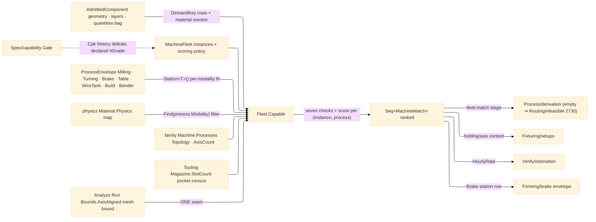

# [RASM_FABRICATION_MACHINE_FLEET]

The machine-capability registry: `Fleet` the static surface owning the ONE capability join `Capable(AdmittedComponent, MachineFleet) → Seq<MachineMatch>` — every shop machine instance crossed with its admitted `ProcessKind` set, each pair scored through seven typed checks (work-envelope containment, axis-count/rotary-topology admission, spindle band, tool-pocket capacity, material admission, tolerance-grade capability, per-process station envelope), feasible pairs ranked by the fleet's scoring policy. The INSTANCE-vs-AXIS split is law: `Process/family#PROCESS_FAMILY` `Machine` is the KIND axis (`mill-5axis`, `robot-6axis`, `press-brake-cnc` — kinematics + holding + topology); `MachineInstance` is the shop's PHYSICAL machine binding one `Machine` row plus the measured per-instance columns — instance DATA over the family AXIS, never a parallel machine enum. The match row is the routing feed `Process/derivation` consumes: one `MachineMatch` per feasible `(instance, process)` pair carrying the `CapabilityCheck` flag set, the envelope headroom, the grade margin, and the composite score — an EMPTY `Seq<MachineMatch>` is a VALID verdict, never a fault minted here; `Process/derivation` routes `FabricationFault.RoutingInfeasible` 2730 when the empty match exhausts its routing stage.

The station tier is the per-process capability hole closed: `ProcessEnvelope` is ONE closed `[Union]` of per-process capability rows — `Milling` (spindle power/band + smallest cutter), `Turning` (swing, between-centers, bar capacity, spindle band), `Brake` (tonnage, gauge travel, open height, bed length — the projection `Forming/brake` consumes as its envelope), `Table` (cutting-bed extents + thickness class for the plasma/laser/waterjet family), `WireTank` (U/V travel, guide taper limit, submerged height — the wire-EDM tank `Toolpath/wire` capability reads), `Build` (additive build volume + head census — superseding a parallel machine-profile table), `Bender` (CLR range + die census for rotary-draw tube work) — carried as instance rows on `MachineInstance.Stations` with one generic `Station<T>()` projection, so `Fleet.Capable` is true for the WHOLE process roster and a new machine family is one union case + one station-fit arm, never a milling-shaped registry that cannot describe a press brake.

The join reads real landed surfaces, no speculative columns: material identity resolves from the component's head composition layer (else the `material` property row) through `Material.Validate` and the MATERIAL truth is the physics map itself — a process is material-admissible exactly when `material.Physics.Find(process.Modality)` holds an entry, so the fleet never re-encodes machinability (`Tooling/cuttingdata` owns measured cells); the spindle law projects the subtractive surface-speed floor onto the instance's smallest cutter (`rpm = v·1000/(π·d_min)` must fit the station's spindle band) while non-rotating modalities gate on the demanded power row alone; envelope containment is the sorted-extent compare (part and envelope diagonals sorted descending, headroom the minimum per-rank slack — any 90° table re-orientation admitted; the kernel `Bounds.Principal` OBB is the recorded refinement row); the component bound folds profile `Loop.Bound()` boxes with the kernel mesh bound at the ONE `Analyze.Run`/`AnalysisQuery.Bounds(Bounds.AxisAligned)` seam. Demand rows ride the component's `Quantities` bag under the typed `DemandKey` vocabulary (`demand:min-axes`/`demand:distinct-tools`/`demand:spindle-kw`/`demand:it-grade`, each row carrying its fallback) — `Ingress/element` writes the bag, this page owns the reading vocabulary. Grade capability starts from the instance's DECLARED best IT grade: the `Spec/capability` `Capability.Gate` Cpk history defeats the declared column (the `CapabilityVerdict` input-carry on `owner#atoms` is the standing shape); rotary-topology admission gates on the family `Machine.Topology` ROW — the per-move TCP/RTCP inverse truth stays `Kinematics/machine`, and articulated-arm reach truth stays `Kinematics/cell#ROBOT_CELL`'s reach fold — fleet's envelope gate is the coarse plan-time filter, never a re-derived IK.

Wire posture: HOST-LOCAL. `MachineInstance`/`MachineMatch` rows cross only the in-process seam to the derivation orchestrator, the setups scheduler, and the estimation rate read — never a browser or peer wire; no row sits between wire and rail.

## [01]-[INDEX]

- [01]-[MACHINE_FLEET]: owns the `DemandKey` demand-row vocabulary, the `ProcessEnvelope` per-process station union, the `MachineInstance` shop-machine record over the family `Machine` axis, the `FleetPolicy`/`MachineFleet` registry, the `CapabilityCheck` seven-flag verdict, the `MachineMatch` scored `(instance, process)` row, and the `Fleet.Capable` join + `AdmitInstance` span-keyed registry boundary — the plan-time machine filter `Process/derivation`'s fleet-match stage consumes.

## [02]-[MACHINE_FLEET]

- Owner: `DemandKey` `[SmartEnum<string>]` the well-known `Quantities`-bag demand rows (`demand:min-axes`/`demand:distinct-tools`/`demand:spindle-kw`/`demand:it-grade`), each carrying its `Fallback` and the polymorphic `Read(Map<string,double>)` projection; `ProcessEnvelope` the closed seven-case station union with the spindle-band projection folded across its spindle-bearing cases; `MachineInstance` the physical-machine record — `Id`, the family `Machine` `Kind`, the measured `Envelope` travels, the `Stations` capability rows with the generic `Station<T>()` projection, the `Tooling/magazine#TOOL_MAGAZINE` `Magazine` row + `Pockets` override (`0` reads `Magazine.SlotCount`), the `Materials` allowlist (`empty` = open, physics decides), the declared `ItGrade`, the `HourlyRate` cost column `Verify/estimation` reads, and the `Option<RobotCell>` cell descriptor; `FleetPolicy` the scoring weights (headroom/grade/parsimony); `MachineFleet` the shop registry (`Instances` + `Policy` — the ranking policy IS shop data); `CapabilityCheck` the seven-flag typed verdict with the derived `Feasible` conjunction; `MachineMatch` the scored `(Instance, Process, Checks, EnvelopeHeadroom, GradeMargin, Score)` row; `Fleet` the static surface owning `Capable` and `AdmitInstance`.
- Cases: the seven checks — `Envelope` (sorted-extent headroom ≥ 0) · `Topology` (`AxisCount` ≥ demanded axes, a ≥5-axis demand requiring a `Rotary` topology row or a present cell) · `Spindle` (power row + subtractive rpm-band law over the station's spindle columns) · `ToolCapacity` (pocket census ≥ demanded distinct tools) · `Material` (allowlist ∩ physics-map membership) · `Grade` (declared IT ≤ demanded IT) · `Station` (the modality's demanded `ProcessEnvelope` case present and part-fitting: `Table` bed for thermal/abrasive, `WireTank` submerged height for erosion, `Build` volume for additive, `Brake`/`Bender` for formed work, vacuous where the modality demands no station); `DemandKey` rows 4; `ProcessEnvelope` cases 7; the pair enumeration is `fleet.Instances × instance.Kind.Processes` FILTERED by the physics map before checking — a process whose modality the material never carries produces no row at all, so the match set is physics-true by construction.
- Entry: `public static Fin<Seq<MachineMatch>> Capable(AdmittedComponent component, MachineFleet fleet)` — the ONE join; `Fin<T>` routes `GeometryFault.DegenerateInput` for an unresolvable material key, a material-free component, or a geometry-free component (no profile and no mesh — the bound is unformable); the EMPTY feasible set returns `Succ` (a verdict, not a failure); `public static Fin<MachineInstance> AdmitInstance(...)` is the span-keyed registry boundary admitting shop-configuration text through `ProcessFamily.AdmitMachine` + `ToolMagazine.AdmitMagazine` + `Material.Validate` and gating every physical scalar (non-finite or negative rate, out-of-band grade, negative pocket census) typed, never an exception and never an unexamined scalar.
- Auto: `Capable` binds the material resolve, the component bound (one fold over profile boxes + the kernel mesh-bound seam), then folds instances — each admitted process filtered by `material.Physics.Find(process.Modality)`, each surviving pair scored by `Match`: headroom from the sorted-extent compare, demanded axes/grade/tools/power read through `DemandKey.Read` fallbacks, spindle fitted by the surface-speed floor over the station's smallest cutter, station fitted per modality, the score `HeadroomWeight·headroom + GradeWeight·gradeMargin − ParsimonyWeight·AxisCount` (the parsimony term prefers the SMALLEST capable machine — a 3-axis job never ranks a trunnion first), feasible rows ordered descending. `Process/derivation` consumes the ranked rows at its fleet-match stage and routes `RoutingInfeasible` 2730 on exhaustion; `Fixturing/setups` reads the matched instance's holding/axis context; `Verify/estimation` reads `HourlyRate` off the matched instance; `Forming/brake` reads the matched `Brake` station as its envelope row.
- Receipt: the `MachineMatch` IS the typed capability evidence — the seven-flag `CapabilityCheck`, the headroom/margin scalars, and the composite score; no bare bool, no filtered instance list without its verdict trail, no generic capability ledger.
- Packages: `Process/family#PROCESS_FAMILY` (`Machine`/`ProcessKind`/`ProcessModality` axes — composed), `Process/physics#CUT_PARAMETER` (`Material` identity map + `ModalityPhysics.Subtractive` floor — the material-admission truth), `Tooling/magazine#TOOL_MAGAZINE` (`Magazine` slot axis — the pocket census), `Process/owner#FABRICATION_OWNER` (`AdmittedComponent`/`Loop.Bound` — composed), `Kinematics/cell#ROBOT_CELL` (`RobotCell` descriptor — the articulated-arm column), kernel `Analysis/query` (`Analyze.Run` + `AnalysisQuery.Bounds(Bounds.AxisAligned)` → `BoundingBox` — the ONE mesh-bound seam, single-geometry form), `Rhino.Geometry` (`BoundingBox` — composed), Thinktecture.Runtime.Extensions, LanguageExt.Core, BCL inbox; deferred-read seams: `Kinematics/machine` (per-move rotary inverse + TCP/RTCP admission — fleet gates on the family `Topology` row only), `Spec/capability` (`Capability.Gate` Cpk history defeats the declared `ItGrade` column; the `int` grade column migrates onto the Spec-owned `ItGrade` owner when its value object lands).
- Growth: a new machine family is one `ProcessEnvelope` case + one station-fit arm; a new capability dimension is one `CapabilityCheck` flag + one `Match` term; a new demand row is one `DemandKey` row with its fallback; per-instance scheduling calendars and load factors are instance columns the derivation scheduler reads; the OBB envelope refinement is one `MeshBound` row onto `Bounds.Principal`; a persisted shop registry is one ingress arm over `AdmitInstance`; zero new surface.
- Boundary: `MachineInstance` is instance DATA over the family `Machine` AXIS and a parallel machine enum, a flattened `mill-5axis-shop2` row, or a fleet-local topology column is the deleted form; the per-process station rows live on THIS union and a plane-local machine table (`BrakeEnvelope` minted in Forming, a `MachineProfile` table in Additive) is the deleted parallel form — the owning plane CONSUMES its station case; the empty match set is a VERDICT and a fleet-minted fault arm is the rejected form — `RoutingInfeasible` 2730 is `Process/derivation`'s; the match is the typed `MachineMatch` and a bare-bool filter is the deleted form; demand reads go through the `DemandKey` rows and a raw `"demand:*"` string at a call site is the named defect; material admissibility is the physics map join and a fleet-local machinability table is the deleted form; the mesh bound is the ONE `Analyze.Run` seam and a hand-rolled vertex fold is the rejected re-derivation; articulated-arm reach truth is the cell's and grade truth migrates to `Capability.Gate` when it lands — the declared columns are seeds, never second oracles.

```csharp signature
// --- [RUNTIME_PRELUDE] ----------------------------------------------------------------------------------------------------------------------------
using LanguageExt;
using LanguageExt.Common;
using Rasm.Analysis;                      // Analyze.Run + AnalysisQuery.Bounds — the ONE kernel mesh-bound seam
using Rasm.Fabrication.Process;           // AdmittedComponent · Machine/ProcessKind/ProcessModality · Material physics rows
using Rasm.Fabrication.Tooling;           // Magazine — the pocket census axis
using Rasm.Meshing;                       // MeshSpace
using Rasm.Numerics;                      // GeometryFault band-2400
using Rhino.Geometry;
using Thinktecture;
using static LanguageExt.Prelude;

namespace Rasm.Fabrication.Kinematics;

// --- [TYPES] --------------------------------------------------------------------------------------------------------------------------------------
// The demand-row vocabulary over the AdmittedComponent Quantities bag: Ingress/element writes the rows,
// this axis owns the keys and fallbacks — a raw "demand:*" string at a call site is the named defect.
[SmartEnum<string>]
public sealed partial class DemandKey {
    public static readonly DemandKey MinAxes = new("demand:min-axes", fallback: 3.0);
    public static readonly DemandKey DistinctTools = new("demand:distinct-tools", fallback: 1.0);
    public static readonly DemandKey SpindleKw = new("demand:spindle-kw", fallback: 0.0);
    public static readonly DemandKey ItGrade = new("demand:it-grade", fallback: 12.0);

    public double Fallback { get; }

    public double Read(Map<string, double> quantities) => quantities.Find(Key).IfNone(Fallback);
}

// The per-process station tier: one closed union, one case per machine family, carried as instance rows —
// the owning process plane consumes its case (brake reads Brake, wire reads WireTank, additive reads Build).
[Union(ConversionFromValue = ConversionOperatorsGeneration.None)]
public abstract partial record ProcessEnvelope {
    private ProcessEnvelope() { }

    public sealed record Milling(double SpindlePowerKw, double SpindleMaxRpm, double MinToolDiameterMm) : ProcessEnvelope;
    public sealed record Turning(double SwingMm, double BetweenCentersMm, double BarCapacityMm, double SpindlePowerKw, double SpindleMaxRpm) : ProcessEnvelope;
    public sealed record Brake(double CapacityKn, double GaugeTravelMm, double OpenHeightMm, double BedLengthMm) : ProcessEnvelope;
    public sealed record Table(double BedXMm, double BedYMm, double MaxThicknessMm) : ProcessEnvelope;
    public sealed record WireTank(double UTravelMm, double VTravelMm, double MaxTaperDeg, double SubmergedHeightMm) : ProcessEnvelope;
    public sealed record Build(BoundingBox Volume, int Heads) : ProcessEnvelope;
    public sealed record Bender(double MinClrMm, double MaxClrMm, int DieCount) : ProcessEnvelope;

    // The spindle band folded across the spindle-bearing cases; stations without a spindle project None.
    public Option<(double PowerKw, double MaxRpm, double MinToolMm)> Spindle => this switch {
        Milling m => Some((m.SpindlePowerKw, m.SpindleMaxRpm, m.MinToolDiameterMm)),
        Turning t => Some((t.SpindlePowerKw, t.SpindleMaxRpm, 1.0)),
        _ => None,
    };
}

// --- [MODELS] -------------------------------------------------------------------------------------------------------------------------------------
// Instance DATA over the family Machine AXIS: the shop's physical machine with measured envelope, station,
// pocket, allowlist, declared-grade, and rate columns; Cell rides only articulated-arm rows.
public sealed record MachineInstance(
    string Id,
    Machine Kind,
    BoundingBox Envelope,
    Arr<ProcessEnvelope> Stations,
    Magazine Magazine,
    int Pockets,
    Set<Material> Materials,
    int ItGrade,
    double HourlyRate,
    Option<RobotCell> Cell) {
    public int PocketCount => Pockets > 0 ? Pockets : Magazine.SlotCount;

    // The frozen estimation read: the strongest spindle-bearing station's power, 0 when none — derived from
    // the station family, never a parallel column.
    public double SpindlePowerKw =>
        Stations.Bind(static row => row.Spindle.ToArr()).Map(static band => band.PowerKw).Fold(0.0, Math.Max);

    public Option<T> Station<T>() where T : ProcessEnvelope =>
        Stations.Find(static row => row is T).Map(static row => (T)row);
}

public sealed record FleetPolicy(double HeadroomWeight, double GradeWeight, double ParsimonyWeight) {
    public static readonly FleetPolicy Canonical = new(HeadroomWeight: 1.0, GradeWeight: 1.0, ParsimonyWeight: 0.5);
}

public sealed record MachineFleet(Seq<MachineInstance> Instances, FleetPolicy Policy);

public readonly record struct CapabilityCheck(
    bool Envelope, bool Topology, bool Spindle, bool ToolCapacity, bool Material, bool Grade, bool Station) {
    public bool Feasible => Envelope && Topology && Spindle && ToolCapacity && Material && Grade && Station;
}

// The typed scored verdict: one row per feasible (instance, process) pair — never a bare bool.
public sealed record MachineMatch(
    MachineInstance Instance, ProcessKind Process, CapabilityCheck Checks, double EnvelopeHeadroom, double GradeMargin, double Score);

// --- [OPERATIONS] ---------------------------------------------------------------------------------------------------------------------------------
public static class Fleet {
    const string MaterialProperty = "material";

    // The ONE capability join: instances × admitted processes, physics-filtered, seven checks per pair, feasible
    // rows scored and ranked. The EMPTY set is a VALID verdict — derivation routes RoutingInfeasible 2730.
    public static Fin<Seq<MachineMatch>> Capable(AdmittedComponent component, MachineFleet fleet) =>
        DemandMaterial(component).Bind(material => Bound(component).Map(part =>
            fleet.Instances
                .Bind(instance => toSeq(instance.Kind.Processes)
                    .Filter(process => material.Physics.Find(process.Modality).IsSome)
                    .Map(process => Match(component, part, instance, process, material, fleet.Policy)))
                .Filter(static m => m.Checks.Feasible)
                .OrderByDescending(static m => m.Score).ToSeq()));

    static MachineMatch Match(
        AdmittedComponent component, BoundingBox part, MachineInstance instance, ProcessKind process, Material material, FleetPolicy policy) {
        double headroom = Headroom(part, instance.Envelope);
        int demandedAxes = (int)DemandKey.MinAxes.Read(component.Quantities);
        int demandedGrade = (int)DemandKey.ItGrade.Read(component.Quantities);
        CapabilityCheck checks = new(
            Envelope: headroom >= 0.0,
            Topology: instance.Kind.AxisCount >= demandedAxes && (demandedAxes < 5 || instance.Kind.Topology.Rotary || instance.Cell.IsSome),
            Spindle: SpindleFit(instance, material, process, component),
            ToolCapacity: instance.PocketCount >= (int)DemandKey.DistinctTools.Read(component.Quantities),
            Material: instance.Materials.IsEmpty || instance.Materials.Contains(material),
            Grade: instance.ItGrade <= demandedGrade,
            Station: StationFit(instance, process.Modality, part, component));
        double gradeMargin = demandedGrade - instance.ItGrade;
        return new MachineMatch(instance, process, checks, headroom, gradeMargin,
            Score: policy.HeadroomWeight * headroom + policy.GradeWeight * gradeMargin - policy.ParsimonyWeight * instance.Kind.AxisCount);
    }

    // Subtractive spindle law: the material's surface-speed floor at the station's smallest admitted cutter must
    // fit the spindle band (rpm = v·1000/(π·d)); non-rotating modalities gate on the demanded power row alone.
    static bool SpindleFit(MachineInstance instance, Material material, ProcessKind process, AdmittedComponent component) =>
        process.Modality != ProcessModality.Subtractive
            ? DemandKey.SpindleKw.Read(component.Quantities) <= 0.0
                || instance.Stations.Exists(s => s.Spindle.Map(b => DemandKey.SpindleKw.Read(component.Quantities) <= b.PowerKw).IfNone(false))
            : instance.Stations
                .Bind(static s => s.Spindle.ToArr())
                .Exists(band => DemandKey.SpindleKw.Read(component.Quantities) <= band.PowerKw
                    && material.Physics.Find(ProcessModality.Subtractive)
                        .Map(p => p is ModalityPhysics.Subtractive sub
                            && sub.SurfaceSpeed * 1000.0 / (Math.PI * Math.Max(band.MinToolMm, 0.1)) <= band.MaxRpm)
                        .IfNone(false));

    // Per-modality station gate: the demanded ProcessEnvelope case must be present and part-fitting; a modality
    // demanding no station passes vacuously. Brake/Bender interior feasibility stays the owning plane's fold.
    static bool StationFit(MachineInstance instance, ProcessModality modality, BoundingBox part, AdmittedComponent component) =>
        modality.Switch(
            state: (Instance: instance, Part: part, Thickness: component.SheetThicknessMm),
            subtractive: static s => s.Instance.Stations.Exists(static row => row.Spindle.IsSome),
            thermal: static s => TableFit(s.Instance, s.Part, s.Thickness),
            abrasive: static s => TableFit(s.Instance, s.Part, s.Thickness),
            erosion: static s => s.Instance.Station<ProcessEnvelope.WireTank>()
                .Map(t => s.Part.Diagonal.Z <= t.SubmergedHeightMm).IfNone(false),
            additive: static s => BuildFit(s.Instance, s.Part),
            formed: static s => s.Instance.Station<ProcessEnvelope.Brake>()
                .Map(b => Extents(s.Part)[0] <= b.BedLengthMm).IfNone(s.Instance.Station<ProcessEnvelope.Bender>().IsSome),
            joined: static s => true);

    static bool TableFit(MachineInstance instance, BoundingBox part, Option<double> thickness) =>
        instance.Station<ProcessEnvelope.Table>()
            .Map(t => Extents(part)[0] <= Math.Max(t.BedXMm, t.BedYMm)
                && Extents(part)[1] <= Math.Min(t.BedXMm, t.BedYMm)
                && thickness.Map(mm => mm <= t.MaxThicknessMm).IfNone(true))
            .IfNone(false);

    static bool BuildFit(MachineInstance instance, BoundingBox part) =>
        instance.Station<ProcessEnvelope.Build>().Map(b => Headroom(part, b.Volume) >= 0.0).IfNone(false);

    // Sorted-extent containment: both diagonals sorted descending, headroom the minimum per-rank slack — any
    // 90-degree table re-orientation admitted; the kernel Bounds.Principal OBB is the recorded refinement row.
    static double Headroom(BoundingBox part, BoundingBox envelope) {
        double[] p = Extents(part), e = Extents(envelope);
        return Enumerable.Range(0, 3).Min(i => e[i] - p[i]);
    }

    static double[] Extents(BoundingBox box) => [.. new[] { box.Diagonal.X, box.Diagonal.Y, box.Diagonal.Z }.OrderByDescending(static v => v)];

    static Fin<BoundingBox> Bound(AdmittedComponent component) =>
        component.Mesh
            .Match(Some: MeshBound, None: () => Fin.Succ(BoundingBox.Empty))
            .Map(meshBox => component.Profiles.Fold(meshBox, static (acc, loop) => BoundingBox.Union(acc, loop.Bound())))
            .Bind(box => box.IsValid
                ? Fin.Succ(box)
                : Fin.Fail<BoundingBox>(GeometryFault.DegenerateInput($"fleet:bound:{component.RepresentationKey}").ToError()));

    // The ONE kernel mesh-bound seam: Analyze.Run over AnalysisQuery.Bounds(Bounds.AxisAligned), single-geometry
    // form of the params span entry — never a vertex fold.
    static Fin<BoundingBox> MeshBound(MeshSpace mesh) =>
        Analyze.Run<MeshSpace, BoundingBox>(AnalysisQuery.Bounds(Bounds.AxisAligned), mesh)
            .ToFin()
            .Bind(static boxes => boxes.HeadOrNone().ToFin(GeometryFault.DegenerateInput("fleet:mesh-bound").ToError()));

    // The component's material identity: the head composition layer's key, else the material property row —
    // boundary-mapped through Material.Validate; a component with no resolvable material is degenerate input.
    static Fin<Material> DemandMaterial(AdmittedComponent component) =>
        component.Layers.HeadOrNone().Map(static l => l.MaterialKey).BiBind(Some, () => component.Properties.Find(MaterialProperty)).Match(
            Some: key => Material.Validate(key, null, out var m) is { } f
                ? Fin.Fail<Material>(GeometryFault.DegenerateInput($"fleet:material:{f.Message}").ToError())
                : Fin.Succ(m!),
            None: () => Fin.Fail<Material>(GeometryFault.DegenerateInput($"fleet:material:none:{component.RepresentationKey}").ToError()));

    // --- [BOUNDARIES] — shop-configuration text admits ONCE through the span-keyed registry boundary --------------------------------------------------
    public static Fin<MachineInstance> AdmitInstance(ReadOnlySpan<char> machineKey, ReadOnlySpan<char> magazineKey, string id, BoundingBox envelope,
        Arr<ProcessEnvelope> stations, int pockets, Seq<string> materialKeys, int itGrade, double hourlyRate, Option<RobotCell> cell) =>
        ProcessFamily.AdmitMachine(machineKey).Bind(kind =>
            ToolMagazine.AdmitMagazine(magazineKey).Bind(magazine =>
                Materials(materialKeys).Bind(materials =>
                    guard(double.IsFinite(hourlyRate) && hourlyRate >= 0.0 && pockets >= 0 && itGrade is >= 1 and <= 18,
                            GeometryFault.DegenerateInput($"fleet:instance-scalars:{id}").ToError()).ToFin()
                        .Map(_ => new MachineInstance(id, kind, envelope, stations, magazine, pockets, materials, itGrade, hourlyRate, cell)))));

    static Fin<Set<Material>> Materials(Seq<string> keys) =>
        keys.Traverse(k => Material.Validate(k, null, out var m) is { } f
            ? Fin.Fail<Material>(GeometryFault.DegenerateInput($"fleet:material:{f.Message}").ToError())
            : Fin.Succ(m!)).Map(toSet);
}
```


