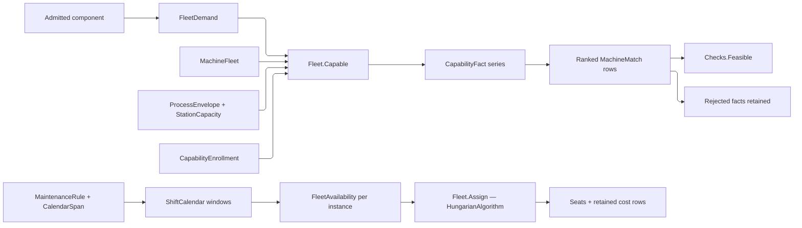

# [RASM_FABRICATION_MACHINE_FLEET]

`Fleet` owns the one shop-capability join from an admitted component and an admitted `MachineFleet` to ranked `MachineMatch` evidence, and the one finite-capacity seat from a demand roster to physical stations. `FleetDemand` reads the component quantity bag once through typed `DemandKey` rows keyed in the seam's own `PropertyName` space, each `CapabilityCriterion` generates its fact, and each `FleetObjective` generates its weighted penalty; rejected pairs remain visible with demanded, available, unit, and locus evidence.

`StationCapacity` is a TYPED per-case payload carrying its `CapacityAxis` and a `UnitsNet` quantity, so two stations compare only where they answer the same axis and a kilonewton can never be ranked against a millimetre. Availability is a GENERATED calendar: `CalendarSpan` closes dated and yearly-recurrent windows on `AnnualDate`, `MaintenanceRule` generates every hole, `ShiftCalendar.Horizon` reports capacity per `YearMonth`, and a caller-supplied literal interval roster is the deleted form. `AvailabilityPlan.Finish` is the ONE seat — the body that consumes an instance's staffed windows at its committed load — so `Process/derivation` advances each operation through the assigned station's own plan, `FleetAvailability` publishes the window census per `MachineInstanceKey` beside it, and `Fleet.Assign` covers a demand roster through `HungarianAlgorithm` over that same seat with its cost row retained as promise-interval evidence. `MachineInstanceKey` arrives settled from `Process/owner#PLAN_ATOMS`; a bare instance string is the deleted form. A process names NO dialect, so controller fitness reads `PostDialect.Admits` against the process modality.

## [01]-[INDEX]

- [02]-[DEMAND_AXES]: `DemandUnit`, `DemandKey`, `FabricationRows`, and the once-derived `FleetDemand` with its projected `ConstitutiveState`.
- [03]-[STATION_CAPABILITY]: `DeliveryLane`, `StationProcesses`, `ProcessEnvelope` with its base delivery, power, and admitted-process columns, `StationCapacity`, `SpindleWindow`, and `StationAssessment`.
- [04]-[SHIFT_CALENDAR]: `CalendarSpan`, `CalendarExceptionKind`, `ShiftBlock`, `CalendarException`, `MaintenanceRule`, `ShiftCalendar`, `MachineAvailability`, and `AvailabilityPlan`.
- [05]-[FLEET_REGISTRY]: `PerformanceBaseline`, `MachinePerformance`, `MachineInstance`, `MachineRegistration`, `FleetRegistrationMap`, `CapabilityEnrollment`, `MachineFleet`, and `FleetSlots`.
- [06]-[CAPABILITY_JOIN]: `CapabilityCriterion`, `FleetObjective`, `FleetPolicy`, `CapabilityFact`, `CapabilityCheck`, the context shapes, `MachineMatch`, and `Fleet.Capable`.
- [07]-[INSTANCE_CONTENTION]: `InstanceWindow`, `FleetAvailability`, `DemandSlot`, `AssignmentCost`, `FleetAssignment`, and `Fleet.Assign`.

## [02]-[DEMAND_AXES]

- Owner: `DemandKey` owns quantity ingress, its row name, and scalar admission; `DemandUnit` owns the evidence unit tag every `CapabilityFact` carries; `FleetDemand` owns the once-derived component demand and its projected constitutive state.
- Law: a component quantity is keyed by `PropertyName` minted through `PropertyCategory.Fabrication.Row` — the one key space `AdmittedComponent.Quantities` and `Ingress/element` already write — so a bare string key never reaches the bag and a `PropertyName.Create` at a read site is the deleted form.
- Law: an absent CEILING is `None`, never a positive-infinity bound. A sentinel ceiling compares as a real limit in every fold that reads it and silently admits a value no shop declared.
- Auto: every constitutive axis is a `DemandKey` row the ingress already read and range-admitted against the same bounds `ConstitutiveState` validates, so the state is a total projection of the bag — derived once per demand on the rail, never a second stored copy a caller can fill with three of its six members.
- Growth: a new component scalar is one `DemandKey` row carrying its unit, fallback, integrality, and bounds.
- Boundary: this cluster reads the admitted component's own bag and nothing else; geometry bounds and material identity resolve at the join.

```csharp signature
// --- [RUNTIME_PRELUDE] ----------------------------------------------------------------------------------------------------------------------------
using System.Linq;
using LanguageExt;
using LanguageExt.Common;
using NodaTime;
using NodaTime.TimeZones;
using QuikGraph.Algorithms.Assignment;
using Rasm.Analysis;
using Rasm.Domain;
using Rasm.Element.Projection;
using Rasm.Element.Properties;
using Rasm.Fabrication.Process;
using Rasm.Fabrication.Spec;
using Rasm.Fabrication.Tooling;
using Rasm.Meshing;
using Rasm.Numerics;
using Rhino.Geometry;
using Riok.Mapperly.Abstractions;
using Thinktecture;
using UnitsNet;
using static LanguageExt.Prelude;

namespace Rasm.Fabrication.Kinematics;

// --- [TYPES] --------------------------------------------------------------------------------------------------------------------------------------
// --- [DEMAND_AXES]
[SmartEnum<string>]
public sealed partial class DemandUnit {
    public static readonly DemandUnit Count = new("count");
    public static readonly DemandUnit Millimeter = new("mm");
    public static readonly DemandUnit Micrometer = new("um");
    public static readonly DemandUnit Degree = new("deg");
    public static readonly DemandUnit Kilowatt = new("kw");
    public static readonly DemandUnit Kilonewton = new("kn");
    public static readonly DemandUnit Kilogram = new("kg");
    public static readonly DemandUnit KilogramPerMinute = new("kg/min");
    public static readonly DemandUnit NewtonMeter = new("n-m");
    public static readonly DemandUnit Bar = new("bar");
    public static readonly DemandUnit Kilohertz = new("khz");
    public static readonly DemandUnit PerMinute = new("1/min");
    public static readonly DemandUnit PerSecond = new("1/s");
    public static readonly DemandUnit DegreeCelsius = new("deg-c");
    public static readonly DemandUnit Ratio = new("ratio");
}

// The row names this page reads off an admitted component's bag, minted under the seam's own blessed prefix so the
// fleet reads exactly what `Ingress/element` wrote.
public static class FabricationRows {
    public static readonly PropertyName Material = PropertyCategory.Fabrication.Row("material");
}

// A row names its own bag key, its evidence unit, the value a silent bag answers with, and its admitted band; the
// ceiling is `None` where the axis has no shop-declared upper bound.
[SmartEnum<string>]
public sealed partial class DemandKey {
    public static readonly DemandKey MinAxes = Of("demand:min-axes", DemandUnit.Count, 3.0, true, 1.0, None);
    public static readonly DemandKey DistinctTools = Of("demand:distinct-tools", DemandUnit.Count, 0.0, true, 0.0, None);
    public static readonly DemandKey SpindleKw = Of("demand:spindle-kw", DemandUnit.Kilowatt, 0.0, false, 0.0, None);
    public static readonly DemandKey ItGrade = Of("demand:it-grade", DemandUnit.Count, 12.0, true, 1.0, Some(18.0));
    public static readonly DemandKey WorkpieceDiameter = Of("demand:workpiece-diameter-mm", DemandUnit.Millimeter, 0.0, false, 0.0, None);
    public static readonly DemandKey WorkpieceLength = Of("demand:workpiece-length-mm", DemandUnit.Millimeter, 0.0, false, 0.0, None);
    public static readonly DemandKey Taper = Of("demand:taper-deg", DemandUnit.Degree, 0.0, false, 0.0, None);
    public static readonly DemandKey BuildHeads = Of("demand:build-heads", DemandUnit.Count, 1.0, true, 1.0, None);
    public static readonly DemandKey BrakeForce = Of("demand:brake-force-kn", DemandUnit.Kilonewton, 0.0, false, 0.0, None);
    public static readonly DemandKey GaugeTravel = Of("demand:gauge-travel-mm", DemandUnit.Millimeter, 0.0, false, 0.0, None);
    public static readonly DemandKey OpenHeight = Of("demand:open-height-mm", DemandUnit.Millimeter, 0.0, false, 0.0, None);
    public static readonly DemandKey BedLength = Of("demand:bed-length-mm", DemandUnit.Millimeter, 0.0, false, 0.0, None);
    public static readonly DemandKey Miter = Of("demand:miter-deg", DemandUnit.Degree, 0.0, false, 0.0, None);
    public static readonly DemandKey Payload = Of("demand:payload-kg", DemandUnit.Kilogram, 0.0, false, 0.0, None);
    public static readonly DemandKey MinReliability = Of("demand:min-reliability", DemandUnit.Ratio, 0.0, false, 0.0, Some(1.0));
    public static readonly DemandKey ToolDiameter = Of("demand:tool-diameter-mm", DemandUnit.Millimeter, 0.0, false, 0.0, None);
    public static readonly DemandKey SpindleTorque = Of("demand:spindle-torque-nm", DemandUnit.NewtonMeter, 0.0, false, 0.0, None);
    public static readonly DemandKey PartMass = Of("demand:part-mass-kg", DemandUnit.Kilogram, 0.0, false, 0.0, None);
    public static readonly DemandKey LayerHeight = Of("demand:layer-height-mm", DemandUnit.Millimeter, 0.0, false, 0.0, None);
    public static readonly DemandKey Pressure = Of("demand:pressure-bar", DemandUnit.Bar, 0.0, false, 0.0, None);
    public static readonly DemandKey AbrasiveFlow = Of("demand:abrasive-kg-min", DemandUnit.KilogramPerMinute, 0.0, false, 0.0, None);
    public static readonly DemandKey WireDiameter = Of("demand:wire-diameter-mm", DemandUnit.Millimeter, 0.0, false, 0.0, None);
    public static readonly DemandKey ExternalAxes = Of("demand:external-axes", DemandUnit.Count, 0.0, true, 0.0, None);
    public static readonly DemandKey CertificationRequired = Of("demand:certification-required", DemandUnit.Count, 0.0, true, 0.0, Some(1.0));
    public static readonly DemandKey Frequency = Of("demand:frequency-khz", DemandUnit.Kilohertz, 0.0, false, 0.0, None);
    public static readonly DemandKey Stroke = Of("demand:stroke-mm", DemandUnit.Millimeter, 0.0, false, 0.0, None);
    public static readonly DemandKey LineStations = Of("demand:line-stations", DemandUnit.Count, 1.0, true, 1.0, None);
    public static readonly DemandKey CyclesPerMinute = Of("demand:cycles-per-minute", DemandUnit.PerMinute, 0.0, false, 0.0, None);
    public static readonly DemandKey Temperature = Of("demand:temperature-c", DemandUnit.DegreeCelsius, 20.0, false, 0.0, None);
    public static readonly DemandKey Hardness = Of("demand:hardness", DemandUnit.Count, 0.0, false, 0.0, None);
    public static readonly DemandKey StrainRate = Of("demand:strain-rate", DemandUnit.PerSecond, 0.0, false, 0.0, None);
    public static readonly DemandKey Strain = Of("demand:strain", DemandUnit.Ratio, 0.0, false, 0.0, None);
    public static readonly DemandKey Moisture = Of("demand:moisture", DemandUnit.Ratio, 0.0, false, 0.0, Some(1.0));
    public static readonly DemandKey GrainSize = Of("demand:grain-size-um", DemandUnit.Micrometer, 0.0, false, 0.0, None);
    public static readonly DemandKey BarFeedRequired = Of("demand:bar-feed-required", DemandUnit.Count, 0.0, true, 0.0, Some(1.0));
    public static readonly DemandKey BendRadius = Of("demand:bend-radius-mm", DemandUnit.Millimeter, 0.0, false, 0.0, None);

    public PropertyName Row { get; }
    public DemandUnit Unit { get; }
    public double Fallback { get; }
    public bool Integral { get; }
    public double Minimum { get; }
    public Option<double> Maximum { get; }

    private static DemandKey Of(
        string key, DemandUnit unit, double fallback, bool integral, double minimum, Option<double> maximum) =>
        new(key, PropertyCategory.Fabrication.Row(key), unit, fallback, integral, minimum, maximum);

    internal Fin<double> Read(Map<PropertyName, double> quantities) {
        double value = quantities.Find(Row).IfNone(Fallback);
        return double.IsFinite(value) && value >= Minimum
            && Maximum.Map(ceiling => value <= ceiling).IfNone(true)
            && (!Integral || value == Math.Truncate(value))
            ? Fin.Succ(value)
            : Fin.Fail<double>(new FabricationFault.PolicyInadmissible(FabConcern.Fleet, $"fleet:demand:{Key}"));
    }
}

// --- [MODELS] -------------------------------------------------------------------------------------------------------------------------------------
internal sealed record FleetDemand(BoundingBox Part, Material Material, Map<DemandKey, double> Scalars, ConstitutiveState State) {
    public double this[DemandKey key] => Scalars.Find(key).IfNone(key.Fallback);

    // Every constitutive axis is a `DemandKey` row the ingress already read and range-admitted against the same
    // bounds `ConstitutiveState` validates, so the state is a total projection of the bag — admitted once on the
    // rail rather than through a throwing `Create` inside a property initializer.
    public static Fin<FleetDemand> Of(BoundingBox part, Material material, Map<DemandKey, double> scalars) =>
        ConstitutiveState.Validate(
                Read(scalars, DemandKey.Temperature),
                Read(scalars, DemandKey.Hardness),
                Read(scalars, DemandKey.StrainRate),
                Read(scalars, DemandKey.Strain),
                Read(scalars, DemandKey.Moisture),
                Read(scalars, DemandKey.GrainSize),
                out ConstitutiveState state)
            .Admitted(state)
            .Map(admitted => new FleetDemand(part, material, scalars, admitted));

    private static double Read(Map<DemandKey, double> scalars, DemandKey key) => scalars.Find(key).IfNone(key.Fallback);
}
```

## [03]-[STATION_CAPABILITY]

- Owner: `ProcessEnvelope` closes installed station capability; `StationCapacity` owns the TYPED capacity a station offers on one `CapacityAxis`; `SpindleWindow` owns the rotating-station speed band; `StationAssessment` owns one station's verdict evidence; `DeliveryLane` owns how a program reaches the machine.
- Cases: `ProcessEnvelope` covers rotating milling, turning, grinding, sawing, thermal sheet cutting, waterjet, ultrasonic abrasion, wire tank, additive build, press brake, linear stroke, roll forming, tube bender, and robot cell. `StationCapacity` closes extent, force, mass, power, pressure, speed, and count payloads.
- Law: a capacity is TYPED and axis-keyed, so two stations compare only where they answer the SAME `CapacityAxis`. The untyped scalar this replaces let a press brake's kilonewtons rank against a wire tank's millimetres whenever one instance carried both stations admitting one process, and the winner was whichever number happened to be larger.
- Law: `Delivery`, `PowerKw`, and the admitted process roster are BASE positional columns. Thirteen of fourteen stations leave an artifact where their controller reads it, so those thirteen derive one intermediate `Dropped` base and spell nothing, while the cell case supplies `Controller` directly — the fourteen-arm switch whose thirteen arms were byte-identical has no body left to hold.
- Law: the admitted process roster is stated ONCE, on the base column. Every assessment arm previously re-tested the correspondence its own `Admits` had already decided; the station fold filters on `Admits` before an arm runs, so a re-test is a second statement of one fact.
- Auto: `SpindleWindow.Required` composes `Process/physics#BUDGET_FOLD` `SurfaceSpeed.Rpm` over the CUTTING diameter — the one forward cutting-speed relation in the package — so no arm re-derives `vc * 1000 / (pi * D)`.
- Growth: a new station modality is one `ProcessEnvelope` case with its three base columns and one assessment arm; a new capacity dimension is one `StationCapacity` case over an existing `CapacityAxis` row.
- Boundary: `Process/family` `MachineCapacity` is the machine CLASS envelope admitted with the equipment; `ProcessEnvelope` is the INSTALLED station a program actually runs on, so the two never mirror and a station absent from the shop floor cannot be inferred from the class.

```csharp signature
// --- [STATION_CAPABILITY]
// Two lanes carry a program to a machine: a drop leaves an artifact where the controller reads it, and a controller
// lane owns the exchange, so its receipt carries the transfer log the observation lane would otherwise infer.
[SmartEnum<string>]
public sealed partial class DeliveryLane {
    public static readonly DeliveryLane FileDrop = new("file-drop");
    public static readonly DeliveryLane Controller = new("controller");
}

// The frozen process rosters each station family admits. These seat BEFORE the envelope rows because a static
// initializer reading a later field captures its default.
public static class StationProcesses {
    public static readonly Set<ProcessKind> Milling = Set(
        ProcessKind.Mill, ProcessKind.Route, ProcessKind.Drill, ProcessKind.Bore, ProcessKind.Ream, ProcessKind.GearCut);
    public static readonly Set<ProcessKind> Turning = Set(ProcessKind.Turn);
    public static readonly Set<ProcessKind> Grinding = Set(ProcessKind.Grind, ProcessKind.Hone, ProcessKind.Lap);
    public static readonly Set<ProcessKind> Sawing = Set(ProcessKind.Saw);
    public static readonly Set<ProcessKind> Sheet = Set(
        ProcessKind.Laser, ProcessKind.Plasma, ProcessKind.Oxyfuel, ProcessKind.ElectronBeam);
    public static readonly Set<ProcessKind> Waterjet = Set(ProcessKind.Waterjet);
    public static readonly Set<ProcessKind> Ultrasonic = Set(ProcessKind.Ultrasonic);
    public static readonly Set<ProcessKind> Erosion = Set(ProcessKind.EdmWire);
    public static readonly Set<ProcessKind> Build = Set(
        ProcessKind.FusedFilament, ProcessKind.Deposition, ProcessKind.VatPolymer, ProcessKind.PowderBed,
        ProcessKind.BinderJet, ProcessKind.MaterialJet, ProcessKind.SheetLamination);
    public static readonly Set<ProcessKind> Brake = Set(ProcessKind.PressBrake);
    public static readonly Set<ProcessKind> Press = Set(ProcessKind.Broach, ProcessKind.Stamp, ProcessKind.Forge);
    public static readonly Set<ProcessKind> Roll = Set(ProcessKind.RollForm);
    public static readonly Set<ProcessKind> Bender = Set(ProcessKind.TubeBend);
    public static readonly Set<ProcessKind> Cell = Set(
        ProcessKind.Weld, ProcessKind.Deposition, ProcessKind.DirectedEnergy,
        ProcessKind.FrictionStir, ProcessKind.Braze, ProcessKind.Adhesive);
}

// Capacity is typed and axis-keyed. `Compare` answers `None` across axes, so a fold ranking two stations can only
// rank them where they measure the same dimension — a kilonewton has no order against a millimetre and the type
// system is what says so.
[Union(ConversionFromValue = ConversionOperatorsGeneration.None)]
public abstract partial record StationCapacity(CapacityAxis Axis) {
    public sealed record Extent(CapacityAxis Axis, Length Value) : StationCapacity(Axis);
    public sealed record Load(CapacityAxis Axis, Force Value) : StationCapacity(Axis);
    public sealed record Held(CapacityAxis Axis, Mass Value) : StationCapacity(Axis);
    public sealed record Source(CapacityAxis Axis, Power Value) : StationCapacity(Axis);
    public sealed record Supply(CapacityAxis Axis, Pressure Value) : StationCapacity(Axis);
    public sealed record Rate(CapacityAxis Axis, Speed Value) : StationCapacity(Axis);
    public sealed record Tally(CapacityAxis Axis, int Value) : StationCapacity(Axis);

    // The one scalar egress, in the axis's own canonical unit — read for FACT evidence, never for a cross-axis
    // ranking, which `Compare` refuses structurally.
    public double Magnitude => Switch(
        extent: static row => row.Value.Millimeters,
        load: static row => row.Value.Kilonewtons,
        held: static row => row.Value.Kilograms,
        source: static row => row.Value.Kilowatts,
        supply: static row => row.Value.Bars,
        rate: static row => row.Value.MillimetersPerMinutes,
        tally: static row => row.Value);

    public DemandUnit Unit => Switch(
        extent: static _ => DemandUnit.Millimeter,
        load: static _ => DemandUnit.Kilonewton,
        held: static _ => DemandUnit.Kilogram,
        source: static _ => DemandUnit.Kilowatt,
        supply: static _ => DemandUnit.Bar,
        rate: static _ => DemandUnit.Millimeter,
        tally: static _ => DemandUnit.Count);

    public Option<int> Compare(StationCapacity other) =>
        Axis == other.Axis ? Some(Magnitude.CompareTo(other.Magnitude)) : None;
}

// A rotating station imposes a speed band the cut must land inside; a station that rotates nothing imposes none, so
// its absence is `None` rather than a `true` a fused verdict then reported as power.
public readonly record struct SpindleWindow(RotationalSpeed Required, RotationalSpeed Minimum, RotationalSpeed Maximum) {
    public bool Admits => Required >= Minimum && Required <= Maximum;
}

// `Delivery`, `PowerKw`, and `Processes` are base positional columns each case supplies from its own payload, so a
// station declares no override body and the correspondence is stated once per case.
[Union(ConversionFromValue = ConversionOperatorsGeneration.None)]
public abstract partial record ProcessEnvelope(DeliveryLane Delivery, Option<Power> Source, Set<ProcessKind> Processes) {
    // Every station but the cell leaves its program where its controller reads it, so the shared lane seats on one
    // intermediate base and thirteen cases spell nothing.
    public abstract record Dropped(Option<Power> Source, Set<ProcessKind> Processes)
        : ProcessEnvelope(DeliveryLane.FileDrop, Source, Processes);

    public sealed record Milling(
        Power SpindlePower, RotationalSpeed SpindleMin, RotationalSpeed SpindleMax, Length MinToolDiameter,
        Length MaxToolDiameter, Torque SpindleTorque, Mass TableLoad)
        : Dropped(Some(SpindlePower), StationProcesses.Milling);
    public sealed record Turning(
        Length Swing, Length BetweenCenters, Length BarCapacity, Length ChuckDiameter,
        Power SpindlePower, RotationalSpeed SpindleMin, RotationalSpeed SpindleMax, Set<ProcessKind> Secondary)
        : Dropped(Some(SpindlePower), StationProcesses.Turning + Secondary);
    public sealed record Grinding(
        Length WheelDiameter, Length WheelWidth, Power SpindlePower, RotationalSpeed SpindleMin, RotationalSpeed SpindleMax)
        : Dropped(Some(SpindlePower), StationProcesses.Grinding);
    public sealed record Saw(
        Length BladeDiameter, Length MaxSection, Angle MaxMiter,
        Power SpindlePower, RotationalSpeed SpindleMin, RotationalSpeed SpindleMax)
        : Dropped(Some(SpindlePower), StationProcesses.Sawing);
    public sealed record Sheet(Length BedX, Length BedY, Length MaxThickness, Power SourcePower)
        : Dropped(Some(SourcePower), StationProcesses.Sheet);
    public sealed record Waterjet(
        Length BedX, Length BedY, Length MaxThickness, Pressure PumpPressure, MassFlow AbrasiveFlow)
        : Dropped(None, StationProcesses.Waterjet);
    public sealed record Abrasive(BoundingBox Volume, Frequency Ultrasound, Power SourcePower, Length MaxToolDiameter)
        : Dropped(Some(SourcePower), StationProcesses.Ultrasonic);
    public sealed record WireTank(
        Length UTravel, Length VTravel, Angle MaxTaper, Length SubmergedHeight, Length WireMin, Length WireMax)
        : Dropped(None, StationProcesses.Erosion);
    public sealed record Build(BoundingBox Volume, int Heads, Length MinLayer, Length MaxLayer, Set<Material> Materials)
        : Dropped(None, StationProcesses.Build);
    public sealed record Brake(Force Capacity, Length GaugeTravel, Length OpenHeight, Length BedLength)
        : Dropped(None, StationProcesses.Brake);
    // `Admitted` is the case's own roster and the base `Processes` column projects it, the shape a rotary tool's
    // `MaxRpm` and its base spindle ceiling already take on the physics floor.
    public sealed record Stroke(
        Set<ProcessKind> Admitted, BoundingBox Volume, Length Stroke, Force Capacity, Mass TableLoad, double CyclesPerMinute)
        : Dropped(None, Admitted);
    public sealed record Roll(Length MaxWidth, Length MinThickness, Length MaxThickness, int Stations, Torque Torque)
        : Dropped(None, StationProcesses.Roll);
    public sealed record Bender(Length MinClr, Length MaxClr, int DieCount)
        : Dropped(None, StationProcesses.Bender);
    public sealed record Cell(RobotCell Robot, BoundingBox Reach, Mass Payload, int ExternalAxes)
        : ProcessEnvelope(DeliveryLane.Controller, None, StationProcesses.Cell);

    public bool Admits(ProcessKind process) => Processes.Contains(process);

    // The capacity a station offers on the axis its own family measures. One row per case, so a comparison between
    // two stations is defined exactly where they answer the same axis.
    public StationCapacity Capacity => Switch(
        milling: static row => (StationCapacity)new StationCapacity.Extent(CapacityAxis.TravelZ, row.MaxToolDiameter),
        turning: static row => new StationCapacity.Extent(CapacityAxis.Swing, row.Swing),
        grinding: static row => new StationCapacity.Extent(CapacityAxis.TravelZ, row.WheelWidth),
        saw: static row => new StationCapacity.Extent(CapacityAxis.TravelZ, row.MaxSection),
        sheet: static row => new StationCapacity.Extent(CapacityAxis.TravelZ, row.MaxThickness),
        waterjet: static row => new StationCapacity.Extent(CapacityAxis.TravelZ, row.MaxThickness),
        abrasive: static row => new StationCapacity.Extent(CapacityAxis.TravelZ, row.MaxToolDiameter),
        wireTank: static row => new StationCapacity.Extent(CapacityAxis.TravelZ, row.SubmergedHeight),
        build: static row => new StationCapacity.Tally(CapacityAxis.DepositionRate, row.Heads),
        brake: static row => new StationCapacity.Load(CapacityAxis.PressCapacity, row.Capacity),
        stroke: static row => new StationCapacity.Load(CapacityAxis.PressCapacity, row.Capacity),
        roll: static row => new StationCapacity.Extent(CapacityAxis.BedLength, row.MaxWidth),
        bender: static row => new StationCapacity.Tally(CapacityAxis.BedLength, row.DieCount),
        cell: static row => new StationCapacity.Held(CapacityAxis.Payload, row.Payload));

    internal bool IsValid => Switch(
        milling: static row => Positive(row.SpindlePower) && NonNegative(row.SpindleMin) && row.SpindleMax > row.SpindleMin
            && Positive(row.MinToolDiameter) && row.MaxToolDiameter >= row.MinToolDiameter
            && row.SpindleTorque > Torque.Zero && Positive(row.TableLoad),
        turning: static row => Positive(row.Swing) && Positive(row.BetweenCenters) && Positive(row.BarCapacity)
            && Positive(row.ChuckDiameter) && Positive(row.SpindlePower) && NonNegative(row.SpindleMin)
            && row.SpindleMax > row.SpindleMin
            && row.Secondary.ForAll(static process => process.Modality == ProcessModality.Subtractive && process != ProcessKind.Turn),
        grinding: static row => Positive(row.WheelDiameter) && Positive(row.WheelWidth) && Positive(row.SpindlePower)
            && NonNegative(row.SpindleMin) && row.SpindleMax > row.SpindleMin,
        saw: static row => Positive(row.BladeDiameter) && Positive(row.MaxSection)
            && row.MaxMiter >= Angle.Zero && row.MaxMiter <= Angle.FromDegrees(90.0)
            && Positive(row.SpindlePower) && NonNegative(row.SpindleMin) && row.SpindleMax > row.SpindleMin,
        sheet: static row => Positive(row.BedX) && Positive(row.BedY) && Positive(row.MaxThickness) && Positive(row.SourcePower),
        waterjet: static row => Positive(row.BedX) && Positive(row.BedY) && Positive(row.MaxThickness)
            && row.PumpPressure > Pressure.Zero && NonNegative(row.AbrasiveFlow),
        abrasive: static row => row.Volume.IsValid && row.Ultrasound > Frequency.Zero
            && Positive(row.SourcePower) && Positive(row.MaxToolDiameter),
        wireTank: static row => Positive(row.UTravel) && Positive(row.VTravel) && row.MaxTaper >= Angle.Zero
            && Positive(row.SubmergedHeight) && Positive(row.WireMin) && row.WireMax >= row.WireMin,
        build: static row => row.Volume.IsValid && row.Heads > 0 && Positive(row.MinLayer)
            && row.MaxLayer >= row.MinLayer && !row.Materials.IsEmpty,
        brake: static row => row.Capacity > Force.Zero && Positive(row.GaugeTravel)
            && Positive(row.OpenHeight) && Positive(row.BedLength),
        stroke: static row => !row.Admitted.IsEmpty && row.Admitted.IsSubsetOf(StationProcesses.Press)
            && row.Volume.IsValid && Positive(row.Stroke) && row.Capacity > Force.Zero
            && Positive(row.TableLoad) && double.IsFinite(row.CyclesPerMinute) && row.CyclesPerMinute > 0.0,
        roll: static row => Positive(row.MaxWidth) && Positive(row.MinThickness) && row.MaxThickness >= row.MinThickness
            && row.Stations > 0 && row.Torque > Torque.Zero,
        bender: static row => Positive(row.MinClr) && row.MaxClr >= row.MinClr && row.DieCount > 0,
        cell: static row => row.Reach.IsValid && Positive(row.Payload) && row.ExternalAxes >= 0);

    private static bool Positive<TQuantity>(TQuantity value) where TQuantity : IQuantity =>
        double.IsFinite((double)value.Value) && (double)value.Value > 0.0;

    private static bool NonNegative<TQuantity>(TQuantity value) where TQuantity : IQuantity =>
        double.IsFinite((double)value.Value) && (double)value.Value >= 0.0;
}

// A station's verdict carries its typed capacity and, where it rotates, the SPEED band separately from the POWER
// it can deliver. Fusing the two reported one verdict under the other's evidence, so a station refused for speed
// published a power margin that had nothing to do with the refusal.
internal sealed record StationAssessment(
    bool Present,
    bool Fits,
    Option<SpindleWindow> Spindle,
    StationCapacity Capacity,
    Power Source,
    string Locus);
```

## [04]-[SHIFT_CALENDAR]

- Owner: `ShiftCalendar` generates working windows from a weekly `ShiftBlock` pattern, dated and yearly-recurrent `CalendarException` rows, and generated `MaintenanceRule` holes; `AvailabilityPlan` derates them by committed load into the shop's one time model; `CalendarSpan` owns date membership for both recurrence postures.
- Cases: `CalendarSpan` closes dated and yearly; `CalendarExceptionKind` covers holiday, shutdown, reduced, overtime, and unattended, each row declaring through `Grants` whether its blocks replace the weekly pattern or extend it.
- Law: maintenance is GENERATED from `MaintenanceRule` rows, never handed in as a literal interval roster. A caller-supplied roster cannot recur, so a yearly plant shutdown had to be re-authored every year and a horizon that outran the roster silently reported full availability.
- Law: a yearly span containing a wrap — a December-to-January shutdown — is tested against BOTH the date's own year and the year before it, so the turn of the year is inside the window rather than a two-row workaround the author has to remember.
- Auto: `Windows` canonicalizes overlapping blocks onto one non-overlapping edge partition carrying the best staffing, so an overtime block overlapping a pattern block is counted once at the richer staffing; `Advance` consumes effort across successive staffed windows, so an eight-hour job on a one-shift calendar lands on the next working morning rather than eight hours after release; `Horizon` reports working duration per `YearMonth`, so a capacity plan reads months rather than re-deriving spans.
- Receipt: `ShiftCalendar.Horizon` returns one row per month with its generated working duration; `AvailabilityPlan.Finish` returns the machine's actual completion instant for `Process/derivation` to convert into a promise date.
- Exemption: none — every fold here is expression-shaped over generated rows.
- Packages: NodaTime owns `Instant`, `Interval`, `DateInterval`, `AnnualDate`, `YearMonth`, `LocalTime.InZone`, and `Resolvers.CreateMappingResolver`; `Thinktecture.Runtime.Extensions` owns the closed rows.
- Growth: a new calendar posture is one `CalendarExceptionKind` row carrying its own `Grants`; a new recurrence is one `CalendarSpan` case with its `Contains` arm.
- Boundary: the calendar reports time; `Process/derivation` alone turns a finish instant into a lot promise.

```csharp signature
// --- [SHIFT_CALENDAR]
[SmartEnum<string>]
public sealed partial class MachineAvailability {
    public static readonly MachineAvailability Ready = new("ready", routable: true);
    public static readonly MachineAvailability Reserved = new("reserved", routable: false);
    public static readonly MachineAvailability Service = new("service", routable: false);
    public static readonly MachineAvailability Offline = new("offline", routable: false);

    public bool Routable { get; }
}

[SmartEnum<string>]
public sealed partial class CalendarExceptionKind {
    public static readonly CalendarExceptionKind Holiday = new("holiday", grants: false);
    public static readonly CalendarExceptionKind Shutdown = new("shutdown", grants: false);
    public static readonly CalendarExceptionKind Reduced = new("reduced", grants: false);
    public static readonly CalendarExceptionKind Overtime = new("overtime", grants: true);
    public static readonly CalendarExceptionKind Unattended = new("unattended", grants: true);

    public bool Grants { get; }
}

// A span is a specific dated range or an ANNUAL one that recurs every year. Recurrence is what makes a plant
// shutdown, a statutory holiday, and a scheduled service interval calendar DATA rather than an annual re-authoring.
[Union(ConversionFromValue = ConversionOperatorsGeneration.None)]
public abstract partial record CalendarSpan {
    private CalendarSpan() { }

    public sealed record Dated(DateInterval Dates) : CalendarSpan;
    public sealed record Yearly(AnnualDate From, AnnualDate To) : CalendarSpan;

    // A yearly window that WRAPS the turn of the year — a shutdown opening in December and closing in January —
    // is one row, so membership tests this year's opening and the previous year's alike.
    public bool Contains(LocalDate date) => Switch(
        state: date,
        dated: static (at, row) => row.Dates.Contains(at),
        yearly: static (at, row) => Within(row, at.Year, at) || Within(row, at.Year - 1, at));

    private static bool Within(Yearly row, int year, LocalDate date) {
        LocalDate from = row.From.InYear(year);
        LocalDate to = row.To.InYear(row.To < row.From ? year + 1 : year);
        return date >= from && date <= to;
    }
}

[ComplexValueObject]
[ValidationError<FabricationFault>]
public sealed partial class ShiftBlock {
    public IsoDayOfWeek Day { get; }
    public LocalTime Start { get; }
    public LocalTime End { get; }
    public double Staffing { get; }

    [BoundaryAdapter]
    static partial void ValidateFactoryArguments(
        ref FabricationFault? validationError,
        ref IsoDayOfWeek day,
        ref LocalTime start,
        ref LocalTime end,
        ref double staffing) {
        if (day is IsoDayOfWeek.None || end <= start || !double.IsFinite(staffing) || staffing is <= 0.0 or > 1.0)
            validationError = Fleet.Inadmissible("shift-block");
    }

    public static Fin<ShiftBlock> Admit(IsoDayOfWeek day, LocalTime start, LocalTime end, double staffing) =>
        Validate(day, start, end, staffing, out ShiftBlock block).Admitted(block);
}

[ComplexValueObject]
[ValidationError<FabricationFault>]
public sealed partial class CalendarException {
    public CalendarExceptionKind Kind { get; }
    public CalendarSpan Span { get; }
    public Seq<ShiftBlock> Blocks { get; }

    [BoundaryAdapter]
    static partial void ValidateFactoryArguments(
        ref FabricationFault? validationError,
        ref CalendarExceptionKind kind,
        ref CalendarSpan span,
        ref Seq<ShiftBlock> blocks) {
        // A granting exception whose block roster is empty grants nothing, so it is an authoring mistake rather
        // than a no-op the calendar silently absorbs.
        if (kind.Grants && blocks.IsEmpty)
            validationError = Fleet.Inadmissible("calendar-exception:grants-nothing");
    }

    public static Fin<CalendarException> Admit(CalendarExceptionKind kind, CalendarSpan span, Seq<ShiftBlock> blocks) =>
        Validate(kind, span, blocks, out CalendarException row).Admitted(row);
}

// A maintenance hole is a RULE over a span and a local start time, so a monthly service window and a yearly plant
// shutdown both generate their intervals rather than arriving as literals a horizon can outrun.
[ComplexValueObject]
[ValidationError<FabricationFault>]
public sealed partial class MaintenanceRule {
    public CalendarSpan Span { get; }
    public LocalTime Start { get; }
    public Duration Length { get; }

    [BoundaryAdapter]
    static partial void ValidateFactoryArguments(
        ref FabricationFault? validationError,
        ref CalendarSpan span,
        ref LocalTime start,
        ref Duration length) {
        if (length <= Duration.Zero)
            validationError = Fleet.Inadmissible("maintenance-rule:length");
    }

    public static Fin<MaintenanceRule> Admit(CalendarSpan span, LocalTime start, Duration length) =>
        Validate(span, start, length, out MaintenanceRule rule).Admitted(rule);
}

[ComplexValueObject]
[ValidationError<FabricationFault>]
public sealed partial class ShiftCalendar {
    private static readonly ZoneLocalMappingResolver StartResolver = Resolvers.CreateMappingResolver(
        Resolvers.ReturnEarlier,
        Resolvers.ReturnStartOfIntervalAfter);
    private static readonly ZoneLocalMappingResolver EndResolver = Resolvers.CreateMappingResolver(
        Resolvers.ReturnLater,
        Resolvers.ReturnStartOfIntervalAfter);

    public DateTimeZone Zone { get; }
    public Seq<ShiftBlock> Pattern { get; }
    public Seq<CalendarException> Exceptions { get; }
    public Seq<MaintenanceRule> Maintenance { get; }
    public Duration Horizon { get; }

    [BoundaryAdapter]
    static partial void ValidateFactoryArguments(
        ref FabricationFault? validationError,
        ref DateTimeZone zone,
        ref Seq<ShiftBlock> pattern,
        ref Seq<CalendarException> exceptions,
        ref Seq<MaintenanceRule> maintenance,
        ref Duration horizon) {
        if (pattern.IsEmpty || horizon <= Duration.Zero)
            validationError = Fleet.Inadmissible("shift-calendar");
    }

    public static Fin<ShiftCalendar> Admit(
        DateTimeZone zone,
        Seq<ShiftBlock> pattern,
        Seq<CalendarException> exceptions,
        Seq<MaintenanceRule> maintenance,
        Duration horizon) =>
        Validate(zone, pattern, exceptions, maintenance, horizon, out ShiftCalendar calendar).Admitted(calendar);

    // Every maintenance hole over a dated range, GENERATED from the rules. A recurrent rule answers on every year
    // the range touches, so a horizon extending past the authored year loses no hole.
    public Seq<NodaTime.Interval> Holes(DateInterval dates) =>
        Dates(dates).Bind(date => Maintenance
            .Filter(rule => rule.Span.Contains(date))
            .Map(rule => {
                Instant start = date.At(rule.Start).InZone(Zone, StartResolver).ToInstant();
                return new NodaTime.Interval(start, start + rule.Length);
            }));

    public Seq<(NodaTime.Interval Span, double Staffing)> Windows(DateInterval dates) {
        Seq<NodaTime.Interval> holes = Holes(dates);
        return Canonical(toSeq(Dates(dates)
            .Bind(date => Blocks(date).Bind(block => Punch(
                    new NodaTime.Interval(
                        date.At(block.Start).InZone(Zone, StartResolver).ToInstant(),
                        date.At(block.End).InZone(Zone, EndResolver).ToInstant()),
                    holes)
                .Map(span => (Span: span, block.Staffing))))
            .OrderBy(static window => window.Span.Start)));
    }

    // One capacity row per month over the horizon: a shop plans against months, so the projection reports them
    // rather than leaving every consumer to rebuild a span from a `YearMonth` it already holds.
    public Seq<(YearMonth Month, Duration Working)> Capacity(YearMonth from, int months) =>
        toSeq(Range(0, Math.Max(months, 0)))
            .Map(offset => from.PlusMonths(offset))
            .Map(month => (Month: month, Working: Working(Bounds(month.ToDateInterval()))));

    public bool Covers(Instant at) => Windows(Around(at, at)).Exists(window => window.Span.Contains(at));

    public Duration Working(NodaTime.Interval span) =>
        Duration.FromSeconds(Windows(Around(span.Start, span.End))
            .Fold(0.0, (total, window) => total + (Overlap(window.Span, span).TotalSeconds * window.Staffing)));

    // Effort is consumed across successive staffed windows: an eight-hour job on a one-shift calendar lands
    // on the next working morning, never eight hours after release. An effort exceeding Horizon returns None.
    public Option<Instant> Advance(Instant from, Duration effort) =>
        effort == Duration.Zero
            ? Some(from)
            : Windows(Around(from, from + Horizon))
            .Map(window => (Span: new NodaTime.Interval(
                window.Span.Start > from ? window.Span.Start : from, window.Span.End), window.Staffing))
            .Filter(static window => window.Span.End > window.Span.Start)
            .Fold((Remaining: effort, At: Option<Instant>.None),
                static (state, window) => state.At.IsSome ? state : Consume(state.Remaining, window))
            .At;

    private static Seq<LocalDate> Dates(DateInterval dates) =>
        toSeq(Range(0, dates.Length)).Map(offset => dates.Start.PlusDays(offset));

    private NodaTime.Interval Bounds(DateInterval dates) => new(
        dates.Start.AtMidnight().InZone(Zone, StartResolver).ToInstant(),
        dates.End.PlusDays(1).AtMidnight().InZone(Zone, StartResolver).ToInstant());

    private static Seq<(NodaTime.Interval Span, double Staffing)> Canonical(
        Seq<(NodaTime.Interval Span, double Staffing)> windows) {
        Seq<Instant> edges = toSeq(windows.Bind(static window => Seq(window.Span.Start, window.Span.End))
            .Distinct()
            .Order());
        return edges.Zip(edges.Skip(1))
            .Choose(edge => windows
                .Filter(window => window.Span.Start < edge.Second && window.Span.End > edge.First)
                .Map(static window => window.Staffing)
                .Fold(Option<double>.None, static (best, staffing) =>
                    best.Filter(held => held >= staffing).IsSome ? best : Some(staffing))
                .Map(staffing => (Span: new NodaTime.Interval(edge.First, edge.Second), Staffing: staffing)));
    }

    // Non-granting exceptions replace the weekly pattern for the dates they cover; a granting one adds to
    // whatever survives, so an overtime Saturday and a shutdown week compose without an ordering rule.
    private Seq<ShiftBlock> Blocks(LocalDate date) =>
        (Exceptions.Filter(row => row.Span.Contains(date) && !row.Kind.Grants) is { IsEmpty: false } replacing
            ? replacing.Bind(static row => row.Blocks)
            : Pattern.Filter(block => block.Day == date.DayOfWeek))
        + Exceptions.Filter(row => row.Span.Contains(date) && row.Kind.Grants).Bind(static row => row.Blocks);

    private DateInterval Around(Instant start, Instant end) =>
        new(start.InZone(Zone).Date, end.InZone(Zone).Date);

    private static (Duration Remaining, Option<Instant> At) Consume(
        Duration remaining,
        (NodaTime.Interval Span, double Staffing) window) =>
        Duration.FromSeconds((window.Span.End - window.Span.Start).TotalSeconds * window.Staffing) switch {
            Duration capacity when capacity >= remaining => (Duration.Zero,
                Some(window.Span.Start + Duration.FromSeconds(remaining.TotalSeconds / window.Staffing))),
            Duration capacity => (remaining - capacity, Option<Instant>.None),
        };

    private static Seq<NodaTime.Interval> Punch(NodaTime.Interval span, Seq<NodaTime.Interval> excluded) =>
        excluded.Fold(Seq(span), static (open, hole) => open.Bind(part => Split(part, hole)));

    private static Seq<NodaTime.Interval> Split(NodaTime.Interval part, NodaTime.Interval hole) =>
        hole.End <= part.Start || hole.Start >= part.End
            ? Seq(part)
            : (hole.Start > part.Start ? Seq(new NodaTime.Interval(part.Start, hole.Start)) : Seq<NodaTime.Interval>())
            + (hole.End < part.End ? Seq(new NodaTime.Interval(hole.End, part.End)) : Seq<NodaTime.Interval>());

    private static Duration Overlap(NodaTime.Interval window, NodaTime.Interval span) =>
        (window.Start > span.Start ? window.Start : span.Start,
         window.End < span.End ? window.End : span.End) switch {
            var (start, end) when end > start => end - start,
            _ => Duration.Zero,
        };
}

[ComplexValueObject]
[ValidationError<FabricationFault>]
public sealed partial class AvailabilityPlan {
    public MachineAvailability State { get; }
    public ShiftCalendar Calendar { get; }
    public double LoadFactor { get; }

    // Committed load is finite capacity, not a ranking scalar: it derates every staffed window this plan offers.
    public double Schedulable => 1.0 - LoadFactor;

    [BoundaryAdapter]
    static partial void ValidateFactoryArguments(
        ref FabricationFault? validationError,
        ref MachineAvailability state,
        ref ShiftCalendar calendar,
        ref double loadFactor) {
        if (!double.IsFinite(loadFactor) || loadFactor is < 0.0 or >= 1.0)
            validationError = Fleet.Inadmissible("availability-plan:load");
    }

    public static Fin<AvailabilityPlan> Admit(MachineAvailability state, ShiftCalendar calendar, double loadFactor) =>
        Validate(state, calendar, loadFactor, out AvailabilityPlan plan).Admitted(plan);

    public bool IsRoutable(Instant at) => State.Routable && Calendar.Covers(at);

    public Duration Working(NodaTime.Interval span) =>
        State.Routable
            ? Duration.FromSeconds(Calendar.Working(span).TotalSeconds * Schedulable)
            : Duration.Zero;

    // Zero effort consumes no window, so it lands where it started rather than snapping to the next shift.
    public Option<Instant> Finish(Instant from, Duration effort) =>
        (effort <= Duration.Zero, State.Routable) switch {
            (true, _) => Some(from),
            (false, true) => Calendar.Advance(from, Duration.FromSeconds(effort.TotalSeconds / Schedulable)),
            (false, false) => Option<Instant>.None,
        };

    // The staffed windows this plan actually offers over a range, already derated by committed load — the one
    // shape the instance-contention census and the finite-capacity seat both read.
    public Seq<(NodaTime.Interval Span, double Staffing)> Offered(DateInterval dates) =>
        State.Routable
            ? Calendar.Windows(dates).Map(row => (row.Span, Staffing: row.Staffing * Schedulable))
            : Seq<(NodaTime.Interval, double)>();
}
```

## [05]-[FLEET_REGISTRY]

- Owner: `MachineInstance` owns installed process, controller, certification, tooling, material, grade, rate, energy, reliability, modal response, and cell evidence keyed by `MachineInstanceKey`; `MachinePerformance` owns the refreshed measured row; `CapabilityEnrollment` owns enrolled process-capability evidence with the grade it achieved; `MachineFleet` owns the registry, its routing instant, and the ONE routability index; `FleetRegistrationMap` owns the registration-to-instance projection.
- Law: an instance is identified by `MachineInstanceKey`, the S0 station identity `Process/owner#PLAN_ATOMS` declares and `PlannedStep.Instance` reserves. A bare instance string forks the key space between the schedule, the registry, and the observation window that measures it.
- Law: `MachinePerformance` publishes availability ONCE. The prior row carried an availability ratio and a reliability ratio that were the same derivation under two names, so the dispatch reliability that took their minimum could never read anything but the one; service availability derives from the failure spacing and repair time the same fold already measured.
- Auto: registration-to-instance is a GENERATED projection — eighteen members crossed by hand drifted the moment one column moved, and the mapper's both-side completeness makes an unmapped column a build failure rather than a silent default. The registry seats admitted equipment through `Machine.Register` BEFORE resolving it, so real shop equipment enters the keyed resolution space instead of presupposing an archetype; registration is first-writer-wins by key.
- Receipt: `MachinePerformance.Of` folds a decoded `Kinematics/observation` window into the refreshed measured row — producing fraction, fault-episode availability, failure spacing, repair time, and load-scaled observed power — the registry re-admits under `FleetPolicy.PerformanceHorizon`, and `FleetSlots` names the `store.fabrication.fleet.<verb>` streams the refreshed rows and the re-admitted census ride on the Persistence slot registry.
- Packages: `Riok.Mapperly` owns the registration projection; `Process/family` supplies `Machine`, `ProcessKind`, `PostDialect`, and topology; `Tooling/magazine` supplies `SlotMap` and `SlotState`; `Spec/capability` supplies `ItGrade`; NodaTime owns the instants.
- Boundary: no Persistence type crosses `FleetSlots` — the spellings are value federation onto the slot registry's contributed span.

```csharp signature
// --- [FLEET_REGISTRY]
[ComplexValueObject]
[ValidationError<FabricationFault>]
public sealed partial class PerformanceBaseline {
    public double PerformanceRatio { get; }
    public double QualityRatio { get; }

    public double Oee => PerformanceRatio * QualityRatio;

    [BoundaryAdapter]
    static partial void ValidateFactoryArguments(
        ref FabricationFault? validationError,
        ref double performanceRatio,
        ref double qualityRatio) {
        if (!Fraction(performanceRatio) || !Fraction(qualityRatio))
            validationError = Fleet.Inadmissible("performance-baseline");
    }

    public static Fin<PerformanceBaseline> Admit(double performanceRatio, double qualityRatio) =>
        Validate(performanceRatio, qualityRatio, out PerformanceBaseline baseline).Admitted(baseline);

    internal static bool Fraction(double value) => double.IsFinite(value) && value is >= 0.0 and <= 1.0;
}

[ComplexValueObject]
[ValidationError<FabricationFault>]
public sealed partial class MachinePerformance {
    public Instant ObservedAt { get; }
    public double AvailabilityRatio { get; }
    public double PerformanceRatio { get; }
    public double QualityRatio { get; }
    public double Utilization { get; }
    public double SpindleHours { get; }
    public Duration MeanTimeBetweenFailures { get; }
    public Duration MeanTimeToRepair { get; }
    public Option<double> ObservedHourlyRate { get; }
    public Option<Power> ObservedSpindlePower { get; }

    public double Oee => AvailabilityRatio * PerformanceRatio * QualityRatio;

    // Failure spacing against repair time IS the dispatch reliability. A second stored ratio derived from the same
    // fault census could only ever repeat this number under another name, so the column is gone and the reliability
    // a match reports is the one the observation window actually measured.
    public double DispatchReliability => MeanTimeBetweenFailures.TotalSeconds
        / (MeanTimeBetweenFailures + MeanTimeToRepair).TotalSeconds;

    // Refresh folds the decoded observation window into a measured row: producing fraction displaces
    // utilization, fault episodes derive availability, failure spacing, and repair time, mean load scales
    // rated station power, and a ratio the slice cannot observe carries forward from the prior row or the
    // admitted machine baseline rather than fabricating unity.
    public static Fin<MachinePerformance> Of(
        MachineObservations window,
        Power ratedPower,
        PerformanceBaseline declared,
        Option<MachinePerformance> prior) =>
        from span in Fin.Succ(window.Span.End - window.Span.Start)
        from _ in AdmissionSlots.Gate(
                span > Duration.Zero && double.IsFinite(ratedPower.Kilowatts) && ratedPower.Kilowatts >= 0.0,
                Fleet.Inadmissible("performance:observation-span"))
            .As().ToFin()
        let faultSeconds = window.FaultEpisodes.Fold(0.0, static (total, episode) => total + (episode.End - episode.Start).TotalSeconds)
        let episodes = window.FaultEpisodes.Count
        let availability = Math.Clamp(1.0 - (faultSeconds / span.TotalSeconds), 0.0, 1.0)
        let utilization = Math.Clamp(window.ActiveFraction, 0.0, 1.0)
        from refreshed in Validate(
                window.Span.End,
                availability,
                prior.Map(static row => row.PerformanceRatio).IfNone(declared.PerformanceRatio),
                prior.Map(static row => row.QualityRatio).IfNone(declared.QualityRatio),
                utilization,
                utilization * span.TotalSeconds / SecondsPerHour,
                episodes > 0
                    ? Duration.FromSeconds(Math.Max((span.TotalSeconds - faultSeconds) / episodes, 1.0))
                    : prior.Map(static row => row.MeanTimeBetweenFailures).IfNone(span),
                episodes > 0
                    ? Duration.FromSeconds(faultSeconds / episodes)
                    : prior.Map(static row => row.MeanTimeToRepair).IfNone(Duration.Zero),
                prior.Bind(static row => row.ObservedHourlyRate),
                window.MeanLoad.Map(load => ratedPower * load),
                out MachinePerformance measured)
            .Admitted(measured)
        select refreshed;

    private const double SecondsPerHour = 3600.0;

    [BoundaryAdapter]
    static partial void ValidateFactoryArguments(
        ref FabricationFault? validationError,
        ref Instant observedAt,
        ref double availabilityRatio,
        ref double performanceRatio,
        ref double qualityRatio,
        ref double utilization,
        ref double spindleHours,
        ref Duration meanTimeBetweenFailures,
        ref Duration meanTimeToRepair,
        ref Option<double> observedHourlyRate,
        ref Option<Power> observedSpindlePower) {
        bool ratios = Seq(availabilityRatio, performanceRatio, qualityRatio, utilization)
            .ForAll(PerformanceBaseline.Fraction);
        if (!ratios || !double.IsFinite(spindleHours) || spindleHours < 0.0
            || meanTimeBetweenFailures <= Duration.Zero || meanTimeToRepair < Duration.Zero
            || observedHourlyRate.Exists(static value => !double.IsFinite(value) || value < 0.0)
            || observedSpindlePower.Exists(static value => value < Power.Zero))
            validationError = Fleet.Inadmissible("machine-performance");
    }
}

[ComplexValueObject]
[ValidationError<FabricationFault>]
public sealed partial class MachineInstance {
    public MachineInstanceKey Id { get; }
    public Machine Kind { get; }
    public Set<ProcessKind> EnabledProcesses { get; }
    public Set<ProcessKind> Certifications { get; }
    public Set<PostDialect> Controllers { get; }
    public BoundingBox Envelope { get; }
    public Arr<ProcessEnvelope> Stations { get; }
    public Option<SlotMap> Tooling { get; }
    public Option<int> PocketOverride { get; }
    public Set<Material> Materials { get; }
    public ItGrade DeclaredGrade { get; }
    public double RatedHourlyRate { get; }
    public Power IdlePower { get; }
    public double DeclaredReliability { get; }
    public PerformanceBaseline DeclaredPerformance { get; }
    public AvailabilityPlan Availability { get; }
    public Option<ModalResponse> Modal { get; }
    public Option<MachinePerformance> Performance { get; }

    public int PocketCount => PocketOverride.IfNone(Tooling.Map(static tooling => tooling.Layout.Slots.Count).IfNone(0));
    public int ReadyToolCount => Tooling.Map(static tooling => tooling.Slots.AsIterable()
        .Count(static row => row.Value is SlotState.Loaded { Assembly.Spent: false } or SlotState.Manual { Assembly.Spent: false })).IfNone(0);
    public Seq<T> Station<T>() where T : ProcessEnvelope => Stations.Choose(static row => row is T station ? Some(station) : None).ToSeq();

    internal Option<MachinePerformance> PerformanceAt(MachineFleet fleet) => Performance
        .Filter(value => value.ObservedAt <= fleet.RoutingAt
            && fleet.RoutingAt - value.ObservedAt <= fleet.Policy.PerformanceHorizon);

    [BoundaryAdapter]
    static partial void ValidateFactoryArguments(
        ref FabricationFault? validationError,
        ref MachineInstanceKey id,
        ref Machine kind,
        ref Set<ProcessKind> enabledProcesses,
        ref Set<ProcessKind> certifications,
        ref Set<PostDialect> controllers,
        ref BoundingBox envelope,
        ref Arr<ProcessEnvelope> stations,
        ref Option<SlotMap> tooling,
        ref Option<int> pocketOverride,
        ref Set<Material> materials,
        ref ItGrade declaredGrade,
        ref double ratedHourlyRate,
        ref Power idlePower,
        ref double declaredReliability,
        ref PerformanceBaseline declaredPerformance,
        ref AvailabilityPlan availability,
        ref Option<ModalResponse> modal,
        ref Option<MachinePerformance> performance) {
        bool processSet = !enabledProcesses.IsEmpty && enabledProcesses.ForAll(kind.Processes.Contains)
            && enabledProcesses.ForAll(process => stations.Exists(station => station.Admits(process)));
        bool evidence = certifications.ForAll(enabledProcesses.Contains)
            && stations.ForAll(static station => station.IsValid);
        bool scalars = double.IsFinite(ratedHourlyRate) && ratedHourlyRate >= 0.0 && idlePower >= Power.Zero
            && PerformanceBaseline.Fraction(declaredReliability);
        if (!processSet || !evidence || !envelope.IsValid
            || pocketOverride.Exists(static value => value < 0) || !scalars)
            validationError = Fleet.Inadmissible("machine-instance");
    }

    public static Fin<MachineInstance> Admit(
        MachineInstanceKey id,
        Machine kind,
        Set<ProcessKind> enabledProcesses,
        Set<ProcessKind> certifications,
        Set<PostDialect> controllers,
        BoundingBox envelope,
        Arr<ProcessEnvelope> stations,
        Option<SlotMap> tooling,
        Option<int> pocketOverride,
        Set<Material> materials,
        ItGrade declaredGrade,
        double ratedHourlyRate,
        Power idlePower,
        double declaredReliability,
        PerformanceBaseline declaredPerformance,
        AvailabilityPlan availability,
        Option<ModalResponse> modal,
        Option<MachinePerformance> performance) =>
        Validate(id, kind, enabledProcesses, certifications, controllers, envelope, stations, tooling, pocketOverride,
            materials, declaredGrade, ratedHourlyRate, idlePower, declaredReliability, declaredPerformance,
            availability, modal, performance, out MachineInstance instance).Admitted(instance);
}

// `Equipment` is the registry's one PRODUCER: `Machine.Register` seats an admitted ingress under its own key before
// the textual boundary resolves it, so real shop equipment — a `RobotBoundary.Ingress` row from a loaded cell, a
// seed row for a machine tool — enters the resolution space instead of presupposing an archetype. Registration is
// first-writer-wins by key, so re-registering a known key is a no-op and a key with neither an ingress nor a prior
// registration still fails typed at `Machine.Resolve`.
public sealed record MachineRegistration(
    string MachineKey,
    Option<MachineIngress> Equipment,
    Option<SlotMap> Tooling,
    MachineInstanceKey Id,
    Set<ProcessKind> EnabledProcesses,
    Set<ProcessKind> Certifications,
    Set<PostDialect> Controllers,
    BoundingBox Envelope,
    Arr<ProcessEnvelope> Stations,
    Option<int> PocketOverride,
    Seq<string> MaterialKeys,
    ItGrade DeclaredGrade,
    double RatedHourlyRate,
    Power IdlePower,
    double DeclaredReliability,
    PerformanceBaseline DeclaredPerformance,
    AvailabilityPlan Availability,
    Option<ModalResponse> Modal,
    Option<MachinePerformance> Performance);

// The shape half of registration generates; the resolution half — the machine key and the material keys, both of
// which reach a registry — stays on the admission rail, because a lookup is a decision and not a projection.
// `RequiredMappingStrategy.Both` is provable here because the mapping is reader-free, so an unmapped column on
// either side is a build failure rather than a silently defaulted member.
[Mapper(RequiredMappingStrategy = RequiredMappingStrategy.Both)]
public static partial class FleetRegistrationMap {
    [MapperIgnoreSource(nameof(MachineRegistration.MachineKey))] // resolved to `Kind` on the admission rail
    [MapperIgnoreSource(nameof(MachineRegistration.Equipment))] // seated through `Machine.Register` before resolution
    [MapperIgnoreSource(nameof(MachineRegistration.MaterialKeys))] // resolved to `Materials` on the admission rail
    public static partial MachineInstance Project(MachineRegistration source, Machine kind, Set<Material> materials);
}

// Enrolled capability evidence carries the verdict AND the grade the process actually achieved. `CapabilityVerdict`
// is a Cpk-and-qualification verdict at S0 and names no IT grade, so the grade rides beside it rather than being
// read off a member that owner never declared.
public sealed record CapabilityEnrollment(CapabilityVerdict Verdict, ItGrade Achieved);

[ComplexValueObject]
[ValidationError<FabricationFault>]
public sealed partial class MachineFleet {
    public Seq<MachineInstance> Instances { get; }
    public FleetPolicy Policy { get; }
    public Map<(MachineInstanceKey Instance, ProcessKind Process), CapabilityEnrollment> CapabilityEvidence { get; }
    public Instant RoutingAt { get; }

    // Routability at the routing instant is ONE fact per instance, and the capability join asks for it once per
    // criterion per process. Expanding the calendar lattice per ask re-generated every window of the covering day
    // for a verdict the fleet's own instant already fixes; the index is DERIVED from the admitted rows, so it stays
    // out of construction, equality, and every codec.
    [IgnoreMember]
    private Map<MachineInstanceKey, bool> routable;

    [IgnoreMember]
    internal Map<MachineInstanceKey, bool> Routable => routable.IsEmpty
        ? routable = Instances.Fold(Map<MachineInstanceKey, bool>(),
            (index, instance) => index.AddOrUpdate(instance.Id, instance.Availability.IsRoutable(RoutingAt)))
        : routable;

    internal bool IsRoutable(MachineInstance instance) => Routable.Find(instance.Id).IfNone(false);

    [BoundaryAdapter]
    static partial void ValidateFactoryArguments(
        ref FabricationFault? validationError,
        ref Seq<MachineInstance> instances,
        ref FleetPolicy policy,
        ref Map<(MachineInstanceKey Instance, ProcessKind Process), CapabilityEnrollment> capabilityEvidence,
        ref Instant routingAt) {
        bool unique = instances.Map(static instance => instance.Id).Distinct().Count == instances.Count;
        bool evidence = capabilityEvidence.Keys.ForAll(key => instances.Exists(instance =>
            instance.Id == key.Instance && instance.EnabledProcesses.Contains(key.Process)));
        if (!unique || !evidence)
            validationError = Fleet.Inadmissible("machine-fleet");
    }

    public static Fin<MachineFleet> Admit(
        Seq<MachineInstance> instances,
        FleetPolicy policy,
        Map<(MachineInstanceKey Instance, ProcessKind Process), CapabilityEnrollment> capabilityEvidence,
        Instant routingAt) =>
        Validate(instances, policy, capabilityEvidence, routingAt, out MachineFleet fleet).Admitted(fleet);
}

// Durable shop-state seam: fleet performance horizons persist as slot-registered streams — the observe slot
// carries each refreshed MachinePerformance row, the horizon slot the freshness-qualified census re-admitted at
// composition. Spellings are value federation onto the Persistence slot registry's contributed span; no
// Persistence type crosses this boundary.
public static class FleetSlots {
    public const string Observe = "store.fabrication.fleet.observe";
    public const string Horizon = "store.fabrication.fleet.horizon";
}
```

## [06]-[CAPABILITY_JOIN]

- Owner: `CapabilityCriterion` owns generated assessment and margin orientation; `CapabilityFact` and `CapabilityCheck` own verdict evidence; `FleetObjective` and `FleetPolicy` own generated ranking, `FleetPolicy.Burden` the one normalized weighted fold; `Fleet` owns the join.
- Cases: `CapabilityCriterion` covers material physics, envelope, topology, station, spindle SPEED, spindle POWER, tooling, material, grade, controller, certification, availability, reliability, payload, cell reach, and external-axis capacity. `FleetObjective` covers headroom, grade, parsimony, reliability, effectiveness, energy, load, cost, and utilization.
- Law: a process names NO dialect — a controller is a property of the machine that runs the process — so controller fitness asks whether the instance carries a dialect admitting the process MODALITY. Reading a dialect off the process would fabricate a correspondence the shop never declared.
- Law: the spindle criterion is TWO criteria. Speed and power are independent limits with independent units; one fused verdict refused on either and then published the power margin as its evidence, so a station rejected for an out-of-band speed reported a power number that never decided anything.
- Law: the context is SHAPED — demanded, fitness, and measured columns each ride their own record. A twenty-four-slot positional tail with five adjacent booleans admits a silent transposition at every construction site, a hazard already realized elsewhere in this package.
- Entry: `Fleet.Capable(AdmittedComponent, MachineFleet, FabricationTap?)` returns every installed `(instance, process)` assessment, feasible rows first and then lowest excess-capability cost, firing each assessment as it settles and defaulting silent for a headless join. `Fleet.AdmitInstance(MachineRegistration)` is the one textual registry boundary and the one `Machine.Register` producer.
- Auto: component geometry, material, and every `DemandKey` scalar accumulate through one applicative admission. `ProcessKind.Physics` selects the material law through the `Physics` fact, and `ConstitutiveLaw.At(ConstitutiveState)` derives spindle demand from temperature, hardness, and strain rate. `CapabilityCriterion.Items` generates exactly one fact per dimension, `Sense` orients each margin so an over-capable value reads positive whichever direction the dimension improves, and `FleetPolicy.Burden` folds every `FleetObjective` penalty over its own `References` scale into one dimensionless lower-is-better score.
- Receipt: `MachineMatch` carries the instance, process, typed facts, envelope and grade margins, score, assessment instant, and freshness-qualified rate, power, reliability, and utilization evidence. `Checks.Feasible` remains the frozen derivation and estimation read; every `(instance, process)` pair the registry declares reaches a receipt, so a material whose physics omits the process is rejected evidence rather than a silent absence. `FabricationFact.FleetMatch.Of` projects utilization and effectiveness onto `rasm.fabrication.fleet.utilization` and `rasm.fabrication.fleet.effectiveness` through `Process/telemetry#FACT_PROJECTION` as kind `fleet-match`, and every assessment counts once on `rasm.fabrication.fleet.matches` carrying its ranking evidence as a dimension.
- Growth: a new assessment dimension is one behavior-bearing `CapabilityCriterion` row carrying its own `Sense`; a new ranking concern is one `FleetObjective` row with its `FleetPolicy.Weights` priority and `FleetPolicy.References` scale.
- Boundary: `Process/derivation` alone converts an empty feasible selection to `RoutingInfeasible`; fleet owns the calendar and returns verdicts. `Forming/brake` consumes the frozen `ProcessEnvelope.Brake` case, `Verify/estimation` consumes the effective metrics retained by `MachineMatch`, and `RobotProgram` owns path-level robot reach; fleet admits only declared reach-envelope, payload, and external-axis evidence available at component-routing altitude.

```csharp signature
// --- [CAPABILITY_JOIN]
// The demanded columns, the fitness verdicts, and the measured columns each ride their own shape, so a construction
// site names what it supplies and two adjacent booleans cannot silently trade places.
internal sealed record CapabilityDemanded(
    int Axes, int Grade, int AchievedGrade, Power SurfacePower, Mass Payload, int ExternalAxes) {
    public double GradeMargin => Grade - AchievedGrade;
}

internal sealed record CapabilityFit(bool Physics, bool Material, bool Certification, bool Grade, bool CellReach);

internal sealed record CapabilityMeasured(
    double Reliability, double HourlyRate, Power Source, double Utilization, double Effectiveness);

internal sealed record CapabilityContext(
    FleetDemand Demand,
    MachineInstance Instance,
    ProcessKind Process,
    MachineFleet Fleet,
    StationAssessment Station,
    CapabilityDemanded Demanded,
    CapabilityFit Fit,
    CapabilityMeasured Measured,
    double Headroom,
    bool IsCell,
    int ExternalAxesCapacity);

[SmartEnum<string>]
public sealed partial class CapabilityCriterion {
    public static readonly CapabilityCriterion Physics = new("physics", sense: 1, assess: static (criterion, context) =>
        CapabilityFact.Of(criterion, context.Fit.Physics, 1.0, context.Fit.Physics ? 1.0 : 0.0,
            DemandUnit.Count, context.Process.Physics.Key));
    public static readonly CapabilityCriterion Envelope = new("envelope", sense: 1, assess: static (criterion, context) =>
        CapabilityFact.Of(criterion, context.Headroom >= 0.0, 0.0, context.Headroom,
            DemandUnit.Millimeter, context.Instance.Id.Value));
    public static readonly CapabilityCriterion Topology = new("topology", sense: 1, assess: static (criterion, context) =>
        CapabilityFact.Of(
            criterion,
            context.Instance.Kind.AxisCount >= context.Demanded.Axes
                && (context.Demanded.Axes < 5 || context.Instance.Kind.Topology.OrientationDof > 0 || context.IsCell),
            context.Demanded.Axes,
            context.Instance.Kind.AxisCount,
            DemandUnit.Count,
            context.Instance.Kind.Topology.Key));
    public static readonly CapabilityCriterion Station = new("station", sense: 1, assess: static (criterion, context) =>
        CapabilityFact.Of(
            criterion,
            context.Station.Present && context.Station.Fits,
            1.0,
            context.Station.Present && context.Station.Fits ? 1.0 : 0.0,
            DemandUnit.Count,
            context.Station.Locus));
    // Speed and power are independent limits with independent units, so each answers on its own row and its own
    // evidence. A station outside its speed band and a station short of power are different refusals.
    public static readonly CapabilityCriterion SpindleSpeed = new("spindle-speed", sense: 1, assess: static (criterion, context) =>
        CapabilityFact.Of(
            criterion,
            context.Station.Spindle.Map(static window => window.Admits).IfNone(true),
            context.Station.Spindle.Map(static window => window.Required.RevolutionsPerMinute).IfNone(0.0),
            context.Station.Spindle.Map(static window => window.Maximum.RevolutionsPerMinute).IfNone(0.0),
            DemandUnit.PerMinute,
            context.Station.Locus));
    public static readonly CapabilityCriterion SpindlePower = new("spindle-power", sense: 1, assess: static (criterion, context) =>
        CapabilityFact.Of(
            criterion,
            context.Station.Source >= context.Demanded.SurfacePower,
            context.Demanded.SurfacePower.Kilowatts,
            context.Station.Source.Kilowatts,
            DemandUnit.Kilowatt,
            context.Station.Locus));
    public static readonly CapabilityCriterion Tooling = new("tooling", sense: 1, assess: static (criterion, context) =>
        CapabilityFact.Of(
            criterion,
            context.Instance.PocketCount >= context.Demand[DemandKey.DistinctTools]
                && context.Instance.ReadyToolCount >= context.Demand[DemandKey.DistinctTools],
            context.Demand[DemandKey.DistinctTools],
            Math.Min(context.Instance.PocketCount, context.Instance.ReadyToolCount),
            DemandUnit.Count,
            context.Instance.Id.Value));
    public static readonly CapabilityCriterion Material = new("material", sense: 1, assess: static (criterion, context) =>
        CapabilityFact.Of(criterion, context.Fit.Material, 1.0, context.Fit.Material ? 1.0 : 0.0,
            DemandUnit.Count, context.Demand.Material.Key));
    public static readonly CapabilityCriterion Grade = new("grade", sense: -1, assess: static (criterion, context) =>
        CapabilityFact.Of(criterion, context.Fit.Grade, context.Demanded.Grade, context.Demanded.AchievedGrade,
            DemandUnit.Count, context.Process.Key));
    // A controller is a property of the MACHINE, so fitness asks whether any installed dialect admits the process
    // modality — the correspondence `Process/family` `PostDialect.Admits` owns.
    public static readonly CapabilityCriterion Controller = new("controller", sense: 1, assess: static (criterion, context) =>
        CapabilityFact.Of(
            criterion,
            context.Instance.Controllers.Exists(dialect => dialect.Admits(context.Process.Modality)),
            1.0,
            context.Instance.Controllers.Count(dialect => dialect.Admits(context.Process.Modality)),
            DemandUnit.Count,
            context.Process.Modality.Key));
    public static readonly CapabilityCriterion Certification = new("certification", sense: 1, assess: static (criterion, context) =>
        CapabilityFact.Of(
            criterion,
            context.Fit.Certification,
            context.Demand[DemandKey.CertificationRequired],
            context.Instance.Certifications.Contains(context.Process) ? 1.0 : 0.0,
            DemandUnit.Count,
            context.Process.Key));
    public static readonly CapabilityCriterion Availability = new("availability", sense: 1, assess: static (criterion, context) =>
        CapabilityFact.Of(
            criterion,
            context.Fleet.IsRoutable(context.Instance) && context.Instance.Availability.LoadFactor < 1.0,
            0.0,
            context.Fleet.IsRoutable(context.Instance) ? context.Instance.Availability.Schedulable : 0.0,
            DemandUnit.Ratio,
            context.Instance.Availability.State.Key));
    public static readonly CapabilityCriterion Reliability = new("reliability", sense: 1, assess: static (criterion, context) =>
        CapabilityFact.Of(
            criterion,
            context.Measured.Reliability >= context.Demand[DemandKey.MinReliability],
            context.Demand[DemandKey.MinReliability],
            context.Measured.Reliability,
            DemandUnit.Ratio,
            context.Instance.Id.Value));
    // Only a cell answers the payload axis at all. Off one, the station's capacity measures whatever ITS family
    // measures, so reading its magnitude here subtracted a bore diameter from a mass — and the fact's own margin
    // gate then refused a passing non-cell match on that cross-axis difference. A station with no payload axis
    // demands nothing and offers nothing, stated on the demand's own unit.
    public static readonly CapabilityCriterion Payload = new("payload", sense: 1, assess: static (criterion, context) =>
        context.IsCell
            ? CapabilityFact.Of(
                criterion,
                context.Station.Capacity.Compare(
                    new StationCapacity.Held(CapacityAxis.Payload, context.Demanded.Payload)).Exists(static order => order >= 0),
                context.Demanded.Payload.Kilograms,
                context.Station.Capacity.Magnitude,
                context.Station.Capacity.Unit,
                context.Station.Locus)
            : CapabilityFact.Of(criterion, true, 0.0, 0.0, DemandUnit.Kilogram, context.Station.Locus));
    public static readonly CapabilityCriterion CellReach = new("cell-reach", sense: 1, assess: static (criterion, context) =>
        CapabilityFact.Of(criterion, !context.IsCell || context.Fit.CellReach, 1.0, context.Fit.CellReach ? 1.0 : 0.0,
            DemandUnit.Count, context.Station.Locus));
    public static readonly CapabilityCriterion ExternalAxes = new("external-axes", sense: 1, assess: static (criterion, context) =>
        CapabilityFact.Of(
            criterion,
            context.Demanded.ExternalAxes == 0
                || (context.IsCell && context.ExternalAxesCapacity >= context.Demanded.ExternalAxes),
            context.Demanded.ExternalAxes,
            context.ExternalAxesCapacity,
            DemandUnit.Count,
            context.Station.Locus));

    public int Sense { get; }
    internal Func<CapabilityCriterion, CapabilityContext, Fin<CapabilityFact>> Assess { get; }
}

[SmartEnum<string>]
public sealed partial class FleetObjective {
    public static readonly FleetObjective Headroom = new("headroom",
        penalty: static context => Math.Max(context.Headroom, 0.0));
    public static readonly FleetObjective Grade = new("grade",
        penalty: static context => Math.Max(context.Demanded.GradeMargin, 0.0));
    public static readonly FleetObjective Parsimony = new("parsimony",
        penalty: static context => Math.Max(context.Instance.Kind.AxisCount - context.Demanded.Axes, 0));
    public static readonly FleetObjective Reliability = new("reliability",
        penalty: static context => 1.0 - context.Measured.Reliability);
    public static readonly FleetObjective Effectiveness = new("effectiveness",
        penalty: static context => 1.0 - context.Measured.Effectiveness);
    public static readonly FleetObjective Energy = new("energy",
        penalty: static context => (context.Instance.IdlePower + context.Measured.Source).Kilowatts);
    public static readonly FleetObjective Load = new("load",
        penalty: static context => context.Instance.Availability.LoadFactor);
    public static readonly FleetObjective Cost = new("cost",
        penalty: static context => context.Measured.HourlyRate);
    public static readonly FleetObjective Utilization = new("utilization",
        penalty: static context => context.Measured.Utilization);

    internal Func<CapabilityContext, double> Penalty { get; }
}

[ComplexValueObject]
[ValidationError<FabricationFault>]
public sealed partial class FleetPolicy {
    public HashMap<FleetObjective, double> Weights { get; }
    public HashMap<FleetObjective, double> References { get; }
    public Duration PerformanceHorizon { get; }

    // References are shop scale, weights are shop priority, and the pair is what makes one fold total over
    // dimensioned axes: the reference carries the objective's own unit — millimetres of headroom, IT grade steps,
    // axes, kilowatts, currency per hour — so every column reaches the sum dimensionless and one weight means the
    // same thing on every axis. Retuning scale never silently retunes priority.
    public static FleetPolicy Canonical { get; } = Create(
        HashMap<FleetObjective, double>.Empty
            .Add(FleetObjective.Headroom, 1.0)
            .Add(FleetObjective.Grade, 1.0)
            .Add(FleetObjective.Parsimony, 0.5)
            .Add(FleetObjective.Reliability, 0.5)
            .Add(FleetObjective.Effectiveness, 0.5)
            .Add(FleetObjective.Energy, 0.1)
            .Add(FleetObjective.Load, 1.0)
            .Add(FleetObjective.Cost, 0.1)
            .Add(FleetObjective.Utilization, 0.5),
        HashMap<FleetObjective, double>.Empty
            .Add(FleetObjective.Headroom, 100.0)
            .Add(FleetObjective.Grade, 1.0)
            .Add(FleetObjective.Parsimony, 1.0)
            .Add(FleetObjective.Reliability, 1.0)
            .Add(FleetObjective.Effectiveness, 1.0)
            .Add(FleetObjective.Energy, 10.0)
            .Add(FleetObjective.Load, 1.0)
            .Add(FleetObjective.Cost, 100.0)
            .Add(FleetObjective.Utilization, 1.0),
        Duration.FromHours(24));

    // The one ranking expression in the package: a normalized, weighted burden where lower is better. Every
    // objective row measures a penalty, so the total IS the burden and no arm negates it back into a merit.
    internal double Burden(CapabilityContext context) => FleetObjective.Items.Sum(objective =>
        Weights.Find(objective).IfNone(0.0)
            * objective.Penalty(context)
            / References.Find(objective).IfNone(1.0));

    [BoundaryAdapter]
    static partial void ValidateFactoryArguments(
        ref FabricationFault? validationError,
        ref HashMap<FleetObjective, double> weights,
        ref HashMap<FleetObjective, double> references,
        ref Duration performanceHorizon) {
        bool complete = FleetObjective.Items.All(objective => weights.Find(objective)
            .Exists(static weight => double.IsFinite(weight) && weight >= 0.0));
        bool scaled = FleetObjective.Items.All(objective => references.Find(objective)
            .Exists(static reference => double.IsFinite(reference) && reference > 0.0));
        if (!complete || !scaled || FleetObjective.Items.Sum(objective => weights.Find(objective).IfNone(0.0)) <= 0.0
            || performanceHorizon <= Duration.Zero)
            validationError = Fleet.Inadmissible("fleet-policy");
    }
}

[ComplexValueObject]
[ValidationError<FabricationFault>]
public sealed partial class CapabilityFact {
    public CapabilityCriterion Criterion { get; }
    public bool Pass { get; }
    public double Demand { get; }
    public double Available { get; }
    public DemandUnit Unit { get; }
    public string Locus { get; }

    public double Margin => Criterion.Sense * (Available - Demand);

    [BoundaryAdapter]
    static partial void ValidateFactoryArguments(
        ref FabricationFault? validationError,
        ref CapabilityCriterion criterion,
        ref bool pass,
        ref double demand,
        ref double available,
        ref DemandUnit unit,
        ref string locus) {
        locus = locus.Trim();
        // A passing verdict whose own margin is negative refutes itself, so the pair admits together or not at all.
        if (!double.IsFinite(demand) || !double.IsFinite(available)
            || (pass && criterion.Sense * (available - demand) < 0.0) || !Witness.Keyed(locus))
            validationError = Fleet.Inadmissible($"capability-fact:{criterion.Key}");
    }

    internal static Fin<CapabilityFact> Of(
        CapabilityCriterion criterion, bool pass, double demand, double available, DemandUnit unit, string locus) =>
        Validate(criterion, pass, demand, available, unit, locus, out CapabilityFact fact).Admitted(fact);
}

[ComplexValueObject]
[ValidationError<FabricationFault>]
public sealed partial class CapabilityCheck {
    public Seq<CapabilityFact> Facts { get; }

    public bool Feasible => !Facts.IsEmpty && Facts.ForAll(static fact => fact.Pass);
    public Seq<CapabilityFact> Rejections => Facts.Filter(static fact => !fact.Pass);

    [BoundaryAdapter]
    static partial void ValidateFactoryArguments(ref FabricationFault? validationError, ref Seq<CapabilityFact> facts) {
        bool complete = toSeq(CapabilityCriterion.Items).ForAll(criterion => facts.Exists(fact => fact.Criterion == criterion));
        bool unique = facts.Map(static fact => fact.Criterion).Distinct().Count == facts.Count;
        if (!complete || !unique)
            validationError = Fleet.Inadmissible("capability-check");
    }

    internal static Fin<CapabilityCheck> Of(Seq<CapabilityFact> facts) =>
        Validate(facts, out CapabilityCheck check).Admitted(check);
}

// `Score` is the normalized weighted BURDEN `FleetPolicy.Burden` folds: lower is better, and every ranking surface
// in the package carries that one polarity — `CellPlacementCandidate.Score` and `RouteScore.Total` alike — so a
// consumer never has to read which page minted a row to know which direction wins.
public sealed record MachineMatch(
    MachineInstance Instance,
    ProcessKind Process,
    CapabilityCheck Checks,
    double EnvelopeHeadroom,
    double GradeMargin,
    double Score,
    Instant AssessedAt,
    double HourlyRate,
    Power Source,
    double Reliability,
    double Utilization,
    double Effectiveness);

// --- [OPERATIONS] ---------------------------------------------------------------------------------------------------------------------------------
public static class Fleet {
    internal static FabricationFault Inadmissible(string locus) =>
        new FabricationFault.PolicyInadmissible(FabConcern.Fleet, locus);

    // Matching decides WHICH machine runs a program; delivery decides how it gets there. A cell row resolves the
    // vendor remote through `Kinematics/cell` `CellDrive.Run`, whose receipt carries the controller exchange log
    // beside the transferred artifact key — the same observation evidence the MTConnect tool snapshots ride. A cell
    // whose loaded system ships no remote driver is a typed capability miss here, never a null dereference there.
    public static Fin<DeliveryLane> Delivery(MachineInstance instance, ProcessKind process) =>
        instance.Stations.ToSeq()
            .Filter(station => station.Admits(process))
            .Map(static station => station.Delivery)
            .Distinct() is var lanes && lanes.Count == 1
            ? lanes.Head.ToFin(Inadmissible($"fleet:delivery:{instance.Id.Value}"))
            : Fin.Fail<DeliveryLane>(new FabricationFault.WitnessMalformed(
                $"{instance.Id.Value}:{process.Key}", nameof(DeliveryLane)));

    public static Fin<Seq<MachineMatch>> Capable(
        AdmittedComponent component, MachineFleet fleet, FabricationTap? tap = null) =>
        from demand in Demand(component)
        from matches in fleet.Instances
            .Bind(instance => toSeq(instance.EnabledProcesses)
                .Map(process => Match(demand, instance, process, fleet, tap ?? FabricationTap.Silent)))
            .Traverse(static match => match.ToValidation())
            .As()
            .ToFin()
        select toSeq(matches
            .OrderByDescending(static match => match.Checks.Feasible)
            .ThenBy(static match => match.Score)
            .ThenBy(static match => match.Instance.Id.Value, StringComparer.Ordinal)
            .ThenBy(static match => match.Process.Key, StringComparer.Ordinal));

    public static Fin<MachineInstance> AdmitInstance(MachineRegistration registration) =>
        // Seat the equipment before resolving it: registration widens the keyed resolution space the textual
        // boundary reads, so an installed machine no longer has to be one of the built-in archetypes.
        from _ in registration.Equipment.Match(
            Some: ingress => Machine.Register(ingress).Bind(machine => machine.Key == registration.MachineKey
                ? Fin.Succ(unit)
                : Fin.Fail<Unit>(Inadmissible($"fleet:registration-key:{machine.Key}"))),
            None: static () => Fin.Succ(unit))
        from resolved in (
                Machine.Resolve(registration.MachineKey).ToValidation(),
                registration.MaterialKeys
                    .Traverse(static key => Admission.Of<Material, string>(key).ToValidation())
                    .As()
                    .Map(toSet))
            .Apply(static (kind, materials) => (Kind: kind, Materials: materials))
            .As()
            .ToFin()
        select FleetRegistrationMap.Project(registration, resolved.Kind, resolved.Materials);

    private static Fin<FleetDemand> Demand(AdmittedComponent component) =>
        from derived in (
                DemandMaterial(component).ToValidation(),
                Bound(component).ToValidation(),
                toSeq(DemandKey.Items)
                    .Traverse(key => key.Read(component.Quantities)
                        .Map(value => (Key: key, Value: value))
                        .ToValidation())
                    .As())
            .Apply(static (material, part, rows) => (Material: material, Part: part, Rows: rows))
            .As()
            .ToFin()
        from demand in FleetDemand.Of(
            derived.Part, derived.Material, derived.Rows.ToMap(static row => row.Key, static row => row.Value))
        select demand;

    private static Fin<MachineMatch> Match(
        FleetDemand demand, MachineInstance instance, ProcessKind process, MachineFleet fleet, FabricationTap tap) {
        StationAssessment station = Station(instance, process, demand);
        double headroom = Headroom(demand.Part, instance.Envelope);
        Option<CapabilityEnrollment> enrollment = fleet.CapabilityEvidence.Find((instance.Id, process));
        Seq<ProcessEnvelope.Cell> cells = instance.Station<ProcessEnvelope.Cell>().Filter(cell => cell.Admits(process));
        bool isCell = !cells.IsEmpty;
        int demandedGrade = (int)demand[DemandKey.ItGrade];
        CapabilityDemanded demanded = new(
            (int)demand[DemandKey.MinAxes],
            demandedGrade,
            enrollment.Map(static row => row.Achieved.Number).IfNone(instance.DeclaredGrade.Number),
            Power.FromKilowatts(demand[DemandKey.SpindleKw]),
            Mass.FromKilograms(demand[DemandKey.Payload]),
            (int)demand[DemandKey.ExternalAxes]);
        CapabilityFit fit = new(
            demand.Material.Physics.ContainsKey(process.Physics),
            (instance.Materials.IsEmpty || instance.Materials.Contains(demand.Material))
                && StationMaterial(instance, process, demand.Material),
            demand[DemandKey.CertificationRequired] == 0.0 || instance.Certifications.Contains(process),
            enrollment
                .Map(row => row.Verdict.Pass && row.Achieved.Number <= demandedGrade)
                .IfNone(instance.DeclaredGrade.Number <= demandedGrade),
            !isCell || cells.Exists(cell => Headroom(demand.Part, cell.Reach) >= 0.0));
        Option<MachinePerformance> performance = instance.PerformanceAt(fleet);
        CapabilityMeasured measured = new(
            performance.Map(static value => value.DispatchReliability).IfNone(instance.DeclaredReliability),
            performance.Bind(static value => value.ObservedHourlyRate).IfNone(instance.RatedHourlyRate),
            performance.Bind(static value => value.ObservedSpindlePower).IfNone(station.Source),
            performance.Map(static value => value.Utilization).IfNone(instance.Availability.LoadFactor),
            performance.Map(static value => value.Oee).IfNone(instance.DeclaredPerformance.Oee));
        CapabilityContext context = new(
            demand, instance, process, fleet, station, demanded, fit, measured, headroom, isCell,
            cells.Map(static cell => cell.ExternalAxes).Fold(0, Math.Max));
        return toSeq(CapabilityCriterion.Items)
            .Traverse(criterion => criterion.Assess(criterion, context).ToValidation())
            .As()
            .ToFin()
            .Bind(CapabilityCheck.Of)
            .Map(checks => Fired(new MachineMatch(
                instance, process, checks, headroom, demanded.GradeMargin, fleet.Policy.Burden(context),
                fleet.RoutingAt, measured.HourlyRate, measured.Source, measured.Reliability,
                measured.Utilization, measured.Effectiveness), performance.IsSome, tap));
    }

    // Every assessment counts, feasible or not, and the evidence dimension is the one fact the match itself cannot
    // carry: whether the rate, power, reliability, and utilization columns came off observations or off declarations.
    private static MachineMatch Fired(MachineMatch match, bool measured, FabricationTap tap) {
        _ = tap.Fire(FabricationFact.FleetMatch.Of(match, measured));
        return match;
    }

    // The station fold prefers a FITTING station, then the larger capacity ONLY where the two answer the same
    // axis; where they do not, the shop's own station order stands, because two incommensurable capacities carry
    // no order at all.
    private static StationAssessment Station(MachineInstance instance, ProcessKind process, FleetDemand demand) {
        Option<ModalityPhysics.Subtractive> cutting = demand.Material.Physics.Find(PhysicsKind.Subtractive)
            .Bind(static physics => physics is ModalityPhysics.Subtractive row ? Some(row) : None);
        return instance.Stations
            .Filter(station => station.Admits(process))
            .Map(station => Assess(station, process, demand, cutting))
            .Fold(Option<StationAssessment>.None, static (best, row) =>
                best.Filter(held => Preferred(held, row)).IsSome ? best : Some(row))
            .IfNone(new StationAssessment(
                false, false, None, new StationCapacity.Tally(CapacityAxis.TravelZ, 0), Power.Zero, process.Key));
    }

    private static bool Preferred(StationAssessment held, StationAssessment candidate) =>
        (held.Fits, candidate.Fits) switch {
            (true, false) => true,
            (false, true) => false,
            _ => held.Capacity.Compare(candidate.Capacity).Map(static order => order >= 0).IfNone(true),
        };

    private static StationAssessment Assess(
        ProcessEnvelope station, ProcessKind process, FleetDemand demand, Option<ModalityPhysics.Subtractive> cutting) =>
        station.Switch(
            state: new StationProbe(process, demand, cutting, station),
            milling: static (state, row) => Rotating(state, row.SpindleMin, row.SpindleMax,
                Length.FromMillimeters(Math.Max(row.MinToolDiameter.Millimeters, state.Demand[DemandKey.ToolDiameter])),
                Length.FromMillimeters(state.Demand[DemandKey.ToolDiameter]) <= row.MaxToolDiameter
                    && Torque.FromNewtonMeters(state.Demand[DemandKey.SpindleTorque]) <= row.SpindleTorque
                    && Mass.FromKilograms(state.Demand[DemandKey.PartMass]) <= row.TableLoad),
            turning: static (state, row) => {
                (double Max, double Min) planar = Planar(state.Demand.Part);
                Length diameter = Length.FromMillimeters(Math.Max(state.Demand[DemandKey.WorkpieceDiameter], planar.Min));
                Length length = Length.FromMillimeters(Math.Max(state.Demand[DemandKey.WorkpieceLength], planar.Max));
                return Rotating(state, row.SpindleMin, row.SpindleMax, diameter,
                    diameter <= row.Swing && diameter <= row.ChuckDiameter
                    && (state.Demand[DemandKey.BarFeedRequired] == 0.0 || diameter <= row.BarCapacity)
                    && length <= row.BetweenCenters);
            },
            grinding: static (state, row) => Rotating(state, row.SpindleMin, row.SpindleMax, row.WheelDiameter,
                Length.FromMillimeters(state.Demand[DemandKey.ToolDiameter]) <= row.WheelWidth),
            saw: static (state, row) => Rotating(state, row.SpindleMin, row.SpindleMax, row.BladeDiameter,
                Length.FromMillimeters(Planar(state.Demand.Part).Max) <= row.MaxSection
                && Angle.FromDegrees(state.Demand[DemandKey.Miter]) <= row.MaxMiter),
            sheet: static (state, row) => Fixed(state, TableFits(state.Demand.Part, row.BedX, row.BedY, row.MaxThickness)),
            waterjet: static (state, row) => Fixed(state,
                TableFits(state.Demand.Part, row.BedX, row.BedY, row.MaxThickness)
                && Pressure.FromBars(state.Demand[DemandKey.Pressure]) <= row.PumpPressure
                && MassFlow.FromKilogramsPerMinute(state.Demand[DemandKey.AbrasiveFlow]) <= row.AbrasiveFlow),
            abrasive: static (state, row) => Fixed(state,
                Headroom(state.Demand.Part, row.Volume) >= 0.0
                && Frequency.FromKilohertz(state.Demand[DemandKey.Frequency]) <= row.Ultrasound
                && Length.FromMillimeters(state.Demand[DemandKey.ToolDiameter]) <= row.MaxToolDiameter),
            wireTank: static (state, row) => Fixed(state,
                TableFits(state.Demand.Part, row.UTravel, row.VTravel, row.SubmergedHeight)
                && Angle.FromDegrees(state.Demand[DemandKey.Taper]) <= row.MaxTaper
                && (state.Demand[DemandKey.WireDiameter] == 0.0
                    || (Length.FromMillimeters(state.Demand[DemandKey.WireDiameter]) >= row.WireMin
                        && Length.FromMillimeters(state.Demand[DemandKey.WireDiameter]) <= row.WireMax))),
            build: static (state, row) => Fixed(state,
                Headroom(state.Demand.Part, row.Volume) >= 0.0
                && state.Demand[DemandKey.BuildHeads] <= row.Heads
                && (state.Demand[DemandKey.LayerHeight] == 0.0
                    || (Length.FromMillimeters(state.Demand[DemandKey.LayerHeight]) >= row.MinLayer
                        && Length.FromMillimeters(state.Demand[DemandKey.LayerHeight]) <= row.MaxLayer))),
            brake: static (state, row) => Fixed(state,
                Length.FromMillimeters(Math.Max(Planar(state.Demand.Part).Max, state.Demand[DemandKey.BedLength])) <= row.BedLength
                && Force.FromKilonewtons(state.Demand[DemandKey.BrakeForce]) <= row.Capacity
                && Length.FromMillimeters(state.Demand[DemandKey.GaugeTravel]) <= row.GaugeTravel
                && Length.FromMillimeters(state.Demand[DemandKey.OpenHeight]) <= row.OpenHeight),
            stroke: static (state, row) => Fixed(state,
                Headroom(state.Demand.Part, row.Volume) >= 0.0
                && Length.FromMillimeters(Math.Max(state.Demand.Part.Diagonal.Z, state.Demand[DemandKey.Stroke])) <= row.Stroke
                && Force.FromKilonewtons(state.Demand[DemandKey.BrakeForce]) <= row.Capacity
                && Mass.FromKilograms(state.Demand[DemandKey.PartMass]) <= row.TableLoad
                && state.Demand[DemandKey.CyclesPerMinute] <= row.CyclesPerMinute),
            roll: static (state, row) => Fixed(state,
                Length.FromMillimeters(Planar(state.Demand.Part).Max) <= row.MaxWidth
                && Length.FromMillimeters(state.Demand.Part.Diagonal.Z) >= row.MinThickness
                && Length.FromMillimeters(state.Demand.Part.Diagonal.Z) <= row.MaxThickness
                && state.Demand[DemandKey.LineStations] <= row.Stations
                && Torque.FromNewtonMeters(state.Demand[DemandKey.SpindleTorque]) <= row.Torque),
            bender: static (state, row) => Fixed(state,
                (state.Demand[DemandKey.BendRadius] == 0.0
                    || (Length.FromMillimeters(state.Demand[DemandKey.BendRadius]) >= row.MinClr
                        && Length.FromMillimeters(state.Demand[DemandKey.BendRadius]) <= row.MaxClr))
                && state.Demand[DemandKey.DistinctTools] <= row.DieCount),
            cell: static (state, row) => Fixed(state,
                Headroom(state.Demand.Part, row.Reach) >= 0.0 && state.Demand[DemandKey.ExternalAxes] <= row.ExternalAxes));

    private readonly record struct StationProbe(
        ProcessKind Process, FleetDemand Demand, Option<ModalityPhysics.Subtractive> Cutting, ProcessEnvelope Station);

    // A rotating station's speed demand composes the ONE forward cutting-speed relation the physics floor owns, over
    // the CUTTING diameter; re-deriving `vc * 1000 / (pi * D)` here would be its fourth transcription.
    private static StationAssessment Rotating(
        StationProbe probe, RotationalSpeed minimum, RotationalSpeed maximum, Length diameter, bool fits) =>
        new(true,
            fits,
            probe.Cutting.Map(physics => new SpindleWindow(
                RotationalSpeed.FromRevolutionsPerMinute(
                    SurfaceSpeed.Rpm(physics.SurfaceSpeed.At(probe.Demand.State), diameter.Millimeters)),
                minimum,
                maximum)),
            probe.Station.Capacity,
            probe.Station.Source.IfNone(Power.Zero),
            probe.Process.Key);

    // A station that rotates nothing imposes no speed window, so its absence is `None` rather than a satisfied
    // boolean a fused verdict then reported under the power column.
    private static StationAssessment Fixed(StationProbe probe, bool fits) =>
        new(true, fits, None, probe.Station.Capacity, probe.Station.Source.IfNone(Power.Zero), probe.Process.Key);

    private static bool StationMaterial(MachineInstance instance, ProcessKind process, Material material) =>
        process.Modality != ProcessModality.Additive
            || instance.Station<ProcessEnvelope.Build>()
                .Filter(station => station.Admits(process))
                .Exists(station => station.Materials.Contains(material));

    private static bool TableFits(BoundingBox part, Length x, Length y, Length z) {
        (double Max, double Min) planar = Planar(part);
        return planar.Max <= Math.Max(x.Millimeters, y.Millimeters)
            && planar.Min <= Math.Min(x.Millimeters, y.Millimeters)
            && part.Diagonal.Z <= z.Millimeters;
    }

    // Three comparable extents, so the tightest is the minimum of exactly three — no seed and no sentinel.
    private static double Headroom(BoundingBox part, BoundingBox envelope) {
        (double Max, double Min) partPlanar = Planar(part);
        (double Max, double Min) machinePlanar = Planar(envelope);
        return Math.Min(
            Math.Min(machinePlanar.Max - partPlanar.Max, machinePlanar.Min - partPlanar.Min),
            envelope.Diagonal.Z - part.Diagonal.Z);
    }

    private static (double Max, double Min) Planar(BoundingBox box) =>
        (Math.Max(box.Diagonal.X, box.Diagonal.Y), Math.Min(box.Diagonal.X, box.Diagonal.Y));

    private static Fin<BoundingBox> Bound(AdmittedComponent component) =>
        component.Mesh
            .Map(MeshBound)
            .IfNone(Fin.Succ(BoundingBox.Empty))
            .Map(mesh => component.Profiles.Fold(mesh, static (bounds, loop) => BoundingBox.Union(bounds, loop.Bound())))
            .Bind(box => box.IsValid
                ? Fin.Succ(box)
                : Fin.Fail<BoundingBox>(new GeometryFault.DegenerateInput(
                    Kind.BoundingBox, None, $"fleet:bound:{component.RepresentationKey}").ToError()));

    private static Fin<BoundingBox> MeshBound(MeshSpace mesh) =>
        Analyze.Run<MeshSpace, BoundingBox>(AnalysisQuery.Bounds(Bounds.AxisAligned), mesh)
            .ToFin()
            .Bind(static boxes => boxes.Head.ToFin(
                new GeometryFault.DegenerateInput(Kind.Mesh, None, "fleet:mesh-bound").ToError()));

    private static Fin<Material> DemandMaterial(AdmittedComponent component) =>
        component.Layers.Head
            .Map(static layer => layer.MaterialKey)
            .BiBind(Some, () => component.Properties.Find(FabricationRows.Material).Map(PropertyCategory.Fabrication.Row))
            .ToFin(Inadmissible($"fleet:material:none:{component.RepresentationKey}"))
            .Bind(name => Admission.Of<Material, string>(name.Value));
}
```

## [07]-[INSTANCE_CONTENTION]

- Owner: `InstanceWindow` owns one staffed span on one physical station; `FleetAvailability` owns the window census per `MachineInstanceKey` and composes `AvailabilityPlan.Finish` as its finite-capacity seat; `AssignmentCost` owns one demand-to-instance promise row; `FleetAssignment` owns the cover receipt.
- Law: capacity is finite PER STATION. A machine CLASS with two installed instances runs two lots at once and a class with one runs one; scheduling against the class treats every instance as unbounded parallelism, which is exactly the promise a shop cannot keep. `PlannedStep.Instance` is the reservation this census answers.
- Law: the assignment's own cost matrix is RETAINED. A solver that hands back a seat and drops the promise interval that justified it leaves a schedule no reader can audit, so every considered pair publishes its cost row beside the chosen cover.
- Entry: `FleetAvailability.Of(MachineFleet, DateInterval)` generates the census; `FleetAvailability.Seat(key, ready, effort)` returns the completion instant or refuses `MachineInstanceUnavailable`; `Fleet.Assign(Seq<DemandSlot>, FleetAvailability)` covers a demand roster and refuses `FleetAssignmentInfeasible` where no cover exists.
- Auto: `HungarianAlgorithm` binds no graph container — its whole input is the rectangular cost matrix — so the fold builds one `int[,]` of promise seconds, computes the assignment, and reads `AgentsTasks` back as demand-to-instance seats. A pair whose instance cannot seat the effort costs `Blocked`, a saturating value the receipt never publishes as a promise: a seat landing on one is what makes the cover infeasible.
- Receipt: `FleetAssignment` carries the seated pairs with their promise instants, EVERY considered cost row, and the unassigned demand ordinals.
- Exemption: `Costs` fills a rectangular `int[,]` because that array IS the solver's whole input contract; the fold that reads it back is expression-shaped.
- Packages: `QuikGraph.Algorithms.Assignment` `HungarianAlgorithm`; NodaTime owns the instants and durations.
- Boundary: this cluster seats EFFORT on stations and returns instants; the lot promise, its due-date comparison, and the `LotOverdue` refusal stay at `Process/derivation`.
- Boundary: `Fleet.Assign` has NO in-package consumer by construction, and that is the shape of the two problems rather than a gap. Derivation seats a PRECEDENCE TOPOLOGY — steps whose order the operation DAG fixes, each seated lap-phased against `FleetAvailability.Seat` as it becomes ready — while `Assign` covers a FLAT demand roster whose ordinals compete simultaneously, which is the shop-dispatch question a caller holding a released work queue asks and the derivation fold never has. Wiring the cover into that fold would replace a topologically-ordered seat with a one-shot cover that cannot honour precedence; the entry stays published for the dispatch consumer, and its refusal offset stays frozen for it.

```csharp signature
// --- [INSTANCE_CONTENTION]
public sealed record InstanceWindow(MachineInstanceKey Instance, NodaTime.Interval Span, double Staffing);

public sealed record DemandSlot(int Ordinal, ProcessKind Process, Instant Ready, Duration Effort);

// One considered pair: what it would have cost to seat this demand on this instance, in the promise interval that
// justifies the cost. `Row` and `Column` are the pair's own matrix coordinates, carried from the indexed projection
// that built them, so the fill reads them directly rather than searching the rosters back. Every pair the matrix
// carried reaches the receipt, seated or not.
public sealed record AssignmentCost(
    int Row,
    int Column,
    int Demand,
    MachineInstanceKey Instance,
    Option<Instant> Promise,
    Duration Span,
    bool Blocked);

public sealed record FleetAssignment(
    Seq<(int Demand, MachineInstanceKey Instance, Instant Promise)> Seats,
    Seq<AssignmentCost> Costs,
    Seq<int> Unassigned);

public sealed record FleetAvailability(Map<MachineInstanceKey, Seq<InstanceWindow>> Windows, Seq<MachineInstance> Instances) {
    // The census is GENERATED from each plan's own calendar over the horizon the caller plans against, so a
    // consumer never receives a literal window roster that cannot recur.
    public static FleetAvailability Of(MachineFleet fleet, DateInterval horizon) => new(
        fleet.Instances.Fold(Map<MachineInstanceKey, Seq<InstanceWindow>>(), (index, instance) =>
            index.AddOrUpdate(instance.Id, instance.Availability.Offered(horizon)
                .Map(row => new InstanceWindow(instance.Id, row.Span, row.Staffing)))),
        fleet.Instances);

    // Consuming effort across successive staffed windows is `AvailabilityPlan.Finish` over `ShiftCalendar.Advance` —
    // ONE body, already derating by committed load — so the seat resolves the station and composes it. The fold that
    // stood here re-walked the same windows through a second copy of that arithmetic, which is exactly the pair
    // `Process/derivation` could catch drifting apart. An unknown station, an unroutable plan, and a horizon that
    // cannot absorb the effort all refuse identically, naming the station, the ready instant, and the effort.
    public Fin<Instant> Seat(MachineInstanceKey instance, Instant ready, Duration effort) =>
        Instances.Find(row => row.Id == instance)
            .Bind(row => row.Availability.Finish(ready, effort))
            .ToFin(new FabricationFault.MachineInstanceUnavailable(instance, ready, effort));
}

public static partial class Fleet {
    // A saturating cost, never an absence: an unseatable pair must lose to every seatable one without making the
    // matrix ragged, and the quarter keeps four such costs summable inside the solver's own integer arithmetic.
    private const int Blocked = int.MaxValue / 4;

    // The solver's whole input is an INTEGER matrix, so a promise interval quantizes to reach it. The quantum is a
    // declared policy value because it decides which two promises the assignment can still tell apart: at one
    // second, two seats an hour apart are 3600 distinguishable steps and a horizon of 68 years still fits the
    // saturating bound.
    private static readonly Duration CostQuantum = Duration.FromSeconds(1);

    public static Fin<FleetAssignment> Assign(Seq<DemandSlot> demands, FleetAvailability availability) {
        Seq<(int Row, DemandSlot Slot)> rows = demands.Map(static (slot, row) => (Row: row, Slot: slot));
        Seq<(int Column, MachineInstanceKey Key)> columns = availability.Instances
            .Filter(instance => demands.Exists(slot => instance.EnabledProcesses.Contains(slot.Process)))
            .Map(static (instance, column) => (Column: column, Key: instance.Id));
        if (rows.IsEmpty || columns.IsEmpty)
            return Fin.Fail<FleetAssignment>(new FabricationFault.FleetAssignmentInfeasible(demands.Count, columns.Count));

        // Each pair carries the matrix coordinates the indexed projection already fixed, so the fill and the
        // read-back both address the cost row directly.
        Seq<AssignmentCost> costs = rows.Bind(row => columns.Map(column =>
            availability.Seat(column.Key, row.Slot.Ready, row.Slot.Effort).Match(
                Succ: promise => new AssignmentCost(
                    row.Row, column.Column, row.Slot.Ordinal, column.Key, Some(promise), promise - row.Slot.Ready, false),
                Fail: _ => new AssignmentCost(
                    row.Row, column.Column, row.Slot.Ordinal, column.Key, None, Duration.Zero, true))));

        // Exemption: the rectangular `int[,]` IS the solver's whole input contract, so the fill is the boundary.
        int[,] matrix = new int[rows.Count, columns.Count];
        foreach (AssignmentCost cost in costs) {
            matrix[cost.Row, cost.Column] = cost.Blocked
                ? Blocked
                : (int)Math.Min(cost.Span / CostQuantum, Blocked - 1);
        }

        Seq<AssignmentCost> seated = toSeq(new HungarianAlgorithm(matrix).Compute())
            .Map(static (column, row) => (Row: row, Column: column))
            .Choose(pair => costs.Find(cost => cost.Row == pair.Row && cost.Column == pair.Column));
        Seq<(int Demand, MachineInstanceKey Instance, Instant Promise)> seats = seated
            .Choose(static cost => cost.Promise.Map(promise => (cost.Demand, cost.Instance, promise)));
        Set<int> covered = toSet(seats.Map(static seat => seat.Demand));
        Seq<int> unassigned = demands.Map(static slot => slot.Ordinal).Filter(ordinal => !covered.Contains(ordinal));
        return seats.IsEmpty
            ? Fin.Fail<FleetAssignment>(new FabricationFault.FleetAssignmentInfeasible(demands.Count, columns.Count))
            : Fin.Succ(new FleetAssignment(seats, costs, unassigned));
    }
}
```


```mermaid
---
config:
  layout: elk
  flowchart:
    curve: linear
    padding: 25
---
flowchart LR
    accTitle: Fleet capability and contention lifecycle
    accDescr: Component geometry, material, and typed demand cross admitted shop instances and typed station capacities into retained criterion evidence, rank feasible rows by excess capability, and seat a demand roster onto physical stations through generated availability windows.
    Component["Admitted component"] --> Demand["FleetDemand"]
    Registry["MachineFleet"] --> Join["Fleet.Capable"]
    Demand --> Join
    Stations["ProcessEnvelope + StationCapacity"] --> Join
    History["CapabilityEnrollment"] --> Join
    Join --> Facts["CapabilityFact series"]
    Facts --> Matches["Ranked MachineMatch rows"]
    Matches --> Feasible["Checks.Feasible"]
    Matches --> Rejected["Rejected facts retained"]
    Rules["MaintenanceRule + CalendarSpan"] --> Calendar["ShiftCalendar windows"]
    Calendar --> Availability["FleetAvailability per instance"]
    Availability --> Assign["Fleet.Assign — HungarianAlgorithm"]
    Assign --> Cover["Seats + retained cost rows"]
```

## [08]-[RESEARCH]

<!-- source-only: research row template:
[TOKEN]-[OPEN|BLOCKED]: <exact question>; <verification route>.
[SPLIT_MEMBER]-[OPEN]: does `shape-core` expose `split_all`; verify against the member rail.
-->

(none)
