# [RASM_FABRICATION_MACHINE_TOOL]

The machine-tool kinematics owner closes the non-robot motion lane: `MachineTool` drives the conditioned `Move` stream through `Machine.Topology` as ONE trajectory fold — not a per-move resolve — threading rotary continuity (branch selection, C-axis unwrap, pole-band azimuth lock), RTCP pivot compensation, envelope admission, and the dynamics-true time law across the whole sequence, and returns the atoms-safe `FabricationResult.Motion` receipt. The four two-rotary `KinematicClass` rows (`table-table`/`head-head`/`head-table`/`nutating`) share one direction-driven inverse: tilt/azimuth and flipped values seed `Broyden.FindRoot`, while the residual rotates `ToolFrame.ZAxis` through the admitted serial `RotaryJoint.Direction` rows with `PartSide` sign. The ±360° windings are then evaluated against the PREVIOUS solution, and the admissible branch of least excursion wins. Singularity is POLE PROXIMITY: inside a `RotaryJoint`'s declared band about its `PoleDeg` the azimuth axis is indeterminate, so the fold LOCKS azimuth to the prior solution and routes `FabricationFault.AxisSingularity` 2714 only when a locked cone-crossing demands an azimuth jump past the flip threshold — large angles are the `AxisLimit` envelope's verdict, never the singularity arm's.

`MachineKinematics` binds the family row, work and tool frames, rotary joints, axis limits, feasible tool-axis cone, and orientation demand. The work frame maps every programmed point and arc center into machine coordinates; `Transform.PlaneToPlane(ToolFrame, tcp)` resolves flange position before RTCP, so neither frame is decorative. `MotionDynamics` carries translational and rotary velocity/acceleration/jerk, junction and chord tolerances, orientation tolerance, and lookahead depth. Block time uses a jerk-limited symmetric S-curve whose short-block peak velocity is solved through `Brent.TryFindRoot`; native arcs are chord-tolerance sampled, future junctions cap entry speed through the braking-distance envelope `√(v_j² + 2·a·d)`, and the binding linear or rotary axis owns duration.

Wire posture: HOST-LOCAL. Machine poses, rotary angles, tool-axis cones, and lookahead timing cross only the in-process seam to `Toolpath/motion`, `Posting/program`, and simulation; no row sits between wire and rail.

## [01]-[INDEX]

- [01]-[MACHINE_TOOL]: owns `MotionDynamics`, orientation demand, axis and rotary admission, the machine descriptor, interior pose/block receipts, and the single trajectory solve over topology, frames, RTCP, limits, singularity, and S-curve timing.

## [02]-[MACHINE_TOOL]

- Owner: `MotionDynamics` carries translational and rotary velocity, acceleration, jerk, junction, chord, orientation, and lookahead law; `ToolAxisDemand` owns fixed, one-slerp, and cone-indexed orientation; `AxisLimit`, `RotaryJoint`, and `MachineKinematics` carry the complete descriptor; `MachinePose` and `MachineBlock` are interior receipts; `MachineTool.Solve` owns trajectory inverse, work/tool frame projection, RTCP, singularity, admission, and S-curve timing.
- Cases: topology dispatch reads the existing `KinematicClass` rows, never a local enum: `cartesian-gantry`/`rotary-spindle`/`delta-parallel` route the linear lane, `articulated-arm` routes to `Kinematics/cell.md`, and `table-table`/`head-head`/`head-table`/`nutating` route the rotary trajectory inverse. Orientation dispatch reads `ToolAxisDemand.FrameCase` for locked poses, `PoseCase` for one-slerp re-parameterized at each move station, and `ConeCase` for cone-partitioned feasibility. Singularity routes only `FabricationFault.AxisSingularity(MachineAxis, double)`; an orientation outside the feasible cone routes `Unreachable` with a `JointFault.Reach` diagnostic.
- Entry: `public static Fin<FabricationResult.Motion> Solve(MachineKinematics kinematics, Seq<Move> moves)` is the one machine-tool solve `Toolpath/motion.md` calls for cell-free inputs. `Fin<T>` routes `GeometryFault.DegenerateInput` for an invalid descriptor, `FabricationFault.Unreachable(JointDiagnostic, target)` for a joint-limit or cone-infeasible move, and `FabricationFault.AxisSingularity` for a locked cone-crossing.
- Auto: `Solve` admits the descriptor once, then folds the stream threading `(previous point, previous angles, previous direction)`: each move re-parameterizes the orientation demand at its normalized station, gates the tool axis against `FeasibleCone.Contains`, solves the admitted serial rotary directions from two topology-derived seeds, evaluates every converged root and ±360° winding against the previous solution (admissible least-excursion branch wins, `Unreachable` when none admits), locks azimuth inside the singular pole band (faulting `AxisSingularity` only on a demanded flip), RTCP-compensates the linear target through the joint pivots (`PartSide` inverse rotation, head-side pivot-arm translation), validates every coordinate against the declared `AxisLimit` envelope, and clocks the block with the jerk-smoothed trapezoid under the junction-deviation corner cap; the fold returns `FabricationResult.Motion` with an empty cell-code stream because CNC posting owns machine dialect text. `ToolAxisDemand.PoseCase`/`ConeCase` are the sole orientation interpolation carriers — a hand-rolled slerp, a per-topology interpolation function, or a local quaternion helper is the deleted form.
- Receipt: `FabricationResult.Motion` is the public evidence — `Moves`, machine-axis `Joints`, dynamics-true `Duration`, and empty `CellCode`; `MachinePose` and `MachineBlock` stay plane-local and never ride a result case.
- Packages: `Process/family.md`, `Process/faults.md`, `Process/owner.md`, kernel `Processing/intent`, kernel `Numerics/atoms`, MathNet.Numerics (`Brent.TryFindRoot`), `Rhino.Geometry`, Thinktecture.Runtime.Extensions, LanguageExt.Core, BCL inbox.
- Growth: a new rotary topology is one `KinematicClass` row plus one arm in the tilt/azimuth composition; a new controller timing policy is one `MotionDynamics` column read by posting and simulation; a new 3+2 indexing law is one `ToolAxisDemand` case carried by the same entry; a 5-axis fairing pass binds the `Geometry2D/curves.md` `Smooth` receipt as its admission gate; zero new solve surface.
- Boundary: this owner is machine-tool kinematics only; `articulated-arm` stays on `RobotProgram`, fleet plan-time capability stays on `Fleet.Capable`, G-code lowering stays on `Posting/program`, and simulator overtravel stays on simulation. A local `RotaryAxis` vocabulary, a duplicate `KinematicClass`, a second `Solve5Axis`/`Solve3Axis` family, a hand-rolled one-slerp, a per-move solve that forgets the previous solution, a declared joint column the inverse never reads, or a result case carrying `MachinePose`/`MachineBlock` is the deleted form.

```csharp signature
// --- [RUNTIME_PRELUDE] ----------------------------------------------------------------------------------------------------------------------------
using LanguageExt;
using LanguageExt.Common;
using MathNet.Numerics.RootFinding;
using Rasm.Domain;                       // Context · Op — the kernel projection runtime the pose lowering threads
using Rasm.Fabrication.Process;
using Rasm.Numerics;
using Rasm.Processing;
using Rhino.Geometry;
using Thinktecture;
using static LanguageExt.Prelude;

namespace Rasm.Fabrication.Kinematics;

// --- [MODELS] -------------------------------------------------------------------------------------------------------------------------------------
public sealed record MotionDynamics(
    double RapidFeed,
    double CuttingFeed,
    double Acceleration,
    double Jerk,
    double CornerTolerance,
    double ChordTolerance,
    double RotaryFeed,
    double RotaryAcceleration,
    double RotaryJerk,
    double OrientationToleranceRad,
    int LookaheadBlocks) {
    public static readonly MotionDynamics Canonical =
        new(RapidFeed: 12_000.0, CuttingFeed: 4_000.0, Acceleration: 1_500.0, Jerk: 8_000.0,
            CornerTolerance: 0.02, ChordTolerance: 0.01, RotaryFeed: 7_200.0,
            RotaryAcceleration: 360.0, RotaryJerk: 2_000.0, OrientationToleranceRad: 0.008726646259971648, LookaheadBlocks: 60);

    // The machine-less seed Verify/simulate reads when no MachineKinematics is bound.
    public static readonly MotionDynamics Conservative =
        new(RapidFeed: 6_000.0, CuttingFeed: 1_500.0, Acceleration: 750.0, Jerk: 4_000.0,
            CornerTolerance: 0.05, ChordTolerance: 0.02, RotaryFeed: 3_600.0,
            RotaryAcceleration: 180.0, RotaryJerk: 1_000.0, OrientationToleranceRad: 0.017453292519943295, LookaheadBlocks: 20);

    public double FeedFor(Move move) => move.Switch(
        rapid: _ => RapidFeed,
        linear: row => Math.Min(row.Feed, CuttingFeed),
        circular: row => Math.Min(row.Feed, CuttingFeed));

    // Junction-deviation corner cap at turn angle θ: v_j = √(a·δ·sin(θ/2)/(1−sin(θ/2))), δ = CornerTolerance.
    public double JunctionFeed(double turnRad) =>
        Math.Sin(turnRad / 2.0) is double s && s < 1.0 - 1e-9
            ? Math.Sqrt(Acceleration * CornerTolerance * s / (1.0 - s)) * 60.0
            : RapidFeed;

    // The ONE dynamics admission every consumer gates on — the machine solve, the robot cell, simulate policy.
    public bool Valid =>
        Seq(RapidFeed, CuttingFeed, Acceleration, Jerk, CornerTolerance, ChordTolerance,
            RotaryFeed, RotaryAcceleration, RotaryJerk, OrientationToleranceRad)
            .ForAll(static value => double.IsFinite(value) && value > 0.0) && LookaheadBlocks > 0;
}

[Union(ConversionFromValue = ConversionOperatorsGeneration.None)]
public abstract partial record ToolAxisDemand {
    private ToolAxisDemand() { }

    public sealed record FrameCase(Plane Frame) : ToolAxisDemand;
    public sealed record PoseCase(VectorIntent.PoseCase Pose) : ToolAxisDemand;
    public sealed record ConeCase(VectorIntent.PoseCase Pose, VectorCone Cone) : ToolAxisDemand;
}

public readonly record struct AxisLimit(MachineAxis Axis, double Min, double Max) {
    public bool Admits(double value) => value >= Min && value <= Max;
}

// Every column is consumed: Direction feeds the nutation derivation and the RTCP rotation axis, Pivot the RTCP
// center, PartSide the inverse-vs-arm branch, PoleDeg + SingularityBandDeg the pole-proximity singularity law.
// Rotaries are SERIAL, tilt joint first, azimuth joint second — Numerical seeds Arr(tilt, azimuth) and PoleLock
// reads index 0 as the pole joint and index 1 as the locked azimuth on that order.
public sealed record RotaryJoint(
    MachineAxis Axis, Vector3d Direction, Point3d Pivot, AxisLimit Limit, double PoleDeg, double SingularityBandDeg, bool PartSide) {
    public bool Admits(double degrees) => Axis.Rotary && Limit.Admits(degrees);
    public bool Singular(double degrees) => Math.Abs(degrees - PoleDeg) <= SingularityBandDeg;
}

public sealed record MachineKinematics(
    Machine Machine,
    Plane WorkFrame,
    Plane ToolFrame,
    Arr<AxisLimit> LinearLimits,
    Arr<RotaryJoint> Rotaries,
    ToolAxisDemand Orientation,
    VectorCone FeasibleCone,
    MotionDynamics Dynamics) {
    public KinematicClass Topology => Machine.Topology;
}

public sealed record MachinePose(Move Move, Plane Tcp, VectorFrame Frame, VectorCone Cone);

public sealed record MachineBlock(MachinePose Pose, Arr<double> Axes, double Duration);

// --- [OPERATIONS] ---------------------------------------------------------------------------------------------------------------------------------
public static class MachineTool {
    const double AxisConeHalfAngleRad = Math.PI / 36.0;   // pose-evidence enclosure half-angle — a law-table datum
    const int ConeSectors = 12;                           // 3+2 rim-candidate census per ConeCase demand
    const double FlipThresholdDeg = 90.0;                 // locked-pole azimuth jump that routes AxisSingularity

    public static Fin<FabricationResult.Motion> Solve(MachineKinematics kinematics, Seq<Move> moves) =>
        from k in Admit(kinematics, moves)
        from context in Context.Millimeters().ToFin()
        from blocks in Blocks(k, moves, context)
        select new FabricationResult.Motion(
            Moves: moves,
            Joints: blocks.Map(static b => b.Axes),
            Duration: blocks.Sum(static b => b.Duration),
            CellCode: Seq<string>());

    static Fin<MachineKinematics> Admit(MachineKinematics kinematics, Seq<Move> moves) =>
        kinematics.Machine is null || kinematics.Orientation is null || kinematics.FeasibleCone is null || kinematics.Dynamics is null
            || moves.IsEmpty || moves.Exists(static move => !ValidMove(move))
            || !kinematics.WorkFrame.IsValid || !kinematics.ToolFrame.IsValid
            || kinematics.LinearLimits.Count != 3
            || toSet(kinematics.LinearLimits.Map(static limit => limit.Axis)) != Set(MachineAxis.X, MachineAxis.Y, MachineAxis.Z)
            || kinematics.LinearLimits.Exists(static limit => !ValidLimit(limit) || limit.Axis.Rotary)
            || kinematics.Rotaries.Exists(static joint => !joint.Axis.Rotary || joint.Limit.Axis != joint.Axis
                || !ValidLimit(joint.Limit) || !joint.Direction.IsValid || joint.Direction.IsTiny() || !joint.Pivot.IsValid
                || !double.IsFinite(joint.PoleDeg) || !double.IsFinite(joint.SingularityBandDeg) || joint.SingularityBandDeg < 0.0)
            || kinematics.Rotaries.Map(static joint => joint.Axis).Distinct().Count != kinematics.Rotaries.Count
            || !kinematics.Dynamics.Valid
            ? Fin.Fail<MachineKinematics>(GeometryFault.DegenerateInput("machine-tool:descriptor").ToError())
        : kinematics.Topology == KinematicClass.ArticulatedArm
            ? Fin.Fail<MachineKinematics>(GeometryFault.DegenerateInput($"machine-tool:articulated-arm:{kinematics.Machine.Key}").ToError())
            : kinematics.Rotaries.Count != ExpectedRotaries(kinematics.Topology)
                ? Fin.Fail<MachineKinematics>(GeometryFault.DegenerateInput($"machine-tool:rotary-set:{kinematics.Machine.Key}").ToError())
                : Fin.Succ(kinematics);

    static bool ValidLimit(AxisLimit limit) =>
        double.IsFinite(limit.Min) && double.IsFinite(limit.Max) && limit.Min < limit.Max;

    static bool ValidMove(Move move) => move.Switch(
        rapid: static row => row.Target.IsValid,
        linear: static row => row.Target.IsValid && Positive(row.Feed),
        circular: static row => row.Target.IsValid && row.Arc.Center.IsValid && Positive(row.Feed));

    static bool Positive(double value) => double.IsFinite(value) && value > 0.0;

    // The rotary census IS the topology's orientation DOF column — a new topology row lands with zero solver edits.
    static int ExpectedRotaries(KinematicClass topology) => topology.OrientationDof;

    // The trajectory fold: previous point, angles, and direction thread through every block, so branch choice,
    // unwrap, pole lock, junction caps, and block timing are SEQUENCE facts — never a per-move amnesiac resolve.
    static Fin<Seq<MachineBlock>> Blocks(MachineKinematics k, Seq<Move> moves, Context context) =>
        moves.Map(static (move, index) => (Move: move, Index: index))
            .Fold(
                Fin.Succ((Acc: Seq<MachineBlock>(), At: k.WorkFrame.Origin, Angles: Option<Arr<double>>.None, Dir: Option<Vector3d>.None)),
                (state, row) => state.Bind(s =>
                    Pose(k, row.Move, Station(row.Index, moves.Count), row.Index, context).Bind(pose =>
                        Angles(k, ToolAxis(pose.Tcp), s.Angles, row.Index).Bind(angles =>
                            Admitted(k, Rtcp(k, pose.Tcp, angles), angles, row.Index).Bind(linear =>
                                Advance(k, s, pose, linear, angles, row.Move,
                                    moves.Skip(row.Index + 1).Take(k.Dynamics.LookaheadBlocks)
                                        .Map(move => InFrame(move, k.WorkFrame)).ToSeq()))))))
            .Map(static s => s.Acc);

    static Fin<(Seq<MachineBlock> Acc, Point3d At, Option<Arr<double>> Angles, Option<Vector3d> Dir)> Advance(
        MachineKinematics k,
        (Seq<MachineBlock> Acc, Point3d At, Option<Arr<double>> Angles, Option<Vector3d> Dir) s,
        MachinePose pose, Arr<double> linear, Arr<double> angles, Move move, Seq<Move> future) {
        Move machineMove = Retarget(move, pose.Tcp.Origin, k.WorkFrame);
        Point3d target = Target(machineMove);
        Vector3d dir = target - s.At;
        return BlockTime(k.Dynamics, s.At, machineMove, s.Angles, angles, s.Dir, dir, future).Map(duration =>
            (s.Acc.Add(new MachineBlock(pose, linear.Concat(angles).ToArr(), duration)),
             target, Some(angles), dir.IsTiny() ? s.Dir : Some(dir)));
    }

    static double Station(int index, int count) => count <= 1 ? 0.0 : index / (double)(count - 1);

    static Move InFrame(Move move, Plane frame) {
        Point3d target = Target(move);
        return Retarget(move, frame.PointAt(target.X, target.Y, target.Z), frame);
    }

    static Move Retarget(Move move, Point3d target, Plane frame) => move.Switch(
        state: (Target: target, Frame: frame),
        rapid: static (state, _) => new Move.Rapid(state.Target),
        linear: static (state, row) => new Move.Linear(state.Target, row.Feed),
        circular: static (state, row) => new Move.Circular(state.Target, row.Feed, row.Arc with {
            Center = state.Frame.PointAt(row.Arc.Center.X, row.Arc.Center.Y, row.Arc.Center.Z),
        }));

    static Point3d Target(Move move) => move.Switch(
        rapid: static row => row.Target,
        linear: static row => row.Target,
        circular: static row => row.Target);

    // --- [ORIENTATION] — per-move demand resolve, cone feasibility, 3+2 rim indexing --------------------------------------------------------------
    static Fin<MachinePose> Pose(MachineKinematics k, Move move, double t, int target, Context context) {
        Point3d demand = Target(move);
        Point3d point = k.WorkFrame.PointAt(demand.X, demand.Y, demand.Z);
        return Tcp(k, move, point, t, context).Bind(tcp =>
            k.FeasibleCone.Contains(ToolAxis(tcp), context).Bind(inside => inside
                ? VectorFrame.Of(point, ToolAxis(tcp), Some(tcp.XAxis), context).Bind(frame =>
                    VectorCone.Of(point, ToolAxis(tcp), AxisConeHalfAngleRad, context).Map(cone =>
                        new MachinePose(move, tcp, frame, cone)))
                : Fin.Fail<MachinePose>(FabricationFault.Unreachable(
                    new JointDiagnostic(JointFault.Reach, 0, k.FeasibleCone.SolidAngle), target).ToError())));
    }

    // FrameCase re-plants the demanded frame; PoseCase re-issues the kernel one-slerp carrier at the move's
    // station Parameter (K19 — the public front, never a local slerp); ConeCase indexes the demand cone's
    // PartitionBy rim candidates, the first feasible direction of least deviation from the slerped axis winning.
    static Fin<Plane> Tcp(MachineKinematics k, Move move, Point3d point, double t, Context context) =>
        k.Orientation.Switch(
            state: (Move: move, Point: point, T: t, Context: context, Feasible: k.FeasibleCone),
            frameCase: static (s, demand) => Fin.Succ(new Plane(s.Point, demand.Frame.XAxis, demand.Frame.YAxis)),
            poseCase: static (s, demand) => Slerped(demand.Pose, s.Point, s.T, s.Context),
            coneCase: static (s, demand) =>
                Slerped(demand.Pose, s.Point, s.T, s.Context).Bind(tcp =>
                    demand.Cone.PartitionBy(ConeSectors, s.Context).Bind(rim =>
                        rim.TraverseM(direction => s.Feasible.Contains(direction.Value, s.Context)
                                .Map(inside => inside ? Some(direction) : Option<Direction>.None))
                            .As()
                            .Bind(rows => rows.Bind(static row => row.ToSeq())
                                .OrderBy(direction => Vector3d.VectorAngle(direction.Value, ToolAxis(tcp)))
                                .HeadOrNone()
                                .Match(
                                    Some: direction => VectorFrame.Of(s.Point, direction.Value, Some(tcp.XAxis), s.Context).Map(static frame => frame.Value),
                                    None: () => Fin.Fail<Plane>(GeometryFault.DegenerateInput("machine-tool:cone-index").ToError()))))));

    static Fin<Plane> Slerped(VectorIntent.PoseCase pose, Point3d point, double t, Context context) =>
        UnitInterval.Validate(t, null, out UnitInterval? station) is { } fault
            ? Fin.Fail<Plane>(GeometryFault.DegenerateInput($"machine-tool:station:{fault.Message}").ToError())
            : Optional(station).ToFin(GeometryFault.DegenerateInput("machine-tool:station-null").ToError())
                .Bind(value => ((VectorIntent)(pose with { Parameter = value })).Project<Plane>(context, Op.Of(name: "machine-tool:pose")))
                .Map(plane => new Plane(point, plane.XAxis, plane.YAxis));

    static Vector3d ToolAxis(Plane tcp) {
        Vector3d axis = tcp.ZAxis;
        axis.Unitize();
        return axis;
    }

    // --- [ROTARY_INVERSE] — tilt/azimuth decomposition, dual branch, unwrap, pole lock ------------------------------------------------------------
    static Fin<Arr<double>> Angles(MachineKinematics k, Vector3d axis, Option<Arr<double>> prev, int target) =>
        k.Topology.OrientationDof > 0
            ? Branches(k, axis, target).Bind(candidates => {
                Seq<Arr<double>> unwrapped = candidates.Map(c => Unwrap(c, prev));
                Seq<Arr<double>> admitted = unwrapped.Filter(c =>
                    k.Rotaries.Zip(c).ForAll(static pair => pair.Item1.Admits(pair.Item2)));
                return admitted
                    .OrderBy(c => Excursion(c, prev))
                    .HeadOrNone()
                    .Match(
                        Some: c => PoleLock(k, c, prev),
                        None: () => Fin.Fail<Arr<double>>(FabricationFault.Unreachable(
                            LimitDiagnostic(k, unwrapped), target).ToError()));
            })
            : Fin.Succ(Arr<double>());

    // The diagnostic names the FIRST joint whose limit rejects the least-excursion candidate, never a stamped 0.
    static JointDiagnostic LimitDiagnostic(MachineKinematics k, Seq<Arr<double>> unwrapped) =>
        unwrapped.HeadOrNone().Bind(candidate =>
            toSeq(Enumerable.Range(0, Math.Min(k.Rotaries.Count, candidate.Count)))
                .Find(joint => !k.Rotaries[joint].Admits(candidate[joint]))
                .Map(joint => new JointDiagnostic(JointFault.JointLimit, joint, candidate[joint])))
            .IfNone(new JointDiagnostic(JointFault.JointLimit, 0, 0.0));

    // Tilt/azimuth and flip are numerical seeds, not the inverse: Broyden resolves the actual serial Direction
    // rows, and only roots whose reconstructed axis meets OrientationToleranceRad survive.
    static Fin<Seq<Arr<double>>> Branches(MachineKinematics k, Vector3d axis, int target) {
        double tilt = Math.Atan2(Math.Sqrt(axis.X * axis.X + axis.Y * axis.Y), axis.Z) * 180.0 / Math.PI;
        double azimuth = Math.Atan2(axis.Y, axis.X) * 180.0 / Math.PI;
        return k.Topology.Switch(
            state: (K: k, Axis: axis, Tilt: tilt, Azimuth: azimuth, Target: target),
            cartesianGantry: static s => Fin.Succ(Seq<Arr<double>>()),
            rotarySpindle: static s => Fin.Succ(Seq(Arr(s.Azimuth))),
            articulatedArm: static s => Fin.Fail<Seq<Arr<double>>>(GeometryFault.DegenerateInput($"machine-tool:articulated-arm:{s.K.Machine.Key}").ToError()),
            deltaParallel: static s => Fin.Succ(Seq<Arr<double>>()),
            tableTable: static s => Numerical(s.K, s.Axis, s.Tilt, s.Azimuth, s.Target),
            headHead: static s => Numerical(s.K, s.Axis, s.Tilt, s.Azimuth, s.Target),
            headTable: static s => Numerical(s.K, s.Axis, s.Tilt, s.Azimuth, s.Target),
            nutating: static s => Numerical(s.K, s.Axis, s.Tilt, s.Azimuth, s.Target));
    }

    static Fin<Seq<Arr<double>>> Numerical(MachineKinematics k, Vector3d demanded, double tilt, double azimuth, int target) {
        Seq<Arr<double>> seeds = Seq(Arr(tilt, azimuth), Arr(-tilt, azimuth + 180.0));
        Seq<Arr<double>> roots = seeds.Bind(seed => Try.lift(() => Broyden.FindRoot(values => {
                Vector3d actual = AxisAt(k, values);
                return [actual.X - demanded.X, actual.Y - demanded.Y];
            }, seed.ToArray(), 1e-9, 100)).Run().Match(
                Succ: values => Vector3d.VectorAngle(AxisAt(k, values), demanded) <= k.Dynamics.OrientationToleranceRad
                    ? Seq(values.ToArr()) : Seq<Arr<double>>(),
                Fail: static _ => Seq<Arr<double>>()));
        return roots.IsEmpty
            ? Fin.Fail<Seq<Arr<double>>>(FabricationFault.Unreachable(
                new JointDiagnostic(JointFault.Reach, 0, Vector3d.VectorAngle(k.ToolFrame.ZAxis, demanded)), target).ToError())
            : Fin.Succ(roots);
    }

    static Vector3d AxisAt(MachineKinematics k, double[] degrees) =>
        k.Rotaries.Zip(toSeq(degrees)).Fold(k.ToolFrame.ZAxis, static (axis, pair) => {
            Vector3d rotated = axis;
            rotated.Transform(Transform.Rotation(
                (pair.Item1.PartSide ? -pair.Item2 : pair.Item2) * Math.PI / 180.0,
                pair.Item1.Direction, Point3d.Origin));
            rotated.Unitize();
            return rotated;
        });

    // ±360° winding per joint against the previous solution — the C-axis unwrap; the seedless first move
    // takes the principal value.
    static Arr<double> Unwrap(Arr<double> candidate, Option<Arr<double>> prev) =>
        prev.Match(
            Some: p => candidate.Map((c, i) => i < p.Count
                ? Seq(c - 360.0, c, c + 360.0).OrderBy(w => Math.Abs(w - p[i])).Head
                : c).ToArr(),
            None: () => candidate);

    static double Excursion(Arr<double> candidate, Option<Arr<double>> prev) =>
        prev.Match(
            Some: p => candidate.Zip(p).Map(static pair => Math.Abs(pair.Item1 - pair.Item2)).Fold(0.0, Math.Max),
            None: () => candidate.Map(Math.Abs).Fold(0.0, Math.Max));

    // Inside a joint's singular band the azimuth is indeterminate: hold the prior azimuth; a demanded jump
    // past the flip threshold is the genuine pole crossing and routes AxisSingularity — never a silent flip.
    static Fin<Arr<double>> PoleLock(MachineKinematics k, Arr<double> angles, Option<Arr<double>> prev) =>
        k.Rotaries.Count >= 2 && angles.Count >= 2 && k.Rotaries[0].Singular(angles[0])
            ? prev.Match(
                Some: p => Math.Abs(angles[1] - p[1]) > FlipThresholdDeg
                    ? Fin.Fail<Arr<double>>(FabricationFault.AxisSingularity(k.Rotaries[0].Axis, angles[0]).ToError())
                    : Fin.Succ(Arr(angles[0], p[1])),
                None: () => Fin.Succ(angles))
            : Fin.Succ(angles);

    // --- [RTCP] — pivot compensation: part-side joints rotate the commanded point inversely about their pivot,
    // head-side joints contribute the pivot-arm translation; the linear axes carry the compensated target.
    static Point3d Rtcp(MachineKinematics k, Plane tcp, Arr<double> degrees) {
        Point3d flange = Point3d.Origin;
        flange.Transform(Transform.PlaneToPlane(k.ToolFrame, tcp));
        return k.Rotaries.Zip(degrees).Fold(flange, static (at, pair) => pair.Item1.PartSide
            ? Rotated(at, pair.Item1, -pair.Item2)
            : at + (at - Rotated(at, pair.Item1, pair.Item2)));
    }

    static Point3d Rotated(Point3d point, RotaryJoint joint, double degrees) {
        Point3d moved = point;
        moved.Transform(Transform.Rotation(degrees * Math.PI / 180.0, joint.Direction, joint.Pivot));
        return moved;
    }

    // Every candidate coordinate — linear and rotary — validates through AxisLimit.Admits before a block is
    // emitted; a violation routes Unreachable with the joint-limit diagnostic, never a silently emitted block.
    static Fin<Arr<double>> Admitted(MachineKinematics k, Point3d linear, Arr<double> angles, int target) {
        Arr<double> axes = Arr(linear.X, linear.Y, linear.Z);
        Arr<AxisLimit> limits = k.LinearLimits.Concat(k.Rotaries.Map(static joint => joint.Limit)).ToArr();
        Arr<double> values = axes.Concat(angles).ToArr();
        return limits.Count != values.Count
            ? Fin.Fail<Arr<double>>(GeometryFault.DegenerateInput($"machine-tool:axis-census:{limits.Count}:{values.Count}").ToError())
            : toSeq(Enumerable.Range(0, limits.Count))
            .Traverse(joint => limits[joint].Admits(values[joint])
                ? Fin.Succ(unit)
                : Fin.Fail<Unit>(FabricationFault.Unreachable(new JointDiagnostic(JointFault.JointLimit, joint, values[joint]), target).ToError()))
            .Map(_ => axes);
    }

    // --- [TIME_LAW] — jerk-smoothed trapezoid under the junction-deviation entry cap; the rotary excursion
    // clocks against RotaryFeed and the block takes the binding axis. Duration honors the declared dynamics.
    static Fin<double> BlockTime(
        MotionDynamics dynamics, Point3d from, Move move,
        Option<Arr<double>> prevAngles, Arr<double> angles, Option<Vector3d> prevDir, Vector3d dir, Seq<Move> future) {
        double distance = PathDistance(from, move, dynamics.ChordTolerance);
        double turn = prevDir.Match(
            Some: p => dir.IsTiny() ? 0.0 : Vector3d.VectorAngle(p, dir),
            None: () => 0.0);
        double entryCap = turn > 1e-6 ? dynamics.JunctionFeed(Math.PI - turn) : double.MaxValue;
        double lookaheadCap = LookaheadCap(dynamics, Target(move), dir, future);
        double feed = Math.Min(dynamics.FeedFor(move), Math.Min(entryCap, lookaheadCap));
        double rotaryDistance = prevAngles.Match(
            Some: p => angles.Zip(p).Map(static pair => Math.Abs(pair.Item1 - pair.Item2)).Fold(0.0, Math.Max),
            None: () => 0.0);
        Fin<double> linear = SCurve(distance, Math.Max(feed, 1.0) / 60.0, dynamics.Acceleration, dynamics.Jerk);
        Fin<double> rotary = SCurve(rotaryDistance, Math.Max(dynamics.RotaryFeed, 1.0) / 60.0,
            dynamics.RotaryAcceleration, dynamics.RotaryJerk);
        return from line in linear
               from turnTime in rotary
               select Math.Max(line, turnTime);
    }

    // Braking-distance lookahead: a junction at path distance d caps this block at √(v_j² + 2·a·d) — the
    // deceleration-reachable envelope — so a far corner never throttles a long straight it cannot influence.
    static double LookaheadCap(MotionDynamics dynamics, Point3d from, Vector3d incoming, Seq<Move> future) =>
        future.Fold((At: from, Direction: incoming, Dist: 0.0, Cap: double.MaxValue), (state, next) => {
            Point3d target = Target(next);
            Vector3d direction = target - state.At;
            double cap = state.Direction.IsTiny() || direction.IsTiny()
                ? state.Cap
                : Math.Min(state.Cap, Reachable(dynamics,
                    dynamics.JunctionFeed(Math.PI - Vector3d.VectorAngle(state.Direction, direction)), state.Dist));
            return (target, direction, state.Dist + direction.Length, cap);
        }).Cap;

    static double Reachable(MotionDynamics dynamics, double junctionFeed, double distanceMm) =>
        60.0 * Math.Sqrt(Math.Pow(junctionFeed / 60.0, 2.0) + 2.0 * dynamics.Acceleration * distanceMm);

    static double PathDistance(Point3d from, Move move, double chordTolerance) => move.Switch(
        state: (From: from, Chord: chordTolerance),
        rapid: static (state, row) => state.From.DistanceTo(row.Target),
        linear: static (state, row) => state.From.DistanceTo(row.Target),
        circular: static (state, row) => {
            double radius = state.From.DistanceTo(row.Arc.Center);
            double angle = Sweep(state.From, row.Target, row.Arc);
            double step = radius <= state.Chord ? angle : 2.0 * Math.Acos(Math.Clamp(1.0 - state.Chord / radius, -1.0, 1.0));
            int segments = Math.Max(1, (int)Math.Ceiling(angle / Math.Max(step, 1e-6)));
            return 2.0 * radius * Math.Sin(angle / (2.0 * segments)) * segments;
        });

    static double Sweep(Point3d from, Point3d to, ArcCenter arc) {
        Vector3d a = from - arc.Center;
        Vector3d b = to - arc.Center;
        double minor = Vector3d.VectorAngle(a, b);
        double cross = Vector3d.CrossProduct(a, b).Z;
        bool ccw = arc.Sense == RotationSense.Counterclockwise;
        return (ccw && cross >= 0.0) || (!ccw && cross <= 0.0) ? minor : 2.0 * Math.PI - minor;
    }

    static Fin<double> SCurve(double distance, double velocity, double acceleration, double jerk) {
        if (distance <= 1e-12) return Fin.Succ(0.0);
        double vmax = Math.Max(velocity, 1e-9);
        double accel = Math.Max(acceleration, 1e-9);
        double j = Math.Max(jerk, 1e-9);
        double rampDistance = AccelDistance(vmax, accel, j);
        if (distance >= rampDistance)
            return Fin.Succ(2.0 * AccelTime(vmax, accel, j) + (distance - rampDistance) / vmax);
        return Brent.TryFindRoot(v => AccelDistance(v, accel, j) - distance, 0.0, vmax, 1e-9, 100, out double peak)
            ? Fin.Succ(2.0 * AccelTime(peak, accel, j))
            : Fin.Fail<double>(GeometryFault.DegenerateInput("machine-tool:s-curve-root").ToError());
    }

    static double AccelTime(double velocity, double acceleration, double jerk) =>
        velocity <= acceleration * acceleration / jerk
            ? 2.0 * Math.Sqrt(velocity / jerk)
            : velocity / acceleration + acceleration / jerk;

    static double AccelDistance(double velocity, double acceleration, double jerk) =>
        velocity * AccelTime(velocity, acceleration, jerk);
}
```

```mermaid
---
config:
  theme: base
  look: classic
  layout: elk
  flowchart:
    curve: linear
    padding: 25
  themeVariables:
    darkMode: true
    fontFamily: "SF Mono, Menlo, Cascadia Mono, Segoe UI Mono, Consolas, monospace"
    useGradient: false
    dropShadow: "none"
    background: "#282A36"
    primaryColor: "#44475A"
    primaryTextColor: "#F8F8F2"
    primaryBorderColor: "#BD93F9"
    lineColor: "#FF79C6"
    textColor: "#F8F8F2"
    edgeLabelBackground: "#21222C"
    labelBackgroundColor: "#21222C"
  themeCSS: ".nodeLabel{font-size:13px;font-weight:500}.edgeLabel{font-size:12px;font-weight:500}.cluster-label .nodeLabel{font-size:13.5px;font-weight:700;letter-spacing:.08em}.edge-thickness-normal{stroke-width:2px}.edge-thickness-thick{stroke-width:3px}.edge-pattern-dashed,.edge-pattern-dotted{stroke-width:1.5px;stroke-dasharray:4 6}.node rect,.node circle,.node polygon,.node path,.node .outer-path{stroke-width:1.5px;filter:none!important}.cluster rect{stroke-width:1px!important;stroke-dasharray:5 4!important;filter:none!important}.marker path{transform:scale(.8);transform-origin:5px 5px}.marker circle{transform:scale(.48);transform-origin:5px 5px}.edgeLabel rect{transform-box:fill-box;transform-origin:center;transform:scale(1.1,1.2)}"
---
flowchart LR
    accTitle: Machine-tool kinematics owner
    accDescr: MachineTool.Solve threads a trajectory fold over process-family topology, per-move orientation intent, rotary continuity, RTCP compensation, and dynamics-true timing into FabricationResult.Motion.
    Moves["Move stream"] --> Solve["MachineTool.Solve trajectory fold"]
    Kin["MachineKinematics Machine.Topology + MotionDynamics"] --> Solve
    Family["Process/family KinematicClass rows"] -->|topology dispatch| Solve
    Pose["ToolAxisDemand — PoseCase re-parameterized per move"] -->|"one-slerp at station t"| Solve
    Cone["VectorCone Of / Enclose / Contains / PartitionBy"] -->|3+2 and 5-axis feasibility| Solve
    Solve -->|linear lane| Linear["cartesian / spindle / delta blocks"]
    Solve -->|"Broyden serial-direction inverse · unwrap · RTCP"| Rotary["table-table / head-head / head-table / nutating"]
    Rotary -.->|locked-pole flip| Fault["FabricationFault.AxisSingularity 2714"]
    Rotary -.->|limit / cone infeasible| Unreach["FabricationFault.Unreachable 2702"]
    Linear --> Motion["FabricationResult.Motion"]
    Rotary --> Motion
    Dynamics["MotionDynamics Canonical · Conservative"] -->|"junction cap + jerk-limited S-curve + RotaryFeed"| Solve
    Dynamics -->|lookahead policy| Posting["Posting Lookahead + simulation + robot boundary"]
    class Moves,Kin,Dynamics data
    class Family,Pose,Cone,Posting boundary
    class Solve,Linear,Rotary primary
    class Motion success
    class Fault,Unreach error
    classDef primary fill:#44475A,stroke:#FF79C6,color:#F8F8F2
    classDef success fill:#50FA7BBF,stroke:#50FA7B,color:#282A36
    classDef data fill:#FFB86CBF,stroke:#FFB86C,color:#282A36
    classDef boundary fill:#282A36,stroke:#BD93F9,color:#F8F8F2
    classDef error fill:#FF555580,stroke:#FF5555,color:#F8F8F2
    linkStyle 7,8 stroke:#FF5555,stroke-width:2px
```


