# [RASM_FABRICATION_MACHINE_KINEMATICS]

`MachineKinematics` owns non-robot machine motion from admitted `Machine`, physical-axis limits, a parameterized kinematic chain, TCP intent, and dynamics policy through one continuity-preserving `MachineTool.Solve` fold. `MachineChain` closes Cartesian, serial, parallel-delta, and coordinated-external mechanisms without enumerating machine rosters; each machine topology is seed data over tool-side and part-side joints and geometry.

`MotionDynamics` is the shared admitted motion law consumed by machine and robot-cell projection. Every feed, junction, look-ahead, linear/rotary limit, S-curve root, numerical inverse budget, chord tolerance, and orientation tolerance enters through generated policy values; no solver constant or validity Boolean survives beside the owner, and a numerical convergence budget never doubles as a geometric tolerance.

## [01]-[INDEX]

- [01]-[MACHINE_KINEMATICS]: owns physical-axis admission, topology generation, whole-trajectory inverse, branch continuity, TCP/RTCP, envelope evidence, jerk-limited timing, and frozen motion projection.

## [02]-[MACHINE_KINEMATICS]

- Owner: `MotionDynamics` admits feed and timing policy; process-family `AxisLimit` owns typed physical travel and maximum speed; `AxisMotion` layers home, resolution, acceleration, jerk, backlash, and periodicity over that canonical axis and projects all three travel bounds through one `Bounds` read; `JointMount` routes every prismatic and revolute transform to the tool or part chain; `MachineJoint` closes joint transforms; `MachineChain` closes mechanism families; `ToolAxisDemand` closes fixed, intent, cone, and indexed orientation and owns their resolution through `AxisAt`; `TrajectoryStation` carries normalized schedule position; `InversePolicy` admits numerical, weighting, and geometric-tolerance policy; `MachineKinematics` joins runtime equipment to its physical model; `MachineSolution` retains frozen motion with station evidence; `MachineTool` owns the one solve fold.
- Cases: `MachineChain.Cartesian` derives direct axis coordinates, `Serial` solves an ordered physical chain of at most six independent joints, `Delta` solves three towers from rod and carriage geometry, and `Coordinated` composes scheduled auxiliary joints with the primary chain. `ToolAxisDemand.Fixed`, `Intent`, `Cone`, and `Indexed` cover free-axis, projected-frame, bounded-direction, and discrete orientation spaces; `AxisAt` is the one resolution every consumer of the demand reads, so robot-cell target generation and machine inverse share one orientation law.
- Entry: `MachineTool.Solve(MachineKinematics, Seq<Move>)` is the only non-robot motion entrypoint. It accumulates move admission, folds stations in order, chooses feasible branches by continuity and axis margin, applies TCP/RTCP, and returns `MachineSolution` with its `FabricationResult.Motion` projection.
- Auto: `Machine.Axes`, `Machine.Topology.OrientationDof`, and `MachineKinematics.Chain.Limits` agree before inverse work. Cartesian rows prove an orthogonal basis against `InversePolicy.AxisOrthogonality` and reject targets outside their translational subspace. Serial rows fit the six-component task residual under `LevenbergMarquardtMinimizer` with per-joint travel bounds and scales, and each converged fit proves its residual against `RootTolerance`. Each station derives candidates from `MachineChain`, unwraps continuous axes against the previous solution, rejects travel and workspace violations, minimizes weighted joint delta and margin cost, then breaks ties by the joint vector. Backlash enters axis timing only on reversal, so `MachineState.PreviousSense` carries each axis's last resolution-exceeding motion.
- Receipt: `MachineSolution.Motion` preserves the frozen `Moves`, `Joints`, `Duration`, and `CellCode` wire. `MachineSolution.Stations` retains TCP pose, tool axis, axis margin, linear/rotary distance, entry/exit feed, and duration for fleet ranking and simulation without widening the frozen projection.
- Packages: `MathNet.Numerics` owns `LevenbergMarquardtMinimizer.FindMinimum`, `ObjectiveFunction.NonlinearModel`, `CreateVector`, `Brent.TryFindRoot`, and `Distance.Manhattan`; `UnitsNet` owns angular-rate boundary conversion; `Thinktecture.Runtime.Extensions` owns closed cases and generated admission; `LanguageExt.Core` owns `Fin`, `Validation`, immutable collections, traversal, and the trajectory fold; RhinoCommon owns frames and transforms; `Rasm` owns `VectorIntent` and `VectorCone`.
- Growth: a machine configuration is one `MachineChain` case payload or one additional joint row; a physical axis extends process-family `AxisLimit` through one `AxisMotion`; a new orientation modality is one `ToolAxisDemand` case carrying its `AxisAt` arm; a numerical, weighting, or tolerance behavior is one `InversePolicy` column. Machine products never become solver branches.
- Boundary: `MachineTool` rejects `KinematicClass.ArticulatedArm`, which remains `RobotProgram` property. `Toolpath/guard.md` owns swept collision, `Posting/program.md` owns controller AST lowering, and `Process/faults.md` owns fault payloads. `AxisSchedule.At` and every statement body beneath `MachineTool` are measured numeric or RhinoCommon mutation kernels; statements do not escape those seams. Provider exceptions terminate at the MathNet seam as typed `Fin` failures, and a non-converged fit fails on its own residual rather than returning the minimizer's last point.

```csharp signature
using LanguageExt;
using LanguageExt.Common;
using MathNet.Numerics;
using MathNet.Numerics.LinearAlgebra;
using MathNet.Numerics.Optimization;
using MathNet.Numerics.RootFinding;
using NodaTime;
using Rasm.Domain;
using Rasm.Fabrication.Process;
using Rasm.Numerics;
using Rasm.Processing;
using Rhino.Geometry;
using Thinktecture;
using UnitsNet;
using UnitsNet.Units;
using static LanguageExt.Prelude;

namespace Rasm.Fabrication.Kinematics;

// --- [TYPES] --------------------------------------------------------------------------------------------------------------------------------------
[SmartEnum<string>]
public sealed partial class JointMount {
    public static readonly JointMount ToolSide = new("tool-side", movesTool: true, coordinateSign: 1.0);
    public static readonly JointMount PartSide = new("part-side", movesTool: false, coordinateSign: -1.0);

    public bool MovesTool { get; }
    public double CoordinateSign { get; }
}

[SmartEnum<string>]
public sealed partial class TcpMode {
    public static readonly TcpMode Machine = new("machine", compensate: false);
    public static readonly TcpMode ToolCenterPoint = new("tcp", compensate: true);

    public bool Compensate { get; }
}

[SmartEnum<string>]
public sealed partial class AxisPeriodicity {
    public static readonly AxisPeriodicity Bounded = new("bounded", cyclic: false);
    public static readonly AxisPeriodicity Continuous = new("continuous", cyclic: true);

    public bool Cyclic { get; }
}

[ComplexValueObject]
public sealed partial class MotionDynamics {
    public double RapidFeed { get; }
    public double LinearFeed { get; }
    public double ArcFeed { get; }
    public double RotaryFeed { get; }
    public double Acceleration { get; }
    public double Jerk { get; }
    public double RotaryAcceleration { get; }
    public double RotaryJerk { get; }
    public double CornerTolerance { get; }
    public double ChordTolerance { get; }
    public double OrientationToleranceRad { get; }
    public double JunctionDeviation { get; }
    public int LookaheadBlocks { get; }

    public static MotionDynamics Canonical { get; } = Create(
        rapidFeed: 12_000.0, linearFeed: 4_000.0, arcFeed: 3_000.0, rotaryFeed: 7_200.0,
        acceleration: 900.0, jerk: 9_000.0, rotaryAcceleration: 360.0, rotaryJerk: 3_600.0,
        cornerTolerance: 0.05, chordTolerance: 0.02, orientationToleranceRad: 0.001, junctionDeviation: 0.04, lookaheadBlocks: 32);
    public static MotionDynamics Conservative { get; } = Create(
        rapidFeed: 4_000.0, linearFeed: 1_200.0, arcFeed: 900.0, rotaryFeed: 1_800.0,
        acceleration: 250.0, jerk: 2_500.0, rotaryAcceleration: 90.0, rotaryJerk: 900.0,
        cornerTolerance: 0.02, chordTolerance: 0.01, orientationToleranceRad: 0.0005, junctionDeviation: 0.015, lookaheadBlocks: 16);

    [BoundaryAdapter]
    static partial void ValidateFactoryArguments(
        ref ValidationError? validationError,
        ref double rapidFeed,
        ref double linearFeed,
        ref double arcFeed,
        ref double rotaryFeed,
        ref double acceleration,
        ref double jerk,
        ref double rotaryAcceleration,
        ref double rotaryJerk,
        ref double cornerTolerance,
        ref double chordTolerance,
        ref double orientationToleranceRad,
        ref double junctionDeviation,
        ref int lookaheadBlocks) {
        double[] positive = [rapidFeed, linearFeed, arcFeed, rotaryFeed, acceleration, jerk, rotaryAcceleration, rotaryJerk,
            cornerTolerance, chordTolerance, orientationToleranceRad, junctionDeviation];
        if (positive.Exists(static value => !double.IsFinite(value) || value <= 0.0) || lookaheadBlocks < 1)
            validationError = new ValidationError("motion dynamics require finite positive rates, tolerances, and look-ahead depth");
    }

    public double FeedFor(Move move) => move.Switch(
        state: this,
        rapid: static (law, _) => law.RapidFeed,
        linear: static (law, row) => Math.Min(row.Feed, law.LinearFeed),
        circular: static (law, row) => Math.Min(row.Feed, law.ArcFeed));

    public double JunctionFeed(double turnRad) =>
        Math.Min(LinearFeed, 60.0 * Math.Sqrt(Acceleration * JunctionDeviation * Math.Max(0.0, Math.Tan(turnRad * 0.25))));
}

[ComplexValueObject]
public sealed partial class AxisMotion {
    public AxisLimit Physical { get; }
    public double Home { get; }
    public double Resolution { get; }
    public double MaximumAcceleration { get; }
    public double MaximumJerk { get; }
    public double Backlash { get; }
    public AxisPeriodicity Periodicity { get; }

    public MachineAxis Axis => Physical.Axis;
    public double Min => Bounds.Min;
    public double Max => Bounds.Max;
    public double MaximumVelocity => Bounds.MaxSpeed;

    internal (double Min, double Max, double MaxSpeed) Bounds => Travel(Physical);

    private static (double Min, double Max, double MaxSpeed) Travel(AxisLimit limit) => limit.Travel.Switch(
        rotary: static row => (row.Minimum.Radians, row.Maximum.Radians, row.MaximumSpeed.RadiansPerSecond),
        linear: static row => (row.Minimum.Millimeters, row.Maximum.Millimeters, row.MaximumSpeed.MillimetersPerSecond));

    [BoundaryAdapter]
    static partial void ValidateFactoryArguments(
        ref ValidationError? validationError,
        ref AxisLimit physical,
        ref double home,
        ref double resolution,
        ref double maximumAcceleration,
        ref double maximumJerk,
        ref double backlash,
        ref AxisPeriodicity periodicity) {
        (double Min, double Max, double MaxSpeed) bounds = physical is null
            ? (double.NaN, double.NaN, double.NaN)
            : Travel(physical);
        bool finite = new[] { bounds.Min, bounds.Max, bounds.MaxSpeed, home, resolution, maximumAcceleration, maximumJerk, backlash }
            .ForAll(double.IsFinite);
        if (physical is null || !finite || bounds.Max <= bounds.Min || bounds.MaxSpeed <= 0.0 || home < bounds.Min || home > bounds.Max
            || resolution <= 0.0 || maximumAcceleration <= 0.0 || maximumJerk <= 0.0 || backlash < 0.0 || periodicity is null
            || periodicity.Cyclic && !physical.Axis.Rotary)
            validationError = new ValidationError("axis motion must extend one physical axis with valid home, resolution, dynamics, and periodicity");
    }

    internal bool Contains(double value) => value >= Min && value <= Max;
    internal double Margin(double value) => Math.Min(value - Min, Max - value) / (Max - Min);
}

[ComplexValueObject]
public sealed partial class RevoluteGeometry {
    public Vector3d Direction { get; }
    public Point3d Pivot { get; }
    public JointMount Mount { get; }

    [BoundaryAdapter]
    static partial void ValidateFactoryArguments(
        ref ValidationError? validationError,
        ref Vector3d direction,
        ref Point3d pivot,
        ref JointMount mount) {
        if (!direction.IsValid || direction.IsTiny() || !pivot.IsValid || mount is null)
            validationError = new ValidationError("revolute geometry requires a direction, pivot, and mount");
        else direction.Unitize();
    }
}

[ComplexValueObject]
public sealed partial class PrismaticGeometry {
    public Vector3d Direction { get; }
    public JointMount Mount { get; }

    [BoundaryAdapter]
    static partial void ValidateFactoryArguments(
        ref ValidationError? validationError,
        ref Vector3d direction,
        ref JointMount mount) {
        if (!direction.IsValid || direction.IsTiny() || mount is null)
            validationError = new ValidationError("prismatic geometry requires a direction and moving side");
        else direction.Unitize();
    }
}

[Union(ConversionFromValue = ConversionOperatorsGeneration.None)]
public abstract partial record MachineJoint {
    private MachineJoint() { }

    public sealed record Prismatic(AxisMotion Limit, PrismaticGeometry Geometry) : MachineJoint;
    public sealed record Revolute(AxisMotion Limit, RevoluteGeometry Geometry) : MachineJoint;

    internal AxisMotion Motion => Switch(
        prismatic: static row => row.Limit,
        revolute: static row => row.Limit);

    internal bool IsValid => Switch(
        prismatic: static row => row.Limit is not null && row.Geometry is not null && !row.Limit.Axis.Rotary,
        revolute: static row => row.Limit is not null && row.Geometry is not null && row.Limit.Axis.Rotary);
}

[ComplexValueObject]
public sealed partial class TrajectoryStation {
    public int Index { get; }
    public int Count { get; }

    [BoundaryAdapter]
    static partial void ValidateFactoryArguments(
        ref ValidationError? validationError,
        ref int index,
        ref int count) {
        if (count <= 0 || index < 0 || index >= count)
            validationError = new ValidationError("trajectory station requires an in-range index and positive count");
    }
}

[ComplexValueObject]
public sealed partial class AxisSchedule {
    public MachineJoint Joint { get; }
    public Arr<double> Stations { get; }

    [BoundaryAdapter]
    static partial void ValidateFactoryArguments(
        ref ValidationError? validationError,
        ref MachineJoint joint,
        ref Arr<double> stations) {
        if (joint is null || !joint.IsValid || stations.IsEmpty
            || stations.Exists(value => !double.IsFinite(value) || !joint.Motion.Contains(value)))
            validationError = new ValidationError("axis schedule requires an admitted joint and in-travel station values");
    }

    internal double At(TrajectoryStation station) {
        if (Stations.Count == 1 || station.Count <= 1) return Stations[0];
        double position = (double)station.Index * (Stations.Count - 1) / (station.Count - 1);
        int lower = Math.Clamp((int)Math.Floor(position), 0, Stations.Count - 1);
        int upper = Math.Clamp(lower + 1, 0, Stations.Count - 1);
        double fraction = position - lower;
        return Stations[lower] + fraction * (Stations[upper] - Stations[lower]);
    }
}

[ComplexValueObject]
public sealed partial class DeltaGeometry {
    public Arr<Point3d> Towers { get; }
    public double RodLength { get; }
    public Arr<Point3d> EffectorJoints { get; }

    [BoundaryAdapter]
    static partial void ValidateFactoryArguments(
        ref ValidationError? validationError,
        ref Arr<Point3d> towers,
        ref double rodLength,
        ref Arr<Point3d> effectorJoints) {
        if (towers.Count != 3 || effectorJoints.Count != 3 || towers.Exists(static point => !point.IsValid)
            || effectorJoints.Exists(static point => !point.IsValid) || !double.IsFinite(rodLength) || rodLength <= 0.0)
            validationError = new ValidationError("delta geometry requires three towers, three effector joints, and a positive rod length");
    }
}

[Union(ConversionFromValue = ConversionOperatorsGeneration.None)]
public abstract partial record MachineChain {
    private MachineChain() { }

    public sealed record Cartesian(Arr<MachineJoint.Prismatic> Joints) : MachineChain;
    public sealed record Serial(Arr<MachineJoint> Joints) : MachineChain;
    public sealed record Delta(DeltaGeometry Geometry, Arr<AxisMotion> Carriages) : MachineChain;
    public sealed record Coordinated(MachineChain Primary, Arr<AxisSchedule> Auxiliaries) : MachineChain;

    internal Arr<AxisMotion> Limits => Switch(
        cartesian: static row => row.Joints.Map(static joint => joint.Limit),
        serial: static row => row.Joints.Map(static joint => joint.Motion),
        delta: static row => row.Carriages,
        coordinated: static row => row.Primary.Limits.AddRange(row.Auxiliaries.Map(static schedule => schedule.Joint.Motion)));

    internal bool IsValid => Switch(
        cartesian: static row => row.Joints.Count is >= 1 and <= 3
            && row.Joints.ForAll(static joint => joint is not null && joint.IsValid),
        serial: static row => !row.Joints.IsEmpty && row.Joints.Count <= 6
            && row.Joints.ForAll(static joint => joint is not null && joint.IsValid),
        delta: static row => row.Geometry is not null && row.Carriages.Count == 3
            && row.Carriages.ForAll(static limit => limit is not null && !limit.Axis.Rotary),
        coordinated: static row => row.Primary is not null && row.Primary.IsValid && !row.Auxiliaries.IsEmpty
            && row.Auxiliaries.ForAll(static schedule => schedule is not null));
}

[Union(ConversionFromValue = ConversionOperatorsGeneration.None)]
public abstract partial record ToolAxisDemand {
    private ToolAxisDemand() { }

    public sealed record Fixed(Vector3d Direction) : ToolAxisDemand;
    public sealed record Intent(Seq<VectorIntent> Rows, Context Context, Op Key) : ToolAxisDemand;
    public sealed record Cone(VectorCone Domain, Vector3d Preferred, Context Context, Op Key) : ToolAxisDemand;
    public sealed record Indexed(Arr<Vector3d> Directions) : ToolAxisDemand;

    internal bool IsValid => Switch(
        fixedCase: static row => row.Direction.IsValid && !row.Direction.IsTiny(),
        intent: static row => !row.Rows.IsEmpty && row.Context is not null,
        cone: static row => row.Domain.Axis.IsValid && row.Preferred.IsValid && !row.Preferred.IsTiny() && row.Context is not null,
        indexed: static row => !row.Directions.IsEmpty && row.Directions.ForAll(static direction => direction.IsValid && !direction.IsTiny()));

    internal Fin<Vector3d> AxisAt(int index, Plane toolFrame, int coneSamples) => Switch(
        state: (Index: index, Frame: toolFrame, Samples: coneSamples),
        fixedCase: static (_, row) => Fin.Succ(row.Direction),
        intent: static (state, row) => row.Rows.Count == 1 || row.Rows.Count > state.Index
            ? row.Rows[Math.Min(state.Index, row.Rows.Count - 1)]
                .Project<Plane>(row.Context, row.Key)
                .Map(static frame => frame.ZAxis)
            : Fin.Fail<Vector3d>(new GeometryFault.DegenerateInput(Kind.Curve, -1, "machine-tool:intent-census").ToError()),
        cone: static (state, row) =>
            from contains in row.Domain.Contains(row.Preferred, row.Context, row.Key)
            from axis in contains
                ? Fin.Succ(row.Preferred)
                : row.Domain.PartitionBy(state.Samples, row.Context, row.Key)
                    .Bind(directions => directions
                        .OrderBy(direction => Vector3d.VectorAngle(row.Preferred, direction.Value))
                        .Head
                        .Map(static direction => direction.Value)
                        .ToFin(new GeometryFault.DegenerateInput(Kind.Curve, -1, "machine-tool:empty-cone").ToError()))
            select axis,
        indexed: static (state, row) => state.Index >= 0 && state.Index < row.Directions.Count
            ? Fin.Succ(row.Directions[state.Index])
            : Fin.Fail<Vector3d>(new GeometryFault.DegenerateInput(Kind.Curve, -1, "machine-tool:indexed-census").ToError()))
        .Bind(AdmitAxis);

    private static Fin<Vector3d> AdmitAxis(Vector3d axis) {
        Vector3d admitted = axis;
        return admitted.IsValid && admitted.Unitize()
            ? Fin.Succ(admitted)
            : Fin.Fail<Vector3d>(new GeometryFault.DegenerateInput(Kind.Curve, -1, "machine-tool:axis-demand").ToError());
    }
}

[ComplexValueObject]
public sealed partial class InversePolicy {
    public double RootTolerance { get; }
    public int RootIterations { get; }
    public int WindingSpan { get; }
    public int ConeSamples { get; }
    public int MaximumCandidates { get; }
    public double ContinuityWeight { get; }
    public double MarginWeight { get; }
    public double OrientationWeight { get; }
    public double AxisOrthogonality { get; }

    public static InversePolicy Canonical { get; } = Create(
        rootTolerance: 1e-9, rootIterations: 100, windingSpan: 2, coneSamples: 24, maximumCandidates: 4_096,
        continuityWeight: 1.0, marginWeight: 0.15, orientationWeight: 10.0, axisOrthogonality: 1e-6);

    internal int WindingWidth => 2 * WindingSpan + 1;

    internal bool AdmitsWindings(int cyclicAxes) => cyclicAxes >= 0 && Range(0, cyclicAxes)
        .Fold(Some(1), (count, _) => count.Bind(total => total <= MaximumCandidates / WindingWidth
            ? Some(total * WindingWidth)
            : Option<int>.None))
        .IsSome;

    [BoundaryAdapter]
    static partial void ValidateFactoryArguments(
        ref ValidationError? validationError,
        ref double rootTolerance,
        ref int rootIterations,
        ref int windingSpan,
        ref int coneSamples,
        ref int maximumCandidates,
        ref double continuityWeight,
        ref double marginWeight,
        ref double orientationWeight,
        ref double axisOrthogonality) {
        if (!double.IsFinite(rootTolerance) || rootTolerance <= 0.0 || rootIterations < 1
            || maximumCandidates < 1 || windingSpan < 0 || windingSpan > (maximumCandidates - 1) / 2
            || coneSamples < 3 || coneSamples > maximumCandidates
            || !double.IsFinite(continuityWeight) || continuityWeight <= 0.0
            || !double.IsFinite(marginWeight) || marginWeight < 0.0
            || !double.IsFinite(orientationWeight) || orientationWeight <= 0.0
            || !double.IsFinite(axisOrthogonality) || axisOrthogonality is <= 0.0 or >= 1.0)
            validationError = new ValidationError("inverse policy requires finite positive numerical budgets, nonnegative margin weighting, and a unit-bounded orthogonality tolerance");
    }
}

// --- [MODELS] -------------------------------------------------------------------------------------------------------------------------------------
[ComplexValueObject]
public sealed partial class MachineKinematics {
    public Machine Machine { get; }
    public Plane MachineFrame { get; }
    public Plane ToolFrame { get; }
    public MachineChain Chain { get; }
    public ToolAxisDemand Orientation { get; }
    public TcpMode Tcp { get; }
    public MotionDynamics Dynamics { get; }
    public InversePolicy Inverse { get; }
    public BoundingBox Workspace { get; }
    public Arr<BoundingBox> Keepouts { get; }

    [BoundaryAdapter]
    static partial void ValidateFactoryArguments(
        ref ValidationError? validationError,
        ref Machine machine,
        ref Plane machineFrame,
        ref Plane toolFrame,
        ref MachineChain chain,
        ref ToolAxisDemand orientation,
        ref TcpMode tcp,
        ref MotionDynamics dynamics,
        ref InversePolicy inverse,
        ref BoundingBox workspace,
        ref Arr<BoundingBox> keepouts) {
        bool chainValid = chain is not null && chain.IsValid;
        Arr<AxisMotion> limits = chainValid ? chain.Limits : [];
        Set<MachineAxis> modeled = limits.Map(static limit => limit.Axis).ToSet();
        bool axisAgreement = machine is not null && limits.Count == modeled.Count
            && machine.Axes.IsSubsetOf(modeled) && modeled.IsSubsetOf(machine.Axes);
        bool cartesianBasis = !chainValid || chain is not MachineChain.Cartesian cartesian || inverse is not null
            && cartesian.Joints.Map((joint, index) => cartesian.Joints.Skip(index + 1)
                .ForAll(other => Math.Abs(joint.Geometry.Direction * other.Geometry.Direction) <= inverse.AxisOrthogonality))
                .ForAll(identity);
        bool orientationAgreement = machine is not null && chain is not null && machine.Topology != KinematicClass.ArticulatedArm
            && (machine.Topology.OrientationDof == 0 || limits.Count(static limit => limit.Axis.Rotary) >= machine.Topology.OrientationDof);
        if (!chainValid || !axisAgreement || !cartesianBasis || !orientationAgreement || !machineFrame.IsValid || !toolFrame.IsValid || orientation is null || !orientation.IsValid || tcp is null
            || dynamics is null || inverse is null || !workspace.IsValid || keepouts.Exists(static box => !box.IsValid))
            validationError = new ValidationError("machine kinematics must agree with process-family axes, topology, frames, workspace, and policies");
    }
}

internal sealed record MachinePose(Point3d Tcp, Vector3d Axis);
internal sealed record MachineCandidate(Arr<double> Joints, MachinePose Pose, double Margin);
internal sealed record MachineState(
    Point3d PreviousPoint,
    Arr<double> PreviousJoints,
    Arr<double> PreviousSense,
    Seq<MachineStation> Stations);

public sealed record MachineStation(
    Move Move,
    Arr<double> Joints,
    Point3d Tcp,
    Vector3d ToolAxis,
    double AxisMargin,
    double LinearDistance,
    double RotaryDistance,
    double EntryFeed,
    double ExitFeed,
    double Duration);

public sealed record MachineSolution(FabricationResult.Motion Motion, Seq<MachineStation> Stations);

// --- [OPERATIONS] ---------------------------------------------------------------------------------------------------------------------------------
public static class MachineTool {
    public static Fin<MachineSolution> Solve(MachineKinematics kinematics, Seq<Move> moves) =>
        from admitted in Admit(kinematics, moves)
        from initial in Initial(admitted.Kinematics, admitted.Moves.Count)
        from state in admitted.Moves.Fold(
            Fin.Succ(initial),
            (rail, move) => rail.Bind(current => Advance(admitted.Kinematics, current, move, admitted.Moves, admitted.Moves.Count)))
        let realizedMoves = state.Stations.Map(static station => station.Move)
        let joints = state.Stations.Map(static station => station.Joints)
        let segmentDurations = state.Stations.Map(static station => NodaTime.Duration.FromSeconds(station.Duration))
        from evidence in MotionEvidence.Admit(
            joints,
            segmentDurations,
            NodaTime.Duration.FromSeconds(state.Stations.Sum(static station => station.Duration)),
            Seq<string>(),
            Seq<string>())
        let motion = new FabricationResult.Motion(realizedMoves, Seq<MotionDirective>(), evidence, Seq<ContentKey>())
        select new MachineSolution(motion, state.Stations);

    private static Fin<(MachineKinematics Kinematics, Seq<Move> Moves)> Admit(MachineKinematics kinematics, Seq<Move> moves) =>
        from admittedKinematics in Optional(kinematics).ToFin(new GeometryFault.DegenerateInput(Kind.Curve, -1, "machine-tool:kinematics").ToError())
        from admittedMoves in moves.Traverse(static move => Move.Admit(move).ToValidation()).As().ToFin()
        from _ in admittedMoves.IsEmpty
            ? Fin.Fail<Unit>(new GeometryFault.DegenerateInput(Kind.Curve, -1, "machine-tool:moves").ToError())
            : Fin.Succ(unit)
        select (Kinematics: admittedKinematics, Moves: admittedMoves);

    private static Fin<MachineState> Initial(MachineKinematics kinematics, int count) {
        TrajectoryStation station = TrajectoryStation.Create(index: 0, count: count);
        Arr<double> joints = InitialJoints(kinematics.Chain, station);
        return InitialPose(kinematics, kinematics.Chain, joints).Map(pose => new MachineState(
            pose.Tcp,
            joints,
            joints.Map(static _ => 0.0),
            Seq<MachineStation>()));
    }

    private static Arr<double> InitialJoints(MachineChain chain, TrajectoryStation station) =>
        chain.Switch(
            state: station,
            cartesian: static (_, row) => row.Joints.Map(static joint => joint.Limit.Home),
            serial: static (_, row) => row.Joints.Map(static joint => joint.Motion.Home),
            delta: static (_, row) => row.Carriages.Map(static limit => limit.Home),
            coordinated: static (at, row) => InitialJoints(row.Primary, at)
                .AddRange(row.Auxiliaries.Map(schedule => schedule.At(at))));

    private static Fin<MachinePose> InitialPose(MachineKinematics kinematics, MachineChain chain, Arr<double> values) =>
        chain.Switch(
            state: (Kinematics: kinematics, Values: values),
            cartesian: static (state, row) => Fin.Succ(Forward(
                state.Kinematics,
                row.Joints.Map(static joint => (MachineJoint)joint),
                state.Values)),
            serial: static (state, row) => Fin.Succ(Forward(state.Kinematics, row.Joints, state.Values)),
            delta: static (state, row) => DeltaPose(state.Kinematics, row, state.Values),
            coordinated: static (state, row) => InitialPose(
                    state.Kinematics,
                    row.Primary,
                    state.Values.Take(row.Primary.Limits.Count))
                .Map(pose => ApplyAuxiliaries(
                    state.Kinematics,
                    pose,
                    row.Auxiliaries,
                    state.Values.Skip(row.Primary.Limits.Count).ToArr())));

    private static Fin<MachinePose> DeltaPose(
        MachineKinematics kinematics,
        MachineChain.Delta chain,
        Arr<double> values) {
        if (values.Count != 3)
            return Fin.Fail<MachinePose>(new GeometryFault.DegenerateInput(Kind.Curve, -1, "machine-tool:delta-home-rank").ToError());
        Arr<Point3d> centers = chain.Geometry.Towers.Map((tower, index) => new Point3d(
            tower.X - chain.Geometry.EffectorJoints[index].X,
            tower.Y - chain.Geometry.EffectorJoints[index].Y,
            values[index] - chain.Geometry.EffectorJoints[index].Z));
        Vector3d ex = centers[1] - centers[0];
        double d = ex.Length;
        if (d <= kinematics.Inverse.RootTolerance || !ex.Unitize())
            return Fin.Fail<MachinePose>(new GeometryFault.DegenerateInput(Kind.Curve, -1, "machine-tool:delta-home-basis").ToError());
        Vector3d third = centers[2] - centers[0];
        double i = ex * third;
        Vector3d transverse = third - (i * ex);
        double j = transverse.Length;
        if (j <= kinematics.Inverse.RootTolerance || !transverse.Unitize())
            return Fin.Fail<MachinePose>(new GeometryFault.DegenerateInput(Kind.Curve, -1, "machine-tool:delta-home-basis").ToError());
        double x = d * 0.5;
        double y = (i * i + j * j - (2.0 * i * x)) / (2.0 * j);
        double zSquared = chain.Geometry.RodLength * chain.Geometry.RodLength - x * x - y * y;
        if (zSquared < -kinematics.Inverse.RootTolerance)
            return Fin.Fail<MachinePose>(new GeometryFault.DegenerateInput(Kind.Curve, -1, "machine-tool:delta-home-unreachable").ToError());
        Vector3d normal = Vector3d.CrossProduct(ex, transverse);
        if (!normal.Unitize())
            return Fin.Fail<MachinePose>(new GeometryFault.DegenerateInput(Kind.Curve, -1, "machine-tool:delta-home-basis").ToError());
        Point3d basis = centers[0] + (x * ex) + (y * transverse);
        double z = Math.Sqrt(Math.Max(0.0, zSquared));
        return Seq(basis + (z * normal), basis - (z * normal))
            .Filter(candidate => chain.Geometry.EffectorJoints.Map((joint, index) =>
                values[index] - (candidate.Z + joint.Z) >= -kinematics.Inverse.RootTolerance).ForAll(identity))
            .OrderBy(static candidate => candidate.Z)
            .Head
            .Map(point => new MachinePose(point, kinematics.ToolFrame.ZAxis))
            .ToFin(new GeometryFault.DegenerateInput(Kind.Curve, -1, "machine-tool:delta-home-branch").ToError());
    }

    private static MachinePose ApplyAuxiliaries(
        MachineKinematics kinematics,
        MachinePose pose,
        Arr<AxisSchedule> schedules,
        Arr<double> values) {
        (Plane Tool, Plane Part) frames = schedules.Map((schedule, index) => (schedule.Joint, Value: values[index]))
            .Fold(
                (Tool: new Plane(pose.Tcp, pose.Axis), Part: kinematics.MachineFrame),
                static (state, row) => ApplyJoint(state, row.Joint, row.Value));
        Plane relative = frames.Tool;
        relative.Transform(Transform.PlaneToPlane(frames.Part, kinematics.MachineFrame));
        return new MachinePose(relative.Origin, relative.ZAxis);
    }

    private static Fin<MachineState> Advance(MachineKinematics kinematics, MachineState state, Move move, Seq<Move> moves, int count) =>
        from pose in PoseAt(kinematics, move, state.Stations.Count)
        let station = TrajectoryStation.Create(index: state.Stations.Count, count: count)
        let future = moves.Skip(station.Index + 1)
        from candidates in InverseChain(kinematics, kinematics.Chain, pose, state.PreviousJoints, station)
        from selected in Select(kinematics, candidates, state.PreviousJoints, station.Index)
        let linearDistance = PathDistance(state.PreviousPoint, move, kinematics.Dynamics.ChordTolerance)
        let rotaryDistance = kinematics.Chain.Limits
            .Map((limit, index) => (limit.Axis, Delta: Math.Abs(selected.Joints[index] - state.PreviousJoints[index])))
            .Filter(static row => row.Axis.Rotary)
            .Fold(0.0, static (peak, row) => Math.Max(peak, row.Delta))
        let entry = state.Stations.Last.Map(static block => block.ExitFeed).IfNone(0.0)
        let exit = LookaheadCap(kinematics.Dynamics, Target(move), pose.Axis, future.Take(kinematics.Dynamics.LookaheadBlocks))
        from pathDuration in Duration(kinematics.Dynamics, kinematics.Inverse, move, linearDistance, rotaryDistance, entry, exit)
        from axisDuration in AxisDuration(kinematics.Chain.Limits, state.PreviousJoints, selected.Joints, state.PreviousSense, kinematics.Inverse)
        let duration = Math.Max(pathDuration, axisDuration)
        let receipt = new MachineStation(
            move,
            selected.Joints,
            selected.Pose.Tcp,
            selected.Pose.Axis,
            selected.Margin,
            linearDistance,
            rotaryDistance,
            entry,
            exit,
            duration)
        select new MachineState(
            pose.Tcp,
            selected.Joints,
            Sense(kinematics.Chain.Limits, state.PreviousJoints, selected.Joints, state.PreviousSense),
            state.Stations.Add(receipt));

    private static Fin<MachinePose> PoseAt(MachineKinematics kinematics, Move move, int index) =>
        kinematics.Orientation.AxisAt(index, kinematics.ToolFrame, kinematics.Inverse.ConeSamples)
            .Map(axis => new MachinePose(Target(move), axis))
            .Map(pose => Compensate(kinematics, pose));

    private static Arr<double> Sense(Arr<AxisMotion> limits, Arr<double> from, Arr<double> to, Arr<double> previous) =>
        to.Map((value, index) => Moved(limits[index], from[index], value) switch {
            0 => previous[index],
            int moved => moved,
        });

    private static MachinePose Compensate(MachineKinematics kinematics, MachinePose pose) {
        if (!kinematics.Tcp.Compensate) return pose;
        Vector3d reference = kinematics.MachineFrame.XAxis;
        Vector3d roll = reference - reference * pose.Axis * pose.Axis;
        Plane targetFrame = roll.IsTiny()
            ? new Plane(pose.Tcp, pose.Axis)
            : new Plane(pose.Tcp, roll, Vector3d.CrossProduct(pose.Axis, roll));
        Point3d toolOrigin = kinematics.ToolFrame.Origin;
        toolOrigin.Transform(Transform.PlaneToPlane(Plane.WorldXY, targetFrame));
        return pose with { Tcp = pose.Tcp - (toolOrigin - pose.Tcp) };
    }

    private static Fin<Seq<MachineCandidate>> InverseChain(
        MachineKinematics kinematics,
        MachineChain chain,
        MachinePose pose,
        Arr<double> previous,
        TrajectoryStation station) =>
        chain.Switch(
            state: (Kinematics: kinematics, Pose: pose, Previous: previous, Station: station),
            cartesian: static (state, chain) => Cartesian(state.Kinematics, state.Pose, chain.Joints),
            serial: static (state, chain) => Serial(state.Kinematics, state.Pose, chain.Joints, state.Previous),
            delta: static (state, chain) => Delta(state.Kinematics, state.Pose, chain),
            coordinated: static (state, chain) => InverseChain(
                    state.Kinematics,
                    chain.Primary,
                    state.Pose,
                    state.Previous.Take(chain.Primary.Limits.Count),
                    state.Station)
                .Map(rows => rows.Map(row => {
                    Arr<double> auxiliary = chain.Auxiliaries.Map(schedule => schedule.At(state.Station));
                    double auxiliaryMargin = chain.Auxiliaries.Map((schedule, index) => schedule.Joint.Motion.Margin(auxiliary[index])).Min();
                    MachinePose realized = ApplyAuxiliaries(state.Kinematics, row.Pose, chain.Auxiliaries, auxiliary);
                    return row with {
                        Joints = row.Joints.AddRange(auxiliary),
                        Pose = realized,
                        Margin = Math.Min(row.Margin, auxiliaryMargin),
                    };
                })));

    private static Fin<Seq<MachineCandidate>> Cartesian(MachineKinematics kinematics, MachinePose pose, Arr<MachineJoint.Prismatic> joints) {
        Vector3d local = pose.Tcp - kinematics.MachineFrame.Origin;
        Arr<double> values = joints.Map(joint => joint.Geometry.Mount.CoordinateSign * (local * joint.Geometry.Direction));
        Vector3d realized = joints.Map((joint, index) =>
                joint.Geometry.Mount.CoordinateSign * values[index] * joint.Geometry.Direction)
            .Fold(new Vector3d(), static (sum, offset) => sum + offset);
        return (realized - local).Length <= kinematics.Inverse.RootTolerance
            ? CandidateRows(kinematics, joints.Map(static joint => joint.Limit), pose, values)
            : Fin.Fail<Seq<MachineCandidate>>(new GeometryFault.DegenerateInput(Kind.Curve, -1, "machine-tool:cartesian-subspace").ToError());
    }

    private static Fin<Seq<MachineCandidate>> Serial(MachineKinematics kinematics, MachinePose pose, Arr<MachineJoint> joints, Arr<double> previous) {
        Arr<AxisMotion> limits = joints.Map(static joint => joint.Motion);
        Arr<double> seed = previous.Count == joints.Count ? previous : limits.Map(static limit => limit.Home);
        Vector<double> zero = CreateVector.Dense<double>(TaskRank);
        return Try.lift(() => new LevenbergMarquardtMinimizer(maximumIterations: kinematics.Inverse.RootIterations)
                .FindMinimum(
                    ObjectiveFunction.NonlinearModel(
                        (parameters, _) => Residual(kinematics, joints, parameters, pose),
                        observedX: zero,
                        observedY: zero),
                    initialGuess: seed.ToArray(),
                    lowerBound: limits.Map(static limit => limit.Min).ToArray(),
                    upperBound: limits.Map(static limit => limit.Max).ToArray(),
                    scales: limits.Map(static limit => limit.Max - limit.Min).ToArray(),
                    isFixed: null)
                .MinimizingPoint)
            .Run()
            .MapFail(static error => new GeometryFault.DegenerateInput(Kind.Curve, -1, $"machine-tool:inverse:{error.Message}").ToError())
            .Bind(fitted => Residual(kinematics, joints, fitted, pose).L2Norm() <= kinematics.Inverse.RootTolerance
                ? CandidateRows(kinematics, limits, pose, fitted.ToArray().ToArr())
                : Fin.Fail<Seq<MachineCandidate>>(new GeometryFault.DegenerateInput(Kind.Curve, -1, "machine-tool:inverse-residual").ToError()));
    }

    private const int TaskRank = 6;

    private static Vector<double> Residual(MachineKinematics kinematics, Arr<MachineJoint> joints, Vector<double> values, MachinePose target) {
        MachinePose realized = Forward(kinematics, joints, values.ToArray());
        Vector3d position = realized.Tcp - target.Tcp;
        Vector3d orientation = kinematics.Inverse.OrientationWeight * Vector3d.CrossProduct(realized.Axis, target.Axis);
        return CreateVector.DenseOfArray<double>([position.X, position.Y, position.Z, orientation.X, orientation.Y, orientation.Z]);
    }

    private static MachinePose Forward(MachineKinematics kinematics, Arr<MachineJoint> joints, IReadOnlyList<double> values) {
        (Plane Tool, Plane Part) frames = joints.Map((joint, index) => (Joint: joint, Value: values[index]))
            .Fold((Tool: kinematics.ToolFrame, Part: kinematics.MachineFrame),
                static (state, row) => ApplyJoint(state, row.Joint, row.Value));
        Plane relative = frames.Tool;
        relative.Transform(Transform.PlaneToPlane(frames.Part, kinematics.MachineFrame));
        return new MachinePose(relative.Origin, relative.ZAxis);
    }

    private static (Plane Tool, Plane Part) ApplyJoint(
        (Plane Tool, Plane Part) frames,
        MachineJoint joint,
        double value) =>
        joint.Switch(
            state: (Frames: frames, Value: value),
            prismatic: static (carry, row) => ApplyJoint(
                carry.Frames,
                Transform.Translation(carry.Value * row.Geometry.Direction),
                row.Geometry.Mount),
            revolute: static (carry, row) => ApplyJoint(
                carry.Frames,
                Transform.Rotation(carry.Value, row.Geometry.Direction, row.Geometry.Pivot),
                row.Geometry.Mount));

    private static (Plane Tool, Plane Part) ApplyJoint(
        (Plane Tool, Plane Part) frames,
        Transform transform,
        JointMount mount) {
        if (mount.MovesTool) {
            Plane tool = frames.Tool;
            tool.Transform(transform);
            return (tool, frames.Part);
        }
        Plane part = frames.Part;
        part.Transform(transform);
        return (frames.Tool, part);
    }

    private static Fin<Seq<MachineCandidate>> Delta(MachineKinematics kinematics, MachinePose pose, MachineChain.Delta chain) {
        Arr<double> carriages = chain.Geometry.Towers.Map((tower, index) => {
            Point3d joint = pose.Tcp + (chain.Geometry.EffectorJoints[index] - Point3d.Origin);
            double radialSquared = Math.Pow(chain.Geometry.RodLength, 2.0) - Math.Pow(joint.X - tower.X, 2.0) - Math.Pow(joint.Y - tower.Y, 2.0);
            return radialSquared < 0.0 ? double.NaN : joint.Z + Math.Sqrt(radialSquared);
        });
        return CandidateRows(kinematics, chain.Carriages, pose, carriages);
    }

    private static Fin<Seq<MachineCandidate>> CandidateRows(
        MachineKinematics kinematics,
        Arr<AxisMotion> limits,
        MachinePose pose,
        Arr<double> raw) {
        if (raw.Count != limits.Count)
            return Fin.Fail<Seq<MachineCandidate>>(new GeometryFault.DegenerateInput(Kind.Curve, -1, "machine-tool:inverse-rank").ToError());
        if (raw.Exists(static value => !double.IsFinite(value)))
            return Fin.Fail<Seq<MachineCandidate>>(new GeometryFault.DegenerateInput(Kind.Curve, -1, "machine-tool:inverse-unreachable").ToError());
        int cyclicAxes = limits.Count(static limit => limit.Periodicity.Cyclic);
        if (!kinematics.Inverse.AdmitsWindings(cyclicAxes))
            return Fin.Fail<Seq<MachineCandidate>>(new GeometryFault.DegenerateInput(Kind.Curve, -1, "machine-tool:winding-budget").ToError());
        Seq<Arr<double>> windings = limits.Map((limit, index) => limit.Periodicity.Cyclic
                ? Range(-kinematics.Inverse.WindingSpan, kinematics.Inverse.WindingWidth).Map(turn => raw[index] + turn * 2.0 * Math.PI)
                : Seq(raw[index]))
            .Sequence()
            .Map(static row => row.ToArr());
        return Fin.Succ(windings
            .Filter(values => values.Map((value, index) => limits[index].Contains(value)).ForAll(identity))
            .Map(values => new MachineCandidate(values, pose, values.Map((value, index) => limits[index].Margin(value)).Min())));
    }

    private static Fin<MachineCandidate> Select(MachineKinematics kinematics, Seq<MachineCandidate> candidates, Arr<double> previous, int station) {
        Seq<MachineCandidate> feasible = candidates.Filter(candidate => kinematics.Workspace.Contains(candidate.Pose.Tcp)
            && !kinematics.Keepouts.Exists(box => box.Contains(candidate.Pose.Tcp)));
        return feasible.Fold(
                Option<(MachineCandidate Candidate, double Score)>.None,
                (best, candidate) => {
                    double score = kinematics.Inverse.ContinuityWeight
                        * Distance.Manhattan(candidate.Joints.ToArray(), previous.ToArray())
                        - kinematics.Inverse.MarginWeight * candidate.Margin;
                    return best.Match(
                        Some: current => score < current.Score
                            || score == current.Score && CompareJoints(candidate.Joints, current.Candidate.Joints) < 0
                                ? Some((Candidate: candidate, Score: score))
                                : best,
                        None: () => Some((Candidate: candidate, Score: score)));
                })
            .Map(static row => row.Candidate)
            .ToFin(new GeometryFault.DegenerateInput(Kind.Curve, -1, $"machine-tool:unreachable:{station}").ToError());
    }

    private static int CompareJoints(Arr<double> left, Arr<double> right) =>
        Range(0, Math.Min(left.Count, right.Count)).Fold(
            0,
            (order, index) => order == 0 ? left[index].CompareTo(right[index]) : order) is var order && order != 0
                ? order
                : left.Count.CompareTo(right.Count);

    private static Fin<double> Duration(MotionDynamics dynamics, InversePolicy inverse, Move move, double linearDistance, double rotaryDistance, double entryFeed, double exitFeed) {
        double commandedFeed = dynamics.FeedFor(move);
        double boundaryFeed = Math.Max(entryFeed, exitFeed);
        double pathFeed = (boundaryFeed <= 0.0 ? commandedFeed : Math.Min(commandedFeed, boundaryFeed)) / 60.0;
        return from linear in SCurve(linearDistance, pathFeed, dynamics.Acceleration, dynamics.Jerk, inverse)
               from rotary in SCurve(rotaryDistance,
                   new RotationalSpeed(dynamics.RotaryFeed, RotationalSpeedUnit.DegreePerMinute).RadiansPerSecond,
                   dynamics.RotaryAcceleration,
                   dynamics.RotaryJerk,
                   inverse)
               select Math.Max(linear, rotary);
    }

    private static Fin<double> AxisDuration(
        Arr<AxisMotion> limits,
        Arr<double> from,
        Arr<double> to,
        Arr<double> sense,
        InversePolicy inverse) =>
        limits.Map((limit, index) => SCurve(
                AxisTravel(limit, from[index], to[index], sense[index]),
                limit.MaximumVelocity,
                limit.MaximumAcceleration,
                limit.MaximumJerk,
                inverse))
            .Traverse(static duration => duration.ToValidation())
            .As()
            .ToFin()
            .Map(static durations => durations.IsEmpty ? 0.0 : durations.Max());

    private static double AxisTravel(AxisMotion limit, double from, double to, double sense) =>
        Math.Abs(to - from) + (Moved(limit, from, to) is var moved && moved != 0 && sense != 0.0 && moved != sense
            ? limit.Backlash
            : 0.0);

    private static int Moved(AxisMotion limit, double from, double to) =>
        Math.Abs(to - from) <= limit.Resolution ? 0 : Math.Sign(to - from);

    private static double LookaheadCap(MotionDynamics dynamics, Point3d from, Vector3d incoming, Seq<Move> future) =>
        future.Fold((At: from, Direction: incoming, Distance: 0.0, Cap: dynamics.LinearFeed), (state, next) => {
            Point3d target = Target(next);
            Vector3d direction = target - state.At;
            double cap = state.Direction.IsTiny() || direction.IsTiny()
                ? state.Cap
                : Math.Min(state.Cap, 60.0 * Math.Sqrt(
                    Math.Pow(dynamics.JunctionFeed(Math.PI - Vector3d.VectorAngle(state.Direction, direction)) / 60.0, 2.0)
                    + 2.0 * dynamics.Acceleration * state.Distance));
            return (target, direction, state.Distance + direction.Length, cap);
        }).Cap;

    private static double PathDistance(Point3d from, Move move, double chordTolerance) => move.Switch(
        state: (From: from, Chord: chordTolerance),
        rapid: static (state, row) => state.From.DistanceTo(row.Target),
        linear: static (state, row) => state.From.DistanceTo(row.Target),
        circular: static (state, row) => {
            Vector3d radiusVector = row.Target - row.Arc.Center;
            radiusVector.Z = 0.0;
            double radius = radiusVector.Length;
            double sweep = Sweep(state.From, row.Target, row.Arc);
            double step = radius <= state.Chord ? sweep : 2.0 * Math.Acos(Math.Clamp(1.0 - state.Chord / radius, -1.0, 1.0));
            int segments = Math.Max(1, (int)Math.Ceiling(sweep / Math.Max(step, double.Epsilon)));
            return 2.0 * radius * Math.Sin(sweep / (2.0 * segments)) * segments;
        });

    private static double Sweep(Point3d from, Point3d to, ArcCenter arc) {
        Vector3d start = from - arc.Center;
        Vector3d end = to - arc.Center;
        start.Z = 0.0;
        end.Z = 0.0;
        double minor = Vector3d.VectorAngle(start, end);
        double cross = Vector3d.CrossProduct(start, end).Z;
        bool counterclockwise = arc.Sense == RotationSense.Counterclockwise;
        return counterclockwise == cross >= 0.0 ? minor : 2.0 * Math.PI - minor;
    }

    private static Fin<double> SCurve(double distance, double velocity, double acceleration, double jerk, InversePolicy inverse) {
        if (distance <= double.Epsilon) return Fin.Succ(0.0);
        if (!double.IsFinite(velocity) || velocity <= 0.0)
            return Fin.Fail<double>(new GeometryFault.DegenerateInput(Kind.Curve, -1, "machine-tool:nonpositive-velocity").ToError());
        double rampDistance = AccelDistance(velocity, acceleration, jerk);
        if (distance >= rampDistance)
            return Fin.Succ(2.0 * AccelTime(velocity, acceleration, jerk) + (distance - rampDistance) / velocity);
        return Brent.TryFindRoot(
                peak => AccelDistance(peak, acceleration, jerk) - distance,
                0.0,
                velocity,
                inverse.RootTolerance,
                inverse.RootIterations,
                out double peak)
            ? Fin.Succ(2.0 * AccelTime(peak, acceleration, jerk))
            : Fin.Fail<double>(new GeometryFault.DegenerateInput(Kind.Curve, -1, "machine-tool:s-curve-root").ToError());
    }

    private static double AccelTime(double velocity, double acceleration, double jerk) =>
        velocity <= acceleration * acceleration / jerk
            ? 2.0 * Math.Sqrt(velocity / jerk)
            : velocity / acceleration + acceleration / jerk;

    private static double AccelDistance(double velocity, double acceleration, double jerk) =>
        velocity * AccelTime(velocity, acceleration, jerk);

    private static Point3d Target(Move move) => move.Switch(
        rapid: static row => row.Target,
        linear: static row => row.Target,
        circular: static row => row.Target);
}
```

```mermaid
---
config:
  theme: base
  look: classic
  layout: elk
  themeVariables:
    darkMode: true
    fontFamily: "SF Mono, Menlo, Cascadia Mono, Segoe UI Mono, Consolas, monospace"
    useGradient: false
    dropShadow: "none"
    background: "#282A36"
    primaryColor: "#44475A"
    primaryTextColor: "#F8F8F2"
    primaryBorderColor: "#BD93F9"
    lineColor: "#FF79C6"
    textColor: "#F8F8F2"
---
flowchart LR
    accTitle: Machine kinematics lifecycle
    accDescr: Admitted machine rows and physical-axis policy generate one topology model, fold whole-trajectory inverse with branch continuity and TCP compensation, and project motion plus retained block evidence.
    Raw["Machine + chain + moves"] --> Admit["Generated admission"]
    Admit --> Demand["Axis-demand projection"]
    Demand --> Inverse["Topology inverse"]
    Inverse --> Select["Continuity + margin selection"]
    Select --> Time["Look-ahead + S-curve"]
    Time --> Motion["Machine solution"]
    Inverse -.-> Fault["Typed inverse fault"]
    classDef primary fill:#44475A,stroke:#FF79C6,color:#F8F8F2
    classDef success fill:#50FA7BBF,stroke:#50FA7B,color:#282A36
    classDef data fill:#FFB86CBF,stroke:#FFB86C,color:#282A36
    classDef error fill:#FF555580,stroke:#FF5555,color:#F8F8F2
    class Raw,Demand data
    class Admit,Inverse,Select,Time primary
    class Motion success
    class Fault error
```


