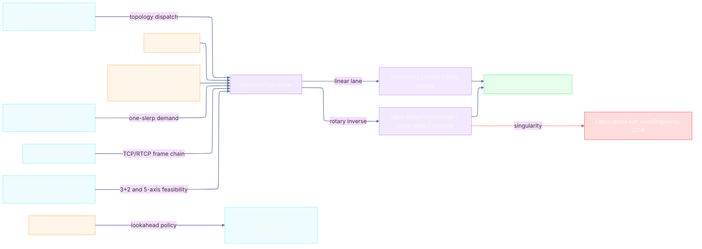

# [RASM_FABRICATION_MACHINE_TOOL]

The machine-tool kinematics owner closes the non-robot motion lane: `MachineTool` drives the conditioned `Move` stream through `Machine.Topology`, admits the four rotary `KinematicClass` rows (`table-table`/`head-head`/`head-table`/`nutating`) through one TCP/RTCP inverse, and returns the atoms-safe `FabricationResult.Motion` receipt. `MachineKinematics` binds the family `Machine` row, the work/tool frames, rotary joints, axis limits, feasible tool-axis cone, one-slerp orientation demand, and the shared `MotionDynamics` law; `MotionDynamics` is the typed lookahead/jerk/accel policy read by the robot-cell boundary, posting `Lookahead`, and simulator time integration, so controller planning never drifts across owners.

Wire posture: HOST-LOCAL. Machine poses, rotary angles, tool-axis cones, and lookahead timing cross only the in-process seam to `Toolpath/motion`, `Posting/program`, and simulation; no row sits between wire and rail.

## [01]-[INDEX]

- [01]-[MACHINE_TOOL]: owns the `MotionDynamics` law, `ToolAxisDemand` orientation demand, `AxisLimit`/`RotaryJoint` machine-tool admission rows, `MachineKinematics` descriptor, `MachinePose`/`MachineBlock` receipts, and the `MachineTool.Solve(MachineKinematics, Seq<Move>)` entry; composes the family `KinematicClass` rotary rows, kernel one-slerp `VectorIntent.PoseCase`, `VectorFrame.Chain`, `VectorCone` feasibility partitioning, and `FabricationFault.AxisSingularity` 2714.

## [02]-[MACHINE_TOOL]

- Owner: `MotionDynamics` the shared typed policy for lookahead block count, rapid/feed caps, acceleration, jerk, corner tolerance, and chord tolerance; `ToolAxisDemand` the closed orientation request over fixed tool frame, kernel one-slerp `VectorIntent.PoseCase`, and cone-partitioned one-slerp; `AxisLimit` the typed linear/rotary envelope row over the shared `MachineAxis`; `RotaryJoint` the A/B/C rotary-joint descriptor with pivot, direction, limit, singularity band, and part-side flag; `MachineKinematics` the machine-tool descriptor over the family `Machine` axis and its true `Topology`; `MachinePose` the per-move TCP frame plus `VectorFrame`/`VectorCone` evidence; `MachineBlock` the posted block-time receipt; `MachineTool` the static owner of `Solve`, topology dispatch, linear pass-through, rotary inverse, singularity routing, and motion receipt assembly.
- Cases: topology dispatch reads the existing `KinematicClass` rows, never a local enum: `cartesian-gantry`/`rotary-spindle`/`delta-parallel` route the linear machine lane, `articulated-arm` is rejected here because `Kinematics/cell#ROBOT_CELL` owns it, and `table-table`/`head-head`/`head-table`/`nutating` route the rotary TCP/RTCP inverse. Orientation dispatch reads `ToolAxisDemand.FrameCase` for 3-axis/3+2 locked poses, `ToolAxisDemand.PoseCase` for kernel one-slerp interpolation, and `ToolAxisDemand.ConeCase` for cone-partitioned 5-axis feasibility. Singularity routes only `FabricationFault.AxisSingularity(MachineAxis, double)`; reach stays `Kinematics/cell`, coarse plan filtering stays `Kinematics/fleet`, and simulated envelope overflow stays the simulator fault arms.
- Entry: `public static Fin<FabricationResult.Motion> Solve(MachineKinematics kinematics, Seq<Move> moves)` - the ONE machine-tool solve the `Toolpath/motion#CAM_MOTION` multi-axis dispatch calls for non-articulated machines; `Fin<T>` routes `GeometryFault.DegenerateInput` for an invalid machine-tool descriptor and `FabricationFault.AxisSingularity` for rotary/TCP singularity, each lowered with `.ToError()`.
- Auto: `Solve` admits the descriptor, dispatches on `kinematics.Topology`, composes `VectorFrame.Chain` for every TCP frame, partitions the feasible `VectorCone` through `VectorCone.Of`/`Enclose`/`PartitionBy`, computes rotary angles by topology row, validates every linear coordinate and rotary solution against the declared `AxisLimit`/`RotaryJoint.Limit` envelope (`Envelope` routes `Unreachable` with the joint-limit diagnostic), checks A/B/C singularity thresholds through `RotaryJoint`, applies `MotionDynamics` to each block time, and returns `FabricationResult.Motion` with an empty cell-code stream because CNC posting owns machine dialect text. `ToolAxisDemand.PoseCase` and `ToolAxisDemand.ConeCase` are the sole orientation interpolation carriers; a hand-rolled slerp, a per-topology interpolation function, or a local quaternion helper is the deleted form.
- Receipt: `FabricationResult.Motion` is the public evidence - `Moves`, machine-axis `Joints`, duration, reached flag, and empty `CellCode`; `MachinePose` and `MachineBlock` stay plane-local and never ride a result case.
- Packages: `Process/family#PROCESS_FAMILY` (`Machine`/`KinematicClass` topology rows - composed), `Process/faults#FAULT_BAND` (`MachineAxis` and `AxisSingularity` 2714 - composed), `Process/owner#FABRICATION_OWNER` (`Move`/`FabricationResult.Motion` - composed), kernel `Processing/intent` (`VectorIntent.PoseCase` - one-slerp public front), kernel `Numerics/atoms` (`VectorFrame.Chain`, `VectorCone.Of`/`SolidAngle`/`Enclose`/`PartitionBy`), `Rhino.Geometry` (`Plane`/`Point3d`/`Vector3d`), Thinktecture.Runtime.Extensions, LanguageExt.Core, BCL inbox.
- Growth: a new rotary topology is one `KinematicClass` row plus one `RotaryAngles` dispatch arm; a new controller timing policy is one `MotionDynamics` column read by posting and simulation; a new 3+2 indexing law is one `ToolAxisDemand` case carried by the same entry; a new feasibility volume is one `VectorCone` row, zero new solve surface.
- Boundary: this owner is machine-tool kinematics only; `articulated-arm` stays on `RobotProgram`, fleet plan-time capability stays on `Fleet.Capable`, G-code lowering stays on `Posting/program`, and simulator overtravel stays on simulation. A local `RotaryAxis` vocabulary, a duplicate `KinematicClass`, a second `Solve5Axis`/`Solve3Axis` family, a hand-rolled one-slerp, or a result case carrying `MachinePose`/`MachineBlock` is the deleted form.

```csharp signature
// --- [RUNTIME_PRELUDE] ----------------------------------------------------------------------------------------------------------------------------
using LanguageExt;
using LanguageExt.Common;
using Rasm.Domain;                       // Context · Op — the kernel projection runtime the pose lowering threads
using Rasm.Fabrication.Process;
using Rasm.Numerics;
using Rasm.Processing;
using Rhino;
using Rhino.Geometry;
using Thinktecture;
using static LanguageExt.Prelude;

namespace Rasm.Fabrication.Kinematics;

// --- [MODELS] -------------------------------------------------------------------------------------------------------------------------------------
public sealed record MotionDynamics(
    double RapidFeed,
    double CuttingFeed,
    double Acceleration,
    double Jerk,
    double CornerTolerance,
    double ChordTolerance,
    int LookaheadBlocks) {
    public static readonly MotionDynamics Canonical =
        new(RapidFeed: 12_000.0, CuttingFeed: 4_000.0, Acceleration: 1_500.0, Jerk: 8_000.0, CornerTolerance: 0.02, ChordTolerance: 0.01, LookaheadBlocks: 60);

    public double FeedFor(Move move) => move.Rapid ? RapidFeed : Math.Min(move.Feed, CuttingFeed);
}

[Union(ConversionFromValue = ConversionOperatorsGeneration.None)]
public abstract partial record ToolAxisDemand {
    private ToolAxisDemand() { }

    public sealed record FrameCase(Plane Frame) : ToolAxisDemand;
    public sealed record PoseCase(VectorIntent.PoseCase Pose) : ToolAxisDemand;
    public sealed record ConeCase(VectorIntent.PoseCase Pose, VectorCone Cone) : ToolAxisDemand;
}

public readonly record struct AxisLimit(MachineAxis Axis, double Min, double Max) {
    public bool Admits(double value) => value >= Min && value <= Max;
}

public sealed record RotaryJoint(MachineAxis Axis, Vector3d Direction, Point3d Pivot, AxisLimit Limit, double SingularityDeg, bool PartSide) {
    public bool Admits(double degrees) => Axis.Rotary && Limit.Admits(degrees);
}

public sealed record MachineKinematics(
    Machine Machine,
    Plane WorkFrame,
    Plane ToolFrame,
    Arr<AxisLimit> LinearLimits,
    Arr<RotaryJoint> Rotaries,
    ToolAxisDemand Orientation,
    VectorCone FeasibleCone,
    MotionDynamics Dynamics) {
    public KinematicClass Topology => Machine.Topology;
}

public sealed record MachinePose(Move Move, Plane Tcp, VectorFrame Frame, VectorCone Cone);

public sealed record MachineBlock(MachinePose Pose, Arr<double> Axes, double Duration);

// --- [OPERATIONS] ---------------------------------------------------------------------------------------------------------------------------------
public static class MachineTool {
    public static Fin<FabricationResult.Motion> Solve(MachineKinematics kinematics, Seq<Move> moves) =>
        Admit(kinematics).Bind(k => Blocks(k, moves).Map(blocks =>
            new FabricationResult.Motion(
                Moves: moves,
                Joints: blocks.Map(static b => b.Axes.ToArray()),
                Duration: blocks.Sum(static b => b.Duration),
                Reached: true,
                CellCode: Seq<string>())));

    static Fin<MachineKinematics> Admit(MachineKinematics kinematics) =>
        kinematics.Topology == KinematicClass.ArticulatedArm
            ? Fin.Fail<MachineKinematics>(GeometryFault.DegenerateInput($"machine-tool:articulated-arm:{kinematics.Machine.Key}").ToError())
            : kinematics.Topology.Rotary && kinematics.Rotaries.Count < 2
                ? Fin.Fail<MachineKinematics>(GeometryFault.DegenerateInput($"machine-tool:rotary-set:{kinematics.Machine.Key}").ToError())
                : Fin.Succ(kinematics);

    static Fin<Seq<MachineBlock>> Blocks(MachineKinematics kinematics, Seq<Move> moves) =>
        kinematics.Topology.Switch(
            cartesianGantry: k => Linear(k, moves),
            rotarySpindle: k => Linear(k, moves),
            articulatedArm: k => Fin.Fail<Seq<MachineBlock>>(GeometryFault.DegenerateInput($"machine-tool:articulated-arm:{k.Machine.Key}").ToError()),
            deltaParallel: k => Linear(k, moves),
            tableTable: k => Rotary(k, moves),
            headHead: k => Rotary(k, moves),
            headTable: k => Rotary(k, moves),
            nutating: k => Rotary(k, moves),
            state: kinematics);

    // The half-angle of the tool-axis enclosure cone the pose partition seeds with — a law-table datum.
    const double AxisConeHalfAngleRad = Math.PI / 36.0;

    static Fin<Seq<MachineBlock>> Linear(MachineKinematics kinematics, Seq<Move> moves) =>
        moves.Map((move, target) => (Move: move, Target: target)).Traverse(pair => LinearBlock(kinematics, pair.Move, pair.Target));

    static Fin<MachineBlock> LinearBlock(MachineKinematics kinematics, Move move, int target) =>
        Pose(kinematics, move).Bind(pose => {
            Arr<double> axes = new[] { move.To.X, move.To.Y, move.To.Z }.ToArr();
            return Envelope(kinematics.LinearLimits, axes, target).Map(_ =>
                new MachineBlock(pose, axes, Segment(kinematics, move, axes)));
        });

    static Fin<Seq<MachineBlock>> Rotary(MachineKinematics kinematics, Seq<Move> moves) =>
        moves.Map((move, target) => (Move: move, Target: target)).Traverse(pair => RotaryBlock(kinematics, pair.Move, pair.Target));

    static Fin<MachineBlock> RotaryBlock(MachineKinematics kinematics, Move move, int target) =>
        Pose(kinematics, move).Bind(pose => {
            Arr<double> angles = RotaryAngles(kinematics.Topology, ToolAxis(pose.Tcp));
            Arr<double> linear = new[] { move.To.X, move.To.Y, move.To.Z }.ToArr();
            return Envelope(kinematics.LinearLimits, linear, target)
                .Bind(_ => Envelope(kinematics.Rotaries.Map(static joint => joint.Limit).ToArr(), angles, target))
                .Bind(_ => Singularity(kinematics, angles))
                .Map(admitted => new MachineBlock(pose, linear.Concat(admitted).ToArr(), Segment(kinematics, move, admitted)));
        });

    // The declared machine envelope is core feasibility: every candidate coordinate — linear and rotary —
    // validates through AxisLimit.Admits before a block is emitted; a violation routes Unreachable with the
    // joint-limit diagnostic naming the joint, the value, and the offending move, never a silently emitted block.
    static Fin<Unit> Envelope(Arr<AxisLimit> limits, Arr<double> values, int target) =>
        toSeq(Enumerable.Range(0, Math.Min(limits.Count, values.Count)))
            .Traverse(joint => limits[joint].Admits(values[joint])
                ? Fin.Succ(unit)
                : Fin.Fail<Unit>(FabricationFault.Unreachable(new JointDiagnostic(JointFault.JointLimit, joint, values[joint]), target).ToError()))
            .Map(static _ => unit);

    static Fin<MachinePose> Pose(MachineKinematics kinematics, Move move) =>
        ToolPose(kinematics, move).Bind(tcp => {
            VectorFrame frame = VectorFrame.Chain(kinematics.WorkFrame, tcp);
            return DemandCone(kinematics, move, tcp).Map(cone => new MachinePose(move, tcp, frame, cone));
        });

    // The orientation demand LOWERS its payload — no world-axis substitute exists, so a non-default PoseCase or
    // ConeCase always changes the emitted TCP and the rotary solution: FrameCase re-plants the demanded frame at
    // the move; PoseCase projects the kernel one-slerp carrier (K19 — the VectorIntent.PoseCase at its Parameter
    // under its Mode, the public front, never a local slerp) into the TCP plane; ConeCase projects the same pose.
    static Fin<Plane> ToolPose(MachineKinematics kinematics, Move move) =>
        kinematics.Orientation.Switch(
            frameCase: static (m, demand) => Fin.Succ(new Plane(m.To, demand.Frame.XAxis, demand.Frame.YAxis)),
            poseCase: static (m, demand) => Slerped(demand.Pose, m),
            coneCase: static (m, demand) => Slerped(demand.Pose, m),
            state: move);

    static Fin<Plane> Slerped(VectorIntent.PoseCase pose, Move move) =>
        ((VectorIntent)pose).Project<Plane>(Context.Of(units: UnitSystem.Millimeters), Op.Of(name: "machine-tool:pose"))
            .Map(plane => new Plane(move.To, plane.XAxis, plane.YAxis));

    // ConeCase constrains the feasible partition with ITS cone payload; every other demand encloses the tool
    // axis alone — the selected partition is the widest feasible orientation cell around the demanded axis.
    static Fin<VectorCone> DemandCone(MachineKinematics kinematics, Move move, Plane tcp) {
        Context context = Context.Of(units: UnitSystem.Millimeters);
        Fin<VectorCone> axisCone = VectorCone.Of(move.To, ToolAxis(tcp), AxisConeHalfAngleRad, context);
        Fin<VectorCone> demanded = kinematics.Orientation is ToolAxisDemand.ConeCase cone
            ? Fin.Succ(cone.Cone)
            : axisCone;
        return axisCone.Bind(axis => demanded.Bind(demand =>
            VectorCone.Enclose(kinematics.FeasibleCone, demand, context)
                .Map(enclosed => VectorCone.PartitionBy(enclosed, ToolAxis(tcp))
                    .OrderByDescending(static c => c.SolidAngle()).HeadOrNone().IfNone(axis))));
    }

    static Vector3d ToolAxis(Plane tcp) {
        Vector3d axis = tcp.ZAxis;
        axis.Unitize();
        return axis;
    }

    static Arr<double> RotaryAngles(KinematicClass topology, Vector3d axis) =>
        topology.Switch(
            cartesianGantry: static _ => Arr<double>(),
            rotarySpindle: static a => Arr(Degrees(Math.Atan2(a.Y, a.X))),
            articulatedArm: static _ => Arr<double>(),
            deltaParallel: static _ => Arr<double>(),
            tableTable: static a => Arr(Degrees(Math.Atan2(a.Y, a.Z)), Degrees(Math.Atan2(a.X, a.Z))),
            headHead: static a => Arr(Degrees(Math.Atan2(a.X, a.Z)), Degrees(Math.Atan2(a.Y, a.Z))),
            headTable: static a => Arr(Degrees(Math.Atan2(a.Y, a.Z)), Degrees(Math.Atan2(a.X, a.Y))),
            nutating: static a => Arr(45.0, Degrees(Math.Atan2(a.X, Math.Sqrt(a.Y * a.Y + a.Z * a.Z)))),
            state: axis);

    static Fin<Arr<double>> Singularity(MachineKinematics kinematics, Arr<double> angles) =>
        kinematics.Rotaries.Zip(angles).Traverse(pair =>
            Math.Abs(pair.Item2) >= pair.Item1.SingularityDeg
                ? Fin.Fail<double>(FabricationFault.AxisSingularity(pair.Item1.Axis, pair.Item2).ToError())
                : Fin.Succ(pair.Item2)).Map(static xs => xs.ToArr());

    static double Segment(MachineKinematics kinematics, Move move, Arr<double> axes) =>
        axes.Count == 0 ? 0.0 : axes.Map(Math.Abs).Sum() / Math.Max(kinematics.Dynamics.FeedFor(move), 0.001);

    static double Degrees(double radians) => radians * 180.0 / Math.PI;
}
```


