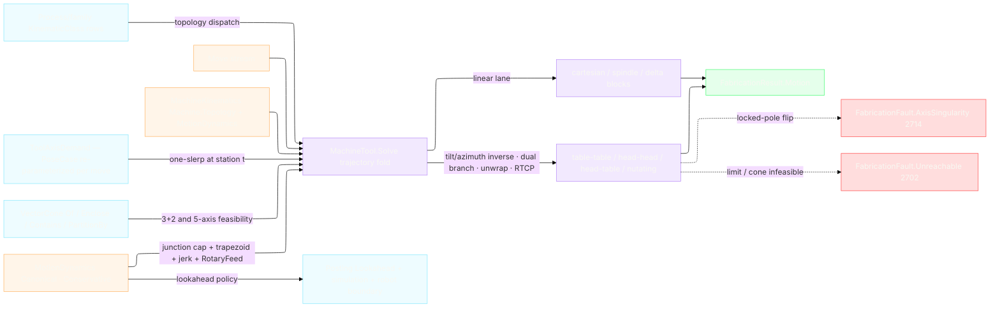

# [RASM_FABRICATION_MACHINE_TOOL]

The machine-tool kinematics owner closes the non-robot motion lane: `MachineTool` drives the conditioned `Move` stream through `Machine.Topology` as ONE trajectory fold — not a per-move resolve — threading rotary continuity (branch selection, C-axis unwrap, pole-band azimuth lock), RTCP pivot compensation, envelope admission, and the dynamics-true time law across the whole sequence, and returns the atoms-safe `FabricationResult.Motion` receipt. The four rotary `KinematicClass` rows (`table-table`/`head-head`/`head-table`/`nutating`) resolve through one tilt/azimuth decomposition — `tilt = atan2(√(x²+y²), z)`, `azimuth = atan2(y, x)` — with the dual branch `(−tilt, azimuth+180°)` and the ±360° azimuth winding evaluated against the PREVIOUS solution, the admissible branch of least excursion winning; the nutating arm derives its nutation angle α from the joint's own `Direction` column and inverts `θ = acos((cos tilt − cos²α)/sin²α)`, never a hardcoded literal. Singularity is POLE PROXIMITY: inside a `RotaryJoint`'s declared band about its `PoleDeg` the azimuth axis is indeterminate, so the fold LOCKS azimuth to the prior solution and routes `FabricationFault.AxisSingularity` 2714 only when a locked cone-crossing demands an azimuth jump past the flip threshold — large angles are the `AxisLimit` envelope's verdict, never the singularity arm's.

`MachineKinematics` binds the family `Machine` row, the work/tool frames, rotary joints with their full physical descriptors (`Direction`/`Pivot`/`PartSide` all CONSUMED — part-side joints rotate the commanded point inversely about their pivot, head-side joints contribute the pivot-arm translation, the RTCP law), axis limits, the feasible tool-axis cone, and the per-move orientation demand; `MotionDynamics` is the typed lookahead/jerk/accel policy read by the robot-cell boundary, posting `Lookahead`, and simulator time integration — and by THIS page's own time law: block duration is the jerk-smoothed trapezoid over the move displacement with the junction-deviation corner cap `v_j = √(a·δ·sin(θ/2)/(1−sin(θ/2)))` at each direction change and the rotary excursion clocked against `RotaryFeed`, so the declared dynamics fields all reach the duration they govern. The one-slerp orientation demand re-parameterizes PER MOVE — the kernel `VectorIntent.PoseCase` carrier is re-issued at the move's normalized station `Parameter`, so the pose genuinely interpolates along the stream instead of stamping one constant frame.

Wire posture: HOST-LOCAL. Machine poses, rotary angles, tool-axis cones, and lookahead timing cross only the in-process seam to `Toolpath/motion`, `Posting/program`, and simulation; no row sits between wire and rail.

## [01]-[INDEX]

- [01]-[MACHINE_TOOL]: owns the `MotionDynamics` law (`Canonical` + the machine-less `Conservative` seed), `ToolAxisDemand` orientation demand, `AxisLimit`/`RotaryJoint` machine-tool admission rows, `MachineKinematics` descriptor, `MachinePose`/`MachineBlock` receipts, and the `MachineTool.Solve(MachineKinematics, Seq<Move>)` trajectory fold; composes the family `KinematicClass` rotary rows, kernel `VectorIntent.PoseCase` one-slerp, `VectorFrame.Of`, `VectorCone` `Of`/`Enclose`/`Contains`/`PartitionBy` feasibility, and `FabricationFault.AxisSingularity` 2714 + `Unreachable` 2702.

## [02]-[MACHINE_TOOL]

- Owner: `MotionDynamics` the shared typed policy — rapid/feed caps, acceleration, jerk, corner (junction-deviation) tolerance, chord tolerance, rotary feed, lookahead block count — with the `Canonical` machine row and the `Conservative` machine-less seed `Verify/simulate` reads; `ToolAxisDemand` the closed orientation request over fixed tool frame (`FrameCase`), kernel one-slerp (`PoseCase`), and cone-partitioned 3+2/5-axis feasibility (`ConeCase`); `AxisLimit` the typed linear/rotary envelope row over the shared `MachineAxis`; `RotaryJoint` the A/B/C rotary descriptor — axis, direction, pivot, limit, singular pole + band, part-side flag — every column consumed by the inverse, the RTCP fold, or the singularity law; `MachineKinematics` the machine-tool descriptor over the family `Machine` axis and its true `Topology`; `MachinePose` the per-move TCP frame plus `VectorFrame`/`VectorCone` evidence; `MachineBlock` the timed axis-vector receipt; `MachineTool` the static owner of `Solve` — topology dispatch, linear pass-through, rotary trajectory inverse, RTCP compensation, singularity routing, and motion receipt assembly.
- Cases: topology dispatch reads the existing `KinematicClass` rows, never a local enum: `cartesian-gantry`/`rotary-spindle`/`delta-parallel` route the linear lane, `articulated-arm` is rejected here because `Kinematics/cell#ROBOT_CELL` owns it (the Cam fold keys the machine-vs-cell split on `FabricationInput.Cell` presence and hands every non-articulated stream here), and `table-table`/`head-head`/`head-table`/`nutating` route the rotary trajectory inverse. Orientation dispatch reads `ToolAxisDemand.FrameCase` for 3-axis/3+2 locked poses, `PoseCase` for the kernel one-slerp re-parameterized at each move's station, and `ConeCase` for cone-partitioned feasibility — the demand cone's `PartitionBy` rim directions are the 3+2 index candidates, the first the feasible cone `Contains` with least deviation from the demanded axis winning. Singularity routes only `FabricationFault.AxisSingularity(MachineAxis, double)`; an orientation outside the feasible cone routes `Unreachable` with a `JointFault.Reach` diagnostic; reach truth for arms stays `Kinematics/cell`, coarse plan filtering stays `Kinematics/fleet`, and simulated envelope overflow stays the simulator fault arms.
- Entry: `public static Fin<FabricationResult.Motion> Solve(MachineKinematics kinematics, Seq<Move> moves)` — the ONE machine-tool solve the `Toolpath/motion#CAM_MOTION` `Commit` fold calls for cell-free inputs; `Fin<T>` routes `GeometryFault.DegenerateInput` for an invalid descriptor, `FabricationFault.Unreachable(JointDiagnostic, target)` for a joint-limit or cone-infeasible move, and `FabricationFault.AxisSingularity` for a locked cone-crossing, each lowered with `.ToError()`.
- Auto: `Solve` admits the descriptor once, then folds the stream threading `(previous point, previous angles, previous direction)`: each move re-parameterizes the orientation demand at its normalized station, gates the tool axis against `FeasibleCone.Contains`, decomposes tilt/azimuth, evaluates both rotary branches and the ±360° windings against the previous solution (admissible least-excursion branch wins, `Unreachable` when none admits), locks azimuth inside the singular pole band (faulting `AxisSingularity` only on a demanded flip), RTCP-compensates the linear target through the joint pivots (`PartSide` inverse rotation, head-side pivot-arm translation), validates every coordinate against the declared `AxisLimit` envelope, and clocks the block with the jerk-smoothed trapezoid under the junction-deviation corner cap; the fold returns `FabricationResult.Motion` with an empty cell-code stream because CNC posting owns machine dialect text. `ToolAxisDemand.PoseCase`/`ConeCase` are the sole orientation interpolation carriers — a hand-rolled slerp, a per-topology interpolation function, or a local quaternion helper is the deleted form.
- Receipt: `FabricationResult.Motion` is the public evidence — `Moves`, machine-axis `Joints`, dynamics-true `Duration`, reached flag, empty `CellCode`; `MachinePose` and `MachineBlock` stay plane-local and never ride a result case.
- Packages: `Process/family#PROCESS_FAMILY` (`Machine`/`KinematicClass` topology rows — composed), `Process/faults#FAULT_BAND` (`MachineAxis`, `JointDiagnostic`/`JointFault`, `AxisSingularity` 2714, `Unreachable` 2702 — composed), `Process/owner#FABRICATION_OWNER` (`Move`/`FabricationResult.Motion` — composed), kernel `Processing/intent` (`VectorIntent.PoseCase` — the one-slerp public front, re-parameterized per move through `UnitInterval`), kernel `Numerics/atoms` (`VectorFrame.Of`, `VectorCone.Of`/`Enclose`/`Contains`/`PartitionBy`/`SolidAngle`, `UnitInterval`), `Rhino.Geometry` (`Plane`/`Point3d`/`Vector3d`/`Transform.Rotation`), Thinktecture.Runtime.Extensions, LanguageExt.Core, BCL inbox.
- Growth: a new rotary topology is one `KinematicClass` row plus one arm in the tilt/azimuth composition; a new controller timing policy is one `MotionDynamics` column read by posting and simulation; a new 3+2 indexing law is one `ToolAxisDemand` case carried by the same entry; a 5-axis fairing pass binds the `Geometry2D/curves#CURVE_ALGEBRA` `Smooth` receipt as its admission gate; zero new solve surface.
- Boundary: this owner is machine-tool kinematics only; `articulated-arm` stays on `RobotProgram`, fleet plan-time capability stays on `Fleet.Capable`, G-code lowering stays on `Posting/program`, and simulator overtravel stays on simulation. A local `RotaryAxis` vocabulary, a duplicate `KinematicClass`, a second `Solve5Axis`/`Solve3Axis` family, a hand-rolled one-slerp, a per-move solve that forgets the previous solution, a declared joint column the inverse never reads, or a result case carrying `MachinePose`/`MachineBlock` is the deleted form.

```csharp signature
// --- [RUNTIME_PRELUDE] ----------------------------------------------------------------------------------------------------------------------------
using LanguageExt;
using LanguageExt.Common;
using Rasm.Domain;                       // Context · Op — the kernel projection runtime the pose lowering threads
using Rasm.Fabrication.Process;
using Rasm.Numerics;
using Rasm.Processing;
using Rhino;
using Rhino.Geometry;
using Thinktecture;
using static LanguageExt.Prelude;

namespace Rasm.Fabrication.Kinematics;

// --- [MODELS] -------------------------------------------------------------------------------------------------------------------------------------
public sealed record MotionDynamics(
    double RapidFeed,
    double CuttingFeed,
    double Acceleration,
    double Jerk,
    double CornerTolerance,
    double ChordTolerance,
    double RotaryFeed,
    int LookaheadBlocks) {
    public static readonly MotionDynamics Canonical =
        new(RapidFeed: 12_000.0, CuttingFeed: 4_000.0, Acceleration: 1_500.0, Jerk: 8_000.0, CornerTolerance: 0.02, ChordTolerance: 0.01, RotaryFeed: 7_200.0, LookaheadBlocks: 60);

    // The machine-less seed Verify/simulate reads when no MachineKinematics is bound.
    public static readonly MotionDynamics Conservative =
        new(RapidFeed: 6_000.0, CuttingFeed: 1_500.0, Acceleration: 750.0, Jerk: 4_000.0, CornerTolerance: 0.05, ChordTolerance: 0.02, RotaryFeed: 3_600.0, LookaheadBlocks: 20);

    public double FeedFor(Move move) => move.Rapid ? RapidFeed : Math.Min(move.Feed, CuttingFeed);

    // Junction-deviation corner cap at turn angle θ: v_j = √(a·δ·sin(θ/2)/(1−sin(θ/2))), δ = CornerTolerance.
    public double JunctionFeed(double turnRad) =>
        Math.Sin(turnRad / 2.0) is double s && s < 1.0 - 1e-9
            ? Math.Sqrt(Acceleration * CornerTolerance * s / (1.0 - s)) * 60.0
            : RapidFeed;
}

[Union(ConversionFromValue = ConversionOperatorsGeneration.None)]
public abstract partial record ToolAxisDemand {
    private ToolAxisDemand() { }

    public sealed record FrameCase(Plane Frame) : ToolAxisDemand;
    public sealed record PoseCase(VectorIntent.PoseCase Pose) : ToolAxisDemand;
    public sealed record ConeCase(VectorIntent.PoseCase Pose, VectorCone Cone) : ToolAxisDemand;
}

public readonly record struct AxisLimit(MachineAxis Axis, double Min, double Max) {
    public bool Admits(double value) => value >= Min && value <= Max;
}

// Every column is consumed: Direction feeds the nutation derivation and the RTCP rotation axis, Pivot the RTCP
// center, PartSide the inverse-vs-arm branch, PoleDeg + SingularityBandDeg the pole-proximity singularity law.
public sealed record RotaryJoint(
    MachineAxis Axis, Vector3d Direction, Point3d Pivot, AxisLimit Limit, double PoleDeg, double SingularityBandDeg, bool PartSide) {
    public bool Admits(double degrees) => Axis.Rotary && Limit.Admits(degrees);
    public bool Singular(double degrees) => Math.Abs(degrees - PoleDeg) <= SingularityBandDeg;

    public double NutationDeg {
        get {
            Vector3d unit = Direction;
            unit.Unitize();
            return Math.Acos(Math.Clamp(unit.Z, -1.0, 1.0)) * 180.0 / Math.PI;
        }
    }
}

public sealed record MachineKinematics(
    Machine Machine,
    Plane WorkFrame,
    Plane ToolFrame,
    Arr<AxisLimit> LinearLimits,
    Arr<RotaryJoint> Rotaries,
    ToolAxisDemand Orientation,
    VectorCone FeasibleCone,
    MotionDynamics Dynamics) {
    public KinematicClass Topology => Machine.Topology;
}

public sealed record MachinePose(Move Move, Plane Tcp, VectorFrame Frame, VectorCone Cone);

public sealed record MachineBlock(MachinePose Pose, Arr<double> Axes, double Duration);

// --- [OPERATIONS] ---------------------------------------------------------------------------------------------------------------------------------
public static class MachineTool {
    const double AxisConeHalfAngleRad = Math.PI / 36.0;   // pose-evidence enclosure half-angle — a law-table datum
    const int ConeSectors = 12;                           // 3+2 rim-candidate census per ConeCase demand
    const double FlipThresholdDeg = 90.0;                 // locked-pole azimuth jump that routes AxisSingularity

    public static Fin<FabricationResult.Motion> Solve(MachineKinematics kinematics, Seq<Move> moves) =>
        Admit(kinematics).Bind(k => Blocks(k, moves).Map(blocks =>
            new FabricationResult.Motion(
                Moves: moves,
                Joints: blocks.Map(static b => b.Axes.ToArray()),
                Duration: blocks.Sum(static b => b.Duration),
                Reached: true,
                CellCode: Seq<string>())));

    static Fin<MachineKinematics> Admit(MachineKinematics kinematics) =>
        kinematics.Topology == KinematicClass.ArticulatedArm
            ? Fin.Fail<MachineKinematics>(GeometryFault.DegenerateInput($"machine-tool:articulated-arm:{kinematics.Machine.Key}").ToError())
            : kinematics.Topology.Rotary && kinematics.Rotaries.Count < 2
                ? Fin.Fail<MachineKinematics>(GeometryFault.DegenerateInput($"machine-tool:rotary-set:{kinematics.Machine.Key}").ToError())
                : Fin.Succ(kinematics);

    // The trajectory fold: previous point, angles, and direction thread through every block, so branch choice,
    // unwrap, pole lock, junction caps, and block timing are SEQUENCE facts — never a per-move amnesiac resolve.
    static Fin<Seq<MachineBlock>> Blocks(MachineKinematics k, Seq<Move> moves) =>
        moves.Map(static (move, index) => (Move: move, Index: index))
            .Fold(
                Fin.Succ((Acc: Seq<MachineBlock>(), At: k.WorkFrame.Origin, Angles: Option<Arr<double>>.None, Dir: Option<Vector3d>.None)),
                (state, row) => state.Bind(s =>
                    Pose(k, row.Move, Station(row.Index, moves.Count), row.Index).Bind(pose =>
                        Angles(k, ToolAxis(pose.Tcp), s.Angles, row.Index).Bind(angles =>
                            Admitted(k, Rtcp(k, row.Move.To, angles), angles, row.Index).Map(linear =>
                                Advance(k, s, pose, linear, angles, row.Move))))))
            .Map(static s => s.Acc);

    static (Seq<MachineBlock> Acc, Point3d At, Option<Arr<double>> Angles, Option<Vector3d> Dir) Advance(
        MachineKinematics k,
        (Seq<MachineBlock> Acc, Point3d At, Option<Arr<double>> Angles, Option<Vector3d> Dir) s,
        MachinePose pose, Arr<double> linear, Arr<double> angles, Move move) {
        Vector3d dir = move.To - s.At;
        double duration = BlockTime(k.Dynamics, s.At, move, s.Angles, angles, s.Dir, dir);
        return (s.Acc.Add(new MachineBlock(pose, linear.Concat(angles).ToArr(), duration)), move.To, Some(angles), dir.IsTiny() ? s.Dir : Some(dir));
    }

    static double Station(int index, int count) => count <= 1 ? 0.0 : index / (double)(count - 1);

    // --- [ORIENTATION] — per-move demand resolve, cone feasibility, 3+2 rim indexing --------------------------------------------------------------
    static Fin<MachinePose> Pose(MachineKinematics k, Move move, double t, int target) {
        Context context = Context.Of(units: UnitSystem.Millimeters);
        return Tcp(k, move, t, context).Bind(tcp =>
            k.FeasibleCone.Contains(ToolAxis(tcp), context).Bind(inside => inside
                ? VectorFrame.Of(move.To, ToolAxis(tcp), Some(tcp.XAxis), context).Bind(frame =>
                    VectorCone.Of(move.To, ToolAxis(tcp), AxisConeHalfAngleRad, context).Map(cone =>
                        new MachinePose(move, tcp, frame, cone)))
                : Fin.Fail<MachinePose>(FabricationFault.Unreachable(
                    new JointDiagnostic(JointFault.Reach, 0, k.FeasibleCone.SolidAngle), target).ToError())));
    }

    // FrameCase re-plants the demanded frame; PoseCase re-issues the kernel one-slerp carrier at the move's
    // station Parameter (K19 — the public front, never a local slerp); ConeCase indexes the demand cone's
    // PartitionBy rim candidates, the first feasible direction of least deviation from the slerped axis winning.
    static Fin<Plane> Tcp(MachineKinematics k, Move move, double t, Context context) =>
        k.Orientation.Switch(
            state: (Move: move, T: t, Context: context, Feasible: k.FeasibleCone),
            frameCase: static (s, demand) => Fin.Succ(new Plane(s.Move.To, demand.Frame.XAxis, demand.Frame.YAxis)),
            poseCase: static (s, demand) => Slerped(demand.Pose, s.Move, s.T, s.Context),
            coneCase: static (s, demand) =>
                Slerped(demand.Pose, s.Move, s.T, s.Context).Bind(tcp =>
                    demand.Cone.PartitionBy(ConeSectors, s.Context).Bind(rim =>
                        rim.Filter(d => s.Feasible.Contains(d.Value, s.Context).IfFail(false))
                           .OrderBy(d => Vector3d.VectorAngle(d.Value, ToolAxis(tcp)))
                           .HeadOrNone()
                           .Match(
                               Some: d => VectorFrame.Of(s.Move.To, d.Value, Some(tcp.XAxis), s.Context).Map(static f => f.Value),
                               None: () => Fin.Succ(tcp)))));

    static Fin<Plane> Slerped(VectorIntent.PoseCase pose, Move move, double t, Context context) =>
        UnitInterval.Validate(t, null, out var station) is { } fault
            ? Fin.Fail<Plane>(fault)
            : ((VectorIntent)(pose with { Parameter = station })).Project<Plane>(context, Op.Of(name: "machine-tool:pose"))
                .Map(plane => new Plane(move.To, plane.XAxis, plane.YAxis));

    static Vector3d ToolAxis(Plane tcp) {
        Vector3d axis = tcp.ZAxis;
        axis.Unitize();
        return axis;
    }

    // --- [ROTARY_INVERSE] — tilt/azimuth decomposition, dual branch, unwrap, pole lock ------------------------------------------------------------
    static Fin<Arr<double>> Angles(MachineKinematics k, Vector3d axis, Option<Arr<double>> prev, int target) =>
        k.Topology.Rotary
            ? Branches(k, axis).Bind(candidates => {
                Seq<Arr<double>> unwrapped = candidates.Map(c => Unwrap(c, prev));
                Seq<Arr<double>> admitted = unwrapped.Filter(c =>
                    k.Rotaries.Zip(c).ForAll(static pair => pair.Item1.Admits(pair.Item2)));
                return admitted
                    .OrderBy(c => Excursion(c, prev))
                    .HeadOrNone()
                    .Match(
                        Some: c => PoleLock(k, c, prev),
                        None: () => Fin.Fail<Arr<double>>(FabricationFault.Unreachable(
                            new JointDiagnostic(JointFault.JointLimit, 0, unwrapped.HeadOrNone().Bind(static c => c.ToSeq().HeadOrNone()).IfNone(0.0)), target).ToError()));
            })
            : Fin.Succ(Arr<double>());

    // Both solutions of the two-rotary inverse: (tilt, azimuth) and its flip (−tilt, azimuth + 180°); the
    // nutating arm derives α from its joint Direction and inverts θ = acos((cos tilt − cos²α)/sin²α).
    static Fin<Seq<Arr<double>>> Branches(MachineKinematics k, Vector3d axis) {
        double tilt = Math.Atan2(Math.Sqrt(axis.X * axis.X + axis.Y * axis.Y), axis.Z) * 180.0 / Math.PI;
        double azimuth = Math.Atan2(axis.Y, axis.X) * 180.0 / Math.PI;
        return k.Topology.Switch(
            state: (K: k, Tilt: tilt, Azimuth: azimuth),
            cartesianGantry: static s => Fin.Succ(Seq<Arr<double>>()),
            rotarySpindle: static s => Fin.Succ(Seq(Arr(s.Azimuth))),
            articulatedArm: static s => Fin.Fail<Seq<Arr<double>>>(GeometryFault.DegenerateInput($"machine-tool:articulated-arm:{s.K.Machine.Key}").ToError()),
            deltaParallel: static s => Fin.Succ(Seq<Arr<double>>()),
            tableTable: static s => Fin.Succ(Seq(Arr(s.Tilt, s.Azimuth), Arr(-s.Tilt, s.Azimuth + 180.0))),
            headHead: static s => Fin.Succ(Seq(Arr(s.Tilt, s.Azimuth), Arr(-s.Tilt, s.Azimuth + 180.0))),
            headTable: static s => Fin.Succ(Seq(Arr(s.Tilt, -s.Azimuth), Arr(-s.Tilt, -(s.Azimuth + 180.0)))),
            nutating: static s => Nutated(s.K, s.Tilt, s.Azimuth));
    }

    static Fin<Seq<Arr<double>>> Nutated(MachineKinematics k, double tiltDeg, double azimuthDeg) {
        double alpha = k.Rotaries.Head.NutationDeg * Math.PI / 180.0;
        double tilt = tiltDeg * Math.PI / 180.0;
        double cos = (Math.Cos(tilt) - Math.Cos(alpha) * Math.Cos(alpha)) / Math.Max(Math.Sin(alpha) * Math.Sin(alpha), 1e-9);
        return double.Abs(cos) <= 1.0
            ? Fin.Succ(Seq(Arr(Math.Acos(cos) * 180.0 / Math.PI, azimuthDeg), Arr(-Math.Acos(cos) * 180.0 / Math.PI, azimuthDeg + 180.0)))
            : Fin.Fail<Seq<Arr<double>>>(FabricationFault.Unreachable(new JointDiagnostic(JointFault.Reach, 0, tiltDeg), 0).ToError());
    }

    // ±360° winding per joint against the previous solution — the C-axis unwrap; the seedless first move
    // takes the principal value.
    static Arr<double> Unwrap(Arr<double> candidate, Option<Arr<double>> prev) =>
        prev.Match(
            Some: p => candidate.Map((c, i) => i < p.Count
                ? Seq(c - 360.0, c, c + 360.0).OrderBy(w => Math.Abs(w - p[i])).Head
                : c).ToArr(),
            None: () => candidate);

    static double Excursion(Arr<double> candidate, Option<Arr<double>> prev) =>
        prev.Match(
            Some: p => candidate.Zip(p).Map(static pair => Math.Abs(pair.Item1 - pair.Item2)).Fold(0.0, Math.Max),
            None: () => candidate.Map(Math.Abs).Fold(0.0, Math.Max));

    // Inside a joint's singular band the azimuth is indeterminate: hold the prior azimuth; a demanded jump
    // past the flip threshold is the genuine pole crossing and routes AxisSingularity — never a silent flip.
    static Fin<Arr<double>> PoleLock(MachineKinematics k, Arr<double> angles, Option<Arr<double>> prev) =>
        k.Rotaries.Count >= 2 && angles.Count >= 2 && k.Rotaries[0].Singular(angles[0])
            ? prev.Match(
                Some: p => Math.Abs(angles[1] - p[1]) > FlipThresholdDeg
                    ? Fin.Fail<Arr<double>>(FabricationFault.AxisSingularity(k.Rotaries[0].Axis, angles[0]).ToError())
                    : Fin.Succ(Arr(angles[0], p[1])),
                None: () => Fin.Succ(angles))
            : Fin.Succ(angles);

    // --- [RTCP] — pivot compensation: part-side joints rotate the commanded point inversely about their pivot,
    // head-side joints contribute the pivot-arm translation; the linear axes carry the compensated target.
    static Point3d Rtcp(MachineKinematics k, Point3d commanded, Arr<double> degrees) =>
        k.Rotaries.Zip(degrees).Fold(commanded, static (at, pair) => pair.Item1.PartSide
            ? Rotated(at, pair.Item1, -pair.Item2)
            : at + (pair.Item1.Pivot - Rotated(pair.Item1.Pivot, pair.Item1, pair.Item2)));

    static Point3d Rotated(Point3d point, RotaryJoint joint, double degrees) {
        Point3d moved = point;
        moved.Transform(Transform.Rotation(degrees * Math.PI / 180.0, joint.Direction, joint.Pivot));
        return moved;
    }

    // Every candidate coordinate — linear and rotary — validates through AxisLimit.Admits before a block is
    // emitted; a violation routes Unreachable with the joint-limit diagnostic, never a silently emitted block.
    static Fin<Arr<double>> Admitted(MachineKinematics k, Point3d linear, Arr<double> angles, int target) {
        Arr<double> axes = Arr(linear.X, linear.Y, linear.Z);
        Arr<AxisLimit> limits = k.LinearLimits.Concat(k.Rotaries.Map(static joint => joint.Limit)).ToArr();
        Arr<double> values = axes.Concat(angles).ToArr();
        return toSeq(Enumerable.Range(0, Math.Min(limits.Count, values.Count)))
            .Traverse(joint => limits[joint].Admits(values[joint])
                ? Fin.Succ(unit)
                : Fin.Fail<Unit>(FabricationFault.Unreachable(new JointDiagnostic(JointFault.JointLimit, joint, values[joint]), target).ToError()))
            .Map(_ => axes);
    }

    // --- [TIME_LAW] — jerk-smoothed trapezoid under the junction-deviation entry cap; the rotary excursion
    // clocks against RotaryFeed and the block takes the binding axis. Duration honors the declared dynamics.
    static double BlockTime(
        MotionDynamics dynamics, Point3d from, Move move,
        Option<Arr<double>> prevAngles, Arr<double> angles, Option<Vector3d> prevDir, Vector3d dir) {
        double distance = from.DistanceTo(move.To);
        double turn = prevDir.Match(
            Some: p => dir.IsTiny() ? 0.0 : Vector3d.VectorAngle(p, dir),
            None: () => 0.0);
        double feed = Math.Min(dynamics.FeedFor(move), turn > 1e-6 ? dynamics.JunctionFeed(Math.PI - turn) : double.MaxValue);
        double v = Math.Max(feed, 1.0) / 60.0;
        double a = Math.Max(dynamics.Acceleration, 1e-3);
        double jerkTerm = a / Math.Max(dynamics.Jerk, 1e-3);
        double linear = distance >= v * v / a ? distance / v + v / a + jerkTerm : 2.0 * (Math.Sqrt(distance / a) + jerkTerm);
        double rotary = prevAngles.Match(
            Some: p => angles.Zip(p).Map(static pair => Math.Abs(pair.Item1 - pair.Item2)).Fold(0.0, Math.Max),
            None: () => 0.0) / Math.Max(dynamics.RotaryFeed, 1.0) * 60.0;
        return Math.Max(linear, rotary);
    }
}
```


