# [RASM_FABRICATION_LINKING]

`Linking` optimizes the cut graph after placement without mutating any transform. `PlacementRow.Instance` supplies the physical graph identity, while `SourcePart` preserves the profile definition identity. `LinkOp` closes common-line cuts, shared-pierce chains, bridges, and skeleton slits behind one `Plan` entry.

Common-line discovery admits only straight, normalized anti-parallel edges at the declared cut-width separation and within the independent angular and match tolerances. It preserves every disjoint overlap span, collision-checks each candidate against third-party geometry on `Fin`, and commits nonconflicting edges by descending shared length. QuikGraph components form the chain islands; containment depth, proximity band, and maximum membership determine threading without losing the resulting instance order.

`LinkPolicy.Score` prices pierces, rapid travel, and cut travel. `LinkPlan` records before-and-after values for all three axes, shared cut length, bridge count, skeleton-cut length, and both source and instance membership. A non-improving result returns an explicit baseline receipt with no applied operations.

Stock slitting first resolves the exact region for every occupied sheet, intersects its grid with that material, and then subtracts arc-offset occupied regions. The sheet-indexed stock census must equal the placement sheet census. Geometry failure aborts the plan; it never becomes a full-grid or empty-grid substitute. The posting seam consumes `ChainRow.SheetIndex`, `Instances`, `SourceParts`, and `Pierce` without rebuilding topology.

Wire posture: HOST-LOCAL. The `LinkPlan` crosses only the in-process seam to the posting conditioning; no type on this page sits between wire and rail.

## [01]-[INDEX]

- [01]-[CUT_LINKING]: owns instance-aware cut-graph discovery, collision-checked commits, chain threading, bridges, stock slitting, objective comparison, and the `LinkPlan` receipt.

## [02]-[CUT_LINKING]

- Owner: `LinkOp` owns edit modality; `LinkPolicy` owns geometric tolerances, bridge values, chain limits, slitting pitch, and objective weights; `SharedEdge` owns instance-and-edge pairing; `ChainRow` owns instance and source membership; `LinkPlan` owns applied operations and measured evidence.
- Cases: `CommonLine`, `ChainCut`, `Bridge`, and `SkeletonCutUp` are the four edit cases. `Laser` and `Plasma` are policy values over the same algebra. Objective rejection is a baseline verdict, not a fault case.
- Entry: `Plan(FabricationResult.Placement, Arr<Loop>, Map<int, Stock>, LinkPolicy) -> Fin<LinkPlan>` validates policy, profile references, sheet-indexed stock, and closure before placing source geometry and evaluating edits.
- Auto: `PartTransform.Apply` projects each placed loop once, with its densified polygon and area centroid admitted on the same row; AABB proximity bounds candidate pairs; normalized direction and symmetric distance admit shared spans; `Commit` traverses geometry checks on `Fin`; `ConnectedComponents` labels physical instances; centroids order travel; `Loop.Length` measures curved perimeters; `ClipOpen` composes material intersection with occupied subtraction in two seq-shaped passes.
- Receipt: `LinkPlan` carries applied edits, chain rows, pierce, rapid, cut, shared-length, bridge, skeleton-cut, and objective evidence before and after optimization.
- Packages: `Rasm`, `RhinoCommon`, `Clipper2`, `QuikGraph`, `Thinktecture.Runtime.Extensions`, and `LanguageExt.Core`.
- Growth: a new cut-graph edit is one `LinkOp` case plus one arm in the plan fold; a new objective term is one `LinkPolicy` weight column inside `Score`; per-modality tuning is a policy row, never a branch; a lead-style or pierce-style vocabulary stays `Posting/program`'s conditioning — this page hands topology only; zero new entrypoints.
- Boundary: transforms remain read-only; physical instance identity never collapses into source identity; curved edges never enter common-line pairing; geometry faults never become permissive clearance; and objective comparison includes pierce, rapid, and cut costs. Placed-loop projection composes the atoms-owner `PartTransform.Apply(Loop)`; no page-local transform kernel exists.

```csharp signature
// --- [RUNTIME_PRELUDE] --------------------------------------------------------------------
using System.Collections.Generic;
using LanguageExt;
using LanguageExt.Common;
using QuikGraph;
using QuikGraph.Algorithms;
using Rasm.Domain;
using Rasm.Fabrication.Geometry2D;
using Rasm.Fabrication.Process;
using Rasm.Numerics;
using Rhino.Geometry;
using Thinktecture;
using static LanguageExt.Prelude;

namespace Rasm.Fabrication.Nesting;

// --- [TYPES] ------------------------------------------------------------------------------
// The cut-graph edit family: placement transforms are READ-ONLY under every case.
[Union(ConversionFromValue = ConversionOperatorsGeneration.None)]
public abstract partial record LinkOp {
    private LinkOp() { }

    public sealed record CommonLine(SharedEdge Pair) : LinkOp;
    public sealed record ChainCut(int SheetIndex, Seq<int> Instances, Point3d Pierce) : LinkOp;
    public sealed record Bridge(SharedEdge Pair, Point3d At, double WidthMm) : LinkOp;
    public sealed record SkeletonCutUp(int SheetIndex, Seq<Edge3> Grid) : LinkOp;
}

// --- [MODELS] -----------------------------------------------------------------------------
// Cut width and match tolerance remain separate: one defines physical separation, and one admits geometric correspondence.
public sealed record LinkPolicy(double CutWidthMm, double MatchToleranceMm, double AngularToleranceRadians, double ArcChordErrorMm,
    double MinSharedLengthMm, Option<(double WidthMm, double SpacingMm)> Bridge, double PierceCost, double RapidCostPerMm, double CutCostPerMm,
    int MaxChainParts, double ChainBandMm, double CutUpPitchMm, Point3d RapidOrigin) {
    public static readonly LinkPolicy Laser = new(CutWidthMm: 0.2, MatchToleranceMm: 0.1, MinSharedLengthMm: 25.0,
        Bridge: Some((WidthMm: 0.8, SpacingMm: 250.0)), AngularToleranceRadians: 0.002, ArcChordErrorMm: 0.01,
        PierceCost: 30.0, RapidCostPerMm: 0.01, CutCostPerMm: 0.05, MaxChainParts: 20, ChainBandMm: 400.0,
        CutUpPitchMm: 600.0, RapidOrigin: Point3d.Origin);
    public static readonly LinkPolicy Plasma = new(CutWidthMm: 1.5, MatchToleranceMm: 0.2, MinSharedLengthMm: 40.0,
        Bridge: None, AngularToleranceRadians: 0.006, ArcChordErrorMm: 0.05, PierceCost: 120.0, RapidCostPerMm: 0.02,
        CutCostPerMm: 0.08, MaxChainParts: 12, ChainBandMm: 600.0, CutUpPitchMm: 800.0, RapidOrigin: Point3d.Origin);

    public double Score(int pierces, double rapidMm, double cutMm) =>
        (pierces * PierceCost) + (rapidMm * RapidCostPerMm) + (cutMm * CutCostPerMm);

    public Fin<LinkPolicy> Admit() =>
        new[] { CutWidthMm, MatchToleranceMm, AngularToleranceRadians, ArcChordErrorMm, MinSharedLengthMm,
            PierceCost, RapidCostPerMm, CutCostPerMm, ChainBandMm, CutUpPitchMm }.Any(static value => !double.IsFinite(value) || value <= 0.0) ||
        AngularToleranceRadians >= Math.PI / 2.0 || MaxChainParts < 1 ||
        Bridge.Exists(static value => !double.IsFinite(value.WidthMm) || value.WidthMm <= 0.0 ||
            !double.IsFinite(value.SpacingMm) || value.SpacingMm <= value.WidthMm) || !Finite(RapidOrigin)
            ? Fin.Fail<LinkPolicy>(GeometryFault.DegenerateInput("link:policy").ToError())
            : Fin.Succ(this);

    static bool Finite(Point3d value) => double.IsFinite(value.X) && double.IsFinite(value.Y) && double.IsFinite(value.Z);
}

// Placed carries exact arcs; Polygon and Centroid are admitted ONCE per row (one densify at admission), so every
// chain, clearance, and threading predicate downstream is total with zero per-call re-densification.
file readonly record struct PlacementRow(int Instance, int SourcePart, int SheetIndex, Loop Placed, Loop Polygon, Point3d Centroid);

// SheetIndex rides the edge so posting recovers per-sheet common-line topology without a placement lookup.
public readonly record struct SharedEdge(
    int SheetIndex,
    int InstanceA,
    int EdgeA,
    int InstanceB,
    int EdgeB,
    Edge3 Overlap,
    double SharedLengthMm,
    Context Tolerance);

// One pierce/lead per chain — the topology row Posting/program's Pierce/Lead conditioning consumes.
public readonly record struct ChainRow(int Chain, int SheetIndex, Point3d Pierce, Seq<int> Instances, Seq<int> SourceParts, double CutLengthMm);

public sealed record LinkPlan(Seq<LinkOp> Applied, Seq<ChainRow> Chains, int PiercesBefore, int PiercesAfter,
    double RapidBeforeMm, double RapidAfterMm, double CutBeforeMm, double CutAfterMm, double SharedCutSavedMm,
    int Bridges, double BridgeUncutMm, double SkeletonCutMm, double ScoreBefore, double ScoreAfter);

// --- [OPERATIONS] ---------------------------------------------------------------------------
public static class Linking {
    public static Fin<LinkPlan> Plan(FabricationResult.Placement placement, Arr<Loop> parts, Map<int, Stock> stockBySheet, LinkPolicy policy) =>
        policy.Admit().Bind(admitted => {
            Seq<(PartTransform Transform, int Instance)> indexed = placement.Parts.Map((transform, instance) => (transform, instance));
            return indexed.Find(row => row.Transform.PartId < 0 || row.Transform.PartId >= parts.Count).Match(
                Some: invalid => Fin.Fail<LinkPlan>(FabricationFault.NoFit(invalid.Transform.PartId, Seq<double>()).ToError()),
                None: () => indexed.Find(row => !parts[row.Transform.PartId].Closed).Match(
                    Some: open => Fin.Fail<LinkPlan>(FabricationFault.OpenLoop(FabConcern.Nest, open.Instance).ToError()),
                    None: () => indexed.Find(row => !Admitted(parts[row.Transform.PartId]) || !Admitted(row.Transform)).Match(
                        Some: invalid => Fin.Fail<LinkPlan>(GeometryFault.DegenerateInput($"link:placement:{invalid.Instance}").ToError()),
                        None: () => {
                        Set<int> occupiedSheets = toSet(indexed.Map(static row => row.Transform.SheetIndex));
                        bool completeStock = occupiedSheets.Count == stockBySheet.Count &&
                            stockBySheet.ToSeq().ForAll(row => occupiedSheets.Contains(row.Key));
                        return !completeStock
                            ? Fin.Fail<LinkPlan>(GeometryFault.DegenerateInput("link:stock-sheet-census").ToError())
                            : indexed.Traverse(row => row.Transform.Apply(parts[row.Transform.PartId])
                                .Bind(loop => ArcAlgebra.Densify(loop, admitted.ArcChordErrorMm).Map(receipt =>
                                    new PlacementRow(row.Instance, row.Transform.PartId, row.Transform.SheetIndex, loop,
                                        receipt.Result, Centroid(receipt.Result)))).ToValidation())
                            .As().ToFin().Bind(placed => Commit(Candidates(placed, admitted), placed, admitted).Bind(commits => {
                            Seq<ChainRow> chains = Chains(placed, commits, admitted);
                            Seq<LinkOp> bridges = admitted.Bridge.Match(
                                Some: bridge => Bridges(commits, bridge),
                                None: static () => Seq<LinkOp>());
                            // The census gate above already proved key-for-key correspondence, so the stock rows
                            // traverse with no per-row re-census.
                            return stockBySheet.ToSeq().Traverse(row =>
                                    row.Value.Admit().Bind(_ => CutUp(row.Value,
                                            placed.Filter(item => item.SheetIndex == row.Key).Map(static item => item.Polygon), admitted))
                                        .Map(grid => grid.IsEmpty ? Seq<LinkOp>() : Seq<LinkOp>(new LinkOp.SkeletonCutUp(row.Key, grid)))
                                        .ToValidation())
                                .As().ToFin().Map(static rows => rows.Bind(identity))
                                .Map(cutUp => {
                                    Seq<ChainRow> baseline = Baseline(placed, admitted);
                                    double cutBefore = placed.Sum(static row => row.Placed.Length());
                                    double saved = commits.Sum(static edge => edge.SharedLengthMm);
                                    int piercesBefore = placed.Count, piercesAfter = chains.Count;
                                    double rapidBefore = Rapid(baseline, admitted.RapidOrigin);
                                    double rapidAfter = Rapid(chains, admitted.RapidOrigin);
                                    double skeletonCut = cutUp.Bind(static op => op is LinkOp.SkeletonCutUp cut
                                        ? cut.Grid.Map(static edge => edge.A.DistanceTo(edge.B)) : Seq<double>()).Sum();
                                    double bridgeUncut = bridges.Bind(static op => op is LinkOp.Bridge bridge ? Seq1(bridge.WidthMm) : Seq<double>()).Sum();
                                    double cutAfter = cutBefore - saved - bridgeUncut + skeletonCut;
                                    double scoreBefore = admitted.Score(piercesBefore, rapidBefore, cutBefore);
                                    double scoreAfter = admitted.Score(piercesAfter, rapidAfter, cutAfter);
                                    Seq<LinkOp> applied = commits.Map(static edge => (LinkOp)new LinkOp.CommonLine(edge))
                                        .Concat(chains.Map(static chain => (LinkOp)new LinkOp.ChainCut(chain.SheetIndex, chain.Instances, chain.Pierce)))
                                        .Concat(bridges).Concat(cutUp);
                                    return scoreAfter < scoreBefore
                                        ? new LinkPlan(applied, chains, piercesBefore, piercesAfter, rapidBefore, rapidAfter, cutBefore, cutAfter,
                                            saved, bridges.Count, bridgeUncut, skeletonCut, scoreBefore, scoreAfter)
                                        : new LinkPlan(Seq<LinkOp>(), baseline, piercesBefore, piercesBefore,
                                            rapidBefore, rapidBefore, cutBefore, cutBefore, 0.0, 0, 0.0, 0.0, scoreBefore, scoreBefore);
                                });
                        }));
                    })));
        });

    static bool Admitted(Loop loop) =>
        loop.Closed && loop.Count >= 3 && loop.Vertices.ForAll(static point =>
            double.IsFinite(point.X) && double.IsFinite(point.Y) && double.IsFinite(point.Z)) &&
        loop.Bulges.ForAll(double.IsFinite);

    static bool Admitted(PartTransform transform) =>
        transform.SheetIndex >= 0 && double.IsFinite(transform.Tx) && double.IsFinite(transform.Ty) && double.IsFinite(transform.RotationRadians);

    // Collinear opposite-wound pairing over STRAIGHT edges only (a bulged arc never pairs): anti-parallel
    // direction, both endpoints inside the kerf band (a METRIC test — kerf is physical; Orient2D stays the
    // winding gate), overlap >= the floor.
    static Option<SharedEdge> Pair(int sheet, int ia, Loop a, int ea, int ib, Loop b, int eb, LinkPolicy policy) {
        if (a.BulgeAt(ea) != 0.0 || b.BulgeAt(eb) != 0.0) return None;
        (Point3d a0, Point3d a1, Point3d b0, Point3d b1) = (a.At(ea), a.At(ea + 1), b.At(eb), b.At(eb + 1));
        Vector3d da = a1 - a0, db = b1 - b0;
        double la = da.Length, lb = db.Length;
        if (la < 1e-9 || lb < 1e-9 || (da * db) / (la * lb) > -Math.Cos(policy.AngularToleranceRadians)) return None;
        if (Math.Abs(Dist(a0, a1, b0) - policy.CutWidthMm) > policy.MatchToleranceMm ||
            Math.Abs(Dist(a0, a1, b1) - policy.CutWidthMm) > policy.MatchToleranceMm ||
            Math.Abs(Dist(b0, b1, a0) - policy.CutWidthMm) > policy.MatchToleranceMm ||
            Math.Abs(Dist(b0, b1, a1) - policy.CutWidthMm) > policy.MatchToleranceMm) return None;
        double t0 = ((b0 - a0) * da) / (la * la), t1 = ((b1 - a0) * da) / (la * la);
        double lo = Math.Max(0.0, Math.Min(t0, t1)), hi = Math.Min(1.0, Math.Max(t0, t1));
        Point3d left = a0 + (da * lo), right = a0 + (da * hi);
        return (hi - lo) * la >= policy.MinSharedLengthMm
            ? Some(new SharedEdge(sheet, ia, ea, ib, eb,
                new Edge3(Midline(left, b0, db), Midline(right, b0, db)), (hi - lo) * la, a.Tolerance))
            : None;
    }

    static Seq<SharedEdge> Candidates(Seq<PlacementRow> placed, LinkPolicy policy) =>
        placed.Bind(a => placed.Filter(b => b.SheetIndex == a.SheetIndex && b.Instance > a.Instance &&
                Near(a.Placed, b.Placed, policy.CutWidthMm + policy.MatchToleranceMm))
            .Bind(b => toSeq(Enumerable.Range(0, a.Placed.Count))
                .Bind(ea => toSeq(Enumerable.Range(0, b.Placed.Count))
                    .Bind(eb => Pair(a.SheetIndex, a.Instance, a.Placed, ea, b.Instance, b.Placed, eb, policy).ToSeq()))))
            .OrderByDescending(static e => e.SharedLengthMm).ToSeq();

    // Commit fold: longest shared line first, each edit re-validated against the CURRENT graph — the
    // kerf-inflated overlap must clear every third part. Disjoint spans between one pair ALL commit;
    // Conflicts rejects only overlapping re-use of an already-committed edge span.
    static Fin<Seq<SharedEdge>> Commit(Seq<SharedEdge> candidates, Seq<PlacementRow> placed, LinkPolicy policy) =>
        candidates.Fold(Fin.Succ(Seq<SharedEdge>()), (state, edge) => state.Bind(done =>
            done.Exists(accepted => Conflicts(accepted, edge, policy.MatchToleranceMm))
                ? Fin.Succ(done)
                : Clears(edge, placed, policy).Map(clear => clear ? done.Add(edge) : done)));

    static Fin<bool> Clears(SharedEdge edge, Seq<PlacementRow> placed, LinkPolicy policy) =>
        Loop.Admit(Arr(edge.Overlap.A, edge.Overlap.B), closed: false, Arr<double>(), edge.Tolerance)
            .Bind(segment => OffsetPolicy.Admit(OffsetJoin.Square, OffsetEnd.Square, miterLimit: 2.0, arcTolerance: policy.ArcChordErrorMm)
                .Bind(ends => PolygonAlgebra.Offset(Seq1(segment), (0.5 * policy.CutWidthMm) + policy.MatchToleranceMm, ends)))
            .Bind(region => placed.Filter(row => row.SheetIndex == edge.SheetIndex &&
                    row.Instance != edge.InstanceA && row.Instance != edge.InstanceB)
                .Traverse(row => PolygonAlgebra.Clip(region, Seq1(row.Polygon), PolygonBoolean.Intersection, PolygonFill.NonZero)
                    .Map(static intersection => intersection.IsEmpty).ToValidation())
                .As().ToFin())
            .Map(static verdicts => verdicts.ForAll(identity));

    static bool Conflicts(SharedEdge accepted, SharedEdge candidate, double toleranceMm) =>
        ((accepted.InstanceA, accepted.EdgeA) == (candidate.InstanceA, candidate.EdgeA) ||
         (accepted.InstanceA, accepted.EdgeA) == (candidate.InstanceB, candidate.EdgeB) ||
         (accepted.InstanceB, accepted.EdgeB) == (candidate.InstanceA, candidate.EdgeA) ||
         (accepted.InstanceB, accepted.EdgeB) == (candidate.InstanceB, candidate.EdgeB)) &&
        Overlap(accepted.Overlap, candidate.Overlap) > toleranceMm;

    // Shared-pierce islands ride QuikGraph (committed common-lines as undirected edges, ConnectedComponents
    // labels — the graph mutations are the named platform-forced statement seam); per island: containment depth
    // DESCENDING (inner cuts before the loop that Covers it — thermal fall-out), then nearest-neighbor threading
    // from the chain tail, a member beyond ChainBandMm or the member cap opening a NEW chain.
    static Seq<ChainRow> Chains(Seq<PlacementRow> placed, Seq<SharedEdge> commits, LinkPolicy policy) {
        UndirectedGraph<int, SEdge<int>> graph = new(allowParallelEdges: false);
        graph.AddVertexRange(placed.Map(static row => row.Instance));
        foreach (SharedEdge edge in commits) graph.AddEdge(new SEdge<int>(edge.InstanceA, edge.InstanceB));
        Dictionary<int, int> labels = new();
        graph.ConnectedComponents(labels);
        // A committed span whose members split across chunks charges its A-member's chain ONCE, so the chain cut
        // lengths always sum to the plan-level cutAfter within a sheet.
        Seq<ChainRow> rows = toSeq(placed.GroupBy(row => labels[row.Instance]))
            .Bind(island => Threaded(
                island.ToSeq().OrderByDescending(row => placed.Count(other => other.Instance != row.Instance &&
                    other.Placed.Covers(row.Centroid))).ToSeq(),
                policy))
            .Bind(chunk => chunk.Head.Match(
                Some: head => {
                    Set<int> members = toSet(chunk.Map(static item => item.Instance));
                    return Seq1(new ChainRow(0, head.SheetIndex, Anchor(head.Placed), chunk.Map(static item => item.Instance),
                        chunk.Map(static item => item.SourcePart),
                        chunk.Sum(static item => item.Placed.Length()) - commits
                            .Filter(edge => members.Contains(edge.InstanceA))
                            .Sum(static edge => edge.SharedLengthMm)));
                },
                None: static () => Seq<ChainRow>()))
            .ToSeq();
        return Order(rows, policy.RapidOrigin);
    }

    // Greedy proximity threading: pull the nearest pool member to the current tail while it stays inside the
    // band and under the cap; otherwise close the chain and seed the next from the depth order.
    static Seq<Seq<PlacementRow>> Threaded(Seq<PlacementRow> ordered, LinkPolicy policy) =>
        ordered.Head.Match(
            Some: head => Grow(Seq1(head), ordered.Tail, policy) is var (chain, rest)
                ? Seq1(chain).Concat(Threaded(rest, policy))
                : Seq<Seq<PlacementRow>>(),
            None: static () => Seq<Seq<PlacementRow>>());

    static (Seq<PlacementRow> Chain, Seq<PlacementRow> Rest) Grow(Seq<PlacementRow> chain, Seq<PlacementRow> pool, LinkPolicy policy) {
        if (chain.Count >= policy.MaxChainParts || pool.IsEmpty) return (chain, pool);
        return chain.Last.Match(
            Some: tail => {
                Seq<PlacementRow> ranked = pool.OrderBy(row => tail.Centroid.DistanceTo(row.Centroid)).ToSeq();
                return ranked.Head.Filter(next => tail.Centroid.DistanceTo(next.Centroid) <= policy.ChainBandMm)
                    .Match(
                        Some: next => Grow(chain.Add(next), ranked.Tail, policy),
                        None: () => (chain, pool));
            },
            None: () => (chain, pool));
    }

    static Seq<ChainRow> OrderSheet(Seq<ChainRow> pool, Point3d cursor, int index) =>
        pool.OrderBy(row => cursor.DistanceTo(row.Pierce)).ToSeq().Head.Match(
            Some: next => Seq1(next with { Chain = index }).Concat(OrderSheet(pool.Filter(row => row != next), next.Pierce, index + 1)),
            None: static () => Seq<ChainRow>());

    static Seq<ChainRow> Order(Seq<ChainRow> rows, Point3d origin) =>
        rows.GroupBy(static row => row.SheetIndex).OrderBy(static group => group.Key)
            .Fold((Next: 0, Rows: Seq<ChainRow>()), (state, group) => {
                Seq<ChainRow> sheet = OrderSheet(group.ToSeq(), origin, state.Next);
                return (state.Next + sheet.Count, state.Rows.Concat(sheet));
            }).Rows;

    static Seq<ChainRow> Baseline(Seq<PlacementRow> placed, LinkPolicy policy) =>
        Order(placed.Map(row => new ChainRow(0, row.SheetIndex, Anchor(row.Placed), Seq1(row.Instance), Seq1(row.SourcePart),
            row.Placed.Length())).ToSeq(), policy.RapidOrigin);

    static Seq<LinkOp> Bridges(Seq<SharedEdge> commits, (double WidthMm, double SpacingMm) policy) =>
        commits.Bind(edge => Math.Max(0, (int)Math.Ceiling(edge.SharedLengthMm / policy.SpacingMm) - 1) is var count
            ? toSeq(Enumerable.Range(1, count))
                .Map(index => (LinkOp)new LinkOp.Bridge(edge, Lerp(edge.Overlap, (double)index / (count + 1)), policy.WidthMm))
            : Seq<LinkOp>());

    // Waste-grid slitting through the ONE open-path clip owner, seq-shaped end to end: grid segments INSIDE the
    // material region and OUTSIDE the kerf-inflated occupied set ARE the slitting cuts — two ClipOpen passes on
    // one rail, no per-line dispatch. Occupied rows arrive pre-densified; the inflation re-densifies its arcs.
    static Fin<Seq<Edge3>> CutUp(Stock stock, Seq<Loop> occupied, LinkPolicy policy) =>
        occupied.Traverse(polygon => ArcAlgebra.ShapeOffset(Seq1(polygon), 0.5 * policy.CutWidthMm).ToValidation())
            .As().ToFin()
            .Bind(inflated => inflated.Bind(static loops => loops)
                .Traverse(loop => ArcAlgebra.Densify(loop, policy.ArcChordErrorMm).Map(static receipt => receipt.Result).ToValidation())
                .As().ToFin())
            .Bind(walls => stock.Region.Bind(region => region
                .Traverse(loop => ArcAlgebra.Densify(loop, policy.ArcChordErrorMm).Map(static receipt => receipt.Result).ToValidation())
                .As().ToFin()
                .Bind(material => PolygonAlgebra.ClipOpen(
                        Grid(new BoundingBox(region.Bind(static loop => loop.Vertices)), policy.CutUpPitchMm), material, PolygonFill.NonZero)
                    .Bind(split => PolygonAlgebra.ClipOpen(split.Inside, walls, PolygonFill.NonZero))
                    .Map(static split => split.Outside))));

    static Seq<Edge3> Grid(BoundingBox bounds, double pitchMm) =>
        toSeq(Enumerable.Range(1, Math.Max(0, (int)(bounds.Diagonal.X / pitchMm))))
            .Map(i => new Edge3(new Point3d(bounds.Min.X + (i * pitchMm), bounds.Min.Y, 0),
                new Point3d(bounds.Min.X + (i * pitchMm), bounds.Max.Y, 0)))
            .Concat(toSeq(Enumerable.Range(1, Math.Max(0, (int)(bounds.Diagonal.Y / pitchMm))))
            .Map(j => new Edge3(new Point3d(bounds.Min.X, bounds.Min.Y + (j * pitchMm), 0),
                new Point3d(bounds.Max.X, bounds.Min.Y + (j * pitchMm), 0))));

    static bool Near(Loop a, Loop b, double band) {
        BoundingBox ba = a.Bound(), bb = b.Bound();
        return ba.Min.X - band <= bb.Max.X && bb.Min.X - band <= ba.Max.X && ba.Min.Y - band <= bb.Max.Y && bb.Min.Y - band <= ba.Max.Y;
    }

    static double Dist(Point3d p0, Point3d p1, Point3d q) {
        Vector3d d = p1 - p0;
        double len = d.Length;
        return len < 1e-9 ? p0.DistanceTo(q) : Vector3d.CrossProduct(d, q - p0).Length / len;
    }

    static double Tour(Seq<Point3d> stops, Point3d origin) =>
        stops.Fold((Len: 0.0, At: origin), (acc, point) => (acc.Len + acc.At.DistanceTo(point), point)).Len;

    static double Rapid(Seq<ChainRow> chains, Point3d origin) =>
        chains.GroupBy(static chain => chain.SheetIndex).Sum(group => Tour(group.ToSeq().Map(static chain => chain.Pierce), origin));

    // Area centroid over the pre-densified placement polygon; a degenerate cross sum falls back to the anchor.
    static Point3d Centroid(Loop polygon) {
        (double Cross, double X, double Y) moment = toSeq(Enumerable.Range(0, polygon.Count)).Fold((0.0, 0.0, 0.0), (sum, index) => {
            Point3d a = polygon.At(index), b = polygon.At(index + 1);
            double cross = (a.X * b.Y) - (b.X * a.Y);
            return (sum.Item1 + cross, sum.Item2 + ((a.X + b.X) * cross), sum.Item3 + ((a.Y + b.Y) * cross));
        });
        return Math.Abs(moment.Cross) < 1e-12
            ? Anchor(polygon)
            : new Point3d(moment.X / (3.0 * moment.Cross), moment.Y / (3.0 * moment.Cross), 0.0);
    }

    static Point3d Anchor(Loop loop) => loop.Vertices.OrderBy(static v => v.Y).ThenBy(static v => v.X).Head();

    static Point3d Midline(Point3d onFirst, Point3d secondOrigin, Vector3d secondDirection) {
        double parameter = ((onFirst - secondOrigin) * secondDirection) / (secondDirection * secondDirection);
        Point3d onSecond = secondOrigin + (parameter * secondDirection);
        return onFirst + (0.5 * (onSecond - onFirst));
    }

    static double Overlap(Edge3 left, Edge3 right) {
        Vector3d axis = left.B - left.A;
        double length = axis.Length;
        if (length < 1e-9) return 0.0;
        double first = ((right.A - left.A) * axis) / (length * length);
        double second = ((right.B - left.A) * axis) / (length * length);
        return Math.Max(0.0, Math.Min(1.0, Math.Max(first, second)) - Math.Max(0.0, Math.Min(first, second))) * length;
    }

    static Point3d Lerp(Edge3 e, double t) => e.A + ((e.B - e.A) * t);
}
```

```mermaid
---
config:
  theme: base
  look: classic
  layout: elk
  flowchart:
    curve: linear
    padding: 25
  themeVariables:
    darkMode: true
    fontFamily: "SF Mono, Menlo, Cascadia Mono, Segoe UI Mono, Consolas, monospace"
    useGradient: false
    dropShadow: "none"
    background: "#282A36"
    primaryColor: "#44475A"
    primaryTextColor: "#F8F8F2"
    primaryBorderColor: "#BD93F9"
    lineColor: "#FF79C6"
    textColor: "#F8F8F2"
    titleColor: "#D6BCFA"
    clusterBkg: "#21222C"
    clusterBorder: "#D6BCFA"
    edgeLabelBackground: "#21222C"
    labelBackgroundColor: "#21222C"
  themeCSS: ".nodeLabel{font-size:13px;font-weight:500}.edgeLabel{font-size:12px;font-weight:500}.cluster-label .nodeLabel{font-size:13.5px;font-weight:700;letter-spacing:.08em}.edge-thickness-normal{stroke-width:2px}.edge-thickness-thick{stroke-width:3px}.edge-pattern-dashed,.edge-pattern-dotted{stroke-width:1.5px;stroke-dasharray:4 6}.node rect,.node circle,.node polygon,.node path,.node .outer-path{stroke-width:1.5px;filter:none!important}.cluster rect{stroke-width:1px!important;stroke-dasharray:5 4!important;filter:none!important}.marker path{transform:scale(.8);transform-origin:5px 5px}.marker circle{transform:scale(.48);transform-origin:5px 5px}.edgeLabel rect{transform-box:fill-box;transform-origin:center;transform:scale(1.1,1.2)}"
---
flowchart LR
    accTitle: Linking plan dispatch and fold
    accDescr: Placed instances produce collision-cleared common lines, component chains, optional bridges, and stock slits whose measured objective either commits the optimized operations or emits an explicit baseline receipt.
    Placement([Placed instances]) --> Candidates[Find shared spans]
    Candidates --> Commit[Commit conflict-free spans]
    Commit --> Chains[Build instance chains]
    Commit --> Bridges[Place bridges]
    Stock[(Stock region)] -.-> CutUp[Clip skeleton slits]
    Chains --> Score[Measure objective]
    Bridges --> Score
    CutUp --> Score
    Score --> Better{Improves baseline?}
    Better -->|yes| Optimized[Commit operations]
    Better -->|no| Baseline[Preserve baseline]
    Optimized --> Receipt[/Link plan/]
    Baseline --> Receipt
    classDef primary fill:#44475A,stroke:#FF79C6,color:#F8F8F2
    classDef boundary fill:#282A36,stroke:#BD93F9,color:#F8F8F2
    classDef data fill:#FFB86CBF,stroke:#FFB86C,color:#282A36
    classDef success fill:#50FA7BBF,stroke:#50FA7B,color:#282A36
    class Placement boundary
    class Candidates,Commit,Chains,Bridges,CutUp,Score,Better,Optimized,Baseline primary
    class Stock data
    class Receipt success
    linkStyle 4 stroke:#6272A4,color:#F8F8F2,stroke-width:1.5px,stroke-dasharray:4 6
    linkStyle 11,12 stroke:#50FA7B,color:#F8F8F2
```


