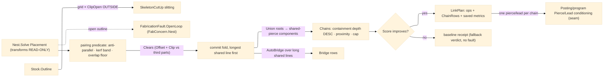

# [RASM_FABRICATION_LINKING]

The cut-topology optimizer over a resolved `Placement`: after `Nest.Solve` fixes the part transforms, THIS page edits the CUT GRAPH — never the placement — to cut shared material once, pierce once per chain, hold the skeleton stable, and slit the waste for safe removal. Four edits, ONE `LinkOp` `[Union]`: `CommonLine` pairs collinear OPPOSITE-WOUND edges of two neighboring parts lying within kerf tolerance and cuts the shared line ONCE (two CCW parts sharing a kerf-width gap traverse the shared edge in opposite directions — the anti-parallel direction test plus the metric kerf-band test plus the projected-overlap floor form the pairing predicate, real fence code below); `ChainCut` threads parts into shared-pierce chains so one pierce and one lead serve the whole chain; `Bridge` keeps micro-bridges uncut so thin parts and the waste skeleton cannot tip into the torch; `SkeletonCutUp` grid-slits the waste skeleton through the ONE open-path clip owner (`PolygonAlgebra.ClipOpen` — the OUTSIDE segments of each grid line against the kerf-inflated placed set ARE the slitting cuts, never a second clipper). Every edit is COLLISION-CHECKED against the placement graph before it commits: the kerf-inflated shared segment must clear every third part (`Offset` the open overlap by the kerf band, `Clip`-intersect against the others, commit only on empty), and every commit must IMPROVE the one objective row — `pierces · PierceCost + rapid · RapidCostPerMm` — so the plan is monotone under its own metric. Chain order carries the thermal fall-out law: a contour cut frees material, so chains order by containment depth DESCENDING (an inner contour cuts before the loop that `Covers` it) and by centroid proximity within a depth band, capped by `MaxChainParts`.

An inapplicable or non-improving edit FALLS BACK to the unlinked placement — a verdict, never a fault; the only fault this page routes is the folder's cross-cutting `OpenLoop` 2704 (`FabConcern.Nest`) on a non-closed part outline, and the placement transforms pass through byte-identical (linking edits topology, nesting owns position). The receipt feeds posting IN-PROCESS: `ChainRow` carries one pierce point and the ordered part membership per chain, and the `Posting/program` `Pierce`/`Lead` conditioning consumes that topology — one pierce/lead per chain instead of per contour — a seam this page states and program's conditioning owns; linking mints NO content key (the `cutprogram` key covers the lowered program, and a plan that never posts leaves no artifact).

Wire posture: HOST-LOCAL. The `LinkPlan` crosses only the in-process seam to the posting conditioning; no type on this page sits between wire and rail.

## [01]-[INDEX]

- [01]-[CUT_LINKING]: owns the `LinkOp` `[Union]` (common-line, chain, bridge, skeleton cut-up), the `LinkPolicy` table (kerf tolerance, shared-length floor, bridge rows, objective weights, chain cap, cut-up pitch), the `SharedEdge`/`ChainRow` rows, the `LinkPlan` receipt, and the one `Linking.Plan` fold — pairing predicate, collision-checked commits, monotone objective, containment-ordered chaining, auto-bridging, and waste slitting.

## [02]-[CUT_LINKING]

- Owner: `LinkOp` `[Union]` the cut-graph edit — `CommonLine(SharedEdge)` · `ChainCut(Seq<int> parts, Point3d pierce)` · `Bridge(int part, Point3d at, double widthMm)` · `SkeletonCutUp(Seq<Edge3> grid)`; `LinkPolicy` the policy table — `KerfToleranceMm` (the collinearity band IS the physical kerf), `MinSharedLengthMm`, `BridgeWidthMm`/`BridgeSpacingMm`/`AutoBridge`, `PierceCost`/`RapidCostPerMm` (the objective weights), `MaxChainParts`, `CutUpPitchMm` — with `Laser`/`Plasma` seed rows; `SharedEdge` the pairing row (part/edge indices both sides, the overlap `Edge3`, the shared length); `ChainRow` the per-chain pierce/membership row posting's `Pierce`/`Lead` conditioning consumes; `LinkPlan` the receipt (applied ops, chains, pierce and rapid before/after, shared cut saved); `Linking` the static surface owning the one `Plan` fold.
- Cases: `LinkOp` cases 4; the pairing predicate is three conjunctive gates — anti-parallel direction (opposite winding), both endpoints inside the kerf distance band (a METRIC test: kerf is physical width, `Predicate.Orient2D` stays the winding gate, never bent into a tolerance test), projected interval overlap ≥ `MinSharedLengthMm`; commit gates 2 — `Clears` (kerf-inflated overlap intersects no third part) and objective improvement; chain order keys 2 — containment depth descending over `Loop.Covers`, centroid proximity within a band; `LinkPolicy` seed rows 2 (`laser` fine-kerf auto-bridged, `plasma` wide-kerf manual-bridge).
- Entry: `public static Fin<LinkPlan> Linking.Plan(FabricationResult.Placement placement, Arr<Loop> parts, Option<Stock> stock, LinkPolicy policy)` — the ONE fold: validate closed outlines (`OpenLoop` 2704, `FabConcern.Nest`), place the loops by their transforms, discover `SharedEdge` candidates under a bounds prefilter, commit collision-checked improving common-lines in shared-length order, form containment-ordered chains, auto-bridge long shared lines, grid-slit the skeleton when a `Stock` is present, and emit the receipt; the placement transforms are READ-ONLY throughout.
- Auto: candidate discovery prefilters part pairs by kerf-inflated `BoundingBox` overlap before the O(edges²) pairing runs; committed common-lines union their parts into shared-pierce components (a `Map<int,int>` root fold — two joined parts pierce once), each component then a chain seed; `Chains` orders seeds by `Loop.Covers` containment depth descending (inner before outer — the thermal fall-out rule), packs proximity-ordered members up to `MaxChainParts`, and stamps each chain's pierce at its first part's lowest-then-leftmost vertex; `AutoBridge` emits `Bridge` rows at `BridgeSpacingMm` intervals along any committed overlap longer than twice the spacing; `SkeletonCutUp` builds the grid over the stock outline at `CutUpPitchMm` and keeps each line's `ClipOpen` OUTSIDE segments against the placed set inflated by the kerf band; the objective evaluates before/after — pierce count from component count, rapid length from the consecutive pierce-to-pierce tour — and a plan whose edits do not improve returns the unlinked baseline receipt.
- Receipt: `LinkPlan` — the applied ops, the `ChainRow` topology, `PiercesBefore`/`PiercesAfter`, `RapidBeforeMm`/`RapidAfterMm`, `SharedCutSavedMm`; the receipt IS the evidence and posting reads the chain topology, never a re-derivation.
- Packages: `Rasm.Fabrication.Geometry2D` (`PolygonAlgebra.Offset`/`Clip`/`ClipOpen`/`Area` — the one clip/offset owner), `Process/owner#FABRICATION_OWNER` (`Loop.Covers`/`Edge3`/`PartTransform` — exact containment and the motion atoms), `Process/faults#FAULT_BAND` (`OpenLoop`/`FabConcern.Nest`), the sibling `Nesting/nfp#NESTING` `Stock.Outline` (the cut-up frame), Thinktecture.Runtime.Extensions, LanguageExt.Core, `Rhino.Geometry`, BCL inbox.
- Growth: a new cut-graph edit is one `LinkOp` case plus one arm in the plan fold; a new objective term is one `LinkPolicy` weight column inside `Score`; per-modality tuning is a policy row, never a branch; a lead-style or pierce-style vocabulary stays `Posting/program`'s conditioning — this page hands topology only; zero new entrypoints.
- Boundary: linking edits the CUT GRAPH and never the placement — a transform mutation here is the named defect (nesting owns position); the pairing tolerance is the physical kerf band and a re-purposed robustness predicate as a tolerance test is the deleted form (`Orient2D` gates winding, metrics gate distance); every geometric construction routes the one `Geometry2D` owner and a second clipper/offsetter call site is the named duplication defect; the pierce/lead REALIZATION is posting's conditioning and an emitted lead arc or pierce block on this page is the lowering half it never owns; an inapplicable edit is a fallback verdict and a fault-on-no-improvement is the deleted form; the plan mints no content key and a `linking` egress row is the rejected form (the `cutprogram` key covers the posted artifact); the placed-loop projection is page-local pending the `PartTransform` application fold's atoms home — a second sibling copy is the collapse trigger.

```csharp signature
// --- [RUNTIME_PRELUDE] --------------------------------------------------------------------
using LanguageExt;
using LanguageExt.Common;
using Rasm.Fabrication.Geometry2D;
using Rasm.Fabrication.Process;
using Rhino.Geometry;
using Thinktecture;
using static LanguageExt.Prelude;

namespace Rasm.Fabrication.Nesting;

// --- [TYPES] ------------------------------------------------------------------------------
// The cut-graph edit family: placement transforms are READ-ONLY under every case.
[Union(ConversionFromValue = ConversionOperatorsGeneration.None)]
public abstract partial record LinkOp {
    private LinkOp() { }

    public sealed record CommonLine(SharedEdge Pair) : LinkOp;
    public sealed record ChainCut(Seq<int> Parts, Point3d Pierce) : LinkOp;
    public sealed record Bridge(int Part, Point3d At, double WidthMm) : LinkOp;
    public sealed record SkeletonCutUp(Seq<Edge3> Grid) : LinkOp;
}

// --- [MODELS] -----------------------------------------------------------------------------
// Policy table: KerfToleranceMm IS the physical kerf band the collinearity test and the collision
// inflation both read; PierceCost/RapidCostPerMm weight the one objective row.
public sealed record LinkPolicy(double KerfToleranceMm, double MinSharedLengthMm, double BridgeWidthMm, double BridgeSpacingMm, bool AutoBridge,
    double PierceCost, double RapidCostPerMm, int MaxChainParts, double CutUpPitchMm) {
    public static readonly LinkPolicy Laser = new(KerfToleranceMm: 0.3, MinSharedLengthMm: 25.0, BridgeWidthMm: 0.8, BridgeSpacingMm: 250.0,
        AutoBridge: true, PierceCost: 30.0, RapidCostPerMm: 0.01, MaxChainParts: 20, CutUpPitchMm: 600.0);
    public static readonly LinkPolicy Plasma = new(KerfToleranceMm: 1.6, MinSharedLengthMm: 40.0, BridgeWidthMm: 2.0, BridgeSpacingMm: 400.0,
        AutoBridge: false, PierceCost: 120.0, RapidCostPerMm: 0.02, MaxChainParts: 12, CutUpPitchMm: 800.0);

    public double Score(int pierces, double rapidMm) => pierces * PierceCost + rapidMm * RapidCostPerMm;
}

public readonly record struct SharedEdge(int PartA, int EdgeA, int PartB, int EdgeB, Edge3 Overlap, double SharedLengthMm);

// One pierce/lead per chain — the topology row Posting/program's Pierce/Lead conditioning consumes.
public readonly record struct ChainRow(int Chain, Point3d Pierce, Seq<int> Parts, double CutLengthMm);

public sealed record LinkPlan(Seq<LinkOp> Applied, Seq<ChainRow> Chains, int PiercesBefore, int PiercesAfter,
    double RapidBeforeMm, double RapidAfterMm, double SharedCutSavedMm);

// --- [OPERATIONS] ---------------------------------------------------------------------------
public static class Linking {
    public static Fin<LinkPlan> Plan(FabricationResult.Placement placement, Arr<Loop> parts, Option<Stock> stock, LinkPolicy policy) =>
        parts.Find(static l => !l.Closed).Match(
            Some: _ => Fin.Fail<LinkPlan>(FabricationFault.OpenLoop(FabConcern.Nest, parts.Count).ToError()),
            None: () => {
                Seq<(int Id, Loop Placed)> placed = placement.Parts.Map(t => (t.PartId, Placed(parts[t.PartId], t)));
                Seq<SharedEdge> commits = Commit(Candidates(placed, policy), placed, policy);
                Map<int, int> roots = commits.Fold(placed.Map(static p => (p.Id, p.Id)).ToMap(), static (m, e) => Union(m, e.PartA, e.PartB));
                Seq<ChainRow> chains = Chains(placed, roots, policy);
                Seq<LinkOp> bridges = policy.AutoBridge ? Bridges(commits, policy) : Seq<LinkOp>();
                Seq<LinkOp> cutUp = stock.Match(
                    Some: s => Seq<LinkOp>(new LinkOp.SkeletonCutUp(CutUp(s, placed.Map(static p => p.Placed), policy))),
                    None: () => Seq<LinkOp>());
                int before = placed.Count, after = chains.Count;
                double rapidBefore = Tour(placed.Map(static p => Centroid(p.Placed)));
                double rapidAfter = Tour(chains.Map(static c => c.Pierce));
                Seq<LinkOp> applied = commits.Map(static e => (LinkOp)new LinkOp.CommonLine(e))
                    .Concat(chains.Map(static c => (LinkOp)new LinkOp.ChainCut(c.Parts, c.Pierce)))
                    .Concat(bridges).Concat(cutUp);
                return Fin.Succ(policy.Score(after, rapidAfter) < policy.Score(before, rapidBefore)
                    ? new LinkPlan(applied, chains, before, after, rapidBefore, rapidAfter, commits.Sum(static e => e.SharedLengthMm))
                    : new LinkPlan(Seq<LinkOp>(), Baseline(placed), before, before, rapidBefore, rapidBefore, 0.0));
            });

    // Collinear opposite-wound pairing: anti-parallel direction, both endpoints inside the kerf band
    // (a METRIC test — kerf is physical; Orient2D stays the winding gate), overlap >= the floor.
    static Option<SharedEdge> Pair(int ia, Loop a, int ea, int ib, Loop b, int eb, LinkPolicy policy) {
        (Point3d a0, Point3d a1, Point3d b0, Point3d b1) = (a.At(ea), a.At(ea + 1), b.At(eb), b.At(eb + 1));
        Vector3d da = a1 - a0, db = b1 - b0;
        double la = da.Length;
        if (la < 1e-9 || db.Length < 1e-9 || da * db > -1e-9) return None;
        if (Dist(a0, a1, b0) > policy.KerfToleranceMm || Dist(a0, a1, b1) > policy.KerfToleranceMm) return None;
        double t0 = ((b0 - a0) * da) / (la * la), t1 = ((b1 - a0) * da) / (la * la);
        double lo = Math.Max(0.0, Math.Min(t0, t1)), hi = Math.Min(1.0, Math.Max(t0, t1));
        return (hi - lo) * la >= policy.MinSharedLengthMm
            ? Some(new SharedEdge(ia, ea, ib, eb, new Edge3(a0 + da * lo, a0 + da * hi), (hi - lo) * la))
            : None;
    }

    static Seq<SharedEdge> Candidates(Seq<(int Id, Loop Placed)> placed, LinkPolicy policy) =>
        placed.Bind(a => placed.Filter(b => b.Id > a.Id && Near(a.Placed, b.Placed, policy.KerfToleranceMm))
            .Bind(b => toSeq(Enumerable.Range(0, a.Placed.Count))
                .Bind(ea => toSeq(Enumerable.Range(0, b.Placed.Count))
                    .Bind(eb => Pair(a.Id, a.Placed, ea, b.Id, b.Placed, eb, policy).ToSeq()))))
            .OrderByDescending(static e => e.SharedLengthMm).ToSeq();

    // Commit fold: longest shared line first, each edit re-validated against the CURRENT graph — the
    // kerf-inflated overlap must clear every third part, one commit per part-pair.
    static Seq<SharedEdge> Commit(Seq<SharedEdge> candidates, Seq<(int Id, Loop Placed)> placed, LinkPolicy policy) =>
        candidates.Fold(Seq<SharedEdge>(), (done, e) =>
            done.Exists(d => (d.PartA, d.PartB) == (e.PartA, e.PartB)) || !Clears(e, placed, policy) ? done : done.Add(e));

    static bool Clears(SharedEdge e, Seq<(int Id, Loop Placed)> placed, LinkPolicy policy) =>
        PolygonAlgebra.Offset(Seq(new Loop(Arr(e.Overlap.A, e.Overlap.B), Closed: false)), policy.KerfToleranceMm, OffsetEnds.OpenSquare).ToOption()
            .Map(region => placed.Filter(p => p.Id != e.PartA && p.Id != e.PartB)
                .ForAll(p => PolygonAlgebra.Clip(region, Seq(p.Placed), ClipOp.Intersect).Map(static r => r.IsEmpty).IfFail(false)))
            .IfNone(false);

    // Chain law: containment depth DESCENDING (an inner contour cuts before the loop that Covers it —
    // thermal fall-out), centroid proximity within a depth band, membership capped, one pierce per chain.
    static Seq<ChainRow> Chains(Seq<(int Id, Loop Placed)> placed, Map<int, int> roots, LinkPolicy policy) =>
        placed.GroupBy(p => Find(roots, p.Id))
            .Bind(g => g.ToSeq()
                .OrderByDescending(p => placed.Count(o => o.Id != p.Id && o.Placed.Covers(Centroid(p.Placed)))).ToSeq()
                .Chunk(policy.MaxChainParts).ToSeq().Map(toSeq))
            .Map((i, chunk) => new ChainRow(i, Anchor(chunk.Head.Placed), chunk.Map(static p => p.Id),
                chunk.Sum(static p => Perimeter(p.Placed))))
            .ToSeq();

    static Seq<ChainRow> Baseline(Seq<(int Id, Loop Placed)> placed) =>
        placed.Map((i, p) => new ChainRow(i, Anchor(p.Placed), Seq(p.Id), Perimeter(p.Placed))).ToSeq();

    static Seq<LinkOp> Bridges(Seq<SharedEdge> commits, LinkPolicy policy) =>
        commits.Filter(e => e.SharedLengthMm > 2.0 * policy.BridgeSpacingMm)
            .Bind(e => toSeq(Enumerable.Range(1, (int)(e.SharedLengthMm / policy.BridgeSpacingMm)))
                .Map(k => (LinkOp)new LinkOp.Bridge(e.PartA, Lerp(e.Overlap, k * policy.BridgeSpacingMm / e.SharedLengthMm), policy.BridgeWidthMm)));

    // Waste-grid slitting through the ONE open-path clip owner: OUTSIDE segments of each grid line
    // against the kerf-inflated placed set ARE the slitting cuts.
    static Seq<Edge3> CutUp(Stock stock, Seq<Loop> placed, LinkPolicy policy) {
        Seq<Loop> inflated = placed.Bind(p => PolygonAlgebra.Offset(Seq(p), policy.KerfToleranceMm, OffsetEnds.Polygon).IfFail(Seq(p)));
        BoundingBox b = stock.Outline().Bound();
        Seq<Edge3> grid = toSeq(Enumerable.Range(1, Math.Max(0, (int)(b.Diagonal.X / policy.CutUpPitchMm))))
            .Map(i => new Edge3(new Point3d(b.Min.X + i * policy.CutUpPitchMm, b.Min.Y, 0), new Point3d(b.Min.X + i * policy.CutUpPitchMm, b.Max.Y, 0)))
            .Concat(toSeq(Enumerable.Range(1, Math.Max(0, (int)(b.Diagonal.Y / policy.CutUpPitchMm))))
            .Map(j => new Edge3(new Point3d(b.Min.X, b.Min.Y + j * policy.CutUpPitchMm, 0), new Point3d(b.Max.X, b.Min.Y + j * policy.CutUpPitchMm, 0))));
        return grid.Bind(line => PolygonAlgebra.ClipOpen(line, inflated).Outside);
    }

    // Page-local placed-loop projection (rotation + translation of the PartTransform); the atoms-level
    // application fold is the recorded collapse target shared with nfp's Transform.
    static Loop Placed(Loop part, PartTransform t) {
        double c = Math.Cos(t.RotationRadians), s = Math.Sin(t.RotationRadians);
        return new Loop(part.Vertices.Map(v => new Point3d(v.X * c - v.Y * s + t.Tx, v.X * s + v.Y * c + t.Ty, 0.0)).ToArr(), Closed: true);
    }

    static Map<int, int> Union(Map<int, int> roots, int a, int b) => roots.AddOrUpdate(Find(roots, b), Find(roots, a));

    static int Find(Map<int, int> roots, int id) =>
        roots.Find(id).Match(Some: r => r == id ? id : Find(roots, r), None: () => id);

    static bool Near(Loop a, Loop b, double band) {
        BoundingBox ba = a.Bound(), bb = b.Bound();
        return ba.Min.X - band <= bb.Max.X && bb.Min.X - band <= ba.Max.X && ba.Min.Y - band <= bb.Max.Y && bb.Min.Y - band <= ba.Max.Y;
    }

    static double Dist(Point3d p0, Point3d p1, Point3d q) {
        Vector3d d = p1 - p0;
        double len = d.Length;
        return len < 1e-9 ? p0.DistanceTo(q) : Vector3d.CrossProduct(d, q - p0).Length / len;
    }

    static double Tour(Seq<Point3d> stops) =>
        stops.Tail.Fold((Len: 0.0, At: stops.HeadOrNone().IfNone(Point3d.Origin)), (acc, p) => (acc.Len + acc.At.DistanceTo(p), p)).Len;

    static double Perimeter(Loop loop) =>
        toSeq(Enumerable.Range(0, loop.Count)).Sum(i => loop.At(i).DistanceTo(loop.At(i + 1)));

    static Point3d Centroid(Loop loop) {
        BoundingBox b = loop.Bound();
        return new Point3d(0.5 * (b.Min.X + b.Max.X), 0.5 * (b.Min.Y + b.Max.Y), 0.0);
    }

    static Point3d Anchor(Loop loop) => loop.Vertices.OrderBy(static v => v.Y).ThenBy(static v => v.X).Head();

    static Point3d Lerp(Edge3 e, double t) => e.A + (e.B - e.A) * t;
}
```


