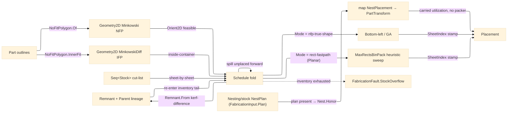

# [RASM_FABRICATION_NFP]

The 2D true-shape nesting owner: `Nest` the static placement fold packing part outlines across a `Seq<Stock>` inventory through a no-fit-polygon (NFP) feasibility test, with a bottom-left greedy, a genetic placement heuristic, and an axis-aligned-rectangle `MaxRectsBinPack` fast-path all over the same NFP feasibility set, spilling parts that do not fit one stock onto the next and minting the leftover of each consumed stock as a content-keyed lineage-tracked `Remnant`. The NFP construction routes the `Geometry2D/algebra#POLYGON_ALGEBRA` `MinkowskiSum` — the Minkowski sum of the fixed part with the reflected orbiting part — never a hand-rolled angle-sorted edge merge; Clipper2 owns the polygon construction at integer-robust precision, and the irregular/non-convex NFP (convex decomposition + per-piece Minkowski union) is one arm on the same Geometry2D owner. The lower-left anchor is the sole orbiting-part reference point: `NoFitPolygon.Of` normalizes fixed and orbiting loops into that anchor frame, `NoFitPolygon.InnerFit` emits the same reference frame, and `PartTransform` subtracts the original part anchor at egress. The stock the parts pack onto is the `Stock` `[Union]` (`Sheet`/`Plate`/`BarStock`/`TubeStock`/`Billet`/`Filament`/`FromRemnant`) — one closed family with a single `Contains`/`Area`/`Of` total fold the feasibility kernel reads, collapsing the old virgin-rectangle-vs-remnant `Option<Remnant>` discriminant and the new plate/bar/tube/billet/filament cases into one owner: a planar `Sheet`/`Plate`/`Billet` packs in its 2D bounds (the `MaxRectsBinPack` maxrects fast-path the flatbed cases route through), a `BarStock`/`TubeStock` packs onto its 1-axis-revolved envelope (the unrolled circumference × length), the `Filament` is the additive feedstock budget, and a `FromRemnant`/non-rectangular case routes the exact `Remnant.Holds`/`InnerFit` IFP containment. The feasibility verdict — whether a reference point lies inside or outside the NFP — stays the kernel `Rasm/Numerics/predicates#ROBUST_PREDICATES` `Predicate.Orient2D` exact point-in-polygon sign. The bottom-left, genetic, and rect-fastpath modes are ONE fold over the `NestPolicy` placement discriminant, never three packer classes; `MaxRectsBinPack` admits ONLY as the axis-aligned-rectangle arm coexisting with the NFP true-shape kernel and never displaces the `BarStock`/`TubeStock`/`Remnant` cases. When a sibling `Nesting/stock#STOCK_NEST` `StockNest.Pack` cutting-stock solve has already resolved a rectangular sheet-goods layout, the `Nest.Honor` fold CONSUMES that `NestPlan` directly on `FabricationInput.Plan` and maps each `NestPlacement` straight to a `PartTransform` — the stock owner keeps the rectangular cutting-stock YIELD (the procurement/sustainability concern: minimum sheets, offcut remnants, embodied-carbon waste) and this owner the true-shape irregular NEST (the CAM concern: cut-program transforms), so the `rect-fastpath` `MaxRectsBinPack` arm is the from-scratch degenerate-AABB nest for parts arriving WITHOUT a material plan and never a second rectangular cutting-stock packer beside the stock owner; the seam is in-package and direct, neither duplicating the other. A DRL-guided placement policy is the optional `NestPolicy.Score` `Func<NoFitPolygon, PartTransform, double>` column; absent learned scoring, bottom-left ranking is the exact `(Ty, Tx)` lexicographic tuple. The kernel composes the `Process/owner#FABRICATION_OWNER` `Loop`/`PartTransform`/`FabricationPolicy.Nest`/`FabricationResult.Placement` shared vocabulary; content identity routes through `ContentKey.Of` for placement, remnant, stock lineage, and pair-memo keys.

Wire posture: HOST-LOCAL. The `Placement` transforms cross only the in-process seam to the `Posting/program#CUT_PROGRAM` emitter — never a browser or peer wire. The `Stock`/`NestPolicy`/`NoFitPolygon` records are host-local types that never sit between wire and rail; the `NestPlan` on `FabricationInput.Plan` is IN-PACKAGE data from `Nesting/stock#STOCK_NEST` — admitted ONCE at the `Nest.Solve` plan-honor boundary and mapped straight to `PartTransform`, re-validated nowhere in the interior; no wire mirror exists.

## [01]-[INDEX]

- [01]-[NESTING]: owns the `Stock` union, the `NestPolicy`/`NoFitPolygon` records, and the `Nest` fold — no-fit-polygon feasibility (Minkowski via Geometry2D) and inner-fit-polygon containment (MinkowskiDiff) with the bottom-left, genetic, and `MaxRectsBinPack` rect-fastpath placement modes over the one feasibility set, the multi-sheet `Seq<Stock>` scheduler spilling parts forward, the kerf-inflated Boolean-difference `Remnant` lineage producer, the injected placement-score delegate slot, and the `Nest.Honor` consumption of a pre-resolved sibling `NestPlan` (the `Nesting/stock#STOCK_NEST` rectangular cutting-stock yield) the plan-present path maps straight to `PartTransform` rather than re-packing.

## [02]-[NESTING]

- Owner: `Remnant` the leftover-stock polygon carrying its boundary `Loop`, its `ContentKey.Of(EgressKind.Remnant, ...)`-derived `UInt128` content identity, an `Option<UInt128>` `Parent` lineage column (the consumed-stock identity a difference-minted child descends from, `None` for a virgin remnant), the `Holds` exact point-in-polygon containment, the `Of` content-address mint, and the `From` kerf-inflated Boolean-difference fold minting each leftover region as a content-keyed lineage-stamped child; `Stock` `[Union]` the stock the parts pack onto — `Sheet` (virgin rectangle) · `Plate` (thick rectangle with a cut-depth column) · `BarStock`/`TubeStock` (a revolved envelope unrolled to its circumference × length planar bounds) · `Billet` (a solid block) · `Filament` (additive feedstock length) · `FromRemnant` (wrapping the content-keyed leftover `Remnant` polygon) — with one `Contains`/`Area`/`Of`/`Planar` total fold every feasibility check reads, the `Of` fold hashing stock discriminant plus every dimensional column through `ContentKey.Of(EgressKind.StockSnapshot, ...)`; `NestPolicy` the placement knobs (rotation step count, GA population, generations, mutation rate, the `Mode` `[SmartEnum<string>]` `nfp-true-shape`/`rect-fastpath` placement discriminant, the `Guillotine` straight-cut and `GrainDirection` constraint columns a panel-saw arm reads, the `Kerf` inflation width the remnant difference reads, and the optional `Score` learned-rank delegate); `NoFitPolygon` the sliding-locus polygon — the set of lower-left-anchor reference positions where the orbiting part touches but never overlaps the fixed part, its outer boundary built through the Geometry2D Minkowski SUM and its `InnerFit` inner-fit-polygon locus built through the Geometry2D Minkowski DIFFERENCE, with `PairKey` the `ContentKey.Of(EgressKind.Placement, ...)` digest over the rotation-quantized anchor-normalized part-pair vertex span keying the precompute memo; the sibling `Nesting/stock#STOCK_NEST` `NestPlan` — the resolved rectangular layout (a `Seq<NestPlacement>` of `PartId` + sheet-index + position + rotation tuples plus the `NestYield` receipt) — the `Nest.Honor` fold consumes directly when `FabricationInput.Plan` is present; `Nest` the static placement fold building each part-pair NFP, scheduling the parts across the `Seq<Stock>` inventory sheet-by-sheet, folding the parts onto each `Stock` envelope by the bottom-left, genetic-ordered, or `MaxRectsBinPack` rect-fastpath heuristic, or — when a pre-resolved `NestPlan` rides `FabricationInput.Plan` — honoring that rectangular layout directly through `Nest.Honor` without running a packer.
- Cases: placement modes `bottom-left` (a deterministic greedy lowest-then-leftmost feasible position per part) · `genetic` (a GA over the part ordering + rotation, the bottom-left decode scoring each chromosome by utilization) · `rect-fastpath` (the `MaxRectsBinPack` heuristic-sweep axis-aligned-rectangle packer over the part bounding boxes, routed only for the `Planar` `Sheet`/`Plate`/`Billet` cases under the `NestPolicy.Mode` discriminant) (3), the orthogonal plan-honor path consuming a pre-resolved sibling `NestPlan` from `FabricationInput.Plan` bypassing the packer entirely; the `Stock` union cases `Sheet` · `Plate` · `BarStock` · `TubeStock` · `Billet` · `Filament` · `FromRemnant` (7), the one `Contains`/`Area`/`Planar` fold discriminating the planar bounds (`Planar` true) from the revolved envelope from the remnant `Holds`/`InnerFit` containment (`Planar` false), the remnant re-entering the same NFP feasibility set as the next stock; the NFP outer boundary is the convex Minkowski merge through Geometry2D, the irregular/non-convex NFP (convex decomposition + per-piece union) the one widening arm on `NoFitPolygon.Of`, and the inner-fit locus the settled `MinkowskiDiff` arm on `NoFitPolygon.InnerFit`.
- Entry: `public static Fin<FabricationResult> Solve(FabricationPolicy.Nest policy, FabricationInput input)` — `Fin<T>` routes `FabricationFault.OpenLoop` on a non-closed part outline, `FabricationFault.NoFit` when a part cannot be placed within any one stock under every rotation, and `FabricationFault.StockOverflow` when the multi-sheet spill exhausts the `Seq<Stock>` inventory with parts still unplaced, each lowered with `.ToError()`; the body builds the pairwise NFPs once, then runs the sheet-by-sheet scheduler folding each stock's placement through the bottom-left, GA, or rect-fastpath mode, spilling the unplaced parts forward, minting each consumed stock's `Remnant`, and emitting the `Placement` transforms with their `SheetIndex` partition, the cross-sheet utilization scalar, and the produced `Remnant` set.
- Auto: `NoFitPolygon.Of` moves fixed and orbiting loops into each part’s lower-left `Anchor` frame, reflects the orbiting anchor frame through the origin, and runs the `Geometry2D/algebra#POLYGON_ALGEBRA` `MinkowskiSum` of the fixed part and the reflected orbiting part, taking the result boundary as the NFP outer locus; `NoFitPolygon.InnerFit` runs the dual `PolygonAlgebra.MinkowskiDiff` of the container loop and the reflected part at the fixed rotation, taking the result as the inner-fit-polygon locus the exact non-rectangular `Stock.Contains` reads (a reference point INSIDE the IFP places the part fully inside the container, the exact dual of the NFP overlap test, keyed per rotation the same way the NFP precompute is); the irregular/non-convex NFP (convex decomposition into sub-pieces, per-piece Minkowski sum, locus union) is the one widening arm on this owner over the same Geometry2D substrate. `Nest.Solve` precomputes the ordered pairwise NFPs into a frozen memo keyed by the `NoFitPolygon.PairKey` content digest — the `ContentKey.Of(EgressKind.Placement, buffer.WrittenSpan)` digest over the rotation count and the anchor-normalized vertex span of the ordered part-pair loops — so two part-pairs with identical geometry share one Minkowski result across the bottom-left, genetic, and across the multi-sheet fold, and the `NestPolicy.Rotations` discretization enters the key so a rotated instance hits its own digest. The MULTI-SHEET scheduler folds the `input.Inventory` `Seq<Stock>` sheet-by-sheet: it places as many parts as fit the head stock (the per-stock placement run a `bottom-left`/`genetic`/`rect-fastpath` fold over the unplaced set), stamps each placed `PartTransform.SheetIndex` with the stock's inventory index, spills the unplaced parts onto the next stock, mints the consumed stock's `Remnant` back into the inventory tail, and exhausts when the inventory empties — `StockOverflow` routing if parts remain unplaced after the last stock, never a per-sheet `Solve` call. A candidate placement is feasible when the part reference point lies OUTSIDE every already-placed part's NFP (no overlap, the NFP fetched by the part-pair digest) and `Stock.Contains` holds — for a planar `Sheet`/`Plate`/`Billet` the axis-aligned bounds, for a `BarStock`/`TubeStock` the unrolled circumference × length bounds, for a `FromRemnant`/non-rectangular case the exact `Remnant.Holds` (the part fully inside the remnant `Loop`) composing the `NoFitPolygon.InnerFit` IFP locus over the same `Orient2D` point-in-polygon — so a partially-consumed stock's remnant re-enters the feasibility set and the next nest packs onto the real leftover polygon rather than a virgin sheet. The PER-STOCK placement mode dispatches on `NestPolicy.Mode`: `nfp-true-shape` runs the `bottom-left`/`genetic` NFP fold (the irregular owner), and `rect-fastpath` — gated to `Stock.Planar` planar cases only — sweeps the top-level `FreeRectChoiceHeuristic` vocabulary over a fresh per-extent `MaxRectsBinPack.Insert` fold of the part bounding boxes (each part `Insert`ed one at a time keyed by `PartId`, the densest run by placed area kept), a `Rect.Height == 0` return the sole placement-failure sentinel the suite emits (it throws nothing, per the `.api` `[STATEFUL_INCREMENTAL]` law) so an unfittable part folds out and a run placing nothing lowers to an empty placement that spills the whole pending set forward through the multi-sheet `Consume` fold — never an uncaught exception escaping the `Fin` rail — folding each placed `Rect.X`/`Y` back to `PartTransform`, the axis-fixed AABB packer the dominant flatbed laser/plasma/waterjet case the GA cannot match; `bottom-left` mode folds the parts in descending-area order, sliding each to its lowest feasible NFP-boundary position scored by `NestPolicy.Score` (defaulted to the lowest-then-leftmost heuristic, overridable by the injected DRL delegate); `genetic` mode evolves a population of (order, rotation) chromosomes, decoding each through the same bottom-left placement and scoring by packed-area utilization against `Stock.Area`, the GA fold running tournament selection, order crossover, and swap mutation for `Generations` and returning the best decode. After a stock's placement, `Remnant.From` folds the kerf-inflated placed-part outlines (each outline `Offset` outward by half the `NestPolicy.Kerf`) against the stock boundary through the `Geometry2D/algebra#POLYGON_ALGEBRA` `Clip` `ClipOp.Difference`, takes each resulting disjoint region as a candidate `Remnant`, content-addresses it through `Remnant.Of`'s `ContentKey.Of(EgressKind.Remnant, buffer.WrittenSpan)` digest, and stamps each child's `Parent` with the consumed stock's `Of()` identity so the leftover of cutting sheet A is a real lineage-tracked polygon (not a virgin rectangle) the next nest's inventory carries forward. `Remnant.Of` content-addresses the remnant boundary through `ContentKey.Of(EgressKind.Remnant, buffer.WrittenSpan)` so a remnant is keyed by the one content identity, never a second tag. When `FabricationInput.Plan` carries a pre-resolved `NestPlan`, `Nest.Solve` SHORT-CIRCUITS the packer path entirely — `Nest.Honor` maps each `NestPlacement` to a `PartTransform` by rotating the part about the origin by the 90° flag and offsetting its rotated bounding-box min to the plan's placed lower-left (the exact dual of the `rect-fastpath` arm's bbox-min anchor, reusing the one `Transform` fold), passing the `NestYield`'s utilization and unplaced count straight into the `Placement` and minting no `Remnant` (the rectangular offcuts stay yield evidence on the `Nesting/stock` receipt), so no rectangular cutting-stock packer is duplicated beside the stock owner.
- Receipt: the `Placement` carries the per-part `PartTransform` (translation + rotation), the stock utilization fraction, and the unplaced count — the typed nesting evidence the posting emitter consumes; no generic nesting ledger.
- Packages: `Rhino.Geometry` (`Point3d`/`Vector3d`/`BoundingBox` — composed), the `Process/owner#FABRICATION_OWNER` `Loop.Covers` (point-in-polygon feasibility, composing the kernel `Predicate.Orient2D` transitively), Clipper2 (via `Geometry2D/algebra#POLYGON_ALGEBRA` — the NFP `MinkowskiSum`, the IFP `MinkowskiDiff`, the remnant `Clip` difference and the kerf-inflation `Offset`), `RectangleBinPack.CSharp` (`MaxRectsBinPack(int, int, bool)` constructed per sheet extent and its `Insert(int, int, FreeRectChoiceHeuristic)` incremental placement stream, the `Rect` value struct with the `Height == 0` placement-failure sentinel and the `X`/`Y`/`Width`/`Height`/`Right`/`Bottom` members, and the top-level `FreeRectChoiceHeuristic` sweep vocabulary — assembly `RectangleBinPacking`, the axis-aligned-rectangle maxrects fast-path arm, pure-managed AnyCPU zero native deps, the `Rect.Height == 0` sentinel read at the one call site with no exception rail, the `.api/api-rectanglebinpack-csharp.md` catalogue, the sibling `Nesting/stock#STOCK_NEST` the primary admitter over the full packer suite and this arm composing only its `MaxRectsBinPack` sweep), `Process/owner#FABRICATION_OWNER` `ContentKey.Of`/`ContentHash.Of` identity rail (`EgressKind.Remnant`/`StockSnapshot`/`Placement` content mints), `System.Buffers.Binary` (`BinaryPrimitives`), LanguageExt.Core, BCL inbox.
- Growth: the discrete rotation sweep is landed — `Angles(policy)` over `NestPolicy.Rotations` drives both the `Precompute` rotation-pair NFP table and the `BottomLeft` candidate axis, so a finer sweep is one `Rotations` value; a non-convex decomposition refinement is one arm on `NoFitPolygon.Of` over the same Geometry2D Minkowski owner; the inner-fit containment for an irregular remnant is the settled `NoFitPolygon.InnerFit` `MinkowskiDiff` arm the `Stock.Contains` `FromRemnant` case reads, never a hand-rolled bounds test; a new stock kind is one `Stock` union case carrying its `Contains`/`Area`/`Planar` arm, never a second nesting owner; a new placement mode is one `NestPolicy.Mode` row plus one `PlaceStock` `Switch` arm, the `rect-fastpath` `MaxRectsBinPack` arm coexisting with the NFP true-shape kernel; a DRL-guided placement is the `NestPolicy.Score` delegate column the app-platform consumer fills from the `Rasm.Compute/Model/inference#INFERENCE_MODES` ONNX lane (never a Fabrication-side `Rasm.Compute` reference — the AEC→app-platform edge is forbidden), the NFP and heuristic folds unchanged; the multi-sheet schedule is the one `Seq<Stock>` fold spilling parts forward, never a per-sheet `Solve`; the remnant inventory grows automatically through the `Remnant.From` difference producer the multi-sheet fold runs per consumed stock; a cross-run NFP cache is the same `PairKey` content digest the precompute already keys, never a second memo; an existing rectangular cutting-stock layout is HONORED through the `Nest.Honor` fold reading the sibling `NestPlan` on `FabricationInput.Plan`, never a second rectangular cutting-stock packer minted beside the true-shape kernel (`Nesting/stock#STOCK_NEST` owns the rectangular yield); zero new surface.
- Boundary: nesting is the ONE author-kernel placement owner and the NFP construction routes the one `Geometry2D/algebra#POLYGON_ALGEBRA` Minkowski owner — a hand-rolled angle-sorted edge merge is the deleted form; the NFP is the canonical placement primitive and a per-heuristic bespoke overlap test is the deleted form, every feasibility check reading the same NFP and the exact `Orient2D` inside/outside; the inner-fit containment is the `NoFitPolygon.InnerFit` `MinkowskiDiff` dual over the same one owner and a hand-rolled inner-fit bounds test is the deleted form — the IFP is the exact containment locus the non-rectangular `Stock.Contains` reads, keyed per rotation the same way the NFP is; the bottom-left, genetic, and rect-fastpath modes are ONE fold over the `NestPolicy.Mode` discriminant and a `NfpPacker`/`RectPacker` parallel packer class pair is the deleted form — `MaxRectsBinPack` admits ONLY as the `rect-fastpath` axis-aligned-rectangle arm over the `Planar` `Sheet`/`Plate`/`Billet` cases and NEVER displaces the `BarStock`/`TubeStock`/`Remnant` true-shape cases (those route the NFP owner), the AABB packer coexisting with the irregular kernel, never replacing it, and a second single-purpose AABB packer duplicating this suite's `MaxRects` algorithm with no distinct maintained edge is the rejected sibling; the `MaxRectsBinPack.Insert` `Rect.Height == 0` return is the sole placement-failure sentinel the suite emits (it throws no packing exception) — an unfittable part folds out and a run placing nothing lowers to an empty placement the multi-sheet fold spills forward, and a swallowed sentinel that silently drops a placeable part or an assumed exception rail the suite never raises is the named boundary defect — the sentinel is read at this owning boundary, never the interior, exactly as the `.api` `[STATEFUL_INCREMENTAL]` law prescribes; the multi-sheet schedule is ONE `Seq<Stock>` fold spilling unplaced parts forward and a per-sheet `Solve` call (the `Map(Solve)` over the inventory) is the deleted form — the scheduler partitions the placement by `SheetIndex`, mints each consumed stock's remnant back into the inventory, and routes `StockOverflow` when the inventory exhausts with parts unplaced; the remnant is the kerf-inflated Boolean DIFFERENCE of the placed outlines from the stock through the one `Geometry2D/algebra#POLYGON_ALGEBRA` `Clip` `ClipOp.Difference` and an axis-aligned leftover rectangle is the deleted form — the producer is a fold over the difference's disjoint regions, each minting its own content-keyed `Remnant` stamped with the same `Parent` lineage, so the leftover of a finished nest is a real polygon the next nest carries; the stock rides the one `Stock` union with one `Contains`/`Area`/`Planar` fold and a `SheetPacker`/`BarPacker`/`RemnantPacker` per-stock packer triple is the deleted form — the `Contains` `Switch` discriminates the planar bounds from the revolved envelope from the remnant `Holds`/`InnerFit` containment over one owner, and the old `Option<Remnant>` discriminant collapses INTO the union closedness; the placement-score delegate is the one `NestPolicy.Score` column and a parallel learned-vs-heuristic packer split is the deleted form — the injected delegate ranks placements over the unchanged NFP, the heuristic score the default arm; the remnant identity and its parent lineage are `ContentKey.Of(EgressKind.Remnant, buffer.WrittenSpan)` and `ContentKey.Of(EgressKind.StockSnapshot, buffer.WrittenSpan)` digests over canonical bytes, and the geometry domain mints no parallel digest; the NFP precompute memo is content-keyed by the `NoFitPolygon.PairKey` part-pair digest (the `ContentKey.Of(EgressKind.Placement, buffer.WrittenSpan)` digest over the rotation-quantized anchor-normalized ordered-pair vertex span) and an `(int, int)` index-tuple key is the deleted form — a repeated part shape reuses its NFP across genetic generations, stocks, and the multi-sheet fold, never rebuilding an identical Minkowski result per index pair; the point-in-polygon side test reads the shared `Process/owner#FABRICATION_OWNER` `Loop.Covers` exact-`Orient2D` containment (`Remnant.Holds` and `NoFitPolygon.Feasible`/`InnerFeasible` compose it, never a per-page re-rolled containment loop) and a naive `double` cross is the named robustness defect; the polygon area metric is the one `Geometry2D/algebra#POLYGON_ALGEBRA` `Area` projection — `Stock.Area` for a remnant and `Utilization` for the packed-part fraction both read `PolygonAlgebra.Area`, and a hand-inlined shoelace loop (the old `SignedArea`/`Stock.Area fromRemnant` triplicate) is the deleted form the metric owner subsumes; the `MaxRectsBinPack` int `Rect` return is the boundary-mapped fast-path output and a `Rect`/`FreeRectChoiceHeuristic` type in a sibling-kernel signature is the seam violation — the AABB packer's int-rect domain crosses to `PartTransform` at the one `rect-fastpath` arm and never travels the interior; the per-generation GA population evolution and the in-place `Crossover`/`Shuffle` chromosome scratch are the named measured-kernel statement exemption — the order-crossover and Fisher-Yates index permutation over `int[]` arrays below the dense-collection crossover, never an immutable rebuild per swap; the strata law forbids the AEC→app-platform downward edge and a `Rasm.Compute` reference in this folder is the rejected form — the DRL score crosses as a raw `double` through the injected delegate, the upstream owner never named; a second rectangular cutting-stock packer duplicating the sibling `Nesting/stock#STOCK_NEST` `StockNest`/`RectangleBinPack` yield engine is the deleted form — the `rect-fastpath` `MaxRectsBinPack` arm is the from-scratch degenerate-AABB CAM nest (cut-program transforms from raw outlines) composing the same `RectangleBinPack.CSharp` suite the stock owner drives yet DISTINCT in concern from the consumed material-planning plan (the procurement yield receipt), so when a `StockNest.Pack` solve has already resolved a sheet-goods layout the `Nest.Honor` fold HONORS the `NestPlan` on `FabricationInput.Plan` (admitted once, mapped straight to `PartTransform`, re-validated nowhere) rather than re-deriving a lower-yield layout — the stock owner keeping the rectangular yield and this owner the true-shape irregular nest, neither duplicating the other.

```csharp signature
// --- [RUNTIME_PRELUDE] --------------------------------------------------------------------
using System.Buffers;
using System.Buffers.Binary;
using System.Collections.Frozen;
using LanguageExt;
using LanguageExt.Common;
using Rasm.Fabrication.Geometry2D;
using Rasm.Fabrication.Process;
using Rasm.Numerics;
using RectangleBinPacking;
using Rhino.Geometry;
using Thinktecture;
using static LanguageExt.Prelude;

namespace Rasm.Fabrication.Nesting;

// --- [TYPES] ------------------------------------------------------------------------------
[SmartEnum<string>]
public sealed partial class PlacementMode {
    public static readonly PlacementMode NfpTrueShape = new("nfp-true-shape");
    public static readonly PlacementMode RectFastpath = new("rect-fastpath");
}

static class ContentBytes {
    public const int PairKey = 1;
    public const int Remnant = 2;
    public const int StockSheet = 10;
    public const int StockPlate = 11;
    public const int StockBar = 12;
    public const int StockTube = 13;
    public const int StockBillet = 14;
    public const int StockFilament = 15;

    public static UInt128 Digest(EgressKind kind, ArrayBufferWriter<byte> buffer) =>
        ContentKey.Of(kind, buffer.WrittenSpan).Digest;

    public static void Bool(ArrayBufferWriter<byte> buffer, bool value) =>
        Int32(buffer, value ? 1 : 0);

    public static void Float64(ArrayBufferWriter<byte> buffer, double value) {
        Span<byte> slot = buffer.GetSpan(sizeof(double));
        BinaryPrimitives.WriteDoubleLittleEndian(slot, value);
        buffer.Advance(sizeof(double));
    }

    public static void Int32(ArrayBufferWriter<byte> buffer, int value) {
        Span<byte> slot = buffer.GetSpan(sizeof(int));
        BinaryPrimitives.WriteInt32LittleEndian(slot, value);
        buffer.Advance(sizeof(int));
    }

    public static void UInt128(ArrayBufferWriter<byte> buffer, UInt128 value) {
        Span<byte> slot = buffer.GetSpan(16);
        BinaryPrimitives.WriteUInt128LittleEndian(slot, value);
        buffer.Advance(16);
    }

    public static void Loop(ArrayBufferWriter<byte> buffer, Loop loop) {
        Loop ccw = loop.AsCcw();
        Bool(buffer, ccw.Closed);
        Int32(buffer, ccw.Count);
        for (int i = 0; i < ccw.Count; i++) {
            Point3d point = ccw.At(i);
            Float64(buffer, point.X);
            Float64(buffer, point.Y);
            Float64(buffer, point.Z);
            Float64(buffer, ccw.BulgeAt(i));
        }
    }
}

// --- [MODELS] -----------------------------------------------------------------------------
// partial: the lifecycle half (state rows, reuse admission) is Nesting/remnant.md's declared extension.
public sealed partial record Remnant(Loop Boundary, UInt128 Identity, Option<UInt128> Parent) {
    public static Remnant Of(Loop boundary, Option<UInt128> parent = default) {
        Loop ccw = boundary.AsCcw();
        ArrayBufferWriter<byte> buffer = new();
        ContentBytes.Int32(buffer, ContentBytes.Remnant);
        ContentBytes.Loop(buffer, ccw);
        return new Remnant(ccw, ContentBytes.Digest(EgressKind.Remnant, buffer), parent);
    }

    // Kerf-inflated Boolean difference of the placed outlines from the stock: each disjoint
    // leftover region mints its own content-keyed child stamped with the consumed stock's lineage.
    public static Seq<Remnant> From(Stock stock, Seq<Loop> placed, double kerf) {
        Seq<Loop> inflated = placed.Bind(p => PolygonAlgebra.Offset(Seq(p), 0.5 * Math.Abs(kerf), OffsetEnds.Polygon).IfFail(Seq(p)));
        return PolygonAlgebra.Clip(Seq(stock.Outline()), inflated, ClipOp.Difference).IfFail(Seq<Loop>())
            .Filter(r => Math.Abs(PolygonAlgebra.Area(r)) > 1e-6)
            .Map(r => Of(r, Some(stock.Of())));
    }

    public bool Holds(Loop part, double tx, double ty) =>
        part.Vertices.ForAll(v => Boundary.Covers(new Point3d(v.X + tx, v.Y + ty, 0.0)));
}

[Union(ConversionFromValue = ConversionOperatorsGeneration.None)]
public abstract partial record Stock {
    private Stock() { }

    public sealed record Sheet(double Width, double Height) : Stock;
    public sealed record Plate(double Width, double Height, double Depth) : Stock;
    public sealed record BarStock(double Diameter, double Length) : Stock;
    public sealed record TubeStock(double OuterDiameter, double WallThickness, double Length) : Stock;
    public sealed record Billet(double Width, double Height, double Depth) : Stock;
    public sealed record Filament(double Diameter, double SpoolLength) : Stock;
    public sealed record FromRemnant(Remnant Remnant) : Stock;

    public UInt128 Of() =>
        this is FromRemnant fr ? fr.Remnant.Identity : StockDigest(StockSignature);

    public (int Kind, Arr<double> Dimensions) StockSignature =>
        Switch(
            sheet:       static s => (ContentBytes.StockSheet, Arr(s.Width, s.Height)),
            plate:       static s => (ContentBytes.StockPlate, Arr(s.Width, s.Height, s.Depth)),
            barStock:    static s => (ContentBytes.StockBar, Arr(s.Diameter, s.Length)),
            tubeStock:   static s => (ContentBytes.StockTube, Arr(s.OuterDiameter, s.WallThickness, s.Length)),
            billet:      static s => (ContentBytes.StockBillet, Arr(s.Width, s.Height, s.Depth)),
            filament:    static s => (ContentBytes.StockFilament, Arr(s.Diameter, s.SpoolLength)),
            fromRemnant: static _ => (ContentBytes.Remnant, Arr<double>()));

    // Planar cases admit the MaxRectsBinPack AABB fast-path; revolved/remnant cases stay NFP-only.
    public bool Planar =>
        Switch(sheet: static _ => true, plate: static _ => true, billet: static _ => true,
            barStock: static _ => false, tubeStock: static _ => false, filament: static _ => false, fromRemnant: static _ => false);

    public (double Width, double Height) Extent =>
        Switch(
            sheet:       static s => (s.Width, s.Height),
            plate:       static s => (s.Width, s.Height),
            barStock:    static s => (Math.PI * s.Diameter, s.Length),
            tubeStock:   static s => (Math.PI * s.OuterDiameter, s.Length),
            billet:      static s => (s.Width, s.Height),
            filament:    static s => (s.Diameter, s.SpoolLength),
            fromRemnant: static r => (r.Remnant.Boundary.Bound().Diagonal.X, r.Remnant.Boundary.Bound().Diagonal.Y));

    public Loop Outline() {
        if (this is FromRemnant fr) return fr.Remnant.Boundary;
        var (w, h) = Extent;
        return new Loop(Arr(new Point3d(0, 0, 0), new Point3d(w, 0, 0), new Point3d(w, h, 0), new Point3d(0, h, 0)), Closed: true).AsCcw();
    }

    public double Area =>
        Switch(
            sheet:       static s => s.Width * s.Height,
            plate:       static s => s.Width * s.Height,
            barStock:    static s => Math.PI * s.Diameter * s.Length,
            tubeStock:   static s => Math.PI * s.OuterDiameter * s.Length,
            billet:      static s => s.Width * s.Height,
            filament:    static s => s.Diameter * s.SpoolLength,
            fromRemnant: static r => Math.Abs(PolygonAlgebra.Area(r.Remnant.Boundary)));

    public bool Contains(Loop part, double tx, double ty) =>
        Switch(
            state:       (part, tx, ty),
            sheet:       static (k, s) => InRect(k.part, k.tx, k.ty, s.Width, s.Height),
            plate:       static (k, s) => InRect(k.part, k.tx, k.ty, s.Width, s.Height),
            barStock:    static (k, s) => InRect(k.part, k.tx, k.ty, Math.PI * s.Diameter, s.Length),
            tubeStock:   static (k, s) => InRect(k.part, k.tx, k.ty, Math.PI * s.OuterDiameter, s.Length),
            billet:      static (k, s) => InRect(k.part, k.tx, k.ty, s.Width, s.Height),
            filament:    static (k, s) => InRect(k.part, k.tx, k.ty, s.Diameter, s.SpoolLength),
            fromRemnant: static (k, r) => r.Remnant.Holds(k.part, k.tx, k.ty));

    static bool InRect(Loop part, double tx, double ty, double width, double height) =>
        part.Vertices.ForAll(v => v.X + tx >= 0.0 && v.X + tx <= width && v.Y + ty >= 0.0 && v.Y + ty <= height);

    static UInt128 StockDigest((int Kind, Arr<double> Dimensions) signature) {
        ArrayBufferWriter<byte> buffer = new();
        ContentBytes.Int32(buffer, signature.Kind);
        ContentBytes.Int32(buffer, signature.Dimensions.Count);
        foreach (double dimension in signature.Dimensions) {
            ContentBytes.Float64(buffer, dimension);
        }
        return ContentBytes.Digest(EgressKind.StockSnapshot, buffer);
    }
}

public sealed record NestPolicy(PlacementMode Mode, bool Genetic, int Rotations, int Population, int Generations, double MutationRate, double Kerf, bool Guillotine, double GrainDirection, int Seed, Option<Func<NoFitPolygon, PartTransform, double>> Score = default) {
    public static readonly NestPolicy BottomLeft = new(PlacementMode.NfpTrueShape, Genetic: false, Rotations: 4, Population: 0, Generations: 0, MutationRate: 0.0, Kerf: 0.2, Guillotine: false, GrainDirection: double.NaN, Seed: 1);
    public static readonly NestPolicy GeneticDefault = new(PlacementMode.NfpTrueShape, Genetic: true, Rotations: 4, Population: 40, Generations: 60, MutationRate: 0.15, Kerf: 0.2, Guillotine: false, GrainDirection: double.NaN, Seed: 1);
    public static readonly NestPolicy RectFlatbed = new(PlacementMode.RectFastpath, Genetic: false, Rotations: 1, Population: 0, Generations: 0, MutationRate: 0.0, Kerf: 0.2, Guillotine: false, GrainDirection: double.NaN, Seed: 1);
}

public sealed record NoFitPolygon(Loop Boundary, Option<Loop> InnerFitLocus) {
    public static Fin<NoFitPolygon> Of(Loop fixedPart, Loop orbiting) {
        Loop a = ReferenceFrame(fixedPart);
        Loop b = Reflect(ReferenceFrame(orbiting));
        return PolygonAlgebra.MinkowskiSum(a, b).Map(loops => new NoFitPolygon(loops.Head.AsCcw(), None));
    }

    // The inner-fit-polygon dual: the exact set of reference positions placing the part fully
    // inside the container, via the precision-bearing MinkowskiDiff (the NFP overlap test's dual).
    public static Fin<Loop> InnerFit(Loop container, Loop part) =>
        PolygonAlgebra.MinkowskiDiff(container.AsCcw(), Reflect(ReferenceFrame(part)))
            .Bind(loops => loops.HeadOrNone().Match(
                Some: l => Fin.Succ(l.AsCcw()),
                None: () => Fin.Fail<Loop>(FabricationFault.NoFit("ifp:empty-locus").ToError())));

    public static UInt128 PairKey(Loop fixedPart, Loop orbiting, int rotations) {
        ArrayBufferWriter<byte> buffer = new();
        ContentBytes.Int32(buffer, ContentBytes.PairKey);
        ContentBytes.Int32(buffer, rotations);
        ContentBytes.Loop(buffer, ReferenceFrame(fixedPart));
        ContentBytes.Loop(buffer, ReferenceFrame(orbiting));
        return ContentBytes.Digest(EgressKind.Placement, buffer);
    }

    static Loop Reflect(Loop loop) =>
        new Loop(loop.Vertices.Map(v => Point3d.Origin - (v - Point3d.Origin)).ToArr(), Closed: true).AsCcw();

    static Loop ReferenceFrame(Loop loop) {
        Point3d anchor = Anchor(loop);
        return new Loop(loop.Vertices.Map(v => new Point3d(v.X - anchor.X, v.Y - anchor.Y, v.Z - anchor.Z)).ToArr(), loop.Closed, loop.Bulges).AsCcw();
    }

    static Point3d Anchor(Loop loop) => loop.Vertices.OrderBy(v => v.Y).ThenBy(v => v.X).Head();

    public bool Feasible(double tx, double ty) => !Boundary.Covers(new Point3d(tx, ty, 0.0));

    // True only when the reference point lies INSIDE the inner-fit locus (the part fits the container).
    public bool InnerFeasible(double tx, double ty) =>
        InnerFitLocus.Match(Some: l => l.Covers(new Point3d(tx, ty, 0.0)), None: () => true);
}

// --- [OPERATIONS] -------------------------------------------------------------------------
public static class Nest {
    public static Fin<FabricationResult> Solve(FabricationPolicy.Nest policy, FabricationInput input) =>
        input.Profiles.IsEmpty
            ? Fin.Fail<FabricationResult>(GeometryFault.DegenerateInput("nest:no-parts").ToError())
            : input.Plan.Match(
                // A pre-resolved Nesting/stock cutting-stock plan is present: HONOR it (the stock owner owns the
                // rectangular yield) rather than re-deriving a lower-yield layout — the packer path runs only with no
                // plan, the per-stock PlaceStock.Switch the standing placement-mode totality gate (unchanged here).
                Some: plan => Honor(input.Profiles.Map(static l => l.AsCcw()), plan),
                None: () => input.Inventory.IsEmpty
                    ? Fin.Fail<FabricationResult>(GeometryFault.DegenerateInput("nest:no-stock").ToError())
                    : input.Profiles.Find(static l => !l.Closed).Match(
                        Some: _ => Fin.Fail<FabricationResult>(FabricationFault.OpenLoop("nest:open-outline").ToError()),
                        None: () => Schedule(input.Profiles.Map(static l => l.AsCcw()), input.Inventory, policy.Nesting)));

    // Consume the sibling Nesting/stock NestPlan DIRECTLY (same package, no wire mirror): map each NestPlacement
    // straight to a PartTransform — the stock owner keeps the rectangular cutting-stock yield, this fold HONORS the
    // resolved layout rather than minting a second rectangular packer. The placed (XMm, YMm) is the part footprint's
    // lower-left, so each transform rotates the part about the origin by the 90° flag then offsets its rotated
    // bbox-min to that corner (the exact dual of the rect-fastpath arm's bbox-min anchoring, reusing the one Transform
    // fold, never a second rotation kernel). The rectangular remnants stay yield evidence on the NestYield receipt, so
    // the honored Placement mints no Fabrication Remnant; an out-of-range PartId is dropped, an all-dropped plan
    // railing NoFit, the NestYield utilization/unplaced passed straight through.
    static Fin<FabricationResult> Honor(Arr<Loop> parts, NestPlan plan) {
        Seq<PartTransform> placed = plan.Placements
            .Filter(np => np.PartId >= 0 && np.PartId < parts.Count)
            .Map(np => {
                double rot = np.Rotated ? Math.PI / 2.0 : 0.0;
                BoundingBox b = Transform(parts[np.PartId], new PartTransform(np.PartId, 0.0, 0.0, rot)).Bound();
                return new PartTransform(np.PartId, np.XMm - b.Min.X, np.YMm - b.Min.Y, rot, np.SheetIndex);
            });
        return placed.IsEmpty
            ? Fin.Fail<FabricationResult>(FabricationFault.NoFit("nest:empty-plan").ToError())
            : Fin.Succ((FabricationResult)new FabricationResult.Placement(
                placed,
                plan.Yield.UtilizationRatio,
                plan.Yield.UnplacedCount,
                Seq<Remnant>(),
                PlacementKey(placed, Seq<Remnant>())));
    }

    // Multi-sheet scheduler over a GROWING stock queue: pop the head stock, place the pending parts,
    // stamp each SheetIndex, mint the consumed stock's kerf-difference remnant, and re-inject a
    // usable remnant onto the queue TAIL so the next pending parts pack the real leftover before a
    // virgin sheet opens — the inter-sheet feasibility loop the card needs, the Sheet count the
    // re-injection termination bound (a remnant that places nothing is not re-queued).
    static Fin<FabricationResult> Schedule(Arr<Loop> parts, Seq<Stock> inventory, NestPolicy policy) {
        FrozenDictionary<UInt128, NoFitPolygon> nfp = Precompute(parts, policy);
        var seed = (Queue: inventory, Placed: Seq<PartTransform>(), Remnants: Seq<Remnant>(),
                    Pending: toSeq(Enumerable.Range(0, parts.Count)), Sheet: 0);
        var run = Consume(parts, policy, nfp, seed);
        return run.Placed.IsEmpty
            ? Fin.Fail<FabricationResult>(FabricationFault.NoFit($"nest:none-placed:{parts.Count}").ToError())
            : run.Pending.IsEmpty
                ? Fin.Succ((FabricationResult)new FabricationResult.Placement(run.Placed, Utilization(run.Placed, parts, inventory), 0, run.Remnants, PlacementKey(run.Placed, run.Remnants)))
                : Fin.Fail<FabricationResult>(FabricationFault.StockOverflow($"nest:overflow:{run.Pending.Count}-unplaced/{inventory.Count}-stock").ToError());
    }

    static (Seq<Stock> Queue, Seq<PartTransform> Placed, Seq<Remnant> Remnants, Seq<int> Pending, int Sheet) Consume(
        Arr<Loop> parts, NestPolicy policy, FrozenDictionary<UInt128, NoFitPolygon> nfp,
        (Seq<Stock> Queue, Seq<PartTransform> Placed, Seq<Remnant> Remnants, Seq<int> Pending, int Sheet) st) {
        if (st.Pending.IsEmpty || st.Queue.IsEmpty) return st;
        Stock stock = st.Queue.Head;
        Seq<PartTransform> here = PlaceStock(parts, stock, policy, st.Pending.ToArray(), nfp).Map(t => t with { SheetIndex = st.Sheet });
        Set<int> done = toSet(here.Map(static t => t.PartId));
        Seq<Remnant> minted = Remnant.From(stock, here.Map(t => Transform(parts[t.PartId], t)), policy.Kerf);
        Seq<Stock> reinject = here.IsEmpty ? Seq<Stock>() : minted.Filter(r => Math.Abs(PolygonAlgebra.Area(r.Boundary)) > policy.Kerf * policy.Kerf).Map(r => (Stock)new Stock.FromRemnant(r));
        return Consume(parts, policy, nfp, (
            st.Queue.Tail.Concat(reinject),
            st.Placed.Concat(here),
            st.Remnants.Concat(minted),
            st.Pending.Filter(id => !done.Contains(id)),
            st.Sheet + 1));
    }

    // The table covers every (fixed-rotation, orbiting-rotation) pair NestPolicy.Rotations implies —
    // PairKey hashes the rotated reference-framed loops, so rotation variants key distinctly for free.
    static FrozenDictionary<UInt128, NoFitPolygon> Precompute(Arr<Loop> parts, NestPolicy policy) =>
        Enumerable.Range(0, parts.Count)
            .SelectMany(f => Enumerable.Range(0, parts.Count).Where(o => o != f).Select(o => (f, o)))
            .SelectMany(pair => Angles(policy).SelectMany(ra => Angles(policy).Map(rb => (pair.f, pair.o, ra, rb))).AsEnumerable())
            .GroupBy(row => NoFitPolygon.PairKey(Rotated(parts[row.f], row.ra), Rotated(parts[row.o], row.rb), policy.Rotations))
            .ToFrozenDictionary(
                g => g.Key,
                g => NoFitPolygon.Of(Rotated(parts[g.First().f], g.First().ra), Rotated(parts[g.First().o], g.First().rb))
                    .IfFail(new NoFitPolygon(parts[g.First().f], None)));

    static Seq<double> Angles(NestPolicy policy) =>
        toSeq(Enumerable.Range(0, Math.Max(1, policy.Rotations))).Map(r => Math.Tau * r / Math.Max(1, policy.Rotations));

    static Loop Rotated(Loop part, double radians) =>
        radians == 0.0 ? part : Transform(part, new PartTransform(0, 0.0, 0.0, radians));

    static Seq<PartTransform> PlaceStock(Arr<Loop> parts, Stock stock, NestPolicy policy, int[] pending, FrozenDictionary<UInt128, NoFitPolygon> nfp) =>
        policy.Mode.Switch(
            state:        (parts, stock, policy, pending, nfp),
            rectFastpath: static s => s.stock.Planar ? RectPack(s.parts, s.stock, s.pending) : Nfp(s.parts, s.stock, s.policy, s.pending, s.nfp),
            nfpTrueShape: static s => Nfp(s.parts, s.stock, s.policy, s.pending, s.nfp));

    static Seq<PartTransform> Nfp(Arr<Loop> parts, Stock stock, NestPolicy policy, int[] pending, FrozenDictionary<UInt128, NoFitPolygon> nfp) =>
        policy.Genetic ? Genetic(parts, stock, policy, pending, nfp) : BottomLeft(parts, stock, policy, pending, nfp);

    // MaxRectsBinPack axis-aligned-rectangle fast-path: sweep the top-level FreeRectChoiceHeuristic
    // vocabulary, each choice folding the pending bounding boxes through a fresh per-extent packer's Insert
    // stream (the suite THROWS nothing — a Rect.Height == 0 return is the sole placement-failure sentinel per
    // the api [STATEFUL_INCREMENTAL] law), keep the densest run by placed area, offset each Rect.X/Y by the
    // part bbox-min into the PartTransform; an all-unfit run collapses to an empty placement the Consume fold
    // spills forward. The int packer is axis-fixed (allowRotations: false) so the emitted 0-rotation is exact.
    static Seq<PartTransform> RectPack(Arr<Loop> parts, Stock stock, int[] pending) {
        var (sw, sh) = stock.Extent;
        int capW = (int)Math.Floor(sw), capH = (int)Math.Floor(sh);
        Seq<PartTransform> Sweep(FreeRectChoiceHeuristic choice) {
            MaxRectsBinPack packer = new(capW, capH, allowRotations: false);
            return toSeq(pending).Fold(Seq<PartTransform>(), (placed, id) => {
                BoundingBox b = parts[id].Bound();
                Rect r = packer.Insert((int)Math.Ceiling(b.Diagonal.X), (int)Math.Ceiling(b.Diagonal.Y), choice);
                return r.Height == 0 ? placed : placed.Add(new PartTransform(id, r.X - b.Min.X, r.Y - b.Min.Y, 0.0));
            });
        }
        return toSeq(Enum.GetValues<FreeRectChoiceHeuristic>()).Map(Sweep)
            .Fold(Seq<PartTransform>(), (best, run) =>
                run.Sum(t => Math.Abs(PolygonAlgebra.Area(parts[t.PartId]))) > best.Sum(t => Math.Abs(PolygonAlgebra.Area(parts[t.PartId]))) ? run : best);
    }

    // Every NestPolicy.Rotations angle sweeps as a first-class candidate axis: the NFP lookup keys the
    // ROTATED fixed and orbiting loops (matching Precompute's rotation-pair table), each candidate carries
    // the NFP that generated it as its scoring context, and the winning rotation rides the PartTransform.
    static Seq<PartTransform> BottomLeft(Arr<Loop> parts, Stock stock, NestPolicy policy, int[] order, FrozenDictionary<UInt128, NoFitPolygon> nfp) =>
        toSeq(order).Fold(Seq<(int Id, Loop Part, Point3d Reference, double Rotation)>(), (placed, id) => {
            IEnumerable<(Point3d Point, NoFitPolygon Context, PartTransform Transform)> candidates = Angles(policy).Bind(rotation => {
                Loop part = Rotated(parts[id], rotation);
                NoFitPolygon Pair((int Id, Loop Part, Point3d Reference, double Rotation) pl) =>
                    nfp[NoFitPolygon.PairKey(Rotated(parts[pl.Id], pl.Rotation), part, policy.Rotations)];
                Option<Loop> ifp = stock.Planar ? None : NoFitPolygon.InnerFit(stock.Outline(), part).ToOption();
                return placed.Bind(pl => toSeq(Pair(pl).Boundary.Vertices).Map(v => (Point: v, Context: Pair(pl))))
                    .Add((Point: new Point3d(0.0, 0.0, 0.0), Context: new NoFitPolygon(part, None)))
                    .Map(c => (c.Point, c.Context, Transform: FromReference(id, part, c.Point, rotation)))
                    .Filter(c => stock.Contains(part, c.Transform.Tx, c.Transform.Ty) &&
                                 ifp.Match(Some: l => l.Covers(c.Point), None: () => true) &&
                                 placed.ForAll(pl => Pair(pl).Feasible(c.Point.X - pl.Reference.X, c.Point.Y - pl.Reference.Y)));
            }).AsEnumerable();
            IOrderedEnumerable<(Point3d Point, NoFitPolygon Context, PartTransform Transform)> ranked = policy.Score.Match(
                Some: score => candidates.OrderBy(c => score(c.Context, c.Transform)).ThenBy(c => c.Transform.Ty).ThenBy(c => c.Transform.Tx),
                None: () => candidates.OrderBy(c => c.Transform.Ty).ThenBy(c => c.Transform.Tx));
            return ranked.HeadOrNone()
                .Match(
                    Some: c => placed.Add((id, Rotated(parts[id], c.Transform.RotationRadians), c.Point, c.Transform.RotationRadians)),
                    None: () => placed);
        }).Map(pl => FromReference(pl.Id, pl.Part, pl.Reference, pl.Rotation));

    static Seq<PartTransform> Genetic(Arr<Loop> parts, Stock stock, NestPolicy policy, int[] pending, FrozenDictionary<UInt128, NoFitPolygon> nfp) {
        var rng = new Random(policy.Seed);
        int[][] population = Enumerable.Range(0, policy.Population).Select(_ => Shuffle((int[])pending.Clone(), rng)).ToArray();
        double bestScore = -1.0; Seq<PartTransform> bestPlace = Seq<PartTransform>();
        for (int gen = 0; gen < policy.Generations; gen++) {
            var scored = population.Select(chrom => {
                Seq<PartTransform> place = BottomLeft(parts, stock, policy, chrom, nfp);
                return (Chrom: chrom, Place: place, Score: Utilization(place, parts, Seq(stock)));
            }).OrderByDescending(s => s.Score).ToArray();
            if (scored[0].Score > bestScore) { bestScore = scored[0].Score; bestPlace = scored[0].Place; }
            population = Enumerable.Range(0, policy.Population)
                .Select(_ => Mutate(Crossover(Tournament(scored, rng), Tournament(scored, rng), rng), policy.MutationRate, rng))
                .ToArray();
        }
        return bestPlace;
    }

    static double Utilization(Seq<PartTransform> placed, Arr<Loop> parts, Seq<Stock> stocks) =>
        placed.Sum(pt => Math.Abs(PolygonAlgebra.Area(parts[pt.PartId]))) / Math.Max(1e-9, stocks.Sum(static s => s.Area));

    static Loop Transform(Loop part, PartTransform t) {
        double ct = Math.Cos(t.RotationRadians), st = Math.Sin(t.RotationRadians);
        return new Loop(part.Vertices.Map(v => new Point3d(v.X * ct - v.Y * st + t.Tx, v.X * st + v.Y * ct + t.Ty, 0.0)).ToArr(), Closed: true);
    }

    static Point3d Anchor(Loop loop) => loop.Vertices.OrderBy(v => v.Y).ThenBy(v => v.X).Head();

    static PartTransform FromReference(int partId, Loop part, Point3d reference, double rotationRadians) {
        Point3d anchor = Anchor(part);
        return new PartTransform(partId, reference.X - anchor.X, reference.Y - anchor.Y, rotationRadians);
    }

    static ContentKey PlacementKey(Seq<PartTransform> placed, Seq<Remnant> remnants) {
        ArrayBufferWriter<byte> buffer = new();
        ContentBytes.Int32(buffer, 20);
        foreach (PartTransform transform in placed.OrderBy(static t => t.SheetIndex).ThenBy(static t => t.PartId)) {
            ContentBytes.Int32(buffer, transform.PartId);
            ContentBytes.Int32(buffer, transform.SheetIndex);
            ContentBytes.Float64(buffer, transform.Tx);
            ContentBytes.Float64(buffer, transform.Ty);
            ContentBytes.Float64(buffer, transform.RotationRadians);
        }
        ContentBytes.Int32(buffer, 21);
        foreach (Remnant remnant in remnants.OrderBy(static r => r.Identity)) {
            ContentBytes.UInt128(buffer, remnant.Identity);
        }
        return ContentKey.Of(EgressKind.Placement, buffer.WrittenSpan);
    }

    static int[] Shuffle(int[] a, Random rng) { for (int i = a.Length - 1; i > 0; i--) { int j = rng.Next(i + 1); (a[i], a[j]) = (a[j], a[i]); } return a; }

    static int[] Tournament((int[] Chrom, Seq<PartTransform> Place, double Score)[] scored, Random rng) =>
        scored[Math.Min(rng.Next(scored.Length), rng.Next(scored.Length))].Chrom;

    static int[] Crossover(int[] a, int[] b, Random rng) {
        int n = a.Length, lo = rng.Next(n), hi = rng.Next(n);
        if (lo > hi) (lo, hi) = (hi, lo);
        var child = new int[n]; Array.Fill(child, -1);
        var taken = new HashSet<int>();
        for (int i = lo; i <= hi; i++) { child[i] = a[i]; taken.Add(a[i]); }
        int w = 0;
        foreach (int g in b) { if (taken.Contains(g)) continue; while (child[w] != -1) w++; child[w] = g; }
        return child;
    }

    static int[] Mutate(int[] chrom, double rate, Random rng) {
        if (rng.NextDouble() >= rate) return chrom;
        int i = rng.Next(chrom.Length), j = rng.Next(chrom.Length);
        (chrom[i], chrom[j]) = (chrom[j], chrom[i]);
        return chrom;
    }
}
```


