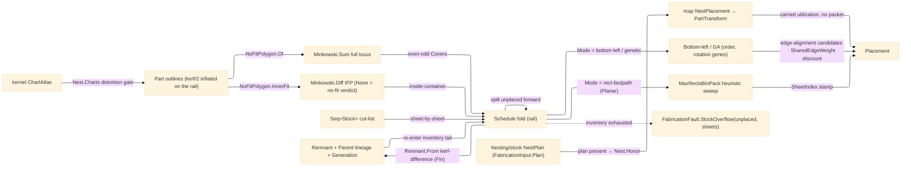

# [RASM_FABRICATION_NFP]

The 2D true-shape nesting owner: `Nest` the static placement fold packing part outlines across a `Seq<Stock>` inventory through a no-fit-polygon (NFP) feasibility test, with a bottom-left greedy, a genetic placement heuristic over (order, rotation) chromosomes, and an axis-aligned-rectangle `MaxRectsBinPack` fast-path — three rows of ONE `PlacementMode` `[SmartEnum<string>]` discriminant over the same NFP feasibility set — spilling parts that do not fit one stock onto the next and minting the leftover of each consumed stock as a content-keyed lineage-tracked `Remnant`. The NFP construction routes the `Geometry2D/algebra#POLYGON_ALGEBRA` `Minkowski.Sum` — the Minkowski sum of the fixed part with the reflected orbiting part — never a hand-rolled angle-sorted edge merge; Clipper2 owns the polygon construction at integer-robust precision, and the NFP carries the FULL locus `Seq<Loop>` the sum emits (outer boundary plus every hole and disconnected component, feasibility read even-odd over the set), so a non-convex pair's holed or disconnected locus is never silently reduced to one boundary. Kerf is a FEASIBILITY fact, not only a remnant fact: the schedule inflates every part outline by `Kerf/2` through the one `PolygonAlgebra.Offset` owner before any NFP, IFP, or containment test, so two placed parts always hold at least one kerf width between their true outlines and a part edge always holds half a kerf from the stock edge — the emitted `PartTransform` anchors on the inflated loops, and the true outline riding the same transform sits strictly inside its inflated envelope, so the clearance survives egress. The lower-left anchor is the sole orbiting-part reference point: `NoFitPolygon.Of` normalizes fixed and orbiting loops into that anchor frame, `NoFitPolygon.InnerFit` emits the same reference frame, and the transform egress subtracts the original part anchor. Reflection through the origin is a π-rotation, so bulges survive it unchanged, and `Transform` carries `Bulges` through rotation and translation — an arc-bearing outline keeps its arcs across every projection this page owns.

The stock the parts pack onto is the `Stock` `[Union]` (`Sheet`/`Plate`/`BarStock`/`TubeStock`/`Billet`/`Filament`/`FromRemnant`) — one closed family with a single `Contains`/`Area`/`Of`/`Planar` total fold the feasibility kernel reads: a planar `Sheet`/`Plate`/`Billet` packs in its 2D bounds (the `MaxRectsBinPack` maxrects fast-path the flatbed cases route through), a `BarStock`/`TubeStock` packs onto its 1-axis-revolved envelope (the unrolled circumference × length), the `Filament` is the additive feedstock budget carried as its strip envelope (diameter × spool length — the deep feedstock economics stay the Additive plane's), and a `FromRemnant`/non-rectangular case routes the exact `Remnant.Holds`/`InnerFit` IFP containment. The feasibility verdict — whether a reference point lies inside or outside the NFP locus — reads the shared `Process/owner#FABRICATION_OWNER` `Loop.Covers` exact `Predicate.Orient2D` containment. When a sibling `Nesting/stock#STOCK_NEST` `StockNest.Pack` cutting-stock solve has already resolved a rectangular sheet-goods layout, the `Nest.Honor` fold CONSUMES that `NestPlan` directly on `FabricationInput.Plan` and maps each `NestPlacement` straight to a `PartTransform` — the stock owner keeps the rectangular cutting-stock YIELD (procurement/sustainability) and this owner the true-shape irregular NEST (CAM: cut-program transforms), so the `rect-fastpath` arm is the from-scratch degenerate-AABB nest for parts arriving WITHOUT a material plan and never a second rectangular cutting-stock packer beside the stock owner. The declared `Rasm →[PROJECTION]: ChartAtlas → Nesting` seam lands HERE as the atlas-admission arm: `Nest.Charts` projects each kernel `UvIsland`'s UV boundary to a true-shape `Loop` part, gated by the `DistortionReceipt` — a non-bijective or over-stretched chart must not be cut flat, so the gate reads `FlipFreeBijective` and `MaxArea` before any island boundary enters `FabricationInput.Profiles`. A DRL-guided placement policy is the optional `NestPolicy.Score` `Func<NoFitPolygon, PartTransform, double>` column; absent learned scoring, ranking is the lowest-then-leftmost tuple discounted by the `SharedEdgeWeight`-weighted harvestable common-line length, and the candidate axis carries edge-alignment positions (an orbiting straight edge butted anti-parallel to a placed straight edge at exactly the kerf gap) beside the NFP boundary vertices — placement-time common-line capability the post-hoc `Nesting/linking` harvest can only find where placement created it. The kernel composes the `Process/owner#FABRICATION_OWNER` `Loop`/`PartTransform`/`FabricationPolicy.Nest`/`FabricationResult.Placement` shared vocabulary; content identity routes through `ContentKey.Of` for placement, remnant, stock lineage, and pair-memo keys; every fault lowers a TYPED `Process/faults#FAULT_BAND` arm — `Nest(NestFault.EmptyCutList, 0)` for an empty part set, `OpenLoop(FabConcern.Nest, index)` for a non-closed outline, `NoFit(part, triedRotations)` for an unplaceable part, `StockOverflow(unplaced, sheets)` for inventory exhaustion — never a legacy string payload.

Wire posture: HOST-LOCAL. The `Placement` transforms cross only the in-process seam to the `Posting/program#CUT_PROGRAM` emitter — never a browser or peer wire. The `Stock`/`NestPolicy`/`NoFitPolygon` records are host-local types that never sit between wire and rail; the `NestPlan` on `FabricationInput.Plan` is IN-PACKAGE data from `Nesting/stock#STOCK_NEST` — admitted ONCE at the `Nest.Solve` plan-honor boundary and mapped straight to `PartTransform`, re-validated nowhere in the interior; the `ChartAtlas` enters read-only from the kernel and no wire mirror exists.

## [01]-[INDEX]

- [01]-[NESTING]: owns the `Stock` union, the `NestPolicy`/`NoFitPolygon` records, the `Remnant` mint half, and the `Nest` fold — full-locus no-fit-polygon feasibility (Minkowski via Geometry2D) and inner-fit-polygon containment (`Minkowski.Diff`) with the bottom-left, genetic, and `MaxRectsBinPack` rect-fastpath rows of the one `PlacementMode` discriminant, the kerf-inflated feasibility set, the multi-sheet `Seq<Stock>` scheduler spilling parts forward, the kerf-difference `Remnant` lineage producer on the rail, the edge-alignment common-line candidates, the grain-constrained rotation sweep, the injected placement-score delegate slot, the `Nest.Charts` atlas-admission arm, and the `Nest.Honor` consumption of a pre-resolved sibling `NestPlan`.

## [02]-[NESTING]

- Owner: `Remnant` the leftover-stock polygon carrying its boundary `Loop`, its `ContentKey.Of(EgressKind.Remnant, ...)`-derived `UInt128` content identity, an `Option<UInt128>` `Parent` lineage column (the consumed-stock identity a difference-minted child descends from, `None` for a virgin remnant), and the `int Generation` re-nest depth stamped AT MINT — `From` counts `FromRemnant` ancestry structurally (`fr.Remnant.Generation + 1`, virgin stock `0`), so the lifecycle page's reuse-depth gate reads a mint fact and never walks a ledger that cannot resolve virgin-stock or re-minted parents — plus the `Holds` exact containment, the `Of` content-address mint, and the `From` kerf-inflated Boolean-difference fold, RAIL-CARRIED: an offset or difference failure rides `Fin` out of the mint, never an uninflated cut or a silently-vanished leftover; `Stock` `[Union]` the stock the parts pack onto — `Sheet` · `Plate` (cut-depth column) · `BarStock`/`TubeStock` (revolved envelope unrolled to circumference × length) · `Billet` · `Filament` (feedstock strip envelope) · `FromRemnant` (wrapping the content-keyed leftover polygon) — with one `Contains`/`Area`/`Of`/`Planar` total fold every feasibility check reads, the `Of` fold hashing stock discriminant plus every dimensional column through `ContentKey.Of(EgressKind.StockSnapshot, ...)`; `NestPolicy` the placement policy (the THREE-row `Mode` `[SmartEnum<string>]` `bottom-left`/`genetic`/`rect-fastpath` discriminant — the old `Genetic` boolean beside a two-row mode was the boolean-selects-two-bodies knob, deleted; rotation step count; GA population/generations/mutation; the `Kerf` width the feasibility inflation AND the remnant difference read; the `Option<double> GrainAxisRadians` constraint restricting the rotation sweep to the grain axis and its opposite; the `SharedEdgeWeight` common-line discount; the optional `Score` learned-rank delegate — the panel-saw guillotine constraint is `Nesting/stock`'s `NestStrategy.Guillotine` concern and carries no column here); `NoFitPolygon` the sliding-locus record carrying the FULL `Seq<Loop>` locus — outer boundary, holes, and disconnected components of the Geometry2D `Minkowski.Sum`, feasibility the even-odd covered count over the set — with `InnerFit` the `Minkowski.Diff` inner-fit dual returning `Fin<Option<Seq<Loop>>>` (a geometry failure rides the rail; an EMPTY locus is the `None` verdict "this part cannot fit this container at this rotation", never a fault) and `PairKey` the `ContentKey.Of(EgressKind.Placement, ...)` digest over the rotation-quantized anchor-normalized part-pair vertex span keying the precompute memo; the sibling `NestPlan` the `Nest.Honor` fold consumes when `FabricationInput.Plan` is present; the kernel `ChartAtlas` the `Nest.Charts` arm admits; `Nest` the static fold owning `Solve`/`Honor`/`Charts` and the scheduler.
- Cases: `PlacementMode` rows 3 — `bottom-left` (deterministic greedy lowest-then-leftmost feasible position, shared-edge discounted) · `genetic` (a GA over (order, rotation-gene) chromosomes, the bottom-left decode scoring each chromosome by utilization, the rotation gene fixing each part's angle so the claimed chromosome is realized, not an order-only shuffle) · `rect-fastpath` (the `MaxRectsBinPack` heuristic-sweep AABB packer, routed only for `Planar` stocks); the orthogonal plan-honor path consuming a pre-resolved `NestPlan` bypassing the packer entirely; the `Stock` union cases 7, the one `Contains`/`Area`/`Planar` fold discriminating planar bounds from revolved envelope from remnant `Holds`/`InnerFit` containment, the remnant re-entering the same NFP feasibility set as the next stock; the NFP is the full Minkowski locus (convex, non-convex, holed, and disconnected results all carried), and the inner-fit locus the `Minkowski.Diff` arm.
- Entry: `public static Fin<FabricationResult> Solve(FabricationPolicy.Nest policy, FabricationInput input)` — `Fin<T>` routes `FabricationFault.Nest(NestFault.EmptyCutList, 0)` on an empty part set, `FabricationFault.OpenLoop(FabConcern.Nest, index)` on a non-closed outline, `FabricationFault.StockOverflow(parts, 0)` on an empty inventory, `FabricationFault.NoFit(part, triedRotations)` when nothing places, and `FabricationFault.StockOverflow(unplaced, sheets)` when the spill exhausts the inventory, each lowered with `.ToError()`; `public static Fin<Arr<Loop>> Charts(ChartAtlas atlas, double maxAreaStretch)` — the atlas-admission arm: gate `Receipt.FlipFreeBijective` and `Receipt.MaxArea ≤ maxAreaStretch` (an over-distorted or non-bijective chart routes the kernel `GeometryFault.DegenerateInput`, never a silent flat cut), then derive each island's UV boundary loop from its face set (single-incidence edges chained into the closed outline) — the parts feed `FabricationInput.Profiles` and the one declared kernel→Nesting projection is realized.
- Auto: `NoFitPolygon.Of` moves fixed and orbiting loops into each part's lower-left `Anchor` frame, point-reflects the orbiting frame through the origin (a π-rotation — bulges survive), and runs `PolygonAlgebra.Minkowski.Sum`, carrying the WHOLE result `Seq<Loop>` as the locus; `NoFitPolygon.InnerFit` runs the dual `PolygonAlgebra.Minkowski.Diff` of the container loop and the reflected part at the fixed rotation, the `Fin<Option<Seq<Loop>>>` split separating geometry failure (rail) from no-fit verdict (`None`); `Nest.Schedule` first inflates every part by `Kerf/2` through `PolygonAlgebra.Offset` on the rail (the feasibility set), precomputes the ordered pairwise NFPs into a frozen memo keyed by `NoFitPolygon.PairKey` — the content digest over the rotation count and the anchor-normalized vertex span of the ordered part-pair loops, so identical geometry shares one Minkowski result across modes, generations, and sheets, and the rotation discretization enters the key. The MULTI-SHEET scheduler folds the inventory sheet-by-sheet ON THE RAIL: it places as many parts as fit the head stock, stamps each placed `PartTransform.SheetIndex`, and — ONLY when the stock actually received placements — accumulates the stock's area into the consumed denominator, mints the consumed stock's `Remnant` set through the rail-carried `From`, and re-injects each usable remnant onto the queue tail so the next parts pack the real leftover before a virgin sheet opens (an untouched stock mints NO remnant and adds NO area — the old unconditional mint listed a virgin sheet as its own leftover); it exhausts when the inventory empties, `StockOverflow` routing if parts remain. A candidate placement is feasible when the reference point lies OUTSIDE every already-placed part's NFP locus (even-odd over the loops) and `Stock.Contains` holds — planar bounds for `Sheet`/`Plate`/`Billet`, unrolled bounds for `BarStock`/`TubeStock`, exact `Remnant.Holds` + IFP for `FromRemnant`. The PER-STOCK mode dispatches the three-row `Mode.Switch`: `rect-fastpath` — gated to `Planar` stocks — sweeps the `FreeRectChoiceHeuristic` vocabulary over a fresh per-extent `MaxRectsBinPack.Insert` fold of the kerf-padded part bounding boxes (the `Rect.Height == 0` return the sole placement-failure sentinel per the `.api` `[STATEFUL_INCREMENTAL]` law, an unfittable part folding out, never an exception), keeping the densest run; `bottom-left` folds parts in the given order, each candidate axis the union of NFP-locus vertices, the origin, and the EDGE-ALIGNMENT positions (an orbiting straight edge anti-parallel to a placed straight edge, butted at the kerf gap along the placed edge's outward normal — each tagged with its harvestable shared length), ranked by `Score` when injected, else by `(Ty − SharedEdgeWeight·Shared, Tx)`; `genetic` evolves (order, rotation-gene) chromosomes, decoding each through the same bottom-left fold with the gene pinning each part's angle, scoring by utilization, tournament selection + order crossover + swap/rotation mutation for `Generations`. `Angles` is grain-aware: `GrainAxisRadians` present restricts the sweep to the axis and its opposite (`g`, `g+π`); absent, the full `Rotations` discretization sweeps. When `FabricationInput.Plan` carries a pre-resolved `NestPlan`, `Nest.Solve` SHORT-CIRCUITS the packer path entirely — `Nest.Honor` maps each `NestPlacement` to a `PartTransform` by the 90° flag and the rotated-bbox-min offset (the exact dual of the rect-fastpath anchor, reusing the one `Transform` fold), passes the `NestYield` utilization and unplaced count straight through, and mints no `Remnant` (the rectangular offcuts stay yield evidence on the stock receipt); an all-dropped plan rails `StockOverflow(parts, plan sheets)`.
- Receipt: the `Placement` carries the per-part `PartTransform`, the utilization fraction over CONSUMED stock area only (unconsumed inventory never dilutes the denominator), the unplaced count, and the produced `Remnant` set — the typed nesting evidence the posting emitter consumes; no generic nesting ledger.
- Packages: `Rhino.Geometry` (`Point3d`/`Vector3d`/`BoundingBox` — composed), the `Process/owner#FABRICATION_OWNER` `Loop.Covers` (exact `Predicate.Orient2D` containment, composed transitively), Clipper2 (via `Geometry2D/algebra#POLYGON_ALGEBRA` — the NFP `Minkowski.Sum`, the IFP `Minkowski.Diff`, the remnant `Clip` `ClipOp.Difference`, and the kerf `Offset`), `RectangleBinPack.CSharp` (`MaxRectsBinPack(int, int, bool)` per sheet extent, `Insert(int, int, FreeRectChoiceHeuristic)`, the `Rect` sentinel law — assembly `RectangleBinPacking`, the `.api/api-rectanglebinpack-csharp.md` catalogue, the sibling `Nesting/stock#STOCK_NEST` the primary admitter over the full suite and this arm composing only its `MaxRects` sweep), the kernel `Rasm/Processing/flatten#PARAMETERIZATION` (`ChartAtlas`/`UvIsland`/`DistortionReceipt` — the atlas-admission arm's read-only carrier), `Process/owner#FABRICATION_OWNER` `ContentKey.Of` identity rail (`EgressKind.Remnant`/`StockSnapshot`/`Placement` mints), `Process/faults#FAULT_BAND` (`NoFit`/`OpenLoop`/`StockOverflow`/`Nest` typed arms), `System.Buffers.Binary` (`BinaryPrimitives`), LanguageExt.Core, Thinktecture, BCL inbox.
- Growth: a finer rotation sweep is one `Rotations` value, a grain lock one `GrainAxisRadians` value — both feed the one `Angles` axis driving the precompute table and the candidate fold; a new stock kind is one `Stock` union case carrying its `Contains`/`Area`/`Planar` arm; a new placement mode is one `PlacementMode` row plus one `PlaceStock` `Switch` arm; a DRL-guided placement is the `NestPolicy.Score` delegate the app-platform consumer fills from the `Rasm.Compute` ONNX lane (never a Fabrication-side `Rasm.Compute` reference — the AEC→app-platform edge is forbidden; the score crosses as a raw `double`); a stronger common-line objective is the one `SharedEdgeWeight` column plus the existing edge-alignment candidate axis; the multi-sheet schedule is the one `Seq<Stock>` fold; the remnant inventory grows through the rail-carried `Remnant.From` producer; a cross-run NFP cache is the same `PairKey` digest; a distortion-gated panelization workflow enters through `Nest.Charts` — one gate value, zero new surface; an existing rectangular cutting-stock layout is HONORED through `Nest.Honor`, never re-packed.
- Boundary: nesting is the ONE author-kernel placement owner and the NFP construction routes the one `Geometry2D/algebra#POLYGON_ALGEBRA` `Minkowski` owner — flat `PolygonAlgebra.MinkowskiSum`/`MinkowskiDiff` spellings are phantoms (the roster is the NESTED `Minkowski.Sum`/`Minkowski.Diff` facade) and a hand-rolled angle-sorted edge merge is the deleted form; the NFP carries the FULL locus and a `loops.Head` first-loop projection is the named topology-loss defect — a non-convex pair's holes and disconnected components are feasibility facts; kerf is enforced in the FEASIBILITY set (parts inflated `Kerf/2` before NFP/IFP/containment) and a nest whose parts touch at zero gap is the named kerf-blind defect — the remnant difference reads the same `Kerf` so mint and feasibility agree; the three placement modes are ONE `PlacementMode` fold and a boolean mode knob beside the discriminant, an `NfpPacker`/`RectPacker` class pair, or a learned-vs-heuristic packer split are deleted forms — `MaxRectsBinPack` admits ONLY as the `rect-fastpath` arm over `Planar` stocks and NEVER displaces the true-shape cases; the `Rect.Height == 0` sentinel is read at this owning boundary per the `.api` `[STATEFUL_INCREMENTAL]` law and a swallowed sentinel or assumed exception rail is the named boundary defect; the multi-sheet schedule is ONE fold spilling forward — a per-sheet `Solve`, an unconditional remnant mint on an untouched stock, or a utilization denominator over unconsumed inventory are deleted forms; the remnant is the kerf-inflated Boolean DIFFERENCE through the one `Clip` owner ON THE RAIL — an `IfFail` fallback to an uninflated cut or an empty remnant erases the geometry fault and is the named fault-erasure defect; the stock rides the one `Stock` union and a per-stock packer triple is the deleted form; the remnant identity, stock lineage, and pair memo are `ContentKey.Of` digests and the geometry domain mints no parallel digest; the `Generation` column is a MINT fact (structural `FromRemnant` ancestry) and a ledger-walked lineage depth is the named unresolvable-parent defect the lifecycle page consumes this column to avoid; every fault is a TYPED band arm and a string payload is the deleted legacy form; the atlas arm consumes the kernel `ChartAtlas` read-only, gates on the `DistortionReceipt`, and a Fabrication-side UV solver beside the kernel `Flatten.Apply`/`Development.Apply` is the named duplication defect; bulges survive reflection (π-rotation) and transform, and a vertex-only loop rebuild that flattens arcs is the named arc-loss defect; the transform kernel is page-local pending the `PartTransform.Apply(Loop)` atoms home — a fourth sibling copy is the collapse trigger; the strata law forbids the AEC→app-platform downward edge and a `Rasm.Compute` reference in this folder is the rejected form.

```csharp signature
// --- [RUNTIME_PRELUDE] --------------------------------------------------------------------
using System.Buffers;
using System.Buffers.Binary;
using System.Collections.Frozen;
using LanguageExt;
using LanguageExt.Common;
using Rasm.Fabrication.Geometry2D;
using Rasm.Fabrication.Process;
using Rasm.Numerics;
using Rasm.Processing;
using RectangleBinPacking;
using Rhino.Geometry;
using Thinktecture;
using static LanguageExt.Prelude;

namespace Rasm.Fabrication.Nesting;

// --- [TYPES] ------------------------------------------------------------------------------
// ONE placement discriminant, three rows: the old two-row mode plus a Genetic boolean was the
// boolean-selects-two-bodies knob the doctrine rejects.
[SmartEnum<string>]
public sealed partial class PlacementMode {
    public static readonly PlacementMode BottomLeft = new("bottom-left");
    public static readonly PlacementMode Genetic = new("genetic");
    public static readonly PlacementMode RectFastpath = new("rect-fastpath");
}

static class ContentBytes {
    public const int PairKey = 1;
    public const int Remnant = 2;
    public const int StockSheet = 10;
    public const int StockPlate = 11;
    public const int StockBar = 12;
    public const int StockTube = 13;
    public const int StockBillet = 14;
    public const int StockFilament = 15;
    public const int PlacementRows = 20;
    public const int RemnantRows = 21;

    public static UInt128 Digest(EgressKind kind, ArrayBufferWriter<byte> buffer) =>
        ContentKey.Of(kind, buffer.WrittenSpan).Digest;

    public static void Bool(ArrayBufferWriter<byte> buffer, bool value) =>
        Int32(buffer, value ? 1 : 0);

    public static void Float64(ArrayBufferWriter<byte> buffer, double value) {
        Span<byte> slot = buffer.GetSpan(sizeof(double));
        BinaryPrimitives.WriteDoubleLittleEndian(slot, value);
        buffer.Advance(sizeof(double));
    }

    public static void Int32(ArrayBufferWriter<byte> buffer, int value) {
        Span<byte> slot = buffer.GetSpan(sizeof(int));
        BinaryPrimitives.WriteInt32LittleEndian(slot, value);
        buffer.Advance(sizeof(int));
    }

    public static void UInt128(ArrayBufferWriter<byte> buffer, UInt128 value) {
        Span<byte> slot = buffer.GetSpan(16);
        BinaryPrimitives.WriteUInt128LittleEndian(slot, value);
        buffer.Advance(16);
    }

    public static void Loop(ArrayBufferWriter<byte> buffer, Loop loop) {
        Loop ccw = loop.AsCcw();
        Bool(buffer, ccw.Closed);
        Int32(buffer, ccw.Count);
        for (int i = 0; i < ccw.Count; i++) {
            Point3d point = ccw.At(i);
            Float64(buffer, point.X);
            Float64(buffer, point.Y);
            Float64(buffer, point.Z);
            Float64(buffer, ccw.BulgeAt(i));
        }
    }
}

// --- [MODELS] -----------------------------------------------------------------------------
// partial: the lifecycle half (state rows, reuse admission) is Nesting/remnant.md's declared extension.
// Generation is a MINT fact — structural FromRemnant ancestry — so the lifecycle depth gate never walks a
// ledger that cannot resolve virgin-stock or re-minted parents.
public sealed partial record Remnant(Loop Boundary, UInt128 Identity, Option<UInt128> Parent, int Generation) {
    public static Remnant Of(Loop boundary, Option<UInt128> parent = default, int generation = 0) {
        Loop ccw = boundary.AsCcw();
        ArrayBufferWriter<byte> buffer = new();
        ContentBytes.Int32(buffer, ContentBytes.Remnant);
        ContentBytes.Loop(buffer, ccw);
        return new Remnant(ccw, ContentBytes.Digest(EgressKind.Remnant, buffer), parent, generation);
    }

    // Kerf-inflated Boolean difference of the placed outlines from the stock, RAIL-CARRIED: an offset or
    // difference failure rides Fin out — never an uninflated cut, never a silently-vanished leftover.
    public static Fin<Seq<Remnant>> From(Stock stock, Seq<Loop> placed, double kerf) =>
        placed.Traverse(p => PolygonAlgebra.Offset(Seq(p), 0.5 * Math.Abs(kerf), OffsetEnds.Polygon).ToValidation())
            .As()
            .ToFin()
            .Bind(inflated => PolygonAlgebra.Clip(Seq(stock.Outline()), inflated.Bind(static loops => loops), ClipOp.Difference))
            .Map(regions => regions
                .Filter(r => Math.Abs(PolygonAlgebra.Area(r)) > Math.Abs(kerf) * Math.Abs(kerf))
                .Map(r => Of(r, Some(stock.Of()), stock is Stock.FromRemnant fr ? fr.Remnant.Generation + 1 : 0)));

    public bool Holds(Loop part, double tx, double ty) =>
        part.Vertices.ForAll(v => Boundary.Covers(new Point3d(v.X + tx, v.Y + ty, 0.0)));
}

[Union(ConversionFromValue = ConversionOperatorsGeneration.None)]
public abstract partial record Stock {
    private Stock() { }

    public sealed record Sheet(double Width, double Height) : Stock;
    public sealed record Plate(double Width, double Height, double Depth) : Stock;
    public sealed record BarStock(double Diameter, double Length) : Stock;
    public sealed record TubeStock(double OuterDiameter, double WallThickness, double Length) : Stock;
    public sealed record Billet(double Width, double Height, double Depth) : Stock;
    public sealed record Filament(double Diameter, double SpoolLength) : Stock;
    public sealed record FromRemnant(Remnant Remnant) : Stock;

    public UInt128 Of() =>
        this is FromRemnant fr ? fr.Remnant.Identity : StockDigest(StockSignature);

    public (int Kind, Arr<double> Dimensions) StockSignature =>
        Switch(
            sheet:       static s => (ContentBytes.StockSheet, Arr(s.Width, s.Height)),
            plate:       static s => (ContentBytes.StockPlate, Arr(s.Width, s.Height, s.Depth)),
            barStock:    static s => (ContentBytes.StockBar, Arr(s.Diameter, s.Length)),
            tubeStock:   static s => (ContentBytes.StockTube, Arr(s.OuterDiameter, s.WallThickness, s.Length)),
            billet:      static s => (ContentBytes.StockBillet, Arr(s.Width, s.Height, s.Depth)),
            filament:    static s => (ContentBytes.StockFilament, Arr(s.Diameter, s.SpoolLength)),
            fromRemnant: static _ => (ContentBytes.Remnant, Arr<double>()));

    // Planar cases admit the MaxRectsBinPack AABB fast-path; revolved/remnant cases stay NFP-only.
    public bool Planar =>
        Switch(sheet: static _ => true, plate: static _ => true, billet: static _ => true,
            barStock: static _ => false, tubeStock: static _ => false, filament: static _ => false, fromRemnant: static _ => false);

    public (double Width, double Height) Extent =>
        Switch(
            sheet:       static s => (s.Width, s.Height),
            plate:       static s => (s.Width, s.Height),
            barStock:    static s => (Math.PI * s.Diameter, s.Length),
            tubeStock:   static s => (Math.PI * s.OuterDiameter, s.Length),
            billet:      static s => (s.Width, s.Height),
            filament:    static s => (s.Diameter, s.SpoolLength),
            fromRemnant: static r => (r.Remnant.Boundary.Bound().Diagonal.X, r.Remnant.Boundary.Bound().Diagonal.Y));

    public Loop Outline() {
        if (this is FromRemnant fr) return fr.Remnant.Boundary;
        var (w, h) = Extent;
        return new Loop(Arr(new Point3d(0, 0, 0), new Point3d(w, 0, 0), new Point3d(w, h, 0), new Point3d(0, h, 0)), Closed: true).AsCcw();
    }

    public double Area =>
        Switch(
            sheet:       static s => s.Width * s.Height,
            plate:       static s => s.Width * s.Height,
            barStock:    static s => Math.PI * s.Diameter * s.Length,
            tubeStock:   static s => Math.PI * s.OuterDiameter * s.Length,
            billet:      static s => s.Width * s.Height,
            filament:    static s => s.Diameter * s.SpoolLength,
            fromRemnant: static r => Math.Abs(PolygonAlgebra.Area(r.Remnant.Boundary)));

    public bool Contains(Loop part, double tx, double ty) =>
        Switch(
            state:       (part, tx, ty),
            sheet:       static (k, s) => InRect(k.part, k.tx, k.ty, s.Width, s.Height),
            plate:       static (k, s) => InRect(k.part, k.tx, k.ty, s.Width, s.Height),
            barStock:    static (k, s) => InRect(k.part, k.tx, k.ty, Math.PI * s.Diameter, s.Length),
            tubeStock:   static (k, s) => InRect(k.part, k.tx, k.ty, Math.PI * s.OuterDiameter, s.Length),
            billet:      static (k, s) => InRect(k.part, k.tx, k.ty, s.Width, s.Height),
            filament:    static (k, s) => InRect(k.part, k.tx, k.ty, s.Diameter, s.SpoolLength),
            fromRemnant: static (k, r) => r.Remnant.Holds(k.part, k.tx, k.ty));

    static bool InRect(Loop part, double tx, double ty, double width, double height) =>
        part.Vertices.ForAll(v => v.X + tx >= 0.0 && v.X + tx <= width && v.Y + ty >= 0.0 && v.Y + ty <= height);

    static UInt128 StockDigest((int Kind, Arr<double> Dimensions) signature) {
        ArrayBufferWriter<byte> buffer = new();
        ContentBytes.Int32(buffer, signature.Kind);
        ContentBytes.Int32(buffer, signature.Dimensions.Count);
        foreach (double dimension in signature.Dimensions) {
            ContentBytes.Float64(buffer, dimension);
        }
        return ContentBytes.Digest(EgressKind.StockSnapshot, buffer);
    }
}

// Kerf feeds BOTH the feasibility inflation and the remnant difference; GrainAxisRadians restricts the rotation
// sweep to the grain axis and its opposite; SharedEdgeWeight converts harvestable common-line millimetres into a
// bottom-left rank discount. The old Genetic/Guillotine/GrainDirection columns are deleted (mode row, stock.md's
// NestStrategy.Guillotine, and the live grain axis carry those concerns).
public sealed record NestPolicy(PlacementMode Mode, int Rotations, int Population, int Generations, double MutationRate, double Kerf, Option<double> GrainAxisRadians, double SharedEdgeWeight, int Seed, Option<Func<NoFitPolygon, PartTransform, double>> Score = default) {
    public static readonly NestPolicy BottomLeft = new(PlacementMode.BottomLeft, Rotations: 4, Population: 0, Generations: 0, MutationRate: 0.0, Kerf: 0.2, GrainAxisRadians: None, SharedEdgeWeight: 0.0, Seed: 1);
    public static readonly NestPolicy GeneticDefault = new(PlacementMode.Genetic, Rotations: 4, Population: 40, Generations: 60, MutationRate: 0.15, Kerf: 0.2, GrainAxisRadians: None, SharedEdgeWeight: 0.0, Seed: 1);
    public static readonly NestPolicy RectFlatbed = new(PlacementMode.RectFastpath, Rotations: 1, Population: 0, Generations: 0, MutationRate: 0.0, Kerf: 0.2, GrainAxisRadians: None, SharedEdgeWeight: 0.0, Seed: 1);
}

// The FULL sliding locus: outer boundary, holes, and disconnected components of the Minkowski sum all carried;
// feasibility is the even-odd covered count over the set — a first-loop projection loses NFP topology.
public sealed record NoFitPolygon(Seq<Loop> Locus) {
    public static Fin<NoFitPolygon> Of(Loop fixedPart, Loop orbiting) =>
        PolygonAlgebra.Minkowski.Sum(ReferenceFrame(fixedPart), Reflect(ReferenceFrame(orbiting)))
            .Map(loops => new NoFitPolygon(loops.Map(static l => l.AsCcw())));

    // The inner-fit dual: geometry failure rides the rail; an EMPTY locus is the None verdict — the part cannot
    // fit the container at this rotation — never a fault.
    public static Fin<Option<Seq<Loop>>> InnerFit(Loop container, Loop part) =>
        PolygonAlgebra.Minkowski.Diff(container.AsCcw(), Reflect(ReferenceFrame(part)))
            .Map(loops => loops.IsEmpty ? Option<Seq<Loop>>.None : Some(loops.Map(static l => l.AsCcw())));

    public static UInt128 PairKey(Loop fixedPart, Loop orbiting, int rotations) {
        ArrayBufferWriter<byte> buffer = new();
        ContentBytes.Int32(buffer, ContentBytes.PairKey);
        ContentBytes.Int32(buffer, rotations);
        ContentBytes.Loop(buffer, ReferenceFrame(fixedPart));
        ContentBytes.Loop(buffer, ReferenceFrame(orbiting));
        return ContentBytes.Digest(EgressKind.Placement, buffer);
    }

    public static Point3d Anchor(Loop loop) => loop.Vertices.OrderBy(v => v.Y).ThenBy(v => v.X).Head();

    // Point reflection through the origin is a π-rotation: winding and bulges survive unchanged.
    static Loop Reflect(Loop loop) =>
        new Loop(loop.Vertices.Map(v => Point3d.Origin - (v - Point3d.Origin)).ToArr(), loop.Closed, loop.Bulges).AsCcw();

    static Loop ReferenceFrame(Loop loop) {
        Point3d anchor = Anchor(loop);
        return new Loop(loop.Vertices.Map(v => new Point3d(v.X - anchor.X, v.Y - anchor.Y, v.Z - anchor.Z)).ToArr(), loop.Closed, loop.Bulges).AsCcw();
    }

    // Even-odd over the full locus: outside the NFP region = feasible (no overlap with the fixed part).
    public bool Feasible(double tx, double ty) =>
        Locus.Count(l => l.Covers(new Point3d(tx, ty, 0.0))) % 2 == 0;
}

// --- [OPERATIONS] -------------------------------------------------------------------------
public static class Nest {
    public static Fin<FabricationResult> Solve(FabricationPolicy.Nest policy, FabricationInput input) =>
        input.Profiles.IsEmpty
            ? Fin.Fail<FabricationResult>(FabricationFault.Nest(NestFault.EmptyCutList, 0).ToError())
            : input.Plan.Match(
                // A pre-resolved Nesting/stock cutting-stock plan is present: HONOR it (the stock owner owns the
                // rectangular yield) rather than re-deriving a lower-yield layout — the packer runs only plan-free.
                Some: plan => Honor(input.Profiles.Map(static l => l.AsCcw()), plan),
                None: () => input.Inventory.IsEmpty
                    ? Fin.Fail<FabricationResult>(FabricationFault.StockOverflow(input.Profiles.Count, 0).ToError())
                    : toSeq(input.Profiles).Map((l, i) => (Loop: l, Index: i)).Find(static row => !row.Loop.Closed).Match(
                        Some: open => Fin.Fail<FabricationResult>(FabricationFault.OpenLoop(FabConcern.Nest, open.Index).ToError()),
                        None: () => Schedule(input.Profiles.Map(static l => l.AsCcw()), input.Inventory, policy.Nesting)));

    // The atlas-admission arm realizing Rasm →[PROJECTION]: ChartAtlas → Nesting: gate the DistortionReceipt
    // (a flipped or over-stretched chart must not be cut flat), then chain each island's single-incidence UV
    // edges into its closed boundary Loop — the parts feed FabricationInput.Profiles.
    public static Fin<Arr<Loop>> Charts(ChartAtlas atlas, double maxAreaStretch) =>
        !atlas.Receipt.FlipFreeBijective || atlas.Receipt.MaxArea > maxAreaStretch
            ? Fin.Fail<Arr<Loop>>(GeometryFault.DegenerateInput($"atlas:distortion:{atlas.Receipt.MaxArea:F3}").ToError())
            : atlas.Islands.Traverse(Boundary).As().Map(static loops => loops.ToArr());

    // Consume the sibling Nesting/stock NestPlan DIRECTLY (same package, no wire mirror): rotate the part about
    // the origin by the 90° flag, offset its rotated bbox-min to the plan's placed lower-left (the exact dual of
    // the rect-fastpath anchor, one Transform fold). The rectangular offcuts stay yield evidence on the NestYield
    // receipt, so the honored Placement mints no Remnant; an out-of-range PartId drops, an all-dropped plan rails.
    static Fin<FabricationResult> Honor(Arr<Loop> parts, NestPlan plan) {
        Seq<PartTransform> placed = plan.Placements
            .Filter(np => np.PartId >= 0 && np.PartId < parts.Count)
            .Map(np => {
                double rot = np.Rotated ? Math.PI / 2.0 : 0.0;
                BoundingBox b = Transform(parts[np.PartId], new PartTransform(np.PartId, 0.0, 0.0, rot)).Bound();
                return new PartTransform(np.PartId, np.XMm - b.Min.X, np.YMm - b.Min.Y, rot, np.SheetIndex);
            });
        return placed.IsEmpty
            ? Fin.Fail<FabricationResult>(FabricationFault.StockOverflow(parts.Count, plan.Yield.SheetCount).ToError())
            : Fin.Succ((FabricationResult)new FabricationResult.Placement(
                placed,
                plan.Yield.UtilizationRatio,
                plan.Yield.UnplacedCount,
                Seq<Remnant>(),
                PlacementKey(placed, Seq<Remnant>())));
    }

    // Kerf is a FEASIBILITY fact: every part inflates by Kerf/2 on the rail before any NFP/IFP/containment test,
    // so placed true outlines always hold one kerf between them and half a kerf from the stock edge; the emitted
    // transforms anchor on the inflated loops, the true outline riding the same transform inside its envelope.
    static Fin<FabricationResult> Schedule(Arr<Loop> parts, Seq<Stock> inventory, NestPolicy policy) =>
        parts.ToSeq()
            .Traverse(p => PolygonAlgebra.Offset(Seq(p), 0.5 * Math.Abs(policy.Kerf), OffsetEnds.Polygon)
                .Bind(loops => loops.HeadOrNone().ToFin(GeometryFault.DegenerateInput("nest:kerf-inflation-emptied-part").ToError()))
                .ToValidation())
            .As()
            .ToFin()
            .Map(static seq => seq.ToArr())
            .Bind(cut => {
                FrozenDictionary<UInt128, NoFitPolygon> nfp = Precompute(cut, policy);
                return Consume(cut, policy, nfp,
                        (Queue: inventory, Placed: Seq<PartTransform>(), Remnants: Seq<Remnant>(),
                         Pending: toSeq(Enumerable.Range(0, cut.Count)), Sheet: 0, ConsumedArea: 0.0))
                    .Bind(run => run.Placed.IsEmpty
                        ? Fin.Fail<FabricationResult>(FabricationFault.NoFit(run.Pending.HeadOrNone().IfNone(0), Angles(policy)).ToError())
                        : run.Pending.IsEmpty
                            ? Fin.Succ((FabricationResult)new FabricationResult.Placement(
                                run.Placed,
                                Utilization(run.Placed, cut, run.ConsumedArea),
                                0, run.Remnants, PlacementKey(run.Placed, run.Remnants)))
                            : Fin.Fail<FabricationResult>(FabricationFault.StockOverflow(run.Pending.Count, run.Sheet).ToError()));
            });

    // Multi-sheet scheduler over a GROWING stock queue, ON THE RAIL: pop the head stock, place the pending parts,
    // stamp SheetIndex, and ONLY on a consuming placement accumulate the stock's area, mint the kerf-difference
    // remnants (rail-carried), and re-inject usable ones onto the queue TAIL so the next parts pack the real
    // leftover before a virgin sheet opens. An untouched stock mints nothing and adds no area.
    static Fin<(Seq<Stock> Queue, Seq<PartTransform> Placed, Seq<Remnant> Remnants, Seq<int> Pending, int Sheet, double ConsumedArea)> Consume(
        Arr<Loop> parts, NestPolicy policy, FrozenDictionary<UInt128, NoFitPolygon> nfp,
        (Seq<Stock> Queue, Seq<PartTransform> Placed, Seq<Remnant> Remnants, Seq<int> Pending, int Sheet, double ConsumedArea) st) {
        if (st.Pending.IsEmpty || st.Queue.IsEmpty) return Fin.Succ(st);
        Stock stock = st.Queue.Head;
        Seq<PartTransform> here = PlaceStock(parts, stock, policy, st.Pending.ToArray(), nfp).Map(t => t with { SheetIndex = st.Sheet });
        if (here.IsEmpty) {
            return Consume(parts, policy, nfp, (st.Queue.Tail, st.Placed, st.Remnants, st.Pending, st.Sheet + 1, st.ConsumedArea));
        }
        Set<int> done = toSet(here.Map(static t => t.PartId));
        return Remnant.From(stock, here.Map(t => Transform(parts[t.PartId], t)), policy.Kerf).Bind(minted =>
            Consume(parts, policy, nfp, (
                st.Queue.Tail.Concat(minted
                    .Filter(r => Math.Abs(PolygonAlgebra.Area(r.Boundary)) > policy.Kerf * policy.Kerf)
                    .Map(r => (Stock)new Stock.FromRemnant(r))),
                st.Placed.Concat(here),
                st.Remnants.Concat(minted),
                st.Pending.Filter(id => !done.Contains(id)),
                st.Sheet + 1,
                st.ConsumedArea + stock.Area)));
    }

    // The table covers every (fixed-rotation, orbiting-rotation) pair the Angles axis implies — PairKey hashes
    // the rotated reference-framed loops, so rotation variants key distinctly for free. A pair whose Minkowski
    // sum fails degrades to a whole-part locus (over-blocks: fail-closed feasibility, never a false overlap-free).
    static FrozenDictionary<UInt128, NoFitPolygon> Precompute(Arr<Loop> parts, NestPolicy policy) =>
        Enumerable.Range(0, parts.Count)
            .SelectMany(f => Enumerable.Range(0, parts.Count).Where(o => o != f).Select(o => (f, o)))
            .SelectMany(pair => Angles(policy).SelectMany(ra => Angles(policy).Map(rb => (pair.f, pair.o, ra, rb))).AsEnumerable())
            .GroupBy(row => NoFitPolygon.PairKey(Rotated(parts[row.f], row.ra), Rotated(parts[row.o], row.rb), policy.Rotations))
            .ToFrozenDictionary(
                g => g.Key,
                g => NoFitPolygon.Of(Rotated(parts[g.First().f], g.First().ra), Rotated(parts[g.First().o], g.First().rb))
                    .IfFail(new NoFitPolygon(Seq1(Rotated(parts[g.First().f], g.First().ra)))));

    // Grain-aware rotation axis: a grain lock restricts the sweep to the axis and its opposite; otherwise the
    // full Rotations discretization sweeps. One axis drives the precompute table AND the candidate fold.
    static Seq<double> Angles(NestPolicy policy) =>
        policy.GrainAxisRadians.Match(
            Some: static g => Seq(g, g + Math.PI),
            None: () => toSeq(Enumerable.Range(0, Math.Max(1, policy.Rotations))).Map(r => Math.Tau * r / Math.Max(1, policy.Rotations)));

    static Loop Rotated(Loop part, double radians) =>
        radians == 0.0 ? part : Transform(part, new PartTransform(0, 0.0, 0.0, radians));

    static Seq<PartTransform> PlaceStock(Arr<Loop> parts, Stock stock, NestPolicy policy, int[] pending, FrozenDictionary<UInt128, NoFitPolygon> nfp) =>
        policy.Mode.Switch(
            state:        (parts, stock, policy, pending, nfp),
            bottomLeft:   static s => BottomLeft(s.parts, s.stock, s.policy, s.pending, s.nfp, _ => Angles(s.policy)),
            genetic:      static s => Genetic(s.parts, s.stock, s.policy, s.pending, s.nfp),
            rectFastpath: static s => s.stock.Planar ? RectPack(s.parts, s.stock, s.policy, s.pending) : BottomLeft(s.parts, s.stock, s.policy, s.pending, s.nfp, _ => Angles(s.policy)));

    // MaxRectsBinPack axis-aligned-rectangle fast-path: sweep the FreeRectChoiceHeuristic vocabulary, each choice
    // folding the pending kerf-padded bounding boxes through a fresh per-extent packer's Insert stream (the suite
    // THROWS nothing — Rect.Height == 0 is the sole failure sentinel per the api [STATEFUL_INCREMENTAL] law),
    // keep the densest run by placed area, offset each Rect.X/Y by the part bbox-min into the PartTransform.
    static Seq<PartTransform> RectPack(Arr<Loop> parts, Stock stock, NestPolicy policy, int[] pending) {
        var (sw, sh) = stock.Extent;
        int capW = (int)Math.Floor(sw), capH = (int)Math.Floor(sh);
        Seq<PartTransform> Sweep(FreeRectChoiceHeuristic choice) {
            MaxRectsBinPack packer = new(capW, capH, allowRotations: false);
            return toSeq(pending).Fold(Seq<PartTransform>(), (placed, id) => {
                BoundingBox b = parts[id].Bound();
                Rect r = packer.Insert((int)Math.Ceiling(b.Diagonal.X + policy.Kerf), (int)Math.Ceiling(b.Diagonal.Y + policy.Kerf), choice);
                return r.Height == 0 ? placed : placed.Add(new PartTransform(id, r.X - b.Min.X, r.Y - b.Min.Y, 0.0));
            });
        }
        return toSeq(Enum.GetValues<FreeRectChoiceHeuristic>()).Map(Sweep)
            .Fold(Seq<PartTransform>(), (best, run) =>
                run.Sum(t => Math.Abs(PolygonAlgebra.Area(parts[t.PartId]))) > best.Sum(t => Math.Abs(PolygonAlgebra.Area(parts[t.PartId]))) ? run : best);
    }

    // Bottom-left over the union candidate axis: NFP-locus vertices + origin + EDGE-ALIGNMENT positions (an
    // orbiting straight edge butted anti-parallel to a placed straight edge at the kerf gap, tagged with its
    // harvestable shared length). Ranking: the injected Score wins; else lowest-then-leftmost discounted by
    // SharedEdgeWeight·Shared — placement-time common-line capability linking can only harvest post hoc.
    // anglesOf parameterizes the per-part rotation axis so the genetic decode pins each part's gene.
    static Seq<PartTransform> BottomLeft(Arr<Loop> parts, Stock stock, NestPolicy policy, int[] order, FrozenDictionary<UInt128, NoFitPolygon> nfp, Func<int, Seq<double>> anglesOf) =>
        toSeq(order).Fold(Seq<(int Id, Loop Part, Point3d Reference, double Rotation)>(), (placed, id) => {
            IEnumerable<(Point3d Point, NoFitPolygon Context, PartTransform Transform, double Shared)> candidates = anglesOf(id).Bind(rotation => {
                Loop part = Rotated(parts[id], rotation);
                NoFitPolygon Pair((int Id, Loop Part, Point3d Reference, double Rotation) pl) =>
                    nfp[NoFitPolygon.PairKey(Rotated(parts[pl.Id], pl.Rotation), part, policy.Rotations)];
                Option<Seq<Loop>> ifp = stock.Planar ? None : NoFitPolygon.InnerFit(stock.Outline(), part).ToOption().Bind(o => o);
                return placed.Bind(pl => toSeq(Pair(pl).Locus.Bind(static l => toSeq(l.Vertices))).Map(v => (Point: v, Context: Pair(pl), Shared: 0.0)))
                    .Concat(placed.Bind(pl => Aligned(pl.Part, pl.Reference, part, policy.Kerf).Map(c => (Point: c.Reference, Context: Pair(pl), Shared: c.Shared))))
                    .Add((Point: new Point3d(0.0, 0.0, 0.0), Context: new NoFitPolygon(Seq1(part)), Shared: 0.0))
                    .Map(c => (c.Point, c.Context, Transform: FromReference(id, part, c.Point, rotation), c.Shared))
                    .Filter(c => stock.Contains(part, c.Transform.Tx, c.Transform.Ty) &&
                                 ifp.Match(Some: locus => locus.Count(l => l.Covers(c.Point)) % 2 == 1, None: () => stock.Planar) &&
                                 placed.ForAll(pl => Pair(pl).Feasible(c.Point.X - pl.Reference.X, c.Point.Y - pl.Reference.Y)));
            }).AsEnumerable();
            IOrderedEnumerable<(Point3d Point, NoFitPolygon Context, PartTransform Transform, double Shared)> ranked = policy.Score.Match(
                Some: score => candidates.OrderBy(c => score(c.Context, c.Transform)).ThenBy(c => c.Transform.Ty).ThenBy(c => c.Transform.Tx),
                None: () => candidates.OrderBy(c => c.Transform.Ty - (policy.SharedEdgeWeight * c.Shared)).ThenBy(c => c.Transform.Tx));
            return ranked.HeadOrNone()
                .Match(
                    Some: c => placed.Add((id, Rotated(parts[id], c.Transform.RotationRadians), c.Point, c.Transform.RotationRadians)),
                    None: () => placed);
        }).Map(pl => FromReference(pl.Id, pl.Part, pl.Reference, pl.Rotation));

    // Edge-alignment candidates: for each placed straight edge and each anti-parallel orbiting straight edge,
    // the reference position butting the orbiting edge midpoint at the kerf gap along the placed edge's outward
    // normal; Shared is the harvestable common-line length (the shorter edge). Bulged (arc) edges never pair.
    static Seq<(Point3d Reference, double Shared)> Aligned(Loop placedPart, Point3d placedReference, Loop orbiting, double kerf) =>
        toSeq(Enumerable.Range(0, placedPart.Count)).Filter(i => placedPart.BulgeAt(i) == 0.0).Bind(i => {
            Point3d p0 = placedPart.At(i) + (placedReference - Point3d.Origin), p1 = placedPart.At(i + 1) + (placedReference - Point3d.Origin);
            Vector3d dp = p1 - p0;
            if (dp.Length < 1e-9) return Seq<(Point3d, double)>();
            Vector3d n = new Vector3d(dp.Y, -dp.X, 0.0) / dp.Length;
            return toSeq(Enumerable.Range(0, orbiting.Count)).Filter(j => orbiting.BulgeAt(j) == 0.0).Bind(j => {
                Point3d q0 = orbiting.At(j), q1 = orbiting.At(j + 1);
                Vector3d dq = q1 - q0;
                return dq.Length < 1e-9 || (dp * dq) / (dp.Length * dq.Length) > -0.999
                    ? Seq<(Point3d, double)>()
                    : Seq1((Point3d.Origin + ((p0 + (0.5 * dp)) + (kerf * n) - (q0 + (0.5 * dq)) - Point3d.Origin), Math.Min(dp.Length, dq.Length)));
            });
        });

    // GA over (order, rotation-gene) chromosomes: the gene pins each part's angle through the bottom-left decode,
    // so rotation is a REAL chromosome axis, not an order-only shuffle. The in-place Crossover/Shuffle/Mutate int[]
    // permutation scratch is the page's named measured-kernel statement exemption.
    static Seq<PartTransform> Genetic(Arr<Loop> parts, Stock stock, NestPolicy policy, int[] pending, FrozenDictionary<UInt128, NoFitPolygon> nfp) {
        var rng = new Random(policy.Seed);
        Seq<double> axis = Angles(policy);
        (int[] Order, int[] Rot)[] population = Enumerable.Range(0, policy.Population)
            .Select(_ => (Shuffle((int[])pending.Clone(), rng), RotGenes(parts.Count, axis.Count, rng)))
            .ToArray();
        double bestScore = -1.0; Seq<PartTransform> bestPlace = Seq<PartTransform>();
        for (int gen = 0; gen < policy.Generations; gen++) {
            var scored = population.Select(chrom => {
                Seq<PartTransform> place = BottomLeft(parts, stock, policy, chrom.Order, nfp, id => Seq1(axis[chrom.Rot[id % chrom.Rot.Length]]));
                return (Chrom: chrom, Place: place, Score: Utilization(place, parts, stock.Area));
            }).OrderByDescending(s => s.Score).ToArray();
            if (scored[0].Score > bestScore) { bestScore = scored[0].Score; bestPlace = scored[0].Place; }
            population = Enumerable.Range(0, policy.Population)
                .Select(_ => Mutate(
                    (Crossover(Tournament(scored, rng).Order, Tournament(scored, rng).Order, rng), (int[])Tournament(scored, rng).Rot.Clone()),
                    policy.MutationRate, axis.Count, rng))
                .ToArray();
        }
        return bestPlace;
    }

    // Utilization over CONSUMED stock area only — unconsumed inventory never dilutes the denominator.
    static double Utilization(Seq<PartTransform> placed, Arr<Loop> parts, double consumedArea) =>
        placed.Sum(pt => Math.Abs(PolygonAlgebra.Area(parts[pt.PartId]))) / Math.Max(1e-9, consumedArea);

    // Rotation + translation preserving Bulges: arcs survive every projection this page owns. Page-local pending
    // the PartTransform.Apply(Loop) atoms home — a fourth sibling copy is the collapse trigger.
    static Loop Transform(Loop part, PartTransform t) {
        double ct = Math.Cos(t.RotationRadians), st = Math.Sin(t.RotationRadians);
        return new Loop(part.Vertices.Map(v => new Point3d((v.X * ct) - (v.Y * st) + t.Tx, (v.X * st) + (v.Y * ct) + t.Ty, 0.0)).ToArr(), Closed: true, part.Bulges);
    }

    static PartTransform FromReference(int partId, Loop part, Point3d reference, double rotationRadians) {
        Point3d anchor = NoFitPolygon.Anchor(part);
        return new PartTransform(partId, reference.X - anchor.X, reference.Y - anchor.Y, rotationRadians);
    }

    static ContentKey PlacementKey(Seq<PartTransform> placed, Seq<Remnant> remnants) {
        ArrayBufferWriter<byte> buffer = new();
        ContentBytes.Int32(buffer, ContentBytes.PlacementRows);
        foreach (PartTransform transform in placed.OrderBy(static t => t.SheetIndex).ThenBy(static t => t.PartId)) {
            ContentBytes.Int32(buffer, transform.PartId);
            ContentBytes.Int32(buffer, transform.SheetIndex);
            ContentBytes.Float64(buffer, transform.Tx);
            ContentBytes.Float64(buffer, transform.Ty);
            ContentBytes.Float64(buffer, transform.RotationRadians);
        }
        ContentBytes.Int32(buffer, ContentBytes.RemnantRows);
        foreach (Remnant remnant in remnants.OrderBy(static r => r.Identity)) {
            ContentBytes.UInt128(buffer, remnant.Identity);
        }
        return ContentKey.Of(EgressKind.Placement, buffer.WrittenSpan);
    }

    // Island boundary: single-incidence UV edges chained into the closed outline (face indices are island-local,
    // aligned with the Uv column); the dictionary census and the chain walk are the page's named boundary-derivation
    // statement kernel.
    static Fin<Loop> Boundary(UvIsland island) {
        Dictionary<(int Lo, int Hi), (int A, int B)> once = new();
        foreach ((int A, int B, int C) face in island.Faces) {
            foreach ((int a, int b) in (ReadOnlySpan<(int, int)>)[(face.A, face.B), (face.B, face.C), (face.C, face.A)]) {
                (int, int) key = a < b ? (a, b) : (b, a);
                if (!once.Remove(key)) once[key] = (a, b);
            }
        }
        Dictionary<int, int> next = once.Values.ToDictionary(static e => e.A, static e => e.B);
        if (next.Count == 0) return Fin.Fail<Loop>(GeometryFault.DegenerateInput("atlas:island-without-boundary").ToError());
        List<Point3d> ring = new(next.Count);
        int start = next.Keys.First(), at = start;
        do {
            ring.Add(new Point3d(island.Uv[at].X, island.Uv[at].Y, 0.0));
            if (!next.TryGetValue(at, out at)) return Fin.Fail<Loop>(GeometryFault.DegenerateInput("atlas:open-island-boundary").ToError());
        } while (at != start && ring.Count <= next.Count);
        return Fin.Succ(new Loop(ring.ToArr(), Closed: true).AsCcw());
    }

    static int[] RotGenes(int parts, int axis, Random rng) =>
        Enumerable.Range(0, parts).Select(_ => rng.Next(Math.Max(1, axis))).ToArray();

    static int[] Shuffle(int[] a, Random rng) { for (int i = a.Length - 1; i > 0; i--) { int j = rng.Next(i + 1); (a[i], a[j]) = (a[j], a[i]); } return a; }

    static (int[] Order, int[] Rot) Tournament(((int[] Order, int[] Rot) Chrom, Seq<PartTransform> Place, double Score)[] scored, Random rng) =>
        scored[Math.Min(rng.Next(scored.Length), rng.Next(scored.Length))].Chrom;

    static int[] Crossover(int[] a, int[] b, Random rng) {
        int n = a.Length, lo = rng.Next(n), hi = rng.Next(n);
        if (lo > hi) (lo, hi) = (hi, lo);
        var child = new int[n]; Array.Fill(child, -1);
        var taken = new HashSet<int>();
        for (int i = lo; i <= hi; i++) { child[i] = a[i]; taken.Add(a[i]); }
        int w = 0;
        foreach (int g in b) { if (taken.Contains(g)) continue; while (child[w] != -1) w++; child[w] = g; }
        return child;
    }

    static (int[] Order, int[] Rot) Mutate((int[] Order, int[] Rot) chrom, double rate, int axis, Random rng) {
        if (rng.NextDouble() >= rate) return chrom;
        int i = rng.Next(chrom.Order.Length), j = rng.Next(chrom.Order.Length);
        (chrom.Order[i], chrom.Order[j]) = (chrom.Order[j], chrom.Order[i]);
        chrom.Rot[rng.Next(chrom.Rot.Length)] = rng.Next(Math.Max(1, axis));
        return chrom;
    }
}
```


