# [RASM_FABRICATION_NFP]

`Nest` is the true-shape placement owner. It packs arc-bearing `Loop` profiles across a material-keyed `Seq<Stock>`, retains the complete topology of every no-fit and inner-fit locus, and emits one `FabricationResult.Placement`. `PlacementMode` closes the solver family over `BottomLeft`, `Genetic`, and `RectFastpath`; the latter is an axis-aligned admission arm, not a parallel cutting-stock owner.

Arc-native offset, containment, area, and length remain on `ArcAlgebra`. The line-only Minkowski and clipping substrate receives an explicit `ArcAlgebra.Densify` projection at `NestPolicy.ArcChordErrorMm`; no curved carrier silently degrades at an algorithm boundary. `NoFitPolygon.Of` and `InnerFit` rail every geometry failure, while an empty inner-fit locus remains the ordinary `None` verdict.

`Stock` carries seven physical modalities and their `MaterialId` on one `[Union]`. Sheet stock retains thickness, and bar and tube stock retain their complete developed regions with seam and end allowances. Filament remains feedstock in the same inventory owner but cannot enter placement. `Nest.Schedule` validates policy and material consistency, inflates every part by half kerf, precomputes pair loci, dispatches the selected mode, spills unplaced instances across inventory rows, and mints `Remnant` regions only from consumed stock.

Wire posture: HOST-LOCAL. `Stock`, `NestPolicy`, `NoFitPolygon`, and `NestPlan` remain in-process carriers; only the placement and remnant evidence reaches sibling fabrication folds.

## [01]-[INDEX]

- [01]-[NESTING]: owns `Stock`, `NestPolicy`, `NoFitPolygon`, `PlacementMode`, and the `Nest.Solve`/`Honor`/`Charts` fold.

## [02]-[NESTING]

- Owner: `Stock` owns physical stock modality and material identity; `NoFitPolygon` owns complete forbidden and feasible loci; `NestPolicy` owns geometric tolerance, rotation, search, and objective values; `Nest` owns admission, placement dispatch, scheduling, and receipts. `Remnant` remains wholly owned by `Nesting/remnant.md` and enters through `Stock.FromRemnant`.
- Cases: `PlacementMode` carries `BottomLeft`, `Genetic`, and `RectFastpath`; `Stock` carries `Sheet`, `Plate`, developed-region `BarStock`, developed-region `TubeStock`, `Billet`, non-nestable `Filament`, and `FromRemnant`. A resolved `NestPlan` forms the orthogonal `Honor` path.
- Entry: `Solve(FabricationPolicy.Nest, FabricationInput) -> Fin<FabricationResult>` admits the policy and input before dispatch. `Charts(ChartAtlas, double, Context) -> Fin<Arr<Loop>>` validates distortion and admits every closed boundary cycle with the caller's tolerance. `Honor(Arr<Loop>, NestPlan) -> Fin<FabricationResult>` consumes an existing rectangular plan.
- Auto: `NoFitPolygon.Of` and `InnerFit` canonicalize anchors, preserve every topology cycle, and use policy-bounded densification before the line-only Minkowski calls. `InnerFit` consumes the complete stock `Region`: positive outers erode into per-component feasible loci, negative holes dilate into parity-cancelling forbidden loci, so candidate admission excludes hole interiors and admits every disconnected usable component. `Precompute` returns `Fin<FrozenDictionary<UInt128, NoFitPolygon>>`, so any pair failure aborts the solve. `Schedule` separates true profiles from their half-kerf collision envelopes and reinjects only difference-minted remnant regions. `BottomLeft` adds edge-alignment candidates; `Genetic` evolves order and rotation genes; `RectFastpath` sweeps verified `MaxRectsBinPack` heuristics only for scalar rectangular stock.
- Receipt: `FabricationResult.Placement` carries `PartTransform` rows, consumed-stock utilization, unplaced count, and produced `Remnant` regions. `NestPlan` offcuts remain cutting-stock evidence and do not become irregular remnant mints during `Honor`.
- Packages: `Rasm`, `Rasm.Element`, `RhinoCommon`, `Clipper2`, `RectangleBinPacking`, `CommunityToolkit.HighPerformance`, `Thinktecture.Runtime.Extensions`, and `LanguageExt.Core`. The line-only geometry calls remain behind `PolygonAlgebra`; arc-native operations remain behind `ArcAlgebra`.
- Growth: a placement algorithm is one `PlacementMode` row and one `PlaceStock` arm; a stock modality is one `Stock` case and its total projections; a ranking model enters as `NestPolicy.Score`; a tighter approximation enters as `ArcChordErrorMm`. No extension introduces a second solver entry.
- Boundary: NFP topology never projects to `Head`; line-only algorithms never receive bulged loops without `ArcChordErrorMm`; a geometry failure never becomes an empty locus; and material identity is checked before search. Half-kerf collision envelopes govern feasibility, while true profiles govern utilization and the sole remnant offset. `Rect.Height == 0` is interpreted only at the `RectangleBinPacking` boundary. Placed-loop projection composes the atoms-owner `PartTransform.Apply(Loop)`; rotation-only variant minting stays page-local because it precedes any transform.

```csharp signature
// --- [RUNTIME_PRELUDE] --------------------------------------------------------------------
using System.Buffers.Binary;
using System.Collections.Frozen;
using System.Text;
using CommunityToolkit.HighPerformance.Buffers;
using LanguageExt;
using LanguageExt.Common;
using Rasm.Domain;
using Rasm.Element.Composition;
using Rasm.Fabrication.Geometry2D;
using Rasm.Fabrication.Process;
using Rasm.Numerics;
using Rasm.Processing;
using RectangleBinPacking;
using Rhino.Geometry;
using Thinktecture;
using static LanguageExt.Prelude;

namespace Rasm.Fabrication.Nesting;

// --- [TYPES] ------------------------------------------------------------------------------
// ONE placement discriminant, three cases, each carrying exactly its own search payload — population, generation,
// mutation, and seed ride the Genetic occurrence; the integer-grid resolution rides RectFastpath; a shared-scalar
// policy row whose columns go inert under two of three modes was the rejected form.
[Union(ConversionFromValue = ConversionOperatorsGeneration.None)]
public abstract partial record PlacementMode {
    private PlacementMode() { }

    public sealed record BottomLeft : PlacementMode;
    public sealed record Genetic(int Population, int Generations, double MutationRate, int Seed) : PlacementMode;
    public sealed record RectFastpath(double RectResolutionMm) : PlacementMode;
}

internal static class ContentBytes {
    public const int PairKey = 1;
    public const int Remnant = 2;
    public const int StockSheet = 10;
    public const int StockPlate = 11;
    public const int StockBar = 12;
    public const int StockTube = 13;
    public const int StockBillet = 14;
    public const int StockFilament = 15;
    public const int PlacementRows = 20;
    public const int RemnantRows = 21;

    public static UInt128 Digest(EgressKind kind, ArrayPoolBufferWriter<byte> buffer) =>
        ContentKey.Of(kind, buffer.WrittenSpan).Digest;

    public static void Bool(ArrayPoolBufferWriter<byte> buffer, bool value) =>
        Int32(buffer, value ? 1 : 0);

    public static void Float64(ArrayPoolBufferWriter<byte> buffer, double value) {
        Span<byte> slot = buffer.GetSpan(sizeof(double));
        BinaryPrimitives.WriteDoubleLittleEndian(slot, value);
        buffer.Advance(sizeof(double));
    }

    public static void Int32(ArrayPoolBufferWriter<byte> buffer, int value) {
        Span<byte> slot = buffer.GetSpan(sizeof(int));
        BinaryPrimitives.WriteInt32LittleEndian(slot, value);
        buffer.Advance(sizeof(int));
    }

    public static void UInt128(ArrayPoolBufferWriter<byte> buffer, UInt128 value) {
        Span<byte> slot = buffer.GetSpan(16);
        BinaryPrimitives.WriteUInt128LittleEndian(slot, value);
        buffer.Advance(16);
    }

    public static void String(ArrayPoolBufferWriter<byte> buffer, string value) {
        int count = Encoding.UTF8.GetByteCount(value);
        Int32(buffer, count);
        Span<byte> slot = buffer.GetSpan(count);
        Encoding.UTF8.GetBytes(value, slot);
        buffer.Advance(count);
    }

    public static void Loop(ArrayPoolBufferWriter<byte> buffer, Loop loop) {
        Loop ccw = loop.AsCcw();
        Bool(buffer, ccw.Closed);
        Int32(buffer, ccw.Count);
        int start = Enumerable.Range(0, ccw.Count).Aggregate((best, candidate) => CompareRotation(ccw, candidate, best) < 0 ? candidate : best);
        for (int i = 0; i < ccw.Count; i++) {
            int at = (start + i) % ccw.Count;
            Point3d point = ccw.At(at);
            Float64(buffer, point.X);
            Float64(buffer, point.Y);
            Float64(buffer, point.Z);
            Float64(buffer, ccw.BulgeAt(at));
        }
    }

    public static void ReferenceLoop(ArrayPoolBufferWriter<byte> buffer, Loop loop) {
        Loop ccw = loop.AsCcw();
        Point3d anchor = NoFitPolygon.Anchor(ccw);
        Bool(buffer, ccw.Closed);
        Int32(buffer, ccw.Count);
        int start = Enumerable.Range(0, ccw.Count).Aggregate((best, candidate) => CompareRotation(ccw, candidate, best) < 0 ? candidate : best);
        for (int index = 0; index < ccw.Count; index++) {
            int at = (start + index) % ccw.Count;
            Point3d point = ccw.At(at);
            Float64(buffer, point.X - anchor.X);
            Float64(buffer, point.Y - anchor.Y);
            Float64(buffer, point.Z - anchor.Z);
            Float64(buffer, ccw.BulgeAt(at));
        }
    }

    static int CompareRotation(Loop loop, int left, int right) {
        for (int offset = 0; offset < loop.Count; offset++) {
            int l = (left + offset) % loop.Count, r = (right + offset) % loop.Count;
            Point3d a = loop.At(l), b = loop.At(r);
            int order = a.X.CompareTo(b.X);
            if (order == 0) order = a.Y.CompareTo(b.Y);
            if (order == 0) order = a.Z.CompareTo(b.Z);
            if (order == 0) order = loop.BulgeAt(l).CompareTo(loop.BulgeAt(r));
            if (order != 0) return order;
        }
        return 0;
    }
}

// --- [MODELS] -----------------------------------------------------------------------------
[Union(ConversionFromValue = ConversionOperatorsGeneration.None)]
public abstract partial record Stock {
    private Stock() { }

    public sealed record Sheet(MaterialId Material, Context Tolerance, double Width, double Height, double Thickness) : Stock;
    public sealed record Plate(MaterialId Material, Context Tolerance, double Width, double Height, double Depth) : Stock;
    public sealed record BarStock(MaterialId Material, Context Tolerance, Seq<Loop> DevelopedRegion, double Diameter, double Length, double EndAllowance) : Stock;
    public sealed record TubeStock(MaterialId Material, Context Tolerance, Seq<Loop> DevelopedRegion, double OuterDiameter, double WallThickness,
        double Length, double SeamAllowance, double EndAllowance) : Stock;
    public sealed record Billet(MaterialId Material, Context Tolerance, double Width, double Height, double Depth) : Stock;
    public sealed record Filament(MaterialId Material, Context Tolerance, double Diameter, double SpoolLength) : Stock;
    public sealed record FromRemnant(Remnant Remnant) : Stock;

    public MaterialId MaterialOf =>
        Switch(
            sheet: static s => s.Material, plate: static s => s.Material, barStock: static s => s.Material,
            tubeStock: static s => s.Material, billet: static s => s.Material, filament: static s => s.Material,
            fromRemnant: static r => r.Remnant.Material);

    public Context ToleranceOf =>
        Switch(
            sheet: static s => s.Tolerance, plate: static s => s.Tolerance, barStock: static s => s.Tolerance,
            tubeStock: static s => s.Tolerance, billet: static s => s.Tolerance, filament: static s => s.Tolerance,
            fromRemnant: static r => r.Remnant.Boundary.Tolerance);

    public Fin<Stock> Admit() =>
        Switch(
            sheet:       static s => Positive(s.Width, s.Height, s.Thickness),
            plate:       static s => Positive(s.Width, s.Height, s.Depth),
            barStock:    static s => Positive(s.Diameter, s.Length) && Nonnegative(s.EndAllowance) && Developed(s.DevelopedRegion, s.Tolerance),
            tubeStock:   static s => Positive(s.OuterDiameter, s.WallThickness, s.Length) && s.WallThickness < 0.5 * s.OuterDiameter &&
                Nonnegative(s.SeamAllowance, s.EndAllowance) && Developed(s.DevelopedRegion, s.Tolerance),
            billet:      static s => Positive(s.Width, s.Height, s.Depth),
            filament:    static s => Positive(s.Diameter, s.SpoolLength),
            fromRemnant: static r => !r.Remnant.Region.IsEmpty && r.Remnant.Region.ForAll(static loop =>
                loop.Closed && loop.Count >= 3 && loop.Vertices.ForAll(static point =>
                    double.IsFinite(point.X) && double.IsFinite(point.Y) && double.IsFinite(point.Z)) &&
                loop.Bulges.ForAll(static bulge => double.IsFinite(bulge))))
            ? Fin.Succ<Stock>(this)
            : Fin.Fail<Stock>(GeometryFault.DegenerateInput("nest:stock").ToError());

    public UInt128 Digest() =>
        this is FromRemnant fr ? fr.Remnant.Identity : StockDigest(StockSignature, MaterialOf, DevelopedOf);

    public (int Kind, Arr<double> Dimensions) StockSignature =>
        Switch(
            sheet:       static s => (ContentBytes.StockSheet, Arr(s.Width, s.Height, s.Thickness)),
            plate:       static s => (ContentBytes.StockPlate, Arr(s.Width, s.Height, s.Depth)),
            barStock:    static s => (ContentBytes.StockBar, Arr(s.Diameter, s.Length, s.EndAllowance)),
            tubeStock:   static s => (ContentBytes.StockTube, Arr(s.OuterDiameter, s.WallThickness, s.Length, s.SeamAllowance, s.EndAllowance)),
            billet:      static s => (ContentBytes.StockBillet, Arr(s.Width, s.Height, s.Depth)),
            filament:    static s => (ContentBytes.StockFilament, Arr(s.Diameter, s.SpoolLength)),
            fromRemnant: static _ => (ContentBytes.Remnant, Arr<double>()));

    public Option<Seq<Loop>> DevelopedOf =>
        Switch(
            sheet: static _ => None, plate: static _ => None, billet: static _ => None, filament: static _ => None,
            barStock: static row => Some(row.DevelopedRegion), tubeStock: static row => Some(row.DevelopedRegion),
            fromRemnant: static _ => None);

    public bool Nestable => this is not Filament;

    // Only scalar rectangular stock enters the integer fast path; developed and remnant topology remains on the no-fit solver.
    public bool Rectangular =>
        Switch(sheet: static _ => true, plate: static _ => true, billet: static _ => true,
            barStock: static _ => false, tubeStock: static _ => false, filament: static _ => false, fromRemnant: static _ => false);

    public (double Width, double Height) Extent =>
        Switch(
            sheet:       static s => (s.Width, s.Height),
            plate:       static s => (s.Width, s.Height),
            barStock:    static s => ExtentOf(s.DevelopedRegion),
            tubeStock:   static s => ExtentOf(s.DevelopedRegion),
            billet:      static s => (s.Width, s.Height),
            filament:    static s => (s.Diameter, s.SpoolLength),
            fromRemnant: static r => ExtentOf(r.Remnant.Region));

    // The COMPLETE placement region — every positive outer and negative hole, disconnected components intact;
    // the former largest-loop Outline projection is the deleted form (the page's no-Head topology law).
    public Fin<Seq<Loop>> Region =>
        this is FromRemnant fr ? Fin.Succ(fr.Remnant.Region)
        : this is BarStock bar ? Fin.Succ(bar.DevelopedRegion)
        : this is TubeStock tube ? Fin.Succ(tube.DevelopedRegion)
        : this is Filament ? Fin.Fail<Seq<Loop>>(GeometryFault.DegenerateInput("nest:feedstock-has-no-placement-region").ToError())
        : RectRegion();

    Fin<Seq<Loop>> RectRegion() {
        (double w, double h) = Extent;
        return Loop.Admit(Arr(new Point3d(0, 0, 0), new Point3d(w, 0, 0), new Point3d(w, h, 0), new Point3d(0, h, 0)),
            closed: true, Arr<double>(), ToleranceOf).Map(static loop => Seq1(loop.AsCcw()));
    }

    public double Area =>
        Switch(
            sheet:       static s => s.Width * s.Height,
            plate:       static s => s.Width * s.Height,
            barStock:    static s => Math.Abs(s.DevelopedRegion.Sum(static loop => loop.Area())),
            tubeStock:   static s => Math.Abs(s.DevelopedRegion.Sum(static loop => loop.Area())),
            billet:      static s => s.Width * s.Height,
            filament:    static s => s.Diameter * s.SpoolLength,
            fromRemnant: static r => Math.Abs(r.Remnant.Region.Sum(static loop => loop.Area())));

    public Fin<bool> Contains(Loop part, double tx, double ty) =>
        Loop.Admit(part.Vertices.Map(point => new Point3d(point.X + tx, point.Y + ty, point.Z)).ToArr(),
                part.Closed, part.Bulges, part.Tolerance)
            .Bind(placed => Region.Bind(region => ArcAlgebra.ArcBoolean(Seq1(placed), region, BoolKind.Not)))
            .Map(static outside => outside.IsEmpty);

    static bool Positive(params double[] values) =>
        values.All(static value => double.IsFinite(value) && value > 0.0);

    static bool Nonnegative(params double[] values) =>
        values.All(static value => double.IsFinite(value) && value >= 0.0);

    static bool Developed(Seq<Loop> region, Context tolerance) =>
        !region.IsEmpty && region.Exists(static loop => loop.Winding() == Sign.Positive) &&
        region.ForAll(boundary => boundary.Closed && boundary.Count >= 3 && boundary.Tolerance == tolerance &&
            boundary.Vertices.ForAll(static point => double.IsFinite(point.X) && double.IsFinite(point.Y) && double.IsFinite(point.Z)) &&
            boundary.Bulges.ForAll(double.IsFinite));

    static (double Width, double Height) ExtentOf(Seq<Loop> region) {
        BoundingBox bounds = new(region.Bind(static loop => loop.Vertices));
        return (bounds.Diagonal.X, bounds.Diagonal.Y);
    }

    static UInt128 StockDigest((int Kind, Arr<double> Dimensions) signature, MaterialId material, Option<Seq<Loop>> developed) {
        using ArrayPoolBufferWriter<byte> buffer = new();
        ContentBytes.Int32(buffer, signature.Kind);
        ContentBytes.String(buffer, material.Value);
        ContentBytes.Int32(buffer, signature.Dimensions.Count);
        foreach (double dimension in signature.Dimensions) {
            ContentBytes.Float64(buffer, dimension);
        }
        ContentBytes.Int32(buffer, developed.Map(static region => region.Count).IfNone(0));
        developed.Iter(region => region.OrderByDescending(static loop => Math.Abs(loop.Area()))
            .Iter(boundary => ContentBytes.Loop(buffer, boundary)));
        return ContentBytes.Digest(EgressKind.StockSnapshot, buffer);
    }
}

// Kerf feeds BOTH the feasibility inflation and the remnant difference; GrainAxisRadians restricts the rotation
// sweep to the grain axis and its opposite; SharedEdgeWeight converts harvestable common-line millimetres into a
// bottom-left rank discount. Mode-specific payloads live on the PlacementMode case, so no column here is inert
// under any mode; the per-case gate is one total generated Switch inside Admit.
public sealed record NestPolicy(PlacementMode Mode, int Rotations, double Kerf, double ArcChordErrorMm,
    Option<double> GrainAxisRadians, double SharedEdgeWeight, Option<Func<NoFitPolygon, PartTransform, double>> Score = default) {
    public static readonly NestPolicy BottomLeft = new(new PlacementMode.BottomLeft(), Rotations: 4, Kerf: 0.2,
        ArcChordErrorMm: 0.01, GrainAxisRadians: None, SharedEdgeWeight: 0.0);
    public static readonly NestPolicy GeneticDefault = new(new PlacementMode.Genetic(Population: 40, Generations: 60, MutationRate: 0.15, Seed: 1),
        Rotations: 4, Kerf: 0.2, ArcChordErrorMm: 0.01, GrainAxisRadians: None, SharedEdgeWeight: 0.0);
    public static readonly NestPolicy RectFlatbed = new(new PlacementMode.RectFastpath(RectResolutionMm: 0.1), Rotations: 1, Kerf: 0.2,
        ArcChordErrorMm: 0.01, GrainAxisRadians: None, SharedEdgeWeight: 0.0);

    public Fin<NestPolicy> Admit() =>
        Rotations < 1 || !double.IsFinite(Kerf) || Kerf < 0.0 || !double.IsFinite(ArcChordErrorMm) || ArcChordErrorMm <= 0.0 ||
        GrainAxisRadians.Exists(static angle => !double.IsFinite(angle)) || !double.IsFinite(SharedEdgeWeight) || SharedEdgeWeight < 0.0 ||
        !Mode.Switch(
            bottomLeft: static _ => true,
            genetic: static search => search.Population >= 2 && search.Generations >= 1 &&
                double.IsFinite(search.MutationRate) && search.MutationRate is >= 0.0 and <= 1.0,
            rectFastpath: static fast => double.IsFinite(fast.RectResolutionMm) && fast.RectResolutionMm > 0.0)
            ? Fin.Fail<NestPolicy>(GeometryFault.DegenerateInput("nest:policy").ToError())
            : Fin.Succ(this);
}

// The FULL sliding locus: outer boundary, holes, and disconnected components of the Minkowski sum all carried;
// feasibility is the even-odd covered count over the set — a first-loop projection loses NFP topology.
public sealed record NoFitPolygon(Seq<Loop> Locus) {
    public static Fin<NoFitPolygon> Of(Loop fixedPart, Loop orbiting, double chordErrorMm) =>
        from fixedFrame in ReferenceFrame(fixedPart)
        from orbitFrame in ReferenceFrame(orbiting)
        from reflected in Reflect(orbitFrame)
        from denseFixed in ArcAlgebra.Densify(fixedFrame, chordErrorMm)
        from denseOrbit in ArcAlgebra.Densify(reflected, chordErrorMm)
        from loops in PolygonAlgebra.Minkowski.Sum(denseFixed.Result, denseOrbit.Result)
        select new NoFitPolygon(loops.Map(static loop => loop.AsCcw()));

    // The inner-fit dual over the COMPLETE region: every positive outer erodes by the reflected part
    // (Minkowski.Diff) into its own feasible locus — disconnected components each contribute — and every
    // negative hole dilates (Minkowski.Sum, the same construction as Of) into a forbidden locus whose even-odd
    // parity cancels the enclosing feasible cover, so a hole can never read as usable material. Geometry failure
    // rides the rail; an EMPTY eroded set is the None verdict — the part fits no component at this rotation.
    public static Fin<Option<Seq<Loop>>> InnerFit(Seq<Loop> region, Loop part, double chordErrorMm) =>
        from frame in ReferenceFrame(part)
        from reflected in Reflect(frame)
        from densePart in ArcAlgebra.Densify(reflected, chordErrorMm)
        from feasible in region.Filter(static loop => loop.Winding() == Sign.Positive)
            .Traverse(outer => ArcAlgebra.Densify(outer.AsCcw(), chordErrorMm)
                .Bind(dense => PolygonAlgebra.Minkowski.Diff(dense.Result, densePart.Result)).ToValidation())
            .As().ToFin().Map(static loci => loci.Bind(identity))
        from forbidden in region.Filter(static loop => loop.Winding() == Sign.Negative)
            .Traverse(hole => ArcAlgebra.Densify(hole.AsCcw(), chordErrorMm)
                .Bind(dense => PolygonAlgebra.Minkowski.Sum(dense.Result, densePart.Result)).ToValidation())
            .As().ToFin().Map(static loci => loci.Bind(identity))
        select feasible.IsEmpty
            ? Option<Seq<Loop>>.None
            : Some(feasible.Concat(forbidden).Map(static loop => loop.AsCcw()));

    public static UInt128 PairKey(Loop fixedPart, Loop orbiting, int rotations) {
        using ArrayPoolBufferWriter<byte> buffer = new();
        ContentBytes.Int32(buffer, ContentBytes.PairKey);
        ContentBytes.Int32(buffer, rotations);
        ContentBytes.ReferenceLoop(buffer, fixedPart);
        ContentBytes.ReferenceLoop(buffer, orbiting);
        return ContentBytes.Digest(EgressKind.Placement, buffer);
    }

    public static Point3d Anchor(Loop loop) => loop.Vertices.OrderBy(v => v.Y).ThenBy(v => v.X).Head();

    // Point reflection through the origin is a π-rotation: winding and bulges survive unchanged.
    static Fin<Loop> Reflect(Loop loop) =>
        Loop.Admit(loop.Vertices.Map(point => Point3d.Origin - (point - Point3d.Origin)).ToArr(), loop.Closed, loop.Bulges, loop.Tolerance)
            .Map(static reflected => reflected.AsCcw());

    static Fin<Loop> ReferenceFrame(Loop loop) {
        Point3d anchor = Anchor(loop);
        return Loop.Admit(loop.Vertices.Map(point => new Point3d(
                point.X - anchor.X, point.Y - anchor.Y, point.Z - anchor.Z)).ToArr(), loop.Closed, loop.Bulges, loop.Tolerance)
            .Map(static framed => framed.AsCcw());
    }

    // Even-odd over the full locus: outside the NFP region = feasible (no overlap with the fixed part).
    public bool Feasible(double tx, double ty) =>
        Locus.Count(l => l.Covers(new Point3d(tx, ty, 0.0))) % 2 == 0;
}

// --- [OPERATIONS] -------------------------------------------------------------------------
public static class Nest {
    public static Fin<FabricationResult> Solve(FabricationPolicy.Nest policy, FabricationInput input) =>
        input.Profiles.IsEmpty
            ? Fin.Fail<FabricationResult>(FabricationFault.Nest(NestFault.EmptyCutList, 0).ToError())
            : input.Profiles.ToSeq().Map((loop, index) => (loop, index))
                .Traverse(row => Admit(row.loop, row.index).ToValidation())
                .As().ToFin().Map(static loops => loops.ToArr())
                .Bind(parts => input.Plan.Match(
                    Some: plan => Honor(parts, plan),
                    None: () => input.Inventory.IsEmpty
                        ? Fin.Fail<FabricationResult>(FabricationFault.StockOverflow(parts.Count, 0).ToError())
                        : input.Inventory.Traverse(stock => stock.Admit().ToValidation()).As().ToFin()
                            .Bind(inventory => Schedule(parts, inventory, policy.Nesting))));

    static Fin<Loop> Admit(Loop loop, int index) =>
        !loop.Closed
            ? Fin.Fail<Loop>(FabricationFault.OpenLoop(FabConcern.Nest, index).ToError())
            : loop.Count < 3 || loop.Vertices.Exists(static point =>
                !double.IsFinite(point.X) || !double.IsFinite(point.Y) || !double.IsFinite(point.Z)) ||
              loop.Bulges.Exists(static bulge => !double.IsFinite(bulge))
                ? Fin.Fail<Loop>(GeometryFault.DegenerateInput($"nest:profile:{index}").ToError())
                : Fin.Succ(loop.AsCcw());

    // The atlas-admission arm realizing Rasm →[PROJECTION]: ChartAtlas → Nesting: gate the DistortionReceipt
    // SYMMETRICALLY — maxAreaStretch (≥ 1) bounds expansion above and compression below its reciprocal, since a
    // uniformly compressed flip-free chart cuts at the wrong physical scale exactly as a stretched one does —
    // then chain each island's single-incidence UV edges into its closed boundary Loop for FabricationInput.Profiles.
    public static Fin<Arr<Loop>> Charts(ChartAtlas atlas, double maxAreaStretch, Context tolerance) =>
        !double.IsFinite(maxAreaStretch) || maxAreaStretch < 1.0 || !atlas.Receipt.FlipFreeBijective
        || atlas.Receipt.MaxArea > maxAreaStretch || atlas.Receipt.MinArea < 1.0 / maxAreaStretch
            ? Fin.Fail<Arr<Loop>>(GeometryFault.DegenerateInput(
                $"atlas:distortion:{atlas.Receipt.MinArea:F3}:{atlas.Receipt.MaxArea:F3}").ToError())
            : atlas.Islands.Traverse(island => Boundaries(island, tolerance)).As().Map(static regions => regions.Bind(static loops => loops).ToArr());

    // Consume the sibling Nesting/stock NestPlan DIRECTLY (same package, no wire mirror): rotate the part about
    // the origin by the 90° flag, offset its rotated bbox-min to the plan's placed lower-left (the exact dual of
    // the rect-fastpath anchor). The rectangular offcuts stay yield evidence on the NestYield receipt, so the
    // honored Placement mints no Remnant; an out-of-range PartId rails NoFit, an empty honored plan rails overflow.
    static Fin<FabricationResult> Honor(Arr<Loop> parts, NestPlan plan) {
        Option<NestPlacement> invalid = plan.Placements.Find(np => np.PartId < 0 || np.PartId >= parts.Count);
        if (invalid.IsSome)
            return Fin.Fail<FabricationResult>(FabricationFault.NoFit(invalid.Map(static p => p.PartId).IfNone(-1), Seq<double>()).ToError());
        return plan.Placements
            .Traverse(np => {
                double rot = np.Rotated ? Math.PI / 2.0 : 0.0;
                return Rotated(parts[np.PartId], rot).Bind(part => {
                    BoundingBox bounds = part.Bound();
                    return PartTransform.Admit(np.PartId, np.XMm - bounds.Min.X, np.YMm - bounds.Min.Y, rot, np.SheetIndex);
                }).ToValidation();
            })
            .As().ToFin()
            .Bind(placed => placed.IsEmpty
                ? Fin.Fail<FabricationResult>(FabricationFault.StockOverflow(parts.Count, plan.Yield.SheetCount).ToError())
                : Fin.Succ((FabricationResult)new FabricationResult.Placement(
                    placed,
                    plan.Yield.UtilizationRatio,
                    plan.Yield.UnplacedCount,
                    Seq<Remnant>(),
                    PlacementKey(placed, Seq<Remnant>())));
    }

    // Kerf is a FEASIBILITY fact: every part inflates by Kerf/2 on the rail before any NFP/IFP/containment test,
    // so placed true outlines always hold one kerf between them and half a kerf from the stock edge; the emitted
    // transforms anchor on the inflated loops, the true outline riding the same transform inside its envelope.
    static Fin<FabricationResult> Schedule(Arr<Loop> parts, Seq<Stock> inventory, NestPolicy policy) {
        Seq<Stock> nestable = inventory.Filter(static stock => stock.Nestable);
        return nestable.IsEmpty
            ? Fin.Fail<FabricationResult>(FabricationFault.StockOverflow(parts.Count, 0).ToError())
            : policy.Admit().Bind(admitted =>
            parts.ToSeq()
                .Traverse(p => ArcAlgebra.ShapeOffset(Seq1(p), 0.5 * admitted.Kerf)
                    .Bind(loops => loops.Count == 1
                        ? loops.Head.ToFin(GeometryFault.DegenerateInput("nest:kerf-inflation-empty").ToError())
                        : Fin.Fail<Loop>(GeometryFault.DegenerateInput("nest:kerf-inflation-topology").ToError()))
                    .ToValidation())
                .As()
                .ToFin()
                .Map(static seq => seq.ToArr())
                .Bind(cut => Variants(cut, admitted).Bind(variants => Precompute(cut.Count, admitted, variants).Bind(nfp =>
                    Consume(parts, cut, admitted, variants, nfp,
                            (Queue: nestable, Placed: Seq<PartTransform>(), Remnants: Seq<Remnant>(),
                             Pending: toSeq(Enumerable.Range(0, cut.Count)), Sheet: 0, ConsumedArea: 0.0))
                        .Bind(run => run.Placed.IsEmpty
                            ? Fin.Fail<FabricationResult>(FabricationFault.NoFit(run.Pending.HeadOrNone().IfNone(0), Angles(admitted)).ToError())
                            : run.Pending.IsEmpty
                                ? Fin.Succ((FabricationResult)new FabricationResult.Placement(
                                    run.Placed,
                                    Utilization(run.Placed, parts, run.ConsumedArea),
                                    0, run.Remnants, PlacementKey(run.Placed, run.Remnants)))
                                : Fin.Fail<FabricationResult>(FabricationFault.StockOverflow(run.Pending.Count, run.Sheet).ToError()))))));
    }

    // Multi-sheet scheduler over a GROWING stock queue, ON THE RAIL: pop the head stock, place the pending parts,
    // stamp SheetIndex, and ONLY on a consuming placement accumulate the stock's area, mint the kerf-difference
    // remnants (rail-carried), and re-inject usable ones onto the queue TAIL so the next parts pack the real
    // leftover before a virgin sheet opens. An untouched stock mints nothing and adds no area.
    static Fin<(Seq<Stock> Queue, Seq<PartTransform> Placed, Seq<Remnant> Remnants, Seq<int> Pending, int Sheet, double ConsumedArea)> Consume(
        Arr<Loop> parts, Arr<Loop> collision, NestPolicy policy, FrozenDictionary<(int PartId, long Rotation), Loop> variants,
        FrozenDictionary<UInt128, NoFitPolygon> nfp,
        (Seq<Stock> Queue, Seq<PartTransform> Placed, Seq<Remnant> Remnants, Seq<int> Pending, int Sheet, double ConsumedArea) st) {
        if (st.Pending.IsEmpty || st.Queue.IsEmpty) return Fin.Succ(st);
        return st.Queue.Head.ToFin(GeometryFault.DegenerateInput("nest:inventory-head").ToError()).Bind(stock =>
            PlaceStock(collision, stock, policy, st.Pending.ToArray(), variants, nfp).Bind(run => {
                return run.Traverse(transform => PartTransform.Admit(transform.PartId, transform.Tx, transform.Ty,
                        transform.RotationRadians, st.Sheet).ToValidation())
                    .As().ToFin().Bind(here => {
                        if (here.IsEmpty)
                            return Consume(parts, collision, policy, variants, nfp,
                                (st.Queue.Tail, st.Placed, st.Remnants, st.Pending, st.Sheet + 1, st.ConsumedArea));
                        Set<int> done = toSet(here.Map(static t => t.PartId));
                        return here.Traverse(transform => transform.Apply(parts[transform.PartId]).ToValidation())
                            .As().ToFin().Bind(placed => Remnant.From(stock, placed, policy.Kerf)).Bind(minted =>
                            Consume(parts, collision, policy, variants, nfp, (
                                st.Queue.Tail.Concat(minted
                                    .Filter(r => Math.Abs(r.Region.Sum(static loop => loop.Area())) > policy.Kerf * policy.Kerf)
                                    .Map(r => (Stock)new Stock.FromRemnant(r))),
                                st.Placed.Concat(here),
                                st.Remnants.Concat(minted),
                                st.Pending.Filter(id => !done.Contains(id)),
                                st.Sheet + 1,
                                st.ConsumedArea + stock.Area)));
                    });
            }));
    }

    // The table covers every fixed/orbiting rotation pair, and its result rail aborts the solve when any required Minkowski locus fails.
    static Fin<FrozenDictionary<UInt128, NoFitPolygon>> Precompute(
        int partCount, NestPolicy policy, FrozenDictionary<(int PartId, long Rotation), Loop> variants) =>
        toSeq(Enumerable.Range(0, partCount)
            .SelectMany(f => Enumerable.Range(0, partCount).Where(o => o != f).Select(o => (f, o)))
            .SelectMany(pair => Angles(policy).SelectMany(ra => Angles(policy).Map(rb => (pair.f, pair.o, ra, rb))).AsEnumerable())
            .GroupBy(row => NoFitPolygon.PairKey(
                variants[(row.f, BitConverter.DoubleToInt64Bits(row.ra))],
                variants[(row.o, BitConverter.DoubleToInt64Bits(row.rb))], policy.Rotations))
            .Select(static g => (Key: g.Key, Row: g.First())))
            .Traverse(row => NoFitPolygon.Of(
                    variants[(row.Row.f, BitConverter.DoubleToInt64Bits(row.Row.ra))],
                    variants[(row.Row.o, BitConverter.DoubleToInt64Bits(row.Row.rb))],
                    policy.ArcChordErrorMm)
                .Map(nfp => (row.Key, Nfp: nfp))
                .ToValidation())
            .As()
            .ToFin()
            .Map(rows => rows.ToFrozenDictionary(static row => row.Key, static row => row.Nfp));

    static Fin<FrozenDictionary<(int PartId, long Rotation), Loop>> Variants(Arr<Loop> parts, NestPolicy policy) =>
        toSeq(Enumerable.Range(0, parts.Count)).Bind(id => Angles(policy).Map(rotation => (PartId: id, Rotation: rotation)))
            .Traverse(row => Rotated(parts[row.PartId], row.Rotation)
                .Map(loop => (Key: (row.PartId, BitConverter.DoubleToInt64Bits(row.Rotation)), Loop: loop)).ToValidation())
            .As().ToFin().Map(rows => rows.ToFrozenDictionary(static row => row.Key, static row => row.Loop));

    // Grain-aware rotation axis: a grain lock restricts the sweep to the axis and its opposite; otherwise the
    // full Rotations discretization sweeps. One axis drives the precompute table AND the candidate fold.
    static Seq<double> Angles(NestPolicy policy) =>
        policy.GrainAxisRadians.Match(
            Some: static g => Seq(g, g + Math.PI),
            None: () => toSeq(Enumerable.Range(0, Math.Max(1, policy.Rotations))).Map(r => Math.Tau * r / Math.Max(1, policy.Rotations)));

    static Fin<Loop> Rotated(Loop part, double radians) {
        double cosine = Math.Cos(radians), sine = Math.Sin(radians);
        return radians == 0.0
            ? Fin.Succ(part)
            : Loop.Admit(part.Vertices.Map(point => new Point3d(
                (point.X * cosine) - (point.Y * sine), (point.X * sine) + (point.Y * cosine), point.Z)).ToArr(),
                part.Closed, part.Bulges, part.Tolerance);
    }

    static Fin<Seq<PartTransform>> PlaceStock(Arr<Loop> parts, Stock stock, NestPolicy policy, int[] pending,
        FrozenDictionary<(int PartId, long Rotation), Loop> variants, FrozenDictionary<UInt128, NoFitPolygon> nfp) =>
        InnerFits(stock, policy, pending, variants).Bind(ifp => policy.Mode.Switch(
            state:        (parts, stock, policy, pending, variants, nfp, ifp),
            bottomLeft:   static (s, _) => BottomLeft(s.parts, s.stock, s.policy, s.pending, s.variants, s.nfp, s.ifp, _ => Angles(s.policy)),
            genetic:      static (s, search) => Genetic(s.parts, s.stock, s.policy, search, s.pending, s.variants, s.nfp, s.ifp),
            rectFastpath: static (s, fast) => s.stock.Rectangular
                ? RectPack(s.parts, s.stock, s.policy, fast, s.pending)
                : BottomLeft(s.parts, s.stock, s.policy, s.pending, s.variants, s.nfp, s.ifp, _ => Angles(s.policy))));

    // Inner-fit loci consume the COMPLETE stock Region — remnant holes, disconnected components, and developed
    // multi-loop topology all participate; a single-outline container was the deleted collapsed form.
    static Fin<FrozenDictionary<(int PartId, long Rotation), Option<Seq<Loop>>>> InnerFits(
        Stock stock, NestPolicy policy, int[] pending, FrozenDictionary<(int PartId, long Rotation), Loop> variants) =>
        stock.Region.Bind(region => toSeq(pending).Bind(id => Angles(policy).Map(rotation => (PartId: id, Rotation: rotation)))
                .Traverse(row => NoFitPolygon.InnerFit(region, variants[(row.PartId, BitConverter.DoubleToInt64Bits(row.Rotation))], policy.ArcChordErrorMm)
                    .Map(locus => (Key: (row.PartId, BitConverter.DoubleToInt64Bits(row.Rotation)), Locus: locus))
                    .ToValidation())
                .As().ToFin()
                .Map(rows => rows.ToFrozenDictionary(static row => row.Key, static row => row.Locus)));

    // MaxRectsBinPack axis-aligned-rectangle fast-path: sweep the FreeRectChoiceHeuristic vocabulary, each choice
    // folding the pending kerf-padded bounding boxes through a fresh per-extent packer's Insert stream (the suite
    // THROWS nothing — Rect.Height == 0 is the sole failure sentinel per the api [STATEFUL_INCREMENTAL] law),
    // keep the densest run by placed area, offset each Rect.X/Y by the part bbox-min into the PartTransform.
    static Fin<Seq<PartTransform>> RectPack(Arr<Loop> parts, Stock stock, NestPolicy policy, PlacementMode.RectFastpath fast, int[] pending) {
        (double sw, double sh) = stock.Extent;
        if (sw / fast.RectResolutionMm > int.MaxValue || sh / fast.RectResolutionMm > int.MaxValue)
            return Fin.Fail<Seq<PartTransform>>(GeometryFault.DegenerateInput("nest:rect-provider-domain").ToError());
        int capW = (int)Math.Floor(sw / fast.RectResolutionMm), capH = (int)Math.Floor(sh / fast.RectResolutionMm);
        Fin<Seq<PartTransform>> Sweep(FreeRectChoiceHeuristic choice) {
            MaxRectsBinPack packer = new(capW, capH, allowRotations: false);
            return toSeq(pending).Fold(Fin.Succ(Seq<PartTransform>()), (state, id) => state.Bind(placed => {
                BoundingBox b = parts[id].Bound();
                double width = Math.Ceiling((b.Diagonal.X + policy.Kerf) / fast.RectResolutionMm);
                double height = Math.Ceiling((b.Diagonal.Y + policy.Kerf) / fast.RectResolutionMm);
                if (width > capW || height > capH) return Fin.Succ(placed);
                Rect r = packer.Insert((int)width, (int)height, choice);
                return r.Height == 0
                    ? Fin.Succ(placed)
                    : PartTransform.Admit(id, (r.X * fast.RectResolutionMm) - b.Min.X,
                        (r.Y * fast.RectResolutionMm) - b.Min.Y, 0.0, sheetIndex: 0)
                        .Map(placed.Add);
            }));
        }
        return toSeq(Enum.GetValues<FreeRectChoiceHeuristic>()).Traverse(choice => Sweep(choice).ToValidation())
            .As().ToFin().Map(runs => runs.Fold(Seq<PartTransform>(), (best, run) =>
                run.Sum(t => Math.Abs(parts[t.PartId].Area())) > best.Sum(t => Math.Abs(parts[t.PartId].Area())) ? run : best));
    }

    // Bottom-left over the union candidate axis: NFP-locus vertices + origin + EDGE-ALIGNMENT positions (an
    // orbiting straight edge butted anti-parallel to a placed straight edge at the kerf gap, tagged with its
    // harvestable shared length). Ranking: the injected Score wins; else lowest-then-leftmost discounted by
    // SharedEdgeWeight·Shared — placement-time common-line capability linking can only harvest post hoc.
    // anglesOf parameterizes the per-part rotation axis so the genetic decode pins each part's gene.
    static Fin<Seq<PartTransform>> BottomLeft(Arr<Loop> parts, Stock stock, NestPolicy policy, int[] order,
        FrozenDictionary<(int PartId, long Rotation), Loop> variants, FrozenDictionary<UInt128, NoFitPolygon> nfp,
        FrozenDictionary<(int PartId, long Rotation), Option<Seq<Loop>>> innerFits, Func<int, Seq<double>> anglesOf) =>
        toSeq(order).Fold(Fin.Succ(Seq<(int Id, Loop Part, Point3d Reference, double Rotation, PartTransform Transform)>()), (state, id) => state.Bind(placed => {
            Seq<(Point3d Point, NoFitPolygon Context, double Rotation, Loop Part, double Shared)> raw = anglesOf(id).Bind(rotation => {
                Loop part = variants[(id, BitConverter.DoubleToInt64Bits(rotation))];
                NoFitPolygon Pair((int Id, Loop Part, Point3d Reference, double Rotation, PartTransform Transform) pl) =>
                    nfp[NoFitPolygon.PairKey(pl.Part, part, policy.Rotations)];
                Option<Seq<Loop>> ifp = innerFits[(id, BitConverter.DoubleToInt64Bits(rotation))];
                return placed.Bind(pl => toSeq(Pair(pl).Locus.Bind(static l => toSeq(l.Vertices)))
                        .Map(vertex => (Point: vertex + (pl.Reference - Point3d.Origin), Context: Pair(pl), Shared: 0.0)))
                    .Concat(placed.Bind(pl => Aligned(pl.Part, pl.Reference, part, policy.Kerf).Map(c => (Point: c.Reference, Context: Pair(pl), Shared: c.Shared))))
                    .Concat(ifp.Match(Some: static locus => locus.Bind(static loop => toSeq(loop.Vertices)), None: static () => Seq<Point3d>())
                        .Map(point => (Point: point, Context: new NoFitPolygon(Seq1(part)), Shared: 0.0)))
                    .Add((Point: new Point3d(0.0, 0.0, 0.0), Context: new NoFitPolygon(Seq1(part)), Shared: 0.0))
                    .Map(c => (c.Point, c.Context, rotation, part, c.Shared))
                    .Filter(c => ifp.Exists(locus => locus.Count(l => l.Covers(c.Point)) % 2 == 1) &&
                        placed.ForAll(pl => Pair(pl).Feasible(c.Point.X - pl.Reference.X, c.Point.Y - pl.Reference.Y)));
            });
            return raw.Traverse(candidate => FromReference(id, candidate.Part, candidate.Point, candidate.Rotation)
                    .Map(transform => (candidate.Point, candidate.Context, Transform: transform, candidate.Shared, candidate.Part, candidate.Rotation))
                    .ToValidation())
                .As().ToFin().Map(candidates => {
            IOrderedEnumerable<(Point3d Point, NoFitPolygon Context, PartTransform Transform, double Shared, Loop Part, double Rotation)> ranked = policy.Score.Match(
                Some: score => candidates.OrderBy(c => score(c.Context, c.Transform)).ThenBy(c => c.Transform.Ty).ThenBy(c => c.Transform.Tx),
                None: () => candidates.OrderBy(c => c.Transform.Ty - (policy.SharedEdgeWeight * c.Shared)).ThenBy(c => c.Transform.Tx));
            return ranked.HeadOrNone()
                .Match(
                    Some: c => placed.Add((id, c.Part, c.Point, c.Rotation, c.Transform)),
                    None: () => placed);
                });
        })).Map(rows => rows.Map(static row => row.Transform));

    // Edge-alignment candidates: for each placed straight edge and each anti-parallel orbiting straight edge,
    // the reference position butting the orbiting edge midpoint at the kerf gap along the placed edge's outward
    // normal; Shared is the harvestable common-line length (the shorter edge). Bulged (arc) edges never pair.
    static Seq<(Point3d Reference, double Shared)> Aligned(Loop placedPart, Point3d placedReference, Loop orbiting, double kerf) =>
        toSeq(Enumerable.Range(0, placedPart.Count)).Filter(i => placedPart.BulgeAt(i) == 0.0).Bind(i => {
            Point3d p0 = placedPart.At(i) + (placedReference - Point3d.Origin), p1 = placedPart.At(i + 1) + (placedReference - Point3d.Origin);
            Vector3d dp = p1 - p0;
            if (dp.Length < 1e-9) return Seq<(Point3d, double)>();
            Vector3d n = new Vector3d(dp.Y, -dp.X, 0.0) / dp.Length;
            return toSeq(Enumerable.Range(0, orbiting.Count)).Filter(j => orbiting.BulgeAt(j) == 0.0).Bind(j => {
                Point3d q0 = orbiting.At(j), q1 = orbiting.At(j + 1);
                Vector3d dq = q1 - q0;
                return dq.Length < 1e-9 || (dp * dq) / (dp.Length * dq.Length) > -0.999
                    ? Seq<(Point3d, double)>()
                    : Seq1((Point3d.Origin + ((p0 + (0.5 * dp)) + (kerf * n) - (q0 + (0.5 * dq)) - Point3d.Origin), Math.Min(dp.Length, dq.Length)));
            });
        });

    // GA over (order, rotation-gene) chromosomes: the gene pins each part's angle through the bottom-left decode,
    // so rotation is a REAL chromosome axis, not an order-only shuffle. Children inherit BOTH axes from one parent
    // pair — ordered crossover on the permutation, uniform per-gene pick on the rotations — so the chromosome
    // stays coherent. The in-place Crossover/Shuffle/Mutate int[] permutation scratch is the page's named
    // measured-kernel statement exemption.
    static Fin<Seq<PartTransform>> Genetic(Arr<Loop> parts, Stock stock, NestPolicy policy, PlacementMode.Genetic search, int[] pending,
        FrozenDictionary<(int PartId, long Rotation), Loop> variants, FrozenDictionary<UInt128, NoFitPolygon> nfp,
        FrozenDictionary<(int PartId, long Rotation), Option<Seq<Loop>>> innerFits) {
        Random rng = new(search.Seed);
        Seq<double> axis = Angles(policy);
        (int[] Order, int[] Rot)[] population = Enumerable.Range(0, search.Population)
            .Select(_ => (Shuffle((int[])pending.Clone(), rng), RotGenes(parts.Count, axis.Count, rng)))
            .ToArray();
        return Evolve(0, population, Score: -1.0, Placement: Seq<PartTransform>());

        Fin<Seq<PartTransform>> Evolve(int generation, (int[] Order, int[] Rot)[] current, double Score, Seq<PartTransform> Placement) =>
            current.ToSeq().Traverse(chrom => BottomLeft(parts, stock, policy, chrom.Order, variants, nfp, innerFits,
                        id => Seq1(axis[chrom.Rot[id % chrom.Rot.Length]]))
                    .Map(place => (Chrom: chrom, Place: place, Score: Utilization(place, parts, stock.Area)))
                    .ToValidation())
                .As().ToFin().Bind(scoredRows => {
                    ((int[] Order, int[] Rot) Chrom, Seq<PartTransform> Place, double Score)[] scored =
                        scoredRows.OrderByDescending(static row => row.Score).ToArray();
                    (double Score, Seq<PartTransform> Place) best =
                        scored[0].Score > Score ? (scored[0].Score, scored[0].Place) : (Score, Placement);
                    if (generation + 1 >= search.Generations) return Fin.Succ(best.Place);
                    (int[] Order, int[] Rot)[] next = Enumerable.Range(0, search.Population)
                        .Select(_ => {
                            ((int[] Order, int[] Rot) left, (int[] Order, int[] Rot) right) = (Tournament(scored, rng), Tournament(scored, rng));
                            return Mutate(
                                (Crossover(left.Order, right.Order, rng),
                                 left.Rot.Zip(right.Rot, (a, b) => rng.Next(2) == 0 ? a : b).ToArray()),
                                search.MutationRate, axis.Count, rng);
                        })
                        .ToArray();
                    return Evolve(generation + 1, next, best.Score, best.Place);
                });
    }

    // Utilization over CONSUMED stock area only — unconsumed inventory never dilutes the denominator.
    static double Utilization(Seq<PartTransform> placed, Arr<Loop> parts, double consumedArea) =>
        placed.Sum(pt => Math.Abs(parts[pt.PartId].Area())) / Math.Max(1e-9, consumedArea);

    static Fin<PartTransform> FromReference(int partId, Loop part, Point3d reference, double rotationRadians) {
        Point3d anchor = NoFitPolygon.Anchor(part);
        return PartTransform.Admit(partId, reference.X - anchor.X, reference.Y - anchor.Y, rotationRadians, sheetIndex: 0);
    }

    static ContentKey PlacementKey(Seq<PartTransform> placed, Seq<Remnant> remnants) {
        using ArrayPoolBufferWriter<byte> buffer = new();
        ContentBytes.Int32(buffer, ContentBytes.PlacementRows);
        foreach (PartTransform transform in placed.OrderBy(static t => t.SheetIndex).ThenBy(static t => t.PartId)) {
            ContentBytes.Int32(buffer, transform.PartId);
            ContentBytes.Int32(buffer, transform.SheetIndex);
            ContentBytes.Float64(buffer, transform.Tx);
            ContentBytes.Float64(buffer, transform.Ty);
            ContentBytes.Float64(buffer, transform.RotationRadians);
        }
        ContentBytes.Int32(buffer, ContentBytes.RemnantRows);
        foreach (Remnant remnant in remnants.OrderBy(static r => r.Identity)) {
            ContentBytes.UInt128(buffer, remnant.Identity);
        }
        return ContentKey.Of(EgressKind.Placement, buffer.WrittenSpan);
    }

    // Island boundary: Faces retain atlas-global vertex ids while Uv is compact and parallel to Vertices. The
    // explicit remap precedes the complete boundary-cycle walk, so holes and disconnected cycles survive admission.
    static Fin<Seq<Loop>> Boundaries(UvIsland island, Context tolerance) {
        Dictionary<int, int> local = island.Vertices.Map((vertex, index) => (vertex, index))
            .ToDictionary(static row => row.vertex, static row => row.index);
        Dictionary<(int Lo, int Hi), (int A, int B)> once = new();
        foreach ((int A, int B, int C) face in island.Faces) {
            foreach ((int a, int b) in (ReadOnlySpan<(int, int)>)[(face.A, face.B), (face.B, face.C), (face.C, face.A)]) {
                (int, int) key = a < b ? (a, b) : (b, a);
                if (!once.Remove(key)) once[key] = (a, b);
            }
        }
        if (once.Count == 0 || once.Values.Any(e => !local.ContainsKey(e.A) || !local.ContainsKey(e.B)))
            return Fin.Fail<Seq<Loop>>(GeometryFault.DegenerateInput("atlas:island-boundary-index").ToError());
        Dictionary<int, Queue<int>> next = once.Values.GroupBy(static e => e.A)
            .ToDictionary(static group => group.Key, static group => new Queue<int>(group.Select(static e => e.B)));
        HashSet<(int A, int B)> pending = once.Values.ToHashSet();
        Seq<Arr<Point3d>> rings = Seq<Arr<Point3d>>();
        while (pending.Count > 0) {
            (int A, int B) first = pending.First();
            List<Point3d> ring = new(pending.Count);
            int start = first.A, at = start;
            do {
                ring.Add(new Point3d(island.Uv[local[at]].X, island.Uv[local[at]].Y, 0.0));
                if (!next.TryGetValue(at, out Queue<int>? outgoing))
                    return Fin.Fail<Seq<Loop>>(GeometryFault.DegenerateInput("atlas:open-island-boundary").ToError());
                int to;
                do {
                    if (outgoing.Count == 0)
                        return Fin.Fail<Seq<Loop>>(GeometryFault.DegenerateInput("atlas:open-island-boundary").ToError());
                    to = outgoing.Dequeue();
                } while (!pending.Remove((at, to)));
                at = to;
            } while (at != start);
            rings = rings.Add(ring.ToArr());
        }
        return rings.Traverse(points => Loop.Admit(points, closed: true, Arr<double>(), tolerance).ToValidation()).As().ToFin();
    }

    static int[] RotGenes(int parts, int axis, Random rng) =>
        Enumerable.Range(0, parts).Select(_ => rng.Next(Math.Max(1, axis))).ToArray();

    static int[] Shuffle(int[] a, Random rng) { for (int i = a.Length - 1; i > 0; i--) { int j = rng.Next(i + 1); (a[i], a[j]) = (a[j], a[i]); } return a; }

    static (int[] Order, int[] Rot) Tournament(((int[] Order, int[] Rot) Chrom, Seq<PartTransform> Place, double Score)[] scored, Random rng) =>
        scored[Math.Min(rng.Next(scored.Length), rng.Next(scored.Length))].Chrom;

    static int[] Crossover(int[] a, int[] b, Random rng) {
        int n = a.Length, lo = rng.Next(n), hi = rng.Next(n);
        if (lo > hi) (lo, hi) = (hi, lo);
        int[] child = new int[n]; Array.Fill(child, -1);
        HashSet<int> taken = new();
        for (int i = lo; i <= hi; i++) { child[i] = a[i]; taken.Add(a[i]); }
        int w = 0;
        foreach (int g in b) { if (taken.Contains(g)) continue; while (child[w] != -1) w++; child[w] = g; }
        return child;
    }

    static (int[] Order, int[] Rot) Mutate((int[] Order, int[] Rot) chrom, double rate, int axis, Random rng) {
        if (rng.NextDouble() >= rate) return chrom;
        int i = rng.Next(chrom.Order.Length), j = rng.Next(chrom.Order.Length);
        (chrom.Order[i], chrom.Order[j]) = (chrom.Order[j], chrom.Order[i]);
        chrom.Rot[rng.Next(chrom.Rot.Length)] = rng.Next(Math.Max(1, axis));
        return chrom;
    }
}
```

```mermaid
---
config:
  theme: base
  look: classic
  layout: elk
  flowchart:
    curve: linear
    padding: 25
  themeVariables:
    darkMode: true
    fontFamily: "SF Mono, Menlo, Cascadia Mono, Segoe UI Mono, Consolas, monospace"
    useGradient: false
    dropShadow: "none"
    background: "#282A36"
    primaryColor: "#44475A"
    primaryTextColor: "#F8F8F2"
    primaryBorderColor: "#BD93F9"
    lineColor: "#FF79C6"
    textColor: "#F8F8F2"
    titleColor: "#D6BCFA"
    clusterBkg: "#21222C"
    clusterBorder: "#D6BCFA"
    edgeLabelBackground: "#21222C"
    labelBackgroundColor: "#21222C"
  themeCSS: ".nodeLabel{font-size:13px;font-weight:500}.edgeLabel{font-size:12px;font-weight:500}.cluster-label .nodeLabel{font-size:13.5px;font-weight:700;letter-spacing:.08em}.edge-thickness-normal{stroke-width:2px}.edge-thickness-thick{stroke-width:3px}.edge-pattern-dashed,.edge-pattern-dotted{stroke-width:1.5px;stroke-dasharray:4 6}.node rect,.node circle,.node polygon,.node path,.node .outer-path{stroke-width:1.5px;filter:none!important}.cluster rect{stroke-width:1px!important;stroke-dasharray:5 4!important;filter:none!important}.marker path{transform:scale(.8);transform-origin:5px 5px}.marker circle{transform:scale(.48);transform-origin:5px 5px}.edgeLabel rect{transform-box:fill-box;transform-origin:center;transform:scale(1.1,1.2)}"
---
flowchart LR
    accTitle: Nest solve dispatch and fold
    accDescr: A nesting input either honors a resolved cutting-stock plan or prepares arc-safe feasibility geometry, dispatches one placement mode, and rejoins the inventory schedule that emits one placement receipt.
    Input([Fabrication input]) --> PlanGate{Resolved plan?}
    PlanGate -->|present| Honor[Honor placements]
    PlanGate -->|absent| Prepare[Prepare profiles]
    Atlas[(Chart atlas)] -.->|admits profiles| Prepare
    Prepare --> Nfp[Build no-fit loci]
    Nfp --> Ifp[Build inner-fit loci]
    Ifp --> Mode{Placement mode?}
    Mode -->|bottom-left| Bottom[Place by candidates]
    Mode -->|genetic| Genetic[Search chromosomes]
    Mode -->|rect-fastpath| Rect[Pack rectangles]
    Bottom --> Schedule[Schedule inventory]
    Genetic --> Schedule
    Rect --> Schedule
    Honor --> Receipt[/Placement receipt/]
    Schedule --> Receipt
    classDef primary fill:#44475A,stroke:#FF79C6,color:#F8F8F2
    classDef boundary fill:#282A36,stroke:#BD93F9,color:#F8F8F2
    classDef data fill:#FFB86CBF,stroke:#FFB86C,color:#282A36
    classDef success fill:#50FA7BBF,stroke:#50FA7B,color:#282A36
    class Input boundary
    class PlanGate,Prepare,Nfp,Ifp,Mode,Bottom,Genetic,Rect,Honor,Schedule primary
    class Atlas data
    class Receipt success
    linkStyle 3 stroke:#6272A4,color:#F8F8F2,stroke-width:1.5px,stroke-dasharray:4 6
    linkStyle 13,14 stroke:#50FA7B,color:#F8F8F2
```


