# [RASM_FABRICATION_REMNANT]

`Remnant` is the single offcut owner. It carries a winding-preserving `Seq<Loop>` region, material identity, content identity, parent lineage, and mint-stamped generation. `From` performs arc-native kerf offset and Boolean difference on `Fin`, splits disconnected outer-and-hole components without flattening arcs, and mints one child per usable component. `Holds` evaluates complete region topology.

`ReusePolicy` is the lifecycle policy table. It owns re-trim and re-grip inset, area, feature-width, aspect, generation, and lease-duration values. `RemnantState` carries its allowed successors as data, and `Reconcile` applies `Stocking`, revision-checked `Claim`, disposition-bearing `Close`, and clock-explicit `Sweep` operations. Every refusal records one `RetireCause`; every transition retains its before-and-after rows; only a consuming close records realized waste reduction.

`RemnantInventory` scopes every row to one `MaterialId`. `ContentKey(EgressKind.Remnant, Identity)` is the only ledger key, and its kind is validated before access. Rectangular `StockOffcut` rows remain cutting-stock evidence; only true-shape `Remnant` regions enter this lifecycle. `Generation` governs reuse depth, while missing, terminal, leased, material-mismatched, or stale-revision claims route `RemnantStale`.

Wire posture: HOST-LOCAL. `Stockable` projects stocked rows as `Stock.FromRemnant` values for the next `FabricationInput.Inventory`; the lifecycle types remain in process.

## [01]-[INDEX]

- [01]-[REMNANT_LIFECYCLE]: owns `Remnant`, reuse admission, optimistic leases, terminal dispositions, audit receipts, and the next-inventory projection.

## [02]-[REMNANT_LIFECYCLE]

- Owner: `RemnantState` owns lifecycle admission; `RetireCause` owns refusal evidence; `ReservationDisposition` owns release versus consumption; `ReusePolicy` owns geometric and temporal thresholds; `RemnantRow` owns revision and lease truth; `RemnantInventory` owns one material lane; `RemnantPlan` owns transition and waste evidence.
- Cases: `RemnantOp` carries `Stocking`, `Claim(Key, Job, ExpectedRevision, Now)`, `Close(Key, Job, ExpectedRevision, Disposition)`, and `Sweep(Observed, Now)`. `RetireCause` covers area, aspect, generation, material, feature-width, missing-observation, and duplicate-identity failures.
- Entry: `Reconcile(RemnantOp, RemnantInventory) -> Fin<RemnantPlan>` is the only lifecycle transition fold. `Stockable(RemnantInventory) -> Fin<Seq<Stock>>` rails every usable-region projection and remints each stocked row with its source identity as `Parent`.
- Auto: `Stocking` uses `ArcAlgebra.ShapeOffset`, measures the full usable region, and partitions admissions from typed retirements. `Claim` checks key kind, row state, material, expected revision, and lease occupancy before reserving. `Close` checks the same ownership facts before release or consumption. `Sweep` releases expired leases and retires unobserved live rows.
- Receipt: `RemnantPlan` carries the next inventory, admitted rows, typed retirements, before-and-after transitions, stale keys, potential reclaimed area, and realized waste reduction. Potential area records stockability; realized reduction records consumption only.
- Packages: `Rasm`, `Rasm.Element`, `RhinoCommon`, `NodaTime`, `CommunityToolkit.HighPerformance`, `Thinktecture.Runtime.Extensions`, and `LanguageExt.Core`.
- Growth: a new admission gate is one `ReusePolicy` column read inside `Gate` plus one `RetireCause` row; a new lifecycle station is one `RemnantState` row plus its `Admits` pairs; a new reconcile mode is one `RemnantOp` case plus one `Switch` arm (the generated dispatch breaking the build until the arm lands); a defect-zone mask on a stocked remnant is one `RemnantRow` column the gate subtracts; zero new entrypoints.
- Boundary: `Remnant` has one declaration and one content hash. Region topology, material, lineage, generation, lease, and revision never split across sibling shapes. Geometry failure rides `Fin`; lifecycle refusal rides `RetireCause`; stale transition intent rides `RemnantStale`. A lease timeout is a `ReusePolicy` value and never a method parameter.

```csharp signature
// --- [RUNTIME_PRELUDE] --------------------------------------------------------------------
using CommunityToolkit.HighPerformance.Buffers;
using LanguageExt;
using LanguageExt.Common;
using NodaTime;
using Rasm.Domain;
using Rasm.Element;
using Rasm.Fabrication.Geometry2D;
using Rasm.Fabrication.Process;
using Rhino.Geometry;
using Thinktecture;
using static LanguageExt.Prelude;

namespace Rasm.Fabrication.Nesting;

// --- [TYPES] ------------------------------------------------------------------------------
// Lifecycle axis: Terminal rows admit nothing; the successor relation is a deferred row-to-row delegate column —
// typed rows behind `static () =>`, never key strings re-looked-up at read time and never an eager field
// reference captured before materialization. Everything unlisted is refused; no imperative state machine.
[SmartEnum<string>]
public sealed partial class RemnantState {
    public static readonly RemnantState Minted = new("minted", terminal: false, static () => Arr(Stocked, Scrapped));
    public static readonly RemnantState Stocked = new("stocked", terminal: false, static () => Arr(Reserved, Scrapped));
    public static readonly RemnantState Reserved = new("reserved", terminal: false, static () => Arr(Reserved, Consumed, Stocked, Scrapped));
    public static readonly RemnantState Consumed = new("consumed", terminal: true, static () => Arr<RemnantState>());
    public static readonly RemnantState Scrapped = new("scrapped", terminal: true, static () => Arr<RemnantState>());

    public bool Terminal { get; }

    [UseDelegateFromConstructor]
    public partial Arr<RemnantState> Successors();

    public bool Admits(RemnantState next) => !Terminal && Successors().Contains(next);
}

// Every retirement names its gate: the Retired rows are an actionable audit trail, never an unexplained drop.
[SmartEnum<string>]
public sealed partial class RetireCause {
    public static readonly RetireCause AreaFloor = new("area-floor");
    public static readonly RetireCause SliverAspect = new("sliver-aspect");
    public static readonly RetireCause GenerationCap = new("generation-cap");
    public static readonly RetireCause SweepMissing = new("sweep-missing");
    public static readonly RetireCause MaterialMismatch = new("material-mismatch");
    public static readonly RetireCause FeatureWidth = new("feature-width");
    public static readonly RetireCause DuplicateIdentity = new("duplicate-identity");
}

[SmartEnum<string>]
public sealed partial class ReservationDisposition {
    public static readonly ReservationDisposition Release = new("release", RemnantState.Stocked);
    public static readonly ReservationDisposition Consume = new("consume", RemnantState.Consumed);
    public static readonly ReservationDisposition Scrap = new("scrap", RemnantState.Scrapped);

    public RemnantState Next { get; }
}

// --- [MODELS] -----------------------------------------------------------------------------
// Reuse admission table: every gate a row datum. InsetMm is the burned-edge re-trim PLUS the
// re-grip clamp band — the usable interior a reused offcut actually offers.
public sealed record ReusePolicy(double KerfTrimMm, double RegripMarginMm, double MinUsableAreaMm2, double MinReusableSpanMm, double AspectFloor,
    double ArcChordErrorMm, int MaxGeneration, Duration LeaseDuration) {
    public static readonly ReusePolicy Flatbed = new(1.0, 15.0, 10_000.0, 25.0, 0.05, 0.01, 3, Duration.FromHours(8));
    public static readonly ReusePolicy Plate = new(2.0, 25.0, 40_000.0, 50.0, 0.10, 0.01, 2, Duration.FromHours(24));

    public double InsetMm => KerfTrimMm + RegripMarginMm;

    public Fin<ReusePolicy> Admit() =>
        new[] { KerfTrimMm, RegripMarginMm, MinUsableAreaMm2, MinReusableSpanMm, AspectFloor, ArcChordErrorMm }
            .All(static value => double.IsFinite(value) && value >= 0.0) && ArcChordErrorMm > 0.0 && AspectFloor <= 1.0 &&
        MaxGeneration >= 0 && LeaseDuration > Duration.Zero
            ? Fin.Succ(this)
            : Fin.Fail<ReusePolicy>(GeometryFault.DegenerateInput("remnant:policy").ToError());
}

// One ledger row per remnant: Key is the SAME ContentKey nfp's Persistence enrollment mints —
// lifecycle here, mint there, one durable key. Generation is the MINT-stamped re-nest depth;
// Usable is the InsetMm interior the reuse offers.
public readonly record struct RemnantLease(int JobId, Instant ClaimedAt, Instant ExpiresAt);

public sealed record RemnantRow(Remnant Remnant, RemnantState State, ContentKey Key, int Generation, Seq<Loop> Usable, double UsableAreaMm2,
    int Revision, Option<RemnantLease> Lease);

// Single and batch stocking are ONE Seq case; Claim/Release are the reservation edges; Sweep the
// cross-job physical-inventory audit.
[Union(ConversionFromValue = ConversionOperatorsGeneration.None)]
public abstract partial record RemnantOp {
    private RemnantOp() { }

    public sealed record Stocking(Seq<Remnant> Minted) : RemnantOp;
    public sealed record Claim(ContentKey Key, int JobId, int ExpectedRevision, Instant Now) : RemnantOp;
    public sealed record Close(ContentKey Key, int JobId, int ExpectedRevision, Instant Now, ReservationDisposition Disposition) : RemnantOp;
    public sealed record Sweep(Seq<ContentKey> Observed, Instant Now) : RemnantOp;
}

// The typed MATERIAL-SCOPED inventory owner at the public seam — one ledger lane per MaterialId, so a steel
// offcut is structurally unofferable to an acrylic job; raw Map carriage never crosses the seam. Input-carried
// like the owner's truth fields.
public sealed record RemnantInventory(MaterialId Material, Map<UInt128, RemnantRow> Rows, ReusePolicy Policy) {
    public static RemnantInventory Empty(MaterialId material, ReusePolicy policy) => new(material, Map<UInt128, RemnantRow>(), policy);
}

// The plan carries the next inventory beside admitted rows, retirement verdicts, every before/after transition, and stale keys.
public sealed record RemnantPlan(RemnantInventory Next, Seq<RemnantRow> Admitted, Seq<(RemnantRow Row, RetireCause Cause)> Retired,
    Seq<(RemnantRow Before, RemnantRow After)> Transitions, Seq<ContentKey> Stale,
    double PotentialReclaimedAreaMm2, double WasteReductionMm2);

// --- [OPERATIONS] ---------------------------------------------------------------------------
public sealed record Remnant {
    private Remnant(Seq<Loop> region, MaterialId material, UInt128 identity, Option<UInt128> parent, int generation) =>
        (Region, Material, Identity, Parent, Generation) = (region, material, identity, parent, generation);

    public Seq<Loop> Region { get; }
    public MaterialId Material { get; }
    public UInt128 Identity { get; }
    public Option<UInt128> Parent { get; }
    public int Generation { get; }
    public Loop Boundary => Region.OrderByDescending(static loop => Math.Abs(loop.Area())).Head();

    public static Fin<Remnant> Admit(Seq<Loop> region, MaterialId material, Option<UInt128> parent = default, int generation = 0) {
        if (region.IsEmpty || !region.Exists(static loop => loop.Winding() == Sign.Positive) || generation < 0 ||
            region.Exists(static loop => !loop.Closed || loop.Count < 3 ||
            loop.Vertices.Exists(static point => !double.IsFinite(point.X) || !double.IsFinite(point.Y) || !double.IsFinite(point.Z)) ||
            loop.Bulges.Exists(static bulge => !double.IsFinite(bulge))))
            return Fin.Fail<Remnant>(GeometryFault.DegenerateInput("remnant:region").ToError());
        Seq<Loop> canonical = region.OrderByDescending(static loop => Math.Abs(loop.Area()))
            .ThenBy(static loop => loop.Bound().Min.X)
            .ThenBy(static loop => loop.Bound().Min.Y)
            .ToSeq();
        using ArrayPoolBufferWriter<byte> buffer = new();
        ContentBytes.Int32(buffer, ContentBytes.Remnant);
        ContentBytes.String(buffer, material.Value);
        ContentBytes.Int32(buffer, generation);
        ContentBytes.Bool(buffer, parent.IsSome);
        parent.Iter(value => ContentBytes.UInt128(buffer, value));
        ContentBytes.Int32(buffer, canonical.Count);
        canonical.Iter(loop => ContentBytes.Loop(buffer, loop));
        return Fin.Succ(new Remnant(canonical, material, ContentBytes.Digest(EgressKind.Remnant, buffer), parent, generation));
    }

    // Reused-stock lineage resolves to the LEDGER row: Stockable's usable-interior remint is transient, so a child
    // parents to the remint's own parent (the stocked row identity), never to an identity no ledger carries.
    public static Fin<Seq<Remnant>> From(Stock stock, Seq<Loop> placed, double kerf) {
        (UInt128 Parent, int Generation) lineage = stock switch {
            Stock.FromRemnant fr => (fr.Remnant.Parent.IfNone(fr.Remnant.Identity), fr.Remnant.Generation + 1),
            _ => (stock.Digest(), 0),
        };
        return !double.IsFinite(kerf) || kerf < 0.0
            ? Fin.Fail<Seq<Remnant>>(GeometryFault.DegenerateInput("remnant:kerf").ToError())
            : placed.IsEmpty
                ? Fin.Succ(Seq<Remnant>())
                : placed.Traverse(p => ArcAlgebra.ShapeOffset(Seq1(p), 0.5 * kerf).ToValidation())
            .As()
            .ToFin()
            .Bind(inflated => stock.Region.Bind(region => ArcAlgebra.ArcBoolean(region, inflated.Bind(static loops => loops), BoolKind.Not)))
            .Bind(Components)
            .Bind(regions => regions
                .Filter(region => Math.Abs(region.Sum(static loop => loop.Area())) > kerf * kerf)
                .Traverse(region => Admit(region, stock.MaterialOf, Some(lineage.Parent), lineage.Generation).ToValidation())
                .As().ToFin());
    }

    public Fin<bool> Holds(Loop part, double tx, double ty) {
        return Loop.Admit(part.Vertices.Map(v => new Point3d(v.X + tx, v.Y + ty, v.Z)).ToArr(),
                part.Closed, part.Bulges, part.Tolerance)
            .Bind(placed => ArcAlgebra.ArcBoolean(Seq1(placed), Region, BoolKind.Not))
            .Map(static outside => outside.IsEmpty);
    }

    public static Fin<RemnantPlan> Reconcile(Seq<Remnant> minted, RemnantInventory inventory) =>
        Reconcile(new RemnantOp.Stocking(minted), inventory);

    public static Fin<RemnantPlan> Reconcile(RemnantOp op, RemnantInventory inventory) =>
        inventory.Policy.Admit().Bind(_ => Admit(inventory).Bind(_ => op.Switch(
            state: inventory,
            stocking: static (inv, request) => Stock(request.Minted, inv),
            claim: static (inv, request) => request.JobId < 0 || request.ExpectedRevision < 0
                ? Fin.Fail<RemnantPlan>(GeometryFault.DegenerateInput("remnant:claim").ToError())
                : Resolve(request.Key, request.ExpectedRevision, inv)
                .Filter(row => (row.State == RemnantState.Stocked && row.Lease.IsNone) || (row.State == RemnantState.Reserved &&
                    row.Lease.Exists(lease => lease.ExpiresAt <= request.Now)))
                .Match(
                    Some: row => Fin.Succ(Shift(inv, row with {
                        State = RemnantState.Reserved,
                        Revision = row.Revision + 1,
                        Lease = Some(new RemnantLease(request.JobId, request.Now, request.Now + inv.Policy.LeaseDuration)),
                    }, realizedAreaMm2: 0.0)),
                    None: () => Fin.Fail<RemnantPlan>(FabricationFault.RemnantStale(request.Key).ToError())),
            close: static (inv, request) => request.JobId < 0 || request.ExpectedRevision < 0
                ? Fin.Fail<RemnantPlan>(GeometryFault.DegenerateInput("remnant:close").ToError())
                : Resolve(request.Key, request.ExpectedRevision, inv)
                .Filter(row => row.State == RemnantState.Reserved && row.Lease.Exists(lease =>
                    lease.JobId == request.JobId && lease.ClaimedAt <= request.Now && lease.ExpiresAt > request.Now && row.State.Admits(request.Disposition.Next)))
                .Match(
                    Some: row => Fin.Succ(Shift(inv, row with {
                        State = request.Disposition.Next,
                        Revision = row.Revision + 1,
                        Lease = None,
                    }, request.Disposition == ReservationDisposition.Consume ? row.UsableAreaMm2 : 0.0)),
                    None: () => Fin.Fail<RemnantPlan>(FabricationFault.RemnantStale(request.Key).ToError())),
            sweep: static (inv, request) => request.Observed.Find(static key => !IsRemnantKey(key)).Match(
                Some: key => Fin.Fail<RemnantPlan>(FabricationFault.RemnantStale(key).ToError()),
                None: () => Fin.Succ(Audit(inv, toSet(request.Observed.Map(static key => key.Digest)), request.Now))))));

    public static Fin<Seq<Stock>> Stockable(RemnantInventory inventory) =>
        inventory.Policy.Admit().Bind(_ => Admit(inventory)).Bind(_ => inventory.Rows.Values.ToSeq()
            .Filter(static row => row.State == RemnantState.Stocked)
            .Traverse(row => Admit(row.Usable, row.Remnant.Material, Some(row.Remnant.Identity), row.Remnant.Generation)
                .Map(remnant => (Stock)new Stock.FromRemnant(remnant)).ToValidation())
            .As().ToFin());

    static Fin<RemnantPlan> Stock(Seq<Remnant> minted, RemnantInventory inventory) =>
        minted.Map((remnant, index) => (Remnant: remnant, Duplicate: minted.Take(index).Exists(prior => prior.Identity == remnant.Identity)))
            .Traverse(row => Gate(row.Remnant, row.Duplicate, inventory).Map(verdict => (row.Remnant, Verdict: verdict)).ToValidation())
            .As().ToFin().Map(gated => {
        Seq<RemnantRow> mintedRows = gated.Bind(static row => row.Verdict.Match(Seq1, static _ => Seq<RemnantRow>()));
        Seq<RemnantRow> admitted = mintedRows.Map(static row => row with { State = RemnantState.Stocked, Revision = row.Revision + 1 });
        Seq<(RemnantRow Row, RetireCause Cause)> retired = gated.Bind(row => row.Verdict.Match(
            static _ => Seq<(RemnantRow, RetireCause)>(),
            cause => Seq1((new RemnantRow(row.Remnant, RemnantState.Scrapped, KeyOf(row.Remnant), row.Remnant.Generation,
                Seq<Loop>(), 0.0, Revision: 1, Lease: None), cause))));
        // Terminal refusals stay on the ledger so a re-offered identical offcut resolves as DuplicateIdentity, never
        // a fresh re-gate; duplicate and foreign-material refusals stay receipt-only (retention would clobber the
        // durable row or violate the inventory's material lane).
        Map<UInt128, RemnantRow> next = admitted
            .Concat(retired.Filter(static row => row.Cause != RetireCause.DuplicateIdentity && row.Cause != RetireCause.MaterialMismatch)
                .Map(static row => row.Row))
            .Fold(inventory.Rows, static (rows, row) => rows.AddOrUpdate(row.Remnant.Identity, row));
        Seq<(RemnantRow Before, RemnantRow After)> transitions = mintedRows.Zip(admitted, static (before, after) => (before, after))
            .Concat(retired.Map(row => (new RemnantRow(row.Row.Remnant, RemnantState.Minted, row.Row.Key, row.Row.Generation,
                Seq<Loop>(), 0.0, Revision: 0, Lease: None), row.Row)));
        return new RemnantPlan(inventory with { Rows = next }, admitted, retired, transitions, Seq<ContentKey>(),
            admitted.Sum(static row => row.UsableAreaMm2), WasteReductionMm2: 0.0);
    });

    static Fin<Either<RetireCause, RemnantRow>> Gate(Remnant remnant, bool duplicate, RemnantInventory inventory) =>
        remnant.Material != inventory.Material
            ? Fin.Succ(Left<RetireCause, RemnantRow>(RetireCause.MaterialMismatch))
            : duplicate || inventory.Rows.Find(remnant.Identity).IsSome
                ? Fin.Succ(Left<RetireCause, RemnantRow>(RetireCause.DuplicateIdentity))
            : remnant.Generation > inventory.Policy.MaxGeneration
                ? Fin.Succ(Left<RetireCause, RemnantRow>(RetireCause.GenerationCap))
                : ArcAlgebra.ShapeOffset(remnant.Region, -inventory.Policy.InsetMm).Bind(usable => usable.IsEmpty
                    // The inset can annihilate a legitimate mint — that is the AreaFloor refusal, never a geometry fault.
                    ? Fin.Succ(Left<RetireCause, RemnantRow>(RetireCause.AreaFloor))
                    : (inventory.Policy.MinReusableSpanMm == 0.0
                        ? Fin.Succ(usable)
                        : ArcAlgebra.ShapeOffset(usable, -0.5 * inventory.Policy.MinReusableSpanMm)).Bind(spanCore =>
                        usable.Traverse(loop => ArcAlgebra.Densify(loop, inventory.Policy.ArcChordErrorMm)
                                .Map(static receipt => receipt.Result).ToValidation())
                            .As().ToFin().Map(polygons => {
                        (double Area, double Aspect) measure = Measure(usable, polygons);
                        return measure.Area < inventory.Policy.MinUsableAreaMm2
                            ? Left<RetireCause, RemnantRow>(RetireCause.AreaFloor)
                            : spanCore.IsEmpty
                                ? Left<RetireCause, RemnantRow>(RetireCause.FeatureWidth)
                                : measure.Aspect < inventory.Policy.AspectFloor
                                    ? Left<RetireCause, RemnantRow>(RetireCause.SliverAspect)
                                    : Right<RetireCause, RemnantRow>(new RemnantRow(remnant, RemnantState.Minted, KeyOf(remnant), remnant.Generation,
                                        usable, measure.Area, Revision: 0, Lease: None));
                    })));

    static Fin<Unit> Admit(RemnantInventory inventory) =>
        inventory.Rows.Values.ToSeq().Traverse(row =>
                row.Key.Kind == EgressKind.Remnant && row.Key.Digest == row.Remnant.Identity && row.Remnant.Material == inventory.Material &&
                row.Generation == row.Remnant.Generation && row.Generation >= 0 && row.Revision >= 0 &&
                (row.State == RemnantState.Reserved) == row.Lease.IsSome
                    ? Fin.Succ(unit).ToValidation()
                    : Fin.Fail<Unit>(GeometryFault.DegenerateInput($"remnant:inventory:{row.Remnant.Identity}").ToError()).ToValidation())
            .As().ToFin().Map(static _ => unit);

    static Fin<Seq<Seq<Loop>>> Components(Seq<Loop> region) {
        Seq<(Loop Loop, int Index)> outers = region.Filter(static loop => loop.Winding() == Sign.Positive)
            .Map((loop, index) => (loop, index)).ToSeq();
        Seq<Loop> holes = region.Filter(static loop => loop.Winding() == Sign.Negative);
        return outers.IsEmpty
            ? Fin.Fail<Seq<Seq<Loop>>>(GeometryFault.DegenerateInput("remnant:region-without-outer").ToError())
            : holes.Traverse(hole => outers.Traverse(outer => ArcAlgebra.ArcContains(outer.Loop, hole)
                        .Map(relation => (Outer: outer, Inside: relation == ArcRelation.SecondInsideFirst)).ToValidation())
                    .As().ToFin()
                    .Bind(census => census.Filter(static row => row.Inside)
                        .OrderBy(row => Math.Abs(row.Outer.Loop.Area()))
                        .Head.ToFin(GeometryFault.DegenerateInput("remnant:orphan-hole").ToError())
                        .Map(owner => (Hole: hole, Owner: owner.Outer.Index)))
                    .ToValidation())
                .As().ToFin()
                .Map(assignments => outers.Map(outer => Seq1(outer.Loop)
                    .Concat(assignments.Filter(row => row.Owner == outer.Index).Map(static row => row.Hole))));
    }

    static Option<RemnantRow> Resolve(ContentKey key, int expectedRevision, RemnantInventory inventory) =>
        IsRemnantKey(key)
            ? inventory.Rows.Find(key.Digest).Filter(row => row.Revision == expectedRevision && !row.State.Terminal &&
                row.Key == key && row.Remnant.Identity == key.Digest && row.Remnant.Material == inventory.Material && row.Generation == row.Remnant.Generation)
            : None;

    static RemnantPlan Audit(RemnantInventory inventory, Set<UInt128> observed, Instant now) {
        Seq<RemnantRow> expired = inventory.Rows.Values.ToSeq().Filter(row => row.State == RemnantState.Reserved && row.Lease.Exists(lease => lease.ExpiresAt <= now));
        Seq<RemnantRow> releasedRows = expired.Map(static row => row with { State = RemnantState.Stocked, Revision = row.Revision + 1, Lease = None });
        Map<UInt128, RemnantRow> released = releasedRows.Fold(inventory.Rows, static (rows, row) => rows.AddOrUpdate(row.Remnant.Identity, row));
        Seq<RemnantRow> stale = released.Values.ToSeq().Filter(row => !row.State.Terminal && !observed.Contains(row.Remnant.Identity));
        Seq<RemnantRow> scrapped = stale.Map(static row => row with { State = RemnantState.Scrapped, Revision = row.Revision + 1, Lease = None });
        Map<UInt128, RemnantRow> next = scrapped.Fold(released, static (rows, row) => rows.AddOrUpdate(row.Remnant.Identity, row));
        return new RemnantPlan(inventory with { Rows = next }, Seq<RemnantRow>(),
            scrapped.Map(static row => (row, RetireCause.SweepMissing)),
            expired.Zip(releasedRows, static (before, after) => (before, after))
                .Concat(stale.Zip(scrapped, static (before, after) => (before, after))),
            stale.Map(static row => row.Key), 0.0, 0.0);
    }

    static RemnantPlan Shift(RemnantInventory inventory, RemnantRow row, double realizedAreaMm2) =>
        new(inventory with { Rows = inventory.Rows.AddOrUpdate(row.Remnant.Identity, row) }, Seq<RemnantRow>(),
            Seq<(RemnantRow, RetireCause)>(),
            inventory.Rows.Find(row.Remnant.Identity).Map(before => (before, row)).ToSeq(), Seq<ContentKey>(), 0.0, realizedAreaMm2);

    // Exact arc area off the usable loops; the minimal rotating envelope off the once-densified polygons.
    static (double Area, double Aspect) Measure(Seq<Loop> usable, Seq<Loop> polygons) {
        Seq<Point3d> points = polygons.Bind(static loop => toSeq(loop.Vertices));
        Seq<(double Width, double Height, double Area)> envelopes = polygons
            .Bind(loop => toSeq(loop.Vertices).Map((point, index) => (A: point, B: loop.At(index + 1))))
            .Map(edge => edge.B - edge.A)
            .Filter(static direction => direction.Length > 1e-9)
            .Map(direction => {
                double ux = direction.X / direction.Length, uy = direction.Y / direction.Length;
                Seq<double> along = points.Map(point => (point.X * ux) + (point.Y * uy));
                Seq<double> across = points.Map(point => (-point.X * uy) + (point.Y * ux));
                double width = along.Max() - along.Min(), height = across.Max() - across.Min();
                return (width, height, width * height);
            });
        return envelopes.OrderBy(static envelope => envelope.Area).HeadOrNone().Match(
            Some: envelope => (Math.Abs(usable.Sum(static loop => loop.Area())), Math.Min(envelope.Width, envelope.Height) /
                Math.Max(1e-9, Math.Max(envelope.Width, envelope.Height))),
            None: () => (0.0, 0.0));
    }

    static bool IsRemnantKey(ContentKey key) => key.Kind == EgressKind.Remnant;
    static ContentKey KeyOf(Remnant remnant) => new(EgressKind.Remnant, remnant.Identity);
}
```

```mermaid
---
config:
  theme: base
  look: classic
  themeVariables:
    darkMode: true
    fontFamily: "SF Mono, Menlo, Cascadia Mono, Segoe UI Mono, Consolas, monospace"
    useGradient: false
    dropShadow: "none"
    background: "#282A36"
    primaryColor: "#44475A"
    primaryTextColor: "#F8F8F2"
    primaryBorderColor: "#BD93F9"
    mainBkg: "#44475A"
    nodeBorder: "#BD93F9"
    lineColor: "#FF79C6"
    textColor: "#F8F8F2"
    titleColor: "#D6BCFA"
    clusterBkg: "#21222C"
    clusterBorder: "#D6BCFA"
    compositeBackground: "#21222C"
    compositeTitleBackground: "#282A36"
    compositeBorder: "#D6BCFA"
    altBackground: "#282A36"
    edgeLabelBackground: "#21222C"
    labelBackgroundColor: "#21222C"
  themeCSS: ".nodeLabel{font-size:13px;font-weight:500}.edgeLabel{font-size:12px;font-weight:500}.cluster-label .nodeLabel{font-size:13.5px;font-weight:700;letter-spacing:.08em;color:#D6BCFA}.transition{stroke-width:2px}.note-edge{stroke-width:1.5px}.node rect,.node circle,.node path,.node .outer-path{stroke-width:1.5px;filter:none!important}.statediagram-cluster rect.outer{stroke:#D6BCFA;stroke-width:1px!important;stroke-dasharray:5 4}.statediagram-state rect.divider{stroke:#D6BCFA;stroke-width:1px;stroke-dasharray:5 4;fill:#282A36}[id*='barbEnd'] path{fill:#FF79C6;stroke:#FF79C6;transform:scale(.4);transform-origin:14px 7px}.state-start{r:3.4px;fill:#FF79C6;stroke:#FF79C6}.node[id*='_end'] .outer-path{transform-box:fill-box;transform-origin:center;transform:scale(.48)}.edgeLabel rect{transform-box:fill-box;transform-origin:center;transform:scale(1.1,1.2)}"
---
stateDiagram-v2
    accTitle: Remnant inventory lifecycle
    accDescr: A minted remnant passes an admission gate, becomes stockable, moves through revision-checked leasing, and terminates only through consumption or a typed retirement cause.
    direction LR
    [*] --> Candidate: Stocking
    Candidate --> Stocked: admit [policy holds]
    Candidate --> Retired: refuse [retire cause]
    Stocked --> Reserved: Claim [revision and material match]
    Reserved --> Consumed: Close [consumed]
    Reserved --> Stocked: Close [released]
    Reserved --> Stocked: Sweep [lease expired]
    Stocked --> Retired: Sweep [unobserved]
    Consumed --> [*]
    Retired --> [*]
    classDef primary fill:#44475A,stroke:#FF79C6,color:#F8F8F2
    classDef boundary fill:#282A36,stroke:#BD93F9,color:#F8F8F2
    classDef error fill:#FF555580,stroke:#FF5555,color:#F8F8F2
    class Candidate,Stocked,Reserved primary
    class Consumed boundary
    class Retired error
```


