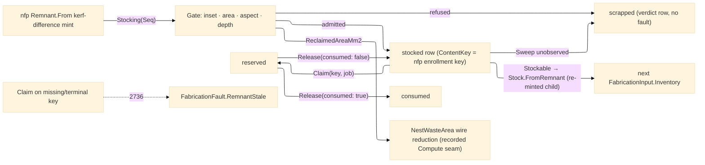

# [RASM_FABRICATION_REMNANT]

The offcut LIFECYCLE owner: `Nesting/nfp#NESTING` MINTS each `Remnant` (the kerf-inflated Boolean-difference producer stamping content identity + `Parent` lineage), and THIS page owns everything that happens to a remnant AFTER its mint — cross-job stocking, reuse admission, reservation, consumption, retirement, and the inventory audit — through the ONE polymorphic `Remnant.Reconcile` fold over the `RemnantOp` `[Union]` (`Stocking` absorbs single and batch on one `Seq` case; `Claim` is the reservation edge and the `RemnantStale` 2736 producer; `Release` closes a reservation to consumed or back to stocked; `Sweep` is the cross-job physical-inventory audit). The type is ONE record in two concern halves: the nfp page declares the mint half (`Of`/`From`/`Holds`), this page the lifecycle partial (`Reconcile`/`Stockable` and the reuse gates) — one `Remnant`, one namespace, never a parallel `Offcut`/`RemnantManager` sibling. The inventory is INPUT-CARRIED exactly like the owner's `ResidualStock` truth-carry: `Reconcile` takes the current `RemnantInventory` (the typed ledger + admission-policy owner — raw map carriage never crosses the seam) and returns the NEXT inventory inside the `RemnantPlan` receipt — run N's reconcile feeds run N+1's inventory, and no mutable registry exists anywhere on this plane. The ruled batch seam is `Remnant.Reconcile(Seq<Remnant>, RemnantInventory) → RemnantPlan`; the claim/release/sweep edges ride the SAME canonical name through the op-discriminated overload, modality living in the request shape. Reuse admission is a policy TABLE, never code-path constants: `ReusePolicy` rows carry the kerf re-trim margin (the burned edge a reused offcut re-trims), the re-grip margin (the clamp/gripper band a re-fixtured plate reserves), the minimum-usable-area floor, the sliver aspect floor, and the lineage-depth cap (a remnant-of-a-remnant chain retires at the traceability bound); the usable interior is the boundary INSET through the one `Geometry2D/algebra#POLYGON_ALGEBRA` `Offset` owner, and an admitted row's stockable child re-mints through `Remnant.Of` with the stocked remnant as `Parent` — the content-address law holds (a trimmed boundary is a NEW identity, a re-labeled one is the named defect).

Three seams stay exactly where the sibling pages put them. The `remnant` `EgressKind`/Persistence `ArtifactKind` enrollment RIDES nfp (the mint page); this page's ledger rows key the SAME `ContentKey(EgressKind.Remnant, identity)` — lifecycle here, mint there, one durable key, never a second enrollment. The rectangular per-sheet offcuts on `Nesting/stock#STOCK_NEST`'s `NestYield` stay YIELD EVIDENCE (procurement ledger rows) and never enter this lifecycle — only true-shape minted `Remnant` polygons do; the two owners stay disjoint. Reuse REDUCES the Compute waste rollup as a RECORDED seam: reclaimed usable area subtracts from the same `NestWasteArea` frozen-key wire value the landed `Rasm.Compute` counterpart decodes (`ElementQuantity.WasteAreaM2`/`NestWasteM2`, SI m²), the quantity-bag lowering riding the deferred `FabricationProjector` exactly as the stock rollup does — recorded-only, no Compute edit, never a direct sustainability read. Staleness versus depth is the fault law's split: lineage DEPTH gates reuse admission (a too-deep offcut retires as a verdict row), while a `Claim` against a key the ledger cannot resolve — or a row already terminal — routes the typed `FabricationFault.RemnantStale` 2736, never a silent virgin-sheet substitution.

Wire posture: HOST-LOCAL. The ledger crosses only the in-process seam — `Stockable` projects stocked rows as `Stock.FromRemnant` inventory for the next `FabricationInput.Inventory`, and the `ContentKey` rows are the persisted-decode contract the Persistence artifact index already carries via nfp's enrollment; no type on this page sits between wire and rail.

## [01]-[INDEX]

- [01]-[REMNANT_LIFECYCLE]: owns the `RemnantState` transition vocabulary, the `ReusePolicy` admission table, the `RemnantRow`/`RemnantInventory`/`RemnantPlan` ledger model, the `RemnantOp` `[Union]`, and the lifecycle partial of `Remnant` — the one `Reconcile` fold (the ruled batch seam plus the op-discriminated claim/release/sweep overload) and the `Stockable` inventory projection the next nest consumes.

## [02]-[REMNANT_LIFECYCLE]

- Owner: `RemnantState` `[SmartEnum<string>]` the lifecycle axis (`minted` → `stocked` → `reserved` → `consumed` | `scrapped`) with the `Terminal` flag and the expression-shaped `Admits` transition relation — a terminal row admits nothing; `ReusePolicy` the admission table (kerf re-trim, re-grip margin, usable-area floor, sliver aspect floor, lineage-depth cap) with `Flatbed`/`Plate` seed rows and the derived `InsetMm`; `RemnantRow` the ledger row binding the minted `Remnant`, its `State`, its `ContentKey` (the SAME key nfp's enrollment mints), its lineage depth, the inset `Usable` interior with its area, and the reserving job; `RemnantOp` `[Union]` the reconcile request (`Stocking`/`Claim`/`Release`/`Sweep`); `RemnantInventory` the typed inventory owner (ledger rows + the admission policy) crossing the public seam in place of raw map carriage; `RemnantPlan` the receipt carrying the NEXT inventory plus the admitted/retired/stale evidence and the reclaimed-area scalars; `Remnant` (lifecycle partial) the static surface owning `Reconcile` and `Stockable`.
- Cases: `RemnantState` rows 5, transitions {minted→stocked, minted→scrapped, stocked→reserved, stocked→scrapped, reserved→consumed, reserved→stocked} — the relation is total over the row pairs and everything else is refused; `RemnantOp` cases 4 — `Stocking(Seq<Remnant>)` (single and batch on ONE case, arity absorbed by the Seq), `Claim(ContentKey, int job)`, `Release(ContentKey, bool consumed)`, `Sweep(Seq<ContentKey> observed)`; `ReusePolicy` seed rows 2 (`flatbed` thin-sheet thermal reuse; `plate` heavy-plate re-grip reuse) — a new machine class is one policy row, never a branch.
- Entry: `public static RemnantPlan Remnant.Reconcile(Seq<Remnant> minted, RemnantInventory inventory)` — THE ruled batch seam (stocking never faults: a rejected candidate is a RETIRED row); `public static Fin<RemnantPlan> Remnant.Reconcile(RemnantOp op, RemnantInventory inventory)` — the SAME canonical name carrying the full lifecycle through the generated total `Switch`, `Fin<T>` routing `FabricationFault.RemnantStale` 2736 on an unresolvable or terminal claim/release key; `public static Seq<Stock> Remnant.Stockable(RemnantInventory inventory)` — the inventory projection minting each stocked row's usable interior as a lineage-stamped child (`Remnant.Of(usable, Some(identity))`) wrapped `Stock.FromRemnant`, feeding the next run's `FabricationInput.Inventory` so the landed nfp scheduler packs real offcuts before virgin sheets.
- Auto: `Stocking` gates each minted remnant — inset the boundary by `InsetMm` through `PolygonAlgebra.Offset` (negative delta, `OffsetEnds.Polygon`), measure the usable interior through `PolygonAlgebra.Area`, walk the `Parent` chain through the ledger for lineage depth (a broken link terminates the walk: depth gates REUSE, staleness gates CLAIM), and admit as a `stocked` row or retire as `scrapped` under the area/aspect/depth rows; `Claim` shifts a resolvable non-terminal row to `reserved` stamping the job, `Release` closes it to `consumed` or returns it to `stocked`; `Sweep` retires every live row whose identity is absent from the observed physical inventory and reports the stale keys; every arm returns the next inventory INSIDE the plan — the caller carries it forward, the run-N→run-N+1 loop closing exactly as the owner's truth-carry fields do.
- Receipt: `RemnantPlan` — the next `RemnantInventory` plus `Admitted`/`Retired`/`Stale` typed rows, `ReclaimedAreaMm2` (the usable area entering stock), and `WasteReductionMm2` (the recorded `NestWasteArea` wire reduction the Compute rollup decodes downstream); the rows ARE the audit trail, no parallel event log.
- Packages: `Rasm.Fabrication.Geometry2D` (`PolygonAlgebra.Offset`/`Area` — the one inset/metric owner), `Process/owner#FABRICATION_OWNER` (`Loop`/`EgressKind`/`ContentKey` — the egress spine this ledger keys through), `Process/faults#FAULT_BAND` (`RemnantStale` 2736), the sibling `Nesting/nfp#NESTING` `Remnant` mint half + `Stock.FromRemnant`, Thinktecture.Runtime.Extensions, LanguageExt.Core (`Fin`/`Map`/`Seq`/`Option`), `Rhino.Geometry` (`BoundingBox`), BCL inbox.
- Growth: a new admission gate is one `ReusePolicy` column read inside `Gate`; a new lifecycle station is one `RemnantState` row plus its `Admits` pairs; a new reconcile mode is one `RemnantOp` case plus one `Switch` arm (the generated dispatch breaking the build until the arm lands); a defect-zone mask on a stocked remnant is one `RemnantRow` column the gate subtracts; zero new entrypoints.
- Boundary: this page is the ONE lifecycle owner and a `RemnantManager`/`OffcutService`/inventory-singleton sibling is the deleted form — the ledger travels input-carried and no mutable registry exists; the mint stays nfp's (`Remnant.Of`/`From` — this page never re-derives a difference or re-hashes a boundary) and the yield stays stock's (rectangular `NestYield` offcuts never enter this lifecycle); the stockable child RE-MINTS through `Remnant.Of` with `Parent` lineage and a re-labeled boundary keeping a stale identity is the named content-address defect; the durable key is the SAME `ContentKey(EgressKind.Remnant, identity)` nfp enrolls — a second enrollment row or a parallel remnant digest is the second-hasher defect; staleness is the typed `RemnantStale` fault on the CLAIM edge and a silent fallback to virgin stock is the deleted form; the waste-rollup reduction is recorded-only on the frozen `NestWasteArea` wire and a Fabrication-side `Rasm.Compute` reference is the forbidden strata edge; the type is one record in two declared halves and a third partial site is the split-brain defect.

```csharp signature
// --- [RUNTIME_PRELUDE] --------------------------------------------------------------------
using LanguageExt;
using LanguageExt.Common;
using Rasm.Fabrication.Geometry2D;
using Rasm.Fabrication.Process;
using Rhino.Geometry;
using Thinktecture;
using static LanguageExt.Prelude;

namespace Rasm.Fabrication.Nesting;

// --- [TYPES] ------------------------------------------------------------------------------
// Lifecycle axis: Terminal rows admit nothing; the transition relation is expression-shaped and
// total over the row pairs — everything unlisted is refused, never an imperative state machine.
[SmartEnum<string>]
public sealed partial class RemnantState {
    public static readonly RemnantState Minted = new("minted", terminal: false);
    public static readonly RemnantState Stocked = new("stocked", terminal: false);
    public static readonly RemnantState Reserved = new("reserved", terminal: false);
    public static readonly RemnantState Consumed = new("consumed", terminal: true);
    public static readonly RemnantState Scrapped = new("scrapped", terminal: true);

    public bool Terminal { get; }

    public bool Admits(RemnantState next) =>
        !Terminal && ((this == Minted && (next == Stocked || next == Scrapped))
                   || (this == Stocked && (next == Reserved || next == Scrapped))
                   || (this == Reserved && (next == Consumed || next == Stocked)));
}

// --- [MODELS] -----------------------------------------------------------------------------
// Reuse admission table: every gate a row datum. InsetMm is the burned-edge re-trim PLUS the
// re-grip clamp band — the usable interior a reused offcut actually offers.
public sealed record ReusePolicy(double KerfTrimMm, double RegripMarginMm, double MinUsableAreaMm2, double AspectFloor, int MaxLineageDepth) {
    public static readonly ReusePolicy Flatbed = new(KerfTrimMm: 1.0, RegripMarginMm: 15.0, MinUsableAreaMm2: 10_000.0, AspectFloor: 0.05, MaxLineageDepth: 3);
    public static readonly ReusePolicy Plate = new(KerfTrimMm: 2.0, RegripMarginMm: 25.0, MinUsableAreaMm2: 40_000.0, AspectFloor: 0.10, MaxLineageDepth: 2);

    public double InsetMm => KerfTrimMm + RegripMarginMm;
}

// One ledger row per remnant: Key is the SAME ContentKey nfp's Persistence enrollment mints —
// lifecycle here, mint there, one durable key. Usable is the InsetMm interior the reuse offers.
public sealed record RemnantRow(Remnant Remnant, RemnantState State, ContentKey Key, int LineageDepth, Loop Usable, double UsableAreaMm2,
    Option<int> ReservedJob);

// Single and batch stocking are ONE Seq case; Claim/Release are the reservation edges; Sweep the
// cross-job physical-inventory audit.
[Union(ConversionFromValue = ConversionOperatorsGeneration.None)]
public abstract partial record RemnantOp {
    private RemnantOp() { }

    public sealed record Stocking(Seq<Remnant> Minted) : RemnantOp;
    public sealed record Claim(ContentKey Key, int JobId) : RemnantOp;
    public sealed record Release(ContentKey Key, bool Consumed) : RemnantOp;
    public sealed record Sweep(Seq<ContentKey> Observed) : RemnantOp;
}

// The typed inventory owner at the public seam — the current ledger rows PLUS the admission policy they
// were stocked under; raw Map carriage never crosses the seam. Input-carried like the owner's truth fields.
public sealed record RemnantInventory(Map<UInt128, RemnantRow> Rows, ReusePolicy Policy) {
    public static RemnantInventory Empty(ReusePolicy policy) => new(Map<UInt128, RemnantRow>(), policy);
}

// The plan carries the NEXT inventory (input-carried, run N feeds run N+1 — the owner's truth-carry
// discipline) beside the typed audit evidence; WasteReductionMm2 is the recorded NestWasteArea wire
// reduction the landed Compute rollup decodes downstream.
public sealed record RemnantPlan(RemnantInventory Next, Seq<RemnantRow> Admitted, Seq<RemnantRow> Retired, Seq<ContentKey> Stale,
    double ReclaimedAreaMm2, double WasteReductionMm2);

// --- [OPERATIONS] ---------------------------------------------------------------------------
// The lifecycle partial of the nfp-minted record: Of/From/Holds (the mint half) declare on
// Nesting/nfp; Reconcile/Stockable and the reuse gates declare HERE — one type, two concern halves.
public sealed partial record Remnant {
    // THE ruled batch seam: minted offcuts + current inventory in, the reconciled plan out. Stocking never
    // faults — a refused candidate retires as a verdict row — so the ruled shape is a bare RemnantPlan.
    public static RemnantPlan Reconcile(Seq<Remnant> minted, RemnantInventory inventory) =>
        Stock(minted, inventory);

    // The full lifecycle surface — the SAME canonical name, modality in the request shape: Claim/Release/
    // Sweep ride the op union and can fault (RemnantStale 2736); the Stocking case shares the batch interior.
    public static Fin<RemnantPlan> Reconcile(RemnantOp op, RemnantInventory inventory) =>
        op.Switch(
            state:    inventory,
            stocking: static (inv, o) => Fin.Succ(Stock(o.Minted, inv)),
            claim:    static (inv, o) => inv.Rows.Find(o.Key.Digest)
                .Filter(row => row.State.Admits(RemnantState.Reserved))
                .Match(
                    Some: row => Fin.Succ(Shift(inv, row with { State = RemnantState.Reserved, ReservedJob = Some(o.JobId) })),
                    None: () => Fin.Fail<RemnantPlan>(FabricationFault.RemnantStale(o.Key).ToError())),
            release:  static (inv, o) => inv.Rows.Find(o.Key.Digest)
                .Filter(static row => row.State == RemnantState.Reserved)
                .Match(
                    Some: row => Fin.Succ(Shift(inv, row with { State = o.Consumed ? RemnantState.Consumed : RemnantState.Stocked, ReservedJob = None })),
                    None: () => Fin.Fail<RemnantPlan>(FabricationFault.RemnantStale(o.Key).ToError())),
            sweep:    static (inv, o) => Fin.Succ(Audit(inv, toSet(o.Observed.Map(static k => k.Digest)))));

    // The next-inventory projection: each stocked row's usable interior RE-MINTS as a lineage-stamped
    // child (content-address law — a trimmed boundary is a new identity) wrapped Stock.FromRemnant.
    public static Seq<Stock> Stockable(RemnantInventory inventory) =>
        inventory.Rows.Values.ToSeq()
            .Filter(static row => row.State == RemnantState.Stocked)
            .Map(static row => (Stock)new Stock.FromRemnant(Of(row.Usable, Some(row.Remnant.Identity))));

    static RemnantPlan Stock(Seq<Remnant> minted, RemnantInventory inventory) {
        Seq<(Remnant R, Option<RemnantRow> Row)> gated = minted.Map(r => (r, Gate(r, inventory)));
        Seq<RemnantRow> admitted = gated.Bind(static g => g.Row.ToSeq());
        Seq<RemnantRow> retired = gated.Filter(static g => g.Row.IsNone)
            .Map(g => new RemnantRow(
                g.R, RemnantState.Scrapped, KeyOf(g.R),
                Depth(g.R, inventory).IfNone(inventory.Policy.MaxLineageDepth + 1),  // broken chain records beyond-ceiling
                g.R.Boundary, 0.0, None));
        Map<UInt128, RemnantRow> next = admitted.Concat(retired).Fold(inventory.Rows, static (m, row) => m.AddOrUpdate(row.Remnant.Identity, row));
        double reclaimed = admitted.Sum(static a => a.UsableAreaMm2);
        return new RemnantPlan(inventory with { Rows = next }, admitted, retired, Seq<ContentKey>(), reclaimed, reclaimed);
    }

    // The reuse gate: inset through the ONE Geometry2D offset owner, then the area / sliver-aspect /
    // lineage-depth admission rows — a refused candidate retires as a verdict row, never a fault.
    static Option<RemnantRow> Gate(Remnant r, RemnantInventory inventory) =>
        PolygonAlgebra.Offset(Seq(r.Boundary), -inventory.Policy.InsetMm, OffsetEnds.Polygon).ToOption()
            .Bind(static loops => loops.HeadOrNone())
            .Bind(usable => Depth(r, inventory).Map(depth => (Usable: usable, Area: Math.Abs(PolygonAlgebra.Area(usable)), Depth: depth)))
            .Filter(g => g.Area >= inventory.Policy.MinUsableAreaMm2 && g.Depth <= inventory.Policy.MaxLineageDepth && Aspect(g.Usable) >= inventory.Policy.AspectFloor)
            .Map(g => new RemnantRow(r, RemnantState.Stocked, KeyOf(r), g.Depth, g.Usable, g.Area, None));

    // Lineage depth walks the Parent chain through the inventory; a MISSING parent is a broken chain —
    // None, never a counted hop — so an orphaned remnant can never pass MaxLineageDepth on a phantom
    // depth. Depth gates REUSE admission, staleness gates the CLAIM edge, never conflated.
    static Option<int> Depth(Remnant r, RemnantInventory inventory) =>
        r.Parent.Match(
            Some: p => inventory.Rows.Find(p).Bind(row => Depth(row.Remnant, inventory).Map(static d => d + 1)),
            None: static () => Some(0));

    static RemnantPlan Audit(RemnantInventory inventory, Set<UInt128> observed) {
        Seq<RemnantRow> stale = inventory.Rows.Values.ToSeq().Filter(row => !row.State.Terminal && !observed.Contains(row.Remnant.Identity));
        Map<UInt128, RemnantRow> next = stale.Fold(inventory.Rows, static (m, row) => m.AddOrUpdate(row.Remnant.Identity, row with { State = RemnantState.Scrapped }));
        return new RemnantPlan(inventory with { Rows = next }, Seq<RemnantRow>(), stale.Map(static row => row with { State = RemnantState.Scrapped }),
            stale.Map(static row => row.Key), 0.0, 0.0);
    }

    static RemnantPlan Shift(RemnantInventory inventory, RemnantRow row) =>
        new(inventory with { Rows = inventory.Rows.AddOrUpdate(row.Remnant.Identity, row) }, Seq(row), Seq<RemnantRow>(), Seq<ContentKey>(), 0.0, 0.0);

    static double Aspect(Loop usable) {
        BoundingBox b = usable.Bound();
        double w = b.Diagonal.X, h = b.Diagonal.Y;
        return Math.Min(w, h) / Math.Max(1e-9, Math.Max(w, h));
    }

    static ContentKey KeyOf(Remnant r) => new(EgressKind.Remnant, r.Identity);
}
```


