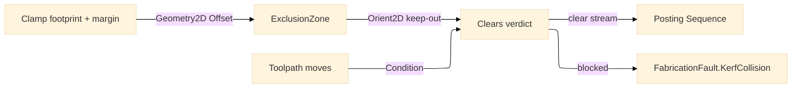

# [RASM_FABRICATION_WORKHOLDING]

The workholding owner: `Workholding` the static surface conditioning a cut sequence and a toolpath against fixture keep-out geometry, over a typed `Fixture`/`Clamp`/`ExclusionZone` placement model. A clamp is first-class geometry — its footprint plus a safety-margin offset is an `ExclusionZone` polygon the toolpath and the cut sequence respect, so a crash against a clamp is a planned exclusion rather than a runtime collision. The workholding KIND (a hard clamp, a vise, a chuck, a vacuum table, a magnet, a sacrificial bed) rides as a `HoldingClass`-keyed footprint-shape behavior COLUMN the one `Clamp` record reads — the `Process/family#PROCESS_FAMILY` `Machine.HoldingClass` selects the footprint shape and the safety-margin default — never a parallel `Workholder [SmartEnum]` beside the concrete placed-device `Clamp`: a vacuum table is one `Clamp` whose footprint-shape column inflates to a full-bed keep-out, a chuck is one `Clamp` whose column is a revolved jaw envelope, the exclusion-offset keep-out kernel unchanged across every kind. The exclusion geometry rides the one `Polygon/clipper#POLYGON_ALGEBRA` offset/clip substrate: a clamp footprint inflates by the safety margin through `Offset` and a candidate move or contour clips against the exclusion set through `Clip`, the integer-robust polygon Boolean replacing any hand-rolled keep-out test. The keep-out side verdict reads the shared `Process/owner#FABRICATION_OWNER` `Loop.Covers` exact-`Orient2D` containment, never a re-rolled keep-out loop. The sequence conditioning composes the `Posting/program#CUT_PROGRAM` `Sequence` fold — fixture-constrained cuts order inner-before-outer under the keep-out, never a second collision owner. It composes the `Process/owner#FABRICATION_OWNER` `Loop`/`Move`/`PartTransform` shared vocabulary; it computes no hash and operates on raw coordinate doubles at the interior.

Wire posture: HOST-LOCAL. The conditioned `Move` stream and the keep-out verdict cross only the in-process seam to the `Toolpath/motion#CAM_MOTION` toolpath and the `Posting/program#CUT_PROGRAM` emitter — never a browser or peer wire. The `Fixture`/`Clamp`/`ExclusionZone` records are host-local types that never sit between wire and rail.

## [1]-[INDEX]

- [1]-[WORKHOLDING]: owns the `Clamp`/`ExclusionZone`/`Fixture` placement model and the `Workholding` fold — the safety-margin exclusion offset over the Geometry2D substrate, the toolpath keep-out clip, and the fixture-constrained cut sequence composing the posting `Sequence`.

## [2]-[WORKHOLDING]

- Owner: `Clamp` the placed workholding device carrying its footprint `Loop`, a safety margin, a clamp height, and a `HoldingClass`-keyed `Kind` footprint-shape column (the workholding kind — hard clamp, vise, chuck, vacuum table, magnet, sacrificial bed — that conditions the footprint inflation, never a parallel device enum); `ExclusionZone` the keep-out polygon (the clamp footprint inflated by its margin and kind through `Offset`) the toolpath and sequence respect, with the exact `Orient2D` `Covers` containment; `Fixture` the placement set — the clamps holding one job plus the `Zones` derived exclusion set over the one offset substrate; `Workholding` the static surface owning `Zone` (the per-clamp exclusion offset keyed by the `Kind` footprint shape), `Clears` (the toolpath keep-out test), and `Condition` (the fixture-constrained move conditioning composing the posting `Sequence`).
- Cases: the workholding `Kind` footprint-shape column rows `clamp` (the footprint inflated by the margin) · `vise` (a two-jaw paired footprint) · `chuck` (a revolved-jaw envelope for a `BarStock` nest) · `vacuum-table` (a full-bed keep-out only at the part-edge margin) · `magnet` (a point footprint) · `sacrificial-bed` (a zero-keep-out bed the part rests on) (6), the `Machine.HoldingClass` selecting the row, the keep-out kernel reading the inflated footprint regardless of kind; a candidate move or contour is `Clear` (no exclusion zone covers its footprint) or `Blocked` (a keep-out zone covers it — a planned exclusion, routed `FabricationFault.KerfCollision` when a required cut cannot avoid a clamp) — the two-state verdict the exact `Orient2D` containment decides, never a parallel collision pass; the cut sequence is the inner-before-outer order under the keep-out, composing the posting `Sequence`, never a second sequencer.
- Entry: `public static Fin<Seq<Move>> Condition(Fixture fixture, Seq<Move> moves)` and `public static bool Clears(Fixture fixture, Edge3 segment)` — `Fin<T>` routes `FabricationFault.KerfCollision` when a feed move crosses a keep-out zone (a cut that cannot avoid a clamp is a planned exclusion surfaced as a fault, never a silent crash); `Clears` is the total keep-out verdict a generator queries before committing a move; `Zones` projects each clamp to its exclusion polygon.
- Auto: `Workholding.Zone` inflates each `Clamp` footprint by its safety margin through the `Polygon/clipper#POLYGON_ALGEBRA` `Offset` (`OffsetEnds.Polygon`, positive delta), and `Fixture.Zones` folds the per-clamp zones into the exclusion set; `Clears` tests a segment against every exclusion zone — a feed move whose endpoint or midpoint lies inside a zone (the exact `Predicate.Orient2D` point-in-polygon `Covers`) is blocked, a rapid move clears; `Condition` walks the move stream keeping each clear move and routing `FabricationFault.KerfCollision` on the first feed move a zone blocks, the surviving cut contours then ordered inner-before-outer through the `Posting/program#CUT_PROGRAM` `Sequence` fold so the fixture-constrained order respects both the containment and the keep-out. The exclusion offset and the keep-out clip ride the one Geometry2D owner; Clipper2's inferred orientation is never the keep-out verdict, the `Orient2D` exact sign is.
- Receipt: the conditioned `Move` stream IS the evidence the toolpath consumes and the `Clear`/`Blocked` verdict the boolean `Clears` answers; no generic collision ledger, the keep-out is a typed exclusion not a logged event.
- Packages: `Rasm`/Vectors (`Point3d`/`Vector3d`/`BoundingBox` — composed), the `Process/owner#FABRICATION_OWNER` `Loop.Covers` (the keep-out containment verdict, composing the kernel `Predicate.Orient2D` transitively), Clipper2 (via `Polygon/clipper#POLYGON_ALGEBRA` — the exclusion-zone offset and the keep-out clip), LanguageExt.Core, BCL inbox.
- Growth: a 3D keep-out volume (a clamp height column gating a move by Z) is one `Clamp` height column plus one `Clears` Z-test arm; a new workholding kind (a soft-jaw, a toe-clamp) is one `WorkholderKind` row carrying its footprint-shape behavior column, the `Clamp` record and the exclusion offset unchanged; a tab-relocation arm (moving a part-retention tab off a clamp) is one `Condition` fold arm composing the posting `Tabs`; zero new surface.
- Boundary: `Workholding` is the ONE keep-out owner and a second collision surface is the deleted form — the exclusion geometry rides the one `Polygon/clipper#POLYGON_ALGEBRA` offset/clip owner and the sequence conditioning composes the one `Posting/program#CUT_PROGRAM` `Sequence`, never a parallel fixture sequencer; the workholding kind rides the `HoldingClass`-keyed `WorkholderKind` footprint-shape column on the concrete `Clamp` record and a parallel `Workholder [SmartEnum]` beside `Clamp` is the deleted form — the page's own collapse law (a workholding kind is one `Clamp` footprint shape) names the column, never a sibling device enum that re-models the placed `Clamp`; the keep-out containment reads the shared `Process/owner#FABRICATION_OWNER` `Loop.Covers` exact-`Orient2D` containment (`ExclusionZone.Covers` composes it, never a re-rolled containment loop) and a naive `double` cross is the named robustness defect; a clamp is first-class geometry and a runtime collision check that is not a planned `ExclusionZone` is the rejected form — a crash against a clamp is a design-time exclusion routed `FabricationFault.KerfCollision`, never an uncaught runtime collision; the exclusion offset is the Clipper2 `Offset` and a hand-rolled footprint inflation is the deleted form.

```csharp signature
// --- [RUNTIME_PRELUDE] --------------------------------------------------------------------
using LanguageExt;
using LanguageExt.Common;
using Rasm.Fabrication.Process;
using Rasm.Fabrication.Geometry2D;
using Rasm.Fabrication.Posting;
using Rasm.Fabrication.ProcessModel;
using Rhino.Geometry;
using Thinktecture;
using static LanguageExt.Prelude;

namespace Rasm.Fabrication.Fixturing;

// --- [TYPES] ------------------------------------------------------------------------------
[SmartEnum<string>]
public sealed partial class WorkholderKind {
    public static readonly WorkholderKind Clamp = new("clamp", marginScale: 1.0, holding: HoldingClass.Mechanical);
    public static readonly WorkholderKind Vise = new("vise", marginScale: 1.0, holding: HoldingClass.Mechanical);
    public static readonly WorkholderKind Chuck = new("chuck", marginScale: 1.5, holding: HoldingClass.Revolved);
    public static readonly WorkholderKind VacuumTable = new("vacuum-table", marginScale: 0.5, holding: HoldingClass.Vacuum);
    public static readonly WorkholderKind Magnet = new("magnet", marginScale: 0.25, holding: HoldingClass.Magnetic);
    public static readonly WorkholderKind SacrificialBed = new("sacrificial-bed", marginScale: 0.0, holding: HoldingClass.Bed);

    public double MarginScale { get; }
    public HoldingClass Holding { get; }

    public static WorkholderKind ForHolding(HoldingClass holding) =>
        toSeq(Items).Find(k => k.Holding == holding).IfNone(Clamp);
}

// --- [MODELS] -----------------------------------------------------------------------------
public sealed record Clamp(Loop Footprint, double Margin, double Height, WorkholderKind Kind);

public sealed record ExclusionZone(Loop Keepout) {
    public bool Covers(Point3d p) => Keepout.Covers(p);
}

public sealed record Fixture(Seq<Clamp> Clamps) {
    public Seq<ExclusionZone> Zones =>
        Clamps.Map(Workholding.Zone).Somes();
}

// --- [OPERATIONS] -------------------------------------------------------------------------
public static class Workholding {
    public static Option<ExclusionZone> Zone(Clamp clamp) =>
        clamp.Kind.MarginScale <= 0.0
            ? None
            : PolygonAlgebra.Offset(Seq(clamp.Footprint.AsCcw()), Math.Abs(clamp.Margin) * clamp.Kind.MarginScale, OffsetEnds.Polygon)
                .Match(Succ: rings => rings.HeadOrNone().Map(r => new ExclusionZone(r)), Fail: _ => None);

    public static bool Clears(Fixture fixture, Edge3 segment) {
        Point3d mid = segment.A + 0.5 * (segment.B - segment.A);
        return fixture.Zones.ForAll(z => !z.Covers(segment.A) && !z.Covers(segment.B) && !z.Covers(mid));
    }

    public static Fin<Seq<Move>> Condition(Fixture fixture, Seq<Move> moves) {
        Seq<ExclusionZone> zones = fixture.Zones;
        Point3d cursor = Point3d.Origin;
        foreach (Move m in moves) {
            bool blocked = !m.Rapid && zones.Exists(z => z.Covers(m.To) || z.Covers(cursor + 0.5 * (m.To - cursor)));
            if (blocked) return Fin.Fail<Seq<Move>>(FabricationFault.KerfCollision($"workholding:keep-out:{m.To.X:0.#},{m.To.Y:0.#}").ToError());
            cursor = m.To;
        }
        return Fin.Succ(moves);
    }
}
```


