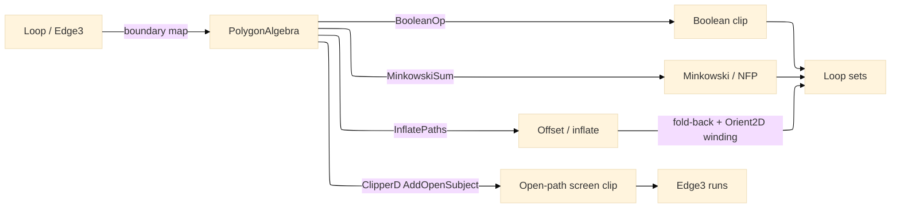

# [RASM_FABRICATION_CLIPPER]

The one 2D polygon-algebra substrate over Clipper2: `PolygonAlgebra` the single owner of offset/inflate (uniform AND per-vertex variable-delta), Boolean clip, Minkowski sum and difference, and the open-path clip the projection kernel consumes. Clipper2 (Boost-1.0, dependency-free, integer-robust) owns every primitive at decimal-precision-scaled integer arithmetic; the kernels that hand-rolled offsetting, the NFP Minkowski merge, the inner-fit containment locus, and the HLR screen clip collapse onto this owner, per the `algorithms.md` rule that a hand-rolled kernel is admitted only after a benchmark defeats the library. The uniform offset runs the `PathD` facade `Clipper.InflatePaths`; the variable-delta offset runs the stateful `ClipperOffset` engine over its `DeltaCallback64` per-vertex signed delta on the int64 `Paths64` rail — the two precision rails ride the one owner, the variable-delta arm scaling to int64 and back at `Precision.Digits` so the per-vertex torch-taper, weighted-skeleton clearing, and variable-width perimeter shells need no second offset engine. The orientation verdict stays the kernel `Rasm.Geometry/Numerics/predicates#ROBUST_PREDICATES` `Predicate.Orient2D` exact sign — Clipper2 owns the polygon Boolean and the geometric construction, `Predicate.Orient2D` owns the winding/side verdict every kernel reads, and the two never overlap. The owner composes the `Process/owner#FABRICATION_OWNER` `Loop`/`Edge3` shared atoms, boundary-mapping each `Loop` to a Clipper2 `PathD`/`PathsD` at the one edge and back; it computes no hash and operates on raw coordinate doubles at the interior.

Wire posture: HOST-LOCAL. `PolygonAlgebra` is a pure-managed in-process owner — Clipper2 is managed AnyCPU IL with no native asset and no RID burden. Its outputs are `Loop` sets the sibling fabrication kernels (`Toolpath/motion`, `Nesting/nfp`, `Posting/projection`, `Posting/program`) read; no result crosses a browser or peer wire.

## [01]-[INDEX]

- [01]-[POLYGON_ALGEBRA]: owns `PolygonAlgebra` over Clipper2 — the `ClipOp`/`OffsetEnds` axes, the `Offset`/`OffsetVariable`/`Clip`/`MinkowskiSum`/`MinkowskiDiff`/`ClipOpenPath` operations covering uniform offset/inflate, per-vertex variable-delta offset, Boolean clip, Minkowski sum (NFP) and difference (inner-fit), and the open-path screen clip, plus the `Area`/`Bounds` polygon-metric projections; the one Clipper2 owner.

## [02]-[POLYGON_ALGEBRA]

- Owner: `ClipOp` `[SmartEnum<string>]` the Boolean operation axis (`union`/`intersect`/`difference`/`xor`) mapping to the Clipper2 `ClipType` row; `OffsetEnds` `[SmartEnum<string>]` the offset end/join axis (`polygon`/`open-round`/`open-butt`/`open-square`) mapping to the Clipper2 `EndType`/`JoinType` row; `SimplifyMode` `[SmartEnum<string>]` the path-hygiene axis (`collinear`=`SimplifyPaths` · `decimate`=`RamerDouglasPeucker` · `trim`=`TrimCollinear` · `dedupe`=`StripDuplicates`) carrying its `Clean` cleanup delegate parameterizing the one `Simplify` entry; `PolygonAlgebra` the static surface owning `Offset` (uniform), `OffsetVariable` (per-vertex delta), `Clip`, `MinkowskiSum`, `MinkowskiDiff`, `ClipOpenPath`, `Simplify`, and the `Area`/`Bounds` measurement projections, each boundary-mapping a `Loop`/`Edge3` to a Clipper2 path and folding the result back to `Loop` sets or a scalar metric.
- Cases: `ClipOp` rows `union` · `intersect` · `difference` · `xor` (4); `OffsetEnds` rows `polygon` (closed contour offset — kerf/contour rings) · `open-round` · `open-butt` · `open-square` (open-path offset — leads) (4); `SimplifyMode` rows `collinear` (the epsilon collinear-run collapse) · `decimate` (Ramer-Douglas-Peucker chord decimation for over-sampled import) · `trim` (collinear-point removal at `Precision.Digits`) · `dedupe` (consecutive-duplicate stripping over the int64 path) (4); the operations `Offset`/`Clip`/`MinkowskiSum`/`ClipOpenPath`/`Simplify`/`Area`/`Bounds` are one owner each, never a per-caller bespoke routine.
- Entry: the four static operations return `Fin<Seq<Loop>>` (or `(Seq<Edge3> Inside, Seq<Edge3> Outside)` for `ClipOpenPath`) where a `GeometryFault.DegenerateInput(...).ToError()` routes on an empty or non-finite path set; the decimal `Precision.Digits` count (6) is the one Clipper2 robustness knob the facade and the `ClipperD` engine read to scale doubles into integer arithmetic and back.
- Auto: `Offset` maps each `Loop` to a Clipper2 `PathsD`, runs `Clipper.InflatePaths` with the `OffsetEnds` join/end row, the signed delta (negative shrinks inward for contour kerf, positive inflates for lead clearance), and the `precision` digit count, and folds the result paths back to `Loop` sets re-oriented through `AsCcw`; `OffsetVariable` drives the stateful `ClipperOffset` engine for the per-vertex delta the uniform facade cannot express — it scales each `Loop` to the int64 `Paths64` rail at `Precision.Digits`, registers the path through `AddPaths(Paths64, JoinType, EndType)` off the `OffsetEnds` row, sets `ClipperOffset.DeltaCallback` to a `DeltaCallback64` lifting the caller's `Func<Point3d, double>` per-vertex signed delta (reading the current vertex off `path[index]` descaled to model space, returning the int64-scaled delta the engine applies), runs `Execute(DeltaCallback64, Paths64)`, and descales back through `Clipper.ScalePathsD` — the torch-taper kerf, the weighted-straight-skeleton clearing, and the variable-width perimeter shell all ride this one arm, the int64 `Paths64` engine the second precision rail beside the `PathD` uniform facade; `Clip` runs `Clipper.BooleanOp` of the subject and clip path sets under the `ClipOp` row at the same precision; `MinkowskiSum` runs `Minkowski.Sum` of the fixed path and the (reflected) orbiting path at the same `Precision.Digits` decimal scale the offset and Boolean read — the `Clipper.MinkowskiSum` facade fixes `decimalPlaces` at the package default and is the deleted form — producing the NFP boundary the nesting kernel reads; `MinkowskiDiff` runs `Minkowski.Diff(PathD, PathD, isClosed: true, decimalPlaces: Precision.Digits)` of the container path and the (reflected) part path at the same decimal scale — the `Clipper.MinkowskiDiff` shorthand fixing `decimalPlaces` at the package default `2` is the deleted form — producing the inner-fit-polygon containment locus the `NoFitPolygon.InnerFit` factory reads as the exact set of reference positions where a part lies fully inside an irregular container, the dual of the NFP boundary; `ClipOpenPath` drives a `ClipperD` engine — `AddOpenSubject` for the `Edge3`-as-open-path, `AddClip` for the occluder polygons, then `Execute(ClipType, FillRule.NonZero, PolyTreeD, openPaths)` collecting the surviving open sub-paths, run once as intersection (the inside/hidden runs) and once as difference (the outside/visible runs) the projection kernel splits. Every fold-back re-imposes the `Predicate.Orient2D` winding verdict; Clipper2's own orientation inference is never trusted as the domain sign. `Area` folds the `Loop` through `Clipper.Area(PathD)` for the signed area (positive = CCW) and `Bounds` through `Clipper.GetBounds(PathsD)` for the axis-aligned `RectD` mapped to a `BoundingBox` — the one signed-area and bounding-box authority the nesting utilization, the stock area, and the projection occluder broad-phase read, never a per-page hand-inlined shoelace or min/max loop. The orientation verdict is NOT a Clipper2 projection here: the `Process/owner#FABRICATION_OWNER` `Loop.Winding() -> Sign` exact-`Predicate.Orient2D` owner is the one CCW/CW authority every kernel reads, and `Clipper.IsPositive` (Clipper2's inferred orientation) is never re-exposed as the domain sign. `Simplify` dispatches on the `SimplifyMode.Clean` delegate over the mapped `PathsD` — `collinear` runs `Clipper.SimplifyPaths` at the epsilon, `decimate` maps each path through `Clipper.RamerDouglasPeucker` for the chord decimation an over-sampled DXF/Spline import needs, `trim` runs `Clipper.TrimCollinear` at `Precision.Digits`, and `dedupe` scales each path to int64 through `Clipper.ScalePaths64`, runs `Clipper.StripDuplicates`, and descales through `Clipper.ScalePathsD` (the `StripDuplicates` member is int64-only, so the precision scale crosses at the one boundary) — every page's pre-clip conditioning selecting its mode over the one entry, never a per-page bespoke cleanup.
- Receipt: each operation returns the typed `Loop`/`Edge3` set directly — the polygon set IS the evidence the consuming kernel reads; no generic polygon ledger and no Clipper2 `PathsD` escaping the owner.
- Packages: `Rasm`/Vectors (`Point3d`/`Vector3d`/`BoundingBox` — composed), `Rasm.Geometry.Numerics` (`Predicate.Orient2D` — settled, the winding/side verdict), Clipper2 (`Clipper2Lib` namespace — the `Clipper` facade `BooleanOp`/`InflatePaths`/`SimplifyPaths`/`RamerDouglasPeucker`/`TrimCollinear`/`StripDuplicates`/`ScalePaths64`/`ScalePathsD`/`Area`/`GetBounds`, the `Minkowski` facade `Sum`/`Diff` carrying the `decimalPlaces` precision the `Clipper.MinkowskiSum`/`MinkowskiDiff` shorthands drop, the `ClipperOffset` engine `AddPaths(Paths64, JoinType, EndType)`/`Execute(DeltaCallback64, Paths64)`/`DeltaCallback` for the per-vertex variable delta, the `ClipperD` engine `AddOpenSubject`/`AddClip`/`Execute` open-path overload, `ClipType`/`FillRule`/`JoinType`/`EndType`/`Path64`/`Paths64`/`PathD`/`PathsD`/`PointD`/`PolyTreeD`/`RectD`/`DeltaCallback64`; the one polygon-algebra substrate, this folder is its first admitter), LanguageExt.Core, BCL inbox.
- Growth: a new Boolean operation is one `ClipOp` row; a new offset end style is one `OffsetEnds` row; a new path-hygiene primitive is one `SimplifyMode` row carrying its `Clean` delegate; a higher-precision scale is one `Precision.Digits` constant change; the irregular/non-convex NFP (convex decomposition + per-piece Minkowski union) is one arm on `MinkowskiSum` over the same owner; the inner-fit containment locus is the settled `MinkowskiDiff` arm the nesting `NoFitPolygon.InnerFit` reads; the variable-kerf offset is the settled `OffsetVariable` arm driving the `ClipperOffset` engine's `DeltaCallback64` per-vertex delta (the weighted-straight-skeleton, torch-taper, and per-vertex deflection-compensation consumer); zero new surface.
- Boundary: `PolygonAlgebra` is the ONE Clipper2 owner and a second `Clipper`/`ClipperD` call site in any sibling kernel is the named duplication defect — the CAM contour offset, the NFP Minkowski merge, the HLR screen clip, and the polygon metrics all route here; polygon area and the bounding box are the `Area`/`Bounds` projections over `Clipper.Area`/`GetBounds` and a hand-inlined `0.5·Σ(xᵢyᵢ₊₁ − xᵢ₊₁yᵢ)` shoelace or a hand-rolled min/max bound is the deleted form — the nesting `SignedArea`/`Utilization`/`Stock.Area` and the projection occluder bound read this one metric authority; the winding orientation is NOT a second Clipper2 projection — the exact `Process/owner#FABRICATION_OWNER` `Loop.Winding() -> Sign` `Predicate.Orient2D` owner is the one CCW/CW authority, and the containment-side verdict stays the same kernel exact sign (the scalar metric, the orientation sign, and the side verdict never overlap); the orientation verdict is the kernel `Predicate.Orient2D` exact sign and Clipper2's inferred orientation is never the domain sign; the `ToPath`/`FromPaths` boundary map is the one place `double` coordinates cross into the Clipper2 `PathD`/`PathsD` domain and back, and a `PathsD`/`Path64`/`PolyTreeD` type in a sibling kernel signature is the seam violation; Clipper2 exposes a public `Triangulate`/`TriangulateResult` surface in `2.0.0`/`2.0.1` that the author flags as buggy (open infinite-loop defects in the internal `Delaunay` kernel), so this owner exposes no triangulation arm and a 2D-meshing need routes to the kernel triangulation owner or a separate admission against a real triangulation library; path hygiene is the one `Simplify` entry parameterized by the `SimplifyMode` axis and a sibling `Decimate`/`Trim`/`Dedupe` method family is the deleted form — the four cleanup primitives ride one `SimplifyMode.Clean` delegate column, the import decimation, the slice contour, and the posting collinear collapse all selecting their mode; the variable-delta offset is the one `OffsetVariable` arm driving the stateful `ClipperOffset` engine on the int64 `Paths64` rail (the uniform arm running the `PathD` facade `InflatePaths`) and a second offset engine in any sibling kernel is the named duplication defect — the torch-taper, weighted-skeleton, and variable-width-shell consumers all route this one arm, the per-vertex signed delta a `Func<Point3d, double>` column the `DeltaCallback64` lifts; the inner-fit locus is the `MinkowskiDiff` arm over the precision-bearing `Minkowski.Diff(PathD, …, decimalPlaces)` facade and the `Clipper.MinkowskiDiff` shorthand fixing precision at `2` is the deleted form (the sibling of the `MinkowskiSum` precision rule); a hand-rolled per-vertex-normal offset (`OffsetRing`), a hand-rolled angle-sorted edge merge (the old NFP construction), a hand-rolled Douglas-Peucker, a hand-rolled inner-fit bounds test, or a hand-rolled parameter-interval screen subtraction (`SpanInside`) is the deleted form this owner subsumes.

```csharp signature
// --- [RUNTIME_PRELUDE] --------------------------------------------------------------------
using Clipper2Lib;
using LanguageExt;
using LanguageExt.Common;
using Rasm.Fabrication.Process;
using Rasm.Geometry;
using Rasm.Geometry.Numerics;
using Rhino.Geometry;
using Thinktecture;
using static LanguageExt.Prelude;

namespace Rasm.Fabrication.Geometry2D;

// --- [TYPES] ------------------------------------------------------------------------------
[SmartEnum<string>]
public sealed partial class ClipOp {
    public static readonly ClipOp Union = new("union", ClipType.Union);
    public static readonly ClipOp Intersect = new("intersect", ClipType.Intersection);
    public static readonly ClipOp Difference = new("difference", ClipType.Difference);
    public static readonly ClipOp Xor = new("xor", ClipType.Xor);

    public ClipType Type { get; }
}

[SmartEnum<string>]
public sealed partial class OffsetEnds {
    public static readonly OffsetEnds Polygon = new("polygon", JoinType.Miter, EndType.Polygon);
    public static readonly OffsetEnds OpenRound = new("open-round", JoinType.Round, EndType.Round);
    public static readonly OffsetEnds OpenButt = new("open-butt", JoinType.Square, EndType.Butt);
    public static readonly OffsetEnds OpenSquare = new("open-square", JoinType.Square, EndType.Square);

    public JoinType Join { get; }
    public EndType End { get; }
}

[SmartEnum<string>]
public sealed partial class SimplifyMode {
    public static readonly SimplifyMode Collinear = new("collinear", static (paths, epsilon) =>
        Clipper.SimplifyPaths(paths, epsilon, isClosedPath: true));
    public static readonly SimplifyMode Decimate = new("decimate", static (paths, epsilon) =>
        new PathsD(toSeq(paths).Map(p => Clipper.RamerDouglasPeucker(p, epsilon))));
    public static readonly SimplifyMode Trim = new("trim", static (paths, _) =>
        new PathsD(toSeq(paths).Map(p => Clipper.TrimCollinear(p, Precision.Digits, isOpen: false))));
    public static readonly SimplifyMode Dedupe = new("dedupe", static (paths, _) => {
        double scale = Math.Pow(10.0, Precision.Digits);
        Paths64 stripped = new(toSeq(Clipper.ScalePaths64(paths, scale)).Map(p => Clipper.StripDuplicates(p, isClosedPath: true)));
        return Clipper.ScalePathsD(stripped, 1.0 / scale);
    });

    public Func<PathsD, double, PathsD> Clean { get; }
}

// --- [CONSTANTS] --------------------------------------------------------------------------
file static class Precision {
    public const int Digits = 6;
}

// --- [OPERATIONS] -------------------------------------------------------------------------
public static class PolygonAlgebra {
    public static Fin<Seq<Loop>> Offset(Seq<Loop> loops, double delta, OffsetEnds ends) =>
        loops.IsEmpty
            ? Fin.Fail<Seq<Loop>>(GeometryFault.DegenerateInput("offset:empty").ToError())
            : Fin.Succ(FromPaths(Clipper.InflatePaths(ToPaths(loops), delta, ends.Join, ends.End, precision: Precision.Digits)));

    public static Fin<Seq<Loop>> OffsetVariable(Seq<Loop> loops, Func<Point3d, double> delta, OffsetEnds ends) {
        if (loops.IsEmpty)
            return Fin.Fail<Seq<Loop>>(GeometryFault.DegenerateInput("offset-variable:empty").ToError());
        double scale = Math.Pow(10.0, Precision.Digits);
        var engine = new ClipperOffset();
        engine.AddPaths(Clipper.ScalePaths64(ToPaths(loops), scale), ends.Join, ends.End);
        engine.DeltaCallback = (path, _, index, _) =>
            (long)(delta(new Point3d(path[index].X / scale, path[index].Y / scale, 0.0)) * scale);
        var solution = new Paths64();
        engine.Execute(engine.DeltaCallback, solution);
        return Fin.Succ(FromPaths(Clipper.ScalePathsD(solution, 1.0 / scale)));
    }

    public static Fin<Seq<Loop>> Clip(Seq<Loop> subject, Seq<Loop> clip, ClipOp op) =>
        subject.IsEmpty
            ? Fin.Fail<Seq<Loop>>(GeometryFault.DegenerateInput("clip:empty-subject").ToError())
            : Fin.Succ(FromPaths(Clipper.BooleanOp(op.Type, ToPaths(subject), ToPaths(clip), FillRule.NonZero, precision: Precision.Digits)));

    public static Fin<Seq<Loop>> MinkowskiSum(Loop fixedPart, Loop orbiting) =>
        Fin.Succ(FromPaths(Minkowski.Sum(ToPath(fixedPart), ToPath(orbiting), isClosed: true, decimalPlaces: Precision.Digits)));

    public static Fin<Seq<Loop>> MinkowskiDiff(Loop container, Loop part) =>
        Fin.Succ(FromPaths(Minkowski.Diff(ToPath(container), ToPath(part), isClosed: true, decimalPlaces: Precision.Digits)));

    public static (Seq<Edge3> Inside, Seq<Edge3> Outside) ClipOpenPath(Edge3 edge, Seq<Loop> occluders) =>
        occluders.IsEmpty
            ? (Seq<Edge3>(), Seq(edge))
            : (Split(ClipType.Intersection, edge, occluders), Split(ClipType.Difference, edge, occluders));

    public static Fin<Seq<Loop>> Simplify(Seq<Loop> loops, double epsilon, SimplifyMode mode) =>
        loops.IsEmpty
            ? Fin.Fail<Seq<Loop>>(GeometryFault.DegenerateInput("simplify:empty").ToError())
            : Fin.Succ(FromPaths(mode.Clean(ToPaths(loops), epsilon)));

    public static double Area(Loop loop) => Clipper.Area(ToPath(loop));

    public static BoundingBox Bounds(Seq<Loop> loops) {
        RectD r = Clipper.GetBounds(ToPaths(loops));
        return new BoundingBox(new Point3d(r.left, r.bottom, 0.0), new Point3d(r.right, r.top, 0.0));
    }

    // --- [BOUNDARIES] ---------------------------------------------------------------------
    static Seq<Edge3> Split(ClipType op, Edge3 edge, Seq<Loop> occluders) {
        var engine = new ClipperD(Precision.Digits);
        engine.AddOpenSubject(new PathsD { new PathD { ToPoint(edge.A), ToPoint(edge.B) } });
        engine.AddClip(ToPaths(occluders));
        var open = new PathsD();
        engine.Execute(op, FillRule.NonZero, new PolyTreeD(), open);
        return Runs(open);
    }

    static PathsD ToPaths(Seq<Loop> loops) => new(loops.Map(ToPath));
    static PathD ToPath(Loop loop) => new(loop.AsCcw().Vertices.Map(ToPoint));
    static PointD ToPoint(Point3d p) => new(p.X, p.Y);

    static Seq<Loop> FromPaths(PathsD paths) =>
        toSeq(paths).Map(path => new Loop(toSeq(path).Map(pt => new Point3d(pt.x, pt.y, 0.0)).ToArr(), Closed: true).AsCcw());

    static Seq<Edge3> Runs(PathsD paths) =>
        toSeq(paths).Bind(path => toSeq(Enumerable.Range(0, path.Count - 1))
            .Map(i => new Edge3(new Point3d(path[i].x, path[i].y, 0.0), new Point3d(path[i + 1].x, path[i + 1].y, 0.0))));
}
```


