# [RASM_FABRICATION_PROFILE_IMPORT]

The one portable 2D profile-ingress boundary: `ProfileImport` the single owner admitting external DXF/DWG closed part outlines into the canonical `Process/owner#FABRICATION_OWNER` `Loop` vocabulary through the pure-managed `ACadSharp` reader. A foreign CAD entity crosses into the interior exactly ONCE here — `ProfileImport.Read` reads the model-space entity set off a `CadDocument`, folds each `LwPolyline`/`Polyline2D`/`Line`/`Arc`/`Circle`/`Spline`/`Insert` through one total `Admit` switch over the entity case, tessellates every bulge/arc/circle span through the ACadSharp-owned `Arc.CreateFromBulge`/`PolygonalVertexes`/`Circle.PolygonalVertexes` curve sampler and every NURBS span through the `Spline.PolygonalVertexes`/`TryPolygonalVertexes` native tessellator at one `ChordTolerance` knob, recursively flattens each nested-block `Insert` through the package-owned `Insert.Explode()` (which resolves `BlockRecord.Entities` AND applies the composed `InsertPoint`/scale/`Rotation` placement transform per child in one call, never a hand-rolled OCS-to-WCS matrix), and re-imposes the kernel `Rasm.Geometry/Numerics/predicates#ROBUST_PREDICATES` `Predicate.Orient2D` winding through `Loop.AsCcw` on the way out. No `CadDocument`, no ACadSharp entity, no `CSMath.XY`/`XYZ` type ever travels a sibling-kernel signature; the boundary is the seam, and the interior reads only `Loop`. The imported `Arr<Loop>` set is the part library that `Nesting/nfp#NESTING` nests for true-shape feasibility and `Posting/program#CUT_PROGRAM` cuts as a profile program — the same `Loop` the `Polygon/clipper#POLYGON_ALGEBRA` substrate offsets and clips, never a parallel imported-geometry shape.

Wire posture: HOST-LOCAL, HOST-NEUTRAL. `ACadSharp` is managed AnyCPU IL with no native asset and no RID burden, so the boundary is ALC-safe and runs on every runtime the folder targets; it coexists with the Rhino-native file I/O the architecture keeps as the host-bound read path (`ARCHITECTURE.md` coexistence rule) and is never thinned to feed it. The reader is RESILIENT by default (`CadReaderConfiguration.Failsafe = true`): recoverable corruption (an unknown entity, a malformed sub-record) rides the `OnNotification` event as a structured `NotificationEventArgs(NotificationType, Message, Exception)` record and the read COMPLETES with the recoverable entities — the boundary subscribes a notification sink and folds its `NotificationType.Error` count into the admission so the warning stream is never discarded. A hard `Read` throw is only the unrecoverable-structural case (an unreadable/missing file, a non-DXF/DWG stream); that exception NEVER escapes — it lowers to `GeometryFault.DegenerateInput` once at `Open`, so the boundary's only outward contract is the `Fin<Arr<Loop>>` rail carrying the typed `Loop` set plus the folded warning evidence, never a leaked reader exception.

## [01]-[INDEX]

- [01]-[PROFILE_IMPORT]: `ProfileImport` static boundary over `ACadSharp` — `ChordTolerance` knob, the total `Admit` switch over the entity case, the `Read` fold into `Fin<Arr<Loop>>`, the bulge/arc/circle/spline tessellation through the package-owned curve sampler, and the recursive `Insert` block flattening through the package-owned `Insert.Explode()`; the ONE DXF/DWG ingress owner.

## [02]-[PROFILE_IMPORT]

- Owner: `ProfileImport` the static surface owning `Read` (the DXF/DWG file → `Fin<Arr<Loop>>` boundary fold) plus the private `Admit` total switch and the entity-to-`Loop` tessellation; `ChordTolerance` `[ValueObject<int>]` the one chord-precision knob (the `precision` segment count every `PolygonalVertexes` sampler reads). One owner, one knob, one fold — never a per-entity-type sibling reader triple (`LwPolyline`/`Arc`/`Circle` readers collapse to one `Admit` switch).
- Cases: the `Admit` switch arms over the ACadSharp entity union the boundary reads — `LwPolyline` (closed lightweight polyline, each `Vertex` a `Location: CSMath.XY` plus a `Bulge: double`; a zero-bulge vertex is the raw point, a non-zero-bulge span mints an `Arc` through `Arc.CreateFromBulge` and samples it) · `Polyline2D` (the `Polyline<Vertex2D>` form admitted at its straight-segment vertices by reading `Vertex2D.Location: XYZ` DIRECTLY — `Vertex2D : Vertex` carries `Location` as a plain `XYZ` property, there is NO `Pt(XYZ)` ACadSharp overload; the local `Pt(XYZ)` projector lifts that `XYZ` to the `Point3d(x, y, 0)` plane) · `Line` (the two-point degenerate loop, never closed) · `Arc` (a single arc span sampled through `Arc.PolygonalVertexes`) · `Circle` (the full circle sampled through `Circle.PolygonalVertexes`) · `Spline` (the NURBS profile sampled through the ACadSharp-owned native tessellator `Spline.TryPolygonalVertexes(chord.Segments, out)`, a `false` probe lowering `GeometryFault.DegenerateInput`, a `FitPoints`-only spline rebuilt through `UpdateFromFitPoints` before sampling, never a hand-rolled de Boor) · `Insert` (the nested-block reference flattened through the package-owned `Insert.Explode(): IEnumerable<Entity>` — which resolves `BlockRecord.Entities` AND applies the composed `InsertPoint`/`XScale`/`YScale`/`Rotation` placement transform to each child in one call — and recursing `Admit` over the exploded entities so a nested `Insert` re-enters this arm and explodes again, the one place a non-identity part placement enters the boundary) (7); any other entity is dropped (the `Option<Seq<Loop>>.None` arm — a `Text`/`Dimension`/`Hatch` is not a profile and never faults the read). The `Spline` and `Insert` arms are REAL `Admit` arms — `.api/api-acadsharp.md` `[SPLINE_SAMPLER]` ratifies `Spline.PolygonalVertexes`/`TryPolygonalVertexes`/`UpdateFromFitPoints` and `[BLOCK_TRAVERSAL]` ratifies `Insert.Explode`/`Insert.GetTransform`/`BlockRecord.Entities`/`InsertPoint`/`XScale`/`YScale`/`Rotation`, so the boundary transcribes them as ratified members, no longer deferred.
- Entry: `Read(string path, ChordTolerance chord, bool demandClosed)` returns `Fin<Arr<Loop>>` — the one polymorphic entrypoint discriminating on the file extension to route `DxfReader.Read` versus `DwgReader.Read`, never a `ReadDxf`/`ReadDwg` sibling pair. A successful read folds the model-space entities through `Admit` (an `Insert` arm exploding through `Insert.Explode()` and recursing), partitions the admitted `Loop` set, and (when `demandClosed`) routes `FabricationFault.OpenLoop` if any admitted loop is non-closed; the default `Failsafe=true` read completes on recoverable corruption (warnings routed to the subscribed `OnNotification` sink), and only an unreadable/empty/non-finite file OR a caught unrecoverable `DxfReader`/`DwgReader` exception lowers `GeometryFault.DegenerateInput` ONCE at the boundary.
- Auto: `Read` wraps the `DxfReader.Read(path, OnWarn)` / `DwgReader.Read(path, OnWarn)` facade (the `OnWarn: NotificationEventHandler` sink capturing the `Failsafe=true` warning stream) in the exception-to-`Fin` lowering (`Try` → `Fin`), reads `doc.Entities` (= `doc.ModelSpace.Entities`, the top-level model-space set, NOT auto-flattened), and folds each entity through `Admit`; `Admit` is the total switch returning `Option<Seq<Loop>>` (the dropped-entity arm is `None`, never a fault) — an `Insert` arm yields the FLATTENED block loop set so one entity admits many loops, every other arm yields a singleton `Seq`; `Tessellate` is the per-entity vertex stream — a straight `LwPolyline` segment is the raw `Location` (a `Polyline2D` reads `Vertex2D.Location: XYZ` directly), a non-zero-bulge `LwPolyline` span mints `Arc.CreateFromBulge(prev, next, bulge)` and reads its `PolygonalVertexes(chord.Segments)`, a standalone `Arc` reads `Arc.PolygonalVertexes(chord.Segments)`, a `Circle` reads `Circle.PolygonalVertexes(chord.Segments)`, a `Spline` reads `Spline.TryPolygonalVertexes(chord.Segments, out var pts)` (the native NURBS tessellator, a `false` lowering `DegenerateInput`) — every sampled `XYZ`/`XY` projected to `Point3d(x, y, 0)` and the assembled `Loop` re-oriented through `AsCcw`; the `Insert` arm explodes through `Insert.Explode()` — the package call that resolves `BlockRecord.Entities` AND applies the composed `InsertPoint`/`XScale`/`YScale`/`Rotation`/`Normal` placement transform to each child in one pass — then recurses `Admit` over the exploded entities so a nested `Insert` re-enters the arm and explodes again, the package-owned transform already baked into each child geometry (the `[BLOCK_TRAVERSAL]` gate confirms `Block.Entities` does NOT auto-flatten and that `Explode` is the explicit one-level flatten, so the recursion handles the nesting). The empty-result read (no admitted profile) lowers `GeometryFault.DegenerateInput("profile:empty")`; a non-finite vertex coordinate lowers `GeometryFault.DegenerateInput("profile:non-finite")`.
- Receipt: `Read` returns the typed `Arr<Loop>` set directly — the loop set IS the part library the consuming kernel reads; no generic import-report, no `CadDocument` and no ACadSharp entity escaping the boundary. The fault evidence is the `GeometryFault`/`FabricationFault` union value the `Fin<Arr<Loop>>` failure channel carries, lowered through `.ToError()`.
- Packages: `ACadSharp` (`DxfReader.Read(path, NotificationEventHandler)`/`DwgReader.Read(path, NotificationEventHandler)` → `CadDocument`, notification OPTIONAL; `CadReaderConfiguration.Failsafe: bool = true` (resilient default; recoverable corruption rides `OnNotification`, not a throw); `NotificationEventHandler`/`NotificationEventArgs(Message: string, NotificationType, Exception)`/`NotificationType.{Warning,Error}` — the structured warning sink; `CadDocument.Entities`/`ModelSpace`; `LwPolyline.Vertices: List<Vertex>` with `Vertex.Location: CSMath.XY`/`Vertex.Bulge: double`/`LwPolyline.IsClosed`; `Polyline2D.Vertices: SeqendCollection<Vertex2D>` (enumerated through `toSeq`; `Vertex2D : Vertex` carries `Location: XYZ` as a plain property — NO `Pt(XYZ)` overload)/`IsClosed`; `Line.StartPoint`/`EndPoint: XYZ`; `Arc : Circle` `Center: XYZ`/`Radius: double`/`Arc.CreateFromBulge(XY,XY,double)`/`Arc.PolygonalVertexes(int): List<XYZ>`; `Circle.PolygonalVertexes(int): List<XYZ>`; `Spline.TryPolygonalVertexes(int, out List<XYZ>): bool`/`Spline.PolygonalVertexes(int): List<XYZ>`/`Spline.UpdateFromFitPoints(uint)`; `Insert.Block: BlockRecord`/`BlockRecord.Entities: CadObjectCollection<Entity>`/`Insert.Explode(): IEnumerable<Entity>` (resolves `BlockRecord.Entities` AND applies the per-child placement transform in one call)/`Insert.GetTransform(): CSMath.Transform`/`Insert.ApplyTransform(Transform)`/`Insert.InsertPoint: XYZ`/`XScale`/`YScale`/`ZScale: double`/`Rotation: double`/`Normal: XYZ` — all spellings ratified by `.api/api-acadsharp.md` `[4]-[RATIFIED]` `[READER_RAIL]`/`[SPLINE_SAMPLER]`/`[BLOCK_TRAVERSAL]`, the boundary transcribes no unratified member), `Rasm`/Vectors (`Point3d` — the tessellated vertices), `Rasm.Geometry.Numerics` (`Predicate.Orient2D` — composed through `Loop.AsCcw`, the winding verdict, never re-rolled), `Rasm.Geometry` (`GeometryFault.DegenerateInput` band-2400), Thinktecture.Runtime.Extensions (`[ValueObject<int>]`), LanguageExt.Core (`Try`/`Fin`/`Option`/`Arr`/`Seq`), BCL inbox (`System.IO.Path` for the extension route).
- Growth: a new profile entity type is one `Admit` switch arm composing the same `PolygonalVertexes`/`CreateFromBulge` sampler; the `Spline` arm is the realized `Admit` arm over the ACadSharp native `Spline.TryPolygonalVertexes` tessellator (`.api/api-acadsharp.md` `[SPLINE_SAMPLER]` ratifies it); the nested-block `Insert`-flattening is the realized `Admit` arm composing the package-owned `Insert.Explode()` and recursing `Admit` over the exploded entities (`[BLOCK_TRAVERSAL]` ratified); an arrayed `Insert` (`ColumnCount`/`RowCount`/`ColumnSpacing`/`RowSpacing`) is one per-cell explode on the same `Insert` arm; a finer chord precision is one `ChordTolerance` value; an adaptive chord-deviation sampler (deviation-bounded segment count over the fixed `precision`) is one `ChordTolerance` arm over the same owner; zero new boundary, zero new entrypoint.
- Boundary: `ProfileImport` is the ONE DXF/DWG ingress owner — a second `DxfReader`/`DwgReader` call site, a `CadDocument` traversal, or an ACadSharp entity-type field in any sibling kernel is the named seam-violation defect (the foreign CAD entity crosses into `Loop` HERE and never travels the interior); an unrecoverable `Read` throw lowers to `GeometryFault.DegenerateInput` once at `Open` and a reader exception escaping the boundary unlowered is the reject, while an assumption that `Read` ALWAYS throws on bad input is itself the reject (the default `Failsafe=true` routes recoverable corruption to the `OnNotification` sink and completes the read; passing `notification: null` and discarding that structured `(NotificationType, Message, Exception)` warning stream is the deleted form); a phantom `Vertex2D.Pt(XYZ)` access where `Vertex2D.Location: XYZ` is read directly is the reject; a hand-rolled bulge-to-arc trigonometry where the package owns `Arc.CreateFromBulge`/`PolygonalVertexes`, or a hand-rolled NURBS de Boor where the package owns `Spline.PolygonalVertexes`/`TryPolygonalVertexes`, is the deleted form; the `Insert` arm flattens through the package-owned `Insert.Explode()` (`[BLOCK_TRAVERSAL]` warns `Block.Entities` does NOT auto-flatten and that `Explode` is the explicit one-level flatten) and a phase-1 read assuming a flattened model space, or a hand-built OCS-to-WCS `Insert` matrix where the package owns `Insert.Explode()`/`Insert.GetTransform()`/`Insert.ApplyTransform`, is the reject — the `Insert.Explode()` recursion is the one place a non-identity part placement enters the boundary; this boundary is read-only profile INGRESS — writing DXF/DWG from this folder is the reject (Rhino owns the host-bound native write, and managed DXF/DWG WRITE is an `Rasm.AppUi`/Render drafting concern, never a Fabrication rail); `ACadSharp` is the SOLE read-side CAD owner and `netDxf` (present in the central manifest as an `Rasm.AppUi` DXF-write dependency) is the rejected second DXF reader — DXF-only, no DWG, no AC1014-AC1032 spread, no managed `Spline`/bulge sampler parity, so no sibling kernel opens a `netDxf` reader beside `ProfileImport`; the winding verdict is the kernel `Predicate.Orient2D` exact sign through `AsCcw` and the ACadSharp `IsClosed`/inferred orientation is never the domain sign.

```csharp contract
// --- [RUNTIME_PRELUDE] --------------------------------------------------------------------
using ACadSharp;
using ACadSharp.Entities;
using ACadSharp.IO;
using CSMath;
using LanguageExt;
using LanguageExt.Common;
using Rasm.Fabrication.Process;
using Rasm.Geometry;
using Rhino.Geometry;
using Thinktecture;
using static LanguageExt.Prelude;

namespace Rasm.Fabrication.Geometry2D;

// --- [TYPES] ------------------------------------------------------------------------------
[ValueObject<int>]
public readonly partial struct ChordTolerance {
    static partial void ValidateFactoryArguments(ref ValidationError? validationError, ref int value) =>
        validationError = value < 2
            ? new ValidationError("chord-tolerance: segment count must be >= 2")
            : null;

    public int Segments => Value;

    public static readonly ChordTolerance Default = Create(24);
}

// --- [OPERATIONS] -------------------------------------------------------------------------
public static class ProfileImport {
    public static Fin<Arr<Loop>> Read(string path, ChordTolerance chord, bool demandClosed) {
        Seq<NotificationEventArgs> warnings = Empty;
        return Open(path, (_, e) => warnings = warnings.Add(e))
            .Bind(doc => Fold(doc, chord))
            .Bind(loops => demandClosed ? RequireClosed(loops) : Fin.Succ(loops));
        // The Failsafe=true read completes on recoverable corruption; `warnings` captures the
        // structured NotificationType.{Warning,Error} stream (never discarded), which a strict
        // ingest mode escalates to GeometryFault.DegenerateInput on any NotificationType.Error row.
    }

    static Fin<Arr<Loop>> Fold(CadDocument doc, ChordTolerance chord) {
        Arr<Loop> loops = toSeq(doc.Entities)
            .Map(e => Admit(e, chord))
            .Somes()
            .Bind(identity)
            .ToArr();
        return loops.IsEmpty
            ? Fin.Fail<Arr<Loop>>(GeometryFault.DegenerateInput("profile:empty").ToError())
            : loops.Exists(NonFinite)
                ? Fin.Fail<Arr<Loop>>(GeometryFault.DegenerateInput("profile:non-finite").ToError())
                : Fin.Succ(loops);
    }

    static Fin<Arr<Loop>> RequireClosed(Arr<Loop> loops) =>
        loops.Find(l => !l.Closed).Match(
            Some: open => Fin.Fail<Arr<Loop>>(
                FabricationFault.OpenLoop($"profile:open:{open.Count}").ToError()),
            None: () => Fin.Succ(loops));

    // --- [BOUNDARIES] ---------------------------------------------------------------------
    // The default Failsafe=true read routes recoverable corruption to `onWarn` and completes;
    // only an unrecoverable/structural failure throws, lowered ONCE to DegenerateInput here.
    static Fin<CadDocument> Open(string path, NotificationEventHandler onWarn) =>
        Try(() => Path.GetExtension(path).ToLowerInvariant() is ".dwg"
                ? DwgReader.Read(path, onWarn)
                : DxfReader.Read(path, onWarn))
            .ToFin()
            .MapFail(_ => GeometryFault.DegenerateInput($"profile:unreadable:{Path.GetFileName(path)}").ToError());

    static Option<Seq<Loop>> Admit(Entity entity, ChordTolerance chord) =>
        entity switch {
            LwPolyline poly => Some(Seq(LoopOf(LwVerts(poly, chord), poly.IsClosed))),
            Polyline2D poly => Some(Seq(LoopOf(toSeq(poly.Vertices).Map(v => Pt(v.Location)), poly.IsClosed))),
            Arc arc         => Some(Seq(LoopOf(Sampled(arc.PolygonalVertexes(chord.Segments)), Closed: false))),
            Circle circle   => Some(Seq(LoopOf(Sampled(circle.PolygonalVertexes(chord.Segments)), Closed: true))),
            Line line       => Some(Seq(LoopOf(Seq(Pt(line.StartPoint), Pt(line.EndPoint)), Closed: false))),
            Spline spline   => spline.TryPolygonalVertexes(chord.Segments, out List<XYZ> pts)
                                   ? Some(Seq(LoopOf(Sampled(pts), Closed: spline.IsClosed)))
                                   : None,
            Insert insert   => Some(Flatten(insert, chord)),
            _               => None,
        };

    // Insert.Explode() resolves BlockRecord.Entities AND bakes the composed OCS-to-WCS placement
    // transform into each child in one package call ([BLOCK_TRAVERSAL]); the child geometry is
    // already WCS-placed, so Admit recurses directly — a nested Insert child re-enters this arm
    // and explodes again, never a hand-rolled matrix.
    static Seq<Loop> Flatten(Insert insert, ChordTolerance chord) =>
        toSeq(insert.Explode()).Map(e => Admit(e, chord)).Somes().Bind(identity);

    static Seq<Point3d> LwVerts(LwPolyline poly, ChordTolerance chord) =>
        toSeq(Enumerable.Range(0, poly.Vertices.Count)).Bind(i => Span(poly, i, chord));

    static Seq<Point3d> Span(LwPolyline poly, int i, ChordTolerance chord) {
        LwPolyline.Vertex v = poly.Vertices[i];
        if (Math.Abs(v.Bulge) < 1e-12) return Seq1(Pt(v.Location));
        int next = (i + 1) % poly.Vertices.Count;
        if (next == 0 && !poly.IsClosed) return Seq1(Pt(v.Location));
        List<XYZ> sampled = Arc.CreateFromBulge(v.Location, poly.Vertices[next].Location, v.Bulge)
            .PolygonalVertexes(chord.Segments);
        return Sampled(sampled).Take(sampled.Count - 1);
    }

    static Seq<Point3d> Sampled(List<XYZ> sampled) => toSeq(sampled).Map(Pt);

    static Loop LoopOf(Seq<Point3d> verts, bool Closed) =>
        new Loop(verts.ToArr(), Closed).AsCcw();

    static Point3d Pt(XY xy) => new(xy.X, xy.Y, 0.0);
    static Point3d Pt(XYZ xyz) => new(xyz.X, xyz.Y, 0.0);

    static bool NonFinite(Loop loop) =>
        loop.Vertices.Exists(p => !double.IsFinite(p.X) || !double.IsFinite(p.Y));
}
```

```mermaid
---
config:
  layout: elk
  theme: base
---
flowchart LR
    File["DXF / DWG path"] -->|extension route| Open["Open · DxfReader/DwgReader.Read(onWarn)"]
    Open -.->|Failsafe=true · recoverable| Warn["OnNotification · warning stream"]
    Open -->|Try → Fin · unrecoverable throw lowered| Doc["CadDocument.Entities"]
    Open -.->|unrecoverable throw / unreadable| Degen["GeometryFault.DegenerateInput"]
    Doc -->|Admit total switch| Entity{"entity case"}
    Entity -->|LwPolyline · CreateFromBulge| Tess["Tessellate · PolygonalVertexes(chord)"]
    Entity -->|Arc / Circle| Tess
    Entity -->|Line / Polyline2D · Location| Tess
    Entity -->|Spline · TryPolygonalVertexes| Tess
    Entity -->|Insert · Explode| Recurse["Flatten · recurse Admit ∘ Insert.Explode"]
    Recurse -->|WCS-placed children| Entity
    Entity -.->|Text / Dimension / Hatch| Drop["None · dropped"]
    Tess -->|Pt → AsCcw winding| Loops["Arr&lt;Loop&gt;"]
    Recurse -->|placed loops| Loops
    Loops -.->|empty / non-finite| Degen
    Loops -->|demandClosed| Closed{"all closed?"}
    Closed -.->|non-closed| Open2["FabricationFault.OpenLoop"]
    Closed -->|yes| Out["Fin&lt;Arr&lt;Loop&gt;&gt; · part library"]
```


