# [RASM_FABRICATION_PROGRAM_OPTIMIZATION]

The program-level optimization owner: one `Optimize.Feeds(CutProgram, OptimizePolicy) → Fin<CutProgram>` pass family over the `Posting/program` `CutProgram` AST — MRR-adaptive feedrate, HSM corner smoothing, and block-cap compaction — rewrites an already-conditioned program toward the cycle-time objective and returns the re-keyed program on the ruled seam; the typed before/after evidence projects through `Optimize.Delta` beside the seam, never as a wrapper on it. The pass order is fixed by the `OptimizePass` declaration order and executed through each row's `[UseDelegateFromConstructor]` fold column: `mrr-feed` rewrites every cutting move — explicit or modally inherited `F` — from the AST-altitude radial-chip-thinning estimate against the basis-true machinability feed; `corner-smooth` replaces sharp `G1`–`G1` junctions with tangent `G2`/`G3` blend arcs inside the deviation band; `compact` merges forward-monotone collinear and co-circular runs, strips modally redundant words, and gates the physical record count against `PostDialect.BlockCap`; the one internal `Post.Lookahead` kinematic sweep then certifies the final geometry — acceleration and jerk reachability are segment-length facts, so the certificate binds the distances the program actually ships. The in-house `Run(Post)` lowering threads `Feeds` between conditioning and `Emit` when `PostPolicy.Passes` selects it, while a parsed foreign program arrives with no engagement-aware seeds; the AST altitude makes one owner serve both.

The physics inputs are composed, never re-derived: `MrrPolicy.Of` validates and derives its `Fin<MrrPolicy>` seed from the `Process/physics` `ProcessBudget.Subtractive` row and the `Tooling/cuttingdata` `CuttingData` receipt. The working feed derives from the typed `CutRegime` basis — `per-tooth` multiplies the regime feed by teeth and `SpindleRpm`, `per-revolution` by `SpindleRpm` alone, and `pitch` fails typed because a thread lead is geometry-locked, never a free feed — capped by the budget `FeedRate`; the engagement estimator remains junction-geometry-bound, and the feed rewrite applies radial chip thinning. The receipt's integrated seconds are the pass objective under a chord-approximate block-time fold; `Verify/simulate` remains the authoritative cycle-time walk. The acceleration caps ride `PostPolicy.Dynamics`, which consumes the `Kinematics/machine` `MotionDynamics` law as values.

Wire posture: HOST-LOCAL. `Feeds` transforms an in-process AST and re-keys it through the one `CutProgram.Of` mint; the optimized program egresses through the same `Post.Lower` + content-key spine `program` owns — no wire, no second emitter, no second hasher.

## [01]-[INDEX]

- [01]-[PROGRAM_OPTIMIZATION]: owns the `OptimizePass` fold axis, its three policy rows, the `OptimizePolicy` carrier, `PassDelta`/`OptimizationReceipt`, and the one declaration-ordered `Optimize.Feeds` fold over `CutProgram`; the terminal `Post.Lookahead` sweep certifies the final geometry, `PostDialect.BlockCap` gates physical records, and `Optimize.Delta` projects evidence beside the seam.

## [02]-[PROGRAM_OPTIMIZATION]

- Owner: `OptimizePass` `[SmartEnum<string>]` carries the declaration-ordered `mrr-feed`/`corner-smooth`/`compact` folds; `BlockLocus` addresses one AST locus as the index path from the program root through macro and subprogram bodies, so nested peers never alias; `RemovalEngagement` carries locus-addressed radial width, axial depth, cutter diameter, specific cutting force, and optional spindle-power ceiling; `MrrPolicy` carries the derived basis-true feed, locus-keyed engagement evidence, estimated-engagement seed, and feed band; `SmoothPolicy` carries the deviation band, minimum corner, and minimum useful radius; `CompactPolicy` carries merge tolerances (modal stripping is the dialect's `WordRetention` fact, never a policy knob); `OptimizePolicy` carries those rows plus the one `PostPolicy` dynamics source. `Delta` returns `Fin<OptimizationReceipt>` and reports how many cutting blocks used estimated rather than measured engagement.
- Cases: `mrr-feed` uses measured `ae/ap/D/kc` rows when present, falls back explicitly to the junction estimate, applies radial-chip thinning, and power-caps feed through `P = kc·ae·ap·F/60`; `corner-smooth` computes the deviation-bounded radius and leaves the corner sharp when that radius falls below the minimum useful value instead of inflating beyond tolerance; `compact` merges collinear or truly co-circular sub-turn rows from the survivor's real predecessor and strips `F`/`S` against their own global modal registers. Every pass descends recursively through macro and subprogram bodies.
- Entry: `Optimize.Feeds` folds the selected rows, certifies the final geometry through the one internal `Post.Lookahead` sweep, and then calls `Dialect.Seal` over the lowered program, so the cap covers physical nested records rather than top-level AST nodes. `Optimize.Delta` follows the same fallible gate and returns `Fin<OptimizationReceipt>`; neither projection bypasses the rail.
- Auto: `Feeds` folds the `OptimizePass.Items` rows the policy selects over `program.Nodes`, then runs `Post.Lookahead` (internal, the ONE sweep) over the final geometry — every trim, blend, and merge lands before the certificate, so acceleration and jerk evaluate the distances the program ships; only `GNode.Word` motion nodes rewrite, cycle/macro/subprogram/additive/NC1 interiors passing through grammar-owned. The caller seeds `MrrPolicy.Of(budget, cuttingData, teeth, nominalEngagement, engagement)` from `ProcessPhysics.Budget` + `CuttingData.Of` at the policy boundary; a hand-tuned feed literal in a pass body is the named defect. The `Run(Post)` case body threads `Feeds` after conditioning when `Passes` is non-empty; `Verify/simulate` re-walks the optimized program for the authoritative time and envelope verdicts; `Verify/estimation` consumes simulate's receipt, never this page's objective fold.
- Receipt: `OptimizationReceipt` — baseline/optimized integrated seconds (the chord-approximate objective, honestly named), block counts, and the ordered `PassDelta` rows — projected by `Optimize.Delta` beside the seam; the ruled `Feeds` return stays a bare `Fin<CutProgram>`. The receipt IS the evidence; no generic optimization ledger, no result wrapper.
- Packages: `Posting/program` (`CutProgram`, `GNode.Word` parameter algebra, `PostPolicy`, and the internal `Post.Lookahead` sweep); `Process/physics` (`ProcessBudget.Subtractive` and its `SpindleRpm`/`FeedRate` columns via `ProcessPhysics.Budget`); `Tooling/cuttingdata` (measured chip-load cell); `Process/family` (`PostDialect.BlockCap` and `WordRetention` columns); `Process/faults` (`BlockCapExceeded` 2728); `Rasm.Numerics` (`GeometryFault`); Thinktecture.Runtime.Extensions; LanguageExt.Core; BCL inbox.
- Growth: a new optimization concern is one `OptimizePass` row carrying its fold column plus its knob record — never a second entry; a finer engagement model is columns on `MrrPolicy` (the estimator stays junction-bound until a toolpath-level engagement receipt rides the AST); the motion-dynamics re-source is one `PostPolicy.Dynamics` re-point when `Kinematics/machine` widens its shape; zero new surface.
- Boundary: `Optimize` is the ONE AST-optimization owner and a per-pass public method family (`OptimizeFeeds`/`SmoothCorners`/`CompactBlocks`) is the deleted form — one `Feeds`, pass rows; a pipeline table restating the `OptimizePass` rows beside their fold columns is the deleted form; a public result wrapper on the ruled `Fin<CutProgram>` seam is the deleted form; the kinematic certificate is `Post.Lookahead`'s and a local velocity planner, a re-derived junction law, or a raised F that skips the re-sweep is the second-planner defect; the cycle-time authority is `Verify/simulate` and quoting off this receipt is the split-truth defect; machinability is composed (`Budget`/`CuttingData.Of`) and a feed table on this page is the deleted form; the THC/Z law is `Toolpath/bevel`'s and feed rewriting near a pierce never touches torch-height words; the block cap is the dialect COLUMN and a page-local cap constant is the deleted form; the pass order is the declaration order and a caller-ordered pass list is the rejected knob.

```csharp signature
// --- [RUNTIME_PRELUDE] ------------------------------------------------------------------------------------------------------------------------------
using System;
using System.Linq;
using LanguageExt;
using LanguageExt.Common;
using Rasm.Fabrication.Process;
using Rasm.Numerics;
using Rhino.Geometry;
using Thinktecture;
using static LanguageExt.Prelude;

namespace Rasm.Fabrication.Posting;

// --- [TYPES] ----------------------------------------------------------------------------------------------------------------------------------------
// Pass ORDER is the declaration order and each row carries its own fold; the ONE Post.Lookahead sweep runs in Run over the FINAL geometry after the
// last selected pass, so no row can stale the certificate. Selection toggles rows; order never moves.
[SmartEnum<string>]
public sealed partial class OptimizePass {
    public static readonly OptimizePass MrrFeed = new("mrr-feed", static (n, p, _) => Optimize.Deep(n, Seq<int>(), (level, path) => Optimize.MrrFeedPass(level, path, p.Mrr)));
    public static readonly OptimizePass CornerSmooth = new("corner-smooth", static (n, p, _) => Optimize.Deep(n, Seq<int>(), (level, _) => Optimize.SmoothPass(level, p.Smooth)));
    public static readonly OptimizePass Compact = new("compact", static (n, p, d) => Optimize.Deep(n, Seq<int>(), (level, _) => Optimize.CompactPass(level, p.Compact, d)));

    [UseDelegateFromConstructor]
    public partial Seq<GNode> Fold(Seq<GNode> nodes, OptimizePolicy policy, PostDialect dialect);
}

// --- [MODELS] ---------------------------------------------------------------------------------------------------------------------------------------
// Of() seeds from the landed physics surfaces: the working feed derives from the typed CutRegime basis on the CuttingData receipt — per-tooth ×
// teeth × rpm, per-revolution × rpm, pitch fails typed — capped by the budget FeedRate; the pass never re-derives machinability and never carries
// a feed table. BlockLocus is the index PATH from the program root, so nested macro/subprogram peers never alias one evidence row.
public readonly record struct BlockLocus(Seq<int> Path);

public readonly record struct RemovalEngagement(
    BlockLocus Locus, double RadialWidthMm, double AxialDepthMm, double ToolDiameterMm, double SpecificCuttingForceNPerMm2, Option<double> PowerLimitKw);

public sealed record MrrPolicy(
    double BudgetFeed, HashMap<BlockLocus, RemovalEngagement> Engagement, double NominalEngagement, double FloorFraction, double CeilingFactor) {
    public static MrrPolicy Disabled(double feed) =>
        new(feed, HashMap<BlockLocus, RemovalEngagement>(), NominalEngagement: 0.5, FloorFraction: 0.25, CeilingFactor: 1.0);

    public static Fin<MrrPolicy> Of(
        ProcessBudget.Subtractive budget,
        CuttingData data,
        int teeth,
        double nominalEngagement,
        Seq<RemovalEngagement> engagement) =>
        data.Regime.Basis.Switch(
            perTooth: () => Fin.Succ(data.Regime.Feed * teeth * budget.SpindleRpm),
            perRevolution: () => Fin.Succ(data.Regime.Feed * budget.SpindleRpm),
            pitch: static () => Fin.Fail<double>(GeometryFault.DegenerateInput("optimize:mrr-pitch-basis").ToError()))
        .Bind(measured => {
            double feed = budget.FeedRate > 0.0 ? Math.Min(measured, budget.FeedRate) : measured;
            bool invalid = !double.IsFinite(feed) || !double.IsFinite(nominalEngagement)
                || feed <= 0.0 || teeth <= 0 || nominalEngagement is <= 0.0 or > 1.0
                || engagement.Exists(static row => row.Locus.Path.IsEmpty || row.Locus.Path.Exists(static index => index < 0)
                    || !double.IsFinite(row.RadialWidthMm) || !double.IsFinite(row.AxialDepthMm)
                    || !double.IsFinite(row.ToolDiameterMm) || !double.IsFinite(row.SpecificCuttingForceNPerMm2)
                    || row.PowerLimitKw.Exists(static power => !double.IsFinite(power))
                    || row.RadialWidthMm <= 0.0 || row.AxialDepthMm <= 0.0
                    || row.ToolDiameterMm <= 0.0 || row.RadialWidthMm > row.ToolDiameterMm
                    || row.SpecificCuttingForceNPerMm2 <= 0.0 || row.PowerLimitKw.Exists(static power => power <= 0.0))
                || engagement.Map(static row => row.Locus).Distinct().Count != engagement.Count;
            return invalid
                ? Fin.Fail<MrrPolicy>(GeometryFault.DegenerateInput("optimize:mrr-policy").ToError())
                : Fin.Succ(new MrrPolicy(
                    feed,
                    toHashMap(engagement.Map(static row => (row.Locus, row))),
                    nominalEngagement,
                    FloorFraction: 0.25,
                    CeilingFactor: 1.5));
        });
}

public readonly record struct SmoothPolicy(double MaxDeviationMm, double MinCornerRad, double MinimumUsefulRadiusMm) {
    public static readonly SmoothPolicy Canonical = new(MaxDeviationMm: 0.05, MinCornerRad: Math.PI / 12.0, MinimumUsefulRadiusMm: 0.2);
}

// Modal stripping is the DIALECT's fact (WordRetention.Modal), never a policy knob beside it.
public readonly record struct CompactPolicy(double CollinearEpsilon, double CocircularEpsilon) {
    public static readonly CompactPolicy Canonical = new(CollinearEpsilon: 1e-3, CocircularEpsilon: 1e-3);
}

// Post carries the Dynamics caps the re-sweep reads — the same policy the program was conditioned with.
public sealed record OptimizePolicy(Set<OptimizePass> Passes, MrrPolicy Mrr, SmoothPolicy Smooth, CompactPolicy Compact, PostPolicy Post);

public readonly record struct PassDelta(OptimizePass Pass, double SecondsDelta, int BlocksDelta);

public sealed record OptimizationReceipt(double BaselineSeconds, double OptimizedSeconds, int BaselineBlocks, int OptimizedBlocks, int EstimatedEngagementBlocks, Seq<PassDelta> Passes);

// --- [OPERATIONS] -----------------------------------------------------------------------------------------------------------------------------------
public static class Optimize {
    // THE ruled seam: an optimized CutProgram out for a CutProgram in — the rewritten AST re-keys through
    // CutProgram.Of so the content key follows the bytes; no wrapper rides the rail. The fold runs at the
    // CutProgram AST altitude (Seq<GNode>): only GNode.Word motion nodes rewrite — canned-cycle, macro,
    // subprogram, additive-layer, and NC1 interiors are grammar-owned and pass through untouched.
    public static Fin<CutProgram> Feeds(CutProgram program, OptimizePolicy policy) =>
        Run(program, policy).Map(static run => run.Program);

    // Receipt PROJECTION beside the seam, never a wrapper on it: both projections read the SAME core run,
    // so a pass can never diverge between the optimized program and its evidence; Verify/simulate stays the
    // authoritative cycle-time walk.
    public static Fin<OptimizationReceipt> Delta(CutProgram program, OptimizePolicy policy) =>
        Run(program, policy).Map(run => new OptimizationReceipt(
            Seconds(program.Nodes, policy), Seconds(run.Program.Nodes, policy),
            Blocks(program.Nodes), Blocks(run.Program.Nodes),
            Estimated(program.Nodes, Seq<int>(), policy.Mrr),
            run.Deltas));

    private static Fin<(CutProgram Program, Seq<PassDelta> Deltas)> Run(CutProgram program, OptimizePolicy policy) {
        if (program.Nodes.IsEmpty)
            return Fin.Fail<(CutProgram, Seq<PassDelta>)>(GeometryFault.DegenerateInput("optimize:empty-program").ToError());
        return Admit(policy).Bind(_ => {
            (Seq<GNode> Nodes, Seq<PassDelta> Deltas) run = toSeq(OptimizePass.Items)
                .Filter(policy.Passes.Contains)
                .Fold((program.Nodes, Seq<PassDelta>()), (acc, pass) => {
                    Seq<GNode> next = pass.Fold(acc.Nodes, policy, program.Dialect);
                    return (next, acc.Deltas.Add(new PassDelta(pass, Seconds(next, policy) - Seconds(acc.Nodes, policy), Blocks(next) - Blocks(acc.Nodes))));
                });
            Seq<GNode> certified = policy.Passes.IsEmpty
                ? run.Nodes
                : Deep(run.Nodes, Seq<int>(), (level, _) => Post.Lookahead(level, policy.Post));
            return Dialect.Seal(program.Dialect, certified.Map(node => Dialect.Emit(program.Dialect, node)))
                .Map(_ => (CutProgram.Of(certified, program.Dialect), run.Deltas));
        });
    }

    // The estimated-engagement census folds the SAME recursive domain the rewrite executes over — a nested
    // cutting block without measured evidence counts exactly once at its own locus.
    private static int Estimated(Seq<GNode> nodes, Seq<int> prefix, MrrPolicy mrr) {
        GNode[] b = nodes.ToArray();
        return toSeq(Enumerable.Range(0, b.Length)).Sum(k => b[k].Switch(
            word:          w => Cutting(w) && mrr.Engagement.Find(new BlockLocus(prefix.Add(k))).IsNone ? 1 : 0,
            cannedCycle:   static _ => 0,
            macro:         m => Estimated(m.Body.ToSeq(), prefix.Add(k), mrr),
            subprogram:    s => Estimated(s.Body.ToSeq(), prefix.Add(k), mrr),
            additiveLayer: static _ => 0,
            nc1:           static _ => 0));
    }

    private static Fin<Unit> Admit(OptimizePolicy policy) {
        Seq<Error> errors = Seq<Error>();
        if (policy.Passes.Contains(OptimizePass.MrrFeed)
            && (!Seq(policy.Mrr.BudgetFeed, policy.Mrr.NominalEngagement, policy.Mrr.FloorFraction, policy.Mrr.CeilingFactor).ForAll(double.IsFinite)
                || policy.Mrr.BudgetFeed <= 0.0 || policy.Mrr.NominalEngagement is <= 0.0 or > 1.0
                || policy.Mrr.FloorFraction is <= 0.0 or > 1.0 || policy.Mrr.CeilingFactor < 1.0))
            errors = errors.Add(GeometryFault.DegenerateInput("optimize:mrr-policy").ToError());
        if (policy.Passes.Contains(OptimizePass.CornerSmooth)
            && (!Seq(policy.Smooth.MaxDeviationMm, policy.Smooth.MinCornerRad, policy.Smooth.MinimumUsefulRadiusMm).ForAll(double.IsFinite)
                || policy.Smooth.MaxDeviationMm <= 0.0 || policy.Smooth.MinCornerRad is <= 0.0 or >= Math.PI
                || policy.Smooth.MinimumUsefulRadiusMm <= 0.0))
            errors = errors.Add(GeometryFault.DegenerateInput("optimize:smooth-policy").ToError());
        if (policy.Passes.Contains(OptimizePass.Compact)
            && (!double.IsFinite(policy.Compact.CollinearEpsilon) || !double.IsFinite(policy.Compact.CocircularEpsilon)
                || policy.Compact.CollinearEpsilon <= 0.0 || policy.Compact.CocircularEpsilon <= 0.0))
            errors = errors.Add(GeometryFault.DegenerateInput("optimize:compact-policy").ToError());
        return errors.Head.Match(
            Some: head => Fin.Fail<Unit>(errors.Tail.Fold(head, static (folded, error) => folded + error)),
            None: () => Fin.Succ(unit));
    }

    // Generated total Switch — a new GNode case breaks the descent loudly instead of falling to a silent
    // default arm. The prefix threads the AST locus so nested bodies never restart block addressing.
    internal static Seq<GNode> Deep(Seq<GNode> nodes, Seq<int> prefix, Func<Seq<GNode>, Seq<int>, Seq<GNode>> fold) =>
        fold(nodes.Map((node, index) => node.Switch(
            word:          static w => (GNode)w,
            cannedCycle:   static c => c,
            macro:         m => m with { Body = Deep(m.Body.ToSeq(), prefix.Add(index), fold).ToArr() },
            subprogram:    s => s with { Body = Deep(s.Body.ToSeq(), prefix.Add(index), fold).ToArr() },
            additiveLayer: static a => a,
            nc1:           static n => n)), prefix);

    // AST-altitude engagement estimator (CCW-outline convention): a concave junction turn raises radial engagement toward slotting, a convex turn
    // sheds it; the rewrite is the standard radial-chip-thinning correction F' = F_budget · RCTF, RCTF = 1/sqrt(1-(1-2e)^2), floor/ceiling clamped.
    // EVERY cutting move rewrites — a block inheriting modal F gains its explicit rewritten F here, so the terminal Lookahead sweep certifies it and
    // StripModal drops any redundant repeat; the toolpath-level engagement LAW stays upstream, and the SECOND feed is a Post.Parse foreign program.
    internal static Seq<GNode> MrrFeedPass(Seq<GNode> nodes, Seq<int> path, MrrPolicy mrr) {
        GNode[] b = nodes.ToArray();
        double eNom = Math.Clamp(mrr.NominalEngagement, 0.01, 1.0);
        return toSeq(Enumerable.Range(0, b.Length)).Map(k =>
            b[k] is GNode.Word w && Cutting(w)
                ? Rewrite(b, k, w, path, mrr, eNom)
                : b[k]);
    }

    private static GNode Rewrite(GNode[] b, int k, GNode.Word w, Seq<int> path, MrrPolicy mrr, double eNom) {
        Option<RemovalEngagement> evidence = mrr.Engagement.Find(new BlockLocus(path.Add(k)));
        double e = evidence.Map(static row => row.RadialWidthMm / row.ToolDiameterMm)
            .IfNone(Math.Clamp(eNom * (1.0 - (SignedTurn(b, k) / Math.PI)), 0.01, 0.99));
        e = Math.Clamp(e, 0.01, 0.99);
        double thinning = e >= 0.5 ? 1.0 : 1.0 / Math.Sqrt(1.0 - Math.Pow(1.0 - (2.0 * e), 2.0));
        double powerCap = evidence.Bind(row => row.PowerLimitKw.Map(power =>
                power * 60_000_000.0 / Math.Max(1e-9, row.SpecificCuttingForceNPerMm2 * row.RadialWidthMm * row.AxialDepthMm)))
            .IfNone(double.PositiveInfinity);
        double upper = Math.Min(mrr.CeilingFactor * mrr.BudgetFeed, powerCap);
        double lower = Math.Min(mrr.FloorFraction * mrr.BudgetFeed, upper);
        double f = Math.Clamp(Math.Min(mrr.BudgetFeed * thinning, powerCap), lower, upper);
        return w.With('F', f);
    }

    // Corner blend inside the deviation band: interior angle beta = pi - turn; r = delta·sin(beta/2)/(1-sin(beta/2));
    // each leg trims by r/tan(beta/2); the junction emits ONE tangent G2/G3 word. Trim-infeasible junctions stay
    // sharp. Named kernel exemption: measured array-window kernel over the block stream.
    internal static Seq<GNode> SmoothPass(Seq<GNode> nodes, SmoothPolicy s) {
        GNode[] b = nodes.ToArray();
        Seq<GNode> outp = Seq<GNode>();
        for (int k = 0; k < b.Length; k++) {
            bool junction = k > 0 && k + 1 < b.Length
                && b[k] is GNode.Word cur && cur.Command == GCommand.Feed
                && b[k + 1] is GNode.Word nxt && nxt.Command == GCommand.Feed
                && At(b[k - 1]).IsSome && At(b[k]).IsSome && At(b[k + 1]).IsSome;
            double turn = junction ? Math.Abs(SignedTurn(b, k)) : 0.0;
            if (!junction || turn < s.MinCornerRad) { outp = outp.Add(b[k]); continue; }
            GNode.Word word = (GNode.Word)b[k];
            double beta = Math.PI - turn, sinHalf = Math.Sin(0.5 * beta);
            double r = s.MaxDeviationMm * sinHalf / Math.Max(1e-9, 1.0 - sinHalf);
            double trim = r / Math.Max(1e-9, Math.Tan(0.5 * beta));
            (double x, double y) p = Pt(b, k), prev = Pt(b, k - 1), next = Pt(b, k + 1);
            (double lin, double lout) = (Len(prev, p), Len(p, next));
            if (r < s.MinimumUsefulRadiusMm || trim > 0.5 * lin || trim > 0.5 * lout) { outp = outp.Add(b[k]); continue; }
            (double x, double y) t1 = Along(p, prev, trim), t2 = Along(p, next, trim);
            (double x, double y) c = Bisector(p, prev, next, r, beta);
            bool ccw = SignedTurn(b, k) > 0.0;
            Arr<GParam> arc = Arr(
                new GParam('X', t2.x), new GParam('Y', t2.y),
                new GParam('I', c.x - t1.x), new GParam('J', c.y - t1.y));
            outp = outp
                .Add(word.With('X', t1.x).With('Y', t1.y))
                .Add(new GNode.Word(
                    ccw ? GCommand.ArcCcw : GCommand.ArcCw,
                    word.P('F').Match(Some: f => arc.Add(new GParam('F', f)), None: () => arc),
                    None));
        }
        return outp;
    }

    // Merge rows: collinear equal-F Feed runs collapse only when the survivor advances FORWARD along the shared line — cross AND positive dot against
    // the true predecessor anchor, so an out-and-back reversal never collapses and the traversed locus survives; consecutive same-direction co-circular
    // arcs collapse to one sweep; modal F/S words strip where the dialect renders modally. Reduction is the merge, never a drop. The collinearity
    // anchor is the SURVIVOR's true predecessor, threaded across merges. Named kernel exemption: measured array-window kernel.
    internal static Seq<GNode> CompactPass(Seq<GNode> nodes, CompactPolicy c, PostDialect dialect) {
        GNode[] b = nodes.ToArray();
        Seq<GNode> merged = Seq<GNode>();
        (double x, double y) anchor = (0.0, 0.0);
        for (int k = 0; k < b.Length; k++) {
            if (!merged.IsEmpty && merged.Last is GNode.Word last && b[k] is GNode.Word cur
                && Collinear(anchor, last, cur, c.CollinearEpsilon))
                merged = merged.Init.Add(Carry(last, cur, "XYZ"));
            else if (!merged.IsEmpty && merged.Last is GNode.Word lastArc && b[k] is GNode.Word curArc
                && Cocircular(anchor, lastArc, curArc, c.CocircularEpsilon)
                && MergeableSweep(anchor, lastArc, curArc))
                merged = merged.Init.Add(Carry(lastArc, curArc, "XY"));
            else {
                anchor = !merged.IsEmpty && merged.Last is GNode.Word prevWord ? At((GNode)prevWord).IfNone(anchor) : anchor;
                merged = merged.Add(b[k]);
            }
        }
        return dialect.Retention == WordRetention.Modal ? StripModal(merged) : merged;
    }

    // A merged arc must stay representable: the combined sweep about the shared center holds under one full
    // turn, so opposed or wrap-around arc pairs never collapse into an ambiguous single block.
    private static bool MergeableSweep((double x, double y) start, GNode.Word last, GNode.Word cur) {
        (double cx, double cy) = (start.x + last.P('I').IfNone(0.0), start.y + last.P('J').IfNone(0.0));
        (double mx, double my) = (last.P('X').IfNone(start.x), last.P('Y').IfNone(start.y));
        (double ex, double ey) = (cur.P('X').IfNone(mx), cur.P('Y').IfNone(my));
        bool cw = last.Command == GCommand.ArcCw;
        double a0 = Math.Atan2(start.y - cy, start.x - cx), a1 = Math.Atan2(my - cy, mx - cx), a2 = Math.Atan2(ey - cy, ex - cx);
        double first = cw ? (a0 - a1 + Math.Tau) % Math.Tau : (a1 - a0 + Math.Tau) % Math.Tau;
        double second = cw ? (a1 - a2 + Math.Tau) % Math.Tau : (a2 - a1 + Math.Tau) % Math.Tau;
        return first + second < Math.Tau - 1e-6;
    }

    // F and S are GLOBAL modal registers — keying by address alone matches controller semantics; a
    // group-scoped key would re-emit a feed the register already holds after any group transition.
    private static Seq<GNode> StripModal(Seq<GNode> nodes) =>
        nodes.Fold(
            (Out: Seq<GNode>(), Values: Map<char, double>()),
            static (st, node) => node is GNode.Word w
                ? StripWord(st, w)
                : (st.Out.Add(node), st.Values)).Out;

    private static (Seq<GNode> Out, Map<char, double> Values) StripWord(
        (Seq<GNode> Out, Map<char, double> Values) state,
        GNode.Word word) {
        (GNode.Word Word, Map<char, double> Values) folded =
            word.Words.Filter(static parameter => parameter.Address is 'F' or 'S').Fold(
            (Word: word, Values: state.Values),
            static (fold, parameter) => fold.Values.Find(parameter.Address).Match(
                Some: value => value == parameter.Value
                    ? (fold.Word.Without(parameter.Address), fold.Values)
                    : (fold.Word, fold.Values.AddOrUpdate(parameter.Address, parameter.Value)),
                None: () => (fold.Word, fold.Values.Add(parameter.Address, parameter.Value))));
        return (state.Out.Add(folded.Word), folded.Values);
    }

    // Chord-approximate objective fold — the pass metric ONLY; Verify/simulate's modal-state walk is the
    // authoritative cycle time. The modal F register threads across blocks, so a cutting move inheriting its
    // feed is charged at the effective feed, never skipped. Canned cycles carry their dwell in the P slot per
    // the program AST law. Named kernel exemption: measured array-window kernel.
    private static double Seconds(Seq<GNode> nodes, OptimizePolicy p) {
        GNode[] b = nodes.ToArray();
        double t = 0.0, modal = 0.0;
        for (int k = 0; k < b.Length; k++) {
            modal = b[k] is GNode.Word register ? register.P('F').IfNone(modal) : modal;
            double effective = modal;
            if (k == 0)
                continue;
            t += b[k].Switch(
                word: w => w.Command == GCommand.Rapid ? 60.0 * SpanOf(b, k) / Math.Max(1e-9, p.Post.Dynamics.RapidFeed)
                    : w.Command == GCommand.Dwell ? w.P('P').IfNone(0.0)
                    : Cutting(w) && effective > 0.0 ? 60.0 * SpanOf(b, k) / effective
                    : 0.0,
                cannedCycle: cycle => Math.Max(1, cycle.Repeats) * (cycle.P + Seconds(GNode.Moves(cycle.ExpandedMoves, Point3d.Origin), p)),
                macro: macro => Seconds(macro.Body.ToSeq(), p),
                subprogram: subprogram => Math.Max(1, subprogram.Repeats) * Seconds(subprogram.Body.ToSeq(), p),
                additiveLayer: static layer => 60.0 * Math.Abs(layer.Extrusion.Amount) / Math.Max(1e-9, layer.Extrusion.Feed),
                nc1: static _ => 0.0);
        }
        return t;
    }

    private static int Blocks(Seq<GNode> nodes) =>
        nodes.Sum(static node => node.Switch(
            word:          static _ => 1,
            cannedCycle:   static cycle => Math.Max(1, cycle.Repeats) * Math.Max(1, cycle.ExpandedMoves.Count),
            macro:         static macro => 1 + Blocks(macro.Body.ToSeq()),
            subprogram:    static subprogram => subprogram.Repeats * Blocks(subprogram.Body.ToSeq()),
            additiveLayer: static _ => 1,
            nc1:           static _ => 1));

    private static bool Cutting(GNode.Word w) =>
        w.Command == GCommand.Feed || w.Command == GCommand.ArcCw || w.Command == GCommand.ArcCcw || w.Command == GCommand.Extrude;

    // A merge PROVES forward monotonicity: zero cross admits the shared line, positive dot rejects the
    // reversal whose collapse would erase an out-and-back cutting segment from the traversed locus.
    private static bool Collinear((double x, double y) prev, GNode.Word last, GNode.Word cur, double eps) =>
        last.Command == GCommand.Feed && cur.Command == GCommand.Feed && last.P('F') == cur.P('F')
            && At((GNode)last).IsSome && At((GNode)cur).IsSome
            && Math.Abs(Cross(prev, At((GNode)last).IfNone((0.0, 0.0)), At((GNode)cur).IfNone((0.0, 0.0)))) < eps
            && Dot(prev, At((GNode)last).IfNone((0.0, 0.0)), At((GNode)cur).IfNone((0.0, 0.0))) > 0.0;

    private static bool Cocircular((double x, double y) start, GNode.Word last, GNode.Word cur, double eps) =>
        (last.Command == GCommand.ArcCw || last.Command == GCommand.ArcCcw)
            && cur.Command == last.Command && last.P('F') == cur.P('F')
            && Math.Abs(start.x + last.P('I').IfNone(0.0) - (last.P('X').IfNone(start.x) + cur.P('I').IfNone(0.0))) < eps
            && Math.Abs(start.y + last.P('J').IfNone(0.0) - (last.P('Y').IfNone(start.y) + cur.P('J').IfNone(0.0))) < eps;

    // --- [BOUNDARIES] -----------------------------------------------------------------------------------------------------------------------------
    // Carry copies the named axes from the merged-away word onto the survivor; the per-word P/With/Without
    // algebra is GNode.Word's own instance surface. Non-Word nodes never reach these folds.
    private static GNode.Word Carry(GNode.Word survivor, GNode.Word merged, string axes) =>
        toSeq(axes).Fold(survivor, (acc, axis) => merged.P(axis).Match(Some: v => acc.With(axis, v), None: () => acc));

    private static Option<(double x, double y)> At(GNode node) =>
        node is GNode.Word w
            ? from x in w.P('X') from y in w.P('Y') select (x, y)
            : Option<(double x, double y)>.None;

    private static (double x, double y) Pt(GNode[] b, int k) => At(b[k]).IfNone((0.0, 0.0));

    private static double SignedTurn(GNode[] b, int k) {
        if (k <= 0 || k + 1 >= b.Length || At(b[k - 1]).IsNone || At(b[k]).IsNone || At(b[k + 1]).IsNone)
            return 0.0;
        (double x, double y) p0 = Pt(b, k - 1), p1 = Pt(b, k), p2 = Pt(b, k + 1);
        double cz = Cross(p0, p1, p2);
        double angle = Angle(p0, p1, p2);
        return cz >= 0.0 ? angle : -angle;
    }

    private static double Angle((double x, double y) p0, (double x, double y) p1, (double x, double y) p2) {
        (double ax, double ay, double bx, double by) = (p1.x - p0.x, p1.y - p0.y, p2.x - p1.x, p2.y - p1.y);
        double na = Math.Sqrt((ax * ax) + (ay * ay)), nb = Math.Sqrt((bx * bx) + (by * by));
        return na < 1e-9 || nb < 1e-9 ? 0.0 : Math.Acos(Math.Clamp(((ax * bx) + (ay * by)) / (na * nb), -1.0, 1.0));
    }

    private static double Cross((double x, double y) a, (double x, double y) p, (double x, double y) q) =>
        ((p.x - a.x) * (q.y - p.y)) - ((p.y - a.y) * (q.x - p.x));

    private static double Dot((double x, double y) a, (double x, double y) p, (double x, double y) q) =>
        ((p.x - a.x) * (q.x - p.x)) + ((p.y - a.y) * (q.y - p.y));

    private static double Len((double x, double y) a, (double x, double y) b2) =>
        Math.Sqrt(((b2.x - a.x) * (b2.x - a.x)) + ((b2.y - a.y) * (b2.y - a.y)));

    private static (double x, double y) Along((double x, double y) from, (double x, double y) toward, double d) {
        double l = Math.Max(1e-9, Len(from, toward));
        return (from.x + (d * (toward.x - from.x) / l), from.y + (d * (toward.y - from.y) / l));
    }

    private static (double x, double y) Bisector((double x, double y) p, (double x, double y) prev, (double x, double y) next, double r, double beta) {
        (double x, double y) u = Along(p, prev, 1.0), v = Along(p, next, 1.0);
        (double bx, double by) = (u.x - p.x + (v.x - p.x), u.y - p.y + (v.y - p.y));
        double nl = Math.Max(1e-9, Math.Sqrt((bx * bx) + (by * by)));
        double reach = r / Math.Max(1e-9, Math.Sin(0.5 * beta));
        return (p.x + (reach * bx / nl), p.y + (reach * by / nl));
    }

    private static double SpanOf(GNode[] b, int k) =>
        At(b[k]).Bind(cur => At(b[k - 1]).Map(prev => Math.Max(1e-6, Len(prev, cur)))).IfNone(1e-6);
}
```

```mermaid
---
config:
  theme: base
  look: classic
  layout: elk
  flowchart:
    curve: linear
    padding: 25
  themeVariables:
    darkMode: true
    fontFamily: "SF Mono, Menlo, Cascadia Mono, Segoe UI Mono, Consolas, monospace"
    useGradient: false
    dropShadow: "none"
    background: "#282A36"
    primaryColor: "#44475A"
    primaryTextColor: "#F8F8F2"
    primaryBorderColor: "#BD93F9"
    lineColor: "#FF79C6"
    textColor: "#F8F8F2"
    edgeLabelBackground: "#21222C"
    labelBackgroundColor: "#21222C"
  themeCSS: ".nodeLabel{font-size:13px;font-weight:500}.edgeLabel{font-size:12px;font-weight:500}.cluster-label .nodeLabel{font-size:13.5px;font-weight:700;letter-spacing:.08em}.edge-thickness-normal{stroke-width:2px}.edge-thickness-thick{stroke-width:3px}.edge-pattern-dashed,.edge-pattern-dotted{stroke-width:1.5px;stroke-dasharray:4 6}.node rect,.node circle,.node polygon,.node path,.node .outer-path{stroke-width:1.5px;filter:none!important}.cluster rect{stroke-width:1px!important;stroke-dasharray:5 4!important;filter:none!important}.marker path{transform:scale(.8);transform-origin:5px 5px}.marker circle{transform:scale(.48);transform-origin:5px 5px}.edgeLabel rect{transform-box:fill-box;transform-origin:center;transform:scale(1.1,1.2)}"
---
flowchart LR
    accTitle: Posting optimization rail
    accDescr: Conditioned and parsed programs fold the selected pass rows in declaration order, certify the final geometry through the sole kinematic sweep, seal under the dialect cap, and hand authoritative timing to simulation.
    Post["Posting.Post conditioned CutProgram"] --> Apply["Optimize.Feeds — OptimizePass rows in declaration order"]
    Parse["Post.Parse foreign program (no engagement seeds)"] --> Apply
    Physics["ProcessBudget.Subtractive + CuttingData CutRegime"] -->|"MrrPolicy.Of seed (basis-true feed capped by FeedRate)"| Apply
    Apply -->|"mrr-feed rewrite"| SmoothP["corner-smooth G2/G3 blends"]
    SmoothP --> CompactP["compact forward-monotone merge + modal strip"]
    CompactP -->|final geometry| Sweep["Post.Lookahead terminal sweep (the ONE kinematic certifier)"]
    Sweep -->|"BlockCap.Some(cap) and count > cap"| Cap["BlockCapExceeded 2728"]
    Sweep --> Out["re-keyed CutProgram · Optimize.Delta receipt (pass objective)"]
    Out -->|authoritative time + envelope| Sim["Verify/simulate modal-state walk"]
    Machine["Kinematics/machine MotionDynamics law"] -.->|"values via PostPolicy.Dynamics, never a second planner"| Apply
    linkStyle 6 stroke:#FF5555,stroke-width:3px,color:#F8F8F2
    linkStyle 8 stroke:#50FA7B,color:#F8F8F2
    linkStyle 9 stroke:#8BE9FD,stroke-width:1.5px,stroke-dasharray:4 6,color:#F8F8F2
    classDef primary fill:#44475A,stroke:#FF79C6,color:#F8F8F2
    classDef boundary fill:#282A36,stroke:#BD93F9,color:#F8F8F2
    classDef data fill:#FFB86CBF,stroke:#FFB86C,color:#282A36
    classDef error fill:#FF555580,stroke:#FF5555,color:#F8F8F2
    classDef external fill:#21222C,stroke:#8BE9FD,color:#8BE9FD
    class Apply,Sweep,SmoothP,CompactP primary
    class Post,Parse,Out,Sim boundary
    class Physics data
    class Cap error
    class Machine external
```


