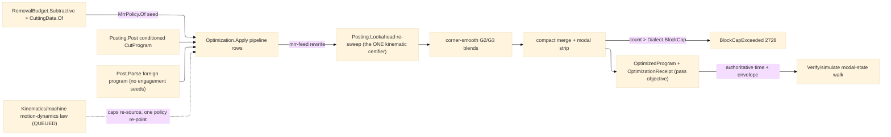

# [RASM_FABRICATION_PROGRAM_OPTIMIZATION]

The program-level optimization owner: ONE `Optimization.Apply` pass family over the `Posting/program#CUT_PROGRAM` `CutProgram` AST — MRR-adaptive feedrate, HSM corner smoothing, and block-cap compaction — rewriting an already-conditioned program toward the cycle-time objective and returning the typed before/after receipt. The pass order is LAW, a fixed semantic pipeline never a caller choice: `mrr-feed` rewrites each cutting F from the AST-altitude engagement estimate against the physics chip-load ceiling; the rewritten seeds re-certify through the ONE internal `Posting.Lookahead` kinematic sweep (a raised F is only admissible under the accel/jerk envelope that sweep owns — this page plans NO velocity profile of its own); `corner-smooth` replaces sharp G1-G1 junctions with tangent G2/G3 blend arcs inside the deviation band, raising the junction speed the smoothed profile can hold; `compact` merges collinear and co-circular runs, strips modally-redundant words where the dialect renders modal, and gates the final count against the `Process/family#PROCESS_FAMILY` `PostDialect.BlockCap` column — an overrun routes `FabricationFault.BlockCapExceeded` 2728, never a truncated program. The pass family has TWO feeds: the in-house `Run(Post)` lowering threads `Apply` between conditioning and `Emit` when the policy selects passes, and a PARSED foreign program (`Post.Parse` ingress) arrives with no engagement-aware seeds at all — the AST altitude is exactly what makes one owner serve both, and a toolpath-level re-generation for an imported program is the deleted form.

The physics inputs are composed, never re-derived: `MrrPolicy.Of` seeds from the `Process/physics#CUT_PARAMETER` `RemovalBudget.Subtractive` feed ceiling and the `Tooling/cuttingdata#CUTTING_DATA` measured chip-load cell, and the engagement estimator is junction-geometry-bound (a concave turn raises radial engagement toward slotting, a convex turn sheds it) — the toolpath-level engagement LAW stays upstream on the skeleton clearance field, this pass being the post-side corrective at the block stream. The receipt's integrated seconds are the PASS OBJECTIVE under a chord-approximate block-time fold — the authoritative cycle-time receipt is `Verify/simulate`'s modal-state execution walk, and this page never grows a second quoting surface. The accel/jerk caps the re-sweep reads ride `PostPolicy.Lookahead` today; `Kinematics/machine` HOMES the ONE motion-dynamics law (QUEUED row 18), and when it lands the caps re-source from its typed shape — one policy re-point, never a second planner here.

Wire posture: HOST-LOCAL. `Apply` transforms an in-process AST and returns an in-process receipt; the optimized program egresses through the same `CutProgram.Emit` + content-key spine `program` owns — no wire, no second emitter, no second hasher.

## [01]-[INDEX]

- [01]-[PROGRAM_OPTIMIZATION]: owns the `OptimizePass` pass axis, the `MrrPolicy`/`SmoothPolicy`/`CompactPolicy` knob rows, the `OptimizePolicy` carrier, the `PassDelta`/`OptimizationReceipt`/`OptimizedProgram` receipts, and the ONE `Optimization.Apply` fold — the ordered pass pipeline over the `CutProgram` AST, re-certified through the internal `Posting.Lookahead` sweep and gated against the dialect block cap.

## [02]-[PROGRAM_OPTIMIZATION]

- Owner: `OptimizePass` `[SmartEnum<string>]` the pass axis (`mrr-feed`/`corner-smooth`/`compact`) — selection is a `Set` toggle, ORDER is the pipeline row table's; `MrrPolicy` the feed-rewrite knobs (the `RemovalBudget.Subtractive` feed ceiling, the measured chip-load, tool diameter, nominal radial-engagement fraction, the floor/ceiling fractions bounding the rewrite) with the `Of` projection seeding from the landed physics surfaces; `SmoothPolicy` the corner-blend knobs (deviation band, minimum corner angle below which a junction stays sharp, blend-radius floor); `CompactPolicy` the merge knobs (collinear/co-circular epsilons, the modal-word strip toggle); `OptimizePolicy` the ONE carrier (pass set + knob rows + the rapid-rate time constant + the `PostPolicy` the re-sweep reads); `PassDelta` the per-pass objective row; `OptimizationReceipt` the baseline/optimized seconds + block counts + pass deltas; `OptimizedProgram` the `(CutProgram, OptimizationReceipt)` pair; `Optimization` the static surface owning `Apply` and the pipeline row table.
- Cases: `OptimizePass` rows 3, dispatched by the `Pipeline` row table — `mrr-feed` (per-block engagement estimate `e = ê·(1 − θ/π)` off the signed junction turn under the CCW-outline convention, engagement angle `φ = arccos(1 − 2e)`, feed rewrite `F' = F_budget·(φ̂/φ)` clamped to the floor/ceiling band, then the `Posting.Lookahead` re-sweep) · `corner-smooth` (interior angle `β = π − θ`; blend radius `r = δ·sin(β/2)/(1 − sin(β/2))` inside deviation `δ`; leg trim `t = r/tan(β/2)`; one G2/G3 word per smoothed junction, trim-infeasible or sub-threshold junctions stay sharp) · `compact` (collinear `Feed` runs at equal F merge to one block; consecutive same-direction co-circular arcs merge to one sweep with the I/J recomputed from the merged start; modal F/S words strip where `Dialect.Modal` renders modally; the cap gate routes 2728).
- Entry: `public static Fin<OptimizedProgram> Optimization.Apply(CutProgram program, OptimizePolicy policy)` — the ONE fold: an empty program routes `GeometryFault.DegenerateInput`, the selected passes fold in pipeline order accumulating `PassDelta` rows, and a final count over a positive `Dialect.BlockCap` routes `FabricationFault.BlockCapExceeded(dialect, blocks, cap)` — each lowered with `.ToError()`; re-invocable (idempotent at the fixed point: a second `Apply` over an optimized program converges).
- Auto: `Apply` measures the baseline seconds/blocks, folds the `Pipeline` rows the policy selects, and re-measures per pass — `mrr-feed` composes `Posting.Lookahead` (internal, the ONE sweep) so every rewritten F is kinematically reachable before smoothing sees it; `corner-smooth` only widens junction-speed feasibility (geometry change, F preserved) and `compact` only merges equal-F geometry, so neither invalidates the certificate — the pipeline order carries the proof obligation. The caller seeds `MrrPolicy.Of(budget, chipLoad, toolDiameter, engagement)` from `RemovalParameter.Budget` + `CuttingData.Of` at the policy boundary; a hand-tuned feed literal in a pass body is the named defect. The `Run(Post)` case body threads `Apply` after conditioning when `Passes` is non-empty; `Verify/simulate` re-walks the optimized program for the authoritative time and envelope verdicts; `Verify/estimation` consumes simulate's receipt, never this page's objective fold.
- Receipt: `OptimizationReceipt` — baseline/optimized integrated seconds (the chord-approximate objective, honestly named), block counts, and the ordered `PassDelta` rows; `OptimizedProgram` pairs it with the rewritten AST. The receipt IS the evidence; no generic optimization ledger.
- Packages: `Posting/program#CUT_PROGRAM` (`CutProgram`/`GWord`/`PostPolicy` + the internal `Lookahead` sweep — composed), `Process/physics#CUT_PARAMETER` (`RemovalBudget.Subtractive` — the `MrrPolicy.Of` seed), `Tooling/cuttingdata#CUTTING_DATA` (measured chip-load cell — the second `Of` seed), `Process/family#PROCESS_FAMILY` (`PostDialect.BlockCap`/`Modal` columns — composed), `Process/faults#FAULT_BAND` (`BlockCapExceeded` 2728), `Rasm.Numerics` (`GeometryFault`), Thinktecture.Runtime.Extensions, LanguageExt.Core, BCL inbox.
- Growth: a new optimization concern is one `OptimizePass` row + one `Pipeline` row + its knob record — never a second entry; a finer engagement model is columns on `MrrPolicy` (the estimator stays junction-bound until a toolpath-level engagement receipt rides the AST); the motion-dynamics re-source is one `PostPolicy.Lookahead` re-point when `Kinematics/machine` lands; zero new surface.
- Boundary: `Optimization` is the ONE AST-optimization owner and a per-pass public method family (`OptimizeFeeds`/`SmoothCorners`/`CompactBlocks`) is the deleted form — one `Apply`, pass rows; the kinematic certificate is `Posting.Lookahead`'s and a local velocity planner, a re-derived junction law, or a raised F that skips the re-sweep is the second-planner defect; the cycle-time authority is `Verify/simulate` and quoting off this receipt is the split-truth defect; machinability is composed (`Budget`/`CuttingData.Of`) and a feed table on this page is the deleted form; the THC/Z law is `Toolpath/bevel`'s and feed rewriting near a pierce never touches torch-height words; the block cap is the dialect COLUMN and a page-local cap constant is the deleted form; the pass order is the pipeline table's and a caller-ordered pass list is the rejected knob.

```csharp signature
// --- [RUNTIME_PRELUDE] ------------------------------------------------------------------------------------------------------------------------------
using LanguageExt;
using LanguageExt.Common;
using Rasm.Fabrication.Process;
using Rasm.Numerics;
using Thinktecture;
using static LanguageExt.Prelude;

namespace Rasm.Fabrication.Posting;

// --- [TYPES] ----------------------------------------------------------------------------------------------------------------------------------------
[SmartEnum<string>]
public sealed partial class OptimizePass {
    public static readonly OptimizePass MrrFeed = new("mrr-feed");
    public static readonly OptimizePass CornerSmooth = new("corner-smooth");
    public static readonly OptimizePass Compact = new("compact");
}

// --- [MODELS] ---------------------------------------------------------------------------------------------------------------------------------------
// Of() seeds from the landed physics surfaces (RemovalParameter.Budget subtractive ceiling + CuttingData.Of
// measured chip-load); the pass never re-derives machinability and never carries a feed table.
public readonly record struct MrrPolicy(
    double BudgetFeed, double ChipLoad, double ToolDiameter, double NominalEngagement, double FloorFraction, double CeilingFactor) {
    public static MrrPolicy Of(RemovalBudget.Subtractive budget, double measuredChipLoad, double toolDiameter, double nominalEngagement) =>
        new(budget.FeedRate, measuredChipLoad, toolDiameter, nominalEngagement, FloorFraction: 0.25, CeilingFactor: 1.5);
}

public readonly record struct SmoothPolicy(double MaxDeviationMm, double MinCornerRad, double BlendRadiusFloorMm) {
    public static readonly SmoothPolicy Canonical = new(MaxDeviationMm: 0.05, MinCornerRad: Math.PI / 12.0, BlendRadiusFloorMm: 0.2);
}

public readonly record struct CompactPolicy(double CollinearEpsilon, double CocircularEpsilon, bool StripModalWords) {
    public static readonly CompactPolicy Canonical = new(CollinearEpsilon: 1e-3, CocircularEpsilon: 1e-3, StripModalWords: true);
}

// Post carries the Lookahead caps the re-sweep reads — the same policy the program was conditioned with.
public sealed record OptimizePolicy(Set<OptimizePass> Passes, MrrPolicy Mrr, SmoothPolicy Smooth, CompactPolicy Compact, double RapidRate, PostPolicy Post);

public readonly record struct PassDelta(OptimizePass Pass, double SecondsDelta, int BlocksDelta);

public sealed record OptimizationReceipt(double BaselineSeconds, double OptimizedSeconds, int BaselineBlocks, int OptimizedBlocks, Seq<PassDelta> Passes);

public sealed record OptimizedProgram(CutProgram Program, OptimizationReceipt Receipt);

// --- [OPERATIONS] -----------------------------------------------------------------------------------------------------------------------------------
public static class Optimization {
    // Pass ORDER is law: mrr-feed rewrites seeds and re-certifies through the ONE Posting.Lookahead sweep;
    // corner-smooth only widens junction feasibility; compact only merges equal-F geometry — later passes
    // never invalidate the earlier certificate. Selection toggles rows; order never moves.
    static readonly Seq<(OptimizePass Pass, Func<Seq<GWord>, OptimizePolicy, PostDialect, Seq<GWord>> Fold)> Pipeline =
        Seq<(OptimizePass, Func<Seq<GWord>, OptimizePolicy, PostDialect, Seq<GWord>>)>(
            (OptimizePass.MrrFeed,      static (b, p, _) => Posting.Lookahead(MrrFeed(b, p.Mrr), p.Post)),
            (OptimizePass.CornerSmooth, static (b, p, _) => Smooth(b, p.Smooth)),
            (OptimizePass.Compact,      static (b, p, d) => Compact(b, p.Compact, d)));

    public static Fin<OptimizedProgram> Apply(CutProgram program, OptimizePolicy policy) {
        if (program.Blocks.IsEmpty) return Fin.Fail<OptimizedProgram>(GeometryFault.DegenerateInput("optimize:empty-program").ToError());
        var run = Pipeline.Filter(row => policy.Passes.Contains(row.Pass)).Fold(
            (Blocks: program.Blocks, Deltas: Seq<PassDelta>()),
            (acc, row) => {
                Seq<GWord> next = row.Fold(acc.Blocks, policy, program.Dialect);
                return (next, acc.Deltas.Add(new PassDelta(row.Pass, Seconds(next, policy) - Seconds(acc.Blocks, policy), next.Count - acc.Blocks.Count)));
            });
        int cap = program.Dialect.BlockCap;
        return cap > 0 && run.Blocks.Count > cap
            ? Fin.Fail<OptimizedProgram>(new FabricationFault.BlockCapExceeded(program.Dialect, run.Blocks.Count, cap).ToError())
            : Fin.Succ(new OptimizedProgram(
                program with { Blocks = run.Blocks },
                new OptimizationReceipt(Seconds(program.Blocks, policy), Seconds(run.Blocks, policy), program.Blocks.Count, run.Blocks.Count, run.Deltas)));
    }

    // AST-altitude engagement estimator (CCW-outline convention): a concave junction turn raises the radial
    // engagement toward slotting, a convex turn sheds it; phi = arccos(1-2e) sets the constant-chip-load feed
    // F' = F_budget·(phî/phi). The toolpath-level engagement LAW stays upstream on the skeleton clearance
    // field — this pass is the post-side corrective, and the SECOND feed is a Post.Parse foreign program.
    static Seq<GWord> MrrFeed(Seq<GWord> blocks, MrrPolicy mrr) {
        GWord[] b = blocks.ToArray();
        double eNom = Math.Clamp(mrr.NominalEngagement, 0.01, 1.0);
        double phiNom = Math.Acos(1.0 - 2.0 * eNom);
        return toSeq(Enumerable.Range(0, b.Length)).Map(k => {
            if (b[k].F.IsNone || b[k].Command == GCommand.Rapid || b[k].Command == GCommand.Pierce) return b[k];
            double e = Math.Clamp(eNom * (1.0 - SignedTurn(b, k) / Math.PI), 0.01, 1.0);
            double phi = Math.Acos(1.0 - 2.0 * e);
            double f = Math.Clamp(mrr.BudgetFeed * (phiNom / Math.Max(1e-9, phi)), mrr.FloorFraction * mrr.BudgetFeed, mrr.CeilingFactor * mrr.BudgetFeed);
            return b[k] with { F = Some(f) };
        });
    }

    // Corner blend inside the deviation band: interior angle beta = pi - turn; r = delta·sin(beta/2)/(1-sin(beta/2));
    // each leg trims by r/tan(beta/2); the junction emits ONE tangent G2/G3. Trim-infeasible junctions stay sharp.
    static Seq<GWord> Smooth(Seq<GWord> blocks, SmoothPolicy s) {
        GWord[] b = blocks.ToArray();
        Seq<GWord> outp = Seq<GWord>();
        for (int k = 0; k < b.Length; k++) {
            bool junction = k > 0 && k + 1 < b.Length && b[k].Command == GCommand.Feed && b[k + 1].Command == GCommand.Feed;
            double turn = junction ? Math.Abs(SignedTurn(b, k + 1)) : 0.0;
            if (!junction || turn < s.MinCornerRad) { outp = outp.Add(b[k]); continue; }
            double beta = Math.PI - turn, sinHalf = Math.Sin(0.5 * beta);
            double r = Math.Max(s.BlendRadiusFloorMm, s.MaxDeviationMm * sinHalf / Math.Max(1e-9, 1.0 - sinHalf));
            double trim = r / Math.Max(1e-9, Math.Tan(0.5 * beta));
            (double x, double y) p = At(b, k), prev = At(b, k - 1), next = At(b, k + 1);
            (double lin, double lout) = (Len(prev, p), Len(p, next));
            if (trim > 0.5 * lin || trim > 0.5 * lout) { outp = outp.Add(b[k]); continue; }
            (double x, double y) t1 = Along(p, prev, trim), t2 = Along(p, next, trim);
            (double x, double y) c = Bisector(p, prev, next, r, beta);
            bool ccw = SignedTurn(b, k + 1) < 0.0;
            outp = outp
                .Add(b[k] with { X = Some(t1.x), Y = Some(t1.y) })
                .Add(new GWord(ccw ? GCommand.ArcCcw : GCommand.ArcCw, Some(t2.x), Some(t2.y), b[k].Z,
                    Some(c.x - t1.x), Some(c.y - t1.y), b[k].F, None, None));
        }
        return outp;
    }

    // Merge rows: collinear equal-F Feed runs collapse; consecutive same-direction co-circular arcs collapse to
    // one sweep; modal F/S words strip where the dialect renders modally. Reduction is the merge, never a drop.
    static Seq<GWord> Compact(Seq<GWord> blocks, CompactPolicy c, PostDialect dialect) {
        GWord[] b = blocks.ToArray();
        Seq<GWord> merged = Seq<GWord>();
        for (int k = 0; k < b.Length; k++) {
            if (!merged.IsEmpty && Collinear(merged.Last, b[k], k > 0 ? b[k - 1] : b[k], c.CollinearEpsilon))
                merged = merged.Init.Add(merged.Last with { X = b[k].X, Y = b[k].Y, Z = b[k].Z });
            else if (!merged.IsEmpty && Cocircular(merged.Last, b[k], c.CocircularEpsilon))
                merged = merged.Init.Add(merged.Last with { X = b[k].X, Y = b[k].Y });
            else merged = merged.Add(b[k]);
        }
        if (!(c.StripModalWords && dialect.Modal)) return merged;
        var strip = merged.Fold((Out: Seq<GWord>(), F: Option<double>.None, S: Option<double>.None), static (st, w) => {
            GWord ww = w;
            if (ww.F.IsSome && st.F == ww.F) ww = ww with { F = None };
            if (ww.S.IsSome && st.S == ww.S) ww = ww with { S = None };
            return (st.Out.Add(ww), w.F.IsSome ? w.F : st.F, w.S.IsSome ? w.S : st.S);
        });
        return strip.Out;
    }

    // Chord-approximate objective fold — the pass metric ONLY; Verify/simulate's modal-state walk is the
    // authoritative cycle time. Dwell/pierce blocks carry seconds in the F slot per the program AST law.
    static double Seconds(Seq<GWord> blocks, OptimizePolicy p) {
        GWord[] b = blocks.ToArray();
        double t = 0.0;
        for (int k = 1; k < b.Length; k++)
            t += b[k].Command == GCommand.Rapid ? 60.0 * SpanOf(b, k) / Math.Max(1e-9, p.RapidRate)
               : b[k].Command == GCommand.Dwell || b[k].Command == GCommand.Pierce ? b[k].F.IfNone(0.0)
               : b[k].F.IsSome ? 60.0 * SpanOf(b, k) / Math.Max(1e-9, b[k].F.IfNone(1.0))
               : 0.0;
        return t;
    }

    static bool Collinear(GWord last, GWord cur, GWord prev, double eps) =>
        last.Command == GCommand.Feed && cur.Command == GCommand.Feed && last.F == cur.F
            && Cross(At2(prev), At2(last), At2(cur)) is var cz && Math.Abs(cz) < eps;

    static bool Cocircular(GWord last, GWord cur, double eps) =>
        (last.Command == GCommand.ArcCw || last.Command == GCommand.ArcCcw) && cur.Command == last.Command && last.F == cur.F
            && Math.Abs(cur.I.IfNone(0.0) + (cur.X.IfNone(0.0) - last.X.IfNone(0.0)) - last.I.IfNone(0.0)) < eps
            && Math.Abs(cur.J.IfNone(0.0) + (cur.Y.IfNone(0.0) - last.Y.IfNone(0.0)) - last.J.IfNone(0.0)) < eps;

    static double SignedTurn(GWord[] b, int k) =>
        k <= 0 || k + 1 >= b.Length ? 0.0
        : Cross(At2(b[k - 1]), At2(b[k]), At2(b[k + 1])) is var cz && Angle(b, k) is var a ? (cz >= 0.0 ? a : -a) : 0.0;

    static double Angle(GWord[] b, int k) {
        (double x, double y) p0 = At2(b[k - 1]), p1 = At2(b[k]), p2 = At2(b[k + 1]);
        (double ax, double ay, double bx, double by) = (p1.x - p0.x, p1.y - p0.y, p2.x - p1.x, p2.y - p1.y);
        double na = Math.Sqrt(ax * ax + ay * ay), nb = Math.Sqrt(bx * bx + by * by);
        return na < 1e-9 || nb < 1e-9 ? 0.0 : Math.Acos(Math.Clamp((ax * bx + ay * by) / (na * nb), -1.0, 1.0));
    }

    static double Cross((double x, double y) a, (double x, double y) p, (double x, double y) q) =>
        (p.x - a.x) * (q.y - p.y) - (p.y - a.y) * (q.x - p.x);

    static (double x, double y) At2(GWord w) => (w.X.IfNone(0.0), w.Y.IfNone(0.0));
    static (double x, double y) At(GWord[] b, int k) => At2(b[k]);
    static double Len((double x, double y) a, (double x, double y) b2) => Math.Sqrt((b2.x - a.x) * (b2.x - a.x) + (b2.y - a.y) * (b2.y - a.y));

    static (double x, double y) Along((double x, double y) from, (double x, double y) toward, double d) {
        double l = Math.Max(1e-9, Len(from, toward));
        return (from.x + d * (toward.x - from.x) / l, from.y + d * (toward.y - from.y) / l);
    }

    static (double x, double y) Bisector((double x, double y) p, (double x, double y) prev, (double x, double y) next, double r, double beta) {
        (double x, double y) u = Along(p, prev, 1.0), v = Along(p, next, 1.0);
        (double bx, double by) = (u.x - p.x + (v.x - p.x), u.y - p.y + (v.y - p.y));
        double nl = Math.Max(1e-9, Math.Sqrt(bx * bx + by * by));
        double reach = r / Math.Max(1e-9, Math.Sin(0.5 * beta));
        return (p.x + reach * bx / nl, p.y + reach * by / nl);
    }

    static double SpanOf(GWord[] b, int k) =>
        b[k].X.IfNone(0.0) is var x && b[k].Y.IfNone(0.0) is var y && b[k - 1].X.IfNone(x) is var px && b[k - 1].Y.IfNone(y) is var py
            ? Math.Max(1e-6, Math.Sqrt((x - px) * (x - px) + (y - py) * (y - py))) : 1e-6;
}
```


