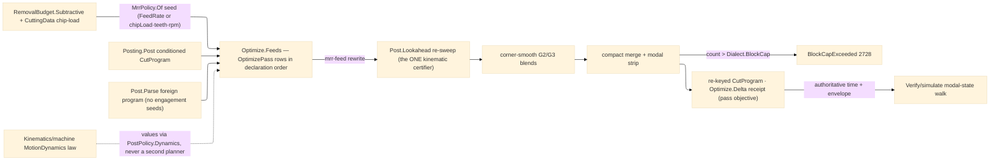

# [RASM_FABRICATION_PROGRAM_OPTIMIZATION]

The program-level optimization owner: ONE `Optimize.Feeds(CutProgram, OptimizePolicy) → Fin<CutProgram>` pass family over the `Posting/program#CUT_PROGRAM` `CutProgram` AST — MRR-adaptive feedrate, HSM corner smoothing, and block-cap compaction — rewriting an already-conditioned program toward the cycle-time objective and returning the re-keyed program on the ruled seam; the typed before/after evidence projects through `Optimize.Delta` beside the seam, never as a wrapper on it. The pass order is LAW, fixed by the `OptimizePass` DECLARATION order and executed through each row's own `[UseDelegateFromConstructor]` fold column — a separate pipeline table restating the vocabulary is the deleted form: `mrr-feed` rewrites each cutting F from the AST-altitude radial-chip-thinning estimate against the physics feed budget; the rewritten seeds re-certify through the ONE internal `Post.Lookahead` kinematic sweep (a raised F is only admissible under the accel envelope that sweep owns — this page plans NO velocity profile of its own); `corner-smooth` replaces sharp G1-G1 junctions with tangent G2/G3 blend arcs inside the deviation band; `compact` merges collinear and co-circular runs, strips modally-redundant words where the dialect renders modal, and gates the final count against the `Process/family#PROCESS_FAMILY` `PostDialect.BlockCap` column — an overrun routes `FabricationFault.BlockCapExceeded` 2728, never a truncated program. The pass family has TWO feeds: the in-house `Run(Post)` lowering threads `Feeds` between conditioning and `Emit` when the policy selects passes, and a PARSED foreign program (`Post.Parse` ingress) arrives with no engagement-aware seeds at all — the AST altitude is exactly what makes one owner serve both, and a toolpath-level re-generation for an imported program is the deleted form.

The physics inputs are composed, never re-derived: `MrrPolicy.Of` seeds from the `Process/physics#CUT_PARAMETER` `RemovalBudget.Subtractive` row — the feed budget reads `FeedRate` when the row carries one and otherwise DERIVES it as `chipLoad × teeth × SpindleRpm`, the physics-true feed law over the `Tooling/cuttingdata#CUTTING_DATA` measured chip-load cell — and the engagement estimator is junction-geometry-bound (a concave turn raises radial engagement toward slotting, a convex turn sheds it), the feed rewrite the standard radial-chip-thinning correction. The toolpath-level engagement LAW stays upstream on the skeleton clearance field; this pass is the post-side corrective at the block stream. The receipt's integrated seconds are the PASS OBJECTIVE under a chord-approximate block-time fold — the authoritative cycle-time receipt is `Verify/simulate`'s modal-state execution walk, and this page never grows a second quoting surface. The accel caps the re-sweep reads ride `PostPolicy.Dynamics` — the `Kinematics/machine` `MotionDynamics` law consumed as values, one policy re-point if its shape widens, never a second planner here.

Wire posture: HOST-LOCAL. `Feeds` transforms an in-process AST and re-keys it through the one `CutProgram.Of` mint; the optimized program egresses through the same `Post.Lower` + content-key spine `program` owns — no wire, no second emitter, no second hasher.

## [01]-[INDEX]

- [01]-[PROGRAM_OPTIMIZATION]: owns the `OptimizePass` pass axis carrying its own fold column, the `MrrPolicy`/`SmoothPolicy`/`CompactPolicy` knob rows, the `OptimizePolicy` carrier, the `PassDelta`/`OptimizationReceipt` evidence rows, and the ONE `Optimize.Feeds` fold — the declaration-ordered pass pipeline over the `CutProgram` AST (`Seq<GNode>`), re-certified through the internal `Post.Lookahead` sweep and gated against the dialect block cap, with `Optimize.Delta` the receipt projection beside the seam.

## [02]-[PROGRAM_OPTIMIZATION]

- Owner: `OptimizePass` `[SmartEnum<string>]` the pass axis (`mrr-feed`/`corner-smooth`/`compact`) — each row carries its `[UseDelegateFromConstructor]` `Fold` column, selection is a `Set` toggle, ORDER is the declaration order (`Items`); `MrrPolicy` the feed-rewrite knobs (budget feed, measured chip-load, tooth count, nominal radial-engagement fraction, floor/ceiling fractions) with the `Of` projection seeding from the landed physics surfaces and deriving the budget from `chipLoad × teeth × rpm` when the row carries no feed; `SmoothPolicy` the corner-blend knobs (deviation band, minimum corner angle, blend-radius floor); `CompactPolicy` the merge knobs (collinear/co-circular epsilons, the modal-word strip toggle); `OptimizePolicy` the ONE carrier (pass set + knob rows + the rapid-rate time constant + the `PostPolicy` the re-sweep reads); `PassDelta` the per-pass objective row; `OptimizationReceipt` the baseline/optimized seconds + block counts + pass deltas; `Optimize` the static surface owning `Feeds` and `Delta`.
- Cases: `OptimizePass` rows 3, dispatched by their own fold columns in declaration order — `mrr-feed` (engagement estimate `e = ê·(1 − θ/π)` off the signed junction turn under the CCW-outline convention; radial-chip-thinning factor `RCTF = 1/√(1 − (1 − 2e)²)`; feed rewrite `F' = F_budget·RCTF` clamped to the floor/ceiling band, then the `Post.Lookahead` re-sweep) · `corner-smooth` (interior angle `β = π − θ`; blend radius `r = δ·sin(β/2)/(1 − sin(β/2))` inside deviation `δ`; leg trim `t = r/tan(β/2)`; one G2/G3 word per smoothed junction, trim-infeasible or sub-threshold junctions stay sharp) · `compact` (collinear `Feed` runs at equal F merge to one block; consecutive same-direction co-circular arcs merge to one sweep with the I/J recomputed from the merged start; modal F/S words strip where `Dialect.Modal` renders modally; the cap gate routes 2728).
- Entry: `public static Fin<CutProgram> Optimize.Feeds(CutProgram program, OptimizePolicy policy)` — the ONE ruled fold: an empty program routes `GeometryFault.DegenerateInput`, the selected passes fold in declaration order over `program.Nodes`, the rewritten AST re-keys through `CutProgram.Of`, and a final count over a positive `Dialect.BlockCap` routes `FabricationFault.BlockCapExceeded(dialect, blocks, cap)` — each lowered with `.ToError()`; re-invocable (idempotent at the fixed point: a second `Feeds` over an optimized program converges). `public static OptimizationReceipt Optimize.Delta(CutProgram program, OptimizePolicy policy)` replays the pass pipeline over the baseline and returns the per-pass objective rows without touching the seam shape.
- Auto: `Feeds` folds the `OptimizePass.Items` rows the policy selects over `program.Nodes` — `mrr-feed` composes `Post.Lookahead` (internal, the ONE sweep) so every rewritten F is kinematically reachable before smoothing sees it; `corner-smooth` only widens junction-speed feasibility (geometry change, F preserved) and `compact` only merges equal-F geometry, so neither invalidates the certificate — the declaration order carries the proof obligation; only `GNode.Word` motion nodes rewrite, cycle/macro/subprogram/additive/NC1 interiors passing through grammar-owned. The caller seeds `MrrPolicy.Of(budget, chipLoad, teeth, engagement)` from `RemovalParameter.Budget` + `CuttingData.Of` at the policy boundary; a hand-tuned feed literal in a pass body is the named defect. The `Run(Post)` case body threads `Feeds` after conditioning when `Passes` is non-empty; `Verify/simulate` re-walks the optimized program for the authoritative time and envelope verdicts; `Verify/estimation` consumes simulate's receipt, never this page's objective fold.
- Receipt: `OptimizationReceipt` — baseline/optimized integrated seconds (the chord-approximate objective, honestly named), block counts, and the ordered `PassDelta` rows — projected by `Optimize.Delta` beside the seam; the ruled `Feeds` return stays a bare `Fin<CutProgram>`. The receipt IS the evidence; no generic optimization ledger, no result wrapper.
- Packages: `Posting/program#CUT_PROGRAM` (`CutProgram`/`GNode.Word` param algebra/`PostPolicy` + the internal `Post.Lookahead` sweep — composed), `Process/physics#CUT_PARAMETER` (`RemovalBudget.Subtractive` — the `MrrPolicy.Of` seed, `SpindleRpm` the chip-load feed derivation), `Tooling/cuttingdata#CUTTING_DATA` (measured chip-load cell — the second `Of` seed), `Process/family#PROCESS_FAMILY` (`PostDialect.BlockCap`/`Modal` columns — composed), `Process/faults#FAULT_BAND` (`BlockCapExceeded` 2728), `Rasm.Numerics` (`GeometryFault`), Thinktecture.Runtime.Extensions, LanguageExt.Core, BCL inbox.
- Growth: a new optimization concern is one `OptimizePass` row carrying its fold column plus its knob record — never a second entry; a finer engagement model is columns on `MrrPolicy` (the estimator stays junction-bound until a toolpath-level engagement receipt rides the AST); the motion-dynamics re-source is one `PostPolicy.Dynamics` re-point when `Kinematics/machine` widens its shape; zero new surface.
- Boundary: `Optimize` is the ONE AST-optimization owner and a per-pass public method family (`OptimizeFeeds`/`SmoothCorners`/`CompactBlocks`) is the deleted form — one `Feeds`, pass rows; a pipeline table restating the `OptimizePass` rows beside their fold columns is the deleted form; a public result wrapper on the ruled `Fin<CutProgram>` seam is the deleted form; the kinematic certificate is `Post.Lookahead`'s and a local velocity planner, a re-derived junction law, or a raised F that skips the re-sweep is the second-planner defect; the cycle-time authority is `Verify/simulate` and quoting off this receipt is the split-truth defect; machinability is composed (`Budget`/`CuttingData.Of`) and a feed table on this page is the deleted form; the THC/Z law is `Toolpath/bevel`'s and feed rewriting near a pierce never touches torch-height words; the block cap is the dialect COLUMN and a page-local cap constant is the deleted form; the pass order is the declaration order and a caller-ordered pass list is the rejected knob.

```csharp signature
// --- [RUNTIME_PRELUDE] ------------------------------------------------------------------------------------------------------------------------------
using LanguageExt;
using LanguageExt.Common;
using Rasm.Fabrication.Process;
using Rasm.Numerics;
using Thinktecture;
using static LanguageExt.Prelude;

namespace Rasm.Fabrication.Posting;

// --- [TYPES] ----------------------------------------------------------------------------------------------------------------------------------------
// Pass ORDER is the declaration order and each row carries its own fold: mrr-feed rewrites seeds and
// re-certifies through the ONE Post.Lookahead sweep; corner-smooth only widens junction feasibility; compact
// only merges equal-F geometry — later rows never invalidate the earlier certificate. Selection toggles rows;
// order never moves.
[SmartEnum<string>]
public sealed partial class OptimizePass {
    public static readonly OptimizePass MrrFeed = new("mrr-feed", static (n, p, _) => Post.Lookahead(Optimize.MrrFeedPass(n, p.Mrr), p.Post));
    public static readonly OptimizePass CornerSmooth = new("corner-smooth", static (n, p, _) => Optimize.SmoothPass(n, p.Smooth));
    public static readonly OptimizePass Compact = new("compact", static (n, p, d) => Optimize.CompactPass(n, p.Compact, d));

    [UseDelegateFromConstructor]
    public partial Seq<GNode> Fold(Seq<GNode> nodes, OptimizePolicy policy, PostDialect dialect);
}

// --- [MODELS] ---------------------------------------------------------------------------------------------------------------------------------------
// Of() seeds from the landed physics surfaces: FeedRate when the budget row carries one, else the
// physics-true derivation chipLoad × teeth × rpm off the measured CuttingData cell — the pass never
// re-derives machinability and never carries a feed table.
public readonly record struct MrrPolicy(
    double BudgetFeed, double ChipLoad, int Teeth, double NominalEngagement, double FloorFraction, double CeilingFactor) {
    public static MrrPolicy Of(RemovalBudget.Subtractive budget, double measuredChipLoad, int teeth, double nominalEngagement) =>
        new(budget.FeedRate > 0.0 ? budget.FeedRate : measuredChipLoad * teeth * budget.SpindleRpm,
            measuredChipLoad, teeth, nominalEngagement, FloorFraction: 0.25, CeilingFactor: 1.5);
}

public readonly record struct SmoothPolicy(double MaxDeviationMm, double MinCornerRad, double BlendRadiusFloorMm) {
    public static readonly SmoothPolicy Canonical = new(MaxDeviationMm: 0.05, MinCornerRad: Math.PI / 12.0, BlendRadiusFloorMm: 0.2);
}

public readonly record struct CompactPolicy(double CollinearEpsilon, double CocircularEpsilon, bool StripModalWords) {
    public static readonly CompactPolicy Canonical = new(CollinearEpsilon: 1e-3, CocircularEpsilon: 1e-3, StripModalWords: true);
}

// Post carries the Dynamics caps the re-sweep reads — the same policy the program was conditioned with.
public sealed record OptimizePolicy(Set<OptimizePass> Passes, MrrPolicy Mrr, SmoothPolicy Smooth, CompactPolicy Compact, double RapidRate, PostPolicy Post);

public readonly record struct PassDelta(OptimizePass Pass, double SecondsDelta, int BlocksDelta);

public sealed record OptimizationReceipt(double BaselineSeconds, double OptimizedSeconds, int BaselineBlocks, int OptimizedBlocks, Seq<PassDelta> Passes);

// --- [OPERATIONS] -----------------------------------------------------------------------------------------------------------------------------------
public static class Optimize {
    // THE ruled seam: an optimized CutProgram out for a CutProgram in — the rewritten AST re-keys through
    // CutProgram.Of so the content key follows the bytes; no wrapper rides the rail. The fold runs at the
    // CutProgram AST altitude (Seq<GNode>): only GNode.Word motion nodes rewrite — canned-cycle, macro,
    // subprogram, additive-layer, and NC1 interiors are grammar-owned and pass through untouched.
    public static Fin<CutProgram> Feeds(CutProgram program, OptimizePolicy policy) {
        if (program.Nodes.IsEmpty)
            return Fin.Fail<CutProgram>(GeometryFault.DegenerateInput("optimize:empty-program").ToError());
        Seq<GNode> optimized = toSeq(OptimizePass.Items)
            .Filter(policy.Passes.Contains)
            .Fold(program.Nodes, (acc, pass) => pass.Fold(acc, policy, program.Dialect));
        int cap = program.Dialect.BlockCap;
        return cap > 0 && optimized.Count > cap
            ? Fin.Fail<CutProgram>(new FabricationFault.BlockCapExceeded(program.Dialect, optimized.Count, cap).ToError())
            : Fin.Succ(CutProgram.Of(optimized, program.Dialect));
    }

    // Receipt PROJECTION beside the seam, never a wrapper on it: replays the selected passes over the baseline
    // and measures per-pass objective deltas; Verify/simulate stays the authoritative cycle-time walk.
    public static OptimizationReceipt Delta(CutProgram program, OptimizePolicy policy) {
        (Seq<GNode> Nodes, Seq<PassDelta> Deltas) run = toSeq(OptimizePass.Items)
            .Filter(policy.Passes.Contains)
            .Fold((program.Nodes, Seq<PassDelta>()), (acc, pass) => {
                Seq<GNode> next = pass.Fold(acc.Nodes, policy, program.Dialect);
                return (next, acc.Deltas.Add(new PassDelta(pass, Seconds(next, policy) - Seconds(acc.Nodes, policy), next.Count - acc.Nodes.Count)));
            });
        return new OptimizationReceipt(Seconds(program.Nodes, policy), Seconds(run.Nodes, policy), program.Nodes.Count, run.Nodes.Count, run.Deltas);
    }

    // AST-altitude engagement estimator (CCW-outline convention): a concave junction turn raises the radial
    // engagement toward slotting, a convex turn sheds it; the feed rewrite is the standard radial-chip-
    // thinning correction F' = F_budget · RCTF, RCTF = 1/sqrt(1-(1-2e)^2), clamped to the floor/ceiling
    // band. The toolpath-level engagement LAW stays upstream; the SECOND feed is a Post.Parse foreign program.
    internal static Seq<GNode> MrrFeedPass(Seq<GNode> nodes, MrrPolicy mrr) {
        GNode[] b = nodes.ToArray();
        double eNom = Math.Clamp(mrr.NominalEngagement, 0.01, 1.0);
        return toSeq(Enumerable.Range(0, b.Length)).Map(k =>
            b[k] is GNode.Word w && Cutting(w) && w.P('F').IsSome
                ? Rewrite(b, k, w, mrr, eNom)
                : b[k]);
    }

    static GNode Rewrite(GNode[] b, int k, GNode.Word w, MrrPolicy mrr, double eNom) {
        double e = Math.Clamp(eNom * (1.0 - (SignedTurn(b, k) / Math.PI)), 0.01, 0.99);
        double thinning = e >= 0.5 ? 1.0 : 1.0 / Math.Sqrt(1.0 - Math.Pow(1.0 - (2.0 * e), 2.0));
        double f = Math.Clamp(mrr.BudgetFeed * thinning, mrr.FloorFraction * mrr.BudgetFeed, mrr.CeilingFactor * mrr.BudgetFeed);
        return w.With('F', f);
    }

    // Corner blend inside the deviation band: interior angle beta = pi - turn; r = delta·sin(beta/2)/(1-sin(beta/2));
    // each leg trims by r/tan(beta/2); the junction emits ONE tangent G2/G3 word. Trim-infeasible junctions stay
    // sharp. Named kernel exemption: measured array-window kernel over the block stream.
    internal static Seq<GNode> SmoothPass(Seq<GNode> nodes, SmoothPolicy s) {
        GNode[] b = nodes.ToArray();
        Seq<GNode> outp = Seq<GNode>();
        for (int k = 0; k < b.Length; k++) {
            bool junction = k > 0 && k + 1 < b.Length
                && b[k] is GNode.Word cur && cur.Command == GCommand.Feed
                && b[k + 1] is GNode.Word nxt && nxt.Command == GCommand.Feed
                && At(b[k - 1]).IsSome && At(b[k]).IsSome && At(b[k + 1]).IsSome;
            double turn = junction ? Math.Abs(SignedTurn(b, k)) : 0.0;
            if (!junction || turn < s.MinCornerRad) { outp = outp.Add(b[k]); continue; }
            GNode.Word word = (GNode.Word)b[k];
            double beta = Math.PI - turn, sinHalf = Math.Sin(0.5 * beta);
            double r = Math.Max(s.BlendRadiusFloorMm, s.MaxDeviationMm * sinHalf / Math.Max(1e-9, 1.0 - sinHalf));
            double trim = r / Math.Max(1e-9, Math.Tan(0.5 * beta));
            (double x, double y) p = Pt(b, k), prev = Pt(b, k - 1), next = Pt(b, k + 1);
            (double lin, double lout) = (Len(prev, p), Len(p, next));
            if (trim > 0.5 * lin || trim > 0.5 * lout) { outp = outp.Add(b[k]); continue; }
            (double x, double y) t1 = Along(p, prev, trim), t2 = Along(p, next, trim);
            (double x, double y) c = Bisector(p, prev, next, r, beta);
            bool ccw = SignedTurn(b, k) < 0.0;
            Arr<GParam> arc = Arr(
                new GParam('X', t2.x), new GParam('Y', t2.y),
                new GParam('I', c.x - t1.x), new GParam('J', c.y - t1.y));
            outp = outp
                .Add(word.With('X', t1.x).With('Y', t1.y))
                .Add(new GNode.Word(
                    ccw ? GCommand.ArcCcw : GCommand.ArcCw,
                    word.P('F').Match(Some: f => arc.Add(new GParam('F', f)), None: () => arc)));
        }
        return outp;
    }

    // Merge rows: collinear equal-F Feed runs collapse; consecutive same-direction co-circular arcs collapse to
    // one sweep; modal F/S words strip where the dialect renders modally. Reduction is the merge, never a drop.
    // The collinearity anchor is the SURVIVOR's true predecessor, threaded across merges — the original-array
    // index is stale after the first merge. Named kernel exemption: measured array-window kernel.
    internal static Seq<GNode> CompactPass(Seq<GNode> nodes, CompactPolicy c, PostDialect dialect) {
        GNode[] b = nodes.ToArray();
        Seq<GNode> merged = Seq<GNode>();
        (double x, double y) anchor = (0.0, 0.0);
        for (int k = 0; k < b.Length; k++) {
            if (!merged.IsEmpty && merged.Last is GNode.Word last && b[k] is GNode.Word cur
                && Collinear(anchor, last, cur, c.CollinearEpsilon))
                merged = merged.Init.Add(Carry(last, cur, "XYZ"));
            else if (!merged.IsEmpty && merged.Last is GNode.Word lastArc && b[k] is GNode.Word curArc
                && Cocircular(lastArc, curArc, c.CocircularEpsilon))
                merged = merged.Init.Add(Carry(lastArc, curArc, "XY"));
            else {
                anchor = merged.Last is GNode.Word prevWord ? At((GNode)prevWord).IfNone(anchor) : anchor;
                merged = merged.Add(b[k]);
            }
        }
        return c.StripModalWords && dialect.Modal ? StripModal(merged) : merged;
    }

    static Seq<GNode> StripModal(Seq<GNode> nodes) =>
        nodes.Fold(
            (Out: Seq<GNode>(), F: Option<double>.None, S: Option<double>.None),
            static (st, node) => node is GNode.Word w
                ? StripWord(st, w)
                : (st.Out.Add(node), st.F, st.S)).Out;

    static (Seq<GNode> Out, Option<double> F, Option<double> S) StripWord((Seq<GNode> Out, Option<double> F, Option<double> S) st, GNode.Word w) {
        Option<double> f = w.P('F'), s = w.P('S');
        GNode.Word ww = w;
        if (f.IsSome && st.F == f) ww = ww.Without('F');
        if (s.IsSome && st.S == s) ww = ww.Without('S');
        return (st.Out.Add(ww), f.IsSome ? f : st.F, s.IsSome ? s : st.S);
    }

    // Chord-approximate objective fold — the pass metric ONLY; Verify/simulate's modal-state walk is the
    // authoritative cycle time. Canned cycles carry their dwell in the P slot per the program AST law.
    // Named kernel exemption: measured array-window kernel.
    static double Seconds(Seq<GNode> nodes, OptimizePolicy p) {
        GNode[] b = nodes.ToArray();
        double t = 0.0;
        for (int k = 1; k < b.Length; k++)
            t += b[k] switch {
                GNode.CannedCycle cycle => cycle.P,
                GNode.Word w when w.Command == GCommand.Rapid => 60.0 * SpanOf(b, k) / Math.Max(1e-9, p.RapidRate),
                GNode.Word w when w.Command == GCommand.Dwell => w.P('P').IfNone(0.0),
                GNode.Word w when w.P('F').IsSome => 60.0 * SpanOf(b, k) / Math.Max(1e-9, w.P('F').IfNone(1.0)),
                _ => 0.0,
            };
        return t;
    }

    static bool Cutting(GNode.Word w) =>
        w.Command == GCommand.Feed || w.Command == GCommand.ArcCw || w.Command == GCommand.ArcCcw || w.Command == GCommand.Extrude;

    static bool Collinear((double x, double y) prev, GNode.Word last, GNode.Word cur, double eps) =>
        last.Command == GCommand.Feed && cur.Command == GCommand.Feed && last.P('F') == cur.P('F')
            && At((GNode)last).IsSome && At((GNode)cur).IsSome
            && Math.Abs(Cross(prev, At((GNode)last).IfNone((0.0, 0.0)), At((GNode)cur).IfNone((0.0, 0.0)))) < eps;

    static bool Cocircular(GNode.Word last, GNode.Word cur, double eps) =>
        (last.Command == GCommand.ArcCw || last.Command == GCommand.ArcCcw)
            && cur.Command == last.Command && last.P('F') == cur.P('F')
            && Math.Abs(cur.P('I').IfNone(0.0) + (cur.P('X').IfNone(0.0) - last.P('X').IfNone(0.0)) - last.P('I').IfNone(0.0)) < eps
            && Math.Abs(cur.P('J').IfNone(0.0) + (cur.P('Y').IfNone(0.0) - last.P('Y').IfNone(0.0)) - last.P('J').IfNone(0.0)) < eps;

    // --- [BOUNDARIES] -----------------------------------------------------------------------------------------------------------------------------
    // Carry copies the named axes from the merged-away word onto the survivor; the per-word P/With/Without
    // algebra is GNode.Word's own instance surface. Non-Word nodes never reach these folds.
    static GNode.Word Carry(GNode.Word survivor, GNode.Word merged, string axes) =>
        toSeq(axes).Fold(survivor, (acc, axis) => merged.P(axis).Match(Some: v => acc.With(axis, v), None: () => acc));

    static Option<(double x, double y)> At(GNode node) =>
        node is GNode.Word w
            ? from x in w.P('X') from y in w.P('Y') select (x, y)
            : Option<(double x, double y)>.None;

    static (double x, double y) Pt(GNode[] b, int k) => At(b[k]).IfNone((0.0, 0.0));

    static double SignedTurn(GNode[] b, int k) {
        if (k <= 0 || k + 1 >= b.Length || At(b[k - 1]).IsNone || At(b[k]).IsNone || At(b[k + 1]).IsNone)
            return 0.0;
        (double x, double y) p0 = Pt(b, k - 1), p1 = Pt(b, k), p2 = Pt(b, k + 1);
        double cz = Cross(p0, p1, p2);
        double angle = Angle(p0, p1, p2);
        return cz >= 0.0 ? angle : -angle;
    }

    static double Angle((double x, double y) p0, (double x, double y) p1, (double x, double y) p2) {
        (double ax, double ay, double bx, double by) = (p1.x - p0.x, p1.y - p0.y, p2.x - p1.x, p2.y - p1.y);
        double na = Math.Sqrt((ax * ax) + (ay * ay)), nb = Math.Sqrt((bx * bx) + (by * by));
        return na < 1e-9 || nb < 1e-9 ? 0.0 : Math.Acos(Math.Clamp(((ax * bx) + (ay * by)) / (na * nb), -1.0, 1.0));
    }

    static double Cross((double x, double y) a, (double x, double y) p, (double x, double y) q) =>
        ((p.x - a.x) * (q.y - p.y)) - ((p.y - a.y) * (q.x - p.x));

    static double Len((double x, double y) a, (double x, double y) b2) =>
        Math.Sqrt(((b2.x - a.x) * (b2.x - a.x)) + ((b2.y - a.y) * (b2.y - a.y)));

    static (double x, double y) Along((double x, double y) from, (double x, double y) toward, double d) {
        double l = Math.Max(1e-9, Len(from, toward));
        return (from.x + (d * (toward.x - from.x) / l), from.y + (d * (toward.y - from.y) / l));
    }

    static (double x, double y) Bisector((double x, double y) p, (double x, double y) prev, (double x, double y) next, double r, double beta) {
        (double x, double y) u = Along(p, prev, 1.0), v = Along(p, next, 1.0);
        (double bx, double by) = (u.x - p.x + (v.x - p.x), u.y - p.y + (v.y - p.y));
        double nl = Math.Max(1e-9, Math.Sqrt((bx * bx) + (by * by)));
        double reach = r / Math.Max(1e-9, Math.Sin(0.5 * beta));
        return (p.x + (reach * bx / nl), p.y + (reach * by / nl));
    }

    static double SpanOf(GNode[] b, int k) =>
        At(b[k]).Bind(cur => At(b[k - 1]).Map(prev => Math.Max(1e-6, Len(prev, cur)))).IfNone(1e-6);
}
```


