# [RASM_FABRICATION_DERIVATION]

`Derivation.Plan` is the one `Run(Derive)` lowering, and `DerivePolicy.Admit` gates duplicate identifiers, dangling predecessors, and incompatible process-machine preferences before any stage runs. `DerivePolicy` separates assessment, routing, and full-plan evidence. `LotPolicy` admits release, due, transfer, batching, and predecessor facts. `WorkAxis` owns each modality's admission, canonical bytes, and join projection as one row.

Full-plan derivation gates procedure qualification, measurement suitability, `Cpk`, and `IT` grade before scheduling. `OperationTopology` carries source-first DAG order as admitted evidence. Each admitted joint becomes an explicit operation or routes through `JoinRouting`; an unroutable class rejects.

`LotReceipt` separates total `Work`, lap-phased critical `Chain`, calendar `Lead`, and the operations that set `CriticalPath`. `LotPolicy.TransferBuffer` releases successors after the predecessor's first transfer batch. Each instant advances through the assigned machine's `AvailabilityPlan.Finish`, and work beyond its calendar horizon rejects as `LotUnschedulable`.

`PlanDraft` threads one accumulator through the rail, and its key covers every lot, capability, topology, route, and assignment discriminant.

Wire posture: HOST-LOCAL. `FabricationPlan` crosses to the caller and `Verify/estimation`'s quote lane, while plan facts cross to the element graph through one projector registration row; stage vocabulary never sits between wire and rail.

## [01]-[INDEX]

- [01]-[DERIVATION]: `DerivationStage`, `PlanIdentitySchema`, `CapabilityGate`, `WorkAxis`, `JoinRouting`, `LotPolicy`, `CapabilityRequirement`, `LotReceipt`, `WorkKind`, `OperationDemand`, `OperationTopology`, `DerivePolicy`, `PlanDraft`, `Derivation.Plan`, and `FabricationProjector`.

## [02]-[DERIVATION]

- Owner: `DerivationStage` owns ordered ceilings; `CapabilityGate` owns execution predicates; `WorkAxis` owns every per-modality work fact; `JoinRouting` owns the join-class-to-process correspondence; `LotPolicy` owns lot timing and batching; `LotReceipt` owns the lap-phased schedule evidence; `CapabilityRequirement` owns the required gate set; `OperationDemand` and `OperationTopology` own executable work and its proven order; `DerivePolicy` owns request depth and aggregate admission; `PlanDraft` owns rail accumulation; `Derivation` owns the stage rail; and `FabricationProjector` owns graph projection.
- Cases: `WorkKind` carries cut, join, form, additive, inspection, finish, fixture, treatment, cleaning, coating, transfer, handling, packing, and hold work. `DerivePolicy.Assessment` carries lot and the full `DfmRequest`; `Routing` adds fleet and preferences; `FullPlan` adds assembly, operations, setup, and artifact intent. Without a setup plan, full-plan work groups by process in setup `0`; with one, each admitted setup expands by operation ids and then by process.
- Entry: `Plan(FabricationPolicy.Derive, FabricationInput)` admits the policy aggregate, admits DfM routing at every ceiling, gates full-plan capability, reduces the operation DAG into an `OperationTopology`, composes assembly precedence, verifies setup coverage, selects the highest-score feasible machine per step, and closes the lot against its due bound.
- Auto: `Manufacturability.Assess(DfmRequest)` supplies ranked routes, fleet supplies scored matches, `AssemblyPlan.Apply(AssemblyOp.Plan)` supplies reduced join precedence and join duration, and `SetupSchedule.Apply(SetupOp.Schedule)` partitions topologically ordered demands. Every plan-derivation rejection lowers through `Reject` onto `FabricationFault.DerivationRejected` carrying its `DeriveWitness` and the stage that raised it. `RequestedArtifacts` changes plan identity but never pretends an artifact was produced.
- Receipt: `FabricationPlan` is the derivation evidence: case-derived ceiling, DfM-ranked `Routing` rows, retained `MachineMatch` routes, admitted topology and steps, capability requirement and verdict, lot receipt, key ledger, and content key. `LotReceipt` adds availability, calendar completion, total work, critical-chain effort, the critical operation chain, the derived `Slack` between work and chain, and the derived `Queue` between lead and chain. `DfmReport` and `AssemblyPlan` remain stage-local because the terminal result carries their ranked-route and plan projections at every ceiling.
- Packages: Process exports `AdmittedComponent`, `PlannedStep`, `FabricationPlan`, `EgressKind`, and `ContentKey`; stage owners export `Manufacturability.Assess`, `Fleet.Capable`, `AvailabilityPlan.Finish`, `AssemblyPlan.Apply`, and `SetupSchedule.Apply`; QuikGraph owns DAG validation, reduction, and topological order; NodaTime owns instant and duration semantics; `Rasm.Element` owns graph projection; Thinktecture.Runtime.Extensions and LanguageExt.Core own generated values and rails.
- Growth: a rail segment is one ordered `DerivationStage` row and one fold arm; a work modality is one `WorkAxis` row with its `WorkKind` case, admission and byte projection following without a consumer edit; a join class becomes routable as one `JoinRouting` row; a route or plan fact widens the existing `FabricationPlan` receipt and canonical-byte projection; an element fact extends the existing total `Lower` arm for its owning result case.
- Boundary: `Derivation.Plan` owns orchestration, `RoutingInfeasible`, and plan identity. `TopologyOf` is the QuikGraph mutation kernel, while `KeyOf`, `Framed`, and the `Write` overloads are the canonical-byte kernel every optional slot presence-frames through. Projection keeps each fact typed on the graph — counts as `PropertyValue.Integer`, ratios as `Number`, gate outcomes as `Boolean`, dimensioned facts as SI-coerced `MeasureValue` quantities, and step and route collections as `List` of `Complex` rows — so no consumer parses a stringified number back out. DfM owns routing evidence, fleet owns machine matches, assembly owns precedence, setup owns partitions, and later `Run(Post)` and `Run(Document)` calls own artifact production.

```csharp signature
// --- [RUNTIME_PRELUDE] ----------------------------------------------------------------------------------------------------------------------------
using System.Buffers.Binary;
using System.Linq;
using System.Text;
using CommunityToolkit.HighPerformance.Buffers;
using LanguageExt;
using LanguageExt.Common;
using NodaTime;
using QuikGraph;
using QuikGraph.Algorithms;
using Rasm.Element.Graph;
using Rasm.Element.Projection;
using Rasm.Element.Properties;
using Rasm.Element.Relations;
using Rasm.Fabrication.Fixturing;
using Rasm.Fabrication.Kinematics;
using Rasm.Fabrication.Spec;
using Thinktecture;
using static LanguageExt.Prelude;
using QuantityBag = Rasm.Element.Properties.ValueBag<Rasm.Element.Properties.MeasureValue>;
using PropertyBag = Rasm.Element.Properties.ValueBag<Rasm.Element.Properties.PropertyValue>;

namespace Rasm.Fabrication.Process;

// --- [TYPES] --------------------------------------------------------------------------------------------------------------------------------------
[SmartEnum<string>]
public sealed partial class DerivationStage {
    public static readonly DerivationStage Manufacturability = new("manufacturability", order: 1);
    public static readonly DerivationStage Routing = new("routing", order: 2);
    public static readonly DerivationStage Fleet = new("fleet", order: 3);
    public static readonly DerivationStage Assembly = new("assembly", order: 4);
    public static readonly DerivationStage Operations = new("operations", order: 5);
    public static readonly DerivationStage Setup = new("setup", order: 6);
    public static readonly DerivationStage Program = new("program", order: 7);
    public static readonly DerivationStage Documentation = new("documentation", order: 8);

    public int Order { get; }
}

[SmartEnum<string>]
public sealed partial class PlanIdentitySchema {
    public static readonly PlanIdentitySchema CanonicalLittleEndian = new("fabrication-plan:canonical-little-endian");
}

[SmartEnum<string>]
public sealed partial class CapabilityGate {
    public static readonly CapabilityGate Procedure = new(
        "procedure-qualified", static verdict => verdict.ProcedureQualified);
    public static readonly CapabilityGate Measurement = new(
        "measurement-system-suitable", static verdict => verdict.MeasurementSystemSuitable);

    public Func<CapabilityVerdict, bool> Accepts { get; }
}

// --- [MODELS] -------------------------------------------------------------------------------------------------------------------------------------
[ComplexValueObject]
public sealed partial class LotPolicy {
    public int Quantity { get; }
    public int BatchSize { get; }
    public Instant Release { get; }
    public Instant Due { get; }
    public Duration TransferBuffer { get; }
    public Arr<UInt128> Predecessors { get; }
    public int BatchCount => 1 + (Quantity - 1) / BatchSize;

    public static Fin<LotPolicy> Admit(
        int quantity,
        int batchSize,
        Instant release,
        Instant due,
        Duration transferBuffer,
        Arr<UInt128> predecessors) =>
        Validate(quantity, batchSize, release, due, transferBuffer, predecessors, out LotPolicy admitted) is not null
            ? Fin.Fail<LotPolicy>(Derivation.Reject(
                new DeriveWitness.LotInadmissible(
                    quantity, batchSize, release, due, transferBuffer, predecessors), DerivationStage.Operations))
            : Fin.Succ(admitted);

    [BoundaryAdapter]
    static partial void ValidateFactoryArguments(
        ref ValidationError? validationError,
        ref int quantity,
        ref int batchSize,
        ref Instant release,
        ref Instant due,
        ref Duration transferBuffer,
        ref Arr<UInt128> predecessors) {
        if (quantity < 1 || batchSize < 1 || batchSize > quantity || due < release
            || transferBuffer < Duration.Zero || predecessors.Distinct().Count != predecessors.Count
            || predecessors.Contains(UInt128.Zero))
            validationError = new ValidationError("derive:lot");
    }
}

[ComplexValueObject]
public sealed partial class CapabilityRequirement {
    public double MinimumCpk { get; }
    public int DemandedItGrade { get; }
    public Set<CapabilityGate> Gates { get; }

    [BoundaryAdapter]
    static partial void ValidateFactoryArguments(
        ref ValidationError? validationError,
        ref double minimumCpk,
        ref int demandedItGrade,
        ref Set<CapabilityGate> gates) {
        if (!double.IsFinite(minimumCpk) || minimumCpk <= 0.0 || demandedItGrade < 1)
            validationError = new ValidationError("derive:capability-requirement");
    }
}

[ComplexValueObject]
public sealed partial class LotReceipt {
    public Instant Available { get; }
    public Instant Completion { get; }
    public Duration Work { get; }
    public Duration Chain { get; }
    public Seq<int> CriticalPath { get; }
    public int Batches { get; }

    // Effort, concurrency, and calendar are three separate facts: total effort never falls below the critical
    // chain and their gap is the concurrency the plan admits, while queue is the closed time the shop calendar
    // and committed load impose on that chain. A 24/7 fleet drives Queue to zero; no other reading of Lead does.
    public Duration Lead => Completion - Available;
    public Duration Slack => Work - Chain;
    public Duration Queue => Lead - Chain;

    [BoundaryAdapter]
    static partial void ValidateFactoryArguments(
        ref ValidationError? validationError,
        ref Instant available,
        ref Instant completion,
        ref Duration work,
        ref Duration chain,
        ref Seq<int> criticalPath,
        ref int batches) {
        if (completion < available || work < Duration.Zero || chain < Duration.Zero || chain > work
            || completion - available < chain || batches < 1
            || (chain > Duration.Zero && criticalPath.IsEmpty)
            || criticalPath.Distinct().Count != criticalPath.Count)
            validationError = new ValidationError("derive:lot-receipt");
    }
}

// One vocabulary carries every per-case work fact the plan needs: the admission predicate, the canonical
// byte projection, and the join-connection projection. Adding a modality touches this table and nothing else.
[SmartEnum<string>]
public sealed partial class WorkAxis {
    public static readonly WorkAxis Cut = Of<WorkKind.Cut>(
        "cut", static _ => true, static (sink, row) => Write(sink, row.Operation.Key));
    public static readonly WorkAxis Join = Of<WorkKind.Join>(
        "join", static row => row.Connection >= 0, static (sink, row) => Write(sink, row.Connection),
        static row => Some(row.Connection));
    public static readonly WorkAxis Form = Of<WorkKind.Form>(
        "form", static row => row.Feature >= 0, static (sink, row) => Write(sink, row.Feature));
    public static readonly WorkAxis Additive = Of<WorkKind.Additive>(
        "additive", static row => row.Region >= 0, static (sink, row) => Write(sink, row.Region));
    public static readonly WorkAxis Inspect = Of<WorkKind.Inspect>(
        "inspect", static row => Named(row.Feature), static (sink, row) => Write(sink, row.Feature));
    public static readonly WorkAxis Finish = Of<WorkKind.Finish>(
        "finish", static row => Named(row.Specification), static (sink, row) => Write(sink, row.Specification));
    public static readonly WorkAxis Fixture = Of<WorkKind.Fixture>(
        "fixture", static row => row.Setup >= 0, static (sink, row) => Write(sink, row.Setup));
    public static readonly WorkAxis Treat = Of<WorkKind.Treat>(
        "treat", static row => Named(row.Specification), static (sink, row) => Write(sink, row.Specification));
    public static readonly WorkAxis Clean = Of<WorkKind.Clean>(
        "clean", static row => Named(row.Standard), static (sink, row) => Write(sink, row.Standard));
    public static readonly WorkAxis Coat = Of<WorkKind.Coat>(
        "coat", static row => Named(row.Specification), static (sink, row) => Write(sink, row.Specification));
    public static readonly WorkAxis Transfer = Of<WorkKind.Transfer>(
        "transfer", static row => Named(row.From) && Named(row.To) && row.From != row.To,
        static (sink, row) => { Write(sink, row.From); Write(sink, row.To); });
    public static readonly WorkAxis Handle = Of<WorkKind.Handle>(
        "handle", static row => Named(row.Resource), static (sink, row) => Write(sink, row.Resource));
    public static readonly WorkAxis Pack = Of<WorkKind.Pack>(
        "pack", static row => Named(row.Specification), static (sink, row) => Write(sink, row.Specification));
    public static readonly WorkAxis Hold = Of<WorkKind.Hold>(
        "hold", static row => Named(row.Reason), static (sink, row) => Write(sink, row.Reason));

    public Func<WorkKind, bool> Admits { get; }
    public Action<ArrayPoolBufferWriter<byte>, WorkKind> Project { get; }
    public Func<WorkKind, Option<int>> Connection { get; }

    private static WorkAxis Of<TWork>(
        string key,
        Func<TWork, bool> admits,
        Action<ArrayPoolBufferWriter<byte>, TWork> project,
        Func<TWork, Option<int>>? connection = null)
        where TWork : WorkKind =>
        new(key,
            work => work is TWork typed && admits(typed),
            (sink, work) => { if (work is TWork typed) { Write(sink, key); project(sink, typed); } },
            work => work is TWork typed ? (connection?.Invoke(typed) ?? None) : None);

    private static bool Named(string value) => !string.IsNullOrWhiteSpace(value);

    private static void Write(ArrayPoolBufferWriter<byte> sink, int value) => Derivation.Write(sink, value);
    private static void Write(ArrayPoolBufferWriter<byte> sink, string value) => Derivation.Write(sink, value);
}

[Union(ConversionFromValue = ConversionOperatorsGeneration.None)]
public abstract partial record WorkKind(WorkAxis Axis) {
    public sealed record Cut(Operation Operation) : WorkKind(WorkAxis.Cut);
    public sealed record Join(int Connection) : WorkKind(WorkAxis.Join);
    public sealed record Form(int Feature) : WorkKind(WorkAxis.Form);
    public sealed record Additive(int Region) : WorkKind(WorkAxis.Additive);
    public sealed record Inspect(string Feature) : WorkKind(WorkAxis.Inspect);
    public sealed record Finish(string Specification) : WorkKind(WorkAxis.Finish);
    public sealed record Fixture(int Setup) : WorkKind(WorkAxis.Fixture);
    public sealed record Treat(string Specification) : WorkKind(WorkAxis.Treat);
    public sealed record Clean(string Standard) : WorkKind(WorkAxis.Clean);
    public sealed record Coat(string Specification) : WorkKind(WorkAxis.Coat);
    public sealed record Transfer(string From, string To) : WorkKind(WorkAxis.Transfer);
    public sealed record Handle(string Resource) : WorkKind(WorkAxis.Handle);
    public sealed record Pack(string Specification) : WorkKind(WorkAxis.Pack);
    public sealed record Hold(string Reason) : WorkKind(WorkAxis.Hold);
}

// Assembly classifies a joint physically; the plan must state which admitted process executes it. A class
// with no admitted ProcessKind raises a typed rejection instead of being silently dropped from the DAG.
[SmartEnum<string>]
public sealed partial class JoinRouting {
    public static readonly JoinRouting Weld = new("weld", JoinClass.Weld, ProcessKind.Weld);
    public static readonly JoinRouting Braze = new("braze", JoinClass.Braze, ProcessKind.Braze);
    public static readonly JoinRouting Solder = new("solder", JoinClass.Solder, ProcessKind.Braze);
    public static readonly JoinRouting Adhesive = new("adhesive", JoinClass.Adhesive, ProcessKind.Adhesive);

    public JoinClass Class { get; }
    public ProcessKind Process { get; }

    public static Option<JoinRouting> For(JoinClass joinClass) =>
        Optional(Items.FirstOrDefault(row => row.Class == joinClass));
}

[ComplexValueObject]
public sealed partial class OperationDemand {
    public int Id { get; }
    public WorkKind Work { get; }
    public ProcessKind Process { get; }
    public int Quantity { get; }
    public Duration UnitDuration { get; }
    public Duration SetupDuration { get; }
    public Set<int> Predecessors { get; }
    public Seq<ContentKey> Evidence { get; }

    public static Fin<OperationDemand> Admit(
        int id,
        WorkKind work,
        ProcessKind process,
        int quantity,
        Duration unitDuration,
        Duration setupDuration,
        Set<int> predecessors,
        Seq<ContentKey> evidence) =>
        Validate(id, work, process, quantity, unitDuration, setupDuration, predecessors, evidence, out OperationDemand admitted) is { } error
            ? Fin.Fail<OperationDemand>(Derivation.Reject(new DeriveWitness.DemandInadmissible(id), DerivationStage.Operations))
            : Fin.Succ(admitted);

    internal static Fin<OperationDemand> Join(int id, int connection, ProcessKind process, Duration duration) =>
        Admit(id, new WorkKind.Join(connection), process, 1, duration, Duration.Zero, Set<int>(), Seq<ContentKey>());

    internal Fin<OperationDemand> Reprecede(Set<int> predecessors) =>
        Admit(Id, Work, Process, Quantity, UnitDuration, SetupDuration, predecessors, Evidence);

    internal Fin<OperationDemand> WithPredecessors(Set<int> predecessors) =>
        Reprecede(Predecessors + predecessors);

    // Setup is paid once per transfer batch; unit work scales with the whole lot.
    internal Duration DurationFor(LotPolicy lot) =>
        SetupDuration * lot.BatchCount + UnitDuration * ((long)Quantity * lot.Quantity);

    // Lap phasing releases the successor as soon as the first transfer batch clears, never the whole lot.
    internal Duration FirstBatchFor(LotPolicy lot) =>
        SetupDuration + UnitDuration * ((long)Quantity * Math.Min(lot.BatchSize, lot.Quantity));

    [BoundaryAdapter]
    static partial void ValidateFactoryArguments(
        ref ValidationError? validationError,
        ref int id,
        ref WorkKind work,
        ref ProcessKind process,
        ref int quantity,
        ref Duration unitDuration,
        ref Duration setupDuration,
        ref Set<int> predecessors,
        ref Seq<ContentKey> evidence) {
        if (id < 0 || work is null || process is null || quantity < 1
            || unitDuration <= Duration.Zero || setupDuration < Duration.Zero
            || predecessors.Contains(id) || !work.Axis.Admits(work))
            validationError = new ValidationError("derive:operation-demand");
    }
}

// Reduced DAG source-first order is the invariant every downstream fold reads, so it travels as
// evidence rather than as an ordering convention a bare Seq cannot state.
[ComplexValueObject]
public sealed partial class OperationTopology {
    public Seq<OperationDemand> Ordered { get; }
    public Map<int, OperationDemand> ById => toMap(Ordered.Map(static demand => (demand.Id, demand)));

    public bool IsEmpty => Ordered.IsEmpty;
    public int Count => Ordered.Count;

    [BoundaryAdapter]
    static partial void ValidateFactoryArguments(
        ref ValidationError? validationError,
        ref Seq<OperationDemand> ordered) {
        // Each element reads the pre-add frontier, so a predecessor appearing later fails the fold.
        bool sourceFirst = ordered.Fold(
            (Seen: Set<int>(), Ordered: true),
            static (state, demand) => (
                state.Seen.Add(demand.Id),
                state.Ordered && demand.Predecessors.ForAll(state.Seen.Contains))).Ordered;
        if (!sourceFirst || ordered.Map(static demand => demand.Id).Distinct().Count != ordered.Count)
            validationError = new ValidationError("derive:operation-topology");
    }
}

[Union(ConversionFromValue = ConversionOperatorsGeneration.None)]
public abstract partial record DerivePolicy(LotPolicy Lot, DfmRequest Dfm) {
    public sealed record Assessment(LotPolicy Lot, DfmRequest Dfm) : DerivePolicy(Lot, Dfm);
    public sealed record Routing(
        LotPolicy Lot,
        DfmRequest Dfm,
        MachineFleet Fleet,
        Option<ProcessKind> PreferProcess,
        Option<Machine> PreferMachine) : DerivePolicy(Lot, Dfm);
    public sealed record FullPlan(
        LotPolicy Lot,
        DfmRequest Dfm,
        MachineFleet Fleet,
        Option<AssemblyOp.Plan> Assembly,
        Seq<OperationDemand> Operations,
        Map<UInt128, Instant> PredecessorCompletion,
        CapabilityRequirement Capability,
        Option<SetupPlan> Setups,
        Option<ProcessKind> PreferProcess,
        Option<Machine> PreferMachine,
        Set<EgressKind> RequestedArtifacts) : DerivePolicy(Lot, Dfm);

    public DerivationStage Ceiling => Switch(
        assessment: static _ => DerivationStage.Manufacturability,
        routing: static _ => DerivationStage.Fleet,
        fullPlan: static _ => DerivationStage.Setup);

    // Structural admission runs once for the whole request; no stage re-checks the aggregate downstream.
    public static Fin<DerivePolicy> Admit(DerivePolicy candidate) =>
        candidate.Switch<Fin<DerivePolicy>>(
            state: candidate,
            assessment: static (self, _) => Fin.Succ(self),
            routing: static (self, row) => Pairing(row.PreferProcess, row.PreferMachine).Map(_ => self),
            fullPlan: static (self, row) => Seq(
                    Duplicate(row.Operations).Match(
                        id => Gate<Unit>(new DeriveWitness.DuplicateOperation(id)),
                        static () => Fin.Succ(unit).ToValidation()),
                    Dangling(row.Operations).Match(
                        pair => Gate<Unit>(new DeriveWitness.UnknownPredecessor(pair.Operation, pair.Predecessor)),
                        static () => Fin.Succ(unit).ToValidation()),
                    Pairing(row.PreferProcess, row.PreferMachine).ToValidation())
                .Traverse(static gate => gate).As().ToFin().Map(_ => self));

    private static Option<int> Duplicate(Seq<OperationDemand> operations) =>
        operations.Fold(
            (Seen: Set<int>(), Found: Option<int>.None),
            static (state, demand) => state.Found.IsSome
                ? state
                : state.Seen.Contains(demand.Id)
                    ? (state.Seen, Some(demand.Id))
                    : (state.Seen.Add(demand.Id), state.Found)).Found;

    private static Option<(int Operation, int Predecessor)> Dangling(Seq<OperationDemand> operations) {
        Set<int> ids = operations.Map(static demand => demand.Id).ToSet();
        return operations
            .Bind(demand => demand.Predecessors.Filter(id => !ids.Contains(id))
                .Map(id => (Operation: demand.Id, Predecessor: id)).ToSeq())
            .HeadOrNone();
    }

    private static Fin<Unit> Pairing(Option<ProcessKind> process, Option<Machine> machine) =>
        (from admitted in process from instance in machine select (Process: admitted, Machine: instance))
            .Filter(static pair => !pair.Machine.Admits(pair.Process))
            .Match(
                Some: static pair => Fin.Fail<Unit>(FabricationFault.InadmissiblePair(
                    new RelationFault.ProcessMachine(pair.Process, pair.Machine))),
                None: static () => Fin.Succ(unit));

    private static Validation<Error, T> Gate<T>(DeriveWitness witness) =>
        Fin.Fail<T>(Derivation.Reject(witness, DerivationStage.Operations)).ToValidation();
}

// PlanDraft threads one value through the rail instead of eleven positional arguments.
public sealed record PlanDraft(
    AdmittedComponent Component,
    DerivationStage Ceiling,
    LotPolicy Lot,
    Set<EgressKind> RequestedArtifacts,
    Option<CapabilityVerdict> Capability,
    Seq<ProcessKind> Routing,
    Seq<MachineMatch> Matches,
    OperationTopology Topology,
    Seq<PlannedStep> Steps,
    Option<SetupSchedule> Setups,
    Option<CapabilityRequirement> Requirement,
    Option<LotReceipt> LotReceipt) {
    public static PlanDraft Of(AdmittedComponent component, FabricationInput input, DerivePolicy policy) =>
        new(component, policy.Ceiling, policy.Lot,
            policy is DerivePolicy.FullPlan full ? full.RequestedArtifacts : Set<EgressKind>(),
            input.Capability, Seq<ProcessKind>(), Seq<MachineMatch>(),
            OperationTopology.Create(Seq<OperationDemand>()),
            Seq<PlannedStep>(), None, None, None);

    public PlanDraft With(
        Seq<ProcessKind>? routing = null,
        Seq<MachineMatch>? matches = null,
        OperationTopology? topology = null,
        Seq<PlannedStep>? steps = null,
        Option<SetupSchedule>? setups = null,
        Option<CapabilityRequirement>? requirement = null,
        Option<LotReceipt>? lotReceipt = null) =>
        this with {
            Routing = routing ?? Routing,
            Matches = matches ?? Matches,
            Topology = topology ?? Topology,
            Steps = steps ?? Steps,
            Setups = setups ?? Setups,
            Requirement = requirement ?? Requirement,
            LotReceipt = lotReceipt ?? LotReceipt,
        };
}

// --- [OPERATIONS] ---------------------------------------------------------------------------------------------------------------------------------
public static class Derivation {
    public static Fin<FabricationResult> Plan(FabricationPolicy.Derive policy, FabricationInput input) =>
        from request in DerivePolicy.Admit(policy.Policy)
        from dfm in Manufacturability.Assess(request.Dfm)
        from _ in policy.Component.RepresentationKey == dfm.ComponentKey
            ? Fin.Succ(unit)
            : Fin.Fail<Unit>(Reject(
                new DeriveWitness.ComponentMismatch(policy.Component.RepresentationKey, dfm.ComponentKey),
                DerivationStage.Manufacturability))
        from result in request.Switch<Fin<FabricationResult>>(
            state: (Component: policy.Component, Input: input, Dfm: dfm),
            assessment: static (state, row) =>
                from routed in RouteOf(state.Dfm, state.Component, None)
                select Compose(PlanDraft.Of(state.Component, state.Input, row).With(routing: routed)),
            routing: static (state, row) =>
                from routed in RouteOf(state.Dfm, state.Component, row.PreferProcess)
                from matches in MatchOf(state.Component, row.Fleet, routed, row.PreferMachine)
                select Compose(PlanDraft.Of(state.Component, state.Input, row).With(routing: routed, matches: matches)),
            fullPlan: static (state, row) =>
                from routed in RouteOf(state.Dfm, state.Component, row.PreferProcess)
                from capability in CapabilityOf(state.Input.Capability, row.Capability, routed.Head)
                from matches in MatchOf(state.Component, row.Fleet, routed, row.PreferMachine)
                from joins in JoinsOf(state.Component, row.Assembly)
                from operations in OperationsOf(row.Operations, joins)
                from topology in TopologyOf(operations)
                from setups in SetupsOf(row.Setups, topology)
                from steps in StepsOf(state.Component, matches, topology, setups)
                from lot in LotOf(row.Lot, state.Component, topology, matches, row.PredecessorCompletion)
                select Compose(PlanDraft.Of(state.Component, state.Input, row)
                    .With(routing: routed, matches: matches, topology: topology, setups: setups,
                          steps: steps, requirement: Some(row.Capability), lotReceipt: Some(lot))))
        select result;

    // Every plan-derivation rejection lowers onto the one typed fault carrying its witness and its stage.
    internal static Error Reject(DeriveWitness witness, DerivationStage stage) =>
        FabricationFault.DerivationRejected(witness, new FaultSubject.Stage(stage.Key));

    private static Fin<Seq<ProcessKind>> RouteOf(
        DfmReport dfm,
        AdmittedComponent component,
        Option<ProcessKind> preferred) {
        Seq<ProcessKind> routed = preferred.Match(p => dfm.Routing.Filter(r => r == p), () => dfm.Routing);
        return routed.IsEmpty
            ? Fin.Fail<Seq<ProcessKind>>(FabricationFault.RoutingInfeasible(
                component.RepresentationKey, new FaultSubject.Stage(DerivationStage.Routing.Key)))
            : Fin.Succ(routed);
    }

    private static Fin<CapabilityVerdict> CapabilityOf(
        Option<CapabilityVerdict> admitted,
        CapabilityRequirement required,
        ProcessKind process) =>
        admitted.ToFin(FabricationFault.CapabilityShortfall(process, 0.0, required.MinimumCpk))
            .Bind(verdict => verdict.Cpk >= required.MinimumCpk
                && verdict.DemandedCpk >= required.MinimumCpk
                && verdict.DemandedItGrade <= required.DemandedItGrade
                && required.Gates.ForAll(gate => gate.Accepts(verdict))
                    ? Fin.Succ(verdict)
                    : Fin.Fail<CapabilityVerdict>(FabricationFault.CapabilityShortfall(
                        process, verdict.Cpk, required.MinimumCpk)));

    private static Fin<Seq<MachineMatch>> MatchOf(
        AdmittedComponent component,
        MachineFleet fleet,
        Seq<ProcessKind> routed,
        Option<Machine> preferred) =>
        from matches in Fleet.Capable(component, fleet)
          let admitted = matches
              .Filter(static match => match.Checks.Feasible)
              .Filter(match => routed.Contains(match.Process))
              .Filter(match => preferred.Match(machine => match.Instance.Kind == machine, static () => true))
          from nonEmpty in admitted.IsEmpty
              ? Fin.Fail<Seq<MachineMatch>>(FabricationFault.RoutingInfeasible(
                  component.RepresentationKey, new FaultSubject.Stage(DerivationStage.Fleet.Key)))
              : Fin.Succ(admitted)
          select nonEmpty;

    // Every admitted joint becomes an operation: an explicit demand claims it, otherwise the joint's own
    // JoinProcess class routes to an admitted ProcessKind. A class with no route rejects rather than vanishes.
    private static Fin<Seq<OperationDemand>> OperationsOf(
        Seq<OperationDemand> explicitOperations,
        Option<AssemblyPlan> joins) {
        Seq<(int Connection, int Demand)> claimed = explicitOperations
            .Bind(demand => demand.Work.Axis.Connection(demand.Work).Map(connection => (Connection: connection, Demand: demand.Id)).ToSeq());
        long next = explicitOperations.IsEmpty
            ? 0L
            : (long)explicitOperations.Map(static demand => demand.Id).Max() + 1L;
        Seq<AssemblyJoint> unclaimed = joins
            .Map(plan => plan.Joints.Filter(joint => !claimed.Exists(row => row.Connection == joint.Index)))
            .IfNone(Seq<AssemblyJoint>());
        if (next + unclaimed.Count > int.MaxValue)
            return Fin.Fail<Seq<OperationDemand>>(Reject(
                new DeriveWitness.IdentifierExhausted(next, unclaimed.Count), DerivationStage.Operations));
        Seq<(AssemblyJoint Joint, int Demand)> allocated = unclaimed
            .Zip(Range(0, unclaimed.Count), (joint, ordinal) => (Joint: joint, Demand: (int)next + ordinal));
        Seq<(int Connection, int Demand)> demandOf = claimed
            + allocated.Map(static row => (Connection: row.Joint.Index, row.Demand));
        return allocated
            .TraverseM(row =>
                from routing in JoinRouting.For(row.Joint.Specification.Process.Class)
                    .ToFin(Reject(new DeriveWitness.JoinReceiptMissing(row.Joint.Index), DerivationStage.Assembly))
                from duration in joins.Bind(plan => plan.Receipts
                    .Find(receipt => receipt.Joint == row.Joint.Index)
                    .Map(static receipt => receipt.Duration))
                    .ToFin(Reject(new DeriveWitness.JoinReceiptMissing(row.Joint.Index), DerivationStage.Assembly))
                from demand in OperationDemand.Join(row.Demand, row.Joint.Index, routing.Process, duration)
                from ordered in demand.WithPredecessors(joins.Map(plan => plan.Precedence
                    .Filter(edge => edge.Target.Joint == row.Joint.Index && edge.Source.Joint != row.Joint.Index)
                    .Bind(edge => demandOf.Filter(value => value.Connection == edge.Source.Joint)
                        .Map(static value => value.Demand))
                    .ToSet()).IfNone(Set<int>()))
                select ordered)
            .As()
            .Map(rows => explicitOperations + rows)
            .Bind(rows => rows.IsEmpty
                ? Fin.Fail<Seq<OperationDemand>>(Reject(new DeriveWitness.OperationsEmpty(unclaimed.Count), DerivationStage.Operations))
                : Fin.Succ(rows));
    }

    private static Fin<OperationTopology> TopologyOf(Seq<OperationDemand> operations) {
        BidirectionalGraph<int, SEdge<int>> graph = new();
        graph.AddVertexRange(operations.Map(static demand => demand.Id));
        graph.AddEdgeRange(operations.Bind(demand => demand.Predecessors
            .Map(predecessor => new SEdge<int>(predecessor, demand.Id))));
        if (!graph.IsDirectedAcyclicGraph())
            return Fin.Fail<OperationTopology>(Reject(
                new DeriveWitness.OperationCycle(graph.VertexCount, graph.EdgeCount), DerivationStage.Operations));
        BidirectionalGraph<int, SEdge<int>> reduced = graph.ComputeTransitiveReduction();
        Map<int, OperationDemand> byId = toMap(operations.Map(static demand => (demand.Id, demand)));
        return reduced.SourceFirstTopologicalSort().ToSeq()
            .TraverseM(id =>
                from demand in byId.Find(id).ToFin(Reject(new DeriveWitness.OperationAbsent(id), DerivationStage.Operations))
                from reducedDemand in demand.Reprecede(reduced.InEdges(id).Map(static edge => edge.Source).ToSet())
                select reducedDemand)
            .As()
            .Map(static rows => rows.ToSeq())
            .Map(static ordered => OperationTopology.Create(ordered));
    }

    // One assignment rule serves step projection and lot scheduling; a second spelling would let the machine
    // machine promised by the schedule differ from the machine the program posts to.
    private static Option<MachineMatch> AssignedTo(Seq<MachineMatch> matches, ProcessKind process) =>
        matches
            .Filter(match => match.Process == process && match.Checks.Feasible)
            .OrderByDescending(static match => match.Score)
            .ThenBy(static match => match.Instance.Id)
            .ToSeq()
            .HeadOrNone();

    // Lap phasing is the transfer semantics LotPolicy admits: a successor starts once its predecessor's first
    // transfer batch clears the buffer, so batching shortens lead time without shortening total work. Every
    // instant advances through the assigned machine's AvailabilityPlan, so effort lands on the shop calendar
    // at that machine's committed load rather than on a fictional continuously-staffed clock.
    private static Fin<LotReceipt> LotOf(
        LotPolicy lot,
        AdmittedComponent component,
        OperationTopology topology,
        Seq<MachineMatch> matches,
        Map<UInt128, Instant> predecessorCompletion) =>
        from completed in lot.Predecessors
            .TraverseM(key => predecessorCompletion.Find(key)
                .ToFin(Reject(new DeriveWitness.PredecessorLotMissing(key), DerivationStage.Operations)))
            .As()
        let available = completed.Map(predecessor => predecessor + lot.TransferBuffer)
            .Fold(lot.Release, static (current, transferred) => transferred > current ? transferred : current)
        from timeline in topology.Ordered.Fold(
            Fin.Succ((Ends: Map<int, (Instant Release, Seq<int> Chain, Duration Effort)>(), Work: Duration.Zero,
                      Chain: Duration.Zero, Completion: available, Critical: Seq<int>(), CriticalTail: int.MaxValue)),
            (accumulated, operation) => accumulated.Bind(state =>
                from plan in AssignedTo(matches, operation.Process)
                    .Map(static match => match.Instance.Availability)
                    .ToFin(FabricationFault.RoutingInfeasible(
                        component.RepresentationKey, new FaultSubject.Stage(DerivationStage.Fleet.Key)))
                let effort = operation.DurationFor(lot)
                let ready = operation.Predecessors.Fold(
                    (At: available, Chain: Seq<int>(), Effort: Duration.Zero, Tail: int.MaxValue),
                    (best, predecessor) => state.Ends.Find(predecessor)
                        .Filter(row => Outranks(row.Release, row.Effort, predecessor, best.At, best.Effort, best.Tail))
                        .Map(row => (At: row.Release, row.Chain, row.Effort, Tail: predecessor))
                        .IfNone(best))
                from finish in plan.Finish(ready.At, effort)
                    .ToFin(Reject(new DeriveWitness.LotUnschedulable(operation.Id, ready.At, effort),
                        DerivationStage.Operations))
                from release in plan.Finish(ready.At, operation.FirstBatchFor(lot))
                    .Map(cleared => cleared + lot.TransferBuffer)
                    .ToFin(Reject(new DeriveWitness.LotUnschedulable(operation.Id, ready.At, effort),
                        DerivationStage.Operations))
                let chained = ready.Effort + effort
                let path = ready.Chain + Seq(operation.Id)
                let wins = Outranks(finish, chained, operation.Id,
                    state.Completion, state.Chain, state.CriticalTail)
                select (
                    Ends: state.Ends.Add(operation.Id, (release, path, chained)),
                    Work: state.Work + effort,
                    Chain: wins ? chained : state.Chain,
                    Completion: wins ? finish : state.Completion,
                    Critical: wins ? path : state.Critical,
                    CriticalTail: wins ? operation.Id : state.CriticalTail)))
        from admitted in timeline.Completion <= lot.Due
            ? Fin.Succ(LotReceipt.Create(available, timeline.Completion, timeline.Work, timeline.Chain,
                timeline.Critical, lot.BatchCount))
            : Fin.Fail<LotReceipt>(Reject(
                new DeriveWitness.LotOverdue(timeline.Completion, lot.Due), DerivationStage.Operations))
        select admitted;

    private static bool Outranks(
        Instant candidateAt,
        Duration candidateEffort,
        int candidateOperation,
        Instant heldAt,
        Duration heldEffort,
        int heldOperation) =>
        candidateAt > heldAt
        || candidateAt == heldAt && (candidateEffort > heldEffort
            || candidateEffort == heldEffort && candidateOperation < heldOperation);

    private static Fin<Option<SetupSchedule>> SetupsOf(Option<SetupPlan> policy, OperationTopology topology) =>
        topology.IsEmpty
            ? Fin.Succ(Option<SetupSchedule>.None)
            : policy.Match(
                Some: plan => SetupSchedule.Apply(new SetupOp.Schedule(plan))
                    .Bind(result => result is SetupResult.Scheduled(var schedule)
                        ? Covers(schedule, topology)
                            ? Fin.Succ(Some(schedule))
                            : Fin.Fail<Option<SetupSchedule>>(Reject(new DeriveWitness.SetupCoverage(
                                schedule.Setups.Bind(static setup => setup.Operations).Count, topology.Count),
                                DerivationStage.Setup))
                        : Fin.Fail<Option<SetupSchedule>>(Reject(
                            new DeriveWitness.SetupCoverage(0, topology.Count), DerivationStage.Setup))),
                None: () => Fin.Succ(Option<SetupSchedule>.None));

    private static bool Covers(SetupSchedule schedule, OperationTopology topology) {
        Arr<int> assigned = schedule.Setups.Bind(static setup => setup.Operations).ToArr();
        return assigned.Count == topology.Count && assigned.Distinct().Count == assigned.Count
            && assigned.ForAll(topology.ById.ContainsKey);
    }

    private static Fin<Option<AssemblyPlan>> JoinsOf(
        AdmittedComponent component,
        Option<AssemblyOp.Plan> request) =>
        request.Match(
            Some: value => AssemblyPlan.Apply(value).Bind(result => result is AssemblyResult.Planned(var plan)
                && plan.Members.Exists(member => member.Component.RepresentationKey == component.RepresentationKey)
                    ? Fin.Succ(Some(plan))
                    : Fin.Fail<Option<AssemblyPlan>>(Reject(
                        new DeriveWitness.AssemblyMismatch(component.RepresentationKey), DerivationStage.Assembly))),
            None: () => component.Connections.IsEmpty
                ? Fin.Succ(Option<AssemblyPlan>.None)
                : Fin.Fail<Option<AssemblyPlan>>(Reject(
                    new DeriveWitness.AssemblyRequired(component.Connections.Count), DerivationStage.Assembly)));

    private static FabricationResult Compose(PlanDraft draft) =>
        new FabricationResult.FabricationPlan(
            draft.Ceiling,
            draft.Routing,
            draft.Matches,
            draft.Steps,
            draft.Topology,
            draft.Requirement,
            draft.LotReceipt,
            draft.Capability,
            draft.RequestedArtifacts,
            Seq<ContentKey>(),
            KeyOf(draft));

    private static Fin<Seq<PlannedStep>> StepsOf(
        AdmittedComponent component,
        Seq<MachineMatch> matches,
        OperationTopology topology,
        Option<SetupSchedule> setups) {
        Seq<(int Setup, Arr<int> Operations)> partitions = setups.Match(
            Some: schedule => Range(0, schedule.Setups.Count)
                .Map(index => (Setup: index, Operations: schedule.Setups[index].Operations))
                .ToSeq(),
            None: () => Seq((Setup: 0, Operations: topology.Ordered.Map(static demand => demand.Id).ToArr())));
        Seq<(int Setup, ProcessKind Process, Arr<int> Operations)> work = partitions.Bind(partition =>
            topology.Ordered
                .Filter(demand => partition.Operations.Contains(demand.Id))
                .Map(static demand => demand.Process)
                .Distinct()
                .Map(process => (
                    partition.Setup,
                    Process: process,
                    Operations: topology.Ordered
                        .Filter(demand => partition.Operations.Contains(demand.Id) && demand.Process == process)
                        .Map(static demand => demand.Id)
                        .ToArr())));
        return work.Zip(Range(0, work.Count), static (row, order) => (row, order))
            .Traverse(row => AssignedTo(matches, row.row.Process)
                .ToFin(FabricationFault.RoutingInfeasible(
                    component.RepresentationKey, new FaultSubject.Stage(DerivationStage.Fleet.Key)))
                .Bind(match => PlannedStep.Admit(row.order, row.row.Process, match.Instance.Kind,
                    row.row.Setup, row.row.Operations, None)))
            .As()
            .Map(static steps => steps.ToSeq());
    }

    private static ContentKey KeyOf(PlanDraft draft) {
        using ArrayPoolBufferWriter<byte> writer = new();
        Write(writer, PlanIdentitySchema.CanonicalLittleEndian.Key);
        Write(writer, draft.Component.RepresentationKey);
        Write(writer, draft.Ceiling.Key);
        Write(writer, draft.Routing.Count);
        foreach (ProcessKind process in draft.Routing) Write(writer, process.Key);
        Write(writer, draft.Lot.Quantity);
        Write(writer, draft.Lot.BatchSize);
        Write(writer, draft.Lot.Release.ToUnixTimeTicks());
        Write(writer, draft.Lot.Due.ToUnixTimeTicks());
        Write(writer, draft.Lot.TransferBuffer.ToTimeSpan().Ticks);
        Write(writer, draft.Lot.Predecessors.Count);
        foreach (UInt128 predecessor in draft.Lot.Predecessors.Order()) Write(writer, predecessor);
        Write(writer, draft.RequestedArtifacts.Count);
        foreach (EgressKind artifact in draft.RequestedArtifacts.OrderBy(static kind => kind.Key)) Write(writer, artifact.Key);
        Write(writer, draft.Topology.Count);
        foreach (OperationDemand demand in draft.Topology.Ordered) Write(writer, demand);
        Write(writer, draft.Matches.Count);
        foreach (MachineMatch route in draft.Matches.OrderBy(static route => route.Instance.Id).ThenBy(static route => route.Process.Key)) Write(writer, route);
        Write(writer, draft.Steps.Count);
        foreach (PlannedStep step in draft.Steps.OrderBy(static step => step.Order)) Write(writer, step);
        WriteOptional(draft.Capability, draft.Requirement, draft.LotReceipt, writer);
        return ContentKey.Of(EgressKind.Plan, writer.WrittenSpan);
    }

    // Each optional slot frames its own presence flag so a missing verdict never shifts a later field's bytes.
    private static void WriteOptional(
        Option<CapabilityVerdict> capability,
        Option<CapabilityRequirement> requirement,
        Option<LotReceipt> lotReceipt,
        ArrayPoolBufferWriter<byte> writer) {
        Framed(writer, capability, static (sink, value) => {
            Write(sink, value.Cpk);
            Write(sink, value.DemandedCpk);
            Write(sink, value.DemandedItGrade);
            Write(sink, value.ProcedureQualified ? 1 : 0);
            Write(sink, value.MeasurementSystemSuitable ? 1 : 0);
        });
        Framed(writer, requirement, static (sink, value) => {
            Write(sink, value.MinimumCpk);
            Write(sink, value.DemandedItGrade);
            Write(sink, value.Gates.Count);
            foreach (CapabilityGate gate in value.Gates.OrderBy(static gate => gate.Key)) Write(sink, gate.Key);
        });
        Framed(writer, lotReceipt, static (sink, value) => {
            Write(sink, value.Available.ToUnixTimeTicks());
            Write(sink, value.Completion.ToUnixTimeTicks());
            Write(sink, value.Work.ToTimeSpan().Ticks);
            Write(sink, value.Chain.ToTimeSpan().Ticks);
            Write(sink, value.CriticalPath.Count);
            foreach (int operation in value.CriticalPath) Write(sink, operation);
            Write(sink, value.Batches);
        });
    }

    private static void Framed<T>(ArrayPoolBufferWriter<byte> writer, Option<T> slot, Action<ArrayPoolBufferWriter<byte>, T> project) =>
        slot.Match(
            Some: value => { Write(writer, 1); project(writer, value); return unit; },
            None: () => { Write(writer, 0); return unit; });

    internal static void Write(ArrayPoolBufferWriter<byte> writer, OperationDemand demand) {
        Write(writer, demand.Id);
        Write(writer, demand.Process.Key);
        Write(writer, demand.Quantity);
        Write(writer, demand.UnitDuration.ToTimeSpan().Ticks);
        Write(writer, demand.SetupDuration.ToTimeSpan().Ticks);
        Write(writer, demand.Predecessors.Count);
        foreach (int predecessor in demand.Predecessors.Order()) Write(writer, predecessor);
        Write(writer, demand.Evidence.Count);
        foreach (ContentKey evidence in demand.Evidence.OrderBy(static key => key.Kind.Key).ThenBy(static key => key.Digest)) Write(writer, evidence);
        demand.Work.Axis.Project(writer, demand.Work);
    }

    internal static void Write(ArrayPoolBufferWriter<byte> writer, PlannedStep step) {
        Write(writer, step.Order);
        Write(writer, step.Process.Key);
        Write(writer, step.Machine.Key);
        Write(writer, step.Setup);
        Write(writer, step.Operations.Count);
        foreach (int operation in step.Operations.Order()) Write(writer, operation);
        step.Program.Match(
            Some: key => { Write(writer, 1); Write(writer, key); return unit; },
            None: () => { Write(writer, 0); return unit; });
    }

    internal static void Write(ArrayPoolBufferWriter<byte> writer, MachineMatch route) {
        Write(writer, route.Instance.Id);
        Write(writer, route.Instance.Kind.Key);
        Write(writer, route.Process.Key);
        Write(writer, route.Checks.Facts.Count);
        foreach (CapabilityFact fact in route.Checks.Facts
            .OrderBy(static value => value.Criterion.Key)
            .ThenBy(static value => value.Switch(
                satisfied: static row => row.Locus,
                rejected: static row => row.Locus))) {
            Write(writer, fact.Criterion.Key);
            (double Demand, double Available, DemandUnit Unit, string Locus) evidence = fact.Switch(
                satisfied: static row => (row.Demand, row.Available, row.Unit, row.Locus),
                rejected: static row => (row.Demand, row.Available, row.Unit, row.Locus));
            Write(writer, fact.Pass ? 1 : 0);
            Write(writer, evidence.Demand);
            Write(writer, evidence.Available);
            Write(writer, evidence.Unit.Key);
            Write(writer, evidence.Locus);
        }
        Write(writer, route.EnvelopeHeadroom);
        Write(writer, route.GradeMargin);
        Write(writer, route.Score);
    }

    internal static void Write(ArrayPoolBufferWriter<byte> writer, ContentKey key) {
        Write(writer, key.Kind.Key);
        Write(writer, key.Digest);
    }

    internal static void Write(ArrayPoolBufferWriter<byte> writer, UInt128 value) {
        Span<byte> span = writer.GetSpan(16);
        BinaryPrimitives.WriteUInt64LittleEndian(span, (ulong)value);
        BinaryPrimitives.WriteUInt64LittleEndian(span[8..], (ulong)(value >> 64));
        writer.Advance(16);
    }

    internal static void Write(ArrayPoolBufferWriter<byte> writer, double value) =>
        Write(writer, BitConverter.DoubleToInt64Bits(value == 0.0 ? 0.0 : value));

    internal static void Write(ArrayPoolBufferWriter<byte> writer, long value) {
        BinaryPrimitives.WriteInt64LittleEndian(writer.GetSpan(8), value);
        writer.Advance(8);
    }

    internal static void Write(ArrayPoolBufferWriter<byte> writer, int value) {
        BinaryPrimitives.WriteInt32LittleEndian(writer.GetSpan(4), value);
        writer.Advance(4);
    }

    internal static void Write(ArrayPoolBufferWriter<byte> writer, string value) {
        int length = Encoding.UTF8.GetByteCount(value);
        Write(writer, length);
        Encoding.UTF8.GetBytes(value, writer.GetSpan(length));
        writer.Advance(length);
    }
}

// --- [COMPOSITION] ----------------------------------------------------------------------------------------------------------------------------------
// Every projected fact keeps its type on the graph: counts are Integer, ratios and scores are Number, flags are
// Boolean, dimensioned facts are SI-coerced MeasureValue quantities, and collections are List of Complex rows.
// Stringifying a typed fact into Text is the deleted form — it forfeits the seam's own value vocabulary.
public sealed class FabricationProjector(Seq<(NodeId Element, FabricationResult Fact)> facts) : IElementProjection {
    private static readonly Dimension Dimensionless = Dimension.Create(0, 0, 0, 0, 0, 0, 0);
    private static readonly Dimension LengthDim = Dimension.Create(1, 0, 0, 0, 0, 0, 0);
    private static readonly Dimension AreaDim = Dimension.Create(2, 0, 0, 0, 0, 0, 0);
    private static readonly Dimension VolumeDim = Dimension.Create(3, 0, 0, 0, 0, 0, 0);
    private static readonly Dimension TimeDim = Dimension.Create(0, 0, 1, 0, 0, 0, 0);

    public Fin<GraphDelta> Project(ProjectionContext ctx) =>
        facts.Filter(fact => ctx.Owns(fact.Element))
            .Traverse(fact => Lower(fact.Element, fact.Fact, ctx.Header.Tolerance).ToValidation())
            .As()
            .Map(deltas => deltas.Fold(GraphDelta.Empty.Reheader(ctx.Header), static (acc, delta) => acc.Merge(delta)))
            .ToFin();

    private static Fin<GraphDelta> Lower(NodeId element, FabricationResult fact, double tolerance) => fact.Switch(
        state: (Element: element, Tolerance: tolerance),
        hiddenLineResult: static (state, hidden) => Emit(state, "HiddenLine", Seq(
            Count("Visible", hidden.Visible.Count),
            Count("Hidden", hidden.Hidden.Count),
            Count("Silhouette", hidden.Silhouette.Count))),
        motion: static (state, motion) => Emit(state, "Motion", Seq(
                Count("Moves", motion.Moves.Count),
                Count("JointSamples", motion.Joints.Count),
                Count("CellRecords", motion.CellCode.Count)),
            Seq(("Duration", TimeDim, motion.Duration))),
        placement: static (state, nest) => Emit(state, "Placement", Seq(
                Count("Parts", nest.Parts.Count),
                Ratio("Utilization", nest.Utilization),
                Count("Unplaced", nest.Unplaced),
                Count("Remnants", nest.Remnants.Count),
                Token("Key", nest.Key)),
            Seq(("NestWasteArea", AreaDim,
                nest.Remnants.Sum(static remnant => remnant.AreaMm2) / 1e6))),
        additiveResult: static (state, additive) => Emit(state, "Additive", Seq(
            Count("Moves", additive.Moves.Count),
            Count("Layers", additive.Layers),
            Count("Artifacts", additive.Artifacts.Count))),
        verificationResult: static (state, verification) => Emit(state, "Verification", Seq(
                Count("Snapshots", verification.Snapshots.Count),
                Count("Gouges", verification.Gouges.Count),
                Ratio("AirCutRatio", verification.AirCutRatio),
                Token("ResidualKey", verification.Residual.Key)),
            Seq(("UncutVolume", VolumeDim, verification.UncutVolume / 1e9),
                ("OvercutVolume", VolumeDim, verification.OvercutVolume / 1e9))),
        inspectionResult: static (state, inspection) => Emit(state, "Inspection", Seq(
                Count("Features", inspection.Features.Count),
                Count("Accepted", inspection.Features.Count(static feature => feature.Pass.Exists(static pass => pass))),
                Count("Rejected", inspection.Features.Count(static feature => feature.Pass.Exists(static pass => !pass)))),
            Seq(("MaxDeviation", LengthDim,
                inspection.Features.Fold(0.0, static (maximum, feature) => Math.Max(maximum, feature.DeviationMm)) / 1e3))),
        postedProgram: static (state, program) => Emit(state, "Program", Seq(
            Count("Blocks", program.Blocks.Count),
            Token("Key", program.Key))),
        travelerDocument: static (state, traveler) => Emit(state, "Traveler", Seq(
            Count("ComposedArtifacts", traveler.Composed.Count),
            Token("Key", traveler.Key))),
        fabricationPlan: static (state, plan) => Emit(
            state,
            "Plan",
            PlanRows(plan),
            PlanQuantities(plan)),
        formedResult: static (state, formed) => Emit(state, "Formed", Seq(
                Count("FlatLoops", formed.FlatPattern.Count),
                Count("Bends", formed.Bends.Count),
                Token("Key", formed.Key)),
            Seq(("SpringbackMax", Dimensionless, formed.SpringbackMaxDeg * Math.PI / 180.0))));

    private static Seq<(string Key, PropertyValue Value)> PlanRows(FabricationResult.FabricationPlan plan) =>
        Seq(
            Token("Ceiling", plan.Ceiling.Key),
            ("Routing", (PropertyValue)new PropertyValue.List(plan.Routing.Map(static process => (PropertyValue)new PropertyValue.Text(process.Key)))),
            Token("PlanKey", plan.Key),
            ("RequestedArtifacts", (PropertyValue)new PropertyValue.List(plan.RequestedArtifacts
                .OrderBy(static artifact => artifact.Key)
                .Map(static artifact => (PropertyValue)new PropertyValue.Text(artifact.Key))
                .ToSeq())),
            ("Steps", (PropertyValue)new PropertyValue.List(plan.Steps.OrderBy(static step => step.Order).Map(static step =>
                Complex("Step", Seq(
                    Count("Order", step.Order),
                    Token("Process", step.Process.Key),
                    Token("Machine", step.Machine.Key),
                    Count("Setup", step.Setup),
                    ("Operations", (PropertyValue)new PropertyValue.List(
                        step.Operations.Map(static operation => Count(operation)).ToSeq()))))).ToSeq())),
            ("Routes", (PropertyValue)new PropertyValue.List(plan.Routes.Map(static route =>
                Complex("Route", Seq(
                    Token("Instance", route.Instance.Id),
                    Token("Process", route.Process.Key),
                    Ratio("Score", route.Score)))))),
            ("Topology", (PropertyValue)new PropertyValue.List(plan.Topology.Ordered.Map(static demand =>
                Complex("Operation", Seq(
                    Count("Id", demand.Id),
                    Token("Process", demand.Process.Key),
                    Count("Quantity", demand.Quantity),
                    ("Predecessors", (PropertyValue)new PropertyValue.List(
                        demand.Predecessors.Order().Map(static predecessor => Count(predecessor)).ToSeq())))))))) +
        plan.Capability.Match(
            Some: static verdict => Seq(
                Ratio("CapabilityCpk", verdict.Cpk),
                Ratio("CapabilityDemandedCpk", verdict.DemandedCpk),
                Count("CapabilityItGrade", verdict.DemandedItGrade),
                Flag("ProcedureQualified", verdict.ProcedureQualified),
                Flag("MeasurementSystemSuitable", verdict.MeasurementSystemSuitable)),
            None: static () => Seq<(string, PropertyValue)>()) +
        plan.Requirement.Match(
            Some: static requirement => Seq(
                Ratio("RequiredCpk", requirement.MinimumCpk),
                Count("RequiredItGrade", requirement.DemandedItGrade),
                ("RequiredGates", (PropertyValue)new PropertyValue.List(requirement.Gates
                    .OrderBy(static gate => gate.Key)
                    .Map(static gate => (PropertyValue)new PropertyValue.Text(gate.Key))
                    .ToSeq()))),
            None: static () => Seq<(string, PropertyValue)>()) +
        plan.LotReceipt.Match(
            Some: static lot => Seq(
                ("LotAvailableTicks", (PropertyValue)new PropertyValue.Integer(lot.Available.ToUnixTimeTicks())),
                ("LotCompletionTicks", (PropertyValue)new PropertyValue.Integer(lot.Completion.ToUnixTimeTicks())),
                Count("LotBatches", lot.Batches),
                ("LotCriticalPath", (PropertyValue)new PropertyValue.List(
                    lot.CriticalPath.Map(static operation => Count(operation)).ToSeq()))),
            None: static () => Seq<(string, PropertyValue)>());

    private static Seq<(string Key, Dimension Dimension, double Si)> PlanQuantities(FabricationResult.FabricationPlan plan) =>
        plan.LotReceipt.Match(
            Some: static lot => Seq(
                ("LotWork", TimeDim, lot.Work.ToTimeSpan().Ticks / (double)TimeSpan.TicksPerSecond),
                ("LotChain", TimeDim, lot.Chain.ToTimeSpan().Ticks / (double)TimeSpan.TicksPerSecond),
                ("LotLead", TimeDim, lot.Lead.ToTimeSpan().Ticks / (double)TimeSpan.TicksPerSecond),
                ("LotSlack", TimeDim, lot.Slack.ToTimeSpan().Ticks / (double)TimeSpan.TicksPerSecond),
                ("LotQueue", TimeDim, lot.Queue.ToTimeSpan().Ticks / (double)TimeSpan.TicksPerSecond)),
            None: static () => Seq<(string, Dimension, double)>());

    private static (string Key, PropertyValue Value) Count(string key, int value) =>
        (key, new PropertyValue.Integer(value));

    private static PropertyValue Count(int value) => new PropertyValue.Integer(value);

    private static (string Key, PropertyValue Value) Ratio(string key, double value) =>
        (key, new PropertyValue.Number(value));

    private static (string Key, PropertyValue Value) Flag(string key, bool value) =>
        (key, new PropertyValue.Boolean(value));

    private static (string Key, PropertyValue Value) Token(string key, string value) =>
        (key, new PropertyValue.Text(value));

    private static (string Key, PropertyValue Value) Token(string key, ContentKey value) =>
        (key, new PropertyValue.Text($"{value.Kind.Key}:{value.Digest:x32}"));

    private static PropertyValue Complex(string usage, Seq<(string Key, PropertyValue Value)> rows) =>
        new PropertyValue.Complex(usage, toMap(rows.Map(static row => (PropertyName.Create(row.Key), row.Value))));

    private static Fin<GraphDelta> Emit(
        (NodeId Element, double Tolerance) state,
        string set,
        Seq<(string Key, PropertyValue Value)> properties) =>
        Emit(state, set, properties, Seq<(string, Dimension, double)>());

    // Dimensioned rows ride the QuantitySet; every other row rides the PropertySet, and an SI coercion that
    // rejects a non-finite magnitude fails the whole projection rather than dropping the fact silently.
    private static Fin<GraphDelta> Emit(
        (NodeId Element, double Tolerance) state,
        string set,
        Seq<(string Key, PropertyValue Value)> properties,
        Seq<(string Key, Dimension Dimension, double Si)> quantities) =>
        quantities
            .Traverse(row => MeasureValue.OfSi(row.Dimension, row.Si).Map(measure => (row.Key, Measure: measure)))
            .As()
            .Map(measures => {
                GraphDelta authored = Author(state.Element, new Node.PropertySet(
                    NodeId.Content(ReadOnlySpan<byte>.Empty),
                    properties.Fold(
                        PropertyBag.Empty($"Rasm_Fabrication_{set}", InheritanceMode.OccurrenceWins, PropertySource.Derived),
                        static (bag, row) => bag.With(PropertyName.Create(row.Key), row.Value))), state.Tolerance);
                return measures.IsEmpty
                    ? authored
                    : authored.Merge(Author(state.Element, new Node.QuantitySet(
                        NodeId.Content(ReadOnlySpan<byte>.Empty),
                        measures.Fold(
                            QuantityBag.Empty($"Rasm_Fabrication_{set}", InheritanceMode.OccurrenceWins, PropertySource.Derived),
                            static (bag, row) => bag.With(PropertyName.Create(row.Key), row.Measure))), state.Tolerance));
            });

    private static GraphDelta Author(NodeId element, Node draft, double tolerance) {
        Node node = draft.Relabel(NodeId.Content(draft.ToCanonicalBytes(tolerance)));
        return GraphDelta.Empty.Put(node).Link(new Relationship.Assign(element, node.Id, AssignKind.PropertyDefinition));
    }
}
```

```mermaid
---
config:
  theme: base
  look: classic
  layout: elk
  flowchart:
    curve: linear
    padding: 25
  themeVariables:
    darkMode: true
    fontFamily: "SF Mono, Menlo, Cascadia Mono, Segoe UI Mono, Consolas, monospace"
    useGradient: false
    dropShadow: "none"
    background: "#282A36"
    primaryColor: "#44475A"
    primaryTextColor: "#F8F8F2"
    primaryBorderColor: "#BD93F9"
    lineColor: "#FF79C6"
    textColor: "#F8F8F2"
    edgeLabelBackground: "#21222C"
    labelBackgroundColor: "#21222C"
  themeCSS: ".nodeLabel{font-size:13px;font-weight:500}.edgeLabel{font-size:12px;font-weight:500}.cluster-label .nodeLabel{font-size:13.5px;font-weight:700;letter-spacing:.08em}.edge-thickness-normal{stroke-width:2px}.edge-thickness-thick{stroke-width:3px}.edge-pattern-dashed,.edge-pattern-dotted{stroke-width:1.5px;stroke-dasharray:4 6}.node rect,.node circle,.node polygon,.node path,.node .outer-path{stroke-width:1.5px;filter:none!important}.cluster rect{stroke-width:1px!important;stroke-dasharray:5 4!important;filter:none!important}.marker path{transform:scale(.8);transform-origin:5px 5px}.marker circle{transform:scale(.48);transform-origin:5px 5px}.edgeLabel rect{transform-box:fill-box;transform-origin:center;transform:scale(1.1,1.2)}"
---
flowchart LR
    accTitle: Fabrication derivation rail
    accDescr: A derive request admits once as an aggregate, then advances through manufacturability, routing, fleet matching, capability, assembly join routing, operation topology, setup coverage, machine assignment, and lap-phased lot feasibility before one canonical plan draft mints the plan key and feeds estimation and typed element projection.
    Derive["owner Run(Derive) landed arm"] --> Admit["DerivePolicy.Admit — duplicates, dangling predecessors, preferred pair"]
    Admit --> Plan["Derivation.Plan stage rail"]
    Plan -->|1 manufacturability| Dfm["Spec/manufacturability Assess → DfmReport.Routing"]
    Plan -->|2 routing PreferProcess filter| Routed["ranked ProcessKind rows"]
    Plan -->|3 fleet| Matches["Kinematics/fleet Fleet.Capable → MachineMatch"]
    Plan -->|4 assembly depth-gated| Joins["Fixturing/assembly AssemblyPlan.Apply → AssemblyPlan"]
    Joins -->|"JoinProcess.Class → JoinRouting.Process"| Operations["OperationDemand — explicit plus every unclaimed joint"]
    Operations -->|reduced DAG, source-first order proven| Topology["OperationTopology"]
    Topology -->|"6 setup SetupSchedule.Apply(SetupOp.Schedule)"| Setup["SetupSchedule — exact coverage"]
    Setup --> Steps["ranked PlannedStep rows"]
    Topology -->|lap-phased transfer batching| Lot["LotReceipt — available, completion, work, lead, critical path"]
    Plan -.->|outside derive ceiling| Post["Run(Post) emits later"]
    Plan -.->|outside derive ceiling| Doc["Run(Document) composes later"]
    Routed --> Draft["PlanDraft accumulator"]
    Matches --> Draft
    Steps --> Draft
    Lot --> Draft
    Draft -->|KeyOf canonical bytes| Compose["FabricationPlan(topology, steps, requirement, lot, capability, requests, artifacts, key)"]
    Compose -->|quote lane| Estimate["Verify/estimation Estimate.Of"]
    Compose -->|plan facts| Projector["FabricationProjector : IElementProjection — one app-wired registration row"]
    Projector -->|"GraphDelta — Integer, Number, Boolean, Measure, List rows"| Graph["Rasm.Element graph"]
    Capability["CapabilityVerdict + CapabilityRequirement"] -->|full-plan gate| Plan
    classDef primary fill:#44475A,stroke:#FF79C6,color:#F8F8F2
    classDef success fill:#50FA7BBF,stroke:#50FA7B,color:#282A36
    classDef data fill:#FFB86CBF,stroke:#FFB86C,color:#282A36
    classDef boundary fill:#282A36,stroke:#BD93F9,color:#F8F8F2
    class Plan,Admit,Dfm,Routed,Matches,Joins,Operations,Topology,Setup,Steps,Lot primary
    class Draft,Compose,Estimate,Projector success
    class Capability data
    class Derive,Post,Doc,Graph boundary
```


