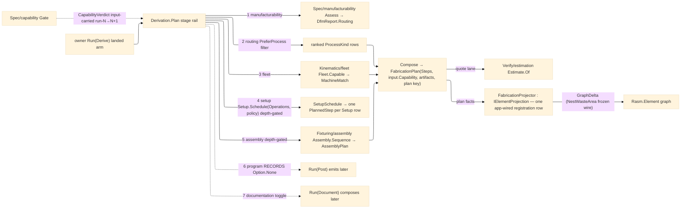

# [RASM_FABRICATION_DERIVATION]

The plan-derivation orchestrator: `Derivation.Plan` the ONE `Run(Derive)` lowering — a typed stage rail manufacturability → routing → fleet → setup → assembly → program → documentation folded as ONE `Fin`-bound expression, each stage a fold over its owning plane's entry, the whole pipeline depth-gated by the `DeriveDepth` policy row (`assess-only` stops after the DfM gate, `route` after the fleet match, `full-plan` runs the rail to documentation intent). Every `DerivePolicy` column is LIVE: `Quantity` gates degenerate lots typed and rides the plan-key census, `Document` rides the census as recorded traveler intent, and the setup stage composes `Fixturing/setups` `Setup.Schedule` when `Operations`+`Setups` carry the schedule inputs — an inert policy member is the named defect this rail forbids. The stage vocabulary is the `DerivationStage` `[SmartEnum<string>]` — seven ordered rows, ONE per rail segment — and it is fault-load-bearing: `FabricationFault.RoutingInfeasible` 2730 carries the exhausted stage row, so a component that passes DfM but matches no machine fails typed AT `fleet`, never as a silent empty plan. The rail ORCHESTRATES and never re-derives: process routing is `Spec/manufacturability`'s verdict (this rail consumes the `DfmReport` routing rows), machine matching is `Kinematics/fleet`'s join (`Fleet.Capable` — the EMPTY match set is fleet's valid verdict and THIS page's fault), the setup partition is `Fixturing/setups`' fold (its 2717/2726/2727 faults pass through unre-cased), join precedence is `Fixturing/assembly`'s graph (`Assembly.Sequence`), and the plan RECORDS rather than emits — every `PlannedStep.Program` key stays `Option.None` until `Run(Post)` runs over a produced `Motion`; a derivation that invokes posting intra-run is the deleted form. The capability gate stays input-carried: the rail READS `input.Capability` onto the plan and NEVER invokes `Capability.Gate` intra-run — the spec→plan→verify→capability loop closes run-N→run-N+1 exactly as `ResidualStock` does, the standing cycle-break restated, never re-opened.

The result is the owner's `FabricationResult.FabricationPlan` — `Seq<PlannedStep>` (primary-process step from the ranked `MachineMatch` head under the `PreferProcess`/`PreferMachine` policy overrides, plus one weld step per THERMAL final join re-classified through the public `JoinClass.Classify` over the component's `ComponentConnection` rows), the input-carried `Option<CapabilityVerdict>`, the artifact key ledger (EMPTY at derivation — egress stages append as they run), and the plan's own `ContentKey` under the `plan` egress row. The page also REALIZES the deferred cross-package growth seam: `FabricationProjector : IElementProjection` — the seam interface `Project(ProjectionContext) → Fin<GraphDelta>` (`Rasm.Element` `Projection/projection#IElementProjection`), registered as ONE row in the app-wired `Seq<IElementProjection>` that `ProjectionAssembly.Assemble` folds (the registration lives in app wiring by the seam's own law; the Materials `ComponentProjector` is the peer exemplar at `Projection/component#[05]`). The projector is the REVERSE direction of the `Ingress/element` seam — element.md READS the graph through `ElementGraph.Bake` into `AdmittedComponent`, the projector LOWERS fabrication facts back onto the graph as a `ctx.Owns`-gated `GraphDelta` monoid fold over `(NodeId, FabricationResult)` pairs: a `FabricationPlan` fact authors a content-addressed `Node.PropertySet` (plan key + step census) bound by `Relationship.Assign(element, node, AssignKind.PropertyDefinition)`, a `Placement` fact authors a `Node.QuantitySet` whose `NestWasteArea` row stays the frozen SI-m² wire key Compute decodes (`MeasureValue.OfSi` over the remnant area sum) — content-addressed nodes so re-projection dedups, every other result case lowering nothing.

Wire posture: HOST-LOCAL. The plan crosses only the in-process seam — `FabricationPlan` to the caller and `Verify/estimation`'s quote lane (`Estimate.Of` prices the composed plan; derivation never prices), plan facts to the element graph through the ONE projector registration row; the stage vocabulary never sits between wire and rail.

## [01]-[INDEX]

- [01]-[DERIVATION]: owns the `DerivationStage` seven-row stage vocabulary, the `DeriveDepth` ceiling policy, the `DerivePolicy` carrier the owner `Derive` case threads, the `Derivation.Plan` stage rail composing manufacturability/fleet/assembly and recording setup/program/documentation intent, and the `FabricationProjector : IElementProjection` registration row — the one plan-derivation surface `owner#run`'s landed `derive` arm lowers to.

## [02]-[DERIVATION]

- Owner: `DerivationStage` `[SmartEnum<string>]` the ordered stage vocabulary (`manufacturability`/`routing`/`fleet`/`setup`/`assembly`/`program`/`documentation`, each carrying `Order`) — fault-payload load-bearing on `RoutingInfeasible` 2730; `DeriveDepth` `[SmartEnum<string>]` the ceiling policy (`assess-only`→manufacturability, `route`→fleet, `full-plan`→documentation), `Admits(stage)` the one gating relation; `DerivePolicy` the case carrier — depth, target quantity (gated ≥ 1, census-carried), the shop `MachineFleet`, the `DfmPolicy`/`AssemblyPolicy` plane policies threaded through, the setup-stage inputs (`Seq<Operation> Operations` + `Option<SchedulePolicy<Operation>> Setups` — empty inputs keep the single-setup posture), `PreferProcess`/`PreferMachine` overrides as Options, the documentation toggle (census-carried intent); `Derivation` the static surface owning `Plan`; `FabricationProjector` the `IElementProjection` implementation lowering plan and placement facts onto the element graph.
- Cases: `DerivationStage` rows 7; `DeriveDepth` rows 3; the stage rail is ONE `Fin` LINQ expression — quantity gate → DfM gate → routing rows → fleet match → depth-gated setup partition → depth-gated assembly → compose; `Setup.Schedule<TOp>(Seq<TOp>, SchedulePolicy<TOp>) → Fin<SetupSchedule>` (`Fixturing/setups`) is the TYPE contract the setup stage composes when the policy carries operations and a schedule policy — the primary step then EXPANDS to one `PlannedStep` per `SetupSchedule.Setups` row (`PlannedStep.Setup` reads the partition index), and `0` single-setup when the policy carries none; program and documentation are RECORDING stages by law (keys `None`; the `Document` toggle and `Quantity` ride the plan's content-key census so intent changes the plan identity, never a side channel).
- Entry: `public static Fin<FabricationResult> Plan(FabricationPolicy.Derive policy, FabricationInput input)` — satisfies the landed owner arm `derive: static (i, p) => Derivation.Plan(p, i)`; `Fin<T>` routes kernel `GeometryFault.DegenerateInput` on a degenerate lot (`Quantity < 1` — the `guard` ingress) or a component the fleet join cannot bound, routes `RoutingInfeasible` 2730 at the exhausted stage (empty routing rows at `routing`, empty feasible match at `fleet`), and passes plane faults through unre-cased (`SetupInfeasible` 2717/`DatumLineageBroken` 2726/`ClampOnMachinedFace` 2727 are setups', `AssemblyPrecedenceCyclic` 2737 is assembly's, DfM verdicts are receipts and a DfM REJECTION routes 2730 at `manufacturability`).
- Auto: `Plan` gates the lot quantity, binds `Manufacturability.Assess(component, policy.Dfm)` (`Spec/manufacturability` — Spec OWNS routing; the rail reads `DfmReport.Routing`, the ranked admitted `ProcessKind` rows, as the TYPE contract), filters the rows by `PreferProcess`, folds `Fleet.Capable(component, policy.Fleet)` and filters by routing membership + `PreferMachine`, gates emptiness per stage, depth-gates `Setup.Schedule(policy.Operations, schedulePolicy)` when the policy carries the inputs, depth-gates `Assembly.Sequence(component, policy.Assembly)`, then composes: the primary steps from the ranked match head (one per schedule setup row, or the single-setup step), weld steps for thermal final joins (`JoinClass.Classify` re-read over `Connections` — the plan altitude never re-derives precedence, it honors `AssemblyPlan.Steps` order), `input.Capability` carried, artifacts empty, the key minted over the quantity/document/step canonical census. `Verify/estimation` consumes the composed plan on its quote lane (`Estimate.Of(FabricationResult, EstimateBasis) → Fin<CostReceipt>` — the Verify page's fixed contract; machine rates read off `MachineMatch.Instance.HourlyRate`, never a derivation rate table).
- Receipt: `FabricationPlan` IS the derivation evidence — typed steps, carried verdict, key ledger, content key; the `DfmReport`/`MachineMatch`/`AssemblyPlan` stage receipts stay plane-local per the ruling-5 payload discipline, never on the result case.
- Packages: `Process/owner#FABRICATION_OWNER` (`AdmittedComponent`/`PlannedStep`/`FabricationPlan`/`EgressKind`/`ContentKey` — composed), `Process/family#PROCESS_FAMILY` (`ProcessKind`/`Machine` axes), `Process/physics#CUT_PARAMETER` (`Operation` — the setup-stage element vocabulary), `Spec/manufacturability` (`Manufacturability.Assess` → `DfmReport` — the routing verdict), `Kinematics/fleet#MACHINE_FLEET` (`Fleet.Capable` → ranked `MachineMatch`), `Fixturing/setups#SETUP_SCHEDULER` (`Setup.Schedule<TOp>` → `SetupSchedule` — the composed setup partition), `Fixturing/assembly#ASSEMBLY` (`Assembly.Sequence` → `AssemblyPlan`; `JoinClass.Classify`), `Geometry2D/algebra#POLYGON_ALGEBRA` (`Area` — the remnant waste fold), `Rasm.Element` (`IElementProjection`/`ProjectionContext`/`GraphDelta`/`Node`/`NodeId`/`Relationship`/`AssignKind` + the `ValueBag`/`PropertyValue`/`MeasureValue`/`PropertyName` property vocabulary — the projection seam floor and its delta-authoring surface), Thinktecture.Runtime.Extensions, LanguageExt.Core, BCL inbox; landed seam: `Spec/capability` (`Capability.Gate` produces the verdict the NEXT run's input carries).
- Growth: a new rail segment is one `DerivationStage` row + one stage fold in the ONE expression; a new ceiling is one `DeriveDepth` row; a new plan fact is one `PlannedStep` column ripple on owner#atoms; a new lowered element fact is one `Lower` row on the projector; a persisted plan is the `plan` `ArtifactKind` enrollment ripple riding this page; zero new entrypoint surface.
- Boundary: `Derivation.Plan` is the ONE orchestrator and a second public plan fold, a per-stage public API, or a plane re-derivation (routing logic here, a fleet filter here, a precedence sort here) is the deleted form; the plan RECORDS and a derivation that posts programs or renders documents intra-run is the deleted form; `RoutingInfeasible` mints ONLY here and a plane-minted routing fault is the rejected form; the `DfmReport` read is the `Routing` rows ONLY — a derivation reaching into per-feature DfM verdicts is the seam violation; the capability read is `input.Capability` and an intra-run `Capability.Gate` call is the named cycle re-opening; the plan keys under `EgressKind.Plan` — the one-row owner#atoms growth this landing carries; the projector registers as ONE app-wired row and a Fabrication-side `Assemble` call, second projector, or graph-authoring re-derivation is the deleted form.

```csharp signature
// --- [RUNTIME_PRELUDE] ----------------------------------------------------------------------------------------------------------------------------
using LanguageExt;
using LanguageExt.Common;
using Rasm.Element;                       // IElementProjection · ProjectionContext · GraphDelta · Node · NodeId · Relationship · AssignKind ·
                                          // PropertyName · PropertyValue · MeasureValue · Dimension · InheritanceMode · PropertySource
using Rasm.Fabrication.Fixturing;         // Assembly.Sequence · AssemblyPolicy · AssemblyPlan · JoinClass · JoinPhase · Setup · SchedulePolicy · SetupSchedule
using Rasm.Fabrication.Geometry2D;        // PolygonAlgebra.Area — the remnant-area fold behind the NestWasteArea wire row
using Rasm.Fabrication.Kinematics;        // Fleet.Capable · MachineFleet · MachineMatch
using Rasm.Fabrication.Spec;              // Manufacturability.Assess · DfmPolicy · DfmReport (TYPE contract — Spec owns routing)
using Thinktecture;
using static LanguageExt.Prelude;
using QuantityBag = Rasm.Element.ValueBag<Rasm.Element.MeasureValue>;   // the Element global aliases stop at its assembly line
using PropertyBag = Rasm.Element.ValueBag<Rasm.Element.PropertyValue>;

namespace Rasm.Fabrication.Process;

// --- [TYPES] --------------------------------------------------------------------------------------------------------------------------------------
// Fault-load-bearing stage vocabulary: RoutingInfeasible 2730 carries the exhausted row; Order drives the depth ceiling.
[SmartEnum<string>]
public sealed partial class DerivationStage {
    public static readonly DerivationStage Manufacturability = new("manufacturability", order: 1);
    public static readonly DerivationStage Routing = new("routing", order: 2);
    public static readonly DerivationStage Fleet = new("fleet", order: 3);
    public static readonly DerivationStage Setup = new("setup", order: 4);
    public static readonly DerivationStage Assembly = new("assembly", order: 5);
    public static readonly DerivationStage Program = new("program", order: 6);
    public static readonly DerivationStage Documentation = new("documentation", order: 7);

    public int Order { get; }
}

[SmartEnum<string>]
public sealed partial class DeriveDepth {
    public static readonly DeriveDepth AssessOnly = new("assess-only", DerivationStage.Manufacturability);
    public static readonly DeriveDepth Route = new("route", DerivationStage.Fleet);
    public static readonly DeriveDepth FullPlan = new("full-plan", DerivationStage.Documentation);

    public DerivationStage Ceiling { get; }

    public bool Admits(DerivationStage stage) => stage.Order <= Ceiling.Order;
}

// --- [MODELS] -------------------------------------------------------------------------------------------------------------------------------------
// The Derive-case carrier: plane policies thread THROUGH (Dfm is Spec's, Assembly is Fixturing's, the setup pair is
// setups'), the shop fleet is registry data, the overrides are Options — the component itself rides the policy CASE,
// never a new input field; every column is read by the rail (an inert policy member is the named defect).
public sealed record DerivePolicy(
    DeriveDepth Depth,
    int Quantity,
    MachineFleet Fleet,
    DfmPolicy Dfm,
    AssemblyPolicy Assembly,
    Seq<Operation> Operations,
    Option<SchedulePolicy<Operation>> Setups,
    Option<ProcessKind> PreferProcess,
    Option<Machine> PreferMachine,
    bool Document);

// --- [OPERATIONS] ---------------------------------------------------------------------------------------------------------------------------------
public static class Derivation {
    // The ONE stage rail: quantity gate -> DfM gate -> routing rows -> fleet match -> setup partition -> assembly ->
    // compose; program/documentation RECORD — Run(Post)/Run(Document) emit.
    public static Fin<FabricationResult> Plan(FabricationPolicy.Derive policy, FabricationInput input) =>
        from _ in guard(policy.Policy.Quantity >= 1, GeometryFault.DegenerateInput($"derive:quantity:{policy.Policy.Quantity}").ToError()).ToFin()
        from dfm in Manufacturability.Assess(policy.Component, policy.Policy.Dfm)
        from routed in RouteOf(dfm, policy.Component, policy.Policy)
        from matches in MatchOf(policy.Component, policy.Policy, routed)
        from setups in SetupsOf(policy.Policy)
        from joins in JoinsOf(policy.Component, policy.Policy)
        select Compose(policy.Component, policy.Policy, input, matches, setups, joins);

    // TYPE contract (Spec/manufacturability, concurrent): DfmReport.Routing — the ranked admitted ProcessKind rows.
    static Fin<Seq<ProcessKind>> RouteOf(DfmReport dfm, AdmittedComponent component, DerivePolicy policy) {
        if (!policy.Depth.Admits(DerivationStage.Routing)) return Fin.Succ(Seq<ProcessKind>());
        Seq<ProcessKind> routed = policy.PreferProcess.Match(p => dfm.Routing.Filter(r => r == p), () => dfm.Routing);
        return routed.IsEmpty
            ? Fin.Fail<Seq<ProcessKind>>(FabricationFault.RoutingInfeasible(component.RepresentationKey, DerivationStage.Routing).ToError())
            : Fin.Succ(routed);
    }

    static Fin<Seq<MachineMatch>> MatchOf(AdmittedComponent component, DerivePolicy policy, Seq<ProcessKind> routed) =>
        !policy.Depth.Admits(DerivationStage.Fleet) ? Fin.Succ(Seq<MachineMatch>())
        : Fleet.Capable(component, policy.Fleet).Bind(matches => {
            Seq<MachineMatch> admitted = matches
                .Filter(m => routed.Contains(m.Process))
                .Filter(m => policy.PreferMachine.Match(k => m.Instance.Kind == k, () => true));
            return admitted.IsEmpty
                ? Fin.Fail<Seq<MachineMatch>>(FabricationFault.RoutingInfeasible(component.RepresentationKey, DerivationStage.Fleet).ToError())
                : Fin.Succ(admitted);
        });

    // The setup stage COMPOSES Fixturing/setups when the policy carries the schedule inputs; setups' faults
    // (2717/2726/2727) pass through unre-cased. Empty inputs keep the single-setup recording posture.
    static Fin<Option<SetupSchedule>> SetupsOf(DerivePolicy policy) =>
        policy.Depth.Admits(DerivationStage.Setup) && !policy.Operations.IsEmpty
            ? policy.Setups.Match(
                Some: sp => Setup.Schedule(policy.Operations, sp).Map(Some),
                None: () => Fin.Succ(Option<SetupSchedule>.None))
            : Fin.Succ(Option<SetupSchedule>.None);

    // Assembly precedence is Fixturing/assembly's graph; its faults pass through unre-cased.
    static Fin<Option<AssemblyPlan>> JoinsOf(AdmittedComponent component, DerivePolicy policy) =>
        policy.Depth.Admits(DerivationStage.Assembly) && !component.Connections.IsEmpty
            ? Assembly.Sequence(component, policy.Assembly).Map(Some)
            : Fin.Succ(Option<AssemblyPlan>.None);

    static FabricationResult Compose(AdmittedComponent component, DerivePolicy policy, FabricationInput input,
        Seq<MachineMatch> matches, Option<SetupSchedule> setups, Option<AssemblyPlan> joins) {
        Seq<PlannedStep> steps = StepsOf(component, matches, setups, joins);
        return new FabricationResult.FabricationPlan(steps, input.Capability, Seq<ContentKey>(), KeyOf(component, policy, steps));
    }

    // Primary steps from the ranked head — one per schedule setup row when the partition landed, the single-setup
    // step otherwise; one weld step per THERMAL final join in AssemblyPlan.Steps order — the plan honors assembly's
    // precedence, never re-sorts it. Program keys stay None until Run(Post).
    static Seq<PlannedStep> StepsOf(AdmittedComponent component, Seq<MachineMatch> matches, Option<SetupSchedule> setups, Option<AssemblyPlan> joins) {
        Seq<PlannedStep> steps = matches
            .Filter(static m => m.Process != ProcessKind.Weld).HeadOrNone()
            .Map(m => setups.Match(
                Some: s => toSeq(Enumerable.Range(0, s.Setups.Count)).Map(k => new PlannedStep(k, m.Process, m.Instance.Kind, Setup: k, Program: None)),
                None: () => Seq1(new PlannedStep(0, m.Process, m.Instance.Kind, Setup: 0, Program: None))))
            .IfNone(Seq<PlannedStep>());
        Option<MachineMatch> torch = matches.Filter(static m => m.Process == ProcessKind.Weld).HeadOrNone();
        foreach (JoinStep join in joins.Map(static p => p.Steps).IfNone(Seq<JoinStep>()))
            if (join.Phase == JoinPhase.Final && Thermal(component, join))
                torch.IfSome(m => steps = steps.Add(new PlannedStep(steps.Count, ProcessKind.Weld, m.Instance.Kind, Setup: 0, Program: None)));
        return steps;
    }

    static bool Thermal(AdmittedComponent component, JoinStep join) =>
        join.Joint >= 0 && join.Joint < component.Connections.Count
        && JoinClass.Classify(component.Connections[join.Joint].RealizingKey).Map(static k => k.Thermal).IfNone(false);

    // The plan keys under EgressKind.Plan over the quantity/document/step canonical census — lot size and traveler
    // intent are plan IDENTITY, so two lots of one geometry never share a key.
    static ContentKey KeyOf(AdmittedComponent component, DerivePolicy policy, Seq<PlannedStep> steps) =>
        ContentKey.Of(EgressKind.Plan, System.Text.Encoding.UTF8.GetBytes(
            $"{component.RepresentationKey:x32}|q{policy.Quantity}|d{(policy.Document ? 1 : 0)}|{string.Join(';', steps.Map(static s => $"{s.Order}:{s.Process.Key}:{s.Machine.Key}:{s.Setup}"))}"));
}

// --- [COMPOSITION] ----------------------------------------------------------------------------------------------------------------------------------
// The deferred growth seam REALIZED: ONE registration row in the app-wired Seq<IElementProjection> that
// ProjectionAssembly.Assemble folds — the Materials ComponentProjector is the peer exemplar, the wiring is the apps'.
public sealed class FabricationProjector(Seq<(NodeId Element, FabricationResult Fact)> facts, double tolerance) : IElementProjection {
    // Reverse of Ingress/element's Bake read: ctx.Owns-gated fabrication facts lower onto the graph as a
    // GraphDelta monoid fold — per-fact deltas built on Empty and Merge-folded, the seam exemplar's shape.
    public Fin<GraphDelta> Project(ProjectionContext ctx) =>
        Fin.Succ(facts.Filter(f => ctx.Owns(f.Element))
            .Fold(GraphDelta.Empty.Reheader(ctx.Header), (acc, f) => acc.Merge(Lower(f.Element, f.Fact, tolerance))));

    // A plan fact authors the step-census PropertySet; a placement fact authors the QuantitySet whose NestWasteArea
    // row is the frozen SI-m2 wire key Compute decodes; every other case lowers nothing. Nodes are content-addressed
    // (Relabel over the id-excluded canonical bytes) so re-projection dedups to one node.
    static GraphDelta Lower(NodeId element, FabricationResult fact, double tolerance) => fact switch {
        FabricationResult.FabricationPlan plan => Author(element, new Node.PropertySet(NodeId.Content(default), plan.Steps.Fold(
            PropertyBag.Empty("Rasm_Fabrication_Plan", InheritanceMode.OccurrenceWins, PropertySource.Derived)
                .With(PropertyName.Create("PlanKey"), new PropertyValue.Text($"{plan.Key.Digest:x32}")),
            static (bag, s) => bag.With(PropertyName.Create($"Step{s.Order:00}"), new PropertyValue.Text($"{s.Process.Key}:{s.Machine.Key}:s{s.Setup}")))), tolerance),
        FabricationResult.Placement nest => Author(element, new Node.QuantitySet(NodeId.Content(default),
            QuantityBag.Empty("Rasm_Fabrication_Nest", InheritanceMode.OccurrenceWins, PropertySource.Derived)
                .With(PropertyName.Create("NestWasteArea"), MeasureValue.OfSi(Dimension.Create(2, 0, 0, 0, 0, 0, 0),
                    nest.Remnants.Map(static r => Math.Abs(PolygonAlgebra.Area(r.Boundary))).Sum() / 1e6))), tolerance),
        _ => GraphDelta.Empty,
    };

    static GraphDelta Author(NodeId element, Node draft, double tolerance) {
        Node node = draft.Relabel(NodeId.Content(draft.ToCanonicalBytes(tolerance)));
        return GraphDelta.Empty.Put(node).Link(new Relationship.Assign(element, node.Id, AssignKind.PropertyDefinition));
    }
}
```


