# [RASM_FABRICATION_DERIVATION]

`Derivation.Plan` is the one `Run(Derive)` lowering. `DerivePolicy` separates assessment, routing, and full-plan payload timing. `LotPolicy` admits quantity, batch size, release, due date, and predecessor lots. `OperationDemand` models each cut, join, form, additive, inspection, or finish instance with process, quantity, precedence, and evidence. The full rail composes manufacturability, fleet, assembly, operation completion, and setup owners; inferred thermal joins inherit the reduced `AssemblyPlan.Precedence` graph before `Setup.Schedule` partitions them. Each `PlannedStep` carries the exact operation ids assigned to its setup and machine.

`FabricationPlan` separates requested artifact kinds from produced artifact keys and carries its case-derived `DerivationStage` ceiling, the DfM-ranked `Routing` process rows — the assessment ceiling's own evidence, so an assess-only run returns the ranked route verdict rather than an empty shell — retained fleet-route evidence, and admitted executable steps. A full plan whose realized operation set is empty fails typed at the `Operations` stage instead of composing an executable-free success. Its content key covers ceiling, ranked routing, lot timing and predecessors, capability, requested outputs, full work discriminants, operation precedence and evidence, retained routes, and setup assignments through a length-prefixed little-endian byte layout. `FabricationProjector` captures every result case as a content-addressed property or quantity set, and `ProjectionContext.Header.Tolerance` supplies the canonicalization policy.

Wire posture: HOST-LOCAL. The plan crosses only the in-process seam — `FabricationPlan` to the caller and `Verify/estimation`'s quote lane (`Estimate.Of` prices the composed plan; derivation never prices), plan facts to the element graph through the ONE projector registration row; the stage vocabulary never sits between wire and rail.

## [01]-[INDEX]

- [01]-[DERIVATION]: `DerivationStage`, `LotPolicy`, `WorkKind`, `OperationDemand`, `DerivePolicy`, the single `Derivation.Plan` rail, and `FabricationProjector`.

## [02]-[DERIVATION]

- Owner: `DerivationStage` owns the ordered ceiling vocabulary. `LotPolicy` owns admitted lot timing and batching. `WorkKind` and `OperationDemand` own executable work instances. `DerivePolicy` gives assessment, routing, and full-plan requests distinct payloads while deriving the stage ceiling directly from the case. `Derivation` owns `Plan`, and `FabricationProjector` owns fabrication-fact projection.
- Cases: `WorkKind` carries cut, join, form, additive, inspect, and finish work. `DerivePolicy.Assessment` carries only lot and DfM policy; `Routing` adds fleet and preferences; `FullPlan` adds assembly, operations, setup, and artifact intent. Without a schedule policy, full-plan work groups by process in setup `0`; with one, each setup expands by reachable operation ids and then by process.
- Entry: `Plan(FabricationPolicy.Derive, FabricationInput)` routes empty routing or machine sets to `RoutingInfeasible` — every policy case, assessment included, admits `DfmReport.Routing` through the one `RouteOf` rail — accumulates full-plan DAG and preferred-pair defects before execution, passes setup and assembly faults without re-casing, and rejects any operation whose required process has no machine match.
- Auto: DfM supplies ranked process routes, fleet supplies capable machine matches, assembly supplies reduced join precedence, operation completion generates missing thermal joins through admitted demands, and setup supplies operation partitions. `RequestedArtifacts` changes plan identity but not the empty produced-artifact ledger. Canonical bytes encode every identity-bearing collection in deterministic order and every variable-length string with a length prefix.
- Receipt: `FabricationPlan` is the derivation evidence: case-derived ceiling, DfM-ranked `Routing` rows, retained `MachineMatch` routes, admitted steps, carried verdict, key ledger, and content key. `DfmReport` and `AssemblyPlan` remain stage-local because the terminal result carries their ranked-route and plan projections at every ceiling.
- Packages: `AdmittedComponent`, `PlannedStep`, `FabricationPlan`, `EgressKind`, `ContentKey`, `ProcessKind`, `Machine`, and `Operation` provide package vocabulary. `Manufacturability.Assess`, `Fleet.Capable`, `Setup.Schedule<TOp>`, `Assembly.Sequence`, the `AssemblyPlan.Joints` class census, `ArcAlgebra.ArcArea`, and `Capability.Gate` provide stage operations. `Rasm.Element` supplies `IElementProjection`, `ProjectionContext`, `GraphDelta`, graph nodes and relations, and the property and measure vocabularies. Thinktecture.Runtime.Extensions, LanguageExt.Core, and the BCL complete the substrate.
- Growth: a rail segment is one ordered `DerivationStage` row and one fold arm; a work modality is one `WorkKind` case; a route or plan fact widens the existing `FabricationPlan` receipt and canonical-byte projection; an element fact extends the existing total `Lower` arm for its owning result case.
- Boundary: `Derivation.Plan` owns orchestration, `RoutingInfeasible`, and plan identity. DfM owns routing evidence, fleet owns machine matches, assembly owns precedence, setup owns partitions, and later `Run(Post)` and `Run(Document)` calls own artifact production.

```csharp signature
// --- [RUNTIME_PRELUDE] ----------------------------------------------------------------------------------------------------------------------------
using System.Buffers;
using System.Buffers.Binary;
using System.Globalization;
using System.Linq;
using System.Text;
using LanguageExt;
using LanguageExt.Common;
using QuikGraph;
using QuikGraph.Algorithms;
using Rasm.Element;
using Rasm.Fabrication.Fixturing;
using Rasm.Fabrication.Geometry2D;
using Rasm.Fabrication.Kinematics;
using Rasm.Fabrication.Spec;
using Thinktecture;
using static LanguageExt.Prelude;
using QuantityBag = Rasm.Element.ValueBag<Rasm.Element.MeasureValue>;
using PropertyBag = Rasm.Element.ValueBag<Rasm.Element.PropertyValue>;

namespace Rasm.Fabrication.Process;

// --- [TYPES] --------------------------------------------------------------------------------------------------------------------------------------
// Fault-load-bearing stage vocabulary: RoutingInfeasible 2730 carries the exhausted row; Order drives the depth ceiling.
[SmartEnum<string>]
public sealed partial class DerivationStage {
    public static readonly DerivationStage Manufacturability = new("manufacturability", order: 1);
    public static readonly DerivationStage Routing = new("routing", order: 2);
    public static readonly DerivationStage Fleet = new("fleet", order: 3);
    public static readonly DerivationStage Assembly = new("assembly", order: 4);
    public static readonly DerivationStage Operations = new("operations", order: 5);
    public static readonly DerivationStage Setup = new("setup", order: 6);
    public static readonly DerivationStage Program = new("program", order: 7);
    public static readonly DerivationStage Documentation = new("documentation", order: 8);

    public int Order { get; }
}

// --- [MODELS] -------------------------------------------------------------------------------------------------------------------------------------
// Plane policies remain owned by their planes, while the derivation case carries the selected composition data.
public sealed record LotPolicy {
    private LotPolicy(int quantity, int batchSize, DateTimeOffset release, DateTimeOffset due, Arr<UInt128> predecessors) =>
        (Quantity, BatchSize, Release, Due, Predecessors) = (quantity, batchSize, release, due, predecessors);

    public int Quantity { get; }
    public int BatchSize { get; }
    public DateTimeOffset Release { get; }
    public DateTimeOffset Due { get; }
    public Arr<UInt128> Predecessors { get; }

    public static Fin<LotPolicy> Admit(int quantity, int batchSize, DateTimeOffset release, DateTimeOffset due, Arr<UInt128> predecessors) =>
        quantity >= 1 && batchSize >= 1 && batchSize <= quantity && due >= release
        && predecessors.Distinct().Count == predecessors.Count
            ? Fin.Succ(new LotPolicy(quantity, batchSize, release, due, predecessors))
            : Fin.Fail<LotPolicy>(GeometryFault.DegenerateInput("derive:lot").ToError());
}

[Union(ConversionFromValue = ConversionOperatorsGeneration.None)]
public abstract partial record WorkKind {
    private WorkKind() { }

    public sealed record Cut(Operation Operation) : WorkKind;
    public sealed record Join(int Connection) : WorkKind;
    public sealed record Form(int Feature) : WorkKind;
    public sealed record Additive(int Region) : WorkKind;
    public sealed record Inspect(string Feature) : WorkKind;
    public sealed record Finish(string Specification) : WorkKind;
}

public sealed record OperationDemand {
    private OperationDemand(int id, WorkKind work, ProcessKind process, int quantity, Set<int> predecessors, Seq<ContentKey> evidence) =>
        (Id, Work, Process, Quantity, Predecessors, Evidence) = (id, work, process, quantity, predecessors, evidence);

    public int Id { get; }
    public WorkKind Work { get; }
    public ProcessKind Process { get; }
    public int Quantity { get; }
    public Set<int> Predecessors { get; }
    public Seq<ContentKey> Evidence { get; }

    public static Fin<OperationDemand> Admit(
        int id,
        WorkKind work,
        ProcessKind process,
        int quantity,
        Set<int> predecessors,
        Seq<ContentKey> evidence) =>
        id >= 0 && quantity >= 1 && !predecessors.Contains(id) && Valid(work)
            ? Fin.Succ(new OperationDemand(id, work, process, quantity, predecessors, evidence))
            : Fin.Fail<OperationDemand>(GeometryFault.DegenerateInput("derive:operation-demand").ToError());

    internal static OperationDemand Join(int id, int connection) =>
        new(id, new WorkKind.Join(connection), ProcessKind.Weld, 1, Set<int>(), Seq<ContentKey>());

    internal Fin<OperationDemand> WithPredecessors(Set<int> predecessors) =>
        Admit(Id, Work, Process, Quantity, Predecessors + predecessors, Evidence);

    private static bool Valid(WorkKind work) => work.Switch(
        cut: static _ => true,
        join: static value => value.Connection >= 0,
        form: static value => value.Feature >= 0,
        additive: static value => value.Region >= 0,
        inspect: static value => !string.IsNullOrWhiteSpace(value.Feature),
        finish: static value => !string.IsNullOrWhiteSpace(value.Specification));
}

[Union(ConversionFromValue = ConversionOperatorsGeneration.None)]
public abstract partial record DerivePolicy(LotPolicy Lot, DfmPolicy Dfm) {
    public sealed record Assessment(LotPolicy Lot, DfmPolicy Dfm) : DerivePolicy(Lot, Dfm);
    public sealed record Routing(
        LotPolicy Lot,
        DfmPolicy Dfm,
        MachineFleet Fleet,
        Option<ProcessKind> PreferProcess,
        Option<Machine> PreferMachine) : DerivePolicy(Lot, Dfm);
    public sealed record FullPlan(
        LotPolicy Lot,
        DfmPolicy Dfm,
        MachineFleet Fleet,
        AssemblyPolicy Assembly,
        Seq<OperationDemand> Operations,
        Option<SchedulePolicy<OperationDemand>> Setups,
        Option<ProcessKind> PreferProcess,
        Option<Machine> PreferMachine,
        Set<EgressKind> RequestedArtifacts) : DerivePolicy(Lot, Dfm);

    public DerivationStage Ceiling => Switch(
        assessment: static _ => DerivationStage.Manufacturability,
        routing: static _ => DerivationStage.Fleet,
        fullPlan: static _ => DerivationStage.Documentation);
}

// --- [OPERATIONS] ---------------------------------------------------------------------------------------------------------------------------------
public static class Derivation {
    public static Fin<FabricationResult> Plan(FabricationPolicy.Derive policy, FabricationInput input) =>
        from dfm in Manufacturability.Assess(policy.Component, policy.Policy.Dfm)
        from result in policy.Policy.Switch<Fin<FabricationResult>>(
            state: (Component: policy.Component, Input: input, Dfm: dfm),
            assessment: static (state, request) =>
                from routed in RouteOf(state.Dfm, state.Component, None)
                from composed in Compose(
                    state.Component, request.Ceiling, request.Lot, Set<EgressKind>(), state.Input,
                    routed, Seq<MachineMatch>(), Seq<OperationDemand>(), None)
                select composed,
            routing: static (state, request) =>
                from routed in RouteOf(state.Dfm, state.Component, request.PreferProcess)
                from matches in MatchOf(state.Component, request.Fleet, routed, request.PreferMachine)
                from composed in Compose(
                    state.Component, request.Ceiling, request.Lot, Set<EgressKind>(), state.Input,
                    routed, matches, Seq<OperationDemand>(), None)
                select composed,
            fullPlan: static (state, request) =>
                from _ in Validate(request)
                from routed in RouteOf(state.Dfm, state.Component, request.PreferProcess)
                from matches in MatchOf(state.Component, request.Fleet, routed, request.PreferMachine)
                from joins in JoinsOf(state.Component, request.Assembly)
                from operations in OperationsOf(state.Component, request.Operations, joins)
                from gate in operations.IsEmpty
                    ? Fin.Fail<Unit>(FabricationFault.RoutingInfeasible(state.Component.RepresentationKey, DerivationStage.Operations).ToError())
                    : Fin.Succ(unit)
                from setups in SetupsOf(request.Setups, operations)
                from composed in Compose(
                    state.Component, request.Ceiling, request.Lot, request.RequestedArtifacts, state.Input,
                    routed, matches, operations, setups)
                select composed)
        select result;

    private static Fin<Seq<ProcessKind>> RouteOf(
        DfmReport dfm,
        AdmittedComponent component,
        Option<ProcessKind> preferred) {
        Seq<ProcessKind> routed = preferred.Match(p => dfm.Routing.Filter(r => r == p), () => dfm.Routing);
        return routed.IsEmpty
            ? Fin.Fail<Seq<ProcessKind>>(FabricationFault.RoutingInfeasible(component.RepresentationKey, DerivationStage.Routing).ToError())
            : Fin.Succ(routed);
    }

    private static Fin<Seq<MachineMatch>> MatchOf(
        AdmittedComponent component,
        MachineFleet fleet,
        Seq<ProcessKind> routed,
        Option<Machine> preferred) =>
        from matches in Fleet.Capable(component, fleet)
          let admitted = matches
              .Filter(match => routed.Contains(match.Process))
              .Filter(match => preferred.Match(machine => match.Instance.Kind == machine, static () => true))
          from nonEmpty in admitted.IsEmpty
              ? Fin.Fail<Seq<MachineMatch>>(FabricationFault.RoutingInfeasible(component.RepresentationKey, DerivationStage.Fleet).ToError())
              : Fin.Succ(admitted)
          select nonEmpty;

    // Precedence edges resolve through the realized connection-to-demand correspondence; an edge whose predecessor
    // connection produced no demand is dropped instead of minting a dangling id no operation carries.
    private static Fin<Seq<OperationDemand>> OperationsOf(
        AdmittedComponent component,
        Seq<OperationDemand> explicitOperations,
        Option<AssemblyPlan> joins) {
        Map<int, int> joinDemands = toMap(explicitOperations.Bind(static demand => demand.Work.Switch(
            state: demand.Id,
            cut: static (_, _) => Seq<(int Connection, int Demand)>(),
            join: static (id, work) => Seq1((Connection: work.Connection, Demand: id)),
            form: static (_, _) => Seq<(int Connection, int Demand)>(),
            additive: static (_, _) => Seq<(int Connection, int Demand)>(),
            inspect: static (_, _) => Seq<(int Connection, int Demand)>(),
            finish: static (_, _) => Seq<(int Connection, int Demand)>())));
        int next = explicitOperations.IsEmpty ? 0 : explicitOperations.Map(static demand => demand.Id).Max() + 1;
        Seq<int> inferred = Range(0, component.Connections.Count)
            .Filter(connection => !joinDemands.ContainsKey(connection)
                && joins.Bind(plan => plan.Joints.Find(joint => joint.Index == connection))
                    .Map(static joint => joint.Specification.Class.Thermal).IfNone(false))
            .ToSeq();
        Map<int, int> demandOf = inferred.Fold(joinDemands, (map, connection) => map.Add(connection, next + connection));
        return inferred
            .Traverse(connection => OperationDemand.Join(next + connection, connection).WithPredecessors(
                joins.Map(plan => plan.Precedence
                    .Filter(edge => edge.After == connection)
                    .Bind(edge => demandOf.Find(edge.Before).ToSeq())
                    .ToSet()).IfNone(Set<int>())))
            .As()
            .Map(rows => explicitOperations + rows);
    }

    private static Fin<Option<SetupSchedule>> SetupsOf(
        Option<SchedulePolicy<OperationDemand>> policy,
        Seq<OperationDemand> operations) =>
        !operations.IsEmpty
            ? policy.Match(
                Some: schedule => Setup.Schedule(operations, schedule).Map(Some),
                None: () => Fin.Succ(Option<SetupSchedule>.None))
            : Fin.Succ(Option<SetupSchedule>.None);

    private static Fin<Option<AssemblyPlan>> JoinsOf(AdmittedComponent component, AssemblyPolicy policy) =>
        !component.Connections.IsEmpty
            ? Assembly.Sequence(component, policy).Map(Some)
            : Fin.Succ(Option<AssemblyPlan>.None);

    private static Fin<FabricationResult> Compose(
        AdmittedComponent component,
        DerivationStage ceiling,
        LotPolicy lot,
        Set<EgressKind> requestedArtifacts,
        FabricationInput input,
        Seq<ProcessKind> routing,
        Seq<MachineMatch> matches,
        Seq<OperationDemand> operations,
        Option<SetupSchedule> setups) =>
        from steps in ceiling.Order >= DerivationStage.Fleet.Order && !operations.IsEmpty
            ? StepsOf(component, matches, operations, setups)
            : Fin.Succ(Seq<PlannedStep>())
        select (FabricationResult)new FabricationResult.FabricationPlan(
            ceiling,
            routing,
            matches,
            steps,
            input.Capability,
            requestedArtifacts,
            Seq<ContentKey>(),
            KeyOf(component, ceiling, lot, requestedArtifacts, routing, operations, matches, steps, input.Capability));

    private static Fin<Unit> Validate(DerivePolicy.FullPlan policy) {
        Set<int> ids = policy.Operations.Map(static demand => demand.Id).ToSet();
        Seq<SEdge<int>> edges = policy.Operations.Bind(demand => demand.Predecessors
            .Map(predecessor => new SEdge<int>(predecessor, demand.Id)));
        Seq<Validation<Error, Unit>> gates = Seq(
            Gate(ids.Count == policy.Operations.Count, "derive:duplicate-operation"),
            Gate(policy.Operations.ForAll(demand => demand.Predecessors.ForAll(ids.Contains)), "derive:missing-predecessor"),
            Gate(edges.IsDirectedAcyclicGraph(), "derive:cyclic-operations"),
            Gate(policy.PreferProcess.Match(process => policy.PreferMachine
                .Map(machine => machine.Admits(process)).IfNone(true), static () => true), "derive:preferred-pair"));
        return gates.Traverse(static gate => gate).As().ToFin().Map(static _ => unit);
    }

    private static Validation<Error, Unit> Gate(bool valid, string locus) =>
        (valid ? Fin.Succ(unit) : Fin.Fail<Unit>(GeometryFault.DegenerateInput(locus).ToError())).ToValidation();

    // Each setup partitions operation identities before process-specific machine selection.
    private static Fin<Seq<PlannedStep>> StepsOf(
        AdmittedComponent component,
        Seq<MachineMatch> matches,
        Seq<OperationDemand> operations,
        Option<SetupSchedule> setups) {
        Seq<(int Setup, Arr<int> Operations)> partitions = setups.Match(
            Some: schedule => Range(0, schedule.Setups.Count)
                .Map(index => (Setup: index, Operations: schedule.Setups[index].ReachableOps))
                .ToSeq(),
            None: () => Seq1((Setup: 0, Operations: operations.Map(static demand => demand.Id).ToArr())));
        Seq<(int Setup, ProcessKind Process, Arr<int> Operations)> work = partitions.Bind(partition =>
            operations
                .Filter(demand => partition.Operations.Contains(demand.Id))
                .Map(static demand => demand.Process)
                .Distinct()
                .Map(process => (
                    partition.Setup,
                    Process: process,
                    Operations: operations
                        .Filter(demand => partition.Operations.Contains(demand.Id) && demand.Process == process)
                        .Map(static demand => demand.Id)
                        .ToArr())));
        return work.Zip(Range(0, work.Count), static (row, order) => (row, order))
            .Traverse(row => matches.Find(match => match.Process == row.row.Process)
                .ToFin(FabricationFault.RoutingInfeasible(component.RepresentationKey, DerivationStage.Fleet).ToError())
                .Bind(match => PlannedStep.Admit(
                    row.order, row.row.Process, match.Instance.Kind, row.row.Setup, row.row.Operations, None)))
            .As()
            .Map(static steps => steps.ToSeq());
    }

    // Lot policy, requested artifacts, operation topology, and planned steps participate in plan identity.
    private static ContentKey KeyOf(
        AdmittedComponent component,
        DerivationStage ceiling,
        LotPolicy lot,
        Set<EgressKind> requestedArtifacts,
        Seq<ProcessKind> routing,
        Seq<OperationDemand> operations,
        Seq<MachineMatch> routes,
        Seq<PlannedStep> steps,
        Option<CapabilityVerdict> capability) {
        ArrayBufferWriter<byte> writer = new();
        Write(writer, "rasm:fabrication-plan:v1");
        Write(writer, component.RepresentationKey);
        Write(writer, ceiling.Key);
        Write(writer, routing.Count);
        foreach (ProcessKind process in routing) Write(writer, process.Key);
        Write(writer, lot.Quantity);
        Write(writer, lot.BatchSize);
        Write(writer, lot.Release.UtcDateTime.Ticks);
        Write(writer, lot.Due.UtcDateTime.Ticks);
        Write(writer, lot.Predecessors.Count);
        foreach (UInt128 predecessor in lot.Predecessors.Order()) Write(writer, predecessor);
        Write(writer, requestedArtifacts.Count);
        foreach (EgressKind artifact in requestedArtifacts.OrderBy(static kind => kind.Key)) Write(writer, artifact.Key);
        Write(writer, operations.Count);
        foreach (OperationDemand demand in operations.OrderBy(static demand => demand.Id)) Write(writer, demand);
        Write(writer, routes.Count);
        foreach (MachineMatch route in routes.OrderBy(static route => route.Instance.Id).ThenBy(static route => route.Process.Key)) Write(writer, route);
        Write(writer, steps.Count);
        foreach (PlannedStep step in steps.OrderBy(static step => step.Order)) Write(writer, step);
        capability.Match(
            Some: value => {
                Write(writer, 1);
                Write(writer, value.Cpk);
                Write(writer, value.DemandedCpk);
                Write(writer, value.DemandedItGrade);
                return unit;
            },
            None: () => { Write(writer, 0); return unit; });
        return ContentKey.Of(EgressKind.Plan, writer.WrittenSpan);
    }

    private static void Write(ArrayBufferWriter<byte> writer, OperationDemand demand) {
        Write(writer, demand.Id);
        Write(writer, demand.Process.Key);
        Write(writer, demand.Quantity);
        Write(writer, demand.Predecessors.Count);
        foreach (int predecessor in demand.Predecessors.Order()) Write(writer, predecessor);
        Write(writer, demand.Evidence.Count);
        foreach (ContentKey evidence in demand.Evidence.OrderBy(static key => key.Kind.Key).ThenBy(static key => key.Digest)) Write(writer, evidence);
        demand.Work.Switch(
            state: writer,
            cut: static (sink, value) => { Write(sink, "cut"); Write(sink, value.Operation.Key); return unit; },
            join: static (sink, value) => { Write(sink, "join"); Write(sink, value.Connection); return unit; },
            form: static (sink, value) => { Write(sink, "form"); Write(sink, value.Feature); return unit; },
            additive: static (sink, value) => { Write(sink, "additive"); Write(sink, value.Region); return unit; },
            inspect: static (sink, value) => { Write(sink, "inspect"); Write(sink, value.Feature); return unit; },
            finish: static (sink, value) => { Write(sink, "finish"); Write(sink, value.Specification); return unit; });
    }

    private static void Write(ArrayBufferWriter<byte> writer, PlannedStep step) {
        Write(writer, step.Order);
        Write(writer, step.Process.Key);
        Write(writer, step.Machine.Key);
        Write(writer, step.Setup);
        Write(writer, step.Operations.Count);
        foreach (int operation in step.Operations.Order()) Write(writer, operation);
        step.Program.Match(
            Some: key => { Write(writer, 1); Write(writer, key); return unit; },
            None: () => { Write(writer, 0); return unit; });
    }

    private static void Write(ArrayBufferWriter<byte> writer, MachineMatch route) {
        Write(writer, route.Instance.Id);
        Write(writer, route.Instance.Kind.Key);
        Write(writer, route.Process.Key);
        Write(writer, route.Checks.Envelope ? 1 : 0);
        Write(writer, route.Checks.Topology ? 1 : 0);
        Write(writer, route.Checks.Spindle ? 1 : 0);
        Write(writer, route.Checks.ToolCapacity ? 1 : 0);
        Write(writer, route.Checks.Material ? 1 : 0);
        Write(writer, route.Checks.Grade ? 1 : 0);
        Write(writer, route.Checks.Station ? 1 : 0);
        Write(writer, route.EnvelopeHeadroom);
        Write(writer, route.GradeMargin);
        Write(writer, route.Score);
    }

    private static void Write(ArrayBufferWriter<byte> writer, ContentKey key) {
        Write(writer, key.Kind.Key);
        Write(writer, key.Digest);
    }

    private static void Write(ArrayBufferWriter<byte> writer, UInt128 value) {
        Span<byte> span = writer.GetSpan(16);
        BinaryPrimitives.WriteUInt64LittleEndian(span, (ulong)value);
        BinaryPrimitives.WriteUInt64LittleEndian(span[8..], (ulong)(value >> 64));
        writer.Advance(16);
    }

    private static void Write(ArrayBufferWriter<byte> writer, double value) =>
        Write(writer, BitConverter.DoubleToInt64Bits(value == 0.0 ? 0.0 : value));

    private static void Write(ArrayBufferWriter<byte> writer, long value) {
        BinaryPrimitives.WriteInt64LittleEndian(writer.GetSpan(8), value);
        writer.Advance(8);
    }

    private static void Write(ArrayBufferWriter<byte> writer, int value) {
        BinaryPrimitives.WriteInt32LittleEndian(writer.GetSpan(4), value);
        writer.Advance(4);
    }

    private static void Write(ArrayBufferWriter<byte> writer, string value) {
        int length = Encoding.UTF8.GetByteCount(value);
        Write(writer, length);
        Encoding.UTF8.GetBytes(value, writer.GetSpan(length));
        writer.Advance(length);
    }
}

// --- [COMPOSITION] ----------------------------------------------------------------------------------------------------------------------------------
public sealed class FabricationProjector(Seq<(NodeId Element, FabricationResult Fact)> facts) : IElementProjection {
    public Fin<GraphDelta> Project(ProjectionContext ctx) =>
        facts.Filter(fact => ctx.Owns(fact.Element))
            .Traverse(fact => Lower(fact.Element, fact.Fact, ctx.Header.Tolerance))
            .As()
            .Map(deltas => deltas.Fold(GraphDelta.Empty.Reheader(ctx.Header), static (acc, delta) => acc.Merge(delta)));

    // Relabeling content-addresses projected definitions, so repeated projections deduplicate by payload.
    private static Fin<GraphDelta> Lower(NodeId element, FabricationResult fact, double tolerance) => fact.Switch(
        state: (Element: element, Tolerance: tolerance),
        hiddenLineResult: static (state, hidden) => Fin.Succ(Properties(state.Element, "Rasm_Fabrication_HiddenLine", Seq(
            ("Visible", hidden.Visible.Count.ToString(CultureInfo.InvariantCulture)),
            ("Hidden", hidden.Hidden.Count.ToString(CultureInfo.InvariantCulture)),
            ("Silhouette", hidden.Silhouette.Count.ToString(CultureInfo.InvariantCulture))), state.Tolerance)),
        motion: static (state, motion) => Fin.Succ(Properties(state.Element, "Rasm_Fabrication_Motion", Seq(
            ("Moves", motion.Moves.Count.ToString(CultureInfo.InvariantCulture)),
            ("JointSamples", motion.Joints.Count.ToString(CultureInfo.InvariantCulture)),
            ("Duration", Decimal(motion.Duration)),
            ("CellRecords", motion.CellCode.Count.ToString(CultureInfo.InvariantCulture))), state.Tolerance)),
        placement: static (state, nest) => nest.Remnants
            .Traverse(static remnant => ArcAlgebra.ArcArea(remnant.Boundary).Map(static area => Math.Abs(area)))
            .As()
            .Map(areas => Author(state.Element, new Node.QuantitySet(NodeId.Content(ReadOnlySpan<byte>.Empty),
                    QuantityBag.Empty("Rasm_Fabrication_Nest", InheritanceMode.OccurrenceWins, PropertySource.Derived)
                        .With(PropertyName.Create("NestWasteArea"), MeasureValue.OfSi(
                            Dimension.Create(2, 0, 0, 0, 0, 0, 0), areas.Sum() / 1e6))), state.Tolerance)
                .Merge(Properties(state.Element, "Rasm_Fabrication_Placement", Seq(
                    ("Parts", nest.Parts.Count.ToString(CultureInfo.InvariantCulture)),
                    ("Utilization", Decimal(nest.Utilization)),
                    ("Unplaced", nest.Unplaced.ToString(CultureInfo.InvariantCulture)),
                    ("Remnants", nest.Remnants.Count.ToString(CultureInfo.InvariantCulture)),
                    ("Key", Key(nest.Key))), state.Tolerance))),
        additiveResult: static (state, additive) => Fin.Succ(Properties(state.Element, "Rasm_Fabrication_Additive", Seq(
            ("Moves", additive.Moves.Count.ToString(CultureInfo.InvariantCulture)),
            ("Layers", additive.Layers.ToString(CultureInfo.InvariantCulture)),
            ("Artifacts", additive.Artifacts.Count.ToString(CultureInfo.InvariantCulture))), state.Tolerance)),
        verificationResult: static (state, verification) => Fin.Succ(Properties(state.Element, "Rasm_Fabrication_Verification", Seq(
            ("Snapshots", verification.Snapshots.Count.ToString(CultureInfo.InvariantCulture)),
            ("Gouges", verification.Gouges.Count.ToString(CultureInfo.InvariantCulture)),
            ("UncutVolume", Decimal(verification.UncutVolume)),
            ("OvercutVolume", Decimal(verification.OvercutVolume)),
            ("AirCutRatio", Decimal(verification.AirCutRatio)),
            ("ResidualKey", Key(verification.Residual.Key))), state.Tolerance)),
        inspectionResult: static (state, inspection) => Fin.Succ(Properties(state.Element, "Rasm_Fabrication_Inspection", Seq(
            ("Features", inspection.Features.Count.ToString(CultureInfo.InvariantCulture)),
            ("Accepted", inspection.Features.Count(static feature => feature.Pass.Exists(static pass => pass)).ToString(CultureInfo.InvariantCulture)),
            ("Rejected", inspection.Features.Count(static feature => feature.Pass.Exists(static pass => !pass)).ToString(CultureInfo.InvariantCulture)),
            ("MaxDeviation", Decimal(inspection.Features.Fold(0.0, static (maximum, feature) => Math.Max(maximum, feature.DeviationMm))))), state.Tolerance)),
        postedProgram: static (state, program) => Fin.Succ(Properties(state.Element, "Rasm_Fabrication_Program", Seq(
            ("Blocks", program.Blocks.Count.ToString(CultureInfo.InvariantCulture)),
            ("Key", Key(program.Key))), state.Tolerance)),
        travelerDocument: static (state, traveler) => Fin.Succ(Properties(state.Element, "Rasm_Fabrication_Traveler", Seq(
            ("ComposedArtifacts", traveler.Composed.Count.ToString(CultureInfo.InvariantCulture)),
            ("Key", Key(traveler.Key))), state.Tolerance)),
        fabricationPlan: static (state, plan) => Fin.Succ(Author(state.Element, new Node.PropertySet(NodeId.Content(ReadOnlySpan<byte>.Empty),
            plan.Routes.Zip(Range(0, plan.Routes.Count), static (route, index) => (route, index)).Fold(
                plan.Steps.Fold(
                    PropertyBag.Empty("Rasm_Fabrication_Plan", InheritanceMode.OccurrenceWins, PropertySource.Derived)
                        .With(PropertyName.Create("Ceiling"), new PropertyValue.Text(plan.Ceiling.Key))
                        .With(PropertyName.Create("Routing"), new PropertyValue.Text(
                            string.Join(',', plan.Routing.Map(static process => process.Key))))
                        .With(PropertyName.Create("PlanKey"), new PropertyValue.Text(Key(plan.Key)))
                        .With(PropertyName.Create("RequestedArtifacts"), new PropertyValue.Text(
                            string.Join(',', plan.RequestedArtifacts.OrderBy(static artifact => artifact.Key).Select(static artifact => artifact.Key)))),
                    static (bag, step) => bag.With(PropertyName.Create($"Step{step.Order:00}"), new PropertyValue.Text(
                        $"{step.Process.Key}:{step.Machine.Key}:s{step.Setup}:o{string.Join(',', step.Operations)}"))),
                static (bag, row) => bag.With(PropertyName.Create($"Route{row.index:00}"), new PropertyValue.Text(
                    $"{row.route.Instance.Id}:{row.route.Process.Key}:{Decimal(row.route.Score)}")))), state.Tolerance)),
        formedResult: static (state, formed) => Fin.Succ(Properties(state.Element, "Rasm_Fabrication_Formed", Seq(
            ("FlatLoops", formed.FlatPattern.Count.ToString(CultureInfo.InvariantCulture)),
            ("Bends", formed.Bends.Count.ToString(CultureInfo.InvariantCulture)),
            ("SpringbackMaxDeg", Decimal(formed.SpringbackMaxDeg)),
            ("Key", Key(formed.Key))), state.Tolerance)));

    private static GraphDelta Properties(NodeId element, string set, Seq<(string Key, string Value)> rows, double tolerance) =>
        Author(element, new Node.PropertySet(NodeId.Content(ReadOnlySpan<byte>.Empty), rows.Fold(
            PropertyBag.Empty(set, InheritanceMode.OccurrenceWins, PropertySource.Derived),
            static (bag, row) => bag.With(PropertyName.Create(row.Key), new PropertyValue.Text(row.Value)))), tolerance);

    private static string Decimal(double value) => value.ToString("R", CultureInfo.InvariantCulture);

    private static string Key(ContentKey key) => $"{key.Kind.Key}:{key.Digest:x32}";

    private static GraphDelta Author(NodeId element, Node draft, double tolerance) {
        Node node = draft.Relabel(NodeId.Content(draft.ToCanonicalBytes(tolerance)));
        return GraphDelta.Empty.Put(node).Link(new Relationship.Assign(element, node.Id, AssignKind.PropertyDefinition));
    }
}
```

```mermaid
---
config:
  theme: base
  look: classic
  layout: elk
  flowchart:
    curve: linear
    padding: 25
  themeVariables:
    darkMode: true
    fontFamily: "SF Mono, Menlo, Cascadia Mono, Segoe UI Mono, Consolas, monospace"
    useGradient: false
    dropShadow: "none"
    background: "#282A36"
    primaryColor: "#44475A"
    primaryTextColor: "#F8F8F2"
    primaryBorderColor: "#BD93F9"
    lineColor: "#FF79C6"
    textColor: "#F8F8F2"
    edgeLabelBackground: "#21222C"
    labelBackgroundColor: "#21222C"
  themeCSS: ".nodeLabel{font-size:13px;font-weight:500}.edgeLabel{font-size:12px;font-weight:500}.cluster-label .nodeLabel{font-size:13.5px;font-weight:700;letter-spacing:.08em}.edge-thickness-normal{stroke-width:2px}.edge-thickness-thick{stroke-width:3px}.edge-pattern-dashed,.edge-pattern-dotted{stroke-width:1.5px;stroke-dasharray:4 6}.node rect,.node circle,.node polygon,.node path,.node .outer-path{stroke-width:1.5px;filter:none!important}.cluster rect{stroke-width:1px!important;stroke-dasharray:5 4!important;filter:none!important}.marker path{transform:scale(.8);transform-origin:5px 5px}.marker circle{transform:scale(.48);transform-origin:5px 5px}.edgeLabel rect{transform-box:fill-box;transform-origin:center;transform:scale(1.1,1.2)}"
---
flowchart LR
    accTitle: Fabrication derivation rail
    accDescr: A derive request advances through manufacturability, routing, fleet matching, assembly precedence, operation demand, and setup scheduling before one canonical plan feeds estimation and element projection.
    Derive["owner Run(Derive) landed arm"] --> Plan["Derivation.Plan stage rail"]
    Plan -->|1 manufacturability| Dfm["Spec/manufacturability Assess → DfmReport.Routing"]
    Plan -->|2 routing PreferProcess filter| Routed["ranked ProcessKind rows"]
    Plan -->|3 fleet| Matches["Kinematics/fleet Fleet.Capable → MachineMatch"]
    Plan -->|4 assembly depth-gated| Joins["Fixturing/assembly Assembly.Sequence → AssemblyPlan"]
    Plan -->|5 operations depth-gated| Operations["OperationDemand with assembly precedence"]
    Plan -->|"6 setup Setup.Schedule(Operations, policy) depth-gated"| Setup["SetupSchedule → one PlannedStep per Setup row"]
    Plan -.->|7 program intent| Post["Run(Post) emits later"]
    Plan -.->|8 requested artifacts| Doc["Run(Document) composes later"]
    Routed --> Compose["Compose → FabricationPlan(Steps, capability, requests, artifacts, key)"]
    Matches --> Compose
    Joins --> Compose
    Compose -->|quote lane| Estimate["Verify/estimation Estimate.Of"]
    Compose -->|plan facts| Projector["FabricationProjector : IElementProjection — one app-wired registration row"]
    Projector -->|"GraphDelta (NestWasteArea frozen wire)"| Graph["Rasm.Element graph"]
    Capability["Spec/capability Gate"] -.->|CapabilityVerdict input-carried run-N→N+1| Plan
    linkStyle 7,8,15 stroke:#6272A4,color:#F8F8F2,stroke-width:1.5px,stroke-dasharray:4 6
    linkStyle 14 stroke:#8BE9FD,color:#F8F8F2
    classDef primary fill:#44475A,stroke:#FF79C6,color:#F8F8F2
    classDef success fill:#50FA7BBF,stroke:#50FA7B,color:#282A36
    classDef data fill:#FFB86CBF,stroke:#FFB86C,color:#282A36
    classDef boundary fill:#282A36,stroke:#BD93F9,color:#F8F8F2
    class Plan,Dfm,Routed,Matches,Joins,Operations,Setup primary
    class Compose,Estimate,Projector success
    class Capability data
    class Derive,Post,Doc,Graph boundary
```


