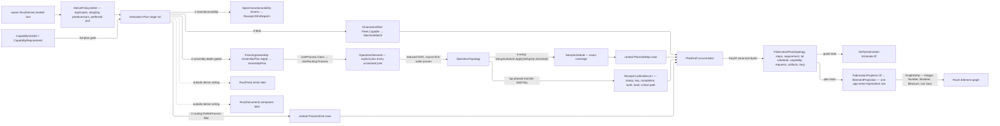

# [RASM_FABRICATION_DERIVATION]

`Derivation.Plan` is the one `Run(Derive)` lowering, and `DerivePolicy.Admit` gates duplicate identifiers, dangling predecessors, and incompatible process-machine preferences before any stage runs. `DerivePolicy` separates assessment, routing, and full-plan evidence. `LotPolicy` admits release, due, transfer, batching, and predecessor facts. `WorkAxis` owns each modality's admission, canonical bytes, and join projection as one row.

Full-plan derivation gates procedure qualification, measurement suitability, `Cpk`, and `IT` grade before scheduling. `OperationTopology` carries source-first DAG order as admitted evidence. Each admitted joint becomes an explicit operation or routes through `JoinRouting`; an unroutable class rejects.

`LotEvidence` separates total `Work`, lap-phased critical `Chain`, calendar `Lead`, the critical operations, the per-station `InstanceReservation` windows, and the per-operation `OperationFloat`; `Receipt<LotEvidence>` carries its plane, key, consumed evidence, and stamp. `LotPolicy.TransferBuffer` releases successors after the predecessor's first transfer batch. Scheduling is FINITE-CAPACITY: each operation seats on one assigned `MachineInstanceKey`, that station's free-from clock gates its start beside its predecessors and the lot release, every instant advances through that station's own `AvailabilityPlan.Finish`, and effort a station cannot seat rejects as `CapacityExhausted` while work beyond the calendar horizon rejects as `LotUnschedulable`. `Completion` is the INDEPENDENT maximum finish across the whole topology, never the last-scheduled operation's, so a short topological tail cannot seal a lot a parallel branch is still running.

The critical path is a LONGEST path over the precedence DAG computed by the shipped critical relaxer, and per-operation early, late, and float fall out of the same forward and reverse walks — one algorithm, published as receipt columns, rather than a hand-threaded tuple whose ordering predicate gated chain and completion on one comparison.

`PlanDraft` threads one accumulator through the rail, and its key covers every lot, capability, topology, route, and assignment discriminant.

Wire posture: HOST-LOCAL. `FabricationPlan` crosses to the caller and `Verify/estimation`'s quote lane, while plan facts cross to the element graph through one projector registration row; stage vocabulary never sits between wire and rail.

## [01]-[INDEX]

- [02]-[DERIVATION]: `DerivationStage`, `PlanIdentitySchema`, `WorkAxis`, `JoinRouting`, `LotPolicy`, `CapabilityRequirement`, `InstanceReservation`, `OperationFloat`, `LotEvidence`, `WorkKind`, `OperationDemand`, `OperationTopology`, `DerivePolicy`, `PlanDraft`, `Derivation.Plan`, and the `FabricationProjector.Of` seam mint.

## [02]-[DERIVATION]

- Owner: `DerivationStage` owns ordered ceilings; `WorkAxis` owns every per-modality work fact; `JoinRouting` owns the join-class-to-process correspondence; `LotPolicy` owns lot timing and batching; `LotEvidence` owns the lap-phased schedule evidence and `Receipt<LotEvidence>` its settled-receipt spine; `CapabilityRequirement` owns the demanded attestation set; `OperationDemand` and `OperationTopology` own executable work and its proven order; `DerivePolicy` owns request depth and aggregate admission; `PlanDraft` owns rail accumulation; `Derivation` owns the stage rail; and `FabricationProjector` owns the public seam mint over its internal implementation.
- Cases: `WorkKind` carries cut, join, form, additive, inspection, finish, fixture, treatment, cleaning, coating, transfer, handling, packing, and hold work. `DerivePolicy.Assessment` carries lot and the full `DfmRequest`; `Routing` adds fleet and preferences; `FullPlan` adds assembly, operations, setup, and artifact intent. Without a setup plan, full-plan work groups by process in setup `0`; with one, each admitted setup expands by operation ids and then by process.
- Entry: `Plan(FabricationPolicy.Derive, FabricationInput, FabricationTap?)` admits the policy aggregate, admits DfM routing at every ceiling, gates full-plan capability, reduces the operation DAG into an `OperationTopology`, composes assembly precedence, verifies setup coverage, selects the highest-score feasible machine per step, and closes the lot against its due bound; the run spine's tap threads through the request switch into the fleet join, so a headless derivation emits nothing.
- Auto: `Manufacturability.Assess(DfmRequest)` supplies ranked routes, fleet supplies scored matches, `AssemblyPlan.Apply(AssemblyOp.Plan)` supplies reduced join precedence and join duration, and `SetupSchedule.Apply(SetupOp.Schedule)` partitions topologically ordered demands. Every plan-derivation rejection lowers through `Reject` onto the `FabricationFault.Derivation` mint, so the witness clears its own kind predicate before the fault carrying it and its stage exists. `RequestedArtifacts` changes plan identity but never pretends an artifact was produced.
- Receipt: `FabricationPlan` is the derivation evidence: case-derived ceiling, DfM-ranked `Routing` rows, retained `MachineMatch` routes, admitted topology and steps each naming its assigned station, capability requirement and verdict, lot schedule, key ledger, and content key. `Receipt<LotEvidence>` adds the availability stamp, the lot's own content key, and the consumed operation evidence, and its `LotEvidence` adds calendar completion, total work, critical-chain effort, the critical operation chain, the per-station reservation windows, the per-operation float, the derived `Slack` between work and chain, the stamp-relative `Lead` and `Queue`, and the derived `Contention` each station held. `DfmReport` and `AssemblyPlan` remain stage-local because the terminal result carries their ranked-route and plan projections at every ceiling.
- Law: `CanonicalWriter` is MUTABLE-FLUENT — every primitive mutates its bound buffer and returns the same writer, the contract `Process/owner#RUN_DISPATCH` states — so a byte kernel here chains or discards the return interchangeably and a discarded return costs no bytes. Nothing in this page's preimage depends on a copied writer, and both preimages open and close through `FabricationCanon.Keyed`, so the retaining mint's refusal threads `Compose` and `LotOf` rather than surfacing as a key minted off bytes no writer held.
- Law: `FabricationProjector.Of` returns the Element floor and the internal implementation owns only `Project`, whose typed rail returns untouched. `ProjectionAssembly.Capture` preserves unknown throws; only a documented terminal projector refusal could add caused `ProjectorFaulted`.
- Packages: Process exports `AdmittedComponent`, `PlannedStep`, `FabricationPlan`, `EgressKind`, and `ContentKey`; stage owners export `Manufacturability.Assess`, `Fleet.Capable`, `AvailabilityPlan.Finish`, `AssemblyPlan.Apply`, and `SetupSchedule.Apply`; QuikGraph owns DAG validation, reduction, and topological order; NodaTime owns instant and duration semantics; `Rasm.Element` owns graph projection and the `PropertyCategory` row-name custody every bag key mints through; Thinktecture.Runtime.Extensions and LanguageExt.Core own generated values and rails.
- Growth: a rail segment is one ordered `DerivationStage` row and one fold arm; a work modality is one `WorkAxis` row with its `WorkKind` case, admission and byte projection following without a consumer edit; a join class becomes routable as one `JoinRouting` row; a route or plan fact widens the existing `FabricationPlan` receipt and canonical-byte projection; an element fact extends the existing total `Lower` arm for its owning result case.
- Boundary: `Derivation.Plan` owns orchestration, `RoutingInfeasible`, and plan identity. `TopologyOf` is the QuikGraph mutation kernel, while `KeyOf`, `Framed`, and the `Write` overloads are the canonical-byte kernel every optional slot presence-frames through. Projection is a COLUMN TABLE per result case — one row per bag key carrying its own source read and its typed render — so every fact keeps its type on the graph (counts `Integer`, ratios `Number`, gate outcomes `Boolean`, dimensioned facts SI-coerced `MeasureValue`, collections `List` of `Complex`), a content key lands as its framed family-and-digest pair rather than an interpolated string, and an optional payload renders its own table or contributes nothing. Every row name mints through `Row` over the seam owner's `PropertyCategory.Fabrication` scope, so this package declares its own vocabulary inside a partition the seam blesses and a bare `PropertyName.Create` at any write site is the deleted form. DfM owns routing evidence, fleet owns machine matches, assembly owns precedence, setup owns partitions, and later `Run(Post)` and `Run(Document)` calls own artifact production.

```csharp signature
// --- [RUNTIME_PRELUDE] ----------------------------------------------------------------------------------------------------------------------------
using System.Linq;
using LanguageExt;
using LanguageExt.Common;
using NodaTime;
using QuikGraph;
using QuikGraph.Algorithms;
using QuikGraph.Algorithms.ShortestPath;        // DagShortestPathAlgorithm, DistanceRelaxers
using Rasm.Domain;
using Rasm.Element.Graph;
using Rasm.Element.Projection;
using Rasm.Element.Properties;
using Rasm.Element.Relations;
using Rasm.Fabrication.Fixturing;
using Rasm.Fabrication.Kinematics;
using Rasm.Fabrication.Spec;
using Thinktecture;
using static LanguageExt.Prelude;
using QuantityBag = Rasm.Element.Properties.ValueBag<Rasm.Element.Properties.MeasureValue>;
using PropertyBag = Rasm.Element.Properties.ValueBag<Rasm.Element.Properties.PropertyValue>;

namespace Rasm.Fabrication.Process;

// --- [TYPES] --------------------------------------------------------------------------------------------------------------------------------------
[SmartEnum<string>]
public sealed partial class DerivationStage {
    public static readonly DerivationStage Manufacturability = new("manufacturability", order: 1);
    public static readonly DerivationStage Routing = new("routing", order: 2);
    public static readonly DerivationStage Fleet = new("fleet", order: 3);
    public static readonly DerivationStage Assembly = new("assembly", order: 4);
    public static readonly DerivationStage Operations = new("operations", order: 5);
    public static readonly DerivationStage Setup = new("setup", order: 6);
    public static readonly DerivationStage Program = new("program", order: 7);
    public static readonly DerivationStage Documentation = new("documentation", order: 8);

    public int Order { get; }
}

[SmartEnum<string>]
public sealed partial class PlanIdentitySchema {
    public static readonly PlanIdentitySchema CanonicalLittleEndian = new("fabrication-plan:canonical-little-endian");
}

// --- [MODELS] -------------------------------------------------------------------------------------------------------------------------------------
[ComplexValueObject]
public sealed partial class LotPolicy {
    public int Quantity { get; }
    public int BatchSize { get; }
    public Instant Release { get; }
    public Instant Due { get; }
    public Duration TransferBuffer { get; }
    public Arr<UInt128> Predecessors { get; }
    public int BatchCount => 1 + (Quantity - 1) / BatchSize;

    public static Fin<LotPolicy> Admit(
        int quantity,
        int batchSize,
        Instant release,
        Instant due,
        Duration transferBuffer,
        Arr<UInt128> predecessors) =>
        Validate(quantity, batchSize, release, due, transferBuffer, predecessors, out LotPolicy admitted) is not null
            ? Fin.Fail<LotPolicy>(Derivation.Reject(
                new DeriveWitness.LotInadmissible(
                    quantity, batchSize, release, due, transferBuffer, predecessors), DerivationStage.Operations))
            : Fin.Succ(admitted);

    [BoundaryAdapter]
    static partial void ValidateFactoryArguments(
        ref ValidationError? validationError,
        ref int quantity,
        ref int batchSize,
        ref Instant release,
        ref Instant due,
        ref Duration transferBuffer,
        ref Arr<UInt128> predecessors) {
        if (quantity < 1 || batchSize < 1 || batchSize > quantity || due < release
            || transferBuffer < Duration.Zero || predecessors.Distinct().Count != predecessors.Count
            || predecessors.Contains(UInt128.Zero))
            validationError = new ValidationError("derive:lot");
    }
}

[ComplexValueObject]
public sealed partial class CapabilityRequirement {
    public double MinimumCpk { get; }
    public int DemandedItGrade { get; }

    // Demand states the SET the verdict must admit, so a requirement adds an attestation as one roster row and the
    // gate stays one `AdmitsAll` rather than a predicate column per axis.
    public CapabilitySet<CapabilityAttestation> Gates { get; }

    [BoundaryAdapter]
    static partial void ValidateFactoryArguments(
        ref ValidationError? validationError,
        ref double minimumCpk,
        ref int demandedItGrade,
        ref CapabilitySet<CapabilityAttestation> gates) {
        if (!double.IsFinite(minimumCpk) || minimumCpk <= 0.0 || demandedItGrade < 1)
            validationError = new ValidationError("derive:capability-requirement");
    }
}

// The window one operation held on one physical station. A machine CLASS is unbounded parallelism; a machine
// INSTANCE is one station that cannot run two operations at once, so the reservation is the evidence a shop reads
// to see WHY a lot finished when it did.
public sealed record InstanceReservation(MachineInstanceKey Instance, int Operation, Instant Start, Instant Finish) {
    public Duration Held => Finish - Start;
}

// Per-operation timing evidence off the critical-path walk: the earliest an operation could start, the latest it
// could start without moving the completion, and the difference. A float of zero names a critical operation, so the
// critical path and the per-operation float are one algorithm's outputs rather than two derivations.
public sealed record OperationFloat(int Operation, Duration Early, Duration Late) {
    public Duration Float => Late - Early;
}

// Lane evidence lands whole here — everything the finite-capacity schedule MEASURED. Plane, content key,
// ancestry, refusal band, and the stamp the lot was scheduled from ride `Receipt<LotEvidence>`, so this owner
// declares no spine column and the carrier's `required` slots refuse a lane output carrying none of them.
[ComplexValueObject]
public sealed partial class LotEvidence {
    public Instant Completion { get; }
    public Duration Work { get; }
    public Duration Chain { get; }
    public Seq<int> CriticalPath { get; }
    public int Batches { get; }

    // The finite-capacity evidence: which station held which operation for how long, and how much each operation
    // could have slipped. A schedule that publishes only a completion instant cannot answer either question, and a
    // shop reading it cannot tell a busy station from a long operation.
    public Seq<InstanceReservation> Reservations { get; }
    public Seq<OperationFloat> Floats { get; }

    // Effort, concurrency, and calendar are three separate facts: total effort never falls below the critical
    // chain and their gap is the concurrency the plan admits, while queue is the closed time the shop calendar, the
    // committed load, and station CONTENTION impose on that chain. A 24/7 single-operation-per-station fleet
    // drives Queue to zero; no other reading of Lead does. Both measure FROM the receipt's own stamp, so the
    // carrier supplies the origin and this evidence never mirrors it as a second column.
    public Duration Lead(Instant stamped) => Completion - stamped;
    public Duration Queue(Instant stamped) => Lead(stamped) - Chain;
    public Duration Slack => Work - Chain;

    // Contention is the share of queue that station occupancy caused rather than the calendar: the reservations
    // one instance held, summed against the span it held them across.
    public Seq<(MachineInstanceKey Instance, Duration Held)> Contention => Reservations
        .GroupBy(static row => row.Instance)
        .Map(static group => (group.Key, group.Fold(Duration.Zero, static (held, row) => held + row.Held)))
        .ToSeq();

    [BoundaryAdapter]
    static partial void ValidateFactoryArguments(
        ref ValidationError? validationError,
        ref Instant completion,
        ref Duration work,
        ref Duration chain,
        ref Seq<int> criticalPath,
        ref int batches,
        ref Seq<InstanceReservation> reservations,
        ref Seq<OperationFloat> floats) {
        if (work < Duration.Zero || chain < Duration.Zero || chain > work || batches < 1
            || (chain > Duration.Zero && criticalPath.IsEmpty)
            || criticalPath.Distinct().Count != criticalPath.Count
            || reservations.Exists(static row => row.Finish < row.Start)
            || floats.Exists(static row => row.Late < row.Early))
            validationError = new ValidationError("derive:lot-evidence");
    }
}

// One vocabulary carries every per-case work fact the plan needs: the admission predicate, the canonical
// byte projection, and the join-connection projection. Adding a modality touches this table and nothing else.
[SmartEnum<string>]
public sealed partial class WorkAxis {
    public static readonly WorkAxis Cut = Of<WorkKind.Cut>(
        "cut", static _ => true, static (sink, row) => sink.String(row.Operation.Key));
    public static readonly WorkAxis Join = Of<WorkKind.Join>(
        "join", static row => row.Connection >= 0, static (sink, row) => sink.Ordinal(row.Connection),
        static row => Some(row.Connection));
    public static readonly WorkAxis Form = Of<WorkKind.Form>(
        "form", static row => row.Feature >= 0, static (sink, row) => sink.Ordinal(row.Feature));
    public static readonly WorkAxis Additive = Of<WorkKind.Additive>(
        "additive", static row => row.Region >= 0, static (sink, row) => sink.Ordinal(row.Region));
    public static readonly WorkAxis Inspect = Of<WorkKind.Inspect>(
        "inspect", static row => Named(row.Feature), static (sink, row) => sink.String(row.Feature));
    public static readonly WorkAxis Finish = Of<WorkKind.Finish>(
        "finish", static row => Named(row.Specification), static (sink, row) => sink.String(row.Specification));
    public static readonly WorkAxis Fixture = Of<WorkKind.Fixture>(
        "fixture", static row => row.Setup >= 0, static (sink, row) => sink.Ordinal(row.Setup));
    public static readonly WorkAxis Treat = Of<WorkKind.Treat>(
        "treat", static row => Named(row.Specification), static (sink, row) => sink.String(row.Specification));
    public static readonly WorkAxis Clean = Of<WorkKind.Clean>(
        "clean", static row => Named(row.Standard), static (sink, row) => sink.String(row.Standard));
    public static readonly WorkAxis Coat = Of<WorkKind.Coat>(
        "coat", static row => Named(row.Specification), static (sink, row) => sink.String(row.Specification));
    public static readonly WorkAxis Transfer = Of<WorkKind.Transfer>(
        "transfer", static row => Named(row.From) && Named(row.To) && row.From != row.To,
        static (sink, row) => sink.String(row.From).String(row.To));
    public static readonly WorkAxis Handle = Of<WorkKind.Handle>(
        "handle", static row => Named(row.Resource), static (sink, row) => sink.String(row.Resource));
    public static readonly WorkAxis Pack = Of<WorkKind.Pack>(
        "pack", static row => Named(row.Specification), static (sink, row) => sink.String(row.Specification));
    public static readonly WorkAxis Hold = Of<WorkKind.Hold>(
        "hold", static row => Named(row.Reason), static (sink, row) => sink.String(row.Reason));

    public Func<WorkKind, bool> Admits { get; }
    public Func<CanonicalWriter, WorkKind, CanonicalWriter> Project { get; }
    public Func<WorkKind, Option<int>> Connection { get; }

    private static WorkAxis Of<TWork>(
        string key,
        Func<TWork, bool> admits,
        Func<CanonicalWriter, TWork, CanonicalWriter> project,
        Func<TWork, Option<int>>? connection = null)
        where TWork : WorkKind =>
        new(key,
            work => work is TWork typed && admits(typed),
            (sink, work) => work is TWork typed ? project(sink.String(key), typed) : sink,
            work => work is TWork typed ? (connection?.Invoke(typed) ?? None) : None);

    private static bool Named(string value) => !string.IsNullOrWhiteSpace(value);
}

[Union(ConversionFromValue = ConversionOperatorsGeneration.None)]
public abstract partial record WorkKind(WorkAxis Axis) {
    public sealed record Cut(Operation Operation) : WorkKind(WorkAxis.Cut);
    public sealed record Join(int Connection) : WorkKind(WorkAxis.Join);
    public sealed record Form(int Feature) : WorkKind(WorkAxis.Form);
    public sealed record Additive(int Region) : WorkKind(WorkAxis.Additive);
    public sealed record Inspect(string Feature) : WorkKind(WorkAxis.Inspect);
    public sealed record Finish(string Specification) : WorkKind(WorkAxis.Finish);
    public sealed record Fixture(int Setup) : WorkKind(WorkAxis.Fixture);
    public sealed record Treat(string Specification) : WorkKind(WorkAxis.Treat);
    public sealed record Clean(string Standard) : WorkKind(WorkAxis.Clean);
    public sealed record Coat(string Specification) : WorkKind(WorkAxis.Coat);
    public sealed record Transfer(string From, string To) : WorkKind(WorkAxis.Transfer);
    public sealed record Handle(string Resource) : WorkKind(WorkAxis.Handle);
    public sealed record Pack(string Specification) : WorkKind(WorkAxis.Pack);
    public sealed record Hold(string Reason) : WorkKind(WorkAxis.Hold);
}

// Assembly classifies a joint physically; the plan must state which admitted process executes it. A class
// with no admitted ProcessKind raises a typed rejection instead of being silently dropped from the DAG.
[SmartEnum<string>]
public sealed partial class JoinRouting {
    public static readonly JoinRouting Weld = new("weld", JoinClass.Weld, ProcessKind.Weld);
    public static readonly JoinRouting Braze = new("braze", JoinClass.Braze, ProcessKind.Braze);
    public static readonly JoinRouting Solder = new("solder", JoinClass.Solder, ProcessKind.Braze);
    public static readonly JoinRouting Adhesive = new("adhesive", JoinClass.Adhesive, ProcessKind.Adhesive);

    public JoinClass Class { get; }
    public ProcessKind Process { get; }

    public static Option<JoinRouting> For(JoinClass joinClass) =>
        Optional(Items.FirstOrDefault(row => row.Class == joinClass));
}

[ComplexValueObject]
public sealed partial class OperationDemand {
    public int Id { get; }
    public WorkKind Work { get; }
    public ProcessKind Process { get; }
    public int Quantity { get; }
    public Duration UnitDuration { get; }
    public Duration SetupDuration { get; }
    public Set<int> Predecessors { get; }
    public Seq<ContentKey> Evidence { get; }

    public static Fin<OperationDemand> Admit(
        int id,
        WorkKind work,
        ProcessKind process,
        int quantity,
        Duration unitDuration,
        Duration setupDuration,
        Set<int> predecessors,
        Seq<ContentKey> evidence) =>
        Validate(id, work, process, quantity, unitDuration, setupDuration, predecessors, evidence, out OperationDemand admitted) is not null
            ? Fin.Fail<OperationDemand>(Derivation.Reject(new DeriveWitness.DemandInadmissible(id), DerivationStage.Operations))
            : Fin.Succ(admitted);

    internal static Fin<OperationDemand> Join(int id, int connection, ProcessKind process, Duration duration) =>
        Admit(id, new WorkKind.Join(connection), process, 1, duration, Duration.Zero, Set<int>(), Seq<ContentKey>());

    internal Fin<OperationDemand> Reprecede(Set<int> predecessors) =>
        Admit(Id, Work, Process, Quantity, UnitDuration, SetupDuration, predecessors, Evidence);

    internal Fin<OperationDemand> WithPredecessors(Set<int> predecessors) =>
        Reprecede(Predecessors + predecessors);

    // Setup is paid once per transfer batch; unit work scales with the whole lot.
    internal Duration DurationFor(LotPolicy lot) =>
        SetupDuration * lot.BatchCount + UnitDuration * ((long)Quantity * lot.Quantity);

    // Lap phasing releases the successor as soon as the first transfer batch clears, never the whole lot.
    internal Duration FirstBatchFor(LotPolicy lot) =>
        SetupDuration + UnitDuration * ((long)Quantity * Math.Min(lot.BatchSize, lot.Quantity));

    [BoundaryAdapter]
    static partial void ValidateFactoryArguments(
        ref ValidationError? validationError,
        ref int id,
        ref WorkKind work,
        ref ProcessKind process,
        ref int quantity,
        ref Duration unitDuration,
        ref Duration setupDuration,
        ref Set<int> predecessors,
        ref Seq<ContentKey> evidence) {
        if (id < 0 || work is null || process is null || quantity < 1
            || unitDuration <= Duration.Zero || setupDuration < Duration.Zero
            || predecessors.Contains(id) || !work.Axis.Admits(work))
            validationError = new ValidationError("derive:operation-demand");
    }
}

// Reduced DAG source-first order is the invariant every downstream fold reads, so it travels as
// evidence rather than as an ordering convention a bare Seq cannot state.
[ComplexValueObject]
public sealed partial class OperationTopology {
    public Seq<OperationDemand> Ordered { get; }
    public Map<int, OperationDemand> ById => toMap(Ordered.Map(static demand => (demand.Id, demand)));

    public bool IsEmpty => Ordered.IsEmpty;
    public int Count => Ordered.Count;

    [BoundaryAdapter]
    static partial void ValidateFactoryArguments(
        ref ValidationError? validationError,
        ref Seq<OperationDemand> ordered) {
        // Each element reads the pre-add frontier, so a predecessor appearing later fails the fold.
        bool sourceFirst = ordered.Fold(
            (Seen: Set<int>(), Ordered: true),
            static (state, demand) => (
                state.Seen.Add(demand.Id),
                state.Ordered && demand.Predecessors.ForAll(state.Seen.Contains))).Ordered;
        if (!sourceFirst || ordered.Map(static demand => demand.Id).Distinct().Count != ordered.Count)
            validationError = new ValidationError("derive:operation-topology");
    }
}

[Union(ConversionFromValue = ConversionOperatorsGeneration.None)]
public abstract partial record DerivePolicy(LotPolicy Lot, DfmRequest Dfm) {
    public sealed record Assessment(LotPolicy Lot, DfmRequest Dfm) : DerivePolicy(Lot, Dfm);
    public sealed record Routing(
        LotPolicy Lot,
        DfmRequest Dfm,
        MachineFleet Fleet,
        Option<ProcessKind> PreferProcess,
        Option<Machine> PreferMachine) : DerivePolicy(Lot, Dfm);
    public sealed record FullPlan(
        LotPolicy Lot,
        DfmRequest Dfm,
        MachineFleet Fleet,
        Option<AssemblyOp.Plan> Assembly,
        Seq<OperationDemand> Operations,
        Map<UInt128, Instant> PredecessorCompletion,
        CapabilityRequirement Capability,
        Option<SetupPlan> Setups,
        Option<ProcessKind> PreferProcess,
        Option<Machine> PreferMachine,
        Set<EgressKind> RequestedArtifacts) : DerivePolicy(Lot, Dfm);

    public DerivationStage Ceiling => Switch(
        assessment: static _ => DerivationStage.Manufacturability,
        routing: static _ => DerivationStage.Fleet,
        fullPlan: static _ => DerivationStage.Setup);

    // Structural admission runs once for the whole request; no stage re-checks the aggregate downstream. Only the
    // violations that ACTUALLY occurred reach the slot run, so no gate ever mints a witness for a condition its own
    // kind predicate would refute, and an empty run is the admitted answer through the same fold.
    public static Fin<DerivePolicy> Admit(DerivePolicy candidate) =>
        AdmissionSlots
            .Accumulate(Refusals(candidate).Map(static refusal => AdmissionSlots.Gate(false, refusal)))
            .As()
            .ToFin()
            .Map(_ => candidate);

    private static Seq<Error> Refusals(DerivePolicy candidate) => candidate.Switch(
        assessment: static _ => Seq<Error>(),
        routing: static row => Pairing(row.PreferProcess, row.PreferMachine).ToSeq(),
        fullPlan: static row =>
            Duplicate(row.Operations)
                .Map(static id => Derivation.Reject(new DeriveWitness.DuplicateOperation(id), DerivationStage.Operations))
                .ToSeq()
            + Dangling(row.Operations)
                .Map(static pair => Derivation.Reject(
                    new DeriveWitness.UnknownPredecessor(pair.Operation, pair.Predecessor), DerivationStage.Operations))
                .ToSeq()
            + Pairing(row.PreferProcess, row.PreferMachine).ToSeq());

    // The grouping IS the duplicate census: one pass names every repeated identifier, so the first is the witness
    // and the count comparison a hand accumulator threaded state to compute is the fold's own by-product.
    private static Option<int> Duplicate(Seq<OperationDemand> operations) => operations
        .Map(static demand => demand.Id)
        .GroupBy(static id => id)
        .Filter(static group => group.Count() > 1)
        .Map(static group => group.Key)
        .Head;

    private static Option<(int Operation, int Predecessor)> Dangling(Seq<OperationDemand> operations) {
        Set<int> ids = toSet(operations.Map(static demand => demand.Id));
        return operations
            .Bind(demand => demand.Predecessors.Filter(id => !ids.Contains(id))
                .Map(id => (Operation: demand.Id, Predecessor: id)).ToSeq())
            .Head;
    }

    private static Option<Error> Pairing(Option<ProcessKind> process, Option<Machine> machine) =>
        (from admitted in process from instance in machine select (Process: admitted, Machine: instance))
            .Filter(static pair => !pair.Machine.Admits(pair.Process))
            .Map(static pair => (Error)FabricationFault.Pairing(
                new RelationFault.ProcessMachine(pair.Process, pair.Machine)));
}

// PlanDraft threads one value through the rail instead of eleven positional arguments.
public sealed record PlanDraft(
    AdmittedComponent Component,
    DerivationStage Ceiling,
    LotPolicy Lot,
    Set<EgressKind> RequestedArtifacts,
    Option<CapabilityVerdict> Capability,
    Seq<ProcessKind> Routing,
    Seq<MachineMatch> Matches,
    OperationTopology Topology,
    Seq<PlannedStep> Steps,
    Option<SetupSchedule> Setups,
    Option<CapabilityRequirement> Requirement,
    Option<Receipt<LotEvidence>> LotSchedule,
    Seq<ContentKey> Consumed) {
    public static PlanDraft Of(AdmittedComponent component, FabricationInput input, DerivePolicy policy) =>
        new(component, policy.Ceiling, policy.Lot,
            policy is DerivePolicy.FullPlan full ? full.RequestedArtifacts : Set<EgressKind>(),
            input.Capability, Seq<ProcessKind>(), Seq<MachineMatch>(),
            OperationTopology.Create(Seq<OperationDemand>()),
            Seq<PlannedStep>(), None, None, None, Seq<ContentKey>());
}

// --- [OPERATIONS] ---------------------------------------------------------------------------------------------------------------------------------
public static class Derivation {
    public static Fin<FabricationResult> Plan(
        FabricationPolicy.Derive policy, FabricationInput input, FabricationTap? tap = null) =>
        from request in DerivePolicy.Admit(policy.Policy)
        from dfm in Manufacturability.Assess(request.Dfm)
        from _ in policy.Component.RepresentationKey == dfm.Evidence.ComponentKey
            ? Fin.Succ(unit)
            : Fin.Fail<Unit>(Reject(
                new DeriveWitness.ComponentMismatch(policy.Component.RepresentationKey, dfm.Evidence.ComponentKey),
                DerivationStage.Manufacturability))
        from result in request.Switch<Fin<FabricationResult>>(
            state: (Component: policy.Component, Input: input, Dfm: dfm.Evidence, DfmKey: dfm.Key, Tap: tap ?? FabricationTap.Silent),
            assessment: static (state, row) =>
                from routed in RouteOf(state.Dfm, state.Component, None)
                from composed in Compose(PlanDraft.Of(state.Component, state.Input, row) with { Routing = routed, Consumed = Seq1(state.DfmKey) })
                select composed,
            routing: static (state, row) =>
                from routed in RouteOf(state.Dfm, state.Component, row.PreferProcess)
                from matches in MatchOf(state.Component, row.Fleet, routed, row.PreferMachine, state.Tap)
                from composed in Compose(PlanDraft.Of(state.Component, state.Input, row) with {
                    Routing = routed,
                    Matches = matches,
                    Consumed = Seq1(state.DfmKey),
                })
                select composed,
            fullPlan: static (state, row) =>
                from routed in RouteOf(state.Dfm, state.Component, row.PreferProcess)
                // The capability gate answers for the LEADING process the routing elected; an empty routing has no
                // process to gate and refuses here rather than reaching the verdict with a fabricated modality.
                from leading in routed.Head.ToFin(new FabricationFault.RoutingInfeasible(
                    state.Component.RepresentationKey, new FaultSubject.Stage(DerivationStage.Routing.Key)))
                from capability in CapabilityOf(state.Input.Capability, row.Capability, leading)
                from matches in MatchOf(state.Component, row.Fleet, routed, row.PreferMachine, state.Tap)
                from joins in JoinsOf(state.Component, row.Assembly)
                from operations in OperationsOf(row.Operations, joins)
                from topology in TopologyOf(operations)
                from setups in SetupsOf(row.Setups, topology)
                from steps in StepsOf(state.Component, matches, topology, setups)
                from lot in LotOf(row.Lot, state.Component, topology, matches, row.PredecessorCompletion)
                from composed in Compose(PlanDraft.Of(state.Component, state.Input, row) with {
                    Routing = routed,
                    Matches = matches,
                    Topology = topology,
                    Setups = setups,
                    Steps = steps,
                    Requirement = Some(row.Capability),
                    LotSchedule = Some(lot),
                    Consumed = Seq1(state.DfmKey),
                })
                select composed)
        select result;

    // Every plan-derivation rejection lowers onto the one gated mint: the witness admits against its own kind
    // predicate first, so a payload contradicting the condition it names lands as `WitnessMalformed` instead.
    internal static Error Reject(DeriveWitness witness, DerivationStage stage) =>
        FabricationFault.Derivation(witness, new FaultSubject.Stage(stage.Key));

    private static Fin<Seq<ProcessKind>> RouteOf(
        DfmReport dfm,
        AdmittedComponent component,
        Option<ProcessKind> preferred) {
        Seq<ProcessKind> routed = preferred.Match(p => dfm.Routing.Filter(r => r == p), () => dfm.Routing);
        return routed.IsEmpty
            ? Fin.Fail<Seq<ProcessKind>>(new FabricationFault.RoutingInfeasible(
                component.RepresentationKey, new FaultSubject.Stage(DerivationStage.Routing.Key)))
            : Fin.Succ(routed);
    }

    // An ABSENT verdict is a request that never carried its capability evidence, not a process measured at zero
    // Cpk: `CapabilityShortfall` states a measured magnitude, so seating a fabricated `0.0` in it publishes a
    // measurement no instrument took. Absence answers on the policy-admission arm and only a real verdict that
    // falls short raises the shortfall.
    private static Fin<CapabilityVerdict> CapabilityOf(
        Option<CapabilityVerdict> admitted,
        CapabilityRequirement required,
        ProcessKind process) =>
        admitted.ToFin(new KernelFault.InvalidValue("derivation", "derive:capability-verdict-absent"))
            // The verdict attests capability alone — Cpk against its own demand plus the two fail-closed states —
            // so the IT grade a request DEMANDS stays on the requirement, where the tolerance owner sets it, and no
            // gate here reads a grade column the verdict does not carry.
            .Bind(verdict => verdict.Cpk >= required.MinimumCpk
                && verdict.DemandedCpk >= required.MinimumCpk
                && verdict.Attested.AdmitsAll(required.Gates)
                    ? Fin.Succ(verdict)
                    : Fin.Fail<CapabilityVerdict>(new FabricationFault.CapabilityShortfall(
                        process, verdict.Cpk, required.MinimumCpk)));

    private static Fin<Seq<MachineMatch>> MatchOf(
        AdmittedComponent component,
        MachineFleet fleet,
        Seq<ProcessKind> routed,
        Option<Machine> preferred,
        FabricationTap tap) =>
        from matches in Fleet.Capable(component, fleet, tap)
          let admitted = matches
              .Filter(static match => match.Checks.Feasible)
              .Filter(match => routed.Contains(match.Process))
              .Filter(match => preferred.Match(machine => match.Instance.Kind == machine, static () => true))
          from nonEmpty in admitted.IsEmpty
              ? Fin.Fail<Seq<MachineMatch>>(new FabricationFault.RoutingInfeasible(
                  component.RepresentationKey, new FaultSubject.Stage(DerivationStage.Fleet.Key)))
              : Fin.Succ(admitted)
          select nonEmpty;

    // Every admitted joint becomes an operation: an explicit demand claims it, otherwise the joint's own
    // JoinProcess class routes to an admitted ProcessKind. A class with no route rejects rather than vanishes.
    private static Fin<Seq<OperationDemand>> OperationsOf(
        Seq<OperationDemand> explicitOperations,
        Option<AssemblyPlan> joins) {
        Seq<(int Connection, int Demand)> claimed = explicitOperations
            .Bind(demand => demand.Work.Axis.Connection(demand.Work).Map(connection => (Connection: connection, Demand: demand.Id)).ToSeq());
        long next = explicitOperations.IsEmpty
            ? 0L
            : (long)explicitOperations.Max(static demand => demand.Id) + 1L;
        Seq<AssemblyJoint> unclaimed = joins
            .Map(plan => plan.Joints.Filter(joint => !claimed.Exists(row => row.Connection == joint.Index)))
            .IfNone(Seq<AssemblyJoint>());
        if (next + unclaimed.Count > int.MaxValue)
            return Fin.Fail<Seq<OperationDemand>>(Reject(
                new DeriveWitness.IdentifierExhausted(next, unclaimed.Count), DerivationStage.Operations));
        Seq<(AssemblyJoint Joint, int Demand)> allocated = unclaimed
            .Zip(Range(0, unclaimed.Count), (joint, ordinal) => (Joint: joint, Demand: (int)next + ordinal));
        Seq<(int Connection, int Demand)> demandOf = claimed
            + allocated.Map(static row => (Connection: row.Joint.Index, row.Demand));
        return allocated
            .TraverseM(row =>
                from routing in JoinRouting.For(row.Joint.Specification.Process.Class)
                    .ToFin(Reject(new DeriveWitness.JoinReceiptMissing(row.Joint.Index), DerivationStage.Assembly))
                from duration in joins.Bind(plan => plan.Receipts
                    .Find(receipt => receipt.Joint == row.Joint.Index)
                    .Map(static receipt => receipt.Duration))
                    .ToFin(Reject(new DeriveWitness.JoinReceiptMissing(row.Joint.Index), DerivationStage.Assembly))
                from demand in OperationDemand.Join(row.Demand, row.Joint.Index, routing.Process, duration)
                from ordered in demand.WithPredecessors(joins.Map(plan => toSet(plan.Precedence
                    .Filter(edge => edge.Target.Joint == row.Joint.Index && edge.Source.Joint != row.Joint.Index)
                    .Bind(edge => demandOf.Filter(value => value.Connection == edge.Source.Joint)
                        .Map(static value => value.Demand)))).IfNone(Set<int>()))
                select ordered)
            .As()
            .Map(rows => explicitOperations + rows)
            .Bind(rows => rows.IsEmpty
                ? Fin.Fail<Seq<OperationDemand>>(Reject(new DeriveWitness.OperationsEmpty(unclaimed.Count), DerivationStage.Operations))
                : Fin.Succ(rows));
    }

    private static Fin<OperationTopology> TopologyOf(Seq<OperationDemand> operations) {
        BidirectionalGraph<int, SEdge<int>> graph = new();
        graph.AddVertexRange(operations.Map(static demand => demand.Id));
        graph.AddEdgeRange(operations.Bind(demand => demand.Predecessors
            .Map(predecessor => new SEdge<int>(predecessor, demand.Id))));
        // A cycle refusal names the OPERATIONS a caller must break, and the strongly-connected labels the detector
        // already computed are exactly that set; a vertex-and-edge count names nothing actionable. The extension
        // FILLS its out parameter with one component label per vertex and returns the component count, so every
        // vertex sharing a label with another sits on a cycle and the count itself decides nothing here.
        if (!graph.IsDirectedAcyclicGraph()) {
            _ = graph.StronglyConnectedComponents(out IDictionary<int, int> components);
            Seq<int> cycle = toSeq(components)
                .GroupBy(static row => row.Value)
                .Filter(static group => group.Count() > 1)
                .Bind(static group => group.Map(static row => row.Key))
                .ToSeq();
            return Fin.Fail<OperationTopology>(Reject(
                new DeriveWitness.OperationCycle(cycle.ToArr()), DerivationStage.Operations));
        }

        BidirectionalGraph<int, SEdge<int>> reduced = graph.ComputeTransitiveReduction();
        Map<int, OperationDemand> byId = toMap(operations.Map(static demand => (demand.Id, demand)));
        return toSeq(reduced.SourceFirstTopologicalSort())
            .TraverseM(id =>
                from demand in byId.Find(id).ToFin(Reject(new DeriveWitness.OperationAbsent(id), DerivationStage.Operations))
                from reducedDemand in demand.Reprecede(toSet(reduced.InEdges(id).Select(static edge => edge.Source)))
                select reducedDemand)
            .As()
            .Map(static ordered => OperationTopology.Create(ordered));
    }

    // One assignment rule serves step projection and lot scheduling; a second spelling would let the machine
    // machine promised by the schedule differ from the machine the program posts to.
    private static Option<MachineMatch> AssignedTo(Seq<MachineMatch> matches, ProcessKind process) =>
        toSeq(matches
                .Filter(match => match.Process == process && match.Checks.Feasible)
                .OrderBy(static match => match.Score)   // MachineMatch.Score is the normalized lower-is-better burden; ascending selects the best feasible machine
                .ThenBy(static match => match.Instance.Id))
            .Head;

    // The lot-scheduling state one lap-phased pass threads. `Free` is the finite-capacity column: one instant per
    // physical STATION, not per machine class, so a station already holding work pushes its next operation out.
    private readonly record struct LotState(
        Map<int, (Instant Release, Instant Finish)> Ends,
        Map<MachineInstanceKey, Instant> Free,
        Seq<InstanceReservation> Reservations,
        Duration Work,
        Instant Completion) {
        public static LotState Seeded(Instant available) => new(
            Map<int, (Instant, Instant)>(), Map<MachineInstanceKey, Instant>(),
            Seq<InstanceReservation>(), Duration.Zero, available);
    }

    // Lap phasing is the transfer semantics LotPolicy admits: a successor starts once its predecessor's first
    // transfer batch clears the buffer, so batching shortens lead time without shortening total work. Every
    // instant advances through the ASSIGNED INSTANCE's own AvailabilityPlan and its own free-from clock, so effort
    // lands on the shop calendar at that station's committed load and two operations routed to one physical
    // machine never claim the same minutes — the contention a machine-class schedule cannot see.
    private static Fin<Receipt<LotEvidence>> LotOf(
        LotPolicy lot,
        AdmittedComponent component,
        OperationTopology topology,
        Seq<MachineMatch> matches,
        Map<UInt128, Instant> predecessorCompletion) =>
        from completed in lot.Predecessors
            .TraverseM(key => predecessorCompletion.Find(key)
                .ToFin(Reject(new DeriveWitness.PredecessorLotMissing(key), DerivationStage.Operations)))
            .As()
        let available = completed.Map(predecessor => predecessor + lot.TransferBuffer)
            .Fold(lot.Release, static (current, transferred) => transferred > current ? transferred : current)
        from assignment in Assignment(component, topology, matches)
        from timeline in topology.Ordered.Fold(
            Fin.Succ(LotState.Seeded(available)),
            (accumulated, operation) => accumulated.Bind(state =>
                from seat in assignment.Find(operation.Id)
                    .ToFin(new FabricationFault.RoutingInfeasible(
                        component.RepresentationKey, new FaultSubject.Stage(DerivationStage.Fleet.Key)))
                let effort = operation.DurationFor(lot)
                // Three clocks gate a start and the LATEST wins: the lot's own release, every predecessor's
                // lap-phased transfer clearance, and the assigned station's free-from instant.
                let ready = operation.Predecessors
                    .Fold(available, (at, predecessor) => state.Ends.Find(predecessor)
                        .Map(row => row.Release > at ? row.Release : at)
                        .IfNone(at))
                let start = state.Free.Find(seat.Instance).Map(free => free > ready ? free : ready).IfNone(ready)
                from finish in seat.Availability.Finish(start, effort)
                    .ToFin(Reject(new DeriveWitness.CapacityExhausted(
                        operation.Id, matches.Count(match => match.Process == operation.Process), start, effort),
                        DerivationStage.Operations))
                from release in seat.Availability.Finish(start, operation.FirstBatchFor(lot))
                    .Map(cleared => cleared + lot.TransferBuffer)
                    .ToFin(Reject(new DeriveWitness.LotUnschedulable(operation.Id, start, effort),
                        DerivationStage.Operations))
                select state with {
                    Ends = state.Ends.Add(operation.Id, (release, finish)),
                    Free = state.Free.AddOrUpdate(seat.Instance, finish),
                    Reservations = state.Reservations
                        .Add(new InstanceReservation(seat.Instance, operation.Id, start, finish)),
                    Work = state.Work + effort,
                    // Completion is the INDEPENDENT maximum finish, never the last-scheduled operation's: a
                    // topological tail with a short operation would otherwise seal the lot before a parallel
                    // branch finished.
                    Completion = finish > state.Completion ? finish : state.Completion,
                })
        from critical in Critical(topology, lot)
        // NAMED LOSS: the two window invariants the old carrier proved against its own availability column —
        // completion at or after it, and lead never shorter than the chain — leave the evidence boundary with the
        // stamp. WITNESS: both are this fold's own outputs rather than caller material, because `LotState.Seeded`
        // starts the completion AT the stamp and only ever raises it, and a finite-capacity walk cannot finish a
        // chain faster than its own longest path; what a caller can still get wrong stays gated here.
        from measured in timeline.Completion <= lot.Due
            ? LotEvidence.Validate(timeline.Completion, timeline.Work, critical.Chain, critical.Path,
                lot.BatchCount, timeline.Reservations, critical.Floats, out LotEvidence evidence).Admitted(evidence)
            : Fin.Fail<LotEvidence>(Reject(
                new DeriveWitness.LotOverdue(timeline.Completion, lot.Due), DerivationStage.Operations))
        // Lot evidence joins the spine as a settled receipt: it addresses under its own content key, names its
        // producing plane, carries the operation evidence its schedule consumed, and stamps at the availability
        // instant every derived span on that evidence measures from. The key rides the S0 keyed close, so the
        // retaining mint's own refusal threads this fold rather than reaching the receipt as a forged address.
        from addressed in FabricationCanon.Keyed(
            EgressKind.Plan, ExactGrid, writer => LotBytes(writer, available, measured), Key)
        select new Receipt<LotEvidence> {
            Evidence = measured,
            Concern = FabConcern.Derivation,
            Key = addressed,
            Consumed = topology.Ordered.Bind(static demand => demand.Evidence),
            Stamped = available,
        };

    // One assignment pass over the whole topology, so the station a step posts to and the station the schedule
    // reserved are read from ONE map rather than re-selected per fold step.
    private static Fin<Map<int, (MachineInstanceKey Instance, AvailabilityPlan Availability)>> Assignment(
        AdmittedComponent component,
        OperationTopology topology,
        Seq<MachineMatch> matches) =>
        topology.Ordered
            .TraverseM(operation => AssignedTo(matches, operation.Process)
                .ToFin(new FabricationFault.RoutingInfeasible(
                    component.RepresentationKey, new FaultSubject.Stage(DerivationStage.Fleet.Key)))
                .Bind(match => MachineInstanceKey.Admit(match.Instance.Id)
                    .Map(key => (operation.Id, Seat: (Instance: key, match.Instance.Availability)))))
            .As()
            .Map(static rows => toMap(rows));

    // The critical path is a LONGEST path over the precedence DAG, which is exactly what the shipped critical
    // relaxer computes: seeded at negative infinity with an inverted comparison, the shortest-path fold returns the
    // longest chain. Early start is that distance; late start is the completion minus the longest chain
    // FROM each operation, so float falls out of the same two walks rather than a hand-threaded tuple.
    private static Fin<(Duration Chain, Seq<int> Path, Seq<OperationFloat> Floats)> Critical(
        OperationTopology topology,
        LotPolicy lot) {
        AdjacencyGraph<int, SEdge<int>> forward = new(allowParallelEdges: false);
        forward.AddVertexRange(topology.Ordered.Map(static demand => demand.Id));
        forward.AddEdgeRange(topology.Ordered.Bind(demand =>
            demand.Predecessors.Map(predecessor => new SEdge<int>(predecessor, demand.Id))));
        Map<int, Duration> effort = toMap(topology.Ordered.Map(demand => (demand.Id, demand.DurationFor(lot))));
        Func<SEdge<int>, double> weight = edge => effort.Find(edge.Source).IfNone(Duration.Zero).TotalSeconds;

        Seq<int> roots = topology.Ordered.Filter(static demand => demand.Predecessors.IsEmpty)
            .Map(static demand => demand.Id);
        Map<int, double> early = Longest(forward, weight, roots);
        // Both walks weight an edge by the effort of the operation it LEAVES. `Reversed` swaps the endpoints, so
        // reading `edge.Target` there prices the predecessor rather than the successor and the tail of every root
        // absorbs its own effort twice — which drives `Late` below `Early` and makes the receipt refuse every
        // multi-operation lot. The reversed walk reads `edge.Source` for the same reason the forward one does.
        Map<int, double> tail = Longest(Reversed(forward), weight,
            topology.Ordered.Filter(demand => forward.OutDegree(demand.Id) == 0).Map(static demand => demand.Id));

        // A vertex the walk never reached carries no measured start, and seating a fabricated zero publishes an
        // early start no relaxation produced — so an unreachable operation refuses rather than reading as ready now.
        return topology.Ordered
            .Map(demand =>
                from start in early.Find(demand.Id).ToFin(Derivation.Reject(
                    new DeriveWitness.LotUnschedulable(demand.Id, lot.Release, demand.DurationFor(lot))))
                from slack in tail.Find(demand.Id).ToFin(Derivation.Reject(
                    new DeriveWitness.LotUnschedulable(demand.Id, lot.Release, demand.DurationFor(lot))))
                select (Demand: demand, Early: start, Tail: slack))
            .Traverse(identity)
            .As()
            .Map(rows => {
                double span = rows.Fold(0.0, (longest, row) =>
                    Math.Max(longest, row.Early + row.Demand.DurationFor(lot).TotalSeconds));
                Seq<OperationFloat> floats = rows.Map(row => new OperationFloat(
                    row.Demand.Id,
                    Duration.FromSeconds(row.Early),
                    Duration.FromSeconds(span - row.Tail - row.Demand.DurationFor(lot).TotalSeconds)));
                // The critical set is the float NEAREST zero within the schedule's own resolution: an exact-zero
                // equality over doubles built from seconds drops the very rows the chain runs through, and the
                // receipt then refuses a nonzero chain that named no critical path.
                Duration resolution = Duration.FromSeconds(span * CriticalFloatTolerance);
                return (
                    Duration.FromSeconds(span),
                    floats.Filter(row => row.Float <= resolution && row.Float >= -resolution)
                        .Map(static row => row.Operation),
                    floats);
            });
    }

    // The critical band as a FRACTION of the schedule's own span, so a long plan and a short one both read their
    // chain at the resolution their arithmetic actually carries rather than at a fixed absolute epsilon.
    private const double CriticalFloatTolerance = 1e-9;

    // The critical relaxer IS the longest-path form: `DistanceRelaxers.CriticalDistance` seeds at `double.MinValue`
    // and negates the comparison, so the DAG shortest-path fold returns the longest chain and its `Distances` map
    // reads one double per vertex. The relaxer enters through the three-argument arity — graph, edge weight,
    // relaxer — because the two-argument one takes the shortest-distance default. A synthetic super-source
    // collapses a multi-root DAG onto one walk, so the distances shift by nothing and every root still reads zero.
    private static Map<int, double> Longest(
        AdjacencyGraph<int, SEdge<int>> graph,
        Func<SEdge<int>, double> weight,
        Seq<int> roots) {
        const int Source = int.MinValue;
        AdjacencyGraph<int, SEdge<int>> seeded = new(allowParallelEdges: false);
        seeded.AddVertexRange(graph.Vertices);
        seeded.AddEdgeRange(graph.Edges);
        seeded.AddVertex(Source);
        seeded.AddEdgeRange(roots.Map(root => new SEdge<int>(Source, root)));
        DagShortestPathAlgorithm<int, SEdge<int>> walk = new(
            seeded,
            edge => edge.Source == Source ? 0.0 : weight(edge),
            DistanceRelaxers.CriticalDistance);
        walk.Compute(Source);
        return toSeq(walk.Distances)
            .Filter(static row => row.Key != Source && double.IsFinite(row.Value))
            .Map(static row => (row.Key, row.Value))
            .ToMap();
    }

    private static AdjacencyGraph<int, SEdge<int>> Reversed(AdjacencyGraph<int, SEdge<int>> source) {
        AdjacencyGraph<int, SEdge<int>> graph = new(allowParallelEdges: false);
        graph.AddVertexRange(source.Vertices);
        graph.AddEdgeRange(source.Edges.Select(static edge => new SEdge<int>(edge.Target, edge.Source)));
        return graph;
    }

    private static Fin<Option<SetupSchedule>> SetupsOf(Option<SetupPlan> policy, OperationTopology topology) =>
        topology.IsEmpty
            ? Fin.Succ(Option<SetupSchedule>.None)
            : policy.Match(
                Some: plan => SetupSchedule.Apply(new SetupOp.Schedule(plan))
                    .Bind(result => result is SetupResult.Scheduled(var schedule)
                        ? Covers(schedule, topology)
                            ? Fin.Succ(Some(schedule))
                            : Fin.Fail<Option<SetupSchedule>>(Reject(new DeriveWitness.SetupCoverage(
                                schedule.Setups.Bind(static setup => setup.Operations).Count, topology.Count),
                                DerivationStage.Setup))
                        : Fin.Fail<Option<SetupSchedule>>(Reject(
                            new DeriveWitness.SetupCoverage(0, topology.Count), DerivationStage.Setup))),
                None: () => Fin.Succ(Option<SetupSchedule>.None));

    private static bool Covers(SetupSchedule schedule, OperationTopology topology) {
        Arr<int> assigned = schedule.Setups.Bind(static setup => setup.Operations).ToArr();
        return assigned.Count == topology.Count && assigned.Distinct().Count == assigned.Count
            && assigned.ForAll(topology.ById.ContainsKey);
    }

    private static Fin<Option<AssemblyPlan>> JoinsOf(
        AdmittedComponent component,
        Option<AssemblyOp.Plan> request) =>
        request.Match(
            Some: value => AssemblyPlan.Apply(value).Bind(result => result is AssemblyResult.Planned(var plan)
                && plan.Members.Exists(member => member.Component.RepresentationKey == component.RepresentationKey)
                    ? Fin.Succ(Some(plan))
                    : Fin.Fail<Option<AssemblyPlan>>(Reject(
                        new DeriveWitness.AssemblyMismatch(component.RepresentationKey), DerivationStage.Assembly))),
            None: () => component.Connections.IsEmpty
                ? Fin.Succ(Option<AssemblyPlan>.None)
                : Fin.Fail<Option<AssemblyPlan>>(Reject(
                    new DeriveWitness.AssemblyRequired(component.Connections.Count), DerivationStage.Assembly)));

    private static Fin<FabricationResult> Compose(PlanDraft draft) =>
        KeyOf(draft).Map<FabricationResult>(key => new FabricationResult.FabricationPlan(
            draft.Ceiling,
            draft.Routing,
            draft.Matches,
            draft.Steps,
            draft.Topology,
            draft.Requirement,
            draft.LotSchedule,
            draft.Capability,
            draft.RequestedArtifacts,
            draft.Consumed,
            key));

    // The exact grid: plan identity quantizes nothing, so two drafts differing in the last bit of a capability
    // index address distinctly. The keying op names the refusal a discarded retaining close would otherwise hide.
    private const double ExactGrid = 0.0;

    private static readonly Op Key = Op.Of(name: nameof(Derivation));

    private static Fin<Seq<PlannedStep>> StepsOf(
        AdmittedComponent component,
        Seq<MachineMatch> matches,
        OperationTopology topology,
        Option<SetupSchedule> setups) {
        Seq<(int Setup, Arr<int> Operations)> partitions = setups.Match(
            Some: schedule => Range(0, schedule.Setups.Count).ToSeq()
                .Map(index => (Setup: index, Operations: schedule.Setups[index].Operations)),
            None: () => Seq((Setup: 0, Operations: topology.Ordered.Map(static demand => demand.Id).ToArr())));
        Seq<(int Setup, ProcessKind Process, Arr<int> Operations)> work = partitions.Bind(partition =>
            topology.Ordered
                .Filter(demand => partition.Operations.Contains(demand.Id))
                .Map(static demand => demand.Process)
                .Distinct()
                .Map(process => (
                    partition.Setup,
                    Process: process,
                    Operations: topology.Ordered
                        .Filter(demand => partition.Operations.Contains(demand.Id) && demand.Process == process)
                        .Map(static demand => demand.Id)
                        .ToArr())));
        // The step carries the physical STATION the lot fold reserved, not just its machine class: a program posts
        // to one controller, and a step naming only a class leaves the poster to re-select a station the schedule
        // never priced.
        Seq<(int Setup, ProcessKind Process, Arr<int> Operations, int Order)> ordered =
            work.Map(static (row, order) => (row.Setup, row.Process, row.Operations, Order: order));
        return Ordered(component, topology, ordered)
            .Bind(_ => ordered
                .Traverse(row => AssignedTo(matches, row.Process)
                    .ToFin(new FabricationFault.RoutingInfeasible(
                        component.RepresentationKey, new FaultSubject.Stage(DerivationStage.Fleet.Key)))
                    .Bind(match => MachineInstanceKey.Admit(match.Instance.Id)
                        .Bind(instance => PlannedStep.Admit(row.Order, row.Process, match.Instance.Kind,
                            Some(instance), row.Setup, row.Operations, None))))
                .As());
    }

    // `PlannedStep.Order` is a PROMISE the plan makes to every consumer that walks it — the traveler reads it as a
    // total route order and refuses work recorded out of it — so the promise is PROVEN here, not merely assigned.
    // Source-first ordering holds over operations, but the partition by setup and then by process re-groups them,
    // and nothing in that re-grouping keeps a consumer's step behind its producer's. The proof is one pass: every
    // operation's predecessors must sit in a step ordered no later than the step that consumes them.
    private static Fin<Unit> Ordered(
        AdmittedComponent component,
        OperationTopology topology,
        Seq<(int Setup, ProcessKind Process, Arr<int> Operations, int Order)> steps) {
        Map<int, int> stepOf = steps.Fold(
            Map<int, int>(),
            static (held, step) => step.Operations.Fold(held, (inner, id) => inner.AddOrUpdate(id, step.Order)));
        return steps
            .Bind(step => toSeq(step.Operations)
                .Bind(id => topology.ById.Find(id).Map(demand => demand.Predecessors).IfNone(Arr<int>()).ToSeq())
                .Map(predecessor => (Step: step.Order, Predecessor: predecessor)))
            .Map(row => AdmissionSlots.Gate(
                stepOf.Find(row.Predecessor).ForAll(producer => producer <= row.Step),
                new FabricationFault.RoutingInfeasible(
                    component.RepresentationKey, new FaultSubject.Stage(DerivationStage.Operations.Key))))
            .Traverse(identity)
            .As()
            .ToFin()
            .Map(static _ => unit);
    }

    // The preimage frames and closes at the S0 `FabricationCanon` over the `Rasm.Element` `CanonicalWriter`, the
    // package's ONE byte codec: it normalizes `-0.0` and every NaN payload, length-prefixes each token, and writes
    // a count before every collection, so a plan key is byte-comparable with every other content key in the estate.
    // A page-local scalar framing beside it is the deleted form — two of them already disagreed on how a `double`
    // reaches the digest — and the retaining close answers on the rail, so a plan never addresses under bytes no
    // writer held.
    // Exemption: the ordered foreach walks are the measured byte kernel this codec is.
    private static Fin<ContentKey> KeyOf(PlanDraft draft) => FabricationCanon.Keyed(EgressKind.Plan, ExactGrid, writer => {
        _ = writer
            .String(PlanIdentitySchema.CanonicalLittleEndian.Key)
            .U128(draft.Component.RepresentationKey)
            .String(draft.Ceiling.Key)
            .Ordinal(draft.Routing.Count);
        foreach (ProcessKind process in draft.Routing) writer.String(process.Key);
        writer.Ordinal(draft.Lot.Quantity)
            .Ordinal(draft.Lot.BatchSize)
            .I64(draft.Lot.Release.ToUnixTimeTicks())
            .I64(draft.Lot.Due.ToUnixTimeTicks())
            .I64(draft.Lot.TransferBuffer.ToTimeSpan().Ticks)
            .Ordinal(draft.Lot.Predecessors.Count);
        foreach (UInt128 predecessor in draft.Lot.Predecessors.Order()) writer.U128(predecessor);
        writer.Ordinal(draft.RequestedArtifacts.Count);
        foreach (EgressKind artifact in draft.RequestedArtifacts.OrderBy(static kind => kind.Key)) writer.String(artifact.Key);
        writer.Ordinal(draft.Topology.Count);
        foreach (OperationDemand demand in draft.Topology.Ordered) Write(writer, demand);
        writer.Ordinal(draft.Matches.Count);
        foreach (MachineMatch route in draft.Matches.OrderBy(static route => route.Instance.Id).ThenBy(static route => route.Process.Key)) Write(writer, route);
        writer.Ordinal(draft.Steps.Count);
        foreach (PlannedStep step in draft.Steps.OrderBy(static step => step.Order)) Write(writer, step);
        WriteOptional(draft.Capability, draft.Requirement, draft.LotSchedule, writer);
        return writer;
    }, Key);

    // Each optional slot frames its own presence flag so a missing verdict never shifts a later field's bytes;
    // `Bool` is the codec's own presence primitive, so an absent slot never mints a new framing convention.
    private static void WriteOptional(
        Option<CapabilityVerdict> capability,
        Option<CapabilityRequirement> requirement,
        Option<Receipt<LotEvidence>> lotReceipt,
        CanonicalWriter writer) {
        // Attestations frame ONE presence flag per roster row in rank order, so the layout the plan digest already
        // publishes is unchanged and a third attestation reaches the preimage with no edit here.
        Framed(writer, capability, static (sink, value) => toSeq(CapabilityAttestation.Items).Fold(
            sink.Double(value.Cpk).Double(value.DemandedCpk),
            (rail, row) => rail.Bool(value.Attested.Admits(row))));
        Framed(writer, requirement, static (sink, value) => toSeq(value.Gates.Held
            .OrderBy(static gate => gate.Key))
            .Fold(
                sink.Double(value.MinimumCpk).Ordinal(value.DemandedItGrade).Ordinal(value.Gates.Held.Count),
                static (rail, gate) => rail.String(gate.Key)));
        Framed(writer, lotReceipt, static (sink, receipt) => LotBytes(sink, receipt.Stamped, receipt.Evidence));
    }

    // ONE lot frame serves both the lot's own content key and the plan preimage that carries it, so the digest a
    // plan publishes and the key its lot addresses under cover the same bytes and neither can drift. Layout holds
    // what the plan already published — stamp, completion, effort, chain, critical path, batches — so seating the
    // lot on the carrier re-keys no plan.
    internal static CanonicalWriter LotBytes(CanonicalWriter writer, Instant stamped, LotEvidence evidence) =>
        evidence.CriticalPath.Fold(
            writer.I64(stamped.ToUnixTimeTicks())
                .I64(evidence.Completion.ToUnixTimeTicks())
                .I64(evidence.Work.ToTimeSpan().Ticks)
                .I64(evidence.Chain.ToTimeSpan().Ticks)
                .Ordinal(evidence.CriticalPath.Count),
            static (rail, operation) => rail.Ordinal(operation))
            .Ordinal(evidence.Batches);

    private static void Framed<T>(CanonicalWriter writer, Option<T> slot, Func<CanonicalWriter, T, CanonicalWriter> project) =>
        ignore(slot.Match(
            Some: value => project(writer.Bool(true), value),
            None: () => writer.Bool(false)));

    // Exemption: each composite walk is the measured byte kernel; ordering is declared at the walk so the digest is
    // reproducible across runs, and every collection writes its count first so raw append stays injective.
    internal static void Write(CanonicalWriter writer, OperationDemand demand) {
        writer.Ordinal(demand.Id)
            .String(demand.Process.Key)
            .Ordinal(demand.Quantity)
            .I64(demand.UnitDuration.ToTimeSpan().Ticks)
            .I64(demand.SetupDuration.ToTimeSpan().Ticks)
            .Ordinal(demand.Predecessors.Count);
        foreach (int predecessor in demand.Predecessors.Order()) writer.Ordinal(predecessor);
        writer.Ordinal(demand.Evidence.Count);
        foreach (ContentKey evidence in demand.Evidence.OrderBy(static key => key.Kind.Key).ThenBy(static key => key.Digest)) Write(writer, evidence);
        demand.Work.Axis.Project(writer, demand.Work);
    }

    internal static void Write(CanonicalWriter writer, PlannedStep step) {
        // The INSTANCE is an identity discriminant, not a routing note: a program posts to one controller, so two
        // plans differing only in the station the lot fold reserved must not address as the same artifact.
        writer.Ordinal(step.Order)
            .String(step.Process.Key)
            .String(step.Machine.Key)
            .Ordinal(step.Setup)
            .Ordinal(step.Operations.Count);
        foreach (int operation in step.Operations.Order()) writer.Ordinal(operation);
        Framed(writer, step.Instance, static (sink, instance) => sink.String(instance.ToValue()));
        Framed(writer, step.Program, static (sink, key) => { Write(sink, key); return sink; });
    }

    internal static void Write(CanonicalWriter writer, MachineMatch route) {
        writer.Ordinal(route.Instance.Id)
            .String(route.Instance.Kind.Key)
            .String(route.Process.Key)
            .Ordinal(route.Checks.Facts.Count);
        foreach (CapabilityFact fact in route.Checks.Facts
            .OrderBy(static value => value.Criterion.Key)
            .ThenBy(static value => Evidence(value).Locus)) {
            // The three-state verdict key frames where a bool framed two states — stored plan keys re-baseline once,
            // and NotDemanded stops addressing as a satisfied dimension.
            writer.String(fact.Criterion.Key)
                .String(fact.Verdict.Key)
                .Double(fact.Demand)
                .Double(fact.Available)
                .String(fact.Unit.Key)
                .String(fact.Locus);
        }
        writer.Double(route.EnvelopeHeadroom).Double(route.GradeMargin).Double(route.Score);
    }

    internal static void Write(CanonicalWriter writer, ContentKey key) =>
        ignore(writer.String(key.Kind.Key).U128(key.Digest));
}

// --- [COMPOSITION] --------------------------------------------------------------------------------------------------------------------------------
// Every projected fact keeps its type on the graph: counts are Integer, ratios and scores are Number, flags are
// Boolean, dimensioned facts are SI-coerced MeasureValue quantities, and collections are List of Complex rows.
// Stringifying a typed fact into Text is the deleted form — it forfeits the seam's own value vocabulary.
// Every mm-carried magnitude reaches the `OfSi` slot through the UnitsNet family that owns its dimension, never a
// transcribed power of ten: the seam federates identity at the `Dimension` 7-vector and the package owns the
// scale, so the two never disagree. UnitsNet is spelled in full because its `Duration` collides with NodaTime's.
public static class FabricationProjector {
    public static IElementProjection Of(Seq<(NodeId Element, FabricationResult Fact)> facts) =>
        new FabricationElementProjection(facts);
}

internal sealed class FabricationElementProjection(Seq<(NodeId Element, FabricationResult Fact)> facts) : IElementProjection {
    private static readonly Dimension Dimensionless = Dimension.Create(0, 0, 0, 0, 0, 0, 0);
    private static readonly Dimension LengthDim = Dimension.Create(1, 0, 0, 0, 0, 0, 0);
    private static readonly Dimension AreaDim = Dimension.Create(2, 0, 0, 0, 0, 0, 0);
    private static readonly Dimension VolumeDim = Dimension.Create(3, 0, 0, 0, 0, 0, 0);
    private static readonly Dimension TimeDim = Dimension.Create(0, 0, 1, 0, 0, 0, 0);

    public Fin<GraphDelta> Project(ProjectionContext ctx) =>
        facts.Filter(fact => ctx.Owns(fact.Element))
            .Traverse(fact => Lower(fact.Element, fact.Fact, ctx.Header.Tolerance).ToValidation())
            .As()
            .Map(deltas => deltas.Fold(GraphDelta.Empty.Reheader(ctx.Header), static (acc, delta) => acc.Merge(delta)))
            .ToFin();

    // Each result case names its TABLE and nothing else; the arm carries no bag construction of its own.
    private static Fin<GraphDelta> Lower(NodeId element, FabricationResult fact, double tolerance) => fact.Switch(
        state: (Element: element, Tolerance: tolerance),
        hiddenLineResult: static (state, hidden) => Emit(state, "HiddenLine", HiddenLine, hidden),
        motion: static (state, motion) => Emit(state, "Motion", Motion, motion),
        placement: static (state, nest) => Emit(state, "Placement", Placement, nest),
        additiveResult: static (state, additive) => Emit(state, "Additive", Additive, additive),
        verificationResult: static (state, verification) => Emit(state, "Verification", Verification, verification),
        inspectionResult: static (state, inspection) => Emit(state, "Inspection", Inspection, inspection),
        postedProgram: static (state, program) => Emit(state, "Program", Program, program),
        travelerDocument: static (state, traveler) => Emit(state, "Traveler", Traveler, traveler),
        fabricationPlan: static (state, plan) => Emit(state, "Plan", PlanRows(plan), PlanQuantities(plan)),
        formedResult: static (state, formed) => Emit(state, "Formed", Formed, formed),
        tubeFormed: static (state, tube) => Emit(state, "TubeFormed", TubeFormed, tube));

    // --- [TABLES]
    // One row per bag key: the key, and the render that turns its own source into a typed value. A new fact is a
    // row on its case's table; a hand-built tuple at a call site and a second bag-shaped helper are both the
    // deleted form, and the lane the arms once fanned out reads as the table it always was.
    private static readonly Table<FabricationResult.HiddenLineResult> HiddenLine = new(
        Seq(Facts<FabricationResult.HiddenLineResult>.Integer("Runs", static row => row.Projection.Runs.Count),
            Facts<FabricationResult.HiddenLineResult>.Integer("Characteristics", static row => row.Projection.Characteristics.Count),
            Facts<FabricationResult.HiddenLineResult>.Integer("Compositions", static row => row.Projection.Composition.Count),
            Facts<FabricationResult.HiddenLineResult>.Integer("Subjects", static row => row.Subjects.Count)),
        Seq<Measure<FabricationResult.HiddenLineResult>>());

    private static readonly Table<FabricationResult.Motion> Motion = new(
        Seq(Facts<FabricationResult.Motion>.Integer("Moves", static row => row.Moves.Count),
            Facts<FabricationResult.Motion>.Integer("Directives", static row => row.Directives.Count),
            Facts<FabricationResult.Motion>.Integer("JointSamples", static row => row.Joints.Count),
            Facts<FabricationResult.Motion>.Integer("CellRecords", static row => row.CellCode.Count),
            Facts<FabricationResult.Motion>.Integer("Warnings", static row => row.Evidence.Warnings.Count)),
        Seq(Facts<FabricationResult.Motion>.Quantity("Duration", TimeDim, static row => row.Duration)));

    private static readonly Table<FabricationResult.Placement> Placement = new(
        Seq(Facts<FabricationResult.Placement>.Integer("Parts", static row => row.Parts.Count),
            Facts<FabricationResult.Placement>.Number("Utilization", static row => row.Utilization),
            Facts<FabricationResult.Placement>.Integer("Unplaced", static row => row.Unplaced),
            Facts<FabricationResult.Placement>.Integer("Remnants", static row => row.Remnants.Count),
            Facts<FabricationResult.Placement>.Key("Key", static row => row.Key)),
        Seq(Facts<FabricationResult.Placement>.Quantity("NestWasteArea", AreaDim, static row => UnitsNet.Area
            .FromSquareMillimeters(row.Remnants.Sum(static remnant => remnant.AreaMm2)).SquareMeters)));

    private static readonly Table<FabricationResult.AdditiveResult> Additive = new(
        Seq(Facts<FabricationResult.AdditiveResult>.Integer("Moves", static row => row.Moves.Count),
            Facts<FabricationResult.AdditiveResult>.Integer("Layers", static row => row.Layers),
            Facts<FabricationResult.AdditiveResult>.Integer("Artifacts", static row => row.Artifacts.Count)),
        Seq<Measure<FabricationResult.AdditiveResult>>());

    private static readonly Table<FabricationResult.VerificationResult> Verification = new(
        Seq(Facts<FabricationResult.VerificationResult>.Integer("Snapshots", static row => row.Snapshots.Count),
            Facts<FabricationResult.VerificationResult>.Integer("Gouges", static row => row.Gouges.Count),
            Facts<FabricationResult.VerificationResult>.Number("AirCutRatio", static row => row.AirCutRatio),
            Facts<FabricationResult.VerificationResult>.Flag("Clean", static row => row.Clean),
            Facts<FabricationResult.VerificationResult>.Key("ResidualKey", static row => row.Residual.Key)),
        Seq(Facts<FabricationResult.VerificationResult>.Quantity("UncutVolume", VolumeDim,
                static row => UnitsNet.Volume.FromCubicMillimeters(row.UncutVolume).CubicMeters),
            Facts<FabricationResult.VerificationResult>.Quantity("OvercutVolume", VolumeDim,
                static row => UnitsNet.Volume.FromCubicMillimeters(row.OvercutVolume).CubicMeters)));

    private static readonly Table<FabricationResult.InspectionResult> Inspection = new(
        Seq(Facts<FabricationResult.InspectionResult>.Integer("Features", static row => row.Features.Count),
            Facts<FabricationResult.InspectionResult>.Integer("Accepted",
                static row => row.Features.Count(static feature => feature.Pass.Exists(static pass => pass))),
            Facts<FabricationResult.InspectionResult>.Integer("Rejected",
                static row => row.Features.Count(static feature => feature.Pass.Exists(static pass => !pass)))),
        Seq(Facts<FabricationResult.InspectionResult>.Quantity("MaxDeviation", LengthDim,
            static row => UnitsNet.Length.FromMillimeters(
                row.Features.Fold(0.0, static (maximum, feature) => Math.Max(maximum, feature.DeviationMm))).Meters)));

    private static readonly Table<FabricationResult.PostedProgram> Program = new(
        Seq(Facts<FabricationResult.PostedProgram>.Integer("Blocks", static row => row.Blocks.Count),
            Facts<FabricationResult.PostedProgram>.Key("Key", static row => row.Key)),
        Seq<Measure<FabricationResult.PostedProgram>>());

    private static readonly Table<FabricationResult.TravelerDocument> Traveler = new(
        Seq(Facts<FabricationResult.TravelerDocument>.Integer("ConsumedArtifacts", static row => row.Consumed.Count),
            Facts<FabricationResult.TravelerDocument>.Integer("ProducedArtifacts", static row => row.Produced.Count),
            Facts<FabricationResult.TravelerDocument>.Key("Key", static row => row.Key)),
        Seq<Measure<FabricationResult.TravelerDocument>>());

    private static readonly Table<FabricationResult.FormedResult> Formed = new(
        Seq(Facts<FabricationResult.FormedResult>.Integer("FlatLoops", static row => row.FlatPattern.Count),
            Facts<FabricationResult.FormedResult>.Integer("Bends", static row => row.Bends.Count),
            Facts<FabricationResult.FormedResult>.Key("Key", static row => row.Key)),
        // Plane angle is dimensionless in SI, and the radian magnitude reaches the slot through the UnitsNet family
        // that owns the conversion, never a transcribed degree factor.
        Seq(Facts<FabricationResult.FormedResult>.Quantity("SpringbackMax", Dimensionless,
            static row => UnitsNet.Angle.FromDegrees(row.SpringbackMaxDeg).Radians)));

    // The tube lane's three modalities project through ONE table, discriminated by the outcome's own key: the
    // modality token, the settled artifact key, and the count the modality actually produced — bends, passes, or
    // developed cope curves — so a fourth tube modality is one row on `TubeResult` and one arm here.
    private static readonly Table<FabricationResult.TubeFormed> TubeFormed = new(
        Seq(Facts<FabricationResult.TubeFormed>.Token("Modality", static row => row.Outcome.Switch(
                formed: static _ => "formed",
                rolled: static _ => "rolled",
                coped: static _ => "coped")),
            Facts<FabricationResult.TubeFormed>.Integer("Stations", static row => row.Outcome.Switch(
                formed: static value => value.Program.Evidence.Bends.Count,
                rolled: static value => value.Schedule.Evidence.Passes.Count,
                coped: static value => value.Curves.Count)),
            Facts<FabricationResult.TubeFormed>.Key("Key", static row => row.Outcome.Key)),
        // No dimensioned row: a developed length exists on the bend and roll arms and NOT on the cope arm, and a
        // zero standing in for the third would project an absent measurement as a measured one.
        Seq<Measure<FabricationResult.TubeFormed>>());

    private static readonly Seq<Fact<PlannedStep>> StepColumns = Seq(
        Facts<PlannedStep>.Integer("Order", static row => row.Order),
        Facts<PlannedStep>.Token("Process", static row => row.Process.Key),
        Facts<PlannedStep>.Token("Machine", static row => row.Machine.Key),
        Facts<PlannedStep>.Integer("Setup", static row => row.Setup),
        Facts<PlannedStep>.Ordinals("Operations", static row => row.Operations.ToSeq()));

    private static readonly Seq<Fact<MachineMatch>> RouteColumns = Seq(
        Facts<MachineMatch>.Token("Instance", static row => row.Instance.Id),
        Facts<MachineMatch>.Token("Process", static row => row.Process.Key),
        Facts<MachineMatch>.Number("Score", static row => row.Score));

    private static readonly Seq<Fact<OperationDemand>> OperationColumns = Seq(
        Facts<OperationDemand>.Integer("Id", static row => row.Id),
        Facts<OperationDemand>.Token("Process", static row => row.Process.Key),
        Facts<OperationDemand>.Integer("Quantity", static row => row.Quantity),
        Facts<OperationDemand>.Ordinals("Predecessors", static row => toSeq(row.Predecessors.Order())));

    private static readonly Seq<Fact<FabricationResult.FabricationPlan>> PlanColumns = Seq(
        Facts<FabricationResult.FabricationPlan>.Token("Ceiling", static row => row.Ceiling.Key),
        Facts<FabricationResult.FabricationPlan>.Tokens("Routing",
            static row => row.Routing.Map(static process => process.Key)),
        Facts<FabricationResult.FabricationPlan>.Key("PlanKey", static row => row.Key),
        Facts<FabricationResult.FabricationPlan>.Tokens("RequestedArtifacts",
            static row => toSeq(row.RequestedArtifacts.OrderBy(static artifact => artifact.Key).Select(static artifact => artifact.Key))),
        Facts<FabricationResult.FabricationPlan>.Rows("Steps", "Step", StepColumns,
            static row => toSeq(row.Steps.OrderBy(static step => step.Order))),
        Facts<FabricationResult.FabricationPlan>.Rows("Routes", "Route", RouteColumns, static row => row.Routes),
        Facts<FabricationResult.FabricationPlan>.Rows("Topology", "Operation", OperationColumns,
            static row => row.Topology.Ordered));

    // The optional payloads carry their OWN tables over their OWN types, so a present slot renders its rows and an
    // absent one contributes none — no gate column, and no fallback magnitude standing in for a fact nobody measured.
    // Attestations land as ONE rank-ordered token list rather than a flag per axis, so a graph row arrives with
    // its roster row and a reader resolves the set it was handed instead of joining columns back together.
    private static readonly Seq<Fact<CapabilityVerdict>> CapabilityColumns = Seq(
        Facts<CapabilityVerdict>.Number("CapabilityCpk", static row => row.Cpk),
        Facts<CapabilityVerdict>.Number("CapabilityDemandedCpk", static row => row.DemandedCpk),
        Facts<CapabilityVerdict>.Tokens("CapabilityAttested",
            static row => toSeq(row.Attested.Held.OrderBy(static held => held.Rank).Select(static held => held.Key))));

    private static readonly Seq<Fact<CapabilityRequirement>> RequirementColumns = Seq(
        Facts<CapabilityRequirement>.Number("RequiredCpk", static row => row.MinimumCpk),
        Facts<CapabilityRequirement>.Integer("RequiredItGrade", static row => row.DemandedItGrade),
        Facts<CapabilityRequirement>.Tokens("RequiredGates",
            static row => toSeq(row.Gates.Held.OrderBy(static gate => gate.Key).Select(static gate => gate.Key))));

    // Spine columns read off the CARRIER and lane columns off its evidence, so the receipt's plane, key, and stamp
    // reach the graph through the same rows every other settled receipt will project them through.
    private static readonly Seq<Fact<Receipt<LotEvidence>>> LotColumns = Seq(
        Facts<Receipt<LotEvidence>>.Key("LotKey", static row => row.Key),
        Facts<Receipt<LotEvidence>>.Integer("LotAvailableTicks", static row => row.Stamped.ToUnixTimeTicks()),
        Facts<Receipt<LotEvidence>>.Integer("LotCompletionTicks", static row => row.Evidence.Completion.ToUnixTimeTicks()),
        Facts<Receipt<LotEvidence>>.Integer("LotBatches", static row => row.Evidence.Batches),
        Facts<Receipt<LotEvidence>>.Ordinals("LotCriticalPath", static row => row.Evidence.CriticalPath));

    // Duration reaches SI through `Duration.TotalSeconds`, the carrier's own projection: a ticks quotient against
    // `TimeSpan.TicksPerSecond` restates a conversion NodaTime already owns, once per column.
    private static readonly Seq<Measure<Receipt<LotEvidence>>> LotQuantities = Seq(
        Facts<Receipt<LotEvidence>>.Quantity("LotWork", TimeDim, static row => row.Evidence.Work.TotalSeconds),
        Facts<Receipt<LotEvidence>>.Quantity("LotChain", TimeDim, static row => row.Evidence.Chain.TotalSeconds),
        Facts<Receipt<LotEvidence>>.Quantity("LotLead", TimeDim, static row => row.Evidence.Lead(row.Stamped).TotalSeconds),
        Facts<Receipt<LotEvidence>>.Quantity("LotSlack", TimeDim, static row => row.Evidence.Slack.TotalSeconds),
        Facts<Receipt<LotEvidence>>.Quantity("LotQueue", TimeDim, static row => row.Evidence.Queue(row.Stamped).TotalSeconds));

    private static Seq<(string Key, PropertyValue Value)> PlanRows(FabricationResult.FabricationPlan plan) =>
        Render(PlanColumns, plan)
        + plan.Capability.Map(verdict => Render(CapabilityColumns, verdict)).IfNone(Seq<(string, PropertyValue)>())
        + plan.Requirement.Map(requirement => Render(RequirementColumns, requirement)).IfNone(Seq<(string, PropertyValue)>())
        + plan.LotSchedule.Map(lot => Render(LotColumns, lot)).IfNone(Seq<(string, PropertyValue)>());

    private static Seq<(string Key, Dimension Dimension, double Si)> PlanQuantities(FabricationResult.FabricationPlan plan) =>
        plan.LotSchedule.Map(lot => Measured(LotQuantities, lot)).IfNone(Seq<(string, Dimension, double)>());

    private readonly record struct Fact<TSource>(string Key, Func<TSource, PropertyValue> Render);

    private readonly record struct Measure<TSource>(string Key, Dimension Dimension, Func<TSource, double> Si);

    private readonly record struct Table<TSource>(Seq<Fact<TSource>> Facts, Seq<Measure<TSource>> Measures);

    // The row vocabulary, fixed to one source type per table. Each member states which typed value the seam
    // receives, so a count can never reach the graph as a Number and a flag can never reach it as Text.
    private static class Facts<TSource> {
        public static Fact<TSource> Integer(string key, Func<TSource, long> read) =>
            new(key, row => new PropertyValue.Integer(read(row)));

        public static Fact<TSource> Number(string key, Func<TSource, double> read) =>
            new(key, row => new PropertyValue.Number(read(row)));

        public static Fact<TSource> Flag(string key, Func<TSource, bool> read) =>
            new(key, row => new PropertyValue.Boolean(read(row)));

        public static Fact<TSource> Token(string key, Func<TSource, string> read) =>
            new(key, row => new PropertyValue.Text(read(row)));

        // A ContentKey is a keyed FAMILY beside a 128-bit digest, so it lands framed: the family keeps the
        // vocabulary a reader resolves and the digest is the only token with no seam carrier. Interpolating the
        // pair into one Text forfeits the family and leaves a consumer splitting a string back apart.
        public static Fact<TSource> Key(string key, Func<TSource, ContentKey> read) =>
            new(key, row => {
                ContentKey content = read(row);
                return Complex("ContentKey", Seq(
                    ("Kind", (PropertyValue)new PropertyValue.Text(content.Kind.Key)),
                    ("Digest", (PropertyValue)new PropertyValue.Text($"{content.Digest:x32}"))));
            });

        public static Fact<TSource> Tokens(string key, Func<TSource, Seq<string>> read) =>
            new(key, row => new PropertyValue.List(read(row).Map(static value => (PropertyValue)new PropertyValue.Text(value))));

        public static Fact<TSource> Ordinals(string key, Func<TSource, Seq<int>> read) =>
            new(key, row => new PropertyValue.List(read(row).Map(static value => (PropertyValue)new PropertyValue.Integer(value))));

        // A nested collection is the same row grammar one level down: each element renders through its own table.
        public static Fact<TSource> Rows<TRow>(
            string key, string usage, Seq<Fact<TRow>> columns, Func<TSource, Seq<TRow>> read) =>
            new(key, row => new PropertyValue.List(
                read(row).Map(element => Complex(usage, Render(columns, element)))));

        public static Measure<TSource> Quantity(string key, Dimension dimension, Func<TSource, double> si) =>
            new(key, dimension, si);
    }

    private static Seq<(string Key, PropertyValue Value)> Render<TSource>(Seq<Fact<TSource>> table, TSource source) =>
        table.Map(row => (row.Key, row.Render(source)));

    private static Seq<(string Key, Dimension Dimension, double Si)> Measured<TSource>(
        Seq<Measure<TSource>> table, TSource source) =>
        table.Map(row => (row.Key, row.Dimension, row.Si(source)));

    // Every seam row this package writes mints through the Element owner's own blessed producer scope, so the
    // fabrication key space cannot collide with a Bim or Compute spelling and a reader resolves one prefix rather
    // than guessing at a bare noun. A call-site PropertyName.Create here is the fork the seam custody ruling deletes.
    private static PropertyName Row(string name) => PropertyCategory.Fabrication.Row(name);

    private static PropertyValue Complex(string usage, Seq<(string Key, PropertyValue Value)> rows) =>
        new PropertyValue.Complex(usage, toMap(rows.Map(static row => (Row(row.Key), row.Value))));

    private static Fin<GraphDelta> Emit<TSource>(
        (NodeId Element, double Tolerance) state,
        string set,
        Table<TSource> table,
        TSource source) =>
        Emit(state, set, Render(table.Facts, source), Measured(table.Measures, source));

    // Dimensioned rows ride the QuantitySet; every other row rides the PropertySet, and an SI coercion that
    // rejects a non-finite magnitude fails the whole projection rather than dropping the fact silently.
    private static Fin<GraphDelta> Emit(
        (NodeId Element, double Tolerance) state,
        string set,
        Seq<(string Key, PropertyValue Value)> properties,
        Seq<(string Key, Dimension Dimension, double Si)> quantities) =>
        quantities
            .Traverse(row => MeasureValue.OfSi(row.Dimension, row.Si).Map(measure => (row.Key, Measure: measure)))
            .As()
            .Map(measures => {
                GraphDelta authored = Author(state.Element, new Node.PropertySet(
                    NodeId.Of(new NodeSeed.Placement()),
                    properties.Fold(
                        PropertyBag.Empty($"Rasm_Fabrication_{set}", InheritanceMode.OccurrenceWins, EvidenceGrade.Derived),
                        static (bag, row) => bag.With(Row(row.Key), row.Value))), state.Tolerance);
                return measures.IsEmpty
                    ? authored
                    : authored.Merge(Author(state.Element, new Node.QuantitySet(
                        NodeId.Of(new NodeSeed.Placement()),
                        measures.Fold(
                            QuantityBag.Empty($"Rasm_Fabrication_{set}", InheritanceMode.OccurrenceWins, EvidenceGrade.Derived),
                            static (bag, row) => bag.With(Row(row.Key), row.Measure))), state.Tolerance));
            });

    private static GraphDelta Author(NodeId element, Node draft, double tolerance) {
        Node node = draft.Relabel(NodeId.Of(new NodeSeed.Content(draft, tolerance)));
        return GraphDelta.Empty.Put(node).Link(new Relationship.Assign(element, node.Id, AssignKind.PropertyDefinition));
    }
}
```


```mermaid
---
config:
  layout: elk
  flowchart:
    curve: linear
    padding: 25
---
flowchart LR
    accTitle: Fabrication derivation rail
    accDescr: A derive request admits once as an aggregate, then advances through manufacturability, routing, fleet matching, capability, assembly join routing, operation topology, setup coverage, machine assignment, and lap-phased lot feasibility before one canonical plan draft mints the plan key and feeds estimation and typed element projection.
    Derive["owner Run(Derive) landed arm"] --> Admit["DerivePolicy.Admit — duplicates, dangling predecessors, preferred pair"]
    Admit --> Plan["Derivation.Plan stage rail"]
    Plan -->|1 manufacturability| Dfm["Spec/manufacturability Assess → Receipt&lt;DfmReport&gt;"]
    Plan -->|2 routing PreferProcess filter| Routed["ranked ProcessKind rows"]
    Plan -->|3 fleet| Matches["Kinematics/fleet Fleet.Capable → MachineMatch"]
    Plan -->|4 assembly depth-gated| Joins["Fixturing/assembly AssemblyPlan.Apply → AssemblyPlan"]
    Joins -->|"JoinProcess.Class → JoinRouting.Process"| Operations["OperationDemand — explicit plus every unclaimed joint"]
    Operations -->|reduced DAG, source-first order proven| Topology["OperationTopology"]
    Topology -->|"6 setup SetupSchedule.Apply(SetupOp.Schedule)"| Setup["SetupSchedule — exact coverage"]
    Setup --> Steps["ranked PlannedStep rows"]
    Topology -->|lap-phased transfer batching| Lot["Receipt&lt;LotEvidence&gt; — stamp, key, completion, work, lead, critical path"]
    Plan -.->|outside derive ceiling| Post["Run(Post) emits later"]
    Plan -.->|outside derive ceiling| Doc["Run(Document) composes later"]
    Routed --> Draft["PlanDraft accumulator"]
    Matches --> Draft
    Steps --> Draft
    Lot --> Draft
    Draft -->|KeyOf canonical bytes| Compose["FabricationPlan(topology, steps, requirement, lot schedule, capability, requests, artifacts, key)"]
    Compose -->|quote lane| Estimate["Verify/estimation Estimate.Of"]
    Compose -->|plan facts| Projector["FabricationProjector.Of → IElementProjection — one app-wired registration row"]
    Projector -->|"GraphDelta — Integer, Number, Boolean, Measure, List rows"| Graph["Rasm.Element graph"]
    Capability["CapabilityVerdict + CapabilityRequirement"] -->|full-plan gate| Plan
```

## [03]-[RESEARCH]

<!-- source-only: research row template:
[TOKEN]-[OPEN|BLOCKED]: <exact question>; <verification route>.
[SPLIT_MEMBER]-[OPEN]: does `shape-core` expose `split_all`; verify against the member rail.
-->

(none)
