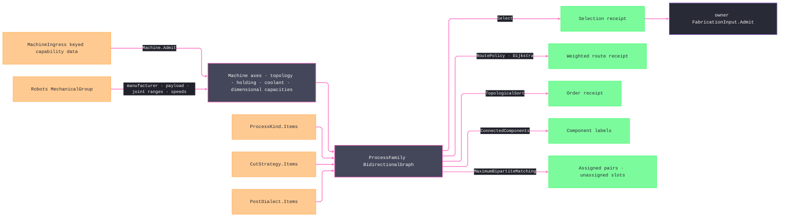

# [RASM_FABRICATION_PROCESS_FAMILY]

`ProcessKind`, `ProcessModality`, `InteractionKind`, `PhysicsKind`, `CutStrategy`, and `PostDialect` remain bounded generated vocabularies. `Machine.Admit` generates equipment from keyed capability data, physical axes, holding, topology, and dimensional envelopes; canonical archetypes are `MachineIngress.Seed` data, never named machine API. Keyed selection accumulates axis failures before `ProcessFamily` resolves selection, ordering, connected families, policy-weighted compatibility routes, and slot-preserving fleet matching through typed receipts.

`PostDialect` binds grammar, work-offset policy, compensation, arc mode, physical-record cap, numeric rendering, word retention, modality, features, and command overrides. `MachineCapacity` carries removal, turning, thermal, jet, erosion, extrusion/deposition, resin, powder, forming, joining, and robot envelopes through `UnitsNet`; `CoolantDelivery` carries delivery pressure, temperature, and concentration. `Machine.Admit(MachineIngress)` projects native manufacturer, payload, joint range, and speed evidence without escaping `Robots` types.

`MachineCapacity.Facts` is the one envelope correspondence: each case emits quantity facts and robot joint-limit facts once, and validity with all queries reads that stream. `Machine.Capacity<TQuantity>` folds a chosen quantity axis through a `CapacityFold` row over `UnitMath`; `Machine.Capacity(MachineAxis)` returns the matching admitted joint limit. `ProcessKind.Demands` declares which `CapacityKind` a process requires, so equipment fitness is one equality rather than an enumerated physics table with per-process exceptions.

Wire posture: HOST-LOCAL. These axes cross only the in-process `FabricationInput` seam to the physics, toolpath, kinematics, posting, tooling, and fixturing kernels — never a browser or peer wire; no row sits between wire and rail.

## [01]-[INDEX]

- [01]-[PROCESS_FAMILY]: owns bounded process axes, generated equipment, graph relations, keyed admission, compatibility queries, and allocation receipts.

## [02]-[PROCESS_FAMILY]

- Owner: bounded smart enums own process, physics, strategy, kinematics, holding, coolant, and dialect grammar; `Machine` owns admitted runtime equipment; `ProcessFamily` owns their relational graph.
- Cases: `ProcessModality` covers subtractive, thermal, abrasive, erosion, additive, formed, and joined strategy postures. `InteractionKind` retains every modality's contact, jet, beam, discharge, deposition, fusion, cure, deformation, and bond mechanisms without a false modality-wide contact flag. `PhysicsKind` separates subtractive, thermal, abrasive, fused-filament, deposition, joining, wire erosion, resin, powder, and forming inputs. `ProcessKind` adds grinding, sawing, deposition, vat polymerization, and powder-bed production. `MachineIngress.Seed` rows cover every `CapacityKind` a process demands, so no admitted process is unallocatable against the canonical fleet; a press brake names its synchronized ram and backgauge axes, and a turn-mill carries both its turning and its live-tool removal envelope.
- Entry: `Machine.Admit` consumes one `MachineIngress` case; `ProcessFamily.Admit` consumes a machine registry; `FamilyOp.Select` carries one admitted `ProcessSelection`; and `ProcessFamily.Apply` consumes one `FamilyOp` modality.
- Auto: `ProcessPhysics` reads `ProcessKind.Physics`; toolpath admission reads `ProcessModality.Admits`; and posting resolves the selected dialect through `PostDialect.Admits` and enforces `PostDialect.BlockCap` where a controller stores a bounded program. Kinematics reads `Machine.Topology`, `KinematicClass.OrientationDof`, and `Machine.Axes`; fixturing reads `Machine.Holding`; posting reads grammar, admitted work-offset range, compensation, arc, retention, feature, render, and override columns. Machine admission proves every quantity fact finite and positive unless its axis is signed, retains every admitted joint limit, and proves each admitted process reaches a capacity whose case-owned `CapacityKind` equals its `Demands`. Job-size limits remain execution policy.
- Receipt: `FamilyResult` returns admitted selection, weighted or unreachable paths, ordering, components, allocation pairs, and unassigned demand slots without exposing mutable graph state.
- Packages: `Thinktecture.Runtime.Extensions`, `LanguageExt.Core`, `QuikGraph`, `UnitsNet`, and `Robots` compose at their owning boundaries.
- Growth: a machine is one `MachineIngress.Seed` row; a compatibility is one graph edge; a query is one `FamilyOp` case; a bounded vocabulary adds one generated row. An envelope dimension is one `CapacityAxis` row with one `CapacityFact` on the owning capacity case; an aggregation is one `CapacityFold` row; a process's equipment demand is its `CapacityKind` column.
- Boundary: process, machine, modality, strategy, kinematics, holding, and dialect remain independent axes. Machine topology and physical axes are authoritative for motion; dialect rows contain capability data only; every textual key admits once through `ProcessFamily.Admit<TAxis>`.

```csharp signature
// --- [RUNTIME_PRELUDE] ----------------------------------------------------------------------------------------------------------------------------
using System.Linq;
using LanguageExt;
using LanguageExt.Common;
using Rasm.Domain;
using LanguageExt.Traits;
using QuikGraph;
using QuikGraph.Algorithms;
using QuikGraph.Algorithms.ConnectedComponents;
using Rasm.Numerics;
using Robots;
using Thinktecture;
using UnitsNet;
using static LanguageExt.Prelude;

namespace Rasm.Fabrication.Process;

// --- [TYPES] --------------------------------------------------------------------------------------------------------------------------------------
[SmartEnum<string>]
public sealed partial class CutDimensionality {
    public static readonly CutDimensionality Planar = new("2.5d");
    public static readonly CutDimensionality Surface = new("3d-surface");
    public static readonly CutDimensionality MultiAxis = new("multi-axis");
}

[SmartEnum<string>]
public sealed partial class CutStrategy {
    public static readonly CutStrategy BoundaryPass = new("boundary-pass", CutDimensionality.Planar);
    public static readonly CutStrategy PocketClear = new("pocket-clear", CutDimensionality.Planar);
    public static readonly CutStrategy Peck = new("peck", CutDimensionality.Planar);
    public static readonly CutStrategy Adaptive = new("adaptive", CutDimensionality.Planar);
    public static readonly CutStrategy RadialSweep = new("radial-sweep", CutDimensionality.Planar);
    public static readonly CutStrategy PlungeDwell = new("plunge-dwell", CutDimensionality.Planar);
    public static readonly CutStrategy Helical = new("helical", CutDimensionality.Planar);
    public static readonly CutStrategy ThreadMill = new("thread-mill", CutDimensionality.Planar);
    public static readonly CutStrategy LayerWalk = new("layer-walk", CutDimensionality.Planar);
    public static readonly CutStrategy Waterline = new("waterline", CutDimensionality.Surface);
    public static readonly CutStrategy Scallop = new("scallop", CutDimensionality.Surface);
    public static readonly CutStrategy Pencil = new("pencil", CutDimensionality.Surface);
    public static readonly CutStrategy Rest = new("rest", CutDimensionality.Surface);
    public static readonly CutStrategy ThreePlusTwo = new("three-plus-two", CutDimensionality.MultiAxis);
    public static readonly CutStrategy Swarf = new("swarf", CutDimensionality.MultiAxis);
    public static readonly CutStrategy DrillCycle = new("drill-cycle", CutDimensionality.Planar);
    public static readonly CutStrategy BoreCycle = new("bore-cycle", CutDimensionality.Planar);
    public static readonly CutStrategy ReamCycle = new("ream-cycle", CutDimensionality.Planar);
    public static readonly CutStrategy Face = new("face", CutDimensionality.Planar);
    public static readonly CutStrategy Slot = new("slot", CutDimensionality.Planar);
    public static readonly CutStrategy Trochoidal = new("trochoidal", CutDimensionality.Planar);
    public static readonly CutStrategy Raster = new("raster", CutDimensionality.Surface);
    public static readonly CutStrategy Spiral = new("spiral", CutDimensionality.Surface);
    public static readonly CutStrategy Morph = new("morph", CutDimensionality.Surface);
    public static readonly CutStrategy Geodesic = new("geodesic", CutDimensionality.Surface);
    public static readonly CutStrategy Rotary = new("rotary", CutDimensionality.MultiAxis);
    public static readonly CutStrategy FiveAxisContour = new("five-axis-contour", CutDimensionality.MultiAxis);
    public static readonly CutStrategy LayerContour = new("layer-contour", CutDimensionality.Planar);
    public static readonly CutStrategy LayerInfill = new("layer-infill", CutDimensionality.Planar);
    public static readonly CutStrategy Support = new("support", CutDimensionality.Planar);
    public static readonly CutStrategy Seam = new("seam", CutDimensionality.MultiAxis);
    public static readonly CutStrategy Spot = new("spot", CutDimensionality.Planar);
    public static readonly CutStrategy Form = new("form", CutDimensionality.Planar);

    public CutDimensionality Dimensionality { get; }
}

[SmartEnum<string>]
public sealed partial class ModalityClass {
    public static readonly ModalityClass Removal = new("removal");
    public static readonly ModalityClass Additive = new("additive");
    public static readonly ModalityClass Formed = new("formed");
    public static readonly ModalityClass Joined = new("joined");
}

[SmartEnum<string>]
public sealed partial class PhysicsKind {
    public static readonly PhysicsKind Subtractive = new("subtractive");
    public static readonly PhysicsKind Thermal = new("thermal");
    public static readonly PhysicsKind Abrasive = new("abrasive");
    public static readonly PhysicsKind Fff = new("fff");
    public static readonly PhysicsKind Deposition = new("deposition");
    public static readonly PhysicsKind Joining = new("joining");
    public static readonly PhysicsKind Erosion = new("erosion");
    public static readonly PhysicsKind Resin = new("resin");
    public static readonly PhysicsKind Powder = new("powder");
    public static readonly PhysicsKind Forming = new("forming");
}

[SmartEnum<string>]
public sealed partial class InteractionKind {
    public static readonly InteractionKind SolidContact = new("solid-contact");
    public static readonly InteractionKind PhotonBeam = new("photon-beam");
    public static readonly InteractionKind ElectronBeam = new("electron-beam");
    public static readonly InteractionKind PlasmaJet = new("plasma-jet");
    public static readonly InteractionKind CombustionJet = new("combustion-jet");
    public static readonly InteractionKind AbrasiveJet = new("abrasive-jet");
    public static readonly InteractionKind ElectricalDischarge = new("electrical-discharge");
    public static readonly InteractionKind MoltenDeposition = new("molten-deposition");
    public static readonly InteractionKind PowderFusion = new("powder-fusion");
    public static readonly InteractionKind ResinCure = new("resin-cure");
    public static readonly InteractionKind MaterialJet = new("material-jet");
    public static readonly InteractionKind BinderJet = new("binder-jet");
    public static readonly InteractionKind SheetBond = new("sheet-bond");
    public static readonly InteractionKind PlasticDeformation = new("plastic-deformation");
    public static readonly InteractionKind ArcFusion = new("arc-fusion");
    public static readonly InteractionKind SolidStateBond = new("solid-state-bond");
    public static readonly InteractionKind BrazedJoint = new("brazed-joint");
    public static readonly InteractionKind AdhesiveBond = new("adhesive-bond");
}

[SmartEnum<string>]
public sealed partial class ProcessModality {
    public static readonly ProcessModality Subtractive = new("subtractive", ModalityClass.Removal, Set(InteractionKind.SolidContact),
        Set(CutStrategy.BoundaryPass, CutStrategy.PocketClear, CutStrategy.Peck, CutStrategy.Adaptive, CutStrategy.RadialSweep, CutStrategy.PlungeDwell,
            CutStrategy.Helical, CutStrategy.ThreadMill, CutStrategy.Waterline, CutStrategy.Scallop, CutStrategy.Pencil, CutStrategy.Rest,
            CutStrategy.ThreePlusTwo, CutStrategy.Swarf, CutStrategy.DrillCycle, CutStrategy.BoreCycle, CutStrategy.ReamCycle,
            CutStrategy.Face, CutStrategy.Slot, CutStrategy.Trochoidal, CutStrategy.Raster, CutStrategy.Spiral, CutStrategy.Morph,
            CutStrategy.Geodesic, CutStrategy.Rotary, CutStrategy.FiveAxisContour));
    public static readonly ProcessModality Thermal = new("thermal", ModalityClass.Removal,
        Set(InteractionKind.PhotonBeam, InteractionKind.ElectronBeam, InteractionKind.PlasmaJet, InteractionKind.CombustionJet),
        Set(CutStrategy.BoundaryPass, CutStrategy.Helical, CutStrategy.Raster, CutStrategy.Spiral));
    public static readonly ProcessModality Abrasive = new("abrasive", ModalityClass.Removal,
        Set(InteractionKind.AbrasiveJet, InteractionKind.SolidContact), Set(CutStrategy.BoundaryPass, CutStrategy.Helical));
    public static readonly ProcessModality Erosion =
        new("erosion", ModalityClass.Removal, Set(InteractionKind.ElectricalDischarge), Set(CutStrategy.BoundaryPass, CutStrategy.PlungeDwell));
    public static readonly ProcessModality Additive = new("additive", ModalityClass.Additive,
        Set(InteractionKind.MoltenDeposition, InteractionKind.PowderFusion, InteractionKind.ResinCure, InteractionKind.MaterialJet,
            InteractionKind.BinderJet, InteractionKind.SheetBond),
        Set(CutStrategy.LayerWalk, CutStrategy.LayerContour, CutStrategy.LayerInfill, CutStrategy.Support, CutStrategy.Raster));
    public static readonly ProcessModality Formed =
        new("formed", ModalityClass.Formed, Set(InteractionKind.PlasticDeformation), Set(CutStrategy.Form));
    public static readonly ProcessModality Joined = new("joined", ModalityClass.Joined,
        Set(InteractionKind.ArcFusion, InteractionKind.SolidStateBond, InteractionKind.BrazedJoint, InteractionKind.AdhesiveBond),
        Set(CutStrategy.BoundaryPass, CutStrategy.Seam, CutStrategy.Spot));

    public ModalityClass Class { get; }
    public Set<InteractionKind> Interactions { get; }
    public Set<CutStrategy> Strategies { get; }

    public bool Admits(CutStrategy strategy) => Strategies.Contains(strategy);
}

[SmartEnum<string>]
public sealed partial class KinematicClass {
    public static readonly KinematicClass CartesianGantry = new("cartesian-gantry", minAxes: 2, orientationDof: 0);
    public static readonly KinematicClass LinearLift = new("linear-lift", minAxes: 1, orientationDof: 0);
    public static readonly KinematicClass RotarySpindle = new("rotary-spindle", minAxes: 2, orientationDof: 1);
    public static readonly KinematicClass ArticulatedArm = new("articulated-arm", minAxes: 6, orientationDof: 3);
    public static readonly KinematicClass DeltaParallel = new("delta-parallel", minAxes: 3, orientationDof: 0);
    public static readonly KinematicClass TableTable = new("table-table", minAxes: 5, orientationDof: 2);
    public static readonly KinematicClass HeadHead = new("head-head", minAxes: 5, orientationDof: 2);
    public static readonly KinematicClass HeadTable = new("head-table", minAxes: 5, orientationDof: 2);
    public static readonly KinematicClass Nutating = new("nutating", minAxes: 5, orientationDof: 2);

    public int MinAxes { get; }
    public int OrientationDof { get; }
}

[SmartEnum<string>]
public sealed partial class HoldingClass {
    public static readonly HoldingClass Mechanical = new("mechanical");
    public static readonly HoldingClass Revolved = new("revolved");
    public static readonly HoldingClass Vacuum = new("vacuum");
    public static readonly HoldingClass Magnetic = new("magnetic");
    public static readonly HoldingClass Bed = new("bed");
}

[SmartEnum<string>]
public sealed partial class CapacityKind {
    public static readonly CapacityKind Removal = new("removal");
    public static readonly CapacityKind Turning = new("turning");
    public static readonly CapacityKind Thermal = new("thermal");
    public static readonly CapacityKind Jet = new("jet");
    public static readonly CapacityKind Erosion = new("erosion");
    public static readonly CapacityKind Additive = new("additive");
    public static readonly CapacityKind Resin = new("resin");
    public static readonly CapacityKind Powder = new("powder");
    public static readonly CapacityKind Forming = new("forming");
    public static readonly CapacityKind Joining = new("joining");
    public static readonly CapacityKind Robot = new("robot");
}

[SmartEnum<string>]
public sealed partial class CapacityAxis {
    public static readonly CapacityAxis TravelX = new("travel-x");
    public static readonly CapacityAxis TravelY = new("travel-y");
    public static readonly CapacityAxis TravelZ = new("travel-z");
    public static readonly CapacityAxis Swing = new("swing");
    public static readonly CapacityAxis BetweenCenters = new("between-centers");
    public static readonly CapacityAxis BedLength = new("bed-length");
    public static readonly CapacityAxis Reach = new("reach");
    public static readonly CapacityAxis Feed = new("feed");
    public static readonly CapacityAxis Traverse = new("traverse");
    public static readonly CapacityAxis DepositionRate = new("deposition-rate");
    public static readonly CapacityAxis ScanSpeed = new("scan-speed");
    public static readonly CapacityAxis PeelSpeed = new("peel-speed");
    public static readonly CapacityAxis ElectrodeFeed = new("electrode-feed");
    public static readonly CapacityAxis TravelSpeed = new("travel-speed");
    public static readonly CapacityAxis Spindle = new("spindle");
    public static readonly CapacityAxis SourcePower = new("source-power");
    public static readonly CapacityAxis SpindleTorque = new("spindle-torque");
    public static readonly CapacityAxis Thrust = new("thrust");
    public static readonly CapacityAxis ClampForce = new("clamp-force");
    public static readonly CapacityAxis PressCapacity = new("press-capacity");
    public static readonly CapacityAxis SupplyPressure = new("supply-pressure");
    public static readonly CapacityAxis ProcessTemperature = new("process-temperature", signed: true);
    public static readonly CapacityAxis StrokeEnergy = new("stroke-energy");
    public static readonly CapacityAxis Payload = new("payload");

    // A signed axis is a level, not a magnitude: a chilled chamber or cryogenic bed is a valid capacity below zero.
    public bool Signed { get; }
}

[SmartEnum<string>]
public sealed partial class CapacityFold {
    public static readonly CapacityFold Minimum = new("minimum");
    public static readonly CapacityFold Maximum = new("maximum");
    public static readonly CapacityFold Total = new("total");
    public static readonly CapacityFold Mean = new("mean");

    public Option<TQuantity> Apply<TQuantity>(Seq<TQuantity> values, Enum unit)
        where TQuantity : IQuantity => values.IsEmpty
        ? None
        : Some(Switch(
            state: (Values: values, Unit: unit),
            minimum: static state => UnitMath.Min(state.Values, state.Unit),
            maximum: static state => UnitMath.Max(state.Values, state.Unit),
            total: static state => UnitMath.Sum(state.Values, state.Unit),
            mean: static state => UnitMath.Average(state.Values, state.Unit)));
}

[SmartEnum<string>]
public sealed partial class CoolantDelivery {
    public static readonly CoolantDelivery Dry = new("dry", None, None, Ratio.FromPercent(0.0));
    public static readonly CoolantDelivery Flood = new("flood", Some(Pressure.FromBars(3.0)), None, Ratio.FromPercent(8.0));
    public static readonly CoolantDelivery Mist = new("mist", Some(Pressure.FromBars(5.0)), None, Ratio.FromPercent(2.0));
    public static readonly CoolantDelivery MinimumQuantity = new("minimum-quantity", Some(Pressure.FromBars(6.0)), None, Ratio.FromPercent(0.5));
    public static readonly CoolantDelivery ThroughTool = new("through-tool", Some(Pressure.FromBars(70.0)), None, Ratio.FromPercent(8.0));
    public static readonly CoolantDelivery HighPressure = new("high-pressure", Some(Pressure.FromBars(150.0)), None, Ratio.FromPercent(8.0));
    public static readonly CoolantDelivery Cryogenic = new("cryogenic", Some(Pressure.FromBars(10.0)), Some(Temperature.FromDegreesCelsius(-196.0)), Ratio.FromPercent(0.0));

    public Option<Pressure> Pressure { get; }
    public Option<Temperature> Temperature { get; }
    public Ratio Concentration { get; }
}

[SmartEnum<string>]
public sealed partial class PostFamily {
    public static readonly PostFamily WordAddress = new("word-address");
    public static readonly PostFamily Conversational = new("conversational");
    public static readonly PostFamily AdditiveGcode = new("additive");
    public static readonly PostFamily Forming = new("forming");
}

[SmartEnum<string>]
public sealed partial class CycleGrammar {
    public static readonly CycleGrammar SingleBlock = new("single-block");
    public static readonly CycleGrammar Expanded = new("expanded");
    public static readonly CycleGrammar DialectCycle = new("dialect-cycle");
}

[SmartEnum<string>]
public sealed partial class MacroGrammar {
    public static readonly MacroGrammar MacroB = new("macro-b");
    public static readonly MacroGrammar RParam = new("r-param");
    public static readonly MacroGrammar QParam = new("q-param");
    public static readonly MacroGrammar UserTask = new("user-task");
    public static readonly MacroGrammar None = new("none");
}

[SmartEnum<string>]
public sealed partial class SubprogramGrammar {
    public static readonly SubprogramGrammar M98 = new("m98");
    public static readonly SubprogramGrammar Label = new("label");
    public static readonly SubprogramGrammar None = new("none");
}

[SmartEnum<string>]
public sealed partial class ArcMode {
    public static readonly ArcMode Ijk = new("ijk");
    public static readonly ArcMode RWord = new("r-word");
    public static readonly ArcMode Both = new("both");
}

[SmartEnum<string>]
public sealed partial class CutterCompKind {
    public static readonly CutterCompKind Radius = new("radius");
    public static readonly CutterCompKind Length = new("length");
}

[SmartEnum<string>]
public sealed partial class WordRetention {
    public static readonly WordRetention Modal = new("modal");
    public static readonly WordRetention Explicit = new("explicit");
}

[SmartEnum<string>]
public sealed partial class DialectFeature {
    public static readonly DialectFeature Metric = new("metric");
    public static readonly DialectFeature Imperial = new("imperial");
    public static readonly DialectFeature Absolute = new("absolute");
    public static readonly DialectFeature Incremental = new("incremental");
    public static readonly DialectFeature PlaneSelection = new("plane-selection");
    public static readonly DialectFeature Rotary = new("rotary");
    public static readonly DialectFeature Tcp = new("tcp");
    public static readonly DialectFeature InverseTime = new("inverse-time");
    public static readonly DialectFeature Polar = new("polar");
    public static readonly DialectFeature Cylindrical = new("cylindrical");
    public static readonly DialectFeature Spline = new("spline");
    public static readonly DialectFeature Probing = new("probing");
    public static readonly DialectFeature ToolChange = new("tool-change");
    public static readonly DialectFeature RigidTap = new("rigid-tap");
    public static readonly DialectFeature ThreadCycle = new("thread-cycle");
    public static readonly DialectFeature TimeDwell = new("time-dwell");
    public static readonly DialectFeature RevolutionDwell = new("revolution-dwell");
    public static readonly DialectFeature LineNumbers = new("line-numbers");
    public static readonly DialectFeature Checksum = new("checksum");
}

// --- [MODELS] -------------------------------------------------------------------------------------------------------------------------------------
[ComplexValueObject]
public sealed partial class WcsRoster {
    public int Slots { get; }
    public int ExtendedBase { get; }
    public int Extended { get; }
    public int Total => Slots + Extended;

    static partial void ValidateFactoryArguments(
        ref ValidationError? validationError,
        ref int slots,
        ref int extendedBase,
        ref int extended) =>
        validationError = slots >= 0 && extendedBase >= 0 && extended >= 0 && (extended == 0 || extendedBase > 0)
            ? null
            : new ValidationError("<work-offset-range-degenerate>");

    public static Fin<WcsRoster> Admit(int slots, int extendedBase, int extended) =>
        Validate(slots, extendedBase, extended, out WcsRoster roster) is { } error
            ? Fin.Fail<WcsRoster>(new GeometryFault.DegenerateInput(Kind.Brep, -1, error.Message).ToError())
            : Fin.Succ(roster);
}

[SmartEnum<string>]
public sealed partial class PostDialect {
    public static readonly PostDialect LinuxCnc = new("linuxcnc", PostFamily.WordAddress, CycleGrammar.SingleBlock, MacroGrammar.None,
        SubprogramGrammar.Label, WcsRoster.Create(6, 1, 3), Set(CutterCompKind.Radius, CutterCompKind.Length), Some(ArcMode.Both), blockCap: None, decimals: 4, WordRetention.Modal,
        Set(ProcessModality.Subtractive, ProcessModality.Thermal, ProcessModality.Abrasive, ProcessModality.Erosion),
        Set(DialectFeature.Metric, DialectFeature.Imperial, DialectFeature.Absolute, DialectFeature.Incremental, DialectFeature.PlaneSelection,
            DialectFeature.Rotary, DialectFeature.Tcp, DialectFeature.InverseTime, DialectFeature.Polar, DialectFeature.Spline,
            DialectFeature.Probing, DialectFeature.ToolChange, DialectFeature.RigidTap, DialectFeature.ThreadCycle,
            DialectFeature.TimeDwell, DialectFeature.RevolutionDwell, DialectFeature.LineNumbers), Map(("thread-cycle", "G76")));
    public static readonly PostDialect Grbl = new("grbl", PostFamily.WordAddress, CycleGrammar.Expanded, MacroGrammar.None,
        SubprogramGrammar.None, WcsRoster.Create(6, 0, 0), Set<CutterCompKind>(), Some(ArcMode.Both), blockCap: None, decimals: 3, WordRetention.Modal,
        Set(ProcessModality.Subtractive, ProcessModality.Thermal),
        Set(DialectFeature.Metric, DialectFeature.Imperial, DialectFeature.Absolute, DialectFeature.Incremental, DialectFeature.PlaneSelection,
            DialectFeature.ToolChange, DialectFeature.TimeDwell, DialectFeature.LineNumbers, DialectFeature.Checksum), Map<string, string>());
    public static readonly PostDialect Fanuc = new("fanuc", PostFamily.WordAddress, CycleGrammar.SingleBlock, MacroGrammar.MacroB,
        SubprogramGrammar.M98, WcsRoster.Create(6, 1, 48), Set(CutterCompKind.Radius, CutterCompKind.Length), Some(ArcMode.Both), blockCap: None, decimals: 3, WordRetention.Modal,
        Set(ProcessModality.Subtractive, ProcessModality.Abrasive, ProcessModality.Erosion, ProcessModality.Additive, ProcessModality.Joined),
        Set(DialectFeature.Metric, DialectFeature.Imperial, DialectFeature.Absolute, DialectFeature.Incremental, DialectFeature.PlaneSelection,
            DialectFeature.Rotary, DialectFeature.Tcp, DialectFeature.InverseTime, DialectFeature.Polar, DialectFeature.Cylindrical,
            DialectFeature.Spline, DialectFeature.Probing, DialectFeature.ToolChange, DialectFeature.RigidTap, DialectFeature.ThreadCycle,
            DialectFeature.TimeDwell, DialectFeature.RevolutionDwell, DialectFeature.LineNumbers), Map(("thread-cycle", "G76")));
    public static readonly PostDialect Haas = new("haas", PostFamily.WordAddress, CycleGrammar.SingleBlock, MacroGrammar.MacroB,
        SubprogramGrammar.M98, WcsRoster.Create(6, 1, 99), Set(CutterCompKind.Radius, CutterCompKind.Length), Some(ArcMode.Both), blockCap: None, decimals: 4, WordRetention.Modal,
        Set(ProcessModality.Subtractive),
        Set(DialectFeature.Metric, DialectFeature.Imperial, DialectFeature.Absolute, DialectFeature.Incremental, DialectFeature.PlaneSelection,
            DialectFeature.Rotary, DialectFeature.Tcp, DialectFeature.InverseTime, DialectFeature.Probing, DialectFeature.ToolChange,
            DialectFeature.RigidTap, DialectFeature.ThreadCycle, DialectFeature.TimeDwell, DialectFeature.RevolutionDwell,
            DialectFeature.LineNumbers), Map(("thread-cycle", "G76")));
    public static readonly PostDialect Mazak = new("mazak", PostFamily.WordAddress, CycleGrammar.SingleBlock, MacroGrammar.MacroB,
        SubprogramGrammar.M98, WcsRoster.Create(6, 1, 48), Set(CutterCompKind.Radius, CutterCompKind.Length), Some(ArcMode.Both), blockCap: None, decimals: 4, WordRetention.Modal,
        Set(ProcessModality.Subtractive),
        Set(DialectFeature.Metric, DialectFeature.Imperial, DialectFeature.Absolute, DialectFeature.Incremental, DialectFeature.PlaneSelection,
            DialectFeature.Rotary, DialectFeature.Tcp, DialectFeature.InverseTime, DialectFeature.Polar, DialectFeature.Cylindrical,
            DialectFeature.Spline, DialectFeature.Probing, DialectFeature.ToolChange, DialectFeature.RigidTap, DialectFeature.ThreadCycle,
            DialectFeature.TimeDwell, DialectFeature.RevolutionDwell, DialectFeature.LineNumbers), Map<string, string>());
    public static readonly PostDialect Hypertherm = new("hypertherm", PostFamily.WordAddress, CycleGrammar.Expanded, MacroGrammar.None,
        SubprogramGrammar.M98, WcsRoster.Create(1, 0, 0), Set(CutterCompKind.Radius), Some(ArcMode.Ijk), blockCap: None, decimals: 4, WordRetention.Modal,
        Set(ProcessModality.Thermal),
        Set(DialectFeature.Metric, DialectFeature.Imperial, DialectFeature.Absolute, DialectFeature.Incremental, DialectFeature.PlaneSelection,
            DialectFeature.TimeDwell, DialectFeature.LineNumbers, DialectFeature.Checksum), Map<string, string>());
    public static readonly PostDialect Siemens840D = new("siemens-840d", PostFamily.WordAddress, CycleGrammar.DialectCycle, MacroGrammar.RParam,
        SubprogramGrammar.Label, WcsRoster.Create(4, 1, 95), Set(CutterCompKind.Radius, CutterCompKind.Length), Some(ArcMode.Both), blockCap: None, decimals: 3, WordRetention.Modal,
        Set(ProcessModality.Subtractive, ProcessModality.Thermal, ProcessModality.Erosion),
        Set(DialectFeature.Metric, DialectFeature.Imperial, DialectFeature.Absolute, DialectFeature.Incremental, DialectFeature.PlaneSelection,
            DialectFeature.Rotary, DialectFeature.Tcp, DialectFeature.InverseTime, DialectFeature.Polar, DialectFeature.Cylindrical,
            DialectFeature.Spline, DialectFeature.Probing, DialectFeature.ToolChange, DialectFeature.RigidTap, DialectFeature.ThreadCycle,
            DialectFeature.TimeDwell, DialectFeature.RevolutionDwell, DialectFeature.LineNumbers), Map<string, string>());
    public static readonly PostDialect HeidenhainTnc = new("heidenhain-tnc", PostFamily.Conversational, CycleGrammar.DialectCycle, MacroGrammar.QParam,
        SubprogramGrammar.Label, WcsRoster.Create(0, 1, 99), Set(CutterCompKind.Radius, CutterCompKind.Length), Some(ArcMode.Ijk), blockCap: None, decimals: 3, WordRetention.Explicit,
        Set(ProcessModality.Subtractive),
        Set(DialectFeature.Metric, DialectFeature.Absolute, DialectFeature.Incremental, DialectFeature.PlaneSelection, DialectFeature.Rotary,
            DialectFeature.Tcp, DialectFeature.InverseTime, DialectFeature.Polar, DialectFeature.Cylindrical, DialectFeature.Spline,
            DialectFeature.Probing, DialectFeature.ToolChange, DialectFeature.RigidTap, DialectFeature.ThreadCycle,
            DialectFeature.TimeDwell, DialectFeature.RevolutionDwell, DialectFeature.LineNumbers), Map<string, string>());
    public static readonly PostDialect OkumaOsp = new("okuma-osp", PostFamily.WordAddress, CycleGrammar.DialectCycle, MacroGrammar.UserTask,
        SubprogramGrammar.Label, WcsRoster.Create(6, 1, 50), Set(CutterCompKind.Radius, CutterCompKind.Length), Some(ArcMode.Both), blockCap: None, decimals: 4, WordRetention.Modal,
        Set(ProcessModality.Subtractive),
        Set(DialectFeature.Metric, DialectFeature.Imperial, DialectFeature.Absolute, DialectFeature.Incremental, DialectFeature.PlaneSelection,
            DialectFeature.Rotary, DialectFeature.Tcp, DialectFeature.InverseTime, DialectFeature.Polar, DialectFeature.Cylindrical,
            DialectFeature.Spline, DialectFeature.Probing, DialectFeature.ToolChange, DialectFeature.RigidTap, DialectFeature.ThreadCycle,
            DialectFeature.TimeDwell, DialectFeature.RevolutionDwell, DialectFeature.LineNumbers), Map<string, string>());
    public static readonly PostDialect Fagor = new("fagor", PostFamily.WordAddress, CycleGrammar.SingleBlock, MacroGrammar.RParam,
        SubprogramGrammar.Label, WcsRoster.Create(6, 1, 20), Set(CutterCompKind.Radius, CutterCompKind.Length), Some(ArcMode.Both), blockCap: None, decimals: 4, WordRetention.Modal,
        Set(ProcessModality.Subtractive),
        Set(DialectFeature.Metric, DialectFeature.Imperial, DialectFeature.Absolute, DialectFeature.Incremental, DialectFeature.PlaneSelection,
            DialectFeature.Rotary, DialectFeature.Tcp, DialectFeature.InverseTime, DialectFeature.Polar, DialectFeature.Cylindrical,
            DialectFeature.Spline, DialectFeature.Probing, DialectFeature.ToolChange, DialectFeature.RigidTap, DialectFeature.ThreadCycle,
            DialectFeature.TimeDwell, DialectFeature.RevolutionDwell, DialectFeature.LineNumbers), Map<string, string>());
    public static readonly PostDialect Centroid = new("centroid", PostFamily.WordAddress, CycleGrammar.SingleBlock, MacroGrammar.MacroB,
        SubprogramGrammar.M98, WcsRoster.Create(6, 1, 12), Set(CutterCompKind.Radius, CutterCompKind.Length), Some(ArcMode.Both), blockCap: None, decimals: 4, WordRetention.Modal,
        Set(ProcessModality.Subtractive),
        Set(DialectFeature.Metric, DialectFeature.Imperial, DialectFeature.Absolute, DialectFeature.Incremental, DialectFeature.PlaneSelection,
            DialectFeature.Rotary, DialectFeature.Tcp, DialectFeature.InverseTime, DialectFeature.Probing, DialectFeature.ToolChange,
            DialectFeature.RigidTap, DialectFeature.ThreadCycle, DialectFeature.TimeDwell, DialectFeature.RevolutionDwell,
            DialectFeature.LineNumbers), Map<string, string>());
    public static readonly PostDialect Marlin = new("marlin", PostFamily.AdditiveGcode, CycleGrammar.Expanded, MacroGrammar.None,
        SubprogramGrammar.None, WcsRoster.Create(0, 0, 0), Set<CutterCompKind>(), Some(ArcMode.Both), blockCap: None, decimals: 3, WordRetention.Modal,
        Set(ProcessModality.Additive),
        Set(DialectFeature.Metric, DialectFeature.Absolute, DialectFeature.Incremental, DialectFeature.PlaneSelection,
            DialectFeature.ToolChange, DialectFeature.TimeDwell, DialectFeature.LineNumbers, DialectFeature.Checksum), Map<string, string>());
    public static readonly PostDialect Reprap = new("reprap", PostFamily.AdditiveGcode, CycleGrammar.Expanded, MacroGrammar.None,
        SubprogramGrammar.None, WcsRoster.Create(6, 1, 3), Set<CutterCompKind>(), Some(ArcMode.Both), blockCap: None, decimals: 3, WordRetention.Modal,
        Set(ProcessModality.Additive),
        Set(DialectFeature.Metric, DialectFeature.Absolute, DialectFeature.Incremental, DialectFeature.PlaneSelection,
            DialectFeature.ToolChange, DialectFeature.TimeDwell, DialectFeature.LineNumbers, DialectFeature.Checksum), Map<string, string>());
    public static readonly PostDialect Delem = new("delem", PostFamily.Forming, CycleGrammar.DialectCycle, MacroGrammar.None,
        SubprogramGrammar.None, WcsRoster.Create(0, 0, 0), Set<CutterCompKind>(), None, blockCap: Some(25), decimals: 3, WordRetention.Explicit,
        Set(ProcessModality.Formed),
        Set(DialectFeature.Metric, DialectFeature.Imperial, DialectFeature.Absolute, DialectFeature.Incremental,
            DialectFeature.ToolChange, DialectFeature.TimeDwell, DialectFeature.LineNumbers), Map<string, string>());

    public PostFamily Family { get; }
    public CycleGrammar Cycles { get; }
    public MacroGrammar Macro { get; }
    public SubprogramGrammar Subprogram { get; }
    public WcsRoster Wcs { get; }
    public Set<CutterCompKind> Compensation { get; }
    public Option<ArcMode> Arc { get; }
    public Option<int> BlockCap { get; }
    public int Decimals { get; }
    public WordRetention Retention { get; }
    public Set<ProcessModality> Modalities { get; }
    public Set<DialectFeature> Features { get; }
    public Map<string, string> CodeOverrides { get; }

    public bool Admits(ProcessModality modality) => Modalities.Contains(modality);

    public Option<string> CodeOverride(string commandKey) => CodeOverrides.Find(commandKey);
}

[SmartEnum<string>]
public sealed partial class ProcessKind {
    public static readonly ProcessKind Mill = new("mill", ProcessModality.Subtractive, InteractionKind.SolidContact, PhysicsKind.Subtractive, KinematicClass.CartesianGantry, PostDialect.LinuxCnc, CapacityKind.Removal);
    public static readonly ProcessKind Turn = new("turn", ProcessModality.Subtractive, InteractionKind.SolidContact, PhysicsKind.Subtractive, KinematicClass.RotarySpindle, PostDialect.Fanuc, CapacityKind.Turning);
    public static readonly ProcessKind Route = new("route", ProcessModality.Subtractive, InteractionKind.SolidContact, PhysicsKind.Subtractive, KinematicClass.CartesianGantry, PostDialect.Grbl, CapacityKind.Removal);
    public static readonly ProcessKind Grind = new("grind", ProcessModality.Subtractive, InteractionKind.SolidContact, PhysicsKind.Subtractive, KinematicClass.CartesianGantry, PostDialect.Fanuc, CapacityKind.Removal);
    public static readonly ProcessKind Saw = new("saw", ProcessModality.Subtractive, InteractionKind.SolidContact, PhysicsKind.Subtractive, KinematicClass.CartesianGantry, PostDialect.Fanuc, CapacityKind.Removal);
    public static readonly ProcessKind Laser = new("laser", ProcessModality.Thermal, InteractionKind.PhotonBeam, PhysicsKind.Thermal, KinematicClass.CartesianGantry, PostDialect.Grbl, CapacityKind.Thermal);
    public static readonly ProcessKind Plasma = new("plasma", ProcessModality.Thermal, InteractionKind.PlasmaJet, PhysicsKind.Thermal, KinematicClass.CartesianGantry, PostDialect.Hypertherm, CapacityKind.Thermal);
    public static readonly ProcessKind Waterjet = new("waterjet", ProcessModality.Abrasive, InteractionKind.AbrasiveJet, PhysicsKind.Abrasive, KinematicClass.CartesianGantry, PostDialect.Fanuc, CapacityKind.Jet);
    public static readonly ProcessKind FusedFilament = new("fused-filament", ProcessModality.Additive, InteractionKind.MoltenDeposition, PhysicsKind.Fff, KinematicClass.CartesianGantry, PostDialect.Marlin, CapacityKind.Additive);
    public static readonly ProcessKind Deposition = new("deposition", ProcessModality.Additive, InteractionKind.MoltenDeposition, PhysicsKind.Deposition, KinematicClass.ArticulatedArm, PostDialect.Fanuc, CapacityKind.Additive);
    public static readonly ProcessKind VatPolymer = new("vat-polymer", ProcessModality.Additive, InteractionKind.ResinCure, PhysicsKind.Resin, KinematicClass.CartesianGantry, PostDialect.Marlin, CapacityKind.Resin);
    public static readonly ProcessKind PowderBed = new("powder-bed", ProcessModality.Additive, InteractionKind.PowderFusion, PhysicsKind.Powder, KinematicClass.CartesianGantry, PostDialect.Marlin, CapacityKind.Powder);
    public static readonly ProcessKind Oxyfuel = new("oxyfuel", ProcessModality.Thermal, InteractionKind.CombustionJet, PhysicsKind.Thermal, KinematicClass.CartesianGantry, PostDialect.Hypertherm, CapacityKind.Thermal);
    public static readonly ProcessKind EdmWire = new("edm-wire", ProcessModality.Erosion, InteractionKind.ElectricalDischarge, PhysicsKind.Erosion, KinematicClass.CartesianGantry, PostDialect.Fanuc, CapacityKind.Erosion);
    public static readonly ProcessKind Weld = new("weld", ProcessModality.Joined, InteractionKind.ArcFusion, PhysicsKind.Joining, KinematicClass.ArticulatedArm, PostDialect.Fanuc, CapacityKind.Joining);
    public static readonly ProcessKind PressBrake = new("press-brake", ProcessModality.Formed, InteractionKind.PlasticDeformation, PhysicsKind.Forming, KinematicClass.CartesianGantry, PostDialect.Delem, CapacityKind.Forming);
    public static readonly ProcessKind Drill = new("drill", ProcessModality.Subtractive, InteractionKind.SolidContact, PhysicsKind.Subtractive, KinematicClass.CartesianGantry, PostDialect.Fanuc, CapacityKind.Removal);
    public static readonly ProcessKind Bore = new("bore", ProcessModality.Subtractive, InteractionKind.SolidContact, PhysicsKind.Subtractive, KinematicClass.CartesianGantry, PostDialect.Fanuc, CapacityKind.Removal);
    public static readonly ProcessKind Ream = new("ream", ProcessModality.Subtractive, InteractionKind.SolidContact, PhysicsKind.Subtractive, KinematicClass.CartesianGantry, PostDialect.Fanuc, CapacityKind.Removal);
    public static readonly ProcessKind Hone = new("hone", ProcessModality.Subtractive, InteractionKind.SolidContact, PhysicsKind.Subtractive, KinematicClass.RotarySpindle, PostDialect.Fanuc, CapacityKind.Removal);
    public static readonly ProcessKind Lap = new("lap", ProcessModality.Subtractive, InteractionKind.SolidContact, PhysicsKind.Subtractive, KinematicClass.CartesianGantry, PostDialect.Fanuc, CapacityKind.Removal);
    public static readonly ProcessKind Broach = new("broach", ProcessModality.Subtractive, InteractionKind.SolidContact, PhysicsKind.Subtractive, KinematicClass.LinearLift, PostDialect.Fanuc, CapacityKind.Removal);
    public static readonly ProcessKind GearCut = new("gear-cut", ProcessModality.Subtractive, InteractionKind.SolidContact, PhysicsKind.Subtractive, KinematicClass.RotarySpindle, PostDialect.Siemens840D, CapacityKind.Removal);
    public static readonly ProcessKind Ultrasonic = new("ultrasonic", ProcessModality.Abrasive, InteractionKind.SolidContact, PhysicsKind.Abrasive, KinematicClass.CartesianGantry, PostDialect.Fanuc, CapacityKind.Removal);
    public static readonly ProcessKind ElectronBeam = new("electron-beam", ProcessModality.Thermal, InteractionKind.ElectronBeam, PhysicsKind.Thermal, KinematicClass.CartesianGantry, PostDialect.Siemens840D, CapacityKind.Thermal);
    public static readonly ProcessKind BinderJet = new("binder-jet", ProcessModality.Additive, InteractionKind.BinderJet, PhysicsKind.Powder, KinematicClass.CartesianGantry, PostDialect.Marlin, CapacityKind.Powder);
    public static readonly ProcessKind MaterialJet = new("material-jet", ProcessModality.Additive, InteractionKind.MaterialJet, PhysicsKind.Resin, KinematicClass.CartesianGantry, PostDialect.Marlin, CapacityKind.Resin);
    public static readonly ProcessKind SheetLamination = new("sheet-lamination", ProcessModality.Additive, InteractionKind.SheetBond, PhysicsKind.Deposition, KinematicClass.CartesianGantry, PostDialect.Fanuc, CapacityKind.Additive);
    public static readonly ProcessKind DirectedEnergy = new("directed-energy", ProcessModality.Additive, InteractionKind.PhotonBeam, PhysicsKind.Deposition, KinematicClass.ArticulatedArm, PostDialect.Fanuc, CapacityKind.Additive);
    public static readonly ProcessKind FrictionStir = new("friction-stir", ProcessModality.Joined, InteractionKind.SolidStateBond, PhysicsKind.Joining, KinematicClass.ArticulatedArm, PostDialect.Fanuc, CapacityKind.Joining);
    public static readonly ProcessKind Braze = new("braze", ProcessModality.Joined, InteractionKind.BrazedJoint, PhysicsKind.Joining, KinematicClass.ArticulatedArm, PostDialect.Fanuc, CapacityKind.Joining);
    public static readonly ProcessKind Adhesive = new("adhesive", ProcessModality.Joined, InteractionKind.AdhesiveBond, PhysicsKind.Joining, KinematicClass.ArticulatedArm, PostDialect.Fanuc, CapacityKind.Joining);
    public static readonly ProcessKind Stamp = new("stamp", ProcessModality.Formed, InteractionKind.PlasticDeformation, PhysicsKind.Forming, KinematicClass.LinearLift, PostDialect.Delem, CapacityKind.Forming);
    public static readonly ProcessKind Forge = new("forge", ProcessModality.Formed, InteractionKind.PlasticDeformation, PhysicsKind.Forming, KinematicClass.LinearLift, PostDialect.Delem, CapacityKind.Forming);
    public static readonly ProcessKind RollForm = new("roll-form", ProcessModality.Formed, InteractionKind.PlasticDeformation, PhysicsKind.Forming, KinematicClass.RotarySpindle, PostDialect.Delem, CapacityKind.Forming);
    public static readonly ProcessKind TubeBend = new("tube-bend", ProcessModality.Formed, InteractionKind.PlasticDeformation, PhysicsKind.Forming, KinematicClass.RotarySpindle, PostDialect.Delem, CapacityKind.Forming);

    public ProcessModality Modality { get; }
    public InteractionKind Interaction { get; }
    public PhysicsKind Physics { get; }
    public KinematicClass Kinematics { get; }
    public PostDialect Dialect { get; }
    public CapacityKind Demands { get; }
}

[SmartEnum<string>]
public sealed partial class RobotManufacturer {
    public static readonly RobotManufacturer Abb = new("abb");
    public static readonly RobotManufacturer Kuka = new("kuka");
    public static readonly RobotManufacturer Ur = new("ur");
    public static readonly RobotManufacturer Staubli = new("staubli");
    public static readonly RobotManufacturer FrankaEmika = new("franka-emika");
    public static readonly RobotManufacturer Doosan = new("doosan");
    public static readonly RobotManufacturer Fanuc = new("fanuc");
    public static readonly RobotManufacturer Igus = new("igus");
    public static readonly RobotManufacturer Jaka = new("jaka");
    public static readonly RobotManufacturer Unspecified = new("unspecified");
}

[Union(ConversionFromValue = ConversionOperatorsGeneration.None)]
public abstract partial record AxisTravel {
    private AxisTravel() { }

    public sealed record Rotary(Angle Minimum, Angle Maximum, RotationalSpeed MaximumSpeed) : AxisTravel;
    public sealed record Linear(Length Minimum, Length Maximum, Speed MaximumSpeed) : AxisTravel;
}

[ComplexValueObject]
public sealed partial class AxisLimit {
    public MachineAxis Axis { get; }
    public AxisTravel Travel { get; }

    static partial void ValidateFactoryArguments(
        ref ValidationError? validationError,
        ref MachineAxis axis,
        ref AxisTravel travel) =>
        validationError = axis is not null && travel is not null && travel.Switch(
            state: axis,
            rotary: static (machineAxis, value) => machineAxis.Rotary && value.Minimum < value.Maximum
                && value.MaximumSpeed > RotationalSpeed.Zero,
            linear: static (machineAxis, value) => !machineAxis.Rotary && value.Minimum < value.Maximum
                && value.MaximumSpeed > Speed.Zero)
            ? null
            : new ValidationError("<axis-limit-degenerate>");
}

[Union(ConversionFromValue = ConversionOperatorsGeneration.None)]
public abstract partial record CapacityFact {
    private CapacityFact() { }

    public sealed record Quantity(CapacityAxis Axis, IQuantity Value) : CapacityFact;
    public sealed record Joint(AxisLimit Value) : CapacityFact;
}

[Union(ConversionFromValue = ConversionOperatorsGeneration.None)]
public abstract partial record MachineCapacity(CapacityKind Kind) {
    public sealed record Removal(
        Length X,
        Length Y,
        Length Z,
        Speed Feed,
        RotationalSpeed Spindle,
        Power SpindlePower,
        Torque SpindleTorque,
        Force Thrust) : MachineCapacity(CapacityKind.Removal);
    public sealed record Turning(
        Length Swing,
        Length BetweenCenters,
        Speed Feed,
        RotationalSpeed Spindle,
        Power SpindlePower,
        Torque SpindleTorque) : MachineCapacity(CapacityKind.Turning);
    public sealed record Thermal(
        Length X,
        Length Y,
        Power SourcePower,
        Temperature ProcessTemperature,
        Pressure AssistGas) : MachineCapacity(CapacityKind.Thermal);
    public sealed record Jet(
        Length X,
        Length Y,
        Length Z,
        Pressure PumpPressure,
        Power PumpPower,
        Speed Traverse) : MachineCapacity(CapacityKind.Jet);
    public sealed record Erosion(
        Length X,
        Length Y,
        Length Z,
        Power GeneratorPower,
        Speed ElectrodeFeed) : MachineCapacity(CapacityKind.Erosion);
    public sealed record Additive(
        Length X,
        Length Y,
        Length Z,
        Speed DepositionRate,
        Temperature Chamber,
        Power SourcePower) : MachineCapacity(CapacityKind.Additive);
    public sealed record Resin(
        Length X,
        Length Y,
        Length Z,
        Power ExposurePower,
        Speed PeelSpeed,
        Temperature VatTemperature) : MachineCapacity(CapacityKind.Resin);
    public sealed record Powder(
        Length X,
        Length Y,
        Length Z,
        Power BeamPower,
        Speed ScanSpeed,
        Temperature BedTemperature) : MachineCapacity(CapacityKind.Powder);
    public sealed record Forming(
        Length Bed,
        Force Capacity,
        Pressure HydraulicPressure,
        Energy StrokeEnergy) : MachineCapacity(CapacityKind.Forming);
    public sealed record Joining(
        Power SourcePower,
        Temperature ProcessTemperature,
        Force ClampForce,
        Speed Travel) : MachineCapacity(CapacityKind.Joining);
    public sealed record Robot(
        RobotManufacturer Manufacturer,
        Mass Payload,
        Length Reach,
        Arr<AxisLimit> Joints) : MachineCapacity(CapacityKind.Robot);

    public Seq<CapacityFact> Facts() => Switch(
        removal: static value => Seq<CapacityFact>(
            new CapacityFact.Quantity(CapacityAxis.TravelX, value.X),
            new CapacityFact.Quantity(CapacityAxis.TravelY, value.Y),
            new CapacityFact.Quantity(CapacityAxis.TravelZ, value.Z),
            new CapacityFact.Quantity(CapacityAxis.Feed, value.Feed),
            new CapacityFact.Quantity(CapacityAxis.Spindle, value.Spindle),
            new CapacityFact.Quantity(CapacityAxis.SourcePower, value.SpindlePower),
            new CapacityFact.Quantity(CapacityAxis.SpindleTorque, value.SpindleTorque),
            new CapacityFact.Quantity(CapacityAxis.Thrust, value.Thrust)),
        turning: static value => Seq<CapacityFact>(
            new CapacityFact.Quantity(CapacityAxis.Swing, value.Swing),
            new CapacityFact.Quantity(CapacityAxis.BetweenCenters, value.BetweenCenters),
            new CapacityFact.Quantity(CapacityAxis.Feed, value.Feed),
            new CapacityFact.Quantity(CapacityAxis.Spindle, value.Spindle),
            new CapacityFact.Quantity(CapacityAxis.SourcePower, value.SpindlePower),
            new CapacityFact.Quantity(CapacityAxis.SpindleTorque, value.SpindleTorque)),
        thermal: static value => Seq<CapacityFact>(
            new CapacityFact.Quantity(CapacityAxis.TravelX, value.X),
            new CapacityFact.Quantity(CapacityAxis.TravelY, value.Y),
            new CapacityFact.Quantity(CapacityAxis.SourcePower, value.SourcePower),
            new CapacityFact.Quantity(CapacityAxis.ProcessTemperature, value.ProcessTemperature),
            new CapacityFact.Quantity(CapacityAxis.SupplyPressure, value.AssistGas)),
        jet: static value => Seq<CapacityFact>(
            new CapacityFact.Quantity(CapacityAxis.TravelX, value.X),
            new CapacityFact.Quantity(CapacityAxis.TravelY, value.Y),
            new CapacityFact.Quantity(CapacityAxis.TravelZ, value.Z),
            new CapacityFact.Quantity(CapacityAxis.SupplyPressure, value.PumpPressure),
            new CapacityFact.Quantity(CapacityAxis.SourcePower, value.PumpPower),
            new CapacityFact.Quantity(CapacityAxis.Traverse, value.Traverse)),
        erosion: static value => Seq<CapacityFact>(
            new CapacityFact.Quantity(CapacityAxis.TravelX, value.X),
            new CapacityFact.Quantity(CapacityAxis.TravelY, value.Y),
            new CapacityFact.Quantity(CapacityAxis.TravelZ, value.Z),
            new CapacityFact.Quantity(CapacityAxis.SourcePower, value.GeneratorPower),
            new CapacityFact.Quantity(CapacityAxis.ElectrodeFeed, value.ElectrodeFeed)),
        additive: static value => Seq<CapacityFact>(
            new CapacityFact.Quantity(CapacityAxis.TravelX, value.X),
            new CapacityFact.Quantity(CapacityAxis.TravelY, value.Y),
            new CapacityFact.Quantity(CapacityAxis.TravelZ, value.Z),
            new CapacityFact.Quantity(CapacityAxis.DepositionRate, value.DepositionRate),
            new CapacityFact.Quantity(CapacityAxis.ProcessTemperature, value.Chamber),
            new CapacityFact.Quantity(CapacityAxis.SourcePower, value.SourcePower)),
        resin: static value => Seq<CapacityFact>(
            new CapacityFact.Quantity(CapacityAxis.TravelX, value.X),
            new CapacityFact.Quantity(CapacityAxis.TravelY, value.Y),
            new CapacityFact.Quantity(CapacityAxis.TravelZ, value.Z),
            new CapacityFact.Quantity(CapacityAxis.SourcePower, value.ExposurePower),
            new CapacityFact.Quantity(CapacityAxis.PeelSpeed, value.PeelSpeed),
            new CapacityFact.Quantity(CapacityAxis.ProcessTemperature, value.VatTemperature)),
        powder: static value => Seq<CapacityFact>(
            new CapacityFact.Quantity(CapacityAxis.TravelX, value.X),
            new CapacityFact.Quantity(CapacityAxis.TravelY, value.Y),
            new CapacityFact.Quantity(CapacityAxis.TravelZ, value.Z),
            new CapacityFact.Quantity(CapacityAxis.SourcePower, value.BeamPower),
            new CapacityFact.Quantity(CapacityAxis.ScanSpeed, value.ScanSpeed),
            new CapacityFact.Quantity(CapacityAxis.ProcessTemperature, value.BedTemperature)),
        forming: static value => Seq<CapacityFact>(
            new CapacityFact.Quantity(CapacityAxis.BedLength, value.Bed),
            new CapacityFact.Quantity(CapacityAxis.PressCapacity, value.Capacity),
            new CapacityFact.Quantity(CapacityAxis.SupplyPressure, value.HydraulicPressure),
            new CapacityFact.Quantity(CapacityAxis.StrokeEnergy, value.StrokeEnergy)),
        joining: static value => Seq<CapacityFact>(
            new CapacityFact.Quantity(CapacityAxis.SourcePower, value.SourcePower),
            new CapacityFact.Quantity(CapacityAxis.ProcessTemperature, value.ProcessTemperature),
            new CapacityFact.Quantity(CapacityAxis.ClampForce, value.ClampForce),
            new CapacityFact.Quantity(CapacityAxis.TravelSpeed, value.Travel)),
        robot: static value => Seq<CapacityFact>(
            new CapacityFact.Quantity(CapacityAxis.Payload, value.Payload),
            new CapacityFact.Quantity(CapacityAxis.Reach, value.Reach))
            + value.Joints.Map(static limit => (CapacityFact)new CapacityFact.Joint(limit)).ToSeq());
}

[Union(ConversionFromValue = ConversionOperatorsGeneration.None)]
public abstract partial record MachineIngress {
    private MachineIngress() { }

    public sealed record Seed(
        string Key,
        Set<ProcessKind> Processes,
        HoldingClass Holding,
        Set<MachineAxis> Axes,
        KinematicClass Topology,
        Set<CoolantDelivery> Coolant,
        Seq<MachineCapacity> Capacities) : MachineIngress;
    public sealed record Robot(
        string Key,
        MechanicalGroup Group,
        Set<ProcessKind> Processes,
        HoldingClass Holding,
        Length Reach,
        Set<CoolantDelivery> Coolant,
        Seq<MachineCapacity> ProcessCapacities) : MachineIngress;
}

[ComplexValueObject]
[ObjectFactory<string>]
public sealed partial class Machine {
    public string Key { get; }
    public Set<ProcessKind> Processes { get; }
    public HoldingClass Holding { get; }
    public Set<MachineAxis> Axes { get; }
    public KinematicClass Topology { get; }
    public Set<CoolantDelivery> Coolant { get; }
    public Seq<MachineCapacity> Capacities { get; }
    public int AxisCount => Axes.Count;

    public bool Admits(ProcessKind process) => Processes.Contains(process);

    public Option<TQuantity> Capacity<TQuantity>(CapacityAxis axis, CapacityFold fold, Enum unit)
        where TQuantity : IQuantity => fold.Apply(
            Capacities.Bind(static capacity => capacity.Facts())
            .Choose(fact => fact is CapacityFact.Quantity row && row.Axis == axis && row.Value is TQuantity typed
                ? Some(typed)
                : None),
            unit);

    public Option<AxisLimit> Capacity(MachineAxis axis) =>
        Capacities.Bind(static capacity => capacity.Facts())
            .Choose(fact => fact is CapacityFact.Joint { Value: { } limit } && limit.Axis == axis
                ? Some(limit)
                : None)
            .HeadOrNone();

    static partial void ValidateFactoryArguments(
        ref ValidationError? validationError,
        ref string key,
        ref Set<ProcessKind> processes,
        ref HoldingClass holding,
        ref Set<MachineAxis> axes,
        ref KinematicClass topology,
        ref Set<CoolantDelivery> coolant,
        ref Seq<MachineCapacity> capacities) =>
        validationError = !string.IsNullOrWhiteSpace(key)
            && !processes.IsEmpty
            && holding is not null
            && !axes.IsEmpty
            && topology is not null
            && axes.Count >= topology.MinAxes
            && axes.Count(static axis => axis.Rotary) >= topology.OrientationDof
            && !capacities.IsEmpty
            && capacities.ForAll(CapacityValid)
            && processes.ForAll(process => capacities.Exists(capacity => CapacityFits(process, capacity)))
                ? null
                : new ValidationError("<machine-degenerate>");

    public static Fin<Machine> Admit(MachineIngress ingress) => ingress is null
        ? Fin.Fail<Machine>(new GeometryFault.DegenerateInput(Kind.Brep, -1, "machine-ingress").ToError())
        : ingress.Switch(
            seed: static value => AdmitSeed(value),
            robot: static value => AdmitRobot(value));

    private static Fin<Machine> AdmitSeed(MachineIngress.Seed seed) =>
        seed is null
            ? Fin.Fail<Machine>(new GeometryFault.DegenerateInput(Kind.Brep, -1, "machine-seed").ToError())
            : Validate(seed.Key, seed.Processes, seed.Holding, seed.Axes, seed.Topology, seed.Coolant, seed.Capacities, out Machine machine) is { } error
                ? Fin.Fail<Machine>(new GeometryFault.DegenerateInput(Kind.Brep, -1, error.Message).ToError())
                : Fin.Succ(machine);

    // Out-parameter seam: the ObjectFactory contract fixes the shape, so the resolved machine binds through a captured local.
    [BoundaryAdapter]
    public static ValidationError? Validate(string? value, IFormatProvider? provider, out Machine? item) {
        Machine? resolved = null;
        ValidationError? error = Seeds
            .Find(row => string.Equals(row.Key, value, StringComparison.Ordinal))
            .Match(
                Some: seed => Validate(
                    seed.Key, seed.Processes, seed.Holding, seed.Axes, seed.Topology, seed.Coolant, seed.Capacities, out resolved),
                None: () => new ValidationError($"<machine-unknown:{value}>"));
        item = resolved;
        return error;
    }

    public string ToValue() => Key;

    private static Fin<Machine> AdmitRobot(MachineIngress.Robot seed) =>
        seed.Group is null || seed.Group.Robot is null || seed.ProcessCapacities.IsEmpty
            ? Fin.Fail<Machine>(new GeometryFault.DegenerateInput(Kind.Brep, -1, "machine:robot").ToError())
            : toSeq(seed.Group.Joints)
            .Traverse(joint => joint.Index < 0 || joint.Index >= RobotAxes.Count
                ? Fin.Fail<AxisLimit>(new GeometryFault.DegenerateInput(Kind.Brep, -1, "machine:robot-axis").ToError())
                : AxisLimit.Validate(
                    RobotAxes[joint.Index],
                    joint is RevoluteJoint
                        ? new AxisTravel.Rotary(
                            Angle.FromRadians(joint.Range.T0),
                            Angle.FromRadians(joint.Range.T1),
                            RotationalSpeed.FromRadiansPerSecond(joint.MaxSpeed))
                        : new AxisTravel.Linear(
                            Length.FromMillimeters(joint.Range.T0),
                            Length.FromMillimeters(joint.Range.T1),
                            Speed.FromMillimetersPerSecond(joint.MaxSpeed)),
                    out AxisLimit limit) is { } error
                        ? Fin.Fail<AxisLimit>(new GeometryFault.DegenerateInput(Kind.Brep, -1, error.Message).ToError())
                        : Fin.Succ(limit))
            .As()
            .Bind(limits => AdmitSeed(new MachineIngress.Seed(
                seed.Key,
                seed.Processes,
                seed.Holding,
                limits.Map(static limit => limit.Axis).ToSet(),
                KinematicClass.ArticulatedArm,
                seed.Coolant,
                seed.ProcessCapacities.Add(new MachineCapacity.Robot(
                    ManufacturerOf(seed.Group.Robot.Manufacturer),
                    Mass.FromKilograms(seed.Group.Robot.Payload),
                    seed.Reach,
                    limits.ToArr())))));

    public static readonly Seq<MachineIngress.Seed> Seeds = Seq(
        new MachineIngress.Seed(
            "mill-5-axis",
            Set(ProcessKind.Mill, ProcessKind.Route, ProcessKind.Grind),
            HoldingClass.Mechanical,
            Set(MachineAxis.X, MachineAxis.Y, MachineAxis.Z, MachineAxis.A, MachineAxis.C),
            KinematicClass.TableTable,
            Set(CoolantDelivery.Dry, CoolantDelivery.Flood, CoolantDelivery.ThroughTool, CoolantDelivery.HighPressure),
            Seq<MachineCapacity>(new MachineCapacity.Removal(
                Length.FromMillimeters(800), Length.FromMillimeters(600), Length.FromMillimeters(500),
                Speed.FromMillimetersPerMinutes(30000), RotationalSpeed.FromRevolutionsPerMinute(18000),
                Power.FromKilowatts(30), Torque.FromNewtonMeters(180), Force.FromKilonewtons(12)))),
        new MachineIngress.Seed(
            "laser-flatbed",
            Set(ProcessKind.Laser),
            HoldingClass.Bed,
            Set(MachineAxis.X, MachineAxis.Y),
            KinematicClass.CartesianGantry,
            Set(CoolantDelivery.Dry),
            Seq<MachineCapacity>(new MachineCapacity.Thermal(
                Length.FromMillimeters(3000), Length.FromMillimeters(1500), Power.FromKilowatts(12),
                Temperature.FromDegreesCelsius(1500), Pressure.FromBars(25)))),
        new MachineIngress.Seed(
            "fff-cartesian",
            Set(ProcessKind.FusedFilament),
            HoldingClass.Bed,
            Set(MachineAxis.X, MachineAxis.Y, MachineAxis.Z),
            KinematicClass.CartesianGantry,
            Set(CoolantDelivery.Dry),
            Seq<MachineCapacity>(new MachineCapacity.Additive(
                Length.FromMillimeters(400), Length.FromMillimeters(400), Length.FromMillimeters(500),
                Speed.FromMillimetersPerMinutes(18000), Temperature.FromDegreesCelsius(120), Power.FromKilowatts(1.5)))),
        new MachineIngress.Seed(
            "press-brake-cnc",
            Set(ProcessKind.PressBrake),
            HoldingClass.Mechanical,
            Set(MachineAxis.Y1, MachineAxis.Y2, MachineAxis.X, MachineAxis.R, MachineAxis.Z1, MachineAxis.Z2),
            KinematicClass.CartesianGantry,
            Set(CoolantDelivery.Dry),
            Seq<MachineCapacity>(new MachineCapacity.Forming(
                Length.FromMillimeters(3200), Force.FromKilonewtons(1700), Pressure.FromBars(300), Energy.FromKilojoules(180)))),
        new MachineIngress.Seed(
            "lathe-turn-mill",
            Set(ProcessKind.Turn, ProcessKind.Drill, ProcessKind.Bore, ProcessKind.Ream),
            HoldingClass.Revolved,
            Set(MachineAxis.X, MachineAxis.Y, MachineAxis.Z, MachineAxis.C, MachineAxis.S1),
            KinematicClass.RotarySpindle,
            Set(CoolantDelivery.Dry, CoolantDelivery.Flood, CoolantDelivery.ThroughTool),
            Seq<MachineCapacity>(
                new MachineCapacity.Turning(
                    Length.FromMillimeters(400), Length.FromMillimeters(1000),
                    Speed.FromMillimetersPerMinutes(20000), RotationalSpeed.FromRevolutionsPerMinute(4500),
                    Power.FromKilowatts(22), Torque.FromNewtonMeters(350)),
                new MachineCapacity.Removal(
                    Length.FromMillimeters(400), Length.FromMillimeters(100), Length.FromMillimeters(1000),
                    Speed.FromMillimetersPerMinutes(10000), RotationalSpeed.FromRevolutionsPerMinute(6000),
                    Power.FromKilowatts(7.5), Torque.FromNewtonMeters(45), Force.FromKilonewtons(4)))),
        new MachineIngress.Seed(
            "waterjet-abrasive",
            Set(ProcessKind.Waterjet),
            HoldingClass.Bed,
            Set(MachineAxis.X, MachineAxis.Y, MachineAxis.Z),
            KinematicClass.CartesianGantry,
            Set(CoolantDelivery.Dry),
            Seq<MachineCapacity>(new MachineCapacity.Jet(
                Length.FromMillimeters(4000), Length.FromMillimeters(2000), Length.FromMillimeters(200),
                Pressure.FromBars(4000), Power.FromKilowatts(75), Speed.FromMillimetersPerMinutes(20000)))),
        new MachineIngress.Seed(
            "plasma-table",
            Set(ProcessKind.Plasma, ProcessKind.Oxyfuel),
            HoldingClass.Bed,
            Set(MachineAxis.X, MachineAxis.Y, MachineAxis.Z),
            KinematicClass.CartesianGantry,
            Set(CoolantDelivery.Dry),
            Seq<MachineCapacity>(new MachineCapacity.Thermal(
                Length.FromMillimeters(6000), Length.FromMillimeters(2500), Power.FromKilowatts(30),
                Temperature.FromDegreesCelsius(20000), Pressure.FromBars(8)))),
        new MachineIngress.Seed(
            "edm-wire-5axis",
            Set(ProcessKind.EdmWire),
            HoldingClass.Mechanical,
            Set(MachineAxis.X, MachineAxis.Y, MachineAxis.Z, MachineAxis.U, MachineAxis.V),
            KinematicClass.CartesianGantry,
            Set(CoolantDelivery.Flood),
            Seq<MachineCapacity>(new MachineCapacity.Erosion(
                Length.FromMillimeters(400), Length.FromMillimeters(300), Length.FromMillimeters(250),
                Power.FromKilowatts(3), Speed.FromMillimetersPerMinutes(300)))),
        new MachineIngress.Seed(
            "lpbf-powder-bed",
            Set(ProcessKind.PowderBed),
            HoldingClass.Bed,
            Set(MachineAxis.X, MachineAxis.Y, MachineAxis.Z),
            KinematicClass.CartesianGantry,
            Set(CoolantDelivery.Dry),
            Seq<MachineCapacity>(new MachineCapacity.Powder(
                Length.FromMillimeters(280), Length.FromMillimeters(280), Length.FromMillimeters(350),
                Power.FromKilowatts(0.5), Speed.FromMillimetersPerSecond(7000), Temperature.FromDegreesCelsius(200)))),
        new MachineIngress.Seed(
            "weld-cell-positioner",
            Set(ProcessKind.Weld, ProcessKind.Braze),
            HoldingClass.Mechanical,
            Set(MachineAxis.J1, MachineAxis.J2, MachineAxis.J3, MachineAxis.J4, MachineAxis.J5, MachineAxis.J6),
            KinematicClass.ArticulatedArm,
            Set(CoolantDelivery.Dry),
            Seq<MachineCapacity>(new MachineCapacity.Joining(
                Power.FromKilowatts(15), Temperature.FromDegreesCelsius(1600),
                Force.FromKilonewtons(5), Speed.FromMillimetersPerMinutes(1500)))));

    private static readonly Arr<MachineAxis> RobotAxes = Arr(
        MachineAxis.J1, MachineAxis.J2, MachineAxis.J3, MachineAxis.J4, MachineAxis.J5, MachineAxis.J6, MachineAxis.J7,
        MachineAxis.X, MachineAxis.Y, MachineAxis.Z, MachineAxis.A, MachineAxis.B, MachineAxis.C);

    private static bool CapacityValid(MachineCapacity capacity) => capacity.Facts().ForAll(static fact => fact.Switch(
        quantity: static row => double.IsFinite((double)row.Value.Value)
            && (row.Axis.Signed || (double)row.Value.Value > 0.0),
        joint: static row => row.Value is not null));

    private static bool CapacityFits(ProcessKind process, MachineCapacity capacity) => capacity.Kind == process.Demands;

    private static RobotManufacturer ManufacturerOf(Manufacturers manufacturer) => manufacturer switch {
        Manufacturers.ABB => RobotManufacturer.Abb,
        Manufacturers.KUKA => RobotManufacturer.Kuka,
        Manufacturers.UR => RobotManufacturer.Ur,
        Manufacturers.Staubli => RobotManufacturer.Staubli,
        Manufacturers.FrankaEmika => RobotManufacturer.FrankaEmika,
        Manufacturers.Doosan => RobotManufacturer.Doosan,
        Manufacturers.Fanuc => RobotManufacturer.Fanuc,
        Manufacturers.Igus => RobotManufacturer.Igus,
        Manufacturers.Jaka => RobotManufacturer.Jaka,
        _ => RobotManufacturer.Unspecified,
    };
}

// --- [BOUNDARIES] ---------------------------------------------------------------------------------------------------------------------------------
[Union(ConversionFromValue = ConversionOperatorsGeneration.None)]
public abstract partial record FamilyNode {
    private FamilyNode() { }

    public sealed record Process(ProcessKind Value) : FamilyNode;
    public sealed record Equipment(Machine Value) : FamilyNode;
    public sealed record Strategy(CutStrategy Value) : FamilyNode;
    public sealed record Dialect(PostDialect Value) : FamilyNode;
    public sealed record Demand(int Slot, ProcessKind Value) : FamilyNode;
    public sealed record Augment(int Value) : FamilyNode;
}

[SmartEnum<string>]
public sealed partial class RoutePolicy {
    public static readonly RoutePolicy Balanced = new("balanced", equipment: 1.0, strategy: 1.0, dialect: 1.0);
    public static readonly RoutePolicy EquipmentFirst = new("equipment-first", equipment: 0.5, strategy: 1.0, dialect: 1.0);
    public static readonly RoutePolicy ProgrammingFirst = new("programming-first", equipment: 1.0, strategy: 0.5, dialect: 0.5);

    public double Equipment { get; }
    public double Strategy { get; }
    public double Dialect { get; }

    public double Weight(FamilyNode relation) => relation.Switch(
        process: static _ => double.PositiveInfinity,
        equipment: _ => Equipment,
        strategy: _ => Strategy,
        dialect: _ => Dialect,
        demand: static _ => double.PositiveInfinity,
        augment: static _ => double.PositiveInfinity);
}

[ComplexValueObject]
public sealed partial class ProcessSelection {
    public string Process { get; }
    public string Machine { get; }
    public string Strategy { get; }
    public string Dialect { get; }

    [BoundaryAdapter]
    static partial void ValidateFactoryArguments(
        ref ValidationError? validationError,
        ref string process,
        ref string machine,
        ref string strategy,
        ref string dialect) =>
        validationError = !string.IsNullOrWhiteSpace(process)
            && !string.IsNullOrWhiteSpace(machine)
            && !string.IsNullOrWhiteSpace(strategy)
            && !string.IsNullOrWhiteSpace(dialect)
                ? null
                : new ValidationError("<process-selection-degenerate>");
}

[Union(ConversionFromValue = ConversionOperatorsGeneration.None)]
public abstract partial record FamilyOp {
    private FamilyOp() { }

    public sealed record Select(ProcessSelection Value) : FamilyOp;
    public sealed record Route(FamilyNode Source, FamilyNode Target, RoutePolicy Policy) : FamilyOp;
    public sealed record Order : FamilyOp;
    public sealed record Components : FamilyOp;
    public sealed record Allocate(Seq<ProcessKind> Demand) : FamilyOp;
}

[Union(ConversionFromValue = ConversionOperatorsGeneration.None)]
public abstract partial record FamilyResult {
    private FamilyResult() { }

    public sealed record Selection(ProcessKind Process, Machine Machine, CutStrategy Strategy, PostDialect Dialect) : FamilyResult;
    public sealed record WeightedRoute(Seq<FamilyNode> Nodes, double TotalWeight) : FamilyResult;
    public sealed record UnreachableRoute(FamilyNode Source, FamilyNode Target) : FamilyResult;
    public sealed record Order(Seq<FamilyNode> Nodes) : FamilyResult;
    public sealed record Components(Map<FamilyNode, int> Labels) : FamilyResult;
    public sealed record Allocation(
        Seq<(int Slot, ProcessKind Process, Machine Machine)> Pairs,
        Seq<(int Slot, ProcessKind Process)> Unassigned) : FamilyResult;
}

public sealed class ProcessFamily {
    private readonly BidirectionalGraph<FamilyNode, SEdge<FamilyNode>> _graph;

    // Reachability and component labelling both traverse against edge direction; the undirected projection is built once.
    private readonly UndirectedGraph<FamilyNode, SEdge<FamilyNode>> _undirected;
    private readonly AdjacencyGraph<FamilyNode, SEdge<FamilyNode>> _routes;

    private ProcessFamily(Seq<Machine> machines, BidirectionalGraph<FamilyNode, SEdge<FamilyNode>> graph) =>
        (Machines, _graph, _undirected, _routes) = (machines, graph, Undirected(graph), Routes(graph));

    public Seq<Machine> Machines { get; }

    public static Fin<TAxis> Admit<TAxis>(string key)
        where TAxis : class, IObjectFactory<TAxis, string, ValidationError> =>
        TAxis.Validate(key, null, out TAxis? value) is { } error || value is null
            ? Fin.Fail<TAxis>(FabricationFault.UnknownAxis(typeof(TAxis).Name, key))
            : Fin.Succ(value);

    public static Fin<ProcessFamily> Admit(Seq<Machine> machines) =>
        machines.IsEmpty
            || !machines.ForAll(static machine => machine is not null)
            || machines.Map(static machine => machine.Key).Distinct().Count != machines.Count
            ? Fin.Fail<ProcessFamily>(new GeometryFault.DegenerateInput(Kind.Brep, -1, "process-family:machines").ToError())
            : Fin.Succ(new ProcessFamily(machines, Build(machines)));

    public Fin<FamilyResult> Apply(FamilyOp operation) => operation is null
        ? Fin.Fail<FamilyResult>(new GeometryFault.DegenerateInput(Kind.Brep, -1, "process-family:operation").ToError())
        : operation.Switch(
            state: this,
            select: static (family, value) => family.Select(value.Value),
            route: static (family, value) => family.Route(value),
            order: static (family, _) => Fin.Succ<FamilyResult>(new FamilyResult.Order(family._graph.TopologicalSort().ToSeq())),
            components: static (family, _) => Fin.Succ<FamilyResult>(new FamilyResult.Components(family.Components())),
            allocate: static (family, value) => family.Allocate(value.Demand));

    private Fin<FamilyResult> Select(ProcessSelection selection) => selection is null
        ? Fin.Fail<FamilyResult>(new GeometryFault.DegenerateInput(Kind.Brep, -1, "process-family:selection").ToError())
        : (Admit<ProcessKind>(selection.Process).ToValidation(),
           MachineOf(selection.Machine),
           Admit<CutStrategy>(selection.Strategy).ToValidation(),
           Admit<PostDialect>(selection.Dialect).ToValidation())
            .Apply(static (process, machine, strategy, dialect) => new FamilyResult.Selection(process, machine, strategy, dialect))
            .As()
            .ToFin()
            .Bind(static result => (
                Relation(result.Machine.Admits(result.Process), new RelationFault.ProcessMachine(result.Process, result.Machine)),
                Relation(result.Process.Modality.Admits(result.Strategy), new RelationFault.ModalityStrategy(result.Process.Modality, result.Strategy)),
                Relation(result.Dialect.Admits(result.Process.Modality), new RelationFault.DialectModality(result.Dialect, result.Process.Modality)))
                .Apply((_, _, _) => (FamilyResult)result)
                .As()
                .ToFin());

    private Fin<FamilyResult> Route(FamilyOp.Route route) {
        if (route.Source is null
            || route.Target is null
            || route.Policy is null) {
            return Fin.Fail<FamilyResult>(new GeometryFault.DegenerateInput(Kind.Brep, -1, "process-family:route").ToError());
        }

        if (!_graph.Vertices.Contains(route.Source) || !_graph.Vertices.Contains(route.Target)) {
            return Fin.Succ<FamilyResult>(new FamilyResult.UnreachableRoute(route.Source, route.Target));
        }

        if (Equals(route.Source, route.Target)) {
            return Fin.Succ<FamilyResult>(new FamilyResult.WeightedRoute(Seq(route.Source), 0.0));
        }

        TryFunc<FamilyNode, IEnumerable<SEdge<FamilyNode>>> find = _routes.ShortestPathsDijkstra(
            edge => route.Policy.Weight(edge.Target),
            route.Source);
        if (!find(route.Target, out IEnumerable<SEdge<FamilyNode>>? path) || path is null) {
            return Fin.Succ<FamilyResult>(new FamilyResult.UnreachableRoute(route.Source, route.Target));
        }

        (Seq<FamilyNode> Nodes, double Total) receipt = toSeq(path).Fold(
            (Seq(route.Source), 0.0),
            (state, edge) => (state.Nodes.Add(edge.Target), state.Total + route.Policy.Weight(edge.Target)));
        return Fin.Succ<FamilyResult>(new FamilyResult.WeightedRoute(receipt.Nodes, receipt.Total));
    }

    private Map<FamilyNode, int> Components() {
        Dictionary<FamilyNode, int> labels = [];
        _undirected.ConnectedComponents(labels);
        return toSeq(labels).Map(static row => (row.Key, row.Value)).ToMap();
    }

    private static UndirectedGraph<FamilyNode, SEdge<FamilyNode>> Undirected(
        BidirectionalGraph<FamilyNode, SEdge<FamilyNode>> source) {
        UndirectedGraph<FamilyNode, SEdge<FamilyNode>> graph = new(allowParallelEdges: false);
        graph.AddVertexRange(source.Vertices);
        graph.AddEdgeRange(source.Edges);
        return graph;
    }

    private static AdjacencyGraph<FamilyNode, SEdge<FamilyNode>> Routes(
        BidirectionalGraph<FamilyNode, SEdge<FamilyNode>> source) {
        AdjacencyGraph<FamilyNode, SEdge<FamilyNode>> graph = new(allowParallelEdges: false);
        graph.AddVertexRange(source.Vertices);
        graph.AddEdgeRange(source.Edges.SelectMany(static edge => new[] {
            edge,
            new SEdge<FamilyNode>(edge.Target, edge.Source),
        }));
        return graph;
    }

    private Fin<FamilyResult> Allocate(Seq<ProcessKind> demand) {
        if (demand.IsEmpty || !demand.ForAll(static process => process is not null)) {
            return Fin.Fail<FamilyResult>(new GeometryFault.DegenerateInput(Kind.Brep, -1, "process-family:allocation").ToError());
        }

        AdjacencyGraph<FamilyNode, SEdge<FamilyNode>> graph = new(allowParallelEdges: false);
        Seq<FamilyNode> sources = demand.Map((process, slot) => (FamilyNode)new FamilyNode.Demand(slot, process));
        Seq<FamilyNode> targets = Machines.Map(static machine => (FamilyNode)new FamilyNode.Equipment(machine));
        graph.AddVertexRange(sources + targets);
        graph.AddEdgeRange(from source in sources
                           from target in targets
                           where source is FamilyNode.Demand demand
                               && target is FamilyNode.Equipment equipment
                               && equipment.Value.Admits(demand.Value)
                           select new SEdge<FamilyNode>(source, target));
        int augment = 0;
        MaximumBipartiteMatchingAlgorithm<FamilyNode, SEdge<FamilyNode>> matching = new(
            graph,
            sources,
            targets,
            () => new FamilyNode.Augment(augment++),
            static (source, target) => new SEdge<FamilyNode>(source, target));
        matching.Compute();
        Seq<(int Slot, ProcessKind Process, Machine Machine)> pairs = toSeq(matching.MatchedEdges)
            .Choose(static edge => edge is { Source: FamilyNode.Demand process, Target: FamilyNode.Equipment machine }
                ? Some((process.Slot, process.Value, machine.Value))
                : None)
            .OrderBy(static pair => pair.Slot)
            .ToSeq();
        Set<int> matched = pairs.Map(static pair => pair.Slot).ToSet();
        Seq<(int Slot, ProcessKind Process)> unassigned = demand
            .Map(static (process, slot) => (Slot: slot, Process: process))
            .Filter(row => !matched.Contains(row.Slot));
        return Fin.Succ<FamilyResult>(new FamilyResult.Allocation(pairs, unassigned));
    }

    private static BidirectionalGraph<FamilyNode, SEdge<FamilyNode>> Build(Seq<Machine> machines) {
        BidirectionalGraph<FamilyNode, SEdge<FamilyNode>> graph = new(allowParallelEdges: false);
        Seq<FamilyNode> processes = toSeq(ProcessKind.Items).Map(static value => (FamilyNode)new FamilyNode.Process(value));
        Seq<FamilyNode> equipment = machines.Map(static value => (FamilyNode)new FamilyNode.Equipment(value));
        Seq<FamilyNode> strategies = toSeq(CutStrategy.Items).Map(static value => (FamilyNode)new FamilyNode.Strategy(value));
        Seq<FamilyNode> dialects = toSeq(PostDialect.Items).Map(static value => (FamilyNode)new FamilyNode.Dialect(value));
        graph.AddVertexRange(processes + equipment + strategies + dialects);
        graph.AddEdgeRange(from processNode in processes
                           let process = ((FamilyNode.Process)processNode).Value
                           from target in equipment + strategies + dialects
                           where Admits(process, target)
                           select new SEdge<FamilyNode>(processNode, target));
        return graph;
    }

    private static bool Admits(ProcessKind process, FamilyNode target) => target.Switch(
        state: process,
        process: static (_, _) => false,
        equipment: static (source, value) => value.Value.Admits(source),
        strategy: static (source, value) => source.Modality.Admits(value.Value),
        dialect: static (source, value) => value.Value.Admits(source.Modality),
        demand: static (_, _) => false,
        augment: static (_, _) => false);

    private static K<Validation<Error>, Unit> Relation(bool admits, RelationFault fault) =>
        admits
            ? Fin.Succ(unit).ToValidation()
            : Fin.Fail<Unit>(new FabricationFault.InadmissiblePair(fault)).ToValidation();

    private K<Validation<Error>, Machine> MachineOf(string key) =>
        Machines.Find(machine => string.Equals(machine.Key, key, StringComparison.Ordinal))
            .ToFin(FabricationFault.UnknownAxis(nameof(Machine), key))
            .ToValidation();
}
```


