# [RASM_FABRICATION_PROCESS_FAMILY]

`ProcessKind`, `Machine`, `ProcessModality`, `PhysicsKind`, `CutStrategy`, and `PostDialect` are independent closed axes. Process rows carry strategy modality, constitutive-physics selector, default kinematic floor, and dialect fallback; machine rows carry admitted processes, holding class, physical axis set, and topology; modality rows carry admitted strategies; dialect rows carry grammar and modality capability. `ProcessFamily.Admit<TAxis>` admits every keyed axis through one generated factory contract, and `AdmitPair` accumulates both key failures before checking the process/machine relation.

`PostDialect` is the grammar capability table. Each row binds cycle, macro, subprogram, admitted work-offset range, compensation, optional arc mode, optional physical-record cap, numeric rendering, word retention, admitted modalities, combinable grammar features, and command overrides. `BlockCap` is a per-controller program-size limit `Posting/dialect` seals against; `None` states an uncapped controller, never a zero sentinel. `Machine.Axes` names ISO 841 axes, articulated joints, or press-brake synchronized/backgauge axes, and `AxisCount` derives from that set.

Wire posture: HOST-LOCAL. The axes cross only the in-process `FabricationInput` seam to the physics, toolpath, kinematics, posting, tooling, and fixturing kernels — never a browser or peer wire; no row sits between wire and rail.

## [01]-[INDEX]

- [01]-[PROCESS_FAMILY]: owns the independent process, modality, strategy, machine, kinematics, holding, and dialect axes; their admitted relations; and the generic keyed admission boundary.

## [02]-[PROCESS_FAMILY]

- Owner: `ModalityClass` groups process posture; `ProcessModality` owns contact posture and admitted strategies; `PhysicsKind` selects one constitutive case; `CutStrategy` owns engagement dimensionality; `KinematicClass` owns motion topology; and `HoldingClass` owns workholding posture. `PostFamily`, grammar rows, compensation kinds, optional arc mode, retention mode, admitted `WcsRoster`, `DialectFeature` capability sets, and `CodeOverrides` form the dialect capability table. `ProcessKind` and `Machine` join these axes without flattening their cross-product.
- Cases: `ProcessModality` covers subtractive, thermal, abrasive, erosion, additive, formed, and joined strategy postures. `PhysicsKind` separates subtractive, thermal, abrasive, fused-filament, deposition, joining, wire erosion, resin, powder, and forming inputs. `ProcessKind` adds grinding, sawing, deposition, vat polymerization, and powder-bed production. `Machine` includes their equipment alongside wire EDM, articulated robots, and a press brake whose axis set names synchronized ram and backgauge axes.
- Entry: the axes are policy data consumed by `Fabrication.Run`. `Machine.Admits(ProcessKind)`, `ProcessModality.Admits(CutStrategy)`, and `PostDialect.Admits(ProcessModality)` are total row-relations. `ProcessFamily.Admit<TAxis>` is the single key-text boundary over `IObjectFactory<TAxis, string, ValidationError>`, and `AdmitPair` accumulates both key admissions before the `Machine.Admits` relation gate.
- Auto: `ProcessPhysics` reads `ProcessKind.Physics`; toolpath admission reads `ProcessModality.Admits`; and posting resolves the selected dialect through `PostDialect.Admits`. Kinematics reads `Machine.Topology`, `KinematicClass.OrientationDof`, and `Machine.Axes`; fixturing reads `Machine.Holding`; posting reads grammar, admitted work-offset range, compensation, arc, retention, feature, render, and override columns. Job-size limits remain execution policy.
- Receipt: the rows ARE the typed evidence — self-describing constructor-bound columns read directly through the generated `Switch`/`Map`; no parallel `ProcessTable`/`MachineTable`/`DialectCapability` lookup, no `FrozenDictionary` beside the rows.
- Packages: Thinktecture.Runtime.Extensions (`[SmartEnum<string>]` behavior columns, generated total `Switch`/`Map`/`Validate` — transitive via the `Rasm` ProjectReference), LanguageExt.Core (`Fin`/`Set`/`Map` — the boundary rail, the membership sets, the override map), `Rasm.Numerics` (`GeometryFault` band-2400), BCL inbox.
- Growth: a production process is one `ProcessKind` row and its machine memberships; a machine is one row with an explicit axis set; a constitutive family is one `PhysicsKind` row plus the physics owner case; a combinable dialect capability is one `DialectFeature` row and set membership, while behavior-bearing grammar remains an independent column or override row.
- Boundary: process, machine, modality, strategy, kinematics, holding, and dialect remain independent axes. Machine topology and physical axes are authoritative for motion; dialect rows contain capability data only; every textual key admits once through `ProcessFamily.Admit<TAxis>`.

```csharp signature
// --- [RUNTIME_PRELUDE] ----------------------------------------------------------------------------------------------------------------------------
using LanguageExt;
using LanguageExt.Common;
using Rasm.Numerics;
using Thinktecture;
using static LanguageExt.Prelude;

namespace Rasm.Fabrication.Process;

// --- [TYPES] --------------------------------------------------------------------------------------------------------------------------------------
[SmartEnum<string>]
public sealed partial class CutDimensionality {
    public static readonly CutDimensionality Planar = new("2.5d");
    public static readonly CutDimensionality Surface = new("3d-surface");
    public static readonly CutDimensionality MultiAxis = new("multi-axis");
}

[SmartEnum<string>]
public sealed partial class CutStrategy {
    public static readonly CutStrategy BoundaryPass = new("boundary-pass", CutDimensionality.Planar);
    public static readonly CutStrategy PocketClear = new("pocket-clear", CutDimensionality.Planar);
    public static readonly CutStrategy Peck = new("peck", CutDimensionality.Planar);
    public static readonly CutStrategy Adaptive = new("adaptive", CutDimensionality.Planar);
    public static readonly CutStrategy RadialSweep = new("radial-sweep", CutDimensionality.Planar);
    public static readonly CutStrategy PlungeDwell = new("plunge-dwell", CutDimensionality.Planar);
    public static readonly CutStrategy Helical = new("helical", CutDimensionality.Planar);
    public static readonly CutStrategy ThreadMill = new("thread-mill", CutDimensionality.Planar);
    public static readonly CutStrategy LayerWalk = new("layer-walk", CutDimensionality.Planar);
    public static readonly CutStrategy Waterline = new("waterline", CutDimensionality.Surface);
    public static readonly CutStrategy Scallop = new("scallop", CutDimensionality.Surface);
    public static readonly CutStrategy Pencil = new("pencil", CutDimensionality.Surface);
    public static readonly CutStrategy Rest = new("rest", CutDimensionality.Surface);
    public static readonly CutStrategy ThreePlusTwo = new("three-plus-two", CutDimensionality.MultiAxis);
    public static readonly CutStrategy Swarf = new("swarf", CutDimensionality.MultiAxis);

    public CutDimensionality Dimensionality { get; }
}

[SmartEnum<string>]
public sealed partial class ModalityClass {
    public static readonly ModalityClass Removal = new("removal");
    public static readonly ModalityClass Additive = new("additive");
    public static readonly ModalityClass Formed = new("formed");
    public static readonly ModalityClass Joined = new("joined");
}

[SmartEnum<string>]
public sealed partial class PhysicsKind {
    public static readonly PhysicsKind Subtractive = new("subtractive");
    public static readonly PhysicsKind Thermal = new("thermal");
    public static readonly PhysicsKind Abrasive = new("abrasive");
    public static readonly PhysicsKind Fff = new("fff");
    public static readonly PhysicsKind Deposition = new("deposition");
    public static readonly PhysicsKind Joining = new("joining");
    public static readonly PhysicsKind Erosion = new("erosion");
    public static readonly PhysicsKind Resin = new("resin");
    public static readonly PhysicsKind Powder = new("powder");
    public static readonly PhysicsKind Forming = new("forming");
}

// `ProcessModality` groups strategy posture independently from constitutive physics.
[SmartEnum<string>]
public sealed partial class ProcessModality {
    public static readonly ProcessModality Subtractive = new("subtractive", ModalityClass.Removal, contacts: true,
        Set(CutStrategy.BoundaryPass, CutStrategy.PocketClear, CutStrategy.Peck, CutStrategy.Adaptive, CutStrategy.RadialSweep, CutStrategy.PlungeDwell,
            CutStrategy.Helical, CutStrategy.ThreadMill, CutStrategy.Waterline, CutStrategy.Scallop, CutStrategy.Pencil, CutStrategy.Rest,
            CutStrategy.ThreePlusTwo, CutStrategy.Swarf));
    public static readonly ProcessModality Thermal = new("thermal", ModalityClass.Removal, contacts: false, Set(CutStrategy.BoundaryPass, CutStrategy.Helical));
    public static readonly ProcessModality Abrasive =
        new("abrasive", ModalityClass.Removal, contacts: false, Set(CutStrategy.BoundaryPass, CutStrategy.Helical));
    public static readonly ProcessModality Erosion =
        new("erosion", ModalityClass.Removal, contacts: false, Set(CutStrategy.BoundaryPass, CutStrategy.PlungeDwell));
    public static readonly ProcessModality Additive = new("additive", ModalityClass.Additive, contacts: true, Set(CutStrategy.LayerWalk));
    public static readonly ProcessModality Formed = new("formed", ModalityClass.Formed, contacts: true, Set<CutStrategy>());
    public static readonly ProcessModality Joined = new("joined", ModalityClass.Joined, contacts: false, Set(CutStrategy.BoundaryPass));

    public ModalityClass Class { get; }
    public bool Contacts { get; }
    public Set<CutStrategy> Strategies { get; }

    public bool Admits(CutStrategy strategy) => Strategies.Contains(strategy);
}

[SmartEnum<string>]
public sealed partial class KinematicClass {
    public static readonly KinematicClass CartesianGantry = new("cartesian-gantry", minAxes: 2, orientationDof: 0);
    public static readonly KinematicClass LinearLift = new("linear-lift", minAxes: 1, orientationDof: 0);
    public static readonly KinematicClass RotarySpindle = new("rotary-spindle", minAxes: 2, orientationDof: 1);
    public static readonly KinematicClass ArticulatedArm = new("articulated-arm", minAxes: 6, orientationDof: 3);
    public static readonly KinematicClass DeltaParallel = new("delta-parallel", minAxes: 3, orientationDof: 0);
    public static readonly KinematicClass TableTable = new("table-table", minAxes: 5, orientationDof: 2);
    public static readonly KinematicClass HeadHead = new("head-head", minAxes: 5, orientationDof: 2);
    public static readonly KinematicClass HeadTable = new("head-table", minAxes: 5, orientationDof: 2);
    public static readonly KinematicClass Nutating = new("nutating", minAxes: 5, orientationDof: 2);

    public int MinAxes { get; }
    public int OrientationDof { get; }
}

[SmartEnum<string>]
public sealed partial class HoldingClass {
    public static readonly HoldingClass Mechanical = new("mechanical");
    public static readonly HoldingClass Revolved = new("revolved");
    public static readonly HoldingClass Vacuum = new("vacuum");
    public static readonly HoldingClass Magnetic = new("magnetic");
    public static readonly HoldingClass Bed = new("bed");
}

[SmartEnum<string>]
public sealed partial class PostFamily {
    public static readonly PostFamily WordAddress = new("word-address");
    public static readonly PostFamily Conversational = new("conversational");
    public static readonly PostFamily AdditiveGcode = new("additive");
    public static readonly PostFamily Forming = new("forming");
}

[SmartEnum<string>]
public sealed partial class CycleGrammar {
    public static readonly CycleGrammar SingleBlock = new("single-block");
    public static readonly CycleGrammar Expanded = new("expanded");
    public static readonly CycleGrammar DialectCycle = new("dialect-cycle");
}

[SmartEnum<string>]
public sealed partial class MacroGrammar {
    public static readonly MacroGrammar MacroB = new("macro-b");
    public static readonly MacroGrammar RParam = new("r-param");
    public static readonly MacroGrammar QParam = new("q-param");
    public static readonly MacroGrammar UserTask = new("user-task");
    public static readonly MacroGrammar None = new("none");
}

[SmartEnum<string>]
public sealed partial class SubprogramGrammar {
    public static readonly SubprogramGrammar M98 = new("m98");
    public static readonly SubprogramGrammar Label = new("label");
    public static readonly SubprogramGrammar None = new("none");
}

[SmartEnum<string>]
public sealed partial class ArcMode {
    public static readonly ArcMode Ijk = new("ijk");
    public static readonly ArcMode RWord = new("r-word");
    public static readonly ArcMode Both = new("both");
}

[SmartEnum<string>]
public sealed partial class CutterCompKind {
    public static readonly CutterCompKind Radius = new("radius");
    public static readonly CutterCompKind Length = new("length");
}

[SmartEnum<string>]
public sealed partial class WordRetention {
    public static readonly WordRetention Modal = new("modal");
    public static readonly WordRetention Explicit = new("explicit");
}

[SmartEnum<string>]
public sealed partial class DialectFeature {
    public static readonly DialectFeature Metric = new("metric");
    public static readonly DialectFeature Imperial = new("imperial");
    public static readonly DialectFeature Absolute = new("absolute");
    public static readonly DialectFeature Incremental = new("incremental");
    public static readonly DialectFeature PlaneSelection = new("plane-selection");
    public static readonly DialectFeature Rotary = new("rotary");
    public static readonly DialectFeature Tcp = new("tcp");
    public static readonly DialectFeature InverseTime = new("inverse-time");
    public static readonly DialectFeature Polar = new("polar");
    public static readonly DialectFeature Cylindrical = new("cylindrical");
    public static readonly DialectFeature Spline = new("spline");
    public static readonly DialectFeature Probing = new("probing");
    public static readonly DialectFeature ToolChange = new("tool-change");
    public static readonly DialectFeature RigidTap = new("rigid-tap");
    public static readonly DialectFeature ThreadCycle = new("thread-cycle");
    public static readonly DialectFeature TimeDwell = new("time-dwell");
    public static readonly DialectFeature RevolutionDwell = new("revolution-dwell");
    public static readonly DialectFeature LineNumbers = new("line-numbers");
    public static readonly DialectFeature Checksum = new("checksum");
}

public sealed record WcsRoster {
    private WcsRoster(int slots, int extendedBase, int extended) =>
        (Slots, ExtendedBase, Extended) = (slots, extendedBase, extended);

    public int Slots { get; }
    public int ExtendedBase { get; }
    public int Extended { get; }
    public int Total => Slots + Extended;

    public static Fin<WcsRoster> Admit(int slots, int extendedBase, int extended) =>
        slots >= 0 && extended >= 0 && (extended == 0 ? extendedBase == 0 : extendedBase >= 1)
            ? Fin.Succ(new WcsRoster(slots, extendedBase, extended))
            : Fin.Fail<WcsRoster>(GeometryFault.DegenerateInput("wcs-roster").ToError());

    internal static WcsRoster Seed(int slots, int extendedBase, int extended) => new(slots, extendedBase, extended);
}

// --- [MODELS] -------------------------------------------------------------------------------------------------------------------------------------
// Dialect rows carry grammar capability; posting owns every emission fold.
[SmartEnum<string>]
public sealed partial class PostDialect {
    public static readonly PostDialect LinuxCnc = new("linuxcnc", PostFamily.WordAddress, CycleGrammar.SingleBlock, MacroGrammar.None,
        SubprogramGrammar.Label, WcsRoster.Seed(6, 1, 3), Set(CutterCompKind.Radius, CutterCompKind.Length), Some(ArcMode.Both), blockCap: None, decimals: 4, WordRetention.Modal,
        Set(ProcessModality.Subtractive, ProcessModality.Thermal, ProcessModality.Abrasive, ProcessModality.Erosion),
        Set(DialectFeature.Metric, DialectFeature.Imperial, DialectFeature.Absolute, DialectFeature.Incremental, DialectFeature.PlaneSelection,
            DialectFeature.Rotary, DialectFeature.Tcp, DialectFeature.InverseTime, DialectFeature.Polar, DialectFeature.Spline,
            DialectFeature.Probing, DialectFeature.ToolChange, DialectFeature.RigidTap, DialectFeature.ThreadCycle,
            DialectFeature.TimeDwell, DialectFeature.RevolutionDwell, DialectFeature.LineNumbers), Map(("thread-cycle", "G76")));
    public static readonly PostDialect Grbl = new("grbl", PostFamily.WordAddress, CycleGrammar.Expanded, MacroGrammar.None,
        SubprogramGrammar.None, WcsRoster.Seed(6, 0, 0), Set<CutterCompKind>(), Some(ArcMode.Both), blockCap: None, decimals: 3, WordRetention.Modal,
        Set(ProcessModality.Subtractive, ProcessModality.Thermal),
        Set(DialectFeature.Metric, DialectFeature.Imperial, DialectFeature.Absolute, DialectFeature.Incremental, DialectFeature.PlaneSelection,
            DialectFeature.ToolChange, DialectFeature.TimeDwell, DialectFeature.LineNumbers, DialectFeature.Checksum), Map<string, string>());
    public static readonly PostDialect Fanuc = new("fanuc", PostFamily.WordAddress, CycleGrammar.SingleBlock, MacroGrammar.MacroB,
        SubprogramGrammar.M98, WcsRoster.Seed(6, 1, 48), Set(CutterCompKind.Radius, CutterCompKind.Length), Some(ArcMode.Both), blockCap: None, decimals: 3, WordRetention.Modal,
        Set(ProcessModality.Subtractive, ProcessModality.Abrasive, ProcessModality.Erosion, ProcessModality.Additive, ProcessModality.Joined),
        Set(DialectFeature.Metric, DialectFeature.Imperial, DialectFeature.Absolute, DialectFeature.Incremental, DialectFeature.PlaneSelection,
            DialectFeature.Rotary, DialectFeature.Tcp, DialectFeature.InverseTime, DialectFeature.Polar, DialectFeature.Cylindrical,
            DialectFeature.Spline, DialectFeature.Probing, DialectFeature.ToolChange, DialectFeature.RigidTap, DialectFeature.ThreadCycle,
            DialectFeature.TimeDwell, DialectFeature.RevolutionDwell, DialectFeature.LineNumbers), Map(("thread-cycle", "G76")));
    public static readonly PostDialect Haas = new("haas", PostFamily.WordAddress, CycleGrammar.SingleBlock, MacroGrammar.MacroB,
        SubprogramGrammar.M98, WcsRoster.Seed(6, 1, 99), Set(CutterCompKind.Radius, CutterCompKind.Length), Some(ArcMode.Both), blockCap: None, decimals: 4, WordRetention.Modal,
        Set(ProcessModality.Subtractive),
        Set(DialectFeature.Metric, DialectFeature.Imperial, DialectFeature.Absolute, DialectFeature.Incremental, DialectFeature.PlaneSelection,
            DialectFeature.Rotary, DialectFeature.Tcp, DialectFeature.InverseTime, DialectFeature.Probing, DialectFeature.ToolChange,
            DialectFeature.RigidTap, DialectFeature.ThreadCycle, DialectFeature.TimeDwell, DialectFeature.RevolutionDwell,
            DialectFeature.LineNumbers), Map(("thread-cycle", "G76")));
    public static readonly PostDialect Mazak = new("mazak", PostFamily.WordAddress, CycleGrammar.SingleBlock, MacroGrammar.MacroB,
        SubprogramGrammar.M98, WcsRoster.Seed(6, 1, 48), Set(CutterCompKind.Radius, CutterCompKind.Length), Some(ArcMode.Both), blockCap: None, decimals: 4, WordRetention.Modal,
        Set(ProcessModality.Subtractive),
        Set(DialectFeature.Metric, DialectFeature.Imperial, DialectFeature.Absolute, DialectFeature.Incremental, DialectFeature.PlaneSelection,
            DialectFeature.Rotary, DialectFeature.Tcp, DialectFeature.InverseTime, DialectFeature.Polar, DialectFeature.Cylindrical,
            DialectFeature.Spline, DialectFeature.Probing, DialectFeature.ToolChange, DialectFeature.RigidTap, DialectFeature.ThreadCycle,
            DialectFeature.TimeDwell, DialectFeature.RevolutionDwell, DialectFeature.LineNumbers), Map<string, string>());
    public static readonly PostDialect Hypertherm = new("hypertherm", PostFamily.WordAddress, CycleGrammar.Expanded, MacroGrammar.None,
        SubprogramGrammar.M98, WcsRoster.Seed(1, 0, 0), Set(CutterCompKind.Radius), Some(ArcMode.Ijk), blockCap: None, decimals: 4, WordRetention.Modal,
        Set(ProcessModality.Thermal),
        Set(DialectFeature.Metric, DialectFeature.Imperial, DialectFeature.Absolute, DialectFeature.Incremental, DialectFeature.PlaneSelection,
            DialectFeature.TimeDwell, DialectFeature.LineNumbers, DialectFeature.Checksum), Map<string, string>());
    public static readonly PostDialect Siemens840D = new("siemens-840d", PostFamily.WordAddress, CycleGrammar.DialectCycle, MacroGrammar.RParam,
        SubprogramGrammar.Label, WcsRoster.Seed(4, 1, 95), Set(CutterCompKind.Radius, CutterCompKind.Length), Some(ArcMode.Both), blockCap: None, decimals: 3, WordRetention.Modal,
        Set(ProcessModality.Subtractive, ProcessModality.Erosion),
        Set(DialectFeature.Metric, DialectFeature.Imperial, DialectFeature.Absolute, DialectFeature.Incremental, DialectFeature.PlaneSelection,
            DialectFeature.Rotary, DialectFeature.Tcp, DialectFeature.InverseTime, DialectFeature.Polar, DialectFeature.Cylindrical,
            DialectFeature.Spline, DialectFeature.Probing, DialectFeature.ToolChange, DialectFeature.RigidTap, DialectFeature.ThreadCycle,
            DialectFeature.TimeDwell, DialectFeature.RevolutionDwell, DialectFeature.LineNumbers), Map<string, string>());
    public static readonly PostDialect HeidenhainTnc = new("heidenhain-tnc", PostFamily.Conversational, CycleGrammar.DialectCycle, MacroGrammar.QParam,
        SubprogramGrammar.Label, WcsRoster.Seed(0, 1, 99), Set(CutterCompKind.Radius, CutterCompKind.Length), Some(ArcMode.Ijk), blockCap: None, decimals: 3, WordRetention.Explicit,
        Set(ProcessModality.Subtractive),
        Set(DialectFeature.Metric, DialectFeature.Absolute, DialectFeature.Incremental, DialectFeature.PlaneSelection, DialectFeature.Rotary,
            DialectFeature.Tcp, DialectFeature.InverseTime, DialectFeature.Polar, DialectFeature.Cylindrical, DialectFeature.Spline,
            DialectFeature.Probing, DialectFeature.ToolChange, DialectFeature.RigidTap, DialectFeature.ThreadCycle,
            DialectFeature.TimeDwell, DialectFeature.RevolutionDwell, DialectFeature.LineNumbers), Map<string, string>());
    public static readonly PostDialect OkumaOsp = new("okuma-osp", PostFamily.WordAddress, CycleGrammar.DialectCycle, MacroGrammar.UserTask,
        SubprogramGrammar.Label, WcsRoster.Seed(6, 1, 50), Set(CutterCompKind.Radius, CutterCompKind.Length), Some(ArcMode.Both), blockCap: None, decimals: 4, WordRetention.Modal,
        Set(ProcessModality.Subtractive),
        Set(DialectFeature.Metric, DialectFeature.Imperial, DialectFeature.Absolute, DialectFeature.Incremental, DialectFeature.PlaneSelection,
            DialectFeature.Rotary, DialectFeature.Tcp, DialectFeature.InverseTime, DialectFeature.Polar, DialectFeature.Cylindrical,
            DialectFeature.Spline, DialectFeature.Probing, DialectFeature.ToolChange, DialectFeature.RigidTap, DialectFeature.ThreadCycle,
            DialectFeature.TimeDwell, DialectFeature.RevolutionDwell, DialectFeature.LineNumbers), Map<string, string>());
    public static readonly PostDialect Fagor = new("fagor", PostFamily.WordAddress, CycleGrammar.SingleBlock, MacroGrammar.RParam,
        SubprogramGrammar.Label, WcsRoster.Seed(6, 1, 20), Set(CutterCompKind.Radius, CutterCompKind.Length), Some(ArcMode.Both), blockCap: None, decimals: 4, WordRetention.Modal,
        Set(ProcessModality.Subtractive),
        Set(DialectFeature.Metric, DialectFeature.Imperial, DialectFeature.Absolute, DialectFeature.Incremental, DialectFeature.PlaneSelection,
            DialectFeature.Rotary, DialectFeature.Tcp, DialectFeature.InverseTime, DialectFeature.Polar, DialectFeature.Cylindrical,
            DialectFeature.Spline, DialectFeature.Probing, DialectFeature.ToolChange, DialectFeature.RigidTap, DialectFeature.ThreadCycle,
            DialectFeature.TimeDwell, DialectFeature.RevolutionDwell, DialectFeature.LineNumbers), Map<string, string>());
    public static readonly PostDialect Centroid = new("centroid", PostFamily.WordAddress, CycleGrammar.SingleBlock, MacroGrammar.MacroB,
        SubprogramGrammar.M98, WcsRoster.Seed(6, 1, 12), Set(CutterCompKind.Radius, CutterCompKind.Length), Some(ArcMode.Both), blockCap: None, decimals: 4, WordRetention.Modal,
        Set(ProcessModality.Subtractive),
        Set(DialectFeature.Metric, DialectFeature.Imperial, DialectFeature.Absolute, DialectFeature.Incremental, DialectFeature.PlaneSelection,
            DialectFeature.Rotary, DialectFeature.Tcp, DialectFeature.InverseTime, DialectFeature.Probing, DialectFeature.ToolChange,
            DialectFeature.RigidTap, DialectFeature.ThreadCycle, DialectFeature.TimeDwell, DialectFeature.RevolutionDwell,
            DialectFeature.LineNumbers), Map<string, string>());
    public static readonly PostDialect Marlin = new("marlin", PostFamily.AdditiveGcode, CycleGrammar.Expanded, MacroGrammar.None,
        SubprogramGrammar.None, WcsRoster.Seed(0, 0, 0), Set<CutterCompKind>(), Some(ArcMode.Both), blockCap: None, decimals: 3, WordRetention.Modal,
        Set(ProcessModality.Additive),
        Set(DialectFeature.Metric, DialectFeature.Absolute, DialectFeature.Incremental, DialectFeature.PlaneSelection,
            DialectFeature.ToolChange, DialectFeature.TimeDwell, DialectFeature.LineNumbers, DialectFeature.Checksum), Map<string, string>());
    public static readonly PostDialect Reprap = new("reprap", PostFamily.AdditiveGcode, CycleGrammar.Expanded, MacroGrammar.None,
        SubprogramGrammar.None, WcsRoster.Seed(6, 1, 3), Set<CutterCompKind>(), Some(ArcMode.Both), blockCap: None, decimals: 3, WordRetention.Modal,
        Set(ProcessModality.Additive),
        Set(DialectFeature.Metric, DialectFeature.Absolute, DialectFeature.Incremental, DialectFeature.PlaneSelection,
            DialectFeature.ToolChange, DialectFeature.TimeDwell, DialectFeature.LineNumbers, DialectFeature.Checksum), Map<string, string>());
    public static readonly PostDialect Delem = new("delem", PostFamily.Forming, CycleGrammar.DialectCycle, MacroGrammar.None,
        SubprogramGrammar.None, WcsRoster.Seed(0, 0, 0), Set<CutterCompKind>(), None, blockCap: None, decimals: 3, WordRetention.Explicit,
        Set(ProcessModality.Formed),
        Set(DialectFeature.Metric, DialectFeature.Imperial, DialectFeature.Absolute, DialectFeature.Incremental,
            DialectFeature.ToolChange, DialectFeature.TimeDwell, DialectFeature.LineNumbers), Map<string, string>());

    public PostFamily Family { get; }
    public CycleGrammar Cycles { get; }
    public MacroGrammar Macro { get; }
    public SubprogramGrammar Subprogram { get; }
    public WcsRoster Wcs { get; }
    public Set<CutterCompKind> Compensation { get; }
    public Option<ArcMode> Arc { get; }
    public Option<int> BlockCap { get; }
    public int Decimals { get; }
    public WordRetention Retention { get; }
    public Set<ProcessModality> Modalities { get; }
    public Set<DialectFeature> Features { get; }
    public Map<string, string> CodeOverrides { get; }

    public bool Admits(ProcessModality modality) => Modalities.Contains(modality);

    public Option<string> CodeOverride(string commandKey) => CodeOverrides.Find(commandKey);
}

[SmartEnum<string>]
public sealed partial class ProcessKind {
    public static readonly ProcessKind Mill = new("mill", ProcessModality.Subtractive, PhysicsKind.Subtractive, KinematicClass.CartesianGantry, PostDialect.LinuxCnc);
    public static readonly ProcessKind Turn = new("turn", ProcessModality.Subtractive, PhysicsKind.Subtractive, KinematicClass.RotarySpindle, PostDialect.Fanuc);
    public static readonly ProcessKind Route = new("route", ProcessModality.Subtractive, PhysicsKind.Subtractive, KinematicClass.CartesianGantry, PostDialect.Grbl);
    public static readonly ProcessKind Grind = new("grind", ProcessModality.Subtractive, PhysicsKind.Subtractive, KinematicClass.CartesianGantry, PostDialect.Fanuc);
    public static readonly ProcessKind Saw = new("saw", ProcessModality.Subtractive, PhysicsKind.Subtractive, KinematicClass.CartesianGantry, PostDialect.Fanuc);
    public static readonly ProcessKind Laser = new("laser", ProcessModality.Thermal, PhysicsKind.Thermal, KinematicClass.CartesianGantry, PostDialect.Grbl);
    public static readonly ProcessKind Plasma = new("plasma", ProcessModality.Thermal, PhysicsKind.Thermal, KinematicClass.CartesianGantry, PostDialect.Hypertherm);
    public static readonly ProcessKind Waterjet = new("waterjet", ProcessModality.Abrasive, PhysicsKind.Abrasive, KinematicClass.CartesianGantry, PostDialect.Fanuc);
    public static readonly ProcessKind Additive = new("additive", ProcessModality.Additive, PhysicsKind.Fff, KinematicClass.CartesianGantry, PostDialect.Marlin);
    public static readonly ProcessKind Deposition = new("deposition", ProcessModality.Additive, PhysicsKind.Deposition, KinematicClass.ArticulatedArm, PostDialect.Fanuc);
    public static readonly ProcessKind VatPolymer = new("vat-polymer", ProcessModality.Additive, PhysicsKind.Resin, KinematicClass.CartesianGantry, PostDialect.Marlin);
    public static readonly ProcessKind PowderBed = new("powder-bed", ProcessModality.Additive, PhysicsKind.Powder, KinematicClass.CartesianGantry, PostDialect.Marlin);
    public static readonly ProcessKind Oxyfuel = new("oxyfuel", ProcessModality.Thermal, PhysicsKind.Thermal, KinematicClass.CartesianGantry, PostDialect.Hypertherm);
    public static readonly ProcessKind EdmWire = new("edm-wire", ProcessModality.Erosion, PhysicsKind.Erosion, KinematicClass.CartesianGantry, PostDialect.Fanuc);
    public static readonly ProcessKind Weld = new("weld", ProcessModality.Joined, PhysicsKind.Joining, KinematicClass.ArticulatedArm, PostDialect.Fanuc);
    public static readonly ProcessKind PressBrake = new("press-brake", ProcessModality.Formed, PhysicsKind.Forming, KinematicClass.CartesianGantry, PostDialect.Delem);

    public ProcessModality Modality { get; }
    public PhysicsKind Physics { get; }
    public KinematicClass Kinematics { get; }
    public PostDialect Dialect { get; }
}

[SmartEnum<string>]
public sealed partial class Machine {
    public static readonly Machine Mill3Axis = new("mill-3axis", Set(ProcessKind.Mill, ProcessKind.Route, ProcessKind.Grind), HoldingClass.Mechanical, Set(MachineAxis.X, MachineAxis.Y, MachineAxis.Z), KinematicClass.CartesianGantry);
    public static readonly Machine Mill5Axis = new("mill-5axis", Set(ProcessKind.Mill, ProcessKind.Route, ProcessKind.Grind), HoldingClass.Mechanical, Set(MachineAxis.X, MachineAxis.Y, MachineAxis.Z, MachineAxis.A, MachineAxis.C), KinematicClass.TableTable);
    public static readonly Machine RouterGantry = new("router-gantry", Set(ProcessKind.Route, ProcessKind.Mill), HoldingClass.Vacuum, Set(MachineAxis.X, MachineAxis.Y, MachineAxis.Z), KinematicClass.CartesianGantry);
    public static readonly Machine SurfaceGrinder = new("surface-grinder", Set(ProcessKind.Grind), HoldingClass.Magnetic, Set(MachineAxis.X, MachineAxis.Y, MachineAxis.Z), KinematicClass.CartesianGantry);
    public static readonly Machine ColdSaw = new("cold-saw", Set(ProcessKind.Saw), HoldingClass.Mechanical, Set(MachineAxis.X, MachineAxis.Z), KinematicClass.CartesianGantry);
    public static readonly Machine Lathe2Axis = new("lathe-2axis", Set(ProcessKind.Turn), HoldingClass.Revolved, Set(MachineAxis.X, MachineAxis.Z), KinematicClass.RotarySpindle);
    public static readonly Machine LatheMillTurn = new("lathe-millturn", Set(ProcessKind.Turn, ProcessKind.Mill), HoldingClass.Revolved, Set(MachineAxis.X, MachineAxis.Y, MachineAxis.Z, MachineAxis.B, MachineAxis.C), KinematicClass.RotarySpindle);
    public static readonly Machine LaserFlatbed = new("laser-flatbed", Set(ProcessKind.Laser), HoldingClass.Vacuum, Set(MachineAxis.X, MachineAxis.Y), KinematicClass.CartesianGantry);
    public static readonly Machine PlasmaTable = new("plasma-table", Set(ProcessKind.Plasma, ProcessKind.Oxyfuel), HoldingClass.Bed, Set(MachineAxis.X, MachineAxis.Y), KinematicClass.CartesianGantry);
    public static readonly Machine Waterjet5Axis = new("waterjet-5axis", Set(ProcessKind.Waterjet), HoldingClass.Bed, Set(MachineAxis.X, MachineAxis.Y, MachineAxis.Z, MachineAxis.A, MachineAxis.B), KinematicClass.HeadTable);
    public static readonly Machine WireEdm = new("wire-edm", Set(ProcessKind.EdmWire), HoldingClass.Mechanical, Set(MachineAxis.X, MachineAxis.Y, MachineAxis.U, MachineAxis.V), KinematicClass.CartesianGantry);
    public static readonly Machine FffCartesian = new("fff-cartesian", Set(ProcessKind.Additive), HoldingClass.Bed, Set(MachineAxis.X, MachineAxis.Y, MachineAxis.Z), KinematicClass.CartesianGantry);
    public static readonly Machine FffDelta = new("fff-delta", Set(ProcessKind.Additive), HoldingClass.Bed, Set(MachineAxis.X, MachineAxis.Y, MachineAxis.Z), KinematicClass.DeltaParallel);
    public static readonly Machine VatPrinter = new("vat-printer", Set(ProcessKind.VatPolymer), HoldingClass.Bed, Set(MachineAxis.Z), KinematicClass.LinearLift);
    public static readonly Machine PowderBedMachine = new("powder-bed-machine", Set(ProcessKind.PowderBed), HoldingClass.Bed, Set(MachineAxis.X, MachineAxis.Y, MachineAxis.Z), KinematicClass.CartesianGantry);
    public static readonly Machine Robot6Axis = new("robot-6axis", Set(ProcessKind.Mill, ProcessKind.Route, ProcessKind.Additive, ProcessKind.Deposition, ProcessKind.Weld), HoldingClass.Mechanical, Set(MachineAxis.J1, MachineAxis.J2, MachineAxis.J3, MachineAxis.J4, MachineAxis.J5, MachineAxis.J6), KinematicClass.ArticulatedArm);
    public static readonly Machine Robot7Axis = new("robot-7axis", Set(ProcessKind.Mill, ProcessKind.Route, ProcessKind.Additive, ProcessKind.Deposition, ProcessKind.Weld), HoldingClass.Mechanical, Set(MachineAxis.J1, MachineAxis.J2, MachineAxis.J3, MachineAxis.J4, MachineAxis.J5, MachineAxis.J6, MachineAxis.J7), KinematicClass.ArticulatedArm);
    public static readonly Machine Cobot = new("cobot", Set(ProcessKind.Route, ProcessKind.Additive, ProcessKind.Deposition, ProcessKind.Weld), HoldingClass.Mechanical, Set(MachineAxis.J1, MachineAxis.J2, MachineAxis.J3, MachineAxis.J4, MachineAxis.J5, MachineAxis.J6), KinematicClass.ArticulatedArm);
    public static readonly Machine PressBrakeCnc = new("press-brake-cnc", Set(ProcessKind.PressBrake), HoldingClass.Mechanical, Set(MachineAxis.Y1, MachineAxis.Y2, MachineAxis.X, MachineAxis.R, MachineAxis.Z1, MachineAxis.Z2), KinematicClass.CartesianGantry);

    public Set<ProcessKind> Processes { get; }
    public HoldingClass Holding { get; }
    public Set<MachineAxis> Axes { get; }
    public int AxisCount => Axes.Count;
    public KinematicClass Topology { get; }

    public bool Admits(ProcessKind process) => Processes.Contains(process);
}

// --- [BOUNDARIES] ---------------------------------------------------------------------------------------------------------------------------------
public static class ProcessFamily {
    public static Fin<TAxis> Admit<TAxis>(string key) where TAxis : class, IObjectFactory<TAxis, string, ValidationError> =>
        TAxis.Validate(key, null, out TAxis? axis) is not null
            ? Fin.Fail<TAxis>(FabricationFault.UnknownAxis(typeof(TAxis).Name, key).ToError())
            : Fin.Succ(axis!);

    // Both keyed admissions accumulate before the relation gate runs.
    public static Fin<(ProcessKind Process, Machine Machine)> AdmitPair(string processKey, string machineKey) =>
        (Admit<ProcessKind>(processKey).ToValidation(), Admit<Machine>(machineKey).ToValidation())
            .Apply(static (p, m) => (Process: p, Machine: m)).As().ToFin()
            .Bind(static pair => pair.Machine.Admits(pair.Process)
                ? Fin.Succ(pair)
                : Fin.Fail<(ProcessKind, Machine)>(FabricationFault.InadmissiblePair(new RelationFault.ProcessMachine(pair.Process, pair.Machine)).ToError()));
}
```

```mermaid
---
config:
  theme: base
  look: classic
  layout: elk
  flowchart:
    curve: linear
    padding: 25
  themeVariables:
    darkMode: true
    fontFamily: "SF Mono, Menlo, Cascadia Mono, Segoe UI Mono, Consolas, monospace"
    useGradient: false
    dropShadow: "none"
    background: "#282A36"
    primaryColor: "#44475A"
    primaryTextColor: "#F8F8F2"
    primaryBorderColor: "#BD93F9"
    lineColor: "#FF79C6"
    textColor: "#F8F8F2"
    edgeLabelBackground: "#21222C"
    labelBackgroundColor: "#21222C"
  themeCSS: ".nodeLabel{font-size:13px;font-weight:500}.edgeLabel{font-size:12px;font-weight:500}.cluster-label .nodeLabel{font-size:13.5px;font-weight:700;letter-spacing:.08em}.edge-thickness-normal{stroke-width:2px}.edge-thickness-thick{stroke-width:3px}.edge-pattern-dashed,.edge-pattern-dotted{stroke-width:1.5px;stroke-dasharray:4 6}.node rect,.node circle,.node polygon,.node path,.node .outer-path{stroke-width:1.5px;filter:none!important}.cluster rect{stroke-width:1px!important;stroke-dasharray:5 4!important;filter:none!important}.marker path{transform:scale(.8);transform-origin:5px 5px}.marker circle{transform:scale(.48);transform-origin:5px 5px}.edgeLabel rect{transform-box:fill-box;transform-origin:center;transform:scale(1.1,1.2)}"
---
flowchart LR
    accTitle: Fabrication process-family relations
    accDescr: Independent process, machine, modality, strategy, and dialect rows join through admitted relations before physics, motion, kinematics, posting, and orchestration consume them.
    ProcessKind["ProcessKind row mill · turn · grind · saw · laser · waterjet · FFF · deposition · resin · powder · wire · weld · form"]
    Machine["Machine row machining · cutting · printing · wire · robot · press-brake"]
    Strategy["CutStrategy + Dimensionality 2.5d · 3d-surface · multi-axis"]
    Dialect["PostDialect grammar table family · cycles · macro · WCS · arc · retention · overrides"]
    ProcessKind -->|Physics column| Budget["physics Material identity map dispatch"]
    ProcessKind -->|"Modality.Admits(CutStrategy)"| Strategy
    Strategy -->|"(Modality, CutStrategy) pair"| Motion["motion/surface generator arms"]
    Machine -->|Topology orientation DOF| Kin["Kinematics/machine TCP/RTCP"]
    Machine -->|Holding column| Clamp["workholding footprint column"]
    Machine -->|"Admits(ProcessKind)"| ProcessKind
    ProcessKind -->|Dialect FALLBACK| Resolve["Option<PostDialect> override resolution"]
    Resolve -->|"Admits(Modality) gate"| Dialect
    Dialect -->|capability columns as DATA| Emit["Posting/dialect Emit folds"]
    ProcessKind -->|input state| Fabrication["owner FabricationInput · Run unchanged"]
    Machine -->|input state| Fabrication
    linkStyle 8 stroke:#FFB86C,color:#F8F8F2
    classDef primary fill:#44475A,stroke:#FF79C6,color:#F8F8F2
    classDef success fill:#50FA7BBF,stroke:#50FA7B,color:#282A36
    classDef data fill:#FFB86CBF,stroke:#FFB86C,color:#282A36
    classDef boundary fill:#282A36,stroke:#BD93F9,color:#F8F8F2
    class ProcessKind,Machine,Strategy,Dialect primary
    class Budget,Motion,Kin,Clamp,Emit success
    class Resolve data
    class Fabrication boundary
```


