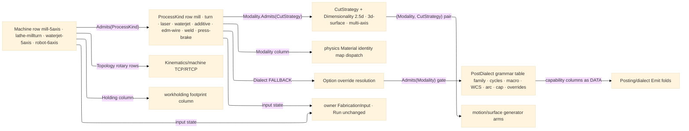

# [RASM_FABRICATION_PROCESS_FAMILY]

The one top-level fabrication discriminant the whole package de-hardcodes onto: `ProcessKind` the `[SmartEnum<string>]` process-physics axis (`mill`/`turn`/`route`/`laser`/`plasma`/`waterjet`/`additive`/`oxyfuel`/`edm-wire`/`weld`/`press-brake`) and `Machine` the `[SmartEnum<string>]` kinematics-and-holding axis — two axes over one concept (process = physics, machine = kinematics + holding), never a single flattened `mill-3axis-aluminium` enum. The axis type is `ProcessKind`, NOT `Process`: the family homes in `namespace Rasm.Fabrication.Process`, where a type named `Process` resolves `Rasm.Fabrication.Process.Process` and every bare `Process` reference from within `Rasm.Fabrication.*` binds the NAMESPACE before the type (enclosing-hierarchy name lookup, a live CS0118 on the `FabricationInput.Process` field and every `Process`-typed parameter) — the rename is the namespace-PRESERVING collision-break; `Machine` does not rename (no `Machine` namespace exists, the asymmetry is collision-forced). Each `ProcessKind` row carries its `ProcessModality` (the ONE shared modality vocabulary, ex-`RemovalModality` — the superset axis whose seven rows group under the four-way `ModalityClass` {`removal`, `additive`, `formed`, `joined`}; `Process/physics#CUT_PARAMETER`'s `RemovalBudget` dispatches into the `Material` identity map by it, and `Toolpath/motion#CAM_MOTION` cross-products it against `CutStrategy`), its `KinematicClass` process-default floor, and its `PostDialect` fallback (`Posting/program#CUT_PROGRAM` resolves the job's `Option<PostDialect>` override against it). Each `Machine` row carries `Processes` (the admitted `ProcessKind` set), `HoldingClass` (the abstract workholding mechanism `Fixturing/workholding#WORKHOLDING` keys the footprint column off), `AxisCount`, and `Topology` — the machine's TRUE `KinematicClass`, so `mill-5axis` binds its `table-table` trunnion row instead of inheriting the process's cartesian floor; the four rotary-topology rows (`table-table`/`head-head`/`head-table`/`nutating`) are the 5-axis vocabulary `Kinematics/machine` drives rotary-axis inverse + TCP/RTCP admission over. `CutStrategy` is the third orthogonal engagement axis, widened to production CAM with a `Dimensionality` column (`2.5d`/`3d-surface`/`multi-axis`) — the 2.5D floor rows plus the surface-finishing family (`waterline`/`scallop`/`pencil`/`rest`/`three-plus-two`/`swarf`/`thread-mill`) whose generators land on `Toolpath/surface` and `Toolpath/motion`; the total `ProcessModality.Admits(CutStrategy)` set-relation gates the partial cross-product, routing an inadmissible pair to `FabricationFault.InadmissiblePair` 2705, never a silent empty move set.

`PostDialect` is the GRAMMAR-family capability table, not a 3-column text renderer: each row binds its `PostFamily` (`word-address` RS-274 | `conversational` Klartext/Mazatrol/OSP | `additive` Marlin/RepRap), its canned-cycle grammar (`single-block` G81-89/G76 words | `expanded` lowered moves | `dialect-cycle` named cycle calls), its macro convention (`macro-b` Fanuc `#`/WHILE/GOTO | `r-param` Siemens | `q-param` Heidenhain | `user-task` OSP | `none`), its subprogram convention (`m98` M98/M99 | `label` L/LBL/CALL | `none`), its WCS roster (base G54-59 count + extended G54.1-Pn/G154/G505 count), its cutter-comp admission, its arc mode (`ijk`/`r-word`/`both`), its block cap (0 = uncapped; the F1 overflow routes `BlockCapExceeded` 2728), its decimal/modal render policy, its admitted-`ProcessModality` `Modalities` set (the row-declared capability the `Admits` membership read gates — the additive-vs-everything binary that waved unsupported controller/process grammars through to the emission surface is the deleted form; Hypertherm admits `thermal` alone, LinuxCnc admits `formed` so the press-brake fallback resolves, Fanuc admits `joined` for the robot torch), and a per-`GCommand` code-override map keyed by the command row key (the dialect-invariant code table is the deleted form — `thread-cycle` renders `G92` only where no override row displaces it). The data-vs-lowering split is law: the widened axes and capability columns live HERE as constructor-bound row data; every emission FOLD (`Emit`, cycle expansion, macro lowering, override resolution) is `Posting/dialect`'s. The axis set is policy data on the `Process/owner#FABRICATION_OWNER` `FabricationInput` — no new entrypoint, `Run` unchanged, never a second discriminant beside `FabricationPolicy`. Composes Thinktecture `[SmartEnum<string>]` constructor-bound behavior columns and generated total `Switch`/`Map`; computes no hash, mints no geometry, operates on bounded vocabulary at the row.

Wire posture: HOST-LOCAL. The axes cross only the in-process `FabricationInput` seam to the physics, toolpath, kinematics, posting, tooling, and fixturing kernels — never a browser or peer wire; no row sits between wire and rail.

## [01]-[INDEX]

- [01]-[PROCESS_FAMILY]: owns the `ModalityClass`/`ProcessModality`/`KinematicClass`/`HoldingClass`/`CutDimensionality`/`CutStrategy`/`PostFamily`/`PostDialect` shared vocabularies, the `ProcessKind` process-physics axis, the `Machine` kinematics-and-holding axis with its `Topology` rotary-topology column, the `Machine.Admits(ProcessKind)` and `ProcessModality.Admits(CutStrategy)` and `PostDialect.Admits(ProcessModality)` row-relations, and the span-keyed admission boundaries — the one fabrication discriminant every plane reads and the `FabricationInput` carries.

## [02]-[PROCESS_FAMILY]

- Owner: `ModalityClass` `[SmartEnum<string>]` (`removal`/`additive`/`formed`/`joined`) the four-way process-class superset — the cross-modality dispatch key `Spec/manufacturability`, `Process/derivation`, and `Tooling/wear` fold DfM verdicts, routing, and consumable state over; `ProcessModality` `[SmartEnum<string>]` (ex-`RemovalModality`, the superset break) — seven rows (`subtractive`/`thermal`/`abrasive`/`erosion`/`additive`/`formed`/`joined`) each carrying its `Class`, `Contacts`, and the admitted-`CutStrategy` `Strategies` set the `Admits` relation reads; `CutDimensionality` `[SmartEnum<string>]` (`2.5d`/`3d-surface`/`multi-axis`) the strategy dimensionality vocabulary; `CutStrategy` `[SmartEnum<string>]` the process-agnostic engagement axis carrying its `Dimensionality` column — the 2.5D floor (`boundary-pass`/`pocket-clear`/`peck`/`adaptive`/`radial-sweep`/`plunge-dwell`/`helical`/`thread-mill`/`layer-walk`) plus the surface family (`waterline`/`scallop`/`pencil`/`rest` 3D-surface; `three-plus-two`/`swarf` multi-axis) — a strategy lands ONCE and the modality envelopes it, never an axis re-encoding the modality; `KinematicClass` `[SmartEnum<string>]` the motion-topology axis — the base rows (`cartesian-gantry`/`rotary-spindle`/`articulated-arm`/`delta-parallel`) plus the rotary 5-axis topology rows (`table-table` trunnion/`head-head`/`head-table`/`nutating`) carrying `MinAxes` and the `Rotary` flag `Kinematics/machine` dispatches TCP/RTCP admission over; `HoldingClass` `[SmartEnum<string>]` (`mechanical`/`revolved`/`vacuum`/`magnetic`/`bed`) the abstract holding mechanism; `PostFamily` `[SmartEnum<string>]` (`word-address`/`conversational`/`additive`) the dialect grammar family; `CycleGrammar`/`MacroGrammar`/`SubprogramGrammar`/`ArcMode` `[SmartEnum<string>]` the bounded grammar vocabularies; `WcsRoster` the work-offset capability pair (base + extended slot count) `Fixturing/setups` assigns against and posting renders; `PostDialect` `[SmartEnum<string>]` the controller-dialect capability table (13 seed rows) binding family/cycles/macro/subprogram/WCS/comp/arc/cap/render columns plus the per-`GCommand` `CodeOverrides` map; `ProcessKind` `[SmartEnum<string>]` (ex-`Process`, the collision-break) binding `Modality`/`Kinematics`-floor/`Dialect`-fallback; `Machine` `[SmartEnum<string>]` binding `Processes`/`Holding`/`AxisCount`/`Topology`.
- Cases: `ModalityClass` rows 4; `ProcessModality` rows 7 — `subtractive`→{boundary-pass, pocket-clear, peck, adaptive, radial-sweep, plunge-dwell, helical, thread-mill, waterline, scallop, pencil, rest, three-plus-two, swarf}, `thermal`→{boundary-pass, helical}, `abrasive`→{boundary-pass, helical}, `erosion`→{boundary-pass, plunge-dwell} (class `removal`), `additive`→{layer-walk} (class `additive`), `formed`→{} (class `formed` — forming routes `Run(Form)` to the Forming plane, never Cam; every `(formed, strategy)` pair is inadmissible by the empty set), `joined`→{boundary-pass} (class `joined` — the weld torch seam pass; `Joining/weld`'s bead-stack fill emits one conditioned pass per bead through the Cam egress); `CutStrategy` rows 15; `KinematicClass` rows 8 (4 base + 4 rotary); `HoldingClass` rows 5; `PostDialect` rows 13 (`linuxcnc`/`grbl`/`fanuc`/`haas`/`mazak`/`hypertherm` + the widened seed data `siemens-840d`/`heidenhain-tnc`/`okuma-osp`/`fagor`/`centroid` + the additive `marlin`/`reprap`), each binding its `Modalities` membership set; `ProcessKind` rows 11 (`weld`→`joined`/articulated-arm floor, `press-brake`→`formed`/cartesian floor), every row's `Dialect` fallback satisfying its own modality against the fallback dialect's `Modalities` set; `Machine` rows 15, each binding its process set × holding × axis count × TRUE topology (`mill-5axis`→`table-table`, `waterjet-5axis`→`head-table`, `lathe-millturn`→`rotary-spindle`, `fff-delta`→`delta-parallel`, robots→`articulated-arm`, `press-brake-cnc`→`cartesian-gantry`, `wire-edm`→4-axis `cartesian-gantry` — the row whose absence left `edm-wire` a process no machine admitted and `AdmitPair` unsatisfiable); the `(ProcessModality, CutStrategy)` cross-product is PARTIAL, membership owned by `ProcessModality.Admits` exactly as `Machine.Admits` owns process membership and `PostDialect.Admits` owns modality membership.
- Entry: no new entrypoint — the axes are policy data on `Process/owner#FABRICATION_OWNER` `Run(FabricationPolicy, FabricationInput)`; `Machine.Admits(ProcessKind)`, `ProcessModality.Admits(CutStrategy)`, and `PostDialect.Admits(ProcessModality)` are the total row-relations; `ProcessFamily.Admit<TAxis>` is the ONE key-text boundary — the axis rides the type argument over the generated `IObjectFactory<TAxis, string, ValidationError>` contract, so one body admits every keyed axis and routes the kernel `GeometryFault.DegenerateInput` on an unknown key, never an exception; `AdmitPair` accumulates BOTH key admissions through `Validation` before the `Machine.Admits` relation gate reports.
- Auto: each `ProcessKind` row binds its columns once at construction — `Process/physics#CUT_PARAMETER` `Budget` reads `process.Modality` to dispatch the `Material` identity map; `Toolpath/motion#CAM_MOTION` reads the `(Modality, CutStrategy)` pair through the generated total `Switch` and queries `Admits` first; `Posting/program#CUT_PROGRAM` resolves the `Option<PostDialect>` override against `process.Dialect`, gating `dialect.Admits(modality)`. Each `Machine` row binds once — `Machine.Admits(process)` gates before any kernel runs; `machine.Topology` is the authoritative motion topology (`Kinematics/machine` reads the rotary rows for rotary-axis inverse + TCP/RTCP, `Kinematics/cell` the `articulated-arm` row; the `ProcessKind.Kinematics` column stays the process-default FLOOR a bare process query reads, never the machine truth); `Fixturing/workholding` keys `WorkholderKind.ForHolding(machine.Holding)`; `Fixturing/setups` assigns setup-k → the dialect's `Wcs` roster rows and posting RENDERS what setups assigns. The dialect capability columns are read-only data for `Posting/dialect`'s `Emit` generated total `Switch`: cycle expansion consults `Cycles`, macro/subprogram lowering `Macro`/`Subprogram`, arc emission `Arc`, block accounting `BlockCap` (`BlockCapExceeded` 2728 on overrun), and every emitted `GCommand` code passes through `CodeOverride(key)` before the base code renders.
- Receipt: the rows ARE the typed evidence — self-describing constructor-bound columns read directly through the generated `Switch`/`Map`; no parallel `ProcessTable`/`MachineTable`/`DialectCapability` lookup, no `FrozenDictionary` beside the rows.
- Packages: Thinktecture.Runtime.Extensions (`[SmartEnum<string>]` behavior columns, generated total `Switch`/`Map`/`Validate` — transitive via the `Rasm` ProjectReference), LanguageExt.Core (`Fin`/`Set`/`Map` — the boundary rail, the membership sets, the override map), `Rasm.Numerics` (`GeometryFault` band-2400), BCL inbox.
- Growth: a new process is one `ProcessKind` row (the `weld`/`press-brake` widening is the exemplar — each rode one row + its physics map entries, zero new folds); a new machine is one `Machine` row binding its true topology; a new modality is one `ProcessModality` row carrying its `ModalityClass` + one `ModalityPhysics`/`RemovalBudget` case pair at `Process/physics#CUT_PARAMETER`; a new engagement strategy is one `CutStrategy` row with its `Dimensionality` + its admission into each admitting modality's set + one generator arm at its owning toolpath page — a new process reusing an existing engagement adds ZERO rows; a new dialect is one `PostDialect` row of pure capability data + one `Emit` arm at `Posting/dialect`; a new rotary topology is one `KinematicClass` row + one `Kinematics/machine` inverse arm; a per-dialect word deviation is one `CodeOverrides` entry, never a dialect-specific emitter; a new admitted modality on a controller is one `Modalities` member; a new keyed axis costs ZERO admission surface — `Admit<TAxis>` already serves it through the factory contract; zero new surface.
- Boundary: `ProcessKind`/`Machine` is the ONE fabrication discriminant and a flattened combinatorial enum is the deleted form; the axis type is `ProcessKind` and a bare `class Process` inside `namespace Rasm.Fabrication.Process` is the named CS0118 defect the rename kills — no alias, no `ProcessModel` compatibility namespace, every reference re-types; the machine truth is `Machine.Topology` and a 5-axis machine inheriting the process's cartesian floor is the deleted form (V5/V8 — `mill-5axis` binds `table-table`); the modality vocabulary is ONE axis — `ProcessModality` superseded `RemovalModality` as the {removal, additive, formed, joined} superset and every reference re-typed with the rename discipline of the `ProcessKind` break; a second parallel modality enum downstream, or a resurrected `RemovalModality` alias, is the deleted form; the dialect table is capability DATA and any emission fold, string render, or cycle expansion on this page is the lowering half `Posting/dialect` owns — the flat `Rs274`/`Comment`/`LineNumbers` render triple is dead, absorbed into the grammar columns; the `CodeOverrides` map is keyed by the `GCommand` row KEY (a string column — family is a leaf and never references the posting AST type upward); a raw-string process/machine/dialect literal at a call site is the named defect — admitted once through the ONE generic `Admit<TAxis>` boundary, traveling as the typed row; the per-axis `AdmitMachine`/`AdmitStrategy`/`AdmitDialect` method-name family is the deleted form the type-argument discriminant collapses.

```csharp contract
// --- [RUNTIME_PRELUDE] ----------------------------------------------------------------------------------------------------------------------------
using LanguageExt;
using LanguageExt.Common;
using Rasm.Numerics;
using Thinktecture;
using static LanguageExt.Prelude;

namespace Rasm.Fabrication.Process;

// --- [TYPES] --------------------------------------------------------------------------------------------------------------------------------------
[SmartEnum<string>]
public sealed partial class CutDimensionality {
    public static readonly CutDimensionality Planar = new("2.5d");
    public static readonly CutDimensionality Surface = new("3d-surface");
    public static readonly CutDimensionality MultiAxis = new("multi-axis");
}

[SmartEnum<string>]
public sealed partial class CutStrategy {
    public static readonly CutStrategy BoundaryPass = new("boundary-pass", CutDimensionality.Planar);
    public static readonly CutStrategy PocketClear = new("pocket-clear", CutDimensionality.Planar);
    public static readonly CutStrategy Peck = new("peck", CutDimensionality.Planar);
    public static readonly CutStrategy Adaptive = new("adaptive", CutDimensionality.Planar);
    public static readonly CutStrategy RadialSweep = new("radial-sweep", CutDimensionality.Planar);
    public static readonly CutStrategy PlungeDwell = new("plunge-dwell", CutDimensionality.Planar);
    public static readonly CutStrategy Helical = new("helical", CutDimensionality.Planar);
    public static readonly CutStrategy ThreadMill = new("thread-mill", CutDimensionality.Planar);
    public static readonly CutStrategy LayerWalk = new("layer-walk", CutDimensionality.Planar);
    public static readonly CutStrategy Waterline = new("waterline", CutDimensionality.Surface);
    public static readonly CutStrategy Scallop = new("scallop", CutDimensionality.Surface);
    public static readonly CutStrategy Pencil = new("pencil", CutDimensionality.Surface);
    public static readonly CutStrategy Rest = new("rest", CutDimensionality.Surface);
    public static readonly CutStrategy ThreePlusTwo = new("three-plus-two", CutDimensionality.MultiAxis);
    public static readonly CutStrategy Swarf = new("swarf", CutDimensionality.MultiAxis);

    public CutDimensionality Dimensionality { get; }
}

[SmartEnum<string>]
public sealed partial class ModalityClass {
    public static readonly ModalityClass Removal = new("removal");
    public static readonly ModalityClass Additive = new("additive");
    public static readonly ModalityClass Formed = new("formed");
    public static readonly ModalityClass Joined = new("joined");
}

// The superset axis (ex-RemovalModality): seven physics rows grouped by the four-way Class column.
// formed admits NO Cam strategy (Run(Form) routes the Forming plane); joined admits the torch seam pass.
[SmartEnum<string>]
public sealed partial class ProcessModality {
    public static readonly ProcessModality Subtractive = new("subtractive", ModalityClass.Removal, contacts: true,
        Set(CutStrategy.BoundaryPass, CutStrategy.PocketClear, CutStrategy.Peck, CutStrategy.Adaptive, CutStrategy.RadialSweep, CutStrategy.PlungeDwell,
            CutStrategy.Helical, CutStrategy.ThreadMill, CutStrategy.Waterline, CutStrategy.Scallop, CutStrategy.Pencil, CutStrategy.Rest,
            CutStrategy.ThreePlusTwo, CutStrategy.Swarf));
    public static readonly ProcessModality Thermal = new("thermal", ModalityClass.Removal, contacts: false, Set(CutStrategy.BoundaryPass, CutStrategy.Helical));
    public static readonly ProcessModality Abrasive =
        new("abrasive", ModalityClass.Removal, contacts: false, Set(CutStrategy.BoundaryPass, CutStrategy.Helical));
    public static readonly ProcessModality Erosion =
        new("erosion", ModalityClass.Removal, contacts: false, Set(CutStrategy.BoundaryPass, CutStrategy.PlungeDwell));
    public static readonly ProcessModality Additive = new("additive", ModalityClass.Additive, contacts: true, Set(CutStrategy.LayerWalk));
    public static readonly ProcessModality Formed = new("formed", ModalityClass.Formed, contacts: true, Set<CutStrategy>());
    public static readonly ProcessModality Joined = new("joined", ModalityClass.Joined, contacts: false, Set(CutStrategy.BoundaryPass));

    public ModalityClass Class { get; }
    public bool Contacts { get; }
    public Set<CutStrategy> Strategies { get; }

    public bool Admits(CutStrategy strategy) => Strategies.Contains(strategy);
}

[SmartEnum<string>]
public sealed partial class KinematicClass {
    public static readonly KinematicClass CartesianGantry = new("cartesian-gantry", minAxes: 2, rotary: false);
    public static readonly KinematicClass RotarySpindle = new("rotary-spindle", minAxes: 2, rotary: false);
    public static readonly KinematicClass ArticulatedArm = new("articulated-arm", minAxes: 6, rotary: false);
    public static readonly KinematicClass DeltaParallel = new("delta-parallel", minAxes: 3, rotary: false);
    public static readonly KinematicClass TableTable = new("table-table", minAxes: 5, rotary: true);      // trunnion: both rotaries under the part
    public static readonly KinematicClass HeadHead = new("head-head", minAxes: 5, rotary: true);          // both rotaries on the spindle head
    public static readonly KinematicClass HeadTable = new("head-table", minAxes: 5, rotary: true);        // one rotary each side
    public static readonly KinematicClass Nutating = new("nutating", minAxes: 5, rotary: true);           // 45-degree nutating rotary axis

    public int MinAxes { get; }
    public bool Rotary { get; }
}

[SmartEnum<string>]
public sealed partial class HoldingClass {
    public static readonly HoldingClass Mechanical = new("mechanical");
    public static readonly HoldingClass Revolved = new("revolved");
    public static readonly HoldingClass Vacuum = new("vacuum");
    public static readonly HoldingClass Magnetic = new("magnetic");
    public static readonly HoldingClass Bed = new("bed");
}

[SmartEnum<string>]
public sealed partial class PostFamily {
    public static readonly PostFamily WordAddress = new("word-address");
    public static readonly PostFamily Conversational = new("conversational");
    public static readonly PostFamily AdditiveGcode = new("additive");
}

[SmartEnum<string>]
public sealed partial class CycleGrammar {
    public static readonly CycleGrammar SingleBlock = new("single-block");     // G81-89/G76 emitted as single canned-cycle blocks
    public static readonly CycleGrammar Expanded = new("expanded");            // no cycle words — lowered to expanded move blocks
    public static readonly CycleGrammar DialectCycle = new("dialect-cycle");   // named cycle-call convention (CYCLE8x, Heidenhain fixed cycles)
}

[SmartEnum<string>]
public sealed partial class MacroGrammar {
    public static readonly MacroGrammar MacroB = new("macro-b");               // Fanuc #vars / WHILE / GOTO
    public static readonly MacroGrammar RParam = new("r-param");               // Siemens R-parameters
    public static readonly MacroGrammar QParam = new("q-param");               // Heidenhain Q-parameters
    public static readonly MacroGrammar UserTask = new("user-task");           // Okuma OSP user task / IF-GOTO
    public static readonly MacroGrammar None = new("none");
}

[SmartEnum<string>]
public sealed partial class SubprogramGrammar {
    public static readonly SubprogramGrammar M98 = new("m98");                 // M98/M99 call-return with repeat counts
    public static readonly SubprogramGrammar Label = new("label");             // L / LBL / CALL label units
    public static readonly SubprogramGrammar None = new("none");
}

[SmartEnum<string>]
public sealed partial class ArcMode {
    public static readonly ArcMode Ijk = new("ijk");
    public static readonly ArcMode RWord = new("r-word");
    public static readonly ArcMode Both = new("both");
}

public readonly record struct WcsRoster(int Slots, int Extended) {
    public int Total => Slots + Extended;
}

// --- [MODELS] -------------------------------------------------------------------------------------------------------------------------------------
// The GRAMMAR-family capability table: pure constructor-bound DATA. Every emission fold (Emit, cycle expansion, macro lowering,
// override resolution) is Posting/dialect's; CodeOverrides is keyed by the GCommand row KEY so the leaf never references the posting AST.
[SmartEnum<string>]
public sealed partial class PostDialect {
    public static readonly PostDialect LinuxCnc = new("linuxcnc", PostFamily.WordAddress, CycleGrammar.SingleBlock, MacroGrammar.None,
        SubprogramGrammar.Label, new WcsRoster(6, 3), cutterComp: true, ArcMode.Both, blockCap: 0, decimals: 4, modal: true,
        Set(ProcessModality.Subtractive, ProcessModality.Thermal, ProcessModality.Abrasive, ProcessModality.Erosion, ProcessModality.Formed), Map(("thread-cycle", "G76")));
    public static readonly PostDialect Grbl = new("grbl", PostFamily.WordAddress, CycleGrammar.Expanded, MacroGrammar.None,
        SubprogramGrammar.None, new WcsRoster(6, 0), cutterComp: false, ArcMode.Both, blockCap: 0, decimals: 3, modal: true,
        Set(ProcessModality.Subtractive, ProcessModality.Thermal), default);
    public static readonly PostDialect Fanuc = new("fanuc", PostFamily.WordAddress, CycleGrammar.SingleBlock, MacroGrammar.MacroB,
        SubprogramGrammar.M98, new WcsRoster(6, 48), cutterComp: true, ArcMode.Both, blockCap: 0, decimals: 3, modal: true,
        Set(ProcessModality.Subtractive, ProcessModality.Abrasive, ProcessModality.Erosion, ProcessModality.Joined), Map(("thread-cycle", "G76")));
    public static readonly PostDialect Haas = new("haas", PostFamily.WordAddress, CycleGrammar.SingleBlock, MacroGrammar.MacroB,
        SubprogramGrammar.M98, new WcsRoster(6, 99), cutterComp: true, ArcMode.Both, blockCap: 0, decimals: 4, modal: true,
        Set(ProcessModality.Subtractive), Map(("thread-cycle", "G76")));
    public static readonly PostDialect Mazak = new("mazak", PostFamily.WordAddress, CycleGrammar.SingleBlock, MacroGrammar.MacroB,
        SubprogramGrammar.M98, new WcsRoster(6, 48), cutterComp: true, ArcMode.Both, blockCap: 0, decimals: 4, modal: true,
        Set(ProcessModality.Subtractive), default);
    public static readonly PostDialect Hypertherm = new("hypertherm", PostFamily.WordAddress, CycleGrammar.Expanded, MacroGrammar.None,
        SubprogramGrammar.M98, new WcsRoster(1, 0), cutterComp: true, ArcMode.Ijk, blockCap: 0, decimals: 4, modal: true,
        Set(ProcessModality.Thermal), default);
    public static readonly PostDialect Siemens840D = new("siemens-840d", PostFamily.WordAddress, CycleGrammar.DialectCycle, MacroGrammar.RParam,
        SubprogramGrammar.Label, new WcsRoster(4, 95), cutterComp: true, ArcMode.Both, blockCap: 0, decimals: 3, modal: true,
        Set(ProcessModality.Subtractive, ProcessModality.Erosion), default);
    public static readonly PostDialect HeidenhainTnc = new("heidenhain-tnc", PostFamily.Conversational, CycleGrammar.DialectCycle, MacroGrammar.QParam,
        SubprogramGrammar.Label, new WcsRoster(0, 99), cutterComp: true, ArcMode.Ijk, blockCap: 0, decimals: 3, modal: false,
        Set(ProcessModality.Subtractive), default);
    public static readonly PostDialect OkumaOsp = new("okuma-osp", PostFamily.Conversational, CycleGrammar.DialectCycle, MacroGrammar.UserTask,
        SubprogramGrammar.Label, new WcsRoster(6, 50), cutterComp: true, ArcMode.Both, blockCap: 0, decimals: 4, modal: true,
        Set(ProcessModality.Subtractive), default);
    public static readonly PostDialect Fagor = new("fagor", PostFamily.WordAddress, CycleGrammar.SingleBlock, MacroGrammar.RParam,
        SubprogramGrammar.Label, new WcsRoster(6, 20), cutterComp: true, ArcMode.Both, blockCap: 0, decimals: 4, modal: true,
        Set(ProcessModality.Subtractive), default);
    public static readonly PostDialect Centroid = new("centroid", PostFamily.WordAddress, CycleGrammar.SingleBlock, MacroGrammar.MacroB,
        SubprogramGrammar.M98, new WcsRoster(6, 12), cutterComp: true, ArcMode.Both, blockCap: 0, decimals: 4, modal: true,
        Set(ProcessModality.Subtractive), default);
    public static readonly PostDialect Marlin = new("marlin", PostFamily.AdditiveGcode, CycleGrammar.Expanded, MacroGrammar.None,
        SubprogramGrammar.None, new WcsRoster(0, 0), cutterComp: false, ArcMode.Both, blockCap: 0, decimals: 3, modal: true,
        Set(ProcessModality.Additive), default);
    public static readonly PostDialect Reprap = new("reprap", PostFamily.AdditiveGcode, CycleGrammar.Expanded, MacroGrammar.None,
        SubprogramGrammar.None, new WcsRoster(6, 3), cutterComp: false, ArcMode.Both, blockCap: 0, decimals: 3, modal: true,
        Set(ProcessModality.Additive), default);

    public PostFamily Family { get; }
    public CycleGrammar Cycles { get; }
    public MacroGrammar Macro { get; }
    public SubprogramGrammar Subprogram { get; }
    public WcsRoster Wcs { get; }
    public bool CutterComp { get; }
    public ArcMode Arc { get; }
    public int BlockCap { get; }
    public int Decimals { get; }
    public bool Modal { get; }
    public Set<ProcessModality> Modalities { get; }
    public Map<string, string> CodeOverrides { get; }

    // Row-declared capability, never a family heuristic: the additive-vs-everything binary passed unsupported
    // controller/process grammars to the emission surface — the first capability gate is THIS membership read.
    public bool Admits(ProcessModality modality) => Modalities.Contains(modality);

    public Option<string> CodeOverride(string commandKey) => CodeOverrides.Find(commandKey);
}

[SmartEnum<string>]
public sealed partial class ProcessKind {
    public static readonly ProcessKind Mill = new("mill", ProcessModality.Subtractive, KinematicClass.CartesianGantry, PostDialect.LinuxCnc);
    public static readonly ProcessKind Turn = new("turn", ProcessModality.Subtractive, KinematicClass.RotarySpindle, PostDialect.Fanuc);
    public static readonly ProcessKind Route = new("route", ProcessModality.Subtractive, KinematicClass.CartesianGantry, PostDialect.Grbl);
    public static readonly ProcessKind Laser = new("laser", ProcessModality.Thermal, KinematicClass.CartesianGantry, PostDialect.Grbl);
    public static readonly ProcessKind Plasma = new("plasma", ProcessModality.Thermal, KinematicClass.CartesianGantry, PostDialect.Hypertherm);
    public static readonly ProcessKind Waterjet = new("waterjet", ProcessModality.Abrasive, KinematicClass.CartesianGantry, PostDialect.Fanuc);
    public static readonly ProcessKind Additive = new("additive", ProcessModality.Additive, KinematicClass.CartesianGantry, PostDialect.Marlin);
    public static readonly ProcessKind Oxyfuel = new("oxyfuel", ProcessModality.Thermal, KinematicClass.CartesianGantry, PostDialect.Hypertherm);
    public static readonly ProcessKind EdmWire = new("edm-wire", ProcessModality.Erosion, KinematicClass.CartesianGantry, PostDialect.Fanuc);
    public static readonly ProcessKind Weld = new("weld", ProcessModality.Joined, KinematicClass.ArticulatedArm, PostDialect.Fanuc);
    public static readonly ProcessKind PressBrake = new("press-brake", ProcessModality.Formed, KinematicClass.CartesianGantry, PostDialect.LinuxCnc);

    public ProcessModality Modality { get; }
    public KinematicClass Kinematics { get; }      // process-default FLOOR; the machine truth is Machine.Topology
    public PostDialect Dialect { get; }
}

[SmartEnum<string>]
public sealed partial class Machine {
    public static readonly Machine Mill3Axis = new("mill-3axis", Set(ProcessKind.Mill, ProcessKind.Route), HoldingClass.Mechanical, axisCount: 3, KinematicClass.CartesianGantry);
    public static readonly Machine Mill5Axis = new("mill-5axis", Set(ProcessKind.Mill, ProcessKind.Route), HoldingClass.Mechanical, axisCount: 5, KinematicClass.TableTable);
    public static readonly Machine RouterGantry = new("router-gantry", Set(ProcessKind.Route, ProcessKind.Mill), HoldingClass.Vacuum, axisCount: 3, KinematicClass.CartesianGantry);
    public static readonly Machine Lathe2Axis = new("lathe-2axis", Set(ProcessKind.Turn), HoldingClass.Revolved, axisCount: 2, KinematicClass.RotarySpindle);
    public static readonly Machine LatheMillTurn = new("lathe-millturn", Set(ProcessKind.Turn, ProcessKind.Mill), HoldingClass.Revolved, axisCount: 5, KinematicClass.RotarySpindle);
    public static readonly Machine LaserFlatbed = new("laser-flatbed", Set(ProcessKind.Laser), HoldingClass.Vacuum, axisCount: 2, KinematicClass.CartesianGantry);
    public static readonly Machine PlasmaTable = new("plasma-table", Set(ProcessKind.Plasma, ProcessKind.Oxyfuel), HoldingClass.Bed, axisCount: 2, KinematicClass.CartesianGantry);
    public static readonly Machine Waterjet5Axis = new("waterjet-5axis", Set(ProcessKind.Waterjet), HoldingClass.Bed, axisCount: 5, KinematicClass.HeadTable);
    public static readonly Machine WireEdm = new("wire-edm", Set(ProcessKind.EdmWire), HoldingClass.Mechanical, axisCount: 4, KinematicClass.CartesianGantry);
    public static readonly Machine FffCartesian = new("fff-cartesian", Set(ProcessKind.Additive), HoldingClass.Bed, axisCount: 3, KinematicClass.CartesianGantry);
    public static readonly Machine FffDelta = new("fff-delta", Set(ProcessKind.Additive), HoldingClass.Bed, axisCount: 3, KinematicClass.DeltaParallel);
    public static readonly Machine Robot6Axis = new("robot-6axis", Set(ProcessKind.Mill, ProcessKind.Route, ProcessKind.Additive, ProcessKind.Weld), HoldingClass.Mechanical, axisCount: 6, KinematicClass.ArticulatedArm);
    public static readonly Machine Robot7Axis = new("robot-7axis", Set(ProcessKind.Mill, ProcessKind.Route, ProcessKind.Additive, ProcessKind.Weld), HoldingClass.Mechanical, axisCount: 7, KinematicClass.ArticulatedArm);
    public static readonly Machine Cobot = new("cobot", Set(ProcessKind.Route, ProcessKind.Additive), HoldingClass.Mechanical, axisCount: 6, KinematicClass.ArticulatedArm);
    public static readonly Machine PressBrakeCnc = new("press-brake-cnc", Set(ProcessKind.PressBrake), HoldingClass.Mechanical, axisCount: 4, KinematicClass.CartesianGantry);

    public Set<ProcessKind> Processes { get; }
    public HoldingClass Holding { get; }
    public int AxisCount { get; }
    public KinematicClass Topology { get; }

    public bool Admits(ProcessKind process) => Processes.Contains(process);
}

// --- [BOUNDARIES] ---------------------------------------------------------------------------------------------------------------------------------
public static class ProcessFamily {
    // ONE admission over the generated factory contract: the axis rides the type argument (the value-recoverable
    // discriminant), so Admit<ProcessKind>/<Machine>/<CutStrategy>/<PostDialect> is one body — the per-axis
    // method-name family is the deleted form.
    public static Fin<TAxis> Admit<TAxis>(string key) where TAxis : class, IObjectFactory<TAxis, string, ValidationError> =>
        TAxis.Validate(key, null, out TAxis? axis) is { } fault
            ? Fin.Fail<TAxis>(GeometryFault.DegenerateInput($"{typeof(TAxis).Name}:{fault.Message}").ToError())
            : Fin.Succ(axis!);

    // The two keys are INDEPENDENT gates: both admissions accumulate before the relation gate reports —
    // a bad process AND a bad machine surface together, never first-fault-only.
    public static Fin<(ProcessKind Process, Machine Machine)> AdmitPair(string processKey, string machineKey) =>
        (Admit<ProcessKind>(processKey).ToValidation(), Admit<Machine>(machineKey).ToValidation())
            .Apply(static (p, m) => (Process: p, Machine: m)).As().ToFin()
            .Bind(static pair => pair.Machine.Admits(pair.Process)
                ? Fin.Succ(pair)
                : Fin.Fail<(ProcessKind, Machine)>(GeometryFault.DegenerateInput($"process-machine:{pair.Machine.Key} rejects {pair.Process.Key}").ToError()));
}
```


