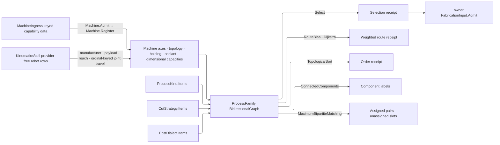

# [RASM_FABRICATION_FAMILY]

`ProcessKind`, `ProcessModality`, `InteractionKind`, `PhysicsKind`, `CutStrategy`, `MachineAxis`, and `PostDialect` remain bounded generated vocabularies. `Machine.Admit` generates equipment from keyed capability data, physical axes, holding, topology, and dimensional operating envelopes; canonical archetypes are `MachineIngress.Seed` data, never named machine API. Keyed selection accumulates axis failures before `ProcessFamily` resolves selection, ordering, connected families, policy-weighted compatibility routes, and slot-preserving fleet matching through typed receipts.

`MachineAxis` seats here beside the machine model it addresses: `Order` is TOTAL across the roster, so a posting block order never depends on declaration accident, and a gantry pair derives from the two duplicated rows sharing one address rather than from a companion string looked up by name.

`PostDialect` binds grammar, work-offset policy, compensation, arc mode, physical-record cap, numeric rendering, word retention, modality, features, and command overrides; `DialectFeatures` names the shared feature bundles and `Codes` the shared vendor spellings, so a controller declares only what it adds or lacks. `CommandKeys` is the override vocabulary posting looks a spelling up by, so a key absent from a row is a capability that controller never declared. `MachineCapacity` carries removal, turning, thermal, jet, erosion, extrusion/deposition, resin, powder, forming, joining, and robot operating envelopes through `UnitsNet`; `CoolantDelivery` carries delivery pressure, temperature, concentration, AND the speed, life, and evacuation response the cut sees, so no second medium-response table exists anywhere in the package. `MachineIngress.Robot` admits manufacturer, payload, reach, and ordinal-keyed joint travel as provider-free rows `Kinematics/cell` projects, so no `Robots` type reaches this floor.

`MachineCapacity.Facts` is the one operating envelope correspondence: each case folds its OWN axis-and-reader row table into quantity facts and robot joint-limit facts, and `Machine` holds that stream once so validity and every query read one build. `Machine.Capacity<TQuantity>` folds a chosen quantity axis through a `CapacityFold` row over `UnitMath`; `Machine.Capacity(MachineAxis)` returns the matching admitted joint limit. `ProcessKind.Demands` declares which `CapacityKind` a process requires, so equipment fitness is one equality rather than an enumerated physics table with per-process exceptions. A process names NO dialect: a controller is a property of the machine that runs the process, so the selection graph resolves the pairing through `PostDialect.Admits` and a pinned default would fabricate a correspondence the shop never declared.

Wire posture: HOST-LOCAL. These axes cross only the in-process `FabricationInput` seam to the physics, toolpath, kinematics, posting, tooling, and fixturing kernels — never a browser or peer wire; no row sits between wire and rail.

## [01]-[INDEX]

- [02]-[PROCESS_AXES]: the bounded vocabularies — cut dimensionality and strategy, modality class, physics, interaction, kinematics, holding, capacity kind, axis and fold, coolant delivery with its cut response, axis kind, machine axis, and the dialect grammar rows.
- [03]-[MACHINE_MODEL]: `WcsRoster`, `DialectFeatures`, `CommandKeys`, `PostDialect`, `ProcessKind`, `RobotManufacturer`, `AxisTravel`, `AxisLimit`, `CapacityFact`, `MachineCapacity`, `MachineIngress`, `Machine`.
- [04]-[FAMILY_GRAPH]: `FamilyNode`, `RouteBias`, `ProcessSelection`, `FamilyOp`, `FamilyResult`, `ProcessFamily`.

## [02]-[PROCESS_AXES]

- Owner: bounded smart enums own process, physics, strategy, kinematics, holding, coolant, machine-axis, and dialect grammar; every row carries the columns its consumers read and nothing they do not.
- Cases: `ProcessModality` covers subtractive, thermal, abrasive, erosion, additive, formed, and joined strategy postures. `InteractionKind` retains every modality's contact, jet, beam, discharge, deposition, fusion, cure, deformation, and bond mechanisms without a false modality-wide contact flag. `PhysicsKind` separates subtractive, thermal, abrasive, fused-filament, deposition, joining, wire erosion, resin, powder, and forming inputs.
- Law: `MachineAxis.Order` is TOTAL — every row holds a distinct rank with room between families, so a posting block order is stable and a gantry duplicate never ties with the axis it duplicates. `Paired` derives from the two `Duplicated` rows sharing one address, so no companion key is spelled twice and no keyed lookup can miss.
- Law: `CoolantDelivery` carries the cut response as COLUMNS. A parallel table keyed by delivery restates the roster and needs an identity fallback for a row it forgot; a column cannot forget a row.
- Growth: a bounded vocabulary adds one generated row; an operating envelope dimension is one `CapacityAxis` row; an aggregation is one `CapacityFold` row.
- Boundary: process, machine, modality, strategy, kinematics, holding, and dialect remain independent axes.

```csharp signature
// --- [RUNTIME_PRELUDE] ----------------------------------------------------------------------------------------------------------------------------
using System.Linq;
using LanguageExt;
using LanguageExt.Common;
using Rasm.Domain;
using LanguageExt.Traits;
using QuikGraph;
using QuikGraph.Algorithms;
using QuikGraph.Algorithms.ConnectedComponents;
using Rasm.Element.Projection;
using Rasm.Numerics;
using Thinktecture;
using UnitsNet;
using static LanguageExt.Prelude;

namespace Rasm.Fabrication.Process;

// --- [TYPES] --------------------------------------------------------------------------------------------------------------------------------------
[SmartEnum<string>]
public sealed partial class CutDimensionality {
    public static readonly CutDimensionality Planar = new("2.5d");
    public static readonly CutDimensionality Surface = new("3d-surface");
    public static readonly CutDimensionality MultiAxis = new("multi-axis");
}

// Toolpath strategy names are this package's OWN vocabulary — CAM vendors publish no shared roster — so a
// strategy is one row here carrying the dimensionality that decides which tool forms can answer it.
[SmartEnum<string>]
public sealed partial class CutStrategy {
    public static readonly CutStrategy BoundaryPass = new("boundary-pass", CutDimensionality.Planar);
    public static readonly CutStrategy PocketClear = new("pocket-clear", CutDimensionality.Planar);
    public static readonly CutStrategy Peck = new("peck", CutDimensionality.Planar);
    public static readonly CutStrategy Adaptive = new("adaptive", CutDimensionality.Planar);
    public static readonly CutStrategy RadialSweep = new("radial-sweep", CutDimensionality.Planar);
    public static readonly CutStrategy PlungeDwell = new("plunge-dwell", CutDimensionality.Planar);
    public static readonly CutStrategy Helical = new("helical", CutDimensionality.Planar);
    public static readonly CutStrategy ThreadMill = new("thread-mill", CutDimensionality.Planar);
    public static readonly CutStrategy LayerWalk = new("layer-walk", CutDimensionality.Planar);
    public static readonly CutStrategy Waterline = new("waterline", CutDimensionality.Surface);
    public static readonly CutStrategy Scallop = new("scallop", CutDimensionality.Surface);
    public static readonly CutStrategy Pencil = new("pencil", CutDimensionality.Surface);
    public static readonly CutStrategy Rest = new("rest", CutDimensionality.Surface);
    public static readonly CutStrategy ThreePlusTwo = new("three-plus-two", CutDimensionality.MultiAxis);
    public static readonly CutStrategy Swarf = new("swarf", CutDimensionality.MultiAxis);
    public static readonly CutStrategy DrillCycle = new("drill-cycle", CutDimensionality.Planar);
    public static readonly CutStrategy BoreCycle = new("bore-cycle", CutDimensionality.Planar);
    public static readonly CutStrategy ReamCycle = new("ream-cycle", CutDimensionality.Planar);
    public static readonly CutStrategy Face = new("face", CutDimensionality.Planar);
    public static readonly CutStrategy Slot = new("slot", CutDimensionality.Planar);
    public static readonly CutStrategy Trochoidal = new("trochoidal", CutDimensionality.Planar);
    public static readonly CutStrategy Raster = new("raster", CutDimensionality.Surface);
    public static readonly CutStrategy Spiral = new("spiral", CutDimensionality.Surface);
    public static readonly CutStrategy Morph = new("morph", CutDimensionality.Surface);
    public static readonly CutStrategy Geodesic = new("geodesic", CutDimensionality.Surface);
    public static readonly CutStrategy Rotary = new("rotary", CutDimensionality.MultiAxis);
    public static readonly CutStrategy FiveAxisContour = new("five-axis-contour", CutDimensionality.MultiAxis);
    public static readonly CutStrategy LayerContour = new("layer-contour", CutDimensionality.Planar);
    public static readonly CutStrategy LayerInfill = new("layer-infill", CutDimensionality.Planar);
    public static readonly CutStrategy Support = new("support", CutDimensionality.Planar);
    public static readonly CutStrategy Seam = new("seam", CutDimensionality.MultiAxis);
    public static readonly CutStrategy Spot = new("spot", CutDimensionality.Planar);
    public static readonly CutStrategy Form = new("form", CutDimensionality.Planar);

    public CutDimensionality Dimensionality { get; }
}

[SmartEnum<string>]
public sealed partial class ModalityClass {
    public static readonly ModalityClass Removal = new("removal");
    public static readonly ModalityClass Additive = new("additive");
    public static readonly ModalityClass Formed = new("formed");
    public static readonly ModalityClass Joined = new("joined");
}

[SmartEnum<string>]
public sealed partial class PhysicsKind {
    public static readonly PhysicsKind Subtractive = new("subtractive");
    public static readonly PhysicsKind Thermal = new("thermal");
    public static readonly PhysicsKind Abrasive = new("abrasive");
    public static readonly PhysicsKind Fff = new("fff");
    public static readonly PhysicsKind Deposition = new("deposition");
    public static readonly PhysicsKind Joining = new("joining");
    public static readonly PhysicsKind Erosion = new("erosion");
    public static readonly PhysicsKind Resin = new("resin");
    public static readonly PhysicsKind Powder = new("powder");
    public static readonly PhysicsKind Forming = new("forming");
}

[SmartEnum<string>]
public sealed partial class InteractionKind {
    public static readonly InteractionKind SolidContact = new("solid-contact");
    public static readonly InteractionKind PhotonBeam = new("photon-beam");
    public static readonly InteractionKind ElectronBeam = new("electron-beam");
    public static readonly InteractionKind PlasmaJet = new("plasma-jet");
    public static readonly InteractionKind CombustionJet = new("combustion-jet");
    public static readonly InteractionKind AbrasiveJet = new("abrasive-jet");
    public static readonly InteractionKind ElectricalDischarge = new("electrical-discharge");
    public static readonly InteractionKind MoltenDeposition = new("molten-deposition");
    public static readonly InteractionKind PowderFusion = new("powder-fusion");
    public static readonly InteractionKind ResinCure = new("resin-cure");
    public static readonly InteractionKind MaterialJet = new("material-jet");
    public static readonly InteractionKind BinderJet = new("binder-jet");
    public static readonly InteractionKind SheetBond = new("sheet-bond");
    public static readonly InteractionKind PlasticDeformation = new("plastic-deformation");
    public static readonly InteractionKind ArcFusion = new("arc-fusion");
    public static readonly InteractionKind SolidStateBond = new("solid-state-bond");
    public static readonly InteractionKind BrazedJoint = new("brazed-joint");
    public static readonly InteractionKind AdhesiveBond = new("adhesive-bond");
}

// `ThermalCoupling` is the share of a cut's engaged seconds that reaches the part as heat, so one exposure law
// serves every modality: a plasma or arc pass couples its whole dwell, an abrasive jet carries its own coolant and
// couples almost none, and a cold form couples nothing. The column is what lets `ElementVariant.Of` derive one
// comparable thermal term for every element instead of gating the measurement on the modality and publishing zero.
[SmartEnum<string>]
public sealed partial class ProcessModality {
    public static readonly ProcessModality Subtractive = new("subtractive", ModalityClass.Removal, Set(InteractionKind.SolidContact),
        Set(CutStrategy.BoundaryPass, CutStrategy.PocketClear, CutStrategy.Peck, CutStrategy.Adaptive, CutStrategy.RadialSweep, CutStrategy.PlungeDwell,
            CutStrategy.Helical, CutStrategy.ThreadMill, CutStrategy.Waterline, CutStrategy.Scallop, CutStrategy.Pencil, CutStrategy.Rest,
            CutStrategy.ThreePlusTwo, CutStrategy.Swarf, CutStrategy.DrillCycle, CutStrategy.BoreCycle, CutStrategy.ReamCycle,
            CutStrategy.Face, CutStrategy.Slot, CutStrategy.Trochoidal, CutStrategy.Raster, CutStrategy.Spiral, CutStrategy.Morph,
            CutStrategy.Geodesic, CutStrategy.Rotary, CutStrategy.FiveAxisContour), thermalCoupling: 0.25);
    public static readonly ProcessModality Thermal = new("thermal", ModalityClass.Removal,
        Set(InteractionKind.PhotonBeam, InteractionKind.ElectronBeam, InteractionKind.PlasmaJet, InteractionKind.CombustionJet),
        Set(CutStrategy.BoundaryPass, CutStrategy.Helical, CutStrategy.Raster, CutStrategy.Spiral), thermalCoupling: 1.0);
    public static readonly ProcessModality Abrasive = new("abrasive", ModalityClass.Removal,
        Set(InteractionKind.AbrasiveJet, InteractionKind.SolidContact), Set(CutStrategy.BoundaryPass, CutStrategy.Helical), thermalCoupling: 0.15);
    public static readonly ProcessModality Erosion =
        new("erosion", ModalityClass.Removal, Set(InteractionKind.ElectricalDischarge), Set(CutStrategy.BoundaryPass, CutStrategy.PlungeDwell), thermalCoupling: 0.30);
    public static readonly ProcessModality Additive = new("additive", ModalityClass.Additive,
        Set(InteractionKind.MoltenDeposition, InteractionKind.PowderFusion, InteractionKind.ResinCure, InteractionKind.MaterialJet,
            InteractionKind.BinderJet, InteractionKind.SheetBond),
        Set(CutStrategy.LayerWalk, CutStrategy.LayerContour, CutStrategy.LayerInfill, CutStrategy.Support, CutStrategy.Raster), thermalCoupling: 0.80);
    public static readonly ProcessModality Formed =
        new("formed", ModalityClass.Formed, Set(InteractionKind.PlasticDeformation), Set(CutStrategy.Form), thermalCoupling: 0.0);
    public static readonly ProcessModality Joined = new("joined", ModalityClass.Joined,
        Set(InteractionKind.ArcFusion, InteractionKind.SolidStateBond, InteractionKind.BrazedJoint, InteractionKind.AdhesiveBond),
        Set(CutStrategy.BoundaryPass, CutStrategy.Seam, CutStrategy.Spot), thermalCoupling: 1.0);

    public ModalityClass Class { get; }
    public Set<InteractionKind> Interactions { get; }
    public Set<CutStrategy> Strategies { get; }
    public double ThermalCoupling { get; }

    public bool Admits(CutStrategy strategy) => Strategies.Contains(strategy);
}

[SmartEnum<string>]
public sealed partial class KinematicClass {
    public static readonly KinematicClass CartesianGantry = new("cartesian-gantry", minAxes: 2, orientationDof: 0);
    public static readonly KinematicClass LinearLift = new("linear-lift", minAxes: 1, orientationDof: 0);
    public static readonly KinematicClass RotarySpindle = new("rotary-spindle", minAxes: 2, orientationDof: 1);
    public static readonly KinematicClass ArticulatedArm = new("articulated-arm", minAxes: 6, orientationDof: 3);
    public static readonly KinematicClass DeltaParallel = new("delta-parallel", minAxes: 3, orientationDof: 0);
    public static readonly KinematicClass TableTable = new("table-table", minAxes: 5, orientationDof: 2);
    public static readonly KinematicClass HeadHead = new("head-head", minAxes: 5, orientationDof: 2);
    public static readonly KinematicClass HeadTable = new("head-table", minAxes: 5, orientationDof: 2);
    public static readonly KinematicClass Nutating = new("nutating", minAxes: 5, orientationDof: 2);

    public int MinAxes { get; }
    public int OrientationDof { get; }
}

[SmartEnum<string>]
public sealed partial class HoldingClass {
    public static readonly HoldingClass Mechanical = new("mechanical");
    public static readonly HoldingClass Revolved = new("revolved");
    public static readonly HoldingClass Vacuum = new("vacuum");
    public static readonly HoldingClass Magnetic = new("magnetic");
    public static readonly HoldingClass Bed = new("bed");
}

[SmartEnum<string>]
public sealed partial class CapacityKind {
    public static readonly CapacityKind Removal = new("removal");
    public static readonly CapacityKind Turning = new("turning");
    public static readonly CapacityKind Thermal = new("thermal");
    public static readonly CapacityKind Jet = new("jet");
    public static readonly CapacityKind Erosion = new("erosion");
    public static readonly CapacityKind Additive = new("additive");
    public static readonly CapacityKind Resin = new("resin");
    public static readonly CapacityKind Powder = new("powder");
    public static readonly CapacityKind Forming = new("forming");
    public static readonly CapacityKind Joining = new("joining");
    public static readonly CapacityKind Robot = new("robot");
}

// Operating-envelope dimensions are this package's OWN vocabulary — machine spec sheets share no rostered set —
// so a new envelope dimension is one row every consumer reaches through `MachineCapacity.Facts`.
[SmartEnum<string>]
public sealed partial class CapacityAxis {
    public static readonly CapacityAxis TravelX = new("travel-x");
    public static readonly CapacityAxis TravelY = new("travel-y");
    public static readonly CapacityAxis TravelZ = new("travel-z");
    public static readonly CapacityAxis Swing = new("swing");
    public static readonly CapacityAxis BetweenCenters = new("between-centers");
    public static readonly CapacityAxis BedLength = new("bed-length");
    public static readonly CapacityAxis Reach = new("reach");
    public static readonly CapacityAxis Feed = new("feed");
    public static readonly CapacityAxis Traverse = new("traverse");
    public static readonly CapacityAxis DepositionRate = new("deposition-rate");
    public static readonly CapacityAxis ScanSpeed = new("scan-speed");
    public static readonly CapacityAxis PeelSpeed = new("peel-speed");
    public static readonly CapacityAxis ElectrodeFeed = new("electrode-feed");
    public static readonly CapacityAxis TravelSpeed = new("travel-speed");
    public static readonly CapacityAxis Spindle = new("spindle");
    public static readonly CapacityAxis SourcePower = new("source-power");
    public static readonly CapacityAxis SpindleTorque = new("spindle-torque");
    public static readonly CapacityAxis Thrust = new("thrust");
    public static readonly CapacityAxis ClampForce = new("clamp-force");
    public static readonly CapacityAxis PressCapacity = new("press-capacity");
    public static readonly CapacityAxis SupplyPressure = new("supply-pressure");
    public static readonly CapacityAxis ProcessTemperature = new("process-temperature", signed: true);
    public static readonly CapacityAxis StrokeEnergy = new("stroke-energy");
    public static readonly CapacityAxis Payload = new("payload");

    // A signed axis is a level, not a magnitude: a chilled chamber or cryogenic bed is a valid capacity below zero.
    public bool Signed { get; }
}

[SmartEnum<string>]
public sealed partial class CapacityFold {
    public static readonly CapacityFold Minimum = new("minimum");
    public static readonly CapacityFold Maximum = new("maximum");
    public static readonly CapacityFold Total = new("total");
    public static readonly CapacityFold Mean = new("mean");

    // `UnitMath.Min`/`Max` are PAIRWISE over two quantities; only `Sum`/`Average` take the sequence-and-unit form.
    // The extremum therefore folds the tail onto the admitted head, and the `Head` option property is what admits
    // it — the empty sequence has no extremum to report and leaves through the same `None` every other row's
    // absence takes.
    public Option<TQuantity> Apply<TQuantity>(Seq<TQuantity> values, Enum unit)
        where TQuantity : IQuantity =>
        values.Head.Map(head => Switch(
            state: (Head: head, Tail: values.Tail, All: values, Unit: unit),
            minimum: static state => state.Tail.Fold(state.Head, UnitMath.Min),
            maximum: static state => state.Tail.Fold(state.Head, UnitMath.Max),
            total: static state => UnitMath.Sum(state.All, state.Unit),
            mean: static state => UnitMath.Average(state.All, state.Unit)));
}

// Pressure, temperature, and concentration IDENTIFY the medium; the speed, life, and evacuation factors are what
// that medium does to the cut. Both live on the row, so `Process/physics` reads a column instead of a parallel
// table keyed by this vocabulary — a table has to restate every row and silently defaults the one it forgot.
[SmartEnum<string>]
public sealed partial class CoolantDelivery {
    public static readonly CoolantDelivery Dry = new("dry",
        None, None, Ratio.FromPercent(0.0), speedFactor: 0.70, lifeFactor: 0.55, evacuation: 0.30);
    public static readonly CoolantDelivery Flood = new("flood",
        Some(Pressure.FromBars(3.0)), None, Ratio.FromPercent(8.0), speedFactor: 1.00, lifeFactor: 1.00, evacuation: 0.85);
    public static readonly CoolantDelivery Mist = new("mist",
        Some(Pressure.FromBars(5.0)), None, Ratio.FromPercent(2.0), speedFactor: 0.95, lifeFactor: 0.90, evacuation: 0.70);
    public static readonly CoolantDelivery MinimumQuantity = new("minimum-quantity",
        Some(Pressure.FromBars(6.0)), None, Ratio.FromPercent(0.5), speedFactor: 0.98, lifeFactor: 0.95, evacuation: 0.65);
    public static readonly CoolantDelivery ThroughTool = new("through-tool",
        Some(Pressure.FromBars(70.0)), None, Ratio.FromPercent(8.0), speedFactor: 1.15, lifeFactor: 1.35, evacuation: 1.00);
    public static readonly CoolantDelivery HighPressure = new("high-pressure",
        Some(Pressure.FromBars(150.0)), None, Ratio.FromPercent(8.0), speedFactor: 1.30, lifeFactor: 1.60, evacuation: 1.00);
    public static readonly CoolantDelivery Cryogenic = new("cryogenic",
        Some(Pressure.FromBars(10.0)), Some(Temperature.FromDegreesCelsius(-196.0)), Ratio.FromPercent(0.0),
        speedFactor: 1.45, lifeFactor: 2.10, evacuation: 0.90);

    public Option<Pressure> Pressure { get; }
    public Option<Temperature> Temperature { get; }
    public Ratio Concentration { get; }
    public double SpeedFactor { get; }
    public double LifeFactor { get; }
    public double Evacuation { get; }
}

[SmartEnum<string>]
public sealed partial class AxisKind {
    public static readonly AxisKind Linear = new("linear");
    public static readonly AxisKind Rotary = new("rotary");
    public static readonly AxisKind Spindle = new("spindle");
    public static readonly AxisKind Auxiliary = new("auxiliary");
}

// Addresses federate the ISO 841 coordinate-and-motion nomenclature BY VALUE — primary `X`/`Y`/`Z`, rotary
// `A`/`B`/`C`, secondary `U`/`V`/`W`, tertiary `R` — beside the ISO 6983 spindle address `S`; the `J` joint and
// `E` auxiliary rows are this package's own robot vocabulary. `Order` is the posting block rank and it is TOTAL:
// every row holds a distinct ordinal, families are spaced so a new axis lands between its neighbours without
// renumbering, and a gantry duplicate ranks immediately after the axis it duplicates. Only `Address` is
// wire-bearing; `Order` is emission policy this page owns.
[SmartEnum<string>]
public sealed partial class MachineAxis {
    public static readonly MachineAxis X = new("x", AxisKind.Linear, address: 'X', order: 0);
    public static readonly MachineAxis Y = new("y", AxisKind.Linear, address: 'Y', order: 10);
    public static readonly MachineAxis Y1 = new("y1", AxisKind.Linear, address: 'Y', order: 11, duplicated: true);
    public static readonly MachineAxis Y2 = new("y2", AxisKind.Linear, address: 'Y', order: 12, duplicated: true);
    public static readonly MachineAxis Z = new("z", AxisKind.Linear, address: 'Z', order: 20);
    public static readonly MachineAxis Z1 = new("z1", AxisKind.Linear, address: 'Z', order: 21, duplicated: true);
    public static readonly MachineAxis Z2 = new("z2", AxisKind.Linear, address: 'Z', order: 22, duplicated: true);
    public static readonly MachineAxis A = new("a", AxisKind.Rotary, address: 'A', order: 30, wraps: true);
    public static readonly MachineAxis B = new("b", AxisKind.Rotary, address: 'B', order: 31, wraps: true);
    public static readonly MachineAxis C = new("c", AxisKind.Rotary, address: 'C', order: 32, wraps: true);
    public static readonly MachineAxis U = new("u", AxisKind.Linear, address: 'U', order: 40);
    public static readonly MachineAxis V = new("v", AxisKind.Linear, address: 'V', order: 41);
    public static readonly MachineAxis W = new("w", AxisKind.Linear, address: 'W', order: 42);
    public static readonly MachineAxis R = new("r", AxisKind.Linear, address: 'R', order: 43);
    public static readonly MachineAxis S1 = new("s1", AxisKind.Spindle, address: 'S', order: 50);
    public static readonly MachineAxis S2 = new("s2", AxisKind.Spindle, address: 'S', order: 51);
    public static readonly MachineAxis J1 = new("j1", AxisKind.Rotary, address: 'J', order: 60, wraps: true);
    public static readonly MachineAxis J2 = new("j2", AxisKind.Rotary, address: 'J', order: 61, wraps: true);
    public static readonly MachineAxis J3 = new("j3", AxisKind.Rotary, address: 'J', order: 62, wraps: true);
    public static readonly MachineAxis J4 = new("j4", AxisKind.Rotary, address: 'J', order: 63, wraps: true);
    public static readonly MachineAxis J5 = new("j5", AxisKind.Rotary, address: 'J', order: 64, wraps: true);
    public static readonly MachineAxis J6 = new("j6", AxisKind.Rotary, address: 'J', order: 65, wraps: true);
    public static readonly MachineAxis J7 = new("j7", AxisKind.Rotary, address: 'J', order: 66, wraps: true);
    public static readonly MachineAxis E1 = new("e1", AxisKind.Auxiliary, address: 'E', order: 70);
    public static readonly MachineAxis E2 = new("e2", AxisKind.Auxiliary, address: 'E', order: 71);

    public AxisKind Kind { get; }
    public char Address { get; }
    public int Order { get; }
    public bool Wraps { get; }

    // A synchronized gantry pair: two rows carrying one controller address. The pairing DERIVES from the roster,
    // so no row spells its partner's key and no lookup of that key can miss.
    public bool Duplicated { get; }

    public bool Rotary => Kind == AxisKind.Rotary;

    public Option<MachineAxis> Paired => Duplicated
        ? toSeq(Items).Find(row => row.Duplicated && row.Address == Address && row.Key != Key)
        : None;
}

[SmartEnum<string>]
public sealed partial class PostFamily {
    public static readonly PostFamily WordAddress = new("word-address");
    public static readonly PostFamily Conversational = new("conversational");
    public static readonly PostFamily AdditiveGcode = new("additive");
    public static readonly PostFamily Forming = new("forming");
}

[SmartEnum<string>]
public sealed partial class CycleGrammar {
    public static readonly CycleGrammar SingleBlock = new("single-block");
    public static readonly CycleGrammar Expanded = new("expanded");
    public static readonly CycleGrammar DialectCycle = new("dialect-cycle");
}

[SmartEnum<string>]
public sealed partial class MacroGrammar {
    public static readonly MacroGrammar MacroB = new("macro-b");
    public static readonly MacroGrammar RParam = new("r-param");
    public static readonly MacroGrammar QParam = new("q-param");
    public static readonly MacroGrammar UserTask = new("user-task");
    public static readonly MacroGrammar None = new("none");
}

[SmartEnum<string>]
public sealed partial class SubprogramGrammar {
    public static readonly SubprogramGrammar M98 = new("m98");
    public static readonly SubprogramGrammar Label = new("label");
    public static readonly SubprogramGrammar None = new("none");
}

[SmartEnum<string>]
public sealed partial class ArcMode {
    public static readonly ArcMode Ijk = new("ijk");
    public static readonly ArcMode RWord = new("r-word");
    public static readonly ArcMode Both = new("both");
}

[SmartEnum<string>]
public sealed partial class CutterCompKind {
    public static readonly CutterCompKind Radius = new("radius");
    public static readonly CutterCompKind Length = new("length");
}

[SmartEnum<string>]
public sealed partial class WordRetention {
    public static readonly WordRetention Modal = new("modal");
    public static readonly WordRetention Explicit = new("explicit");
}

[SmartEnum<string>]
public sealed partial class DialectFeature {
    public static readonly DialectFeature Metric = new("metric");
    public static readonly DialectFeature Imperial = new("imperial");
    public static readonly DialectFeature Absolute = new("absolute");
    public static readonly DialectFeature Incremental = new("incremental");
    public static readonly DialectFeature PlaneSelection = new("plane-selection");
    public static readonly DialectFeature Rotary = new("rotary");
    public static readonly DialectFeature Tcp = new("tcp");
    public static readonly DialectFeature InverseTime = new("inverse-time");
    public static readonly DialectFeature Polar = new("polar");
    public static readonly DialectFeature Cylindrical = new("cylindrical");
    public static readonly DialectFeature Spline = new("spline");
    public static readonly DialectFeature Probing = new("probing");
    public static readonly DialectFeature ToolChange = new("tool-change");
    public static readonly DialectFeature RigidTap = new("rigid-tap");
    public static readonly DialectFeature ThreadCycle = new("thread-cycle");
    public static readonly DialectFeature TimeDwell = new("time-dwell");
    public static readonly DialectFeature RevolutionDwell = new("revolution-dwell");
    public static readonly DialectFeature LineNumbers = new("line-numbers");
    public static readonly DialectFeature Checksum = new("checksum");
}

```

## [03]-[MACHINE_MODEL]

- Owner: `PostDialect` owns controller grammar and capability; `ProcessKind` owns the process axis correspondence; `MachineCapacity` owns the operating envelope shapes; `MachineIngress` owns the admission payloads; `Machine` owns admitted runtime equipment and its keyed resolution.
- Cases: `ProcessKind` covers milling, turning, routing, grinding, sawing, thermal and abrasive cutting, erosion, every additive modality, joining, and forming. `MachineIngress.Seed` rows cover every `CapacityKind` a process demands, so no admitted process is unallocatable against the canonical fleet; a press brake names its synchronized ram and backgauge axes, and a turn-mill carries both its turning and its live-tool removal operating envelope.
- Entry: `Machine.Admit` consumes one `MachineIngress` case and `Machine.Register` seats the admitted result in the keyed registry the `[ObjectFactory<string>]` boundary resolves, so registered shop equipment and the built-in archetypes share ONE resolution space and no second lookup path exists.
- Auto: `ProcessPhysics` reads `ProcessKind.Physics`; toolpath admission reads `ProcessModality.Admits`; posting resolves the selected dialect through `PostDialect.Admits` and enforces `PostDialect.BlockCap` where a controller stores a bounded program. Kinematics reads `Machine.Topology`, `KinematicClass.OrientationDof`, and `Machine.Axes`; fixturing reads `Machine.Holding`. Machine admission proves every quantity fact finite and positive unless its axis is signed, retains every admitted joint limit, and proves each admitted process reaches a capacity whose case-owned `CapacityKind` equals its `Demands`. Job-size limits remain execution policy.
- Law: a `Seeds` row is an ARCHETYPE, not a gate. Seeding folds each archetype through the same admission a shop registration takes, and a seed that fails that admission surfaces as a registry refusal rather than a silently missing row.
- Growth: a machine is one `Machine.Register` call over any `MachineIngress`; a dialect is one row over the named feature and spelling bundles; a vendor word is one `CommandKeys` constant and one override entry; an operating envelope dimension is one row on the owning capacity's fact table.
- Boundary: machine topology and physical axes are authoritative for motion; dialect rows contain capability data only.

```csharp signature
// --- [MODELS] -------------------------------------------------------------------------------------------------------------------------------------
[ComplexValueObject]
public sealed partial class WcsRoster {
    public int Slots { get; }
    public int ExtendedBase { get; }
    public int Extended { get; }
    public int Total => Slots + Extended;

    [BoundaryAdapter]
    static partial void ValidateFactoryArguments(
        ref ValidationError? validationError,
        ref int slots,
        ref int extendedBase,
        ref int extended) {
        if (slots < 0 || extendedBase < 0 || extended < 0 || (extended != 0 && extendedBase <= 0))
            validationError = new ValidationError("work-offset-range");
    }

    public static Fin<WcsRoster> Admit(int slots, int extendedBase, int extended) =>
        Validate(slots, extendedBase, extended, out WcsRoster roster).Admitted(roster);
}

// The feature sets controllers SHARE, named once. A dialect row states the bundle it belongs to plus what it adds
// or lacks, so the seventeen-row full-mill set is one declaration rather than five transcriptions that drift.
// These fields seat before the dialect rows because a static initializer reading a later field captures its default.
public static class DialectFeatures {
    public static readonly Set<DialectFeature> Base = Set(
        DialectFeature.Metric, DialectFeature.Absolute, DialectFeature.Incremental,
        DialectFeature.PlaneSelection, DialectFeature.ToolChange, DialectFeature.TimeDwell, DialectFeature.LineNumbers);

    public static readonly Set<DialectFeature> Imperial = Base + Set(DialectFeature.Imperial);

    public static readonly Set<DialectFeature> Multiaxis = Imperial + Set(
        DialectFeature.Rotary, DialectFeature.Tcp, DialectFeature.InverseTime, DialectFeature.Probing,
        DialectFeature.RigidTap, DialectFeature.ThreadCycle, DialectFeature.RevolutionDwell);

    public static readonly Set<DialectFeature> FullMill = Multiaxis + Set(
        DialectFeature.Polar, DialectFeature.Cylindrical, DialectFeature.Spline);

    public static readonly Set<DialectFeature> Streaming = Base + Set(DialectFeature.Checksum);
}

// The command key a dialect override is looked up by. A bare string spelled at the reader forks the moment one copy
// is edited, so every key is a declared constant the override map and every reader share. A reader either RAILS on a
// missing entry — the controller never declared that capability — or renders the bare key, which is visibly wrong in
// the emitted record rather than silently absent from it.
public static class CommandKeys {
    public const string WcsExtended = "wcs-extended";
    public const string WcsDynamic = "wcs-dynamic";
    public const string ThreadCycle = "thread-cycle";
    public const string MotionSynchronize = "motion-synchronize";
    public const string ChannelBarrier = "channel-barrier";
    public const string SubprogramCall = "subprogram-call";
    public const string SubprogramLabel = "subprogram-label";
    public const string SubprogramRepeat = "subprogram-repeat";
    public const string SubprogramDefine = "subprogram-define";
    public const string SubprogramReturn = "subprogram-return";
    public const string LayerMark = "layer-mark";
    public const string ExtrudeMove = "extrude-move";
}

[SmartEnum<string>]
public sealed partial class PostDialect {
    public static readonly PostDialect LinuxCnc = new("linuxcnc", PostFamily.WordAddress, CycleGrammar.SingleBlock, MacroGrammar.None,
        SubprogramGrammar.Label, WcsRoster.Create(6, 1, 3), Compensation.Full, Some(ArcMode.Both), blockCap: None, decimals: 4, WordRetention.Modal,
        Set(ProcessModality.Subtractive, ProcessModality.Thermal, ProcessModality.Abrasive, ProcessModality.Erosion),
        DialectFeatures.Multiaxis + Set(DialectFeature.Polar, DialectFeature.Spline),
        Map((CommandKeys.ThreadCycle, "G76"), (CommandKeys.SubprogramCall, "O"), (CommandKeys.SubprogramRepeat, "L"),
            (CommandKeys.SubprogramDefine, "O"), (CommandKeys.SubprogramReturn, "M99")));
    public static readonly PostDialect Grbl = new("grbl", PostFamily.WordAddress, CycleGrammar.Expanded, MacroGrammar.None,
        SubprogramGrammar.None, WcsRoster.Create(6, 0, 0), Compensation.None, Some(ArcMode.Both), blockCap: None, decimals: 3, WordRetention.Modal,
        Set(ProcessModality.Subtractive, ProcessModality.Thermal),
        DialectFeatures.Imperial + Set(DialectFeature.Checksum), Codes.None);
    public static readonly PostDialect Fanuc = new("fanuc", PostFamily.WordAddress, CycleGrammar.SingleBlock, MacroGrammar.MacroB,
        SubprogramGrammar.M98, WcsRoster.Create(6, 1, 48), Compensation.Full, Some(ArcMode.Both), blockCap: None, decimals: 3, WordRetention.Modal,
        Set(ProcessModality.Subtractive, ProcessModality.Abrasive, ProcessModality.Erosion, ProcessModality.Additive, ProcessModality.Joined),
        DialectFeatures.FullMill,
        Codes.IsoSubprogram + Codes.IsoOffsets + Map((CommandKeys.ThreadCycle, "G76"), (CommandKeys.MotionSynchronize, "G51.2")));
    public static readonly PostDialect Haas = new("haas", PostFamily.WordAddress, CycleGrammar.SingleBlock, MacroGrammar.MacroB,
        SubprogramGrammar.M98, WcsRoster.Create(6, 1, 99), Compensation.Full, Some(ArcMode.Both), blockCap: None, decimals: 4, WordRetention.Modal,
        Set(ProcessModality.Subtractive), DialectFeatures.Multiaxis,
        Codes.IsoSubprogram + Map((CommandKeys.ThreadCycle, "G76"), (CommandKeys.WcsExtended, "G154"), (CommandKeys.WcsDynamic, "G254")));
    public static readonly PostDialect Mazak = new("mazak", PostFamily.WordAddress, CycleGrammar.SingleBlock, MacroGrammar.MacroB,
        SubprogramGrammar.M98, WcsRoster.Create(6, 1, 48), Compensation.Full, Some(ArcMode.Both), blockCap: None, decimals: 4, WordRetention.Modal,
        Set(ProcessModality.Subtractive), DialectFeatures.FullMill,
        Codes.IsoSubprogram + Codes.IsoOffsets + Map((CommandKeys.MotionSynchronize, "G51.2")));
    public static readonly PostDialect Hypertherm = new("hypertherm", PostFamily.WordAddress, CycleGrammar.Expanded, MacroGrammar.None,
        SubprogramGrammar.M98, WcsRoster.Create(1, 0, 0), Set(CutterCompKind.Radius), Some(ArcMode.Ijk), blockCap: None, decimals: 4, WordRetention.Modal,
        Set(ProcessModality.Thermal),
        DialectFeatures.Imperial - Set(DialectFeature.ToolChange) + Set(DialectFeature.Checksum), Codes.IsoSubprogram);
    public static readonly PostDialect Siemens840D = new("siemens-840d", PostFamily.WordAddress, CycleGrammar.DialectCycle, MacroGrammar.RParam,
        SubprogramGrammar.Label, WcsRoster.Create(4, 1, 95), Compensation.Full, Some(ArcMode.Both), blockCap: None, decimals: 3, WordRetention.Modal,
        Set(ProcessModality.Subtractive, ProcessModality.Thermal, ProcessModality.Erosion),
        DialectFeatures.FullMill, Codes.LabelSubprogram + Map((CommandKeys.ChannelBarrier, "WAITM")));
    public static readonly PostDialect HeidenhainTnc = new("heidenhain-tnc", PostFamily.Conversational, CycleGrammar.DialectCycle, MacroGrammar.QParam,
        SubprogramGrammar.Label, WcsRoster.Create(0, 1, 99), Compensation.Full, Some(ArcMode.Ijk), blockCap: None, decimals: 3, WordRetention.Explicit,
        Set(ProcessModality.Subtractive),
        DialectFeatures.FullMill - Set(DialectFeature.Imperial), Codes.LabelSubprogram);
    public static readonly PostDialect OkumaOsp = new("okuma-osp", PostFamily.WordAddress, CycleGrammar.DialectCycle, MacroGrammar.UserTask,
        SubprogramGrammar.Label, WcsRoster.Create(6, 1, 50), Compensation.Full, Some(ArcMode.Both), blockCap: None, decimals: 4, WordRetention.Modal,
        Set(ProcessModality.Subtractive), DialectFeatures.FullMill,
        Map((CommandKeys.SubprogramCall, "CALL O"), (CommandKeys.SubprogramRepeat, "L"),
            (CommandKeys.SubprogramDefine, "O"), (CommandKeys.SubprogramReturn, "RTS")));
    public static readonly PostDialect Fagor = new("fagor", PostFamily.WordAddress, CycleGrammar.SingleBlock, MacroGrammar.RParam,
        SubprogramGrammar.Label, WcsRoster.Create(6, 1, 20), Compensation.Full, Some(ArcMode.Both), blockCap: None, decimals: 4, WordRetention.Modal,
        Set(ProcessModality.Subtractive), DialectFeatures.FullMill, Codes.LabelSubprogram);
    public static readonly PostDialect Centroid = new("centroid", PostFamily.WordAddress, CycleGrammar.SingleBlock, MacroGrammar.MacroB,
        SubprogramGrammar.M98, WcsRoster.Create(6, 1, 12), Compensation.Full, Some(ArcMode.Both), blockCap: None, decimals: 4, WordRetention.Modal,
        Set(ProcessModality.Subtractive), DialectFeatures.Multiaxis,
        Codes.IsoSubprogram + Map((CommandKeys.WcsExtended, "G54.1")));
    public static readonly PostDialect Marlin = new("marlin", PostFamily.AdditiveGcode, CycleGrammar.Expanded, MacroGrammar.None,
        SubprogramGrammar.None, WcsRoster.Create(0, 0, 0), Compensation.None, Some(ArcMode.Both), blockCap: None, decimals: 3, WordRetention.Modal,
        Set(ProcessModality.Additive), DialectFeatures.Streaming, Codes.LayerStream);
    public static readonly PostDialect Reprap = new("reprap", PostFamily.AdditiveGcode, CycleGrammar.Expanded, MacroGrammar.None,
        SubprogramGrammar.None, WcsRoster.Create(6, 1, 3), Compensation.None, Some(ArcMode.Both), blockCap: None, decimals: 3, WordRetention.Modal,
        Set(ProcessModality.Additive), DialectFeatures.Streaming, Codes.LayerStream);
    public static readonly PostDialect Delem = new("delem", PostFamily.Forming, CycleGrammar.DialectCycle, MacroGrammar.None,
        SubprogramGrammar.None, WcsRoster.Create(0, 0, 0), Compensation.None, None, blockCap: Some(25), decimals: 3, WordRetention.Explicit,
        Set(ProcessModality.Formed),
        DialectFeatures.Imperial - Set(DialectFeature.PlaneSelection), Codes.None);

    // The two compensation postures every controller row takes; a bare `Set(...)` literal at thirteen rows is the
    // same transcription defect the feature bundles delete.
    private static class Compensation {
        public static readonly Set<CutterCompKind> Full = Set(CutterCompKind.Radius, CutterCompKind.Length);
        public static readonly Set<CutterCompKind> None = Set<CutterCompKind>();
    }

    // The vendor spellings controllers SHARE, named once for the reason the feature bundles are: the ISO subprogram
    // quintet is ONE declaration across every `M98` row and the label quartet one across the control languages that
    // call a label, so a row states its bundle plus only the spellings it alone carries.
    private static class Codes {
        public static readonly Map<string, string> IsoSubprogram = Map(
            (CommandKeys.SubprogramCall, "M98"), (CommandKeys.SubprogramLabel, "P"), (CommandKeys.SubprogramRepeat, "L"),
            (CommandKeys.SubprogramDefine, "O"), (CommandKeys.SubprogramReturn, "M99"));

        public static readonly Map<string, string> LabelSubprogram = Map(
            (CommandKeys.SubprogramCall, "CALL LBL"), (CommandKeys.SubprogramRepeat, "REP"),
            (CommandKeys.SubprogramDefine, "LBL"), (CommandKeys.SubprogramReturn, "LBL 0"));

        // The Fanuc-lineage extended and dynamic work-offset codes. A controller spelling either differently carries
        // its own pair, and one with no dynamic frame carries NO entry, so the slot refuses rather than degrading to
        // a base offset that means a different frame.
        public static readonly Map<string, string> IsoOffsets = Map(
            (CommandKeys.WcsExtended, "G54.1"), (CommandKeys.WcsDynamic, "G54.2"));

        public static readonly Map<string, string> LayerStream = Map(
            (CommandKeys.LayerMark, ";LAYER:"), (CommandKeys.ExtrudeMove, "G1 E"));

        public static readonly Map<string, string> None = Map<string, string>();
    }

    public PostFamily Family { get; }
    public CycleGrammar Cycles { get; }
    public MacroGrammar Macro { get; }
    public SubprogramGrammar Subprogram { get; }
    public WcsRoster Wcs { get; }
    public Set<CutterCompKind> Compensation { get; }
    public Option<ArcMode> Arc { get; }
    public Option<int> BlockCap { get; }
    public int Decimals { get; }
    public WordRetention Retention { get; }
    public Set<ProcessModality> Modalities { get; }
    public Set<DialectFeature> Features { get; }
    public Map<string, string> CodeOverrides { get; }

    public bool Admits(ProcessModality modality) => Modalities.Contains(modality);

    public Option<string> CodeOverride(string commandKey) => CodeOverrides.Find(commandKey);
}

// Seven additive rows federate the ISO/ASTM 52900 process categories BY VALUE — binder jetting, directed energy
// deposition, material extrusion, material jetting, powder-bed fusion, sheet lamination, and vat
// photopolymerization — so a category rename lands as one key; every other row is this package's own routing
// vocabulary, each carrying the five axes its consumers read and no physics table of its own.
[SmartEnum<string>]
public sealed partial class ProcessKind {
    public static readonly ProcessKind Mill = new("mill", ProcessModality.Subtractive, InteractionKind.SolidContact, PhysicsKind.Subtractive, KinematicClass.CartesianGantry, CapacityKind.Removal);
    public static readonly ProcessKind Turn = new("turn", ProcessModality.Subtractive, InteractionKind.SolidContact, PhysicsKind.Subtractive, KinematicClass.RotarySpindle, CapacityKind.Turning);
    public static readonly ProcessKind Route = new("route", ProcessModality.Subtractive, InteractionKind.SolidContact, PhysicsKind.Subtractive, KinematicClass.CartesianGantry, CapacityKind.Removal);
    public static readonly ProcessKind Grind = new("grind", ProcessModality.Subtractive, InteractionKind.SolidContact, PhysicsKind.Subtractive, KinematicClass.CartesianGantry, CapacityKind.Removal);
    public static readonly ProcessKind Saw = new("saw", ProcessModality.Subtractive, InteractionKind.SolidContact, PhysicsKind.Subtractive, KinematicClass.CartesianGantry, CapacityKind.Removal);
    public static readonly ProcessKind Laser = new("laser", ProcessModality.Thermal, InteractionKind.PhotonBeam, PhysicsKind.Thermal, KinematicClass.CartesianGantry, CapacityKind.Thermal);
    public static readonly ProcessKind Plasma = new("plasma", ProcessModality.Thermal, InteractionKind.PlasmaJet, PhysicsKind.Thermal, KinematicClass.CartesianGantry, CapacityKind.Thermal);
    public static readonly ProcessKind Waterjet = new("waterjet", ProcessModality.Abrasive, InteractionKind.AbrasiveJet, PhysicsKind.Abrasive, KinematicClass.CartesianGantry, CapacityKind.Jet);
    public static readonly ProcessKind FusedFilament = new("fused-filament", ProcessModality.Additive, InteractionKind.MoltenDeposition, PhysicsKind.Fff, KinematicClass.CartesianGantry, CapacityKind.Additive);
    public static readonly ProcessKind Deposition = new("deposition", ProcessModality.Additive, InteractionKind.MoltenDeposition, PhysicsKind.Deposition, KinematicClass.ArticulatedArm, CapacityKind.Additive);
    public static readonly ProcessKind VatPolymer = new("vat-polymer", ProcessModality.Additive, InteractionKind.ResinCure, PhysicsKind.Resin, KinematicClass.CartesianGantry, CapacityKind.Resin);
    public static readonly ProcessKind PowderBed = new("powder-bed", ProcessModality.Additive, InteractionKind.PowderFusion, PhysicsKind.Powder, KinematicClass.CartesianGantry, CapacityKind.Powder);
    public static readonly ProcessKind Oxyfuel = new("oxyfuel", ProcessModality.Thermal, InteractionKind.CombustionJet, PhysicsKind.Thermal, KinematicClass.CartesianGantry, CapacityKind.Thermal);
    public static readonly ProcessKind EdmWire = new("edm-wire", ProcessModality.Erosion, InteractionKind.ElectricalDischarge, PhysicsKind.Erosion, KinematicClass.CartesianGantry, CapacityKind.Erosion);
    public static readonly ProcessKind Weld = new("weld", ProcessModality.Joined, InteractionKind.ArcFusion, PhysicsKind.Joining, KinematicClass.ArticulatedArm, CapacityKind.Joining);
    public static readonly ProcessKind PressBrake = new("press-brake", ProcessModality.Formed, InteractionKind.PlasticDeformation, PhysicsKind.Forming, KinematicClass.CartesianGantry, CapacityKind.Forming);
    public static readonly ProcessKind Drill = new("drill", ProcessModality.Subtractive, InteractionKind.SolidContact, PhysicsKind.Subtractive, KinematicClass.CartesianGantry, CapacityKind.Removal);
    public static readonly ProcessKind Bore = new("bore", ProcessModality.Subtractive, InteractionKind.SolidContact, PhysicsKind.Subtractive, KinematicClass.CartesianGantry, CapacityKind.Removal);
    public static readonly ProcessKind Ream = new("ream", ProcessModality.Subtractive, InteractionKind.SolidContact, PhysicsKind.Subtractive, KinematicClass.CartesianGantry, CapacityKind.Removal);
    public static readonly ProcessKind Hone = new("hone", ProcessModality.Subtractive, InteractionKind.SolidContact, PhysicsKind.Subtractive, KinematicClass.RotarySpindle, CapacityKind.Removal);
    public static readonly ProcessKind Lap = new("lap", ProcessModality.Subtractive, InteractionKind.SolidContact, PhysicsKind.Subtractive, KinematicClass.CartesianGantry, CapacityKind.Removal);
    public static readonly ProcessKind Broach = new("broach", ProcessModality.Subtractive, InteractionKind.SolidContact, PhysicsKind.Subtractive, KinematicClass.LinearLift, CapacityKind.Removal);
    public static readonly ProcessKind GearCut = new("gear-cut", ProcessModality.Subtractive, InteractionKind.SolidContact, PhysicsKind.Subtractive, KinematicClass.RotarySpindle, CapacityKind.Removal);
    public static readonly ProcessKind Ultrasonic = new("ultrasonic", ProcessModality.Abrasive, InteractionKind.SolidContact, PhysicsKind.Abrasive, KinematicClass.CartesianGantry, CapacityKind.Removal);
    public static readonly ProcessKind ElectronBeam = new("electron-beam", ProcessModality.Thermal, InteractionKind.ElectronBeam, PhysicsKind.Thermal, KinematicClass.CartesianGantry, CapacityKind.Thermal);
    public static readonly ProcessKind BinderJet = new("binder-jet", ProcessModality.Additive, InteractionKind.BinderJet, PhysicsKind.Powder, KinematicClass.CartesianGantry, CapacityKind.Powder);
    public static readonly ProcessKind MaterialJet = new("material-jet", ProcessModality.Additive, InteractionKind.MaterialJet, PhysicsKind.Resin, KinematicClass.CartesianGantry, CapacityKind.Resin);
    public static readonly ProcessKind SheetLamination = new("sheet-lamination", ProcessModality.Additive, InteractionKind.SheetBond, PhysicsKind.Deposition, KinematicClass.CartesianGantry, CapacityKind.Additive);
    public static readonly ProcessKind DirectedEnergy = new("directed-energy", ProcessModality.Additive, InteractionKind.PhotonBeam, PhysicsKind.Deposition, KinematicClass.ArticulatedArm, CapacityKind.Additive);
    public static readonly ProcessKind FrictionStir = new("friction-stir", ProcessModality.Joined, InteractionKind.SolidStateBond, PhysicsKind.Joining, KinematicClass.ArticulatedArm, CapacityKind.Joining);
    public static readonly ProcessKind Braze = new("braze", ProcessModality.Joined, InteractionKind.BrazedJoint, PhysicsKind.Joining, KinematicClass.ArticulatedArm, CapacityKind.Joining);
    public static readonly ProcessKind Adhesive = new("adhesive", ProcessModality.Joined, InteractionKind.AdhesiveBond, PhysicsKind.Joining, KinematicClass.ArticulatedArm, CapacityKind.Joining);
    public static readonly ProcessKind Stamp = new("stamp", ProcessModality.Formed, InteractionKind.PlasticDeformation, PhysicsKind.Forming, KinematicClass.LinearLift, CapacityKind.Forming);
    public static readonly ProcessKind Forge = new("forge", ProcessModality.Formed, InteractionKind.PlasticDeformation, PhysicsKind.Forming, KinematicClass.LinearLift, CapacityKind.Forming);
    public static readonly ProcessKind RollForm = new("roll-form", ProcessModality.Formed, InteractionKind.PlasticDeformation, PhysicsKind.Forming, KinematicClass.RotarySpindle, CapacityKind.Forming);
    public static readonly ProcessKind TubeBend = new("tube-bend", ProcessModality.Formed, InteractionKind.PlasticDeformation, PhysicsKind.Forming, KinematicClass.RotarySpindle, CapacityKind.Forming);

    public ProcessModality Modality { get; }
    public InteractionKind Interaction { get; }
    public PhysicsKind Physics { get; }
    public KinematicClass Kinematics { get; }
    public CapacityKind Demands { get; }
}

[SmartEnum<string>]
public sealed partial class RobotManufacturer {
    public static readonly RobotManufacturer Abb = new("abb");
    public static readonly RobotManufacturer Kuka = new("kuka");
    public static readonly RobotManufacturer Ur = new("ur");
    public static readonly RobotManufacturer Staubli = new("staubli");
    public static readonly RobotManufacturer FrankaEmika = new("franka-emika");
    public static readonly RobotManufacturer Doosan = new("doosan");
    public static readonly RobotManufacturer Fanuc = new("fanuc");
    public static readonly RobotManufacturer Igus = new("igus");
    public static readonly RobotManufacturer Jaka = new("jaka");
    public static readonly RobotManufacturer Unspecified = new("unspecified");
}

[Union(ConversionFromValue = ConversionOperatorsGeneration.None)]
public abstract partial record AxisTravel {
    private AxisTravel() { }

    public sealed record Rotary(Angle Minimum, Angle Maximum, RotationalSpeed MaximumSpeed) : AxisTravel;
    public sealed record Linear(Length Minimum, Length Maximum, Speed MaximumSpeed) : AxisTravel;
}

[ComplexValueObject]
public sealed partial class AxisLimit {
    public MachineAxis Axis { get; }
    public AxisTravel Travel { get; }

    [BoundaryAdapter]
    static partial void ValidateFactoryArguments(
        ref ValidationError? validationError,
        ref MachineAxis axis,
        ref AxisTravel travel) {
        if (!travel.Switch(
            state: axis,
            rotary: static (machineAxis, value) => machineAxis.Rotary && value.Minimum < value.Maximum
                && value.MaximumSpeed > RotationalSpeed.Zero,
            linear: static (machineAxis, value) => !machineAxis.Rotary && value.Minimum < value.Maximum
                && value.MaximumSpeed > Speed.Zero))
            validationError = new ValidationError("axis-limit");
    }

    public static Fin<AxisLimit> Admit(MachineAxis axis, AxisTravel travel) =>
        Validate(axis, travel, out AxisLimit limit).Admitted(limit);
}

[Union(ConversionFromValue = ConversionOperatorsGeneration.None)]
public abstract partial record CapacityFact {
    private CapacityFact() { }

    public sealed record Quantity(CapacityAxis Axis, IQuantity Value) : CapacityFact;
    public sealed record Joint(AxisLimit Value) : CapacityFact;
}

[Union(ConversionFromValue = ConversionOperatorsGeneration.None)]
public abstract partial record MachineCapacity(CapacityKind Kind) {
    public sealed record Removal(
        Length X,
        Length Y,
        Length Z,
        Speed Feed,
        RotationalSpeed Spindle,
        Power SpindlePower,
        Torque SpindleTorque,
        Force Thrust) : MachineCapacity(CapacityKind.Removal);
    public sealed record Turning(
        Length Swing,
        Length BetweenCenters,
        Speed Feed,
        RotationalSpeed Spindle,
        Power SpindlePower,
        Torque SpindleTorque) : MachineCapacity(CapacityKind.Turning);
    public sealed record Thermal(
        Length X,
        Length Y,
        Power SourcePower,
        Temperature ProcessTemperature,
        Pressure AssistGas) : MachineCapacity(CapacityKind.Thermal);
    public sealed record Jet(
        Length X,
        Length Y,
        Length Z,
        Pressure PumpPressure,
        Power PumpPower,
        Speed Traverse) : MachineCapacity(CapacityKind.Jet);
    public sealed record Erosion(
        Length X,
        Length Y,
        Length Z,
        Power GeneratorPower,
        Speed ElectrodeFeed) : MachineCapacity(CapacityKind.Erosion);
    public sealed record Additive(
        Length X,
        Length Y,
        Length Z,
        Speed DepositionRate,
        Temperature Chamber,
        Power SourcePower) : MachineCapacity(CapacityKind.Additive);
    public sealed record Resin(
        Length X,
        Length Y,
        Length Z,
        Power ExposurePower,
        Speed PeelSpeed,
        Temperature VatTemperature) : MachineCapacity(CapacityKind.Resin);
    public sealed record Powder(
        Length X,
        Length Y,
        Length Z,
        Power BeamPower,
        Speed ScanSpeed,
        Temperature BedTemperature) : MachineCapacity(CapacityKind.Powder);
    public sealed record Forming(
        Length Bed,
        Force Capacity,
        Pressure HydraulicPressure,
        Energy StrokeEnergy) : MachineCapacity(CapacityKind.Forming);
    public sealed record Joining(
        Power SourcePower,
        Temperature ProcessTemperature,
        Force ClampForce,
        Speed Travel) : MachineCapacity(CapacityKind.Joining);
    public sealed record Robot(
        RobotManufacturer Manufacturer,
        Mass Payload,
        Length Reach,
        Arr<AxisLimit> Joints) : MachineCapacity(CapacityKind.Robot);

    // Each case folds its OWN (axis, reader) row table: one row per envelope dimension, so a new dimension is one
    // pair rather than a re-spelled fact construction, and every case's stream is built by one lift.
    public Seq<CapacityFact> Facts() => Switch(
        removal: static v => Quantities(
            (CapacityAxis.TravelX, v.X), (CapacityAxis.TravelY, v.Y), (CapacityAxis.TravelZ, v.Z),
            (CapacityAxis.Feed, v.Feed), (CapacityAxis.Spindle, v.Spindle),
            (CapacityAxis.SourcePower, v.SpindlePower), (CapacityAxis.SpindleTorque, v.SpindleTorque),
            (CapacityAxis.Thrust, v.Thrust)),
        turning: static v => Quantities(
            (CapacityAxis.Swing, v.Swing), (CapacityAxis.BetweenCenters, v.BetweenCenters),
            (CapacityAxis.Feed, v.Feed), (CapacityAxis.Spindle, v.Spindle),
            (CapacityAxis.SourcePower, v.SpindlePower), (CapacityAxis.SpindleTorque, v.SpindleTorque)),
        thermal: static v => Quantities(
            (CapacityAxis.TravelX, v.X), (CapacityAxis.TravelY, v.Y),
            (CapacityAxis.SourcePower, v.SourcePower), (CapacityAxis.ProcessTemperature, v.ProcessTemperature),
            (CapacityAxis.SupplyPressure, v.AssistGas)),
        jet: static v => Quantities(
            (CapacityAxis.TravelX, v.X), (CapacityAxis.TravelY, v.Y), (CapacityAxis.TravelZ, v.Z),
            (CapacityAxis.SupplyPressure, v.PumpPressure), (CapacityAxis.SourcePower, v.PumpPower),
            (CapacityAxis.Traverse, v.Traverse)),
        erosion: static v => Quantities(
            (CapacityAxis.TravelX, v.X), (CapacityAxis.TravelY, v.Y), (CapacityAxis.TravelZ, v.Z),
            (CapacityAxis.SourcePower, v.GeneratorPower), (CapacityAxis.ElectrodeFeed, v.ElectrodeFeed)),
        additive: static v => Quantities(
            (CapacityAxis.TravelX, v.X), (CapacityAxis.TravelY, v.Y), (CapacityAxis.TravelZ, v.Z),
            (CapacityAxis.DepositionRate, v.DepositionRate), (CapacityAxis.ProcessTemperature, v.Chamber),
            (CapacityAxis.SourcePower, v.SourcePower)),
        resin: static v => Quantities(
            (CapacityAxis.TravelX, v.X), (CapacityAxis.TravelY, v.Y), (CapacityAxis.TravelZ, v.Z),
            (CapacityAxis.SourcePower, v.ExposurePower), (CapacityAxis.PeelSpeed, v.PeelSpeed),
            (CapacityAxis.ProcessTemperature, v.VatTemperature)),
        powder: static v => Quantities(
            (CapacityAxis.TravelX, v.X), (CapacityAxis.TravelY, v.Y), (CapacityAxis.TravelZ, v.Z),
            (CapacityAxis.SourcePower, v.BeamPower), (CapacityAxis.ScanSpeed, v.ScanSpeed),
            (CapacityAxis.ProcessTemperature, v.BedTemperature)),
        forming: static v => Quantities(
            (CapacityAxis.BedLength, v.Bed), (CapacityAxis.PressCapacity, v.Capacity),
            (CapacityAxis.SupplyPressure, v.HydraulicPressure), (CapacityAxis.StrokeEnergy, v.StrokeEnergy)),
        joining: static v => Quantities(
            (CapacityAxis.SourcePower, v.SourcePower), (CapacityAxis.ProcessTemperature, v.ProcessTemperature),
            (CapacityAxis.ClampForce, v.ClampForce), (CapacityAxis.TravelSpeed, v.Travel)),
        robot: static v => Quantities((CapacityAxis.Payload, v.Payload), (CapacityAxis.Reach, v.Reach))
            + toSeq(v.Joints).Map(static limit => (CapacityFact)new CapacityFact.Joint(limit)));

    private static Seq<CapacityFact> Quantities(params ReadOnlySpan<(CapacityAxis Axis, IQuantity Value)> rows) =>
        Iterable<(CapacityAxis Axis, IQuantity Value)>.FromSpan(rows)
            .Map(static row => (CapacityFact)new CapacityFact.Quantity(row.Axis, row.Value))
            .ToSeq();
}

[Union(ConversionFromValue = ConversionOperatorsGeneration.None)]
public abstract partial record MachineIngress {
    private MachineIngress() { }

    public sealed record Seed(
        string Key,
        Set<ProcessKind> Processes,
        HoldingClass Holding,
        Set<MachineAxis> Axes,
        KinematicClass Topology,
        Set<CoolantDelivery> Coolant,
        Seq<MachineCapacity> Capacities) : MachineIngress;
    // Joint ordinals stay the axis correspondence's own key, so the `RobotAxes` roster below remains the single
    // seating law and no row spells an axis name a lookup could miss.
    public sealed record Robot(
        string Key,
        RobotManufacturer Manufacturer,
        Mass Payload,
        Length Reach,
        Arr<(int Ordinal, AxisTravel Travel)> Joints,
        Set<ProcessKind> Processes,
        HoldingClass Holding,
        Set<CoolantDelivery> Coolant,
        Seq<MachineCapacity> ProcessCapacities) : MachineIngress;
}

[ComplexValueObject]
[ObjectFactory<string>]
public sealed partial class Machine {
    public string Key { get; }
    public Set<ProcessKind> Processes { get; }
    public HoldingClass Holding { get; }
    public Set<MachineAxis> Axes { get; }
    public KinematicClass Topology { get; }
    public Set<CoolantDelivery> Coolant { get; }
    public Seq<MachineCapacity> Capacities { get; }
    public int AxisCount => Axes.Count;

    // One fact stream per machine, held on first read. Admission, the quantity fold, and the joint lookup all read
    // it, so an envelope query costs a filter rather than a rebuild of every capacity's row table. The slot is
    // DERIVED from the admitted capacities, so it stays out of construction, equality, and every codec.
    [IgnoreMember]
    private Seq<CapacityFact>? facts;

    public Seq<CapacityFact> Facts => facts ??= Capacities.Bind(static capacity => capacity.Facts());

    public bool Admits(ProcessKind process) => Processes.Contains(process);

    public Option<TQuantity> Capacity<TQuantity>(CapacityAxis axis, CapacityFold fold, Enum unit)
        where TQuantity : IQuantity => fold.Apply(
            Facts.Choose(fact => fact is CapacityFact.Quantity row && row.Axis == axis && row.Value is TQuantity typed
                ? Some(typed)
                : None),
            unit);

    public Option<AxisLimit> Capacity(MachineAxis axis) => Facts
        .Choose(fact => fact is CapacityFact.Joint { Value: { } limit } && limit.Axis == axis ? Some(limit) : None)
        .Head;

    [BoundaryAdapter]
    static partial void ValidateFactoryArguments(
        ref ValidationError? validationError,
        ref string key,
        ref Set<ProcessKind> processes,
        ref HoldingClass holding,
        ref Set<MachineAxis> axes,
        ref KinematicClass topology,
        ref Set<CoolantDelivery> coolant,
        ref Seq<MachineCapacity> capacities) {
        if (!(Witness.Keyed(key)
            && !processes.IsEmpty
            && !axes.IsEmpty
            && axes.Count >= topology.MinAxes
            && axes.Count(static axis => axis.Rotary) >= topology.OrientationDof
            && !capacities.IsEmpty
            && capacities.ForAll(CapacityValid)
            && processes.ForAll(process => capacities.Exists(capacity => capacity.Kind == process.Demands))))
            validationError = new ValidationError("machine");
    }

    public static Fin<Machine> Admit(MachineIngress ingress) => ingress.Switch(
        seed: static value => AdmitSeed(value),
        robot: static value => AdmitRobot(value));

    private static Fin<Machine> AdmitSeed(MachineIngress.Seed seed) =>
        Validate(seed.Key, seed.Processes, seed.Holding, seed.Axes, seed.Topology, seed.Coolant, seed.Capacities,
            out Machine machine).Admitted(machine);

    // Out-parameter seam: the ObjectFactory contract fixes the shape. The registry holds machines already admitted,
    // so the keyed boundary is a lookup, never a second admission — re-validating here would re-decide an invariant
    // the mint already settled and would keep the resolution space frozen at the archetypes. This is the ONE
    // resolution path: a sibling key lookup that scans a caller-held machine sequence forks the space.
    [BoundaryAdapter]
    public static ValidationError? Validate(string? value, IFormatProvider? provider, out Machine? item) {
        item = Optional(value).Bind(key => Registry.Value.Find(key)).Match<Machine?>(static machine => machine, static () => null);
        return item is null ? new ValidationError("machine:unknown") : null;
    }

    public static Fin<Machine> Resolve(string key) => Optional(key)
        .Bind(value => Registry.Value.Find(value))
        .ToFin(new FabricationFault.UnknownAxis(nameof(Machine), key));

    public string ToValue() => Key;

    private static Fin<Machine> AdmitRobot(MachineIngress.Robot seed) =>
        seed.Joints.IsEmpty || seed.ProcessCapacities.IsEmpty
            ? Fin.Fail<Machine>(new KernelFault.InvalidValue("family", "machine:robot"))
            : seed.Joints.ToSeq()
            .Traverse(joint => joint.Ordinal < 0 || joint.Ordinal >= RobotAxes.Count
                ? Fin.Fail<AxisLimit>(new KernelFault.InvalidValue("family", "machine:robot-axis"))
                : AxisLimit.Admit(RobotAxes[joint.Ordinal], joint.Travel))
            .As()
            .Bind(limits => AdmitSeed(new MachineIngress.Seed(
                seed.Key,
                seed.Processes,
                seed.Holding,
                toSet(limits.Map(static limit => limit.Axis)),
                KinematicClass.ArticulatedArm,
                seed.Coolant,
                seed.ProcessCapacities.Add(new MachineCapacity.Robot(
                    seed.Manufacturer,
                    seed.Payload,
                    seed.Reach,
                    limits.ToArr())))));

    public static readonly Seq<MachineIngress.Seed> Seeds = Seq(
        new MachineIngress.Seed(
            "mill-5-axis",
            Set(ProcessKind.Mill, ProcessKind.Route, ProcessKind.Grind),
            HoldingClass.Mechanical,
            Set(MachineAxis.X, MachineAxis.Y, MachineAxis.Z, MachineAxis.A, MachineAxis.C),
            KinematicClass.TableTable,
            Set(CoolantDelivery.Dry, CoolantDelivery.Flood, CoolantDelivery.ThroughTool, CoolantDelivery.HighPressure),
            Seq<MachineCapacity>(new MachineCapacity.Removal(
                Length.FromMillimeters(800), Length.FromMillimeters(600), Length.FromMillimeters(500),
                Speed.FromMillimetersPerMinutes(30000), RotationalSpeed.FromRevolutionsPerMinute(18000),
                Power.FromKilowatts(30), Torque.FromNewtonMeters(180), Force.FromKilonewtons(12)))),
        new MachineIngress.Seed(
            "laser-flatbed",
            Set(ProcessKind.Laser),
            HoldingClass.Bed,
            Set(MachineAxis.X, MachineAxis.Y),
            KinematicClass.CartesianGantry,
            Set(CoolantDelivery.Dry),
            Seq<MachineCapacity>(new MachineCapacity.Thermal(
                Length.FromMillimeters(3000), Length.FromMillimeters(1500), Power.FromKilowatts(12),
                Temperature.FromDegreesCelsius(1500), Pressure.FromBars(25)))),
        new MachineIngress.Seed(
            "fff-cartesian",
            Set(ProcessKind.FusedFilament),
            HoldingClass.Bed,
            Set(MachineAxis.X, MachineAxis.Y, MachineAxis.Z),
            KinematicClass.CartesianGantry,
            Set(CoolantDelivery.Dry),
            Seq<MachineCapacity>(new MachineCapacity.Additive(
                Length.FromMillimeters(400), Length.FromMillimeters(400), Length.FromMillimeters(500),
                Speed.FromMillimetersPerMinutes(18000), Temperature.FromDegreesCelsius(120), Power.FromKilowatts(1.5)))),
        new MachineIngress.Seed(
            "press-brake-cnc",
            Set(ProcessKind.PressBrake),
            HoldingClass.Mechanical,
            Set(MachineAxis.Y1, MachineAxis.Y2, MachineAxis.X, MachineAxis.R, MachineAxis.Z1, MachineAxis.Z2),
            KinematicClass.CartesianGantry,
            Set(CoolantDelivery.Dry),
            Seq<MachineCapacity>(new MachineCapacity.Forming(
                Length.FromMillimeters(3200), Force.FromKilonewtons(1700), Pressure.FromBars(300), Energy.FromKilojoules(180)))),
        new MachineIngress.Seed(
            "lathe-turn-mill",
            Set(ProcessKind.Turn, ProcessKind.Drill, ProcessKind.Bore, ProcessKind.Ream),
            HoldingClass.Revolved,
            Set(MachineAxis.X, MachineAxis.Y, MachineAxis.Z, MachineAxis.C, MachineAxis.S1),
            KinematicClass.RotarySpindle,
            Set(CoolantDelivery.Dry, CoolantDelivery.Flood, CoolantDelivery.ThroughTool),
            Seq<MachineCapacity>(
                new MachineCapacity.Turning(
                    Length.FromMillimeters(400), Length.FromMillimeters(1000),
                    Speed.FromMillimetersPerMinutes(20000), RotationalSpeed.FromRevolutionsPerMinute(4500),
                    Power.FromKilowatts(22), Torque.FromNewtonMeters(350)),
                new MachineCapacity.Removal(
                    Length.FromMillimeters(400), Length.FromMillimeters(100), Length.FromMillimeters(1000),
                    Speed.FromMillimetersPerMinutes(10000), RotationalSpeed.FromRevolutionsPerMinute(6000),
                    Power.FromKilowatts(7.5), Torque.FromNewtonMeters(45), Force.FromKilonewtons(4)))),
        new MachineIngress.Seed(
            "waterjet-abrasive",
            Set(ProcessKind.Waterjet),
            HoldingClass.Bed,
            Set(MachineAxis.X, MachineAxis.Y, MachineAxis.Z),
            KinematicClass.CartesianGantry,
            Set(CoolantDelivery.Dry),
            Seq<MachineCapacity>(new MachineCapacity.Jet(
                Length.FromMillimeters(4000), Length.FromMillimeters(2000), Length.FromMillimeters(200),
                Pressure.FromBars(4000), Power.FromKilowatts(75), Speed.FromMillimetersPerMinutes(20000)))),
        new MachineIngress.Seed(
            "plasma-table",
            Set(ProcessKind.Plasma, ProcessKind.Oxyfuel),
            HoldingClass.Bed,
            Set(MachineAxis.X, MachineAxis.Y, MachineAxis.Z),
            KinematicClass.CartesianGantry,
            Set(CoolantDelivery.Dry),
            Seq<MachineCapacity>(new MachineCapacity.Thermal(
                Length.FromMillimeters(6000), Length.FromMillimeters(2500), Power.FromKilowatts(30),
                Temperature.FromDegreesCelsius(20000), Pressure.FromBars(8)))),
        new MachineIngress.Seed(
            "edm-wire-5axis",
            Set(ProcessKind.EdmWire),
            HoldingClass.Mechanical,
            Set(MachineAxis.X, MachineAxis.Y, MachineAxis.Z, MachineAxis.U, MachineAxis.V),
            KinematicClass.CartesianGantry,
            Set(CoolantDelivery.Flood),
            Seq<MachineCapacity>(new MachineCapacity.Erosion(
                Length.FromMillimeters(400), Length.FromMillimeters(300), Length.FromMillimeters(250),
                Power.FromKilowatts(3), Speed.FromMillimetersPerMinutes(300)))),
        new MachineIngress.Seed(
            "lpbf-powder-bed",
            Set(ProcessKind.PowderBed),
            HoldingClass.Bed,
            Set(MachineAxis.X, MachineAxis.Y, MachineAxis.Z),
            KinematicClass.CartesianGantry,
            Set(CoolantDelivery.Dry),
            Seq<MachineCapacity>(new MachineCapacity.Powder(
                Length.FromMillimeters(280), Length.FromMillimeters(280), Length.FromMillimeters(350),
                Power.FromKilowatts(0.5), Speed.FromMillimetersPerSecond(7000), Temperature.FromDegreesCelsius(200)))),
        new MachineIngress.Seed(
            "weld-cell-positioner",
            Set(ProcessKind.Weld, ProcessKind.Braze),
            HoldingClass.Mechanical,
            Set(MachineAxis.J1, MachineAxis.J2, MachineAxis.J3, MachineAxis.J4, MachineAxis.J5, MachineAxis.J6),
            KinematicClass.ArticulatedArm,
            Set(CoolantDelivery.Dry),
            Seq<MachineCapacity>(new MachineCapacity.Joining(
                Power.FromKilowatts(15), Temperature.FromDegreesCelsius(1600),
                Force.FromKilonewtons(5), Speed.FromMillimetersPerMinutes(1500)))));

    internal static readonly Arr<MachineAxis> RobotAxes = Arr(
        MachineAxis.J1, MachineAxis.J2, MachineAxis.J3, MachineAxis.J4, MachineAxis.J5, MachineAxis.J6, MachineAxis.J7,
        MachineAxis.X, MachineAxis.Y, MachineAxis.Z, MachineAxis.A, MachineAxis.B, MachineAxis.C);

    // The arm block's width in the seating roster, so a projector seats external mechanisms (tracks, positioners)
    // on the trailing rows without re-declaring the roster — a duplicated private roster is the forked truth.
    internal static readonly int RobotArmSeats = 7;

    // `Seeds` are the BUILT-IN ROWS, never the resolution space: real shop equipment enters through
    // `Fleet.AdmitInstance` and must resolve by key afterwards, so the keyed boundary reads a registry the admission
    // fold populates and the archetypes are only its opening rows. This field seats AFTER `Seeds` because a static
    // initializer reading a later field captures the uninitialized default. Registration is first-writer-wins by key,
    // so a second admission of one key resolves to the machine already registered rather than forking the vocabulary.
    private static readonly Atom<HashMap<string, Machine>> Registry = Atom(SeededRows);

    // A seed that fails admission is a DEFECT in the archetype roster, not a row to skip: swallowing it leaves the
    // registry silently short and every key lookup against it answers `UnknownAxis` for a machine the page declared.
    // The refusal surfaces at type initialization, where the roster is authored, rather than at a caller's lookup.
    private static HashMap<string, Machine> SeededRows => Seeds
        .Traverse(AdmitSeed)
        .As()
        .Match(
            Succ: static rows => rows.Fold(HashMap<string, Machine>.Empty, static (index, machine) => index.AddOrUpdate(machine.Key, machine)),
            Fail: static refusal => throw refusal.ToException());

    public static Fin<Machine> Register(MachineIngress ingress) =>
        Admit(ingress).Map(static machine =>
            Registry.Swap(rows => rows.TryAdd(machine.Key, machine)).Find(machine.Key).IfNone(machine));

    public static Seq<Machine> Registered => Registry.Value.Values.ToSeq();

    private static bool CapacityValid(MachineCapacity capacity) => capacity.Facts().ForAll(static fact => fact.Switch(
        quantity: static row => double.IsFinite((double)row.Value.Value)
            && (row.Axis.Signed || (double)row.Value.Value > 0.0),
        joint: static _ => true));
}

```

## [04]-[FAMILY_GRAPH]

- Owner: `ProcessFamily` owns the relational graph over the bounded axes and the admitted machines; `FamilyOp` names the queries; `FamilyResult` carries their receipts.
- Entry: `ProcessFamily.Admit` consumes a machine registry; `FamilyOp.Select` carries one admitted `ProcessSelection`; `ProcessFamily.Apply` consumes one `FamilyOp` modality.
- Law: routing weights are FINITE. A process node is the route's own pivot and every path transits one, so pricing it at infinity makes every total weight infinite and the weighted lane degenerate — a hop costs what `RouteBias` prices its node kind at, and unreachability is the algorithm's own answer, never an arithmetic sentinel.
- Law: ONE undirected container serves both reachability and component labelling. Dijkstra takes the undirected graph directly, so a third container built by duplicating every edge in reverse is the deleted form.
- Law: the matching solver's super-source and super-sink are SOLVER state on a solver-local vertex; widening the domain family with a synthetic case forces every consumer's switch to answer for a vertex no domain fact ever names. Matching edges carry REFERENCE identity through `Edge<T>` — a value edge collapses a forward edge onto its reverse and hands the solver twice the residual capacity it has.
- Receipt: `FamilyResult` returns admitted selection, weighted or unreachable paths, ordering, component labels, allocation pairs, and unassigned demand slots without exposing mutable graph state.
- Packages: `QuikGraph` (`BidirectionalGraph`, `UndirectedGraph`, `SEdge`, `Edge`, `ShortestPathsDijkstra`, `ConnectedComponents`, `TopologicalSort`, `MaximumBipartiteMatchingAlgorithm`).

```csharp signature
// --- [BOUNDARIES] ---------------------------------------------------------------------------------------------------------------------------------
[Union(ConversionFromValue = ConversionOperatorsGeneration.None)]
public abstract partial record FamilyNode {
    private FamilyNode() { }

    public sealed record Process(ProcessKind Value) : FamilyNode;
    public sealed record Equipment(Machine Value) : FamilyNode;
    public sealed record Strategy(CutStrategy Value) : FamilyNode;
    public sealed record Dialect(PostDialect Value) : FamilyNode;
}

// Hop prices are this page's OWN roster — no standard rosters a shop's routing preference — so a preference is one
// row here carrying the three node-kind weights the route fold reads.
[SmartEnum<string>]
public sealed partial class RouteBias {
    public static readonly RouteBias Balanced = new("balanced", equipment: 1.0, strategy: 1.0, dialect: 1.0);
    public static readonly RouteBias EquipmentFirst = new("equipment-first", equipment: 0.5, strategy: 1.0, dialect: 1.0);
    public static readonly RouteBias ProgrammingFirst = new("programming-first", equipment: 1.0, strategy: 0.5, dialect: 0.5);

    public double Equipment { get; }
    public double Strategy { get; }
    public double Dialect { get; }

    // Every weight is FINITE and every route transits a process node, so a pivot costs nothing to enter. Pricing a
    // transited node at infinity made every total weight infinite and every ranked route indistinguishable.
    public double Weight(FamilyNode relation) => relation.Switch(
        state: this,
        process: static (_, _) => 0.0,
        equipment: static (bias, _) => bias.Equipment,
        strategy: static (bias, _) => bias.Strategy,
        dialect: static (bias, _) => bias.Dialect);
}

[ComplexValueObject]
public sealed partial class ProcessSelection {
    public string Process { get; }
    public string Machine { get; }
    public string Strategy { get; }
    public string Dialect { get; }

    [BoundaryAdapter]
    static partial void ValidateFactoryArguments(
        ref ValidationError? validationError,
        ref string process,
        ref string machine,
        ref string strategy,
        ref string dialect) {
        if (!(Witness.Keyed(process) && Witness.Keyed(machine) && Witness.Keyed(strategy) && Witness.Keyed(dialect)))
            validationError = new ValidationError("process-selection");
    }

    public static Fin<ProcessSelection> Admit(string process, string machine, string strategy, string dialect) =>
        Validate(process, machine, strategy, dialect, out ProcessSelection selection).Admitted(selection);
}

[Union(ConversionFromValue = ConversionOperatorsGeneration.None)]
public abstract partial record FamilyOp {
    private FamilyOp() { }

    public sealed record Select(ProcessSelection Value) : FamilyOp;
    public sealed record Route(FamilyNode Source, FamilyNode Target, RouteBias Bias) : FamilyOp;
    public sealed record Order : FamilyOp;
    public sealed record Components : FamilyOp;
    public sealed record Allocate(Seq<ProcessKind> Demand) : FamilyOp;
}

[Union(ConversionFromValue = ConversionOperatorsGeneration.None)]
public abstract partial record FamilyResult {
    private FamilyResult() { }

    public sealed record Selection(ProcessKind Process, Machine Machine, CutStrategy Strategy, PostDialect Dialect) : FamilyResult;
    public sealed record WeightedRoute(Seq<FamilyNode> Nodes, double TotalWeight) : FamilyResult;
    public sealed record UnreachableRoute(FamilyNode Source, FamilyNode Target) : FamilyResult;
    public sealed record Order(Seq<FamilyNode> Nodes) : FamilyResult;
    public sealed record Components(Map<FamilyNode, int> Labels) : FamilyResult;
    public sealed record Allocation(
        Seq<(int Slot, ProcessKind Process, Machine Machine)> Pairs,
        Seq<(int Slot, ProcessKind Process)> Unassigned) : FamilyResult;
}

public sealed class ProcessFamily {
    private readonly BidirectionalGraph<FamilyNode, SEdge<FamilyNode>> _graph;

    // ONE symmetric container. Reachability, weighted routing, and component labelling all read against edge
    // direction, and the shipped Dijkstra takes an undirected graph, so a second container built by duplicating
    // every edge in reverse is a third copy of one relation.
    private readonly UndirectedGraph<FamilyNode, SEdge<FamilyNode>> _undirected;

    private ProcessFamily(Seq<Machine> machines, BidirectionalGraph<FamilyNode, SEdge<FamilyNode>> graph) =>
        (Machines, _graph, _undirected) = (machines, graph, Undirected(graph));

    public Seq<Machine> Machines { get; }

    public static Fin<ProcessFamily> Admit(Seq<Machine> machines) =>
        machines.IsEmpty || machines.Map(static machine => machine.Key).Distinct().Count != machines.Count
            ? Fin.Fail<ProcessFamily>(new KernelFault.InvalidValue("family", "process-family:machines"))
            : Fin.Succ(new ProcessFamily(machines, Build(machines)));

    public Fin<FamilyResult> Apply(FamilyOp operation) => operation.Switch(
        state: this,
        select: static (family, value) => family.Select(value.Value),
        route: static (family, value) => family.Route(value),
        order: static (family, _) => Fin.Succ<FamilyResult>(new FamilyResult.Order(family._graph.TopologicalSort().ToSeq())),
        components: static (family, _) => Fin.Succ<FamilyResult>(new FamilyResult.Components(family.Components())),
        allocate: static (family, value) => family.Allocate(value.Demand));

    // Every textual key admits through the ONE generated-owner bridge, and the machine key resolves through the
    // registry the `[ObjectFactory<string>]` boundary owns — a linear scan of the caller's own machine sequence is
    // a second resolution space that answers differently for a registered machine the caller did not hold.
    private Fin<FamilyResult> Select(ProcessSelection selection) =>
        (Admission.Of<ProcessKind, string>(selection.Process).ToValidation(),
         Machine.Resolve(selection.Machine).ToValidation(),
         Admission.Of<CutStrategy, string>(selection.Strategy).ToValidation(),
         Admission.Of<PostDialect, string>(selection.Dialect).ToValidation())
            .Apply(static (process, machine, strategy, dialect) => new FamilyResult.Selection(process, machine, strategy, dialect))
            .As()
            .ToFin()
            .Bind(static result => (
                Relation(result.Machine.Admits(result.Process), new RelationFault.ProcessMachine(result.Process, result.Machine)),
                Relation(result.Process.Modality.Admits(result.Strategy), new RelationFault.ModalityStrategy(result.Process.Modality, result.Strategy)),
                Relation(result.Dialect.Admits(result.Process.Modality), new RelationFault.DialectModality(result.Dialect, result.Process.Modality)))
                .Apply(static (_, _, _) => (FamilyResult)result)
                .As()
                .ToFin());

    private Fin<FamilyResult> Route(FamilyOp.Route route) {
        if (!_undirected.ContainsVertex(route.Source) || !_undirected.ContainsVertex(route.Target))
            return Fin.Succ<FamilyResult>(new FamilyResult.UnreachableRoute(route.Source, route.Target));

        if (Equals(route.Source, route.Target))
            return Fin.Succ<FamilyResult>(new FamilyResult.WeightedRoute(Seq(route.Source), 0.0));

        TryFunc<FamilyNode, IEnumerable<SEdge<FamilyNode>>> find = _undirected.ShortestPathsDijkstra(
            edge => route.Bias.Weight(edge.Target),
            route.Source);
        return !find(route.Target, out IEnumerable<SEdge<FamilyNode>>? path) || path is null
            ? Fin.Succ<FamilyResult>(new FamilyResult.UnreachableRoute(route.Source, route.Target))
            : toSeq(path)
                .Fold(
                    (Nodes: Seq(route.Source), Total: 0.0),
                    (state, edge) => (state.Nodes.Add(edge.Target), state.Total + route.Bias.Weight(edge.Target)))
                .Apply(receipt => Fin.Succ<FamilyResult>(new FamilyResult.WeightedRoute(receipt.Nodes, receipt.Total)));
    }

    private Map<FamilyNode, int> Components() {
        Dictionary<FamilyNode, int> labels = [];
        _undirected.ConnectedComponents(labels);
        return toSeq(labels).Map(static row => (row.Key, row.Value)).ToMap();
    }

    private static UndirectedGraph<FamilyNode, SEdge<FamilyNode>> Undirected(
        BidirectionalGraph<FamilyNode, SEdge<FamilyNode>> source) {
        UndirectedGraph<FamilyNode, SEdge<FamilyNode>> graph = new(allowParallelEdges: false);
        graph.AddVertexRange(source.Vertices);
        graph.AddEdgeRange(source.Edges);
        return graph;
    }

    // The matching solver's own vertex. Super-source and super-sink are SOLVER state, so widening the domain family
    // with a synthetic case would force every consumer's switch to answer for a vertex no domain fact names.
    private abstract record MatchVertex {
        private MatchVertex() { }

        public sealed record Slot(int Ordinal, ProcessKind Process) : MatchVertex;
        public sealed record Station(Machine Value) : MatchVertex;
        public sealed record Synthetic(int Ordinal) : MatchVertex;
    }

    private Fin<FamilyResult> Allocate(Seq<ProcessKind> demand) {
        if (demand.IsEmpty)
            return Fin.Fail<FamilyResult>(new KernelFault.InvalidValue("family", "process-family:allocation"));

        // `Edge<T>` carries REFERENCE identity: a value edge makes the forward and reverse edges of one pair equal,
        // so the residual network hands the solver twice the capacity the graph actually has.
        AdjacencyGraph<MatchVertex, Edge<MatchVertex>> graph = new(allowParallelEdges: false);
        Seq<MatchVertex> sources = demand.Map(static (process, slot) => (MatchVertex)new MatchVertex.Slot(slot, process));
        Seq<MatchVertex> targets = Machines.Map(static machine => (MatchVertex)new MatchVertex.Station(machine));
        graph.AddVertexRange(sources + targets);
        graph.AddEdgeRange(from source in sources
                           from target in targets
                           where source is MatchVertex.Slot slot
                               && target is MatchVertex.Station station
                               && station.Value.Admits(slot.Process)
                           select new Edge<MatchVertex>(source, target));
        int synthetic = 0;
        MaximumBipartiteMatchingAlgorithm<MatchVertex, Edge<MatchVertex>> matching = new(
            graph,
            sources,
            targets,
            () => new MatchVertex.Synthetic(synthetic++),
            static (source, target) => new Edge<MatchVertex>(source, target));
        matching.Compute();
        Seq<(int Slot, ProcessKind Process, Machine Machine)> pairs = toSeq(toSeq(matching.MatchedEdges)
            .Choose(static edge => edge is { Source: MatchVertex.Slot slot, Target: MatchVertex.Station station }
                ? Some((slot.Ordinal, slot.Process, station.Value))
                : None)
            .OrderBy(static pair => pair.Item1));
        Set<int> matched = toSet(pairs.Map(static pair => pair.Slot));
        Seq<(int Slot, ProcessKind Process)> unassigned = demand
            .Map(static (process, slot) => (Slot: slot, Process: process))
            .Filter(row => !matched.Contains(row.Slot));
        return Fin.Succ<FamilyResult>(new FamilyResult.Allocation(pairs, unassigned));
    }

    private static BidirectionalGraph<FamilyNode, SEdge<FamilyNode>> Build(Seq<Machine> machines) {
        BidirectionalGraph<FamilyNode, SEdge<FamilyNode>> graph = new(allowParallelEdges: false);
        Seq<FamilyNode> processes = toSeq(ProcessKind.Items).Map(static value => (FamilyNode)new FamilyNode.Process(value));
        Seq<FamilyNode> equipment = machines.Map(static value => (FamilyNode)new FamilyNode.Equipment(value));
        Seq<FamilyNode> strategies = toSeq(CutStrategy.Items).Map(static value => (FamilyNode)new FamilyNode.Strategy(value));
        Seq<FamilyNode> dialects = toSeq(PostDialect.Items).Map(static value => (FamilyNode)new FamilyNode.Dialect(value));
        graph.AddVertexRange(processes + equipment + strategies + dialects);
        graph.AddEdgeRange(from processNode in processes
                           let process = ((FamilyNode.Process)processNode).Value
                           from target in equipment + strategies + dialects
                           where Admits(process, target)
                           select new SEdge<FamilyNode>(processNode, target));
        return graph;
    }

    private static bool Admits(ProcessKind process, FamilyNode target) => target.Switch(
        state: process,
        process: static (_, _) => false,
        equipment: static (source, value) => value.Value.Admits(source),
        strategy: static (source, value) => source.Modality.Admits(value.Value),
        dialect: static (source, value) => value.Value.Admits(source.Modality));

    // The gated mint runs the pair's own predicate, so a correspondence that actually holds cannot be raised as an
    // inadmissible pairing.
    private static K<Validation<Error>, Unit> Relation(bool admits, RelationFault fault) =>
        AdmissionSlots.Gate(admits, FabricationFault.Pairing(fault));
}
```


```mermaid
---
config:
  layout: elk
  flowchart:
    curve: linear
    padding: 25
---
flowchart LR
    accTitle: Fabrication process-family relations
    accDescr: Bounded process axes and admitted runtime machines fold into one graph that serves selection, reachability, ordering, connected-family inspection, and fleet matching.
    Seeds["MachineIngress keyed capability data"] -->|Machine.Admit → Machine.Register| Machine["Machine axes · topology · holding · coolant · dimensional capacities"]
    Cell["Kinematics/cell provider-free robot rows"] -->|manufacturer · payload · reach · ordinal-keyed joint travel| Machine
    Process["ProcessKind.Items"] --> Graph["ProcessFamily BidirectionalGraph"]
    Strategy["CutStrategy.Items"] --> Graph
    Dialect["PostDialect.Items"] --> Graph
    Machine --> Graph
    Graph -->|Select| Selection["Selection receipt"]
    Graph -->|RouteBias · Dijkstra| Route["Weighted route receipt"]
    Graph -->|TopologicalSort| Order["Order receipt"]
    Graph -->|ConnectedComponents| Components["Component labels"]
    Graph -->|MaximumBipartiteMatching| Allocation["Assigned pairs · unassigned slots"]
    Selection --> Fabrication["owner FabricationInput.Admit"]
```

## [05]-[RESEARCH]

<!-- source-only: research row template:
[TOKEN]-[OPEN|BLOCKED]: <exact question>; <verification route>.
[SPLIT_MEMBER]-[OPEN]: does `shape-core` expose `split_all`; verify against the member rail.
-->

(none)
