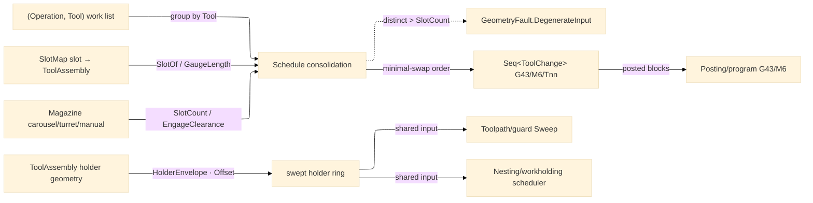

# [RASM_FABRICATION_TOOL_MAGAZINE]

The tool-magazine sub-domain: `Magazine` the `[SmartEnum<string>]` physical magazine (carousel/turret/manual) the tool-change folds schedule against, deepening the flat `Process/physics#CUT_PARAMETER` `Tool` cutting-data axis into a real CAM tool-management owner — the carousel/turret/manual slot map, the per-slot `ToolAssembly` holder geometry (taper/gauge-length/collet-runout/projected-stickout), and the minimal-swap tool-change `Schedule` fold consolidating a multi-operation job into the fewest `M6` swaps. A tool change is a scheduled `M6` with retract and `G43` length-offset; the `ToolAssembly` holder swept envelope is the shared input the `Toolpath/guard#GUARD` swept-envelope check and the `Nesting/workholding#WORKHOLDING` multi-fixture scheduler both consume, so a stickout-limited tool tests its real holder footprint against the channel rather than a zero-width spindle axis. The `Tool` cutting-data depth (`Coating`/`CornerRadius`/`HelixAngle`/`Stickout`/`Runout` columns plus the `(Material, Tool, Operation)` SFM/chip-load table) lands on the `Process/physics#CUT_PARAMETER` `Tool` payload — this page reads the settled `Tool` axis and adds the PHYSICAL magazine/holder layer, never a parallel `ToolMaterialTable` the density law forbids. The owner composes the `Process/physics#CUT_PARAMETER` `Tool` and the `Process/owner#FABRICATION_OWNER` shared vocabulary; it computes no hash and operates on bounded vocabulary and raw doubles at the interior.

Wire posture: HOST-LOCAL. The `ToolChange` schedule and the holder envelope cross only the in-process seam to the `Toolpath/motion#CAM_MOTION` `Cam` consumer and the `Posting/program#CUT_PROGRAM` `G43`/`M6` emitter — never a browser or peer wire. The `Magazine`/`ToolAssembly`/`ToolChange`/`MagazinePolicy` records are host-local types that never sit between wire and rail.

## [01]-[INDEX]

- [01]-[TOOL_MAGAZINE]: owns the `Magazine` `[SmartEnum<string>]` carousel/turret/manual slot map, the `ToolAssembly` `[ComplexValueObject]` per-slot holder geometry, the `ToolChange`/`SlotMap` records, and the `Schedule` fold consolidating operations sharing a tool into one tool-loaded interval emitting the minimal-swap tool-change order and the holder swept envelope.

## [02]-[TOOL_MAGAZINE]

- Owner: `Magazine` `[SmartEnum<string>]` the physical-magazine axis (`carousel`/`turret`/`manual`) carrying a `SlotCount` capacity column and an `EngageClearance` swap-clearance column (the retract a tool change demands before the carousel indexes); `ToolAssembly` `[ComplexValueObject]` the per-slot mounted tool — the `Process/physics#CUT_PARAMETER` `Tool` plus its holder geometry (the `Holder` footprint `Loop`, the `GaugeLength` spindle-face-to-tip length, the projected `Stickout`, and the collet `Runout`) — the swept-holder-envelope owner `Toolpath/guard#GUARD` reads; `SlotMap` the magazine's slot→`ToolAssembly` assignment (the loaded tools keyed by physical slot index); `ToolChange` the scheduled swap (the `M6` to the next slot carrying its retract Z, the `G43` length offset off the `GaugeLength`, and the `Tnn` slot index); `MagazinePolicy` the schedule knobs (the swap-cost weight the consolidation minimizes and the manual-change confirmation flag a `manual` magazine demands); `Schedule` the static fold consolidating the `(operation, tool)`-keyed work list into one tool-loaded interval per tool, ordering the intervals to minimize the swap count, and emitting the `ToolChange` sequence plus the per-slot holder envelope.
- Cases: `Magazine` rows `carousel` (an indexed disc, `SlotCount` ~20-30, a moderate `EngageClearance`) · `turret` (a lathe turret, `SlotCount` ~8-12, a small `EngageClearance`) · `manual` (no automatic change, `SlotCount` 1, the `MagazinePolicy.ManualConfirm` gating each swap) (3); the `Schedule` consolidation groups the operations sharing a `Tool` into one interval (a job cutting three pockets and two contours with one endmill loads the endmill ONCE), the swap order the minimal-`M6` sequence over the loaded set, never a per-operation reload.
- Entry: `public static Fin<Seq<ToolChange>> Schedule(Magazine magazine, SlotMap slots, Seq<(Operation Op, Tool Tool)> work, MagazinePolicy policy)` — `Fin<T>` routes `GeometryFault.DegenerateInput` when the distinct-tool count exceeds the magazine `SlotCount` (the job needs more tools than the magazine holds), lowered with `.ToError()`; the body consolidates the work list by tool, orders the tool-loaded intervals to minimize swaps, and emits the `ToolChange` sequence. `public static Loop HolderEnvelope(ToolAssembly assembly)` projects the swept holder footprint the guard and fixture scheduler read; `public static Fin<Magazine> Admit(ReadOnlySpan<char> key)` is the span-keyed magazine boundary routing `DegenerateInput` on an unknown key.
- Auto: `Schedule` reads the `(operation, tool)` work list, groups it by the `Tool` identity into one tool-loaded interval per distinct tool (the operations sharing a tool collapse to one load), counts the distinct tools against the `magazine.SlotCount` (routing `DegenerateInput` on overflow), orders the intervals by the `MagazinePolicy.SwapWeight` to minimize the swap count (a greedy nearest-tool ordering over the slot map, the loaded tools preferring an already-mounted slot), and emits one `ToolChange` per interval boundary carrying the `M6` to the interval's slot, the `G43` length offset derived from the `ToolAssembly.GaugeLength`, the retract to the `magazine.EngageClearance` Z, and the `Tnn` slot index; a `manual` magazine stamps each `ToolChange` with the `ManualConfirm` flag the operator acknowledges. `HolderEnvelope` projects the `ToolAssembly.Holder` footprint inflated to its projected reach so `Toolpath/guard#GUARD` `Sweep` unions the real holder ring into the swept envelope and `Nesting/workholding#WORKHOLDING` tests the holder against the fixture keep-out; the `Posting/program#CUT_PROGRAM` `Post` emits each `ToolChange` as the `G43`/`M6`/`Tnn` block sequence the `GCommand` axis carries (a `ToolChange` `GCommand` row reading the slot and length offset).
- Receipt: the `Seq<ToolChange>` IS the typed tool-management evidence — each `ToolChange` carries its slot, length offset, retract, and confirm flag the posting owner emits and the motion owner honours; no generic tooling ledger, the schedule a typed swap sequence.
- Packages: `Process/physics#CUT_PARAMETER` (`Tool`/`Operation` — the settled cutting-data axis, composed, the `Stickout`/`Runout` columns the holder reads), `Polygon/clipper#POLYGON_ALGEBRA` (`Offset` — the holder-envelope inflation), `Rasm`/Vectors (`Point3d` — the holder footprint vertices), Thinktecture.Runtime.Extensions (`[SmartEnum<string>]`/`[ComplexValueObject]`), LanguageExt.Core (`Fin`/`Seq`), BCL inbox.
- Growth: a new magazine type (a chain magazine, a side-mount) is one `Magazine` row carrying its `SlotCount`/`EngageClearance`; a tool-life-aware swap (reloading a worn tool mid-job) is one `ToolChange` arm reading a wear column; a probe-after-change verification is one `ToolChange` arm composing the `Toolpath/probing` `ToolLengthSet` cycle; the cutting-data depth is the settled `Process/physics#CUT_PARAMETER` `Tool` payload this page reads, never a parallel table; zero new surface.
- Boundary: `Magazine` is the ONE tool-management owner and a flat per-toolpath one-tool assumption is the deleted form — the `Schedule` consolidation honours a job-level tool-change plan, the `Posting` emitting the `G43`/`M6`/`Tnn` blocks; the magazine kind is the `Magazine` `[SmartEnum<string>]` axis carrying its `SlotCount`/`EngageClearance` columns and a parallel `Carousel`/`Turret`/`Manual` class triple is the deleted form — one axis, the row the dispatch reads; the per-slot tool is the `ToolAssembly` `[ComplexValueObject]` over the settled `Process/physics#CUT_PARAMETER` `Tool` and a parallel tool-geometry record is the deleted form — the `Stickout`/`Runout` ride the one `Tool` payload column, the holder geometry the `ToolAssembly` adds; the cutting-data depth is the settled `Process/physics#CUT_PARAMETER` `Tool` `CuttingData` table and a `ToolMaterialTable` sibling here is the named density defect — this page reads the `Tool` axis and adds the PHYSICAL magazine/holder layer; the holder swept envelope is the shared `HolderEnvelope` projection the `Toolpath/guard#GUARD` and `Nesting/workholding#WORKHOLDING` both read and a per-consumer re-derived holder footprint is the deleted form — one envelope owner, the guard and fixture scheduler composing it; the holder-envelope inflation rides the one `Polygon/clipper#POLYGON_ALGEBRA` `Offset` and a hand-rolled footprint inflation is the deleted form; the magazine is admitted once through `Admit` and travels as the typed row, a magazine selected by a raw `string` literal the named defect.

```csharp signature
// --- [RUNTIME_PRELUDE] --------------------------------------------------------------------
using LanguageExt;
using LanguageExt.Common;
using Rasm.Fabrication.Geometry2D;
using Rasm.Fabrication.Process;
using Rasm.Fabrication.ProcessPhysics;
using Rasm.Geometry;
using Rhino.Geometry;
using Thinktecture;
using static LanguageExt.Prelude;

namespace Rasm.Fabrication.ProcessModel;

// --- [TYPES] ------------------------------------------------------------------------------
[SmartEnum<string>]
public sealed partial class Magazine {
    public static readonly Magazine Carousel = new("carousel", slotCount: 24, engageClearance: 50.0);
    public static readonly Magazine Turret = new("turret", slotCount: 12, engageClearance: 20.0);
    public static readonly Magazine Manual = new("manual", slotCount: 1, engageClearance: 100.0);

    public int SlotCount { get; }
    public double EngageClearance { get; }
}

// --- [MODELS] -----------------------------------------------------------------------------
[ComplexValueObject]
public sealed partial class ToolAssembly {
    public Tool Tool { get; }
    public Loop Holder { get; }
    public double GaugeLength { get; }
    public double Stickout { get; }
    public double Runout { get; }
}

public sealed record SlotMap(Seq<(int Slot, ToolAssembly Assembly)> Slots) {
    public Option<int> SlotOf(Tool tool) => Slots.Find(s => s.Assembly.Tool == tool).Map(static s => s.Slot);
}

public readonly record struct ToolChange(int Slot, double LengthOffset, double Retract, bool ManualConfirm);

public readonly record struct MagazinePolicy(double SwapWeight, bool ManualConfirm) {
    public static readonly MagazinePolicy Canonical = new(SwapWeight: 1.0, ManualConfirm: false);
}

// --- [OPERATIONS] -------------------------------------------------------------------------
public static class ToolMagazine {
    public static Fin<Seq<ToolChange>> Schedule(Magazine magazine, SlotMap slots, Seq<(Operation Op, Tool Tool)> work, MagazinePolicy policy) {
        Seq<Tool> distinct = work.Map(static w => w.Tool).Distinct().ToSeq();
        return distinct.Count > magazine.SlotCount
            ? Fin.Fail<Seq<ToolChange>>(GeometryFault.DegenerateInput($"magazine:overflow:{distinct.Count}>{magazine.SlotCount}").ToError())
            : Fin.Succ(Consolidate(distinct, slots, magazine, policy));
    }

    public static Loop HolderEnvelope(ToolAssembly assembly) =>
        PolygonAlgebra.Offset(Seq(assembly.Holder.AsCcw()), 0.1 * Math.Max(0.0, assembly.Stickout), OffsetEnds.Polygon)
            .Bind(rings => rings.HeadOrNone().ToFin(GeometryFault.DegenerateInput("magazine:holder-empty").ToError()))
            .IfFail(assembly.Holder.AsCcw());

    // Minimal-swap order: a tool already mounted costs zero (no M6), an unmounted tool costs the
    // SwapWeight load, so the ascending-cost fold loads the mounted tools first by physical slot and
    // assigns each unmounted tool the lowest free slot — the fewest-M6 sequence over the loaded set.
    static Seq<ToolChange> Consolidate(Seq<Tool> distinct, SlotMap slots, Magazine magazine, MagazinePolicy policy) {
        Set<int> taken = toSet(distinct.Map(t => slots.SlotOf(t)).Somes());
        var free = toSeq(Enumerable.Range(0, magazine.SlotCount).Filter(s => !taken.Contains(s)));
        return distinct
            .OrderBy(t => slots.SlotOf(t).Match(Some: s => (double)s, None: () => magazine.SlotCount + policy.SwapWeight))
            .ToSeq()
            .Fold((Changes: Seq<ToolChange>(), Free: free), (acc, tool) => {
                (int slot, Seq<int> rest) = slots.SlotOf(tool).Match(
                    Some: s => (s, acc.Free),
                    None: () => acc.Free.HeadOrNone().Match(Some: f => (f, acc.Free.Tail), None: () => (acc.Changes.Count, acc.Free)));
                double offset = slots.Slots.Find(s => s.Slot == slot).Map(static s => s.Assembly.GaugeLength).IfNone(0.0);
                return (acc.Changes.Add(new ToolChange(slot, offset, magazine.EngageClearance, policy.ManualConfirm)), rest);
            }).Changes;
    }

    // --- [BOUNDARIES] ---------------------------------------------------------------------
    public static Fin<Magazine> Admit(ReadOnlySpan<char> key) =>
        Magazine.Validate(key, null, out var m) is { } f
            ? Fin.Fail<Magazine>(GeometryFault.DegenerateInput($"magazine:{f.Message}").ToError())
            : Fin.Succ(m!);
}
```


