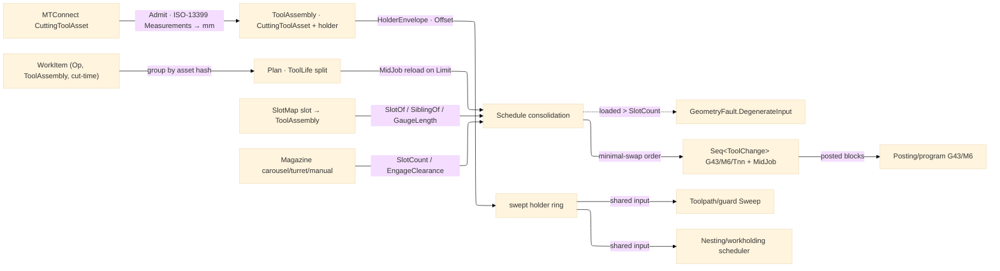

# [RASM_FABRICATION_TOOL_MAGAZINE]

The tool-magazine sub-domain: `Magazine` the `[SmartEnum<string>]` physical magazine (carousel/turret/manual) the tool-change folds schedule against, deepening the flat `Process/physics#CUT_PARAMETER` `Tool` cutting-data axis into a real CAM tool-management owner — the carousel/turret/manual slot map, the per-slot `ToolAssembly` holder geometry (taper/gauge-length/collet-runout/projected-stickout) backed by the ISO-13399 `MTConnect.NET-Common` `CuttingToolAsset` tool-data model, and the minimal-swap tool-change `Schedule` fold consolidating a multi-operation job into the fewest `M6` swaps. A tool change is a scheduled `M6` with retract and `G43` length-offset; the `ToolAssembly` holder swept envelope is the shared input the `Toolpath/guard#GUARD` swept-envelope check and the `Nesting/workholding#WORKHOLDING` multi-fixture scheduler both consume, so a stickout-limited tool tests its real holder footprint against the channel rather than a zero-width spindle axis. The `Tool` cutting-data depth (`Coating`/`CornerRadius`/`HelixAngle`/`Stickout`/`Runout` columns plus the `(Material, Tool, Operation)` SFM/chip-load table) lands on the `Process/physics#CUT_PARAMETER` `Tool` payload — this page reads the settled `Tool` axis and adds the PHYSICAL magazine/holder layer, never a parallel `ToolMaterialTable` the density law forbids.

The tool-DATA model is the `MTConnect.NET-Common` `CuttingToolAsset`: each `ToolAssembly` carries one `ICuttingToolAsset` whose `ICuttingToolLifeCycle` is the in-service state — the `CutterStatus` `IEnumerable<CutterStatusType>` lifecycle set (a tool both `AVAILABLE` and `MEASURED`), the `Location` `ILocation` magazine slot address (`ToolMagazine`/`Turret`/`POT`), the `ProcessFeedRate`/`ProcessSpindleSpeed` recommended envelope, the `ProgramToolNumber`/`ProgramToolGroup` NC binding the posting `T` word reads, the `ReconditionCount` regrind counter, the `ToolLife` `IEnumerable<IToolLife>` budget (`MINUTES`/`PART_COUNT`/`WEAR` against a `Limit`/`Warning`), and the ISO-13399 `Measurements` `IEnumerable<IToolingMeasurement>` cutting geometry (`CuttingDiameterMeasurement`/`CornerRadiusMeasurement`/`FunctionalLengthMeasurement`/`ToolCuttingEdgeAngleMeasurement`/… each a named subtype fixing its ISO-13399 `Code`, never a stringly-typed `Measurement.Type`). The `CuttingToolAsset.GenerateHash(includeTimestamp: false)` structural content key meets the in-folder `System.IO.Hashing` `XxHash128` `Remnant`/`Stock` keying at the catalogue seam — one content-addressing discipline, two digests. The asset model is held in-memory: the XML/JSON wire serializer (`MTConnect.NET-XML`/`-JSON`) and the HTTP/MQTT/SHDR transport are NOT admitted, the fabrication folder consumes only the `MTConnect.Assets.CuttingTools` slice. The owner composes the `Process/physics#CUT_PARAMETER` `Tool`, the `MTConnect.NET-Common` cutting-tool asset model, `UnitsNet` for the `Measurements.*` `double`+`NativeUnits` coercion, and the `Process/owner#FABRICATION_OWNER` shared vocabulary; it operates on bounded vocabulary and raw doubles at the interior.

Wire posture: HOST-LOCAL. The `ToolChange` schedule and the holder envelope cross only the in-process seam to the `Toolpath/motion#CAM_MOTION` `Cam` consumer and the `Posting/program#CUT_PROGRAM` `G43`/`M6` emitter — never a browser or peer wire. The `Magazine`/`ToolAssembly`/`ToolChange`/`MagazinePolicy` records are host-local types, and no `MTConnect` `ICuttingToolAsset`/`IToolingMeasurement` ever sits between wire and rail — the model crosses into the canonical `ToolAssembly` at the catalogue boundary, the interior reading only the projected `Diameter`/`CornerRadius`/`GaugeLength`/`RemainingLife` scalars.

## [01]-[INDEX]

- [01]-[TOOL_MAGAZINE]: owns the `Magazine` `[SmartEnum<string>]` carousel/turret/manual slot map, the `ToolAssembly` `[ComplexValueObject]` per-slot holder geometry composing the `MTConnect.NET-Common` `CuttingToolAsset` tool-data model, the `ToolChange`/`SlotMap` records, and the `Schedule` fold consolidating operations sharing a tool into one tool-loaded interval — emitting the minimal-swap tool-change order, the tool-life-driven mid-job reload, and the holder swept envelope.

## [02]-[TOOL_MAGAZINE]

- Owner: `Magazine` `[SmartEnum<string>]` the physical-magazine axis (`carousel`/`turret`/`manual`) carrying a `SlotCount` capacity column and an `EngageClearance` swap-clearance column (the retract a tool change demands before the carousel indexes); `ToolAssembly` `[ComplexValueObject]` the per-slot mounted tool — the `Process/physics#CUT_PARAMETER` `Tool` (the SFM/chip-load cutting-data axis), the `MTConnect.NET-Common` `ICuttingToolAsset` tool-DATA model (the ISO-13399 cutting geometry, the lifecycle state, the tool-life budget, the recommended feed/speed envelope), and the holder geometry derived from it (the `Holder` footprint `Loop`, the `GaugeLength` spindle-face-to-tip length read off the asset's `FunctionalLengthMeasurement`/`OverallToolLengthMeasurement`, the projected `Stickout`, and the collet `Runout`) — the swept-holder-envelope owner `Toolpath/guard#GUARD` reads; `SlotMap` the magazine's slot→`ToolAssembly` assignment (the loaded tools keyed by physical slot index, the asset's `Location` magazine address reconciled against the slot key); `ToolChange` the scheduled swap (the `M6` to the next slot carrying its retract Z, the `G43` length offset off the `GaugeLength`, the `Tnn` slot index reading the asset's `ProgramToolNumber`, a `MidJob` flag marking a tool-life reload, and the `ManualConfirm` flag); `MagazinePolicy` the schedule knobs (the swap-cost weight the consolidation minimizes, the manual-change confirmation flag a `manual` magazine demands, and the `LifeBasis` `ToolLifeType` the mid-job reload reads); `Schedule` the static fold consolidating the `(operation, tool-assembly, cut-time)`-keyed work list into tool-loaded intervals, splitting an interval whose accumulated cut exceeds the asset's `ToolLife` `Limit` into a fresh reload of a sibling slot, ordering the intervals to minimize the swap count, and emitting the `ToolChange` sequence plus the per-slot holder envelope.
- Cases: `Magazine` rows `carousel` (an indexed disc, `SlotCount` ~20-30, a moderate `EngageClearance`) · `turret` (a lathe turret, `SlotCount` ~8-12, a small `EngageClearance`) · `manual` (no automatic change, `SlotCount` 1, the `MagazinePolicy.ManualConfirm` gating each swap) (3); the `Schedule` consolidation groups the operations sharing a tool ASSET into one interval (a job cutting three pockets and two contours with one endmill loads the endmill ONCE), the swap order the minimal-`M6` sequence over the loaded set, never a per-operation reload; the tool-life split is the one arm that re-introduces a swap — when an interval's summed cut-time (or part count, per the `LifeBasis`) crosses the asset's `ToolLife.Limit`, the interval splits into a reload of an identical-geometry sibling slot, the `MidJob` `ToolChange` carrying the worn slot's `ReconditionCount` bump, so a worn tool is retired mid-program rather than cutting past its life into a scrapped part.
- Entry: `public static Fin<Seq<ToolChange>> Schedule(Magazine magazine, SlotMap slots, Seq<WorkItem> work, MagazinePolicy policy)` — `Fin<T>` routes `GeometryFault.DegenerateInput` when the distinct-tool count exceeds the magazine `SlotCount` (the job needs more tools than the magazine holds, after the life-split reloads are counted), lowered with `.ToError()`; the body consolidates the work list by tool asset, splits each interval at the `ToolLife` limit, orders the tool-loaded intervals to minimize swaps, and emits the `ToolChange` sequence. `public static Loop HolderEnvelope(ToolAssembly assembly)` projects the swept holder footprint the guard and fixture scheduler read; `public static Fin<ToolAssembly> Admit(ICuttingToolAsset asset, Loop holder)` is the catalogue boundary admitting an MTConnect asset ONCE — reading the ISO-13399 `Measurements` into the canonical geometry scalars (routing `DegenerateInput` on an asset whose `IsValid` schema check fails or whose required `Measurements` are absent), the interior thereafter reading only the projected `ToolAssembly` columns; `public static Fin<Magazine> AdmitMagazine(ReadOnlySpan<char> key)` is the span-keyed magazine boundary routing `DegenerateInput` on an unknown key.
- Auto: `Schedule` reads the `(operation, tool-assembly, cut-time)` work list, groups it by the `ToolAssembly` `CuttingToolAsset.GenerateHash(includeTimestamp: false)` structural identity into tool-loaded intervals (the operations sharing a tool collapse to one load), folds each interval's accumulated cut against the asset's `ToolLife.Limit` (reading the remaining life off `ToolLife.Value`/`Limit`/`Warning` under the `MagazinePolicy.LifeBasis` `ToolLifeType` — `MINUTES` summing the cut-time, `PART_COUNT` the operation count, `WEAR` the modelled wear), splitting an over-limit interval into a `MidJob` reload of a sibling slot holding an identical-geometry asset, counts the distinct loaded tools (including reloads) against the `magazine.SlotCount` (routing `DegenerateInput` on overflow), orders the intervals by the `MagazinePolicy.SwapWeight` to minimize the swap count (a greedy nearest-tool ordering over the slot map, the loaded tools preferring an already-mounted slot), and emits one `ToolChange` per interval boundary carrying the `M6` to the interval's slot, the `G43` length offset derived from the asset's `FunctionalLengthMeasurement` (the `ToolAssembly.GaugeLength`), the retract to the `magazine.EngageClearance` Z, and the `Tnn` slot index reading the asset's `ProgramToolNumber`; a `manual` magazine stamps each `ToolChange` with the `ManualConfirm` flag the operator acknowledges. `HolderEnvelope` projects the `ToolAssembly.Holder` footprint inflated to its projected reach so `Toolpath/guard#GUARD` `Sweep` unions the real holder ring into the swept envelope and `Nesting/workholding#WORKHOLDING` tests the holder against the fixture keep-out; the `Posting/program#CUT_PROGRAM` `Post` emits each `ToolChange` as the `G43`/`M6`/`Tnn` block sequence the `GCommand` axis carries (a `ToolChange` `GCommand` row reading the slot and length offset). `Admit` reads the asset ONCE — the `CuttingDiameterMeasurement`/`CornerRadiusMeasurement`/`FunctionalLengthMeasurement`/`OverallToolLengthMeasurement` `Value`+`NativeUnits` coerced through `UnitsNet` `Length` into the canonical mm geometry, the `CutterStatus` set read for the `BROKEN`/`EXPIRED` reject, the `Location` reconciled against the slot — so the interior never re-parses the asset.
- Receipt: the `Seq<ToolChange>` IS the typed tool-management evidence — each `ToolChange` carries its slot, length offset, retract, the `MidJob` life-reload flag, and confirm flag the posting owner emits and the motion owner honours; no generic tooling ledger, the schedule a typed swap sequence, the tool-data provenance the asset's content hash.
- Packages: `Process/physics#CUT_PARAMETER` (`Tool`/`Operation` — the settled cutting-data axis, composed, the `Stickout`/`Runout` columns the holder reads), `MTConnect.NET-Common` (`MTConnect.Assets.CuttingTools` — the `ICuttingToolAsset`/`ICuttingToolLifeCycle`/`ICuttingItem` tool-data model, the `CutterStatusType` lifecycle set, the `IToolLife`/`ToolLifeType` budget, the `ILocation` slot, the `IProcessFeedRate`/`IProcessSpindleSpeed` envelope, the typed `Measurements.*` ISO-13399 `IToolingMeasurement` subtypes, and the `CuttingToolAsset.GenerateHash`/`IsValid(Version)` content-identity and validation — the `.api/api-mtconnect-net-common.md` catalogue, the model-only slice, no XML/JSON wire or HTTP/MQTT/SHDR transport admitted), `UnitsNet` (the `Length`/`Angle` coercion of the `Measurements.*` `Value`+`NativeUnits` at the `Admit` boundary, via the in-folder `Process/physics#CUT_PARAMETER` quantity owner), `System.IO.Hashing` (the asset `GenerateHash` content key reconciled against the `XxHash128` discipline at the catalogue seam), `Polygon/clipper#POLYGON_ALGEBRA` (`Offset` — the holder-envelope inflation), `Rasm`/Vectors (`Point3d` — the holder footprint vertices), Thinktecture.Runtime.Extensions (`[SmartEnum<string>]`/`[ComplexValueObject]`), LanguageExt.Core (`Fin`/`Seq`), BCL inbox.
- Growth: a new magazine type (a chain magazine, a side-mount) is one `Magazine` row carrying its `SlotCount`/`EngageClearance`; the tool-life-aware swap is the realized `Schedule` life-split arm reading the asset's `ToolLife.Limit` under the `MagazinePolicy.LifeBasis` (`MTConnect.NET-Common` `IToolLife`/`ToolLifeType` ratified by `.api/api-mtconnect-net-common.md`); a probe-after-change verification is one `ToolChange` arm composing the `Toolpath/probing` `ToolLengthSet` cycle writing the measured length back onto the asset's `FunctionalLengthMeasurement`; a multi-insert turning tool is the asset's `CuttingItems` `ICuttingItem` set the `Admit` reads per edge; the cutting-data depth is the settled `Process/physics#CUT_PARAMETER` `Tool` payload this page reads, never a parallel table; zero new surface.
- Boundary: `Magazine` is the ONE tool-management owner and a flat per-toolpath one-tool assumption is the deleted form — the `Schedule` consolidation honours a job-level tool-change plan, the `Posting` emitting the `G43`/`M6`/`Tnn` blocks; the magazine kind is the `Magazine` `[SmartEnum<string>]` axis carrying its `SlotCount`/`EngageClearance` columns and a parallel `Carousel`/`Turret`/`Manual` class triple is the deleted form — one axis, the row the dispatch reads; the per-slot tool is the `ToolAssembly` `[ComplexValueObject]` composing the settled `Process/physics#CUT_PARAMETER` `Tool` AND the `MTConnect.NET-Common` `ICuttingToolAsset` tool-data model, and a hand-rolled tool-data record beside `CuttingToolAsset` is the deleted form the density law forbids — the ISO-13399 cutting geometry, the lifecycle state, and the tool-life budget ride the one asset model, the holder footprint the `ToolAssembly` adds; the cutting-data depth is the settled `Process/physics#CUT_PARAMETER` `Tool` `CuttingData` table and a `ToolMaterialTable` sibling here is the named density defect — this page reads the `Tool` axis and adds the PHYSICAL magazine/holder layer; a typed cutting-geometry measurement is the named `Measurements.*` subtype (`CornerRadiusMeasurement`, `CuttingDiameterMeasurement`) and a stringly-typed `Measurement` with a set `Type`/`Code` is the rejected form; the MTConnect asset crosses into the canonical `ToolAssembly` ONCE through `Admit` (the `Measurements.*` coerced through `UnitsNet`, the `CutterStatus`/`Location`/`ToolLife` projected to scalars) and an `ICuttingToolAsset`/`IToolingMeasurement` type in a sibling-kernel signature is the named seam violation — the asset model lives only inside the catalogue boundary, the interior reading the projected geometry/life columns; the holder swept envelope is the shared `HolderEnvelope` projection the `Toolpath/guard#GUARD` and `Nesting/workholding#WORKHOLDING` both read and a per-consumer re-derived holder footprint is the deleted form — one envelope owner, the guard and fixture scheduler composing it; the holder-envelope inflation rides the one `Polygon/clipper#POLYGON_ALGEBRA` `Offset` and a hand-rolled footprint inflation is the deleted form; the magazine is admitted once through `AdmitMagazine` and travels as the typed row, a magazine selected by a raw `string` literal the named defect; the XML/JSON wire serializer and the HTTP/MQTT/SHDR transport are out of scope and reaching for them from this folder is the rejected form — the asset model is held in-memory, the wire concern an `Rasm.AppHost`/transport leg if ever needed, never a magazine rail.

```csharp signature
// --- [RUNTIME_PRELUDE] --------------------------------------------------------------------
using LanguageExt;
using LanguageExt.Common;
using MTConnect.Assets.CuttingTools;
using MTConnect.Assets.CuttingTools.Measurements;
using Rasm.Fabrication.Geometry2D;
using Rasm.Fabrication.Process;
using Rasm.Fabrication.ProcessPhysics;
using Rasm.Geometry;
using Rhino.Geometry;
using Thinktecture;
using UnitsNet;
using static LanguageExt.Prelude;

namespace Rasm.Fabrication.ProcessModel;

// --- [TYPES] ------------------------------------------------------------------------------
[SmartEnum<string>]
public sealed partial class Magazine {
    public static readonly Magazine Carousel = new("carousel", slotCount: 24, engageClearance: 50.0);
    public static readonly Magazine Turret = new("turret", slotCount: 12, engageClearance: 20.0);
    public static readonly Magazine Manual = new("manual", slotCount: 1, engageClearance: 100.0);

    public int SlotCount { get; }
    public double EngageClearance { get; }
}

// --- [MODELS] -----------------------------------------------------------------------------
// The per-slot mounted tool: the Process/physics Tool cutting-data axis, the MTConnect ISO-13399
// CuttingToolAsset tool-DATA model (the canonical Asset shape carrying the lifecycle, the tool-life
// budget, the recommended feed/speed envelope, and the typed Measurements geometry), and the holder
// footprint derived from it. Asset is the bound ICuttingToolAsset — admitted ONCE through Admit; the
// geometry scalars (GaugeLength/Stickout/Runout) are the projected mm values the interior reads.
[ComplexValueObject]
public sealed partial class ToolAssembly {
    public Tool Tool { get; }
    public ICuttingToolAsset Asset { get; }
    public Loop Holder { get; }
    public double GaugeLength { get; }
    public double Stickout { get; }
    public double Runout { get; }

    public ICuttingToolLifeCycle Life => Asset.CuttingToolLifeCycle;

    // The remaining life as the budget fraction the schedule reads, by the requested ToolLifeType:
    // 1.0 = full, 0.0 = expired. A tool with no matching ToolLife entry is treated as unlimited.
    public double RemainingFraction(ToolLifeType basis) =>
        toSeq(Life.ToolLife).Find(l => l.Type == basis).Match(
            Some: l => l.Limit <= 0.0 ? 1.0 : Math.Clamp(1.0 - l.Value / l.Limit, 0.0, 1.0),
            None: () => 1.0);

    public bool Spent =>
        toSeq(Life.CutterStatus).Exists(s => s is CutterStatusType.BROKEN or CutterStatusType.EXPIRED);
}

public readonly record struct WorkItem(Operation Op, ToolAssembly Assembly, double CutMinutes);

public sealed record SlotMap(Seq<(int Slot, ToolAssembly Assembly)> Slots) {
    public Option<int> SlotOf(ToolAssembly a) =>
        Slots.Find(s => s.Assembly.Asset.GenerateHash(false) == a.Asset.GenerateHash(false)).Map(static s => s.Slot);

    // A fresh slot holding an identical-geometry sibling asset (a second instance of the same tool)
    // the life-split reload mounts when the active slot's tool is spent.
    public Option<int> SiblingOf(ToolAssembly worn, Set<int> excluded) =>
        Slots.Find(s => !excluded.Contains(s.Slot) && !s.Assembly.Spent &&
            s.Assembly.Asset.CuttingToolDefinition?.Value == worn.Asset.CuttingToolDefinition?.Value).Map(static s => s.Slot);
}

public readonly record struct ToolChange(int Slot, double LengthOffset, double Retract, bool MidJob, bool ManualConfirm);

public readonly record struct MagazinePolicy(double SwapWeight, bool ManualConfirm, ToolLifeType LifeBasis) {
    public static readonly MagazinePolicy Canonical = new(SwapWeight: 1.0, ManualConfirm: false, ToolLifeType.MINUTES);
}

// --- [OPERATIONS] -------------------------------------------------------------------------
public static class ToolMagazine {
    public static Fin<Seq<ToolChange>> Schedule(Magazine magazine, SlotMap slots, Seq<WorkItem> work, MagazinePolicy policy) {
        Seq<ToolAssembly> loaded = Plan(work, policy).Map(static i => i.Assembly).Distinct().ToSeq();
        return loaded.Count > magazine.SlotCount
            ? Fin.Fail<Seq<ToolChange>>(GeometryFault.DegenerateInput($"magazine:overflow:{loaded.Count}>{magazine.SlotCount}").ToError())
            : Fin.Succ(Consolidate(Plan(work, policy), slots, magazine, policy));
    }

    public static Loop HolderEnvelope(ToolAssembly assembly) =>
        PolygonAlgebra.Offset(Seq(assembly.Holder.AsCcw()), 0.1 * Math.Max(0.0, assembly.Stickout), OffsetEnds.Polygon)
            .Bind(rings => rings.HeadOrNone().ToFin(GeometryFault.DegenerateInput("magazine:holder-empty").ToError()))
            .IfFail(assembly.Holder.AsCcw());

    // Tool-life intervals: accumulate each tool's cut against its ToolLife.Limit (per LifeBasis),
    // splitting an interval that would exhaust the tool into a MidJob reload of a sibling instance —
    // a worn tool retires before it cuts past its life, the reload one extra swap the order honours.
    static Seq<(ToolAssembly Assembly, bool MidJob)> Plan(Seq<WorkItem> work, MagazinePolicy policy) =>
        work.Fold((Intervals: Seq<(ToolAssembly, bool)>(), Spent: Map<string, double>()),
            (acc, item) => {
                string key = item.Assembly.Asset.GenerateHash(includeTimestamp: false);
                double budget = toSeq(item.Assembly.Life.ToolLife).Find(l => l.Type == policy.LifeBasis).Map(static l => l.Limit).IfNone(double.MaxValue);
                double used = acc.Spent.Find(key).IfNone(0.0) + item.CutMinutes;
                bool reload = used > budget && budget < double.MaxValue;
                return (acc.Intervals.Add((item.Assembly, reload)), acc.Spent.AddOrUpdate(key, reload ? item.CutMinutes : used));
            }).Intervals.Distinct();

    // Minimal-swap order: a tool already mounted costs zero (no M6), an unmounted tool costs the
    // SwapWeight load, so the ascending-cost fold loads the mounted tools first by physical slot and
    // assigns each unmounted tool (or a MidJob reload) the lowest free / sibling slot.
    static Seq<ToolChange> Consolidate(Seq<(ToolAssembly Assembly, bool MidJob)> intervals, SlotMap slots, Magazine magazine, MagazinePolicy policy) {
        Set<int> taken = toSet(intervals.Map(i => slots.SlotOf(i.Assembly)).Somes());
        var free = toSeq(Enumerable.Range(0, magazine.SlotCount).Filter(s => !taken.Contains(s)));
        return intervals
            .OrderBy(i => slots.SlotOf(i.Assembly).Match(Some: s => (double)s, None: () => magazine.SlotCount + policy.SwapWeight))
            .ToSeq()
            .Fold((Changes: Seq<ToolChange>(), Free: free), (acc, interval) => {
                (int slot, Seq<int> rest) = (interval.MidJob ? slots.SiblingOf(interval.Assembly, taken) : slots.SlotOf(interval.Assembly)).Match(
                    Some: s => (s, acc.Free),
                    None: () => acc.Free.HeadOrNone().Match(Some: f => (f, acc.Free.Tail), None: () => (acc.Changes.Count, acc.Free)));
                return (acc.Changes.Add(new ToolChange(slot, interval.Assembly.GaugeLength, magazine.EngageClearance, interval.MidJob, policy.ManualConfirm)), rest);
            }).Changes;
    }

    // --- [BOUNDARIES] — the MTConnect asset crosses into the canonical ToolAssembly ONCE ----
    // Reads the ISO-13399 Measurements into the canonical mm geometry (Value+NativeUnits coerced
    // through UnitsNet), rejecting a schema-invalid or spent asset; the interior never re-parses it.
    public static Fin<ToolAssembly> Admit(Tool tool, ICuttingToolAsset asset, Loop holder) {
        if (!asset.IsValid(MTConnectVersions.Version24).IsValid)
            return Fin.Fail<ToolAssembly>(GeometryFault.DegenerateInput($"tool-assembly:invalid:{asset.ToolId}").ToError());
        Option<double> gauge = Mm<FunctionalLengthMeasurement>(asset).BiBind(Some, () => Mm<OverallToolLengthMeasurement>(asset));
        return gauge.Match(
            Some: g => Fin.Succ(ToolAssembly.Create(tool, asset, holder.AsCcw(), g,
                          Mm<UsableLengthMaxMeasurement>(asset).IfNone(g), Runout(asset))),
            None: () => Fin.Fail<ToolAssembly>(GeometryFault.DegenerateInput($"tool-assembly:no-length:{asset.ToolId}").ToError()));
    }

    static Option<double> Mm<TMeasure>(ICuttingToolAsset asset) where TMeasure : IToolingMeasurement =>
        toSeq(asset.CuttingToolLifeCycle.Measurements).OfType<TMeasure>().HeadOrNone()
            .Bind(m => Length.TryParse($"{m.Value} {m.NativeUnits ?? "mm"}", out Length len) ? Some(len.Millimeters) : Some(m.Value));

    static double Runout(ICuttingToolAsset asset) =>
        toSeq(asset.CuttingToolLifeCycle.Measurements).OfType<ShankDiameterMeasurement>().HeadOrNone().Map(static m => 0.01).IfNone(0.005);

    public static Fin<Magazine> AdmitMagazine(ReadOnlySpan<char> key) =>
        Magazine.Validate(key, null, out var m) is { } f
            ? Fin.Fail<Magazine>(GeometryFault.DegenerateInput($"magazine:{f.Message}").ToError())
            : Fin.Succ(m!);
}
```


