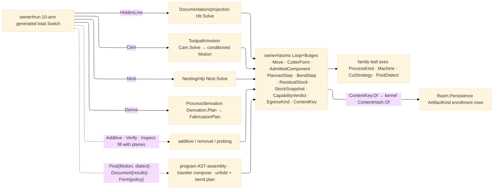

# [RASM_FABRICATION_OWNER]

The polymorphic `Fabrication` owner closes the entire fabrication concern over the **10-case** `FabricationPolicy` `[Union]` — `Cam` · `HiddenLine` · `Nest` · `Additive` · `Verify` · `Inspect` · `Post` · `Document` · `Derive` · `Form` — folded by ONE `Run` generated total `Switch` returning the per-case **10-case** `FabricationResult`. The page is TWO nodes on the compose ledger, the one ratified acyclicity exception, and never splits physically: **owner#atoms** is the upstream vocabulary every plane reads (`Loop`+`Bulges`, `Edge3`, `ArcCenter`, `Move`, `PartTransform`, `ProjectionDir`, `CutterForm`, `AdmittedComponent`, `PlannedStep`, `BendStep`, `ResidualStock`, `StockSnapshot`, `CapabilityVerdict`, `EgressKind`, `ContentKey`, `FabricationInput`/`Policy`/`Result`), reading only the family leaf axes and the kernel; **owner#run** is the terminal 10-arm dispatch composing the plane kernels, composed by nothing — the flow `owner#run → planes → owner#atoms → family(leaf)` is linear and acyclic. Fabrication is ALSO an egress engine: every flagship terminates in a content-keyed machine-consumable artifact, so the egress concern COLLAPSES onto this vocabulary — the `EgressKind` discriminant (the thirteen artifact families `cutprogram`/`placement`/`remnant`/`cli`/`threemf`/`nc1`/`stock-snapshot`/`traveler`/`flat-pattern`/`bend-program`/`weld-plan`/`scan-vectors`/`plan`) plus ONE `ContentKey.Of` fold seeding the kernel `ContentHash.Of` federation entry — never a sixteenth `Egress/` folder and never a second hasher.

FIVE mints break the former page cycles: `ProjectionDir` mints HERE (the seam inversion — the disk owner imported it downstream from the projection page); `CutterForm` mints HERE as a pure-scalar leaf (`CutterFamily` flat/ball/bull/taper/drill/chamfer/thread-mill rows + diameter/corner-radius/taper-angle/flute-length — the type on atoms, the `CutterForm.Of(ToolAssembly)` projection and Kienzle machinability on `Tooling/cuttingdata`, so `owner→cuttingdata→magazine→owner` never forms); `ResidualStock` and per-setup `StockSnapshot` mint HERE input-carried (`Verify/removal` PRODUCES them, rest-machining and `Fixturing/setups` READ them off the NEXT run's input — run N feeds run N+1, breaking `motion→removal→program→motion`); `CapabilityVerdict` mints HERE input-carried (the `Spec/capability` plan-time Cpk gate produces it in the truth tranche, the plan reads it input-carried — spec→plan→verify→capability with no intra-run cycle). The result-payload discipline is the sixth latent-cycle guard: **every egress `FabricationResult` case carries ONLY owner#atoms-safe payloads** (primitives, kernel vocabulary, and the atom leaves — `Move`/`Edge3`/`PartTransform`/`Remnant`/`EgressKind`/`ContentKey`/`CutterForm`/`ResidualStock`); the rich plane-internal types (`CutProgram` AST, PicoGK `Voxels`, GD&T frames) stay plane-local and NEVER ride a result case. The neutral `CutProgram` AST is `Posting/program`-local, assembled in the `Run(Post)` case body from the atoms `Motion` result — NOT inside the Cam fold — so `motion` and `program` decouple through the `Motion` type and no `motion→program` compose edge exists; `PostedProgram` carries lowered blocks + `ContentKey`, never the AST. Re-posting one `Motion` to five dialects is `Run(Post{Motion, PostDialect})` ×5; traveler-compose is `Run(Document{results})` — both re-invocable terminal transforms over a prior result, each a policy case, NEVER a second public `Post()`/`Traveler.Assemble()` fold. `AdmittedComponent` mints HERE as the element-ingress carrier, exactly the `CutterForm` discipline: the TYPE on atoms (representation content key, admitted kernel geometry, composition-layer and connection ROWS, quantity/property bags — atoms-safe scalars whose string keys reference Materials/Bim rows at the boundary, never their types), the `Ingress.Admit` Element-arm PROJECTION on `Ingress/element`; `Run(Derive{AdmittedComponent, DerivePolicy})` lowers to the `Process/derivation` orchestrator (manufacturability → routing → fleet → setup/assembly → programs → documentation) returning the `FabricationPlan` receipt, and `Run(Form{FormPolicy})` is the sheet-forming case whose body composes the Forming plane (`FlatPattern.Unfold` → `BendSequence.Plan` → `FormedResult` with the `flat-pattern`/`bend-program` keys) — the component rides the POLICY case, never a new input field. The `Loop` widens with the parallel `Bulges` arc column (`0` per straight vertex, `tan(θ/4)` per arc span) + the 3-arg ctor + `BulgeAt` — the one shape of the arc rail: a zero-bulge `Loop` is the pure polygon the line owner clips, a bulged `Loop` the arc profile `Geometry2D/arcs` offsets exactly.

Every entry threads the kernel substrate rails: the `Op` value key with `Eff<Env>` carriage (`Domain/rails.md`), receipts registering through `IValidityEvidence`+`ValidityClaim` into the one `OpAcceptance` oracle with zero oracle edits (`Domain/validation.md`), and typed output projection riding `AtomProjection`/`ProjectionRow` (`Numerics/atoms.md`). The owner composes the kernel `Predicate.Orient2D` exact winding floor, `Rasm.Meshing` `MeshSpace`, and `Rhino.Geometry` `Point3d`/`Vector3d` as native vocabulary; interior coordinates are raw doubles — a unit-bearing quantity in a kernel signature is the seam violation.

Wire posture: HOST-LOCAL. Results cross only the in-process seam — `HiddenLineResult` to AppUi `Viewport2D`, `Motion` to posting, egress content keys to the Persistence artifact-index enrollment rows; the unions and atoms never sit between wire and rail.

## [01]-[INDEX]

- [01]-[FABRICATION_OWNER]: owns the shared atoms (`Loop`+`Bulges`/`Edge3`/`ArcCenter`/`Move`/`PartTransform`/`ProjectionDir`), the atom mints (`CutterForm`, `AdmittedComponent`+`ComponentLayer`/`ComponentConnection`, `PlannedStep`, `BendStep`, `ResidualStock`, `StockSnapshot`, `CapabilityVerdict`), the egress spine (`EgressKind` + the ONE `ContentKey.Of` fold over kernel `ContentHash.Of`), the 10-case `FabricationPolicy`/`FabricationResult` unions, the `FabricationInput` carrier with its run-N→run-N+1 truth-carry fields, and the one `Run` generated total `Switch` — four arms landed (`HiddenLine`/`Cam`/`Nest`/`Derive`), six filling as their planes land.

## [02]-[FABRICATION_OWNER]

- Owner: `Loop` the closed/open boundary atom with the `Bulges` arc column, `Covers` exact containment, `Winding`/`AsCcw` exact orientation; `Edge3`/`ArcCenter`/`Move`/`PartTransform` the motion atoms; `ProjectionDir` the view basis (minted HERE, read by `Documentation/projection` and AppUi); `CutterFamily`+`CutterForm` the cutter-form leaf (four consumers: surface/removal/guard/cuttingdata); `ComponentLayer`/`ComponentConnection`+`AdmittedComponent` the element-ingress carrier (consumers: derivation/fleet/assembly/manufacturability/sheet — produced by the `Ingress/element` arm); `PlannedStep` the plan-step row (`FabricationPlan`'s leaf); `BendStep` the bend-program row (`FormedResult`'s leaf); `EgressKind` the egress discriminant; `ContentKey` the `(EgressKind, UInt128)` pair with the ONE `Of` fold seeding kernel `ContentHash.Of`; `ResidualStock` the uncut-material field; `StockSnapshot` the per-setup machined-state snapshot (content-keyed — `Fixturing/setups` admits op-N against op-N-1, `guard` reads the CURRENT snapshot, never the raw blank); `CapabilityVerdict` the minimal plan-gate leaf (pass/fail + Cpk + demanded IT grade); `FabricationInput` the ONE input carrier; `FabricationPolicy`/`FabricationResult` the 10-case unions; `Fabrication` the static surface whose ONE `Run` discriminates by policy case through the generated total `Switch`.
- Cases: `FabricationPolicy` — `HiddenLine(FacetTolerance, SpatialLeaf, Option<BooleanSolid>)` · `Cam(CutStrategy, StepOver, CutterForm, Passes, CellPolicy, EngagementPolicy)` (the bare `ToolRadius` double re-framed to the `CutterForm` reference) · `Nest(NestPolicy)` · `Additive(AdditivePolicy)` · `Verify(VerifyPolicy)` · `Inspect(InspectPolicy)` · `Post(FabricationResult.Motion, PostDialect)` · `Document(Seq<FabricationResult>)` · `Derive(AdmittedComponent, DerivePolicy)` · `Form(FormPolicy)` (10); `FabricationResult` — `HiddenLineResult` · `Motion` · `Placement` · `AdditiveResult` · `VerificationResult` · `InspectionResult` · `PostedProgram` · `TravelerDocument` · `FabricationPlan(Seq<PlannedStep>, Option<CapabilityVerdict>, Seq<ContentKey>, ContentKey)` · `FormedResult(Arr<Loop> FlatPattern, Seq<BendStep>, double SpringbackMaxDeg, ContentKey)` (10), pairing one-to-one across the fold; every egress case carries its `ContentKey` (the `EgressKind` rides inside it), and `VerificationResult` carries the `ResidualStock`/`StockSnapshot` mints the next run's input re-admits.
- Entry: `public static Fin<FabricationResult> Run(FabricationPolicy policy, FabricationInput input)` — the ONE fabrication entrypoint, PRESERVED VERBATIM; `Fin<T>` routes the typed `FabricationFault` band-2700 arms or the composed kernel `GeometryFault` band-2400, each lowered with `.ToError()` per `Process/faults#FAULT_BAND`.
- Auto: `Run` dispatches through the Thinktecture-generated total `Switch` threading `FabricationInput` as state — a new policy case FAILS THE BUILD until its arm lands, never a `policy switch` cascade or `Type`-keyed lookup. Landed arms: `HiddenLine → Hlr.Solve` (`Documentation/projection`), `Cam → Cam.Solve` (`Toolpath/motion` — the Cam fold executes Guard/Workholding/Magazine conditioning and emits the conditioned `Motion`), `Nest → Nest.Solve` (`Nesting/nfp`), `Derive → Derivation.Plan` (`Process/derivation` — the manufacturability→routing→fleet→setup/assembly→programs→documentation orchestration returning `FabricationPlan`). Each remaining arm fills as its plane lands: `Additive` (the additive plane), `Verify` (`Verify/removal`), `Inspect` (`Verify/probing`), `Post` (case body: assemble the neutral `CutProgram` AST from the carried `Motion`, run posting-side conditioning, lower via `Dialect.Emit`; the Placement-vs-Motion asymmetry binds which conditioning runs — a 2D-cut `Placement` runs `Kerf`/`Lead`/`Pierce`/`Tab`/`Sequence`, the already-conditioned `Motion` NEVER a second kerf pass), `Document` (case body: compose views/tool-lists/fixture-plans/program-facts/spec-rows into the content-keyed traveler model), `Form` (case body: `FlatPattern.Unfold` → `BendSequence.Plan` → mint `FormedResult` under the `flat-pattern`/`bend-program` keys — the Forming plane composes owner-side exactly as Post). `Loop.Covers` is the ONE exact containment every plane reads (`Remnant.Holds`, `NoFitPolygon.Feasible`, `ExclusionZone.Covers`, posting `Encloses`); `ContentKey.Of` is the ONE egress mint — every raw `XxHash128`/`GenerateHash` call site is the second-hasher defect.
- Receipt: `FabricationResult` IS the typed evidence — each case carries its own typed result under the ruling-5 payload discipline; no generic fabrication ledger and no plane-internal type on a case.
- Packages: `Rasm` (`ContentHash.Of` — `Domain/identity`; `Op`/`Eff<Env>` rails; `OpAcceptance` oracle; `AtomProjection`), `Rasm.Numerics` (`Predicate.Orient2D`/`Sign`/`Matrix`), `Rasm.Meshing` (`MeshSpace`), `Rhino.Geometry` (`Point3d`/`Vector3d`), Thinktecture.Runtime.Extensions, LanguageExt.Core, BCL inbox.
- Growth: a new concern is one policy case + one result case + one `Switch` arm lowering to its plane kernel — the generated dispatch breaks the build until the arm lands (the `Derive`/`Form` widening is the exemplar: two cases, two result rows, zero new entrypoints); a new artifact family is one `EgressKind` row + one Persistence `ArtifactKind` enrollment ripple (the forming/joining/scan rows rode exactly this — each Persistence enrollment rides its egress page); a new process or machine is one family row the input already carries; a new keep-out class is one `Keepouts` member; the input shape is FINAL — the truth-carry fields (`Residual`/`Snapshots`/`Capability`) close the run-N→run-N+1 loop and no further field lands for verify/inspect/post/document/derive/form growth (the component rides the `Derive` POLICY case); zero new entrypoint surface.
- Boundary: one polymorphic owner — a per-concern projector/post/packer class family is the deleted form; the union case is the ONE discriminant — a parallel string `[SmartEnum]` kind beside it is the deleted form, and a `Type`-keyed `FrozenDictionary` dispatch loses the compile-time totality the closed family owns; `Run(Post)`/`Run(Document)` are policy cases and a second public `Post()`/`Traveler.Assemble()` fold is the deleted form; the egress spine is `EgressKind`-local by name and by strata — the Persistence `ArtifactKind` taxonomy is a DIFFERENT owner the egress rows federate to at the content-key boundary, never a strata-crossing type reference and never a second same-named mint; a result case carrying `CutProgram`/`Voxels`/GD&T frames is the named ruling-5 violation; the atoms live here and a plane re-minting a parallel atom is the deleted form; a sign verdict is exact (`Predicate.Orient2D`) or it is a defect; interior doubles are the sanctioned native-scalar posture.

```csharp signature
// --- [RUNTIME_PRELUDE] ----------------------------------------------------------------------------------------------------------------------------
using LanguageExt;
using LanguageExt.Common;
using Rasm.Domain;                        // ContentHash — the federation content-identity entry
using Rasm.Fabrication.Additive;          // AdditivePolicy (fills with its plane)
using Rasm.Fabrication.Documentation;     // BooleanSolid (HiddenLine watertight operand)
using Rasm.Fabrication.Forming;           // FormPolicy (the Form case policy — sheet/brake compose in the case body)
using Rasm.Fabrication.Kinematics;        // RobotCell · CellPolicy
using Rasm.Fabrication.Nesting;           // Stock · NestPlan · NestPolicy · Remnant
using Rasm.Fabrication.Toolpath;          // EngagementPolicy · Cam
using Rasm.Fabrication.Verify;            // VerifyPolicy · InspectPolicy (fill with their planes)
using Rasm.Meshing;
using Rasm.Numerics;
using Rhino.Geometry;
using Thinktecture;
using static LanguageExt.Prelude;

namespace Rasm.Fabrication.Process;

// --- [MODELS] -------------------------------------------------------------------------------------------------------------------------------------
// The boundary atom of the arc rail: Bulges parallels Vertices (0 straight, tan(theta/4) per arc span);
// a zero-bulge Loop is the pure polygon the line owner clips, a bulged Loop the arc profile arcs offsets exactly.
public sealed record Loop(Arr<Point3d> Vertices, bool Closed, Arr<double> Bulges = default) {
    public int Count => Vertices.Count;
    public Point3d At(int i) => Vertices[((i % Count) + Count) % Count];
    public double BulgeAt(int i) => Bulges.IsEmpty ? 0.0 : Bulges[((i % Count) + Count) % Count];

    public Sign Winding() =>
        Sign.Of(Enumerable.Range(1, Count - 2).Sum(i => Predicate.Orient2D(At(0), At(i), At(i + 1)).Key));

    public Loop AsCcw() =>
        Winding() == Sign.Negative ? this with { Vertices = Vertices.Rev().ToArr(), Bulges = Bulges.IsEmpty ? Bulges : Bulges.Rev().Map(b => -b).ToArr() } : this;

    public BoundingBox Bound() => new(Vertices);

    public bool Covers(Point3d p) {
        Loop ccw = AsCcw();
        for (int i = 0; i < ccw.Count; i++)
            if (Predicate.Orient2D(ccw.At(i), ccw.At(i + 1), p) == Sign.Negative) return false;
        return true;
    }
}

public readonly record struct Edge3(Point3d A, Point3d B);

public readonly record struct ArcCenter(Point3d Center, bool Clockwise);

public readonly record struct Move(Point3d To, bool Rapid, double Feed, Option<ArcCenter> Arc = default);

public sealed record PartTransform(int PartId, double Tx, double Ty, double RotationRadians, int SheetIndex = 0);

// Minted HERE (seam inversion): the view basis the projection plane and AppUi both read off the atoms.
public readonly record struct ProjectionDir(Vector3d Forward, Vector3d ScreenU, Vector3d ScreenV) {
    public static ProjectionDir Of(Vector3d forward) {
        Vector3d f = forward; f.Unitize();
        Vector3d up = Math.Abs(f.Z) < 0.9 ? Vector3d.ZAxis : Vector3d.XAxis;
        Vector3d u = Vector3d.CrossProduct(up, f); u.Unitize();
        Vector3d v = Vector3d.CrossProduct(f, u);
        return new ProjectionDir(f, u, v);
    }

    public Point3d Project(Point3d p) {
        Vector3d r = p - Point3d.Origin;
        return new Point3d(r * ScreenU, r * ScreenV, r * Forward);
    }
}

[SmartEnum<string>]
public sealed partial class CutterFamily {
    public static readonly CutterFamily Flat = new("flat");
    public static readonly CutterFamily Ball = new("ball");
    public static readonly CutterFamily Bull = new("bull");
    public static readonly CutterFamily Taper = new("taper");
    public static readonly CutterFamily Drill = new("drill");
    public static readonly CutterFamily Chamfer = new("chamfer");
    public static readonly CutterFamily ThreadMill = new("thread-mill");
}

// The pure-scalar cutter-form leaf (ruling 2): the TYPE lives on atoms; the CutterForm.Of(ToolAssembly)
// projection and the Kienzle machinability keyed by it live on Tooling/cuttingdata — the cycle never forms.
public readonly record struct CutterForm(CutterFamily Family, double Diameter, double CornerRadius, double TaperAngle, double FluteLength);

// Atoms-safe element-ingress rows: string keys reference Materials/Bim rows at the boundary, never their types.
public sealed record ComponentLayer(string Function, double ThicknessMm, string MaterialKey);

public sealed record ComponentConnection(string DetailKey, string RealizingKey, Edge3 At);

// Minted HERE per the CutterForm discipline: the TYPE on atoms, the Ingress.Admit Element-arm projection on
// Ingress/element. Run(Derive) carries it on the policy case; derivation/fleet/assembly/manufacturability read it.
public sealed record AdmittedComponent(
    UInt128 RepresentationKey,
    Option<MeshSpace> Mesh,
    Arr<Loop> Profiles,
    Option<double> SheetThicknessMm,
    Arr<ComponentLayer> Layers,
    Arr<ComponentConnection> Connections,
    Map<string, double> Quantities,
    Map<string, string> Properties);

[SmartEnum<string>]
public sealed partial class EgressKind {
    public static readonly EgressKind CutProgram = new("cutprogram");
    public static readonly EgressKind Placement = new("placement");
    public static readonly EgressKind Remnant = new("remnant");
    public static readonly EgressKind Cli = new("cli");
    public static readonly EgressKind ThreeMf = new("threemf");
    public static readonly EgressKind Nc1 = new("nc1");
    public static readonly EgressKind StockSnapshot = new("stock-snapshot");
    public static readonly EgressKind Traveler = new("traveler");
    public static readonly EgressKind FlatPattern = new("flat-pattern");
    public static readonly EgressKind BendProgram = new("bend-program");
    public static readonly EgressKind WeldPlan = new("weld-plan");
    public static readonly EgressKind ScanVectors = new("scan-vectors");
    public static readonly EgressKind Plan = new("plan");
}

// The ONE egress content-key fold: every machine-consumable artifact keys through kernel ContentHash.Of
// (seed-zero XxHash128); a raw XxHash128/GenerateHash call site anywhere in the package is the second-hasher defect.
public readonly record struct ContentKey(EgressKind Kind, UInt128 Digest) {
    public static ContentKey Of(EgressKind kind, ReadOnlySpan<byte> canonicalBytes) => new(kind, ContentHash.Of(canonicalBytes));
}

// Input-carried truth fields (run N produces, run N+1 reads): the ResidualStock/CapabilityVerdict input-carry
// breaks the motion->removal->program and capability->plan cycles; snapshots are per-SETUP, never one terminal state.
public sealed record ResidualStock(ContentKey Key, Arr<Loop> Uncut);

public sealed record StockSnapshot(int Setup, ContentKey Key, Arr<Loop> Machined);

// Plan and forming result leaves (ruling 5: result cases carry ROWS, never plane-internal types).
public readonly record struct PlannedStep(int Order, ProcessKind Process, Machine Machine, int Setup, Option<ContentKey> Program);

public readonly record struct BendStep(
    int Order, Edge3 Line, double AngleDeg, double RadiusMm, double KFactor, double OverbendDeg, double TonnageKn, bool Flip);

public readonly record struct CapabilityVerdict(bool Pass, double Cpk, int DemandedItGrade);

public readonly record struct FabricationInput(
    Option<MeshSpace> Model,
    ProjectionDir View,
    Arr<Loop> Profiles,
    Arr<Loop> Keepouts,
    Option<RobotCell> Cell,
    Seq<Stock> Inventory,
    Option<NestPlan> Plan,
    Option<PostDialect> Dialect,
    ProcessKind Process,
    Machine Machine,
    Option<ResidualStock> Residual,
    Seq<StockSnapshot> Snapshots,
    Option<CapabilityVerdict> Capability);

[Union(ConversionFromValue = ConversionOperatorsGeneration.None)]
public abstract partial record FabricationPolicy {
    private FabricationPolicy() { }

    public sealed record HiddenLine(double FacetTolerance, int SpatialLeaf, Option<BooleanSolid> Watertight) : FabricationPolicy;
    public sealed record Cam(CutStrategy Strategy, double StepOver, CutterForm Cutter, int Passes, CellPolicy Cell, EngagementPolicy Engagement) : FabricationPolicy;
    public sealed record Nest(NestPolicy Nesting) : FabricationPolicy;
    public sealed record Additive(AdditivePolicy Policy) : FabricationPolicy;
    public sealed record Verify(VerifyPolicy Policy) : FabricationPolicy;
    public sealed record Inspect(InspectPolicy Policy) : FabricationPolicy;
    public sealed record Post(FabricationResult.Motion Motion, PostDialect Dialect) : FabricationPolicy;      // re-invocable terminal transform
    public sealed record Document(Seq<FabricationResult> Results) : FabricationPolicy;                        // re-invocable terminal transform
    public sealed record Derive(AdmittedComponent Component, DerivePolicy Policy) : FabricationPolicy;        // the plan orchestrator case
    public sealed record Form(FormPolicy Policy) : FabricationPolicy;                                         // sheet forming: unfold + bend plan
}

// Ruling-5 payload discipline: egress cases carry ONLY atoms-safe payloads — lowered blocks and content keys,
// never the CutProgram AST, never PicoGK Voxels, never a GD&T frame.
[Union(ConversionFromValue = ConversionOperatorsGeneration.None)]
public abstract partial record FabricationResult {
    private FabricationResult() { }

    public sealed record HiddenLineResult(Seq<Edge3> Visible, Seq<Edge3> Hidden, Seq<Edge3> Silhouette) : FabricationResult;
    public sealed record Motion(Seq<Move> Moves, Seq<double[]> Joints, double Duration, bool Reached, Seq<string> CellCode) : FabricationResult;
    public sealed record Placement(Seq<PartTransform> Parts, double Utilization, int Unplaced, Seq<Remnant> Remnants, ContentKey Key) : FabricationResult;
    public sealed record AdditiveResult(Seq<Move> Moves, int Layers, Seq<ContentKey> Artifacts) : FabricationResult;
    public sealed record VerificationResult(ResidualStock Residual, Seq<StockSnapshot> Snapshots, Seq<Point3d> Gouges, double UncutVolume, double OvercutVolume, double AirCutRatio) : FabricationResult;
    public sealed record InspectionResult(Seq<(Point3d Nominal, Point3d Measured)> Features, double MaxDeviation) : FabricationResult;
    public sealed record PostedProgram(Seq<string> Blocks, ContentKey Key) : FabricationResult;
    public sealed record TravelerDocument(ContentKey Key, Seq<ContentKey> Composed) : FabricationResult;
    public sealed record FabricationPlan(
        Seq<PlannedStep> Steps, Option<CapabilityVerdict> Capability, Seq<ContentKey> Artifacts, ContentKey Key) : FabricationResult;
    public sealed record FormedResult(Arr<Loop> FlatPattern, Seq<BendStep> Bends, double SpringbackMaxDeg, ContentKey Key) : FabricationResult;
}

// --- [OPERATIONS] ---------------------------------------------------------------------------------------------------------------------------------
public static class Fabrication {
    // The generated total Switch holds the build red until every case's arm lands — six arms fill with their
    // planes (additive · verify · inspect · post · document · form), each in its own tranche; no arm precedes its plane.
    public static Fin<FabricationResult> Run(FabricationPolicy policy, FabricationInput input) =>
        policy.Switch(
            state:      input,
            hiddenLine: static (i, p) => Hlr.Solve(p, i),
            cam:        static (i, p) => Cam.Solve(p, i),
            nest:       static (i, p) => Nest.Solve(p, i),
            derive:     static (i, p) => Derivation.Plan(p, i));
}
```


