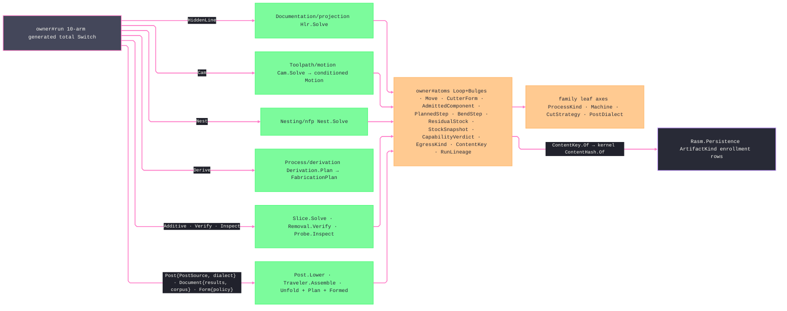

# [RASM_FABRICATION_OWNER]

`Fabrication` admits one complete production request and runtime, dispatches one `FabricationPolicy`, and returns one `FabricationResult` whose evidence projects content identity and lineage without replaying plane logic. `Process` atoms remain the acyclic vocabulary floor, while `Run` remains the terminal consumer of plane kernels.

`FabricationInput.Admit` proves process-machine-strategy-dialect compatibility, geometry presence, prior-state consistency, and requested egress before the `FabricationPolicy.Egress` dispatch. `CanonicalWriter` owns primitive payload framing beside the sole `ContentKey.Of` identity mint; `ContentKey.Of` length-frames `EgressKind` ahead of consumer-ordered bytes, so equal payloads in different families stay distinct. `FabricationResult.Evidence` projects produced artifacts, and `Lineage` folds admitted ancestry.

`Loop.Apply` closes arc-native profile operations over one case family. `Move` carries its endpoint once and projects its circular geometry once. `MotionDirective` preserves spindle law, revolution dwell, channel synchronization, oriented retract, and channel barriers beside atom-safe moves. `MotionEvidence.Admit` preserves one joint row and duration per robot target. `ToolEvidence.Snapshot` binds one provider lifecycle to both evidence and cutter geometry, and provider types terminate at those admission owners.

## [01]-[INDEX]

- [02]-[ATOM_ADMISSION]: geometry, motion, tool, inspection, state, and identity owners admitted once.
- [03]-[RUN_FOLD]: request, policy, result, evidence, lineage, and parameterized egress.

## [02]-[ATOM_ADMISSION]

- Owner: `Loop`, `Move`, `MotionDirective`, `SpindleControl`, `PartTransform`, `ProjectionDir`, `CutterForm`, `AdmittedComponent`, `ResidualStock`, `StockSnapshot`, `PlannedStep`, `CamPassPolicy`, `CapabilityVerdict`, and `InspectionFeature` own admitted atoms.
- Cases: `ProfileOp` carries each arc-native operation's evidence; every `Move` case inherits `Target`, and `Move.Circular` carries feed, centre, sense, and intrinsic signed sweep; `MotionDirective` carries executable non-Cartesian semantics; `SpecializedToolpathRow` preserves wire, bevel, link, inspection, and turning evidence through one case-owned toolpath-kind column.
- Entry: `Loop.Apply` is the sole profile-operation surface; input shape selects measure, query, sampling, offset, intersection, or Boolean behavior. `CutterForm.Admit` consumes one direct or provider-backed `CutterIngress` case.
- Auto: generated-owner validation closes invariant-rich atoms, and `Validation<Error, T>` accumulates independent aggregate faults before the `Fin<T>` execution rail.
- Packages: `CavalierContours`, `Thinktecture.Runtime.Extensions`, `LanguageExt.Core`, `UnitsNet`, `NodaTime`, `Robots`, and `MTConnect.NET-Common` compose at their owning boundaries.
- Growth: a profile capability is one `ProfileOp` case with one `ProfileResult` case; a cutter geometry is one `CutterFamily` row over the existing rule columns; an atom invariant extends its generated admission hook.
- Boundary: provider geometry, mutable tool assets, controller code, and plane-internal carriers terminate at their projection owner.

## [03]-[RUN_FOLD]

- Owner: `FabricationInput`, `FabricationRuntime`, `FabricationPolicy`, `PostSource`, `FabricationResult`, `EgressKind`, `CanonicalWriter`, `ContentKey`, `RunEvidence`, `RunLineage`, and `Fabrication` own the production lifecycle.
- Cases: `FabricationPolicy` carries plane-specific intent, `FabricationResult` carries plane-specific evidence, and `DeliveryTarget` carries destination-specific provenance.
- Entry: `Fabrication.Run` consumes admitted `FabricationInput` and `FabricationRuntime`, awaits the policy-selected plane kernel, and returns `ValueTask<Fin<RunEvidence>>`; `Fabrication.Lineage` consumes the resulting `RunEvidence` receipt.
- Auto: generated total dispatch routes each policy case; `FabricationPolicy.Egress` declares admissible artifact alternatives and request cardinality once, and `FabricationResult.Evidence` proves the produced keys cover the request while centralizing consumed and produced content projection.
- Receipt: `RunEvidence` carries requested and produced artifacts, required motion diagnostics, inspection outcomes, verification state, and content keys. `Run`'s terminal fold fires `FabricationFact.Run.Of(evidence, elapsed)` through `FabricationRuntime.Telemetry` with elapsed read from `Clock`, projecting duration, artifact kinds, and warnings onto `rasm.fabrication.run.duration`, `rasm.fabrication.run.artifacts`, and `rasm.fabrication.run.warnings` through `Process/telemetry#FACT_PROJECTION` as kind `run`.
- Growth: a production modality adds one policy case, one result case, and one dispatch arm; an artifact adds one `EgressKind` row, one entry on the owning `FabricationPolicy.Egress` arm, and its enrollment counterpart.
- Boundary: consumers preserve field order while `CanonicalWriter` owns int32, IEEE-754 double, UInt128, UTF-8 string, and presence-tag framing; every egress then hashes those bytes under its unchanged `EgressKind` frame through `ContentKey.Of`. Every ingress re-enters through aggregate admission; clock, cancellation, the `FabricationTap` telemetry port, the `FabricationHooks` point roster, and the optional `HybridCache` solver-memo tier enter through `FabricationRuntime`; `Run` observes cancellation before any plane kernel, fires the admission veto before dispatch, the per-key egress-mint veto, the stage-advance and verify-verdict points off the settled result, and the delivery hand-off after evidence — so any app observes, vetoes, or replays the spine without a code edit — and domain kernels stay tap-free: facts fire only where receipts settle on the run spine.

```csharp signature
// --- [RUNTIME_PRELUDE] ----------------------------------------------------------------------------------------------------------------------------
using System.Buffers;
using System.Buffers.Binary;
using System.Globalization;
using System.Linq;
using System.Text;
using System.Threading;
using CavalierContours.Core;
using CavalierContours.Polyline;
using CavalierContours.Spatial;
using LanguageExt;
using LanguageExt.Common;
using LanguageExt.Traits;
using Microsoft.Extensions.Caching.Hybrid;
using MTConnect;
using MTConnect.Assets;
using MTConnect.Assets.CuttingTools;
using MTConnect.Assets.CuttingTools.Measurements;
using NodaTime;
using Rasm.Domain;
using Rasm.Fabrication.Additive;
using Rasm.Fabrication.Documentation;
using Rasm.Fabrication.Forming;
using Rasm.Fabrication.Kinematics;
using Rasm.Fabrication.Nesting;
using Rasm.Fabrication.Posting;
using Rasm.Fabrication.Toolpath;
using Rasm.Fabrication.Verify;
using Rasm.Meshing;
using Rasm.Numerics;
using Rhino.Geometry;
using Thinktecture;
using UnitsNet;
using UnitsNet.Units;
using RobotProgram = Robots.Program;
using TimeDuration = NodaTime.Duration;
using static LanguageExt.Prelude;

namespace Rasm.Fabrication.Process;

// --- [MODELS] -------------------------------------------------------------------------------------------------------------------------------------
// `Bulges[i]` owns the span beginning at `Vertices[i]`; zero is linear and nonzero is `tan(sweep / 4)`.
[ComplexValueObject]
public sealed partial class Loop {
    public Arr<Point3d> Vertices { get; }
    public bool Closed { get; }
    public Arr<double> Bulges { get; }
    public Context Tolerance { get; }
    public int Count => Vertices.Count;
    public int Spans => Closed ? Count : Count - 1;
    public Point3d At(int i) => Vertices[((i % Count) + Count) % Count];
    public double BulgeAt(int i) => Bulges.IsEmpty ? 0.0 : Bulges[((i % Count) + Count) % Count];

    static partial void ValidateFactoryArguments(
        ref ValidationError? validationError,
        ref Arr<Point3d> vertices,
        ref bool closed,
        ref Arr<double> bulges,
        ref Context tolerance) {
        bulges = bulges.IsEmpty ? Range(0, vertices.Count).Map(static _ => 0.0).ToArr() : bulges;
        validationError = Valid(vertices, closed, bulges, tolerance)
            ? null
            : new ValidationError("<loop-degenerate>");
    }

    public static Fin<Loop> Admit(Arr<Point3d> vertices, bool closed, Arr<double> bulges, Context tolerance) =>
        Validate(vertices, closed, bulges, tolerance, out Loop loop) is { } error
            ? Fin.Fail<Loop>(new GeometryFault.DegenerateInput(Kind.Brep, -1, error.Message).ToError())
            : Fin.Succ(loop);

    public double Plane => Vertices[0].Z;

    public Sign Winding() => !Closed ? Sign.Zero : Pline().Area() switch {
        > 0.0 => Sign.Positive,
        < 0.0 => Sign.Negative,
        _ => Sign.Zero,
    };

    public double Area() => Closed ? Pline().Area() : 0.0;
    public double Length() => Pline().PathLength();

    public Loop AsCcw() {
        if (Winding() != Sign.Negative) return this;
        Polyline<double> reversed = Pline();
        reversed.InvertDirection();
        Seq<PlineVertex<double>> vertices = toSeq(reversed.IterVertexes());
        return new Loop(
            vertices.Map(vertex => new Point3d(vertex.X, vertex.Y, Plane)).ToArr(),
            reversed.IsClosed,
            vertices.Map(static vertex => vertex.Bulge).ToArr(),
            Tolerance);
    }

    public Fin<Loop> RotateStart(int segment, Point3d point) =>
        Pline().RotateStart(
            segment,
            new Vector2<double>(point.X, point.Y),
            Tolerance.Absolute.Value) is { } rotated
                ? Rebuilt(rotated, this)
                : Fin.Fail<Loop>(new GeometryFault.DegenerateInput(Kind.Brep, -1, "loop:rotate-start").ToError());

    public BoundingBox Bound() => Pline().Extents() is { } bounds
        ? new BoundingBox(
            new Point3d(bounds.MinX, bounds.MinY, Vertices.Min(static point => point.Z)),
            new Point3d(bounds.MaxX, bounds.MaxY, Vertices.Max(static point => point.Z)))
        : BoundingBox.Empty;

    // Containment is defined only over a closed loop; an open chain has no interior, matching Area and Winding.
    public bool Covers(Point3d point) =>
        Closed && Pline().WindingNumber(new Vector2<double>(point.X, point.Y)) != 0;

    public Fin<ProfileResult> Apply(ProfileOp operation) => operation.Switch(
        state: this,
        measure: static loop => Fin.Succ<ProfileResult>(new ProfileResult.Measure(
            UnitsNet.Area.FromSquareMillimeters(loop.Area()),
            UnitsNet.Length.FromMillimeters(loop.Length()),
            loop.Winding())),
        bound: static loop => Fin.Succ<ProfileResult>(new ProfileResult.Bound(loop.Bound())),
        contains: static (loop, op) => Fin.Succ<ProfileResult>(new ProfileResult.Contains(loop.Covers(op.Point))),
        closest: static (loop, op) => loop.Pline().ClosestPoint(
            new Vector2<double>(op.Point.X, op.Point.Y),
            loop.Tolerance.Absolute.Value) is { } closest
                ? Fin.Succ<ProfileResult>(new ProfileResult.Closest(closest))
                : Fin.Fail<ProfileResult>(new GeometryFault.DegenerateInput(Kind.Brep, -1, "loop:closest").ToError()),
        sample: static (loop, op) => loop.Pline().FindPointAtPathLength(op.At.Millimeters) switch {
            (true, int segment, Vector2<double> point, double accumulated) => Fin.Succ<ProfileResult>(new ProfileResult.Sampled(
                segment,
                new Point3d(point.X, point.Y, loop.Plane),
                UnitsNet.Length.FromMillimeters(accumulated))),
            _ => Fin.Fail<ProfileResult>(new GeometryFault.DegenerateInput(Kind.Brep, -1, "loop:sample").ToError()),
        },
        offset: static (loop, op) => loop.Offset(op.Distance.Millimeters),
        boolean: static (loop, op) => loop.Boolean(op.Other, op.Operation),
        intersections: static (loop, op) => Fin.Succ<ProfileResult>(loop.Intersections(op.Other)),
        relation: static (loop, op) => Fin.Succ<ProfileResult>(new ProfileResult.Relation(PlineContains.PolylineContains(
            loop.Pline(), op.Other.Pline(), new PlineContainsOptions<double> { PosEqualEps = loop.Tolerance.Absolute.Value }))));

    private Polyline<double> Pline() => PlineOf(Vertices, Bulges, Closed);

    private static bool Valid(Arr<Point3d> vertices, bool closed, Arr<double> bulges, Context tolerance) =>
        tolerance is not null
        && vertices.Count >= (closed ? 3 : 2)
        && bulges.Count == vertices.Count
        && (closed || bulges[vertices.Count - 1] == 0.0)
        && vertices.ForAll(static point => point.IsValid)
        && bulges.ForAll(static bulge => double.IsFinite(bulge))
        && vertices.ForAll(point => Math.Abs(point.Z - vertices[0].Z) <= tolerance.Absolute.Value)
        && Range(0, closed ? vertices.Count : vertices.Count - 1).ForAll(index =>
            vertices[index].DistanceTo(vertices[(index + 1) % vertices.Count]) > tolerance.Absolute.Value)
        && (!closed || Math.Abs(PlineOf(vertices, bulges, closed).Area()) > tolerance.Absolute.Value * tolerance.Absolute.Value);

    private static Polyline<double> PlineOf(Arr<Point3d> vertices, Arr<double> bulges, bool closed) =>
        new(vertices.Map((point, index) => PlineVertex<double>.FromVector2(new Vector2<double>(point.X, point.Y), bulges[index])), closed);

    private Fin<ProfileResult> Offset(double millimeters) {
        Polyline<double> subject = Pline();
        return FromPlines(
            PlineOffset.ParallelOffset<Polyline<double>, double>(subject, millimeters, OffsetOptions(subject)), this);
    }

    private PlineOffsetOptions<double> OffsetOptions(Polyline<double> subject) => new() {
        AabbIndex = subject.CreateAabbIndex(),
        HandleSelfIntersects = true,
        OffsetDistEps = Tolerance.Absolute.Value,
        PosEqualEps = Tolerance.Absolute.Value,
        SliceJoinEps = Tolerance.Absolute.Value,
    };

    private Fin<ProfileResult> Boolean(Loop other, BooleanOp operation) =>
        Math.Abs(Plane - other.Plane) > Tolerance.Absolute.Value || Tolerance != other.Tolerance
            ? Fin.Fail<ProfileResult>(new GeometryFault.DegenerateInput(Kind.Brep, -1, "loop:boolean-context").ToError())
            : Combined(Pline(), other.Pline(), operation);

    private Fin<ProfileResult> Combined(Polyline<double> subject, Polyline<double> clip, BooleanOp operation) =>
        FromPlines(
            toSeq(PlineBoolean.PolylineBoolean<Polyline<double>, double>(
                    subject,
                    clip,
                    operation,
                    new PlineBooleanOptions<double> {
                        PosEqualEps = Tolerance.Absolute.Value,
                        CollapsedAreaEps = Tolerance.Absolute.Value * Tolerance.Absolute.Value,
                        Pline1AabbIndex = subject.CreateAabbIndex(),
                    }).PosPlines)
                .Map(static row => row.Pline),
            this);

    private ProfileResult Intersections(Loop other) {
        Polyline<double> subject = Pline();
        PlineIntersectsCollection<double> intersections = PlineBoolean.FindIntersects(
            subject,
            other.Pline(),
            new FindIntersectsOptions<double> {
                Pline1AabbIndex = subject.CreateAabbIndex(),
                PosEqualEps = Tolerance.Absolute.Value,
            });
        return new ProfileResult.Intersections(intersections.BasicIntersects.Count, intersections.OverlappingIntersects.Count);
    }

    private static Fin<ProfileResult> FromPlines(IEnumerable<Polyline<double>> sources, Loop basis) =>
        toSeq(sources)
            .Traverse(source => Rebuilt(source, basis))
            .As()
            .Map(static loops => (ProfileResult)new ProfileResult.Loops(loops));

    private static Fin<Loop> Rebuilt(Polyline<double> source, Loop basis) {
        Seq<PlineVertex<double>> vertices = toSeq(source.IterVertexes());
        return Admit(
            vertices.Map(vertex => new Point3d(vertex.X, vertex.Y, basis.Plane)).ToArr(),
            source.IsClosed,
            vertices.Map(static vertex => vertex.Bulge).ToArr(),
            basis.Tolerance);
    }
}

[Union(ConversionFromValue = ConversionOperatorsGeneration.None)]
public abstract partial record ProfileOp {
    private ProfileOp() { }

    public sealed record Measure : ProfileOp;
    public sealed record Bound : ProfileOp;
    public sealed record Contains(Point3d Point) : ProfileOp;
    public sealed record Closest(Point3d Point) : ProfileOp;
    public sealed record Sample(UnitsNet.Length At) : ProfileOp;
    public sealed record Offset(UnitsNet.Length Distance) : ProfileOp;
    public sealed record Boolean(Loop Other, BooleanOp Operation) : ProfileOp;
    public sealed record Intersections(Loop Other) : ProfileOp;
    public sealed record Relation(Loop Other) : ProfileOp;
}

[Union(ConversionFromValue = ConversionOperatorsGeneration.None)]
public abstract partial record ProfileResult {
    private ProfileResult() { }

    public sealed record Measure(UnitsNet.Area SignedArea, UnitsNet.Length Path, Sign Winding) : ProfileResult;
    public sealed record Bound(BoundingBox Box) : ProfileResult;
    public sealed record Contains(bool Value) : ProfileResult;
    public sealed record Closest(ClosestPointResult<double> Value) : ProfileResult;
    public sealed record Sampled(int Segment, Point3d Point, UnitsNet.Length Accumulated) : ProfileResult;
    public sealed record Loops(Seq<Loop> Values) : ProfileResult;
    public sealed record Intersections(int Points, int Overlaps) : ProfileResult;
    public sealed record Relation(PlineContainsResult Value) : ProfileResult;
}

public readonly record struct Edge3(Point3d A, Point3d B);

[SmartEnum<string>]
public sealed partial class RotationSense {
    public static readonly RotationSense Clockwise = new("clockwise");
    public static readonly RotationSense Counterclockwise = new("counterclockwise");

    public RotationSense Flipped => Switch(
        clockwise: static _ => Counterclockwise,
        counterclockwise: static _ => Clockwise);
}

public readonly record struct ArcCenter(Point3d Center, RotationSense Sense);

[SmartEnum<string>]
public sealed partial class SpindleControl {
    public static readonly SpindleControl ConstantRpm = new("constant-rpm");
    public static readonly SpindleControl ConstantSurface = new("constant-surface");
}

[SmartEnum<string>]
public sealed partial class SpecializedToolpathKind {
    public static readonly SpecializedToolpathKind Wire = new("wire");
    public static readonly SpecializedToolpathKind Bevel = new("bevel");
    public static readonly SpecializedToolpathKind Link = new("link");
    public static readonly SpecializedToolpathKind Inspection = new("inspection");
    public static readonly SpecializedToolpathKind Turning = new("turning");
}

[Union(ConversionFromValue = ConversionOperatorsGeneration.None)]
public abstract partial record SpecializedToolpathRow(SpecializedToolpathKind ToolpathKind) {
    public sealed record Wire(
        int Pass, double Station, double Progress, double TraversedMm,
        Point3d Lower, Point3d Upper, string Action, double LagMm,
        double UpperCornerRadiusMm, Option<double> RotaryDeg) : SpecializedToolpathRow(SpecializedToolpathKind.Wire);
    public sealed record Bevel(
        int Move, int Pass, double Station, int SourceSpan, double SourceBulge,
        Point3d Point, Vector3d ToolAxis, Point3d Pivot, double AngleDeg,
        double CrossTiltDeg, double FeedMmPerMin, double CompensationMm) : SpecializedToolpathRow(SpecializedToolpathKind.Bevel);
    public sealed record Link(
        string From, string To, string Transition, double DistanceMm,
        double DurationSeconds, double LiftMm, double ThermalExposure,
        double RotationPenalty, int Retracts, int Pierces,
        int ToolChanges, int SetupChanges) : SpecializedToolpathRow(SpecializedToolpathKind.Link);
    public sealed record Inspection(
        int Pass, int FromBlock, int ToBlockExclusive,
        double NominalAngleDeg, double NominalOffsetMm,
        double AngleDeviationDeg, double OffsetDeviationMm,
        bool Conforming) : SpecializedToolpathRow(SpecializedToolpathKind.Inspection);
    public sealed record TurningThread(
        string Form, double LoadFlankDeg, double ClearanceFlankDeg,
        double CrestFlat, double RootFlat, double CrestRadius,
        double RootRadius, string Side) : SpecializedToolpathRow(SpecializedToolpathKind.Turning);
    public sealed record TurningAxial(
        int FromMove, int ToMove, string Kind,
        double Diameter, double Depth, double TipAngleDeg) : SpecializedToolpathRow(SpecializedToolpathKind.Turning);
    public sealed record TurningTap(
        int FromMove, int ToMove, double Diameter, double Depth,
        double Pitch, string Form, string Hand) : SpecializedToolpathRow(SpecializedToolpathKind.Turning);
    public sealed record TurningKnurl(
        int FromMove, int ToMove, string Pattern, double Pressure) : SpecializedToolpathRow(SpecializedToolpathKind.Turning);
    public sealed record TurningHandoff(
        string Kind, string From, string To,
        double GripPlane, double GripLength, double PullDistance) : SpecializedToolpathRow(SpecializedToolpathKind.Turning);
}

public sealed record SpecializedToolpathEnvelope {
    private SpecializedToolpathEnvelope(
        SpecializedToolpathKind kind,
        Seq<SpecializedToolpathRow> rows,
        double durationSeconds) => (Kind, Rows, DurationSeconds) = (kind, rows, durationSeconds);

    public SpecializedToolpathKind Kind { get; }
    public Seq<SpecializedToolpathRow> Rows { get; }
    public double DurationSeconds { get; }

    public static Fin<SpecializedToolpathEnvelope> Admit(
        SpecializedToolpathKind kind,
        Seq<SpecializedToolpathRow> rows,
        double durationSeconds) => kind is not null && rows is not null && !rows.IsEmpty
            && double.IsFinite(durationSeconds) && durationSeconds >= 0.0
            && rows.ForAll(row => row is not null && row.ToolpathKind == kind)
                ? Fin.Succ(new SpecializedToolpathEnvelope(kind, rows, durationSeconds))
                : Fin.Fail<SpecializedToolpathEnvelope>(FabricationFault.WitnessMalformed(
                    nameof(SpecializedToolpathEnvelope), kind?.Key ?? nameof(SpecializedToolpathKind)));
}

[Union(ConversionFromValue = ConversionOperatorsGeneration.None)]
public abstract partial record MotionDirective {
    private MotionDirective() { }

    public sealed record Spindle(SpindleControl Control, double SurfaceMetersPerMinute, double ResolvedRpm) : MotionDirective;
    public sealed record Dwell(int AfterMove, double Revolutions) : MotionDirective;
    public sealed record Synchronize(int FromMove, int ToMove, double Rpm, double Lead, RotationSense Hand) : MotionDirective;
    public sealed record OrientedStop(int AfterMove, Vector3d Retract) : MotionDirective;
    public sealed record ChannelBarrier(int Step, string Channel, Seq<string> WaitFor, Option<string> Signal) : MotionDirective;
    public sealed record Specialized(int AfterMove, SpecializedToolpathEnvelope Payload) : MotionDirective;

    public int AfterMove => Switch(
        spindle: static _ => -1,
        dwell: static row => row.AfterMove,
        synchronize: static row => row.ToMove,
        orientedStop: static row => row.AfterMove,
        channelBarrier: static row => row.Step,
        specialized: static row => row.AfterMove);
}

[Union(ConversionFromValue = ConversionOperatorsGeneration.None)]
public abstract partial record Move {
    private Move(Point3d target) => Target = target;

    public Point3d Target { get; }

    public sealed record Rapid(Point3d Target) : Move(Target);
    public sealed record Linear(Point3d Target, double Feed) : Move(Target);
    public sealed record Circular(Point3d Target, double Feed, ArcCenter Arc, double SweepRadians) : Move(Target) {
        public double Radius => Arc.Center.DistanceTo(Target);
    }

    public Option<Circular> CircularGeometry => Switch(
        rapid: static _ => Option<Circular>.None,
        linear: static _ => Option<Circular>.None,
        circular: static move => Some(move));

    public static Fin<Move> Admit(Move candidate) => candidate.Switch(
        rapid: static move => move.Target.IsValid
            ? Fin.Succ((Move)move)
            : Fin.Fail<Move>(new GeometryFault.DegenerateInput(Kind.Brep, -1, "move:rapid").ToError()),
        linear: static move => move.Target.IsValid && double.IsFinite(move.Feed) && move.Feed > 0.0
            ? Fin.Succ((Move)move)
            : Fin.Fail<Move>(new GeometryFault.DegenerateInput(Kind.Brep, -1, "move:linear").ToError()),
        circular: static move => move.Target.IsValid && move.Arc.Center.IsValid && move.Radius > 0.0
            && double.IsFinite(move.Feed) && move.Feed > 0.0
            && double.IsFinite(move.SweepRadians) && Math.Abs(move.SweepRadians) is > 0.0 and <= Math.Tau
            && (move.Arc.Sense == RotationSense.Clockwise ? move.SweepRadians < 0.0 : move.SweepRadians > 0.0)
                ? Fin.Succ((Move)move)
                : Fin.Fail<Move>(new GeometryFault.DegenerateInput(Kind.Brep, -1, "move:circular").ToError()));
}

[ComplexValueObject]
public sealed partial class PartTransform {
    public int PartId { get; }
    public int Instance { get; }
    public double Tx { get; }
    public double Ty { get; }
    public double RotationRadians { get; }
    public int SheetIndex { get; }

    // Sheet parts nest mirrored: the placement reflects across the local Y axis before rotating, which reverses
    // every arc sweep, so bulge signs and arc senses invert with the point map rather than beside it.
    public bool Mirrored { get; }

    static partial void ValidateFactoryArguments(
        ref ValidationError? validationError,
        ref int partId,
        ref int instance,
        ref double tx,
        ref double ty,
        ref double rotationRadians,
        ref int sheetIndex,
        ref bool mirrored) =>
        validationError = partId >= 0 && instance >= 0 && sheetIndex >= 0
            && double.IsFinite(tx) && double.IsFinite(ty) && double.IsFinite(rotationRadians)
                ? null
                : new ValidationError("<part-transform-degenerate>");

    public static Fin<PartTransform> Admit(
        int partId, int instance, double tx, double ty, double rotationRadians, int sheetIndex, bool mirrored) =>
        Validate(partId, instance, tx, ty, rotationRadians, sheetIndex, mirrored, out PartTransform transform) is { } error
            ? Fin.Fail<PartTransform>(new GeometryFault.DegenerateInput(Kind.Brep, -1, error.Message).ToError())
            : Fin.Succ(transform);

    public Point3d Apply(Point3d point) {
        double x = Mirrored ? -point.X : point.X;
        return new Point3d(
            (x * Math.Cos(RotationRadians)) - (point.Y * Math.Sin(RotationRadians)) + Tx,
            (x * Math.Sin(RotationRadians)) + (point.Y * Math.Cos(RotationRadians)) + Ty,
            point.Z);
    }

    public Move Apply(Move move) => move.Switch(
        state: this,
        rapid:    static (t, m) => new Move.Rapid(t.Apply(m.Target)),
        linear:   static (t, m) => new Move.Linear(t.Apply(m.Target), m.Feed),
        circular: static (t, m) => new Move.Circular(
            t.Apply(m.Target),
            m.Feed,
            new ArcCenter(t.Apply(m.Arc.Center), t.Mirrored ? m.Arc.Sense.Flipped : m.Arc.Sense),
            t.Mirrored ? -m.SweepRadians : m.SweepRadians));

    public Fin<Loop> Apply(Loop source) =>
        Loop.Admit(
            source.Vertices.Map(Apply),
            source.Closed,
            Mirrored ? source.Bulges.Map(static bulge => -bulge) : source.Bulges,
            source.Tolerance);
}

[ComplexValueObject]
public sealed partial class ProjectionDir {
    public Vector3d Forward { get; }
    public Vector3d ScreenU { get; }
    public Vector3d ScreenV { get; }

    // Orthogonality is the admitted invariant, not decoration: it is exactly what makes the screen triple invertible.
    private const double Orthogonal = 1e-9;

    static partial void ValidateFactoryArguments(
        ref ValidationError? validationError,
        ref Vector3d forward,
        ref Vector3d screenU,
        ref Vector3d screenV) =>
        validationError = forward.IsValid && screenU.IsValid && screenV.IsValid
            && Math.Abs(forward.Length - 1.0) <= Orthogonal
            && Math.Abs(screenU.Length - 1.0) <= Orthogonal
            && Math.Abs(screenV.Length - 1.0) <= Orthogonal
            && Math.Abs(forward * screenU) <= Orthogonal
            && Math.Abs(forward * screenV) <= Orthogonal
            && Math.Abs(screenU * screenV) <= Orthogonal
            && Math.Abs((Vector3d.CrossProduct(screenU, screenV) * forward) - 1.0) <= Orthogonal
                ? null
                : new ValidationError("<projection-dir-degenerate>");

    public static Fin<ProjectionDir> Of(Vector3d forward) =>
        Basis(forward).Match(
            Some: basis => Validate(basis.Forward, basis.ScreenU, basis.ScreenV, out ProjectionDir view) is { } error
                ? Fin.Fail<ProjectionDir>(new GeometryFault.DegenerateInput(Kind.Brep, -1, error.Message).ToError())
                : Fin.Succ(view),
            None: () => Fin.Fail<ProjectionDir>(new GeometryFault.DegenerateInput(Kind.Brep, -1, "projection-dir:forward").ToError()));

    // Project retains depth on the third component, so the correspondence is a change of orthonormal basis and
    // Unproject reconstructs the world point exactly; neither direction is a sibling owner.
    public Point3d Project(Point3d point) {
        Vector3d radius = point - Point3d.Origin;
        return new Point3d(radius * ScreenU, radius * ScreenV, radius * Forward);
    }

    public Point3d Unproject(Point3d screen) =>
        Point3d.Origin + (ScreenU * screen.X) + (ScreenV * screen.Y) + (Forward * screen.Z);

    private static Option<(Vector3d Forward, Vector3d ScreenU, Vector3d ScreenV)> Basis(Vector3d forward) {
        Vector3d normal = forward;
        if (!normal.Unitize()) return None;

        Vector3d reference = Math.Abs(normal.Z) < 0.9 ? Vector3d.ZAxis : Vector3d.XAxis;
        Vector3d screenU = Vector3d.CrossProduct(reference, normal);
        return screenU.Unitize()
            ? Some((normal, screenU, Vector3d.CrossProduct(normal, screenU)))
            : None;
    }
}

[SmartEnum<string>]
public sealed partial class CornerRule {
    public static readonly CornerRule Sharp = new("sharp");
    public static readonly CornerRule Full = new("full");
    public static readonly CornerRule Partial = new("partial");
    public static readonly CornerRule Any = new("any");

    // Corner radii arrive measured or converted, so every comparison is relative to the cutter's own half-diameter;
    // exact equality rejects a ground ball nose by one ulp.
    private const double Relative = 1e-6;

    public bool Admits(double cornerRadius, double diameter) => Switch(
        state: (Corner: cornerRadius, Half: diameter * 0.5),
        sharp: static state => state.Corner <= Relative * state.Half,
        full: static state => Math.Abs(state.Corner - state.Half) <= Relative * state.Half,
        partial: static state => state.Corner > Relative * state.Half && state.Corner < state.Half * (1.0 - Relative),
        any: static state => state.Corner >= 0.0 && state.Corner <= state.Half);
}

[SmartEnum<string>]
public sealed partial class TaperRule {
    public static readonly TaperRule Straight = new("straight");
    public static readonly TaperRule Tapered = new("tapered");
    public static readonly TaperRule Any = new("any");

    private const double DegreeEpsilon = 1e-9;

    public bool Admits(double taperAngleDeg) => Switch(
        state: taperAngleDeg,
        straight: static angle => angle <= DegreeEpsilon,
        tapered: static angle => angle > DegreeEpsilon,
        any: static angle => angle >= 0.0);
}

[SmartEnum<string>]
public sealed partial class TaperSource {
    public static readonly TaperSource Flat = new("flat");
    public static readonly TaperSource EdgeAngle = new("edge-angle");
    public static readonly TaperSource HalfPointAngle = new("half-point-angle");
}

[SmartEnum<string>]
public sealed partial class CutterFamily {
    public static readonly CutterFamily Flat = new("flat", CornerRule.Sharp, TaperRule.Straight, TaperSource.Flat);
    public static readonly CutterFamily Ball = new("ball", CornerRule.Full, TaperRule.Straight, TaperSource.Flat);
    public static readonly CutterFamily Bull = new("bull", CornerRule.Partial, TaperRule.Straight, TaperSource.Flat);
    public static readonly CutterFamily Barrel = new("barrel", CornerRule.Partial, TaperRule.Straight, TaperSource.Flat);
    public static readonly CutterFamily Lollipop = new("lollipop", CornerRule.Full, TaperRule.Straight, TaperSource.Flat);
    public static readonly CutterFamily Taper = new("taper", CornerRule.Any, TaperRule.Tapered, TaperSource.EdgeAngle);
    public static readonly CutterFamily Dovetail = new("dovetail", CornerRule.Sharp, TaperRule.Tapered, TaperSource.EdgeAngle);
    public static readonly CutterFamily Drill = new("drill", CornerRule.Sharp, TaperRule.Tapered, TaperSource.HalfPointAngle);
    public static readonly CutterFamily Chamfer = new("chamfer", CornerRule.Sharp, TaperRule.Tapered, TaperSource.EdgeAngle);
    public static readonly CutterFamily Engraver = new("engraver", CornerRule.Sharp, TaperRule.Tapered, TaperSource.HalfPointAngle);
    public static readonly CutterFamily ThreadMill = new("thread-mill", CornerRule.Sharp, TaperRule.Straight, TaperSource.Flat);
    public static readonly CutterFamily Tap = new("tap", CornerRule.Sharp, TaperRule.Straight, TaperSource.Flat);
    public static readonly CutterFamily Reamer = new("reamer", CornerRule.Sharp, TaperRule.Straight, TaperSource.Flat);
    public static readonly CutterFamily BoringBar = new("boring-bar", CornerRule.Any, TaperRule.Straight, TaperSource.Flat);
    public static readonly CutterFamily FaceMill = new("face-mill", CornerRule.Any, TaperRule.Straight, TaperSource.Flat);
    public static readonly CutterFamily SlittingSaw = new("slitting-saw", CornerRule.Sharp, TaperRule.Straight, TaperSource.Flat);

    public CornerRule Corner { get; }
    public TaperRule Taper { get; }
    public TaperSource TaperFrom { get; }

    public bool Fits(double diameter, double cornerRadius, double taperAngle) =>
        Corner.Admits(cornerRadius, diameter) && Taper.Admits(taperAngle);
}

[SmartEnum<string>]
public sealed partial class ToolState {
    public static readonly ToolState New = new("new");
    public static readonly ToolState Available = new("available");
    public static readonly ToolState Used = new("used");
    public static readonly ToolState Measured = new("measured");
    public static readonly ToolState Reconditioned = new("reconditioned");
    public static readonly ToolState Expired = new("expired");
    public static readonly ToolState Broken = new("broken");
    public static readonly ToolState Allocated = new("allocated");
    public static readonly ToolState Unallocated = new("unallocated");
    public static readonly ToolState NotRegistered = new("not-registered");
    public static readonly ToolState Unavailable = new("unavailable");
    public static readonly ToolState Unknown = new("unknown");
}

[SmartEnum<string>]
public sealed partial class ToolLifeBasis {
    public static readonly ToolLifeBasis Minutes = new("minutes");
    public static readonly ToolLifeBasis PartCount = new("part-count");
    public static readonly ToolLifeBasis Wear = new("wear");
}

public readonly record struct ToolLifeEvidence(
    ToolLifeBasis Basis,
    double Value,
    Option<double> Initial,
    Option<double> Limit,
    Option<double> Warning,
    bool CountsUp);

public readonly record struct FeedEnvelope(Option<Speed> Minimum, Option<Speed> Maximum, Option<Speed> Nominal);

public readonly record struct SpindleEnvelope(
    Option<RotationalSpeed> Minimum,
    Option<RotationalSpeed> Maximum,
    Option<RotationalSpeed> Nominal);

[ComplexValueObject]
public sealed partial class ToolEvidence {
    public string ToolId { get; }
    public string SerialNumber { get; }
    public string StructuralDigest { get; }
    public Set<ToolState> States { get; }
    public Seq<ToolLifeEvidence> Life { get; }
    public Option<FeedEnvelope> Feed { get; }
    public Option<SpindleEnvelope> Spindle { get; }
    public Option<string> ProgramNumber { get; }
    public Option<string> ProgramGroup { get; }
    public Option<int> Reconditions { get; }
    public Option<int> ReconditionLimit { get; }
    public Seq<string> InsertIds { get; }
    public Seq<string> InsertGrades { get; }

    static partial void ValidateFactoryArguments(
        ref ValidationError? validationError,
        ref string toolId,
        ref string serialNumber,
        ref string structuralDigest,
        ref Set<ToolState> states,
        ref Seq<ToolLifeEvidence> life,
        ref Option<FeedEnvelope> feed,
        ref Option<SpindleEnvelope> spindle,
        ref Option<string> programNumber,
        ref Option<string> programGroup,
        ref Option<int> reconditions,
        ref Option<int> reconditionLimit,
        ref Seq<string> insertIds,
        ref Seq<string> insertGrades) =>
        validationError = !string.IsNullOrWhiteSpace(toolId)
            && !string.IsNullOrWhiteSpace(structuralDigest)
            && !states.IsEmpty
            && life.ForAll(static value => value.Basis is not null && double.IsFinite(value.Value) && value.Value >= 0.0
                && value.Initial.Map(static amount => double.IsFinite(amount) && amount >= 0.0).IfNone(true)
                && value.Limit.Map(static amount => double.IsFinite(amount) && amount >= 0.0).IfNone(true)
                && value.Warning.Map(static amount => double.IsFinite(amount) && amount >= 0.0).IfNone(true))
            && life.Map(static value => value.Basis).Distinct().Count == life.Count
            && reconditions.Map(static value => value >= 0).IfNone(true)
            && reconditionLimit.Map(static value => value >= 0).IfNone(true)
            && reconditions.Map(count => reconditionLimit.Map(limit => count <= limit).IfNone(true)).IfNone(true)
            && insertIds.ForAll(static value => !string.IsNullOrWhiteSpace(value))
                ? null
                : new ValidationError("<tool-evidence-degenerate>");

    public static Fin<ToolEvidence> Admit(ICuttingToolAsset asset) =>
        Snapshot(asset).Map(static snapshot => snapshot.Evidence);

    internal static Fin<(ToolEvidence Evidence, ICuttingToolLifeCycle Lifecycle)> Snapshot(ICuttingToolAsset asset) =>
        from admitted in Optional(asset).ToFin(new GeometryFault.DegenerateInput(Kind.Brep, -1, "tool:null").ToError())
        from lifecycle in Lifecycle(admitted)
        from life in toSeq(lifecycle.ToolLife)
            .Traverse(value => LifeBasisOf(value.Type).Map(basis => new ToolLifeEvidence(
                basis,
                value.Value,
                Optional(value.Initial),
                Optional(value.Limit),
                Optional(value.Warning),
                value.CountDirection == CountDirectionType.UP)))
            .As()
        let inserts = toSeq(lifecycle.CuttingItems)
        from evidence in Admitted(admitted, lifecycle, life, inserts)
        select (evidence, lifecycle);

    // One boundary read: the provider reports validity and its diagnostic together, so the verdict binds once.
    [BoundaryAdapter]
    private static Fin<ICuttingToolLifeCycle> Lifecycle(ICuttingToolAsset asset) {
        AssetValidationResult validation = asset.IsValid(MTConnectVersions.Version24);
        return validation.IsValid
            ? Optional(asset.CuttingToolLifeCycle).ToFin(new GeometryFault.DegenerateInput(Kind.Brep, -1, "tool:lifecycle").ToError())
            : Fin.Fail<ICuttingToolLifeCycle>(new GeometryFault.DegenerateInput(Kind.Brep, -1, validation.Message ?? "tool:invalid").ToError());
    }

    private static Fin<ToolEvidence> Admitted(
        ICuttingToolAsset asset,
        ICuttingToolLifeCycle lifecycle,
        Seq<ToolLifeEvidence> life,
        Seq<ICuttingItem> inserts) =>
        Validate(
            asset.ToolId,
            asset.SerialNumber,
            asset.GenerateHash(includeTimestamp: false),
            toSeq(lifecycle.CutterStatus).Map(StateOf).ToSet(),
            life,
            Optional(lifecycle.ProcessFeedRate).Map(static value => new FeedEnvelope(
                Optional(value.Minimum).Map(Speed.FromMillimetersPerMinutes),
                Optional(value.Maximum).Map(Speed.FromMillimetersPerMinutes),
                Optional(value.Nominal).Map(Speed.FromMillimetersPerMinutes))),
            Optional(lifecycle.ProcessSpindleSpeed).Map(static value => new SpindleEnvelope(
                Optional(value.Minimum).Map(RotationalSpeed.FromRevolutionsPerMinute),
                Optional(value.Maximum).Map(RotationalSpeed.FromRevolutionsPerMinute),
                Optional(value.Nominal).Map(RotationalSpeed.FromRevolutionsPerMinute))),
            Optional(lifecycle.ProgramToolNumber).Filter(static value => !string.IsNullOrWhiteSpace(value)),
            Optional(lifecycle.ProgramToolGroup).Filter(static value => !string.IsNullOrWhiteSpace(value)),
            Optional(lifecycle.ReconditionCount).Bind(static value => Optional(value.Value)),
            Optional(lifecycle.ReconditionCount).Bind(static value => Optional(value.MaximumCount)),
            inserts.Map(static item => item.ItemId),
            inserts.Choose(static item => Optional(item.Grade).Filter(static value => !string.IsNullOrWhiteSpace(value))),
            out ToolEvidence evidence) is { } error
                ? Fin.Fail<ToolEvidence>(new GeometryFault.DegenerateInput(Kind.Brep, -1, error.Message).ToError())
                : Fin.Succ(evidence);

    private static ToolState StateOf(CutterStatusType value) => value switch {
        CutterStatusType.NEW => ToolState.New,
        CutterStatusType.AVAILABLE => ToolState.Available,
        CutterStatusType.USED => ToolState.Used,
        CutterStatusType.MEASURED => ToolState.Measured,
        CutterStatusType.RECONDITIONED => ToolState.Reconditioned,
        CutterStatusType.EXPIRED => ToolState.Expired,
        CutterStatusType.BROKEN => ToolState.Broken,
        CutterStatusType.ALLOCATED => ToolState.Allocated,
        CutterStatusType.UNALLOCATED => ToolState.Unallocated,
        CutterStatusType.NOT_REGISTERED => ToolState.NotRegistered,
        CutterStatusType.UNAVAILABLE => ToolState.Unavailable,
        _ => ToolState.Unknown,
    };

    private static Fin<ToolLifeBasis> LifeBasisOf(ToolLifeType value) => value switch {
        ToolLifeType.MINUTES => Fin.Succ(ToolLifeBasis.Minutes),
        ToolLifeType.PART_COUNT => Fin.Succ(ToolLifeBasis.PartCount),
        ToolLifeType.WEAR => Fin.Succ(ToolLifeBasis.Wear),
        _ => Fin.Fail<ToolLifeBasis>(new GeometryFault.DegenerateInput(Kind.Brep, -1, $"tool:life-basis:{value}").ToError()),
    };
}

[Union(ConversionFromValue = ConversionOperatorsGeneration.None)]
public abstract partial record CutterIngress {
    private CutterIngress() { }

    public sealed record Direct(
        CutterFamily Family,
        double Diameter,
        double CornerRadius,
        double TaperAngle,
        double FluteLength,
        Option<ToolEvidence> Evidence = default,
        Option<double> UsableLengthMm = default,
        Option<double> FunctionalLengthMm = default,
        Option<double> OverallLengthMm = default,
        Option<double> ShankDiameterMm = default,
        Option<double> MaxDepthMm = default,
        Option<double> LeadAngleDeg = default,
        Option<double> PointAngleDeg = default,
        Option<double> OrientationDeg = default,
        Option<int> FluteCount = default,
        Option<double> MassKg = default,
        Option<double> ProtrudingLengthMm = default,
        Option<double> BodyDiameterMm = default) : CutterIngress;
    public sealed record Asset(CutterFamily Family, ICuttingToolAsset Value) : CutterIngress;
}

[ComplexValueObject]
public sealed partial class CutterForm {
    public CutterFamily Family { get; }
    public double Diameter { get; }
    public double CornerRadius { get; }
    public double TaperAngle { get; }
    public double FluteLength { get; }
    public Option<double> UsableLengthMm { get; }
    public Option<double> FunctionalLengthMm { get; }
    public Option<double> OverallLengthMm { get; }
    public Option<double> ShankDiameterMm { get; }
    public Option<double> MaxDepthMm { get; }
    public Option<double> LeadAngleDeg { get; }
    public Option<double> PointAngleDeg { get; }
    public Option<double> OrientationDeg { get; }
    public Option<int> FluteCount { get; }
    public Option<double> MassKg { get; }
    public Option<double> ProtrudingLengthMm { get; }
    public Option<double> BodyDiameterMm { get; }
    public Option<ToolEvidence> Evidence { get; }

    public UnitsNet.Length DiameterLength => UnitsNet.Length.FromMillimeters(Diameter);
    public UnitsNet.Length CornerRadiusLength => UnitsNet.Length.FromMillimeters(CornerRadius);
    public UnitsNet.Angle Taper => UnitsNet.Angle.FromDegrees(TaperAngle);
    public UnitsNet.Length CuttingLength => UnitsNet.Length.FromMillimeters(FluteLength);

    static partial void ValidateFactoryArguments(
        ref ValidationError? validationError,
        ref CutterFamily family,
        ref double diameter,
        ref double cornerRadius,
        ref double taperAngle,
        ref double fluteLength,
        ref Option<double> usableLengthMm,
        ref Option<double> functionalLengthMm,
        ref Option<double> overallLengthMm,
        ref Option<double> shankDiameterMm,
        ref Option<double> maxDepthMm,
        ref Option<double> leadAngleDeg,
        ref Option<double> pointAngleDeg,
        ref Option<double> orientationDeg,
        ref Option<int> fluteCount,
        ref Option<double> massKg,
        ref Option<double> protrudingLengthMm,
        ref Option<double> bodyDiameterMm,
        ref Option<ToolEvidence> evidence) =>
        validationError = family is not null && double.IsFinite(diameter) && diameter > 0.0
            && double.IsFinite(cornerRadius) && cornerRadius >= 0.0 && cornerRadius <= diameter * 0.5
            && double.IsFinite(taperAngle) && taperAngle is >= 0.0 and < 90.0
            && double.IsFinite(fluteLength) && fluteLength > 0.0
            && usableLengthMm.Map(static value => double.IsFinite(value) && value > 0.0).IfNone(true)
            && functionalLengthMm.Map(static value => double.IsFinite(value) && value > 0.0).IfNone(true)
            && overallLengthMm.Map(static value => double.IsFinite(value) && value > 0.0).IfNone(true)
            && shankDiameterMm.Map(static value => double.IsFinite(value) && value > 0.0).IfNone(true)
            && maxDepthMm.Map(static value => double.IsFinite(value) && value > 0.0).IfNone(true)
            && leadAngleDeg.Map(double.IsFinite).IfNone(true)
            && pointAngleDeg.Map(double.IsFinite).IfNone(true)
            && orientationDeg.Map(double.IsFinite).IfNone(true)
            && fluteCount.Map(static value => value > 0).IfNone(true)
            && massKg.Map(static value => double.IsFinite(value) && value > 0.0).IfNone(true)
            && protrudingLengthMm.Map(static value => double.IsFinite(value) && value > 0.0).IfNone(true)
            && bodyDiameterMm.Map(static value => double.IsFinite(value) && value > 0.0).IfNone(true)
            && family.Fits(diameter, cornerRadius, taperAngle)
                ? null
                : new ValidationError("<cutter-form-degenerate>");

    public static Fin<CutterForm> Admit(CutterIngress ingress) => ingress is null
        ? Fin.Fail<CutterForm>(new GeometryFault.DegenerateInput(Kind.Brep, -1, "cutter-ingress").ToError())
        : ingress.Switch(
            direct: static value => AdmitDirect(value),
            asset: static value => value.Family is null
                ? Fin.Fail<CutterForm>(new GeometryFault.DegenerateInput(Kind.Brep, -1, "cutter-family").ToError())
                : AdmitAsset(value));

    private static Fin<CutterForm> AdmitDirect(CutterIngress.Direct value) =>
        Validate(
            value.Family,
            value.Diameter,
            value.CornerRadius,
            value.TaperAngle,
            value.FluteLength,
            value.UsableLengthMm,
            value.FunctionalLengthMm,
            value.OverallLengthMm,
            value.ShankDiameterMm,
            value.MaxDepthMm,
            value.LeadAngleDeg,
            value.PointAngleDeg,
            value.OrientationDeg,
            value.FluteCount,
            value.MassKg,
            value.ProtrudingLengthMm,
            value.BodyDiameterMm,
            value.Evidence,
            out CutterForm cutter) is { } error
            ? Fin.Fail<CutterForm>(new GeometryFault.DegenerateInput(Kind.Brep, -1, error.Message).ToError())
            : Fin.Succ(cutter);

    private static Fin<CutterForm> AdmitAsset(CutterIngress.Asset ingress) =>
        from snapshot in ToolEvidence.Snapshot(ingress.Value)
        from diameter in RequiredLength<CuttingDiameterMeasurement>(snapshot.Lifecycle.Measurements, "tool:diameter")
        from flute in (RequiredLength<CuttingEdgeLengthMeasurement>(snapshot.Lifecycle.Measurements, "tool:cutting-length")
            | RequiredLength<UsableLengthMaxMeasurement>(snapshot.Lifecycle.Measurements, "tool:usable-length"))
        from corner in LengthScalar<CornerRadiusMeasurement>(snapshot.Lifecycle.Measurements).Map(static value => value.IfNone(0.0))
        from taper in TaperOf(ingress.Family, snapshot.Lifecycle.Measurements)
        from usable in LengthScalar<UsableLengthMaxMeasurement>(snapshot.Lifecycle.Measurements)
        from functional in LengthScalar<FunctionalLengthMeasurement>(snapshot.Lifecycle.Measurements)
        from overall in LengthScalar<OverallToolLengthMeasurement>(snapshot.Lifecycle.Measurements)
        from shank in LengthScalar<ShankDiameterMeasurement>(snapshot.Lifecycle.Measurements)
        from depth in LengthScalar<DepthOfCutMaxMeasurement>(snapshot.Lifecycle.Measurements)
        from lead in AngleScalar<ToolLeadAngleMeasurement>(snapshot.Lifecycle.Measurements)
        from point in AngleScalar<PointAngleMeasurement>(snapshot.Lifecycle.Measurements)
        from orientation in AngleScalar<ToolOrientationMeasurement>(snapshot.Lifecycle.Measurements)
        from mass in MassScalar<WeightMeasurement>(snapshot.Lifecycle.Measurements)
        from protruding in LengthScalar<ProtrudingLengthMeasurement>(snapshot.Lifecycle.Measurements)
        from body in LengthScalar<BodyDiameterMaxMeasurement>(snapshot.Lifecycle.Measurements)
        from cutter in AdmitDirect(new CutterIngress.Direct(
            ingress.Family,
            diameter,
            corner,
            taper,
            flute,
            Some(snapshot.Evidence),
            usable,
            functional,
            overall,
            shank,
            depth,
            lead,
            point,
            orientation,
            Option<int>.None,
            mass,
            protruding,
            body))
        select cutter;

    private static Fin<double> TaperOf(CutterFamily family, IEnumerable<IToolingMeasurement> measurements) => family.TaperFrom.Switch(
        state: measurements,
        flat: static _ => Fin.Succ(0.0),
        edgeAngle: static source => AngleScalar<ToolCuttingEdgeAngleMeasurement>(source).Map(static value => value.IfNone(0.0)),
        halfPointAngle: static source => AngleScalar<PointAngleMeasurement>(source)
            .Map(static value => value.Map(static angle => angle * 0.5).IfNone(0.0)));

    private static Option<TMeasurement> Measurement<TMeasurement>(IEnumerable<IToolingMeasurement> measurements)
        where TMeasurement : class, IToolingMeasurement =>
        Optional(measurements.OfType<TMeasurement>().FirstOrDefault());

    private static Fin<double> RequiredLength<TMeasurement>(IEnumerable<IToolingMeasurement> measurements, string locus)
        where TMeasurement : class, IToolingMeasurement =>
        from measurement in Measurement<TMeasurement>(measurements).ToFin(new GeometryFault.DegenerateInput(Kind.Brep, -1, locus).ToError())
        from value in LengthScalar(measurement)
        select value;

    private static Fin<Option<double>> LengthScalar<TMeasurement>(IEnumerable<IToolingMeasurement> measurements)
        where TMeasurement : class, IToolingMeasurement =>
        Measurement<TMeasurement>(measurements).Traverse(LengthScalar).As();

    private static Fin<Option<double>> AngleScalar<TMeasurement>(IEnumerable<IToolingMeasurement> measurements)
        where TMeasurement : class, IToolingMeasurement =>
        Measurement<TMeasurement>(measurements).Traverse(AngleScalar).As();

    private static Fin<double> LengthScalar(IToolingMeasurement measurement) =>
        UnitParser.Default.TryParse(UnitToken(measurement), CultureInfo.InvariantCulture, out LengthUnit unit)
            ? Fin.Succ(new UnitsNet.Length(measurement.Value, unit).Millimeters)
            : Fin.Fail<double>(new GeometryFault.DegenerateInput(Kind.Brep, -1, "tool:length-unit").ToError());

    private static Fin<Option<double>> MassScalar<TMeasurement>(IEnumerable<IToolingMeasurement> measurements)
        where TMeasurement : class, IToolingMeasurement =>
        Measurement<TMeasurement>(measurements).Traverse(MassScalar).As();

    private static Fin<double> AngleScalar(IToolingMeasurement measurement) =>
        UnitParser.Default.TryParse(UnitToken(measurement), CultureInfo.InvariantCulture, out AngleUnit unit)
            ? Fin.Succ(Quantity.From(measurement.Value, unit).As(AngleUnit.Degree))
            : Fin.Fail<double>(new GeometryFault.DegenerateInput(Kind.Brep, -1, "tool:angle-unit").ToError());

    private static Fin<double> MassScalar(IToolingMeasurement measurement) =>
        UnitParser.Default.TryParse(UnitToken(measurement), CultureInfo.InvariantCulture, out MassUnit unit)
            ? Fin.Succ(new Mass(measurement.Value, unit).Kilograms)
            : Fin.Fail<double>(new GeometryFault.DegenerateInput(Kind.Brep, -1, "tool:mass-unit").ToError());

    private static string? UnitToken(IToolingMeasurement measurement) =>
        !string.IsNullOrWhiteSpace(measurement.NativeUnits) ? measurement.NativeUnits : measurement.Units;
}

public sealed record ComponentLayer(string Function, double ThicknessMm, string MaterialKey);

public sealed record ComponentConnection(string DetailKey, string RealizingKey, Option<Edge3> At);

[ComplexValueObject]
public sealed partial class AdmittedComponent {
    public UInt128 RepresentationKey { get; }
    public Option<MeshSpace> Mesh { get; }
    public Arr<Loop> Profiles { get; }
    public Option<double> SheetThicknessMm { get; }
    public Arr<ComponentLayer> Layers { get; }
    public Arr<ComponentConnection> Connections { get; }
    public Map<string, double> Quantities { get; }
    public Map<string, string> Properties { get; }

    static partial void ValidateFactoryArguments(
        ref ValidationError? validationError,
        ref UInt128 representationKey,
        ref Option<MeshSpace> mesh,
        ref Arr<Loop> profiles,
        ref Option<double> sheetThicknessMm,
        ref Arr<ComponentLayer> layers,
        ref Arr<ComponentConnection> connections,
        ref Map<string, double> quantities,
        ref Map<string, string> properties) =>
        validationError = mesh.IsSome || !profiles.IsEmpty
            ? null
            : new ValidationError("<component-geometry-missing>");

    public static Fin<AdmittedComponent> Admit(
        UInt128 representationKey,
        Option<MeshSpace> mesh,
        Arr<Loop> profiles,
        Option<double> sheetThicknessMm,
        Arr<ComponentLayer> layers,
        Arr<ComponentConnection> connections,
        Map<string, double> quantities,
        Map<string, string> properties) {
        return (Gate(mesh.IsSome || !profiles.IsEmpty, "component:geometry"),
         Gate(sheetThicknessMm.Map(static value => double.IsFinite(value) && value > 0.0).IfNone(true), "component:thickness"),
         Gate(layers.ForAll(static layer => !string.IsNullOrWhiteSpace(layer.Function)
                && !string.IsNullOrWhiteSpace(layer.MaterialKey)
                && double.IsFinite(layer.ThicknessMm) && layer.ThicknessMm > 0.0), "component:layers"),
         Gate(connections.ForAll(static connection => !string.IsNullOrWhiteSpace(connection.DetailKey)
                && !string.IsNullOrWhiteSpace(connection.RealizingKey)
                && connection.At.Map(static edge => edge.A.IsValid && edge.B.IsValid && edge.A != edge.B).IfNone(true)), "component:connections"),
         Gate(quantities.ForAll(static row => !string.IsNullOrWhiteSpace(row.Key) && double.IsFinite(row.Value)), "component:quantities"),
         Gate(properties.ForAll(static row => !string.IsNullOrWhiteSpace(row.Key)
                && !string.IsNullOrWhiteSpace(row.Value)), "component:properties"))
            .Apply(static (_, _, _, _, _, _) => unit)
            .As()
            .ToFin()
            .Bind(_ =>
            Validate(
                representationKey,
                mesh,
                profiles,
                sheetThicknessMm,
                layers,
                connections,
                quantities,
                properties,
                out AdmittedComponent component) is { } error
                    ? Fin.Fail<AdmittedComponent>(new GeometryFault.DegenerateInput(Kind.Brep, -1, error.Message).ToError())
                    : Fin.Succ(component));
    }

    private static K<Validation<Error>, Unit> Gate(bool valid, string locus) =>
        (valid ? Fin.Succ(unit) : Fin.Fail<Unit>(new GeometryFault.DegenerateInput(Kind.Brep, -1, locus).ToError())).ToValidation();
}

[SmartEnum<string>]
public sealed partial class EgressKind {
    public static readonly EgressKind CutProgram = new("cutprogram");
    public static readonly EgressKind Placement = new("placement");
    public static readonly EgressKind Remnant = new("remnant");
    public static readonly EgressKind Cli = new("cli");
    public static readonly EgressKind ThreeMf = new("threemf");
    public static readonly EgressKind Nc1 = new("nc1");
    public static readonly EgressKind StockSnapshot = new("stock-snapshot");
    public static readonly EgressKind Traveler = new("traveler");
    public static readonly EgressKind QualityRecord = new("quality-record");
    public static readonly EgressKind FlatPattern = new("flat-pattern");
    public static readonly EgressKind BendProgram = new("bend-program");
    public static readonly EgressKind WeldPlan = new("weld-plan");
    public static readonly EgressKind ScanVectors = new("scan-vectors");
    public static readonly EgressKind Plan = new("plan");
    public static readonly EgressKind DigitalProductPassport = new("digital-product-passport");
}

public sealed record ContentKey {
    private ContentKey(EgressKind kind, UInt128 digest) => (Kind, Digest) = (kind, digest);

    public EgressKind Kind { get; }
    public UInt128 Digest { get; }

    // Exemption: span framing is a measured byte kernel. Kind is identity-bearing, so it joins the preimage
    // length-framed ahead of the payload; hashing the payload alone collides every egress family over equal bytes.
    public static ContentKey Of(EgressKind kind, ReadOnlySpan<byte> canonicalBytes) {
        ArgumentNullException.ThrowIfNull(kind);

        int keyLength = Encoding.UTF8.GetByteCount(kind.Key);
        Span<byte> preimage = new byte[(sizeof(int) * 2) + keyLength + canonicalBytes.Length];
        BinaryPrimitives.WriteInt32LittleEndian(preimage, keyLength);
        _ = Encoding.UTF8.GetBytes(kind.Key, preimage[sizeof(int)..]);
        BinaryPrimitives.WriteInt32LittleEndian(preimage[(sizeof(int) + keyLength)..], canonicalBytes.Length);
        canonicalBytes.CopyTo(preimage[((sizeof(int) * 2) + keyLength)..]);
        return new ContentKey(kind, ContentHash.Of(preimage));
    }
}

public static class CanonicalWriter {
    public static void Write(IBufferWriter<byte> writer, int value) {
        BinaryPrimitives.WriteInt32LittleEndian(writer.GetSpan(sizeof(int)), value);
        writer.Advance(sizeof(int));
    }

    public static void Write(IBufferWriter<byte> writer, double value) {
        BinaryPrimitives.WriteDoubleLittleEndian(writer.GetSpan(sizeof(double)), value);
        writer.Advance(sizeof(double));
    }

    public static void Write(IBufferWriter<byte> writer, UInt128 value) {
        BinaryPrimitives.WriteUInt128LittleEndian(writer.GetSpan(16), value);
        writer.Advance(16);
    }

    public static void Write(IBufferWriter<byte> writer, string value) {
        int length = Encoding.UTF8.GetByteCount(value);
        Write(writer, length);
        _ = Encoding.UTF8.GetBytes(value, writer.GetSpan(length));
        writer.Advance(length);
    }

    public static void Write<T>(
        IBufferWriter<byte> writer,
        Option<T> value,
        Action<IBufferWriter<byte>, T> project) =>
        value.Match(
            Some: item => { Write(writer, 1); project(writer, item); return unit; },
            None: () => { Write(writer, 0); return unit; });
}

[Union(ConversionFromValue = ConversionOperatorsGeneration.None)]
public abstract partial record DeliveryTarget {
    private DeliveryTarget() { }

    public sealed record InProcess : DeliveryTarget;
    public sealed record Artifact(Uri Location) : DeliveryTarget;
    public sealed record Bundle(Uri Location, string Member) : DeliveryTarget;
}

[ComplexValueObject]
public sealed partial class EgressRequest {
    public Set<EgressKind> Kinds { get; }
    public DeliveryTarget Target { get; }

    static partial void ValidateFactoryArguments(
        ref ValidationError? validationError,
        ref Set<EgressKind> kinds,
        ref DeliveryTarget target) =>
        validationError = target is not null && target.Switch(
            state: kinds,
            inProcess: static _ => true,
            artifact: static (requested, value) => !requested.IsEmpty && value.Location is { IsAbsoluteUri: true },
            bundle: static (requested, value) => !requested.IsEmpty && value.Location is { IsAbsoluteUri: true }
                && !string.IsNullOrWhiteSpace(value.Member))
            ? null
            : new ValidationError("<egress-request-degenerate>");

    public static Fin<EgressRequest> Admit(Set<EgressKind> kinds, DeliveryTarget target) =>
        Validate(kinds, target, out EgressRequest request) is { } error
            ? Fin.Fail<EgressRequest>(new GeometryFault.DegenerateInput(Kind.Brep, -1, error.Message).ToError())
            : Fin.Succ(request);
}

[ComplexValueObject]
public sealed partial class ResidualStock {
    public ContentKey Key { get; }
    public Arr<Loop> Uncut { get; }

    static partial void ValidateFactoryArguments(
        ref ValidationError? validationError,
        ref ContentKey key,
        ref Arr<Loop> uncut) =>
        validationError = key is not null && key.Kind == EgressKind.Remnant
            && uncut.ForAll(static loop => loop is not null && loop.Closed)
                ? null
                : new ValidationError("<residual-stock-degenerate>");

    public static Fin<ResidualStock> Admit(ContentKey key, Arr<Loop> uncut) =>
        Validate(key, uncut, out ResidualStock stock) is { } error
            ? Fin.Fail<ResidualStock>(new GeometryFault.DegenerateInput(Kind.Brep, -1, error.Message).ToError())
            : Fin.Succ(stock);
}

[ComplexValueObject]
public sealed partial class StockSnapshot {
    public int Setup { get; }
    public ContentKey Key { get; }
    public Arr<Loop> Machined { get; }

    static partial void ValidateFactoryArguments(
        ref ValidationError? validationError,
        ref int setup,
        ref ContentKey key,
        ref Arr<Loop> machined) =>
        validationError = setup >= 0 && key is not null && key.Kind == EgressKind.StockSnapshot
            && machined.ForAll(static loop => loop is not null && loop.Closed)
                ? null
                : new ValidationError("<stock-snapshot-degenerate>");

    public static Fin<StockSnapshot> Admit(int setup, ContentKey key, Arr<Loop> machined) =>
        Validate(setup, key, machined, out StockSnapshot snapshot) is { } error
            ? Fin.Fail<StockSnapshot>(new GeometryFault.DegenerateInput(Kind.Brep, -1, error.Message).ToError())
            : Fin.Succ(snapshot);
}

public sealed record RunLineage(
    FabricationPolicy Policy,
    ProcessKind Process,
    Machine Machine,
    Seq<ContentKey> Parents,
    Seq<ContentKey> Sources,
    Option<ContentKey> MaterialCertificate,
    Seq<ContentKey> Consumed,
    Seq<ContentKey> Produced);

[ComplexValueObject]
public sealed partial class PlannedStep {
    public int Order { get; }
    public ProcessKind Process { get; }
    public Machine Machine { get; }
    public int Setup { get; }
    public Arr<int> Operations { get; }
    public Option<ContentKey> Program { get; }

    static partial void ValidateFactoryArguments(
        ref ValidationError? validationError,
        ref int order,
        ref ProcessKind process,
        ref Machine machine,
        ref int setup,
        ref Arr<int> operations,
        ref Option<ContentKey> program) =>
        validationError = order >= 0 && setup >= 0 && process is not null && machine is not null
            && !operations.IsEmpty
            && operations.ForAll(static operation => operation >= 0)
            && operations.Distinct().Count == operations.Count
            && machine.Admits(process)
            && program.Map(static key => key.Kind == EgressKind.CutProgram).IfNone(true)
                ? null
                : new ValidationError("<planned-step-degenerate>");

    public static Fin<PlannedStep> Admit(
        int order,
        ProcessKind process,
        Machine machine,
        int setup,
        Arr<int> operations,
        Option<ContentKey> program) =>
        Validate(order, process, machine, setup, operations, program, out PlannedStep step) is { } error
            ? Fin.Fail<PlannedStep>(new GeometryFault.DegenerateInput(Kind.Brep, -1, error.Message).ToError())
            : Fin.Succ(step);
}

[ComplexValueObject]
public sealed partial class CamPassPolicy {
    public double StepOver { get; }
    public int Passes { get; }

    static partial void ValidateFactoryArguments(
        ref ValidationError? validationError,
        ref double stepOver,
        ref int passes) =>
        validationError = double.IsFinite(stepOver) && stepOver > 0.0 && passes >= 1
            ? null
            : new ValidationError("<cam-pass-policy-degenerate>");

    public static Fin<CamPassPolicy> Admit(double stepOver, int passes) =>
        Validate(stepOver, passes, out CamPassPolicy policy) is { } error
            ? Fin.Fail<CamPassPolicy>(new GeometryFault.DegenerateInput(Kind.Brep, -1, error.Message).ToError())
            : Fin.Succ(policy);
}

[SmartEnum<string>]
public sealed partial class BendOrientation {
    public static readonly BendOrientation AsIs = new("as-is");
    public static readonly BendOrientation Flipped = new("flipped");
}

public readonly record struct BendStep(
    int Order,
    Edge3 Line,
    double AngleDeg,
    double RadiusMm,
    double KFactor,
    double OverbendDeg,
    double TonnageKn,
    BendOrientation Orientation);

[ComplexValueObject]
public sealed partial class CapabilityVerdict {
    public double Cpk { get; }
    public double DemandedCpk { get; }
    public int DemandedItGrade { get; }

    // Fail-closed states carry their own evidence: an unqualified procedure or unsuitable measurement system
    // fails Pass directly instead of masquerading as a zero-Cpk process.
    public bool ProcedureQualified { get; }
    public bool MeasurementSystemSuitable { get; }
    public bool Pass => Cpk >= DemandedCpk && ProcedureQualified && MeasurementSystemSuitable;

    static partial void ValidateFactoryArguments(
        ref ValidationError? validationError,
        ref double cpk,
        ref double demandedCpk,
        ref int demandedItGrade,
        ref bool procedureQualified,
        ref bool measurementSystemSuitable) =>
        validationError = double.IsFinite(cpk) && cpk >= 0.0
            && double.IsFinite(demandedCpk) && demandedCpk > 0.0
            && demandedItGrade >= 1
                ? null
                : new ValidationError("<capability-verdict-degenerate>");

    public static Fin<CapabilityVerdict> Admit(double cpk, double demandedCpk, int demandedItGrade, bool procedureQualified, bool measurementSystemSuitable) =>
        Validate(cpk, demandedCpk, demandedItGrade, procedureQualified, measurementSystemSuitable, out CapabilityVerdict verdict) is { } error
            ? Fin.Fail<CapabilityVerdict>(new GeometryFault.DegenerateInput(Kind.Brep, -1, error.Message).ToError())
            : Fin.Succ(verdict);
}

public readonly record struct GougeWitness(int Setup, int Move, Point3d Point, double DepthMm);

[SmartEnum<string>]
public sealed partial class InspectionMethod {
    public static readonly InspectionMethod Probe = new("probe");
    public static readonly InspectionMethod Scan = new("scan");
    public static readonly InspectionMethod Gauge = new("gauge");
    public static readonly InspectionMethod Vision = new("vision");
    public static readonly InspectionMethod Manual = new("manual");
}

[ComplexValueObject]
public sealed partial class InspectionFeature {
    public string Key { get; }
    public Point3d Nominal { get; }
    public Point3d Measured { get; }
    public Option<double> ToleranceMm { get; }
    public double UncertaintyMm { get; }
    public InspectionMethod Method { get; }
    public double DeviationMm => Nominal.DistanceTo(Measured);
    public Option<bool> Pass => ToleranceMm.Map(tolerance => DeviationMm + UncertaintyMm <= tolerance);

    static partial void ValidateFactoryArguments(
        ref ValidationError? validationError,
        ref string key,
        ref Point3d nominal,
        ref Point3d measured,
        ref Option<double> toleranceMm,
        ref double uncertaintyMm,
        ref InspectionMethod method) =>
        validationError = !string.IsNullOrWhiteSpace(key) && nominal.IsValid && measured.IsValid
            && toleranceMm.Map(static tolerance => double.IsFinite(tolerance) && tolerance > 0.0).IfNone(true)
            && double.IsFinite(uncertaintyMm) && uncertaintyMm >= 0.0
            && method is not null
                ? null
                : new ValidationError("<inspection-feature-degenerate>");

    public static Fin<InspectionFeature> Admit(
        string key,
        Point3d nominal,
        Point3d measured,
        Option<double> toleranceMm,
        double uncertaintyMm,
        InspectionMethod method) =>
        Validate(key, nominal, measured, toleranceMm, uncertaintyMm, method, out InspectionFeature feature) is { } error
            ? Fin.Fail<InspectionFeature>(new GeometryFault.DegenerateInput(Kind.Brep, -1, error.Message).ToError())
            : Fin.Succ(feature);
}

[ComplexValueObject]
public sealed partial class MotionEvidence {
    public Seq<Arr<double>> Joints { get; }
    public Seq<TimeDuration> SegmentDurations { get; }
    public TimeDuration Cycle { get; }
    public Seq<string> ControllerCode { get; }
    public Seq<string> Warnings { get; }

    static partial void ValidateFactoryArguments(
        ref ValidationError? validationError,
        ref Seq<Arr<double>> joints,
        ref Seq<TimeDuration> segmentDurations,
        ref TimeDuration cycle,
        ref Seq<string> controllerCode,
        ref Seq<string> warnings) =>
        validationError = !joints.IsEmpty
            && joints.ForAll(static row => !row.IsEmpty && row.ForAll(double.IsFinite))
            && joints.Count == segmentDurations.Count
            && segmentDurations.ForAll(static duration => duration >= TimeDuration.Zero)
            && cycle >= TimeDuration.Zero
                ? null
                : new ValidationError("<motion-evidence-degenerate>");

    public static Fin<MotionEvidence> Admit(
        Seq<Arr<double>> joints,
        Seq<TimeDuration> segmentDurations,
        TimeDuration cycle,
        Seq<string> controllerCode,
        Seq<string> warnings) =>
        Validate(joints, segmentDurations, cycle, controllerCode, warnings, out MotionEvidence evidence) is { } error
            ? Fin.Fail<MotionEvidence>(new GeometryFault.DegenerateInput(Kind.Brep, -1, error.Message).ToError())
            : Fin.Succ(evidence);

    public static Fin<MotionEvidence> Admit(RobotProgram program) =>
        from admitted in Optional(program).ToFin(new GeometryFault.DegenerateInput(Kind.Brep, -1, "robot-program:null").ToError())
        from clean in Clean(admitted)
        let targets = toSeq(clean.Targets)
        from evidence in Admit(
            targets.Map(static target => target.Joints.ToArr()),
            targets.Map(static target => TimeDuration.FromSeconds(target.DeltaTime)),
            TimeDuration.FromSeconds(clean.Duration),
            Optional(clean.Code).ToSeq()
                .Bind(static groups => toSeq(groups))
                .Bind(static files => toSeq(files))
                .Bind(static lines => toSeq(lines)),
            toSeq(clean.Warnings))
        select evidence;

    private static Fin<RobotProgram> Clean(RobotProgram program) =>
        toSeq(program.Errors) is { IsEmpty: false } errors
            ? JointDiagnostic
                .Admit(new JointDiagnostic.Configuration("robot-program:clean", $"robot-program:errors:{errors.Count}"))
                .Bind(static diagnostic => Fin.Fail<RobotProgram>(new FabricationFault.Unreachable(diagnostic, 0)))
            : Fin.Succ(program);
}

[ComplexValueObject]
public sealed partial class FabricationInput {
    public FabricationPolicy Policy { get; }
    public Option<MeshSpace> Model { get; }
    public ProjectionDir View { get; }
    public Arr<Loop> Profiles { get; }
    public Arr<Loop> Keepouts { get; }
    public Option<RobotCell> Cell { get; }
    public Seq<Stock> Inventory { get; }
    public Option<NestPlan> Plan { get; }
    public ProcessKind Process { get; }
    public Machine Machine { get; }
    public Option<ResidualStock> Residual { get; }
    public Seq<StockSnapshot> Snapshots { get; }
    public Option<CapabilityVerdict> Capability { get; }
    public Seq<ContentKey> ParentRuns { get; }
    public Seq<ContentKey> Sources { get; }
    public Option<ContentKey> MaterialCertificate { get; }
    public EgressRequest Egress { get; }

    public static Fin<FabricationInput> Admit(
        FabricationPolicy policy,
        Option<MeshSpace> model,
        ProjectionDir view,
        Arr<Loop> profiles,
        Arr<Loop> keepouts,
        Option<RobotCell> cell,
        Seq<Stock> inventory,
        Option<NestPlan> plan,
        ProcessKind process,
        Machine machine,
        Option<ResidualStock> residual,
        Seq<StockSnapshot> snapshots,
        Option<CapabilityVerdict> capability,
        Seq<ContentKey> parentRuns,
        Seq<ContentKey> sources,
        Option<ContentKey> materialCertificate,
        EgressRequest egress) =>
        (Gate(model.IsSome || !profiles.IsEmpty, "fabrication-input:geometry"),
         Gate(profiles.ForAll(static loop => loop is not null && loop.Closed), "fabrication-input:profiles"),
         Gate(keepouts.ForAll(static loop => loop is not null && loop.Closed), "fabrication-input:keepouts"),
         Gate(machine is not null && process is not null && machine.Admits(process), "fabrication-input:process-machine"),
         Gate(policy is not null && process is not null && PolicyFits(policy, process), "fabrication-input:policy"),
         Gate(policy is not null && egress is not null && EgressFits(policy, egress), "fabrication-input:egress"))
            .Apply(static (_, _, _, _, _, _) => unit)
            .As()
            .ToFin()
            .Bind(_ => Validate(
                policy,
                model,
                view,
                profiles,
                keepouts,
                cell,
                inventory,
                plan,
                process,
                machine,
                residual,
                snapshots,
                capability,
                parentRuns,
                sources,
                materialCertificate,
                egress,
                out FabricationInput input) is { } error
                    ? Fin.Fail<FabricationInput>(new GeometryFault.DegenerateInput(Kind.Brep, -1, error.Message).ToError())
                    : Fin.Succ(input));

    private static K<Validation<Error>, Unit> Gate(bool holds, string locus) =>
        (holds ? Fin.Succ(unit) : Fin.Fail<Unit>(new GeometryFault.DegenerateInput(Kind.Brep, -1, locus).ToError())).ToValidation();

    private static bool PolicyFits(FabricationPolicy policy, ProcessKind process) => policy.Switch(
        state: process,
        hiddenLine: static (_, value) => value.Policy is not null,
        cam: static (value, policy) => value.Modality.Admits(policy.Strategy),
        nest: static (_, _) => true,
        additive: static (value, _) => value.Modality == ProcessModality.Additive,
        verify: static (_, _) => true,
        inspect: static (_, _) => true,
        post: static (value, policy) => policy.Dialect.Admits(value.Modality),
        document: static (value, policy) => policy.Dialect.Map(dialect => dialect.Admits(value.Modality)).IfNone(true),
        derive: static (_, _) => true,
        form: static (value, _) => value.Modality == ProcessModality.Formed);

    private static bool EgressFits(FabricationPolicy policy, EgressRequest request) =>
        policy.Egress.Admits(request);
}

public sealed record EgressContract(Set<EgressKind> Alternatives, int Minimum, int Maximum) {
    public bool Admits(EgressRequest request) =>
        request is not null
        && (request.Kinds - Alternatives).IsEmpty
        && request.Kinds.Count >= Minimum
        && request.Kinds.Count <= Maximum;
}

[Union(ConversionFromValue = ConversionOperatorsGeneration.None)]
public abstract partial record FabricationPolicy {
    private FabricationPolicy() { }

    public sealed record HiddenLine(ProjectionPolicy Policy) : FabricationPolicy;
    public sealed record Cam(
        CutStrategy Strategy,
        CamPassPolicy Pass,
        CutterForm Cutter,
        CellPolicy Cell,
        EngagementPolicy Engagement) : FabricationPolicy;
    public sealed record Nest(NestPolicy Nesting) : FabricationPolicy;
    public sealed record Additive(AdditivePolicy Policy) : FabricationPolicy;
    public sealed record Verify(VerifyPolicy Policy) : FabricationPolicy;
    public sealed record Inspect(InspectPolicy Policy) : FabricationPolicy;
    public sealed record Post(PostSource Source, PostDialect Dialect, PostPolicy Policy) : FabricationPolicy;
    public sealed record Document(
        Seq<FabricationResult> Results,
        TravelerReceiptCorpus Corpus,
        Option<PostDialect> Dialect) : FabricationPolicy;
    public sealed record Derive(AdmittedComponent Component, DerivePolicy Policy) : FabricationPolicy;
    public sealed record Form(FormPolicy Policy, ProcessEnvelope.Brake Envelope) : FabricationPolicy;

    // One artifact correspondence distinguishes supported alternatives from request cardinality;
    // `FabricationResult.Evidence` proves every requested kind against actual produced keys.
    public EgressContract Egress => Switch(
        hiddenLine: static _ => new EgressContract(Set<EgressKind>(), 0, 0),
        cam: static _ => new EgressContract(Set<EgressKind>(), 0, 0),
        nest: static _ => new EgressContract(Set(EgressKind.Placement), 0, 1),
        additive: static _ => new EgressContract(Set(EgressKind.ThreeMf, EgressKind.Cli, EgressKind.ScanVectors), 0, 3),
        verify: static _ => new EgressContract(Set(EgressKind.Remnant, EgressKind.StockSnapshot), 0, 2),
        inspect: static _ => new EgressContract(Set<EgressKind>(), 0, 0),
        post: static _ => new EgressContract(Set(EgressKind.CutProgram, EgressKind.Nc1, EgressKind.Cli), 0, 1),
        document: static _ => new EgressContract(Set(EgressKind.Traveler, EgressKind.DigitalProductPassport), 0, 2),
        derive: static _ => new EgressContract(Set(EgressKind.Plan, EgressKind.WeldPlan), 0, 2),
        form: static _ => new EgressContract(Set(EgressKind.FlatPattern, EgressKind.BendProgram), 0, 1));
}

[Union(ConversionFromValue = ConversionOperatorsGeneration.None)]
public abstract partial record PostSource {
    private PostSource() { }

    public sealed record Motion(FabricationResult.Motion Value) : PostSource;
    public sealed record Placement(FabricationResult.Placement Value) : PostSource;
    public sealed record Specialized(SpecializedToolpathEnvelope Value) : PostSource;
}

[Union(ConversionFromValue = ConversionOperatorsGeneration.None)]
public abstract partial record FabricationResult {
    private FabricationResult() { }

    public sealed record HiddenLineResult(ProjectionReceipt Projection, Seq<ContentKey> Subjects) : FabricationResult;
    public sealed record Motion(Seq<Move> Moves, Seq<MotionDirective> Directives, MotionEvidence Evidence, Seq<ContentKey> Subjects) : FabricationResult {
        public Seq<Arr<double>> Joints => Evidence.Joints;
        public double Duration => Evidence.Cycle.TotalSeconds;
        public Seq<string> CellCode => Evidence.ControllerCode;
    }
    public sealed record Placement(Seq<PartTransform> Parts, double Utilization, int Unplaced, Seq<Remnant> Remnants, ContentKey Key) : FabricationResult;
    public sealed record AdditiveResult(Seq<Move> Moves, int Layers, Seq<ContentKey> Artifacts) : FabricationResult;
    public sealed record VerificationResult(
        ResidualStock Residual,
        Seq<StockSnapshot> Snapshots,
        Seq<GougeWitness> Gouges,
        double UncutVolume,
        double OvercutVolume,
        double AirCutRatio,
        double VolumeTolerance) : FabricationResult {
        // Overcut is an accumulated voxel volume; exact-zero equality never holds, so the verdict gates on the
        // tolerance the verifier admits from its own voxel edge length.
        public bool Clean => Gouges.IsEmpty && OvercutVolume <= VolumeTolerance;
    }
    public sealed record InspectionResult(Seq<InspectionFeature> Features, Seq<ContentKey> Subjects) : FabricationResult;
    public sealed record PostedProgram(Seq<string> Blocks, ContentKey Key) : FabricationResult;
    public sealed record TravelerDocument(TravelerArtifact Artifact) : FabricationResult {
        public ContentKey Key => Artifact.Key;
        public Seq<ContentKey> Consumed => Artifact.Consumed;
        public Seq<ContentKey> Produced => Artifact.Produced;
        public Option<ContentKey> DigitalProductPassport => Artifact.DigitalProductPassport;
    }
    public sealed record FabricationPlan(
        DerivationStage Ceiling,
        Seq<ProcessKind> Routing,
        Seq<MachineMatch> Routes,
        Seq<PlannedStep> Steps,
        OperationTopology Topology,
        Option<CapabilityRequirement> Requirement,
        Option<LotReceipt> LotReceipt,
        Option<CapabilityVerdict> Capability,
        Set<EgressKind> RequestedArtifacts,
        Seq<ContentKey> Artifacts,
        ContentKey Key) : FabricationResult;
    public sealed record FormedResult(Arr<Loop> FlatPattern, Seq<BendStep> Bends, double SpringbackMaxDeg, ContentKey Key) : FabricationResult;

    // Each arm names only the evidence its own case owns; unnamed slots keep the seeded request and consumed ancestry,
    // so a new result case is one arm rather than a re-spelling of every slot.
    public Fin<RunEvidence> Evidence(FabricationInput input, Seq<ContentKey> consumed) {
        RunEvidence evidence = Switch(
            state: new RunEvidence(
                this,
                input.Policy,
                input.Process,
                input.Machine,
                input.Egress,
                input.ParentRuns,
                input.Sources,
                input.MaterialCertificate,
                consumed,
                Seq<ContentKey>(),
                Seq<string>(),
                Seq<InspectionFeature>(),
                None),
            hiddenLineResult: static (seed, result) => seed with { Consumed = seed.Consumed + result.Subjects },
            motion: static (seed, result) => seed with {
                Consumed = seed.Consumed + result.Subjects,
                Warnings = result.Evidence.Warnings,
            },
            placement: static (seed, result) => seed with { Produced = Seq(result.Key) },
            additiveResult: static (seed, result) => seed with { Produced = result.Artifacts },
            verificationResult: static (seed, result) => seed with {
                Produced = Seq(result.Residual.Key) + result.Snapshots.Map(static snapshot => snapshot.Key),
                Verified = Some(result.Clean),
            },
            inspectionResult: static (seed, result) => seed with {
                Consumed = seed.Consumed + result.Subjects,
                Inspections = result.Features,
            },
            postedProgram: static (seed, result) => seed with { Produced = Seq(result.Key) },
            travelerDocument: static (seed, result) => seed with {
                Consumed = seed.Consumed + result.Consumed,
                Produced = Seq(result.Key) + result.Produced + result.DigitalProductPassport.ToSeq(),
            },
            fabricationPlan: static (seed, result) => seed with { Produced = Seq(result.Key) + result.Artifacts },
            formedResult: static (seed, result) => seed with { Produced = Seq(result.Key) });
        Set<EgressKind> missing = input.Egress.Kinds - evidence.Produced.Map(static key => key.Kind).ToSet();
        return missing.IsEmpty
            ? Fin.Succ(evidence)
            : Fin.Fail<RunEvidence>(new GeometryFault.DegenerateInput(Kind.Brep, -1,
                $"egress:missing:{string.Join(',', missing.Map(static kind => kind.Key))}").ToError());
    }
}

public sealed record RunEvidence {
    internal RunEvidence(
        FabricationResult result,
        FabricationPolicy policy,
        ProcessKind process,
        Machine machine,
        EgressRequest request,
        Seq<ContentKey> parentRuns,
        Seq<ContentKey> sources,
        Option<ContentKey> materialCertificate,
        Seq<ContentKey> consumed,
        Seq<ContentKey> produced,
        Seq<string> warnings,
        Seq<InspectionFeature> inspections,
        Option<bool> verified) =>
        (Result, Policy, Process, Machine, Request, ParentRuns, Sources, MaterialCertificate,
            Consumed, Produced, Warnings, Inspections, Verified) =
        (result, policy, process, machine, request, parentRuns, sources, materialCertificate,
            consumed, produced, warnings, inspections, verified);

    public FabricationResult Result { get; }
    public FabricationPolicy Policy { get; }
    public ProcessKind Process { get; }
    public Machine Machine { get; }
    public EgressRequest Request { get; }
    public Seq<ContentKey> ParentRuns { get; }
    public Seq<ContentKey> Sources { get; }
    public Option<ContentKey> MaterialCertificate { get; }
    public Seq<ContentKey> Consumed { get; init; }
    public Seq<ContentKey> Produced { get; init; }
    public Seq<string> Warnings { get; init; }
    public Seq<InspectionFeature> Inspections { get; init; }
    public Option<bool> Verified { get; init; }
}

[ComplexValueObject]
public sealed partial class FabricationRuntime {
    public IClock Clock { get; }
    public CancellationToken Cancel { get; }
    public FabricationTap Telemetry { get; }
    public FabricationHooks Hooks { get; }

    // The memo tier is app-neutral runtime capability, never process-global state: two runtimes composing the
    // library hold two caches, and a headless kernel run holds none with zero branching.
    public Option<HybridCache> Memo { get; }

    public static Fin<FabricationRuntime> Admit(
        IClock clock,
        CancellationToken cancel,
        FabricationTap? telemetry = null,
        FabricationHooks? hooks = null,
        HybridCache? memo = null) =>
        Validate(clock, cancel, telemetry ?? FabricationTap.Silent, hooks ?? FabricationHooks.Live(), Optional(memo), out FabricationRuntime runtime) is { } error
            ? Fin.Fail<FabricationRuntime>(new GeometryFault.DegenerateInput(Kind.Brep, -1, error.Message).ToError())
            : Fin.Succ(runtime);
}

// --- [OPERATIONS] ---------------------------------------------------------------------------------------------------------------------------------
public static class Fabrication {
    public static ValueTask<Fin<RunEvidence>> Run(FabricationInput input, FabricationRuntime runtime) =>
        (from candidate in Optional(input).ToFin(new GeometryFault.DegenerateInput(Kind.Brep, -1, "fabrication:input").ToError())
         from context in Optional(runtime).ToFin(new GeometryFault.DegenerateInput(Kind.Brep, -1, "fabrication:runtime").ToError())
         from _ in Ready(context)
         let started = context.Clock.GetCurrentInstant()
         from admitted in context.Hooks.Admission.Fire(candidate)
         from _dispatch in Ready(context)
         select (Input: admitted, Runtime: context, Started: started)).Match(
            Succ: static state => Dispatch(state.Input, state.Runtime, state.Started),
            Fail: static error => ValueTask.FromResult(Fin.Fail<RunEvidence>(error)));

    private static Fin<Unit> Ready(FabricationRuntime runtime) => runtime.Cancel.IsCancellationRequested
        ? Fin.Fail<Unit>(new GeometryFault.DegenerateInput(Kind.Brep, -1, "fabrication:cancelled").ToError())
        : Fin.Succ(unit);

    private static async ValueTask<Fin<RunEvidence>> Dispatch(
        FabricationInput input,
        FabricationRuntime runtime,
        Instant started) {
        Fin<FabricationResult> dispatched = await input.Policy.Switch(
            state:      (Input: input, Runtime: runtime),
            hiddenLine: static (state, policy) => ValueTask.FromResult<Fin<FabricationResult>>(Hlr.Solve(
                policy,
                state.Input,
                projection => new FabricationResult.HiddenLineResult(projection, projection.Sources))),
            cam:        static (state, policy) => ValueTask.FromResult<Fin<FabricationResult>>(Cam.Solve(policy, state.Input)),
            nest:       static (state, policy) => Nest.Solve(policy, state.Input, state.Runtime.Telemetry, state.Runtime.Memo),
            additive:   static (state, policy) => ValueTask.FromResult<Fin<FabricationResult>>(Slice.Solve(policy, state.Input)),
            verify:     static (state, policy) => ValueTask.FromResult<Fin<FabricationResult>>(Removal.Verify(policy.Policy, state.Input)),
            inspect:    static (state, policy) => ValueTask.FromResult<Fin<FabricationResult>>(Probe.Inspect(policy.Policy, state.Input, state.Runtime.Telemetry)),
            post:       static (state, policy) => ValueTask.FromResult<Fin<FabricationResult>>(
                Post.Lower(policy.Source, policy.Dialect, state.Input, policy.Policy)
                    .Map(static result => (FabricationResult)result)),
            document:   static (state, policy) => ValueTask.FromResult<Fin<FabricationResult>>(Traveler.Assemble(
                policy,
                state.Input,
                state.Runtime.Clock,
                static artifact => new FabricationResult.TravelerDocument(artifact))),
            derive:     static (state, policy) => ValueTask.FromResult<Fin<FabricationResult>>(Derivation.Plan(policy, state.Input)),
            form:       static (state, policy) => ValueTask.FromResult<Fin<FabricationResult>>(
                from unfold in FlatPattern.Unfold(policy.Policy, state.Input)
                from bends in BendSequence.Plan(unfold, policy.Policy, policy.Envelope)
                let _engine = FabricationFact.Engine.Of(bends).Map(state.Runtime.Telemetry.Fire).Strict()
                select FlatPattern.Formed(unfold, bends.Steps)));
        return from result in dispatched
               from evidence in result.Evidence(input, Consumed(input))
               from _mint in evidence.Produced.TraverseM(key => runtime.Hooks.EgressMint.Fire(key)).As().Map(static _ => unit)
               let _points = Fired(runtime.Hooks, result)
               let _handoff = runtime.Hooks.Delivery.Fire(evidence)
               let _fact = runtime.Telemetry.Fire(FabricationFact.Run.Of(evidence, runtime.Clock.GetCurrentInstant() - started))
               select evidence;
    }

    public static Fin<RunLineage> Lineage(RunEvidence run) => Optional(run)
        .ToFin(new GeometryFault.DegenerateInput(Kind.Brep, -1, "fabrication:run-evidence").ToError())
        .Map(evidence => new RunLineage(
            evidence.Policy,
            evidence.Process,
            evidence.Machine,
            evidence.ParentRuns,
            evidence.Sources,
            evidence.MaterialCertificate,
            evidence.Consumed,
            evidence.Produced));

    private static Seq<ContentKey> Consumed(FabricationInput input) =>
        input.Residual.ToSeq().Map(static stock => stock.Key)
        + input.Snapshots.Map(static snapshot => snapshot.Key)
        + input.ParentRuns
        + input.Sources
        + input.MaterialCertificate.ToSeq();

    // Result-shaped hook projection, not routing: only the plan and verification shapes carry a point
    // payload, so the unmatched arm is the declared no-point floor, never a swallowed case.
    private static Unit Fired(FabricationHooks hooks, FabricationResult result) => result switch {
        FabricationResult.FabricationPlan plan => plan.Steps.Iter(step => ignore(hooks.StageAdvance.Fire(step))),
        FabricationResult.VerificationResult verification => ignore(hooks.VerifyVerdict.Fire(verification)),
        _ => unit,
    };
}
```



## [04]-[RESEARCH]

<!-- source-only: research row template:
[TOKEN]-[OPEN|BLOCKED]: <exact question>; <verification route>.
[SPLIT_MEMBER]-[OPEN]: does `shape-core` expose `split_all`; verify against the member rail.
-->

(none)
