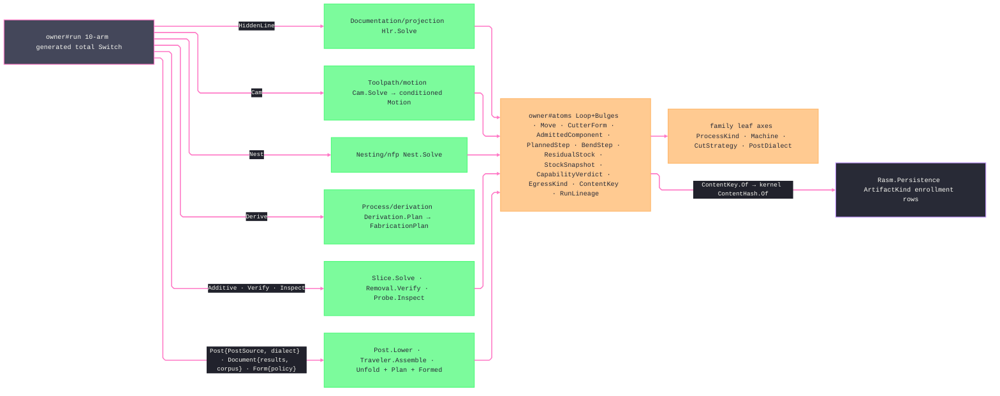

# [RASM_FABRICATION_OWNER]

`Fabrication` is the terminal ten-case orchestration fold over `FabricationPolicy` and `FabricationResult`. This page also owns the cycle-breaking atoms shared by every fabrication plane, the run-to-run truth carrier, the content-key egress vocabulary, and the lineage projection. Plane kernels depend on these atoms, while the terminal `Run` fold depends on the plane kernels; the two logical nodes remain in one physical owner.

Cycle-breaking atoms mint here. `Loop.Admit` owns cardinality, finiteness, bulge alignment, closure, tolerance, and the one-plane law — every vertex shares `Plane` within tolerance, so the 2D substrate re-emits results on the admitted elevation instead of collapsing them to `Z = 0`; its arc-aware area, winding, containment, and bounds compose `CavalierContours`. `ProjectionDir.Of`, `PartTransform.Admit`, `CutterForm.Admit`, `AdmittedComponent.Admit`, `ResidualStock.Admit`, `StockSnapshot.Admit`, `PlannedStep.Admit`, `CapabilityVerdict.Admit`, and `InspectionFeature.Admit` own their raw boundaries. Source keys, parent-run keys, material-certificate identity, and admitted prior-state evidence travel on `FabricationInput` so a later run consumes prior truth without a reverse plane dependency. `PostSource` closes motion and placement posting behind one policy case. Plane-internal ASTs, voxels, and tolerance models never ride a `FabricationResult` case.

Every artifact key routes through `ContentKey.Of` and kernel `ContentHash.Of`. Geometry atoms carry `Context`, and host-native coordinate scalars remain raw doubles inside the package.

Wire posture: HOST-LOCAL. Results cross only the in-process seam — `HiddenLineResult` to AppUi `Viewport2D`, `Motion` to posting, egress content keys to the Persistence artifact-index enrollment rows; the unions and atoms never sit between wire and rail.

## [01]-[INDEX]

- [01]-[FABRICATION_OWNER]: admitted geometry and motion atoms, planning and evidence rows, egress identity, run input/policy/result vocabularies, the total `Run` dispatch, and the derived `Lineage` projection.

## [02]-[FABRICATION_OWNER]

- Owner: `Loop`, `ProjectionDir`, `PartTransform`, `CutterForm`, `AdmittedComponent`, `ResidualStock`, `StockSnapshot`, `PlannedStep`, `CamPassPolicy`, `CapabilityVerdict`, and `InspectionFeature` admit externally variable atoms. `RotationSense` plus the `Move` union own rapid, linear, and circular motion without boolean or optional-payload ghosts. `InspectionMethod` closes measurement provenance, while tolerance and uncertainty derive each feature disposition. `EgressKind` plus `ContentKey` own artifact identity. `FabricationPolicy`, `PostSource`, `FabricationResult`, `FabricationInput`, and `Fabrication` own orchestration.
- Cases: `FabricationPolicy` and `FabricationResult` each carry ten plane cases. `PostSource` distinguishes motion from placement. `Move` distinguishes rapid, linear, and circular moves. `FabricationPlan` carries its case-derived ceiling, DfM-ranked process routing, retained route evidence, executable steps, requested artifact kinds, produced keys, and content key. Artifact-producing result cases carry `ContentKey`; transient geometry, motion, inspection, and verification cases carry typed evidence instead.
- Entry: `Run(FabricationPolicy, FabricationInput)` is the only orchestration entry and returns `Fin<FabricationResult>`. `Lineage` derives parent, source, certificate, consumed-state, and produced-artifact edges from one completed run.
- Auto: the generated total `Switch` dispatches hidden-line, CAM, nesting, additive, verification, inspection, posting, documentation, derivation, and forming requests. The forming arm consumes the selected `ProcessEnvelope.Brake`; it never substitutes an unbounded phantom envelope. Posting dispatches `PostSource` before lowering, so placement conditioning and already-conditioned motion remain distinct.
- Receipt: `FabricationResult` is the plane result evidence. `Fabrication.Lineage(policy, input, result)` derives policy, process, machine, parents, source artifacts, material certificate, consumed state, and produced artifacts without a mutable ledger.
- Packages: `Rasm` (`ContentHash.Of` — `Domain/identity`; `Op`/`Eff<Env>` rails; `OpAcceptance` oracle; `AtomProjection`), `Rasm.Numerics` (`Predicate.Orient2D`/`Sign`/`Matrix`), `Rasm.Meshing` (`MeshSpace`), `Rhino.Geometry` (`Point3d`/`Vector3d`), Thinktecture.Runtime.Extensions, LanguageExt.Core, BCL inbox.
- Growth: a fabrication concern is one policy case, one result case, and one total-dispatch arm. An artifact family is one `EgressKind` row plus its persistence enrollment. A motion modality is one `Move` case, and a new run-to-run truth source is one explicit lineage field.
- Boundary: plane-internal ASTs, voxel carriers, and tolerance models never enter `FabricationResult`. Every geometry, state, plan-step, and inspection atom re-enters through its admission function, every egress digest routes through `ContentKey.Of`, and every orchestration modality remains a closed union case.

```csharp signature
// --- [RUNTIME_PRELUDE] ----------------------------------------------------------------------------------------------------------------------------
using System.Linq;
using CavalierContours.Core;
using CavalierContours.Polyline;
using LanguageExt;
using LanguageExt.Common;
using Rasm.Domain;
using Rasm.Fabrication.Additive;
using Rasm.Fabrication.Documentation;
using Rasm.Fabrication.Forming;
using Rasm.Fabrication.Kinematics;
using Rasm.Fabrication.Nesting;
using Rasm.Fabrication.Posting;
using Rasm.Fabrication.Toolpath;
using Rasm.Fabrication.Verify;
using Rasm.Meshing;
using Rasm.Numerics;
using Rhino.Geometry;
using Thinktecture;
using static LanguageExt.Prelude;

namespace Rasm.Fabrication.Process;

// --- [MODELS] -------------------------------------------------------------------------------------------------------------------------------------
// `Bulges` parallels `Vertices`: `0` is linear and `tan(theta / 4)` is the corresponding arc span.
public sealed record Loop {
    private Loop(Arr<Point3d> vertices, bool closed, Arr<double> bulges, Context tolerance) =>
        (Vertices, Closed, Bulges, Tolerance) = (vertices, closed, bulges, tolerance);

    public Arr<Point3d> Vertices { get; }
    public bool Closed { get; }
    public Arr<double> Bulges { get; }
    public Context Tolerance { get; }
    public int Count => Vertices.Count;
    public int Spans => Closed ? Count : Count - 1;
    public Point3d At(int i) => Vertices[((i % Count) + Count) % Count];
    public double BulgeAt(int i) => Bulges.IsEmpty ? 0.0 : Bulges[((i % Count) + Count) % Count];

    public static Fin<Loop> Admit(Arr<Point3d> vertices, bool closed, Arr<double> bulges, Context tolerance) {
        if (vertices.Count < (closed ? 3 : 2)
            || (!bulges.IsEmpty && (bulges.Count != vertices.Count || !closed && bulges[vertices.Count - 1] != 0.0))
            || vertices.Exists(static point => !point.IsValid)
            || bulges.Exists(static bulge => !double.IsFinite(bulge))
            || vertices.Exists(point => Math.Abs(point.Z - vertices[0].Z) > tolerance.Absolute.Value)
            || !Range(0, closed ? vertices.Count : vertices.Count - 1).ForAll(index =>
                vertices[index].DistanceTo(vertices[(index + 1) % vertices.Count]) > tolerance.Absolute.Value))
            return Fin.Fail<Loop>(GeometryFault.DegenerateInput("loop").ToError());

        Arr<double> admittedBulges = bulges.IsEmpty
            ? Range(0, vertices.Count).Map(static _ => 0.0).ToArr()
            : bulges;
        Loop admitted = new(vertices, closed, admittedBulges, tolerance);
        return !closed || Math.Abs(admitted.Pline().Area()) > tolerance.Absolute.Value * tolerance.Absolute.Value
            ? Fin.Succ(admitted)
            : Fin.Fail<Loop>(GeometryFault.DegenerateInput("loop:area").ToError());
    }

    public double Plane => Vertices[0].Z;

    public Sign Winding() => !Closed ? Sign.Zero : Pline().Area() switch {
        > 0.0 => Sign.Positive,
        < 0.0 => Sign.Negative,
        _ => Sign.Zero,
    };

    // Admitted-value metrics: total on the admitted interior, no re-admission rail. Raw-boundary measures stay ArcAlgebra.ArcArea/ArcLength.
    public double Area() => Closed ? Pline().Area() : 0.0;
    public double Length() => Pline().PathLength();

    // Reversed span `j` runs `v[n - 1 - j]` to `v[n - 2 - j]`, so its bulge is `-b[(n - 2 - j) mod n]`.
    public Loop AsCcw() => Winding() != Sign.Negative
        ? this
        : new Loop(
            Vertices.Rev().ToArr(),
            Closed,
            Range(0, Count).Map(j => -BulgeAt(Count - 2 - j)).ToArr(),
            Tolerance);

    public BoundingBox Bound() => Pline().Extents() is { } bounds
        ? new BoundingBox(
            new Point3d(bounds.MinX, bounds.MinY, Vertices.Min(static point => point.Z)),
            new Point3d(bounds.MaxX, bounds.MaxY, Vertices.Max(static point => point.Z)))
        : BoundingBox.Empty;

    public bool Covers(Point3d point) {
        Polyline<double> polyline = Pline();
        Vector2<double> query = new(point.X, point.Y);
        return polyline.WindingNumber(query) != 0;
    }

    private Polyline<double> Pline() {
        Polyline<double> polyline = new(Count, Closed);
        for (int index = 0; index < Count; index++) polyline.Add(At(index).X, At(index).Y, BulgeAt(index));
        return polyline;
    }
}

public readonly record struct Edge3(Point3d A, Point3d B);

[SmartEnum<string>]
public sealed partial class RotationSense {
    public static readonly RotationSense Clockwise = new("clockwise");
    public static readonly RotationSense Counterclockwise = new("counterclockwise");
}

public readonly record struct ArcCenter(Point3d Center, RotationSense Sense);

[Union(ConversionFromValue = ConversionOperatorsGeneration.None)]
public abstract partial record Move {
    private Move() { }

    public sealed record Rapid(Point3d Target) : Move;
    public sealed record Linear(Point3d Target, double Feed) : Move;
    public sealed record Circular(Point3d Target, double Feed, ArcCenter Arc) : Move;

    public static Fin<Move> Admit(Move candidate) => candidate.Switch(
        rapid: static move => move.Target.IsValid
            ? Fin.Succ((Move)move)
            : Fin.Fail<Move>(GeometryFault.DegenerateInput("move:rapid").ToError()),
        linear: static move => move.Target.IsValid && double.IsFinite(move.Feed) && move.Feed > 0.0
            ? Fin.Succ((Move)move)
            : Fin.Fail<Move>(GeometryFault.DegenerateInput("move:linear").ToError()),
        circular: static move => move.Target.IsValid && move.Arc.Center.IsValid
            && move.Arc.Center.DistanceTo(move.Target) > 0.0
            && double.IsFinite(move.Feed) && move.Feed > 0.0
                ? Fin.Succ((Move)move)
                : Fin.Fail<Move>(GeometryFault.DegenerateInput("move:circular").ToError()));
}

public sealed record PartTransform {
    private PartTransform(int partId, double tx, double ty, double rotationRadians, int sheetIndex) =>
        (PartId, Tx, Ty, RotationRadians, SheetIndex) = (partId, tx, ty, rotationRadians, sheetIndex);

    public int PartId { get; }
    public double Tx { get; }
    public double Ty { get; }
    public double RotationRadians { get; }
    public int SheetIndex { get; }

    public static Fin<PartTransform> Admit(int partId, double tx, double ty, double rotationRadians, int sheetIndex) =>
        partId >= 0 && sheetIndex >= 0
        && double.IsFinite(tx) && double.IsFinite(ty) && double.IsFinite(rotationRadians)
            ? Fin.Succ(new PartTransform(partId, tx, ty, rotationRadians, sheetIndex))
            : Fin.Fail<PartTransform>(GeometryFault.DegenerateInput("part-transform").ToError());

    // One placement projection, input shape the modality discriminant: point, move, or whole loop.
    public Point3d Apply(Point3d point) => new(
        (point.X * Math.Cos(RotationRadians)) - (point.Y * Math.Sin(RotationRadians)) + Tx,
        (point.X * Math.Sin(RotationRadians)) + (point.Y * Math.Cos(RotationRadians)) + Ty,
        point.Z);

    public Move Apply(Move move) => move.Switch(
        state: this,
        rapid:    static (t, m) => new Move.Rapid(t.Apply(m.Target)),
        linear:   static (t, m) => new Move.Linear(t.Apply(m.Target), m.Feed),
        circular: static (t, m) => new Move.Circular(t.Apply(m.Target), m.Feed, new ArcCenter(t.Apply(m.Arc.Center), m.Arc.Sense)));

    public Fin<Loop> Apply(Loop source) =>
        Loop.Admit(source.Vertices.Map(Apply), source.Closed, source.Bulges, source.Tolerance);
}

public sealed record ProjectionDir {
    private ProjectionDir(Vector3d forward, Vector3d screenU, Vector3d screenV) =>
        (Forward, ScreenU, ScreenV) = (forward, screenU, screenV);

    public Vector3d Forward { get; }
    public Vector3d ScreenU { get; }
    public Vector3d ScreenV { get; }

    public static Fin<ProjectionDir> Of(Vector3d forward) {
        Vector3d f = forward;
        if (!f.Unitize()) return Fin.Fail<ProjectionDir>(GeometryFault.DegenerateInput("projection-dir:forward").ToError());
        Vector3d up = Math.Abs(f.Z) < 0.9 ? Vector3d.ZAxis : Vector3d.XAxis;
        Vector3d u = Vector3d.CrossProduct(up, f); u.Unitize();
        Vector3d v = Vector3d.CrossProduct(f, u);
        return Fin.Succ(new ProjectionDir(f, u, v));
    }

    public Point3d Project(Point3d p) {
        Vector3d r = p - Point3d.Origin;
        return new Point3d(r * ScreenU, r * ScreenV, r * Forward);
    }
}

[SmartEnum<string>]
public sealed partial class CutterFamily {
    public static readonly CutterFamily Flat = new("flat");
    public static readonly CutterFamily Ball = new("ball");
    public static readonly CutterFamily Bull = new("bull");
    public static readonly CutterFamily Taper = new("taper");
    public static readonly CutterFamily Drill = new("drill");
    public static readonly CutterFamily Chamfer = new("chamfer");
    public static readonly CutterFamily ThreadMill = new("thread-mill");
}

public sealed record CutterForm {
    private CutterForm(CutterFamily family, double diameter, double cornerRadius, double taperAngle, double fluteLength) =>
        (Family, Diameter, CornerRadius, TaperAngle, FluteLength) = (family, diameter, cornerRadius, taperAngle, fluteLength);

    public CutterFamily Family { get; }
    public double Diameter { get; }
    public double CornerRadius { get; }
    public double TaperAngle { get; }
    public double FluteLength { get; }

    public static Fin<CutterForm> Admit(
        CutterFamily family,
        double diameter,
        double cornerRadius,
        double taperAngle,
        double fluteLength) =>
        double.IsFinite(diameter) && diameter > 0.0
        && double.IsFinite(cornerRadius) && cornerRadius >= 0.0 && cornerRadius <= diameter * 0.5
        && double.IsFinite(taperAngle) && taperAngle is >= 0.0 and < 90.0
        && double.IsFinite(fluteLength) && fluteLength > 0.0
        && Fits(family, diameter, cornerRadius, taperAngle)
            ? Fin.Succ(new CutterForm(family, diameter, cornerRadius, taperAngle, fluteLength))
            : Fin.Fail<CutterForm>(GeometryFault.DegenerateInput("cutter-form").ToError());

    // Total generated dispatch: the next CutterFamily row breaks this admission loudly instead of inheriting a default arm.
    private static bool Fits(CutterFamily family, double diameter, double cornerRadius, double taperAngle) => family.Switch(
        state: (Diameter: diameter, Corner: cornerRadius, Taper: taperAngle),
        flat: static s => s.Corner == 0.0 && s.Taper == 0.0,
        ball: static s => s.Corner == s.Diameter * 0.5 && s.Taper == 0.0,
        bull: static s => s.Corner is > 0.0 && s.Corner < s.Diameter * 0.5 && s.Taper == 0.0,
        taper: static s => s.Taper > 0.0,
        drill: static s => s.Corner == 0.0 && s.Taper > 0.0,
        chamfer: static s => s.Corner == 0.0 && s.Taper > 0.0,
        threadMill: static s => s.Corner == 0.0 && s.Taper == 0.0);
}

public sealed record ComponentLayer(string Function, double ThicknessMm, string MaterialKey);

public sealed record ComponentConnection(string DetailKey, string RealizingKey, Edge3 At);

public sealed record AdmittedComponent {
    private AdmittedComponent(
        UInt128 representationKey,
        Option<MeshSpace> mesh,
        Arr<Loop> profiles,
        Option<double> sheetThicknessMm,
        Arr<ComponentLayer> layers,
        Arr<ComponentConnection> connections,
        Map<string, double> quantities,
        Map<string, string> properties) =>
        (RepresentationKey, Mesh, Profiles, SheetThicknessMm, Layers, Connections, Quantities, Properties) =
        (representationKey, mesh, profiles, sheetThicknessMm, layers, connections, quantities, properties);

    public UInt128 RepresentationKey { get; }
    public Option<MeshSpace> Mesh { get; }
    public Arr<Loop> Profiles { get; }
    public Option<double> SheetThicknessMm { get; }
    public Arr<ComponentLayer> Layers { get; }
    public Arr<ComponentConnection> Connections { get; }
    public Map<string, double> Quantities { get; }
    public Map<string, string> Properties { get; }

    public static Fin<AdmittedComponent> Admit(
        UInt128 representationKey,
        Option<MeshSpace> mesh,
        Arr<Loop> profiles,
        Option<double> sheetThicknessMm,
        Arr<ComponentLayer> layers,
        Arr<ComponentConnection> connections,
        Map<string, double> quantities,
        Map<string, string> properties) {
        Seq<Validation<Error, Unit>> gates = Seq(
            Gate(mesh.IsSome || !profiles.IsEmpty, "component:geometry"),
            Gate(sheetThicknessMm.Map(static value => double.IsFinite(value) && value > 0.0).IfNone(true), "component:thickness"),
            Gate(layers.ForAll(static layer => !string.IsNullOrWhiteSpace(layer.Function)
                && !string.IsNullOrWhiteSpace(layer.MaterialKey)
                && double.IsFinite(layer.ThicknessMm) && layer.ThicknessMm > 0.0), "component:layers"),
            Gate(connections.ForAll(static connection => !string.IsNullOrWhiteSpace(connection.DetailKey)
                && !string.IsNullOrWhiteSpace(connection.RealizingKey)
                && connection.At.A.IsValid && connection.At.B.IsValid && connection.At.A != connection.At.B), "component:connections"),
            Gate(quantities.ForAll(static row => !string.IsNullOrWhiteSpace(row.Key) && double.IsFinite(row.Value)), "component:quantities"),
            Gate(properties.ForAll(static row => !string.IsNullOrWhiteSpace(row.Key)
                && !string.IsNullOrWhiteSpace(row.Value)), "component:properties"));
        return gates.Traverse(static gate => gate).As().ToFin().Map(_ => new AdmittedComponent(
            representationKey, mesh, profiles, sheetThicknessMm, layers, connections, quantities, properties));
    }

    private static Validation<Error, Unit> Gate(bool valid, string locus) =>
        (valid ? Fin.Succ(unit) : Fin.Fail<Unit>(GeometryFault.DegenerateInput(locus).ToError())).ToValidation();
}

[SmartEnum<string>]
public sealed partial class EgressKind {
    public static readonly EgressKind CutProgram = new("cutprogram");
    public static readonly EgressKind Placement = new("placement");
    public static readonly EgressKind Remnant = new("remnant");
    public static readonly EgressKind Cli = new("cli");
    public static readonly EgressKind ThreeMf = new("threemf");
    public static readonly EgressKind Nc1 = new("nc1");
    public static readonly EgressKind StockSnapshot = new("stock-snapshot");
    public static readonly EgressKind Traveler = new("traveler");
    public static readonly EgressKind FlatPattern = new("flat-pattern");
    public static readonly EgressKind BendProgram = new("bend-program");
    public static readonly EgressKind WeldPlan = new("weld-plan");
    public static readonly EgressKind ScanVectors = new("scan-vectors");
    public static readonly EgressKind Plan = new("plan");
}

// Machine-consumable artifacts share the kernel `ContentHash.Of` identity regime.
public readonly record struct ContentKey(EgressKind Kind, UInt128 Digest) {
    public static ContentKey Of(EgressKind kind, ReadOnlySpan<byte> canonicalBytes) => new(kind, ContentHash.Of(canonicalBytes));
}

// A later run consumes prior stock truth without introducing a reverse plane dependency.
public sealed record ResidualStock {
    private ResidualStock(ContentKey key, Arr<Loop> uncut) => (Key, Uncut) = (key, uncut);

    public ContentKey Key { get; }
    public Arr<Loop> Uncut { get; }

    public static Fin<ResidualStock> Admit(ContentKey key, Arr<Loop> uncut) =>
        uncut.ForAll(static loop => loop.Closed)
            ? Fin.Succ(new ResidualStock(key, uncut))
            : Fin.Fail<ResidualStock>(FabricationFault.OpenLoop(FabConcern.Verify, 0).ToError());
}

public sealed record StockSnapshot {
    private StockSnapshot(int setup, ContentKey key, Arr<Loop> machined) => (Setup, Key, Machined) = (setup, key, machined);

    public int Setup { get; }
    public ContentKey Key { get; }
    public Arr<Loop> Machined { get; }

    public static Fin<StockSnapshot> Admit(int setup, ContentKey key, Arr<Loop> machined) =>
        setup >= 0 && machined.ForAll(static loop => loop.Closed)
            ? Fin.Succ(new StockSnapshot(setup, key, machined))
            : Fin.Fail<StockSnapshot>(GeometryFault.DegenerateInput("stock-snapshot").ToError());
}

// Lineage derives consumed and produced keys at the shared content-key boundary.
public sealed record RunLineage(
    FabricationPolicy Policy,
    ProcessKind Process,
    Machine Machine,
    Seq<ContentKey> Parents,
    Seq<ContentKey> Sources,
    Option<ContentKey> MaterialCertificate,
    Seq<ContentKey> Consumed,
    Seq<ContentKey> Produced);

public sealed record PlannedStep {
    private PlannedStep(
        int order,
        ProcessKind process,
        Machine machine,
        int setup,
        Arr<int> operations,
        Option<ContentKey> program) =>
        (Order, Process, Machine, Setup, Operations, Program) = (order, process, machine, setup, operations, program);

    public int Order { get; }
    public ProcessKind Process { get; }
    public Machine Machine { get; }
    public int Setup { get; }
    public Arr<int> Operations { get; }
    public Option<ContentKey> Program { get; }

    public static Fin<PlannedStep> Admit(
        int order,
        ProcessKind process,
        Machine machine,
        int setup,
        Arr<int> operations,
        Option<ContentKey> program) =>
        order >= 0 && setup >= 0 && !operations.IsEmpty
        && operations.ForAll(static operation => operation >= 0)
        && operations.Distinct().Count == operations.Count
        && machine.Admits(process)
            ? Fin.Succ(new PlannedStep(order, process, machine, setup, operations, program))
            : Fin.Fail<PlannedStep>(GeometryFault.DegenerateInput("planned-step").ToError());
}

public sealed record CamPassPolicy {
    private CamPassPolicy(double stepOver, int passes) => (StepOver, Passes) = (stepOver, passes);

    public double StepOver { get; }
    public int Passes { get; }

    public static Fin<CamPassPolicy> Admit(double stepOver, int passes) =>
        double.IsFinite(stepOver) && stepOver > 0.0 && passes >= 1
            ? Fin.Succ(new CamPassPolicy(stepOver, passes))
            : Fin.Fail<CamPassPolicy>(GeometryFault.DegenerateInput("cam-pass-policy").ToError());
}

[SmartEnum<string>]
public sealed partial class BendOrientation {
    public static readonly BendOrientation AsIs = new("as-is");
    public static readonly BendOrientation Flipped = new("flipped");
}

public readonly record struct BendStep(
    int Order,
    Edge3 Line,
    double AngleDeg,
    double RadiusMm,
    double KFactor,
    double OverbendDeg,
    double TonnageKn,
    BendOrientation Orientation);

public sealed record CapabilityVerdict {
    private CapabilityVerdict(double cpk, double demandedCpk, int demandedItGrade, bool procedureQualified, bool measurementSystemSuitable) =>
        (Cpk, DemandedCpk, DemandedItGrade, ProcedureQualified, MeasurementSystemSuitable) =
            (cpk, demandedCpk, demandedItGrade, procedureQualified, measurementSystemSuitable);

    public double Cpk { get; }
    public double DemandedCpk { get; }
    public int DemandedItGrade { get; }

    // Fail-closed states carry their own evidence: an unqualified procedure or unsuitable measurement system
    // fails Pass directly instead of masquerading as a zero-Cpk process.
    public bool ProcedureQualified { get; }
    public bool MeasurementSystemSuitable { get; }
    public bool Pass => Cpk >= DemandedCpk && ProcedureQualified && MeasurementSystemSuitable;

    public static Fin<CapabilityVerdict> Admit(double cpk, double demandedCpk, int demandedItGrade, bool procedureQualified, bool measurementSystemSuitable) =>
        double.IsFinite(cpk) && cpk >= 0.0
        && double.IsFinite(demandedCpk) && demandedCpk > 0.0
        && demandedItGrade >= 1
            ? Fin.Succ(new CapabilityVerdict(cpk, demandedCpk, demandedItGrade, procedureQualified, measurementSystemSuitable))
            : Fin.Fail<CapabilityVerdict>(GeometryFault.DegenerateInput("capability-verdict").ToError());
}

public readonly record struct GougeWitness(int Setup, int Move, Point3d Point, double DepthMm);

[SmartEnum<string>]
public sealed partial class InspectionMethod {
    public static readonly InspectionMethod Probe = new("probe");
    public static readonly InspectionMethod Scan = new("scan");
    public static readonly InspectionMethod Gauge = new("gauge");
    public static readonly InspectionMethod Vision = new("vision");
    public static readonly InspectionMethod Manual = new("manual");
}

public sealed record InspectionFeature {
    private InspectionFeature(
        string key,
        Point3d nominal,
        Point3d measured,
        Option<double> toleranceMm,
        double uncertaintyMm,
        InspectionMethod method) =>
        (Key, Nominal, Measured, ToleranceMm, UncertaintyMm, Method) =
        (key, nominal, measured, toleranceMm, uncertaintyMm, method);

    public string Key { get; }
    public Point3d Nominal { get; }
    public Point3d Measured { get; }
    public Option<double> ToleranceMm { get; }
    public double UncertaintyMm { get; }
    public InspectionMethod Method { get; }
    public double DeviationMm => Nominal.DistanceTo(Measured);
    public Option<bool> Pass => ToleranceMm.Map(tolerance => DeviationMm + UncertaintyMm <= tolerance);

    public static Fin<InspectionFeature> Admit(
        string key,
        Point3d nominal,
        Point3d measured,
        Option<double> toleranceMm,
        double uncertaintyMm,
        InspectionMethod method) =>
        !string.IsNullOrWhiteSpace(key) && nominal.IsValid && measured.IsValid
        && toleranceMm.Map(static tolerance => double.IsFinite(tolerance) && tolerance > 0.0).IfNone(true)
        && double.IsFinite(uncertaintyMm) && uncertaintyMm >= 0.0
            ? Fin.Succ(new InspectionFeature(key, nominal, measured, toleranceMm, uncertaintyMm, method))
            : Fin.Fail<InspectionFeature>(GeometryFault.DegenerateInput("inspection-feature").ToError());
}

// Class carrier: a defaulted struct would mint null ProcessKind/Machine ghosts past admission; the null default throws at first touch instead.
public sealed record FabricationInput(
    Option<MeshSpace> Model,
    ProjectionDir View,
    Arr<Loop> Profiles,
    Arr<Loop> Keepouts,
    Option<RobotCell> Cell,
    Seq<Stock> Inventory,
    Option<NestPlan> Plan,
    Option<PostDialect> Dialect,
    ProcessKind Process,
    Machine Machine,
    Option<ResidualStock> Residual,
    Seq<StockSnapshot> Snapshots,
    Option<CapabilityVerdict> Capability,
    Seq<ContentKey> ParentRuns,
    Seq<ContentKey> Sources,
    Option<ContentKey> MaterialCertificate);

[Union(ConversionFromValue = ConversionOperatorsGeneration.None)]
public abstract partial record FabricationPolicy {
    private FabricationPolicy() { }

    public sealed record HiddenLine(double FacetTolerance, int SpatialLeaf, Option<BooleanSolid> Watertight) : FabricationPolicy;
    public sealed record Cam(
        CutStrategy Strategy,
        CamPassPolicy Pass,
        CutterForm Cutter,
        CellPolicy Cell,
        EngagementPolicy Engagement) : FabricationPolicy;
    public sealed record Nest(NestPolicy Nesting) : FabricationPolicy;
    public sealed record Additive(AdditivePolicy Policy) : FabricationPolicy;
    public sealed record Verify(VerifyPolicy Policy) : FabricationPolicy;
    public sealed record Inspect(InspectPolicy Policy) : FabricationPolicy;
    public sealed record Post(PostSource Source, PostDialect Dialect) : FabricationPolicy;
    // Corpus is the traveler fan-in pack; TravelerReceiptCorpus.Empty is the caller's explicit no-receipts choice.
    public sealed record Document(Seq<FabricationResult> Results, TravelerReceiptCorpus Corpus) : FabricationPolicy;
    public sealed record Derive(AdmittedComponent Component, DerivePolicy Policy) : FabricationPolicy;
    public sealed record Form(FormPolicy Policy, ProcessEnvelope.Brake Envelope) : FabricationPolicy;
}

[Union(ConversionFromValue = ConversionOperatorsGeneration.None)]
public abstract partial record PostSource {
    private PostSource() { }

    public sealed record Motion(FabricationResult.Motion Value) : PostSource;
    public sealed record Placement(FabricationResult.Placement Value) : PostSource;
}

[Union(ConversionFromValue = ConversionOperatorsGeneration.None)]
public abstract partial record FabricationResult {
    private FabricationResult() { }

    public sealed record HiddenLineResult(Seq<Edge3> Visible, Seq<Edge3> Hidden, Seq<Edge3> Silhouette) : FabricationResult;
    public sealed record Motion(Seq<Move> Moves, Seq<Arr<double>> Joints, double Duration, Seq<string> CellCode) : FabricationResult;
    public sealed record Placement(Seq<PartTransform> Parts, double Utilization, int Unplaced, Seq<Remnant> Remnants, ContentKey Key) : FabricationResult;
    public sealed record AdditiveResult(Seq<Move> Moves, int Layers, Seq<ContentKey> Artifacts) : FabricationResult;
    public sealed record VerificationResult(
        ResidualStock Residual,
        Seq<StockSnapshot> Snapshots,
        Seq<GougeWitness> Gouges,
        double UncutVolume,
        double OvercutVolume,
        double AirCutRatio) : FabricationResult;
    public sealed record InspectionResult(Seq<InspectionFeature> Features) : FabricationResult;
    public sealed record PostedProgram(Seq<string> Blocks, ContentKey Key) : FabricationResult;
    public sealed record TravelerDocument(ContentKey Key, Seq<ContentKey> Composed) : FabricationResult;
    public sealed record FabricationPlan(
        DerivationStage Ceiling,
        Seq<ProcessKind> Routing,
        Seq<MachineMatch> Routes,
        Seq<PlannedStep> Steps,
        Option<CapabilityVerdict> Capability,
        Set<EgressKind> RequestedArtifacts,
        Seq<ContentKey> Artifacts,
        ContentKey Key) : FabricationResult;
    public sealed record FormedResult(Arr<Loop> FlatPattern, Seq<BendStep> Bends, double SpringbackMaxDeg, ContentKey Key) : FabricationResult;
}

// --- [OPERATIONS] ---------------------------------------------------------------------------------------------------------------------------------
public static class Fabrication {
    public static Fin<FabricationResult> Run(FabricationPolicy policy, FabricationInput input) =>
        policy.Switch(
            state:      input,
            hiddenLine: static (i, p) => Hlr.Solve(p, i),
            cam:        static (i, p) => Cam.Solve(p, i),
            nest:       static (i, p) => Nest.Solve(p, i),
            additive:   static (i, p) => Slice.Solve(p, i),
            verify:     static (i, p) => Removal.Verify(p.Policy, i),
            inspect:    static (i, p) => Probe.Inspect(p.Policy, i),
            post:       static (i, p) => p.Source.Switch(
                state: (Input: i, Dialect: p.Dialect),
                motion: static (state, source) => Post.Lower(source.Value, state.Dialect, state.Input).Map(static result => (FabricationResult)result),
                placement: static (state, source) => Post.Lower(source.Value, state.Dialect, state.Input).Map(static result => (FabricationResult)result)),
            document:   static (i, p) => Traveler.Assemble(p, i),
            derive:     static (i, p) => Derivation.Plan(p, i),
            form:       static (i, p) =>
                from unfold in FlatPattern.Unfold(p.Policy, i)
                from bends in BendSequence.Plan(unfold, p.Policy, p.Envelope)
                select FlatPattern.Formed(unfold, bends));

    public static RunLineage Lineage(FabricationPolicy policy, FabricationInput input, FabricationResult result) =>
        new(
            policy,
            input.Process,
            input.Machine,
            input.ParentRuns,
            input.Sources,
            input.MaterialCertificate,
            input.Residual.ToSeq().Map(static r => r.Key) + input.Snapshots.Map(static s => s.Key),
            result.Switch(
                hiddenLineResult:   static _ => Seq<ContentKey>(),
                motion:             static _ => Seq<ContentKey>(),
                placement:          static r => Seq1(r.Key),
                additiveResult:     static r => r.Artifacts,
                verificationResult: static r => Seq1(r.Residual.Key) + r.Snapshots.Map(static s => s.Key),
                inspectionResult:   static _ => Seq<ContentKey>(),
                postedProgram:      static r => Seq1(r.Key),
                travelerDocument:   static r => Seq1(r.Key) + r.Composed,
                fabricationPlan:    static r => Seq1(r.Key) + r.Artifacts,
                formedResult:       static r => Seq1(r.Key)));
}
```


