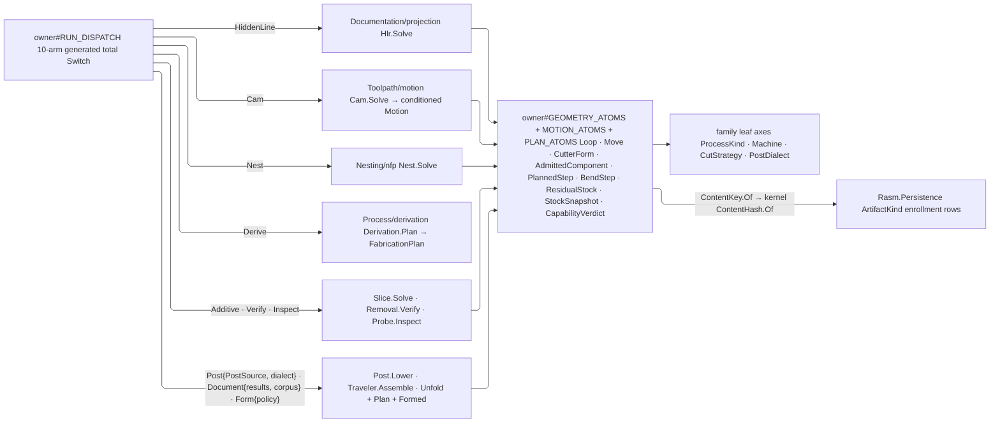

# [RASM_FABRICATION_OWNER]

`Fabrication` admits one complete production request and runtime, dispatches one `FabricationPolicy`, and returns one `FabricationResult` whose evidence projects content identity and lineage without replaying plane logic. `Process` atoms remain the acyclic vocabulary floor, while `Run` remains the terminal consumer of plane kernels.

`FabricationInput` carries the columns EVERY policy reads; a column exactly one arm reads rides that arm's own policy case, so the aggregate admits one geometry, identity, and egress contract instead of eighteen slots most planes leave empty. `FabricationInput.Admit` proves process-machine-strategy-dialect compatibility, geometry presence, and requested egress before the `FabricationPolicy.Egress` dispatch, and `FabricationPolicy.Consumed` is the one projection the run spine folds for consumed ancestry.

The `Rasm.Element` `CanonicalWriter` is the one byte codec every preimage composes — MUTABLE-FLUENT, each primitive returning the same writer, so a discarded return is the ordinary spelling and no site copies a result — and `FabricationCanon` is the one extension family over it: `Coords`, `Basis`, `Maybe`, `Rows`, and `Discriminant`. `Loop.CanonicalBytes` is the ONE loop preimage, rotation-canonical and tolerance-quantized, so two loops describing the same closed region under different vertex origins and windings mint one key, and `Loop.CanonicalOrder` is the ONE rank over that same normal form; a second loop preimage or sibling comparer anywhere in the package is the deleted form. `ContentKey.Of` length-frames `EgressKind` ahead of those bytes, so equal payloads in different families stay distinct.

`Loop.Apply` closes arc-native profile operations over one case family, reading ONE held polyline and ONE held index per loop. `Move` carries its endpoint once, projects its circular geometry once, admits through sealed case factories, and carries its continuous tool frame where the cut is oriented. `MotionDirective` preserves spindle law, dwell, channel synchronization, oriented stop, channel barriers, and admitted specialized envelopes beside atom-safe moves. `ToolEvidence` and `CutterIngress` carry already-decoded scalars: no provider type reaches the atoms floor, and `Tooling/magazine` owns every MTConnect read. `QuantityArrow` is the one dimension-text entry a plane outside `Process` reaches, parameterized by the fault its own plane raises.

## [01]-[INDEX]

- [02]-[GEOMETRY_ATOMS]: `BoolKind`, `Loop`, `ProfileOp`, `ProfileResult`, `Edge3`, `RotationSense`, `ArcCenter`, `PartTransform`, `ProjectionDir`.
- [03]-[MOTION_ATOMS]: `SpindleControl`, `DwellBasis`, the specialized-row vocabularies, `SpecializedToolpathRow`, `SpecializedToolpathEnvelope`, `MotionDirective`, `MoveOrientation`, `Move`, `MotionEvidence`, `RunWarning`.
- [04]-[EQUIPMENT_ATOMS]: `CornerRule`, `TaperRule`, `TaperSource`, `CutterFamily`, `CutterMetric`, `ToolState`, `ToolLifeBasis`, `ToolLifeEvidence`, `FeedEnvelope`, `SpindleEnvelope`, `ToolEvidence`, `CutterIngress`, `CutterForm`.
- [05]-[PLAN_ATOMS]: `MachineInstanceKey`, `ComponentLayer`, `ComponentConnection`, `AdmittedComponent`, `ResidualStock`, `StockSnapshot`, `PlannedStep`, `CamPassPolicy`, `BendOrientation`, `BendStep`, `CapabilityVerdict`, `GougeWitness`, `InspectionMethod`, `InspectionFeature`.
- [06]-[CONTENT_KEY]: `EgressKind`, `ContentKey`, `DeliveryTarget`, `EgressRequest`, `EgressContract`.
- [07]-[RUN_FOLD]: `FabricationInput`, `FabricationPolicy`, `PostSource`, `FabricationResult`, `RunEvidence`, `RunProvenance`, `RunLineage`, `RunStage`, `FabricationRuntime`.
- [08]-[RUN_DISPATCH]: `FabricationCanon`, `QuantityArrow`, `Fabrication.Run`, `Fabrication.Lineage`, and the provenance fold.

## [02]-[GEOMETRY_ATOMS]

- Owner: `Loop` owns the arc-native closed or open chain and every profile query over it; `BoolKind` owns the Boolean posture with its provider code and truth function; `PartTransform` owns the nest placement map; `ProjectionDir` owns the orthonormal screen basis.
- Cases: `ProfileOp` carries each arc-native operation's evidence — measure, bound, containment, closest point, arc-length sample, single-loop offset, island-preserving shape offset, Boolean, intersection census, and containment relation.
- Entry: `Loop.Apply` is the sole profile-operation surface; input shape selects behavior. `Loop.Admit` is the sole construction, `Loop.Canonical` the sole identity normalization, and `Loop.CanonicalOrder` the sole sibling rank over that normal form.
- Law: the Boolean posture crosses every seam as `BoolKind`, so the provider ordinal stays a private column on the row and a plane above reaches a set operation without naming a `CavalierContours` type; the owned key is also what a preimage frames, under the folder ruling that a provider ordinal never enters one.
- Auto: one `Polyline<double>` and one `StaticAABB2DIndex<double>` are built per `Loop` and HELD, so a fold running measure, winding, offset, and Boolean over one loop pays one build rather than one per query; the held view is ignored by equality because it is derived from the admitted members.
- Law: island-preserving offset rides `Shape<double>.FromPlines(...).ParallelOffset(...)`, which offsets CCW outer and CW hole loops together; a per-loop `PlineOffset.ParallelOffset` over a forest loses the hole nesting and is the deleted form. A single loop with no islands keeps the single-polyline path, where the two agree.
- Receipt: `ProfileResult.Loops` carries rebuilt loops re-admitted through `Loop.Admit`, so a provider result that degenerated fails at the boundary rather than downstream.
- Packages: `CavalierContours` (`Polyline<double>`, `PlineOffset`, `PlineBoolean`, `PlineContains`, `Shape<double>`, `StaticAABB2DIndex<double>`), RhinoCommon value geometry, `UnitsNet` at the measure boundary.
- Boundary: containment, area, and winding are defined only over a CLOSED loop; an open chain has no interior and answers `Sign.Zero`, zero area, and false containment consistently. Provider geometry never leaves this cluster.

```csharp signature
// --- [RUNTIME_PRELUDE] ----------------------------------------------------------------------------------------------------------------------------
using System;
using System.Buffers.Binary;
using System.Collections.Generic;
using System.Linq;
using System.Text;
using System.Threading;
using CavalierContours.Core;
using CavalierContours.Polyline;
using CavalierContours.Shape;
using CavalierContours.Spatial;
using LanguageExt;
using LanguageExt.Common;
using LanguageExt.Traits;
using Microsoft.Extensions.Caching.Hybrid;
using NodaTime;
using QuikGraph;
using QuikGraph.Algorithms;
using QuikGraph.Algorithms.Observers;
using QuikGraph.Algorithms.Search;
using Rasm.Domain;
using Rasm.Element.Projection;
using Rasm.Element.Properties;
using Rasm.Fabrication.Additive;
using Rasm.Fabrication.Documentation;
using Rasm.Fabrication.Forming;
using Rasm.Fabrication.Ingress;
using Rasm.Fabrication.Kinematics;
using Rasm.Fabrication.Nesting;
using Rasm.Fabrication.Posting;
using Rasm.Fabrication.Toolpath;
using Rasm.Fabrication.Verify;
using Rasm.Meshing;
using Rasm.Numerics;
using Rhino.Geometry;
using Thinktecture;
using UnitsNet;
// `Rasm.Meshing` declares its own `BooleanOp` over the manifold ordinals, so the bare name is ambiguous here; the
// alias names the arc-space provider row `BoolKind.Native` answers with and nothing else in this file spells it.
using BooleanOp = CavalierContours.Polyline.BooleanOp;
using TimeDuration = NodaTime.Duration;
using static LanguageExt.Prelude;

namespace Rasm.Fabrication.Process;

// --- [MODELS] -------------------------------------------------------------------------------------------------------------------------------------
// --- [GEOMETRY_ATOMS]

// The package's ONE Boolean posture, seated beside the atom that consumes it: the provider ordinal is a private
// column on the row, so no consumer of `Loop.Apply` names a `CavalierContours` type and a provider reordering its
// own enum moves nothing a caller spells. The truth function is what a set-classifying walk evaluates directly.
[SmartEnum<string>]
public sealed partial class BoolKind {
    public static readonly BoolKind Or = new("or", BooleanOp.Or, static (subject, clip) => subject || clip);
    public static readonly BoolKind And = new("and", BooleanOp.And, static (subject, clip) => subject && clip);
    public static readonly BoolKind Not = new("not", BooleanOp.Not, static (subject, clip) => subject && !clip);
    public static readonly BoolKind Xor = new("xor", BooleanOp.Xor, static (subject, clip) => subject ^ clip);

    internal BooleanOp Native { get; }
    private Func<bool, bool, bool> Rule { get; }

    internal bool Includes(bool subject, bool clip) => Rule(subject, clip);
}

// One polyline and one index per Loop. The view is derived from the admitted members, so it is out of construction,
// equality, and every codec; it is forced on first query and never rebuilt.
public readonly record struct LoopView(Polyline<double> Pline, StaticAABB2DIndex<double> Index);

// `Bulges[i]` owns the span beginning at `Vertices[i]`; zero is linear and nonzero is `tan(sweep / 4)`.
[ComplexValueObject]
[ValidationError<FabricationFault>]
public sealed partial class Loop {
    public Arr<Point3d> Vertices { get; }
    public bool Closed { get; }
    public Arr<double> Bulges { get; }
    public Context Tolerance { get; }

    [IgnoreMember]
    private LoopView? view;

    public int Count => Vertices.Count;
    public int Spans => Closed ? Count : Count - 1;
    public double Plane => Vertices[0].Z;
    public Point3d At(int i) => Vertices[((i % Count) + Count) % Count];
    public double BulgeAt(int i) => Bulges.IsEmpty ? 0.0 : Bulges[((i % Count) + Count) % Count];

    // Package-internal, not private: this IS the one loop materialization every `Geometry2D` owner reads, so a
    // sibling plane composing the held polyline and index builds no second pair. `Polyline<double>` is the provider's
    // MUTABLE owner, so a caller running an in-place rewrite — `InvertDirection` — copies first.
    internal LoopView View => view ??= Built(Vertices, Bulges, Closed);

    private static LoopView Built(Arr<Point3d> vertices, Arr<double> bulges, bool closed) {
        Polyline<double> pline = PlineOf(vertices, bulges, closed);
        return new LoopView(pline, pline.CreateAabbIndex());
    }

    [BoundaryAdapter]
    static partial void ValidateFactoryArguments(
        ref FabricationFault? validationError,
        ref Arr<Point3d> vertices,
        ref bool closed,
        ref Arr<double> bulges,
        ref Context tolerance) {
        bulges = bulges.IsEmpty ? Range(0, vertices.Count).ToSeq().Map(static _ => 0.0).ToArr() : bulges;
        if (!Valid(vertices, closed, bulges, tolerance))
            validationError = new GeometryFault.DegenerateInput(Kind.Polyline, None, "loop:degenerate").ToFabrication();
    }

    public static Fin<Loop> Admit(Arr<Point3d> vertices, bool closed, Arr<double> bulges, Context tolerance) =>
        Validate(vertices, closed, bulges, tolerance, out Loop loop).Admitted(loop);

    public Sign Winding() => !Closed ? Sign.Zero : View.Pline.Area() switch {
        > 0.0 => Sign.Positive,
        < 0.0 => Sign.Negative,
        _ => Sign.Zero,
    };

    public double Area() => Closed ? View.Pline.Area() : 0.0;
    public double Length() => View.Pline.PathLength();

    public Loop AsCcw() {
        if (Winding() != Sign.Negative) return this;
        // The reversal runs on a DETACHED copy: `InvertDirection` rewrites its receiver, so inverting the held view
        // re-winds every later query on the loop that holds it, including the one that just asked for this copy.
        Polyline<double> reversed = new(View.Pline.IterVertexes(), View.Pline.IsClosed);
        reversed.InvertDirection();
        Seq<PlineVertex<double>> vertices = toSeq(reversed.IterVertexes());
        return new Loop(
            vertices.Map(vertex => new Point3d(vertex.X, vertex.Y, Plane)).ToArr(),
            reversed.IsClosed,
            vertices.Map(static vertex => vertex.Bulge).ToArr(),
            Tolerance);
    }

    // The ONE canonical form every content key in the package reads: quantized onto the model grid, oriented CCW,
    // and rotated to open on the least quantized vertex. Two loops describing one closed region under different
    // vertex origins and windings mint one preimage; an open chain has no rotation freedom, so direction alone
    // canonicalizes it. A second rotation rule anywhere below is the deleted fork.
    public Loop Canonical() {
        Loop oriented = Closed ? AsCcw() : Directed();
        return oriented.Closed ? oriented.RotatedTo(oriented.LeastVertex()) : oriented;
    }

    // The ONE sibling-loop order, beside the rotation rule and the preimage it agrees with: closure, then span
    // count, then the quantized vertex walk with its bulge, read on the canonical form `Canonical()` returns.
    // Quantizing on each loop's own grid is what makes the rank agree with `CanonicalBytes` — an unquantized key
    // sorts two loops the preimage already mints one key for. A first-vertex-plus-area key is a strict prefix of
    // this walk, so a page declaring its own sibling comparer is the deleted fork.
    public static IComparer<Loop> CanonicalOrder { get; } = Comparer<Loop>.Create(static (left, right) =>
        left.Closed != right.Closed ? left.Closed.CompareTo(right.Closed)
        : left.Count != right.Count ? left.Count.CompareTo(right.Count)
        : toSeq(Range(0, left.Count))
            .Map(index => Compare(Quantized(left.At(index), left.Tolerance), Quantized(right.At(index), right.Tolerance))
                is int order and not 0
                    ? order
                    : left.BulgeAt(index).CompareTo(right.BulgeAt(index)))
            .Find(static order => order != 0)
            .IfNone(0));

    public CanonicalWriter CanonicalBytes(CanonicalWriter writer) {
        Loop canon = Canonical();
        return writer.Bool(canon.Closed).Double(canon.Tolerance.Absolute.Value).Ordinal(canon.Count)
            .Rows(toSeq(Range(0, canon.Count)), (row, index) =>
                row.Coords(Quantized(canon.At(index), canon.Tolerance)).Double(canon.BulgeAt(index)));
    }

    public BoundingBox Bound() => View.Pline.Extents() is { } bounds
        ? new BoundingBox(
            new Point3d(bounds.MinX, bounds.MinY, Vertices.Min(static point => point.Z)),
            new Point3d(bounds.MaxX, bounds.MaxY, Vertices.Max(static point => point.Z)))
        : BoundingBox.Empty;

    // Containment is defined only over a closed loop; an open chain has no interior, matching Area and Winding.
    public bool Covers(Point3d point) =>
        Closed && View.Pline.WindingNumber(new Vector2<double>(point.X, point.Y)) != 0;

    public Fin<Loop> RotateStart(int segment, Point3d point) =>
        View.Pline.RotateStart(segment, new Vector2<double>(point.X, point.Y), Tolerance.Absolute.Value) is { } rotated
            ? Rebuilt(rotated, this)
            : Fin.Fail<Loop>(new GeometryFault.DegenerateInput(Kind.Polyline, None, "loop:rotate-start").ToError());

    public Fin<ProfileResult> Apply(ProfileOp operation) => operation.Switch(
        state: this,
        measure: static loop => Fin.Succ<ProfileResult>(new ProfileResult.Measure(
            UnitsNet.Area.FromSquareMillimeters(loop.Area()),
            UnitsNet.Length.FromMillimeters(loop.Length()),
            loop.Winding())),
        bound: static loop => Fin.Succ<ProfileResult>(new ProfileResult.Bound(loop.Bound())),
        contains: static (loop, op) => Fin.Succ<ProfileResult>(new ProfileResult.Contains(loop.Covers(op.Point))),
        closest: static (loop, op) => loop.View.Pline.ClosestPoint(
            new Vector2<double>(op.Point.X, op.Point.Y),
            loop.Tolerance.Absolute.Value) is { } closest
                ? Fin.Succ<ProfileResult>(new ProfileResult.Closest(closest))
                : Fin.Fail<ProfileResult>(new GeometryFault.DegenerateInput(Kind.Polyline, None, "loop:closest").ToError()),
        sample: static (loop, op) => loop.View.Pline.FindPointAtPathLength(op.At.Millimeters) switch {
            (true, int segment, Vector2<double> point, double accumulated) => Fin.Succ<ProfileResult>(new ProfileResult.Sampled(
                segment,
                new Point3d(point.X, point.Y, loop.Plane),
                UnitsNet.Length.FromMillimeters(accumulated))),
            _ => Fin.Fail<ProfileResult>(new GeometryFault.DegenerateInput(Kind.Polyline, None, "loop:sample").ToError()),
        },
        offset: static (loop, op) => loop.Offset(op.Distance.Millimeters),
        offsetShape: static (loop, op) => loop.OffsetShape(op.Islands, op.Distance.Millimeters),
        boolean: static (loop, op) => loop.Boolean(op.Other, op.Kind),
        intersections: static (loop, op) => Fin.Succ<ProfileResult>(loop.Intersections(op.Other)),
        relation: static (loop, op) => Fin.Succ<ProfileResult>(new ProfileResult.Relation(PlineContains.PolylineContains(
            loop.View.Pline, op.Other.View.Pline, new PlineContainsOptions<double> { PosEqualEps = loop.Tolerance.Absolute.Value }))));

    private Loop Directed() =>
        Compare(Quantized(Vertices[Count - 1], Tolerance), Quantized(Vertices[0], Tolerance)) < 0 ? Reversed() : this;

    private Loop Reversed() => new(
        toSeq(Vertices).Rev().ToArr(),
        Closed,
        toSeq(Range(0, Count)).Map(index => -BulgeAt(Count - 1 - index)).ToArr(),
        Tolerance);

    private int LeastVertex() => toSeq(Range(0, Count))
        .Fold(0, (best, index) =>
            Compare(Quantized(At(index), Tolerance), Quantized(At(best), Tolerance)) < 0 ? index : best);

    private Loop RotatedTo(int start) => new(
        toSeq(Range(0, Count)).Map(index => At(start + index)).ToArr(),
        Closed,
        toSeq(Range(0, Count)).Map(index => BulgeAt(start + index)).ToArr(),
        Tolerance);

    private static (double X, double Y, double Z) Quantized(Point3d point, Context tolerance) {
        double grid = tolerance.Absolute.Value;
        return (Math.Round(point.X / grid) * grid, Math.Round(point.Y / grid) * grid, Math.Round(point.Z / grid) * grid);
    }

    private static int Compare((double X, double Y, double Z) first, (double X, double Y, double Z) second) =>
        first.X != second.X ? first.X.CompareTo(second.X)
        : first.Y != second.Y ? first.Y.CompareTo(second.Y)
        : first.Z.CompareTo(second.Z);

    private static bool Valid(Arr<Point3d> vertices, bool closed, Arr<double> bulges, Context tolerance) =>
        vertices.Count >= (closed ? 3 : 2)
        && bulges.Count == vertices.Count
        && (closed || bulges[vertices.Count - 1] == 0.0)
        && vertices.ForAll(static point => point.IsValid)
        && bulges.ForAll(double.IsFinite)
        && vertices.ForAll(point => Math.Abs(point.Z - vertices[0].Z) <= tolerance.Absolute.Value)
        && Range(0, closed ? vertices.Count : vertices.Count - 1).ForAll(index =>
            vertices[index].DistanceTo(vertices[(index + 1) % vertices.Count]) > tolerance.Absolute.Value)
        && (!closed || Math.Abs(PlineOf(vertices, bulges, closed).Area()) > tolerance.Absolute.Value * tolerance.Absolute.Value);

    private static Polyline<double> PlineOf(Arr<Point3d> vertices, Arr<double> bulges, bool closed) =>
        new(toSeq(vertices).Map((point, index) => PlineVertex<double>.FromVector2(new Vector2<double>(point.X, point.Y), bulges[index])), closed);

    private Fin<ProfileResult> Offset(double millimeters) => FromPlines(
        PlineOffset.ParallelOffset<Polyline<double>, double>(View.Pline, millimeters, OffsetOptions()), this);

    // Islands travel WITH the outer loop through one Shape: the winding partition seats CCW outer against CW hole
    // loops, so an inward offset of a pocket keeps its island standoff instead of collapsing over it.
    // `ParallelOffset` answers a `Shape<double>` whose CCW and CW loop sets carry that partition, and
    // `ShapeOffsetOptions<T>(T posEqualEps, T offsetDistEps, T sliceJoinEps)` names its three epsilons in that
    // order — the model context supplies all three, so the grid a key quantizes on and the grid the offset joins
    // slices on are one value rather than the provider's own 1e-5/1e-4/1e-4 defaults.
    private Fin<ProfileResult> OffsetShape(Arr<Loop> islands, double millimeters) {
        double eps = Tolerance.Absolute.Value;
        Shape<double> offset = Shape<double>
            .FromPlines(toSeq(islands).Map(static island => island.View.Pline).Prepend(View.Pline))
            .ParallelOffset(millimeters, new ShapeOffsetOptions<double>(
                posEqualEps: eps, offsetDistEps: eps, sliceJoinEps: eps));
        return FromPlines(
            toSeq(offset.CcwPlines).Concat(toSeq(offset.CwPlines)).Map(static indexed => indexed.Polyline), this);
    }

    private PlineOffsetOptions<double> OffsetOptions() => new() {
        AabbIndex = View.Index,
        HandleSelfIntersects = true,
        OffsetDistEps = Tolerance.Absolute.Value,
        PosEqualEps = Tolerance.Absolute.Value,
        SliceJoinEps = Tolerance.Absolute.Value,
    };

    private Fin<ProfileResult> Boolean(Loop other, BoolKind kind) =>
        Math.Abs(Plane - other.Plane) > Tolerance.Absolute.Value || Tolerance != other.Tolerance
            ? Fin.Fail<ProfileResult>(new GeometryFault.DegenerateInput(Kind.Polyline, None, "loop:boolean-context").ToError())
            : FromPlines(
                toSeq(PlineBoolean.PolylineBoolean<Polyline<double>, double>(
                        View.Pline,
                        other.View.Pline,
                        kind.Native,
                        new PlineBooleanOptions<double> {
                            PosEqualEps = Tolerance.Absolute.Value,
                            CollapsedAreaEps = Tolerance.Absolute.Value * Tolerance.Absolute.Value,
                            Pline1AabbIndex = View.Index,
                        }).PosPlines)
                    .Map(static row => row.Pline),
                this);

    private ProfileResult Intersections(Loop other) {
        PlineIntersectsCollection<double> intersections = PlineBoolean.FindIntersects(
            View.Pline,
            other.View.Pline,
            new FindIntersectsOptions<double> { Pline1AabbIndex = View.Index, PosEqualEps = Tolerance.Absolute.Value });
        return new ProfileResult.Intersections(intersections.BasicIntersects.Count, intersections.OverlappingIntersects.Count);
    }

    private static Fin<ProfileResult> FromPlines(IEnumerable<Polyline<double>> sources, Loop basis) =>
        toSeq(sources)
            .Traverse(source => Rebuilt(source, basis))
            .As()
            .Map(static loops => (ProfileResult)new ProfileResult.Loops(loops));

    private static Fin<Loop> Rebuilt(Polyline<double> source, Loop basis) {
        Seq<PlineVertex<double>> vertices = toSeq(source.IterVertexes());
        return Admit(
            vertices.Map(vertex => new Point3d(vertex.X, vertex.Y, basis.Plane)).ToArr(),
            source.IsClosed,
            vertices.Map(static vertex => vertex.Bulge).ToArr(),
            basis.Tolerance);
    }
}

[Union(ConversionFromValue = ConversionOperatorsGeneration.None)]
public abstract partial record ProfileOp {
    private ProfileOp() { }

    public sealed record Measure : ProfileOp;
    public sealed record Bound : ProfileOp;
    public sealed record Contains(Point3d Point) : ProfileOp;
    public sealed record Closest(Point3d Point) : ProfileOp;
    public sealed record Sample(UnitsNet.Length At) : ProfileOp;
    public sealed record Offset(UnitsNet.Length Distance) : ProfileOp;
    public sealed record OffsetShape(Arr<Loop> Islands, UnitsNet.Length Distance) : ProfileOp;
    public sealed record Boolean(Loop Other, BoolKind Kind) : ProfileOp;
    public sealed record Intersections(Loop Other) : ProfileOp;
    public sealed record Relation(Loop Other) : ProfileOp;
}

[Union(ConversionFromValue = ConversionOperatorsGeneration.None)]
public abstract partial record ProfileResult {
    private ProfileResult() { }

    public sealed record Measure(UnitsNet.Area SignedArea, UnitsNet.Length Path, Sign Winding) : ProfileResult;
    public sealed record Bound(BoundingBox Box) : ProfileResult;
    public sealed record Contains(bool Value) : ProfileResult;
    public sealed record Closest(ClosestPointResult<double> Value) : ProfileResult;
    public sealed record Sampled(int Segment, Point3d Point, UnitsNet.Length Accumulated) : ProfileResult;
    public sealed record Loops(Seq<Loop> Values) : ProfileResult;
    public sealed record Intersections(int Points, int Overlaps) : ProfileResult;
    public sealed record Relation(PlineContainsResult Value) : ProfileResult;
}

public readonly record struct Edge3(Point3d A, Point3d B);

[SmartEnum<string>]
public sealed partial class RotationSense {
    public static readonly RotationSense Clockwise = new("clockwise");
    public static readonly RotationSense Counterclockwise = new("counterclockwise");

    public RotationSense Flipped => Switch(
        clockwise: static _ => Counterclockwise,
        counterclockwise: static _ => Clockwise);
}

public readonly record struct ArcCenter(Point3d Center, RotationSense Sense);

[ComplexValueObject]
[ValidationError<FabricationFault>]
public sealed partial class PartTransform {
    public int PartId { get; }
    public int Instance { get; }
    public double Tx { get; }
    public double Ty { get; }
    public double RotationRadians { get; }
    public int SheetIndex { get; }

    // Sheet parts nest mirrored: the placement reflects across the local Y axis before rotating, which reverses
    // every arc sweep, so bulge signs and arc senses invert with the point map rather than beside it.
    public bool Mirrored { get; }

    [BoundaryAdapter]
    static partial void ValidateFactoryArguments(
        ref FabricationFault? validationError,
        ref int partId,
        ref int instance,
        ref double tx,
        ref double ty,
        ref double rotationRadians,
        ref int sheetIndex,
        ref bool mirrored) {
        if (partId < 0 || instance < 0 || sheetIndex < 0
            || !double.IsFinite(tx) || !double.IsFinite(ty) || !double.IsFinite(rotationRadians))
            validationError = new FabricationFault.PolicyInadmissible(FabConcern.Nesting, "part-transform");
    }

    public static Fin<PartTransform> Admit(
        int partId, int instance, double tx, double ty, double rotationRadians, int sheetIndex, bool mirrored) =>
        Validate(partId, instance, tx, ty, rotationRadians, sheetIndex, mirrored, out PartTransform transform)
            .Admitted(transform);

    public Point3d Apply(Point3d point) {
        double x = Mirrored ? -point.X : point.X;
        return new Point3d(
            (x * Math.Cos(RotationRadians)) - (point.Y * Math.Sin(RotationRadians)) + Tx,
            (x * Math.Sin(RotationRadians)) + (point.Y * Math.Cos(RotationRadians)) + Ty,
            point.Z);
    }

    public Fin<Loop> Apply(Loop source) =>
        Loop.Admit(
            source.Vertices.Map(Apply),
            source.Closed,
            Mirrored ? source.Bulges.Map(static bulge => -bulge) : source.Bulges,
            source.Tolerance);

    public CanonicalWriter CanonicalBytes(CanonicalWriter writer) =>
        writer.Ordinal(PartId).Ordinal(Instance).Ordinal(SheetIndex)
            .Double(Tx).Double(Ty).Double(RotationRadians).Bool(Mirrored);
}

[ComplexValueObject]
[ValidationError<FabricationFault>]
public sealed partial class ProjectionDir {
    public Vector3d Forward { get; }
    public Vector3d ScreenU { get; }
    public Vector3d ScreenV { get; }

    // Orthogonality is the admitted invariant, not decoration: it is exactly what makes the screen triple invertible.
    private const double Orthogonal = 1e-9;

    [BoundaryAdapter]
    static partial void ValidateFactoryArguments(
        ref FabricationFault? validationError,
        ref Vector3d forward,
        ref Vector3d screenU,
        ref Vector3d screenV) {
        if (!(forward.IsValid && screenU.IsValid && screenV.IsValid
            && Math.Abs(forward.Length - 1.0) <= Orthogonal
            && Math.Abs(screenU.Length - 1.0) <= Orthogonal
            && Math.Abs(screenV.Length - 1.0) <= Orthogonal
            && Math.Abs(forward * screenU) <= Orthogonal
            && Math.Abs(forward * screenV) <= Orthogonal
            && Math.Abs(screenU * screenV) <= Orthogonal
            && Math.Abs((Vector3d.CrossProduct(screenU, screenV) * forward) - 1.0) <= Orthogonal))
            validationError = new GeometryFault.DegenerateInput(Kind.Plane, None, "projection-dir:basis").ToFabrication();
    }

    public static Fin<ProjectionDir> Of(Vector3d forward) =>
        Basis(forward).Match(
            Some: basis => Validate(basis.Forward, basis.ScreenU, basis.ScreenV, out ProjectionDir view).Admitted(view),
            None: () => Fin.Fail<ProjectionDir>(
                new GeometryFault.DegenerateInput(Kind.Plane, None, "projection-dir:forward").ToError()));

    // Project retains depth on the third component, so the correspondence is a change of orthonormal basis and
    // Unproject reconstructs the world point exactly; neither direction is a sibling owner.
    public Point3d Project(Point3d point) {
        Vector3d radius = point - Point3d.Origin;
        return new Point3d(radius * ScreenU, radius * ScreenV, radius * Forward);
    }

    public Point3d Unproject(Point3d screen) =>
        Point3d.Origin + (ScreenU * screen.X) + (ScreenV * screen.Y) + (Forward * screen.Z);

    private static Option<(Vector3d Forward, Vector3d ScreenU, Vector3d ScreenV)> Basis(Vector3d forward) {
        Vector3d normal = forward;
        if (!normal.Unitize()) return None;

        Vector3d reference = Math.Abs(normal.Z) < 0.9 ? Vector3d.ZAxis : Vector3d.XAxis;
        Vector3d screenU = Vector3d.CrossProduct(reference, normal);
        return screenU.Unitize()
            ? Some((normal, screenU, Vector3d.CrossProduct(normal, screenU)))
            : None;
    }
}
```

## [03]-[MOTION_ATOMS]

- Owner: `Move` owns the admitted endpoint, its intrinsic circular geometry, and the continuous tool frame an oriented cut carries; `MotionDirective` owns executable non-Cartesian semantics; `SpecializedToolpathEnvelope` owns the admitted specialized-row payload; `MotionEvidence` owns one joint row and duration per motion target.
- Cases: every `Move` case inherits `Target` and `Orientation`, and `Move.Circular` carries feed, centre, sense, and intrinsic signed sweep; `MotionDirective` carries spindle law with its direction and ceiling, a basis-carrying dwell, a synchronized channel pair, an oriented stop with its orient angle, a channel barrier, and an admitted specialized envelope; `SpecializedToolpathRow` preserves wire, bevel, link, inspection, and turning evidence through one case-owned toolpath-kind column.
- Entry: `Move.Rapid.Of`, `Move.Linear.Of`, and `Move.Circular.Of` are the ONLY constructions — every case constructor is private, so admission runs BEFORE the value exists and no caller holds an unvalidated move. `Move.Transformed` re-seats an admitted move under a placement without re-admission, because an affine placement preserves every admitted invariant and mirrors the sweep sign with the point map. `Move.Admit` is the ONE re-proof a plane receiving a move across a seam runs — each case re-enters its own factory — so a consumer never spells a per-case admission ladder.
- Law: an admitted `Move` with no `Orientation` is AXIS-FREE, so its planar swept solid is exact; a consumer computing a planar sweep over an oriented move refuses with `FabricationFault.PolicyInadmissible(FabConcern.Toolpath, "swept-solid:oriented-move")` rather than approximating the tilt silently. Indexed three-plus-two work carries no orientation here — its frame belongs to the setup, not the move.
- Auto: `SpecializedToolpathEnvelope.Admit` folds payload validity ONCE — kind correspondence across every row, non-empty rows, finite non-negative duration — so a consumer holding the envelope revalidates nothing.
- Receipt: `MotionEvidence.Warnings` carries typed `RunWarning` rows naming the raising plane and its locus, so the `rasm.fabrication.run.warnings` instrument partitions by concern instead of counting opaque text.
- Growth: a new specialized lane is one `SpecializedToolpathKind` row and one `SpecializedToolpathRow` case; a new controller semantic is one `MotionDirective` case, and the dialect owns its spelling.
- Boundary: closed row vocabularies are `[SmartEnum<string>]` rows; a unit-suffixed bare double stays bare where `CanonicalWriter` digests it, under the folder ruling that lifting a digested scalar to a typed quantity forks every key already minted.

```csharp signature
// --- [MOTION_ATOMS]
[SmartEnum<string>]
public sealed partial class SpindleControl {
    public static readonly SpindleControl ConstantRpm = new("constant-rpm");
    public static readonly SpindleControl ConstantSurface = new("constant-surface");
}

[SmartEnum<string>]
public sealed partial class DwellBasis {
    public static readonly DwellBasis Seconds = new("seconds");
    public static readonly DwellBasis Revolutions = new("revolutions");
}

// The wire lane's own action DISCRIMINANT, which is what a specialized row can carry and a preimage can frame:
// `Toolpath/wire` `WireAction` is a payload-bearing union whose cases hold that plane's access, process, and feed
// shapes, so the atom names the row it answers to rather than a second type under the union's own name.
[SmartEnum<string>]
public sealed partial class WireActionKind {
    public static readonly WireActionKind Access = new("access");
    public static readonly WireActionKind Cut = new("cut");
    public static readonly WireActionKind Bridge = new("bridge");
    public static readonly WireActionKind Handoff = new("handoff");
}

[SmartEnum<string>]
public sealed partial class LinkTransition {
    public static readonly LinkTransition Direct = new("direct");
    public static readonly LinkTransition Retract = new("retract");
    public static readonly LinkTransition Clearance = new("clearance");
    public static readonly LinkTransition ToolChange = new("tool-change");
    public static readonly LinkTransition SetupChange = new("setup-change");
}

[SmartEnum<string>]
public sealed partial class ThreadForm {
    public static readonly ThreadForm Metric = new("metric");
    public static readonly ThreadForm Unified = new("unified");
    public static readonly ThreadForm Trapezoidal = new("trapezoidal");
    public static readonly ThreadForm Acme = new("acme");
    public static readonly ThreadForm Buttress = new("buttress");
    public static readonly ThreadForm Round = new("round");
    public static readonly ThreadForm Pipe = new("pipe");
}

[SmartEnum<string>]
public sealed partial class ThreadHand {
    public static readonly ThreadHand Right = new("right");
    public static readonly ThreadHand Left = new("left");
}

[SmartEnum<string>]
public sealed partial class AxialKind {
    public static readonly AxialKind Drill = new("drill");
    public static readonly AxialKind Peck = new("peck");
    public static readonly AxialKind Bore = new("bore");
    public static readonly AxialKind Ream = new("ream");
    public static readonly AxialKind Countersink = new("countersink");
    public static readonly AxialKind Counterbore = new("counterbore");
}

[SmartEnum<string>]
public sealed partial class KnurlPattern {
    public static readonly KnurlPattern Straight = new("straight");
    public static readonly KnurlPattern Diamond = new("diamond");
    public static readonly KnurlPattern Diagonal = new("diagonal");
}

[SmartEnum<string>]
public sealed partial class HandoffKind {
    public static readonly HandoffKind Transfer = new("transfer");
    public static readonly HandoffKind CutoffTransfer = new("cutoff-transfer");
    public static readonly HandoffKind Handoff = new("handoff");
    public static readonly HandoffKind CutoffHandoff = new("cutoff-handoff");
}

[SmartEnum<string>]
public sealed partial class SpecializedToolpathKind {
    public static readonly SpecializedToolpathKind Wire = new("wire");
    public static readonly SpecializedToolpathKind Bevel = new("bevel");
    public static readonly SpecializedToolpathKind Link = new("link");
    public static readonly SpecializedToolpathKind Inspection = new("inspection");
    public static readonly SpecializedToolpathKind Turning = new("turning");
}

[Union(ConversionFromValue = ConversionOperatorsGeneration.None)]
public abstract partial record SpecializedToolpathRow(SpecializedToolpathKind ToolpathKind) {
    public sealed record Wire(
        int Pass, double Station, double Progress, double TraversedMm,
        Point3d Lower, Point3d Upper, WireActionKind Action, double LagMm,
        double UpperCornerRadiusMm, Option<double> RotaryDeg) : SpecializedToolpathRow(SpecializedToolpathKind.Wire);
    public sealed record Bevel(
        int Move, int Pass, double Station, int SourceSpan, double SourceBulge,
        Point3d Point, Vector3d ToolAxis, Point3d Pivot, double AngleDeg,
        double CrossTiltDeg, double FeedMmPerMin, double CompensationMm) : SpecializedToolpathRow(SpecializedToolpathKind.Bevel);
    public sealed record Link(
        string From, string To, LinkTransition Transition, double DistanceMm,
        double DurationSeconds, double LiftMm, double ThermalExposure,
        double RotationPenalty, int Retracts, int Pierces,
        int ToolChanges, int SetupChanges) : SpecializedToolpathRow(SpecializedToolpathKind.Link);
    public sealed record Inspection(
        int Pass, int FromBlock, int ToBlockExclusive,
        double NominalAngleDeg, double NominalOffsetMm,
        double AngleDeviationDeg, double OffsetDeviationMm,
        bool Conforming) : SpecializedToolpathRow(SpecializedToolpathKind.Inspection);
    public sealed record TurningThread(
        ThreadForm Form, double LoadFlankDeg, double ClearanceFlankDeg,
        double CrestFlat, double RootFlat, double CrestRadius,
        double RootRadius, CutSide Side) : SpecializedToolpathRow(SpecializedToolpathKind.Turning);
    public sealed record TurningAxial(
        int FromMove, int ToMove, AxialKind Kind,
        double Diameter, double Depth, double TipAngleDeg) : SpecializedToolpathRow(SpecializedToolpathKind.Turning);
    public sealed record TurningTap(
        int FromMove, int ToMove, double Diameter, double Depth,
        double Pitch, ThreadForm Form, ThreadHand Hand) : SpecializedToolpathRow(SpecializedToolpathKind.Turning);
    public sealed record TurningKnurl(
        int FromMove, int ToMove, KnurlPattern Pattern, double Pressure) : SpecializedToolpathRow(SpecializedToolpathKind.Turning);
    public sealed record TurningHandoff(
        HandoffKind Kind, string From, string To,
        double GripPlane, double GripLength, double PullDistance) : SpecializedToolpathRow(SpecializedToolpathKind.Turning);
}

// Private construction plus one admitting factory: the envelope's kind correspondence is proved ONCE here, so a
// consumer that holds one never re-walks its rows and a locally-revalidating consumer is the deleted form.
public sealed record SpecializedToolpathEnvelope {
    private SpecializedToolpathEnvelope(
        SpecializedToolpathKind kind,
        Seq<SpecializedToolpathRow> rows,
        double durationSeconds) => (Kind, Rows, DurationSeconds) = (kind, rows, durationSeconds);

    public SpecializedToolpathKind Kind { get; }
    public Seq<SpecializedToolpathRow> Rows { get; }
    public double DurationSeconds { get; }

    public static Fin<SpecializedToolpathEnvelope> Admit(
        SpecializedToolpathKind kind,
        Seq<SpecializedToolpathRow> rows,
        double durationSeconds) =>
        (AdmissionSlots.Gate(!rows.IsEmpty, Refusal(kind, "rows")),
         AdmissionSlots.Gate(double.IsFinite(durationSeconds) && durationSeconds >= 0.0, Refusal(kind, "duration")),
         AdmissionSlots.Gate(rows.ForAll(row => row.ToolpathKind == kind), Refusal(kind, "kind")))
            .Apply(static (_, _, _) => unit)
            .As()
            .ToFin()
            .Map(_ => new SpecializedToolpathEnvelope(kind, rows, durationSeconds));

    private static Error Refusal(SpecializedToolpathKind kind, string slot) =>
        new FabricationFault.PolicyInadmissible(FabConcern.Toolpath, $"specialized-envelope:{slot}");
}

[Union(ConversionFromValue = ConversionOperatorsGeneration.None)]
public abstract partial record MotionDirective {
    private MotionDirective() { }

    public sealed record Spindle(
        SpindleControl Control,
        RotationSense Hand,
        double SurfaceMetersPerMinute,
        double ResolvedRpm,
        Option<double> CeilingRpm) : MotionDirective;
    // A dwell is a duration OR a revolution count depending on the controller word; carrying the basis beside the
    // amount is what lets the dialect emit the right address without re-deriving intent from the spindle mode.
    public sealed record Dwell(int AfterMove, DwellBasis Basis, double Amount) : MotionDirective;
    public sealed record Synchronize(int FromMove, int ToMove, double Rpm, double Lead, RotationSense Hand) : MotionDirective;
    public sealed record OrientedStop(int AfterMove, double OrientDeg, Vector3d Retract) : MotionDirective;
    public sealed record ChannelBarrier(int Step, string Channel, Seq<string> WaitFor, Option<string> Signal) : MotionDirective;
    public sealed record Specialized(int AfterMove, SpecializedToolpathEnvelope Payload) : MotionDirective;

    public int AfterMove => Switch(
        spindle: static _ => -1,
        dwell: static row => row.AfterMove,
        synchronize: static row => row.ToMove,
        orientedStop: static row => row.AfterMove,
        channelBarrier: static row => row.Step,
        specialized: static row => row.AfterMove);
}

// Continuous tool-frame carriage. An oriented move names its tool axis at BOTH ends plus the contact point the
// surface lane resolved, so a five-axis cut round-trips its orientation instead of re-deriving it from geometry.
public sealed record MoveOrientation(Vector3d AxisAtStart, Vector3d AxisAtEnd, Option<Point3d> Contact) {
    public bool Valid =>
        AxisAtStart.IsValid && AxisAtEnd.IsValid
        && Math.Abs(AxisAtStart.Length - 1.0) <= 1e-9 && Math.Abs(AxisAtEnd.Length - 1.0) <= 1e-9
        && Contact.Map(static point => point.IsValid).IfNone(true);
}

[Union(ConversionFromValue = ConversionOperatorsGeneration.None)]
public abstract partial record Move {
    private Move(Point3d target, Option<MoveOrientation> orientation) =>
        (Target, Orientation) = (target, orientation);

    public Point3d Target { get; }
    public Option<MoveOrientation> Orientation { get; }

    // A move with no orientation is exact under a planar swept solid; an oriented one is not, so the guard reads
    // this rather than inspecting the case.
    public bool AxisFree => Orientation.IsNone;

    public sealed record Rapid : Move {
        private Rapid(Point3d target, Option<MoveOrientation> orientation) : base(target, orientation) { }

        public static Fin<Move> Of(Point3d target, Option<MoveOrientation> orientation = default) =>
            Admitted(target, orientation, "move:rapid", Kind.Point, static (at, frame) => new Rapid(at, frame));
    }

    public sealed record Linear : Move {
        private Linear(Point3d target, Option<MoveOrientation> orientation, double feed)
            : base(target, orientation) => Feed = feed;

        public double Feed { get; }

        public static Fin<Move> Of(Point3d target, double feed, Option<MoveOrientation> orientation = default) =>
            double.IsFinite(feed) && feed > 0.0
                ? Admitted(target, orientation, "move:linear", Kind.Point, (at, frame) => new Linear(at, frame, feed))
                : Degenerate(Kind.Point, "move:linear");
    }

    public sealed record Circular : Move {
        private Circular(Point3d target, Option<MoveOrientation> orientation, double feed, ArcCenter arc, double sweepRadians)
            : base(target, orientation) => (Feed, Arc, SweepRadians) = (feed, arc, sweepRadians);

        public double Feed { get; }
        public ArcCenter Arc { get; }
        public double SweepRadians { get; }
        public double Radius => Arc.Center.DistanceTo(Target);

        public static Fin<Move> Of(
            Point3d target, double feed, ArcCenter arc, double sweepRadians, Option<MoveOrientation> orientation = default) =>
            arc.Center.IsValid && arc.Center.DistanceTo(target) > 0.0
            && double.IsFinite(feed) && feed > 0.0
            && double.IsFinite(sweepRadians) && Math.Abs(sweepRadians) is > 0.0 and <= Math.Tau
            && (arc.Sense == RotationSense.Clockwise ? sweepRadians < 0.0 : sweepRadians > 0.0)
                ? Admitted(target, orientation, "move:circular", Kind.Arc,
                    (at, frame) => new Circular(at, frame, feed, arc, sweepRadians))
                : Degenerate(Kind.Arc, "move:circular");
    }

    public Option<Circular> CircularGeometry => Switch(
        rapid: static _ => Option<Circular>.None,
        linear: static _ => Option<Circular>.None,
        circular: static move => Some(move));

    // An affine placement preserves every admitted invariant, so a placed move re-seats without a second admission;
    // the mirror flips arc sense and sweep sign WITH the point map rather than beside it.
    public Move Transformed(PartTransform placement) => Switch(
        state: placement,
        rapid: static (at, move) => (Move)new Rapid(at.Apply(move.Target), move.Orientation),
        linear: static (at, move) => new Linear(at.Apply(move.Target), move.Orientation, move.Feed),
        circular: static (at, move) => new Circular(
            at.Apply(move.Target),
            move.Orientation,
            move.Feed,
            new ArcCenter(at.Apply(move.Arc.Center), at.Mirrored ? move.Arc.Sense.Flipped : move.Arc.Sense),
            at.Mirrored ? -move.SweepRadians : move.SweepRadians));

    // Re-admission at a consuming plane: every case re-enters its OWN sealed factory, so a move arriving across a
    // seam proves its invariants again in one call rather than through a per-case ladder at each caller. The
    // element mint, the cell loader, and the machine solver all read this, so the re-proof is one law.
    public static Fin<Move> Admit(Move move) => move.Switch(
        rapid: static row => Rapid.Of(row.Target, row.Orientation),
        linear: static row => Linear.Of(row.Target, row.Feed, row.Orientation),
        circular: static row => Circular.Of(row.Target, row.Feed, row.Arc, row.SweepRadians, row.Orientation));

    private static Fin<Move> Admitted(
        Point3d target,
        Option<MoveOrientation> orientation,
        string locus,
        Kind kind,
        Func<Point3d, Option<MoveOrientation>, Move> seat) =>
        target.IsValid && orientation.Map(static frame => frame.Valid).IfNone(true)
            ? Fin.Succ(seat(target, orientation))
            : Degenerate(kind, locus);

    private static Fin<Move> Degenerate(Kind kind, string locus) =>
        Fin.Fail<Move>(new GeometryFault.DegenerateInput(kind, None, locus).ToError());
}

// A warning is evidence, not prose: the raising plane and its declared locus partition the run-warning instrument,
// while the detail carries whatever the plane measured.
public sealed record RunWarning(FabConcern Raised, string Locus, string Detail);

[ComplexValueObject]
[ValidationError<FabricationFault>]
public sealed partial class MotionEvidence {
    public Seq<Arr<double>> Joints { get; }
    public Seq<TimeDuration> SegmentDurations { get; }
    public TimeDuration Cycle { get; }
    public Seq<string> ControllerCode { get; }
    public Seq<RunWarning> Warnings { get; }

    [BoundaryAdapter]
    static partial void ValidateFactoryArguments(
        ref FabricationFault? validationError,
        ref Seq<Arr<double>> joints,
        ref Seq<TimeDuration> segmentDurations,
        ref TimeDuration cycle,
        ref Seq<string> controllerCode,
        ref Seq<RunWarning> warnings) {
        if (joints.IsEmpty
            || !joints.ForAll(static row => !row.IsEmpty && row.ForAll(double.IsFinite))
            || joints.Count != segmentDurations.Count
            || !segmentDurations.ForAll(static duration => duration >= TimeDuration.Zero)
            || cycle < TimeDuration.Zero)
            validationError = new FabricationFault.PolicyInadmissible(FabConcern.Kinematics, "motion-evidence");
    }

    public static Fin<MotionEvidence> Admit(
        Seq<Arr<double>> joints,
        Seq<TimeDuration> segmentDurations,
        TimeDuration cycle,
        Seq<string> controllerCode,
        Seq<RunWarning> warnings) =>
        Validate(joints, segmentDurations, cycle, controllerCode, warnings, out MotionEvidence evidence)
            .Admitted(evidence);
}
```

## [04]-[EQUIPMENT_ATOMS]

- Owner: `CutterFamily` owns the geometric rule columns every cutter shape admits against; `CutterForm` owns the admitted cutter geometry; `ToolEvidence` owns the decoded asset lifecycle a magazine read produced.
- Cases: `CutterMetric` is the one keyed vocabulary for every optional cutter length, angle, and mass — a metric is a ROW, so a new ISO-13399 dimension needs no column, no constructor slot, and no validation clause. `CutterFamily.Compound` is the composite form whose two profile sections ride `MajorLength` and `SecondaryAngle` on that stream, so a cutter pairing a body form with a tip form is one family row rather than one family per pairing.
- Entry: `CutterForm.Admit` consumes one `CutterIngress` record of decoded scalars; `ToolEvidence.Admit` consumes already-decoded lifecycle scalars.
- Auto: the metric map validates under ONE clause — every admitted metric is finite and positive — replacing a per-column predicate ladder whose arity grew with the catalog.
- Receipt: the named projections (`ShankDiameterMm`, `OverallLengthMm`, and their peers) read the same map, so a consumer keeps its member spelling while the carrier stays one fact stream.
- Packages: `Thinktecture.Runtime.Extensions` closes construction; `UnitsNet` seats the quantity projections; `MTConnect` decode belongs to `Tooling/magazine` and never reaches here.
- Boundary: provider assets, mutable tool state, and unit parsing terminate at `Tooling/magazine`; this cluster admits scalars only.

```csharp signature
// --- [EQUIPMENT_ATOMS]
[SmartEnum<string>]
public sealed partial class CornerRule {
    public static readonly CornerRule Sharp = new("sharp");
    public static readonly CornerRule Full = new("full");
    public static readonly CornerRule Partial = new("partial");
    public static readonly CornerRule Any = new("any");

    // Corner radii arrive measured or converted, so every comparison is relative to the cutter's own half-diameter;
    // exact equality rejects a ground ball nose by one ulp.
    private const double Relative = 1e-6;

    public bool Admits(double cornerRadius, double diameter) => Switch(
        state: (Corner: cornerRadius, Half: diameter * 0.5),
        sharp: static state => state.Corner <= Relative * state.Half,
        full: static state => Math.Abs(state.Corner - state.Half) <= Relative * state.Half,
        partial: static state => state.Corner > Relative * state.Half && state.Corner < state.Half * (1.0 - Relative),
        any: static state => state.Corner >= 0.0 && state.Corner <= state.Half);
}

[SmartEnum<string>]
public sealed partial class TaperRule {
    public static readonly TaperRule Straight = new("straight");
    public static readonly TaperRule Tapered = new("tapered");
    public static readonly TaperRule Any = new("any");

    private const double DegreeEpsilon = 1e-9;

    public bool Admits(double taperAngleDeg) => Switch(
        state: taperAngleDeg,
        straight: static angle => angle <= DegreeEpsilon,
        tapered: static angle => angle > DegreeEpsilon,
        any: static angle => angle >= 0.0);
}

[SmartEnum<string>]
public sealed partial class TaperSource {
    public static readonly TaperSource Flat = new("flat");
    public static readonly TaperSource EdgeAngle = new("edge-angle");
    public static readonly TaperSource HalfPointAngle = new("half-point-angle");
}

[SmartEnum<string>]
public sealed partial class CutterFamily {
    public static readonly CutterFamily Flat = new("flat", CornerRule.Sharp, TaperRule.Straight, TaperSource.Flat);
    public static readonly CutterFamily Ball = new("ball", CornerRule.Full, TaperRule.Straight, TaperSource.Flat);
    public static readonly CutterFamily Bull = new("bull", CornerRule.Partial, TaperRule.Straight, TaperSource.Flat);
    public static readonly CutterFamily Barrel = new("barrel", CornerRule.Partial, TaperRule.Straight, TaperSource.Flat);
    public static readonly CutterFamily Lollipop = new("lollipop", CornerRule.Full, TaperRule.Straight, TaperSource.Flat);
    public static readonly CutterFamily Taper = new("taper", CornerRule.Any, TaperRule.Tapered, TaperSource.EdgeAngle);
    public static readonly CutterFamily Dovetail = new("dovetail", CornerRule.Sharp, TaperRule.Tapered, TaperSource.EdgeAngle);
    public static readonly CutterFamily Drill = new("drill", CornerRule.Sharp, TaperRule.Tapered, TaperSource.HalfPointAngle);
    public static readonly CutterFamily Chamfer = new("chamfer", CornerRule.Sharp, TaperRule.Tapered, TaperSource.EdgeAngle);
    public static readonly CutterFamily Engraver = new("engraver", CornerRule.Sharp, TaperRule.Tapered, TaperSource.HalfPointAngle);
    public static readonly CutterFamily ThreadMill = new("thread-mill", CornerRule.Sharp, TaperRule.Straight, TaperSource.Flat);
    public static readonly CutterFamily Tap = new("tap", CornerRule.Sharp, TaperRule.Straight, TaperSource.Flat);
    public static readonly CutterFamily Reamer = new("reamer", CornerRule.Sharp, TaperRule.Straight, TaperSource.Flat);
    public static readonly CutterFamily BoringBar = new("boring-bar", CornerRule.Any, TaperRule.Straight, TaperSource.Flat);
    public static readonly CutterFamily FaceMill = new("face-mill", CornerRule.Any, TaperRule.Straight, TaperSource.Flat);
    public static readonly CutterFamily SlittingSaw = new("slitting-saw", CornerRule.Sharp, TaperRule.Straight, TaperSource.Flat);

    // A composite cutter carries TWO profile sections — a straight or radiused body under a coned or bulled tip —
    // so neither the corner rule nor the taper rule binds it alone; the section split rides `MajorLength` and
    // `SecondaryAngle` on the metric stream, which is what makes the composite constructors expressible without a
    // second family per pairing.
    public static readonly CutterFamily Compound = new("compound", CornerRule.Any, TaperRule.Any, TaperSource.EdgeAngle);

    public CornerRule Corner { get; }
    public TaperRule Taper { get; }
    public TaperSource TaperFrom { get; }

    public bool Fits(double diameter, double cornerRadius, double taperAngle) =>
        Corner.Admits(cornerRadius, diameter) && Taper.Admits(taperAngle);
}

// Every optional cutter dimension is a ROW on one metric axis: a new ISO-13399 measurement adds a row, not a
// column, a constructor slot, and a validation clause on three declarations.
[SmartEnum<string>]
public sealed partial class CutterMetric {
    public static readonly CutterMetric UsableLength = new("usable-length");
    public static readonly CutterMetric FunctionalLength = new("functional-length");
    public static readonly CutterMetric OverallLength = new("overall-length");
    public static readonly CutterMetric ShankDiameter = new("shank-diameter");
    public static readonly CutterMetric MaxDepth = new("max-depth");
    public static readonly CutterMetric LeadAngle = new("lead-angle");
    public static readonly CutterMetric PointAngle = new("point-angle");
    public static readonly CutterMetric Orientation = new("orientation");
    public static readonly CutterMetric Mass = new("mass");
    public static readonly CutterMetric ProtrudingLength = new("protruding-length");
    public static readonly CutterMetric BodyDiameter = new("body-diameter");

    // The composite split: `MajorLength` is the axial extent of the lower section and `SecondaryAngle` the upper
    // section's own included angle, so a compound form states its two-section geometry as rows rather than as a
    // family per pairing.
    public static readonly CutterMetric MajorLength = new("major-length");
    public static readonly CutterMetric SecondaryAngle = new("secondary-angle");
}

[SmartEnum<string>]
public sealed partial class ToolState {
    public static readonly ToolState New = new("new");
    public static readonly ToolState Available = new("available");
    public static readonly ToolState Used = new("used");
    public static readonly ToolState Measured = new("measured");
    public static readonly ToolState Reconditioned = new("reconditioned");
    public static readonly ToolState Expired = new("expired");
    public static readonly ToolState Broken = new("broken");
    public static readonly ToolState Allocated = new("allocated");
    public static readonly ToolState Unallocated = new("unallocated");
    public static readonly ToolState NotRegistered = new("not-registered");
    public static readonly ToolState Unavailable = new("unavailable");
    public static readonly ToolState Unknown = new("unknown");
}

[SmartEnum<string>]
public sealed partial class ToolLifeBasis {
    public static readonly ToolLifeBasis Minutes = new("minutes");
    public static readonly ToolLifeBasis PartCount = new("part-count");
    public static readonly ToolLifeBasis Wear = new("wear");
}

public readonly record struct ToolLifeEvidence(
    ToolLifeBasis Basis,
    double Value,
    Option<double> Initial,
    Option<double> Limit,
    Option<double> Warning,
    bool CountsUp);

public readonly record struct FeedEnvelope(Option<Speed> Minimum, Option<Speed> Maximum, Option<Speed> Nominal);

public readonly record struct SpindleEnvelope(
    Option<RotationalSpeed> Minimum,
    Option<RotationalSpeed> Maximum,
    Option<RotationalSpeed> Nominal);

[ComplexValueObject]
[ValidationError<FabricationFault>]
public sealed partial class ToolEvidence {
    public string ToolId { get; }
    public string SerialNumber { get; }
    public string StructuralDigest { get; }
    public Set<ToolState> States { get; }
    public Seq<ToolLifeEvidence> Life { get; }
    public Option<FeedEnvelope> Feed { get; }
    public Option<SpindleEnvelope> Spindle { get; }
    public Option<string> ProgramNumber { get; }
    public Option<string> ProgramGroup { get; }
    public Option<int> Reconditions { get; }
    public Option<int> ReconditionLimit { get; }
    public Seq<string> InsertIds { get; }
    public Seq<string> InsertGrades { get; }

    // Provider decode is `Tooling/magazine`'s: the atoms floor reads no MTConnect surface, so this admission takes
    // the already-decoded scalars and the S2 catalog owns the asset, its lifecycle validity, and every unit parse.
    [BoundaryAdapter]
    static partial void ValidateFactoryArguments(
        ref FabricationFault? validationError,
        ref string toolId,
        ref string serialNumber,
        ref string structuralDigest,
        ref Set<ToolState> states,
        ref Seq<ToolLifeEvidence> life,
        ref Option<FeedEnvelope> feed,
        ref Option<SpindleEnvelope> spindle,
        ref Option<string> programNumber,
        ref Option<string> programGroup,
        ref Option<int> reconditions,
        ref Option<int> reconditionLimit,
        ref Seq<string> insertIds,
        ref Seq<string> insertGrades) {
        if (!(Witness.Keyed(toolId)
            && Witness.Keyed(structuralDigest)
            && !states.IsEmpty
            && life.ForAll(static value => double.IsFinite(value.Value) && value.Value >= 0.0
                && value.Initial.Map(Bounded).IfNone(true)
                && value.Limit.Map(Bounded).IfNone(true)
                && value.Warning.Map(Bounded).IfNone(true))
            && life.Map(static value => value.Basis).Distinct().Count == life.Count
            && reconditions.Map(static value => value >= 0).IfNone(true)
            && reconditionLimit.Map(static value => value >= 0).IfNone(true)
            && reconditions.Map(count => reconditionLimit.Map(limit => count <= limit).IfNone(true)).IfNone(true)
            && insertIds.ForAll(Witness.Keyed)))
            validationError = new FabricationFault.PolicyInadmissible(FabConcern.Tooling, "tool-evidence");
    }

    public static Fin<ToolEvidence> Admit(
        string toolId,
        string serialNumber,
        string structuralDigest,
        Set<ToolState> states,
        Seq<ToolLifeEvidence> life,
        Option<FeedEnvelope> feed,
        Option<SpindleEnvelope> spindle,
        Option<string> programNumber,
        Option<string> programGroup,
        Option<int> reconditions,
        Option<int> reconditionLimit,
        Seq<string> insertIds,
        Seq<string> insertGrades) =>
        Validate(toolId, serialNumber, structuralDigest, states, life, feed, spindle, programNumber, programGroup,
            reconditions, reconditionLimit, insertIds, insertGrades, out ToolEvidence evidence).Admitted(evidence);

    private static bool Bounded(double amount) => double.IsFinite(amount) && amount >= 0.0;
}

// Cutter ingress is one shape, never a family: the asset arm carried the whole MTConnect measurement surface under
// the vocabulary floor, and that decode now lands its scalars at `Tooling/magazine` before this record is built.
public sealed record CutterIngress(
    CutterFamily Family,
    double Diameter,
    double CornerRadius,
    double TaperAngle,
    double FluteLength,
    Map<CutterMetric, double> Metrics,
    Option<int> FluteCount = default,
    Option<ToolEvidence> Evidence = default);

[ComplexValueObject]
[ValidationError<FabricationFault>]
public sealed partial class CutterForm {
    public CutterFamily Family { get; }
    public double Diameter { get; }
    public double CornerRadius { get; }
    public double TaperAngle { get; }
    public double FluteLength { get; }
    public Map<CutterMetric, double> Metrics { get; }
    public Option<int> FluteCount { get; }
    public Option<ToolEvidence> Evidence { get; }

    public UnitsNet.Length DiameterLength => UnitsNet.Length.FromMillimeters(Diameter);
    public UnitsNet.Length CornerRadiusLength => UnitsNet.Length.FromMillimeters(CornerRadius);
    public UnitsNet.Angle Taper => UnitsNet.Angle.FromDegrees(TaperAngle);
    public UnitsNet.Length CuttingLength => UnitsNet.Length.FromMillimeters(FluteLength);

    // Named reads over the one metric stream: a consumer keeps its member spelling while the carrier stays a keyed
    // fact stream, so adding a dimension never re-spells a validator or a constructor.
    public Option<double> UsableLengthMm => Metrics.Find(CutterMetric.UsableLength);
    public Option<double> FunctionalLengthMm => Metrics.Find(CutterMetric.FunctionalLength);
    public Option<double> OverallLengthMm => Metrics.Find(CutterMetric.OverallLength);
    public Option<double> ShankDiameterMm => Metrics.Find(CutterMetric.ShankDiameter);
    public Option<double> MaxDepthMm => Metrics.Find(CutterMetric.MaxDepth);
    public Option<double> LeadAngleDeg => Metrics.Find(CutterMetric.LeadAngle);
    public Option<double> PointAngleDeg => Metrics.Find(CutterMetric.PointAngle);
    public Option<double> OrientationDeg => Metrics.Find(CutterMetric.Orientation);
    public Option<double> MassKg => Metrics.Find(CutterMetric.Mass);
    public Option<double> ProtrudingLengthMm => Metrics.Find(CutterMetric.ProtrudingLength);
    public Option<double> BodyDiameterMm => Metrics.Find(CutterMetric.BodyDiameter);
    public Option<double> MajorLengthMm => Metrics.Find(CutterMetric.MajorLength);
    public Option<double> SecondaryAngleDeg => Metrics.Find(CutterMetric.SecondaryAngle);

    [BoundaryAdapter]
    static partial void ValidateFactoryArguments(
        ref FabricationFault? validationError,
        ref CutterFamily family,
        ref double diameter,
        ref double cornerRadius,
        ref double taperAngle,
        ref double fluteLength,
        ref Map<CutterMetric, double> metrics,
        ref Option<int> fluteCount,
        ref Option<ToolEvidence> evidence) {
        if (!(Witness.Positive(diameter)
            && double.IsFinite(cornerRadius) && cornerRadius >= 0.0 && cornerRadius <= diameter * 0.5
            && double.IsFinite(taperAngle) && taperAngle is >= 0.0 and < 90.0
            && Witness.Positive(fluteLength)
            && metrics.ForAll(static row => double.IsFinite(row.Value) && row.Value > 0.0)
            && fluteCount.Map(static value => value > 0).IfNone(true)
            && family.Fits(diameter, cornerRadius, taperAngle)))
            validationError = new FabricationFault.PolicyInadmissible(FabConcern.Tooling, "cutter-form");
    }

    public static Fin<CutterForm> Admit(CutterIngress ingress) =>
        Validate(
            ingress.Family,
            ingress.Diameter,
            ingress.CornerRadius,
            ingress.TaperAngle,
            ingress.FluteLength,
            ingress.Metrics,
            ingress.FluteCount,
            ingress.Evidence,
            out CutterForm cutter).Admitted(cutter);

    public CanonicalWriter CanonicalBytes(CanonicalWriter writer) => writer
        .Discriminant(Family)
        .Double(Diameter).Double(CornerRadius).Double(TaperAngle).Double(FluteLength)
        .Rows(toSeq(Metrics).OrderBy(static row => row.Key.Key).ToSeq(),
            static (row, metric) => row.Discriminant(metric.Key).Double(metric.Value));
}
```

## [05]-[PLAN_ATOMS]

- Owner: `AdmittedComponent` owns the geometry-and-property carrier every plane derives from; `PlannedStep` owns one routed operation group with its assigned machine INSTANCE; `CapabilityVerdict` owns the fail-closed capability gate.
- Law: component quantities and properties key on `PropertyName` minted through `PropertyCategory.Fabrication.Row`, the seam's own custody scope — a bare string key at S0 forks the vocabulary the derivation plane already blesses, and a `PropertyName.Create` at a write site is the deleted form.
- Cases: `PlannedStep.Instance` names the physical machine the schedule reserved, so a lot fold seats work on a specific station rather than on a machine CLASS with unbounded parallelism; a step whose plane owns no instance census carries `None` and the schedule treats the class as uncapped.
- Auto: every atom here admits through its generated `Validate` and the one `Admitted` bridge, so no site re-spells the refusal lift.
- Boundary: `CapabilityVerdict` fails closed — an unqualified procedure or an unsuitable measurement system fails `Pass` on its own evidence, never by masquerading as a zero-Cpk process.

```csharp signature
// --- [PLAN_ATOMS]
// The shop-station identity seats at S0 because the schedule, the plan step, and the fleet registry all key on it;
// `Kinematics/fleet` `MachineInstance` carries this row rather than a bare string of its own.
[ValueObject<string>(KeyMemberName = "Value", KeyMemberAccessModifier = AccessModifier.Public)]
[ValidationError<FabricationFault>]
public readonly partial struct MachineInstanceKey {
    [BoundaryAdapter]
    static partial void ValidateFactoryArguments(ref FabricationFault? validationError, ref string value) {
        value = value.Trim();
        if (!Witness.Keyed(value))
            validationError = new FabricationFault.PolicyInadmissible(FabConcern.Fleet, "machine-instance-key");
    }

    public static Fin<MachineInstanceKey> Admit(string value) => Admission.OfValue<MachineInstanceKey, string>(value);
}

public sealed record ComponentLayer(string Function, double ThicknessMm, PropertyName MaterialKey);

public sealed record ComponentConnection(PropertyName DetailKey, PropertyName RealizingKey, Option<Edge3> At);

[ComplexValueObject]
[ValidationError<FabricationFault>]
public sealed partial class AdmittedComponent {
    public UInt128 RepresentationKey { get; }
    public Option<MeshSpace> Mesh { get; }
    public Arr<Loop> Profiles { get; }
    public Option<double> SheetThicknessMm { get; }
    public Arr<ComponentLayer> Layers { get; }
    public Arr<ComponentConnection> Connections { get; }
    public Map<PropertyName, double> Quantities { get; }
    public Map<PropertyName, string> Properties { get; }

    [BoundaryAdapter]
    static partial void ValidateFactoryArguments(
        ref FabricationFault? validationError,
        ref UInt128 representationKey,
        ref Option<MeshSpace> mesh,
        ref Arr<Loop> profiles,
        ref Option<double> sheetThicknessMm,
        ref Arr<ComponentLayer> layers,
        ref Arr<ComponentConnection> connections,
        ref Map<PropertyName, double> quantities,
        ref Map<PropertyName, string> properties) {
        if (mesh.IsNone && profiles.IsEmpty)
            validationError = new FabricationFault.PolicyInadmissible(FabConcern.Ingress, "component:geometry");
    }

    public static Fin<AdmittedComponent> Admit(
        UInt128 representationKey,
        Option<MeshSpace> mesh,
        Arr<Loop> profiles,
        Option<double> sheetThicknessMm,
        Arr<ComponentLayer> layers,
        Arr<ComponentConnection> connections,
        Map<PropertyName, double> quantities,
        Map<PropertyName, string> properties) =>
        (Gate(mesh.IsSome || !profiles.IsEmpty, "component:geometry"),
         Gate(sheetThicknessMm.Map(Witness.Positive).IfNone(true), "component:thickness"),
         Gate(layers.ForAll(static layer => Witness.Keyed(layer.Function) && Witness.Positive(layer.ThicknessMm)), "component:layers"),
         Gate(connections.ForAll(static connection =>
                connection.At.Map(static edge => edge.A.IsValid && edge.B.IsValid && edge.A != edge.B).IfNone(true)), "component:connections"),
         Gate(quantities.ForAll(static row => double.IsFinite(row.Value)), "component:quantities"),
         Gate(properties.ForAll(static row => Witness.Keyed(row.Value)), "component:properties"))
            .Apply(static (_, _, _, _, _, _) => unit)
            .As()
            .ToFin()
            .Bind(_ => Validate(representationKey, mesh, profiles, sheetThicknessMm, layers, connections,
                quantities, properties, out AdmittedComponent component).Admitted(component));

    private static K<Validation<Error>, Unit> Gate(bool valid, string locus) =>
        AdmissionSlots.Gate(valid, new FabricationFault.PolicyInadmissible(FabConcern.Ingress, locus));
}

[ComplexValueObject]
[ValidationError<FabricationFault>]
public sealed partial class ResidualStock {
    public ContentKey Key { get; }
    public Arr<Loop> Uncut { get; }

    [BoundaryAdapter]
    static partial void ValidateFactoryArguments(
        ref FabricationFault? validationError,
        ref ContentKey key,
        ref Arr<Loop> uncut) {
        if (key.Kind != EgressKind.Remnant || !uncut.ForAll(static loop => loop.Closed))
            validationError = new FabricationFault.PolicyInadmissible(FabConcern.Verify, "residual-stock");
    }

    public static Fin<ResidualStock> Admit(ContentKey key, Arr<Loop> uncut) =>
        Validate(key, uncut, out ResidualStock stock).Admitted(stock);
}

[ComplexValueObject]
[ValidationError<FabricationFault>]
public sealed partial class StockSnapshot {
    public int Setup { get; }
    public ContentKey Key { get; }
    public Arr<Loop> Machined { get; }

    [BoundaryAdapter]
    static partial void ValidateFactoryArguments(
        ref FabricationFault? validationError,
        ref int setup,
        ref ContentKey key,
        ref Arr<Loop> machined) {
        if (setup < 0 || key.Kind != EgressKind.StockSnapshot || !machined.ForAll(static loop => loop.Closed))
            validationError = new FabricationFault.PolicyInadmissible(FabConcern.Verify, "stock-snapshot");
    }

    public static Fin<StockSnapshot> Admit(int setup, ContentKey key, Arr<Loop> machined) =>
        Validate(setup, key, machined, out StockSnapshot snapshot).Admitted(snapshot);
}

[ComplexValueObject]
[ValidationError<FabricationFault>]
public sealed partial class PlannedStep {
    public int Order { get; }
    public ProcessKind Process { get; }
    public Machine Machine { get; }

    // The physical station the schedule reserved. A plane with no instance census leaves it absent and the machine
    // CLASS is treated as uncapped; a present instance is what makes a finite-capacity fold possible at all.
    public Option<MachineInstanceKey> Instance { get; }

    public int Setup { get; }
    public Arr<int> Operations { get; }
    public Option<ContentKey> Program { get; }

    [BoundaryAdapter]
    static partial void ValidateFactoryArguments(
        ref FabricationFault? validationError,
        ref int order,
        ref ProcessKind process,
        ref Machine machine,
        ref Option<MachineInstanceKey> instance,
        ref int setup,
        ref Arr<int> operations,
        ref Option<ContentKey> program) {
        if (order < 0 || setup < 0
            || operations.IsEmpty
            || !operations.ForAll(Witness.Index)
            || operations.Distinct().Count != operations.Count
            || !machine.Admits(process)
            || !program.Map(static key => key.Kind == EgressKind.CutProgram).IfNone(true))
            validationError = new FabricationFault.PolicyInadmissible(FabConcern.Derivation, "planned-step");
    }

    public static Fin<PlannedStep> Admit(
        int order,
        ProcessKind process,
        Machine machine,
        Option<MachineInstanceKey> instance,
        int setup,
        Arr<int> operations,
        Option<ContentKey> program) =>
        Validate(order, process, machine, instance, setup, operations, program, out PlannedStep step).Admitted(step);
}

[ComplexValueObject]
[ValidationError<FabricationFault>]
public sealed partial class CamPassPolicy {
    public double StepOver { get; }
    public int Passes { get; }

    [BoundaryAdapter]
    static partial void ValidateFactoryArguments(
        ref FabricationFault? validationError,
        ref double stepOver,
        ref int passes) {
        if (!Witness.Positive(stepOver) || passes < 1)
            validationError = new FabricationFault.PolicyInadmissible(FabConcern.Toolpath, "cam-pass-policy");
    }

    public static Fin<CamPassPolicy> Admit(double stepOver, int passes) =>
        Validate(stepOver, passes, out CamPassPolicy policy).Admitted(policy);
}

[SmartEnum<string>]
public sealed partial class BendOrientation {
    public static readonly BendOrientation AsIs = new("as-is");
    public static readonly BendOrientation Flipped = new("flipped");
}

public readonly record struct BendStep(
    int Order,
    Edge3 Line,
    double AngleDeg,
    double RadiusMm,
    double KFactor,
    double OverbendDeg,
    double TonnageKn,
    BendOrientation Orientation);

[ComplexValueObject]
[ValidationError<FabricationFault>]
public sealed partial class CapabilityVerdict {
    public double Cpk { get; }
    public double DemandedCpk { get; }

    // Fail-closed states carry their own evidence: an unqualified procedure or unsuitable measurement system
    // fails Pass directly instead of masquerading as a zero-Cpk process.
    public bool ProcedureQualified { get; }
    public bool MeasurementSystemSuitable { get; }
    public bool Pass => Cpk >= DemandedCpk && ProcedureQualified && MeasurementSystemSuitable;

    [BoundaryAdapter]
    static partial void ValidateFactoryArguments(
        ref FabricationFault? validationError,
        ref double cpk,
        ref double demandedCpk,
        ref bool procedureQualified,
        ref bool measurementSystemSuitable) {
        if (!(double.IsFinite(cpk) && cpk >= 0.0 && Witness.Positive(demandedCpk)))
            validationError = new FabricationFault.PolicyInadmissible(FabConcern.Spec, "capability-verdict");
    }

    public static Fin<CapabilityVerdict> Admit(
        double cpk, double demandedCpk, bool procedureQualified, bool measurementSystemSuitable) =>
        Validate(cpk, demandedCpk, procedureQualified, measurementSystemSuitable, out CapabilityVerdict verdict)
            .Admitted(verdict);
}

public readonly record struct GougeWitness(int Setup, int Move, Point3d Point, double DepthMm);

[SmartEnum<string>]
public sealed partial class InspectionMethod {
    public static readonly InspectionMethod Probe = new("probe");
    public static readonly InspectionMethod Scan = new("scan");
    public static readonly InspectionMethod Gauge = new("gauge");
    public static readonly InspectionMethod Vision = new("vision");
    public static readonly InspectionMethod Manual = new("manual");
}

[ComplexValueObject]
[ValidationError<FabricationFault>]
public sealed partial class InspectionFeature {
    public PropertyName Key { get; }
    public Point3d Nominal { get; }
    public Point3d Measured { get; }
    public Option<double> ToleranceMm { get; }
    public double UncertaintyMm { get; }
    public InspectionMethod Method { get; }
    public double DeviationMm => Nominal.DistanceTo(Measured);
    public Option<bool> Pass => ToleranceMm.Map(tolerance => DeviationMm + UncertaintyMm <= tolerance);

    [BoundaryAdapter]
    static partial void ValidateFactoryArguments(
        ref FabricationFault? validationError,
        ref PropertyName key,
        ref Point3d nominal,
        ref Point3d measured,
        ref Option<double> toleranceMm,
        ref double uncertaintyMm,
        ref InspectionMethod method) {
        if (!(nominal.IsValid && measured.IsValid
            && toleranceMm.Map(Witness.Positive).IfNone(true)
            && double.IsFinite(uncertaintyMm) && uncertaintyMm >= 0.0))
            validationError = new FabricationFault.PolicyInadmissible(FabConcern.Verify, "inspection-feature");
    }

    public static Fin<InspectionFeature> Admit(
        PropertyName key,
        Point3d nominal,
        Point3d measured,
        Option<double> toleranceMm,
        double uncertaintyMm,
        InspectionMethod method) =>
        Validate(key, nominal, measured, toleranceMm, uncertaintyMm, method, out InspectionFeature feature)
            .Admitted(feature);
}
```

## [06]-[CONTENT_KEY]

- Owner: `EgressKind` owns the artifact family vocabulary; `ContentKey` owns the one mint; `EgressRequest` owns what a caller asked for; `EgressContract` owns what a policy can answer.
- Auto: `ContentKey.Of` length-frames the `EgressKind` key ahead of the payload, so equal bytes under different families stay distinct and no second mint exists.
- Law: an `EgressContract` states its admissible alternatives and its CARDINALITY CEILING alone — a floor is dead under every landed policy because a caller asking for nothing is always admissible, and the produced-versus-requested proof at `FabricationResult.Evidence` is what enforces coverage. `EgressContract.None` is the shared row for a policy producing no artifact.
- Boundary: `EgressKind` federates to the Persistence `ArtifactKind` rows at the content-key boundary by VALUE, never a type reference.

```csharp signature
// --- [CONTENT_KEY]
[SmartEnum<string>]
public sealed partial class EgressKind {
    public static readonly EgressKind CutProgram = new("cutprogram");
    public static readonly EgressKind Placement = new("placement");
    public static readonly EgressKind Remnant = new("remnant");
    public static readonly EgressKind Cli = new("cli");
    public static readonly EgressKind ThreeMf = new("threemf");
    public static readonly EgressKind Nc1 = new("nc1");
    public static readonly EgressKind StockSnapshot = new("stock-snapshot");
    public static readonly EgressKind Traveler = new("traveler");
    public static readonly EgressKind QualityRecord = new("quality-record");
    public static readonly EgressKind FlatPattern = new("flat-pattern");
    public static readonly EgressKind BendProgram = new("bend-program");
    public static readonly EgressKind WeldPlan = new("weld-plan");
    public static readonly EgressKind ScanVectors = new("scan-vectors");
    public static readonly EgressKind Plan = new("plan");
    public static readonly EgressKind DigitalProductPassport = new("digital-product-passport");
}

public sealed record ContentKey {
    private ContentKey(EgressKind kind, UInt128 digest) => (Kind, Digest) = (kind, digest);

    public EgressKind Kind { get; }
    public UInt128 Digest { get; }

    // Exemption: span framing is a measured byte kernel. Kind is identity-bearing, so it joins the preimage
    // length-framed ahead of the payload; hashing the payload alone collides every egress family over equal bytes.
    public static ContentKey Of(EgressKind kind, ReadOnlySpan<byte> canonicalBytes) {
        int keyLength = Encoding.UTF8.GetByteCount(kind.Key);
        Span<byte> preimage = new byte[(sizeof(int) * 2) + keyLength + canonicalBytes.Length];
        BinaryPrimitives.WriteInt32LittleEndian(preimage, keyLength);
        _ = Encoding.UTF8.GetBytes(kind.Key, preimage[sizeof(int)..]);
        BinaryPrimitives.WriteInt32LittleEndian(preimage[(sizeof(int) + keyLength)..], canonicalBytes.Length);
        canonicalBytes.CopyTo(preimage[((sizeof(int) * 2) + keyLength)..]);
        return new ContentKey(kind, ContentHash.Of(preimage));
    }

    public CanonicalWriter CanonicalBytes(CanonicalWriter writer) => writer.Discriminant(Kind).U128(Digest);
}

[Union(ConversionFromValue = ConversionOperatorsGeneration.None)]
public abstract partial record DeliveryTarget {
    private DeliveryTarget() { }

    public sealed record InProcess : DeliveryTarget;
    public sealed record Artifact(Uri Location) : DeliveryTarget;
    public sealed record Bundle(Uri Location, string Member) : DeliveryTarget;
}

[ComplexValueObject]
[ValidationError<FabricationFault>]
public sealed partial class EgressRequest {
    public Set<EgressKind> Kinds { get; }
    public DeliveryTarget Target { get; }

    [BoundaryAdapter]
    static partial void ValidateFactoryArguments(
        ref FabricationFault? validationError,
        ref Set<EgressKind> kinds,
        ref DeliveryTarget target) {
        if (!target.Switch(
            state: kinds,
            inProcess: static _ => true,
            artifact: static (requested, value) => !requested.IsEmpty && value.Location is { IsAbsoluteUri: true },
            bundle: static (requested, value) => !requested.IsEmpty && value.Location is { IsAbsoluteUri: true }
                && Witness.Keyed(value.Member)))
            validationError = new FabricationFault.PolicyInadmissible(FabConcern.Process, "egress-request");
    }

    public static Fin<EgressRequest> Admit(Set<EgressKind> kinds, DeliveryTarget target) =>
        Validate(kinds, target, out EgressRequest request).Admitted(request);
}

// The ceiling is the whole contract: a floor is vacuous because asking for no artifact is always admissible, and
// coverage of what WAS asked for is proved against produced keys at `FabricationResult.Evidence`.
public sealed record EgressContract(Set<EgressKind> Alternatives, int Maximum) {
    public static readonly EgressContract None = new(Set<EgressKind>(), 0);

    public bool Admits(EgressRequest request) =>
        (request.Kinds - Alternatives).IsEmpty && request.Kinds.Count <= Maximum;
}
```

## [07]-[RUN_FOLD]

- Owner: `FabricationInput` owns the columns EVERY policy reads — geometry, markings, edge-preparation demand, routing axes, ancestry, and the egress request; each `FabricationPolicy` case owns the payload only its own plane reads; `FabricationResult` owns plane-specific evidence; `RunEvidence` owns the settled receipt; `FabricationRuntime` owns clock, cancellation, progress, tap, hooks, and the memo tier.
- Cases: `FabricationPolicy.Cam` carries its cell, `Nest` its inventory and prior plan, `Verify` its residual and snapshots, `Derive` its capability verdict, and `HiddenLine` its view — so an eighteen-column aggregate whose columns most planes leave empty becomes eleven columns every plane reads.
- Entry: `Fabrication.Run` consumes admitted `FabricationInput` and `FabricationRuntime`, awaits the policy-selected plane kernel, and returns `ValueTask<Fin<RunEvidence>>`; `Fabrication.Lineage` consumes the resulting `RunEvidence` receipt.
- Auto: generated total dispatch routes each policy case; `FabricationPolicy.Egress` declares admissible alternatives and cardinality once, `FabricationPolicy.Consumed` projects consumed ancestry once, and `FabricationResult.Evidence` proves the produced keys cover the request.
- Receipt: `RunEvidence` carries requested and produced artifacts, motion diagnostics, inspection outcomes, verification state, content keys, the ancestral roots its provenance walk reached, and the GENERATION depth that walk measured. `Run`'s terminal fold fires `FabricationFact.Run.Of(evidence, elapsed)` through `FabricationRuntime.Telemetry` with elapsed read from `Clock`, projecting duration, artifact kinds, and warnings onto `rasm.fabrication.run.duration`, `rasm.fabrication.run.artifacts`, and `rasm.fabrication.run.warnings` through `Process/telemetry#FACT_PROJECTION` as kind `run`.
- Growth: a production modality adds one policy case, one result case, and one dispatch arm; an artifact adds one `EgressKind` row, one entry on the owning `FabricationPolicy.Egress` arm, and its enrollment counterpart.
- Boundary: consumers preserve field order while the `Rasm.Element` `CanonicalWriter` owns ordinal, IEEE-754 double with `-0.0` and NaN normalization, `U128`, `I64`, length-prefixed UTF-8, and presence-tag framing; a second byte codec beside it is the deleted form. Run governance is one read per `RunStage` boundary that publishes the row's declared fraction or lowers `FabricationFault.RunAbandoned` carrying it — never `PolicyInadmissible`, which is the admission gate's arm and says nothing true about a withdrawn run — and the boundaries are the spine's own four, the far side of dispatch included so a withdrawal during the plane kernel never seals evidence. `Run` fires the admission veto before dispatch, the per-key egress-mint veto, the stage-advance and verify-verdict points off the settled result, and the delivery hand-off after evidence, so any app observes, vetoes, or replays the spine without a code edit — and domain kernels stay tap-free: facts fire only where receipts settle on the run spine.

```csharp signature
// --- [RUN_FOLD]
[ComplexValueObject]
[ValidationError<FabricationFault>]
public sealed partial class FabricationInput {
    public FabricationPolicy Policy { get; }
    public Option<MeshSpace> Model { get; }
    public Arr<Loop> Profiles { get; }
    public Arr<Loop> Keepouts { get; }

    // Markings ride the run BESIDE the loops rather than being dropped at admission: the ingress lowers part marks,
    // heat numbers, and shop tags off the drawing, and a traveler or a posted program that cannot see them re-parses
    // an entity sweep it has no access to. Tags is the ingress owner's own keyed fold, so both consumers key by name
    // through one grouping and a marking-free run reads an empty map rather than an absent capability.
    public Arr<ProfileMarking> Markings { get; }

    // Edge preparation is a fact of the ADMITTED GEOMETRY, not a policy choice: DSTV states the groove an edge is cut
    // to at the contour vertex that carries it, and dropping that at admission left a CAM run squaring the joint a
    // downstream weld was designed around. The demand rides here beside the loops for the same reason markings do —
    // the toolpath, posting, documentation, and joining planes all read it — while the `Toolpath/bevel` law that
    // GOVERNS the cut stays the engagement's `Option` column, so the two answer different questions and the folder
    // ruling against a demand flag beside the law is untouched.
    public Arr<EdgePreparation> Preparations { get; }

    public ProcessKind Process { get; }
    public Machine Machine { get; }
    public Seq<ContentKey> ParentRuns { get; }
    public Seq<ContentKey> Sources { get; }
    public Option<ContentKey> MaterialCertificate { get; }
    public EgressRequest Egress { get; }

    public Map<string, Arr<ProfileMarking>> Tags => ProfileImport.TagsOf(Markings);

    [BoundaryAdapter]
    static partial void ValidateFactoryArguments(
        ref FabricationFault? validationError,
        ref FabricationPolicy policy,
        ref Option<MeshSpace> model,
        ref Arr<Loop> profiles,
        ref Arr<Loop> keepouts,
        ref Arr<ProfileMarking> markings,
        ref Arr<EdgePreparation> preparations,
        ref ProcessKind process,
        ref Machine machine,
        ref Seq<ContentKey> parentRuns,
        ref Seq<ContentKey> sources,
        ref Option<ContentKey> materialCertificate,
        ref EgressRequest egress) {
        if (model.IsNone && profiles.IsEmpty)
            validationError = new FabricationFault.PolicyInadmissible(FabConcern.Process, "fabrication-input:geometry");
    }

    public static Fin<FabricationInput> Admit(
        FabricationPolicy policy,
        Option<MeshSpace> model,
        Arr<Loop> profiles,
        Arr<Loop> keepouts,
        Arr<ProfileMarking> markings,
        Arr<EdgePreparation> preparations,
        ProcessKind process,
        Machine machine,
        Seq<ContentKey> parentRuns,
        Seq<ContentKey> sources,
        Option<ContentKey> materialCertificate,
        EgressRequest egress) =>
        (Gate(model.IsSome || !profiles.IsEmpty, "fabrication-input:geometry"),
         Gate(profiles.ForAll(static loop => loop.Closed), "fabrication-input:profiles"),
         Gate(keepouts.ForAll(static loop => loop.Closed), "fabrication-input:keepouts"),
         // A demand naming no admitted profile has no edge to prepare, so it is a request defect rather than a lane
         // the toolpath silently skips.
         Gate(preparations.ForAll(row => row.Profile >= 0 && row.Profile < profiles.Count), "fabrication-input:preparations"),
         Gate(machine.Admits(process), "fabrication-input:process-machine"),
         Gate(policy.Fits(process), "fabrication-input:policy"),
         Gate(policy.Egress.Admits(egress), "fabrication-input:egress"))
            .Apply(static (_, _, _, _, _, _, _) => unit)
            .As()
            .ToFin()
            .Bind(_ => Validate(policy, model, profiles, keepouts, markings, preparations, process, machine,
                parentRuns, sources, materialCertificate, egress, out FabricationInput input).Admitted(input));

    private static K<Validation<Error>, Unit> Gate(bool holds, string locus) =>
        AdmissionSlots.Gate(holds, new FabricationFault.PolicyInadmissible(FabConcern.Process, locus));
}

[Union(ConversionFromValue = ConversionOperatorsGeneration.None)]
public abstract partial record FabricationPolicy {
    private FabricationPolicy() { }

    public sealed record HiddenLine(ProjectionPolicy Policy, ProjectionDir View) : FabricationPolicy;
    public sealed record Cam(
        CutStrategy Strategy,
        CamPassPolicy Pass,
        CutterForm Cutter,
        CellPolicy Cell,
        EngagementPolicy Engagement,
        Option<RobotCell> Robot) : FabricationPolicy;
    public sealed record Nest(NestPolicy Nesting, Seq<Stock> Inventory, Option<NestPlan> Plan) : FabricationPolicy;
    public sealed record Additive(AdditivePolicy Policy) : FabricationPolicy;
    public sealed record Verify(
        VerifyPolicy Policy,
        Option<ResidualStock> Residual,
        Seq<StockSnapshot> Snapshots) : FabricationPolicy;
    public sealed record Inspect(InspectPolicy Policy) : FabricationPolicy;
    public sealed record Post(PostSource Source, PostDialect Dialect, PostPolicy Policy) : FabricationPolicy;
    public sealed record Document(
        Seq<FabricationResult> Results,
        TravelerReceiptCorpus Corpus,
        Option<PostDialect> Dialect) : FabricationPolicy;
    public sealed record Derive(
        AdmittedComponent Component,
        DerivePolicy Policy,
        Option<CapabilityVerdict> Capability) : FabricationPolicy;
    public sealed record Form(FormPolicy Policy, ProcessEnvelope.Brake Envelope) : FabricationPolicy;

    // One artifact correspondence distinguishes supported alternatives from request cardinality;
    // `FabricationResult.Evidence` proves every requested kind against actual produced keys.
    public EgressContract Egress => Switch(
        hiddenLine: static _ => EgressContract.None,
        cam: static _ => EgressContract.None,
        nest: static _ => new EgressContract(Set(EgressKind.Placement), 1),
        additive: static _ => new EgressContract(Set(EgressKind.ThreeMf, EgressKind.Cli, EgressKind.ScanVectors), 3),
        verify: static _ => new EgressContract(Set(EgressKind.Remnant, EgressKind.StockSnapshot), 2),
        inspect: static _ => EgressContract.None,
        post: static _ => new EgressContract(Set(EgressKind.CutProgram, EgressKind.Nc1, EgressKind.Cli), 1),
        document: static _ => new EgressContract(Set(EgressKind.Traveler, EgressKind.DigitalProductPassport), 2),
        derive: static _ => new EgressContract(Set(EgressKind.Plan, EgressKind.WeldPlan), 2),
        form: static _ => new EgressContract(Set(EgressKind.FlatPattern, EgressKind.BendProgram), 1));

    // Consumed ancestry is the POLICY's fact, because only the arm holding a prior artifact knows it consumed one;
    // the run spine folds this beside the input's own parent and source keys and hard-codes no plane's slot.
    public Seq<ContentKey> Consumed => Switch(
        hiddenLine: static _ => Seq<ContentKey>(),
        cam: static _ => Seq<ContentKey>(),
        nest: static policy => policy.Plan.ToSeq().Map(static plan => plan.Key),
        additive: static _ => Seq<ContentKey>(),
        verify: static policy => policy.Residual.ToSeq().Map(static stock => stock.Key)
            + policy.Snapshots.Map(static snapshot => snapshot.Key),
        inspect: static _ => Seq<ContentKey>(),
        post: static _ => Seq<ContentKey>(),
        document: static policy => policy.Corpus.Records.Map(static record => record.Key)
            + policy.Corpus.DigitalProductPassport.ToSeq(),
        derive: static _ => Seq<ContentKey>(),
        form: static _ => Seq<ContentKey>());

    public bool Fits(ProcessKind process) => Switch(
        state: process,
        hiddenLine: static (_, _) => true,
        cam: static (value, policy) => value.Modality.Admits(policy.Strategy),
        nest: static (_, _) => true,
        additive: static (value, _) => value.Modality == ProcessModality.Additive,
        verify: static (_, _) => true,
        inspect: static (_, _) => true,
        post: static (value, policy) => policy.Dialect.Admits(value.Modality),
        document: static (value, policy) => policy.Dialect.Map(dialect => dialect.Admits(value.Modality)).IfNone(true),
        derive: static (_, _) => true,
        form: static (value, _) => value.Modality == ProcessModality.Formed);
}

[Union(ConversionFromValue = ConversionOperatorsGeneration.None)]
public abstract partial record PostSource {
    private PostSource() { }

    public sealed record Motion(FabricationResult.Motion Value) : PostSource;
    public sealed record Placement(FabricationResult.Placement Value) : PostSource;
    public sealed record Specialized(SpecializedToolpathEnvelope Value) : PostSource;
}

[Union(ConversionFromValue = ConversionOperatorsGeneration.None)]
public abstract partial record FabricationResult {
    private FabricationResult() { }

    public sealed record HiddenLineResult(ProjectionReceipt Projection, Seq<ContentKey> Subjects) : FabricationResult;
    public sealed record Motion(Seq<Move> Moves, Seq<MotionDirective> Directives, MotionEvidence Evidence, Seq<ContentKey> Subjects) : FabricationResult {
        public Seq<Arr<double>> Joints => Evidence.Joints;
        public double Duration => Evidence.Cycle.TotalSeconds;
        public Seq<string> CellCode => Evidence.ControllerCode;
    }
    public sealed record Placement(Seq<PartTransform> Parts, double Utilization, int Unplaced, Seq<Remnant> Remnants, ContentKey Key) : FabricationResult;
    public sealed record AdditiveResult(Seq<Move> Moves, int Layers, Seq<ContentKey> Artifacts) : FabricationResult;
    public sealed record VerificationResult(
        ResidualStock Residual,
        Seq<StockSnapshot> Snapshots,
        Seq<GougeWitness> Gouges,
        double UncutVolume,
        double OvercutVolume,
        double AirCutRatio,
        double VolumeTolerance) : FabricationResult {
        // Overcut is an accumulated voxel volume; exact-zero equality never holds, so the verdict gates on the
        // tolerance the verifier admits from its own voxel edge length.
        public bool Clean => Gouges.IsEmpty && OvercutVolume <= VolumeTolerance;
    }
    public sealed record InspectionResult(Seq<InspectionFeature> Features, Seq<ContentKey> Subjects) : FabricationResult;
    public sealed record PostedProgram(Seq<string> Blocks, ContentKey Key) : FabricationResult;
    public sealed record TravelerDocument(TravelerArtifact Artifact) : FabricationResult {
        public ContentKey Key => Artifact.Key;
        public Seq<ContentKey> Consumed => Artifact.Consumed;
        public Seq<ContentKey> Produced => Artifact.Produced;
        public Option<ContentKey> DigitalProductPassport => Artifact.DigitalProductPassport;
    }
    public sealed record FabricationPlan(
        DerivationStage Ceiling,
        Seq<ProcessKind> Routing,
        Seq<MachineMatch> Routes,
        Seq<PlannedStep> Steps,
        OperationTopology Topology,
        Option<CapabilityRequirement> Requirement,
        Option<LotReceipt> LotReceipt,
        Option<CapabilityVerdict> Capability,
        Set<EgressKind> RequestedArtifacts,
        Seq<ContentKey> Artifacts,
        ContentKey Key) : FabricationResult;
    public sealed record FormedResult(Arr<Loop> FlatPattern, Seq<BendStep> Bends, double SpringbackMaxDeg, ContentKey Key) : FabricationResult;

    // The result's own key census — every content key a case produced or carries as its subject face, the set a
    // pricing basis, traveler gather, or provenance fold correlates against; per-case Subjects columns stay the
    // caller-seeded halves this projection composes.
    public Seq<ContentKey> Keys => Map(
        hiddenLineResult: static value => value.Subjects,
        motion: static value => value.Subjects,
        placement: static value => Seq(value.Key),
        additiveResult: static value => value.Artifacts,
        verificationResult: static value => Seq(value.Residual.Key).Concat(value.Snapshots.Map(static row => row.Key)),
        inspectionResult: static value => value.Subjects,
        postedProgram: static value => Seq(value.Key),
        travelerDocument: static value => Seq(value.Key),
        fabricationPlan: static value => Seq(value.Key).Concat(value.Artifacts),
        formedResult: static value => Seq(value.Key));

    // Each arm names only the evidence its own case owns; unnamed slots keep the seeded request and consumed ancestry,
    // so a new result case is one arm rather than a re-spelling of every slot.
    public Fin<RunEvidence> Evidence(FabricationInput input, Seq<ContentKey> consumed) {
        RunEvidence evidence = Switch(
            state: RunEvidence.Seed(this, input, consumed),
            hiddenLineResult: static (seed, result) => seed with { Consumed = seed.Consumed + result.Subjects },
            motion: static (seed, result) => seed with {
                Consumed = seed.Consumed + result.Subjects,
                Warnings = result.Evidence.Warnings,
            },
            placement: static (seed, result) => seed with { Produced = Seq(result.Key) },
            additiveResult: static (seed, result) => seed with { Produced = result.Artifacts },
            verificationResult: static (seed, result) => seed with {
                Produced = Seq(result.Residual.Key) + result.Snapshots.Map(static snapshot => snapshot.Key),
                Verified = Some(result.Clean),
            },
            inspectionResult: static (seed, result) => seed with {
                Consumed = seed.Consumed + result.Subjects,
                Inspections = result.Features,
            },
            postedProgram: static (seed, result) => seed with { Produced = Seq(result.Key) },
            travelerDocument: static (seed, result) => seed with {
                Consumed = seed.Consumed + result.Consumed,
                Produced = Seq(result.Key) + result.Produced + result.DigitalProductPassport.ToSeq(),
            },
            fabricationPlan: static (seed, result) => seed with { Produced = Seq(result.Key) + result.Artifacts },
            formedResult: static (seed, result) => seed with { Produced = Seq(result.Key) });
        Set<EgressKind> missing = input.Egress.Kinds - toSet(evidence.Produced.Map(static key => key.Kind));
        return missing.IsEmpty
            ? Fin.Succ(evidence)
            : Fin.Fail<RunEvidence>(new FabricationFault.PolicyInadmissible(FabConcern.Process,
                $"egress:missing:{string.Join(',', missing.Map(static kind => kind.Key))}"));
    }
}

// The provenance walk's own outputs, named: the ancestral frontier the child-to-parent walk terminated on and the
// generation depth it measured per key. The graph itself is a transient fold and never leaves the operation.
public sealed record RunProvenance(Seq<ContentKey> Roots, Map<ContentKey, int> Generation) {
    public static readonly RunProvenance Empty = new(Seq<ContentKey>(), Map<ContentKey, int>());

    public int Depth => Generation.Values.Fold(0, static (deepest, row) => Math.Max(deepest, row));
}

public sealed record RunEvidence {
    private RunEvidence(
        FabricationResult result,
        FabricationPolicy policy,
        ProcessKind process,
        Machine machine,
        EgressRequest request,
        Seq<ContentKey> parentRuns,
        Seq<ContentKey> sources,
        Option<ContentKey> materialCertificate,
        Seq<ContentKey> consumed) =>
        (Result, Policy, Process, Machine, Request, ParentRuns, Sources, MaterialCertificate, Consumed) =
        (result, policy, process, machine, request, parentRuns, sources, materialCertificate, consumed);

    public static RunEvidence Seed(FabricationResult result, FabricationInput input, Seq<ContentKey> consumed) =>
        new(result, input.Policy, input.Process, input.Machine, input.Egress,
            input.ParentRuns, input.Sources, input.MaterialCertificate, consumed);

    public FabricationResult Result { get; }
    public FabricationPolicy Policy { get; }
    public ProcessKind Process { get; }
    public Machine Machine { get; }
    public EgressRequest Request { get; }
    public Seq<ContentKey> ParentRuns { get; }
    public Seq<ContentKey> Sources { get; }
    public Option<ContentKey> MaterialCertificate { get; }
    public Seq<ContentKey> Consumed { get; init; }
    public Seq<ContentKey> Produced { get; init; } = Seq<ContentKey>();
    public Seq<RunWarning> Warnings { get; init; } = Seq<RunWarning>();
    public Seq<InspectionFeature> Inspections { get; init; } = Seq<InspectionFeature>();
    public Option<bool> Verified { get; init; }
    public RunProvenance Provenance { get; init; } = RunProvenance.Empty;
}

public sealed record RunLineage(
    FabricationPolicy Policy,
    ProcessKind Process,
    Machine Machine,
    Seq<ContentKey> Parents,
    Seq<ContentKey> Sources,
    Option<ContentKey> MaterialCertificate,
    Seq<ContentKey> Consumed,
    Seq<ContentKey> Produced,
    Seq<ContentKey> Roots,
    Map<ContentKey, int> Generation);

// Run governance is DECLARED stage rows, never a literal fraction at a report site: the spine crosses exactly
// four measurable boundaries and each row states the fraction complete when that boundary is crossed, its own
// key serving as the abandonment witness so no second column restates it — the kernel `ArrangeStage` band a
// plane kernel reads through `ArrangementPolicy.Governed` is the same shape. A plane kernel publishing finer
// progress reports through the sink it is handed, so the spine never interpolates between its own rows and
// never publishes a fraction it did not measure.
[SmartEnum<string>]
internal sealed partial class RunStage {
    public static readonly RunStage Started    = new("started", done: 0.00);
    public static readonly RunStage Admitted   = new("admitted", done: 0.05);
    public static readonly RunStage Dispatched = new("dispatched", done: 0.90);
    public static readonly RunStage Sealed     = new("sealed", done: 1.00);

    public double Done { get; }
}

[ComplexValueObject]
[ValidationError<FabricationFault>]
public sealed partial class FabricationRuntime {
    public IClock Clock { get; }
    public CancellationToken Cancel { get; }
    public FabricationTap Telemetry { get; }
    public FabricationHooks Hooks { get; }

    // Governance pairs a withdrawal with an observation: the token withdraws the run, the sink watches it. Progress
    // takes the carrier as `Option` for the same reason — no inert reporter exists to default onto, absence IS its
    // second state — and it takes the kernel's own `Option<IProgress<double>>` spelling so `ArrangementPolicy.Governed`
    // and every plane kernel below it seat this column with no adaptation and no sentinel sink.
    public Option<IProgress<double>> Progress { get; }

    // Memo stays app-neutral runtime capability, never process-global state: two runtimes composing the
    // library hold two caches, and a headless kernel run holds none with zero branching.
    public Option<HybridCache> Memo { get; }

    // The tap and the hook rail default to real values — Silent and Live — so their parameters take the nullable
    // that collapses onto them, while the memo has no such value: absence IS its second state, so it enters on the
    // same carrier the property publishes and the nest arm at Nesting/nfp already spells.
    public static Fin<FabricationRuntime> Admit(
        IClock clock,
        CancellationToken cancel,
        FabricationTap? telemetry = null,
        FabricationHooks? hooks = null,
        Option<IProgress<double>> progress = default,
        Option<HybridCache> memo = default) =>
        Validate(clock, cancel, telemetry ?? FabricationTap.Silent, hooks ?? FabricationHooks.Live(), progress, memo,
            out FabricationRuntime runtime).Admitted(runtime);

    internal Unit Reached(RunStage stage) {
        Progress.Iter(sink => sink.Report(stage.Done));
        return unit;
    }
}
```

## [08]-[RUN_DISPATCH]

- Owner: `FabricationCanon` owns the ONE extension family over `CanonicalWriter` every fabrication preimage composes; `QuantityArrow` owns the one dimension-text entry a plane outside `Process` reaches; `Fabrication` owns the run spine, the provenance fold, and the lineage projection.
- Law: `CanonicalWriter` is mutable-fluent — every primitive mutates the bound buffer and returns the SAME writer — so a call site chains or discards the return interchangeably and no fold copies a writer. `Discriminant` writes a generated owner's own key length-framed, so a preimage never carries a provider enum ordinal that a library reorder silently re-keys, and `Rows` writes the count before its rows so the layout stays self-delimiting.
- Entry: `QuantityArrow(axis, raised, locus).Admit(text)` routes to `ProcessPhysics.Admit`, the one textual boundary, and re-raises on the CALLER's plane — a `PhysicsQuantity.<axis>.Admit` at a consuming page is a second text boundary answering on a foreign plane and is the deleted form.
- Auto: provenance rails ITS OWN acyclicity before any traversal. A content-addressed key covers its own descendants, so a cycle in child-to-parent lineage is a FORGED key rather than a modelling mistake, and the gate answers `PolicyInadmissible` at the forgery rather than letting a sort throw.
- Receipt: the walk's outputs land as NAMED columns — `RunProvenance.Roots` and `RunProvenance.Generation` — and the graph container never leaves the fold.
- Boundary: only the nest arm is genuinely asynchronous, so `Sync` is the one lift the other nine arms take and no arm hand-spells a completed task. `Fired` dispatches through the generated total `Switch`, so a new result case cannot silently lose its hook point, and each fired result is folded rather than discarded.
- Packages: `QuikGraph` (`BidirectionalGraph`, `SEdge`, `IsDirectedAcyclicGraph`, `Sinks`, `BreadthFirstSearchAlgorithm`, `VertexDistanceRecorderObserver`), `Rasm.Element` `CanonicalWriter`, LanguageExt.Core rails.

```csharp signature
// --- [OPERATIONS] ---------------------------------------------------------------------------------------------------------------------------------
// The ONE extension family over the Element codec. Every fabrication preimage composes these and declares nothing
// of its own; a second Point/Option/Transform writer anywhere in the package is the deleted duplicate.
public static class FabricationCanon {
    public static CanonicalWriter Coords(this CanonicalWriter writer, Point3d point) =>
        writer.Double(point.X).Double(point.Y).Double(point.Z);

    public static CanonicalWriter Coords(this CanonicalWriter writer, (double X, double Y, double Z) point) =>
        writer.Double(point.X).Double(point.Y).Double(point.Z);

    public static CanonicalWriter Coords(this CanonicalWriter writer, Vector3d vector) =>
        writer.Double(vector.X).Double(vector.Y).Double(vector.Z);

    // A transform enters through its twelve affine reads, never a serialized basis quadruple: the reads are the
    // matrix, so a basis-point encoding that reconstructs them is a second convention over one fact.
    public static CanonicalWriter Basis(this CanonicalWriter writer, Transform transform) => writer
        .Double(transform.M00).Double(transform.M01).Double(transform.M02).Double(transform.M03)
        .Double(transform.M10).Double(transform.M11).Double(transform.M12).Double(transform.M13)
        .Double(transform.M20).Double(transform.M21).Double(transform.M22).Double(transform.M23);

    // Presence tag then payload: an absent column can never alias a written zero, matching the codec's own
    // `Optional` discipline for scalars over every carrier shape.
    public static CanonicalWriter Maybe<T>(
        this CanonicalWriter writer, Option<T> value, Func<CanonicalWriter, T, CanonicalWriter> write) =>
        value.Match(
            Some: row => write(writer.Bool(true), row),
            None: () => writer.Bool(false));

    public static CanonicalWriter Rows<T>(
        this CanonicalWriter writer, Seq<T> rows, Func<CanonicalWriter, T, CanonicalWriter> write) =>
        rows.Fold(writer.Ordinal(rows.Count), write);

    // The one discriminant framing: a generated owner's own key, length-framed. A provider enum ordinal in a
    // preimage forks every key the day the provider reorders its rows.
    public static CanonicalWriter Discriminant<TRow>(this CanonicalWriter writer, TRow row)
        where TRow : ISmartEnum<string>, IConvertible<string> => writer.String(row.ToValue());

    // The kernel geometry band lowers onto the fabrication band at the ONE place a fabrication owner raises it, so
    // a generated owner's refusal hook keeps its `FabricationFault` return without a rail widening.
    public static FabricationFault ToFabrication(this GeometryFault fault) =>
        new FabricationFault.PolicyInadmissible(FabConcern.Geometry2D, fault.Message);
}

// The one dimension-text arrow every plane outside `Process` reaches. The axis names WHICH quantity parses and the
// plane names which fault its own refusal answers on, so a second `PhysicsQuantity.<axis>.Admit` entry at a caller
// — a text boundary raising a foreign plane's fault — is the deleted form.
public readonly record struct QuantityArrow(PhysicsQuantity Axis, FabConcern Raised, string Locus) {
    public Fin<double> Admit(string text) => ProcessPhysics
        .Admit(new PhysicsIngress.Quantity(Axis, text))
        .Bind(static admitted => admitted.Canonical)
        .MapFail(_ => (Error)new FabricationFault.PolicyInadmissible(Raised, Locus));

    public Fin<Seq<double>> Admit(Seq<string> texts) => texts.Traverse(Admit).As();
}

public static class Fabrication {
    public static ValueTask<Fin<RunEvidence>> Run(FabricationInput input, FabricationRuntime runtime) =>
        (from _ in Ready(runtime, RunStage.Started)
         let started = runtime.Clock.GetCurrentInstant()
         from admitted in runtime.Hooks.Admission.Fire(input)
         from _dispatch in Ready(runtime, RunStage.Admitted)
         select (Input: admitted, Started: started)).Match(
            Succ: state => Dispatch(state.Input, runtime, state.Started),
            Fail: static error => ValueTask.FromResult(Fin.Fail<RunEvidence>(error)));

    public static Fin<RunLineage> Lineage(RunEvidence run) => Fin.Succ(new RunLineage(
        run.Policy,
        run.Process,
        run.Machine,
        run.ParentRuns,
        run.Sources,
        run.MaterialCertificate,
        run.Consumed,
        run.Produced,
        run.Provenance.Roots,
        run.Provenance.Generation));

    // ONE governance read per spine boundary answers both halves: a withdrawn run lowers the stage it actually
    // reached, and a live one publishes that stage's declared fraction. Splitting the halves puts two reads on one
    // boundary and lets a reported fraction and an abandonment fraction disagree about where the run stopped.
    // Abandonment is `RunAbandoned`, never `PolicyInadmissible` — nothing about the request was inadmissible.
    private static Fin<Unit> Ready(FabricationRuntime runtime, RunStage stage) => runtime.Cancel.IsCancellationRequested
        ? Fin.Fail<Unit>(new FabricationFault.RunAbandoned(FabConcern.Process, stage.Done, stage.Key))
        : Fin.Succ(runtime.Reached(stage));

    private static async ValueTask<Fin<RunEvidence>> Dispatch(
        FabricationInput input,
        FabricationRuntime runtime,
        Instant started) {
        Fin<FabricationResult> dispatched = await input.Policy.Switch(
            state:      (Input: input, Runtime: runtime),
            hiddenLine: static (state, policy) => Sync(Hlr.Solve(
                policy,
                state.Input,
                static projection => new FabricationResult.HiddenLineResult(projection, projection.Sources))),
            cam:        static (state, policy) => Sync(Cam.Solve(policy, state.Input)),
            // The nest arm is the one genuinely asynchronous plane and its pair-memo leg is a landed abandonment
            // producer, so the run's token travels INTO it: withholding the token left the memo cancel lane and the
            // `RunAbandoned` arm behind it dead, and a withdrawal was detected only when the spine re-read the token
            // on the far side of a search that had already run to completion.
            nest:       static (state, policy) => Nest.Solve(
                policy, state.Input, state.Runtime.Telemetry, state.Runtime.Memo, state.Runtime.Cancel),
            additive:   static (state, policy) => Sync(Slice.Solve(policy, state.Input)),
            // The verify plane fires its own settled-receipt fact, so it takes the run's tap exactly as the inspect
            // plane does; handing it none left the removal fact firing into `Silent` on the one path that carries a
            // live rail, and the instrument would have reported nothing for every run the spine dispatched.
            verify:     static (state, policy) => Sync(Removal.Verify(policy, state.Input, state.Runtime.Telemetry)),
            inspect:    static (state, policy) => Sync(Probe.Inspect(policy.Policy, state.Input, state.Runtime.Telemetry)),
            post:       static (state, policy) => Sync(Post.Lower(policy.Source, policy.Dialect, state.Input, policy.Policy)),
            document:   static (state, policy) => Sync(Traveler.Assemble(
                policy,
                state.Input,
                state.Runtime.Clock,
                static artifact => new FabricationResult.TravelerDocument(artifact))),
            derive:     static (state, policy) => Sync(Derivation.Plan(policy, state.Input, state.Runtime.Telemetry)),
            form:       static (state, policy) => Sync(
                from unfold in FlatPattern.Unfold(policy.Policy, state.Input)
                // The bend search is the forming plane's long leg, so it takes the run's own tap and token: the
                // engine census fires at its owner and a withdrawal lowers there rather than being detected only
                // when the spine reads the token again on the far side of dispatch.
                from bends in BendSequence.Plan(
                    unfold, policy.Policy, policy.Envelope, state.Runtime.Telemetry, state.Runtime.Cancel)
                select FlatPattern.Formed(unfold, bends.Steps)));
        // Plane kernels are the run's long leg, so the token is read again on THEIR far side: a withdrawal during
        // dispatch would otherwise seal evidence, mint egress keys, and fire the delivery hand-off for a run the
        // caller already abandoned. The same read publishes the dispatched fraction.
        return from result in dispatched
               from _reached in Ready(runtime, RunStage.Dispatched)
               let consumed = Consumed(input)
               from evidence in result.Evidence(input, consumed)
               from provenance in Provenance(evidence.Produced, consumed)
               let sealedEvidence = evidence with { Provenance = provenance }
               from _mint in sealedEvidence.Produced.TraverseM(key => runtime.Hooks.EgressMint.Fire(key)).As().Map(static _ => unit)
               from _points in Fired(runtime.Hooks, result)
               let _handoff = runtime.Hooks.Delivery.Fire(sealedEvidence)
               let _fact = runtime.Telemetry.Fire(FabricationFact.Run.Of(sealedEvidence, runtime.Clock.GetCurrentInstant() - started))
               let _sealed = runtime.Reached(RunStage.Sealed)
               select sealedEvidence;
    }

    // Content-addressed lineage CANNOT cycle: a digest covering its own descendant is unforgeable, so a cycle here
    // names a forged key rather than a modelling error and rails before any traversal runs. Edges point child to
    // parent, so the ancestral frontier is the SINK set and generation depth is the child-side distance to it.
    private static Fin<RunProvenance> Provenance(Seq<ContentKey> produced, Seq<ContentKey> consumed) {
        BidirectionalGraph<ContentKey, SEdge<ContentKey>> lineage = new(allowParallelEdges: false);
        lineage.AddVertexRange(produced.Concat(consumed));
        lineage.AddEdgeRange(produced.Bind(child => consumed.Map(parent => new SEdge<ContentKey>(child, parent))));
        if (!lineage.IsDirectedAcyclicGraph())
            return Fin.Fail<RunProvenance>(new FabricationFault.PolicyInadmissible(FabConcern.Process, "lineage:forged-key"));

        // The observer's one-argument arity takes the edge weight alone and holds its own `Distances` dictionary;
        // the three-argument arity exists to supply a relaxer and a caller-owned map, neither of which a hop count
        // needs. A unit weight makes every distance the GENERATION depth in edges, keyed by vertex.
        BreadthFirstSearchAlgorithm<ContentKey, SEdge<ContentKey>> walk = new(lineage);
        VertexDistanceRecorderObserver<ContentKey, SEdge<ContentKey>> depths = new(static _ => 1.0);
        using (depths.Attach(walk)) {
            produced.Iter(walk.Compute);
        }
        return Fin.Succ(new RunProvenance(
            toSeq(lineage.Sinks()),
            toMap(toSeq(depths.Distances).Map(static row => (row.Key, (int)row.Value)))));
    }

    // The nine synchronous arms take ONE lift, so no arm hand-spells a completed task and the one genuinely
    // asynchronous plane stands out at the call site.
    private static ValueTask<Fin<FabricationResult>> Sync<T>(Fin<T> settled)
        where T : FabricationResult =>
        ValueTask.FromResult(settled.Map(static value => (FabricationResult)value));

    private static Seq<ContentKey> Consumed(FabricationInput input) =>
        input.Policy.Consumed + input.ParentRuns + input.Sources + input.MaterialCertificate.ToSeq();

    // Result-shaped hook projection through the GENERATED total switch: a new result case cannot silently lose its
    // point, and each fired result folds onto the rail rather than being discarded.
    private static Fin<Unit> Fired(FabricationHooks hooks, FabricationResult result) => result.Switch(
        state: hooks,
        hiddenLineResult: static (_, _) => Fin.Succ(unit),
        motion: static (_, _) => Fin.Succ(unit),
        placement: static (_, _) => Fin.Succ(unit),
        additiveResult: static (_, _) => Fin.Succ(unit),
        verificationResult: static (points, verification) => points.VerifyVerdict.Fire(verification).Map(static _ => unit),
        inspectionResult: static (_, _) => Fin.Succ(unit),
        postedProgram: static (_, _) => Fin.Succ(unit),
        travelerDocument: static (_, _) => Fin.Succ(unit),
        fabricationPlan: static (points, plan) =>
            plan.Steps.TraverseM(step => points.StageAdvance.Fire(step)).As().Map(static _ => unit),
        formedResult: static (_, _) => Fin.Succ(unit));
}
```


```mermaid
---
config:
  layout: elk
  flowchart:
    curve: linear
    padding: 25
---
flowchart LR
    accTitle: Fabrication orchestration fold
    accDescr: One generated run dispatch routes ten policy variants to their plane kernels, folds every result back through shared fabrication atoms, and projects content-keyed persistence facts.
    Atoms["owner#GEOMETRY_ATOMS + MOTION_ATOMS + PLAN_ATOMS Loop · Move · CutterForm · AdmittedComponent · PlannedStep · BendStep · ResidualStock · StockSnapshot · CapabilityVerdict"]
    Run["owner#RUN_DISPATCH 10-arm generated total Switch"]
    Family["family leaf axes ProcessKind · Machine · CutStrategy · PostDialect"]
    Run -->|HiddenLine| Hlr["Documentation/projection Hlr.Solve"]
    Run -->|Cam| Cam["Toolpath/motion Cam.Solve → conditioned Motion"]
    Run -->|Nest| Nest["Nesting/nfp Nest.Solve"]
    Run -->|Derive| Derivation["Process/derivation Derivation.Plan → FabricationPlan"]
    Run -->|"Additive · Verify · Inspect"| Planes["Slice.Solve · Removal.Verify · Probe.Inspect"]
    Run -->|"Post{PostSource, dialect} · Document{results, corpus} · Form{policy}"| Egress["Post.Lower · Traveler.Assemble · Unfold + Plan + Formed"]
    Hlr --> Atoms
    Cam --> Atoms
    Nest --> Atoms
    Planes --> Atoms
    Egress --> Atoms
    Atoms --> Family
    Atoms -->|"ContentKey.Of → kernel ContentHash.Of"| Persist["Rasm.Persistence ArtifactKind enrollment rows"]
```

## [09]-[RESEARCH]

<!-- source-only: research row template:
[TOKEN]-[OPEN|BLOCKED]: <exact question>; <verification route>.
[SPLIT_MEMBER]-[OPEN]: does `shape-core` expose `split_all`; verify against the member rail.
-->

(none)
