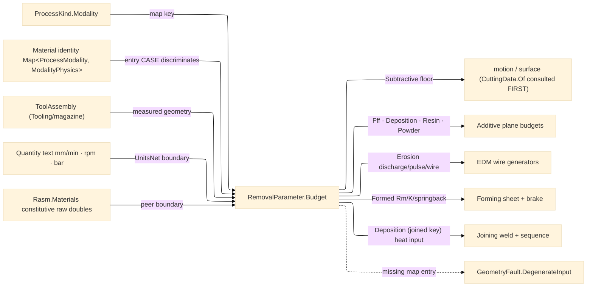

# [RASM_FABRICATION_CUT_PARAMETER]

The process-physics owner: ONE `Material` identity per physical material carrying a `Map<ProcessModality, ModalityPhysics>` payload — stainless is ONE row whose map holds its subtractive, abrasive, erosion, formed, and joined physics; the disk `stainless-abrasive`/`mild-steel-thermal` fragmented per-modality material rows are the collapsed form. `RemovalParameter.Budget` modality-dispatches into the map: the `Process/family#PROCESS_FAMILY` `ProcessKind.Modality` selects the map entry, and the ENTRY'S `ModalityPhysics` case selects the `RemovalBudget` case — so the `additive` modality resolves FFF extrusion for `pla-filament`, DED deposition for `mild-steel`, resin exposure/cure for `photopolymer-resin`, and powder laser/hatch/scan for `ss316-powder` off the one map; the `erosion` modality resolves a REAL `Erosion` budget (EDM discharge current, pulse on/off, wire feed) — the `erosion→ThermalBudget` conflation is dead; the `formed` modality resolves the `Formed` FORM budget (tensile `Rm` the brake tonnage formula `F=(C·Rm·S²·L)/(V·1000)` consumes, base K-factor the bend-allowance projection `BA=(π/180)·A·(R+K·T)` consumes, springback ratio the overbend derivation consumes, minimum-bend-radius factor in thickness multiples — `Forming/{sheet,brake}` are the consumers); and the `joined` modality REUSES the landed `Deposition` case as the weld heat-input budget (`Joining/weld` is its first consumer — arc power/wire-feed/standoff/interpass drive `HI = η·60·V·I/(1000·v)` and the interpass schedule on `Joining/sequence`), never a parallel weld-physics sibling. A material lacking the demanded modality's entry routes the kernel `GeometryFault.DegenerateInput`, never a hardcoded fallback: the dead `(ProcessKind, Material, Tool, Operation)` `Overrides` carrier is DELETED (measured production data enters through `Tooling/cuttingdata`'s ingress arm, never a page-local dictionary), and the inline `90.0 m/min` literal is demoted behind the data table — every seed value is a constructor-bound row datum, no code-path constant survives. The measured machinability table (the SFM/chip-load cells) is EXCISED to `Tooling/cuttingdata` and deepened there to the Kienzle `kc` model; this page keeps the material identity, the per-modality physics, and the formula FLOOR the generators fall back to when no measured cell exists — consumers consult `CuttingData.Of` first, `Budget` always.

`Budget` reads the mounted `ToolAssembly` (the `Tooling/magazine` ISO-13399-backed assembly), not a bare catalog row — the subtractive projection reads the assembly's tool diameter/flutes and the operation's chip-load/engagement columns, so a measured tool budgets from its real geometry. The `Tool` axis stays HERE as the process-discriminated catalog vocabulary (`Diameter`/`Flutes`/`Coating`/`CornerRadius`/`HelixAngle`/`Stickout`/`Runout` columns) the `ToolAssembly` composes; a parallel tool-geometry record anywhere is the deleted form. The upstream constitutive scalars — conductivity, specific heat, density — admit as RAW DOUBLES at the `Rasm.Materials` `Properties/properties#MATERIAL_PROPERTY_CATALOGUE` AEC-peer boundary (never a `MaterialProperty` type in-folder). Quantity-bearing ingress (`mm/min`, `m/min`, `rpm`, `mm`, `bar`) admits ONCE through the in-folder `UnitsNet` boundary (`Speed`/`Length`/`RotationalSpeed`/`Pressure` `TryParse` → typed accessor), the strata-correct owner honoring AEC-domain acyclicity; the interior's CANONICAL scalar row is the machining unit system — millimetre, millimetre/minute, rev/minute, bar — the same units every physics row datum and budget field carries, so the boundary projects `MillimetersPerMinutes`/`RevolutionsPerMinute`/`Millimeters`/`Bars` BY LAW (an SI-base `m/s` feed would silently mis-scale every generator); a quantity type in a generator signature is the seam violation, and the SI-m² spellings live only on the element-graph wire.

Wire posture: HOST-LOCAL. The `RemovalBudget` scalars cross only the in-process seam to the toolpath generators — never a browser or peer wire; the axes and unions never sit between wire and rail.

## [01]-[INDEX]

- [01]-[CUT_PARAMETER]: owns the `Coating`/`Tool`/`Operation` catalog axes, the nine-case `ModalityPhysics` per-modality payload union, the ONE `Material` identity with its `Map<ProcessModality, ModalityPhysics>` column, the nine-case `RemovalBudget` receipt union, and the `RemovalParameter.Budget` projection — the modality-dispatched map read the toolpath, additive, erosion, forming, and joining generators consume as settled scalars.

## [02]-[CUT_PARAMETER]

- Owner: `Coating` `[SmartEnum<string>]` (`uncoated`/`TiN`/`TiAlN`/`diamond`); `Tool` `[SmartEnum<string>]` the process-discriminated catalog axis carrying the full tooling payload columns; `Operation` `[SmartEnum<string>]` the milling-op taxonomy (`contour`/`pocket`/`slot`/`face`/`drill`/`bore`/`ream`/`tap`/`chamfer`/`trochoidal`) carrying chip-load, radial-engagement, and INDEPENDENT axial-depth columns; `ModalityPhysics` `[Union]` the closed per-modality material payload — `Subtractive` (surface-speed floor) · `Thermal` (kerf/pierce/assist/speed) · `Abrasive` (jet/rate/traverse) · `Fff` (melt-temp/bond-window/extrusion-width/layer-height/print-speed — the full FFF production row, no projection-side constant) · `Deposition` (power/wire-feed/standoff/interpass — DED distinct from FFF) · `Erosion` (discharge-current/pulse-on/pulse-off/wire-feed) · `Resin` (exposure/cure-depth/lift) · `Powder` (laser-power/hatch-spacing/scan-speed) · `Forming` (tensile-Rm/K-factor/springback-ratio/min-bend-radius-factor — the sheet-forming constitutive row); `Material` `[SmartEnum<string>]` the ONE per-physical-material identity carrying `Map<ProcessModality, ModalityPhysics>`; `RemovalBudget` `[Union]` the case-per-physics raw-scalar receipt MIRRORING the payload cases name-for-name (`Fff` mirrors `Fff` — the `Additive`-named budget case that shadowed the modality concept is the deleted misname) — its `Formed` case IS the form budget (tonnage/springback/bend-allowance inputs) and its `Deposition` case doubles as the weld heat-input budget under the `joined` map key; `RemovalParameter` the static surface owning `Budget` and the admission boundaries.
- Cases: `Material` rows 9 — `aluminium` {subtractive, thermal, abrasive, erosion, formed, joined→Deposition} · `mild-steel` {subtractive, thermal, abrasive, erosion, additive→Deposition, formed, joined→Deposition} · `stainless` {subtractive, thermal, abrasive, erosion, formed, joined→Deposition} · `titanium` {subtractive, abrasive, erosion, formed, joined→Deposition — the aerospace staple; thermal omitted, Ti oxy/plasma cutting is metallurgy-hostile} · `acrylic` {subtractive, thermal} · `plywood` {subtractive, thermal} · `pla-filament` {additive→Fff} · `photopolymer-resin` {additive→Resin} · `ss316-powder` {additive→Powder} — the metals carry every removal modality a real shop routes them through (stainless laser-cuts, mild steel waterjets and wire-EDMs; the prior thin slices were the named coverage defect); the map entry's CASE, not the modality row, discriminates the budget case, so one `additive` modality serves four distinct production physics and the `Deposition` case serves BOTH the DED build (`additive` key) and the weld heat-input budget (`joined` key) off distinct row values; `Tool` rows 9; `Operation` rows 10; the subtractive projection is the milling formula (`spindle = v·1000/(π·d)`, `feed = spindle·flutes·chipLoad`, `depth = axial·d`, `width = engagement·d`, `mrr = depth·width·feed`) over the map's surface-speed floor and the assembly geometry — the MEASURED cell (Kienzle `kc`, per-operation speed, feed-per-tooth) lives at `Tooling/cuttingdata` and defeats this floor at the consumer.
- Entry: `public static Fin<RemovalBudget> Budget(ProcessKind process, Material material, ToolAssembly tool, Operation operation)` — the ONE projection: `process.Modality` keys the material map, a missing entry routes `GeometryFault.DegenerateInput` (the material/modality pairing is degenerate input, never a silent default), the present entry's case projects its budget through the generated total `Switch`; `public static Fin<(ProcessKind, Material, Operation)> Admit(string process, string material, string operation)` accumulates three INDEPENDENT key admissions through `Validation` over the family's one `ProcessFamily.Admit<TAxis>` bridge — every bad key reports in one verdict, then the triple rejoins the `Fin` rail; `Feed`/`Spindle`/`Depth`/`Assist` are the `UnitsNet` quantity-text boundaries emitting canonical machining scalars (mm/min · rpm · mm · bar), each routing `DegenerateInput` on an unparseable quantity.
- Auto: `Budget` binds `material.Physics.Find(process.Modality)` and folds the entry through the `ModalityPhysics` generated total `Switch` — `Subtractive` projects the milling formula from the map floor + `tool.Tool.Diameter`/`Flutes` + `operation.ChipLoad`/`Engagement`/`Axial`; `Thermal` projects pierce/kerf/speed/assist off its row with the kerf floored at the mounted torch/beam orifice diameter (a physical invariant, not a policy value); `Abrasive` jet/rate/traverse; `Fff` extrusion width (floored at the nozzle bore)/layer/speed/melt-temp — every FFF scalar a ROW datum, the projection-side print-speed constant deleted; `Deposition` power/feed/standoff/interpass; `Erosion` discharge/pulse-on/pulse-off/wire-feed; `Resin` exposure/cure-depth/lift; `Powder` laser/hatch/scan; `Forming` Rm/K/springback/min-radius. Constitutive scalars (a thermal cut scaling pierce by conductivity, an abrasive cut by density) admit as raw doubles at the `Rasm.Materials` peer boundary. `Toolpath/motion` reads the modality-matched case; `Tooling/cuttingdata` keys its Kienzle table by this page's `Material` identity; `Toolpath/surface` reads the subtractive chip-load budget for engagement bounds; `Forming/sheet` reads `Formed.KFactor` as the coupon-refinable base row and `Forming/brake` reads `Formed.TensileRm`/`SpringbackRatio`/`MinBendRadiusFactor` for tonnage/overbend/radius-floor; `Joining/weld` reads the `joined`-keyed `Deposition` for heat input and `Joining/sequence` its `InterpassTemp` for the interpass schedule; `Additive/scanpath` consumes the `Powder` budget's laser/hatch/scan triple.
- Receipt: the `RemovalBudget` case carries its physics' raw scalars directly — the projected budget IS the evidence; no generic parameter ledger, no quantity type escaping the boundary, no case carrying a column outside its physics.
- Packages: `Process/family#PROCESS_FAMILY` (`ProcessKind`/`ProcessModality` — the one modality vocabulary, composed), `Tooling/magazine#TOOL_MAGAZINE` (`ToolAssembly` — the mounted-tool geometry the budget reads), Thinktecture.Runtime.Extensions (`[SmartEnum<string>]`/`[Union]`), `UnitsNet` (`Speed`/`Length`/`RotationalSpeed`/`Pressure` ingress + SI accessors — the `.api/api-unitsnet.md` overlay), `Rasm.Numerics` (`GeometryFault` band-2400), LanguageExt.Core (`Fin`/`Map`), BCL inbox; `Rasm.Materials` `Properties/properties#MATERIAL_PROPERTY_CATALOGUE` constitutive scalars as raw doubles at the peer boundary.
- Growth: a new material is one `Material` row binding its full modality map; a new modality physics for an existing material is one map entry on its row; a new production physics (a new AM class) is one `ModalityPhysics` case + one `RemovalBudget` case + one `Switch` arm, the generated dispatch breaking the build until the arm lands; a new budget scalar is one field on its case + one projection term; measured production machinability is `Tooling/cuttingdata`'s ingress arm, NEVER a page-local override dictionary; zero new surface.
- Boundary: `RemovalParameter` is the ONE removal-physics owner and a per-generator magic number is the deleted form; the material is ONE identity row and a per-modality material sibling (`stainless-abrasive`, `mild-steel-thermal`) is the deleted fragmentation — the map column owns the modality spread; the `Overrides` dictionary is DELETED and a resurrected page-local measured-data carrier is the rejected form — measured cells are `Tooling/cuttingdata`'s, entered through its data-ingress arm; no code-path fallback constant survives — a missing map entry FAILS typed, the seed values are row data, and an inline surface-speed/pierce/melt/print-speed literal in a projection body is the named defect the `90.0` and `PrintSpeed: 60.0` demotions killed (both now constructor-bound row data); the budget union mirrors the physics union name-for-name and a budget case named after a MODALITY rather than its physics (`Additive` for the FFF receipt) is the deleted misname; the budget union is modality-discriminated and a parallel `ThermalParameter`/`ErosionParameter` sibling table is the deleted form; the modality discriminant is the `Process/family` row and a second modality enum here is the deleted form; the quantity parse lives only at the `UnitsNet` boundary and the interior is raw doubles; the constitutive read is raw doubles at the `Rasm.Materials` peer boundary and a `MaterialProperty` type in a generator signature is the seam violation.

```csharp signature
// --- [RUNTIME_PRELUDE] ----------------------------------------------------------------------------------------------------------------------------
using System.Globalization;
using LanguageExt;
using LanguageExt.Common;
using Rasm.Fabrication.Tooling;
using Rasm.Numerics;
using Thinktecture;
using UnitsNet;
using static LanguageExt.Prelude;

namespace Rasm.Fabrication.Process;

// --- [TYPES] --------------------------------------------------------------------------------------------------------------------------------------
[SmartEnum<string>]
public sealed partial class Coating {
    public static readonly Coating Uncoated = new("uncoated");
    public static readonly Coating TiN = new("TiN");
    public static readonly Coating TiAlN = new("TiAlN");
    public static readonly Coating Diamond = new("diamond");
}

[SmartEnum<string>]
public sealed partial class Tool {
    public static readonly Tool Endmill3 = new("endmill-3mm", diameter: 3.0, flutes: 2, Coating.TiAlN, cornerRadius: 0.2, helixAngle: 30.0, stickout: 18.0, runout: 0.005);
    public static readonly Tool Endmill6 = new("endmill-6mm", diameter: 6.0, flutes: 3, Coating.TiAlN, cornerRadius: 0.5, helixAngle: 35.0, stickout: 30.0, runout: 0.008);
    public static readonly Tool Endmill10 = new("endmill-10mm", diameter: 10.0, flutes: 4, Coating.TiAlN, cornerRadius: 0.8, helixAngle: 38.0, stickout: 45.0, runout: 0.010);
    public static readonly Tool Drill6 = new("drill-6mm", diameter: 6.0, flutes: 2, Coating.TiN, cornerRadius: 0.0, helixAngle: 28.0, stickout: 36.0, runout: 0.012);
    public static readonly Tool TurningInsert = new("turning-insert", diameter: 0.8, flutes: 1, Coating.TiAlN, cornerRadius: 0.8, helixAngle: 0.0, stickout: 25.0, runout: 0.005);
    public static readonly Tool LaserHead = new("laser-head", diameter: 0.1, flutes: 0, Coating.Uncoated, cornerRadius: 0.0, helixAngle: 0.0, stickout: 0.0, runout: 0.0);
    public static readonly Tool PlasmaTorch = new("plasma-torch", diameter: 1.5, flutes: 0, Coating.Uncoated, cornerRadius: 0.0, helixAngle: 0.0, stickout: 0.0, runout: 0.0);
    public static readonly Tool WaterjetNozzle = new("waterjet-nozzle", diameter: 0.76, flutes: 0, Coating.Uncoated, cornerRadius: 0.0, helixAngle: 0.0, stickout: 0.0, runout: 0.0);
    public static readonly Tool FffNozzle = new("fff-nozzle", diameter: 0.4, flutes: 0, Coating.Uncoated, cornerRadius: 0.0, helixAngle: 0.0, stickout: 0.0, runout: 0.0);

    public double Diameter { get; }
    public int Flutes { get; }
    public Coating Coating { get; }
    public double CornerRadius { get; }
    public double HelixAngle { get; }
    public double Stickout { get; }
    public double Runout { get; }
}

// Radial Engagement and AXIAL depth are independent cut dimensions (both diameter fractions) — one column
// doubling as both produced identical MRR evidence for physically distinct cuts, the deleted conflation.
[SmartEnum<string>]
public sealed partial class Operation {
    public static readonly Operation Contour = new("contour", chipLoad: 0.05, engagement: 1.0, axial: 1.0);
    public static readonly Operation Pocket = new("pocket", chipLoad: 0.04, engagement: 0.5, axial: 0.5);
    public static readonly Operation Slot = new("slot", chipLoad: 0.035, engagement: 1.0, axial: 0.5);
    public static readonly Operation Face = new("face", chipLoad: 0.08, engagement: 0.7, axial: 0.1);
    public static readonly Operation Drill = new("drill", chipLoad: 0.03, engagement: 1.0, axial: 1.0);
    public static readonly Operation Bore = new("bore", chipLoad: 0.04, engagement: 0.05, axial: 1.0);
    public static readonly Operation Ream = new("ream", chipLoad: 0.08, engagement: 0.02, axial: 1.0);
    public static readonly Operation Tap = new("tap", chipLoad: 0.0, engagement: 1.0, axial: 1.0);
    public static readonly Operation Chamfer = new("chamfer", chipLoad: 0.05, engagement: 0.2, axial: 0.1);
    public static readonly Operation Trochoidal = new("trochoidal", chipLoad: 0.06, engagement: 0.1, axial: 1.0);

    public double ChipLoad { get; }
    public double Engagement { get; }
    public double Axial { get; }
}

// --- [MODELS] -------------------------------------------------------------------------------------------------------------------------------------
// Nine production physics, one union: the map ENTRY'S case (not the modality row) discriminates the budget case,
// so the one `additive` modality serves FFF, DED, resin, and powder off four distinct material rows.
[Union(ConversionFromValue = ConversionOperatorsGeneration.None)]
public abstract partial record ModalityPhysics {
    private ModalityPhysics() { }

    public sealed record Subtractive(double SurfaceSpeed) : ModalityPhysics;
    public sealed record Thermal(double KerfWidth, double PierceTime, double AssistPressure, double CutSpeed) : ModalityPhysics;
    public sealed record Abrasive(double JetPressure, double AbrasiveRate, double TraverseSpeed) : ModalityPhysics;
    public sealed record Fff(double MeltTemp, double BondWindow, double ExtrusionWidth, double LayerHeight, double PrintSpeed) : ModalityPhysics;
    public sealed record Deposition(double PowerW, double WireFeedRate, double Standoff, double InterpassTemp) : ModalityPhysics;
    public sealed record Erosion(double DischargeCurrent, double PulseOnUs, double PulseOffUs, double WireFeed) : ModalityPhysics;
    public sealed record Resin(double Exposure, double CureDepth, double LiftHeight) : ModalityPhysics;
    public sealed record Powder(double LaserPower, double HatchSpacing, double ScanSpeed) : ModalityPhysics;
    public sealed record Forming(double TensileRm, double KFactor, double SpringbackRatio, double MinBendRadiusFactor) : ModalityPhysics;
}

// ONE identity per physical material; the Map column owns the modality spread. Every scalar is a row datum —
// no code-path fallback constant exists anywhere on this page.
[SmartEnum<string>]
public sealed partial class Material {
    public static readonly Material Aluminium = new("aluminium", Map(
        (ProcessModality.Subtractive, (ModalityPhysics)new ModalityPhysics.Subtractive(300.0)),
        (ProcessModality.Thermal, new ModalityPhysics.Thermal(KerfWidth: 1.0, PierceTime: 0.3, AssistPressure: 10.0, CutSpeed: 4000.0)),
        (ProcessModality.Abrasive, new ModalityPhysics.Abrasive(JetPressure: 380.0, AbrasiveRate: 0.45, TraverseSpeed: 250.0)),
        (ProcessModality.Erosion, new ModalityPhysics.Erosion(DischargeCurrent: 10.0, PulseOnUs: 6.0, PulseOffUs: 10.0, WireFeed: 10.0)),
        (ProcessModality.Formed, new ModalityPhysics.Forming(TensileRm: 260.0, KFactor: 0.43, SpringbackRatio: 0.98, MinBendRadiusFactor: 1.5)),
        (ProcessModality.Joined, new ModalityPhysics.Deposition(PowerW: 5200.0, WireFeedRate: 8.5, Standoff: 12.0, InterpassTemp: 120.0))));
    public static readonly Material MildSteel = new("mild-steel", Map(
        (ProcessModality.Subtractive, (ModalityPhysics)new ModalityPhysics.Subtractive(90.0)),
        (ProcessModality.Thermal, new ModalityPhysics.Thermal(KerfWidth: 1.2, PierceTime: 0.5, AssistPressure: 8.0, CutSpeed: 2000.0)),
        (ProcessModality.Abrasive, new ModalityPhysics.Abrasive(JetPressure: 380.0, AbrasiveRate: 0.45, TraverseSpeed: 180.0)),
        (ProcessModality.Erosion, new ModalityPhysics.Erosion(DischargeCurrent: 9.0, PulseOnUs: 5.0, PulseOffUs: 11.0, WireFeed: 9.0)),
        (ProcessModality.Additive, new ModalityPhysics.Deposition(PowerW: 2400.0, WireFeedRate: 2.0, Standoff: 10.0, InterpassTemp: 250.0)),
        (ProcessModality.Formed, new ModalityPhysics.Forming(TensileRm: 440.0, KFactor: 0.44, SpringbackRatio: 0.99, MinBendRadiusFactor: 1.0)),
        (ProcessModality.Joined, new ModalityPhysics.Deposition(PowerW: 8100.0, WireFeedRate: 9.0, Standoff: 15.0, InterpassTemp: 250.0))));
    public static readonly Material Stainless = new("stainless", Map(
        (ProcessModality.Subtractive, (ModalityPhysics)new ModalityPhysics.Subtractive(45.0)),
        (ProcessModality.Thermal, new ModalityPhysics.Thermal(KerfWidth: 0.9, PierceTime: 0.8, AssistPressure: 14.0, CutSpeed: 1500.0)),
        (ProcessModality.Abrasive, new ModalityPhysics.Abrasive(JetPressure: 380.0, AbrasiveRate: 0.45, TraverseSpeed: 150.0)),
        (ProcessModality.Erosion, new ModalityPhysics.Erosion(DischargeCurrent: 8.0, PulseOnUs: 4.0, PulseOffUs: 12.0, WireFeed: 8.0)),
        (ProcessModality.Formed, new ModalityPhysics.Forming(TensileRm: 620.0, KFactor: 0.45, SpringbackRatio: 0.97, MinBendRadiusFactor: 2.0)),
        (ProcessModality.Joined, new ModalityPhysics.Deposition(PowerW: 6200.0, WireFeedRate: 7.5, Standoff: 12.0, InterpassTemp: 150.0))));
    public static readonly Material Titanium = new("titanium", Map(
        (ProcessModality.Subtractive, (ModalityPhysics)new ModalityPhysics.Subtractive(35.0)),
        (ProcessModality.Abrasive, new ModalityPhysics.Abrasive(JetPressure: 400.0, AbrasiveRate: 0.5, TraverseSpeed: 90.0)),
        (ProcessModality.Erosion, new ModalityPhysics.Erosion(DischargeCurrent: 6.0, PulseOnUs: 3.0, PulseOffUs: 14.0, WireFeed: 6.0)),
        (ProcessModality.Formed, new ModalityPhysics.Forming(TensileRm: 950.0, KFactor: 0.46, SpringbackRatio: 0.93, MinBendRadiusFactor: 3.0)),
        (ProcessModality.Joined, new ModalityPhysics.Deposition(PowerW: 4300.0, WireFeedRate: 5.0, Standoff: 10.0, InterpassTemp: 120.0))));
    public static readonly Material Acrylic = new("acrylic", Map(
        (ProcessModality.Subtractive, (ModalityPhysics)new ModalityPhysics.Subtractive(500.0)),
        (ProcessModality.Thermal, new ModalityPhysics.Thermal(KerfWidth: 0.2, PierceTime: 0.05, AssistPressure: 0.5, CutSpeed: 12000.0))));
    public static readonly Material Plywood = new("plywood", Map(
        (ProcessModality.Subtractive, (ModalityPhysics)new ModalityPhysics.Subtractive(600.0)),
        (ProcessModality.Thermal, new ModalityPhysics.Thermal(KerfWidth: 0.3, PierceTime: 0.1, AssistPressure: 0.6, CutSpeed: 8000.0))));
    public static readonly Material PlaFilament = new("pla-filament", Map(
        (ProcessModality.Additive, (ModalityPhysics)new ModalityPhysics.Fff(MeltTemp: 210.0, BondWindow: 15.0, ExtrusionWidth: 0.45, LayerHeight: 0.2, PrintSpeed: 60.0))));
    public static readonly Material PhotopolymerResin = new("photopolymer-resin", Map(
        (ProcessModality.Additive, (ModalityPhysics)new ModalityPhysics.Resin(Exposure: 2.5, CureDepth: 0.1, LiftHeight: 5.0))));
    public static readonly Material Ss316Powder = new("ss316-powder", Map(
        (ProcessModality.Additive, (ModalityPhysics)new ModalityPhysics.Powder(LaserPower: 200.0, HatchSpacing: 0.12, ScanSpeed: 900.0))));

    public Map<ProcessModality, ModalityPhysics> Physics { get; }
}

[Union(ConversionFromValue = ConversionOperatorsGeneration.None)]
public abstract partial record RemovalBudget {
    private RemovalBudget() { }

    public sealed record Subtractive(double SpindleRpm, double FeedRate, double DepthOfCut, double WidthOfCut, double MaterialRemovalRate) : RemovalBudget;
    public sealed record Thermal(double PierceTime, double KerfWidth, double CutSpeed, double AssistPressure) : RemovalBudget;
    public sealed record Abrasive(double JetPressure, double AbrasiveRate, double TraverseSpeed) : RemovalBudget;
    public sealed record Fff(double ExtrusionWidth, double LayerHeight, double PrintSpeed, double MeltTemp) : RemovalBudget;
    public sealed record Deposition(double PowerW, double WireFeedRate, double Standoff, double InterpassTemp) : RemovalBudget;
    public sealed record Erosion(double DischargeCurrent, double PulseOnUs, double PulseOffUs, double WireFeed) : RemovalBudget;
    public sealed record Resin(double Exposure, double CureDepth, double LiftHeight) : RemovalBudget;
    public sealed record Powder(double LaserPower, double HatchSpacing, double ScanSpeed) : RemovalBudget;
    // The FORM budget: brake computes F=(C·Rm·S²·L)/(V·1000) from TensileRm; sheet computes BA=(π/180)·A·(R+K·T) from KFactor.
    public sealed record Formed(double TensileRm, double KFactor, double SpringbackRatio, double MinBendRadiusFactor) : RemovalBudget;
}

// --- [OPERATIONS] ---------------------------------------------------------------------------------------------------------------------------------
public static class RemovalParameter {
    // The modality keys the map; the ENTRY'S case projects its budget. A missing entry is degenerate input —
    // the measured Kienzle cell (Tooling/cuttingdata) defeats the subtractive formula floor at the CONSUMER.
    public static Fin<RemovalBudget> Budget(ProcessKind process, Material material, ToolAssembly tool, Operation operation) =>
        material.Physics.Find(process.Modality).Match(
            None: () => Fin.Fail<RemovalBudget>(GeometryFault.DegenerateInput($"removal-parameter:{material.Key}-lacks-{process.Modality.Key}").ToError()),
            Some: physics => Fin.Succ(physics.Switch<RemovalBudget>(
                subtractive: sub => SubtractiveFloor(sub, tool, operation),
                // The mounted tool is a PHYSICAL floor on beam/bead width: a kerf can never undercut the torch
                // orifice, an extrusion can never undercut the nozzle bore — invariants, not policy values.
                thermal:     th => new RemovalBudget.Thermal(th.PierceTime, Math.Max(th.KerfWidth, tool.Tool.Diameter), th.CutSpeed, th.AssistPressure),
                abrasive:    ab => new RemovalBudget.Abrasive(ab.JetPressure, ab.AbrasiveRate, ab.TraverseSpeed),
                fff:         f => new RemovalBudget.Fff(Math.Max(f.ExtrusionWidth, tool.Tool.Diameter), f.LayerHeight, f.PrintSpeed, f.MeltTemp),
                deposition:  d => new RemovalBudget.Deposition(d.PowerW, d.WireFeedRate, d.Standoff, d.InterpassTemp),
                erosion:     e => new RemovalBudget.Erosion(e.DischargeCurrent, e.PulseOnUs, e.PulseOffUs, e.WireFeed),
                resin:       r => new RemovalBudget.Resin(r.Exposure, r.CureDepth, r.LiftHeight),
                powder:      p => new RemovalBudget.Powder(p.LaserPower, p.HatchSpacing, p.ScanSpeed),
                forming:     fo => new RemovalBudget.Formed(fo.TensileRm, fo.KFactor, fo.SpringbackRatio, fo.MinBendRadiusFactor))));

    // Axial and radial are INDEPENDENT diameter fractions: depth = axial·d, width = radial·d, MRR = depth·width·feed —
    // the duplicated-engagement MRR that could not distinguish a facing skim from a full slot is the deleted form.
    static RemovalBudget SubtractiveFloor(ModalityPhysics.Subtractive sub, ToolAssembly tool, Operation operation) {
        double spindle = sub.SurfaceSpeed * 1000.0 / (Math.PI * tool.Tool.Diameter);
        double feed = spindle * tool.Tool.Flutes * operation.ChipLoad;
        double depth = operation.Axial * tool.Tool.Diameter;
        double width = operation.Engagement * tool.Tool.Diameter;
        return new RemovalBudget.Subtractive(spindle, feed, depth, width, depth * width * feed);
    }

    // --- [BOUNDARIES] -------------------------------------------------------------------------------------------------------------------------------
    // Three INDEPENDENT keys accumulate through Validation before the triple reports — every bad key surfaces
    // in one verdict; each admission rides the family's one generic factory bridge.
    public static Fin<(ProcessKind Process, Material Material, Operation Operation)> Admit(string process, string material, string operation) =>
        (ProcessFamily.Admit<ProcessKind>(process).ToValidation(),
         ProcessFamily.Admit<Material>(material).ToValidation(),
         ProcessFamily.Admit<Operation>(operation).ToValidation())
            .Apply(static (p, m, o) => (Process: p, Material: m, Operation: o)).As().ToFin();

    public static Fin<double> Feed(string text) =>
        Speed.TryParse(text, CultureInfo.InvariantCulture, out Speed feed)
            ? Fin.Succ(feed.MillimetersPerMinutes)
            : Fin.Fail<double>(GeometryFault.DegenerateInput($"removal-parameter:feed:{text}").ToError());

    public static Fin<double> Spindle(string text) =>
        RotationalSpeed.TryParse(text, CultureInfo.InvariantCulture, out RotationalSpeed rpm)
            ? Fin.Succ(rpm.RevolutionsPerMinute)
            : Fin.Fail<double>(GeometryFault.DegenerateInput($"removal-parameter:spindle:{text}").ToError());

    public static Fin<double> Depth(string text) =>
        Length.TryParse(text, CultureInfo.InvariantCulture, out Length depth)
            ? Fin.Succ(depth.Millimeters)
            : Fin.Fail<double>(GeometryFault.DegenerateInput($"removal-parameter:depth:{text}").ToError());

    public static Fin<double> Assist(string text) =>
        Pressure.TryParse(text, CultureInfo.InvariantCulture, out Pressure pressure)
            ? Fin.Succ(pressure.Bars)
            : Fin.Fail<double>(GeometryFault.DegenerateInput($"removal-parameter:assist:{text}").ToError());
}
```


