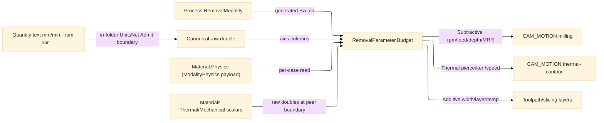

# [RASM_FABRICATION_CUT_PARAMETER]

The removal-physics policy table: `RemovalParameter` the one frozen `process × material × tool × operation` cross-product owner projecting each row to the modality-discriminated `RemovalBudget` `[Union]` the `Toolpath/motion#CAM_MOTION` and `Toolpath/skeleton#STRAIGHT_SKELETON` generators read as settled scalars. The `Process/family#PROCESS_FAMILY` `Process.RemovalModality` column is the ONE discriminant the `Budget` projection switches on — a subtractive mill row projects a `SubtractiveBudget` (rpm/feed/depth/MRR), a thermal laser/plasma/oxyfuel row a `ThermalBudget` (pierce-time/kerf-width/cut-speed/assist-pressure), an abrasive waterjet row an `AbrasiveBudget` (jet-pressure/abrasive-rate/traverse-speed), and an additive FFF row an `AdditiveBudget` (extrusion-width/layer-height/print-speed/melt-temp). The table is data-driven dispatch keyed by the composite `(Process, Material, Tool, Operation)` smart-enum quad — a new process, material, tool, or operation is one row, never a per-generator magic number, and a new modality is one `RemovalBudget` case plus one projection arm the generated total `Switch` breaks the build until it lands. Each `Material` carries a per-modality `ModalityPhysics` payload column the `RemovalModality` `Switch` reads ONLY for its case (the subtractive surface-speed for milling, the thermal kerf/pierce row for a laser, the abrasive jet row for a waterjet, the additive melt-temp row for an FFF head) so materials own real specific vocabularies without a flat wide record where every modality's columns sit nullable side-by-side. The `Tool` axis carries its full tooling payload — `Diameter`/`Flutes` plus `Coating` (the `uncoated`/`TiN`/`TiAlN`/`diamond` `[SmartEnum<string>]`), `CornerRadius`, `HelixAngle`, `Stickout`, `Runout` — the `Stickout` column feeding the `MAGAZINE` holder geometry and the `POST_THERMAL_DEFLECTION_COMP` bending-stiffness consumer, never a parallel tool-geometry record. A frozen `CuttingData` table keyed by the `(Material, Tool, Operation)` triple supplies the measured surface-feet-per-minute and chip-load per cell consulted BEFORE the subtractive formula, defeating the single hardcoded `90.0 m/min` fallback so a `TiAlN`-coated endmill in stainless reads its own SFM/chip-load cell rather than the one constant; the table rides BESIDE the existing `(Process, Material, Tool, Operation)` `Overrides` table, never a parallel `ToolMaterialTable` the density law forbids. The upstream-owned constitutive scalars — thermal conductivity, specific heat, density — admit as RAW DOUBLES at the `Rasm.Materials/physical-properties#MATERIAL_PROPERTY` AEC-peer boundary (the additive melt-temp and process-only thermal columns are NOT upstream engineering properties and stay in-folder). Quantity-bearing ingress (a feed in `mm/min`, a surface speed in `m/min`, a spindle speed in `rpm`, a depth in `mm`, an assist pressure in `bar`) admits ONCE through the in-folder `UnitsNet` boundary at `RemovalParameter.Admit` — the strata-correct resolution honoring the AEC-domain → app-platform acyclicity that forbids Fabrication a downward edge to the `Rasm.Compute` units owner: the boundary `TryParse`s each `"<value> <unit>"` string through the `Speed`/`Length`/`RotationalSpeed`/`Pressure` facades and reads the SI accessor, so this table stores and projects only the canonical raw doubles, because the toolpath interior operates on raw coordinate/rate doubles and a `Speed`/`Length`/`RotationalSpeed`/`Pressure` quantity in a generator signature is the seam violation the Fabrication owner forbids. It composes the `Process/owner#FABRICATION_OWNER` shared vocabulary as the consumer seam; it computes no hash and operates on raw doubles at the interior.

Wire posture: HOST-LOCAL. The `RemovalBudget` scalars cross only the in-process seam to the toolpath generators — never a browser or peer wire. The `Material`/`Tool`/`Operation` vocabularies and the `RemovalBudget` union are host-local types that never sit between wire and rail.

## [01]-[INDEX]

- [01]-[CUT_PARAMETER]: owns the `Material`/`Tool`/`Operation` cross-product axes, the `ModalityPhysics` per-modality payload, the `RemovalBudget` `[Union]` modality-discriminated receipt, and the `RemovalParameter` frozen policy table — the `process × material × tool × operation` rows projecting through the `Process.RemovalModality` switch to the per-modality budget the toolpath generators read.

## [02]-[CUT_PARAMETER]

- Owner: `Material` `[SmartEnum<string>]` the stock-material axis carrying a per-modality `ModalityPhysics` payload column (never a flat 15-column nullable record); `Coating` `[SmartEnum<string>]` the tool-coating axis (`uncoated`/`TiN`/`TiAlN`/`diamond`); `Tool` `[SmartEnum<string>]` the process-discriminated tooling axis (`endmill-3mm`/`endmill-6mm`/`endmill-10mm`/`drill-6mm` milling rows kept, plus `turning-insert`/`laser-head`/`plasma-torch`/`waterjet-nozzle`/`fff-nozzle`) carrying its full tooling payload — `Diameter`/`Flutes` plus the `Coating`/`CornerRadius`/`HelixAngle`/`Stickout`/`Runout` geometry columns its process reads as behavior; `Operation` `[SmartEnum<string>]` the cut-operation axis (`contour`/`pocket`/`drill`/`trochoidal`) carrying a chip-load and an engagement column; `ModalityPhysics` `[Union]` the closed per-modality material payload (`SubtractivePhysics` surface-speed · `ThermalPhysics` kerf-width/pierce-time/assist-pressure · `AbrasivePhysics` jet-pressure/abrasive-rate · `AdditivePhysics` melt-temp/bond-window) the `RemovalModality` switch reads only for its case; `RemovalBudget` `[Union]` the modality-discriminated raw-scalar receipt (`SubtractiveBudget` rpm/feed/depth/MRR · `ThermalBudget` pierce/kerf/speed/pressure · `AbrasiveBudget` pressure/rate/traverse · `AdditiveBudget` width/layer/speed/temp); `RemovalParameter` the static surface owning the frozen `(Process, Material, Tool, Operation)`-keyed override table, the frozen `(Material, Tool, Operation)`-keyed `CuttingData` SFM/chip-load table, and the `Budget` projection from the row columns through the `RemovalModality` switch.
- Cases: `Coating` rows `uncoated` · `TiN` · `TiAlN` · `diamond` (4); `Tool` rows `endmill-3mm` · `endmill-6mm` · `endmill-10mm` · `drill-6mm` · `turning-insert` · `laser-head` · `plasma-torch` · `waterjet-nozzle` · `fff-nozzle` (9); `Operation` rows `contour` · `pocket` · `drill` · `trochoidal` (4); `ModalityPhysics`/`RemovalBudget` cases `Subtractive` · `Thermal` · `Abrasive` · `Additive` (4 each, one-to-one with the `RemovalModality` rows the `Process` carries); the subtractive budget reads the `(Material, Tool, Operation)` `CuttingData` cell for its surface-speed and chip-load (the hardcoded `90.0` defeated by the per-cell row consulted before the formula), then projects `spindle = surfaceSpeed · 1000 / (π · diameter)`, `feed = spindle · flutes · chipLoad`, `depth = engagement · diameter`, `mrr = depth · engagement · diameter · feed` — the milling formula UNCHANGED as the `Subtractive` arm, only its surface-speed/chip-load inputs now sourced from the measured table cell; the thermal budget projects pierce-time and assist-pressure off the `ThermalPhysics` row scaled by the cut speed, the abrasive budget the jet-pressure/abrasive-rate off the `AbrasivePhysics` row, the additive budget the extrusion-width/layer-height/print-speed off the `AdditivePhysics` melt-temp row — each a settled formula over the per-modality payload, the table the composite-key admission factory the generators read.
- Entry: `public static RemovalBudget Budget(Process process, Material material, Tool tool, Operation operation)` — the ONE projection discriminating by `Process.RemovalModality` through the generated total `Switch`, total over every modality (each case closed, the projection a pure formula over the payload columns), no rail because a budget is always derivable once the modality and rows are settled; `public static Fin<RemovalBudget> Admit(ReadOnlySpan<char> process, ReadOnlySpan<char> material, ReadOnlySpan<char> tool, ReadOnlySpan<char> operation)` is the span-keyed boundary admitting external text through each axis's generated `Validate`, routing the kernel `GeometryFault.DegenerateInput` on an unknown key; `Feed`/`Spindle`/`Depth`/`Assist` are the in-folder `UnitsNet` quantity-text boundaries `TryParse`-ing a `"<value> <unit>"` string (feed `mm/min`, spindle `rpm`, depth `mm`, assist pressure `bar`) against an invariant culture and emitting the canonical SI `double`, each routing `GeometryFault.DegenerateInput` on an unparseable quantity.
- Auto: `RemovalParameter.Budget` reads the `Process.RemovalModality` and dispatches the per-modality projection through the generated total `Switch` — the `Subtractive` arm consults the frozen `(Material, Tool, Operation)`-keyed `CuttingData` table FIRST for the measured surface-speed and chip-load cell (a `TiAlN`-coated endmill in stainless reads its own SFM/chip-load), falling back to the `SubtractivePhysics.SurfaceSpeed` off the `Material` payload only when no cell exists, reads the diameter and flute count off the `Tool` column and the engagement off the `Operation` column, and projects the four milling scalars exactly as the milling table always did — the single inline `90.0 m/min` constant defeated by the table cell; the `Thermal` arm reads the `ThermalPhysics` kerf-width/pierce-time/assist-pressure and the cut speed; the `Abrasive` arm reads the `AbrasivePhysics` jet-pressure/abrasive-rate; the `Additive` arm reads the `AdditivePhysics` melt-temp/bond-window and the layer geometry. A frozen `(Process, Material, Tool, Operation)`-keyed override is consulted BEFORE the formula so a hand-measured budget defeats the projection. The upstream constitutive scalars (a thermal cut reads its material's conductivity and specific heat to scale the pierce time, an abrasive cut its density) admit as raw doubles through the `Rasm.Materials/physical-properties#MATERIAL_PROPERTY` boundary — `Thermal.ConductivityWMK`/`SpecificHeatJKgK`, `Mechanical.DensityKgM3` — never a `MaterialProperty` type in a generator signature. Quantity text (`"3000 mm/min"`, `"200 m/min"`, `"12000 rpm"`, `"8 bar"`) admits through the in-folder `UnitsNet` boundary at `RemovalParameter.Admit` — `Speed.TryParse`/`Length.TryParse`/`RotationalSpeed.TryParse`/`Pressure.TryParse` against an invariant `IFormatProvider`, the SI accessor (`Speed.MetersPerSecond`, `RotationalSpeed.RevolutionsPerMinute`) read once — canonicalizing to the SI scalar, a `false` probe lowering to `GeometryFault.DegenerateInput`; this table stores only the canonical doubles and never lets a quantity type cross into the interior. The `Toolpath/motion#CAM_MOTION` `Cam.Solve` reads the modality-matched budget case directly — the `SubtractiveBudget.MaterialRemovalRate` is the constant-MRR trochoidal budget, the `ThermalBudget.PierceTime`/`AssistPressure` the laser/plasma pierce conditioning, the `AdditiveBudget.LayerHeight`/`MeltTemp` the FFF slice budget.
- Receipt: the `RemovalBudget` case carries its modality's raw scalars directly — the projected budget IS the evidence the generators read; no generic parameter ledger, no quantity type escaping the boundary, and no budget case carrying a column outside its modality.
- Packages: `Rasm.Numerics` (composed at the consumer seam), Thinktecture.Runtime.Extensions (`[SmartEnum<string>]` for the axes, `[Union]` for `ModalityPhysics`/`RemovalBudget` with the `RemovalModality`-driven total `Switch`), `UnitsNet` (the `Speed`/`Length`/`RotationalSpeed`/`Pressure` `Parse`/`TryParse`/`From<Unit>` ingress and the SI accessor properties, admitted as a direct in-folder Fabrication reference at the `RemovalParameter.Admit` boundary — the strata-correct quantity owner honoring AEC → app-platform acyclicity, the `.api/api-unitsnet.md` catalogue), LanguageExt.Core, BCL inbox; the `Rasm.Materials/physical-properties#MATERIAL_PROPERTY` constitutive scalars admit as raw doubles at the peer boundary (a legal upward acyclic AEC-domain-peer read, distinct from the forbidden app-platform `Rasm.Compute` downward edge), never a `MaterialProperty` type in-folder.
- Growth: a new material is one `[SmartEnum<string>]` row plus its `ModalityPhysics` payload column, the cross-product projection unchanged; a new tool/operation is one row plus its behavior columns; a new tool coating is one `Coating` row; a new removal modality is one `RemovalModality` row (in `Process/family`) plus one `ModalityPhysics` case plus one `RemovalBudget` case plus one `Budget` switch arm, the generated dispatch breaking the build until the arm lands; a new budget scalar (coolant pressure, plunge rate) is one field on the modality's budget case plus one projection formula; a measured cutting-data cell is one frozen `(Material, Tool, Operation)`-keyed `CuttingData` row; a fully tabulated per-cell override is one frozen `(Process, Material, Tool, Operation)`-keyed override row consulted before the formula; zero new surface.
- Boundary: `RemovalParameter` is the ONE removal-physics owner and a per-generator magic number is the deleted form — the trochoidal step-over, the contour feed, the laser pierce, the FFF layer all read the `RemovalBudget` case; the cutting data is the `(Material, Tool, Operation)` `CuttingData` table cell and a per-`Tool` scalar surface-speed fallback or the single inline `90.0 m/min` constant is the deleted form — the measured cell is consulted before the formula, the `ModalityPhysics.Subtractive.SurfaceSpeed` payload only the no-cell fallback; the `CuttingData` table rides beside the `Overrides` table and a parallel `ToolMaterialTable` sibling is the named density defect — the SFM/chip-load cross-product is one frozen table, never a second owner; the tool geometry rides the `Tool` payload columns (`Coating`/`CornerRadius`/`HelixAngle`/`Stickout`/`Runout`) and a parallel tool-geometry record is the deleted form — the `Stickout` column the `MAGAZINE` holder and the deflection-comp consumer both read is one column on the one `Tool` axis; the budget is the modality-discriminated union and a parallel `ThermalParameter`/`AbrasiveParameter`/`AdditiveParameter` sibling table is the deleted form — one `Budget` projection over the `RemovalModality` switch; the per-modality physics rides the `ModalityPhysics` payload column the switch reads per case and a flat `Material` record with every modality's columns nullable side-by-side is the named density defect (the flag-set deleted form); the table is the cross-product composite-key factory and a `MaterialTable`/`ToolTable`/`OperationTable` sibling triple is the deleted form; the modality discriminant is the `Process.RemovalModality` row from `Process/family#PROCESS_FAMILY` and a second parallel modality enum in this folder is the deleted form — the two pages share the one modality vocabulary; the quantity admission is the in-folder `UnitsNet` boundary at `RemovalParameter.Admit` (the strata-correct owner: an AEC-domain folder reaching DOWN to the app-platform `Rasm.Compute` units owner is the forbidden acyclicity violation, so the quantity parse lives in-folder) and a quantity parse outside the `Admit` boundary is the seam violation; the constitutive scalars admit as raw doubles at the `Rasm.Materials/physical-properties#MATERIAL_PROPERTY` boundary and a `MaterialProperty` type in a `Cam`/`StraightSkeleton` signature is the named seam violation; the generators read raw `double` budgets and a `Speed`/`RotationalSpeed`/`Length`/`Pressure` quantity in a generator signature is the seam violation the Fabrication owner's interior-double law forbids — the quantity type lives only at the `Admit` ingress, never the interior.

```csharp signature
// --- [RUNTIME_PRELUDE] --------------------------------------------------------------------
using System.Collections.Frozen;
using System.Globalization;
using LanguageExt;
using LanguageExt.Common;
using Rasm.Fabrication.ProcessModel;
using Rasm.Numerics;
using Thinktecture;
using UnitsNet;
using static LanguageExt.Prelude;

namespace Rasm.Fabrication.ProcessPhysics;

// --- [TYPES] ------------------------------------------------------------------------------
[SmartEnum<string>]
public sealed partial class Coating {
    public static readonly Coating Uncoated = new("uncoated");
    public static readonly Coating TiN = new("TiN");
    public static readonly Coating TiAlN = new("TiAlN");
    public static readonly Coating Diamond = new("diamond");
}

[SmartEnum<string>]
public sealed partial class Tool {
    public static readonly Tool Endmill3 = new("endmill-3mm", diameter: 3.0, flutes: 2, Coating.TiAlN, cornerRadius: 0.2, helixAngle: 30.0, stickout: 18.0, runout: 0.005);
    public static readonly Tool Endmill6 = new("endmill-6mm", diameter: 6.0, flutes: 3, Coating.TiAlN, cornerRadius: 0.5, helixAngle: 35.0, stickout: 30.0, runout: 0.008);
    public static readonly Tool Endmill10 = new("endmill-10mm", diameter: 10.0, flutes: 4, Coating.TiAlN, cornerRadius: 0.8, helixAngle: 38.0, stickout: 45.0, runout: 0.010);
    public static readonly Tool Drill6 = new("drill-6mm", diameter: 6.0, flutes: 2, Coating.TiN, cornerRadius: 0.0, helixAngle: 28.0, stickout: 36.0, runout: 0.012);
    public static readonly Tool TurningInsert = new("turning-insert", diameter: 0.8, flutes: 1, Coating.TiAlN, cornerRadius: 0.8, helixAngle: 0.0, stickout: 25.0, runout: 0.005);
    public static readonly Tool LaserHead = new("laser-head", diameter: 0.1, flutes: 0, Coating.Uncoated, cornerRadius: 0.0, helixAngle: 0.0, stickout: 0.0, runout: 0.0);
    public static readonly Tool PlasmaTorch = new("plasma-torch", diameter: 1.5, flutes: 0, Coating.Uncoated, cornerRadius: 0.0, helixAngle: 0.0, stickout: 0.0, runout: 0.0);
    public static readonly Tool WaterjetNozzle = new("waterjet-nozzle", diameter: 0.76, flutes: 0, Coating.Uncoated, cornerRadius: 0.0, helixAngle: 0.0, stickout: 0.0, runout: 0.0);
    public static readonly Tool FffNozzle = new("fff-nozzle", diameter: 0.4, flutes: 0, Coating.Uncoated, cornerRadius: 0.0, helixAngle: 0.0, stickout: 0.0, runout: 0.0);

    public double Diameter { get; }
    public int Flutes { get; }
    public Coating Coating { get; }
    public double CornerRadius { get; }
    public double HelixAngle { get; }
    public double Stickout { get; }
    public double Runout { get; }
}

[SmartEnum<string>]
public sealed partial class Operation {
    public static readonly Operation Contour = new("contour", chipLoad: 0.05, engagement: 1.0);
    public static readonly Operation Pocket = new("pocket", chipLoad: 0.04, engagement: 0.5);
    public static readonly Operation Drill = new("drill", chipLoad: 0.03, engagement: 1.0);
    public static readonly Operation Trochoidal = new("trochoidal", chipLoad: 0.06, engagement: 0.1);

    public double ChipLoad { get; }
    public double Engagement { get; }
}

// --- [MODELS] -----------------------------------------------------------------------------
[Union(ConversionFromValue = ConversionOperatorsGeneration.None)]
public abstract partial record ModalityPhysics {
    private ModalityPhysics() { }

    public sealed record Subtractive(double SurfaceSpeed) : ModalityPhysics;
    public sealed record Thermal(double KerfWidth, double PierceTime, double AssistPressure, double CutSpeed) : ModalityPhysics;
    public sealed record Abrasive(double JetPressure, double AbrasiveRate, double TraverseSpeed) : ModalityPhysics;
    public sealed record Additive(double MeltTemp, double BondWindow, double ExtrusionWidth) : ModalityPhysics;
}

[SmartEnum<string>]
public sealed partial class Material {
    public static readonly Material Aluminium = new("aluminium", new ModalityPhysics.Subtractive(300.0));
    public static readonly Material MildSteel = new("mild-steel", new ModalityPhysics.Subtractive(90.0));
    public static readonly Material Stainless = new("stainless", new ModalityPhysics.Subtractive(45.0));
    public static readonly Material Acrylic = new("acrylic", new ModalityPhysics.Subtractive(500.0));
    public static readonly Material Plywood = new("plywood", new ModalityPhysics.Subtractive(600.0));
    public static readonly Material MildSteelThermal = new("mild-steel-thermal", new ModalityPhysics.Thermal(KerfWidth: 1.2, PierceTime: 0.5, AssistPressure: 8.0, CutSpeed: 2000.0));
    public static readonly Material StainlessAbrasive = new("stainless-abrasive", new ModalityPhysics.Abrasive(JetPressure: 380.0, AbrasiveRate: 0.45, TraverseSpeed: 150.0));
    public static readonly Material PlaFilament = new("pla-filament", new ModalityPhysics.Additive(MeltTemp: 210.0, BondWindow: 15.0, ExtrusionWidth: 0.45));

    public ModalityPhysics Physics { get; }
}

[Union(ConversionFromValue = ConversionOperatorsGeneration.None)]
public abstract partial record RemovalBudget {
    private RemovalBudget() { }

    public sealed record Subtractive(double SpindleRpm, double FeedRate, double DepthOfCut, double MaterialRemovalRate) : RemovalBudget;
    public sealed record Thermal(double PierceTime, double KerfWidth, double CutSpeed, double AssistPressure) : RemovalBudget;
    public sealed record Abrasive(double JetPressure, double AbrasiveRate, double TraverseSpeed) : RemovalBudget;
    public sealed record Additive(double ExtrusionWidth, double LayerHeight, double PrintSpeed, double MeltTemp) : RemovalBudget;
}

// --- [OPERATIONS] -------------------------------------------------------------------------
public static class RemovalParameter {
    static readonly FrozenDictionary<(string Process, string Material, string Tool, string Operation), RemovalBudget> Overrides =
        FrozenDictionary<(string, string, string, string), RemovalBudget>.Empty;

    static readonly FrozenDictionary<(string Material, string Tool, string Operation), (double Sfm, double ChipLoad)> CuttingData =
        new Dictionary<(string, string, string), (double, double)> {
            [("aluminium", "endmill-6mm", "contour")] = (400.0, 0.075),
            [("aluminium", "endmill-6mm", "pocket")]   = (400.0, 0.060),
            [("mild-steel", "endmill-6mm", "contour")] = (120.0, 0.050),
            [("stainless", "endmill-6mm", "contour")]  = (60.0, 0.038),
            [("stainless", "endmill-6mm", "trochoidal")] = (90.0, 0.055),
            [("stainless", "endmill-10mm", "pocket")]  = (60.0, 0.045),
        }.ToFrozenDictionary();

    public static RemovalBudget Budget(Process process, Material material, Tool tool, Operation operation) =>
        Overrides.TryGetValue((process.Key, material.Key, tool.Key, operation.Key), out var measured)
            ? measured
            : process.Modality.Switch(
                state:       (material, tool, operation),
                subtractive: static s => SubtractiveBudget(s.material, s.tool, s.operation),
                thermal:     static s => ThermalBudget(s.material, s.tool),
                abrasive:    static s => AbrasiveBudget(s.material),
                additive:    static s => AdditiveBudget(s.material, s.tool),
                erosion:     static s => ThermalBudget(s.material, s.tool));

    static RemovalBudget SubtractiveBudget(Material material, Tool tool, Operation operation) {
        var (surfaceSpeed, chipLoad) = CuttingData.TryGetValue((material.Key, tool.Key, operation.Key), out var cell)
            ? cell
            : (material.Physics is ModalityPhysics.Subtractive sub ? sub.SurfaceSpeed : 90.0, operation.ChipLoad);
        double spindle = surfaceSpeed * 1000.0 / (Math.PI * tool.Diameter);
        double feed = spindle * tool.Flutes * chipLoad;
        double depth = operation.Engagement * tool.Diameter;
        double width = operation.Engagement * tool.Diameter;
        return new RemovalBudget.Subtractive(spindle, feed, depth, depth * width * feed);
    }

    static RemovalBudget ThermalBudget(Material material, Tool tool) =>
        material.Physics is ModalityPhysics.Thermal th
            ? new RemovalBudget.Thermal(th.PierceTime, th.KerfWidth, th.CutSpeed, th.AssistPressure)
            : new RemovalBudget.Thermal(PierceTime: 0.5, KerfWidth: tool.Diameter, CutSpeed: 2000.0, AssistPressure: 8.0);

    static RemovalBudget AbrasiveBudget(Material material) =>
        material.Physics is ModalityPhysics.Abrasive ab
            ? new RemovalBudget.Abrasive(ab.JetPressure, ab.AbrasiveRate, ab.TraverseSpeed)
            : new RemovalBudget.Abrasive(JetPressure: 380.0, AbrasiveRate: 0.45, TraverseSpeed: 150.0);

    static RemovalBudget AdditiveBudget(Material material, Tool tool) =>
        material.Physics is ModalityPhysics.Additive ad
            ? new RemovalBudget.Additive(ad.ExtrusionWidth, ad.ExtrusionWidth * 0.5, PrintSpeed: 60.0, ad.MeltTemp)
            : new RemovalBudget.Additive(ExtrusionWidth: tool.Diameter * 1.125, LayerHeight: tool.Diameter * 0.5, PrintSpeed: 60.0, MeltTemp: 210.0);

    // --- [BOUNDARIES] ---------------------------------------------------------------------
    public static Fin<RemovalBudget> Admit(ReadOnlySpan<char> process, ReadOnlySpan<char> material, ReadOnlySpan<char> tool, ReadOnlySpan<char> operation) =>
        Process.Validate(process, null, out var pr) is { } pf ? Fin.Fail<RemovalBudget>(GeometryFault.DegenerateInput($"removal-parameter:process:{pf.Message}").ToError())
        : Material.Validate(material, null, out var m) is { } mf ? Fin.Fail<RemovalBudget>(GeometryFault.DegenerateInput($"removal-parameter:material:{mf.Message}").ToError())
        : Tool.Validate(tool, null, out var t) is { } tf ? Fin.Fail<RemovalBudget>(GeometryFault.DegenerateInput($"removal-parameter:tool:{tf.Message}").ToError())
        : Operation.Validate(operation, null, out var o) is { } of ? Fin.Fail<RemovalBudget>(GeometryFault.DegenerateInput($"removal-parameter:operation:{of.Message}").ToError())
        : Fin.Succ(Budget(pr!, m!, t!, o!));

    public static Fin<double> Feed(string text) =>
        Speed.TryParse(text, CultureInfo.InvariantCulture, out Speed feed)
            ? Fin.Succ(feed.MillimetersPerMinutes)
            : Fin.Fail<double>(GeometryFault.DegenerateInput($"removal-parameter:feed:{text}").ToError());

    public static Fin<double> Spindle(string text) =>
        RotationalSpeed.TryParse(text, CultureInfo.InvariantCulture, out RotationalSpeed rpm)
            ? Fin.Succ(rpm.RevolutionsPerMinute)
            : Fin.Fail<double>(GeometryFault.DegenerateInput($"removal-parameter:spindle:{text}").ToError());

    public static Fin<double> Depth(string text) =>
        Length.TryParse(text, CultureInfo.InvariantCulture, out Length depth)
            ? Fin.Succ(depth.Millimeters)
            : Fin.Fail<double>(GeometryFault.DegenerateInput($"removal-parameter:depth:{text}").ToError());

    public static Fin<double> Assist(string text) =>
        Pressure.TryParse(text, CultureInfo.InvariantCulture, out Pressure pressure)
            ? Fin.Succ(pressure.Bars)
            : Fin.Fail<double>(GeometryFault.DegenerateInput($"removal-parameter:assist:{text}").ToError());
}
```


