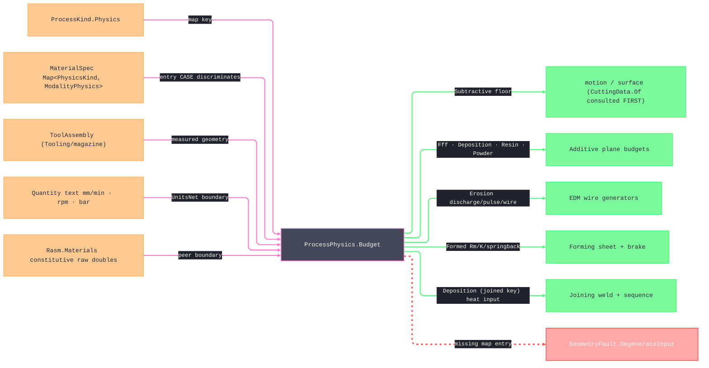

# [RASM_FABRICATION_CUT_PARAMETER]

The process-physics owner separates material family identity from admitted grade data. Each `Material` row carries a catalog baseline, while `MaterialSpec` carries the actual grade, constitutive properties, `PhysicsKind` map, and optional certificate key used for one run. `ProcessPhysics.Budget` selects that runtime map by `ProcessKind.Physics` and returns the matching `ProcessBudget` case.

Subtractive physics requires an operation and equipment matched to the process: rotary cutters for milling and routing, turning inserts for turning, wheels for grinding, and saw blades for sawing. `Tool.Admit` validates the geometry carried by each equipment case before assembly admission. Thermal, abrasive, fused-filament, deposition, joining, and wire-erosion physics require the matching process head. Resin, powder, and forming physics reject equipment and operation carriers because those concepts do not belong to their budget case.

The interior unit regime is explicit machining canonical form: millimetres, millimetres per minute, revolutions per minute, bar, watts, degrees Celsius, microseconds, and megapascals. `UnitsNet` parses boundary text and projects the named accessor for that regime. The page never labels those scalars SI, and a quantity type never crosses into a generator signature.

Wire posture: HOST-LOCAL. `ProcessBudget` cases and `MaterialSpec` cross only in-process seams to the fabrication generators.

## [01]-[INDEX]

- [01]-[CUT_PARAMETER]: `Coating`, `ToolClass`, `Tool`, `FeedLaw`, `Operation`, `ModalityPhysics`, `Material`, `MaterialSpec`, `ProcessBudget`, and the single `ProcessPhysics` projection owner.

## [02]-[CUT_PARAMETER]

- Owner: `Tool` discriminates rotary cutters, turning inserts, grinding wheels, saw blades, and process heads under shared key identity. `ToolClass` gates thermal, abrasive, extrusion, wire-electrode, and deposition heads. `FeedLaw` distinguishes per-tooth, per-revolution, pitch-synchronous, and surface-ratio feed. `Operation` binds the feed law and engagement fractions. `ModalityPhysics` owns constitutive inputs; `MaterialSpec` owns admitted grade data; and `ProcessBudget` owns derived outputs.
- Cases: the seeded equipment catalog covers milling, holemaking, turning, grinding, sawing, laser, plasma, waterjet, fused filament, wire EDM, and deposition. `Operation` covers milling, holemaking, turning, threading, grooving, grinding, sawing, form milling, and engraving. `ModalityPhysics` covers nine constitutive families, while `ProcessBudget` adds a distinct turning case because CSS spindle speed depends on workpiece radius at motion time.
- Entry: `Tool.Admit` owns equipment geometry admission. `ProcessPhysics.Budget(ProcessKind, MaterialSpec, Option<ToolAssembly>, Option<Operation>)` selects the grade map and folds its physics case to `Fin<ProcessBudget>`. Equipment/process mismatches fail through `RelationFault.OperationEquipment`, process/material mismatches fail through `RelationFault.ProcessMaterial`, independent textual key failures accumulate in `Admit`, and quantity entries parse machining-unit text.
- Auto: material admission proves every constitutive scalar finite and physically admitted. Milling, grinding, and sawing derive bounded spindle, feed, engagement, and removal-rate floors. Turning carries surface speed and feed per revolution without inventing a fixed spindle value. Thermal and fused-filament widths floor against admitted hardware diameter, the formed budget sources its tensile strength from the one admitted grade axis, and every other budget carries the exact scalars produced by its constitutive case — every admitted field reaches its budget, none is validated and then discarded.
- Receipt: the `ProcessBudget` case carries only the scalars its physics produces, and `MaterialSpec.Certificate` links the budget inputs to admitted grade evidence.
- Packages: `ProcessKind`, `ProcessModality`, `ToolAssembly`, Thinktecture.Runtime.Extensions, `UnitsNet` named machining-unit accessors, `Rasm.Numerics`, LanguageExt.Core, and BCL inbox.
- Growth: a material family is one `Material` row; a production grade is one admitted `MaterialSpec`; equipment is one `Tool` case value; an operation is one `Operation` row; and a physics family is one `PhysicsKind` row, one input case, one output case, and one total-dispatch arm.
- Boundary: family identity, grade evidence, equipment variant, physics input, and derived budget remain distinct admission and payload-timing regimes. Required equipment and operations fail typed, irrelevant carriers fail typed, and no variant encodes inapplicable fields as zeros.

```csharp signature
// --- [RUNTIME_PRELUDE] ----------------------------------------------------------------------------------------------------------------------------
using System.Globalization;
using LanguageExt;
using LanguageExt.Common;
using Rasm.Fabrication.Tooling;
using Rasm.Numerics;
using Thinktecture;
using UnitsNet;
using static LanguageExt.Prelude;

namespace Rasm.Fabrication.Process;

// --- [TYPES] --------------------------------------------------------------------------------------------------------------------------------------
[SmartEnum<string>]
public sealed partial class Coating {
    public static readonly Coating Uncoated = new("uncoated");
    public static readonly Coating TiN = new("TiN");
    public static readonly Coating TiAlN = new("TiAlN");
    public static readonly Coating Diamond = new("diamond");
}

[SmartEnum<string>]
public sealed partial class ToolClass {
    public static readonly ToolClass Thermal = new("thermal", Set(ProcessModality.Thermal));
    public static readonly ToolClass Abrasive = new("abrasive", Set(ProcessModality.Abrasive));
    public static readonly ToolClass Extrusion = new("extrusion", Set(ProcessModality.Additive));
    public static readonly ToolClass WireElectrode = new("wire-electrode", Set(ProcessModality.Erosion));
    public static readonly ToolClass Deposition = new("deposition", Set(ProcessModality.Additive, ProcessModality.Joined));

    public Set<ProcessModality> Modalities { get; }
    public bool Admits(ProcessModality modality) => Modalities.Contains(modality);
}

[Union(ConversionFromValue = ConversionOperatorsGeneration.None)]
public abstract partial record Tool(string Key) {
    public static readonly Tool Endmill3 = new Rotary("endmill-3mm", 3.0, 2, Coating.TiAlN, 0.2, 30.0, 18.0, 0.005);
    public static readonly Tool Endmill6 = new Rotary("endmill-6mm", 6.0, 3, Coating.TiAlN, 0.5, 35.0, 30.0, 0.008);
    public static readonly Tool Endmill10 = new Rotary("endmill-10mm", 10.0, 4, Coating.TiAlN, 0.8, 38.0, 45.0, 0.010);
    public static readonly Tool Ballnose6 = new Rotary("ballnose-6mm", 6.0, 2, Coating.TiAlN, 3.0, 30.0, 32.0, 0.008);
    public static readonly Tool FaceMill50 = new Rotary("face-mill-50mm", 50.0, 5, Coating.TiAlN, 0.8, 0.0, 45.0, 0.012);
    public static readonly Tool Drill6 = new Rotary("drill-6mm", 6.0, 2, Coating.TiN, 0.0, 28.0, 36.0, 0.012);
    public static readonly Tool Reamer6 = new Rotary("reamer-6mm", 6.0, 6, Coating.TiN, 0.0, 8.0, 40.0, 0.006);
    public static readonly Tool TapM6 = new Rotary("tap-m6", 6.0, 4, Coating.TiN, 0.0, 0.0, 35.0, 0.008);
    public static readonly Tool BoringBar12 = new Rotary("boring-bar-12mm", 12.0, 1, Coating.TiAlN, 0.4, 0.0, 60.0, 0.006);
    public static readonly Tool TurningInsert = new Turning("turning-insert", 0.8, 8.0, 95.0, Coating.TiAlN);
    public static readonly Tool GrindingWheel200 = new Wheel("grinding-wheel-200mm", 200.0, 25.0, grit: 60, maxRpm: 4800.0);
    public static readonly Tool ColdSawBlade300 = new SawBlade("cold-saw-blade-300mm", 300.0, 2.5, teeth: 180, maxRpm: 3600.0);
    public static readonly Tool LaserHead = new Head("laser-head", 0.1, ToolClass.Thermal);
    public static readonly Tool PlasmaTorch = new Head("plasma-torch", 1.5, ToolClass.Thermal);
    public static readonly Tool WaterjetNozzle = new Head("waterjet-nozzle", 0.76, ToolClass.Abrasive);
    public static readonly Tool FffNozzle = new Head("fff-nozzle", 0.4, ToolClass.Extrusion);
    public static readonly Tool EdmWire = new Head("edm-wire-0.25mm", 0.25, ToolClass.WireElectrode);
    public static readonly Tool DepositionHead = new Head("deposition-head", 1.2, ToolClass.Deposition);

    public sealed record Rotary(
        string Key,
        double Diameter,
        int Flutes,
        Coating Coating,
        double CornerRadius,
        double HelixAngle,
        double Stickout,
        double Runout) : Tool(Key);

    public sealed record Wheel(string Key, double Diameter, double Width, int Grit, double MaxRpm) : Tool(Key);
    public sealed record SawBlade(string Key, double Diameter, double Kerf, int Teeth, double MaxRpm) : Tool(Key);
    public sealed record Turning(
        string Key,
        double NoseRadius,
        double CuttingEdgeLength,
        double ApproachAngleDeg,
        Coating Coating) : Tool(Key);
    public sealed record Head(string Key, double Diameter, ToolClass Class) : Tool(Key);

    public static Fin<Tool> Admit(Tool candidate) => candidate.Switch(
        rotary: static tool => tool.Diameter > 0.0 && double.IsFinite(tool.Diameter)
            && tool.Flutes > 0 && double.IsFinite(tool.CornerRadius) && tool.CornerRadius is >= 0.0
            && tool.CornerRadius <= tool.Diameter * 0.5 && double.IsFinite(tool.HelixAngle) && tool.HelixAngle is >= 0.0 and < 90.0
            && double.IsFinite(tool.Stickout) && tool.Stickout > 0.0 && double.IsFinite(tool.Runout) && tool.Runout >= 0.0
                ? Fin.Succ((Tool)tool) : Invalid("rotary"),
        wheel: static tool => tool.Diameter > 0.0 && double.IsFinite(tool.Diameter)
            && tool.Width > 0.0 && double.IsFinite(tool.Width) && tool.Grit > 0
            && tool.MaxRpm > 0.0 && double.IsFinite(tool.MaxRpm)
                ? Fin.Succ((Tool)tool) : Invalid("wheel"),
        sawBlade: static tool => tool.Diameter > 0.0 && double.IsFinite(tool.Diameter)
            && tool.Kerf > 0.0 && double.IsFinite(tool.Kerf) && tool.Teeth > 0
            && tool.MaxRpm > 0.0 && double.IsFinite(tool.MaxRpm)
                ? Fin.Succ((Tool)tool) : Invalid("saw-blade"),
        turning: static tool => tool.NoseRadius >= 0.0 && double.IsFinite(tool.NoseRadius)
            && tool.CuttingEdgeLength > 0.0 && double.IsFinite(tool.CuttingEdgeLength)
            && tool.ApproachAngleDeg > 0.0 && tool.ApproachAngleDeg < 180.0 && double.IsFinite(tool.ApproachAngleDeg)
                ? Fin.Succ((Tool)tool) : Invalid("turning"),
        head: static tool => tool.Diameter > 0.0 && double.IsFinite(tool.Diameter)
            ? Fin.Succ((Tool)tool) : Invalid("head"));

    private static Fin<Tool> Invalid(string kind) =>
        Fin.Fail<Tool>(GeometryFault.DegenerateInput($"tool:{kind}").ToError());
}

[Union(ConversionFromValue = ConversionOperatorsGeneration.None)]
public abstract partial record FeedLaw {
    private FeedLaw() { }

    public sealed record Chip(double PerTooth) : FeedLaw;
    public sealed record PerRevolution(double Millimeters) : FeedLaw;
    public sealed record Pitch(double MillimetersPerRevolution) : FeedLaw;
    public sealed record SurfaceRatio(double Fraction) : FeedLaw;
}

[SmartEnum<string>]
public sealed partial class Operation {
    public static readonly Operation Contour = new("contour", new FeedLaw.Chip(0.05), engagement: 1.0, axial: 1.0);
    public static readonly Operation Pocket = new("pocket", new FeedLaw.Chip(0.04), engagement: 0.5, axial: 0.5);
    public static readonly Operation Slot = new("slot", new FeedLaw.Chip(0.035), engagement: 1.0, axial: 0.5);
    public static readonly Operation Face = new("face", new FeedLaw.Chip(0.08), engagement: 0.7, axial: 0.1);
    public static readonly Operation Drill = new("drill", new FeedLaw.Chip(0.03), engagement: 1.0, axial: 1.0);
    public static readonly Operation Bore = new("bore", new FeedLaw.Chip(0.04), engagement: 0.05, axial: 1.0);
    public static readonly Operation Ream = new("ream", new FeedLaw.Chip(0.08), engagement: 0.02, axial: 1.0);
    public static readonly Operation Tap = new("tap", new FeedLaw.Pitch(1.0), engagement: 1.0, axial: 1.0);
    public static readonly Operation Chamfer = new("chamfer", new FeedLaw.Chip(0.05), engagement: 0.2, axial: 0.1);
    public static readonly Operation Trochoidal = new("trochoidal", new FeedLaw.Chip(0.06), engagement: 0.1, axial: 1.0);
    public static readonly Operation RoughTurn = new("rough-turn", new FeedLaw.PerRevolution(0.2), engagement: 0.5, axial: 0.3);
    public static readonly Operation FinishTurn = new("finish-turn", new FeedLaw.PerRevolution(0.08), engagement: 0.1, axial: 0.1);
    public static readonly Operation Part = new("part", new FeedLaw.PerRevolution(0.06), engagement: 1.0, axial: 0.2);
    public static readonly Operation Groove = new("groove", new FeedLaw.PerRevolution(0.08), engagement: 1.0, axial: 0.3);
    public static readonly Operation Thread = new("thread", new FeedLaw.Pitch(1.5), engagement: 0.3, axial: 0.2);
    public static readonly Operation Counterbore = new("counterbore", new FeedLaw.Chip(0.05), engagement: 0.8, axial: 0.4);
    public static readonly Operation Countersink = new("countersink", new FeedLaw.Chip(0.04), engagement: 0.5, axial: 0.2);
    public static readonly Operation SpotDrill = new("spot-drill", new FeedLaw.Chip(0.03), engagement: 0.5, axial: 0.1);
    public static readonly Operation FormMill = new("form-mill", new FeedLaw.Chip(0.04), engagement: 0.3, axial: 0.2);
    public static readonly Operation Engrave = new("engrave", new FeedLaw.Chip(0.02), engagement: 0.1, axial: 0.05);
    public static readonly Operation SurfaceGrind = new("surface-grind", new FeedLaw.SurfaceRatio(0.01), engagement: 1.0, axial: 0.02);
    public static readonly Operation SawCut = new("saw-cut", new FeedLaw.Chip(0.002), engagement: 1.0, axial: 0.5);

    public FeedLaw Feed { get; }
    public double Engagement { get; }
    public double Axial { get; }
}

// --- [MODELS] -------------------------------------------------------------------------------------------------------------------------------------
[Union(ConversionFromValue = ConversionOperatorsGeneration.None)]
public abstract partial record ModalityPhysics {
    private ModalityPhysics() { }

    public sealed record Subtractive(double SurfaceSpeed) : ModalityPhysics;
    public sealed record Thermal(double KerfWidth, double PierceTime, double AssistPressure, double CutSpeed) : ModalityPhysics;
    public sealed record Abrasive(double JetPressure, double AbrasiveRate, double TraverseSpeed) : ModalityPhysics;
    public sealed record Fff(double MeltTemp, double BondWindow, double ExtrusionWidth, double LayerHeight, double PrintSpeed) : ModalityPhysics;
    public sealed record Deposition(double PowerW, double WireFeedRate, double Standoff, double InterpassTemp) : ModalityPhysics;
    public sealed record Erosion(double DischargeCurrent, double PulseOnUs, double PulseOffUs, double WireFeed) : ModalityPhysics;
    public sealed record Resin(double Exposure, double CureDepth, double LiftHeight) : ModalityPhysics;
    public sealed record Powder(double LaserPower, double HatchSpacing, double ScanSpeed) : ModalityPhysics;
    // Grade tensile strength lives once on MaterialSpec.UltimateStrengthMpa; the forming row carries only process constants.
    public sealed record Forming(double KFactor, double SpringbackRatio, double MinBendRadiusFactor) : ModalityPhysics;
}

[SmartEnum<string>]
public sealed partial class Material {
    public static readonly Material Aluminium = new("aluminium", Map(
        (PhysicsKind.Subtractive, (ModalityPhysics)new ModalityPhysics.Subtractive(300.0)),
        (PhysicsKind.Thermal, new ModalityPhysics.Thermal(KerfWidth: 1.0, PierceTime: 0.3, AssistPressure: 10.0, CutSpeed: 4000.0)),
        (PhysicsKind.Abrasive, new ModalityPhysics.Abrasive(JetPressure: 380.0, AbrasiveRate: 0.45, TraverseSpeed: 250.0)),
        (PhysicsKind.Erosion, new ModalityPhysics.Erosion(DischargeCurrent: 10.0, PulseOnUs: 6.0, PulseOffUs: 10.0, WireFeed: 10.0)),
        (PhysicsKind.Deposition, new ModalityPhysics.Deposition(PowerW: 3200.0, WireFeedRate: 3.2, Standoff: 10.0, InterpassTemp: 120.0)),
        (PhysicsKind.Joining, new ModalityPhysics.Deposition(PowerW: 5200.0, WireFeedRate: 8.5, Standoff: 12.0, InterpassTemp: 120.0)),
        (PhysicsKind.Forming, new ModalityPhysics.Forming(KFactor: 0.43, SpringbackRatio: 0.98, MinBendRadiusFactor: 1.5))));
    public static readonly Material MildSteel = new("mild-steel", Map(
        (PhysicsKind.Subtractive, (ModalityPhysics)new ModalityPhysics.Subtractive(90.0)),
        (PhysicsKind.Thermal, new ModalityPhysics.Thermal(KerfWidth: 1.2, PierceTime: 0.5, AssistPressure: 8.0, CutSpeed: 2000.0)),
        (PhysicsKind.Abrasive, new ModalityPhysics.Abrasive(JetPressure: 380.0, AbrasiveRate: 0.45, TraverseSpeed: 180.0)),
        (PhysicsKind.Erosion, new ModalityPhysics.Erosion(DischargeCurrent: 9.0, PulseOnUs: 5.0, PulseOffUs: 11.0, WireFeed: 9.0)),
        (PhysicsKind.Deposition, new ModalityPhysics.Deposition(PowerW: 2400.0, WireFeedRate: 2.0, Standoff: 10.0, InterpassTemp: 250.0)),
        (PhysicsKind.Joining, new ModalityPhysics.Deposition(PowerW: 8100.0, WireFeedRate: 9.0, Standoff: 15.0, InterpassTemp: 250.0)),
        (PhysicsKind.Forming, new ModalityPhysics.Forming(KFactor: 0.44, SpringbackRatio: 0.99, MinBendRadiusFactor: 1.0))));
    public static readonly Material Stainless = new("stainless", Map(
        (PhysicsKind.Subtractive, (ModalityPhysics)new ModalityPhysics.Subtractive(45.0)),
        (PhysicsKind.Thermal, new ModalityPhysics.Thermal(KerfWidth: 0.9, PierceTime: 0.8, AssistPressure: 14.0, CutSpeed: 1500.0)),
        (PhysicsKind.Abrasive, new ModalityPhysics.Abrasive(JetPressure: 380.0, AbrasiveRate: 0.45, TraverseSpeed: 150.0)),
        (PhysicsKind.Erosion, new ModalityPhysics.Erosion(DischargeCurrent: 8.0, PulseOnUs: 4.0, PulseOffUs: 12.0, WireFeed: 8.0)),
        (PhysicsKind.Deposition, new ModalityPhysics.Deposition(PowerW: 2800.0, WireFeedRate: 2.4, Standoff: 10.0, InterpassTemp: 150.0)),
        (PhysicsKind.Joining, new ModalityPhysics.Deposition(PowerW: 6200.0, WireFeedRate: 7.5, Standoff: 12.0, InterpassTemp: 150.0)),
        (PhysicsKind.Forming, new ModalityPhysics.Forming(KFactor: 0.45, SpringbackRatio: 0.97, MinBendRadiusFactor: 2.0))));
    public static readonly Material Titanium = new("titanium", Map(
        (PhysicsKind.Subtractive, (ModalityPhysics)new ModalityPhysics.Subtractive(35.0)),
        (PhysicsKind.Abrasive, new ModalityPhysics.Abrasive(JetPressure: 400.0, AbrasiveRate: 0.5, TraverseSpeed: 90.0)),
        (PhysicsKind.Erosion, new ModalityPhysics.Erosion(DischargeCurrent: 6.0, PulseOnUs: 3.0, PulseOffUs: 14.0, WireFeed: 6.0)),
        (PhysicsKind.Deposition, new ModalityPhysics.Deposition(PowerW: 2200.0, WireFeedRate: 1.8, Standoff: 9.0, InterpassTemp: 120.0)),
        (PhysicsKind.Joining, new ModalityPhysics.Deposition(PowerW: 4300.0, WireFeedRate: 5.0, Standoff: 10.0, InterpassTemp: 120.0)),
        (PhysicsKind.Forming, new ModalityPhysics.Forming(KFactor: 0.46, SpringbackRatio: 0.93, MinBendRadiusFactor: 3.0))));
    public static readonly Material Acrylic = new("acrylic", Map(
        (PhysicsKind.Subtractive, (ModalityPhysics)new ModalityPhysics.Subtractive(500.0)),
        (PhysicsKind.Thermal, new ModalityPhysics.Thermal(KerfWidth: 0.2, PierceTime: 0.05, AssistPressure: 0.5, CutSpeed: 12000.0))));
    public static readonly Material Plywood = new("plywood", Map(
        (PhysicsKind.Subtractive, (ModalityPhysics)new ModalityPhysics.Subtractive(600.0)),
        (PhysicsKind.Thermal, new ModalityPhysics.Thermal(KerfWidth: 0.3, PierceTime: 0.1, AssistPressure: 0.6, CutSpeed: 8000.0))));
    public static readonly Material PlaFilament = new("pla-filament", Map(
        (PhysicsKind.Fff, (ModalityPhysics)new ModalityPhysics.Fff(MeltTemp: 210.0, BondWindow: 15.0, ExtrusionWidth: 0.45, LayerHeight: 0.2, PrintSpeed: 60.0))));
    public static readonly Material PhotopolymerResin = new("photopolymer-resin", Map(
        (PhysicsKind.Resin, (ModalityPhysics)new ModalityPhysics.Resin(Exposure: 2.5, CureDepth: 0.1, LiftHeight: 5.0))));
    public static readonly Material Ss316Powder = new("ss316-powder", Map(
        (PhysicsKind.Powder, (ModalityPhysics)new ModalityPhysics.Powder(LaserPower: 200.0, HatchSpacing: 0.12, ScanSpeed: 900.0))));

    public Map<PhysicsKind, ModalityPhysics> Physics { get; }
}

public sealed record MaterialSpec {
    private MaterialSpec(
        Material family,
        string grade,
        double densityKgM3,
        double conductivityWMK,
        double specificHeatJKgK,
        double yieldStrengthMpa,
        double ultimateStrengthMpa,
        Map<PhysicsKind, ModalityPhysics> physics,
        Option<ContentKey> certificate) =>
        (Family, Grade, DensityKgM3, ConductivityWMK, SpecificHeatJKgK, YieldStrengthMpa, UltimateStrengthMpa, Physics, Certificate) =
        (family, grade, densityKgM3, conductivityWMK, specificHeatJKgK, yieldStrengthMpa, ultimateStrengthMpa, physics, certificate);

    public Material Family { get; }
    public string Grade { get; }
    public double DensityKgM3 { get; }
    public double ConductivityWMK { get; }
    public double SpecificHeatJKgK { get; }
    public double YieldStrengthMpa { get; }
    public double UltimateStrengthMpa { get; }
    public Map<PhysicsKind, ModalityPhysics> Physics { get; }
    public Option<ContentKey> Certificate { get; }

    public static Fin<MaterialSpec> Admit(
        Material family,
        string grade,
        double densityKgM3,
        double conductivityWMK,
        double specificHeatJKgK,
        double yieldStrengthMpa,
        double ultimateStrengthMpa,
        Map<PhysicsKind, ModalityPhysics> physics,
        Option<ContentKey> certificate) =>
        !string.IsNullOrWhiteSpace(grade)
        && double.IsFinite(densityKgM3) && densityKgM3 > 0.0
        && double.IsFinite(conductivityWMK) && conductivityWMK > 0.0
        && double.IsFinite(specificHeatJKgK) && specificHeatJKgK > 0.0
        && double.IsFinite(yieldStrengthMpa) && yieldStrengthMpa > 0.0
        && double.IsFinite(ultimateStrengthMpa) && ultimateStrengthMpa >= yieldStrengthMpa
        && !physics.IsEmpty
        && physics.AsIterable().ForAll(static pair => Fits(pair.Key, pair.Value))
            ? Fin.Succ(new MaterialSpec(family, grade, densityKgM3, conductivityWMK, specificHeatJKgK, yieldStrengthMpa, ultimateStrengthMpa, physics, certificate))
            : Fin.Fail<MaterialSpec>(GeometryFault.DegenerateInput("material-spec").ToError());

    private static bool Fits(PhysicsKind kind, ModalityPhysics physics) =>
        physics.Switch(
            state: kind,
            subtractive: static (k, row) => k == PhysicsKind.Subtractive
                && double.IsFinite(row.SurfaceSpeed) && row.SurfaceSpeed > 0.0,
            thermal: static (k, row) => k == PhysicsKind.Thermal
                && double.IsFinite(row.KerfWidth) && row.KerfWidth > 0.0
                && double.IsFinite(row.PierceTime) && row.PierceTime >= 0.0
                && double.IsFinite(row.AssistPressure) && row.AssistPressure >= 0.0
                && double.IsFinite(row.CutSpeed) && row.CutSpeed > 0.0,
            abrasive: static (k, row) => k == PhysicsKind.Abrasive
                && double.IsFinite(row.JetPressure) && row.JetPressure > 0.0
                && double.IsFinite(row.AbrasiveRate) && row.AbrasiveRate > 0.0
                && double.IsFinite(row.TraverseSpeed) && row.TraverseSpeed > 0.0,
            fff: static (k, row) => k == PhysicsKind.Fff
                && double.IsFinite(row.MeltTemp) && row.MeltTemp > 0.0
                && double.IsFinite(row.BondWindow) && row.BondWindow > 0.0
                && double.IsFinite(row.ExtrusionWidth) && row.ExtrusionWidth > 0.0
                && double.IsFinite(row.LayerHeight) && row.LayerHeight > 0.0 && row.LayerHeight <= row.ExtrusionWidth
                && double.IsFinite(row.PrintSpeed) && row.PrintSpeed > 0.0,
            deposition: static (k, row) => (k == PhysicsKind.Deposition || k == PhysicsKind.Joining)
                && double.IsFinite(row.PowerW) && row.PowerW > 0.0
                && double.IsFinite(row.WireFeedRate) && row.WireFeedRate > 0.0
                && double.IsFinite(row.Standoff) && row.Standoff > 0.0
                && double.IsFinite(row.InterpassTemp) && row.InterpassTemp > 0.0,
            erosion: static (k, row) => k == PhysicsKind.Erosion
                && double.IsFinite(row.DischargeCurrent) && row.DischargeCurrent > 0.0
                && double.IsFinite(row.PulseOnUs) && row.PulseOnUs > 0.0
                && double.IsFinite(row.PulseOffUs) && row.PulseOffUs >= 0.0
                && double.IsFinite(row.WireFeed) && row.WireFeed > 0.0,
            resin: static (k, row) => k == PhysicsKind.Resin
                && double.IsFinite(row.Exposure) && row.Exposure > 0.0
                && double.IsFinite(row.CureDepth) && row.CureDepth > 0.0
                && double.IsFinite(row.LiftHeight) && row.LiftHeight > 0.0,
            powder: static (k, row) => k == PhysicsKind.Powder
                && double.IsFinite(row.LaserPower) && row.LaserPower > 0.0
                && double.IsFinite(row.HatchSpacing) && row.HatchSpacing > 0.0
                && double.IsFinite(row.ScanSpeed) && row.ScanSpeed > 0.0,
            forming: static (k, row) => k == PhysicsKind.Forming
                && double.IsFinite(row.KFactor) && row.KFactor is > 0.0 and < 1.0
                && double.IsFinite(row.SpringbackRatio) && row.SpringbackRatio is > 0.0 and <= 2.0
                && double.IsFinite(row.MinBendRadiusFactor) && row.MinBendRadiusFactor > 0.0);
}

[Union(ConversionFromValue = ConversionOperatorsGeneration.None)]
public abstract partial record ProcessBudget {
    private ProcessBudget() { }

    public sealed record Subtractive(double SpindleRpm, double FeedRate, double DepthOfCut, double WidthOfCut, double MaterialRemovalRate) : ProcessBudget;
    public sealed record Turning(double SurfaceSpeed, double FeedPerRevolution, double DepthOfCut, double NoseRadius) : ProcessBudget;
    public sealed record Thermal(double PierceTime, double KerfWidth, double CutSpeed, double AssistPressure) : ProcessBudget;
    public sealed record Abrasive(double JetPressure, double AbrasiveRate, double TraverseSpeed) : ProcessBudget;
    public sealed record Fff(double ExtrusionWidth, double LayerHeight, double PrintSpeed, double MeltTemp, double BondWindow) : ProcessBudget;
    public sealed record Deposition(double PowerW, double WireFeedRate, double Standoff, double InterpassTemp) : ProcessBudget;
    public sealed record Erosion(double DischargeCurrent, double PulseOnUs, double PulseOffUs, double WireFeed) : ProcessBudget;
    public sealed record Resin(double Exposure, double CureDepth, double LiftHeight) : ProcessBudget;
    public sealed record Powder(double LaserPower, double HatchSpacing, double ScanSpeed) : ProcessBudget;
    // The FORM budget: TensileRm is the admitted grade's UltimateStrengthMpa — the one strength axis; brake computes
    // F=(C·Rm·S²·L)/(V·1000) from it, and sheet computes BA=(π/180)·A·(R+K·T) from KFactor.
    public sealed record Formed(double TensileRm, double KFactor, double SpringbackRatio, double MinBendRadiusFactor) : ProcessBudget;
}

// --- [OPERATIONS] ---------------------------------------------------------------------------------------------------------------------------------
public static class ProcessPhysics {
    public static Fin<ProcessBudget> Budget(
        ProcessKind process,
        MaterialSpec material,
        Option<ToolAssembly> tool,
        Option<Operation> operation) =>
        from physics in material.Physics.Find(process.Physics)
            .ToFin(FabricationFault.InadmissiblePair(new RelationFault.ProcessMaterial(process, material.Family)).ToError())
        from budget in physics.Switch(
            state: (Process: process, Material: material, Tool: tool, Operation: operation),
            subtractive: static (s, sub) =>
                from mounted in s.Tool.ToFin(GeometryFault.DegenerateInput("process-physics:subtractive-tool").ToError())
                from op in s.Operation.ToFin(GeometryFault.DegenerateInput("process-physics:subtractive-operation").ToError())
                from floor in SubtractiveFloor(s.Process, sub, mounted.Tool, op)
                select floor,
            thermal: static (s, th) =>
                from head in AdmitHead(s.Tool, ToolClass.Thermal, "process-physics:thermal-head")
                from _ in RequireAbsent(s.Operation, "process-physics:thermal-operation")
                select (ProcessBudget)new ProcessBudget.Thermal(
                    th.PierceTime, Math.Max(th.KerfWidth, head.Diameter), th.CutSpeed, th.AssistPressure),
            abrasive: static (s, ab) =>
                from _ in AdmitHead(s.Tool, ToolClass.Abrasive, "process-physics:abrasive-head")
                from __ in RequireAbsent(s.Operation, "process-physics:abrasive-operation")
                select (ProcessBudget)new ProcessBudget.Abrasive(ab.JetPressure, ab.AbrasiveRate, ab.TraverseSpeed),
            fff: static (s, f) =>
                from head in AdmitHead(s.Tool, ToolClass.Extrusion, "process-physics:fff-head")
                from _ in RequireAbsent(s.Operation, "process-physics:fff-operation")
                select (ProcessBudget)new ProcessBudget.Fff(
                    Math.Max(f.ExtrusionWidth, head.Diameter), f.LayerHeight, f.PrintSpeed, f.MeltTemp, f.BondWindow),
            deposition: static (s, d) =>
                from _ in AdmitHead(s.Tool, ToolClass.Deposition, "process-physics:deposition-head")
                from __ in RequireAbsent(s.Operation, "process-physics:deposition-operation")
                select (ProcessBudget)new ProcessBudget.Deposition(d.PowerW, d.WireFeedRate, d.Standoff, d.InterpassTemp),
            erosion: static (s, e) =>
                from _ in AdmitHead(s.Tool, ToolClass.WireElectrode, "process-physics:erosion-wire")
                from __ in RequireAbsent(s.Operation, "process-physics:erosion-operation")
                select (ProcessBudget)new ProcessBudget.Erosion(e.DischargeCurrent, e.PulseOnUs, e.PulseOffUs, e.WireFeed),
            resin: static (s, r) =>
                from _ in RequireAbsent(s.Tool, "process-physics:resin-tool")
                from __ in RequireAbsent(s.Operation, "process-physics:resin-operation")
                select (ProcessBudget)new ProcessBudget.Resin(r.Exposure, r.CureDepth, r.LiftHeight),
            powder: static (s, p) =>
                from _ in RequireAbsent(s.Tool, "process-physics:powder-tool")
                from __ in RequireAbsent(s.Operation, "process-physics:powder-operation")
                select (ProcessBudget)new ProcessBudget.Powder(p.LaserPower, p.HatchSpacing, p.ScanSpeed),
            forming: static (s, fo) =>
                from _ in RequireAbsent(s.Tool, "process-physics:forming-tool")
                from __ in RequireAbsent(s.Operation, "process-physics:forming-operation")
                select (ProcessBudget)new ProcessBudget.Formed(
                    s.Material.UltimateStrengthMpa, fo.KFactor, fo.SpringbackRatio, fo.MinBendRadiusFactor))
        select budget;

    private static Fin<ProcessBudget> SubtractiveFloor(
        ProcessKind process,
        ModalityPhysics.Subtractive sub,
        Tool tool,
        Operation operation) =>
        tool.Switch(
            state: (Process: process, Sub: sub, Operation: operation, Tool: tool),
            rotary: static (s, cutter) => s.Process != ProcessKind.Grind && s.Process != ProcessKind.Saw
                && s.Process != ProcessKind.Turn
                ? RotaryFloor(s.Sub, cutter, s.Operation)
                : InvalidSubtractive(s.Operation, s.Tool),
            wheel: static (s, wheel) => s.Process == ProcessKind.Grind
                ? WheelFloor(s.Sub, wheel, s.Operation)
                : InvalidSubtractive(s.Operation, s.Tool),
            sawBlade: static (s, blade) => s.Process == ProcessKind.Saw
                ? SawFloor(s.Sub, blade, s.Operation)
                : InvalidSubtractive(s.Operation, s.Tool),
            turning: static (s, insert) => s.Process == ProcessKind.Turn
                ? TurningFloor(s.Sub, insert, s.Operation)
                : InvalidSubtractive(s.Operation, s.Tool),
            head: static (s, _) => InvalidSubtractive(s.Operation, s.Tool));

    private static Fin<ProcessBudget> RotaryFloor(ModalityPhysics.Subtractive sub, Tool.Rotary tool, Operation operation) {
        double spindle = sub.SurfaceSpeed * 1000.0 / (Math.PI * tool.Diameter);
        return operation.Feed.Switch(
            state: (Spindle: spindle, Tool: tool, Operation: operation),
            chip: static (s, chip) => Budget(s.Spindle, s.Spindle * s.Tool.Flutes * chip.PerTooth,
                s.Operation.Axial * s.Tool.Diameter, s.Operation.Engagement * s.Tool.Diameter),
            perRevolution: static (s, _) => InvalidSubtractive(s.Operation, s.Tool),
            pitch: static (s, pitch) => Budget(s.Spindle, s.Spindle * pitch.MillimetersPerRevolution,
                s.Operation.Axial * s.Tool.Diameter, s.Operation.Engagement * s.Tool.Diameter),
            surfaceRatio: static (s, _) => InvalidSubtractive(s.Operation, s.Tool));
    }

    private static Fin<ProcessBudget> WheelFloor(ModalityPhysics.Subtractive sub, Tool.Wheel tool, Operation operation) =>
        operation.Feed.Switch(
            state: (Sub: sub, Tool: tool, Operation: operation),
            chip: static (s, _) => InvalidSubtractive(s.Operation, s.Tool),
            perRevolution: static (s, _) => InvalidSubtractive(s.Operation, s.Tool),
            pitch: static (s, _) => InvalidSubtractive(s.Operation, s.Tool),
            surfaceRatio: static (s, ratio) => Budget(
                Math.Min(s.Sub.SurfaceSpeed * 1000.0 / (Math.PI * s.Tool.Diameter), s.Tool.MaxRpm),
                s.Sub.SurfaceSpeed * 1000.0 * ratio.Fraction,
                s.Operation.Axial * s.Tool.Width,
                s.Operation.Engagement * s.Tool.Width));

    private static Fin<ProcessBudget> SawFloor(ModalityPhysics.Subtractive sub, Tool.SawBlade tool, Operation operation) =>
        operation.Feed.Switch(
            state: (Sub: sub, Tool: tool, Operation: operation),
            chip: static (s, chip) => {
                double spindle = Math.Min(s.Sub.SurfaceSpeed * 1000.0 / (Math.PI * s.Tool.Diameter), s.Tool.MaxRpm);
                return Budget(spindle, spindle * s.Tool.Teeth * chip.PerTooth,
                    s.Operation.Axial * s.Tool.Diameter, s.Tool.Kerf);
            },
            perRevolution: static (s, _) => InvalidSubtractive(s.Operation, s.Tool),
            pitch: static (s, _) => InvalidSubtractive(s.Operation, s.Tool),
            surfaceRatio: static (s, _) => InvalidSubtractive(s.Operation, s.Tool));

    private static Fin<ProcessBudget> TurningFloor(
        ModalityPhysics.Subtractive sub,
        Tool.Turning tool,
        Operation operation) =>
        operation.Feed.Switch(
            state: (Sub: sub, Tool: tool, Operation: operation),
            chip: static (s, _) => InvalidSubtractive(s.Operation, s.Tool),
            perRevolution: static (s, feed) => Fin.Succ<ProcessBudget>(new ProcessBudget.Turning(
                s.Sub.SurfaceSpeed, feed.Millimeters, s.Operation.Axial * s.Tool.CuttingEdgeLength, s.Tool.NoseRadius)),
            pitch: static (s, pitch) => Fin.Succ<ProcessBudget>(new ProcessBudget.Turning(
                s.Sub.SurfaceSpeed, pitch.MillimetersPerRevolution, s.Operation.Axial * s.Tool.CuttingEdgeLength, s.Tool.NoseRadius)),
            surfaceRatio: static (s, _) => InvalidSubtractive(s.Operation, s.Tool));

    private static Fin<ProcessBudget> Budget(double spindle, double feed, double depth, double width) =>
        Fin.Succ<ProcessBudget>(new ProcessBudget.Subtractive(spindle, feed, depth, width, depth * width * feed));

    private static Fin<ProcessBudget> InvalidSubtractive(Operation operation, Tool equipment) =>
        Fin.Fail<ProcessBudget>(FabricationFault.InadmissiblePair(
            new RelationFault.OperationEquipment(operation, equipment)).ToError());

    private static Fin<Tool.Head> AdmitHead(Option<ToolAssembly> tool, ToolClass required, string locus) =>
        tool.ToFin(GeometryFault.DegenerateInput(locus).ToError())
            .Bind(assembly => assembly.Tool is Tool.Head head && head.Class == required
                ? Fin.Succ(head)
                : Fin.Fail<Tool.Head>(GeometryFault.DegenerateInput(locus).ToError()));

    private static Fin<Unit> RequireAbsent<T>(Option<T> value, string locus) =>
        value.IsNone
            ? Fin.Succ(unit)
            : Fin.Fail<Unit>(GeometryFault.DegenerateInput(locus).ToError());

    // --- [BOUNDARIES] -------------------------------------------------------------------------------------------------------------------------------
    public static Fin<(ProcessKind Process, Material Material, Operation Operation)> Admit(string process, string material, string operation) =>
        (ProcessFamily.Admit<ProcessKind>(process).ToValidation(),
         ProcessFamily.Admit<Material>(material).ToValidation(),
         ProcessFamily.Admit<Operation>(operation).ToValidation())
            .Apply(static (p, m, o) => (Process: p, Material: m, Operation: o)).As().ToFin();

    public static Fin<double> Feed(string text) =>
        Speed.TryParse(text, CultureInfo.InvariantCulture, out Speed feed)
            ? Fin.Succ(feed.MillimetersPerMinutes)
            : Fin.Fail<double>(GeometryFault.DegenerateInput("process-physics:feed").ToError());

    public static Fin<double> Spindle(string text) =>
        RotationalSpeed.TryParse(text, CultureInfo.InvariantCulture, out RotationalSpeed rpm)
            ? Fin.Succ(rpm.RevolutionsPerMinute)
            : Fin.Fail<double>(GeometryFault.DegenerateInput("process-physics:spindle").ToError());

    public static Fin<double> Depth(string text) =>
        Length.TryParse(text, CultureInfo.InvariantCulture, out Length depth)
            ? Fin.Succ(depth.Millimeters)
            : Fin.Fail<double>(GeometryFault.DegenerateInput("process-physics:depth").ToError());

    public static Fin<double> Assist(string text) =>
        Pressure.TryParse(text, CultureInfo.InvariantCulture, out Pressure pressure)
            ? Fin.Succ(pressure.Bars)
            : Fin.Fail<double>(GeometryFault.DegenerateInput("process-physics:assist").ToError());
}
```


