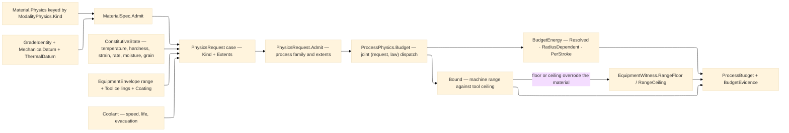

# [RASM_FABRICATION_CUT_PARAMETER]

`ProcessPhysics` admits one case-shaped request, resolves the material-family baseline with grade overrides, evaluates state-dependent constitutive laws, and returns one `ProcessBudget` case. `Material` owns family identity and baseline physics; `MaterialSpec` owns grade evidence, structural and thermal properties, overrides, and certificate identity.

`PhysicsRequest` makes evidence structural: subtractive work carries equipment, operation, and coolant; beam, jet, extrusion, deposition, joining, and erosion carry compatible equipment; resin, powder, and forming carry no irrelevant slot. Each case declares `Kind` and `Extents`, so one admission proves family agreement and positive magnitudes.

`Material.Physics` keys on each law's own `Kind`, so a family cannot declare one physics case and carry another. Budget dispatch reads request and law as one discriminant.

`Tool.Admit` proves equipment geometry. `Coating` scales speed and wear; tool ceilings cap spindle and depth; stickout and shank modulus yield deflection and stability; runout raises edge load; helix resolves axial force; approach angle sets turning chip thickness; grit scales grinding energy. `CoolantResponse` maps delivery to speed, life, and evacuation factors.

`ConstitutiveLaw` evaluates temperature, hardness, strain, rate, moisture, and grain response through `MathNet.Numerics`. `BudgetEnergy` resolves traversal to joules and seconds, forming per stroke, and constant-surface-speed turning to `RadiusDependent` power, speed, and feed.

`UnitsNet` admits quantities and duration once and composes power-duration energy. Interior numerics use canonical machining units.

Wire posture: HOST-LOCAL. `ProcessBudget` cases and `MaterialSpec` cross only in-process seams to the fabrication generators.

## [01]-[INDEX]

- [01]-[CUT_PARAMETER]: `Coating`, `CoolantResponse`, `ProcessRange`, `RangeReceipt`, `EquipmentEnvelope`, `ToolClass`, `Tool`, `FeedLaw`, `Operation`, `ResponseAxis`, `ResponseInterpolation`, `ConstitutiveState`, `ResponseCurve`, `ConstitutiveLaw`, `ModalityPhysics`, `Material`, `CertificateClass`, `TemperState`, `MechanicalDatum`, `ThermalDatum`, `GradeIdentity`, `MaterialSpec`, `PhysicsRequest`, `BudgetEnergy`, `BudgetEvidence`, `ProcessBudget`, `PhysicsQuantity`, `PhysicsIngress`, `PhysicsAdmission`, and `ProcessPhysics`.

## [02]-[CUT_PARAMETER]

- Owner: `Tool`, `Operation`, and `Coating` own bounded equipment and feed vocabularies; `CoolantResponse` owns the cutting response of the Process-family `CoolantDelivery` medium; `ConstitutiveLaw` owns state response; `ModalityPhysics` owns family baselines and its own `PhysicsKind`; `MechanicalDatum`, `ThermalDatum`, and `GradeIdentity` own the grade datum `MaterialSpec` composes with family overrides; `PhysicsRequest` owns exact runtime evidence; `BudgetEnergy` owns clock closure; and `ProcessBudget` owns derived limits.
- Cases: `ModalityPhysics` and `ProcessBudget` distinguish subtractive, thermal, abrasive, fused-filament, deposition, joining, erosion, resin, powder, and forming physics. `ProcessBudget.Turning` remains distinct because constant-surface-speed RPM resolves against workpiece radius at motion time, and `BudgetEnergy.RadiusDependent` carries that unclosed clock as a typed case rather than an absent value.
- Entry: `ProcessPhysics.Budget(PhysicsRequest)` is the one runtime fold. `ProcessPhysics.Admit(PhysicsIngress)` is the one textual boundary; its union case selects key or quantity admission without parallel entrypoints.
- Auto: `MaterialSpec.Admit` proves every grade-override key equals its law's own kind before overlaying family baselines, and a traceable `CertificateClass` forces heat identity and certificate key present. Budget derivation evaluates constitutive response once per state, resolves current before nominal before derived equipment settings, bounds each selection against the equipment range and tool ceiling, rejects contradictory floors, records each applied clamp, admits every mounted head through `Tool.Admit`, rejects spent equipment, and derives radial chip thinning, deflection, chatter-free depth, heat input, and volumetric energy density from the admitted columns.
- Receipt: every `ProcessBudget` case carries process-specific outputs with `BudgetEvidence`, which records evaluated material state, power, the `BudgetEnergy` closure, the admitted grade, the tool identity, and every `RangeReceipt` with its admitted range, derived value, resolved value, and clamp witnesses.
- Packages: `ProcessKind`, `PhysicsKind`, `EquipmentEnvelope`, `FabricationFault`, Thinktecture.Runtime.Extensions, `UnitsNet`, `MathNet.Numerics`, LanguageExt.Core, and BCL inbox compose directly.
- Growth: a production grade is one `MaterialSpec`; a family is one `Material` row; constitutive variation is `ConstitutiveLaw` data; a delivery medium is one `CoolantResponse` table row against the family `CoolantDelivery` vocabulary; a response dimension is one `ResponseAxis` row with one `ConstitutiveState` column; and a new physics family is one `PhysicsKind` row, one input case, one law case, one budget case, and one joint-pattern arm.
- Boundary: family identity, grade evidence, equipment variant, physics input, and budget remain distinct timing regimes. No union case carries an inapplicable optional field, and every admitted equipment and constitutive column reaches a calculation or a receipt. Equipment, quantity, and grade rejections lower onto `FabricationFault.EquipmentInadmissible`; `GeometryFault` covers degenerate geometry alone.

```csharp signature
// --- [RUNTIME_PRELUDE] ----------------------------------------------------------------------------------------------------------------------------
using System.Globalization;
using LanguageExt;
using LanguageExt.Common;
using MathNet.Numerics.Interpolation;
using Thinktecture;
using UnitsNet;
using static LanguageExt.Prelude;

namespace Rasm.Fabrication.Process;

// --- [TYPES] --------------------------------------------------------------------------------------------------------------------------------------
[SmartEnum<string>]
public sealed partial class Coating {
    public static readonly Coating Uncoated = new("uncoated", speedFactor: 1.00, wearFactor: 1.00, interfaceC: 550.0);
    public static readonly Coating TiN = new("TiN", speedFactor: 1.25, wearFactor: 0.70, interfaceC: 600.0);
    public static readonly Coating TiCN = new("TiCN", speedFactor: 1.35, wearFactor: 0.60, interfaceC: 400.0);
    public static readonly Coating TiAlN = new("TiAlN", speedFactor: 1.60, wearFactor: 0.45, interfaceC: 900.0);
    public static readonly Coating AlCrN = new("AlCrN", speedFactor: 1.70, wearFactor: 0.40, interfaceC: 1100.0);
    public static readonly Coating Diamond = new("diamond", speedFactor: 2.40, wearFactor: 0.15, interfaceC: 700.0);
    public static readonly Coating CBN = new("cBN", speedFactor: 2.00, wearFactor: 0.20, interfaceC: 1200.0);

    public double SpeedFactor { get; }
    public double WearFactor { get; }
    public double InterfaceC { get; }
}

[ComplexValueObject]
public sealed partial class CoolantResponse {
    public double SpeedFactor { get; }
    public double LifeFactor { get; }
    public double Evacuation { get; }

    // CoolantDelivery is the Process family vocabulary; its pressure, temperature, and concentration columns
    // identify the medium, and this table states what that medium does to the cut.
    private static readonly Map<CoolantDelivery, CoolantResponse> Table = Map(
        (CoolantDelivery.Dry, Create(0.70, 0.55, 0.30)),
        (CoolantDelivery.Flood, Create(1.00, 1.00, 0.85)),
        (CoolantDelivery.Mist, Create(0.95, 0.90, 0.70)),
        (CoolantDelivery.MinimumQuantity, Create(0.98, 0.95, 0.65)),
        (CoolantDelivery.ThroughTool, Create(1.15, 1.35, 1.00)),
        (CoolantDelivery.HighPressure, Create(1.30, 1.60, 1.00)),
        (CoolantDelivery.Cryogenic, Create(1.45, 2.10, 0.90)));

    public static CoolantResponse For(CoolantDelivery delivery) =>
        Table.Find(delivery).IfNone(() => Create(1.0, 1.0, 1.0));

    [BoundaryAdapter]
    static partial void ValidateFactoryArguments(
        ref ValidationError? validationError,
        ref double speedFactor,
        ref double lifeFactor,
        ref double evacuation) {
        if (Seq(speedFactor, lifeFactor).Exists(static value => !double.IsFinite(value) || value <= 0.0)
            || !double.IsFinite(evacuation) || evacuation is <= 0.0 or > 1.0)
            validationError = new ValidationError("coolant-response");
    }
}

[ComplexValueObject]
public readonly partial struct ProcessRange {
    public Option<double> Minimum { get; }
    public Option<double> Maximum { get; }
    public Option<double> Nominal { get; }
    public Option<double> Current { get; }

    public double Resolve(double derived) => Current.IsSome
        ? Current.IfNone(derived)
        : Nominal.IfNone(derived);

    static partial void ValidateFactoryArguments(ref ValidationError? validationError, ref Option<double> minimum,
        ref Option<double> maximum, ref Option<double> nominal, ref Option<double> current) {
        Seq<double> values = minimum.ToSeq().Concat(maximum).Concat(nominal).Concat(current);
        validationError = values.Exists(static value => !double.IsFinite(value) || value < 0.0)
            || (minimum, maximum).Apply(static (lo, hi) => lo > hi).IfNone(false)
            ? new ValidationError(message: "process-range") : null;
    }
}

public sealed record RangeReceipt(
    PhysicsQuantity Bound,
    ProcessRange Range,
    double Derived,
    double Resolved,
    Arr<EquipmentWitness> Clamped);

public sealed record EquipmentEnvelope(
    Tool Tool,
    UInt128 Identity,
    ProcessRange Feed,
    ProcessRange Spindle,
    bool Spent);

[SmartEnum<string>]
public sealed partial class ToolClass {
    public static readonly ToolClass Thermal = new("thermal", Set(PhysicsKind.Thermal));
    public static readonly ToolClass Abrasive = new("abrasive", Set(PhysicsKind.Abrasive));
    public static readonly ToolClass Extrusion = new("extrusion", Set(PhysicsKind.Fff));
    public static readonly ToolClass WireElectrode = new("wire-electrode", Set(PhysicsKind.Erosion));
    public static readonly ToolClass Deposition = new("deposition", Set(PhysicsKind.Deposition, PhysicsKind.Joining));

    public Set<PhysicsKind> Physics { get; }
    public bool Admits(PhysicsKind physics) => Physics.Contains(physics);
}

[Union(ConversionFromValue = ConversionOperatorsGeneration.None)]
public abstract partial record Tool(string Key) {
    public static readonly Tool Endmill3 = new Rotary("endmill-3mm", 3.0, 2, Coating.TiAlN, 0.2, 30.0, 18.0, 0.005, 6.0, 24_000.0, 600_000.0);
    public static readonly Tool Endmill6 = new Rotary("endmill-6mm", 6.0, 3, Coating.TiAlN, 0.5, 35.0, 30.0, 0.008, 12.0, 18_000.0, 600_000.0);
    public static readonly Tool Endmill10 = new Rotary("endmill-10mm", 10.0, 4, Coating.TiAlN, 0.8, 38.0, 45.0, 0.010, 20.0, 15_000.0, 600_000.0);
    public static readonly Tool Ballnose6 = new Rotary("ballnose-6mm", 6.0, 2, Coating.TiAlN, 3.0, 30.0, 32.0, 0.008, 3.0, 20_000.0, 600_000.0);
    public static readonly Tool FaceMill50 = new Rotary("face-mill-50mm", 50.0, 5, Coating.AlCrN, 0.8, 0.0, 45.0, 0.012, 6.0, 4_800.0, 210_000.0);
    public static readonly Tool Drill6 = new Rotary("drill-6mm", 6.0, 2, Coating.TiN, 0.0, 28.0, 36.0, 0.012, 30.0, 9_000.0, 600_000.0);
    public static readonly Tool Reamer6 = new Rotary("reamer-6mm", 6.0, 6, Coating.TiN, 0.0, 8.0, 40.0, 0.006, 30.0, 3_000.0, 210_000.0);
    public static readonly Tool TapM6 = new Rotary("tap-m6", 6.0, 4, Coating.TiN, 0.0, 0.0, 35.0, 0.008, 24.0, 1_200.0, 210_000.0);
    public static readonly Tool BoringBar12 = new Rotary("boring-bar-12mm", 12.0, 1, Coating.CBN, 0.4, 0.0, 60.0, 0.006, 1.0, 6_000.0, 600_000.0);
    public static readonly Tool TurningInsert = new Turning("turning-insert", 0.8, 8.0, 95.0, Coating.TiAlN, 6.0);
    public static readonly Tool GrindingWheel200 = new Wheel("grinding-wheel-200mm", 200.0, 25.0, grit: 60, maxRpm: 4800.0);
    public static readonly Tool ColdSawBlade300 = new SawBlade("cold-saw-blade-300mm", 300.0, 2.5, teeth: 180, maxRpm: 3600.0);
    public static readonly Tool LaserHead = new Head("laser-head", 0.1, ToolClass.Thermal);
    public static readonly Tool PlasmaTorch = new Head("plasma-torch", 1.5, ToolClass.Thermal);
    public static readonly Tool WaterjetNozzle = new Head("waterjet-nozzle", 0.76, ToolClass.Abrasive);
    public static readonly Tool FffNozzle = new Head("fff-nozzle", 0.4, ToolClass.Extrusion);
    public static readonly Tool EdmWire = new Head("edm-wire-0.25mm", 0.25, ToolClass.WireElectrode);
    public static readonly Tool DepositionHead = new Head("deposition-head", 1.2, ToolClass.Deposition);

    public sealed record Rotary(
        string Key,
        double Diameter,
        int Flutes,
        Coating Coating,
        double CornerRadius,
        double HelixAngle,
        double Stickout,
        double Runout,
        double MaxDepthOfCut,
        double MaxRpm,
        double ShankModulusMpa) : Tool(Key) {
        public override Coating Surface => Coating;
        public override double SpindleCeiling => MaxRpm;
        public override double DepthCeiling => MaxDepthOfCut;
        // Slenderness cubed is the cantilever-stiffness term the chatter ceiling scales on.
        public double Slenderness => Stickout / Diameter;
    }

    public sealed record Wheel(string Key, double Diameter, double Width, int Grit, double MaxRpm) : Tool(Key) {
        public override double SpindleCeiling => MaxRpm;
        public override double DepthCeiling => Width;
        // Finer grit removes less per grain, so specific energy rises with grit number.
        public double SpecificEnergyFactor => Math.Sqrt(Grit / 60.0);
    }

    public sealed record SawBlade(string Key, double Diameter, double Kerf, int Teeth, double MaxRpm) : Tool(Key) {
        public override double SpindleCeiling => MaxRpm;
        public override double DepthCeiling => Diameter * 0.4;
    }

    public sealed record Turning(
        string Key,
        double NoseRadius,
        double CuttingEdgeLength,
        double ApproachAngleDeg,
        Coating Coating,
        double MaxDepthOfCut) : Tool(Key) {
        public override Coating Surface => Coating;
        public override double DepthCeiling => Math.Min(MaxDepthOfCut, CuttingEdgeLength * 0.75);
        // ISO 3685 chip-thickness law: h = f * sin(kappa); the approach angle spreads feed across the edge.
        public double ChipThicknessRatio => Math.Sin(ApproachAngleDeg * Math.PI / 180.0);
    }

    public sealed record Head(string Key, double Diameter, ToolClass Class) : Tool(Key) {
        public override double DepthCeiling => double.PositiveInfinity;
    }

    public virtual Coating Surface => Coating.Uncoated;
    public virtual double SpindleCeiling => double.PositiveInfinity;
    public abstract double DepthCeiling { get; }

    public static Fin<Tool> Admit(Tool candidate) => candidate.Switch(
        rotary: static tool => Positive(tool.Diameter) && tool.Flutes > 0
            && Bounded(tool.CornerRadius, 0.0, tool.Diameter * 0.5) && Bounded(tool.HelixAngle, 0.0, 90.0)
            && Positive(tool.Stickout) && Bounded(tool.Runout, 0.0, tool.Diameter * 0.05)
            && Positive(tool.MaxDepthOfCut) && Positive(tool.MaxRpm) && Positive(tool.ShankModulusMpa)
                ? Fin.Succ((Tool)tool) : Invalid(tool, nameof(Rotary)),
        wheel: static tool => Positive(tool.Diameter) && Positive(tool.Width) && tool.Grit > 0 && Positive(tool.MaxRpm)
                ? Fin.Succ((Tool)tool) : Invalid(tool, nameof(Wheel)),
        sawBlade: static tool => Positive(tool.Diameter) && Positive(tool.Kerf)
            && tool.Kerf < tool.Diameter && tool.Teeth > 0 && Positive(tool.MaxRpm)
                ? Fin.Succ((Tool)tool) : Invalid(tool, nameof(SawBlade)),
        turning: static tool => Bounded(tool.NoseRadius, 0.0, tool.CuttingEdgeLength)
            && Positive(tool.CuttingEdgeLength) && double.IsFinite(tool.ApproachAngleDeg)
            && tool.ApproachAngleDeg is > 0.0 and < 180.0 && Positive(tool.ChipThicknessRatio)
            && Positive(tool.MaxDepthOfCut)
                ? Fin.Succ((Tool)tool) : Invalid(tool, nameof(Turning)),
        head: static tool => Positive(tool.Diameter) && tool.Class is not null
                ? Fin.Succ((Tool)tool) : Invalid(tool, nameof(Head)));

    private static bool Positive(double value) => double.IsFinite(value) && value > 0.0;

    private static bool Bounded(double value, double low, double high) =>
        double.IsFinite(value) && value >= low && value <= high;

    private static Fin<Tool> Invalid(Tool candidate, string axis) =>
        Fin.Fail<Tool>(FabricationFault.EquipmentInadmissible(new EquipmentWitness.Geometry(candidate, axis)));
}

[Union(ConversionFromValue = ConversionOperatorsGeneration.None)]
public abstract partial record FeedLaw {
    private FeedLaw() { }

    public sealed record Chip(double PerTooth) : FeedLaw;
    public sealed record PerRevolution(double Millimeters) : FeedLaw;
    public sealed record Pitch(double MillimetersPerRevolution) : FeedLaw;
    public sealed record SurfaceRatio(double Fraction) : FeedLaw;
}

[SmartEnum<string>]
public sealed partial class Operation {
    public static readonly Operation Contour = new("contour", new FeedLaw.Chip(0.05), engagement: 1.0, axial: 1.0);
    public static readonly Operation Pocket = new("pocket", new FeedLaw.Chip(0.04), engagement: 0.5, axial: 0.5);
    public static readonly Operation Slot = new("slot", new FeedLaw.Chip(0.035), engagement: 1.0, axial: 0.5);
    public static readonly Operation Face = new("face", new FeedLaw.Chip(0.08), engagement: 0.7, axial: 0.1);
    public static readonly Operation Drill = new("drill", new FeedLaw.Chip(0.03), engagement: 1.0, axial: 1.0);
    public static readonly Operation Bore = new("bore", new FeedLaw.Chip(0.04), engagement: 0.05, axial: 1.0);
    public static readonly Operation Ream = new("ream", new FeedLaw.Chip(0.08), engagement: 0.02, axial: 1.0);
    public static readonly Operation Tap = new("tap", new FeedLaw.Pitch(1.0), engagement: 1.0, axial: 1.0);
    public static readonly Operation Chamfer = new("chamfer", new FeedLaw.Chip(0.05), engagement: 0.2, axial: 0.1);
    public static readonly Operation Trochoidal = new("trochoidal", new FeedLaw.Chip(0.06), engagement: 0.1, axial: 1.0);
    public static readonly Operation RoughTurn = new("rough-turn", new FeedLaw.PerRevolution(0.2), engagement: 0.5, axial: 0.3);
    public static readonly Operation FinishTurn = new("finish-turn", new FeedLaw.PerRevolution(0.08), engagement: 0.1, axial: 0.1);
    public static readonly Operation Part = new("part", new FeedLaw.PerRevolution(0.06), engagement: 1.0, axial: 0.2);
    public static readonly Operation Groove = new("groove", new FeedLaw.PerRevolution(0.08), engagement: 1.0, axial: 0.3);
    public static readonly Operation Thread = new("thread", new FeedLaw.Pitch(1.5), engagement: 0.3, axial: 0.2);
    public static readonly Operation Counterbore = new("counterbore", new FeedLaw.Chip(0.05), engagement: 0.8, axial: 0.4);
    public static readonly Operation Countersink = new("countersink", new FeedLaw.Chip(0.04), engagement: 0.5, axial: 0.2);
    public static readonly Operation SpotDrill = new("spot-drill", new FeedLaw.Chip(0.03), engagement: 0.5, axial: 0.1);
    public static readonly Operation FormMill = new("form-mill", new FeedLaw.Chip(0.04), engagement: 0.3, axial: 0.2);
    public static readonly Operation Engrave = new("engrave", new FeedLaw.Chip(0.02), engagement: 0.1, axial: 0.05);
    public static readonly Operation SurfaceGrind = new("surface-grind", new FeedLaw.SurfaceRatio(0.01), engagement: 1.0, axial: 0.02);
    public static readonly Operation SawCut = new("saw-cut", new FeedLaw.Chip(0.002), engagement: 1.0, axial: 0.5);

    public FeedLaw Feed { get; }
    public double Engagement { get; }
    public double Axial { get; }
}

// --- [MODELS] -------------------------------------------------------------------------------------------------------------------------------------
[SmartEnum<string>]
public sealed partial class ResponseAxis {
    public static readonly ResponseAxis Temperature = new("temperature", static state => state.TemperatureC);
    public static readonly ResponseAxis Hardness = new("hardness", static state => state.Hardness);
    public static readonly ResponseAxis StrainRate = new("strain-rate", static state => state.StrainRate);
    public static readonly ResponseAxis Strain = new("strain", static state => state.Strain);
    public static readonly ResponseAxis Moisture = new("moisture", static state => state.MoistureFraction);
    public static readonly ResponseAxis GrainSize = new("grain-size", static state => state.GrainSizeUm);

    public Func<ConstitutiveState, double> Select { get; }
}

[SmartEnum<string>]
public sealed partial class ResponseInterpolation {
    public static readonly ResponseInterpolation Linear =
        new("linear", static (x, y) => Interpolate.Linear(x, y));
    public static readonly ResponseInterpolation Monotone =
        new("monotone", static (x, y) => Interpolate.CubicSplineMonotone(x, y));
    public static readonly ResponseInterpolation Robust =
        new("robust", static (x, y) => Interpolate.CubicSplineRobust(x, y));

    public Func<double[], double[], IInterpolation> Create { get; }
}

[ComplexValueObject]
public sealed partial class ConstitutiveState {
    public double TemperatureC { get; }
    public double Hardness { get; }
    public double StrainRate { get; }
    public double Strain { get; }
    public double MoistureFraction { get; }
    public double GrainSizeUm { get; }

    [BoundaryAdapter]
    static partial void ValidateFactoryArguments(
        ref ValidationError? validationError,
        ref double temperatureC,
        ref double hardness,
        ref double strainRate,
        ref double strain,
        ref double moistureFraction,
        ref double grainSizeUm) {
        if (!double.IsFinite(temperatureC)
            || Seq(hardness, strainRate, strain, grainSizeUm).Exists(static value => !double.IsFinite(value) || value < 0.0)
            || !double.IsFinite(moistureFraction) || moistureFraction is < 0.0 or > 1.0)
            validationError = new ValidationError("constitutive-state");
    }
}

[ComplexValueObject]
public sealed partial class ResponseCurve {
    public ResponseAxis Axis { get; }
    public Arr<double> Inputs { get; }
    public Arr<double> Factors { get; }
    public ResponseInterpolation Interpolation { get; }

    public double At(ConstitutiveState state) =>
        Interpolation.Create(Inputs.ToArray(), Factors.ToArray())
            .Interpolate(Math.Clamp(Axis.Select(state), Inputs[0], Inputs[^1]));

    [BoundaryAdapter]
    static partial void ValidateFactoryArguments(
        ref ValidationError? validationError,
        ref ResponseAxis axis,
        ref Arr<double> inputs,
        ref Arr<double> factors,
        ref ResponseInterpolation interpolation) {
        bool ordered = inputs.Zip(inputs.Skip(1), static (first, second) => first < second).ForAll(static value => value);
        if (axis is null || interpolation is null || inputs.Count != factors.Count || inputs.Count < 2
            || inputs.Exists(static value => !double.IsFinite(value))
            || factors.Exists(static value => !double.IsFinite(value) || value <= 0.0)
            || !ordered)
            validationError = new ValidationError("response-curve");
    }
}

[ComplexValueObject]
public sealed partial class ConstitutiveLaw {
    public double Reference { get; }
    public Arr<ResponseCurve> Responses { get; }

    public double At(ConstitutiveState state) =>
        Responses.Fold(Reference, (value, response) => value * response.At(state));

    [BoundaryAdapter]
    static partial void ValidateFactoryArguments(
        ref ValidationError? validationError,
        ref double reference,
        ref Arr<ResponseCurve> responses) {
        if (!double.IsFinite(reference) || reference <= 0.0 || responses.Exists(static response => response is null))
            validationError = new ValidationError("constitutive-law");
    }
}

[Union(ConversionFromValue = ConversionOperatorsGeneration.None)]
public abstract partial record ModalityPhysics {
    private ModalityPhysics() { }

    public sealed record Subtractive(ConstitutiveLaw SurfaceSpeed, ConstitutiveLaw SpecificCuttingForce, ConstitutiveLaw TaylorExponent) : ModalityPhysics {
        public override PhysicsKind Kind => PhysicsKind.Subtractive;
    }

    public sealed record Thermal(
        ConstitutiveLaw KerfWidth,
        ConstitutiveLaw PierceTime,
        ConstitutiveLaw AssistPressure,
        ConstitutiveLaw CutSpeed,
        ConstitutiveLaw Power,
        ConstitutiveLaw HeatAffectedWidth) : ModalityPhysics {
        public override PhysicsKind Kind => PhysicsKind.Thermal;
    }

    public sealed record Abrasive(
        ConstitutiveLaw JetPressure,
        ConstitutiveLaw AbrasiveRate,
        ConstitutiveLaw TraverseSpeed,
        ConstitutiveLaw SpecificEnergy,
        ConstitutiveLaw TaperRatio) : ModalityPhysics {
        public override PhysicsKind Kind => PhysicsKind.Abrasive;
    }

    public sealed record Fff(
        ConstitutiveLaw MeltTemp,
        ConstitutiveLaw BondWindow,
        ConstitutiveLaw ExtrusionWidth,
        ConstitutiveLaw LayerHeight,
        ConstitutiveLaw PrintSpeed,
        ConstitutiveLaw Power) : ModalityPhysics {
        public override PhysicsKind Kind => PhysicsKind.Fff;
    }

    public sealed record Deposition(
        ConstitutiveLaw Power,
        ConstitutiveLaw WireFeedRate,
        ConstitutiveLaw TravelSpeed,
        ConstitutiveLaw Standoff,
        ConstitutiveLaw InterpassTemp,
        ConstitutiveLaw DilutionRatio) : ModalityPhysics {
        public override PhysicsKind Kind => PhysicsKind.Deposition;
    }

    public sealed record Joining(
        ConstitutiveLaw Current,
        ConstitutiveLaw Voltage,
        ConstitutiveLaw WireFeedRate,
        ConstitutiveLaw TravelSpeed,
        ConstitutiveLaw Standoff,
        ConstitutiveLaw InterpassTemp,
        ConstitutiveLaw ArcEfficiency) : ModalityPhysics {
        public override PhysicsKind Kind => PhysicsKind.Joining;
    }

    public sealed record Erosion(
        ConstitutiveLaw DischargeCurrent,
        ConstitutiveLaw GapVoltage,
        ConstitutiveLaw PulseOn,
        ConstitutiveLaw PulseOff,
        ConstitutiveLaw WireFeed,
        ConstitutiveLaw OverburnRatio) : ModalityPhysics {
        public override PhysicsKind Kind => PhysicsKind.Erosion;
    }

    public sealed record Resin(
        ConstitutiveLaw Exposure,
        ConstitutiveLaw CureDepth,
        ConstitutiveLaw LiftHeight,
        ConstitutiveLaw Power) : ModalityPhysics {
        public override PhysicsKind Kind => PhysicsKind.Resin;
    }

    public sealed record Powder(
        ConstitutiveLaw LaserPower,
        ConstitutiveLaw HatchSpacing,
        ConstitutiveLaw ScanSpeed,
        ConstitutiveLaw LayerThickness) : ModalityPhysics {
        public override PhysicsKind Kind => PhysicsKind.Powder;
    }

    public sealed record Forming(
        ConstitutiveLaw KFactor,
        ConstitutiveLaw SpringbackRatio,
        ConstitutiveLaw MinBendRadiusFactor,
        ConstitutiveLaw FlowStress,
        ConstitutiveLaw StrainHardening,
        ConstitutiveLaw AnisotropyRatio) : ModalityPhysics {
        public override PhysicsKind Kind => PhysicsKind.Forming;
    }

    public abstract PhysicsKind Kind { get; }
}

[SmartEnum<string>]
public sealed partial class Material {
    public static readonly Material Aluminium = new("aluminium", Laws(
        Cut(300.0, 700.0, 0.25, ResponseAxis.Hardness, Arr(0.0, 100.0), Arr(1.1, 0.75)),
        new ModalityPhysics.Thermal(Law(1.0), Law(0.3), Law(10.0), Law(4000.0), Law(3500.0), Law(0.35)),
        new ModalityPhysics.Abrasive(Law(380.0), Law(0.45), Law(250.0), Law(45.0), Law(0.06)),
        new ModalityPhysics.Erosion(Law(10.0), Law(24.0), Law(6.0), Law(10.0), Law(10.0), Law(0.020)),
        new ModalityPhysics.Deposition(Law(3200.0), Law(3.2), Law(420.0), Law(10.0), Law(120.0), Law(0.25)),
        new ModalityPhysics.Joining(Law(180.0), Law(23.0), Law(8.5), Law(420.0), Law(12.0), Law(120.0), Law(0.80)),
        new ModalityPhysics.Forming(Law(0.43), Law(0.98), Law(1.5), Law(280.0), Law(0.20), Law(0.70))));
    public static readonly Material Magnesium = new("magnesium", Laws(
        Cut(500.0, 400.0, 0.30),
        new ModalityPhysics.Forming(Law(0.42), Law(0.96), Law(5.0), Law(230.0), Law(0.16), Law(0.60))));
    public static readonly Material Brass = new("brass", Laws(
        Cut(400.0, 900.0, 0.28),
        new ModalityPhysics.Erosion(Law(11.0), Law(22.0), Law(6.0), Law(10.0), Law(11.0), Law(0.018)),
        new ModalityPhysics.Forming(Law(0.44), Law(0.98), Law(1.0), Law(340.0), Law(0.35), Law(0.85))));
    public static readonly Material Copper = new("copper", Laws(
        Cut(250.0, 1100.0, 0.22),
        new ModalityPhysics.Erosion(Law(12.0), Law(22.0), Law(7.0), Law(9.0), Law(12.0), Law(0.016)),
        new ModalityPhysics.Forming(Law(0.44), Law(0.99), Law(1.0), Law(310.0), Law(0.42), Law(0.90))));
    public static readonly Material Zinc = new("zinc", Laws(
        Cut(350.0, 500.0, 0.30),
        new ModalityPhysics.Forming(Law(0.42), Law(0.97), Law(1.5), Law(260.0), Law(0.25), Law(0.75))));
    public static readonly Material MildSteel = new("mild-steel", Laws(
        Cut(90.0, 1800.0, 0.22, ResponseAxis.Hardness, Arr(0.0, 100.0), Arr(1.15, 0.7),
            ResponseAxis.StrainRate, Arr(0.0, 1000.0), Arr(1.0, 1.18)),
        new ModalityPhysics.Thermal(Law(1.2), Law(0.5), Law(8.0), Law(2000.0), Law(5000.0), Law(0.55)),
        new ModalityPhysics.Abrasive(Law(380.0), Law(0.45), Law(180.0), Law(65.0), Law(0.08)),
        new ModalityPhysics.Erosion(Law(9.0), Law(26.0), Law(5.0), Law(11.0), Law(9.0), Law(0.022)),
        new ModalityPhysics.Deposition(Law(2400.0), Law(2.0), Law(350.0), Law(10.0), Law(250.0), Law(0.30)),
        new ModalityPhysics.Joining(Law(260.0), Law(31.0), Law(9.0), Law(350.0), Law(15.0), Law(250.0), Law(0.85)),
        new ModalityPhysics.Forming(Law(0.44), Law(0.99), Law(1.0), Law(360.0), Law(0.22), Law(1.00))));
    public static readonly Material Stainless = new("stainless", Laws(
        Cut(45.0, 2400.0, 0.20, ResponseAxis.Temperature, Arr(20.0, 600.0), Arr(1.0, 0.55),
            ResponseAxis.StrainRate, Arr(0.0, 1000.0), Arr(1.0, 1.22)),
        new ModalityPhysics.Thermal(Law(0.9), Law(0.8), Law(14.0), Law(1500.0), Law(6200.0), Law(0.45)),
        new ModalityPhysics.Abrasive(Law(380.0), Law(0.45), Law(150.0), Law(75.0), Law(0.09)),
        new ModalityPhysics.Erosion(Law(8.0), Law(28.0), Law(4.0), Law(12.0), Law(8.0), Law(0.024)),
        new ModalityPhysics.Deposition(Law(2800.0), Law(2.4), Law(300.0), Law(10.0), Law(150.0), Law(0.28)),
        new ModalityPhysics.Joining(Law(210.0), Law(29.0), Law(7.5), Law(300.0), Law(12.0), Law(150.0), Law(0.80)),
        new ModalityPhysics.Forming(Law(0.45), Law(0.97), Law(2.0), Law(520.0), Law(0.45), Law(0.95))));
    public static readonly Material CastIron = new("cast-iron", Laws(
        Cut(120.0, 1400.0, 0.25, ResponseAxis.Hardness, Arr(0.0, 100.0), Arr(1.05, 0.65)),
        new ModalityPhysics.Thermal(Law(1.4), Law(0.9), Law(8.0), Law(1200.0), Law(5200.0), Law(0.70)),
        new ModalityPhysics.Abrasive(Law(380.0), Law(0.45), Law(160.0), Law(70.0), Law(0.09))));
    public static readonly Material ToolSteel = new("tool-steel", Laws(
        Cut(35.0, 3200.0, 0.18, ResponseAxis.Hardness, Arr(20.0, 65.0), Arr(1.0, 0.35)),
        new ModalityPhysics.Erosion(Law(7.0), Law(30.0), Law(3.5), Law(13.0), Law(7.0), Law(0.026)),
        new ModalityPhysics.Abrasive(Law(400.0), Law(0.5), Law(110.0), Law(88.0), Law(0.10))));
    public static readonly Material Inconel = new("inconel", Laws(
        Cut(22.0, 3600.0, 0.15, ResponseAxis.Temperature, Arr(20.0, 800.0), Arr(1.0, 0.72),
            ResponseAxis.StrainRate, Arr(0.0, 1000.0), Arr(1.0, 1.30)),
        new ModalityPhysics.Abrasive(Law(410.0), Law(0.55), Law(70.0), Law(105.0), Law(0.11)),
        new ModalityPhysics.Erosion(Law(6.0), Law(30.0), Law(3.0), Law(14.0), Law(6.0), Law(0.026)),
        new ModalityPhysics.Deposition(Law(2600.0), Law(2.0), Law(220.0), Law(9.0), Law(150.0), Law(0.22)),
        new ModalityPhysics.Joining(Law(150.0), Law(26.0), Law(5.5), Law(220.0), Law(10.0), Law(150.0), Law(0.75)),
        new ModalityPhysics.Powder(Law(280.0), Law(0.10), Law(48_000.0), Law(0.04))));
    public static readonly Material Titanium = new("titanium", Laws(
        Cut(35.0, 2800.0, 0.16, ResponseAxis.Temperature, Arr(20.0, 600.0), Arr(1.0, 0.80)),
        new ModalityPhysics.Abrasive(Law(400.0), Law(0.5), Law(90.0), Law(95.0), Law(0.10)),
        new ModalityPhysics.Erosion(Law(6.0), Law(30.0), Law(3.0), Law(14.0), Law(6.0), Law(0.025)),
        new ModalityPhysics.Deposition(Law(2200.0), Law(1.8), Law(240.0), Law(9.0), Law(120.0), Law(0.20)),
        new ModalityPhysics.Joining(Law(160.0), Law(27.0), Law(5.0), Law(240.0), Law(10.0), Law(120.0), Law(0.70)),
        new ModalityPhysics.Forming(Law(0.46), Law(0.93), Law(3.0), Law(820.0), Law(0.08), Law(2.20))));
    public static readonly Material Cfrp = new("cfrp", Laws(
        Cut(200.0, 600.0, 0.35),
        new ModalityPhysics.Abrasive(Law(340.0), Law(0.35), Law(320.0), Law(28.0), Law(0.12))));
    public static readonly Material Acrylic = new("acrylic", Laws(
        Cut(500.0, 180.0, 0.40),
        new ModalityPhysics.Thermal(Law(0.2), Law(0.05), Law(0.5), Law(12000.0), Law(120.0), Law(0.15))));
    public static readonly Material Plywood = new("plywood", Laws(
        Cut(600.0, 120.0, 0.45),
        new ModalityPhysics.Thermal(Law(0.3), Law(0.1), Law(0.6), Law(8000.0), Law(90.0), Law(0.60))));
    public static readonly Material Mdf = new("mdf", Laws(
        Cut(650.0, 100.0, 0.45),
        new ModalityPhysics.Thermal(Law(0.35), Law(0.12), Law(0.6), Law(7000.0), Law(110.0), Law(0.65))));
    public static readonly Material Foam = new("foam", Laws(Cut(900.0, 25.0, 0.60)));
    public static readonly Material Glass = new("glass", Laws(
        new ModalityPhysics.Abrasive(Law(300.0), Law(0.30), Law(200.0), Law(38.0), Law(0.14))));
    public static readonly Material PlaFilament = new("pla-filament", Laws(
        new ModalityPhysics.Fff(Law(210.0), Law(15.0), Law(0.45), Law(0.2), Law(3600.0), Law(45.0))));
    public static readonly Material AbsFilament = new("abs-filament", Laws(
        new ModalityPhysics.Fff(Law(245.0), Law(25.0), Law(0.45), Law(0.2), Law(3000.0), Law(60.0))));
    public static readonly Material PetgFilament = new("petg-filament", Laws(
        new ModalityPhysics.Fff(Law(240.0), Law(20.0), Law(0.45), Law(0.2), Law(2400.0), Law(55.0))));
    public static readonly Material NylonFilament = new("nylon-filament", Laws(
        new ModalityPhysics.Fff(Law(260.0), Law(30.0), Law(0.45), Law(0.2), Law(2100.0), Law(70.0))));
    public static readonly Material PhotopolymerResin = new("photopolymer-resin", Laws(
        new ModalityPhysics.Resin(Law(2.5), Law(0.1), Law(5.0), Law(120.0))));
    public static readonly Material Ss316Powder = new("ss316-powder", Laws(
        new ModalityPhysics.Powder(Law(200.0), Law(0.12), Law(54_000.0), Law(0.03))));
    public static readonly Material AlSi10MgPowder = new("alsi10mg-powder", Laws(
        new ModalityPhysics.Powder(Law(370.0), Law(0.19), Law(78_000.0), Law(0.03))));
    public static readonly Material Ti64Powder = new("ti64-powder", Laws(
        new ModalityPhysics.Powder(Law(280.0), Law(0.14), Law(72_000.0), Law(0.03))));

    public Map<PhysicsKind, ModalityPhysics> Physics { get; }

    // ModalityPhysics.Kind keys the map, so a row cannot declare one physics family and carry another.
    private static Map<PhysicsKind, ModalityPhysics> Laws(params ReadOnlySpan<ModalityPhysics> rows) =>
        toMap(Iterable<ModalityPhysics>.FromSpan(rows).Map(static row => (row.Kind, row)));

    private static ConstitutiveLaw Law(double value) => ConstitutiveLaw.Create(value, Arr<ResponseCurve>.Empty);

    private static ConstitutiveLaw Law(double value, ResponseAxis axis, Arr<double> inputs, Arr<double> factors) =>
        ConstitutiveLaw.Create(value, Arr(ResponseCurve.Create(axis, inputs, factors, ResponseInterpolation.Monotone)));

    private static ModalityPhysics.Subtractive Cut(double surfaceSpeed, double specificForce, double taylor) =>
        new(Law(surfaceSpeed), Law(specificForce), Law(taylor));

    private static ModalityPhysics.Subtractive Cut(
        double surfaceSpeed,
        double specificForce,
        double taylor,
        ResponseAxis speedAxis,
        Arr<double> speedInputs,
        Arr<double> speedFactors) =>
        new(Law(surfaceSpeed, speedAxis, speedInputs, speedFactors), Law(specificForce), Law(taylor));

    private static ModalityPhysics.Subtractive Cut(
        double surfaceSpeed,
        double specificForce,
        double taylor,
        ResponseAxis speedAxis,
        Arr<double> speedInputs,
        Arr<double> speedFactors,
        ResponseAxis forceAxis,
        Arr<double> forceInputs,
        Arr<double> forceFactors) =>
        new(Law(surfaceSpeed, speedAxis, speedInputs, speedFactors),
            Law(specificForce, forceAxis, forceInputs, forceFactors),
            Law(taylor));
}

[SmartEnum<string>]
public sealed partial class CertificateClass {
    public static readonly CertificateClass None = new("none", traceable: false, witnessed: false);
    public static readonly CertificateClass Type21 = new("en10204-2.1", traceable: false, witnessed: false);
    public static readonly CertificateClass Type22 = new("en10204-2.2", traceable: false, witnessed: false);
    public static readonly CertificateClass Type31 = new("en10204-3.1", traceable: true, witnessed: false);
    public static readonly CertificateClass Type32 = new("en10204-3.2", traceable: true, witnessed: true);

    public bool Traceable { get; }
    public bool Witnessed { get; }
}

[SmartEnum<string>]
public sealed partial class TemperState {
    public static readonly TemperState AsFabricated = new("as-fabricated");
    public static readonly TemperState Annealed = new("annealed");
    public static readonly TemperState Normalised = new("normalised");
    public static readonly TemperState StressRelieved = new("stress-relieved");
    public static readonly TemperState SolutionTreated = new("solution-treated");
    public static readonly TemperState PrecipitationHardened = new("precipitation-hardened");
    public static readonly TemperState QuenchedTempered = new("quenched-tempered");
    public static readonly TemperState ColdWorked = new("cold-worked");
    public static readonly TemperState Sintered = new("sintered");
    public static readonly TemperState HotIsostaticPressed = new("hot-isostatic-pressed");
}

[ComplexValueObject]
public sealed partial class MechanicalDatum {
    public double ElasticModulusMpa { get; }
    public double PoissonRatio { get; }
    public double YieldStrengthMpa { get; }
    public double UltimateStrengthMpa { get; }
    public double ElongationRatio { get; }
    public double Hardness { get; }
    public double FractureToughnessMpaM { get; }
    public double StrainHardeningExponent { get; }
    public double StrengthCoefficientMpa { get; }
    public double PlasticStrainRatio { get; }
    public double MachinabilityIndex { get; }

    public double ShearModulusMpa => ElasticModulusMpa / (2.0 * (1.0 + PoissonRatio));

    [BoundaryAdapter]
    static partial void ValidateFactoryArguments(
        ref ValidationError? validationError,
        ref double elasticModulusMpa,
        ref double poissonRatio,
        ref double yieldStrengthMpa,
        ref double ultimateStrengthMpa,
        ref double elongationRatio,
        ref double hardness,
        ref double fractureToughnessMpaM,
        ref double strainHardeningExponent,
        ref double strengthCoefficientMpa,
        ref double plasticStrainRatio,
        ref double machinabilityIndex) {
        if (Seq(elasticModulusMpa, yieldStrengthMpa, ultimateStrengthMpa, strengthCoefficientMpa)
                .Exists(static value => !double.IsFinite(value) || value <= 0.0)
            || !double.IsFinite(poissonRatio) || poissonRatio is <= -1.0 or >= 0.5
            || !double.IsFinite(hardness) || hardness < 0.0
            || !double.IsFinite(elongationRatio) || elongationRatio is < 0.0 or > 1.0
            || !double.IsFinite(fractureToughnessMpaM) || fractureToughnessMpaM <= 0.0
            || !double.IsFinite(strainHardeningExponent) || strainHardeningExponent is < 0.0 or > 1.0
            || !double.IsFinite(plasticStrainRatio) || plasticStrainRatio <= 0.0
            || !double.IsFinite(machinabilityIndex) || machinabilityIndex <= 0.0
            || ultimateStrengthMpa < yieldStrengthMpa)
            validationError = new ValidationError("material-spec:mechanical");
    }
}

[ComplexValueObject]
public sealed partial class ThermalDatum {
    public double DensityKgM3 { get; }
    public double ConductivityWMK { get; }
    public double SpecificHeatJKgK { get; }
    public double ThermalExpansionPerC { get; }
    public double MeltingC { get; }
    public double LatentHeatFusionJKg { get; }
    public double Emissivity { get; }

    // Fourier diffusivity governs heat-affected width and interpass cooling; it is never admitted twice.
    public double DiffusivityMm2S => ConductivityWMK / (DensityKgM3 * SpecificHeatJKgK) * 1e6;

    [BoundaryAdapter]
    static partial void ValidateFactoryArguments(
        ref ValidationError? validationError,
        ref double densityKgM3,
        ref double conductivityWMK,
        ref double specificHeatJKgK,
        ref double thermalExpansionPerC,
        ref double meltingC,
        ref double latentHeatFusionJKg,
        ref double emissivity) {
        if (Seq(densityKgM3, conductivityWMK, specificHeatJKgK, thermalExpansionPerC, meltingC, latentHeatFusionJKg)
                .Exists(static value => !double.IsFinite(value) || value <= 0.0)
            || !double.IsFinite(emissivity) || emissivity is < 0.0 or > 1.0)
            validationError = new ValidationError("material-spec:thermal");
    }
}

[ComplexValueObject]
public sealed partial class GradeIdentity {
    public string Grade { get; }
    public string Designation { get; }
    public TemperState Temper { get; }
    public CertificateClass Certificate { get; }
    public Option<string> HeatNumber { get; }
    public Option<string> LotNumber { get; }
    public Option<ContentKey> CertificateKey { get; }

    [BoundaryAdapter]
    static partial void ValidateFactoryArguments(
        ref ValidationError? validationError,
        ref string grade,
        ref string designation,
        ref TemperState temper,
        ref CertificateClass certificate,
        ref Option<string> heatNumber,
        ref Option<string> lotNumber,
        ref Option<ContentKey> certificateKey) {
        // A traceable certificate class is a promise the heat identity and its content key must both keep.
        if (string.IsNullOrWhiteSpace(grade) || string.IsNullOrWhiteSpace(designation)
            || temper is null || certificate is null
            || (certificate.Traceable && (heatNumber.IsNone || certificateKey.IsNone)))
            validationError = new ValidationError("material-spec:grade");
    }
}

[ComplexValueObject]
public sealed partial class MaterialSpec {
    public Material Family { get; }
    public GradeIdentity Identity { get; }
    public MechanicalDatum Mechanical { get; }
    public ThermalDatum Thermal { get; }
    public Map<PhysicsKind, ModalityPhysics> Physics { get; }

    public bool Admits(PhysicsKind physics) => Physics.ContainsKey(physics);

    public static Fin<MaterialSpec> Admit(
        Material family,
        GradeIdentity identity,
        MechanicalDatum mechanical,
        ThermalDatum thermal,
        Map<PhysicsKind, ModalityPhysics> gradeOverrides) {
        if (family is null || identity is null || mechanical is null || thermal is null)
            return Fin.Fail<MaterialSpec>(FabricationFault.EquipmentInadmissible(
                new EquipmentWitness.Grade("material-spec:grade-override")));

        bool overridesValid = gradeOverrides.AsIterable().Fold(
            true,
            (valid, pair) => valid && pair.Value is not null && pair.Key == pair.Value.Kind
                && family.Physics.ContainsKey(pair.Key));
        if (!overridesValid)
            return Fin.Fail<MaterialSpec>(FabricationFault.EquipmentInadmissible(
                new EquipmentWitness.Grade("material-spec:grade-override")));

        Map<PhysicsKind, ModalityPhysics> physics = gradeOverrides.AsIterable()
            .Fold(family.Physics, static (state, pair) => state.AddOrUpdate(pair.Key, pair.Value));
        return Validate(family, identity, mechanical, thermal, physics, out MaterialSpec admitted) is { } error
            ? Fin.Fail<MaterialSpec>(FabricationFault.EquipmentInadmissible(new EquipmentWitness.Grade(error.ToString())))
            : Fin.Succ(admitted);
    }

    [BoundaryAdapter]
    static partial void ValidateFactoryArguments(
        ref ValidationError? validationError,
        ref Material family,
        ref GradeIdentity identity,
        ref MechanicalDatum mechanical,
        ref ThermalDatum thermal,
        ref Map<PhysicsKind, ModalityPhysics> physics) {
        if (family is null || identity is null || mechanical is null || thermal is null || physics.IsEmpty)
            validationError = new ValidationError("material-spec");
    }
}

[Union(ConversionFromValue = ConversionOperatorsGeneration.None)]
public abstract partial record PhysicsRequest(ProcessKind Process, MaterialSpec Material, ConstitutiveState State) {
    public sealed record Subtractive(
        ProcessKind Process,
        MaterialSpec Material,
        ConstitutiveState State,
        EquipmentEnvelope Assembly,
        Operation Operation,
        CoolantDelivery Delivery,
        double PathLengthMm) : PhysicsRequest(Process, Material, State) {
        public override PhysicsKind Kind => PhysicsKind.Subtractive;
        public override Seq<double> Extents => Seq(PathLengthMm);
        public override Option<UInt128> Equipment => Some(Assembly.Identity);
    }

    public sealed record Thermal(ProcessKind Process, MaterialSpec Material, ConstitutiveState State, EquipmentEnvelope Head, double CutLengthMm)
        : PhysicsRequest(Process, Material, State) {
        public override PhysicsKind Kind => PhysicsKind.Thermal;
        public override Seq<double> Extents => Seq(CutLengthMm);
        public override Option<UInt128> Equipment => Some(Head.Identity);
    }

    public sealed record Abrasive(ProcessKind Process, MaterialSpec Material, ConstitutiveState State, EquipmentEnvelope Head, double CutLengthMm)
        : PhysicsRequest(Process, Material, State) {
        public override PhysicsKind Kind => PhysicsKind.Abrasive;
        public override Seq<double> Extents => Seq(CutLengthMm);
        public override Option<UInt128> Equipment => Some(Head.Identity);
    }

    public sealed record Fff(ProcessKind Process, MaterialSpec Material, ConstitutiveState State, EquipmentEnvelope Head, double PathLengthMm)
        : PhysicsRequest(Process, Material, State) {
        public override PhysicsKind Kind => PhysicsKind.Fff;
        public override Seq<double> Extents => Seq(PathLengthMm);
        public override Option<UInt128> Equipment => Some(Head.Identity);
    }

    public sealed record Deposition(ProcessKind Process, MaterialSpec Material, ConstitutiveState State, EquipmentEnvelope Head, double PathLengthMm)
        : PhysicsRequest(Process, Material, State) {
        public override PhysicsKind Kind => PhysicsKind.Deposition;
        public override Seq<double> Extents => Seq(PathLengthMm);
        public override Option<UInt128> Equipment => Some(Head.Identity);
    }

    public sealed record Joining(ProcessKind Process, MaterialSpec Material, ConstitutiveState State, EquipmentEnvelope Head, double SeamLengthMm)
        : PhysicsRequest(Process, Material, State) {
        public override PhysicsKind Kind => PhysicsKind.Joining;
        public override Seq<double> Extents => Seq(SeamLengthMm);
        public override Option<UInt128> Equipment => Some(Head.Identity);
    }

    public sealed record Erosion(ProcessKind Process, MaterialSpec Material, ConstitutiveState State, EquipmentEnvelope Head, double PathLengthMm)
        : PhysicsRequest(Process, Material, State) {
        public override PhysicsKind Kind => PhysicsKind.Erosion;
        public override Seq<double> Extents => Seq(PathLengthMm);
        public override Option<UInt128> Equipment => Some(Head.Identity);
    }

    public sealed record Resin(ProcessKind Process, MaterialSpec Material, ConstitutiveState State, double AreaMm2)
        : PhysicsRequest(Process, Material, State) {
        public override PhysicsKind Kind => PhysicsKind.Resin;
        public override Seq<double> Extents => Seq(AreaMm2);
    }

    public sealed record Powder(ProcessKind Process, MaterialSpec Material, ConstitutiveState State, double LayerAreaMm2)
        : PhysicsRequest(Process, Material, State) {
        public override PhysicsKind Kind => PhysicsKind.Powder;
        public override Seq<double> Extents => Seq(LayerAreaMm2);
    }

    public sealed record Forming(ProcessKind Process, MaterialSpec Material, ConstitutiveState State, double ThicknessMm, double BendLengthMm)
        : PhysicsRequest(Process, Material, State) {
        public override PhysicsKind Kind => PhysicsKind.Forming;
        public override Seq<double> Extents => Seq(ThicknessMm, BendLengthMm);
    }

    public abstract PhysicsKind Kind { get; }
    public abstract Seq<double> Extents { get; }
    public virtual Option<UInt128> Equipment => None;

    // One admission owns common family and extent law plus each case's mounted payload.
    public static Fin<PhysicsRequest> Admit(PhysicsRequest candidate) {
        if (candidate is null || candidate.Process is null || candidate.Material is null || candidate.State is null)
            return Missing("payload");
        if (candidate.Process.Physics != candidate.Kind
            || !candidate.Extents.ForAll(static value => double.IsFinite(value) && value > 0.0))
            return Fin.Fail<PhysicsRequest>(FabricationFault.InadmissiblePair(
                new RelationFault.ProcessMaterial(candidate.Process, candidate.Material.Family)));

        return candidate.Switch(
            subtractive: static row => row.Operation is null || row.Delivery is null
                ? Missing("subtractive")
                : Mounted(row, row.Assembly, Some(row.Operation)),
            thermal: static row => Mounted(row, row.Head, None),
            abrasive: static row => Mounted(row, row.Head, None),
            fff: static row => Mounted(row, row.Head, None),
            deposition: static row => Mounted(row, row.Head, None),
            joining: static row => Mounted(row, row.Head, None),
            erosion: static row => Mounted(row, row.Head, None),
            resin: static row => Fin.Succ<PhysicsRequest>(row),
            powder: static row => Fin.Succ<PhysicsRequest>(row),
            forming: static row => Fin.Succ<PhysicsRequest>(row));
    }

    private static Fin<PhysicsRequest> Mounted(
        PhysicsRequest request,
        EquipmentEnvelope assembly,
        Option<Operation> operation) {
        if (assembly is null || assembly.Tool is null || assembly.Feed is null || assembly.Spindle is null)
            return Missing("equipment");
        if (assembly.Spent)
            return Fin.Fail<PhysicsRequest>(FabricationFault.EquipmentInadmissible(
                new EquipmentWitness.Spent(assembly.Identity, operation)));
        return Tool.Admit(assembly.Tool).Bind(tool => request.Kind == PhysicsKind.Subtractive
            ? Fin.Succ(request)
            : tool is Tool.Head head && head.Class.Admits(request.Kind)
                ? Fin.Succ(request)
                : Fin.Fail<PhysicsRequest>(FabricationFault.EquipmentInadmissible(
                    new EquipmentWitness.HeadPhysics(
                        request.Kind, Optional(tool as Tool.Head).Map(static mounted => mounted.Class)))));
    }

    private static Fin<PhysicsRequest> Missing(string locus) =>
        Fin.Fail<PhysicsRequest>(FabricationFault.EquipmentInadmissible(
            new EquipmentWitness.Grade($"physics-request:{locus}")));
}

[Union(ConversionFromValue = ConversionOperatorsGeneration.None)]
public abstract partial record BudgetEnergy {
    private BudgetEnergy() { }

    // Work whose extent and rate are both known at plan time resolves to joules outright.
    public sealed record Resolved(double Joules, double Seconds) : BudgetEnergy;

    // Constant-surface-speed turning cannot close its clock until the motion plane supplies the workpiece
    // radius, so the case carries the evidence that resolution needs rather than an untyped absence.
    public sealed record RadiusDependent(double PowerW, double SurfaceSpeedMPerMin, double FeedPerRevolutionMm) : BudgetEnergy;

    // Forming does work per stroke; there is no traversal clock to integrate.
    public sealed record PerStroke(double Joules) : BudgetEnergy;

    public Option<double> Joules => Switch(
        resolved: static row => Some(row.Joules),
        radiusDependent: static _ => Option<double>.None,
        perStroke: static row => Some(row.Joules));

    public Option<double> Seconds => Switch(
        resolved: static row => Some(row.Seconds),
        radiusDependent: static _ => Option<double>.None,
        perStroke: static _ => Option<double>.None);

    public static Fin<BudgetEnergy> Admit(BudgetEnergy candidate) =>
        candidate is not null && candidate.Switch(
            resolved: static row => NonNegative(row.Joules) && NonNegative(row.Seconds),
            radiusDependent: static row => NonNegative(row.PowerW)
                && NonNegative(row.SurfaceSpeedMPerMin) && NonNegative(row.FeedPerRevolutionMm),
            perStroke: static row => NonNegative(row.Joules))
            ? Fin.Succ(candidate)
            : Fin.Fail<BudgetEnergy>(FabricationFault.EquipmentInadmissible(
                new EquipmentWitness.Grade("budget-energy")));

    private static bool NonNegative(double value) => double.IsFinite(value) && value >= 0.0;
}

[ComplexValueObject]
public sealed partial class BudgetEvidence {
    public ConstitutiveState State { get; }
    public double PowerW { get; }
    public BudgetEnergy Energy { get; }
    public MaterialSpec Material { get; }
    public Option<UInt128> ToolIdentity { get; }
    public Arr<RangeReceipt> Ranges { get; }
    public Arr<EquipmentWitness> Clamped => Ranges.Bind(static range => range.Clamped);

    [BoundaryAdapter]
    static partial void ValidateFactoryArguments(
        ref ValidationError? validationError,
        ref ConstitutiveState state,
        ref double powerW,
        ref BudgetEnergy energy,
        ref MaterialSpec material,
        ref Option<UInt128> toolIdentity,
        ref Arr<RangeReceipt> ranges) {
        if (state is null || material is null || BudgetEnergy.Admit(energy).IsFail
            || !double.IsFinite(powerW) || powerW < 0.0
            || !ranges.ForAll(static range => range is not null && range.Bound is not null
                && double.IsFinite(range.Derived) && range.Derived >= 0.0
                && double.IsFinite(range.Resolved) && range.Resolved >= 0.0))
            validationError = new ValidationError("budget-evidence");
    }
}

[Union(ConversionFromValue = ConversionOperatorsGeneration.None)]
public abstract partial record ProcessBudget {
    private ProcessBudget() { }

    public sealed record Subtractive(
        double SpindleRpm,
        double FeedRate,
        double DepthOfCut,
        double WidthOfCut,
        double MaterialRemovalRate,
        double TangentialForceN,
        double AxialForceN,
        double ChipThinningFactor,
        double DeflectionMm,
        double StabilityLimitMm,
        BudgetEvidence Evidence) : ProcessBudget;
    public sealed record Turning(
        double SurfaceSpeed,
        double FeedPerRevolution,
        double DepthOfCut,
        double NoseRadius,
        double ChipThicknessMm,
        double TangentialForceN,
        BudgetEvidence Evidence) : ProcessBudget;
    public sealed record Thermal(
        double PierceTime,
        double KerfWidth,
        double CutSpeed,
        double AssistPressure,
        double HeatAffectedWidth,
        BudgetEvidence Evidence) : ProcessBudget;
    public sealed record Abrasive(
        double JetPressure,
        double AbrasiveRate,
        double TraverseSpeed,
        double OrificeDiameter,
        double KerfWidth,
        double KerfTaper,
        BudgetEvidence Evidence) : ProcessBudget;
    public sealed record Fff(double ExtrusionWidth, double LayerHeight, double PrintSpeed, double MeltTemp, double BondWindow, BudgetEvidence Evidence) : ProcessBudget;
    public sealed record Deposition(double PowerW, double WireFeedRate, double TravelSpeed, double Standoff, double InterpassTemp, double DilutionRatio, BudgetEvidence Evidence) : ProcessBudget;
    public sealed record Joining(double CurrentA, double VoltageV, double WireFeedRate, double TravelSpeed, double Standoff, double InterpassTemp, double HeatInputKjPerMm, BudgetEvidence Evidence) : ProcessBudget;
    public sealed record Erosion(double DischargeCurrent, double GapVoltage, double PulseOnUs, double PulseOffUs, double WireFeed, double KerfWidth, BudgetEvidence Evidence) : ProcessBudget;
    public sealed record Resin(double Exposure, double CureDepth, double LiftHeight, BudgetEvidence Evidence) : ProcessBudget;
    public sealed record Powder(double LaserPower, double HatchSpacing, double ScanSpeed, double LayerThickness, double VolumetricEnergyDensity, BudgetEvidence Evidence) : ProcessBudget;
    public sealed record Formed(double TensileRm, double KFactor, double SpringbackRatio, double MinBendRadiusFactor, double FlowStressMpa, double LimitStrain, BudgetEvidence Evidence) : ProcessBudget;
}

[SmartEnum<string>]
public sealed partial class PhysicsQuantity {
    public static readonly PhysicsQuantity Feed = Of<Speed>(
        "feed", Speed.TryParse, static value => (double)value.MillimetersPerMinutes);
    public static readonly PhysicsQuantity Spindle = Of<RotationalSpeed>(
        "spindle", RotationalSpeed.TryParse, static value => (double)value.RevolutionsPerMinute);
    public static readonly PhysicsQuantity Length = Of<UnitsNet.Length>(
        "length", UnitsNet.Length.TryParse, static value => (double)value.Millimeters);
    public static readonly PhysicsQuantity Pressure = Of<UnitsNet.Pressure>(
        "pressure", UnitsNet.Pressure.TryParse, static value => (double)value.Bars);
    public static readonly PhysicsQuantity Power = Of<UnitsNet.Power>("power", UnitsNet.Power.TryParse, static value => (double)value.Watts);
    public static readonly PhysicsQuantity Temperature = Of<UnitsNet.Temperature>(
        "temperature", UnitsNet.Temperature.TryParse, static value => (double)value.DegreesCelsius);
    public static readonly PhysicsQuantity Force = Of<UnitsNet.Force>("force", UnitsNet.Force.TryParse, static value => (double)value.Newtons);
    public static readonly PhysicsQuantity Energy = Of<UnitsNet.Energy>("energy", UnitsNet.Energy.TryParse, static value => (double)value.Joules);
    public static readonly PhysicsQuantity Duration = Of<UnitsNet.Duration>(
        "duration", UnitsNet.Duration.TryParse, static value => (double)value.Seconds);

    public Func<string, Fin<double>> Admit { get; }

    private delegate bool TryQuantity<T>(string? text, IFormatProvider? provider, out T value);

    private static PhysicsQuantity Of<T>(string key, TryQuantity<T> parse, Func<T, double> canonical) =>
        new(key, text => parse(text, CultureInfo.InvariantCulture, out T value)
            ? Fin.Succ(canonical(value))
            : Fin.Fail<double>(FabricationFault.EquipmentInadmissible(new EquipmentWitness.Quantity(key, text))));
}

[Union(ConversionFromValue = ConversionOperatorsGeneration.None)]
public abstract partial record PhysicsIngress {
    public sealed record Keys(string Process, string Material, string Operation) : PhysicsIngress;
    public sealed record Quantity(PhysicsQuantity Kind, string Text) : PhysicsIngress;
}

[Union(ConversionFromValue = ConversionOperatorsGeneration.None)]
public abstract partial record PhysicsAdmission {
    public sealed record Keys(ProcessKind Process, Material Material, Operation Operation) : PhysicsAdmission;
    public sealed record Quantity(PhysicsQuantity Kind, double Canonical) : PhysicsAdmission;
}

// --- [OPERATIONS] ---------------------------------------------------------------------------------------------------------------------------------
public static class ProcessPhysics {
    // Material.Physics keys on each law's own Kind and PhysicsRequest.Admit proves the process agrees, so the
    // request case and the resolved law case are one discriminant by construction.
    public static Fin<ProcessBudget> Budget(PhysicsRequest request) =>
        from admitted in PhysicsRequest.Admit(request)
        from physics in admitted.Material.Physics.Find(admitted.Kind)
            .ToFin(FabricationFault.InadmissiblePair(new RelationFault.ProcessMaterial(admitted.Process, admitted.Material.Family)))
        from budget in (admitted, physics) switch {
            (PhysicsRequest.Subtractive row, ModalityPhysics.Subtractive law) => Subtractive(row, law),
            (PhysicsRequest.Thermal row, ModalityPhysics.Thermal law) => Thermal(row, (Tool.Head)row.Head.Tool, law),
            (PhysicsRequest.Abrasive row, ModalityPhysics.Abrasive law) => Abrasive(row, (Tool.Head)row.Head.Tool, law),
            (PhysicsRequest.Fff row, ModalityPhysics.Fff law) => Fff(row, (Tool.Head)row.Head.Tool, law),
            (PhysicsRequest.Deposition row, ModalityPhysics.Deposition law) => Deposition(row, law),
            (PhysicsRequest.Joining row, ModalityPhysics.Joining law) => Joining(row, law),
            (PhysicsRequest.Erosion row, ModalityPhysics.Erosion law) => Erosion(row, (Tool.Head)row.Head.Tool, law),
            (PhysicsRequest.Resin row, ModalityPhysics.Resin law) => Fin.Succ(Resin(row, law)),
            (PhysicsRequest.Powder row, ModalityPhysics.Powder law) => Fin.Succ(Powder(row, law)),
            (PhysicsRequest.Forming row, ModalityPhysics.Forming law) => Fin.Succ(Formed(row, law)),
            var (row, _) => Fin.Fail<ProcessBudget>(FabricationFault.InadmissiblePair(
                new RelationFault.ProcessMaterial(row.Process, row.Material.Family))),
        }
        select budget;

    public static Fin<PhysicsAdmission> Admit(PhysicsIngress ingress) =>
        ingress.Switch(
            keys: static input =>
                (AdmitKey<ProcessKind>(input.Process),
                 AdmitKey<Material>(input.Material),
                 AdmitKey<Operation>(input.Operation))
                    .Apply(static (process, material, operation) =>
                        (PhysicsAdmission)new PhysicsAdmission.Keys(process, material, operation))
                    .As().ToFin(),
            quantity: static input => input.Kind.Admit(input.Text)
                .Map(value => (PhysicsAdmission)new PhysicsAdmission.Quantity(input.Kind, value)));

    private static K<Validation<Error>, TAxis> AdmitKey<TAxis>(string key)
        where TAxis : class, IObjectFactory<TAxis, string, ValidationError> =>
        ProcessFamily.Admit<TAxis>(key).ToValidation();

    private static Fin<ProcessBudget> Subtractive(PhysicsRequest.Subtractive input, ModalityPhysics.Subtractive law) =>
        from budget in (input.Assembly.Tool, input.Process) switch {
            (Tool.Rotary tool, var process) when process != ProcessKind.Grind && process != ProcessKind.Saw && process != ProcessKind.Turn =>
                input.Operation.Feed switch {
                    FeedLaw.Chip feed => Rotary(input, law, tool, feed.PerTooth),
                    FeedLaw.Pitch feed => Rotary(input, law, tool, feed.MillimetersPerRevolution / Math.Max(tool.Flutes, 1)),
                    _ => Invalid(input.Operation, tool),
                },
            (Tool.Wheel tool, ProcessKind process) when process == ProcessKind.Grind && input.Operation.Feed is FeedLaw.SurfaceRatio ratio =>
                Wheel(input, law, tool, ratio.Fraction),
            (Tool.SawBlade tool, ProcessKind process) when process == ProcessKind.Saw && input.Operation.Feed is FeedLaw.Chip chip =>
                Saw(input, law, tool, chip.PerTooth),
            (Tool.Turning tool, ProcessKind process) when process == ProcessKind.Turn =>
                input.Operation.Feed switch {
                    FeedLaw.PerRevolution feed => Turn(input, law, tool, feed.Millimeters),
                    FeedLaw.Pitch feed => Turn(input, law, tool, feed.MillimetersPerRevolution),
                    _ => Invalid(input.Operation, tool),
                },
            var (tool, _) => Invalid(input.Operation, tool),
        }
        select budget;

    private static Fin<ProcessBudget> Rotary(PhysicsRequest.Subtractive input, ModalityPhysics.Subtractive law, Tool.Rotary tool, double perTooth) {
        ConstitutiveState state = input.State;
        double width = Math.Min(input.Operation.Engagement * tool.Diameter, tool.Diameter);
        CoolantResponse coolant = CoolantResponse.For(input.Delivery);
        double evacuation = input.Operation.Engagement >= 1.0 ? coolant.Evacuation : 1.0;
        double depth = Math.Min(input.Operation.Axial * tool.Diameter, tool.DepthCeiling * evacuation);
        // Radial chip thinning: below half-diameter engagement the arc shortens the actual chip, so the
        // programmed per-tooth load must rise to hold the intended chip thickness.
        double thinning = width < tool.Diameter * 0.5 && width > 0.0
            ? tool.Diameter / (2.0 * Math.Sqrt(width * (tool.Diameter - width)))
            : 1.0;
        double surfaceSpeed = law.SurfaceSpeed.At(state) * tool.Surface.SpeedFactor * coolant.SpeedFactor;
        double specificForce = law.SpecificCuttingForce.At(state);
        return
            from spindleBound in Bound(PhysicsQuantity.Spindle, input.Assembly.Spindle, tool.SpindleCeiling,
                surfaceSpeed * 1000.0 / (Math.PI * tool.Diameter))
            let spindle = spindleBound.Resolved
            from feedBound in Bound(PhysicsQuantity.Feed, input.Assembly.Feed, double.PositiveInfinity,
                spindle * perTooth * thinning * tool.Flutes)
            let feed = feedBound.Resolved
            let chipLoad = perTooth * thinning + tool.Runout
            let tangential = specificForce * depth * chipLoad * tool.Flutes
            let axial = tangential * Math.Tan(tool.HelixAngle * Math.PI / 180.0)
            let inertia = Math.PI * Math.Pow(tool.Diameter, 4.0) / 64.0
            let stiffness = 3.0 * tool.ShankModulusMpa * inertia / Math.Pow(tool.Stickout, 3.0)
            let deflection = tangential / stiffness
            let stability = stiffness / Math.Max(specificForce * width, double.Epsilon)
            let power = tangential * feed / 60_000.0
            select (ProcessBudget)new ProcessBudget.Subtractive(
                spindle, feed, depth, width, depth * width * feed, tangential, axial, thinning, deflection, stability,
                Evidence(input, power, Traversal(power, input.PathLengthMm, feed), Arr(spindleBound, feedBound)));
    }

    private static Fin<ProcessBudget> Wheel(PhysicsRequest.Subtractive input, ModalityPhysics.Subtractive law, Tool.Wheel tool, double ratio) {
        ConstitutiveState state = input.State;
        CoolantResponse coolant = CoolantResponse.For(input.Delivery);
        double width = input.Operation.Engagement * tool.Width;
        double depth = Math.Min(input.Operation.Axial * tool.Width, tool.DepthCeiling);
        double specificForce = law.SpecificCuttingForce.At(state) * tool.SpecificEnergyFactor;
        return
            from spindleBound in Bound(PhysicsQuantity.Spindle, input.Assembly.Spindle, tool.SpindleCeiling,
                law.SurfaceSpeed.At(state) * coolant.SpeedFactor * 1000.0 / (Math.PI * tool.Diameter))
            let spindle = spindleBound.Resolved
            from feedBound in Bound(PhysicsQuantity.Feed, input.Assembly.Feed, double.PositiveInfinity, spindle * ratio)
            let feed = feedBound.Resolved
            let tangential = specificForce * depth * width
            let power = tangential * feed / 60_000.0
            select (ProcessBudget)new ProcessBudget.Subtractive(
                spindle, feed, depth, width, depth * width * feed, tangential, 0.0, 1.0, 0.0, tool.DepthCeiling,
                Evidence(input, power, Traversal(power, input.PathLengthMm, feed), Arr(spindleBound, feedBound)));
    }

    private static Fin<ProcessBudget> Saw(PhysicsRequest.Subtractive input, ModalityPhysics.Subtractive law, Tool.SawBlade tool, double perTooth) {
        ConstitutiveState state = input.State;
        CoolantResponse coolant = CoolantResponse.For(input.Delivery);
        double depth = Math.Min(input.Operation.Axial * tool.Diameter, tool.DepthCeiling);
        return
            from spindleBound in Bound(PhysicsQuantity.Spindle, input.Assembly.Spindle, tool.SpindleCeiling,
                law.SurfaceSpeed.At(state) * coolant.SpeedFactor * 1000.0 / (Math.PI * tool.Diameter))
            let spindle = spindleBound.Resolved
            from feedBound in Bound(PhysicsQuantity.Feed, input.Assembly.Feed, double.PositiveInfinity,
                spindle * perTooth * tool.Teeth)
            let feed = feedBound.Resolved
            let tangential = law.SpecificCuttingForce.At(state) * depth * tool.Kerf
            let power = tangential * feed / 60_000.0
            select (ProcessBudget)new ProcessBudget.Subtractive(
                spindle, feed, depth, tool.Kerf, depth * tool.Kerf * feed, tangential, 0.0, 1.0, 0.0, tool.DepthCeiling,
                Evidence(input, power, Traversal(power, input.PathLengthMm, feed), Arr(spindleBound, feedBound)));
    }

    private static Fin<ProcessBudget> Turn(PhysicsRequest.Subtractive input, ModalityPhysics.Subtractive law, Tool.Turning tool, double feed) {
        ConstitutiveState state = input.State;
        CoolantResponse coolant = CoolantResponse.For(input.Delivery);
        double depth = Math.Min(input.Operation.Axial * tool.CuttingEdgeLength, tool.DepthCeiling);
        double surfaceSpeed = law.SurfaceSpeed.At(state) * tool.Surface.SpeedFactor * coolant.SpeedFactor;
        return
            from feedBound in Bound(PhysicsQuantity.Feed, input.Assembly.Feed, double.PositiveInfinity, feed)
            let boundedFeed = feedBound.Resolved
            // ISO 3685: the undeformed chip thickness is the feed resolved onto the approach angle.
            let chip = boundedFeed * tool.ChipThicknessRatio
            let tangential = law.SpecificCuttingForce.At(state) * depth * chip
            let power = tangential * surfaceSpeed / 60.0
            select (ProcessBudget)new ProcessBudget.Turning(
                surfaceSpeed, boundedFeed, depth, tool.NoseRadius, chip, tangential,
                Evidence(input, power, new BudgetEnergy.RadiusDependent(power, surfaceSpeed, boundedFeed),
                    Arr(feedBound)));
    }

    private static Fin<ProcessBudget> Thermal(PhysicsRequest.Thermal input, Tool.Head head, ModalityPhysics.Thermal law) {
        ConstitutiveState state = input.State;
        double pierce = law.PierceTime.At(state);
        double power = law.Power.At(state);
        return Bound(PhysicsQuantity.Feed, input.Head.Feed, double.PositiveInfinity, law.CutSpeed.At(state))
            .Map(bound => {
                double seconds = pierce + input.CutLengthMm / Math.Max(bound.Resolved, double.Epsilon) * 60.0;
                return (ProcessBudget)new ProcessBudget.Thermal(
                    pierce, Math.Max(head.Diameter, law.KerfWidth.At(state)), bound.Resolved,
                    law.AssistPressure.At(state), law.HeatAffectedWidth.At(state),
                    Evidence(input, power, Clock(power, seconds), Arr(bound)));
            });
    }

    private static Fin<ProcessBudget> Abrasive(PhysicsRequest.Abrasive input, Tool.Head head, ModalityPhysics.Abrasive law) {
        ConstitutiveState state = input.State;
        // Mixing-tube bore sets the kerf; taper is the entry-to-exit width ratio the law carries.
        double kerf = head.Diameter * 1.15;
        return Bound(PhysicsQuantity.Feed, input.Head.Feed, double.PositiveInfinity, law.TraverseSpeed.At(state))
            .Map(bound => {
                // SpecificEnergy is joules per square millimetre of cut face, so power follows the face rate.
                double power = law.SpecificEnergy.At(state) * kerf * bound.Resolved / 60.0;
                double seconds = input.CutLengthMm / Math.Max(bound.Resolved, double.Epsilon) * 60.0;
                return (ProcessBudget)new ProcessBudget.Abrasive(
                    law.JetPressure.At(state), law.AbrasiveRate.At(state), bound.Resolved,
                    head.Diameter, kerf, law.TaperRatio.At(state),
                    Evidence(input, power, Clock(power, seconds), Arr(bound)));
            });
    }

    private static Fin<ProcessBudget> Fff(PhysicsRequest.Fff input, Tool.Head head, ModalityPhysics.Fff law) {
        ConstitutiveState state = input.State;
        double power = law.Power.At(state);
        return Bound(PhysicsQuantity.Feed, input.Head.Feed, double.PositiveInfinity, law.PrintSpeed.At(state))
            .Map(bound => (ProcessBudget)new ProcessBudget.Fff(
                Math.Max(head.Diameter, law.ExtrusionWidth.At(state)), law.LayerHeight.At(state), bound.Resolved,
                law.MeltTemp.At(state), law.BondWindow.At(state),
                Evidence(input, power, Traversal(power, input.PathLengthMm, bound.Resolved), Arr(bound))));
    }

    private static Fin<ProcessBudget> Deposition(PhysicsRequest.Deposition input, ModalityPhysics.Deposition law) {
        ConstitutiveState state = input.State;
        double power = law.Power.At(state);
        return Bound(PhysicsQuantity.Feed, input.Head.Feed, double.PositiveInfinity, law.TravelSpeed.At(state))
            .Map(bound => (ProcessBudget)new ProcessBudget.Deposition(
                power, law.WireFeedRate.At(state), bound.Resolved, law.Standoff.At(state),
                law.InterpassTemp.At(state), law.DilutionRatio.At(state),
                Evidence(input, power, Traversal(power, input.PathLengthMm, bound.Resolved), Arr(bound))));
    }

    private static Fin<ProcessBudget> Joining(PhysicsRequest.Joining input, ModalityPhysics.Joining law) {
        ConstitutiveState state = input.State;
        double current = law.Current.At(state);
        double voltage = law.Voltage.At(state);
        double efficiency = law.ArcEfficiency.At(state);
        double power = current * voltage;
        return Bound(PhysicsQuantity.Feed, input.Head.Feed, double.PositiveInfinity, law.TravelSpeed.At(state))
            .Map(bound => {
                // ISO/TR 18491 arc energy is kJ per millimetre of seam at the resolved travel speed.
                double heatInput = power * efficiency * 60.0 / Math.Max(bound.Resolved, double.Epsilon) / 1000.0;
                return (ProcessBudget)new ProcessBudget.Joining(
                    current, voltage, law.WireFeedRate.At(state), bound.Resolved,
                    law.Standoff.At(state), law.InterpassTemp.At(state), heatInput,
                    Evidence(input, power, Traversal(power, input.SeamLengthMm, bound.Resolved), Arr(bound)));
            });
    }

    private static Fin<ProcessBudget> Erosion(PhysicsRequest.Erosion input, Tool.Head head, ModalityPhysics.Erosion law) {
        ConstitutiveState state = input.State;
        double current = law.DischargeCurrent.At(state);
        double gap = law.GapVoltage.At(state);
        double pulseOn = law.PulseOn.At(state);
        double pulseOff = law.PulseOff.At(state);
        double duty = pulseOn / (pulseOn + pulseOff);
        // Discharge power is the gap voltage across the discharge current, gated by the pulse duty ratio.
        double power = gap * current * duty;
        double overburn = law.OverburnRatio.At(state);
        return Bound(PhysicsQuantity.Feed, input.Head.Feed, double.PositiveInfinity, law.WireFeed.At(state))
            .Map(bound => {
                double seconds = input.PathLengthMm / Math.Max(bound.Resolved, double.Epsilon) * 60.0;
                return (ProcessBudget)new ProcessBudget.Erosion(
                    current, gap, pulseOn, pulseOff, bound.Resolved, head.Diameter + 2.0 * overburn,
                    Evidence(input, power, Clock(power, seconds), Arr(bound)));
            });
    }

    private static ProcessBudget Resin(PhysicsRequest.Resin input, ModalityPhysics.Resin law) {
        ConstitutiveState state = input.State;
        double exposure = law.Exposure.At(state);
        double power = law.Power.At(state);
        return new ProcessBudget.Resin(
            exposure, law.CureDepth.At(state), law.LiftHeight.At(state),
            Evidence(input, power, Clock(power, exposure), Arr<RangeReceipt>.Empty));
    }

    private static ProcessBudget Powder(PhysicsRequest.Powder input, ModalityPhysics.Powder law) {
        ConstitutiveState state = input.State;
        double power = law.LaserPower.At(state);
        double speed = law.ScanSpeed.At(state);
        double hatch = law.HatchSpacing.At(state);
        double layer = law.LayerThickness.At(state);
        // Volumetric energy density is the LPBF process window's governing scalar; scan speed is per second here.
        double density = power / Math.Max(speed / 60.0 * hatch * layer, double.Epsilon);
        double seconds = input.LayerAreaMm2 / Math.Max(hatch, double.Epsilon) / Math.Max(speed, double.Epsilon) * 60.0;
        return new ProcessBudget.Powder(
            power, hatch, speed, layer, density, Evidence(input, power, Clock(power, seconds), Arr<RangeReceipt>.Empty));
    }

    private static ProcessBudget Formed(PhysicsRequest.Forming input, ModalityPhysics.Forming law) {
        ConstitutiveState state = input.State;
        double flow = law.FlowStress.At(state);
        double hardening = law.StrainHardening.At(state);
        double energy = flow * input.ThicknessMm * input.ThicknessMm * input.BendLengthMm / 1000.0;
        return new ProcessBudget.Formed(
            input.Material.Mechanical.UltimateStrengthMpa, law.KFactor.At(state), law.SpringbackRatio.At(state),
            law.MinBendRadiusFactor.At(state), flow, hardening * law.AnisotropyRatio.At(state),
            Evidence(input, 0.0, new BudgetEnergy.PerStroke(energy), Arr<RangeReceipt>.Empty));
    }

    private static Fin<RangeReceipt> Bound(
        PhysicsQuantity bound,
        ProcessRange range,
        double ceiling,
        double derived) {
        double selected = range.Resolve(derived);
        double capped = Math.Min(selected, ceiling);
        if (range.Minimum.Exists(minimum => minimum > ceiling))
            return Fin.Fail<RangeReceipt>(FabricationFault.EquipmentInadmissible(
                new EquipmentWitness.RangeFloor(bound, capped, range.Minimum.IfNone(capped))).ToError());
        double floored = range.Minimum.Map(min => Math.Max(min, capped)).IfNone(capped);
        double bounded = range.Maximum.Map(max => Math.Min(max, floored)).IfNone(floored);
        Arr<EquipmentWitness> witnesses =
            (floored > capped ? Arr<EquipmentWitness>(new EquipmentWitness.RangeFloor(bound, capped, floored)) : Arr<EquipmentWitness>.Empty)
            + (bounded < capped ? Arr<EquipmentWitness>(new EquipmentWitness.RangeCeiling(bound, capped, bounded)) : Arr<EquipmentWitness>.Empty);
        return Fin.Succ(new RangeReceipt(bound, range, derived, bounded, witnesses));
    }

    private static BudgetEnergy Traversal(double powerW, double extentMm, double rateMmPerMin) =>
        Clock(powerW, extentMm / Math.Max(rateMmPerMin, double.Epsilon) * 60.0);

    private static BudgetEnergy Clock(double powerW, double seconds) =>
        new BudgetEnergy.Resolved((Power.FromWatts(powerW) * Duration.FromSeconds(seconds)).Joules, seconds);

    private static BudgetEvidence Evidence(
        PhysicsRequest input,
        double powerW,
        BudgetEnergy energy,
        Arr<RangeReceipt> ranges) =>
        BudgetEvidence.Create(input.State, powerW, energy, input.Material, input.Equipment, ranges);

    private static Fin<ProcessBudget> Invalid(Operation operation, Tool equipment) =>
        Fin.Fail<ProcessBudget>(FabricationFault.InadmissiblePair(new RelationFault.OperationEquipment(operation, equipment)));
}
```



## [03]-[RESEARCH]

<!-- source-only: research row template:
[TOKEN]-[OPEN|BLOCKED]: <exact question>; <verification route>.
[SPLIT_MEMBER]-[OPEN]: does `shape-core` expose `split_all`; verify against the member rail.
-->

(none)
