# [RASM_FABRICATION_CAPABILITY]

The capability owner closes the fabrication specification truth tranche over process-capability indices, SPC limits, distribution fit, Monte-Carlo tolerance stackup, procedure heat-input evidence, and plan-admission verdicts. `Capability.Assess` emits the terminal `CapabilityReport`: the five `CapabilityMetric` rows (Cp/Cpk/Pp/Ppk/Cpm) each DERIVING its value from its own policy columns, the subgroup-lane control limits with `Instant` stamps and an out-of-control census, MathNet-backed fitted residual distributions with quantile projection, drift fit, the per-frame Monte-Carlo stackup quantile beside its analytic RSS, and the owner#atoms `CapabilityVerdict`. The SPC lane is subgroup-COMPLETE: subgroup size `1` runs the I-MR moving-range law, sizes `2-10` the X-bar/R constants, sizes above `10` the X-bar/S lane under the generated `c4(n) = 4(n−1)/(4n−3)` approximation — within-subgroup sigma is `R̄/d₂`, `MR̄/1.128`, or `s̄/c4` per lane, never the standard deviation OF the spreads. `Capability.Gate` projects historical process capability — the report-fed `CapabilityHistory` ledger the owner#run Inspect arm enrolls every terminal report into — into the minimal input-carried verdict the plan reads before cutting, and fail-closes when no report has enrolled for the demanded pair; `Capability.Achievable` answers the tolerance side of the same ledger — the finest grade a process has passing evidence for, the derivation `ToleranceZone.AchievableMm` is input-carried FROM. The report remains terminal here, the verdict mints on owner#atoms, and `FabricationFault.CapabilityShortfall`/`StackupExceeded` stay the two failure rails.

## [01]-[INDEX]

- [01]-[CAPABILITY]: owns `CapabilityMetric` (five column-deriving index rows), `CapabilityDistribution` with its quantile projection, `SpcChart`, `ControlConstant` (A2/D3/D4/d₂ columns), `CapabilityTolerance`, `CapabilityRow`, `SpcLimitRow` with the violation census, `StackupReceipt` with the RSS column, `CapabilityReport`, the report-fed `CapabilityHistory` ledger, and the ONE `Capability` surface — `Assess`, `Gate`, and `Achievable`.

## [02]-[CAPABILITY]

- Owner: `CapabilityMetric` the five index rows (`cp`/`cpk`/`pp`/`ppk`/`cpm`) whose `ShortTerm`/`OneSided`/`TargetCentered` columns ARE the formula — the row's `Of(moment, tolerance)` derivation reads only its own columns, so a new metric is one row and zero enumerated arms; `CapabilityDistribution` the fitted residual distribution union over `Normal` and `LogNormal` with the moment-matched lognormal law (`s² = ln(1+cv²)`, `µ = ln(mean) − s²/2`) and the `Quantile` projection through `Normal.InvCDF`; `SpcChart` the chart-family rows spanning X-bar/R, I-MR, and X-bar/S; `ControlConstant` the generated subgroup constants carrying `d₂` beside A2/D3/D4; `CapabilityTolerance` the spec demand row; `CapabilityRow` the typed index evidence; `SpcLimitRow` the `Instant`-stamped control-limit evidence carrying its out-of-control count; `StackupReceipt` the Monte-Carlo receipt carrying the trial quantile AND the analytic RSS; `CapabilityReport` the terminal report with the derived natural-bound projection; `Capability` the static owner exposing `Assess`, `Gate`, and `Achievable`.
- Cases: `CapabilityMetric` rows 5; `CapabilityDistribution` cases 2 — `NormalFit` and `LogNormalFit`, selected by the residual MINIMUM sign (a nonnegative-support sample fits lognormal), never a quantile heuristic; `SpcChart` rows 5 — `xbar`/`range`/`individuals`/`moving-range`/`s`; `ControlConstant` rows 9 for subgroup sizes 2-10, sizes above 10 GENERATED through `c4(n)`/`B3(n)`/`B4(n)` — the roster never caps the lane; `Capability.Assess` runs the same row set for single-process probing rows and whole-plan inspect projections; `Capability.Gate` reads the newest enrolled `CapabilityHistory` row for a `(ProcessKind, grade number)` pair and returns only `CapabilityVerdict` — a pair with no enrolled report is a failing verdict, never a silent pass.
- Entry: `public static Fin<CapabilityReport> Assess(Seq<ResidualSample> samples, CapabilityTolerance tolerance)` · `public static CapabilityVerdict Gate(ProcessKind process, ItGrade grade)` · `public static Option<double> Achievable(ProcessKind process, DiameterStep diameter)` — the shared locks plus the ledger's tolerance-side projection; `Assess` admits the demand row first (a non-positive Monte-Carlo count or subgroup size is `GeometryFault.DegenerateInput`, never an unguarded `Max` over an empty trial set) and routes `FabricationFault.StackupExceeded(chain, accumulated, bound).ToError()` when the stackup quantile crosses the assembly bound; plan admission routes `FabricationFault.CapabilityShortfall(process, cpk, demanded).ToError()` from a failing `Gate` verdict.
- Auto: `Assess` receives probing evidence already folded through K17 `ResidualSample` rows, projects the residual series off `ResidualSample.Distance`, and delegates the summary moment to kernel K18 — `Stat.Of(values, Op.Of(name: "capability:residual"))` returning `Fin<Stat>`, the tolerance provenance stamped AFTER the fold as `stat with { Context = StatContext.Tolerance(band, stat.Minimum, stat.Maximum) }` so the verdict re-proves against the receipt's own extrema; a local Welford accumulator never appears, overall sigma is `sqrt(Variance)`, and within sigma is the subgroup-lane spread law. Distribution fit uses MathNet `Normal`/`LogNormal`; capability demand reads `Normal.InvCDF`; Monte-Carlo stackup draws one standardized deviation PER CHAIN FRAME per trial, scales each by `width/6`, sums the trial, and reads the `1 − TailProbability` order statistic over the sorted trials; drift trend uses `Fit.Line`; SPC rows stamp `Instant`, apply the lane constants, and census points beyond their own limits. The heat-input evidence reads the `ComplianceRow.Numeric` case rows for `EssentialVariable.HeatInput` — presence gates before the all-pass fold — and never re-evaluates WPS bands.
- Receipt: `CapabilityReport` is the terminal typed evidence consumed by traveler/report rows and enrolled into the `CapabilityHistory` ledger by the owner#run Inspect arm (`CapabilityHistory.Enroll(report)` — the newest row per `(process, grade number)` pair wins); its derived `Natural` projection reads the fitted distribution's `±3σ` quantiles; `CapabilityVerdict` is the owner#atoms plan-admission leaf and carries only pass/fail, Cpk, and demanded IT grade.
- Packages: `Rasm.Domain` (`Stat.Of`/`StatContext.Tolerance`/`Op.Of` — K18), `Rasm.Analysis` (`ResidualSample` — K17, the `.Distance` residual scalar), MathNet.Numerics (`Fit.Line`), MathNet.Numerics.Distributions (`Normal`, `LogNormal`, `Normal.InvCDF`, `IContinuousDistribution.Sample`), NodaTime (`Instant` SPC/report stamps), `Spec/tolerance#TOLERANCE` (`ItGrade`, `DiameterStep`, `ItToleranceLaw`, `ToleranceChain`), `Joining/procedure#WELD_PROCEDURE` (`ComplianceRow.Numeric`, `EssentialVariable.HeatInput`), `Process/owner#FABRICATION_OWNER` (`CapabilityVerdict`), `Process/faults#FAULT_BAND` (`CapabilityShortfall` 2722, `StackupExceeded` 2729), Thinktecture.Runtime.Extensions, LanguageExt.Core (`Fin`/`Option`/`Seq`/`Arr`/`Atom`, `guard`), BCL inbox.
- Growth: a new capability index is one `CapabilityMetric` row — its columns select the formula, zero projection arms; a new residual distribution is one `CapabilityDistribution` case lowering to `IContinuousDistribution` with its quantile arm; a new subgroup lane is one `SpcChart` row pair and one lane arm in the spread law; a new stackup method is one policy row inside the report fold. The public surface stays `Assess`, `Gate`, and `Achievable`.
- Boundary: kernel `Distribution.Of` is internal and never crosses — empirical quantiles this page needs derive from the FITTED distribution through `Normal.InvCDF`, never a hand-rolled order-statistics owner beside the kernel's; Welford and tolerance provenance stay on `Stat.Of`/`StatContext.Tolerance`; a second sample-moment accumulator, a hand-rolled Gaussian inverse, a custom random sampler, a local WPS heat-input checker, a local IT grade demand table, a seeded or ambient process-history table outside the declared `CapabilityHistory` ledger, an unsafe missing-history lookup, a `Tolerance` alias shadowing the sibling static owner, or a result case carrying `CapabilityReport` is the deleted form. Attribute charts (p/np/c/u) stay out until an attribute-count evidence rail exists — `ResidualSample` is variables data. `CapabilityReport` remains terminal here; only `CapabilityVerdict` crosses into owner#atoms and plan input.

```csharp signature
// --- [RUNTIME_PRELUDE] ----------------------------------------------------------------------------------------------------------------------------
using LanguageExt;
using LanguageExt.Common;
using MathNet.Numerics;
using MathNet.Numerics.Distributions;
using NodaTime;
using Rasm.Analysis;
using Rasm.Domain;
using Rasm.Fabrication.Joining;
using Rasm.Fabrication.Process;
using Rasm.Numerics;
using Thinktecture;
using static LanguageExt.Prelude;

namespace Rasm.Fabrication.Spec;

// --- [TYPES] --------------------------------------------------------------------------------------------------------------------------------------
// The columns ARE the formula: sigma tier from ShortTerm, spec half-band from OneSided, Taguchi correction from
// TargetCentered — Of derives every metric from its own row, so a sixth index is one row and zero new arms.
[SmartEnum<string>]
public sealed partial class CapabilityMetric {
    public static readonly CapabilityMetric Cp = new("cp", shortTerm: true, oneSided: false, targetCentered: false);
    public static readonly CapabilityMetric Cpk = new("cpk", shortTerm: true, oneSided: true, targetCentered: false);
    public static readonly CapabilityMetric Pp = new("pp", shortTerm: false, oneSided: false, targetCentered: false);
    public static readonly CapabilityMetric Ppk = new("ppk", shortTerm: false, oneSided: true, targetCentered: false);
    public static readonly CapabilityMetric Cpm = new("cpm", shortTerm: false, oneSided: false, targetCentered: true);

    public bool ShortTerm { get; }
    public bool OneSided { get; }
    public bool TargetCentered { get; }

    public double Of(CapabilityMoment moment, CapabilityTolerance tolerance) {
        double sigma = double.Max(ShortTerm ? moment.WithinSigma : moment.OverallSigma, double.Epsilon);
        double half = OneSided
            ? double.Min(tolerance.UpperSpecMm - moment.Mean, moment.Mean - tolerance.LowerSpecMm)
            : tolerance.WidthMm / 2.0;
        double correction = TargetCentered
            ? Math.Sqrt(1.0 + Math.Pow((moment.Mean - tolerance.CenterMm) / sigma, 2.0))
            : 1.0;
        return half / (3.0 * sigma * correction);
    }
}

[SmartEnum<string>]
public sealed partial class SpcChart {
    public static readonly SpcChart XBar = new("xbar");
    public static readonly SpcChart Range = new("range");
    public static readonly SpcChart Individuals = new("individuals");
    public static readonly SpcChart MovingRange = new("moving-range");
    public static readonly SpcChart Sigma = new("s");
}

[SmartEnum<int>]
public sealed partial class ControlConstant {
    public static readonly ControlConstant N2 = new(2, 1.880, 0.000, 3.267, 1.128);
    public static readonly ControlConstant N3 = new(3, 1.023, 0.000, 2.574, 1.693);
    public static readonly ControlConstant N4 = new(4, 0.729, 0.000, 2.282, 2.059);
    public static readonly ControlConstant N5 = new(5, 0.577, 0.000, 2.114, 2.326);
    public static readonly ControlConstant N6 = new(6, 0.483, 0.000, 2.004, 2.534);
    public static readonly ControlConstant N7 = new(7, 0.419, 0.076, 1.924, 2.704);
    public static readonly ControlConstant N8 = new(8, 0.373, 0.136, 1.864, 2.847);
    public static readonly ControlConstant N9 = new(9, 0.337, 0.184, 1.816, 2.970);
    public static readonly ControlConstant N10 = new(10, 0.308, 0.223, 1.777, 3.078);

    public double A2 { get; }
    public double D3 { get; }
    public double D4 { get; }
    public double D2 { get; }
}

[Union(ConversionFromValue = ConversionOperatorsGeneration.None)]
public abstract partial record CapabilityDistribution {
    private CapabilityDistribution() { }

    public abstract IContinuousDistribution Distribution { get; }
    public abstract double Mean { get; }
    public abstract double Sigma { get; }

    // Quantiles through the ONE verified inverse: the lognormal quantile is exp of the underlying normal quantile.
    public double Quantile(double p) =>
        this.Switch(
            normalFit: n => Normal.InvCDF(n.Mu, n.StdDev, p),
            logNormalFit: l => Math.Exp(Normal.InvCDF(l.Mu, l.StdDev, p)));

    public sealed record NormalFit(double Mu, double StdDev) : CapabilityDistribution {
        public override IContinuousDistribution Distribution => new Normal(Mu, StdDev);
        public override double Mean => Mu;
        public override double Sigma => StdDev;
    }

    public sealed record LogNormalFit(double Mu, double StdDev) : CapabilityDistribution {
        public override IContinuousDistribution Distribution => new LogNormal(Mu, StdDev);
        public override double Mean => Math.Exp(Mu + (StdDev * StdDev / 2.0));
        public override double Sigma => Math.Sqrt((Math.Exp(StdDev * StdDev) - 1.0) * Math.Exp((2.0 * Mu) + (StdDev * StdDev)));
    }
}

// --- [MODELS] -------------------------------------------------------------------------------------------------------------------------------------
public sealed record CapabilityTolerance(
    ProcessKind Process,
    ItGrade Grade,
    ToleranceChain Chain,
    double LowerSpecMm,
    double UpperSpecMm,
    int SubgroupSize,
    int MonteCarloSamples,
    double TailProbability,
    Seq<ComplianceRow> ProcedureEvidence,
    Instant At) {
    public double WidthMm => UpperSpecMm - LowerSpecMm;
    public double CenterMm => (UpperSpecMm + LowerSpecMm) / 2.0;
    public double DemandedCpk => Normal.InvCDF(0.0, 1.0, 1.0 - TailProbability) / 3.0;

    // Vacuity discriminates on the evidence set: no procedure evidence at all = no heat-input obligation (a machined
    // tolerance carries none); procedure evidence WITHOUT a HeatInput row is UNQUALIFIED — presence gates before the
    // all-pass fold. The heat rows live on the Numeric CASE (Variable/Pass are case members, not base members).
    public bool HeatInputQualified {
        get {
            Seq<ComplianceRow.Numeric> heat = ProcedureEvidence.Choose(static r =>
                r is ComplianceRow.Numeric n && n.Variable == EssentialVariable.HeatInput
                    ? Some(n)
                    : Option<ComplianceRow.Numeric>.None);
            return ProcedureEvidence.IsEmpty || (!heat.IsEmpty && heat.ForAll(static n => n.Pass));
        }
    }
}

public sealed record CapabilitySeries(
    Seq<ResidualSample> Samples,
    Arr<double> ResidualMm,
    Arr<double> SubgroupMeanMm,
    Arr<double> SubgroupSpreadMm);

public sealed record CapabilityMoment(double Mean, double WithinSigma, double OverallSigma, double Minimum);

public sealed record CapabilityRow(CapabilityMetric Metric, double Value, double Demanded, bool Pass);

public sealed record SpcLimitRow(SpcChart Chart, Instant At, double Center, double Lower, double Upper, int Violations);

public sealed record DriftRow(double Intercept, double Slope);

public sealed record StackupReceipt(ToleranceChain Chain, double AccumulatedMm, double RssMm, double BoundMm, bool Pass);

public sealed record CapabilityReport(
    ProcessKind Process,
    ItGrade Grade,
    Seq<CapabilityRow> Rows,
    Seq<SpcLimitRow> Limits,
    CapabilityDistribution Distribution,
    DriftRow Drift,
    StackupReceipt Stackup,
    Seq<ComplianceRow> ProcedureEvidence,
    CapabilityVerdict Verdict,
    Instant At) {
    // The natural process limits: the fitted ±3σ quantile pair — a projection, never stored state.
    public (double LowerMm, double UpperMm) Natural => (Distribution.Quantile(0.00135), Distribution.Quantile(0.99865));
}

// --- [OPERATIONS] ---------------------------------------------------------------------------------------------------------------------------------
public static class Capability {
    const double MovingRangeD2 = 1.128;

    // Assessment composes K17 residual evidence and the K18 summary fold; no local streaming-moment owner exists here.
    public static Fin<CapabilityReport> Assess(Seq<ResidualSample> samples, CapabilityTolerance tolerance) =>
        from _1 in guard(tolerance.MonteCarloSamples >= 1,
            GeometryFault.DegenerateInput($"capability:monte-carlo:{tolerance.MonteCarloSamples}").ToError()).ToFin()
        from series in Series(samples, tolerance.SubgroupSize)
        from moment in Moments(series, tolerance)
        let fit = Fit(moment)
        from stackup in Stackup(tolerance, fit)
        let rows = Rows(moment, tolerance)
        let cpk = rows.Find(static r => r.Metric == CapabilityMetric.Cpk)
        let verdict = new CapabilityVerdict(
            cpk.Map(static r => r.Pass).IfNone(false) && tolerance.HeatInputQualified,
            cpk.Map(static r => r.Value).IfNone(0.0),
            tolerance.Grade.Number)
        select new CapabilityReport(
            tolerance.Process,
            tolerance.Grade,
            rows,
            Limits(series, tolerance),
            fit,
            Drift(series),
            stackup,
            tolerance.ProcedureEvidence,
            verdict,
            tolerance.At);

    // Gate projects the newest enrolled ledger row into owner#atoms. FAIL-CLOSED: a (process, grade-number) pair with
    // no enrolled terminal report is a failing verdict — plan admission lowers it to CapabilityShortfall 2722, so no
    // material is ever cut on absent capability evidence.
    public static CapabilityVerdict Gate(ProcessKind process, ItGrade grade) =>
        CapabilityHistory.Of(process, grade.Number).Match(
            Some: row => new CapabilityVerdict(row.Cpk >= row.DemandedCpk, row.Cpk, grade.Number),
            None: () => new CapabilityVerdict(Pass: false, Cpk: 0.0, grade.Number));

    // The tolerance side of the same ledger: the finest grade with passing enrolled evidence, lowered to millimetres
    // at the queried diameter step — the derivation ToleranceZone.AchievableMm is input-carried FROM.
    public static Option<double> Achievable(ProcessKind process, DiameterStep diameter) =>
        CapabilityHistory.Rows
            .Filter(row => row.Process == process && row.Cpk >= row.DemandedCpk)
            .Map(static row => row.GradeNumber)
            .OrderBy(static g => g).ToSeq().HeadOrNone()
            .Bind(g => ItToleranceLaw.Micrometers(g, diameter.GeometricMeanMm).ToOption())
            .Map(static um => um / 1000.0);

    static Fin<CapabilitySeries> Series(Seq<ResidualSample> samples, int subgroupSize) {
        if (samples.IsEmpty)
            return Fin.Fail<CapabilitySeries>(GeometryFault.DegenerateInput("capability:empty-sample").ToError());
        // Lane admission: size 1 needs two samples for a moving range; any size must divide at least one subgroup.
        if (subgroupSize < 1 || subgroupSize > samples.Count || (subgroupSize == 1 && samples.Count < 2))
            return Fin.Fail<CapabilitySeries>(GeometryFault.DegenerateInput($"capability:subgroup-size:{subgroupSize}/{samples.Count}").ToError());
        Arr<double> residuals = samples.Map(static s => s.Distance).ToArr();
        if (subgroupSize == 1) {
            Arr<double> moving = toSeq(Enumerable.Range(1, residuals.Count - 1))
                .Map(i => Math.Abs(residuals[i] - residuals[i - 1]))
                .ToArr();
            return Fin.Succ(new CapabilitySeries(samples, residuals, residuals, moving));
        }
        Seq<Arr<double>> groups = toSeq(Enumerable.Range(0, residuals.Count / subgroupSize))
            .Map(i => residuals.Skip(i * subgroupSize).Take(subgroupSize).ToArr());
        Arr<double> means = groups.Map(static g => g.Average()).ToArr();
        // Spread column per lane: range for the R constants (n ≤ 10), sample standard deviation for the S lane above.
        Arr<double> spreads = subgroupSize <= 10
            ? groups.Map(static g => g.Max() - g.Min()).ToArr()
            : groups.Map(static g => {
                double m = g.Average();
                return Math.Sqrt(g.Map(x => (x - m) * (x - m)).Fold(0.0, static (a, v) => a + v) / (g.Count - 1));
            }).ToArr();
        return Fin.Succ(new CapabilitySeries(samples, residuals, means, spreads));
    }

    // K18 owns the summary fold; the tolerance verdict stamps AFTER against the receipt's own extrema (the stats-page
    // law). Within sigma is the lane spread law — R̄/d₂, MR̄/1.128, or s̄/c4 — never the std dev OF the spreads.
    static Fin<CapabilityMoment> Moments(CapabilitySeries series, CapabilityTolerance tolerance) =>
        Stat.Of(series.ResidualMm.ToSeq(), Op.Of(name: "capability:residual"))
            .Map(stat => stat with { Context = StatContext.Tolerance(tolerance.WidthMm / 2.0, stat.Minimum, stat.Maximum) })
            .Map(stat => new CapabilityMoment(
                stat.Mean,
                WithinSigma(series, tolerance.SubgroupSize),
                Math.Sqrt(stat.Variance),
                stat.Minimum));

    static double WithinSigma(CapabilitySeries series, int subgroupSize) {
        double spread = series.SubgroupSpreadMm.Average();
        return subgroupSize switch {
            1 => spread / MovingRangeD2,
            <= 10 => spread / ControlConstant.Get(subgroupSize).D2,
            _ => spread / C4(subgroupSize),
        };
    }

    // Fit selection by support: a residual series that never crosses zero fits lognormal; parameters moment-match
    // (s² = ln(1+cv²), µ = ln(mean) − s²/2) so the fitted mean and sigma reproduce the sample moments.
    static CapabilityDistribution Fit(CapabilityMoment moment) {
        if (moment.Minimum < 0.0)
            return new CapabilityDistribution.NormalFit(moment.Mean, moment.OverallSigma);
        double mean = double.Max(moment.Mean, double.Epsilon);
        double cv = moment.OverallSigma / mean;
        double s = Math.Sqrt(Math.Log(1.0 + (cv * cv)));
        return new CapabilityDistribution.LogNormalFit(Math.Log(mean) - (s * s / 2.0), s);
    }

    static Seq<CapabilityRow> Rows(CapabilityMoment moment, CapabilityTolerance tolerance) =>
        toSeq(CapabilityMetric.Items).Map(metric => {
            double value = metric.Of(moment, tolerance);
            return new CapabilityRow(metric, value, tolerance.DemandedCpk, value >= tolerance.DemandedCpk);
        });

    // One limit-row pair per lane; Violations is the beyond-limits census — the out-of-control verdict rides the row.
    static Seq<SpcLimitRow> Limits(CapabilitySeries series, CapabilityTolerance tolerance) {
        int n = tolerance.SubgroupSize;
        double x = series.SubgroupMeanMm.Average();
        double s = series.SubgroupSpreadMm.Average();
        (SpcChart center, SpcChart spread, double a, double lo, double hi) = n switch {
            1 => (SpcChart.Individuals, SpcChart.MovingRange, 3.0 / MovingRangeD2, 0.0, 3.267),
            <= 10 => (SpcChart.XBar, SpcChart.Range, ControlConstant.Get(n).A2, ControlConstant.Get(n).D3, ControlConstant.Get(n).D4),
            _ => (SpcChart.XBar, SpcChart.Sigma, 3.0 / (C4(n) * Math.Sqrt(n)), B3(n), B4(n)),
        };
        (double xLo, double xHi, double sLo, double sHi) = (x - (a * s), x + (a * s), lo * s, hi * s);
        return Seq(
            new SpcLimitRow(center, tolerance.At, x, xLo, xHi, series.SubgroupMeanMm.Count(v => v < xLo || v > xHi)),
            new SpcLimitRow(spread, tolerance.At, s, sLo, sHi, series.SubgroupSpreadMm.Count(v => v < sLo || v > sHi)));
    }

    static DriftRow Drift(CapabilitySeries series) {
        double[] x = Enumerable.Range(0, series.ResidualMm.Count).Select(i => (double)i).ToArray();
        double[] y = series.ResidualMm.ToArray();
        (double intercept, double slope) = Fit.Line(x, y);
        return new DriftRow(intercept, slope);
    }

    // The stackup IS a convolution: one standardized draw per chain frame per trial, scaled by the frame's width/6,
    // summed, and read at the 1 − TailProbability order statistic; the analytic RSS rides the receipt as cross-check.
    static Fin<StackupReceipt> Stackup(CapabilityTolerance tolerance, CapabilityDistribution fit) {
        IContinuousDistribution distribution = fit.Distribution;
        double sigma = double.Max(fit.Sigma, double.Epsilon);
        Arr<double> widths = tolerance.Chain.Frames.Map(static f => f.Zone.WidthMm).ToArr();
        Arr<double> trials = toSeq(Enumerable.Range(0, tolerance.MonteCarloSamples))
            .Map(_ => widths.Fold(0.0, (sum, w) => sum + (Math.Abs((distribution.Sample() - fit.Mean) / sigma) * w / 6.0)))
            .OrderBy(static t => t).ToArr();
        double accumulated = trials[(int)Math.Ceiling((trials.Count - 1) * (1.0 - tolerance.TailProbability))];
        double rss = 3.0 * Math.Sqrt(widths.Fold(0.0, static (a, w) => a + ((w / 6.0) * (w / 6.0))));
        return accumulated <= tolerance.Chain.BoundMm
            ? Fin.Succ(new StackupReceipt(tolerance.Chain, accumulated, rss, tolerance.Chain.BoundMm, Pass: true))
            : Fin.Fail<StackupReceipt>(FabricationFault.StackupExceeded(tolerance.Chain, accumulated, tolerance.Chain.BoundMm).ToError());
    }

    // Shewhart S-lane constants generated, never rostered: c4 ≈ 4(n−1)/(4n−3), B3/B4 derive from it.
    static double C4(int n) => 4.0 * (n - 1) / ((4.0 * n) - 3.0);
    static double B3(int n) => Math.Max(0.0, 1.0 - (3.0 * Math.Sqrt(1.0 - (C4(n) * C4(n))) / C4(n)));
    static double B4(int n) => 1.0 + (3.0 * Math.Sqrt(1.0 - (C4(n) * C4(n))) / C4(n));
}

// The report-fed process-capability ledger: the owner#run Inspect arm enrolls every terminal report, so Gate and
// Achievable read REAL history — never a seeded static table. Keyed by (process, grade NUMBER) so a demanded grade
// re-derived with a different allowance factor still finds its evidence; newest row per pair wins.
public sealed record CapabilityHistory(ProcessKind Process, int GradeNumber, double Cpk, double DemandedCpk, Instant At) {
    static readonly Atom<Map<(ProcessKind, int), CapabilityHistory>> Ledger =
        Atom(Map<(ProcessKind, int), CapabilityHistory>());

    internal static Seq<CapabilityHistory> Rows => toSeq(Ledger.Value.Values);

    public static Option<CapabilityHistory> Of(ProcessKind process, int gradeNumber) =>
        Ledger.Value.Find((process, gradeNumber));

    public static Option<CapabilityHistory> Enroll(CapabilityReport report) =>
        report.Rows.Find(static r => r.Metric == CapabilityMetric.Cpk).Map(cpk => {
            CapabilityHistory row = new(report.Process, report.Grade.Number, cpk.Value, cpk.Demanded, report.At);
            Ledger.Swap(rows => rows.AddOrUpdate((row.Process, row.GradeNumber), row));
            return row;
        });
}
```

```mermaid
---
config:
  theme: base
  look: classic
  layout: elk
  flowchart:
    curve: linear
    padding: 25
  themeVariables:
    darkMode: true
    fontFamily: "SF Mono, Menlo, Cascadia Mono, Segoe UI Mono, Consolas, monospace"
    useGradient: false
    dropShadow: "none"
    background: "#282A36"
    primaryColor: "#44475A"
    primaryTextColor: "#F8F8F2"
    primaryBorderColor: "#BD93F9"
    mainBkg: "#44475A"
    nodeBorder: "#BD93F9"
    lineColor: "#FF79C6"
    textColor: "#F8F8F2"
    edgeLabelBackground: "#21222C"
    labelBackgroundColor: "#21222C"
  themeCSS: ".nodeLabel{font-size:13px;font-weight:500}.edgeLabel{font-size:12px;font-weight:500}.edge-thickness-normal{stroke-width:2px}.edge-thickness-thick{stroke-width:3px}.edge-pattern-dashed,.edge-pattern-dotted{stroke-width:1.5px;stroke-dasharray:4 6}.node rect,.node circle,.node polygon,.node path,.node .outer-path{stroke-width:1.5px;filter:none!important}.marker path{transform:scale(.8);transform-origin:5px 5px}.marker circle{transform:scale(.48);transform-origin:5px 5px}.edgeLabel rect{transform-box:fill-box;transform-origin:center;transform:scale(1.1,1.2)}"
---
flowchart LR
    accTitle: Capability plane seams
    accDescr: Residual evidence folds through the kernel summary into metric rows, SPC lanes, stackup, and the history ledger feeding the plan gate and the achievable derivation.
    Residual["ResidualSample rows (K17 inspect evidence)"] -->|"Distance"| Assess["Capability.Assess"]
    Stat["Stat.Of + StatContext.Tolerance (K18)"] -->|"Fin&lt;Stat&gt;"| Assess
    Tol["CapabilityTolerance: grade + chain + heat-input rows"] -->|"demand"| Assess
    Assess -->|"fit + InvCDF + Sample + Fit.Line"| MathNet["MathNet Normal/LogNormal"]
    Assess -->|"I-MR · X-bar/R · X-bar/S"| Spc["lane limits + violation census"]
    Assess -->|"terminal"| Report["CapabilityReport rows + limits + stackup"]
    Assess -.->|"2729"| Stackup["FabricationFault.StackupExceeded"]
    Report -->|"Inspect arm enrolls"| History["CapabilityHistory ledger (process, grade number)"]
    History -->|"newest row · fail-closed"| Gate["Capability.Gate"]
    History -->|"finest passing grade"| Achievable["Capability.Achievable → AchievableMm carry"]
    Gate -->|"leaf"| Verdict["CapabilityVerdict owner#atoms"]
    Verdict -.->|"plan admission fail routes 2722"| Shortfall["FabricationFault.CapabilityShortfall"]
    Verdict -->|"input-carried"| Plan["FabricationInput.Capability"]
    classDef primary fill:#44475A,stroke:#FF79C6,color:#F8F8F2
    classDef boundary fill:#282A36,stroke:#BD93F9,color:#F8F8F2
    classDef data fill:#FFB86CBF,stroke:#FFB86C,color:#282A36
    classDef error fill:#FF555580,stroke:#FF5555,color:#F8F8F2
    classDef annotation fill:#21222C,stroke:#6272A4,color:#F8F8F2
    class Residual,Tol primary
    class Assess,Gate,Achievable boundary
    class Stat,MathNet,Spc data
    class Stackup,Shortfall error
    class Report,History,Verdict,Plan annotation
    linkStyle 6 stroke:#FF5555,stroke-width:3px,color:#F8F8F2
    linkStyle 11 stroke:#FF5555,color:#F8F8F2
```


