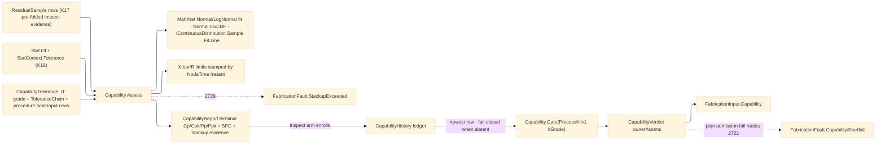

# [RASM_FABRICATION_CAPABILITY]

The capability owner closes the fabrication specification truth tranche over process-capability indices, SPC limits, distribution fit, Monte-Carlo tolerance stackup, procedure heat-input evidence, and plan-admission verdicts. `Capability.Assess` emits the terminal `CapabilityReport`: Cp/Cpk/Pp/Ppk rows, X-bar/R control limits with `Instant` stamps, MathNet-backed fitted residual distributions, drift fit, stackup verdict, and the owner#atoms `CapabilityVerdict`. `Capability.Gate` projects historical process capability — the report-fed `CapabilityHistory` ledger the owner#run Inspect arm enrolls every terminal report into — into the minimal input-carried verdict the plan reads before cutting, and fail-closes when no report has enrolled for the demanded pair; the report remains terminal here, the verdict mints on owner#atoms, and `FabricationFault.CapabilityShortfall`/`StackupExceeded` stay the two failure rails.

## [01]-[INDEX]

- [01]-[CAPABILITY]: owns `CapabilityMetric`, `CapabilityDistribution`, `SpcChart`, `ControlConstant`, `CapabilityTolerance`, `CapabilityRow`, `SpcLimitRow`, `StackupReceipt`, `CapabilityReport`, the report-fed `CapabilityHistory` ledger, and the ONE `Capability` surface — `Assess` and `Gate`.

## [02]-[CAPABILITY]

- Owner: `CapabilityMetric` the four index rows (`cp`/`cpk`/`pp`/`ppk`) with short-term and one-sided columns; `CapabilityDistribution` the fitted residual distribution union over `Normal` and `LogNormal`; `SpcChart` the X-bar/R control-family rows; `ControlConstant` the generated subgroup constants; `CapabilityTolerance` the spec demand row carried into the locked `Tolerance` parameter shape; `CapabilityRow` the typed Cp/Cpk/Pp/Ppk evidence; `SpcLimitRow` the `Instant`-stamped control-limit evidence; `StackupReceipt` the Monte-Carlo tolerance-stack receipt; `CapabilityReport` the terminal report; `Capability` the static owner exposing `Assess` and `Gate`.
- Cases: `CapabilityMetric` rows 4; `CapabilityDistribution` cases 2 — `NormalFit` and `LogNormalFit`; `SpcChart` rows 2 — `xbar` and `range`; `ControlConstant` rows 9 for subgroup sizes 2-10; `Capability.Assess` runs the same row set for single-process probing rows and whole-plan inspect projections; `Capability.Gate` reads the newest enrolled `CapabilityHistory` row for a `ProcessKind`/`ItGrade` pair and returns only `CapabilityVerdict` — a pair with no enrolled report is a failing verdict, never a silent pass.
- Entry: `public static Fin<CapabilityReport> Assess(Seq<ResidualSample> samples, Tolerance tolerance)` · `public static CapabilityVerdict Gate(ProcessKind process, ItGrade grade)` — the exact shared locks; `Assess` routes `FabricationFault.StackupExceeded(chain, accumulated, bound).ToError()` when Monte-Carlo accumulation crosses the assembly bound; plan admission routes `FabricationFault.CapabilityShortfall(process, cpk, demanded).ToError()` from a failing `Gate` verdict.
- Auto: `Assess` receives probing evidence already folded through K17 `ResidualSample` rows, projects residual series, and delegates all streaming moment math to kernel K18 `Stat.Of(..., StatContext.Tolerance(...))`; a local Welford accumulator never appears. Distribution fit uses MathNet `Normal`/`LogNormal`; capability demand reads `Normal.InvCDF`; Monte-Carlo stackup samples through `IContinuousDistribution.Sample`; drift trend uses `Fit.Line`; SPC rows stamp `Instant` and apply generated X-bar/R constants. The heat-input `ComplianceRow` from `Procedure.Qualify` contributes a gate column but never re-evaluates WPS bands.
- Receipt: `CapabilityReport` is the terminal typed evidence consumed by traveler/report rows and enrolled into the `CapabilityHistory` ledger by the owner#run Inspect arm (`CapabilityHistory.Enroll(report)` — the newest row per process/grade pair wins); `CapabilityVerdict` is the owner#atoms plan-admission leaf and carries only pass/fail, Cpk, and demanded IT grade.
- Packages: `Rasm.Domain` (`Stat.Of`, `StatContext.Tolerance` — K18), `Rasm.Analysis` (`ResidualSample`/`ConformanceMetric` — K17), MathNet.Numerics (`Fit.Line`), MathNet.Numerics.Distributions (`Normal`, `LogNormal`, `Normal.InvCDF`, `IContinuousDistribution.Sample`), NodaTime (`Instant` SPC/report stamps), `Spec/tolerance#TOLERANCE` (`ItGrade`, `ToleranceChain`), `Joining/procedure#WELD_PROCEDURE` (`ComplianceRow`, `EssentialVariable.HeatInput`), `Process/owner#FABRICATION_OWNER` (`CapabilityVerdict`), `Process/faults#FAULT_BAND` (`CapabilityShortfall` 2722, `StackupExceeded` 2729), Thinktecture.Runtime.Extensions, LanguageExt.Core, BCL inbox.
- Growth: a new capability index is one `CapabilityMetric` row and one projection arm; a new residual distribution is one `CapabilityDistribution` case lowering to `IContinuousDistribution`; a new SPC family is one `SpcChart` row and one limit projection; a new stackup method is one policy row inside the report fold. The public surface stays `Assess` plus `Gate`.
- Boundary: kernel `Distribution.Of` is internal and never crosses; Welford, quantile, and tolerance provenance stay on `Stat.Of`/`StatContext.Tolerance`; a second sample-moment accumulator, hand-rolled Gaussian inverse, custom random sampler, local WPS heat-input checker, local IT grade demand table, seeded or ambient process-history table outside the declared `CapabilityHistory` ledger, unsafe missing-history lookup, or result case carrying `CapabilityReport` is the deleted form. `CapabilityReport` remains terminal here; only `CapabilityVerdict` crosses into owner#atoms and plan input.

```csharp signature
// --- [RUNTIME_PRELUDE] ----------------------------------------------------------------------------------------------------------------------------
using LanguageExt;
using LanguageExt.Common;
using MathNet.Numerics;
using MathNet.Numerics.Distributions;
using NodaTime;
using Rasm.Analysis;
using Rasm.Domain;
using Rasm.Fabrication.Joining;
using Rasm.Fabrication.Process;
using Thinktecture;
using static LanguageExt.Prelude;
using Tolerance = Rasm.Fabrication.Spec.CapabilityTolerance;

namespace Rasm.Fabrication.Spec;

// --- [TYPES] --------------------------------------------------------------------------------------------------------------------------------------
[SmartEnum<string>]
public sealed partial class CapabilityMetric {
    public static readonly CapabilityMetric Cp = new("cp", shortTerm: true, oneSided: false);
    public static readonly CapabilityMetric Cpk = new("cpk", shortTerm: true, oneSided: true);
    public static readonly CapabilityMetric Pp = new("pp", shortTerm: false, oneSided: false);
    public static readonly CapabilityMetric Ppk = new("ppk", shortTerm: false, oneSided: true);

    public bool ShortTerm { get; }
    public bool OneSided { get; }
}

[SmartEnum<string>]
public sealed partial class SpcChart {
    public static readonly SpcChart XBar = new("xbar");
    public static readonly SpcChart Range = new("range");
}

[SmartEnum<int>]
public sealed partial class ControlConstant {
    public static readonly ControlConstant N2 = new(2, 1.880, 0.000, 3.267);
    public static readonly ControlConstant N3 = new(3, 1.023, 0.000, 2.574);
    public static readonly ControlConstant N4 = new(4, 0.729, 0.000, 2.282);
    public static readonly ControlConstant N5 = new(5, 0.577, 0.000, 2.114);
    public static readonly ControlConstant N6 = new(6, 0.483, 0.000, 2.004);
    public static readonly ControlConstant N7 = new(7, 0.419, 0.076, 1.924);
    public static readonly ControlConstant N8 = new(8, 0.373, 0.136, 1.864);
    public static readonly ControlConstant N9 = new(9, 0.337, 0.184, 1.816);
    public static readonly ControlConstant N10 = new(10, 0.308, 0.223, 1.777);

    public double A2 { get; }
    public double D3 { get; }
    public double D4 { get; }
}

[Union(ConversionFromValue = ConversionOperatorsGeneration.None)]
public abstract partial record CapabilityDistribution {
    private CapabilityDistribution() { }

    public abstract IContinuousDistribution Distribution { get; }
    public abstract double Mean { get; }
    public abstract double Sigma { get; }

    public sealed record NormalFit(double Mu, double StdDev) : CapabilityDistribution {
        public override IContinuousDistribution Distribution => new Normal(Mu, StdDev);
        public override double Mean => Mu;
        public override double Sigma => StdDev;
    }

    public sealed record LogNormalFit(double Mu, double StdDev) : CapabilityDistribution {
        public override IContinuousDistribution Distribution => new LogNormal(Mu, StdDev);
        public override double Mean => Math.Exp(Mu + (StdDev * StdDev / 2.0));
        public override double Sigma => Math.Sqrt((Math.Exp(StdDev * StdDev) - 1.0) * Math.Exp((2.0 * Mu) + (StdDev * StdDev)));
    }
}

// --- [MODELS] -------------------------------------------------------------------------------------------------------------------------------------
public sealed record CapabilityTolerance(
    ProcessKind Process,
    ItGrade Grade,
    ToleranceChain Chain,
    double LowerSpecMm,
    double UpperSpecMm,
    int SubgroupSize,
    int MonteCarloSamples,
    double TailProbability,
    Seq<ComplianceRow> ProcedureEvidence,
    Instant At) {
    public double WidthMm => UpperSpecMm - LowerSpecMm;
    public double CenterMm => (UpperSpecMm + LowerSpecMm) / 2.0;
    public double DemandedCpk => Normal.InvCDF(0.0, 1.0, 1.0 - TailProbability) / 3.0;
    // Vacuity discriminates on the evidence set: no procedure evidence at all = no heat-input obligation
    // (a machined tolerance carries none); procedure evidence WITHOUT a HeatInput row is UNQUALIFIED —
    // presence gates before the all-pass fold, so a bare ForAll never passes on the missing variable.
    public bool HeatInputQualified =>
        ProcedureEvidence.IsEmpty
        || (ProcedureEvidence.Filter(static r => r.Variable == EssentialVariable.HeatInput) is { IsEmpty: false } heat && heat.ForAll(static r => r.Pass));
}

public sealed record CapabilitySeries(
    Seq<ResidualSample> Samples,
    Arr<double> ResidualMm,
    Arr<double> SubgroupMeanMm,
    Arr<double> SubgroupRangeMm);

public sealed record CapabilityMoment(double Mean, double WithinSigma, double OverallSigma, double LowQuantile, double HighQuantile);

public sealed record CapabilityRow(CapabilityMetric Metric, double Value, double Demanded, bool Pass);

public sealed record SpcLimitRow(SpcChart Chart, Instant At, double Center, double Lower, double Upper);

public sealed record DriftRow(double Intercept, double Slope);

public sealed record StackupReceipt(ToleranceChain Chain, double AccumulatedMm, double BoundMm, bool Pass);

public sealed record CapabilityReport(
    ProcessKind Process,
    ItGrade Grade,
    Seq<CapabilityRow> Rows,
    Seq<SpcLimitRow> Limits,
    CapabilityDistribution Distribution,
    DriftRow Drift,
    StackupReceipt Stackup,
    Seq<ComplianceRow> ProcedureEvidence,
    CapabilityVerdict Verdict,
    Instant At);

// --- [OPERATIONS] ---------------------------------------------------------------------------------------------------------------------------------
public static class Capability {
    // Assessment composes K17 residual evidence and K18 moments; no local streaming-moment owner exists here.
    public static Fin<CapabilityReport> Assess(Seq<ResidualSample> samples, Tolerance tolerance) =>
        from series in Series(samples, tolerance.SubgroupSize)
        let moment = Moments(series, tolerance)
        let fit = Distribution(moment)
        from stackup in Stackup(tolerance, fit)
        let rows = Rows(moment, tolerance)
        let verdict = new CapabilityVerdict(rows.Filter(r => r.Metric == CapabilityMetric.Cpk).ForAll(r => r.Pass) && tolerance.HeatInputQualified, rows.Filter(r => r.Metric == CapabilityMetric.Cpk).Head.Value, tolerance.Grade.Number)
        select new CapabilityReport(
            tolerance.Process,
            tolerance.Grade,
            rows,
            Limits(series, tolerance),
            fit,
            Drift(series),
            stackup,
            tolerance.ProcedureEvidence,
            verdict,
            tolerance.At);

    // Gate projects the newest enrolled ledger row into owner#atoms. FAIL-CLOSED: a (process, grade) pair with no
    // enrolled terminal report is a failing verdict — plan admission lowers it to CapabilityShortfall 2722, so no
    // material is ever cut on absent capability evidence.
    public static CapabilityVerdict Gate(ProcessKind process, ItGrade grade) =>
        CapabilityHistory.Of(process, grade).Match(
            Some: row => new CapabilityVerdict(row.Cpk >= row.DemandedCpk, row.Cpk, grade.Number),
            None: () => new CapabilityVerdict(Pass: false, Cpk: 0.0, grade.Number));

    static Fin<CapabilitySeries> Series(Seq<ResidualSample> samples, int subgroupSize) {
        if (samples.IsEmpty)
            return Fin.Fail<CapabilitySeries>(GeometryFault.DegenerateInput("capability:empty-sample").ToError());
        // Fail-fast admission: the subgroup size must be a ControlConstant roster key (N2..N10) no larger
        // than the sample count — zero/negative divides the series into nothing, an oversized subgroup
        // yields zero subgroups, and both starve Assess's Head/average folds and the Limits Get downstream.
        if (!ControlConstant.TryGet(subgroupSize, out _) || subgroupSize > samples.Count)
            return Fin.Fail<CapabilitySeries>(GeometryFault.DegenerateInput($"capability:subgroup-size:{subgroupSize}/{samples.Count}").ToError());
        Arr<double> residuals = samples.Map(ConformanceMetric.ResidualMm).ToArr();
        Arr<double> means = toSeq(Enumerable.Range(0, residuals.Count / subgroupSize))
            .Map(i => residuals.Skip(i * subgroupSize).Take(subgroupSize).Average())
            .ToArr();
        Arr<double> ranges = toSeq(Enumerable.Range(0, residuals.Count / subgroupSize))
            .Map(i => {
                Arr<double> group = residuals.Skip(i * subgroupSize).Take(subgroupSize).ToArr();
                return group.Max() - group.Min();
            })
            .ToArr();
        return Fin.Succ(new CapabilitySeries(samples, residuals, means, ranges));
    }

    static CapabilityMoment Moments(CapabilitySeries series, Tolerance tolerance) {
        Stat residual = Stat.Of(series.ResidualMm, StatContext.Tolerance(tolerance));
        Stat subgroup = Stat.Of(series.SubgroupRangeMm, StatContext.Tolerance(tolerance));
        return new CapabilityMoment(
            residual.Mean,
            subgroup.Sigma,
            residual.Sigma,
            residual.Quantile(0.00135),
            residual.Quantile(0.99865));
    }

    static CapabilityDistribution Distribution(CapabilityMoment moment) =>
        moment.LowQuantile >= 0.0
            ? new CapabilityDistribution.LogNormalFit(Math.Log(double.Max(moment.Mean, double.Epsilon)), Math.Log1p(moment.OverallSigma / double.Max(moment.Mean, double.Epsilon)))
            : new CapabilityDistribution.NormalFit(moment.Mean, moment.OverallSigma);

    static Seq<CapabilityRow> Rows(CapabilityMoment moment, Tolerance tolerance) {
        double cp = tolerance.WidthMm / (6.0 * moment.WithinSigma);
        double cpk = double.Min(tolerance.UpperSpecMm - moment.Mean, moment.Mean - tolerance.LowerSpecMm) / (3.0 * moment.WithinSigma);
        double pp = tolerance.WidthMm / (6.0 * moment.OverallSigma);
        double ppk = double.Min(tolerance.UpperSpecMm - moment.Mean, moment.Mean - tolerance.LowerSpecMm) / (3.0 * moment.OverallSigma);
        return Seq(
            new CapabilityRow(CapabilityMetric.Cp, cp, tolerance.DemandedCpk, cp >= tolerance.DemandedCpk),
            new CapabilityRow(CapabilityMetric.Cpk, cpk, tolerance.DemandedCpk, cpk >= tolerance.DemandedCpk),
            new CapabilityRow(CapabilityMetric.Pp, pp, tolerance.DemandedCpk, pp >= tolerance.DemandedCpk),
            new CapabilityRow(CapabilityMetric.Ppk, ppk, tolerance.DemandedCpk, ppk >= tolerance.DemandedCpk));
    }

    static Seq<SpcLimitRow> Limits(CapabilitySeries series, Tolerance tolerance) {
        ControlConstant c = ControlConstant.Get(tolerance.SubgroupSize);
        double x = series.SubgroupMeanMm.Average();
        double r = series.SubgroupRangeMm.Average();
        return Seq(
            new SpcLimitRow(SpcChart.XBar, tolerance.At, x, x - (c.A2 * r), x + (c.A2 * r)),
            new SpcLimitRow(SpcChart.Range, tolerance.At, r, c.D3 * r, c.D4 * r));
    }

    static DriftRow Drift(CapabilitySeries series) {
        double[] x = Enumerable.Range(0, series.ResidualMm.Count).Select(i => (double)i).ToArray();
        double[] y = series.ResidualMm.ToArray();
        (double intercept, double slope) = Fit.Line(x, y);
        return new DriftRow(intercept, slope);
    }

    static Fin<StackupReceipt> Stackup(Tolerance tolerance, CapabilityDistribution fit) {
        IContinuousDistribution distribution = fit.Distribution;
        double accumulated = toSeq(Enumerable.Range(0, tolerance.MonteCarloSamples))
            .Map(_ => tolerance.Chain.AccumulatedMm + Math.Abs(distribution.Sample()))
            .Max();
        return accumulated <= tolerance.Chain.BoundMm
            ? Fin.Succ(new StackupReceipt(tolerance.Chain, accumulated, tolerance.Chain.BoundMm, Pass: true))
            : Fin.Fail<StackupReceipt>(FabricationFault.StackupExceeded(tolerance.Chain, accumulated, tolerance.Chain.BoundMm).ToError());
    }
}

// The report-fed process-capability ledger: the owner#run Inspect arm enrolls every terminal report, so Gate reads
// REAL history — never a seeded static table. Newest row per (process, grade) wins; the ledger is the one declared
// history owner and lives with the operation that reads it.
public sealed record CapabilityHistory(ProcessKind Process, ItGrade Grade, double Cpk, double DemandedCpk, Instant At) {
    static readonly Atom<Map<(ProcessKind, ItGrade), CapabilityHistory>> Ledger =
        Atom(Map<(ProcessKind, ItGrade), CapabilityHistory>());

    public static Option<CapabilityHistory> Of(ProcessKind process, ItGrade grade) =>
        Ledger.Value.Find((process, grade));

    public static Option<CapabilityHistory> Enroll(CapabilityReport report) =>
        report.Rows.Find(static r => r.Metric == CapabilityMetric.Cpk).Map(cpk => {
            CapabilityHistory row = new(report.Process, report.Grade, cpk.Value, cpk.Demanded, report.At);
            Ledger.Swap(rows => rows.AddOrUpdate((row.Process, row.Grade), row));
            return row;
        });
}
```


