# [RASM_FABRICATION_CAPABILITY]

The capability owner closes fabrication specification truth over capability indices and confidence intervals, SPC limits and run rules, distribution-fit evidence, serial-dependence and measurement-system evidence, replayable correlated tolerance stackup, procedure heat-input evidence, and plan-admission verdicts. `Capability.Assess` emits one terminal `CapabilityReport`: the five `CapabilityMetric` rows derive their values from row columns; I-MR, X-bar/R, and X-bar/S emit limit rows plus `SpcViolation` windows on the plotted statistic's sigma; the distribution union selects normal, lognormal, gamma, or generated Student-t candidates by empirical CDF error; and the stackup receipt records the seed, correlation, sensitivities, tail quantile, and analytic RSS. X-bar/S constants derive from the exact gamma-ratio `c4(n)` composed in the log domain, never a rational approximation and never a raw-Gamma quotient that overflows for large subgroups. `Capability.Gate` and `Capability.Achievable` consume input-carried `CapabilityHistory` evidence; this page owns no ambient history store and performs no enrollment effect.

## [01]-[INDEX]

- [01]-[CAPABILITY]: owns `CapabilityMetric`, the fitted `CapabilityDistribution` union, `SpcChart`/`SpcRule`/`ControlConstant`, the demand and evidence rows, input-carried `CapabilityHistory`, and the one `Capability` surface — `Assess`, `Gate`, and `Achievable`.

## [02]-[CAPABILITY]

- Owner: `CapabilityMetric` owns index formula columns; `CapabilityDistribution` owns family parameters, quantiles, and empirical fit error; `SpcChart` and `SpcRule` own control-limit and run-rule vocabularies; `ControlConstant` owns the tabulated X-bar/R constants; `CapabilityTolerance` carries confidence, measurement, and replay inputs; `CapabilityReport` conserves metric, interval, control, distribution, dependence, drift, stackup, procedure, and verdict evidence.
- Cases: `CapabilityMetric` rows 5; `CapabilityDistribution` cases 4 — normal, lognormal, gamma, and Student-t, the positive-support families moment-matched and support-gated, Student-t degrees generated from a parameter row sequence, and all candidates ranked by empirical CDF error; `SpcChart` rows 5; `SpcRule` rows 4; `ControlConstant` rows 9 for subgroup sizes 2-10, while larger groups derive exact X-bar/S constants from the `SpecialFunctions.GammaLn` log-domain gamma ratio — finite for every admitted subgroup size.
- Entry: `public static Fin<CapabilityReport> Assess(Seq<ResidualSample> samples, CapabilityTolerance tolerance)` · `public static Fin<CapabilityVerdict> Gate(ProcessKind process, ItGrade grade, Seq<CapabilityHistory> history)` · `public static Option<double> Achievable(ProcessKind process, DiameterStep diameter, Seq<CapabilityHistory> history)`; `Assess` accumulates every independent demand fault through `Validation` before any statistical fold and routes `FabricationFault.StackupExceeded` when the replayable tail quantile crosses the assembly bound.
- Auto: `Assess` accumulates independent demand faults through the `Op` admission channel — `Fault.OutOfRange` carrying the violating scalar and its requirement, `InvalidInput` for structural shape — rejects incomplete fixed subgroups, delegates moments to `Stat.Of`, stamps `StatContext.Tolerance`, and re-enters `Op.AcceptValue`. Candidate distributions lower through verified MathNet constructors and CDF/InvCDF members. `Distance.Pearson` derives lag-one correlation and effective sample size, carried uncertainty derives the measurement-system verdict, and normal-quantile intervals record the confidence policy. Seeded sampling draws one common and one independent standardized residual per contributor, mixes them by the carried correlation, applies signed sensitivity, and takes absolute magnitude only after summation. SPC emits limit rows plus generated sliding-window run-rule violations whose zone widths read the plotted statistic's sigma — `WithinSigma/√n` for subgroup means, `WithinSigma` for individuals; drift uses `Fit.Line`; heat-input evidence composes `ComplianceRow.Numeric` without re-evaluating WPS bands. History projection preserves procedure and measurement qualification, and both plan gates fail closed when either predicate fails.
- Receipt: `CapabilityReport` is terminal typed evidence consumed by traveler/report rows; `CapabilityHistory` is an input-carried durable-ledger projection keyed by `(ProcessKind, grade number)` whose newest row wins. `CapabilityVerdict` remains the owner#atoms plan-admission leaf.
- Packages: `Rasm.Domain` (`Stat.Of`/`StatContext.Tolerance`/`Op`/`Op.AcceptValue`/`Fault.OutOfRange`), `Rasm.Analysis` (`ResidualSample`), MathNet.Numerics (`Fit.Line`, `Distance.Pearson`, `SpecialFunctions.GammaLn`), MathNet.Numerics.Distributions (`Normal`, `LogNormal`, `Gamma`, `StudentT`, `Normal.InvCDF`, `Gamma.InvCDF`, `StudentT.InvCDF`, `IUnivariateDistribution.CumulativeDistribution`, `IDistribution.RandomSource`), NodaTime (`Instant`), `Spec/tolerance`, `Joining/procedure`, `Process/owner`, `Process/faults`, Thinktecture.Runtime.Extensions, LanguageExt.Core (`Fin`/`Validation`/`Option`/`Seq`/`Arr`, `guard`), BCL inbox.
- Growth: a capability index is one `CapabilityMetric` row; a residual family is one `CapabilityDistribution` case plus candidate-generation and total quantile arms; an SPC rule is one `SpcRule` row; stackup variation extends policy data, never the entrypoint family.
- Boundary: kernel `Distribution.Of` is internal and never crosses — empirical quantiles this page needs derive from the FITTED distribution through `Normal.InvCDF`, never a hand-rolled order-statistics owner beside the kernel's; Welford and tolerance provenance stay on `Stat.Of`/`StatContext.Tolerance`; a second sample-moment accumulator, a hand-rolled Gaussian inverse, a custom random sampler, a local WPS heat-input checker, a local IT grade demand table, a seeded or ambient process-history table outside the declared `CapabilityHistory` ledger, an unsafe missing-history lookup, a `Tolerance` alias shadowing the sibling static owner, or a result case carrying `CapabilityReport` is the deleted form. Attribute charts (p/np/c/u) stay out until an attribute-count evidence rail exists — `ResidualSample` is variables data. `CapabilityReport` remains terminal here; only `CapabilityVerdict` crosses into owner#atoms and plan input.

```csharp signature
// --- [RUNTIME_PRELUDE] ----------------------------------------------------------------------------------------------------------------------------
using LanguageExt;
using LanguageExt.Common;
using MathNet.Numerics;
using MathNet.Numerics.Distributions;
using NodaTime;
using Rasm.Analysis;
using Rasm.Domain;
using Rasm.Fabrication.Joining;
using Rasm.Fabrication.Process;
using Thinktecture;
using static LanguageExt.Prelude;

namespace Rasm.Fabrication.Spec;

// --- [TYPES] --------------------------------------------------------------------------------------------------------------------------------------
// The columns ARE the formula: sigma tier from ShortTerm, spec half-band from OneSided, Taguchi correction from
// TargetCentered — Of derives every metric from its own row, so a sixth index is one row and zero new arms.
[SmartEnum<string>]
public sealed partial class CapabilityMetric {
    public static readonly CapabilityMetric Cp = new("cp", shortTerm: true, oneSided: false, targetCentered: false);
    public static readonly CapabilityMetric Cpk = new("cpk", shortTerm: true, oneSided: true, targetCentered: false);
    public static readonly CapabilityMetric Pp = new("pp", shortTerm: false, oneSided: false, targetCentered: false);
    public static readonly CapabilityMetric Ppk = new("ppk", shortTerm: false, oneSided: true, targetCentered: false);
    public static readonly CapabilityMetric Cpm = new("cpm", shortTerm: false, oneSided: false, targetCentered: true);

    public bool ShortTerm { get; }
    public bool OneSided { get; }
    public bool TargetCentered { get; }

    public double Of(CapabilityMoment moment, CapabilityTolerance tolerance) {
        double sigma = double.Max(ShortTerm ? moment.WithinSigma : moment.OverallSigma, double.Epsilon);
        double half = OneSided
            ? double.Min(tolerance.UpperSpecMm - moment.Mean, moment.Mean - tolerance.LowerSpecMm)
            : tolerance.WidthMm / 2.0;
        double correction = TargetCentered
            ? Math.Sqrt(1.0 + Math.Pow((moment.Mean - tolerance.CenterMm) / sigma, 2.0))
            : 1.0;
        return half / (3.0 * sigma * correction);
    }
}

[SmartEnum<string>]
public sealed partial class SpcChart {
    public static readonly SpcChart XBar = new("xbar");
    public static readonly SpcChart Range = new("range");
    public static readonly SpcChart Individuals = new("individuals");
    public static readonly SpcChart MovingRange = new("moving-range");
    public static readonly SpcChart Sigma = new("s");
}

[SmartEnum<string>]
public sealed partial class SpcRule {
    public static readonly SpcRule BeyondThreeSigma = new("beyond-3s", window: 1, minimum: 1, sigma: 3.0, sameSide: false);
    public static readonly SpcRule TwoOfThreeBeyondTwoSigma = new("two-of-three-2s", window: 3, minimum: 2, sigma: 2.0, sameSide: true);
    public static readonly SpcRule FourOfFiveBeyondOneSigma = new("four-of-five-1s", window: 5, minimum: 4, sigma: 1.0, sameSide: true);
    public static readonly SpcRule EightOnOneSide = new("eight-one-side", window: 8, minimum: 8, sigma: 0.0, sameSide: true);

    public int Window { get; }
    public int Minimum { get; }
    public double Sigma { get; }
    public bool SameSide { get; }
}

[SmartEnum<int>]
public sealed partial class ControlConstant {
    public static readonly ControlConstant N2 = new(2, 1.880, 0.000, 3.267, 1.128);
    public static readonly ControlConstant N3 = new(3, 1.023, 0.000, 2.574, 1.693);
    public static readonly ControlConstant N4 = new(4, 0.729, 0.000, 2.282, 2.059);
    public static readonly ControlConstant N5 = new(5, 0.577, 0.000, 2.114, 2.326);
    public static readonly ControlConstant N6 = new(6, 0.483, 0.000, 2.004, 2.534);
    public static readonly ControlConstant N7 = new(7, 0.419, 0.076, 1.924, 2.704);
    public static readonly ControlConstant N8 = new(8, 0.373, 0.136, 1.864, 2.847);
    public static readonly ControlConstant N9 = new(9, 0.337, 0.184, 1.816, 2.970);
    public static readonly ControlConstant N10 = new(10, 0.308, 0.223, 1.777, 3.078);

    public double A2 { get; }
    public double D3 { get; }
    public double D4 { get; }
    public double D2 { get; }
}

[Union(ConversionFromValue = ConversionOperatorsGeneration.None)]
public abstract partial record CapabilityDistribution {
    private CapabilityDistribution() { }

    public abstract IContinuousDistribution Distribution { get; }
    public abstract double Mean { get; }
    public abstract double Sigma { get; }
    public abstract double FitError { get; }

    // Quantiles through the ONE verified inverse per family: the lognormal quantile is exp of the underlying normal quantile.
    public double Quantile(double p) =>
        this.Switch(
            normalFit: n => Normal.InvCDF(n.Mu, n.StdDev, p),
            logNormalFit: l => Math.Exp(Normal.InvCDF(l.Mu, l.StdDev, p)),
            gammaFit: g => Gamma.InvCDF(g.Shape, g.Rate, p),
            studentFit: s => StudentT.InvCDF(s.Location, s.Scale, s.Freedom, p));

    public sealed record NormalFit(double Mu, double StdDev, double Error) : CapabilityDistribution {
        public override IContinuousDistribution Distribution => new Normal(Mu, StdDev);
        public override double Mean => Mu;
        public override double Sigma => StdDev;
        public override double FitError => Error;
    }

    public sealed record LogNormalFit(double Mu, double StdDev, double Error) : CapabilityDistribution {
        public override IContinuousDistribution Distribution => new LogNormal(Mu, StdDev);
        public override double Mean => Math.Exp(Mu + (StdDev * StdDev / 2.0));
        public override double Sigma => Math.Sqrt((Math.Exp(StdDev * StdDev) - 1.0) * Math.Exp((2.0 * Mu) + (StdDev * StdDev)));
        public override double FitError => Error;
    }

    public sealed record GammaFit(double Shape, double Rate, double Error) : CapabilityDistribution {
        public override IContinuousDistribution Distribution => new Gamma(Shape, Rate);
        public override double Mean => Shape / Rate;
        public override double Sigma => Math.Sqrt(Shape) / Rate;
        public override double FitError => Error;
    }

    public sealed record StudentFit(double Location, double Scale, double Freedom, double Error) : CapabilityDistribution {
        public override IContinuousDistribution Distribution => new StudentT(Location, Scale, Freedom);
        public override double Mean => Location;
        public override double Sigma => Scale * Math.Sqrt(Freedom / (Freedom - 2.0));
        public override double FitError => Error;
    }
}

// --- [MODELS] -------------------------------------------------------------------------------------------------------------------------------------
public sealed record CapabilityTolerance(
    ProcessKind Process,
    ItGrade Grade,
    ToleranceChain Chain,
    double LowerSpecMm,
    double UpperSpecMm,
    int SubgroupSize,
    int MonteCarloSamples,
    double TailProbability,
    double Confidence,
    double MeasurementUncertaintyMm,
    int RandomSeed,
    double CommonCorrelation,
    Arr<double> Sensitivities,
    Seq<ComplianceRow> ProcedureEvidence,
    Instant At) {
    public double WidthMm => UpperSpecMm - LowerSpecMm;
    public double CenterMm => (UpperSpecMm + LowerSpecMm) / 2.0;
    public double DemandedCpk => Normal.InvCDF(0.0, 1.0, 1.0 - TailProbability) / 3.0;

    // Vacuity discriminates on the evidence set: no procedure evidence at all = no heat-input obligation (a machined
    // tolerance carries none); procedure evidence WITHOUT a HeatInput row is UNQUALIFIED — presence gates before the
    // all-pass fold. The heat rows live on the Numeric CASE (Variable/Pass are case members, not base members).
    public bool HeatInputQualified {
        get {
            Seq<ComplianceRow.Numeric> heat = ProcedureEvidence.Choose(static r =>
                r is ComplianceRow.Numeric n && n.Variable == EssentialVariable.HeatInput
                    ? Some(n)
                    : Option<ComplianceRow.Numeric>.None);
            return ProcedureEvidence.IsEmpty || (!heat.IsEmpty && heat.ForAll(static n => n.Pass));
        }
    }
}

public sealed record CapabilitySeries(
    Seq<ResidualSample> Samples,
    Arr<double> ResidualMm,
    Arr<double> SubgroupMeanMm,
    Arr<double> SubgroupSpreadMm);

public sealed record CapabilityMoment(double Mean, double WithinSigma, double OverallSigma, double Minimum);

public sealed record CapabilityRow(CapabilityMetric Metric, double Value, double Demanded, bool Pass);

public sealed record CapabilityInterval(CapabilityMetric Metric, double Lower, double Upper, double Confidence);

public sealed record SpcLimitRow(SpcChart Chart, Instant At, double Center, double Lower, double Upper, int Violations);

public sealed record SpcViolation(SpcRule Rule, int StartSubgroup, int EndSubgroup, double FurthestSigma);

public sealed record DriftRow(double Intercept, double Slope);

public sealed record CapabilityDependence(double LagOneCorrelation, double EffectiveSampleSize, bool MeasurementSystemSuitable);

public sealed record StackupReceipt(
    ToleranceChain Chain,
    double AccumulatedMm,
    double RssMm,
    double BoundMm,
    int RandomSeed,
    double CommonCorrelation,
    Arr<double> Sensitivities,
    bool Pass);

public sealed record CapabilityReport(
    ProcessKind Process,
    ItGrade Grade,
    Seq<CapabilityRow> Rows,
    Seq<CapabilityInterval> Intervals,
    Seq<SpcLimitRow> Limits,
    Seq<SpcViolation> Violations,
    CapabilityDistribution Distribution,
    CapabilityDependence Dependence,
    DriftRow Drift,
    StackupReceipt Stackup,
    Seq<ComplianceRow> ProcedureEvidence,
    bool ProcedureQualified,
    CapabilityVerdict Verdict,
    Instant At) {
    // The natural process limits: the fitted ±3σ quantile pair — a projection, never stored state.
    public (double LowerMm, double UpperMm) Natural => (Distribution.Quantile(0.00135), Distribution.Quantile(0.99865));
}

// --- [OPERATIONS] ---------------------------------------------------------------------------------------------------------------------------------
public static class Capability {
    const double MovingRangeD2 = 1.128;

    static readonly Op CapabilityOp = Op.Of(name: "fabrication:capability");

    // Assessment composes K17 residual evidence and the K18 summary fold; no local streaming-moment owner exists here.
    // Demand admission rides the Op channel: OutOfRange carries the violating scalar, InvalidInput the structural shape.
    public static Fin<CapabilityReport> Assess(Seq<ResidualSample> samples, CapabilityTolerance tolerance) =>
        from _ in Seq(
            guard(double.IsFinite(tolerance.LowerSpecMm) && double.IsFinite(tolerance.UpperSpecMm) && tolerance.LowerSpecMm < tolerance.UpperSpecMm,
                new Fault.OutOfRange("capability:spec-window", tolerance.UpperSpecMm - tolerance.LowerSpecMm, "finite width > 0", Some(CapabilityOp)) as Error).ToValidation(),
            guard(tolerance.SubgroupSize >= 1,
                new Fault.OutOfRange("capability:subgroup", tolerance.SubgroupSize, ">= 1", Some(CapabilityOp)) as Error).ToValidation(),
            guard(tolerance.MonteCarloSamples >= 1,
                new Fault.OutOfRange("capability:monte-carlo", tolerance.MonteCarloSamples, ">= 1", Some(CapabilityOp)) as Error).ToValidation(),
            guard(double.IsFinite(tolerance.TailProbability) && tolerance.TailProbability is > 0.0 and < 0.5,
                new Fault.OutOfRange("capability:tail", tolerance.TailProbability, "(0, 0.5)", Some(CapabilityOp)) as Error).ToValidation(),
            guard(double.IsFinite(tolerance.Confidence) && tolerance.Confidence is > 0.0 and < 1.0,
                new Fault.OutOfRange("capability:confidence", tolerance.Confidence, "(0, 1)", Some(CapabilityOp)) as Error).ToValidation(),
            guard(double.IsFinite(tolerance.MeasurementUncertaintyMm) && tolerance.MeasurementUncertaintyMm >= 0.0,
                new Fault.OutOfRange("capability:measurement-uncertainty", tolerance.MeasurementUncertaintyMm, "finite >= 0", Some(CapabilityOp)) as Error).ToValidation(),
            guard(double.IsFinite(tolerance.CommonCorrelation) && tolerance.CommonCorrelation is >= 0.0 and < 1.0,
                new Fault.OutOfRange("capability:correlation", tolerance.CommonCorrelation, "[0, 1)", Some(CapabilityOp)) as Error).ToValidation(),
            guard(tolerance.Sensitivities.Count == tolerance.Chain.Frames.Count,
                new Fault.OutOfRange("capability:sensitivity-arity", tolerance.Sensitivities.Count, "= chain frame count", Some(CapabilityOp)) as Error).ToValidation(),
            guard(tolerance.Sensitivities.ForAll(static value => double.IsFinite(value) && value != 0.0),
                CapabilityOp.InvalidInput()).ToValidation())
            .Traverse(static validation => validation)
            .As()
            .ToFin()
        from series in Series(samples, tolerance.SubgroupSize)
        from moment in Moments(series, tolerance)
        let fit = Fit(series, moment)
        from stackup in Stackup(tolerance, fit)
        let rows = Rows(moment, tolerance)
        let dependence = Dependence(series, tolerance)
        let cpk = rows.Find(static r => r.Metric == CapabilityMetric.Cpk)
        let limits = Limits(series, tolerance)
        from verdict in CapabilityVerdict.Admit(
            cpk.Map(static r => r.Value).IfNone(0.0),
            tolerance.DemandedCpk,
            tolerance.Grade.Number,
            procedureQualified: tolerance.HeatInputQualified,
            measurementSystemSuitable: dependence.MeasurementSystemSuitable)
        select new CapabilityReport(
            tolerance.Process,
            tolerance.Grade,
            rows,
            Intervals(rows, dependence, tolerance.Confidence),
            limits,
            RunRules(series, moment, tolerance.SubgroupSize),
            fit,
            dependence,
            Drift(series),
            stackup,
            tolerance.ProcedureEvidence,
            tolerance.HeatInputQualified,
            verdict,
            tolerance.At);

    // Gate projects the newest input-carried row and fail-closes when no process/grade evidence exists; the
    // verdict CARRIES its qualification evidence — an unqualified row keeps its true Cpk and fails Pass typed.
    public static Fin<CapabilityVerdict> Gate(ProcessKind process, ItGrade grade, Seq<CapabilityHistory> history) =>
        CapabilityHistory.Of(process, grade.Number, history).Match(
            Some: row => CapabilityVerdict.Admit(
                row.Cpk,
                row.DemandedCpk,
                grade.Number,
                procedureQualified: row.ProcedureQualified,
                measurementSystemSuitable: row.MeasurementSystemSuitable),
            None: () => CapabilityVerdict.Admit(
                cpk: 0.0, demandedCpk: double.MaxValue, demandedItGrade: grade.Number,
                procedureQualified: false, measurementSystemSuitable: false));

    // The tolerance side selects the finest passing grade and lowers it through the generated IT law.
    public static Option<double> Achievable(ProcessKind process, DiameterStep diameter, Seq<CapabilityHistory> history) =>
        history
            .Filter(row => row.Process == process
                && row.ProcedureQualified
                && row.MeasurementSystemSuitable
                && row.Cpk >= row.DemandedCpk)
            .Map(static row => row.GradeNumber)
            .OrderBy(static g => g).ToSeq().HeadOrNone()
            .Bind(g => ItToleranceLaw.Micrometers(g, diameter.GeometricMeanMm).ToOption())
            .Map(static um => um / 1000.0);

    static Fin<CapabilitySeries> Series(Seq<ResidualSample> samples, int subgroupSize) {
        if (samples.IsEmpty)
            return Fin.Fail<CapabilitySeries>(CapabilityOp.InvalidInput());
        // Lane admission: size 1 needs two samples for a moving range; any size must divide at least one subgroup.
        if (subgroupSize < 1 || subgroupSize > samples.Count || (subgroupSize == 1 && samples.Count < 2)
            || (subgroupSize > 1 && samples.Count % subgroupSize != 0))
            return Fin.Fail<CapabilitySeries>(new Fault.OutOfRange("capability:subgroup-size", subgroupSize, $"partitions {samples.Count} samples", Some(CapabilityOp)));
        Arr<double> residuals = samples.Map(static s => s.Distance).ToArr();
        if (subgroupSize == 1) {
            Arr<double> moving = toSeq(Enumerable.Range(1, residuals.Count - 1))
                .Map(i => Math.Abs(residuals[i] - residuals[i - 1]))
                .ToArr();
            return Fin.Succ(new CapabilitySeries(samples, residuals, residuals, moving));
        }
        Seq<Arr<double>> groups = toSeq(Enumerable.Range(0, residuals.Count / subgroupSize))
            .Map(i => residuals.Skip(i * subgroupSize).Take(subgroupSize).ToArr());
        Arr<double> means = groups.Map(static g => g.Average()).ToArr();
        // Spread column per lane: range for the R constants (n ≤ 10), sample standard deviation for the S lane above.
        Arr<double> spreads = subgroupSize <= 10
            ? groups.Map(static g => g.Max() - g.Min()).ToArr()
            : groups.Map(static g => {
                double m = g.Average();
                return Math.Sqrt(g.Map(x => (x - m) * (x - m)).Fold(0.0, static (a, v) => a + v) / (g.Count - 1));
            }).ToArr();
        return Fin.Succ(new CapabilitySeries(samples, residuals, means, spreads));
    }

    // K18 owns the summary fold; the tolerance verdict stamps AFTER against the receipt's own extrema (the stats-page
    // law). Within sigma is the lane spread law — R̄/d₂, MR̄/1.128, or s̄/c4 — never the std dev OF the spreads.
    static Fin<CapabilityMoment> Moments(CapabilitySeries series, CapabilityTolerance tolerance) {
        Op key = Op.Of(name: "capability:residual");
        return from stat in Stat.Of(series.ResidualMm.ToSeq(), key)
               let stamped = stat with { Context = StatContext.Tolerance(tolerance.WidthMm / 2.0, stat.Minimum, stat.Maximum) }
               from accepted in key.AcceptValue(value: stamped)
               select new CapabilityMoment(
                accepted.Mean,
                WithinSigma(series, tolerance.SubgroupSize),
                Math.Sqrt(accepted.Variance),
                accepted.Minimum);
    }

    static double WithinSigma(CapabilitySeries series, int subgroupSize) {
        double spread = series.SubgroupSpreadMm.Average();
        return subgroupSize switch {
            1 => spread / MovingRangeD2,
            <= 10 => spread / ControlConstant.Get(subgroupSize).D2,
            _ => spread / C4(subgroupSize),
        };
    }

    // Candidate space is data: normal plus a generated Student-t freedom ladder, the positive-support families
    // (moment-matched lognormal and gamma) joining only when support admits them. The minimum empirical-CDF error
    // selects the family; support never selects the family by itself.
    static CapabilityDistribution Fit(CapabilitySeries series, CapabilityMoment moment) {
        double sigma = double.Max(moment.OverallSigma, double.Epsilon);
        Seq<CapabilityDistribution> candidates = Seq<CapabilityDistribution>(new CapabilityDistribution.NormalFit(moment.Mean, sigma, 0.0))
            + Seq(3.0, 5.0, 10.0, 30.0).Map(freedom =>
                (CapabilityDistribution)new CapabilityDistribution.StudentFit(moment.Mean, sigma * Math.Sqrt((freedom - 2.0) / freedom), freedom, 0.0));
        if (moment.Minimum <= 0.0)
            return candidates.Map(candidate => WithError(candidate, FitError(candidate, series.ResidualMm))).OrderBy(static candidate => candidate.FitError).Head;
        double mean = double.Max(moment.Mean, double.Epsilon);
        double cv = moment.OverallSigma / mean;
        double s = Math.Sqrt(Math.Log(1.0 + (cv * cv)));
        candidates = candidates
            .Add(new CapabilityDistribution.LogNormalFit(Math.Log(mean) - (s * s / 2.0), s, 0.0))
            .Add(new CapabilityDistribution.GammaFit((mean / sigma) * (mean / sigma), mean / (sigma * sigma), 0.0));
        return candidates.Map(candidate => WithError(candidate, FitError(candidate, series.ResidualMm))).OrderBy(static candidate => candidate.FitError).Head;
    }

    static CapabilityDistribution WithError(CapabilityDistribution candidate, double error) =>
        candidate.Switch(
            normalFit: n => new CapabilityDistribution.NormalFit(n.Mu, n.StdDev, error),
            logNormalFit: l => new CapabilityDistribution.LogNormalFit(l.Mu, l.StdDev, error),
            gammaFit: g => new CapabilityDistribution.GammaFit(g.Shape, g.Rate, error),
            studentFit: s => new CapabilityDistribution.StudentFit(s.Location, s.Scale, s.Freedom, error));

    static double FitError(CapabilityDistribution candidate, Arr<double> values) {
        Arr<double> ordered = values.OrderBy(static value => value).ToArr();
        return toSeq(Enumerable.Range(0, ordered.Count))
            .Map(index => Math.Abs(candidate.Distribution.CumulativeDistribution(ordered[index]) - ((index + 0.5) / ordered.Count)))
            .Max();
    }

    static Seq<CapabilityRow> Rows(CapabilityMoment moment, CapabilityTolerance tolerance) =>
        toSeq(CapabilityMetric.Items).Map(metric => {
            double value = metric.Of(moment, tolerance);
            return new CapabilityRow(metric, value, tolerance.DemandedCpk, value >= tolerance.DemandedCpk);
        });

    static CapabilityDependence Dependence(CapabilitySeries series, CapabilityTolerance tolerance) {
        double correlation = series.ResidualMm.Count < 3
            ? 0.0
            : double.Clamp(
                1.0 - Distance.Pearson(series.ResidualMm.SkipLast(1), series.ResidualMm.Skip(1)),
                -0.99,
                0.99);
        double effective = double.Clamp(
            series.ResidualMm.Count * (1.0 - correlation) / (1.0 + correlation),
            2.0,
            series.ResidualMm.Count);
        return new CapabilityDependence(
            correlation,
            effective,
            tolerance.MeasurementUncertaintyMm <= tolerance.WidthMm / 10.0);
    }

    static Seq<CapabilityInterval> Intervals(Seq<CapabilityRow> rows, CapabilityDependence dependence, double confidence) {
        double z = Normal.InvCDF(0.0, 1.0, (1.0 + confidence) / 2.0);
        double n = dependence.EffectiveSampleSize;
        return rows.Map(row => {
            double error = row.Metric.OneSided
                ? Math.Sqrt((1.0 / (9.0 * n)) + ((row.Value * row.Value) / (2.0 * (n - 1.0))))
                : row.Value / Math.Sqrt(2.0 * (n - 1.0));
            return new CapabilityInterval(row.Metric, double.Max(0.0, row.Value - (z * error)), row.Value + (z * error), confidence);
        });
    }

    // One limit-row pair per lane; Violations is the beyond-limits census — the out-of-control verdict rides the row.
    static Seq<SpcLimitRow> Limits(CapabilitySeries series, CapabilityTolerance tolerance) {
        int n = tolerance.SubgroupSize;
        double x = series.SubgroupMeanMm.Average();
        double s = series.SubgroupSpreadMm.Average();
        (SpcChart center, SpcChart spread, double a, double lo, double hi) = n switch {
            1 => (SpcChart.Individuals, SpcChart.MovingRange, 3.0 / MovingRangeD2, 0.0, 3.267),
            <= 10 => (SpcChart.XBar, SpcChart.Range, ControlConstant.Get(n).A2, ControlConstant.Get(n).D3, ControlConstant.Get(n).D4),
            _ => (SpcChart.XBar, SpcChart.Sigma, 3.0 / (C4(n) * Math.Sqrt(n)), B3(n), B4(n)),
        };
        (double xLo, double xHi, double sLo, double sHi) = (x - (a * s), x + (a * s), lo * s, hi * s);
        return Seq(
            new SpcLimitRow(center, tolerance.At, x, xLo, xHi, series.SubgroupMeanMm.Count(v => v < xLo || v > xHi)),
            new SpcLimitRow(spread, tolerance.At, s, sLo, sHi, series.SubgroupSpreadMm.Count(v => v < sLo || v > sHi)));
    }

    // Zone widths read the sigma of the PLOTTED statistic — subgroup means carry WithinSigma/√n, individuals
    // WithinSigma — so the run rules and the Limits lane agree on where 1σ/2σ/3σ sit for the same report.
    static Seq<SpcViolation> RunRules(CapabilitySeries series, CapabilityMoment moment, int subgroupSize) {
        double chartSigma = double.Max(moment.WithinSigma / Math.Sqrt(subgroupSize), double.Epsilon);
        return toSeq(SpcRule.Items).Bind(rule =>
            toSeq(Enumerable.Range(0, int.Max(0, series.SubgroupMeanMm.Count - rule.Window + 1))).Choose(start => {
                Arr<double> window = series.SubgroupMeanMm.Skip(start).Take(rule.Window).ToArr();
                int positive = window.Count(value => value - moment.Mean > rule.Sigma * chartSigma);
                int negative = window.Count(value => moment.Mean - value > rule.Sigma * chartSigma);
                int breaches = rule.SameSide
                    ? int.Max(positive, negative)
                    : window.Count(value => Math.Abs(value - moment.Mean) > rule.Sigma * chartSigma);
                double furthest = window.Map(value => Math.Abs(value - moment.Mean) / chartSigma).Max();
                return breaches >= rule.Minimum
                    ? Some(new SpcViolation(rule, start, start + rule.Window - 1, furthest))
                    : Option<SpcViolation>.None;
            }));
    }

    static DriftRow Drift(CapabilitySeries series) {
        double[] x = Enumerable.Range(0, series.ResidualMm.Count).Select(i => (double)i).ToArray();
        double[] y = series.ResidualMm.ToArray();
        (double intercept, double slope) = Fit.Line(x, y);
        return new DriftRow(intercept, slope);
    }

    // The stackup IS a convolution: one standardized draw per chain frame per trial, scaled by the frame's width/6,
    // summed, and read at the 1 − TailProbability order statistic; the analytic RSS rides the receipt as cross-check.
    static Fin<StackupReceipt> Stackup(CapabilityTolerance tolerance, CapabilityDistribution fit) {
        IContinuousDistribution distribution = fit.Distribution;
        distribution.RandomSource = new Random(tolerance.RandomSeed);
        double sigma = double.Max(fit.Sigma, double.Epsilon);
        Arr<double> widths = tolerance.Chain.Frames.Map(static f => f.Zone.WidthMm).ToArr();
        double commonScale = Math.Sqrt(tolerance.CommonCorrelation);
        double independentScale = Math.Sqrt(1.0 - tolerance.CommonCorrelation);
        Arr<double> trials = toSeq(Enumerable.Range(0, tolerance.MonteCarloSamples))
            .Map(_ => {
                double common = (distribution.Sample() - fit.Mean) / sigma;
                double signed = toSeq(Enumerable.Range(0, widths.Count)).Fold(0.0, (sum, index) => {
                    double independent = (distribution.Sample() - fit.Mean) / sigma;
                    double correlated = (commonScale * common) + (independentScale * independent);
                    return sum + (correlated * widths[index] * tolerance.Sensitivities[index] / 6.0);
                });
                return Math.Abs(signed);
            })
            .OrderBy(static t => t).ToArr();
        double accumulated = trials[(int)Math.Ceiling((trials.Count - 1) * (1.0 - tolerance.TailProbability))];
        Arr<double> contributors = toSeq(Enumerable.Range(0, widths.Count))
            .Map(index => widths[index] * tolerance.Sensitivities[index] / 6.0)
            .ToArr();
        double variance = toSeq(Enumerable.Range(0, contributors.Count)).Fold(0.0, (sum, i) =>
            sum + (contributors[i] * contributors[i])
            + (2.0 * tolerance.CommonCorrelation * toSeq(Enumerable.Range(i + 1, contributors.Count - i - 1))
                .Fold(0.0, (covariance, j) => covariance + (contributors[i] * contributors[j]))));
        double rss = 3.0 * Math.Sqrt(double.Max(0.0, variance));
        return accumulated <= tolerance.Chain.BoundMm
            ? Fin.Succ(new StackupReceipt(
                tolerance.Chain,
                accumulated,
                rss,
                tolerance.Chain.BoundMm,
                tolerance.RandomSeed,
                tolerance.CommonCorrelation,
                tolerance.Sensitivities,
                Pass: true))
            : Fin.Fail<StackupReceipt>(FabricationFault.StackupExceeded(tolerance.Chain, accumulated, tolerance.Chain.BoundMm).ToError());
    }

    // Shewhart S-lane constants from the exact gamma ratio composed in the LOG domain: GammaLn keeps c4 finite for
    // every admitted subgroup size where a raw Gamma(n/2) quotient overflows to NaN; B3/B4 derive from the same value.
    static double C4(int n) =>
        Math.Exp(SpecialFunctions.GammaLn(n / 2.0) - SpecialFunctions.GammaLn((n - 1.0) / 2.0)) / Math.Sqrt((n - 1.0) / 2.0);
    static double B3(int n) => Math.Max(0.0, 1.0 - (3.0 * Math.Sqrt(1.0 - (C4(n) * C4(n))) / C4(n)));
    static double B4(int n) => 1.0 + (3.0 * Math.Sqrt(1.0 - (C4(n) * C4(n))) / C4(n));
}

// Durable-ledger projection carried into the pure capability fold. Enrollment and storage are orchestration effects;
// this owner only resolves the newest row for the process/grade identity.
public sealed record CapabilityHistory(
    ProcessKind Process,
    int GradeNumber,
    double Cpk,
    double DemandedCpk,
    bool ProcedureQualified,
    bool MeasurementSystemSuitable,
    Instant At) {
    public static Option<CapabilityHistory> From(CapabilityReport report) =>
        report.Rows.Find(static row => row.Metric == CapabilityMetric.Cpk)
            .Map(row => new CapabilityHistory(
                report.Process,
                report.Grade.Number,
                row.Value,
                row.Demanded,
                report.ProcedureQualified,
                report.Dependence.MeasurementSystemSuitable,
                report.At));

    public static Option<CapabilityHistory> Of(ProcessKind process, int gradeNumber, Seq<CapabilityHistory> history) =>
        history.Filter(row => row.Process == process && row.GradeNumber == gradeNumber)
            .OrderByDescending(static row => row.At)
            .HeadOrNone();
}
```

```mermaid
---
config:
  theme: base
  look: classic
  layout: elk
  flowchart:
    curve: linear
    padding: 25
  themeVariables:
    darkMode: true
    fontFamily: "SF Mono, Menlo, Cascadia Mono, Segoe UI Mono, Consolas, monospace"
    useGradient: false
    dropShadow: "none"
    background: "#282A36"
    primaryColor: "#44475A"
    primaryTextColor: "#F8F8F2"
    primaryBorderColor: "#BD93F9"
    mainBkg: "#44475A"
    nodeBorder: "#BD93F9"
    lineColor: "#FF79C6"
    textColor: "#F8F8F2"
    edgeLabelBackground: "#21222C"
    labelBackgroundColor: "#21222C"
  themeCSS: ".nodeLabel{font-size:13px;font-weight:500}.edgeLabel{font-size:12px;font-weight:500}.edge-thickness-normal{stroke-width:2px}.edge-thickness-thick{stroke-width:3px}.edge-pattern-dashed,.edge-pattern-dotted{stroke-width:1.5px;stroke-dasharray:4 6}.node rect,.node circle,.node polygon,.node path,.node .outer-path{stroke-width:1.5px;filter:none!important}.marker path{transform:scale(.8);transform-origin:5px 5px}.marker circle{transform:scale(.48);transform-origin:5px 5px}.edgeLabel rect{transform-box:fill-box;transform-origin:center;transform:scale(1.1,1.2)}"
---
flowchart LR
    accTitle: Capability plane seams
    accDescr: Residual evidence folds through the kernel summary into metric rows, SPC lanes, stackup, and the history ledger feeding the plan gate and the achievable derivation.
    Residual["ResidualSample rows (K17 inspect evidence)"] -->|"Distance"| Assess["Capability.Assess"]
    Stat["Stat.Of + StatContext.Tolerance (K18)"] -->|"Fin&lt;Stat&gt;"| Assess
    Tol["CapabilityTolerance: grade + chain + heat-input rows"] -->|"demand"| Assess
    Assess -->|"fit + InvCDF + Sample + Fit.Line"| MathNet["MathNet Normal/LogNormal/Gamma/StudentT"]
    Assess -->|"I-MR · X-bar/R · X-bar/S"| Spc["lane limits + violation census"]
    Assess -->|"terminal"| Report["CapabilityReport rows + limits + stackup"]
    Assess -.->|"2729"| Stackup["FabricationFault.StackupExceeded"]
    Report -->|"CapabilityHistory.From"| History["durable-ledger projection (process, grade number)"]
    History -->|"newest row · fail-closed"| Gate["Capability.Gate"]
    History -->|"finest passing grade"| Achievable["Capability.Achievable → AchievableMm carry"]
    Gate -->|"leaf"| Verdict["CapabilityVerdict owner#atoms"]
    Verdict -.->|"plan admission fail routes 2722"| Shortfall["FabricationFault.CapabilityShortfall"]
    Verdict -->|"input-carried"| Plan["FabricationInput.Capability"]
    classDef primary fill:#44475A,stroke:#FF79C6,color:#F8F8F2
    classDef boundary fill:#282A36,stroke:#BD93F9,color:#F8F8F2
    classDef data fill:#FFB86CBF,stroke:#FFB86C,color:#282A36
    classDef error fill:#FF555580,stroke:#FF5555,color:#F8F8F2
    classDef annotation fill:#21222C,stroke:#6272A4,color:#F8F8F2
    class Residual,Tol primary
    class Assess,Gate,Achievable boundary
    class Stat,MathNet,Spc data
    class Stackup,Shortfall error
    class Report,History,Verdict,Plan annotation
    linkStyle 6 stroke:#FF5555,stroke-width:3px,color:#F8F8F2
    linkStyle 11 stroke:#FF5555,color:#F8F8F2
```


