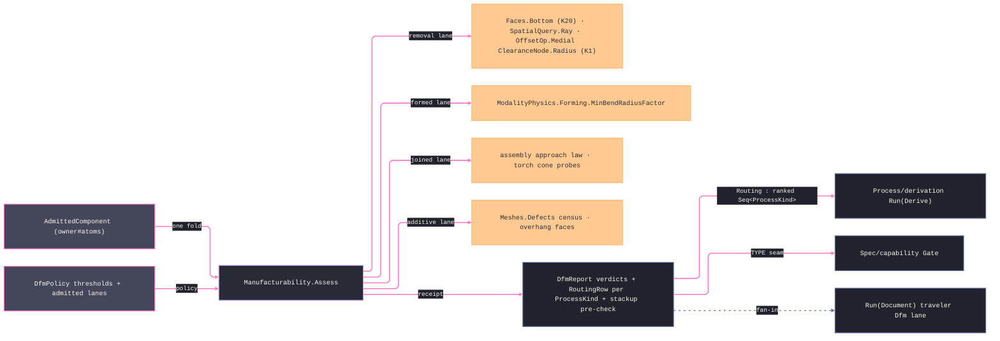

# [RASM_FABRICATION_MANUFACTURABILITY]

The cross-modality DfM owner: `Manufacturability` the static surface folding an `AdmittedComponent` into typed producibility VERDICTS on ONE entry — `Assess(AdmittedComponent, DfmPolicy) → Fin<DfmReport>` — with every verdict family dispatched over the `ModalityClass` superset (`removal`/`additive`/`formed`/`joined`, the `Process/family#PROCESS_FAMILY` four-way) and the INDEPENDENT lanes joined applicatively, so one lane's kernel failure never suppresses another lane's evidence. The removal lane reads the kernel measured-query fronts: draft and undercut ride one face-normal partition against the `Faces.Bottom` ranked resting set (K20 `Analyze.Run`), tool access rides ray interrogation over the component BVH (`SpatialQuery.Ray`), sharp internal corners ride the loop vertex/bulge capture, and min-wall reads the K1 medial clearance RADIUS (`OffsetOp.Medial` → `ClearanceNode.Radius`) — the ONE thinness probe, never a second medial or a hand-rolled normal classifier. The wall census is a SHARED lane: `min-wall` evidence lands whenever ANY of removal/additive/formed is admitted — the check's `Classes` set and its execution never disagree — while the depth-to-diameter aspect column stays removal-only and a present sheet thickness below the floor is the formed fast-check. The formed lane pre-checks bend radii from profile bulges (`R = c·(1+b²)/(4|b|)`) against the `ModalityPhysics.Forming.MinBendRadiusFactor` floor; the joined lane cones a torch-approach probe per `ComponentConnection` along the assembly-owned approach law; the additive lane censuses down-facing area against the critical angle and the `Meshes` printability rows. Verdicts are RECEIPTS: `DfmReport` rows carry check, severity, typed locus, and measured-vs-bound scalars — this page mints NO fault arm, and the hard gates stay with their owners (`MinBendRadiusViolated` 2743 is `Forming/sheet`'s unfold gate, `ToleranceUnsatisfiable` 2721/`CapabilityShortfall` 2722/`StackupExceeded` 2729 the sibling Spec pages').

Process ROUTING is the second product of the same fold: one `RoutingRow` per `ProcessKind` row — viable when the component's material map holds the process modality AND the modality's class lane was ADMITTED by policy AND closed with zero gate-severity blockers; an unassessed lane never reads as clear. The split with `Kinematics/fleet` is law: routing answers WHICH PROCESSES the part admits (verdict rows over the family axes); `Fleet.Capable` answers which MACHINES — envelope, spindle, pockets, rates — and derivation composes both in order. Stackup feasibility lands as the assembly-chain PRE-CHECK row (worst-case linear accumulation over the connection census against the policy bound); the Monte-Carlo distribution stackup stays the `Spec/capability` page, consumed as a TYPE contract. `Additive/support` keeps the layer-exact overhang census (this lane is the mesh-level DfM altitude — face census, not slice algebra); `Fixturing/assembly` keeps approach derivation and holding standoff; `Forming/sheet` keeps the unfold and its radius gate — this page composes their contracts and duplicates none of their interiors.

Wire posture: HOST-LOCAL. `DfmReport` crosses only the in-process seam to the derivation orchestrator, the traveler fan-in, and the capability gate — never a browser or peer wire; no verdict row sits between wire and rail. Rendering is the artifacts plane's: this page never draws, annotates, or emits a document.

## [01]-[INDEX]

- [01]-[MANUFACTURABILITY]: owns the `DfmSeverity`/`DfmCheck` vocabularies (check rows carrying their `ModalityClass` applicability sets), the `DfmLocus` typed verdict site, the `DfmPolicy` threshold row, the `DfmVerdict`/`RoutingRow`/`DfmReport` receipt family, and the ONE `Manufacturability.Assess` fold — applicatively-joined class lanes, the shared wall census, process routing, and the stackup pre-check off one entry; the N9 feature-recognition growth gate recorded against its three absent kernel primitives.

## [02]-[MANUFACTURABILITY]

- Owner: `DfmSeverity` `[SmartEnum<string>]` (`advisory`/`warning`/`blocker`) carrying the `Gate` column routing distinguishes on; `DfmCheck` `[SmartEnum<string>]` the check vocabulary — each row binds its `Classes` applicability set so a check lands ONCE and the class lanes select it, never per-modality check siblings; `DfmLocus` `[Union]` the typed verdict site (`AtPoint`/`AtEdge`/`AtFace`/`AtJoint`/`Global`) — a verdict never carries a formatted-string locus; `DfmPolicy` the constructor-bound threshold row (draft floor, access cone, min-wall, internal-corner floor, depth-to-diameter aspect, overhang critical angle aligned with `SupportPolicy.CriticalAngleDeg`, torch cone, stackup allowance/bound, probe reach, admitted lanes); `DfmVerdict` the per-finding receipt row; `RoutingRow` the per-`ProcessKind` viability row with its typed blocker set and friction count; `DfmReport` the ONE receipt (verdicts + routing rows + stackup pre-check) whose `Routing` projection IS the derivation contract — the ranked viable `Seq<ProcessKind>` (least friction first; empty routes derivation's `RoutingInfeasible` 2730) — beside `Blockers`/`Feasible`; `Manufacturability` the static surface whose ONE `Assess` discriminates by class lane.
- Cases: `DfmSeverity` rows 3; `DfmCheck` rows 9 — `draft`/`undercut`/`tool-access`/`corner-radius` {removal}, `min-wall` {removal, additive, formed}, `bend-radius` {formed}, `weld-access` {joined}, `overhang`/`integrity` {additive}; `DfmLocus` cases 5; the removal lane emits draft, undercut, access, and corner verdicts while the shared wall lane emits min-wall (all three classes) and the removal-only aspect column; the formed lane runs only when `SheetThicknessMm` is present (a solid never earns a phantom bend verdict); the joined lane runs one probe per connection; the additive lane gates on `Mesh` presence and degrades to an advisory on `None` (never silent).
- Entry: `public static Fin<DfmReport> Assess(AdmittedComponent component, DfmPolicy policy)` — the ONE cross-modality fold; `Fin<T>` routes only composed kernel failures (`GeometryFault` band-2400 pass-through) — a failed spatial build or ray query PROPAGATES as typed failure, never reads as clear access; an infeasible component is a REPORT full of blockers, never a fault — `Process/derivation` reads the report and routes its own `RoutingInfeasible` 2730 when routing exhausts.
- Auto: `Assess` joins the four admitted lanes applicatively over the `Fin` rail (`(removal, additive, joined, walls).Apply(...)` — independence licenses accumulation, the carrier selects the algebra), derives `RoutingRow`s for all eleven `ProcessKind` rows off the lane verdicts + the material's modality map + the policy's admitted-lane set, and folds the stackup pre-check from the connection census (`count · AllowancePerJoint ≤ Bound`). The removal lane composes `Analyze.Run` over the frozen `AnalysisQuery` algebra — `Faces.Bottom()` for the ranked resting partition, the native `FaceNormals` capture for the wall-angle law (draft is `90° − angle(normal, +Z)`; a negative draft is the re-entrant undercut blocker) — ray access via `SpatialQuery.Ray` over the component BVH, corner radii via the loop vertex/bulge capture against `MinInternalCornerRadiusMm`, and min-wall via ONE `Offsetting.Apply(OffsetOp.Medial)` per profile reading `ClearanceNode.Radius`; the aspect check divides pocket depth by twice the local medial radius. The formed lane projects fillet radii from `Loop.BulgeAt` spans and compares against `ModalityPhysics.Forming.MinBendRadiusFactor · SheetThicknessMm` (the sheet unfold re-derives exactly per-bend and owns the 2743 gate). The joined lane probes the assembly-law approach direction per `ComponentConnection` inside `TorchConeHalfAngleDeg` — a blocked cone is the `weld-access` verdict `Joining/weld` reads before planning beads. The additive lane censuses down-facing area below `OverhangCriticalDeg` via the ranked decomposition and runs the `Meshes.Defects` census rows; layer-exact truth stays `Support.Grow`'s.
- Receipt: `DfmReport` IS the evidence — typed verdict rows with measured/bound scalars and typed loci, routing rows with typed blocker sets, one stackup boolean; no score-only summary, no generic issue list, no string diagnosis.
- Packages: `Rasm.Analysis` (`Analyze.Run`/`AnalysisQuery` — the `Validation<Error, Seq<TOut>>` entry lowered through `.ToFin()`, `Faces.Bottom`, `Meshes.Defects` census — K20 + the census fronts), `Rasm.Meshing` (`Offsetting.Apply` `OffsetOp.Medial` → `ClearanceNode`, K1), `Rasm.Spatial` (`SpatialIndex`/`SpatialQuery.Ray`), `Process/owner#FABRICATION_OWNER` (`AdmittedComponent` and its rows), `Process/family#PROCESS_FAMILY` (`ModalityClass`/`ProcessModality`/`ProcessKind`), `Process/physics#CUT_PARAMETER` (`Material`/`ModalityPhysics.Forming`), Thinktecture.Runtime.Extensions, LanguageExt.Core (`Fin` applicative `Apply`, `guard`), `Rasm.Numerics` (`GeometryFault`), BCL inbox.
- Growth: a new producibility concern is one `DfmCheck` row + one lane term — never a sibling assessor class; a new threshold is one `DfmPolicy` field its lane reads; feature recognition (N9) GATES on three ABSENT kernel primitives — signed per-edge concavity, an analytic-form face classifier, exposed face-adjacency — recorded as kernel counterpart DEMANDS on the owning kernel pages, never a page here until all three land; a tolerance-achievability check row waits on a demanded-frame axis reaching `AdmittedComponent` — today the demanded/achievable comparison is `Spec/capability`'s `Achievable` against the input-carried verdict; zero new entrypoints.
- Boundary: ONE DfM surface — per-modality `MillingDfm`/`PrintabilityChecker`/`WeldabilityAudit` siblings are the deleted form; verdicts are receipts and a fault arm for "hard to make" is the named misuse (the receipts-only law — hard gates belong to the owning folds); a spatial failure mapped to a clear-access verdict is the named seam-erasure defect — build and query failures stay on the rail; the routing row answers process viability and a machine join here is fleet's stolen concern; kernel geometry composes at the verified fronts and a second medial, normal classifier, or ray walker is the named re-implementation defect; rendering is the artifacts plane's and a drawing/annotation emission here is the boundary violation; a `DfmCheck` re-encoding modality (a `mill-draft` beside `draft`) is the deleted axis-duplication.

```csharp signature
// --- [RUNTIME_PRELUDE] ----------------------------------------------------------------------------------------------------------------------------
using LanguageExt;
using LanguageExt.Common;
using Rasm.Analysis;                      // Analyze.Run · AnalysisQuery · Faces.Bottom · Meshes.Defects census
using Rasm.Fabrication.Process;           // AdmittedComponent · ModalityClass · ProcessModality · ProcessKind · Material · ModalityPhysics
using Rasm.Meshing;                       // MeshSpace · Offsetting.Apply · OffsetOp.Medial · ClearanceNode (K1)
using Rasm.Numerics;
using Rasm.Spatial;                       // SpatialIndex · SpatialQuery.Ray
using Rhino.Geometry;
using Thinktecture;
using static LanguageExt.Prelude;

namespace Rasm.Fabrication.Spec;

// --- [TYPES] --------------------------------------------------------------------------------------------------------------------------------------
[SmartEnum<string>]
public sealed partial class DfmSeverity {
    public static readonly DfmSeverity Advisory = new("advisory", gate: false);
    public static readonly DfmSeverity Warning = new("warning", gate: false);
    public static readonly DfmSeverity Blocker = new("blocker", gate: true);

    public bool Gate { get; }
}

// One check row per concern; the Classes set selects it into lanes — never a per-modality check sibling.
[SmartEnum<string>]
public sealed partial class DfmCheck {
    public static readonly DfmCheck Draft = new("draft", Set(ModalityClass.Removal));
    public static readonly DfmCheck Undercut = new("undercut", Set(ModalityClass.Removal));
    public static readonly DfmCheck ToolAccess = new("tool-access", Set(ModalityClass.Removal));
    public static readonly DfmCheck CornerRadius = new("corner-radius", Set(ModalityClass.Removal));
    public static readonly DfmCheck MinWall = new("min-wall", Set(ModalityClass.Removal, ModalityClass.Additive, ModalityClass.Formed));
    public static readonly DfmCheck BendRadius = new("bend-radius", Set(ModalityClass.Formed));
    public static readonly DfmCheck WeldAccess = new("weld-access", Set(ModalityClass.Joined));
    public static readonly DfmCheck Overhang = new("overhang", Set(ModalityClass.Additive));
    public static readonly DfmCheck Integrity = new("integrity", Set(ModalityClass.Additive));

    public Set<ModalityClass> Classes { get; }

    public bool AppliesTo(ModalityClass cls) => Classes.Contains(cls);
}

// --- [MODELS] -------------------------------------------------------------------------------------------------------------------------------------
[Union(ConversionFromValue = ConversionOperatorsGeneration.None)]
public abstract partial record DfmLocus {
    private DfmLocus() { }

    public sealed record AtPoint(Point3d Point) : DfmLocus;
    public sealed record AtEdge(Edge3 Edge) : DfmLocus;
    public sealed record AtFace(int Face) : DfmLocus;
    public sealed record AtJoint(int Joint) : DfmLocus;
    public sealed record Global() : DfmLocus;
}

// Threshold row: every bound a lane reads is a policy datum; OverhangCriticalDeg aligns with SupportPolicy.CriticalAngleDeg by seed, not by reference.
public sealed record DfmPolicy(
    double MinDraftDeg,
    double AccessConeHalfAngleDeg,
    double MinWallMm,
    double MinInternalCornerRadiusMm,
    double MaxDepthToDiameter,
    double OverhangCriticalDeg,
    double TorchConeHalfAngleDeg,
    double StackupAllowancePerJointMm,
    double StackupBoundMm,
    double ProbeReachMm,
    Set<ModalityClass> Lanes) {
    public static DfmPolicy Canonical =>
        new(2.0, 30.0, 1.0, 1.0, 4.0, 45.0, 35.0, 0.5, 3.0, 500.0, Set(ModalityClass.Removal, ModalityClass.Additive, ModalityClass.Formed, ModalityClass.Joined));
}

public sealed record DfmVerdict(DfmCheck Check, DfmSeverity Severity, DfmLocus Locus, double Measured, double Bound);

public sealed record RoutingRow(ProcessKind Process, bool Viable, Seq<DfmCheck> Blockers, int Friction);

public sealed record DfmReport(UInt128 ComponentKey, Seq<DfmVerdict> Verdicts, Seq<RoutingRow> Rows, bool StackupPrecheck) {
    public Seq<DfmVerdict> Blockers(ModalityClass cls) => Verdicts.Filter(v => v.Severity.Gate && v.Check.AppliesTo(cls));

    // THE derivation contract: the RANKED viable-process sequence (least advisory/warning friction first);
    // empty ⇒ derivation routes ITS RoutingInfeasible 2730 at the routing stage. Rows keep the typed blocker evidence.
    public Seq<ProcessKind> Routing => Rows.Filter(r => r.Viable).OrderBy(r => r.Friction).ToSeq().Map(r => r.Process);

    public bool Feasible(ModalityClass cls) => Blockers(cls).IsEmpty;
}

// --- [OPERATIONS] ---------------------------------------------------------------------------------------------------------------------------------
public static class Manufacturability {
    // ONE cross-modality fold: independent lanes join applicatively — a removal-lane kernel failure never suppresses
    // additive evidence, and every lane failure is a typed rail value. Infeasibility is a REPORT, never a fault.
    public static Fin<DfmReport> Assess(AdmittedComponent component, DfmPolicy policy) =>
        (policy.Lanes.Contains(ModalityClass.Removal) ? RemovalLane(component, policy) : Fin.Succ(Seq<DfmVerdict>()),
         policy.Lanes.Contains(ModalityClass.Additive) ? AdditiveLane(component, policy) : Fin.Succ(Seq<DfmVerdict>()),
         policy.Lanes.Contains(ModalityClass.Joined) ? JoinedLane(component, policy) : Fin.Succ(Seq<DfmVerdict>()),
         WallLane(component, policy))
            .Apply((removal, additive, joined, walls) =>
                removal + additive + joined + walls
                + (policy.Lanes.Contains(ModalityClass.Formed) ? FormedLane(component, policy) : Seq<DfmVerdict>()))
            .As()
            .Map(verdicts => new DfmReport(
                component.RepresentationKey,
                verdicts,
                Route(component, policy, verdicts),
                component.Connections.Count * policy.StackupAllowancePerJointMm <= policy.StackupBoundMm));

    // Routing = family-axis viability: the material map must hold the modality AND the class lane must have been
    // ADMITTED and gate-clean — an unassessed lane never reads as clear. Machine matching is Fleet.Capable's.
    static Seq<RoutingRow> Route(AdmittedComponent component, DfmPolicy policy, Seq<DfmVerdict> verdicts) =>
        toSeq(ProcessKind.Items).Map(kind => {
            Seq<DfmVerdict> lane = verdicts.Filter(v => v.Check.AppliesTo(kind.Modality.Class));
            Seq<DfmCheck> blockers = lane.Filter(v => v.Severity.Gate).Map(v => v.Check).Distinct();
            bool assessed = policy.Lanes.Contains(kind.Modality.Class);
            bool material = MaterialOf(component).Map(m => m.Physics.Find(kind.Modality).IsSome).IfNone(false);
            return new RoutingRow(kind, assessed && material && blockers.IsEmpty, blockers, lane.Filter(v => !v.Severity.Gate).Count);
        });

    // The SHARED wall census: min-wall evidence lands for removal, additive, AND formed off ONE Medial query per
    // profile (2·min Radius vs the floor); the aspect column emits only under the removal lane, and a present sheet
    // thickness below the floor is the formed fast-check — the check's Classes set and its execution never disagree.
    static Fin<Seq<DfmVerdict>> WallLane(AdmittedComponent component, DfmPolicy policy) {
        if (!policy.Lanes.Contains(ModalityClass.Removal) && !policy.Lanes.Contains(ModalityClass.Additive) && !policy.Lanes.Contains(ModalityClass.Formed))
            return Fin.Succ(Seq<DfmVerdict>());
        bool aspect = policy.Lanes.Contains(ModalityClass.Removal);
        double heightMm = component.Mesh.Map(static m => {
            BoundingBox box = m.Native.GetBoundingBox(accurate: false);
            return box.Max.Z - box.Min.Z;
        }).IfNone(0.0);
        Seq<DfmVerdict> sheet = component.SheetThicknessMm
            .Filter(t => t < policy.MinWallMm)
            .Map(t => new DfmVerdict(DfmCheck.MinWall, DfmSeverity.Blocker, new DfmLocus.Global(), t, policy.MinWallMm))
            .ToSeq();
        return component.Profiles.ToSeq()
            .Fold(Fin.Succ(sheet), (acc, loop) => acc.Bind(seq =>
                Offsetting.Apply(new OffsetOp.Medial(ToPolyline(loop), OffsetPolicy.Canonical)).Map(medial => seq + WallVerdicts(medial, heightMm, aspect, policy))));
    }

    // Removal lane: draft/undercut off one face-normal partition against the ranked resting set, access off BVH rays,
    // sharp internal corners off the vertex/bulge capture — each term Fin-shaped so a kernel failure stays typed.
    static Fin<Seq<DfmVerdict>> RemovalLane(AdmittedComponent component, DfmPolicy policy) =>
        from draft in DraftVerdicts(component, policy)
        from access in AccessVerdicts(component, policy)
        select draft + access + component.Profiles.ToSeq().Bind(loop => CornerVerdicts(loop, policy));

    // Formed lane: fillet radius from the bulge span (R = c·(1+b²)/(4|b|)) vs Forming.MinBendRadiusFactor·T — the DfM
    // altitude; Forming/sheet re-derives per-bend at unfold and owns MinBendRadiusViolated 2743.
    static Seq<DfmVerdict> FormedLane(AdmittedComponent component, DfmPolicy policy) =>
        (from t in component.SheetThicknessMm
         from row in MaterialOf(component).Bind(FormedRowOf)
         select component.Profiles.ToSeq().Bind(loop => BulgeRadii(loop)
             .Filter(r => r.Radius < row.MinBendRadiusFactor * t)
             .Map(r => new DfmVerdict(DfmCheck.BendRadius, DfmSeverity.Blocker, new DfmLocus.AtEdge(r.Span), r.Radius, row.MinBendRadiusFactor * t))))
        .IfNone(Seq<DfmVerdict>());

    // Joined lane: one torch-cone probe per connection along the assembly-owned approach law (left XY normal of the
    // At edge); assembly gates holding standoff, this lane gates the torch cone — Joining/weld reads the verdict.
    static Fin<Seq<DfmVerdict>> JoinedLane(AdmittedComponent component, DfmPolicy policy) =>
        toSeq(Enumerable.Range(0, component.Connections.Count))
            .Fold(Fin.Succ(Seq<DfmVerdict>()), (acc, joint) => acc.Bind(seq =>
                ConeClear(component, component.Connections[joint].At, policy).Map(clear => clear
                    ? seq
                    : seq + Seq1(new DfmVerdict(DfmCheck.WeldAccess, DfmSeverity.Blocker, new DfmLocus.AtJoint(joint), 0.0, policy.TorchConeHalfAngleDeg)))));

    // Additive lane: mesh-level census — down-facing ranked faces below the critical angle + the Meshes defect rows;
    // the layer-exact overhang set-algebra stays Support.Grow's, and layer HEIGHT stays the kernel LayerPlan (K3).
    static Fin<Seq<DfmVerdict>> AdditiveLane(AdmittedComponent component, DfmPolicy policy) =>
        component.Mesh.Match(
            Some: mesh => OverhangVerdicts(mesh, policy).Map(over => over + IntegrityVerdicts(mesh)),
            None: () => Fin.Succ(Seq1(new DfmVerdict(DfmCheck.Integrity, DfmSeverity.Advisory, new DfmLocus.Global(), 0.0, 0.0))));

    // Min-wall = 2·min(ClearanceNode.Radius) under the floor; aspect = the conservative global pocket depth (part
    // height) over 2·local radius. The Medial op answers OffsetResult.Axis carrying the K1 SkeletonGraph node set.
    static Seq<DfmVerdict> WallVerdicts(OffsetResult medial, double heightMm, bool aspect, DfmPolicy policy) =>
        medial is not OffsetResult.Axis axis
            ? Seq<DfmVerdict>()
            : axis.Medial.Nodes.Bind(node =>
                (2.0 * node.Radius < policy.MinWallMm
                    ? Seq1(new DfmVerdict(DfmCheck.MinWall, DfmSeverity.Blocker, new DfmLocus.AtPoint(node.At), 2.0 * node.Radius, policy.MinWallMm))
                    : Seq<DfmVerdict>())
                + (aspect && heightMm > 0.0 && heightMm / (2.0 * node.Radius) > policy.MaxDepthToDiameter
                    ? Seq1(new DfmVerdict(DfmCheck.ToolAccess, DfmSeverity.Warning, new DfmLocus.AtPoint(node.At), heightMm / (2.0 * node.Radius), policy.MaxDepthToDiameter))
                    : Seq<DfmVerdict>()));

    // Draft + undercut off ONE face-normal partition: the wall draft is 90° − angle(normal, pull axis +Z); a face in
    // [0, MinDraftDeg) is the insufficient-draft warning, a negative draft the re-entrant undercut blocker. Bottom
    // extremum faces (Faces.Bottom, the K20 ranked decomposition) are the resting partition and never flag; a failed
    // resting census PROPAGATES — profiles-only parts earn no draft verdicts, draft is a solid-face concern.
    static Fin<Seq<DfmVerdict>> DraftVerdicts(AdmittedComponent component, DfmPolicy policy) =>
        component.Mesh.Match(
            None: static () => Fin.Succ(Seq<DfmVerdict>()),
            Some: mesh => BottomFaces(mesh).Map(resting =>
                FaceNormals(mesh)
                    .Filter(row => !resting.Contains(row.Face))
                    .Bind(row => {
                        double draftDeg = 90.0 - (Vector3d.VectorAngle(row.Normal, Vector3d.ZAxis) * (180.0 / Math.PI));
                        return draftDeg < 0.0
                            ? Seq1(new DfmVerdict(DfmCheck.Undercut, DfmSeverity.Blocker, new DfmLocus.AtFace(row.Face), draftDeg, 0.0))
                            : draftDeg < policy.MinDraftDeg
                                ? Seq1(new DfmVerdict(DfmCheck.Draft, DfmSeverity.Warning, new DfmLocus.AtFace(row.Face), draftDeg, policy.MinDraftDeg))
                                : Seq<DfmVerdict>();
                    })));

    // Tool access: one +Z ray per profile vertex against the mesh-face BVH. A hit above the vertex means the cutter
    // axis is occluded — the blocker carries the hit distance; a failed build or query stays on the rail.
    static Fin<Seq<DfmVerdict>> AccessVerdicts(AdmittedComponent component, DfmPolicy policy) =>
        component.Mesh.Match(
            None: static () => Fin.Succ(Seq<DfmVerdict>()),
            Some: mesh => BvhOf(mesh).Bind(index => component.Profiles.ToSeq()
                .Bind(static loop => loop.AsCcw().Vertices.ToSeq())
                .Fold(Fin.Succ(Seq<DfmVerdict>()), (acc, point) => acc.Bind(seq =>
                    RayHitT(index, new Ray3d(point, Vector3d.ZAxis), policy.ProbeReachMm).Map(hit => seq + hit
                        .Map(t => new DfmVerdict(DfmCheck.ToolAccess, DfmSeverity.Blocker, new DfmLocus.AtPoint(point), t, policy.ProbeReachMm))
                        .ToSeq())))));

    // Sharp internal corners: a concave vertex whose adjacent spans are both straight is a zero-radius corner only
    // EDM reaches; a concave bulged span below the floor flags with its real radius. CCW winding makes concavity the
    // negative z-cross of the incoming/outgoing span directions.
    static Seq<DfmVerdict> CornerVerdicts(Loop loop, DfmPolicy policy) {
        Loop ccw = loop.AsCcw();
        return toSeq(Enumerable.Range(0, ccw.Count))
            .Filter(i => {
                Point3d prev = ccw.At((i + ccw.Count - 1) % ccw.Count), at = ccw.At(i), next = ccw.At((i + 1) % ccw.Count);
                double cross = ((at.X - prev.X) * (next.Y - at.Y)) - ((at.Y - prev.Y) * (next.X - at.X));
                return cross < 0.0 && Math.Abs(ccw.BulgeAt((i + ccw.Count - 1) % ccw.Count)) == 0.0 && Math.Abs(ccw.BulgeAt(i)) == 0.0;
            })
            .Map(i => new DfmVerdict(DfmCheck.CornerRadius, DfmSeverity.Warning, new DfmLocus.AtPoint(ccw.At(i)), 0.0, policy.MinInternalCornerRadiusMm));
    }

    // Torch cone: five probes — the assembly-law approach (the left XY normal of the joint edge) plus four rays tilted
    // to the cone half-angle. ANY occluded probe fails the cone; a failed spatial operation PROPAGATES, never reads
    // clear. An unresolved joint locus (the admission default) and a profiles-only part cannot be probed and read
    // clear here — assembly resolves the edge and re-gates standoff.
    static Fin<bool> ConeClear(AdmittedComponent component, Edge3 at, DfmPolicy policy) =>
        at.A.DistanceTo(at.B) <= 0.0
            ? Fin.Succ(true)
            : component.Mesh.Match(
                None: static () => Fin.Succ(true),
                Some: mesh => BvhOf(mesh).Bind(index =>
                    ConeRays(at, policy.TorchConeHalfAngleDeg).Fold(Fin.Succ(true), (acc, ray) => acc.Bind(clear =>
                        clear ? RayHitT(index, ray, policy.ProbeReachMm).Map(static hit => hit.IsNone) : Fin.Succ(false)))));

    static Seq<Ray3d> ConeRays(Edge3 at, double halfAngleDeg) {
        Point3d mid = new((at.A.X + at.B.X) / 2.0, (at.A.Y + at.B.Y) / 2.0, (at.A.Z + at.B.Z) / 2.0);
        Vector3d edge = at.B - at.A;
        Vector3d approach = new(-edge.Y, edge.X, 0.0);
        approach.Unitize();
        double half = halfAngleDeg * (Math.PI / 180.0);
        Vector3d side = Vector3d.CrossProduct(approach, Vector3d.ZAxis);
        Point3d origin = mid + approach;  // 1 mm standoff keeps the probe off its own seed surface
        return Seq1(new Ray3d(origin, approach))
            + Seq(Vector3d.ZAxis, -Vector3d.ZAxis, side, -side).Map(tilt => {
                Vector3d v = approach;
                v.Rotate(half, tilt);
                return new Ray3d(origin, v);
            });
    }

    // Additive overhang census (mesh-level DfM altitude): a non-resting face whose normal sits within (90° − critical)
    // of straight down needs support — layer-exact set algebra stays Support.Grow's.
    static Fin<Seq<DfmVerdict>> OverhangVerdicts(MeshSpace mesh, DfmPolicy policy) =>
        BottomFaces(mesh).Map(resting =>
            FaceNormals(mesh)
                .Filter(row => !resting.Contains(row.Face))
                .Map(row => (row.Face, DownDeg: Vector3d.VectorAngle(row.Normal, -Vector3d.ZAxis) * (180.0 / Math.PI)))
                .Filter(row => row.DownDeg < 90.0 - policy.OverhangCriticalDeg)
                .Map(row => new DfmVerdict(DfmCheck.Overhang, DfmSeverity.Warning, new DfmLocus.AtFace(row.Face), row.DownDeg, 90.0 - policy.OverhangCriticalDeg)));

    // Printability census (K36): every positive kernel defect sample is one Integrity blocker; a census that cannot
    // run at all is itself the blocker — the additive lane never silently passes an uninspectable mesh.
    static Seq<DfmVerdict> IntegrityVerdicts(MeshSpace mesh) =>
        Analyze.Run<Mesh, MeshSample>(new AnalysisQuery.MeshesCase(Meshes.Defects), mesh.Native).Match(
            Succ: samples => samples.Filter(static s => s.Value > 0)
                .Map(static s => new DfmVerdict(DfmCheck.Integrity, DfmSeverity.Blocker, new DfmLocus.Global(), s.Value, 0.0)),
            Fail: static _ => Seq1(new DfmVerdict(DfmCheck.Integrity, DfmSeverity.Blocker, new DfmLocus.Global(), 0.0, 0.0)));

    // --- [BOUNDARIES] -------------------------------------------------------------------------------------------------------------------------------
    // Loop → closed Rhino ring for the K1 medial query; AsCcw is the winding law, the closing vertex the ring convention.
    static Polyline ToPolyline(Loop loop) {
        Polyline ring = new(loop.AsCcw().Vertices);
        if (ring.Count > 0)
            ring.Add(ring[0]);
        return ring;
    }

    // The resting-set census stays on the rail: Analyze.Run answers Validation and lowers through ToFin — a failed
    // ranked decomposition is a typed lane failure, never an empty resting set that turns bottom faces into undercuts.
    static Fin<Set<int>> BottomFaces(MeshSpace mesh) =>
        Analyze.Run<Mesh, int>(new AnalysisQuery.FacesCase(Faces.Bottom()), mesh.Native).ToFin().Map(static faces => toSet(faces));

    static Seq<(int Face, Vector3d Normal)> FaceNormals(MeshSpace mesh) {
        Mesh native = mesh.Native;
        native.FaceNormals.ComputeFaceNormals();
        return toSeq(Enumerable.Range(0, native.Faces.Count)).Map(i => (i, (Vector3d)native.FaceNormals[i]));
    }

    static Fin<SpatialIndex> BvhOf(MeshSpace mesh) =>
        Spatial.Apply(new SpatialOp.Build(SpatialKind.Bvh, FaceBoxes(mesh.Native), BuildPolicy.Canonical))
            .Bind(static answer => answer is SpatialAnswer.Index built
                ? Fin.Succ(built.Value)
                : Fin.Fail<SpatialIndex>(GeometryFault.DegenerateInput("manufacturability:spatial-answer").ToError()));

    static Fin<Option<double>> RayHitT(SpatialIndex index, Ray3d ray, double maxT) =>
        Spatial.Apply(new SpatialOp.Query(index, new SpatialQuery.Ray(ray, maxT)))
            .Map(static answer => answer is SpatialAnswer.Result { Value: QueryResult.RayHit { Id.IsSome: true } hit }
                ? Some(hit.T)
                : Option<double>.None);

    static BoundingBox[] FaceBoxes(Mesh native) =>
        Enumerable.Range(0, native.Faces.Count)
            .Select(i => {
                MeshFace face = native.Faces[i];
                BoundingBox box = BoundingBox.Empty;
                box.Union(native.Vertices[face.A]);
                box.Union(native.Vertices[face.B]);
                box.Union(native.Vertices[face.C]);
                if (face.IsQuad)
                    box.Union(native.Vertices[face.D]);
                return box;
            })
            .ToArray();

    // Bulge span → (chord, radius): R = c·(1+b²)/(4|b|); zero-bulge spans are straight and never earn a radius verdict.
    static Seq<(Edge3 Span, double Radius)> BulgeRadii(Loop loop) =>
        toSeq(Enumerable.Range(0, loop.Count))
            .Filter(i => Math.Abs(loop.BulgeAt(i)) > 0.0)
            .Map(i => {
                double b = Math.Abs(loop.BulgeAt(i));
                double c = loop.At(i).DistanceTo(loop.At(i + 1));
                return (new Edge3(loop.At(i), loop.At(i + 1)), c * (1.0 + b * b) / (4.0 * b));
            });

    static Option<Material> MaterialOf(AdmittedComponent component) =>
        component.Properties.Find("material").Bind(key => Material.Validate(key, null, out Material? m) is null ? Some(m!) : Option<Material>.None);

    static Option<ModalityPhysics.Forming> FormedRowOf(Material material) =>
        material.Physics.Find(ProcessModality.Formed).Bind(p => p is ModalityPhysics.Forming f ? Some(f) : Option<ModalityPhysics.Forming>.None);
}
```


