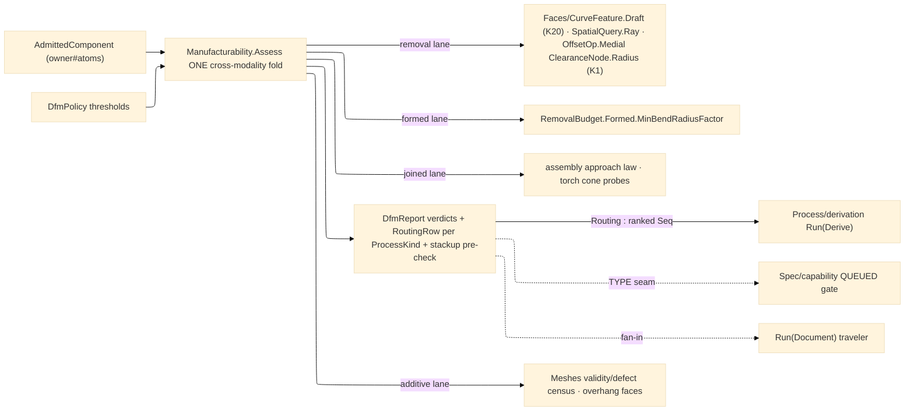

# [RASM_FABRICATION_MANUFACTURABILITY]

The cross-modality DfM owner: `Manufacturability` the static surface folding an `AdmittedComponent` into typed producibility VERDICTS on ONE entry — `Assess(AdmittedComponent, DfmPolicy) → Fin<DfmReport>` — with every verdict family dispatched over the `ModalityClass` superset (`removal`/`additive`/`formed`/`joined`, the `Process/family#PROCESS_FAMILY` four-way). The removal lane reads the kernel measured-query fronts: draft and undercut ride the axis-ranked face decomposition + `CurveFeature.Draft` capture (`Faces.Top`/`Bottom`/`At`), tool access rides ray interrogation (`RayQuery` batch probes and the `SpatialQuery.Ray` BVH front), and min-wall reads the K1 medial clearance RADIUS (`OffsetOp.Medial` → `ClearanceNode.Radius`) — the ONE thinness probe, never a second medial or a hand-rolled normal classifier. The formed lane pre-checks bend radii from profile bulges (`R = c·(1+b²)/(4|b|)`) against the landed `RemovalBudget.Formed.MinBendRadiusFactor` floor; the joined lane cones a torch-approach probe per `ComponentConnection` along the assembly-owned approach law; the additive lane censuses down-facing area against the critical angle and the `Meshes` printability rows. Verdicts are RECEIPTS: `DfmReport` rows carry check, severity, typed locus, and measured-vs-bound scalars — this page mints NO fault arm, and the hard gates stay with their owners (`MinBendRadiusViolated` 2743 is `Forming/sheet`'s unfold gate, `ToleranceUnsatisfiable` 2721/`CapabilityShortfall` 2722/`StackupExceeded` 2729 the queued Spec pages').

Process ROUTING is the second product of the same fold: one `RoutingRow` per `ProcessKind` row — viable when the component's material map holds the process modality AND the modality's class lane closed with zero gate-severity blockers. The split with `Kinematics/fleet` is law: routing answers WHICH PROCESSES the part admits (verdict rows over the family axes); `Fleet.Capable` answers which MACHINES — envelope, spindle, pockets, rates — and derivation composes both in order. Stackup feasibility lands as the assembly-chain PRE-CHECK row (worst-case linear accumulation over the connection census against the policy bound); the Monte-Carlo distribution stackup stays the queued `Spec/capability` page, consumed as a TYPE contract when the truth tranche lands. `Additive/support` keeps the layer-exact overhang census (this lane is the mesh-level DfM altitude — face census, not slice algebra); `Fixturing/assembly` keeps approach derivation and holding standoff; `Forming/sheet` keeps the unfold and its radius gate — this page composes their contracts and duplicates none of their interiors.

Wire posture: HOST-LOCAL. `DfmReport` crosses only the in-process seam to the derivation orchestrator, the traveler fan-in, and the queued capability gate — never a browser or peer wire; no verdict row sits between wire and rail. Rendering is the artifacts plane's: this page never draws, annotates, or emits a document.

## [01]-[INDEX]

- [01]-[MANUFACTURABILITY]: owns the `DfmSeverity`/`DfmCheck` vocabularies (check rows carrying their `ModalityClass` applicability sets), the `DfmLocus` typed verdict site, the `DfmPolicy` threshold row, the `DfmVerdict`/`RoutingRow`/`DfmReport` receipt family, and the ONE `Manufacturability.Assess` fold — class-lane verdicts, process routing, and the stackup pre-check off one entry; the N9 feature-recognition growth gate recorded against its three absent kernel primitives.

## [02]-[MANUFACTURABILITY]

- Owner: `DfmSeverity` `[SmartEnum<string>]` (`advisory`/`warning`/`blocker`) carrying the `Gate` column routing distinguishes on; `DfmCheck` `[SmartEnum<string>]` the check vocabulary — each row binds its `Classes` applicability set so a check lands ONCE and the class lanes select it, never per-modality check siblings; `DfmLocus` `[Union]` the typed verdict site (`AtPoint`/`AtEdge`/`AtFace`/`AtJoint`/`Global`) — a verdict never carries a formatted-string locus; `DfmPolicy` the constructor-bound threshold row (draft floor, access cone, min-wall, depth-to-diameter aspect, overhang critical angle aligned with `SupportPolicy.CriticalAngleDeg`, torch cone, stackup allowance/bound, admitted lanes); `DfmVerdict` the per-finding receipt row; `RoutingRow` the per-`ProcessKind` viability row with its typed blocker set and friction count; `DfmReport` the ONE receipt (verdicts + routing rows + stackup pre-check) whose `Routing` projection IS the derivation contract — the ranked viable `Seq<ProcessKind>` (least friction first; empty routes derivation's `RoutingInfeasible` 2730) — beside `Blockers`/`Feasible`; `Manufacturability` the static surface whose ONE `Assess` discriminates by class lane.
- Cases: `DfmSeverity` rows 3; `DfmCheck` rows 8 — `draft`/`undercut`/`tool-access` {removal}, `min-wall` {removal, additive, formed}, `bend-radius` {formed}, `weld-access` {joined}, `overhang`/`integrity` {additive}; `DfmLocus` cases 5; the removal lane runs draft → undercut → access → aspect → min-wall in dependency order (undercut reuses the draft capture's face partition); the formed lane runs only when `SheetThicknessMm` is present (a solid never earns a phantom bend verdict); the joined lane runs one probe per connection; the additive lane gates on `Mesh` presence and degrades to profile-silhouette census on `None` (advisory, never silent).
- Entry: `public static Fin<DfmReport> Assess(AdmittedComponent component, DfmPolicy policy)` — the ONE cross-modality fold; `Fin<T>` routes only composed kernel failures (`GeometryFault` band-2400 pass-through); an infeasible component is a REPORT full of blockers, never a fault — `Process/derivation` reads the report and routes its own `RoutingInfeasible` 2730 when routing exhausts.
- Auto: `Assess` resolves the material once (`Properties["material"]` → `Material` row → the physics map), runs each admitted class lane, derives `RoutingRow`s for all eleven `ProcessKind` rows off the lane verdicts + the material's modality map, and folds the stackup pre-check from the connection census (`count · AllowancePerJoint ≤ Bound`). The removal lane composes `Analyze.Run` over the frozen `AnalysisQuery` algebra (`Faces.Top`/`Bottom` ranked decomposition per pull axis; `CurveFeature.Draft` capture; `Meshes.NakedEdges` for machinable-boundary sanity), ray access via `SpatialQuery.Ray` over the component BVH, and min-wall via ONE `Offsetting.Apply(OffsetOp.Medial)` per profile reading `ClearanceNode.Radius`; the aspect check divides pocket depth by twice the local medial radius. The formed lane projects fillet radii from `Loop.BulgeAt` spans and compares against `Formed.MinBendRadiusFactor · SheetThicknessMm` (the sheet unfold re-derives exactly per-bend and owns the 2743 gate). The joined lane probes the assembly-law approach direction per `ComponentConnection` inside `TorchConeHalfAngleDeg` — a blocked cone is the `weld-access` verdict `Joining/weld` reads before planning beads. The additive lane censuses down-facing area below `OverhangCriticalDeg` via the K20 ranked decomposition and runs the `Meshes.Validity`/`Defects` census rows; layer-exact truth stays `Support.Grow`'s.
- Receipt: `DfmReport` IS the evidence — typed verdict rows with measured/bound scalars and typed loci, routing rows with typed blocker sets, one stackup boolean; no score-only summary, no generic issue list, no string diagnosis.
- Packages: `Rasm.Analysis` (`Analyze.Run`/`AnalysisQuery`, `Faces`/`CurveFeature.Draft`, `Meshes` census, `RayQuery` — K20 + the census/interrogation fronts), `Rasm.Meshing` (`Offsetting.Apply` `OffsetOp.Medial` → `ClearanceNode`, K1), `Rasm.Spatial` (`SpatialIndex`/`SpatialQuery.Ray`), `Process/owner#FABRICATION_OWNER` (`AdmittedComponent` and its rows), `Process/family#PROCESS_FAMILY` (`ModalityClass`/`ProcessModality`/`ProcessKind`), `Process/physics#CUT_PARAMETER` (`Material`/`RemovalBudget.Formed`), Thinktecture.Runtime.Extensions, LanguageExt.Core, `Rasm.Numerics` (`GeometryFault`), BCL inbox.
- Growth: a new producibility concern is one `DfmCheck` row + one lane term — never a sibling assessor class; a new threshold is one `DfmPolicy` field its lane reads; feature recognition (N9) GATES on three ABSENT kernel primitives — signed per-edge concavity, an analytic-form face classifier, exposed face-adjacency — recorded as kernel counterpart DEMANDS on the owning kernel pages, never a page here until all three land; the queued `tolerance`/`capability` pages deepen the spec side without touching this surface; zero new entrypoints.
- Boundary: ONE DfM surface — per-modality `MillingDfm`/`PrintabilityChecker`/`WeldabilityAudit` siblings are the deleted form; verdicts are receipts and a fault arm for "hard to make" is the named misuse (the receipts-only law — hard gates belong to the owning folds); the routing row answers process viability and a machine join here is fleet's stolen concern; kernel geometry composes at the verified fronts and a second medial, normal classifier, or ray walker is the named re-implementation defect; rendering is the artifacts plane's and a drawing/annotation emission here is the boundary violation; a `DfmCheck` re-encoding modality (a `mill-draft` beside `draft`) is the deleted axis-duplication.

```csharp signature
// --- [RUNTIME_PRELUDE] ----------------------------------------------------------------------------------------------------------------------------
using LanguageExt;
using LanguageExt.Common;
using Rasm.Analysis;                      // Analyze.Run · AnalysisQuery · Faces · CurveFeature.Draft · Meshes census · RayQuery
using Rasm.Fabrication.Process;           // AdmittedComponent · ModalityClass · ProcessModality · ProcessKind · Material · RemovalBudget
using Rasm.Meshing;                       // MeshSpace · Offsetting.Apply · OffsetOp.Medial · ClearanceNode (K1)
using Rasm.Numerics;
using Rasm.Spatial;                       // SpatialIndex · SpatialQuery.Ray
using Rhino.Geometry;
using Thinktecture;
using static LanguageExt.Prelude;

namespace Rasm.Fabrication.Spec;

// --- [TYPES] --------------------------------------------------------------------------------------------------------------------------------------
[SmartEnum<string>]
public sealed partial class DfmSeverity {
    public static readonly DfmSeverity Advisory = new("advisory", gate: false);
    public static readonly DfmSeverity Warning = new("warning", gate: false);
    public static readonly DfmSeverity Blocker = new("blocker", gate: true);

    public bool Gate { get; }
}

// One check row per concern; the Classes set selects it into lanes — never a per-modality check sibling.
[SmartEnum<string>]
public sealed partial class DfmCheck {
    public static readonly DfmCheck Draft = new("draft", Set(ModalityClass.Removal));
    public static readonly DfmCheck Undercut = new("undercut", Set(ModalityClass.Removal));
    public static readonly DfmCheck ToolAccess = new("tool-access", Set(ModalityClass.Removal));
    public static readonly DfmCheck MinWall = new("min-wall", Set(ModalityClass.Removal, ModalityClass.Additive, ModalityClass.Formed));
    public static readonly DfmCheck BendRadius = new("bend-radius", Set(ModalityClass.Formed));
    public static readonly DfmCheck WeldAccess = new("weld-access", Set(ModalityClass.Joined));
    public static readonly DfmCheck Overhang = new("overhang", Set(ModalityClass.Additive));
    public static readonly DfmCheck Integrity = new("integrity", Set(ModalityClass.Additive));

    public Set<ModalityClass> Classes { get; }

    public bool AppliesTo(ModalityClass cls) => Classes.Contains(cls);
}

// --- [MODELS] -------------------------------------------------------------------------------------------------------------------------------------
[Union(ConversionFromValue = ConversionOperatorsGeneration.None)]
public abstract partial record DfmLocus {
    private DfmLocus() { }

    public sealed record AtPoint(Point3d Point) : DfmLocus;
    public sealed record AtEdge(Edge3 Edge) : DfmLocus;
    public sealed record AtFace(int Face) : DfmLocus;
    public sealed record AtJoint(int Joint) : DfmLocus;
    public sealed record Global() : DfmLocus;
}

// Threshold row: every bound a lane reads is a policy datum; OverhangCriticalDeg aligns with SupportPolicy.CriticalAngleDeg by seed, not by reference.
public sealed record DfmPolicy(
    double MinDraftDeg,
    double AccessConeHalfAngleDeg,
    double MinWallMm,
    double MaxDepthToDiameter,
    double OverhangCriticalDeg,
    double TorchConeHalfAngleDeg,
    double StackupAllowancePerJointMm,
    double StackupBoundMm,
    Set<ModalityClass> Lanes) {
    public static DfmPolicy Canonical =>
        new(2.0, 30.0, 1.0, 4.0, 45.0, 35.0, 0.5, 3.0, Set(ModalityClass.Removal, ModalityClass.Additive, ModalityClass.Formed, ModalityClass.Joined));
}

public sealed record DfmVerdict(DfmCheck Check, DfmSeverity Severity, DfmLocus Locus, double Measured, double Bound);

public sealed record RoutingRow(ProcessKind Process, bool Viable, Seq<DfmCheck> Blockers, int Friction);

public sealed record DfmReport(UInt128 ComponentKey, Seq<DfmVerdict> Verdicts, Seq<RoutingRow> Rows, bool StackupPrecheck) {
    public Seq<DfmVerdict> Blockers(ModalityClass cls) => Verdicts.Filter(v => v.Severity.Gate && v.Check.AppliesTo(cls));

    // THE derivation contract: the RANKED viable-process sequence (least advisory/warning friction first);
    // empty ⇒ derivation routes ITS RoutingInfeasible 2730 at the routing stage. Rows keep the typed blocker evidence.
    public Seq<ProcessKind> Routing => Rows.Filter(r => r.Viable).OrderBy(r => r.Friction).ToSeq().Map(r => r.Process);

    public bool Feasible(ModalityClass cls) => Blockers(cls).IsEmpty;
}

// --- [OPERATIONS] ---------------------------------------------------------------------------------------------------------------------------------
public static class Manufacturability {
    // ONE cross-modality fold: lane verdicts, routing rows, stackup pre-check. Infeasibility is a REPORT, never a fault;
    // derivation routes RoutingInfeasible 2730 off an exhausted report, the hard per-fold gates stay with their owners.
    public static Fin<DfmReport> Assess(AdmittedComponent component, DfmPolicy policy) =>
        from removal in policy.Lanes.Contains(ModalityClass.Removal) ? RemovalLane(component, policy) : Fin.Succ(Seq<DfmVerdict>())
        from additive in policy.Lanes.Contains(ModalityClass.Additive) ? AdditiveLane(component, policy) : Fin.Succ(Seq<DfmVerdict>())
        let formed = policy.Lanes.Contains(ModalityClass.Formed) ? FormedLane(component, policy) : Seq<DfmVerdict>()
        let joined = policy.Lanes.Contains(ModalityClass.Joined) ? JoinedLane(component, policy) : Seq<DfmVerdict>()
        let verdicts = removal + additive + formed + joined
        let stackup = component.Connections.Count * policy.StackupAllowancePerJointMm <= policy.StackupBoundMm
        select new DfmReport(component.RepresentationKey, verdicts, Route(component, verdicts), stackup);

    // Routing = family-axis viability: the material map must hold the modality AND the modality's class lane must be gate-clean.
    // Machine matching (envelope/spindle/pockets/rates) is Fleet.Capable's — a machine column here is the stolen concern.
    static Seq<RoutingRow> Route(AdmittedComponent component, Seq<DfmVerdict> verdicts) =>
        toSeq(ProcessKind.Items).Map(kind => {
            Seq<DfmVerdict> lane = verdicts.Filter(v => v.Check.AppliesTo(kind.Modality.Class));
            Seq<DfmCheck> blockers = lane.Filter(v => v.Severity.Gate).Map(v => v.Check).Distinct();
            bool material = MaterialOf(component).Map(m => m.Physics.Find(kind.Modality).IsSome).IfNone(false);
            return new RoutingRow(kind, material && blockers.IsEmpty, blockers, lane.Filter(v => !v.Severity.Gate).Count);
        });

    // Removal lane: min-wall/aspect off ONE Medial query per profile (2·min Radius vs the floor; depth over 2·local radius);
    // draft/undercut/access are the DraftVerdicts/AccessVerdicts privates over the K20 decomposition + ray cone (Auto bullet).
    static Fin<Seq<DfmVerdict>> RemovalLane(AdmittedComponent component, DfmPolicy policy) =>
        component.Profiles.ToSeq()
            .Fold(Fin.Succ(Seq<DfmVerdict>()), (acc, loop) => acc.Bind(seq =>
                Offsetting.Apply(new OffsetOp.Medial(ToPolyline(loop), OffsetPolicy.Canonical)).Map(medial => seq + WallVerdicts(medial, policy))))
            .Map(walls => walls + DraftVerdicts(component, policy) + AccessVerdicts(component, policy));

    // Formed lane: fillet radius from the bulge span (R = c·(1+b²)/(4|b|)) vs Formed.MinBendRadiusFactor·T — the DfM altitude;
    // Forming/sheet re-derives per-bend at unfold and owns MinBendRadiusViolated 2743.
    static Seq<DfmVerdict> FormedLane(AdmittedComponent component, DfmPolicy policy) =>
        (from t in component.SheetThicknessMm
         from row in MaterialOf(component).Bind(FormedRowOf)
         select component.Profiles.ToSeq().Bind(loop => BulgeRadii(loop)
             .Filter(r => r.Radius < row.MinBendRadiusFactor * t)
             .Map(r => new DfmVerdict(DfmCheck.BendRadius, DfmSeverity.Blocker, new DfmLocus.AtEdge(r.Span), r.Radius, row.MinBendRadiusFactor * t))))
        .IfNone(Seq<DfmVerdict>());

    // Joined lane: one torch-cone probe per connection along the assembly-owned approach law (left XY normal of the At edge);
    // assembly gates holding standoff, this lane gates the torch cone — Joining/weld reads the verdict before bead planning.
    static Seq<DfmVerdict> JoinedLane(AdmittedComponent component, DfmPolicy policy) =>
        toSeq(Enumerable.Range(0, component.Connections.Count))
            .Filter(joint => !ConeClear(component, component.Connections[joint].At, policy.TorchConeHalfAngleDeg))
            .Map(joint => new DfmVerdict(DfmCheck.WeldAccess, DfmSeverity.Blocker, new DfmLocus.AtJoint(joint), 0.0, policy.TorchConeHalfAngleDeg));

    // Additive lane: mesh-level census — down-facing ranked faces below the critical angle + the Meshes validity/defect rows;
    // the layer-exact overhang set-algebra stays Support.Grow's, and layer HEIGHT stays the kernel LayerPlan (K3, sealed).
    static Fin<Seq<DfmVerdict>> AdditiveLane(AdmittedComponent component, DfmPolicy policy) =>
        component.Mesh.Match(
            Some: mesh => OverhangVerdicts(mesh, policy).Map(over => over + IntegrityVerdicts(mesh)),
            None: () => Fin.Succ(Seq1(new DfmVerdict(DfmCheck.Integrity, DfmSeverity.Advisory, new DfmLocus.Global(), 0.0, 0.0))));

    // Min-wall = 2·min(ClearanceNode.Radius) under the floor; aspect = pocket depth / (2·local radius) over the bound.
    static Seq<DfmVerdict> WallVerdicts(OffsetResult medial, DfmPolicy policy) =>
        medial.Nodes.ToSeq()
            .Filter(node => 2.0 * node.Radius < policy.MinWallMm)
            .Map(node => new DfmVerdict(DfmCheck.MinWall, DfmSeverity.Blocker, new DfmLocus.AtPoint(node.At), 2.0 * node.Radius, policy.MinWallMm));

    // Bulge span → (chord, radius): R = c·(1+b²)/(4|b|); zero-bulge spans are straight and never earn a radius verdict.
    static Seq<(Edge3 Span, double Radius)> BulgeRadii(Loop loop) =>
        toSeq(Enumerable.Range(0, loop.Count))
            .Filter(i => Math.Abs(loop.BulgeAt(i)) > 0.0)
            .Map(i => {
                double b = Math.Abs(loop.BulgeAt(i));
                double c = loop.At(i).DistanceTo(loop.At(i + 1));
                return (new Edge3(loop.At(i), loop.At(i + 1)), c * (1.0 + b * b) / (4.0 * b));
            });

    static Option<Material> MaterialOf(AdmittedComponent component) =>
        component.Properties.Find("material").Bind(key => Material.Validate(key, null, out var m) is null ? Some(m!) : Option<Material>.None);

    static Option<ModalityPhysics.Forming> FormedRowOf(Material material) =>
        material.Physics.Find(ProcessModality.Formed).Bind(p => p is ModalityPhysics.Forming f ? Some(f) : Option<ModalityPhysics.Forming>.None);
}
```


