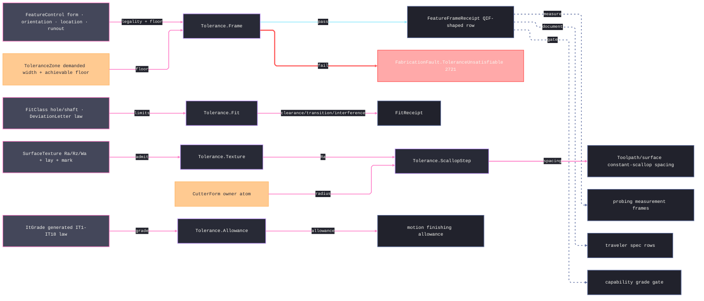

# [RASM_FABRICATION_TOLERANCE]

The tolerance owner closes the fabrication specification vocabulary over ISO 1101/ASME Y14.5 geometric frames, the ISO 286 grade-and-deviation system, ISO 1302 surface texture rows, and process-planning derivations: `FeatureControl` captures the form/orientation/location/runout frame, `ItToleranceLaw` GENERATES the full IT1-IT18 grade law (the IT1 linear law, the IT2-IT4 geometric interpolation, IT5 = `7i`, and the R5 ladder `10i·10^(0.2·(g−6))` above — never a 500-cell lookup table), `DeviationLetter` generates the fundamental-deviation subspace ISO 286-1 states in closed form, `SurfaceTexture` carries ISO 1302 roughness, waviness, cutoff, and lay, and `Tolerance` exposes the consumed derivation surface. The owner drives downstream process planning through typed rows: Ra/Rz lowers to constant-scallop spacing, IT grade lowers to finishing allowance, hole/shaft fit classes lower to limit deviations and a clearance/transition/interference verdict, frame infeasibility lowers to fault 2721, malformed-parameter admission routes the `Op` channel (`Fault.OutOfRange` carrying the violating scalar, `InvalidInput` for structural shape), and QIF-shaped receipts feed traveler, probing, capability, and manufacturability without leaking drawing annotation rendering into the Spec plane.

## [01]-[INDEX]

- [01]-[TOLERANCE]: owns `FeatureControl` with its ISO 1101 legality fold, `ToleranceZone`, datum references, material-condition modifiers with the MMC/LMC bonus derivation, generated `ItToleranceLaw`/`DeviationLetter` ISO 286 laws, `FitClass`/`FitReceipt`, `SurfaceTexture`, `ToleranceChain` with its worst-case/RSS fold, `FeatureFrameReceipt`, the `SpecQuantity` UnitsNet boundary, and the ONE `Tolerance` surface — `Frame`, `Fit`, `Texture`, `Effective`, `ScallopStep`, and `Allowance`.

## [02]-[TOLERANCE]

- Owner: `FeatureClass`/`FeatureCharacteristic`, `ToleranceZone`, `DatumReference`/`DatumSystem`/`DatumTarget`, `FrameExtension`, `MaterialCondition`/`ZoneModifier`, `FeatureControl`, `DiameterStep`/`ItGrade`/`ItToleranceLaw`, `DeviationLetter`/`FitDeviation`/`FitClass`/`FitCharacter`/`FitReceipt`, `RaTarget`/`RzTarget`/`SurfaceTexture`, `ToleranceChain`, and `FeatureFrameReceipt` as one specification vocabulary.
- Cases: `FeatureControl` cases 4 — `Form` · `Orientation` · `Location` · `Runout`; `FeatureCharacteristic` rows span form, orientation, location, and runout families, each row binding its `FeatureClass`, its profile flag, and its material-condition eligibility — a PROFILE row's control class is contextual per ISO 1660 (datumless controls form, datum-referenced controls orientation), and MMC/LMC admit only on rows whose eligibility column grants them; `ToleranceZoneKind` rows encode bilateral, unilateral, diameter, spherical, profile, and projected zones; `DiameterStep` rows encode the ISO diameter bands up to `3150` mm; `DeviationLetter` rows carry the closed-form shaft fundamental-deviation delegates (`h` zero · `g`/`f`/`e`/`d`/`c` clearance powers · `k`/`m`/`n`/`p` interference terms), the hole letter mirroring by the general rule `EI = −es`; `FitCharacter` rows 3 — `clearance`/`transition`/`interference`; `SurfaceLay` rows encode parallel, perpendicular, crossed, multidirectional, circular, radial, and particulate lay.
- Entry: `public static Fin<FeatureFrameReceipt> Frame(FeatureControl frame)` · `public static Fin<FitReceipt> Fit(FitClass hole, FitClass shaft)` · `public static Fin<SurfaceTexture> Texture(SurfaceTexture texture)` · `public static Fin<double> Effective(FeatureControl frame, double departureMm)` · `public static Fin<double> ScallopStep(RaTarget target, CutterForm cutter)` · `public static double Allowance(ItGrade grade)` — the derivation surface the shared locks consume; `SpecQuantity` is the dimensioned-text admission boundary, lowering unit-bearing width/angle/roughness text through UnitsNet `TryParse` under the invariant provider to canonical `mm`/`deg`/`µm` scalars once.
- Auto: `Frame` is the ISO 1101 legality fold before the floor gate — the characteristic's EFFECTIVE class equals the case class (a datumless profile is form, a datum-referenced profile is orientation), MMC/LMC admit only on material-eligible rows so an ineligible frame can never earn departure bonus, datum-mandatory rows demand datums while `DatumOptional` frees the profile rows and the structurally datum-free form rows, the ONE datum-system invariant (unique nonblank labels, distinct precedence, at most three references) governs primary and composite systems alike, basic dimensions and datum targets are finite and uniquely named, composite segments carry a positive width and datum system, projected and unequal zones carry their required magnitudes, and achievable evidence is finite and positive. `ItGrade.Of` and `FitClass.Of` are the only mints — every grade tolerance derives from the generated law and every fit class carries factory-derived finite evidence, so a forged tolerance cannot ride the type. `FitDeviation.Of` sequences the generated IT6/IT7 laws, validates finiteness, and preserves its diameter band; `Fit` admits member polarity plus one shared diameter band and returns only finite clearances. `Texture` admits every ISO 1302 scalar, optional sampling relation, material ratio, treatment text, and QIF kind; `RaTarget.Of` is the one roughness admission every ingress path — raw scalars, `OfRz`, dimensioned text — shares. `Effective` spends MMC/LMC departure only after full frame admission and nonnegative finite departure admission. `ScallopStep` admits cutter radius and texture geometry before evaluating `2·sqrt(2rh−h²)` and never clamps an impossible radicand. `ToleranceChain.Of` admits every frame and the assembly bound before deriving worst-case and RSS projections.
- Receipt: `FeatureFrameReceipt` carries the full frame evidence — QIF kind, characteristic, zone kind, width, modifier set, datum reference rows, basic dimensions, datum targets, optional composite segment, and material condition — so probing and documentation reconstruct the specification from the receipt alone; `FitReceipt` carries both fit classes, limit-derived clearances, and the character verdict; `ToleranceChain` carries accumulated assembly tolerance for the existing `StackupExceeded` arm.
- Packages: `Process/owner` (`CutterForm`), `Process/faults` (`ToleranceUnsatisfiable` 2721), UnitsNet (`Length.TryParse`/`Angle.TryParse`, canonical quantity accessors), `Rasm.Domain` (`Op`, `Fault.OutOfRange` — the admission channel), Thinktecture.Runtime.Extensions (`[SmartEnum<string>]`, `[Union]`, `[UseDelegateFromConstructor]`, generated `Switch`), LanguageExt.Core (`Fin`/`Option`/`Seq`/`Arr`/`Set`, `guard`), BCL inbox (`CultureInfo`).
- Growth: a specification family lands as one vocabulary row, one union case, or one receipt field on this owner; a fundamental-deviation letter outside the closed-form subspace admits as a `FitDeviation` datum row at the boundary, never a parallel fit service; a frame legality rule is one `guard` conjunct in the `Frame` fold; a measurement output enriches `FeatureFrameReceipt` or `ToleranceChain`, never `FabricationResult`.
- Boundary: GD&T drawing symbols, leader placement, and annotation rendering belong to the drawing/artifacts plane; this page owns vocabulary and derivation only. A grade-by-diameter table, a free-standing `GdtFrame` DTO, a per-process allowance helper, a second scallop formula, receipt-time repair, caller-side class checking, a unit-assuming ingress, and an interior UnitsNet quantity are deleted forms. `ToleranceZone.AchievableMm` arrives input-carried from `Capability.Achievable`; a tolerance-side ledger reach inverts dependency order.

```csharp signature
// --- [RUNTIME_PRELUDE] ----------------------------------------------------------------------------------------------------------------------------
using System.Globalization;
using LanguageExt;
using LanguageExt.Common;
using Rasm.Domain;
using Rasm.Fabrication.Process;
using Rhino.Geometry;
using Thinktecture;
using UnitsNet;
using static LanguageExt.Prelude;

namespace Rasm.Fabrication.Spec;

// --- [TYPES] --------------------------------------------------------------------------------------------------------------------------------------
[SmartEnum<string>]
public sealed partial class FeatureClass {
    public static readonly FeatureClass Form = new("form");
    public static readonly FeatureClass Orientation = new("orientation");
    public static readonly FeatureClass Location = new("location");
    public static readonly FeatureClass Runout = new("runout");
}

// DatumOptional frees the profile rows: a datumless profile frame is legal ISO 1660 — and CONTROLS FORM, so
// profile rows carry the Profile flag and their control class resolves contextually from the datum system.
// MaterialEligible is the ISO/ASME material-condition legality column: MMC/LMC apply to features of size —
// straightness (axis), the orientation family, and position — never to surface form, profile, or runout rows.
[SmartEnum<string>]
public sealed partial class FeatureCharacteristic {
    public static readonly FeatureCharacteristic Straightness = new("straightness", FeatureClass.Form, datumOptional: true, profile: false, materialEligible: true);
    public static readonly FeatureCharacteristic Flatness = new("flatness", FeatureClass.Form, datumOptional: true, profile: false, materialEligible: false);
    public static readonly FeatureCharacteristic Circularity = new("circularity", FeatureClass.Form, datumOptional: true, profile: false, materialEligible: false);
    public static readonly FeatureCharacteristic Cylindricity = new("cylindricity", FeatureClass.Form, datumOptional: true, profile: false, materialEligible: false);
    public static readonly FeatureCharacteristic Parallelism = new("parallelism", FeatureClass.Orientation, datumOptional: false, profile: false, materialEligible: true);
    public static readonly FeatureCharacteristic Perpendicularity = new("perpendicularity", FeatureClass.Orientation, datumOptional: false, profile: false, materialEligible: true);
    public static readonly FeatureCharacteristic Angularity = new("angularity", FeatureClass.Orientation, datumOptional: false, profile: false, materialEligible: true);
    public static readonly FeatureCharacteristic ProfileLine = new("profile-line", FeatureClass.Orientation, datumOptional: true, profile: true, materialEligible: false);
    public static readonly FeatureCharacteristic ProfileSurface = new("profile-surface", FeatureClass.Orientation, datumOptional: true, profile: true, materialEligible: false);
    public static readonly FeatureCharacteristic Position = new("position", FeatureClass.Location, datumOptional: false, profile: false, materialEligible: true);
    public static readonly FeatureCharacteristic Concentricity = new("concentricity", FeatureClass.Location, datumOptional: false, profile: false, materialEligible: false);
    public static readonly FeatureCharacteristic Symmetry = new("symmetry", FeatureClass.Location, datumOptional: false, profile: false, materialEligible: false);
    public static readonly FeatureCharacteristic CircularRunout = new("circular-runout", FeatureClass.Runout, datumOptional: false, profile: false, materialEligible: false);
    public static readonly FeatureCharacteristic TotalRunout = new("total-runout", FeatureClass.Runout, datumOptional: false, profile: false, materialEligible: false);

    public FeatureClass Class { get; }
    public bool DatumOptional { get; }
    public bool Profile { get; }
    public bool MaterialEligible { get; }
}

[SmartEnum<string>]
public sealed partial class ToleranceZoneKind {
    public static readonly ToleranceZoneKind Bilateral = new("bilateral");
    public static readonly ToleranceZoneKind Unilateral = new("unilateral");
    public static readonly ToleranceZoneKind Diameter = new("diameter");
    public static readonly ToleranceZoneKind Spherical = new("spherical");
    public static readonly ToleranceZoneKind Profile = new("profile");
    public static readonly ToleranceZoneKind Projected = new("projected");
}

[SmartEnum<string>]
public sealed partial class MaterialCondition {
    public static readonly MaterialCondition Regardless = new("rfs");
    public static readonly MaterialCondition Maximum = new("mmc");
    public static readonly MaterialCondition Least = new("lmc");
}

[SmartEnum<string>]
public sealed partial class ZoneModifier {
    public static readonly ZoneModifier None = new("none");
    public static readonly ZoneModifier Diameter = new("diameter");
    public static readonly ZoneModifier Spherical = new("spherical");
    public static readonly ZoneModifier Projected = new("projected");
    public static readonly ZoneModifier UnequallyDisposed = new("unequally-disposed");
    public static readonly ZoneModifier TangentPlane = new("tangent-plane");
}

[SmartEnum<string>]
public sealed partial class DatumPrecedence {
    public static readonly DatumPrecedence Primary = new("primary", 1);
    public static readonly DatumPrecedence Secondary = new("secondary", 2);
    public static readonly DatumPrecedence Tertiary = new("tertiary", 3);

    public int Order { get; }
}

[SmartEnum<string>]
public sealed partial class DatumTargetKind {
    public static readonly DatumTargetKind Point = new("point", requiresSize: false);
    public static readonly DatumTargetKind Line = new("line", requiresSize: true);
    public static readonly DatumTargetKind Area = new("area", requiresSize: true);

    public bool RequiresSize { get; }
}

[SmartEnum<string>]
public sealed partial class QifKind {
    public static readonly QifKind FeatureControlFrame = new("feature-control-frame");
    public static readonly QifKind DimensionalTolerance = new("dimensional-tolerance");
    public static readonly QifKind SurfaceTexture = new("surface-texture");
    public static readonly QifKind DatumSystem = new("datum-system");
}

[SmartEnum<string>]
public sealed partial class FitMember {
    public static readonly FitMember Hole = new("hole", positiveInterior: true);
    public static readonly FitMember Shaft = new("shaft", positiveInterior: false);

    public bool PositiveInterior { get; }
}

// The ISO 286-1 closed-form fundamental-deviation subspace as delegate rows over the geometric-mean diameter; the
// delegate emits the SHAFT deviation (es for clearance letters, ei for interference letters), holes mirror by EI = −es.
[SmartEnum<string>]
public sealed partial class DeviationLetter {
    public static readonly DeviationLetter H = new("h", clearance: true, static (_, _, _) => 0.0);
    public static readonly DeviationLetter G = new("g", clearance: true, static (d, _, _) => -2.5 * Math.Pow(d, 0.34));
    public static readonly DeviationLetter F = new("f", clearance: true, static (d, _, _) => -5.5 * Math.Pow(d, 0.41));
    public static readonly DeviationLetter E = new("e", clearance: true, static (d, _, _) => -11.0 * Math.Pow(d, 0.41));
    public static readonly DeviationLetter D = new("d", clearance: true, static (d, _, _) => -16.0 * Math.Pow(d, 0.44));
    public static readonly DeviationLetter C = new("c", clearance: true, static (d, _, _) => d <= 40.0 ? -52.0 * Math.Pow(d, 0.2) : -(95.0 + (0.8 * d)));
    public static readonly DeviationLetter K = new("k", clearance: false, static (d, _, _) => 0.6 * Math.Cbrt(d));
    public static readonly DeviationLetter M = new("m", clearance: false, static (_, it6, it7) => it7 - it6);
    public static readonly DeviationLetter N = new("n", clearance: false, static (d, _, _) => 5.0 * Math.Pow(d, 0.34));
    public static readonly DeviationLetter P = new("p", clearance: false, static (_, _, it7) => it7);

    public bool Clearance { get; }

    [UseDelegateFromConstructor]
    public partial double ShaftMicrometers(double geometricMeanMm, double it6Micrometers, double it7Micrometers);
}

[SmartEnum<string>]
public sealed partial class FitCharacter {
    public static readonly FitCharacter Clearance = new("clearance");
    public static readonly FitCharacter Transition = new("transition");
    public static readonly FitCharacter Interference = new("interference");
}

[SmartEnum<string>]
public sealed partial class FitBound {
    public static readonly FitBound Lower = new("lower", fundamentalIsLower: true);
    public static readonly FitBound Upper = new("upper", fundamentalIsLower: false);

    public bool FundamentalIsLower { get; }
}

[SmartEnum<string>]
public sealed partial class SurfaceLay {
    public static readonly SurfaceLay Parallel = new("parallel");
    public static readonly SurfaceLay Perpendicular = new("perpendicular");
    public static readonly SurfaceLay Crossed = new("crossed");
    public static readonly SurfaceLay Multidirectional = new("multidirectional");
    public static readonly SurfaceLay Circular = new("circular");
    public static readonly SurfaceLay Radial = new("radial");
    public static readonly SurfaceLay Particulate = new("particulate");
}

[SmartEnum<string>]
public sealed partial class ProcessMark {
    public static readonly ProcessMark Any = new("any");
    public static readonly ProcessMark RemovalRequired = new("removal-required");
    public static readonly ProcessMark RemovalProhibited = new("removal-prohibited");
}

// --- [MODELS] -------------------------------------------------------------------------------------------------------------------------------------
public readonly record struct ToleranceZone(
    ToleranceZoneKind Kind,
    double WidthMm,
    Set<ZoneModifier> Modifiers,
    Option<double> AchievableMm,
    Option<double> ProjectedHeightMm,
    Option<double> UnequalOffsetMm);

public readonly record struct DatumReference(string Label, DatumPrecedence Precedence, MaterialCondition Material);

public readonly record struct BasicDimension(string Label, double NominalMm);

public readonly record struct DatumTarget(string Label, DatumTargetKind Kind, Point3d Locus, Option<double> SizeMm);

public sealed record DatumSystem(Arr<DatumReference> References) {
    public static readonly DatumSystem None = new(Arr<DatumReference>.Empty);
}

public sealed record CompositeSegment(double WidthMm, Set<ZoneModifier> Modifiers, DatumSystem Datums);

public sealed record FrameExtension(
    Seq<BasicDimension> Basics,
    Seq<DatumTarget> Targets,
    Option<CompositeSegment> Composite) {
    public static readonly FrameExtension Empty = new(Seq<BasicDimension>(), Seq<DatumTarget>(), Option<CompositeSegment>.None);
}

[Union(ConversionFromValue = ConversionOperatorsGeneration.None)]
public abstract partial record FeatureControl {
    private FeatureControl() { }

    public abstract FeatureCharacteristic Characteristic { get; }
    public abstract ToleranceZone Zone { get; }
    public abstract DatumSystem Datums { get; }
    public abstract MaterialCondition Material { get; }
    public abstract FrameExtension Extension { get; }
    public abstract QifKind Qif { get; }

    public sealed record Form(FeatureCharacteristic Kind, ToleranceZone ZoneValue, MaterialCondition MaterialValue, FrameExtension ExtensionValue) : FeatureControl {
        public override FeatureCharacteristic Characteristic => Kind;
        public override ToleranceZone Zone => ZoneValue;
        public override DatumSystem Datums => DatumSystem.None;
        public override MaterialCondition Material => MaterialValue;
        public override FrameExtension Extension => ExtensionValue;
        public override QifKind Qif => QifKind.FeatureControlFrame;
    }

    public sealed record Orientation(FeatureCharacteristic Kind, ToleranceZone ZoneValue, DatumSystem DatumValue, MaterialCondition MaterialValue, FrameExtension ExtensionValue) : FeatureControl {
        public override FeatureCharacteristic Characteristic => Kind;
        public override ToleranceZone Zone => ZoneValue;
        public override DatumSystem Datums => DatumValue;
        public override MaterialCondition Material => MaterialValue;
        public override FrameExtension Extension => ExtensionValue;
        public override QifKind Qif => QifKind.FeatureControlFrame;
    }

    public sealed record Location(FeatureCharacteristic Kind, ToleranceZone ZoneValue, DatumSystem DatumValue, MaterialCondition MaterialValue, FrameExtension ExtensionValue) : FeatureControl {
        public override FeatureCharacteristic Characteristic => Kind;
        public override ToleranceZone Zone => ZoneValue;
        public override DatumSystem Datums => DatumValue;
        public override MaterialCondition Material => MaterialValue;
        public override FrameExtension Extension => ExtensionValue;
        public override QifKind Qif => QifKind.FeatureControlFrame;
    }

    public sealed record Runout(FeatureCharacteristic Kind, ToleranceZone ZoneValue, DatumSystem DatumValue, MaterialCondition MaterialValue, FrameExtension ExtensionValue) : FeatureControl {
        public override FeatureCharacteristic Characteristic => Kind;
        public override ToleranceZone Zone => ZoneValue;
        public override DatumSystem Datums => DatumValue;
        public override MaterialCondition Material => MaterialValue;
        public override FrameExtension Extension => ExtensionValue;
        public override QifKind Qif => QifKind.FeatureControlFrame;
    }
}

[SmartEnum<string>]
public sealed partial class DiameterStep {
    public static readonly DiameterStep Over0To3 = new("over-0-to-3", 0.0, 3.0, 1.7320508075688772);
    public static readonly DiameterStep Over3To6 = new("over-3-to-6", 3.0, 6.0, 4.242640687119285);
    public static readonly DiameterStep Over6To10 = new("over-6-to-10", 6.0, 10.0, 7.745966692414834);
    public static readonly DiameterStep Over10To18 = new("over-10-to-18", 10.0, 18.0, 13.416407864998739);
    public static readonly DiameterStep Over18To30 = new("over-18-to-30", 18.0, 30.0, 23.2379000772445);
    public static readonly DiameterStep Over30To50 = new("over-30-to-50", 30.0, 50.0, 38.72983346207417);
    public static readonly DiameterStep Over50To80 = new("over-50-to-80", 50.0, 80.0, 63.245553203367585);
    public static readonly DiameterStep Over80To120 = new("over-80-to-120", 80.0, 120.0, 97.97958971132712);
    public static readonly DiameterStep Over120To180 = new("over-120-to-180", 120.0, 180.0, 146.9693845669907);
    public static readonly DiameterStep Over180To250 = new("over-180-to-250", 180.0, 250.0, 212.13203435596427);
    public static readonly DiameterStep Over250To315 = new("over-250-to-315", 250.0, 315.0, 280.6243047202918);
    public static readonly DiameterStep Over315To400 = new("over-315-to-400", 315.0, 400.0, 354.96478698597694);
    public static readonly DiameterStep Over400To500 = new("over-400-to-500", 400.0, 500.0, 447.21359549995793);
    public static readonly DiameterStep Over500To630 = new("over-500-to-630", 500.0, 630.0, 561.2486080160912);
    public static readonly DiameterStep Over630To800 = new("over-630-to-800", 630.0, 800.0, 709.9295739719539);
    public static readonly DiameterStep Over800To1000 = new("over-800-to-1000", 800.0, 1000.0, 894.4271909999159);
    public static readonly DiameterStep Over1000To1250 = new("over-1000-to-1250", 1000.0, 1250.0, 1118.033988749895);
    public static readonly DiameterStep Over1250To1600 = new("over-1250-to-1600", 1250.0, 1600.0, 1414.213562373095);
    public static readonly DiameterStep Over1600To2000 = new("over-1600-to-2000", 1600.0, 2000.0, 1788.8543819998318);
    public static readonly DiameterStep Over2000To2500 = new("over-2000-to-2500", 2000.0, 2500.0, 2236.06797749979);
    public static readonly DiameterStep Over2500To3150 = new("over-2500-to-3150", 2500.0, 3150.0, 2806.243047202918);

    public double LowerMm { get; }
    public double UpperMm { get; }
    public double GeometricMeanMm { get; }
}

// Invariant-product owners: the constructors are PRIVATE, so a grade tolerance exists only as the generated
// ISO 286 law's output and a deviation only as the letter delegate's — a plausible forged scalar cannot ride
// the type into allowance or fit derivation.
public readonly record struct ItGrade {
    private ItGrade(int number, DiameterStep diameter, double toleranceMicrometers, double finishingAllowanceFactor) =>
        (Number, Diameter, ToleranceMicrometers, FinishingAllowanceFactor) = (number, diameter, toleranceMicrometers, finishingAllowanceFactor);

    public int Number { get; }
    public DiameterStep Diameter { get; }
    public double ToleranceMicrometers { get; }
    public double FinishingAllowanceFactor { get; }

    public double ToleranceMillimeters => ToleranceMicrometers / 1000.0;

    public static Fin<ItGrade> Of(int number, DiameterStep diameter, double finishingAllowanceFactor) =>
        from _ in guard(double.IsFinite(finishingAllowanceFactor) && finishingAllowanceFactor >= 0.0,
            new Fault.OutOfRange("tolerance:allowance-factor", finishingAllowanceFactor, "finite >= 0", Some(Tolerance.SpecOp)) as Error).ToFin()
        from micrometers in ItToleranceLaw.Micrometers(number, diameter.GeometricMeanMm)
        select new ItGrade(number, diameter, micrometers, finishingAllowanceFactor);
}

public readonly record struct FitDeviation {
    private FitDeviation(FitMember member, DeviationLetter letter, DiameterStep diameter, FitBound fundamentalBound, double fundamentalMicrometers) =>
        (Member, Letter, Diameter, FundamentalBound, FundamentalMicrometers) = (member, letter, diameter, fundamentalBound, fundamentalMicrometers);

    public FitMember Member { get; }
    public DeviationLetter Letter { get; }
    public DiameterStep Diameter { get; }
    public FitBound FundamentalBound { get; }
    public double FundamentalMicrometers { get; }

    public static Fin<FitDeviation> Of(FitMember member, DeviationLetter letter, DiameterStep diameter) =>
        from it6 in ItToleranceLaw.Micrometers(6, diameter.GeometricMeanMm)
        from it7 in ItToleranceLaw.Micrometers(7, diameter.GeometricMeanMm)
        let shaft = letter.ShaftMicrometers(diameter.GeometricMeanMm, it6, it7)
        from _ in guard(double.IsFinite(shaft),
            new Fault.OutOfRange("tolerance:fundamental-deviation", shaft, "finite", Some(Tolerance.SpecOp)) as Error).ToFin()
        let bound = member.PositiveInterior == letter.Clearance ? FitBound.Lower : FitBound.Upper
        select new FitDeviation(member, letter, diameter, bound, member.PositiveInterior ? -shaft : shaft);
}

public readonly record struct FitClass {
    private FitClass(FitDeviation deviation, ItGrade grade) => (Deviation, Grade) = (deviation, grade);

    public FitDeviation Deviation { get; }
    public ItGrade Grade { get; }

    // Limit algebra: the fundamental deviation is the bound nearest zero; member polarity and letter family select
    // which bound it is — hole/clearance and shaft/interference anchor the LOWER limit, the mirrored pairs the UPPER.
    public (double LowerUm, double UpperUm) LimitsUm {
        get {
            double f = Deviation.FundamentalMicrometers;
            double t = Grade.ToleranceMicrometers;
            return Deviation.FundamentalBound.FundamentalIsLower ? (f, f + t) : (f - t, f);
        }
    }

    // The ONE fit-class admission: deviation and grade share a diameter band, and both members are the
    // factory-derived finite evidence — Fit composes admitted classes and never re-validates their interiors.
    public static Fin<FitClass> Of(FitDeviation deviation, ItGrade grade) =>
        guard(deviation.Member is not null && deviation.Diameter == grade.Diameter
                && double.IsFinite(deviation.FundamentalMicrometers) && double.IsFinite(grade.ToleranceMicrometers),
            Tolerance.SpecOp.InvalidInput()).ToFin()
        .Map(_ => new FitClass(deviation, grade));
}

public sealed record FitReceipt(FitClass Hole, FitClass Shaft, double MaxClearanceMm, double MinClearanceMm, FitCharacter Character);

// The ONE roughness admission: every ingress path — raw scalars, the Rz conversion, dimensioned text — shares
// this invariant, so a non-positive scallop coefficient fails at ingress, never in a downstream scallop consumer.
public readonly record struct RaTarget {
    private RaTarget(double micrometers, double scallopCoefficient) => (Micrometers, ScallopCoefficient) = (micrometers, scallopCoefficient);

    public double Micrometers { get; }
    public double ScallopCoefficient { get; }

    public double ScallopHeightMm => Micrometers * ScallopCoefficient / 1000.0;

    public static Fin<RaTarget> Of(double micrometers, double scallopCoefficient) =>
        double.IsFinite(micrometers) && micrometers > 0.0 && double.IsFinite(scallopCoefficient) && scallopCoefficient > 0.0
            ? Fin.Succ(new RaTarget(micrometers, scallopCoefficient))
            : Fin.Fail<RaTarget>(Tolerance.SpecOp.InvalidInput());

    public static Fin<RaTarget> OfRz(RzTarget rz, double scallopCoefficient) =>
        Of(rz.Micrometers / 4.0, scallopCoefficient);
}

public readonly record struct RzTarget(double Micrometers);

public sealed record SurfaceTexture(
    RaTarget Ra,
    Option<RzTarget> Rz,
    Option<double> WaMicrometers,
    Option<double> CutoffLambdaCMm,
    Option<double> SamplingLengthMm,
    Option<double> EvaluationLengthMm,
    Option<double> MachiningAllowanceMm,
    Option<double> MaterialRatioPercent,
    Option<string> ProcessTreatment,
    SurfaceLay Lay,
    ProcessMark Mark,
    QifKind Qif);

public sealed record ToleranceChain(Seq<FeatureControl> Frames, double AccumulatedMm, double BoundMm) {
    public double RssMm => Math.Sqrt(Frames.Map(static f => f.Zone.WidthMm * f.Zone.WidthMm).Fold(0.0, static (a, w) => a + w));

    // Worst-case accumulation derives from the frames; the distributional stackup is Spec/capability's Monte-Carlo tier.
    public static Fin<ToleranceChain> Of(Seq<FeatureControl> frames, double boundMm) =>
        from _1 in guard(!frames.IsEmpty, Tolerance.SpecOp.InvalidInput()).ToFin()
        from _2 in guard(double.IsFinite(boundMm) && boundMm > 0.0,
            new Fault.OutOfRange("tolerance:chain-bound", boundMm, "finite > 0", Some(Tolerance.SpecOp)) as Error).ToFin()
        from _3 in frames.TraverseM(Tolerance.Frame).As()
        select new ToleranceChain(frames, frames.Map(static f => f.Zone.WidthMm).Fold(0.0, static (a, w) => a + w), boundMm);
}

public sealed record FeatureFrameReceipt(
    QifKind Qif,
    FeatureCharacteristic Characteristic,
    ToleranceZoneKind Kind,
    double WidthMm,
    Set<ZoneModifier> Modifiers,
    Arr<DatumReference> Datums,
    MaterialCondition Material,
    Option<double> ProjectedHeightMm,
    Option<double> UnequalOffsetMm,
    FrameExtension Extension) {
    public int DatumCount => Datums.Count;
}

// --- [OPERATIONS] ---------------------------------------------------------------------------------------------------------------------------------
public static class ItToleranceLaw {
    public const int GradeFloor = 1;
    public const int GradeCeiling = 18;

    static double UnitMicrometers(double geometricMeanMm) =>
        (0.45 * Math.Cbrt(geometricMeanMm)) + (0.001 * geometricMeanMm);

    // The generated ISO 286 grade space: IT1 = 0.8 + 0.020·D, IT2-IT4 geometric interpolation IT1→IT5, IT5 = 7i,
    // IT6-IT18 the R5 ladder 10i·10^(0.2·(g−6)) — the rounded standard values (16i, 25i, 40i … 2500i) are this law.
    public static Fin<double> Micrometers(int grade, double geometricMeanMm) {
        if (!double.IsFinite(geometricMeanMm) || geometricMeanMm <= 0.0)
            return Fin.Fail<double>(new Fault.OutOfRange("tolerance:diameter", geometricMeanMm, "finite > 0", Some(Tolerance.SpecOp)));
        double i = UnitMicrometers(geometricMeanMm);
        double it1 = 0.8 + (0.020 * geometricMeanMm);
        return grade switch {
            < GradeFloor or > GradeCeiling => Fin.Fail<double>(new Fault.OutOfRange("tolerance:it-grade", grade, "1..18", Some(Tolerance.SpecOp))),
            1 => Fin.Succ(it1),
            <= 4 => Fin.Succ(it1 * Math.Pow(7.0 * i / it1, (grade - 1) / 4.0)),
            5 => Fin.Succ(7.0 * i),
            _ => Fin.Succ(10.0 * i * Math.Pow(10.0, 0.2 * (grade - 6))),
        };
    }
}

// --- [BOUNDARIES] ---------------------------------------------------------------------------------------------------------------------------------
// The ONE dimensioned-spec ingress: unit-bearing tolerance text ("0.05 mm", "30 deg", "0.8 µm") admits through the
// UnitsNet TryParse probe under the invariant provider and lowers to the canonical raw scalar ONCE — interior
// formulas read doubles only, no quantity type crosses the boundary, and an unparseable or ambiguous unit routes
// the Op admission channel instead of throwing (the api-unitsnet.md parse-surface law).
public static class SpecQuantity {
    public static Fin<double> WidthMm(string text) =>
        Length.TryParse(text, CultureInfo.InvariantCulture, out Length value)
            ? Fin.Succ(value.Millimeters)
            : Fin.Fail<double>(Tolerance.SpecOp.InvalidInput());

    public static Fin<double> AngleDeg(string text) =>
        Angle.TryParse(text, CultureInfo.InvariantCulture, out Angle value)
            ? Fin.Succ(value.Degrees)
            : Fin.Fail<double>(Tolerance.SpecOp.InvalidInput());

    public static Fin<double> RoughnessUm(string text) =>
        Length.TryParse(text, CultureInfo.InvariantCulture, out Length value)
            ? Fin.Succ(value.Micrometers)
            : Fin.Fail<double>(Tolerance.SpecOp.InvalidInput());

    public static Fin<ToleranceZone> Zone(
        ToleranceZoneKind kind,
        string width,
        Set<ZoneModifier> modifiers,
        Option<double> achievableMm,
        Option<double> projectedHeightMm,
        Option<double> unequalOffsetMm) =>
        WidthMm(width).Map(mm => new ToleranceZone(kind, mm, modifiers, achievableMm, projectedHeightMm, unequalOffsetMm));

    public static Fin<RaTarget> Ra(string roughness, double scallopCoefficient) =>
        RoughnessUm(roughness).Bind(um => RaTarget.Of(um, scallopCoefficient));
}

public static class Tolerance {
    internal static readonly Op SpecOp = Op.Of(name: "fabrication:tolerance");

    // ISO 1101 legality precedes the floor gate: EFFECTIVE-class agreement (a datumless profile is form per
    // ISO 1660, a datum-referenced profile orientation), material-condition eligibility (MMC/LMC only where
    // the characteristic's column grants them), the datum-count law (DatumOptional frees profile and form
    // rows), the ONE datum-system invariant, and projected-zone coherence — an illegal frame never earns a receipt.
    public static Fin<FeatureFrameReceipt> Frame(FeatureControl frame) =>
        from _1 in guard(double.IsFinite(frame.Zone.WidthMm) && frame.Zone.WidthMm > 0.0,
            new Fault.OutOfRange("tolerance:frame-width", frame.Zone.WidthMm, "finite > 0", Some(SpecOp)) as Error).ToFin()
        from _2 in guard(EffectiveClass(frame) == ClassOf(frame),
            SpecOp.InvalidInput()).ToFin()
        from _3 in guard(frame.Characteristic.DatumOptional || !frame.Datums.References.IsEmpty,
            SpecOp.InvalidInput()).ToFin()
        from _4 in guard(DatumsValid(frame.Datums),
            SpecOp.InvalidInput()).ToFin()
        from _5 in guard(frame.Zone.Kind != ToleranceZoneKind.Projected
            || frame.Zone.Modifiers.Contains(ZoneModifier.Projected) && Positive(frame.Zone.ProjectedHeightMm),
            SpecOp.InvalidInput()).ToFin()
        from _6 in guard(!frame.Zone.Modifiers.Contains(ZoneModifier.UnequallyDisposed) || Positive(frame.Zone.UnequalOffsetMm),
            SpecOp.InvalidInput()).ToFin()
        from _7 in guard(frame.Zone.AchievableMm.ForAll(static value => double.IsFinite(value) && value > 0.0),
            SpecOp.InvalidInput()).ToFin()
        from _8 in guard(ExtensionValid(frame.Extension),
            SpecOp.InvalidInput()).ToFin()
        from _9 in guard(frame.Material == MaterialCondition.Regardless || frame.Characteristic.MaterialEligible,
            SpecOp.InvalidInput()).ToFin()
        from receipt in frame.Zone.AchievableMm.Match(
            Some: achievable => achievable <= frame.Zone.WidthMm
                ? Fin.Succ(Receipt(frame))
                : Fin.Fail<FeatureFrameReceipt>(FabricationFault.ToleranceUnsatisfiable(frame, achievable).ToError()),
            None: () => Fin.Succ(Receipt(frame)))
        select receipt;

    // Both classes arrive factory-admitted (FitClass.Of holds the interior invariants); the fold checks the
    // cross-class relation and proves the verdict FINITE — a non-finite clearance can never surface as a
    // successful Transition receipt.
    public static Fin<FitReceipt> Fit(FitClass hole, FitClass shaft) =>
        from _1 in guard(hole.Deviation.Member == FitMember.Hole && shaft.Deviation.Member == FitMember.Shaft,
            SpecOp.InvalidInput()).ToFin()
        from _2 in guard(hole.Grade.Diameter == shaft.Grade.Diameter,
            SpecOp.InvalidInput()).ToFin()
        let holeLimits = hole.LimitsUm
        let shaftLimits = shaft.LimitsUm
        let maxMm = (holeLimits.UpperUm - shaftLimits.LowerUm) / 1000.0
        let minMm = (holeLimits.LowerUm - shaftLimits.UpperUm) / 1000.0
        from _3 in guard(double.IsFinite(maxMm) && double.IsFinite(minMm) && maxMm >= minMm,
            new Fault.OutOfRange("tolerance:fit-limits", maxMm, "finite", Some(SpecOp)) as Error).ToFin()
        let character = minMm >= 0.0 ? FitCharacter.Clearance : maxMm <= 0.0 ? FitCharacter.Interference : FitCharacter.Transition
        select new FitReceipt(hole, shaft, maxMm, minMm, character);

    public static Fin<SurfaceTexture> Texture(SurfaceTexture texture) =>
        from _1 in guard(double.IsFinite(texture.Ra.Micrometers) && texture.Ra.Micrometers > 0.0
            && double.IsFinite(texture.Ra.ScallopCoefficient) && texture.Ra.ScallopCoefficient > 0.0,
            new Fault.OutOfRange("tolerance:texture-ra", texture.Ra.Micrometers, "finite > 0", Some(SpecOp)) as Error).ToFin()
        from _2 in guard(texture.Rz.ForAll(static value => double.IsFinite(value.Micrometers) && value.Micrometers > 0.0)
            && texture.WaMicrometers.ForAll(static value => double.IsFinite(value) && value >= 0.0)
            && texture.CutoffLambdaCMm.ForAll(static value => double.IsFinite(value) && value > 0.0)
            && texture.SamplingLengthMm.ForAll(static value => double.IsFinite(value) && value > 0.0)
            && texture.EvaluationLengthMm.ForAll(static value => double.IsFinite(value) && value > 0.0)
            && (from sampling in texture.SamplingLengthMm from evaluation in texture.EvaluationLengthMm select evaluation >= sampling).IfNone(true),
            SpecOp.InvalidInput()).ToFin()
        from _3 in guard(texture.MachiningAllowanceMm.ForAll(static value => double.IsFinite(value) && value >= 0.0)
            && texture.MaterialRatioPercent.ForAll(static value => double.IsFinite(value) && value is >= 0.0 and <= 100.0)
            && texture.ProcessTreatment.ForAll(static value => !string.IsNullOrWhiteSpace(value))
            && texture.Qif == QifKind.SurfaceTexture,
            SpecOp.InvalidInput()).ToFin()
        select texture;

    // The MMC/LMC bonus spent: effective zone = demanded width + departure from the material condition; rfs earns none.
    public static Fin<double> Effective(FeatureControl frame, double departureMm) =>
        from _1 in Frame(frame)
        from _2 in guard(double.IsFinite(departureMm) && departureMm >= 0.0,
            new Fault.OutOfRange("tolerance:departure", departureMm, "finite >= 0", Some(SpecOp)) as Error).ToFin()
        select frame.Zone.WidthMm + (frame.Material == MaterialCondition.Regardless ? 0.0 : departureMm);

    public static Fin<double> ScallopStep(RaTarget target, CutterForm cutter) {
        double radius = cutter.CornerRadius > 0.0 ? cutter.CornerRadius : cutter.Diameter / 2.0;
        double height = target.ScallopHeightMm;
        double radicand = (2.0 * radius * height) - (height * height);
        return double.IsFinite(radius) && radius > 0.0 && double.IsFinite(height) && height > 0.0 && double.IsFinite(radicand) && radicand > 0.0
            ? Fin.Succ(2.0 * Math.Sqrt(radicand))
            : Fin.Fail<double>(SpecOp.InvalidInput());
    }

    public static double Allowance(ItGrade grade) =>
        grade.ToleranceMillimeters * grade.FinishingAllowanceFactor;

    static FeatureClass ClassOf(FeatureControl frame) =>
        frame.Switch(
            form: static _ => FeatureClass.Form,
            orientation: static _ => FeatureClass.Orientation,
            location: static _ => FeatureClass.Location,
            runout: static _ => FeatureClass.Runout);

    // ISO 1660 contextual class: a profile row's control class follows its datum system — datumless profile
    // controls FORM, datum-referenced profile controls orientation — every other row keeps its fixed class.
    static FeatureClass EffectiveClass(FeatureControl frame) =>
        frame.Characteristic.Profile && frame.Datums.References.IsEmpty
            ? FeatureClass.Form
            : frame.Characteristic.Class;

    // The ONE datum-system invariant — primary frames and composite segments share it verbatim, so a blank
    // composite label can never reach canonical traveler bytes while the primary system rejects it.
    static bool DatumsValid(DatumSystem datums) =>
        datums.References.Map(static r => r.Precedence).Distinct().Count() == datums.References.Count
        && datums.References.Map(static r => r.Label).Distinct().Count() == datums.References.Count
        && datums.References.Count <= 3
        && datums.References.ForAll(static r => !string.IsNullOrWhiteSpace(r.Label));

    static FeatureFrameReceipt Receipt(FeatureControl frame) =>
        new(
            frame.Qif,
            frame.Characteristic,
            frame.Zone.Kind,
            frame.Zone.WidthMm,
            frame.Zone.Modifiers,
            frame.Datums.References,
            frame.Material,
            frame.Zone.ProjectedHeightMm,
            frame.Zone.UnequalOffsetMm,
            frame.Extension);

    static bool Positive(Option<double> value) =>
        value.Exists(static scalar => double.IsFinite(scalar) && scalar > 0.0);

    static bool ExtensionValid(FrameExtension extension) =>
        extension.Basics.Map(static row => row.Label).Distinct().Count() == extension.Basics.Count
        && extension.Basics.ForAll(static row => !string.IsNullOrWhiteSpace(row.Label) && double.IsFinite(row.NominalMm))
        && extension.Targets.Map(static row => row.Label).Distinct().Count() == extension.Targets.Count
        && extension.Targets.ForAll(static row =>
            !string.IsNullOrWhiteSpace(row.Label)
            && row.Locus.IsValid
            && row.Kind.RequiresSize == row.SizeMm.IsSome
            && row.SizeMm.ForAll(static size => double.IsFinite(size) && size > 0.0))
        && extension.Composite.ForAll(static segment =>
            double.IsFinite(segment.WidthMm) && segment.WidthMm > 0.0
            && !segment.Datums.References.IsEmpty
            && DatumsValid(segment.Datums));
}
```


