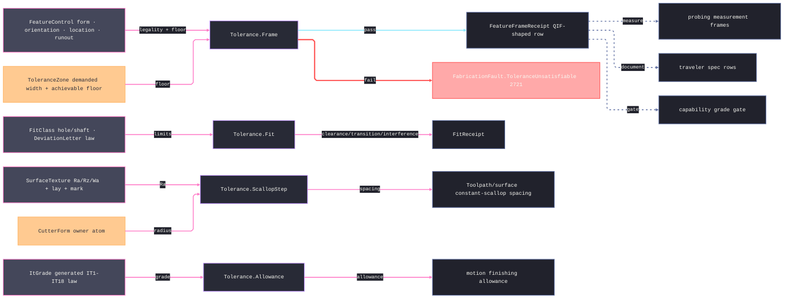

# [RASM_FABRICATION_TOLERANCE]

The tolerance owner closes the fabrication specification vocabulary over ISO 1101/ASME Y14.5 geometric frames, the ISO 286 grade-and-deviation system, ISO 1302 surface texture rows, and process-planning derivations: `FeatureControl` captures the form/orientation/location/runout frame, `ItToleranceLaw` GENERATES the full IT1-IT18 grade law (the IT1 linear law, the IT2-IT4 geometric interpolation, IT5 = `7i`, and the R5 ladder `10i·10^(0.2·(g−6))` above — never a 500-cell lookup table), `DeviationLetter` generates the fundamental-deviation subspace ISO 286-1 states in closed form, `SurfaceTexture` carries ISO 1302 roughness, waviness, cutoff, and lay, and `Tolerance` exposes the consumed derivation surface. The owner drives downstream process planning through typed rows: Ra/Rz lowers to constant-scallop spacing, IT grade lowers to finishing allowance, hole/shaft fit classes lower to limit deviations and a clearance/transition/interference verdict, frame infeasibility lowers to fault 2721, and QIF-shaped receipts feed traveler, probing, capability, and manufacturability without leaking drawing annotation rendering into the Spec plane.

## [01]-[INDEX]

- [01]-[TOLERANCE]: owns `FeatureControl` with its ISO 1101 legality fold, `ToleranceZone`, datum references, material-condition modifiers with the MMC/LMC bonus derivation, the generated `ItToleranceLaw`/`DeviationLetter` ISO 286 laws, `FitClass`/`FitReceipt`, surface texture rows, `ToleranceChain` with its worst-case/RSS fold, `FeatureFrameReceipt`, the `SpecQuantity` UnitsNet admission boundary, and the ONE `Tolerance` surface — `Frame`, `Fit`, `Effective`, `ScallopStep`, and `Allowance`.

## [02]-[TOLERANCE]

- Owner: `FeatureClass`/`FeatureCharacteristic`, `ToleranceZone`, `DatumReference`/`DatumSystem`, `MaterialCondition`/`ZoneModifier`, `FeatureControl`, `DiameterStep`/`ItGrade`/`ItToleranceLaw`, `DeviationLetter`/`FitDeviation`/`FitClass`/`FitCharacter`/`FitReceipt`, `RaTarget`/`RzTarget`/`SurfaceTexture`, `ToleranceChain`, and `FeatureFrameReceipt` as one specification vocabulary.
- Cases: `FeatureControl` cases 4 — `Form` · `Orientation` · `Location` · `Runout`; `FeatureCharacteristic` rows span form, orientation, location, and runout families, each row binding its `FeatureClass`; `ToleranceZoneKind` rows encode bilateral, unilateral, diameter, spherical, profile, and projected zones; `DiameterStep` rows encode the ISO diameter bands up to `3150` mm; `DeviationLetter` rows carry the closed-form shaft fundamental-deviation delegates (`h` zero · `g`/`f`/`e`/`d`/`c` clearance powers · `k`/`m`/`n`/`p` interference terms), the hole letter mirroring by the general rule `EI = −es`; `FitCharacter` rows 3 — `clearance`/`transition`/`interference`; `SurfaceLay` rows encode parallel, perpendicular, crossed, multidirectional, circular, radial, and particulate lay.
- Entry: `public static Fin<FeatureFrameReceipt> Frame(FeatureControl frame)` · `public static Fin<FitReceipt> Fit(FitClass hole, FitClass shaft)` · `public static double Effective(FeatureControl frame, double departureMm)` · `public static double ScallopStep(RaTarget target, CutterForm cutter)` · `public static double Allowance(ItGrade grade)` — the derivation surface the shared `Tolerance.Frame(FeatureControl)`, `Tolerance.ScallopStep(RaTarget, CutterForm)`, and `Tolerance.Allowance(ItGrade)` locks consume; `SpecQuantity` is the dimensioned-text ADMISSION boundary — unit-bearing width/angle/roughness text lowers through UnitsNet `TryParse` under the invariant provider to canonical `mm`/`deg`/`µm` scalars once, and an unparseable or ambiguous unit routes `GeometryFault.DegenerateInput` on the `Fin` rail.
- Auto: `Frame` is the ISO 1101 LEGALITY fold before it is the floor gate — characteristic class must equal the case class (the generated `FeatureControl.Switch` projects the case class), orientation/location/runout demand at least one datum while `Form` is structurally datum-free, datum precedence rows must be distinct, and a `Projected` zone kind demands the `Projected` modifier; a malformed frame routes `GeometryFault.DegenerateInput`, a process floor above the demanded zone routes `FabricationFault.ToleranceUnsatisfiable(frame, achievable).ToError()` 2721, and only a legal feasible frame mints the receipt. `Fit` derives both limit pairs from the fit-class algebra (`FitClass.LimitsUm` reads member polarity and letter family), lowers max/min clearance to millimetres, and folds the `FitCharacter` verdict. `Effective` spends the carried MMC/LMC modifier — the bonus zone is the departure from the material condition, zero under `rfs`. `ScallopStep` derives scallop height as `RaTarget.Micrometers * ScallopCoefficient / 1000` and stepover as `2*sqrt(2*r*h − h^2)` using the cutter corner radius with ball/flat fallback; `RaTarget.OfRz` lowers an Rz-only callout through the `Rz ≈ 4·Ra` estimate. `Allowance` reads the grade's generated ISO tolerance and the finishing multiplier. `ToleranceChain.Of` derives worst-case accumulation from the frame set and carries the RSS projection beside it.
- Receipt: `FeatureFrameReceipt` carries the FULL frame evidence — QIF kind, characteristic, zone kind, width, modifier set, datum reference rows, material condition — so probing reconstructs the datum reference frame from the receipt alone; `FitReceipt` carries both fit classes, limit-derived clearances, and the character verdict; `ToleranceChain` carries accumulated assembly tolerance for the existing `StackupExceeded` arm.
- Packages: `Process/owner#FABRICATION_OWNER` (`CutterForm`), `Process/faults#FAULT_BAND` (`ToleranceUnsatisfiable` 2721), UnitsNet (`Length.TryParse`/`Angle.TryParse` + `Millimeters`/`Degrees`/`Micrometers` accessors — the `SpecQuantity` ingress boundary, quantity types never escaping it), `Rasm.Numerics` (`GeometryFault.DegenerateInput` rail), Thinktecture.Runtime.Extensions (`[SmartEnum<string>]`, `[Union]`, `[UseDelegateFromConstructor]` deviation delegates, generated `Switch`), LanguageExt.Core (`Fin`/`Option`/`Seq`/`Arr`/`Set`, `guard`), BCL inbox (`CultureInfo` invariant provider).
- Growth: a specification family lands as one vocabulary row, one union case, or one receipt field on this owner; a fundamental-deviation letter outside the closed-form subspace admits as a `FitDeviation` datum row at the boundary, never a parallel fit service; a frame legality rule is one `guard` conjunct in the `Frame` fold; a measurement output enriches `FeatureFrameReceipt` or `ToleranceChain`, never `FabricationResult`.
- Boundary: GD&T drawing symbols, leader placement, and annotation rendering belong to the drawing/artifacts plane; this page owns vocabulary and derivation only. A grade-by-diameter lookup table, a free-standing `GdtFrame` DTO, a per-process allowance helper, a result payload carrying a `FeatureControl`, a second scallop formula, a receipt-time repair of an illegal frame, a caller-side characteristic/class check, a unit-assuming raw field admitted around the `SpecQuantity` boundary, and a UnitsNet quantity type escaping into the interior are the deleted forms. `ToleranceZone.AchievableMm` arrives input-carried — `Spec/capability` derives it from enrolled history (`Capability.Achievable`), and a tolerance-side reach into the capability ledger would invert the folder's dependency order.

```csharp signature
// --- [RUNTIME_PRELUDE] ----------------------------------------------------------------------------------------------------------------------------
using System.Globalization;
using LanguageExt;
using LanguageExt.Common;
using Rasm.Fabrication.Process;
using Rasm.Numerics;
using Thinktecture;
using UnitsNet;
using static LanguageExt.Prelude;

namespace Rasm.Fabrication.Spec;

// --- [TYPES] --------------------------------------------------------------------------------------------------------------------------------------
[SmartEnum<string>]
public sealed partial class FeatureClass {
    public static readonly FeatureClass Form = new("form");
    public static readonly FeatureClass Orientation = new("orientation");
    public static readonly FeatureClass Location = new("location");
    public static readonly FeatureClass Runout = new("runout");
}

[SmartEnum<string>]
public sealed partial class FeatureCharacteristic {
    public static readonly FeatureCharacteristic Straightness = new("straightness", FeatureClass.Form);
    public static readonly FeatureCharacteristic Flatness = new("flatness", FeatureClass.Form);
    public static readonly FeatureCharacteristic Circularity = new("circularity", FeatureClass.Form);
    public static readonly FeatureCharacteristic Cylindricity = new("cylindricity", FeatureClass.Form);
    public static readonly FeatureCharacteristic Parallelism = new("parallelism", FeatureClass.Orientation);
    public static readonly FeatureCharacteristic Perpendicularity = new("perpendicularity", FeatureClass.Orientation);
    public static readonly FeatureCharacteristic Angularity = new("angularity", FeatureClass.Orientation);
    public static readonly FeatureCharacteristic ProfileLine = new("profile-line", FeatureClass.Orientation);
    public static readonly FeatureCharacteristic ProfileSurface = new("profile-surface", FeatureClass.Orientation);
    public static readonly FeatureCharacteristic Position = new("position", FeatureClass.Location);
    public static readonly FeatureCharacteristic Concentricity = new("concentricity", FeatureClass.Location);
    public static readonly FeatureCharacteristic Symmetry = new("symmetry", FeatureClass.Location);
    public static readonly FeatureCharacteristic CircularRunout = new("circular-runout", FeatureClass.Runout);
    public static readonly FeatureCharacteristic TotalRunout = new("total-runout", FeatureClass.Runout);

    public FeatureClass Class { get; }
}

[SmartEnum<string>]
public sealed partial class ToleranceZoneKind {
    public static readonly ToleranceZoneKind Bilateral = new("bilateral");
    public static readonly ToleranceZoneKind Unilateral = new("unilateral");
    public static readonly ToleranceZoneKind Diameter = new("diameter");
    public static readonly ToleranceZoneKind Spherical = new("spherical");
    public static readonly ToleranceZoneKind Profile = new("profile");
    public static readonly ToleranceZoneKind Projected = new("projected");
}

[SmartEnum<string>]
public sealed partial class MaterialCondition {
    public static readonly MaterialCondition Regardless = new("rfs");
    public static readonly MaterialCondition Maximum = new("mmc");
    public static readonly MaterialCondition Least = new("lmc");
}

[SmartEnum<string>]
public sealed partial class ZoneModifier {
    public static readonly ZoneModifier None = new("none");
    public static readonly ZoneModifier Diameter = new("diameter");
    public static readonly ZoneModifier Spherical = new("spherical");
    public static readonly ZoneModifier Projected = new("projected");
    public static readonly ZoneModifier UnequallyDisposed = new("unequally-disposed");
    public static readonly ZoneModifier TangentPlane = new("tangent-plane");
}

[SmartEnum<string>]
public sealed partial class DatumPrecedence {
    public static readonly DatumPrecedence Primary = new("primary", 1);
    public static readonly DatumPrecedence Secondary = new("secondary", 2);
    public static readonly DatumPrecedence Tertiary = new("tertiary", 3);

    public int Order { get; }
}

[SmartEnum<string>]
public sealed partial class QifKind {
    public static readonly QifKind FeatureControlFrame = new("feature-control-frame");
    public static readonly QifKind DimensionalTolerance = new("dimensional-tolerance");
    public static readonly QifKind SurfaceTexture = new("surface-texture");
    public static readonly QifKind DatumSystem = new("datum-system");
}

[SmartEnum<string>]
public sealed partial class FitMember {
    public static readonly FitMember Hole = new("hole", positiveInterior: true);
    public static readonly FitMember Shaft = new("shaft", positiveInterior: false);

    public bool PositiveInterior { get; }
}

// The ISO 286-1 closed-form fundamental-deviation subspace as delegate rows over the geometric-mean diameter; the
// delegate emits the SHAFT deviation (es for clearance letters, ei for interference letters), holes mirror by EI = −es.
[SmartEnum<string>]
public sealed partial class DeviationLetter {
    public static readonly DeviationLetter H = new("h", clearance: true, static (_, _) => 0.0);
    public static readonly DeviationLetter G = new("g", clearance: true, static (d, _) => -2.5 * Math.Pow(d, 0.34));
    public static readonly DeviationLetter F = new("f", clearance: true, static (d, _) => -5.5 * Math.Pow(d, 0.41));
    public static readonly DeviationLetter E = new("e", clearance: true, static (d, _) => -11.0 * Math.Pow(d, 0.41));
    public static readonly DeviationLetter D = new("d", clearance: true, static (d, _) => -16.0 * Math.Pow(d, 0.44));
    public static readonly DeviationLetter C = new("c", clearance: true, static (d, _) => d <= 40.0 ? -52.0 * Math.Pow(d, 0.2) : -(95.0 + (0.8 * d)));
    public static readonly DeviationLetter K = new("k", clearance: false, static (d, _) => 0.6 * Math.Cbrt(d));
    public static readonly DeviationLetter M = new("m", clearance: false, static (_, it) => it(7) - it(6));
    public static readonly DeviationLetter N = new("n", clearance: false, static (d, _) => 5.0 * Math.Pow(d, 0.34));
    public static readonly DeviationLetter P = new("p", clearance: false, static (_, it) => it(7));

    public bool Clearance { get; }

    [UseDelegateFromConstructor]
    public partial double ShaftMicrometers(double geometricMeanMm, Func<int, double> itMicrometers);
}

[SmartEnum<string>]
public sealed partial class FitCharacter {
    public static readonly FitCharacter Clearance = new("clearance");
    public static readonly FitCharacter Transition = new("transition");
    public static readonly FitCharacter Interference = new("interference");
}

[SmartEnum<string>]
public sealed partial class SurfaceLay {
    public static readonly SurfaceLay Parallel = new("parallel");
    public static readonly SurfaceLay Perpendicular = new("perpendicular");
    public static readonly SurfaceLay Crossed = new("crossed");
    public static readonly SurfaceLay Multidirectional = new("multidirectional");
    public static readonly SurfaceLay Circular = new("circular");
    public static readonly SurfaceLay Radial = new("radial");
    public static readonly SurfaceLay Particulate = new("particulate");
}

[SmartEnum<string>]
public sealed partial class ProcessMark {
    public static readonly ProcessMark Any = new("any");
    public static readonly ProcessMark RemovalRequired = new("removal-required");
    public static readonly ProcessMark RemovalProhibited = new("removal-prohibited");
}

// --- [MODELS] -------------------------------------------------------------------------------------------------------------------------------------
public readonly record struct ToleranceZone(
    ToleranceZoneKind Kind,
    double WidthMm,
    Set<ZoneModifier> Modifiers,
    Option<double> AchievableMm);

public readonly record struct DatumReference(string Label, DatumPrecedence Precedence, MaterialCondition Material);

public sealed record DatumSystem(Arr<DatumReference> References) {
    public static readonly DatumSystem None = new(default);
}

[Union(ConversionFromValue = ConversionOperatorsGeneration.None)]
public abstract partial record FeatureControl {
    private FeatureControl() { }

    public abstract FeatureCharacteristic Characteristic { get; }
    public abstract ToleranceZone Zone { get; }
    public abstract DatumSystem Datums { get; }
    public abstract MaterialCondition Material { get; }
    public abstract QifKind Qif { get; }

    public sealed record Form(FeatureCharacteristic Kind, ToleranceZone ZoneValue, MaterialCondition MaterialValue) : FeatureControl {
        public override FeatureCharacteristic Characteristic => Kind;
        public override ToleranceZone Zone => ZoneValue;
        public override DatumSystem Datums => DatumSystem.None;
        public override MaterialCondition Material => MaterialValue;
        public override QifKind Qif => QifKind.FeatureControlFrame;
    }

    public sealed record Orientation(FeatureCharacteristic Kind, ToleranceZone ZoneValue, DatumSystem DatumValue, MaterialCondition MaterialValue) : FeatureControl {
        public override FeatureCharacteristic Characteristic => Kind;
        public override ToleranceZone Zone => ZoneValue;
        public override DatumSystem Datums => DatumValue;
        public override MaterialCondition Material => MaterialValue;
        public override QifKind Qif => QifKind.FeatureControlFrame;
    }

    public sealed record Location(FeatureCharacteristic Kind, ToleranceZone ZoneValue, DatumSystem DatumValue, MaterialCondition MaterialValue) : FeatureControl {
        public override FeatureCharacteristic Characteristic => Kind;
        public override ToleranceZone Zone => ZoneValue;
        public override DatumSystem Datums => DatumValue;
        public override MaterialCondition Material => MaterialValue;
        public override QifKind Qif => QifKind.FeatureControlFrame;
    }

    public sealed record Runout(FeatureCharacteristic Kind, ToleranceZone ZoneValue, DatumSystem DatumValue, MaterialCondition MaterialValue) : FeatureControl {
        public override FeatureCharacteristic Characteristic => Kind;
        public override ToleranceZone Zone => ZoneValue;
        public override DatumSystem Datums => DatumValue;
        public override MaterialCondition Material => MaterialValue;
        public override QifKind Qif => QifKind.FeatureControlFrame;
    }
}

[SmartEnum<string>]
public sealed partial class DiameterStep {
    public static readonly DiameterStep Over0To3 = new("over-0-to-3", 0.0, 3.0, 1.7320508075688772);
    public static readonly DiameterStep Over3To6 = new("over-3-to-6", 3.0, 6.0, 4.242640687119285);
    public static readonly DiameterStep Over6To10 = new("over-6-to-10", 6.0, 10.0, 7.745966692414834);
    public static readonly DiameterStep Over10To18 = new("over-10-to-18", 10.0, 18.0, 13.416407864998739);
    public static readonly DiameterStep Over18To30 = new("over-18-to-30", 18.0, 30.0, 23.2379000772445);
    public static readonly DiameterStep Over30To50 = new("over-30-to-50", 30.0, 50.0, 38.72983346207417);
    public static readonly DiameterStep Over50To80 = new("over-50-to-80", 50.0, 80.0, 63.245553203367585);
    public static readonly DiameterStep Over80To120 = new("over-80-to-120", 80.0, 120.0, 97.97958971132712);
    public static readonly DiameterStep Over120To180 = new("over-120-to-180", 120.0, 180.0, 146.9693845669907);
    public static readonly DiameterStep Over180To250 = new("over-180-to-250", 180.0, 250.0, 212.13203435596427);
    public static readonly DiameterStep Over250To315 = new("over-250-to-315", 250.0, 315.0, 280.6243047202918);
    public static readonly DiameterStep Over315To400 = new("over-315-to-400", 315.0, 400.0, 354.96478698597694);
    public static readonly DiameterStep Over400To500 = new("over-400-to-500", 400.0, 500.0, 447.21359549995793);
    public static readonly DiameterStep Over500To630 = new("over-500-to-630", 500.0, 630.0, 561.2486080160912);
    public static readonly DiameterStep Over630To800 = new("over-630-to-800", 630.0, 800.0, 709.9295739719539);
    public static readonly DiameterStep Over800To1000 = new("over-800-to-1000", 800.0, 1000.0, 894.4271909999159);
    public static readonly DiameterStep Over1000To1250 = new("over-1000-to-1250", 1000.0, 1250.0, 1118.033988749895);
    public static readonly DiameterStep Over1250To1600 = new("over-1250-to-1600", 1250.0, 1600.0, 1414.213562373095);
    public static readonly DiameterStep Over1600To2000 = new("over-1600-to-2000", 1600.0, 2000.0, 1788.8543819998318);
    public static readonly DiameterStep Over2000To2500 = new("over-2000-to-2500", 2000.0, 2500.0, 2236.06797749979);
    public static readonly DiameterStep Over2500To3150 = new("over-2500-to-3150", 2500.0, 3150.0, 2806.243047202918);

    public double LowerMm { get; }
    public double UpperMm { get; }
    public double GeometricMeanMm { get; }
}

public readonly record struct ItGrade(int Number, DiameterStep Diameter, double ToleranceMicrometers, double FinishingAllowanceFactor) {
    public double ToleranceMillimeters => ToleranceMicrometers / 1000.0;

    public static Fin<ItGrade> Of(int number, DiameterStep diameter, double finishingAllowanceFactor) =>
        ItToleranceLaw.Micrometers(number, diameter.GeometricMeanMm)
            .Map(um => new ItGrade(number, diameter, um, finishingAllowanceFactor));
}

public readonly record struct FitDeviation(FitMember Member, DeviationLetter Letter, double FundamentalMicrometers) {
    // The generator over the closed-form subspace: the shaft delegate evaluates at the step's geometric mean, the
    // hole mirrors by the ISO 286-1 general rule; the it() argument is total over the fixed grade rows the M/P
    // delegates read, so the Fin never fails there and IfFail is unreachable padding for the type only.
    public static FitDeviation Of(FitMember member, DeviationLetter letter, DiameterStep diameter) {
        double d = diameter.GeometricMeanMm;
        double shaft = letter.ShaftMicrometers(d, g => ItToleranceLaw.Micrometers(g, d).IfFail(0.0));
        return new FitDeviation(member, letter, member.PositiveInterior ? -shaft : shaft);
    }
}

public readonly record struct FitClass(FitDeviation Deviation, ItGrade Grade) {
    // Limit algebra: the fundamental deviation is the bound nearest zero; member polarity and letter family select
    // which bound it is — hole/clearance and shaft/interference anchor the LOWER limit, the mirrored pairs the UPPER.
    public (double LowerUm, double UpperUm) LimitsUm {
        get {
            double f = Deviation.FundamentalMicrometers;
            double t = Grade.ToleranceMicrometers;
            bool lowerFundamental = Deviation.Member.PositiveInterior ? Deviation.Letter.Clearance : !Deviation.Letter.Clearance;
            return lowerFundamental ? (f, f + t) : (f - t, f);
        }
    }
}

public sealed record FitReceipt(FitClass Hole, FitClass Shaft, double MaxClearanceMm, double MinClearanceMm, FitCharacter Character);

public readonly record struct RaTarget(double Micrometers, double ScallopCoefficient) {
    public double ScallopHeightMm => Micrometers * ScallopCoefficient / 1000.0;

    // Rz-only callouts lower through the Rz ≈ 4·Ra estimate — the one texture-to-Ra bridge, never a second scallop law.
    public static RaTarget OfRz(RzTarget rz, double scallopCoefficient) => new(rz.Micrometers / 4.0, scallopCoefficient);
}

public readonly record struct RzTarget(double Micrometers);

public sealed record SurfaceTexture(
    RaTarget Ra,
    Option<RzTarget> Rz,
    Option<double> WaMicrometers,
    Option<double> CutoffLambdaCMm,
    SurfaceLay Lay,
    ProcessMark Mark,
    QifKind Qif);

public sealed record ToleranceChain(Seq<FeatureControl> Frames, double AccumulatedMm, double BoundMm) {
    public double RssMm => Math.Sqrt(Frames.Map(static f => f.Zone.WidthMm * f.Zone.WidthMm).Fold(0.0, static (a, w) => a + w));

    // Worst-case accumulation derives from the frames; the distributional stackup is Spec/capability's Monte-Carlo tier.
    public static ToleranceChain Of(Seq<FeatureControl> frames, double boundMm) =>
        new(frames, frames.Map(static f => f.Zone.WidthMm).Fold(0.0, static (a, w) => a + w), boundMm);
}

public sealed record FeatureFrameReceipt(
    QifKind Qif,
    FeatureCharacteristic Characteristic,
    ToleranceZoneKind Kind,
    double WidthMm,
    Set<ZoneModifier> Modifiers,
    Arr<DatumReference> Datums,
    MaterialCondition Material) {
    public int DatumCount => Datums.Count;
}

// --- [OPERATIONS] ---------------------------------------------------------------------------------------------------------------------------------
public static class ItToleranceLaw {
    public const int GradeFloor = 1;
    public const int GradeCeiling = 18;

    public static double UnitMicrometers(double geometricMeanMm) =>
        (0.45 * Math.Cbrt(geometricMeanMm)) + (0.001 * geometricMeanMm);

    // The generated ISO 286 grade space: IT1 = 0.8 + 0.020·D, IT2-IT4 geometric interpolation IT1→IT5, IT5 = 7i,
    // IT6-IT18 the R5 ladder 10i·10^(0.2·(g−6)) — the rounded standard values (16i, 25i, 40i … 2500i) are this law.
    public static Fin<double> Micrometers(int grade, double geometricMeanMm) {
        double i = UnitMicrometers(geometricMeanMm);
        double it1 = 0.8 + (0.020 * geometricMeanMm);
        return grade switch {
            < GradeFloor or > GradeCeiling => Fin.Fail<double>(GeometryFault.DegenerateInput($"tolerance:it-grade:{grade}").ToError()),
            1 => Fin.Succ(it1),
            <= 4 => Fin.Succ(it1 * Math.Pow(7.0 * i / it1, (grade - 1) / 4.0)),
            5 => Fin.Succ(7.0 * i),
            _ => Fin.Succ(10.0 * i * Math.Pow(10.0, 0.2 * (grade - 6))),
        };
    }
}

// --- [BOUNDARIES] ---------------------------------------------------------------------------------------------------------------------------------
// The ONE dimensioned-spec ingress: unit-bearing tolerance text ("0.05 mm", "30 deg", "0.8 µm") admits through the
// UnitsNet TryParse probe under the invariant provider and lowers to the canonical raw scalar ONCE — interior
// formulas read doubles only, no quantity type crosses the boundary, and an unparseable or ambiguous unit routes
// DegenerateInput instead of throwing (the api-unitsnet.md parse-surface law).
public static class SpecQuantity {
    public static Fin<double> WidthMm(string text) =>
        Length.TryParse(text, CultureInfo.InvariantCulture, out Length value)
            ? Fin.Succ(value.Millimeters)
            : Fin.Fail<double>(GeometryFault.DegenerateInput($"tolerance:width:{text}").ToError());

    public static Fin<double> AngleDeg(string text) =>
        Angle.TryParse(text, CultureInfo.InvariantCulture, out Angle value)
            ? Fin.Succ(value.Degrees)
            : Fin.Fail<double>(GeometryFault.DegenerateInput($"tolerance:angle:{text}").ToError());

    public static Fin<double> RoughnessUm(string text) =>
        Length.TryParse(text, CultureInfo.InvariantCulture, out Length value)
            ? Fin.Succ(value.Micrometers)
            : Fin.Fail<double>(GeometryFault.DegenerateInput($"tolerance:roughness:{text}").ToError());

    public static Fin<ToleranceZone> Zone(ToleranceZoneKind kind, string width, Set<ZoneModifier> modifiers, Option<double> achievableMm) =>
        WidthMm(width).Map(mm => new ToleranceZone(kind, mm, modifiers, achievableMm));

    public static Fin<RaTarget> Ra(string roughness, double scallopCoefficient) =>
        RoughnessUm(roughness).Map(um => new RaTarget(um, scallopCoefficient));
}

public static class Tolerance {
    // ISO 1101 legality precedes the floor gate: class agreement (the generated Switch projects the case class),
    // the datum-count law, distinct precedence, and projected-zone coherence — an illegal frame never earns a receipt.
    public static Fin<FeatureFrameReceipt> Frame(FeatureControl frame) =>
        from _1 in guard(frame.Characteristic.Class == ClassOf(frame),
            GeometryFault.DegenerateInput($"tolerance:frame-class:{frame.Characteristic.Key}").ToError()).ToFin()
        from _2 in guard(ClassOf(frame) == FeatureClass.Form || !frame.Datums.References.IsEmpty,
            GeometryFault.DegenerateInput($"tolerance:frame-datums:{frame.Characteristic.Key}").ToError()).ToFin()
        from _3 in guard(frame.Datums.References.Map(static r => r.Precedence).Distinct().Count() == frame.Datums.References.Count,
            GeometryFault.DegenerateInput("tolerance:frame-precedence").ToError()).ToFin()
        from _4 in guard(frame.Zone.Kind != ToleranceZoneKind.Projected || frame.Zone.Modifiers.Contains(ZoneModifier.Projected),
            GeometryFault.DegenerateInput("tolerance:frame-projected").ToError()).ToFin()
        from receipt in frame.Zone.AchievableMm.Match(
            Some: achievable => achievable <= frame.Zone.WidthMm
                ? Fin.Succ(Receipt(frame))
                : Fin.Fail<FeatureFrameReceipt>(FabricationFault.ToleranceUnsatisfiable(frame, achievable).ToError()),
            None: () => Fin.Succ(Receipt(frame)))
        select receipt;

    public static Fin<FitReceipt> Fit(FitClass hole, FitClass shaft) {
        if (hole.Deviation.Member != FitMember.Hole || shaft.Deviation.Member != FitMember.Shaft)
            return Fin.Fail<FitReceipt>(GeometryFault.DegenerateInput($"tolerance:fit-members:{hole.Deviation.Letter.Key}/{shaft.Deviation.Letter.Key}").ToError());
        (double holeLo, double holeHi) = hole.LimitsUm;
        (double shaftLo, double shaftHi) = shaft.LimitsUm;
        double maxMm = (holeHi - shaftLo) / 1000.0;
        double minMm = (holeLo - shaftHi) / 1000.0;
        FitCharacter character = minMm >= 0.0 ? FitCharacter.Clearance : maxMm <= 0.0 ? FitCharacter.Interference : FitCharacter.Transition;
        return Fin.Succ(new FitReceipt(hole, shaft, maxMm, minMm, character));
    }

    // The MMC/LMC bonus spent: effective zone = demanded width + departure from the material condition; rfs earns none.
    public static double Effective(FeatureControl frame, double departureMm) =>
        frame.Zone.WidthMm + (frame.Material == MaterialCondition.Regardless ? 0.0 : Math.Abs(departureMm));

    public static double ScallopStep(RaTarget target, CutterForm cutter) =>
        2.0 * Math.Sqrt(double.Max(0.0, (2.0 * (cutter.CornerRadius > 0.0 ? cutter.CornerRadius : cutter.Diameter / 2.0) * target.ScallopHeightMm) - (target.ScallopHeightMm * target.ScallopHeightMm)));

    public static double Allowance(ItGrade grade) =>
        grade.ToleranceMillimeters * grade.FinishingAllowanceFactor;

    static FeatureClass ClassOf(FeatureControl frame) =>
        frame.Switch(
            form: static _ => FeatureClass.Form,
            orientation: static _ => FeatureClass.Orientation,
            location: static _ => FeatureClass.Location,
            runout: static _ => FeatureClass.Runout);

    static FeatureFrameReceipt Receipt(FeatureControl frame) =>
        new(frame.Qif, frame.Characteristic, frame.Zone.Kind, frame.Zone.WidthMm, frame.Zone.Modifiers, frame.Datums.References, frame.Material);
}
```


