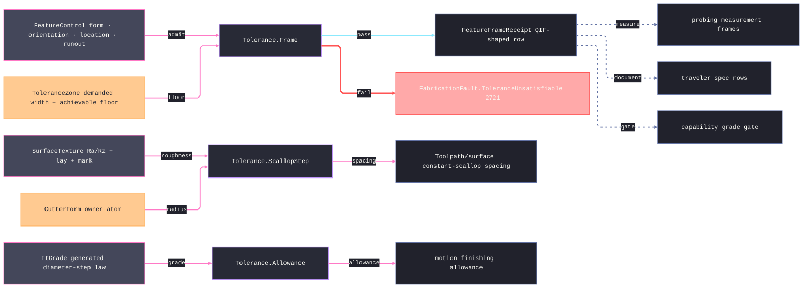

# [RASM_FABRICATION_TOLERANCE]

The tolerance owner closes the fabrication specification vocabulary over ISO 1101/ASME Y14.5 geometric frames, ISO fit grades, surface texture rows, and process-planning derivations: `FeatureControl` captures the form/orientation/location/runout frame, `ItGrade` carries the generated ISO 286 diameter-step law, `SurfaceTexture` carries ISO 1302 roughness and lay, and `Tolerance` exposes the three consumed entries. The owner drives downstream process planning through typed rows: Ra/Rz lowers to constant-scallop spacing, IT grade lowers to finishing allowance, frame infeasibility lowers to fault 2721, and ISO 23952/QIF-shaped receipts feed traveler, probing, capability, and manufacturability without leaking drawing annotation rendering into the Spec plane.

## [01]-[INDEX]

- [01]-[TOLERANCE]: owns `FeatureControl`, `ToleranceZone`, datum references, material-condition modifiers, ISO fit rows, surface texture rows, `ToleranceChain`, `FeatureFrameReceipt`, the `SpecQuantity` UnitsNet admission boundary, and the ONE `Tolerance` surface — `Frame`, `ScallopStep`, and `Allowance`.

## [02]-[TOLERANCE]

- Owner: `FeatureClass`/`FeatureCharacteristic`, `ToleranceZone`, `DatumReference`/`DatumSystem`, `MaterialCondition`/`ZoneModifier`, `FeatureControl`, `DiameterStep`/`ItGrade`, `FitDeviation`/`FitClass`, `RaTarget`/`RzTarget`/`SurfaceTexture`, `ToleranceChain`, and `FeatureFrameReceipt` as one specification vocabulary.
- Cases: `FeatureControl` cases 4 — `Form` · `Orientation` · `Location` · `Runout`; `FeatureCharacteristic` rows span form, orientation, location, and runout families; `ToleranceZoneKind` rows encode bilateral, unilateral, diameter, spherical, profile, and projected zones; `DiameterStep` rows encode the ISO diameter bands up to `3150` mm; `SurfaceLay` rows encode parallel, perpendicular, crossed, multidirectional, circular, radial, and particulate lay.
- Entry: `public static Fin<FeatureFrameReceipt> Frame(FeatureControl frame)` · `public static double ScallopStep(RaTarget target, CutterForm cutter)` · `public static double Allowance(ItGrade grade)` — the complete derivation surface the shared `Tolerance.Frame(FeatureControl)`, `Tolerance.ScallopStep(RaTarget, CutterForm)`, and `Tolerance.Allowance(ItGrade)` locks consume; `SpecQuantity` is the dimensioned-text ADMISSION boundary — unit-bearing width/angle/roughness text lowers through UnitsNet `TryParse` under the invariant provider to canonical `mm`/`deg`/`µm` scalars once, and an unparseable or ambiguous unit routes `GeometryFault.DegenerateInput` on the `Fin` rail.
- Auto: `Frame` emits the QIF-shaped receipt or routes `FabricationFault.ToleranceUnsatisfiable(frame, achievable).ToError()` when the process floor exceeds the demanded zone; `ScallopStep` derives scallop height as `RaTarget.Micrometers * ScallopCoefficient / 1000` and stepover as `2*sqrt(2*r*h - h^2)` using the cutter corner radius with ball/flat fallback; `Allowance` reads the grade's generated ISO tolerance and the finishing multiplier without a hand-enumerated grade-by-diameter table.
- Receipt: `FeatureFrameReceipt` is the frame evidence consumed by probing, capability, traveler rows, and manufacturability stackup; `ToleranceChain` carries accumulated assembly tolerance for the existing `StackupExceeded` arm.
- Packages: `Process/owner#FABRICATION_OWNER` (`CutterForm`), `Process/faults#FAULT_BAND` (`ToleranceUnsatisfiable` 2721), UnitsNet (`Length.TryParse`/`Angle.TryParse` + `Millimeters`/`Degrees`/`Micrometers` accessors — the `SpecQuantity` ingress boundary, quantity types never escaping it), `Rasm.Numerics` (`GeometryFault.DegenerateInput` parse-failure rail), Thinktecture.Runtime.Extensions, LanguageExt.Core, BCL inbox (`CultureInfo` invariant provider).
- Growth: a specification family lands as one vocabulary row, one union case, or one receipt field on this owner; a fit standard extension lands as additional generated law rows, never a parallel tolerance service; a measurement output enriches `FeatureFrameReceipt` or `ToleranceChain`, never `FabricationResult`.
- Boundary: GD&T drawing symbols, leader placement, and annotation rendering belong to the drawing/artifacts plane; this page owns vocabulary and derivation only. A 500-cell ISO fit lookup table, a free-standing `GdtFrame` DTO, a per-process allowance helper, a result payload carrying a `FeatureControl`, a second scallop formula, a unit-assuming raw field admitted from unit-bearing text around the `SpecQuantity` boundary, and a UnitsNet quantity type escaping into the interior are the deleted forms.

```csharp signature
// --- [RUNTIME_PRELUDE] ----------------------------------------------------------------------------------------------------------------------------
using System.Globalization;
using LanguageExt;
using LanguageExt.Common;
using Rasm.Fabrication.Process;
using Rasm.Numerics;
using Thinktecture;
using UnitsNet;
using static LanguageExt.Prelude;

namespace Rasm.Fabrication.Spec;

// --- [TYPES] --------------------------------------------------------------------------------------------------------------------------------------
[SmartEnum<string>]
public sealed partial class FeatureClass {
    public static readonly FeatureClass Form = new("form");
    public static readonly FeatureClass Orientation = new("orientation");
    public static readonly FeatureClass Location = new("location");
    public static readonly FeatureClass Runout = new("runout");
}

[SmartEnum<string>]
public sealed partial class FeatureCharacteristic {
    public static readonly FeatureCharacteristic Straightness = new("straightness", FeatureClass.Form);
    public static readonly FeatureCharacteristic Flatness = new("flatness", FeatureClass.Form);
    public static readonly FeatureCharacteristic Circularity = new("circularity", FeatureClass.Form);
    public static readonly FeatureCharacteristic Cylindricity = new("cylindricity", FeatureClass.Form);
    public static readonly FeatureCharacteristic Parallelism = new("parallelism", FeatureClass.Orientation);
    public static readonly FeatureCharacteristic Perpendicularity = new("perpendicularity", FeatureClass.Orientation);
    public static readonly FeatureCharacteristic Angularity = new("angularity", FeatureClass.Orientation);
    public static readonly FeatureCharacteristic ProfileLine = new("profile-line", FeatureClass.Orientation);
    public static readonly FeatureCharacteristic ProfileSurface = new("profile-surface", FeatureClass.Orientation);
    public static readonly FeatureCharacteristic Position = new("position", FeatureClass.Location);
    public static readonly FeatureCharacteristic Concentricity = new("concentricity", FeatureClass.Location);
    public static readonly FeatureCharacteristic Symmetry = new("symmetry", FeatureClass.Location);
    public static readonly FeatureCharacteristic CircularRunout = new("circular-runout", FeatureClass.Runout);
    public static readonly FeatureCharacteristic TotalRunout = new("total-runout", FeatureClass.Runout);

    public FeatureClass Class { get; }
}

[SmartEnum<string>]
public sealed partial class ToleranceZoneKind {
    public static readonly ToleranceZoneKind Bilateral = new("bilateral");
    public static readonly ToleranceZoneKind Unilateral = new("unilateral");
    public static readonly ToleranceZoneKind Diameter = new("diameter");
    public static readonly ToleranceZoneKind Spherical = new("spherical");
    public static readonly ToleranceZoneKind Profile = new("profile");
    public static readonly ToleranceZoneKind Projected = new("projected");
}

[SmartEnum<string>]
public sealed partial class MaterialCondition {
    public static readonly MaterialCondition Regardless = new("rfs");
    public static readonly MaterialCondition Maximum = new("mmc");
    public static readonly MaterialCondition Least = new("lmc");
}

[SmartEnum<string>]
public sealed partial class ZoneModifier {
    public static readonly ZoneModifier None = new("none");
    public static readonly ZoneModifier Diameter = new("diameter");
    public static readonly ZoneModifier Spherical = new("spherical");
    public static readonly ZoneModifier Projected = new("projected");
    public static readonly ZoneModifier UnequallyDisposed = new("unequally-disposed");
    public static readonly ZoneModifier TangentPlane = new("tangent-plane");
}

[SmartEnum<string>]
public sealed partial class DatumPrecedence {
    public static readonly DatumPrecedence Primary = new("primary", 1);
    public static readonly DatumPrecedence Secondary = new("secondary", 2);
    public static readonly DatumPrecedence Tertiary = new("tertiary", 3);

    public int Order { get; }
}

[SmartEnum<string>]
public sealed partial class QifKind {
    public static readonly QifKind FeatureControlFrame = new("feature-control-frame");
    public static readonly QifKind DimensionalTolerance = new("dimensional-tolerance");
    public static readonly QifKind SurfaceTexture = new("surface-texture");
    public static readonly QifKind DatumSystem = new("datum-system");
}

[SmartEnum<string>]
public sealed partial class FitMember {
    public static readonly FitMember Hole = new("hole", positiveInterior: true);
    public static readonly FitMember Shaft = new("shaft", positiveInterior: false);

    public bool PositiveInterior { get; }
}

[SmartEnum<string>]
public sealed partial class SurfaceLay {
    public static readonly SurfaceLay Parallel = new("parallel");
    public static readonly SurfaceLay Perpendicular = new("perpendicular");
    public static readonly SurfaceLay Crossed = new("crossed");
    public static readonly SurfaceLay Multidirectional = new("multidirectional");
    public static readonly SurfaceLay Circular = new("circular");
    public static readonly SurfaceLay Radial = new("radial");
    public static readonly SurfaceLay Particulate = new("particulate");
}

[SmartEnum<string>]
public sealed partial class ProcessMark {
    public static readonly ProcessMark Any = new("any");
    public static readonly ProcessMark RemovalRequired = new("removal-required");
    public static readonly ProcessMark RemovalProhibited = new("removal-prohibited");
}

// --- [MODELS] -------------------------------------------------------------------------------------------------------------------------------------
public readonly record struct ToleranceZone(
    ToleranceZoneKind Kind,
    double WidthMm,
    Set<ZoneModifier> Modifiers,
    Option<double> AchievableMm);

public readonly record struct DatumReference(string Label, DatumPrecedence Precedence, MaterialCondition Material);

public sealed record DatumSystem(Arr<DatumReference> References) {
    public static readonly DatumSystem None = new(default);
}

[Union(ConversionFromValue = ConversionOperatorsGeneration.None)]
public abstract partial record FeatureControl {
    private FeatureControl() { }

    public abstract FeatureCharacteristic Characteristic { get; }
    public abstract ToleranceZone Zone { get; }
    public abstract DatumSystem Datums { get; }
    public abstract MaterialCondition Material { get; }
    public abstract QifKind Qif { get; }

    public sealed record Form(FeatureCharacteristic Kind, ToleranceZone ZoneValue, MaterialCondition MaterialValue) : FeatureControl {
        public override FeatureCharacteristic Characteristic => Kind;
        public override ToleranceZone Zone => ZoneValue;
        public override DatumSystem Datums => DatumSystem.None;
        public override MaterialCondition Material => MaterialValue;
        public override QifKind Qif => QifKind.FeatureControlFrame;
    }

    public sealed record Orientation(FeatureCharacteristic Kind, ToleranceZone ZoneValue, DatumSystem DatumValue, MaterialCondition MaterialValue) : FeatureControl {
        public override FeatureCharacteristic Characteristic => Kind;
        public override ToleranceZone Zone => ZoneValue;
        public override DatumSystem Datums => DatumValue;
        public override MaterialCondition Material => MaterialValue;
        public override QifKind Qif => QifKind.FeatureControlFrame;
    }

    public sealed record Location(FeatureCharacteristic Kind, ToleranceZone ZoneValue, DatumSystem DatumValue, MaterialCondition MaterialValue) : FeatureControl {
        public override FeatureCharacteristic Characteristic => Kind;
        public override ToleranceZone Zone => ZoneValue;
        public override DatumSystem Datums => DatumValue;
        public override MaterialCondition Material => MaterialValue;
        public override QifKind Qif => QifKind.FeatureControlFrame;
    }

    public sealed record Runout(FeatureCharacteristic Kind, ToleranceZone ZoneValue, DatumSystem DatumValue, MaterialCondition MaterialValue) : FeatureControl {
        public override FeatureCharacteristic Characteristic => Kind;
        public override ToleranceZone Zone => ZoneValue;
        public override DatumSystem Datums => DatumValue;
        public override MaterialCondition Material => MaterialValue;
        public override QifKind Qif => QifKind.FeatureControlFrame;
    }
}

[SmartEnum<string>]
public sealed partial class DiameterStep {
    public static readonly DiameterStep Over0To3 = new("over-0-to-3", 0.0, 3.0, 1.7320508075688772);
    public static readonly DiameterStep Over3To6 = new("over-3-to-6", 3.0, 6.0, 4.242640687119285);
    public static readonly DiameterStep Over6To10 = new("over-6-to-10", 6.0, 10.0, 7.745966692414834);
    public static readonly DiameterStep Over10To18 = new("over-10-to-18", 10.0, 18.0, 13.416407864998739);
    public static readonly DiameterStep Over18To30 = new("over-18-to-30", 18.0, 30.0, 23.2379000772445);
    public static readonly DiameterStep Over30To50 = new("over-30-to-50", 30.0, 50.0, 38.72983346207417);
    public static readonly DiameterStep Over50To80 = new("over-50-to-80", 50.0, 80.0, 63.245553203367585);
    public static readonly DiameterStep Over80To120 = new("over-80-to-120", 80.0, 120.0, 97.97958971132712);
    public static readonly DiameterStep Over120To180 = new("over-120-to-180", 120.0, 180.0, 146.9693845669907);
    public static readonly DiameterStep Over180To250 = new("over-180-to-250", 180.0, 250.0, 212.13203435596427);
    public static readonly DiameterStep Over250To315 = new("over-250-to-315", 250.0, 315.0, 280.6243047202918);
    public static readonly DiameterStep Over315To400 = new("over-315-to-400", 315.0, 400.0, 354.96478698597694);
    public static readonly DiameterStep Over400To500 = new("over-400-to-500", 400.0, 500.0, 447.21359549995793);
    public static readonly DiameterStep Over500To630 = new("over-500-to-630", 500.0, 630.0, 561.2486080160912);
    public static readonly DiameterStep Over630To800 = new("over-630-to-800", 630.0, 800.0, 709.9295739719539);
    public static readonly DiameterStep Over800To1000 = new("over-800-to-1000", 800.0, 1000.0, 894.4271909999159);
    public static readonly DiameterStep Over1000To1250 = new("over-1000-to-1250", 1000.0, 1250.0, 1118.033988749895);
    public static readonly DiameterStep Over1250To1600 = new("over-1250-to-1600", 1250.0, 1600.0, 1414.213562373095);
    public static readonly DiameterStep Over1600To2000 = new("over-1600-to-2000", 1600.0, 2000.0, 1788.8543819998318);
    public static readonly DiameterStep Over2000To2500 = new("over-2000-to-2500", 2000.0, 2500.0, 2236.06797749979);
    public static readonly DiameterStep Over2500To3150 = new("over-2500-to-3150", 2500.0, 3150.0, 2806.243047202918);

    public double LowerMm { get; }
    public double UpperMm { get; }
    public double GeometricMeanMm { get; }
}

public readonly record struct ItGrade(int Number, DiameterStep Diameter, double ToleranceMicrometers, double FinishingAllowanceFactor) {
    public double ToleranceMillimeters => ToleranceMicrometers / 1000.0;

    public static ItGrade Of(int number, DiameterStep diameter, double finishingAllowanceFactor) =>
        new(number, diameter, ItToleranceLaw.Micrometers(number, diameter.GeometricMeanMm), finishingAllowanceFactor);
}

public readonly record struct FitDeviation(FitMember Member, string Symbol, double FundamentalMicrometers);

public readonly record struct FitClass(FitDeviation Deviation, ItGrade Grade);

public readonly record struct RaTarget(double Micrometers, double ScallopCoefficient) {
    public double ScallopHeightMm => Micrometers * ScallopCoefficient / 1000.0;
}

public readonly record struct RzTarget(double Micrometers);

public sealed record SurfaceTexture(RaTarget Ra, Option<RzTarget> Rz, SurfaceLay Lay, ProcessMark Mark, QifKind Qif);

public sealed record ToleranceChain(Seq<FeatureControl> Frames, double AccumulatedMm, double BoundMm);

public sealed record FeatureFrameReceipt(
    QifKind Qif,
    FeatureCharacteristic Characteristic,
    double WidthMm,
    int DatumCount,
    MaterialCondition Material);

// --- [OPERATIONS] ---------------------------------------------------------------------------------------------------------------------------------
public static class ItToleranceLaw {
    public static double UnitMicrometers(double geometricMeanMm) =>
        (0.45 * Math.Cbrt(geometricMeanMm)) + (0.001 * geometricMeanMm);

    public static double Scale(int grade) =>
        grade <= 6
            ? 10.0 / Math.Pow(1.6, 6 - grade)
            : 10.0 * Math.Pow(1.6, grade - 6);

    public static double Micrometers(int grade, double geometricMeanMm) =>
        Scale(grade) * UnitMicrometers(geometricMeanMm);
}

// --- [BOUNDARIES] ---------------------------------------------------------------------------------------------------------------------------------
// The ONE dimensioned-spec ingress: unit-bearing tolerance text ("0.05 mm", "30 deg", "0.8 µm") admits through the
// UnitsNet TryParse probe under the invariant provider and lowers to the canonical raw scalar ONCE — interior
// formulas read doubles only, no quantity type crosses the boundary, and an unparseable or ambiguous unit routes
// DegenerateInput instead of throwing (the api-unitsnet.md parse-surface law).
public static class SpecQuantity {
    public static Fin<double> WidthMm(string text) =>
        Length.TryParse(text, CultureInfo.InvariantCulture, out Length value)
            ? Fin.Succ(value.Millimeters)
            : Fin.Fail<double>(GeometryFault.DegenerateInput($"tolerance:width:{text}").ToError());

    public static Fin<double> AngleDeg(string text) =>
        Angle.TryParse(text, CultureInfo.InvariantCulture, out Angle value)
            ? Fin.Succ(value.Degrees)
            : Fin.Fail<double>(GeometryFault.DegenerateInput($"tolerance:angle:{text}").ToError());

    public static Fin<double> RoughnessUm(string text) =>
        Length.TryParse(text, CultureInfo.InvariantCulture, out Length value)
            ? Fin.Succ(value.Micrometers)
            : Fin.Fail<double>(GeometryFault.DegenerateInput($"tolerance:roughness:{text}").ToError());

    public static Fin<ToleranceZone> Zone(ToleranceZoneKind kind, string width, Set<ZoneModifier> modifiers, Option<double> achievableMm) =>
        WidthMm(width).Map(mm => new ToleranceZone(kind, mm, modifiers, achievableMm));

    public static Fin<RaTarget> Ra(string roughness, double scallopCoefficient) =>
        RoughnessUm(roughness).Map(um => new RaTarget(um, scallopCoefficient));
}

public static class Tolerance {
    public static Fin<FeatureFrameReceipt> Frame(FeatureControl frame) =>
        frame.Zone.AchievableMm.Match(
            Some: achievable => achievable <= frame.Zone.WidthMm
                ? Fin.Succ(new FeatureFrameReceipt(frame.Qif, frame.Characteristic, frame.Zone.WidthMm, frame.Datums.References.Count, frame.Material))
                : Fin.Fail<FeatureFrameReceipt>(FabricationFault.ToleranceUnsatisfiable(frame, achievable).ToError()),
            None: () => Fin.Succ(new FeatureFrameReceipt(frame.Qif, frame.Characteristic, frame.Zone.WidthMm, frame.Datums.References.Count, frame.Material)));

    public static double ScallopStep(RaTarget target, CutterForm cutter) =>
        2.0 * Math.Sqrt(double.Max(0.0, (2.0 * (cutter.CornerRadius > 0.0 ? cutter.CornerRadius : cutter.Diameter / 2.0) * target.ScallopHeightMm) - (target.ScallopHeightMm * target.ScallopHeightMm)));

    public static double Allowance(ItGrade grade) =>
        grade.ToleranceMillimeters * grade.FinishingAllowanceFactor;
}
```


