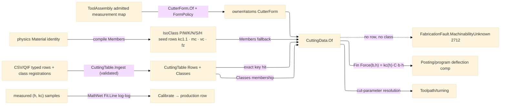

# [RASM_FABRICATION_CUTTING_DATA]

The machinability owner: the Kienzle unit-cutting-force model over the `Process/physics#CUT_PARAMETER` `Material` identity — `kc(h) = kc1.1 · h^(−mc) · C` (specific cutting force at chip thickness `h`, the `kc1.1` reference at 1 mm, the `mc` chip-thickness exponent, and `C` the multiplicative `KienzleCorrection` factor for rake angle, tool wear, cutting speed, and coolant the bare power law omits) — the physically-grounded force model that replaces every magic force constant downstream: `Posting/program`'s deflection compensation reads its radial force off `CuttingData.Force(b, h)` and `Toolpath/turning` its cut-parameter resolution. Seed-data policy is law: this page AUTHORS the column schema, the ISO 513 material-class row keys (`P` steel · `M` stainless · `K` cast iron · `N` non-ferrous · `S` superalloy · `H` hardened), and ONE physically-sourced representative seed row per class (handbook-range `kc1.1`/`mc` plus per-operation surface-speed and feed-per-tooth columns); per-material/per-operation PRODUCTION rows enter ONLY through the typed CSV/QIF data-INGRESS arm — never hand-transcribed vendor cards (the FreeCAD card set is copyright-excluded; its `kc` SCHEMA is the reference). Class membership is two-tier: the compile-time `Members` sets bind the physics axis rows the seed knows, and the `CuttingTable.Classes` map admits material→class membership as ingress DATA, so a runtime-admitted material class-resolves without a code edit. A lookup missing a production row, a table class, and a compile-time membership returns `MachinabilityUnknown` 2712 — never a silent default.

The page also owns the `CutterForm.Of(ToolAssembly)` projection (ruling 2): the owner#atoms `CutterForm` value TYPE lives on `Process/owner#FABRICATION_OWNER`; THIS page projects it from the assembly's ADMITTED measurement map (`Measure(nameof(CuttingDiameterMeasurement))` → diameter, `CornerRadiusMeasurement` → corner radius, `ToolCuttingEdgeAngleMeasurement` → taper angle, `UsableLengthMaxMeasurement` → flute length, `PointAngleMeasurement` presence → drill, `ChamferWidthMeasurement` presence → chamfer; ball at half-diameter corner radius, flat at zero, bull between, taper on a nonzero edge angle — every cutoff a `FormPolicy` value, never a raw literal) as a C# 14 static extension member, so the four `CutterForm` consumers (surface/removal/guard/cuttingdata) read the atoms type and the `owner→cuttingdata→magazine→owner` cycle never forms. A thread mill carries no discriminating measurement in the consumed ISO-13399 slice, so its family arrives as production-row DATA (`CuttingRow.Family`), never a name probe. Calibration is a growth arm on the same owner: measured `(h, kc)` force samples fit `kc1.1`/`mc` by log-log least squares over MathNet `Fit.Line`, so a shop's measured force data tightens the class seed into a production row through the same ingress.

Wire posture: HOST-LOCAL. Cutting data crosses only the in-process seam to the posting/turning consumers; the ingress arm admits typed rows (the CSV/QIF PARSE is an app-boundary concern); no table type sits between wire and rail.

## [01]-[INDEX]

- [01]-[CUTTING_DATA]: owns the `IsoClass` ISO 513 axis (six class rows with `kc1.1`/`mc` + per-operation speed/feed columns and the `Material` membership sets), the `KienzleCorrection` factor row, the `CuttingRow` production row, the `CuttingTable` seed + ingress admission with its `Classes` membership map, the `CuttingData` receipt with its `Kc(h)`/`Force(b, h)` rails, the `CuttingData.Of(Material, CutterForm, Operation)` resolution, the `CutterForm.Of(ToolAssembly)` projection with its `FormPolicy` classification values, and the MathNet log-log calibration arm.

## [02]-[CUTTING_DATA]

- Owner: `IsoClass` `[SmartEnum<string>]` the ISO 513 machinability-class axis — each row binding its representative `kc1.1`/`mc`, its per-`Operation` `(SurfaceSpeed, FeedPerTooth)` map, and its `Members` `Set<Material>` (the physics identities the seed covers; a non-metal material belongs to NO class and resolves only through a production row); `KienzleCorrection` the multiplicative factor row (`Rake`/`Wear`/`Speed`/`Coolant`, `Canonical` identity) whose product scales `kc`; `CuttingRow` the typed production row (`Material` + `CutterFamily` + `Operation` keys, `kc1.1`/`mc`/speed/feed values, `Option<IsoClass>` class registration); `CuttingTable` the immutable admitted state (`Rows` production map + `Classes` material→class membership map; `Seed` = the six class rows alone; `Ingest` folds validated rows and registrations in, returning a NEW table); `CuttingData` the resolved machinability receipt carrying `Kc11`/`Mc`/`SurfaceSpeed`/`FeedPerTooth`/`Correction` + the `ClassFallback` provenance flag + the `Kc(h)`/`Force(b, h)` rails; `FormPolicy` the classification-cutoff values; the `CutterForm.Of(ToolAssembly)` static extension projection.
- Cases: `IsoClass` rows 6 — `P` (1680, 0.26) · `M` (2350, 0.21) · `K` (1020, 0.25) · `N` (830, 0.23) · `S` (1370, 0.21) · `H` (2800, 0.25) — ONE representative seed row per class, handbook-sourced, production precision entering only through ingress; resolution order in `Of`: exact production row `(material, form.Family, operation)` → table `Classes` membership → compile-time `Members` membership → `MachinabilityUnknown` 2712; the class fallback is ADMISSIBLE (a physically-sourced representative), a hardcoded constant is not.
- Entry: `public static Fin<CuttingData> CuttingData.Of(Material material, CutterForm form, Operation operation, CuttingTable table)` (the seed-table overload binds `CuttingTable.Seed`; the correction overload threads a `KienzleCorrection`) — routes `FabricationFault.MachinabilityUnknown(material, operation)` when no row and no membership resolves; `public static CutterForm CutterForm.Of(ToolAssembly assembly, FormPolicy? policy = null)` the admitted-map projection; `public static Fin<CuttingTable> CuttingTable.Ingest(CuttingTable table, Seq<CuttingRow> rows)` the typed data-ingress arm rejecting a non-positive `kc1.1`/`mc`/speed/feed row with `GeometryFault.DegenerateInput`; `public static Fin<(double Kc11, double Mc)> Calibrate(Seq<(double H, double Kc)> samples)` the MathNet log-log fit.
- Auto: `Of` keys the production map by `(material.Key, form.Family.Key, operation.Key)`; a hit builds `CuttingData` with `ClassFallback: false`; a miss resolves the material's class through `table.Classes` then the `IsoClass.Members` rows, reads the class `kc1.1`/`mc` and the per-operation `(vc, fz)` column, and builds with `ClassFallback: true`; no resolution routes the typed fault. `Force(b, h) = Kc(h)·b·h` rides the `Fin` rail — a non-positive chip thickness or width is the typed `GeometryFault.DegenerateInput`, never a reference-force fallback the downstream deflection silently scales. `CutterForm.Of` reads the admitted measurement map minted at `Tooling/magazine.Admit` — one coercion, one owner, zero provider types. `Ingest` validates every row, folds it over the rows map (last-write-wins per key), and registers each row's `Class` into the membership map; the table is immutable, the caller carrying the new table as policy state.
- Receipt: `CuttingData` IS the typed machinability evidence — the Kienzle pair, the correction row, the operation columns, and the `ClassFallback` provenance flag consumers surface in traveler spec rows; no generic machinability ledger, no untyped card rows.
- Packages: `Process/physics#CUT_PARAMETER` (`Material`/`Operation` — composed), `Tooling/magazine#TOOL_MAGAZINE` (`ToolAssembly` — the admitted-map projection source), `Process/owner#FABRICATION_OWNER` (`CutterForm`/`CutterFamily` — the atoms type), `MathNet.Numerics` (`Fit.Line` log-log calibration — the `.api` shared catalogue), Thinktecture.Runtime.Extensions, LanguageExt.Core, BCL inbox.
- Growth: a new machinability class is one `IsoClass` row; a new production row or class membership is DATA through `Ingest`, never a code edit; a QIF MeasurementResults feed is the same ingress arm with an upstream parse; a new force consumer reads `Force`/`Kc`, never a local constant; a per-form exponent is the `Mc` column the production key already discriminates; a new correction axis is one `KienzleCorrection` field; zero new surface.
- Boundary: this page is the ONE machinability owner and a per-generator SFM/chip-load literal, a resurrected physics-page cell table, or a magic force coefficient downstream is the deleted form — force reads `CuttingData.Force`; seed rows are CLASS representatives and hand-transcribed vendor cards are the copyright-excluded rejected form — production precision is ingress DATA; a lookup never silently defaults — `MachinabilityUnknown` 2712 is the typed miss and a non-physical chip input is the typed `DegenerateInput`, never a fallback scalar; the `CutterForm` TYPE is owner#atoms' and re-declaring it here is the cycle-forming deleted form — this page owns only the projection, its family discriminants are measured geometry and policy values, and a tool-name prefix probe is the rejected stringly dispatch; the ingress admits TYPED rows and a stringly card parser in this folder is the rejected form (the file parse is the app boundary's); `Calibrate` composes MathNet and a hand-rolled least-squares is the deleted form.

```csharp signature
// --- [RUNTIME_PRELUDE] ----------------------------------------------------------------------------------------------------------------------------
using LanguageExt;
using LanguageExt.Common;
using MathNet.Numerics;
using MTConnect.Assets.CuttingTools.Measurements;
using Rasm.Fabrication.Process;
using Rasm.Numerics;
using Thinktecture;
using static LanguageExt.Prelude;

namespace Rasm.Fabrication.Tooling;

// --- [TYPES] --------------------------------------------------------------------------------------------------------------------------------------
// ISO 513 machinability classes: ONE physically-sourced representative seed row per class (kc1.1 N/mm², mc,
// per-operation vc m/min + fz mm/tooth); production rows and memberships enter ONLY through CuttingTable.Ingest.
[SmartEnum<string>]
public sealed partial class IsoClass {
    public static readonly IsoClass P = new("p", kc11: 1680.0, mc: 0.26, Ops(180.0, 0.08), Set(Material.MildSteel));
    public static readonly IsoClass M = new("m", kc11: 2350.0, mc: 0.21, Ops(120.0, 0.05), Set(Material.Stainless));
    public static readonly IsoClass K = new("k", kc11: 1020.0, mc: 0.25, Ops(200.0, 0.10), Set<Material>());
    public static readonly IsoClass N = new("n", kc11: 830.0, mc: 0.23, Ops(500.0, 0.10), Set(Material.Aluminium));
    public static readonly IsoClass S = new("s", kc11: 1370.0, mc: 0.21, Ops(45.0, 0.04), Set(Material.Titanium));
    public static readonly IsoClass H = new("h", kc11: 2800.0, mc: 0.25, Ops(80.0, 0.05), Set<Material>());

    public double Kc11 { get; }
    public double Mc { get; }
    public Map<Operation, (double SurfaceSpeed, double FeedPerTooth)> PerOperation { get; }
    public Set<Material> Members { get; }

    // The class representative scales every physics Operation row off the contour column — one column per
    // axis row, so the class fallback is total over legal operations; production rows displace per key.
    static Map<Operation, (double, double)> Ops(double vc, double fz) =>
        Map((Operation.Contour, (vc, fz)), (Operation.Pocket, (0.9 * vc, 0.8 * fz)), (Operation.Slot, (0.8 * vc, 0.7 * fz)),
            (Operation.Face, (1.1 * vc, 1.5 * fz)), (Operation.Drill, (0.6 * vc, 0.6 * fz)), (Operation.Bore, (0.7 * vc, 0.8 * fz)),
            (Operation.Ream, (0.4 * vc, 1.5 * fz)), (Operation.Tap, (0.15 * vc, 0.0)), (Operation.Chamfer, (0.9 * vc, 0.6 * fz)),
            (Operation.Trochoidal, (1.2 * vc, 1.1 * fz)));
}

// --- [MODELS] -------------------------------------------------------------------------------------------------------------------------------------
// Multiplicative Kienzle correction: rake-angle, flank-wear, cutting-speed, and coolant factors over the bare
// power law; Canonical is the identity so an uncorrected read is the seed semantics unchanged.
public readonly record struct KienzleCorrection(double Rake, double Wear, double Speed, double Coolant) {
    public static readonly KienzleCorrection Canonical = new(1.0, 1.0, 1.0, 1.0);

    public double Factor => Rake * Wear * Speed * Coolant;
}

public readonly record struct CuttingRow(Material Material, CutterFamily Family, Operation Op, double Kc11, double Mc, double SurfaceSpeed, double FeedPerTooth, Option<IsoClass> Class = default);

// Immutable admitted state: Rows the production map, Classes the ingress-registered material→class membership
// bridging runtime-admitted materials to a class seed without a code edit.
public sealed record CuttingTable(Map<(string Material, string Family, string Operation), CuttingRow> Rows, Map<string, IsoClass> Classes) {
    public static readonly CuttingTable Seed = new(Map<(string, string, string), CuttingRow>(), Map<string, IsoClass>());

    public static Fin<CuttingTable> Ingest(CuttingTable table, Seq<CuttingRow> rows) =>
        rows.Find(static r => r.Kc11 <= 0.0 || r.Mc <= 0.0 || r.SurfaceSpeed <= 0.0 || r.FeedPerTooth <= 0.0).Match(
            Some: bad => Fin.Fail<CuttingTable>(GeometryFault.DegenerateInput($"cutting-data:non-positive-row:{bad.Material.Key}").ToError()),
            None: () => Fin.Succ(rows.Fold(table, static (acc, r) => new CuttingTable(
                acc.Rows.AddOrUpdate((r.Material.Key, r.Family.Key, r.Op.Key), r),
                r.Class.Match(Some: c => acc.Classes.AddOrUpdate(r.Material.Key, c), None: () => acc.Classes)))));
}

public sealed record CuttingData(double Kc11, double Mc, double SurfaceSpeed, double FeedPerTooth, KienzleCorrection Correction, bool ClassFallback) {
    // Kienzle unit cutting force at chip thickness h (mm): kc = kc1.1 · h^(−mc) · C — non-physical input is a
    // typed failure, never a reference-force fallback the downstream deflection silently scales.
    public Fin<double> Kc(double h) =>
        h > 0.0 ? Fin.Succ(Kc11 * Math.Pow(h, -Mc) * Correction.Factor)
                : Fin.Fail<double>(GeometryFault.DegenerateInput($"cutting-data:chip:{h}").ToError());

    public Fin<double> Force(double b, double h) =>
        b > 0.0 ? Kc(h).Map(kc => kc * b * h)
                : Fin.Fail<double>(GeometryFault.DegenerateInput($"cutting-data:width:{b}").ToError());

    public static Fin<CuttingData> Of(Material material, CutterForm form, Operation operation) => Of(material, form, operation, CuttingTable.Seed);

    public static Fin<CuttingData> Of(Material material, CutterForm form, Operation operation, CuttingTable table, KienzleCorrection? correction = null) =>
        table.Rows.Find((material.Key, form.Family.Key, operation.Key)).Match(
            Some: row => Fin.Succ(new CuttingData(row.Kc11, row.Mc, row.SurfaceSpeed, row.FeedPerTooth, correction ?? KienzleCorrection.Canonical, ClassFallback: false)),
            None: () => table.Classes.Find(material.Key)
                .BiBind(Some, () => toSeq(IsoClass.Items).Find(c => c.Members.Contains(material)))
                .Bind(c => c.PerOperation.Find(operation).Map(op =>
                    new CuttingData(c.Kc11, c.Mc, op.SurfaceSpeed, op.FeedPerTooth, correction ?? KienzleCorrection.Canonical, ClassFallback: true)))
                .ToFin(FabricationFault.MachinabilityUnknown(material, operation).ToError()));

    // Log-log least squares over MathNet: ln kc = ln kc1.1 − mc·ln h — measured force samples tighten a
    // class seed into a production row through the same ingress.
    public static Fin<(double Kc11, double Mc)> Calibrate(Seq<(double H, double Kc)> samples) =>
        samples.Count < 2 || samples.Exists(static s => s.H <= 0.0 || s.Kc <= 0.0)
            ? Fin.Fail<(double, double)>(GeometryFault.DegenerateInput("cutting-data:calibrate:insufficient").ToError())
            : Fin.Succ(Fit.Line(samples.Map(static s => Math.Log(s.H)).ToArray(), samples.Map(static s => Math.Log(s.Kc)).ToArray()))
                .Map(static fit => (Math.Exp(fit.Item1), -fit.Item2));
}

// Classification cutoffs as policy values: the ball tolerance, taper floor, and zero-radius epsilon are
// declared once — a raw literal inside the projection body is the rejected form.
public readonly record struct FormPolicy(double TaperFloorDeg, double BallTolMm, double ZeroMm) {
    public static readonly FormPolicy Canonical = new(TaperFloorDeg: 0.5, BallTolMm: 1e-6, ZeroMm: 1e-9);
}

// --- [OPERATIONS] ---------------------------------------------------------------------------------------------------------------------------------
// CutterForm.Of(ToolAssembly): the admitted-map projection onto the owner#atoms CutterForm (ruling 2) — a
// C# 14 static extension member; drill/chamfer discriminate by measurement PRESENCE, ball/bull/flat/taper by
// measured geometry against FormPolicy; a thread mill's family is production-row DATA (no ISO-13399 pitch
// measurement rides the consumed slice), never a name probe.
public static class CutterFormProjection {
    extension(CutterForm) {
        public static CutterForm Of(ToolAssembly assembly, FormPolicy? policy = null) {
            FormPolicy p = policy ?? FormPolicy.Canonical;
            double d = assembly.Measure(nameof(CuttingDiameterMeasurement)).IfNone(assembly.Tool.Diameter);
            double cr = assembly.Measure(nameof(CornerRadiusMeasurement)).IfNone(assembly.Tool.CornerRadius);
            double taper = assembly.Measure(nameof(ToolCuttingEdgeAngleMeasurement)).IfNone(0.0);
            double flute = assembly.Measure(nameof(UsableLengthMaxMeasurement)).IfNone(assembly.Stickout);
            CutterFamily family =
                assembly.Measure(nameof(PointAngleMeasurement)).IsSome ? CutterFamily.Drill
                : assembly.Measure(nameof(ChamferWidthMeasurement)).IsSome ? CutterFamily.Chamfer
                : taper > p.TaperFloorDeg ? CutterFamily.Taper
                : cr <= p.ZeroMm ? CutterFamily.Flat
                : Math.Abs(cr - 0.5 * d) <= p.BallTolMm ? CutterFamily.Ball
                : CutterFamily.Bull;
            return new CutterForm(family, d, cr, taper, flute);
        }
    }
}
```


