# [RASM_FABRICATION_CUTTING_DATA]

The machinability owner resolves the Kienzle unit-cutting-force model and an operation-typed cutting regime over the `Process/physics#CUT_PARAMETER` axes. `kc(h) = kc1.1 · h^(−mc) · C` binds the specific cutting force at chip thickness `h`, the `kc1.1` reference at `1 mm`, the `mc` chip-thickness exponent, and the multiplicative `KienzleCorrection` axes for rake, wear, speed, and coolant. `CutRegime` binds surface speed to an explicit `FeedBasis`: milling, engraving, form-milling, and sawing rows carry millimetres per tooth; the hole rows and the four turning rows carry millimetres per revolution; tapping and threading rows carry pitch; grinding rows carry the surface-speed fraction. `Posting/program` and `Toolpath/turning` bind the resulting `Fin<double>` force rail and never reinterpret a feed scalar.

Seed-data policy is closed and typed. `IsoClass` owns the ISO 513 row keys (`P` steel · `M` stainless · `K` cast iron · `N` non-ferrous · `S` superalloy · `H` hardened), a representative `kc1.1`/`mc` pair, and an explicit `CutRegime` for every `Operation.Items` row — each class projects its regimes through the generated total `Operation.Map`, so a new canonical operation fails compilation at every class row until its regime is supplied; no arithmetic multiplier fabricates one process from another. Per-material/per-family/per-operation production rows enter through `CuttingTable.Ingest`, carrying their own correction and optional class registration. Resolution records the selected `CuttingRow`, runtime `(Material, IsoClass)` registration, or seeded `IsoClass` inside the matching `CuttingEvidence` case, and a lookup missing all three routes returns `MachinabilityUnknown` 2712.

The page also owns `CutterForm.Of(ToolAssembly, FormPolicy)`. The projection reads the admitted ISO-13399 measurements once, selects `CuttingDiameterMaxMeasurement` when `CuttingDiameterMeasurement` is absent, falls back to the assembly's total `NominalDiameter`/`NominalCornerRadius` `Tool.Switch` projections (the `Tool` union root carries no diameter member), bounds flute reach by `CuttingEdgeLengthMeasurement`, `UsableLengthMaxMeasurement`, and `DepthOfCutMaxMeasurement`, and classifies drill, chamfer, taper, ball, bull, and flat geometry from verified measurement presence — the taper angle is `ToolLeadAngleMeasurement` directly or `90° − KAPR` from `ToolCuttingEdgeAngleMeasurement` (a square shoulder's `KAPR = 90°` lowers to zero taper, never a raw edge angle misread as taper). `FormPolicy.DeclaredFamily` carries the production-data discriminant for thread mills because the consumed provider slice exposes no unique thread-mill measurement. A name probe and a nullable/default policy are rejected forms. Measured `(h, kc)` samples fit `kc1.1`/`mc` through MathNet `Fit.Line`, and the calibrated pair re-enters as production-row data.

Wire posture: HOST-LOCAL. Cutting data crosses only the in-process seam to the posting/turning consumers; the ingress arm admits typed rows (the CSV/QIF PARSE is an app-boundary concern); no table type sits between wire and rail.

## [01]-[INDEX]

- [01]-[CUTTING_DATA]: owns the `FeedBasis`/`CutRegime` process columns, the `IsoClass` ISO 513 axis, `KienzleCorrection`, `CuttingEvidence`, `CuttingRow`, immutable `CuttingTable`, `CuttingData` receipt and force rails, `CutterForm.Of(ToolAssembly, FormPolicy)`, and MathNet log-log calibration.

## [02]-[CUTTING_DATA]

- Owner: `FeedBasis` distinguishes per-tooth, per-revolution, and pitch feeds; `CutRegime` pairs the basis with surface speed and feed; `IsoClass` binds `kc1.1`/`mc`, an explicit operation map, and compile-time material members; `KienzleCorrection` carries the four multiplicative correction axes; `CuttingRow` carries a production key, regime, correction, and optional class registration; `CuttingTable` carries production rows plus runtime class membership; `CuttingEvidence` is the three-case provenance union carrying the selected source row or class; `CuttingData` is the resolved force-and-regime receipt; `FormPolicy` carries geometric thresholds plus the optional declared family.
- Cases: `IsoClass` rows 6 — `P` (1680, 0.26) · `M` (2350, 0.21) · `K` (1020, 0.25) · `N` (830, 0.23) · `S` (1370, 0.21) · `H` (2800, 0.25). Every row supplies one regime per `Operation.Items` row through the generated total `Operation.Map`, so the class roster and the canonical operation vocabulary cannot drift; `Toolpath/turning` resolves the per-revolution turning rows from the same map. Resolution order is exact production row → registered class → compile-time class member → `MachinabilityUnknown` 2712.
- Entry: `public static Fin<CuttingData> CuttingData.Of(Material material, CutterForm form, Operation operation, CuttingTable table)` resolves one receipt; the seed overload binds `CuttingTable.Seed`. `public static Fin<CutterForm> CutterForm.Of(ToolAssembly assembly, FormPolicy policy)` validates the projection policy and admitted geometry. `public static Fin<CuttingTable> CuttingTable.Ingest(CuttingTable table, Seq<CuttingRow> rows)` rejects non-positive physical values and contradictory class registration. `public static Fin<(double Kc11, double Mc)> Calibrate(Seq<(double H, double Kc)> samples)` fits and validates the measured pair.
- Auto: `Of` keys exact rows by `(material.Key, form.Family.Key, operation.Key)` and otherwise resolves `CuttingTable.Classes` before `IsoClass.Members`. A class row missing the requested operation is the same typed miss, not a default. `Force(b, h) = Kc(h)·b·h` rejects non-positive width or chip thickness. `Ingest` is immutable and last-write-wins per exact production key. `CutterForm.Of` consumes only the canonical measurement carrier minted by `ToolMagazine.Admit`.
- Receipt: `CuttingData` carries the Kienzle pair, explicit correction, operation regime, feed basis, and typed provenance. Consumers surface the evidence case and never infer it from a Boolean.
- Packages: `Process/physics#CUT_PARAMETER` (`Material`/`Operation` — composed), `Tooling/magazine#TOOL_MAGAZINE` (`ToolAssembly` — the admitted-map projection source), `Process/owner#FABRICATION_OWNER` (`CutterForm`/`CutterFamily` — the atoms type), `MathNet.Numerics` (`Fit.Line` log-log calibration — the `.api` shared catalogue), Thinktecture.Runtime.Extensions, LanguageExt.Core, BCL inbox.
- Growth: a new production row or class membership is data through `Ingest`; a new operation extends the explicit regime generator and every class row in the same change; a QIF measurement feed lowers to `CuttingRow`; a force consumer binds `Force`/`Kc`; a new correction axis extends `KienzleCorrection` and its factor.
- Boundary: this page is the one machinability owner. A local force coefficient, an untyped feed scalar, an operation multiplier, a Boolean provenance flag, or a silent lookup default violates the receipt. `CutterForm` remains an owner#atoms type; this page owns only its measurement projection. Family dispatch reads verified measurement presence or `FormPolicy.DeclaredFamily`, never a tool-name prefix. The ingress admits typed rows, and `Calibrate` composes MathNet instead of reimplementing least squares.

```csharp signature
// --- [RUNTIME_PRELUDE] ----------------------------------------------------------------------------------------------------------------------------
using LanguageExt;
using LanguageExt.Common;
using MathNet.Numerics;
using MTConnect.Assets.CuttingTools.Measurements;
using Rasm.Fabrication.Process;
using Rasm.Numerics;
using Thinktecture;
using static LanguageExt.Prelude;

namespace Rasm.Fabrication.Tooling;

// --- [TYPES] --------------------------------------------------------------------------------------------------------------------------------------
[SmartEnum<string>]
public sealed partial class FeedBasis {
    public static readonly FeedBasis PerTooth = new("per-tooth");
    public static readonly FeedBasis PerRevolution = new("per-revolution");
    public static readonly FeedBasis Pitch = new("pitch");
    public static readonly FeedBasis SurfaceRatio = new("surface-ratio");
}

public readonly record struct CutRegime(double SurfaceSpeed, double Feed, FeedBasis Basis);

[SmartEnum<string>]
public sealed partial class IsoClass {
    public static readonly IsoClass P = new("p", 1680.0, 0.26, Regimes(static op => op.Map(
        contour: new CutRegime(180.0, 0.08, FeedBasis.PerTooth), pocket: new CutRegime(150.0, 0.06, FeedBasis.PerTooth),
        slot: new CutRegime(120.0, 0.05, FeedBasis.PerTooth), face: new CutRegime(210.0, 0.12, FeedBasis.PerTooth),
        drill: new CutRegime(95.0, 0.18, FeedBasis.PerRevolution), bore: new CutRegime(110.0, 0.12, FeedBasis.PerRevolution),
        ream: new CutRegime(70.0, 0.22, FeedBasis.PerRevolution), tap: new CutRegime(28.0, 1.25, FeedBasis.Pitch),
        chamfer: new CutRegime(160.0, 0.05, FeedBasis.PerTooth), trochoidal: new CutRegime(220.0, 0.09, FeedBasis.PerTooth),
        roughTurn: new CutRegime(220.0, 0.30, FeedBasis.PerRevolution), finishTurn: new CutRegime(260.0, 0.12, FeedBasis.PerRevolution),
        part: new CutRegime(150.0, 0.08, FeedBasis.PerRevolution), groove: new CutRegime(160.0, 0.10, FeedBasis.PerRevolution),
        thread: new CutRegime(95.0, 1.5, FeedBasis.Pitch), counterbore: new CutRegime(75.0, 0.12, FeedBasis.PerRevolution),
        countersink: new CutRegime(60.0, 0.10, FeedBasis.PerRevolution), spotDrill: new CutRegime(90.0, 0.08, FeedBasis.PerRevolution),
        formMill: new CutRegime(110.0, 0.04, FeedBasis.PerTooth), engrave: new CutRegime(200.0, 0.02, FeedBasis.PerTooth),
        surfaceGrind: new CutRegime(1800.0, 0.01, FeedBasis.SurfaceRatio), sawCut: new CutRegime(70.0, 0.05, FeedBasis.PerTooth))),
        Set(Material.MildSteel));
    public static readonly IsoClass M = new("m", 2350.0, 0.21, Regimes(static op => op.Map(
        contour: new CutRegime(120.0, 0.05, FeedBasis.PerTooth), pocket: new CutRegime(100.0, 0.04, FeedBasis.PerTooth),
        slot: new CutRegime(80.0, 0.035, FeedBasis.PerTooth), face: new CutRegime(140.0, 0.08, FeedBasis.PerTooth),
        drill: new CutRegime(65.0, 0.14, FeedBasis.PerRevolution), bore: new CutRegime(75.0, 0.09, FeedBasis.PerRevolution),
        ream: new CutRegime(45.0, 0.18, FeedBasis.PerRevolution), tap: new CutRegime(18.0, 1.0, FeedBasis.Pitch),
        chamfer: new CutRegime(105.0, 0.035, FeedBasis.PerTooth), trochoidal: new CutRegime(145.0, 0.06, FeedBasis.PerTooth),
        roughTurn: new CutRegime(150.0, 0.25, FeedBasis.PerRevolution), finishTurn: new CutRegime(180.0, 0.10, FeedBasis.PerRevolution),
        part: new CutRegime(100.0, 0.06, FeedBasis.PerRevolution), groove: new CutRegime(110.0, 0.08, FeedBasis.PerRevolution),
        thread: new CutRegime(60.0, 1.0, FeedBasis.Pitch), counterbore: new CutRegime(50.0, 0.09, FeedBasis.PerRevolution),
        countersink: new CutRegime(40.0, 0.07, FeedBasis.PerRevolution), spotDrill: new CutRegime(60.0, 0.06, FeedBasis.PerRevolution),
        formMill: new CutRegime(75.0, 0.03, FeedBasis.PerTooth), engrave: new CutRegime(140.0, 0.015, FeedBasis.PerTooth),
        surfaceGrind: new CutRegime(1500.0, 0.008, FeedBasis.SurfaceRatio), sawCut: new CutRegime(45.0, 0.04, FeedBasis.PerTooth))),
        Set(Material.Stainless));
    public static readonly IsoClass K = new("k", 1020.0, 0.25, Regimes(static op => op.Map(
        contour: new CutRegime(200.0, 0.10, FeedBasis.PerTooth), pocket: new CutRegime(170.0, 0.08, FeedBasis.PerTooth),
        slot: new CutRegime(145.0, 0.07, FeedBasis.PerTooth), face: new CutRegime(230.0, 0.15, FeedBasis.PerTooth),
        drill: new CutRegime(125.0, 0.24, FeedBasis.PerRevolution), bore: new CutRegime(140.0, 0.16, FeedBasis.PerRevolution),
        ream: new CutRegime(85.0, 0.28, FeedBasis.PerRevolution), tap: new CutRegime(24.0, 1.5, FeedBasis.Pitch),
        chamfer: new CutRegime(175.0, 0.07, FeedBasis.PerTooth), trochoidal: new CutRegime(245.0, 0.12, FeedBasis.PerTooth),
        roughTurn: new CutRegime(250.0, 0.35, FeedBasis.PerRevolution), finishTurn: new CutRegime(300.0, 0.15, FeedBasis.PerRevolution),
        part: new CutRegime(160.0, 0.10, FeedBasis.PerRevolution), groove: new CutRegime(170.0, 0.12, FeedBasis.PerRevolution),
        thread: new CutRegime(110.0, 1.5, FeedBasis.Pitch), counterbore: new CutRegime(100.0, 0.16, FeedBasis.PerRevolution),
        countersink: new CutRegime(80.0, 0.12, FeedBasis.PerRevolution), spotDrill: new CutRegime(120.0, 0.10, FeedBasis.PerRevolution),
        formMill: new CutRegime(130.0, 0.05, FeedBasis.PerTooth), engrave: new CutRegime(220.0, 0.025, FeedBasis.PerTooth),
        surfaceGrind: new CutRegime(1600.0, 0.01, FeedBasis.SurfaceRatio), sawCut: new CutRegime(90.0, 0.06, FeedBasis.PerTooth))),
        Set<Material>());
    public static readonly IsoClass N = new("n", 830.0, 0.23, Regimes(static op => op.Map(
        contour: new CutRegime(500.0, 0.10, FeedBasis.PerTooth), pocket: new CutRegime(450.0, 0.09, FeedBasis.PerTooth),
        slot: new CutRegime(380.0, 0.08, FeedBasis.PerTooth), face: new CutRegime(600.0, 0.18, FeedBasis.PerTooth),
        drill: new CutRegime(300.0, 0.25, FeedBasis.PerRevolution), bore: new CutRegime(340.0, 0.18, FeedBasis.PerRevolution),
        ream: new CutRegime(220.0, 0.30, FeedBasis.PerRevolution), tap: new CutRegime(55.0, 1.5, FeedBasis.Pitch),
        chamfer: new CutRegime(460.0, 0.08, FeedBasis.PerTooth), trochoidal: new CutRegime(650.0, 0.13, FeedBasis.PerTooth),
        roughTurn: new CutRegime(600.0, 0.30, FeedBasis.PerRevolution), finishTurn: new CutRegime(800.0, 0.15, FeedBasis.PerRevolution),
        part: new CutRegime(350.0, 0.08, FeedBasis.PerRevolution), groove: new CutRegime(400.0, 0.10, FeedBasis.PerRevolution),
        thread: new CutRegime(250.0, 1.5, FeedBasis.Pitch), counterbore: new CutRegime(250.0, 0.18, FeedBasis.PerRevolution),
        countersink: new CutRegime(200.0, 0.14, FeedBasis.PerRevolution), spotDrill: new CutRegime(280.0, 0.12, FeedBasis.PerRevolution),
        formMill: new CutRegime(350.0, 0.06, FeedBasis.PerTooth), engrave: new CutRegime(500.0, 0.03, FeedBasis.PerTooth),
        surfaceGrind: new CutRegime(2000.0, 0.012, FeedBasis.SurfaceRatio), sawCut: new CutRegime(300.0, 0.08, FeedBasis.PerTooth))),
        Set(Material.Aluminium));
    public static readonly IsoClass S = new("s", 1370.0, 0.21, Regimes(static op => op.Map(
        contour: new CutRegime(45.0, 0.04, FeedBasis.PerTooth), pocket: new CutRegime(38.0, 0.03, FeedBasis.PerTooth),
        slot: new CutRegime(30.0, 0.025, FeedBasis.PerTooth), face: new CutRegime(52.0, 0.06, FeedBasis.PerTooth),
        drill: new CutRegime(24.0, 0.08, FeedBasis.PerRevolution), bore: new CutRegime(28.0, 0.06, FeedBasis.PerRevolution),
        ream: new CutRegime(16.0, 0.10, FeedBasis.PerRevolution), tap: new CutRegime(7.0, 0.75, FeedBasis.Pitch),
        chamfer: new CutRegime(40.0, 0.025, FeedBasis.PerTooth), trochoidal: new CutRegime(58.0, 0.045, FeedBasis.PerTooth),
        roughTurn: new CutRegime(40.0, 0.15, FeedBasis.PerRevolution), finishTurn: new CutRegime(55.0, 0.08, FeedBasis.PerRevolution),
        part: new CutRegime(25.0, 0.05, FeedBasis.PerRevolution), groove: new CutRegime(28.0, 0.06, FeedBasis.PerRevolution),
        thread: new CutRegime(18.0, 0.75, FeedBasis.Pitch), counterbore: new CutRegime(20.0, 0.06, FeedBasis.PerRevolution),
        countersink: new CutRegime(16.0, 0.05, FeedBasis.PerRevolution), spotDrill: new CutRegime(22.0, 0.04, FeedBasis.PerRevolution),
        formMill: new CutRegime(30.0, 0.02, FeedBasis.PerTooth), engrave: new CutRegime(60.0, 0.01, FeedBasis.PerTooth),
        surfaceGrind: new CutRegime(1200.0, 0.005, FeedBasis.SurfaceRatio), sawCut: new CutRegime(20.0, 0.02, FeedBasis.PerTooth))),
        Set(Material.Titanium));
    public static readonly IsoClass H = new("h", 2800.0, 0.25, Regimes(static op => op.Map(
        contour: new CutRegime(80.0, 0.05, FeedBasis.PerTooth), pocket: new CutRegime(65.0, 0.04, FeedBasis.PerTooth),
        slot: new CutRegime(52.0, 0.03, FeedBasis.PerTooth), face: new CutRegime(95.0, 0.07, FeedBasis.PerTooth),
        drill: new CutRegime(42.0, 0.09, FeedBasis.PerRevolution), bore: new CutRegime(48.0, 0.07, FeedBasis.PerRevolution),
        ream: new CutRegime(28.0, 0.11, FeedBasis.PerRevolution), tap: new CutRegime(9.0, 0.75, FeedBasis.Pitch),
        chamfer: new CutRegime(70.0, 0.03, FeedBasis.PerTooth), trochoidal: new CutRegime(105.0, 0.055, FeedBasis.PerTooth),
        roughTurn: new CutRegime(100.0, 0.12, FeedBasis.PerRevolution), finishTurn: new CutRegime(130.0, 0.06, FeedBasis.PerRevolution),
        part: new CutRegime(60.0, 0.04, FeedBasis.PerRevolution), groove: new CutRegime(65.0, 0.05, FeedBasis.PerRevolution),
        thread: new CutRegime(30.0, 0.75, FeedBasis.Pitch), counterbore: new CutRegime(35.0, 0.05, FeedBasis.PerRevolution),
        countersink: new CutRegime(28.0, 0.04, FeedBasis.PerRevolution), spotDrill: new CutRegime(40.0, 0.035, FeedBasis.PerRevolution),
        formMill: new CutRegime(55.0, 0.025, FeedBasis.PerTooth), engrave: new CutRegime(110.0, 0.012, FeedBasis.PerTooth),
        surfaceGrind: new CutRegime(1400.0, 0.006, FeedBasis.SurfaceRatio), sawCut: new CutRegime(35.0, 0.02, FeedBasis.PerTooth))),
        Set<Material>());

    public double Kc11 { get; }
    public double Mc { get; }
    public Map<Operation, CutRegime> PerOperation { get; }
    public Set<Material> Members { get; }

    // Totality by construction: the roster keys off Operation.Items and each class projects the generated exhaustive
    // Operation.Map, so a new canonical Operation row is a compile failure here until every class supplies its regime.
    static Map<Operation, CutRegime> Regimes(Func<Operation, CutRegime> regime) =>
        toMap(toSeq(Operation.Items).Map(op => (op, regime(op))));
}

// --- [MODELS] -------------------------------------------------------------------------------------------------------------------------------------
public readonly record struct KienzleCorrection(double Rake, double Wear, double Speed, double Coolant) {
    public static readonly KienzleCorrection Canonical = new(1.0, 1.0, 1.0, 1.0);

    public double Factor => Rake * Wear * Speed * Coolant;
}

public readonly record struct CuttingRow(Material Material, CutterFamily Family, Operation Op, double Kc11, double Mc,
    CutRegime Regime, KienzleCorrection Correction, Option<IsoClass> Class);

[Union(ConversionFromValue = ConversionOperatorsGeneration.None)]
public abstract partial record CuttingEvidence {
    private CuttingEvidence() { }

    public sealed record Exact(CuttingRow Row) : CuttingEvidence;
    public sealed record RegisteredClass(Material Material, IsoClass Class) : CuttingEvidence;
    public sealed record SeedClass(IsoClass Class) : CuttingEvidence;
}

public sealed class CuttingTable {
    public Map<(string Material, string Family, string Operation), CuttingRow> Rows { get; }
    public Map<string, IsoClass> Classes { get; }

    CuttingTable(Map<(string Material, string Family, string Operation), CuttingRow> rows, Map<string, IsoClass> classes) =>
        (Rows, Classes) = (rows, classes);

    public static readonly CuttingTable Seed = new(Map<(string, string, string), CuttingRow>(), Map<string, IsoClass>());

    public static Fin<CuttingTable> Ingest(CuttingTable table, Seq<CuttingRow> rows) =>
        rows.Find(static r => !double.IsFinite(r.Kc11) || r.Kc11 <= 0.0 || !double.IsFinite(r.Mc) || r.Mc <= 0.0
            || !double.IsFinite(r.Regime.SurfaceSpeed) || r.Regime.SurfaceSpeed <= 0.0
            || !double.IsFinite(r.Regime.Feed) || r.Regime.Feed <= 0.0
            || !double.IsFinite(r.Correction.Rake) || r.Correction.Rake <= 0.0
            || !double.IsFinite(r.Correction.Wear) || r.Correction.Wear <= 0.0
            || !double.IsFinite(r.Correction.Speed) || r.Correction.Speed <= 0.0
            || !double.IsFinite(r.Correction.Coolant) || r.Correction.Coolant <= 0.0).Match(
            Some: bad => Fin.Fail<CuttingTable>(GeometryFault.DegenerateInput($"cutting-data:non-positive-row:{bad.Material.Key}").ToError()),
            None: () => rows.Find(row => row.Class.Exists(@class =>
                    table.Classes.Find(row.Material.Key).Exists(existing => existing != @class)
                    || rows.Exists(peer => peer.Material == row.Material && peer.Class.Exists(peerClass => peerClass != @class))))
                .Match(
                    Some: conflict => Fin.Fail<CuttingTable>(GeometryFault.DegenerateInput(
                        $"cutting-data:class-conflict:{conflict.Material.Key}").ToError()),
                    None: () => Fin.Succ(rows.Fold(table, static (acc, row) => new CuttingTable(
                        acc.Rows.AddOrUpdate((row.Material.Key, row.Family.Key, row.Op.Key), row),
                        row.Class.Match(Some: @class => acc.Classes.AddOrUpdate(row.Material.Key, @class), None: () => acc.Classes))))));
}

public sealed record CuttingData(double Kc11, double Mc, CutRegime Regime, KienzleCorrection Correction, CuttingEvidence Evidence) {
    public double SurfaceSpeed => Regime.SurfaceSpeed;

    public double Feed => Regime.Feed;

    public FeedBasis FeedBasis => Regime.Basis;

    public Fin<double> Kc(double h) =>
        double.IsFinite(h) && h > 0.0
            ? Fin.Succ(Kc11 * Math.Pow(h, -Mc) * Correction.Factor).Bind(value => double.IsFinite(value) && value > 0.0
                ? Fin.Succ(value)
                : Fin.Fail<double>(GeometryFault.DegenerateInput($"cutting-data:kc:{h}").ToError()))
            : Fin.Fail<double>(GeometryFault.DegenerateInput($"cutting-data:chip:{h}").ToError());

    public Fin<double> Force(double b, double h) =>
        double.IsFinite(b) && b > 0.0
            ? Kc(h).Bind(kc => double.IsFinite(kc * b * h) && kc * b * h > 0.0
                ? Fin.Succ(kc * b * h)
                : Fin.Fail<double>(GeometryFault.DegenerateInput($"cutting-data:force:{b}:{h}").ToError()))
            : Fin.Fail<double>(GeometryFault.DegenerateInput($"cutting-data:width:{b}").ToError());

    public static Fin<CuttingData> Of(Material material, CutterForm form, Operation operation) => Of(material, form, operation, CuttingTable.Seed);

    public static Fin<CuttingData> Of(Material material, CutterForm form, Operation operation, CuttingTable table) =>
        table.Rows.Find((material.Key, form.Family.Key, operation.Key)).Match(
            Some: row => Fin.Succ(new CuttingData(row.Kc11, row.Mc, row.Regime, row.Correction, new CuttingEvidence.Exact(row))),
            None: () => (table.Classes.Find(material.Key).Map(c => (Class: c, Evidence: (CuttingEvidence)new CuttingEvidence.RegisteredClass(material, c)))
                | toSeq(IsoClass.Items).Find(c => c.Members.Contains(material))
                    .Map(c => (Class: c, Evidence: (CuttingEvidence)new CuttingEvidence.SeedClass(c))))
                .Bind(resolved => resolved.Class.PerOperation.Find(operation).Map(regime =>
                    new CuttingData(resolved.Class.Kc11, resolved.Class.Mc, regime, KienzleCorrection.Canonical, resolved.Evidence)))
                .ToFin(FabricationFault.MachinabilityUnknown(material, operation).ToError()));

    public static Fin<(double Kc11, double Mc)> Calibrate(Seq<(double H, double Kc)> samples) =>
        samples.Count < 2 || samples.Exists(static s => !double.IsFinite(s.H) || s.H <= 0.0 || !double.IsFinite(s.Kc) || s.Kc <= 0.0)
            ? Fin.Fail<(double, double)>(GeometryFault.DegenerateInput("cutting-data:calibrate:insufficient").ToError())
            : Fin.Succ(Fit.Line(samples.Map(static s => Math.Log(s.H)).ToArray(), samples.Map(static s => Math.Log(s.Kc)).ToArray()))
                .Map(static fit => (Kc11: Math.Exp(fit.Item1), Mc: -fit.Item2))
                .Bind(static fit => double.IsFinite(fit.Kc11) && fit.Kc11 > 0.0 && double.IsFinite(fit.Mc) && fit.Mc > 0.0
                    ? Fin.Succ(fit)
                    : Fin.Fail<(double, double)>(GeometryFault.DegenerateInput("cutting-data:calibrate:unfit").ToError()));
}

public readonly record struct FormPolicy(double TaperFloorDeg, double BallTolMm, double ZeroMm, Option<CutterFamily> DeclaredFamily) {
    public static readonly FormPolicy Canonical = new(TaperFloorDeg: 0.5, BallTolMm: 1e-6, ZeroMm: 1e-9, None);
}

// --- [OPERATIONS] ---------------------------------------------------------------------------------------------------------------------------------
public static class CutterFormProjection {
    extension(CutterForm) {
        public static Fin<CutterForm> Of(ToolAssembly assembly, FormPolicy policy) {
            double d = (assembly.Measure(nameof(CuttingDiameterMeasurement)) | assembly.Measure(nameof(CuttingDiameterMaxMeasurement)))
                .IfNone(ToolAssembly.NominalDiameter(assembly.Tool));
            double cr = assembly.Measure(nameof(CornerRadiusMeasurement)).IfNone(ToolAssembly.NominalCornerRadius(assembly.Tool));
            double taper = Math.Max(0.0, (assembly.Measure(nameof(ToolLeadAngleMeasurement))
                | assembly.Measure(nameof(ToolCuttingEdgeAngleMeasurement)).Map(static kapr => 90.0 - kapr)).IfNone(0.0));
            double flute = Math.Min(assembly.Stickout,
                Math.Min(assembly.Measure(nameof(UsableLengthMaxMeasurement)).IfNone(assembly.Stickout),
                    Math.Min(assembly.Measure(nameof(CuttingEdgeLengthMeasurement)).IfNone(assembly.Stickout),
                        assembly.Measure(nameof(DepthOfCutMaxMeasurement)).IfNone(assembly.Stickout))));
            CutterFamily family = policy.DeclaredFamily.IfNone(
                assembly.Measure(nameof(PointAngleMeasurement)).IsSome ? CutterFamily.Drill
                : assembly.Measure(nameof(ChamferWidthMeasurement)).IsSome ? CutterFamily.Chamfer
                : taper > policy.TaperFloorDeg ? CutterFamily.Taper
                : cr <= policy.ZeroMm ? CutterFamily.Flat
                : Math.Abs(cr - 0.5 * d) <= policy.BallTolMm ? CutterFamily.Ball
                : CutterFamily.Bull);
            bool invalidPolicy = !double.IsFinite(policy.TaperFloorDeg) || policy.TaperFloorDeg < 0.0
                || !double.IsFinite(policy.BallTolMm) || policy.BallTolMm <= 0.0
                || !double.IsFinite(policy.ZeroMm) || policy.ZeroMm < 0.0;
            return invalidPolicy
                ? Fin.Fail<CutterForm>(GeometryFault.DegenerateInput($"cutter-form-policy:{assembly.Identity}").ToError())
                : CutterForm.Admit(family, d, cr, taper, flute)
                    .MapFail(_ => GeometryFault.DegenerateInput($"cutter-form:{assembly.Identity}").ToError());
        }
    }
}
```

```mermaid
---
config:
  theme: base
  look: classic
  layout: elk
  flowchart:
    curve: linear
    padding: 25
  themeVariables:
    darkMode: true
    fontFamily: "SF Mono, Menlo, Cascadia Mono, Segoe UI Mono, Consolas, monospace"
    useGradient: false
    dropShadow: "none"
    primaryColor: "#44475A"
    primaryTextColor: "#F8F8F2"
    primaryBorderColor: "#BD93F9"
    lineColor: "#FF79C6"
    textColor: "#F8F8F2"
    titleColor: "#D6BCFA"
    clusterBkg: "#21222C"
    clusterBorder: "#D6BCFA"
    edgeLabelBackground: "#21222C"
    labelBackgroundColor: "#21222C"
  themeCSS: ".nodeLabel{font-size:13px;font-weight:500}.edgeLabel{font-size:12px;font-weight:500}.cluster-label .nodeLabel{font-size:13.5px;font-weight:700;letter-spacing:.08em}.edge-thickness-normal{stroke-width:2px}.edge-thickness-thick{stroke-width:3px}.edge-pattern-dashed,.edge-pattern-dotted{stroke-width:1.5px;stroke-dasharray:4 6}.node rect,.node circle,.node polygon,.node path,.node .outer-path{stroke-width:1.5px;filter:none!important}.cluster rect{stroke-width:1px!important;stroke-dasharray:5 4!important;filter:none!important}.marker path{transform:scale(.8);transform-origin:5px 5px}.marker circle{transform:scale(.48);transform-origin:5px 5px}.edgeLabel rect{transform-box:fill-box;transform-origin:center;transform:scale(1.1,1.2)}"
---
flowchart LR
    accTitle: Cutting-data resolution and calibration flow
    accDescr: Validated production rows, registered classes, seeded material classes, and measured tool form resolve one evidence-graded cutting regime or a typed fault, while measurements calibrate replacement production rows.
    Material["physics Material identity"] -->|compile Members| IsoClass["IsoClass P/M/K/N/S/H seed rows kc1.1 · mc · explicit CutRegime"]
    Ingress["CSV/QIF typed rows + class registrations"] -->|"CuttingTable.Ingest (validated)"| Table["CuttingTable Rows + Classes"]
    Table -->|exact key hit| Of["CuttingData.Of"]
    Table -->|Classes membership| Of
    IsoClass -->|Members fallback| Of
    Of eUnknown@-.->|no row, no class| Unknown["FabricationFault.MachinabilityUnknown 2712"]
    Assembly["ToolAssembly admitted measurement map"] -->|"CutterForm.Of + FormPolicy"| Form["owner#atoms CutterForm"]
    Form --> Of
    Of eProgram@-->|"Fin Force(b,h) = kc(h)·C·b·h"| Program["Posting/program deflection comp"]
    Of eTurning@-->|cut-parameter resolution| Turning["Toolpath/turning"]
    Samples["measured (h, kc) samples"] eCalibrate@-->|MathNet Fit.Line log-log| Calibrate["Calibrate → production row"]
    classDef primary fill:#44475A,stroke:#FF79C6,color:#F8F8F2
    classDef boundary fill:#282A36,stroke:#BD93F9,color:#F8F8F2
    classDef success fill:#50FA7BBF,stroke:#50FA7B,color:#282A36
    classDef error fill:#FF555580,stroke:#FF5555,color:#F8F8F2
    classDef external fill:#8BE9FDBF,stroke:#8BE9FD,color:#282A36
    classDef data fill:#FFB86CBF,stroke:#FFB86C,color:#282A36
    classDef edgeSuccess stroke:#50FA7B,color:#F8F8F2
    classDef edgeError stroke:#FF5555,stroke-width:3px,color:#F8F8F2
    classDef edgeExternal stroke:#8BE9FD,color:#F8F8F2
    class Material,Ingress,Assembly boundary
    class IsoClass,Table,Samples data
    class Of,Form primary
    class Unknown error
    class Calibrate success
    class Program,Turning external
    class eUnknown edgeError
    class eProgram,eTurning edgeExternal
    class eCalibrate edgeSuccess
```


